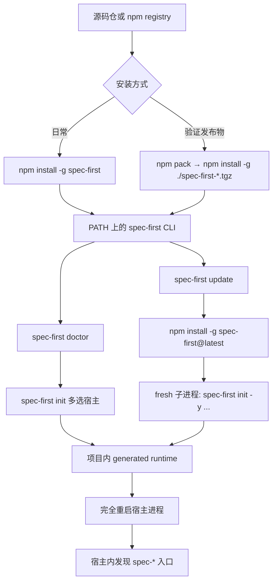
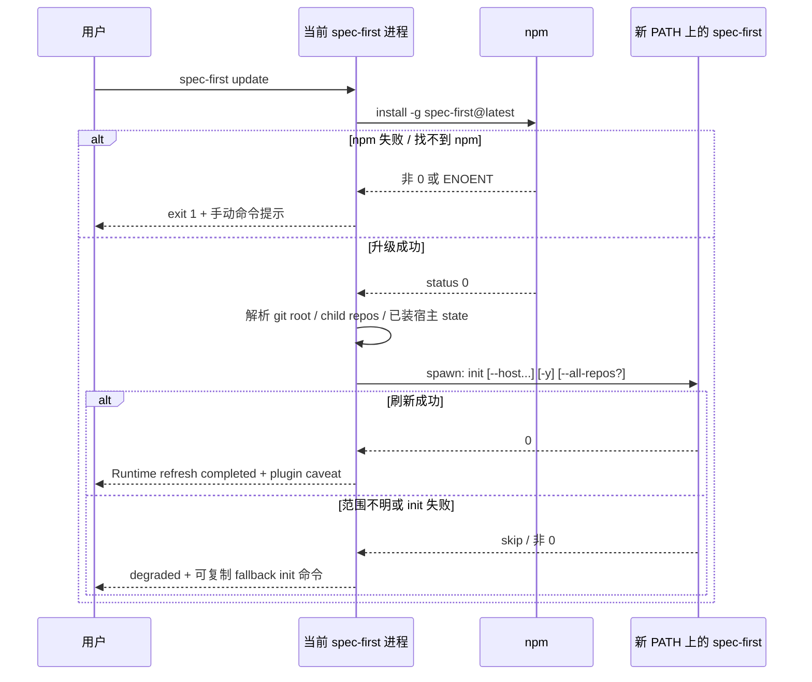

本页面向已经理解「`spec-first` 是 npm CLI + 宿主 runtime 投影」的中级开发者，专门说明两条安装路径（registry 全局安装 vs 源码 tarball 验证安装）、项目级 runtime 如何落地、以及 **`spec-first update` 如何升级 CLI 并刷新本地 runtime**。阅读完后，你应能在干净机器、源码贡献仓、以及已有 legacy 安装上，稳定完成安装、升级、验证与卸载，而不把 `init` / plugin / shell 缓存混为一谈。

若你还没跑通过五分钟上手链路，建议先回到 [五分钟上手：安装、doctor 与 init](2-wu-fen-zhong-shang-shou-an-zhuang-doctor-yu-init)；多宿主差异见 [多宿主选择：Claude Code、Codex、Kiro、Qoder 与 Cursor](3-duo-su-zhu-xuan-ze-claude-code-codex-kiro-qoder-yu-cursor)。

## 安装与升级的控制面模型

`spec-first` 的交付面分两层：**全局 CLI 包**（`npm` 装到 PATH 上的 `spec-first`）与 **项目内 generated runtime**（`spec-first init` 写入的宿主目录）。CLI 入口在 `bin/spec-first.js`，要求 Node.js `>=20`；包名与版本来自 `package.json`。日常命令面是 `doctor` / `init` / `update` / `clean`。



两层分离意味着：只升级全局包而不刷新项目 runtime，宿主仍可能跑旧 skill 镜像；只改源码仓而不 `pack`/`install -g`/`init`，PATH 与项目都不会自动变。  
Sources: [package.json](package.json#L1-L14) · [bin/spec-first.js](bin/spec-first.js#L1-L24) · [src/cli/index.js](src/cli/index.js#L162-L186) · [src/cli/node-version.js](src/cli/node-version.js#L1-L40)

## 前置条件

| 项 | 要求 | 说明 |
| --- | --- | --- |
| Node.js | `>=20.0.0` | CLI 启动与 `doctor` 的 Node 检查都以 major ≥ 20 为硬门槛 |
| npm | 在 PATH 上可用 | `update` 直接 spawn `npm` / `npm.cmd`；找不到则 exit 1 |
| Git | 在 PATH 上 | `doctor` 与 init 相关探测会读仓库事实；workspace 刷新也依赖 git root 发现 |
| 宿主 CLI | Claude Code / Codex / Cursor / Kiro / Qoder 至少其一 | 未装宿主时 `doctor` 对宿主 CLI 多为 WARNING，不阻塞 CLI 本身 |
| 工作目录 | 目标项目仓库根（或明确的 parent workspace） | runtime 写入 cwd 相对路径；`update` 也按 cwd 推断刷新范围 |

Windows 上优先 Windows Terminal + PowerShell 7+ 或原生 `cmd.exe` 做安装与 smoke；PowerShell 5.1 可用，但链式命令不要写 `&&`（应分步或用 `; if ($LASTEXITCODE -eq 0) { ... }`）。  
Sources: [package.json](package.json#L100-L103) · [src/cli/commands/doctor.js](src/cli/commands/doctor.js#L107-L147) · [src/cli/commands/update.js](src/cli/commands/update.js#L105-L117) · [README.zh-CN.md](README.zh-CN.md#L40-L72)

## 路径 A：registry 全局安装（默认）

适合日常采纳与生产项目。在任意目录执行：

```bash
npm install -g spec-first
spec-first --version   # 或 -v
which spec-first       # Windows: Get-Command spec-first / where spec-first
```

安装成功后，**第一个环境命令**应是 `spec-first doctor`，再进入目标仓库执行 `spec-first init`。`spec-first -v` 会渲染欢迎页与版本；安装期 **不依赖 postinstall 欢迎脚本**，避免 npm install-script 审计噪音。  
Sources: [docs/05-用户手册/01-快速开始.md](docs/05-用户手册/01-快速开始.md#L7-L55) · [README.zh-CN.md](README.zh-CN.md#L52-L72) · [docs/05-用户手册/06-本地源码安装.md](docs/05-用户手册/06-本地源码安装.md#L74-L88)

## 路径 B：源码打包 tarball 安装（验证发布物）

当你要确认「当前源码树打成 npm 包后是否与发布路径一致」，或在离线/内网验证候选版本时，使用 tarball 路径，而不是把仓库注册成 Claude plugin。

```bash
git clone https://github.com/sunrain520/spec-first.git
cd spec-first
npm pack
# 生成例如 spec-first-1.13.2.tgz（版本以 package.json 为准）
npm install -g ./spec-first-<version>.tgz
hash -r   # macOS/Linux；Windows 请新开终端
which spec-first && spec-first --version
```

`package.json` 的 `files` 白名单决定 tarball 内容：`bin/`、`src/`、`skills/`、`templates/`、精选 `docs/contracts/**` 与部分 scripts 等；`npm run build` 等价于 `npm pack --dry-run`，用于在不落盘的情况下核对 payload 形态。

**`./install-local.sh` 与 `./dev-reload.sh` 只打印与 npm CLI 模型一致的步骤说明**，不再写入 `~/.claude/plugins`，也不再把当前仓注册为 plugin。需要真安装时仍走 `pack` + `npm install -g`。  
Sources: [docs/05-用户手册/06-本地源码安装.md](docs/05-用户手册/06-本地源码安装.md#L34-L88) · [install-local.sh](install-local.sh#L1-L35) · [dev-reload.sh](dev-reload.sh#L1-L13) · [package.json](package.json#L16-L73)

## doctor → init → 重启：把 CLI 变成可用 workflow

### 1. doctor

```bash
spec-first doctor
# 或显式：
spec-first doctor --claude
spec-first doctor --codex
spec-first doctor --cursor
spec-first doctor --kiro
spec-first doctor --qoder
spec-first doctor --json
```

无宿主 flag 时按项目内 runtime 痕迹自动检测平台；完全未初始化时提示先 `init` 并 exit 0。人类可读输出按 common checks + 各平台段打印；`--json` 在存在 ERROR 时 exit 3。`doctor` 边界是 **CLI 安装健康、managed runtime、宿主接线、workflow verification evidence**；MCP/helper 安装仍归宿主内的 `spec-mcp-setup`。  
Sources: [src/cli/commands/doctor.js](src/cli/commands/doctor.js#L29-L105) · [src/cli/commands/doctor.js](src/cli/commands/doctor.js#L1105-L1134)

### 2. init

```bash
# 交互：多选宿主、姓名、语言，确认摘要后写入
spec-first init

# 脚本示例（非交互必须带身份等显式参数）
spec-first init --codex -y -u reviewer --lang zh
spec-first init --claude --codex -y -u reviewer --lang zh
# Kiro / Qoder / Cursor 均为 opt-in；Cursor 为 generated-runtime preview，不在 -y 默认宿主集合
spec-first init --kiro -y -u reviewer --lang zh
spec-first init --cursor -y -u reviewer --lang zh
```

`init` 把随包 skills / agents / command 模板等投影到所选宿主目录，并写入 managed state。各宿主关键路径如下（完整投影治理见 [多宿主 Runtime 投影与 pointer 文件治理](20-duo-su-zhu-runtime-tou-ying-yu-pointer-wen-jian-zhi-li)）。

| 宿主 | skills / workflows | agents / commands | managed state |
| --- | --- | --- | --- |
| Claude Code | `.claude/skills`、`.claude/spec-first/workflows` | `.claude/agents`、`.claude/commands/spec-*.md` | `.claude/spec-first/state.json` |
| Codex | `.agents/skills`（含 workflow） | `.codex/agents`（无 commands 树） | `.codex/spec-first/state.json` |
| Cursor | `.cursor/skills` | pointer：`.cursor/rules/spec-first.mdc` | `.cursor/spec-first/state.json` |
| Kiro | `.kiro/skills` | pointer：`.kiro/steering/spec-first.md` | `.kiro/spec-first/state.json` |
| Qoder | `.qoder/skills` | `.qoder/commands`、`.qoder/agents` 等 | `.qoder/spec-first/state.json` |

**Hard-cut 升级约定：** 若 `doctor` 报 `legacy managed state`，或 `clean` 拒绝迁移 legacy 安装，**不要先手删 runtime 目录**。`init` 是唯一支持的 legacy 升级入口：managed hard reset 后按当前版本全量重建。`clean` 只清理当前 schema 下的受管资产，不负责 legacy 迁移。  
Sources: [docs/05-用户手册/06-本地源码安装.md](docs/05-用户手册/06-本地源码安装.md#L90-L119) · [docs/05-用户手册/README.md](docs/05-用户手册/README.md#L40-L48) · [src/cli/state.js](src/cli/state.js#L189-L193) · [src/cli/commands/clean.js](src/cli/commands/clean.js#L155-L175) · [src/cli/adapters/claude.js](src/cli/adapters/claude.js#L48-L77) · [src/cli/adapters/codex.js](src/cli/adapters/codex.js#L41-L72)

### 3. 完全重启宿主

目录存在只证明资产已落盘，**不证明宿主进程已发现入口**。macOS 上 Claude/Codex 等需 `Cmd+Q` 或等价方式完全退出（关窗口不够），再重新启动宿主会话，然后在会话内验证 `spec-*` 入口是否出现。  
Sources: [docs/05-用户手册/06-本地源码安装.md](docs/05-用户手册/06-本地源码安装.md#L120-L140)

## 版本升级：`spec-first update`

### 行为契约（以源码为准）

当前 `update` **不是** check-only：它无条件执行 `npm install -g spec-first@latest`（npm 幂等，已最新则 no-op），成功后在 **fresh 子进程** 中跑 `spec-first init ... -y` 刷新 cwd 范围内的 runtime，避免「旧 Node 进程执行新生成逻辑」的版本错位。旧的 `--json` / 宿主 flag 检查模式已删除；多余参数 exit 2。



刷新范围解析规则摘要：

| cwd 形态 | 行为 |
| --- | --- |
| 单 Git 仓库 | 检测已装宿主 `stateFile`，生成 `init --claude|--codex|... -y` |
| 无 Git、但有 child Git 仓库的 parent workspace | 父级已有 host state 则按父刷新；否则用 child 上检测到的宿主并可能附加 `--all-repos` |
| 无法安全判定 | `args: null`，跳过自动刷新并打印 Single / Parent / Child 三套 fallback |

退出码：`0` 升级成功且刷新完成，或刷新被安全跳过并已给出 fallback 指引；`1` 升级失败或自动刷新失败；`2` 用法错误。升级成功后会尝试清理 CLI 版本提醒 cooldown；清理失败不把成功升级改成失败。  
Sources: [src/cli/commands/update.js](src/cli/commands/update.js#L16-L103) · [src/cli/commands/update.js](src/cli/commands/update.js#L132-L175) · [src/cli/commands/update.js](src/cli/commands/update.js#L249-L275) · [docs/05-用户手册/README.md](docs/05-用户手册/README.md#L29-L48)

### 非 npm-global 安装的边界

`update` **故意不做安装方式探测**：对 Claude Code plugin、pnpm、volta 等非 `npm -g` 用户，可能装出第二份冲突副本。命令结束会打印静态 caveat：plugin 场景应使用宿主侧 `claude plugin update`。源码贡献者用 tarball 覆盖全局包时，也应在升级后确认 `which spec-first` 仍指向预期前缀。  
Sources: [src/cli/commands/update.js](src/cli/commands/update.js#L26-L29) · [src/cli/commands/update.js](src/cli/commands/update.js#L95-L97)

### 版本提醒与手动升级

在 `doctor` / `init` / `clean` / `update`（非 `--help`）前，CLI 可能异步查询 registry 并提示：

```text
Update available for spec-first: <current> -> <latest>
Run `spec-first update` to upgrade, or set SPEC_FIRST_NO_UPDATE_NOTIFIER=1 to disable update checks.
```

宿主 SessionStart 类 reminder 自身是 **只读** 的，不会替你安装或刷新 runtime。需要立刻升级时在终端执行 `spec-first update`；若你坚持手动控制：

```bash
npm install -g spec-first@latest
# 然后在每个已接入项目：
spec-first init -y -u <name>   # 或显式宿主 flag
# 再完全重启宿主
```

源码验证路径的「升级」则是重新 `npm pack` + `npm install -g ./spec-first-<new-version>.tgz`，再 `init` 与重启。  
Sources: [src/cli/version-reminder.js](src/cli/version-reminder.js#L13-L37) · [src/cli/version-reminder.js](src/cli/version-reminder.js#L185-L190) · [src/cli/index.js](src/cli/index.js#L72-L86) · [docs/05-用户手册/01-快速开始.md](docs/05-用户手册/01-快速开始.md#L32-L40)

## 源码贡献时的本地闭环

修改 `skills/`、`templates/`、`src/cli/` 等 source 后，**不要手改** `.claude/`、`.agents/skills/` 等 generated mirror。推荐闭环：

```bash
# 1) 契约与测试（按需）
npm run typecheck
npm run test:unit
npm run test:smoke
npm test                  # 全量 suite 入口

# 2) 确认发布 payload
npm run build             # npm pack --dry-run
npm pack
npm install -g ./spec-first-<version>.tgz
hash -r

# 3) 目标项目刷新 runtime
spec-first doctor
spec-first init           # 或 -y + 显式宿主/身份
# 4) 完全重启宿主后再测 workflow
```

`./dev-reload.sh` 仅提醒上述模型，不会自动 link 或热加载；宿主 runtime **不支持热加载**，改 source 后必须重建镜像并重启会话。  
Sources: [docs/05-用户手册/06-本地源码安装.md](docs/05-用户手册/06-本地源码安装.md#L200-L255) · [package.json](package.json#L16-L34) · [dev-reload.sh](dev-reload.sh#L1-L13) · [README.zh-CN.md](README.zh-CN.md#L264-L287)

## 卸载与清理

```bash
# 1) 移除全局 CLI
npm uninstall -g spec-first

# 2) 在每个项目按宿主清理 managed assets（一次一个宿主 flag）
spec-first clean --claude
spec-first clean --codex
# 同样支持 --cursor / --kiro / --qoder

# 3) 若本地只是验证用源码树
cd .. && rm -rf spec-first

# 4) 重启宿主，避免缓存仍指向已删 skill
```

若 `clean` 检测到 legacy managed state，它会拒绝「假装迁移」并指引先 `init` 做 hard reset；之后如仍需拆除，再跑对应 `clean --<host>`。  
Sources: [docs/05-用户手册/06-本地源码安装.md](docs/05-用户手册/06-本地源码安装.md#L256-L270) · [src/cli/commands/clean.js](src/cli/commands/clean.js#L133-L175) · [src/cli/index.js](src/cli/index.js#L170-L173)

## 故障排查速查

| 现象 | 优先动作 |
| --- | --- |
| `which spec-first` 仍指向旧 pnpm/shim 路径（含历史 `packages/cli/bin/...`） | `hash -r` 或新开终端；Windows 用 `Get-Command` / `where` 核对 |
| Node 版本过低 | 升级到 Node 20+；CLI 会在入口直接拒绝 |
| `update` 报找不到 npm | 修复 PATH 或改用你自己的包管理器安装流；不要假设 `update` 会检测 volta/pnpm |
| `update` 升级成功但 refresh degraded | 复制输出中的 fallback `init` 命令；确认 cwd 是否为预期仓库/workspace |
| 宿主看不到 `spec-*` | 重新 `init` → **完全退出并重启宿主** → 再查 runtime 目录是否存在 |
| `doctor` / `clean` 提示 legacy managed state | **只**通过 `spec-first init` hard-cut 重建，勿先盲删目录 |
| `npm warn ERESOLVE...` 但仍可 `spec-first -v` | CLI 已装上；peer 警告多来自本机缓存/周边工具。必要时 `npm cache clean --force` 后重装 tarball，或 `--legacy-peer-deps` |
| 改了 skills 源码但行为不变 | 未重新 `pack`/`install -g` 或未 `init` 投影，或宿主未重启 |

```bash
# Shell 缓存
hash -r && which spec-first && spec-first doctor

# 重装本地 tarball（把 <version> 换成 npm pack 产物）
npm pack
npm install -g ./spec-first-<version>.tgz

# 重建项目 runtime
spec-first init
```

Sources: [docs/05-用户手册/06-本地源码安装.md](docs/05-用户手册/06-本地源码安装.md#L272-L357) · [src/cli/commands/update.js](src/cli/commands/update.js#L55-L90) · [src/cli/node-version.js](src/cli/node-version.js#L32-L40)

## 与相邻页面的边界

本页只覆盖 **CLI 获取、项目 runtime 首次/升级投影、卸载与安装期故障**。下列主题故意不在此展开：

- 命令语义全集与 flag 矩阵 → [CLI 控制面：init、doctor、update 与 clean](18-cli-kong-zhi-mian-init-doctor-update-yu-clean)
- MCP / provider readiness → [Runtime Setup：spec-mcp-setup 与 provider readiness](19-runtime-setup-spec-mcp-setup-yu-provider-readiness)
- Source of Truth vs generated mirror 原则 → [Source of Truth 与 Generated Runtime 分离原则](12-source-of-truth-yu-generated-runtime-fen-chi-yuan-ze)
- 首次业务走查 → [首次工作流走查：从 brainstorm 到可检查产物](4-shou-ci-gong-zuo-liu-zou-cha-cong-brainstorm-dao-ke-jian-cha-chan-wu)

## 建议阅读顺序

1. 本页完成安装或 `update` 后，用 [五分钟上手：安装、doctor 与 init](2-wu-fen-zhong-shang-shou-an-zhuang-doctor-yu-init) 复核最小成功信号。  
2. 按团队宿主矩阵阅读 [多宿主选择：Claude Code、Codex、Kiro、Qoder 与 Cursor](3-duo-su-zhu-xuan-ze-claude-code-codex-kiro-qoder-yu-cursor)。  
3. 需要理解「为何必须 init 而不能手改 runtime」时，进入 [Source of Truth 与 Generated Runtime 分离原则](12-source-of-truth-yu-generated-runtime-fen-chi-yuan-ze)。  
4. 准备跑第一条业务链路时，转到 [首次工作流走查：从 brainstorm 到可检查产物](4-shou-ci-gong-zuo-liu-zou-cha-cong-brainstorm-dao-ke-jian-cha-chan-wu) 与 [入口路由速查：按任务选择 spec-* 工作流](5-ru-kou-lu-you-su-cha-an-ren-wu-xuan-ze-spec-gong-zuo-liu)。

**行动清单（可复制）：** `npm install -g spec-first`（或 `npm pack` + 本地 tarball）→ `spec-first doctor` → 在目标仓 `spec-first init` → 完全重启宿主 → 日常升级用 `spec-first update` → 卸下用 `npm uninstall -g` + `spec-first clean --<host>`。