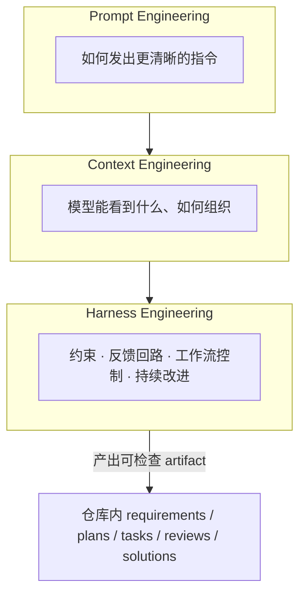
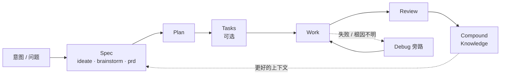
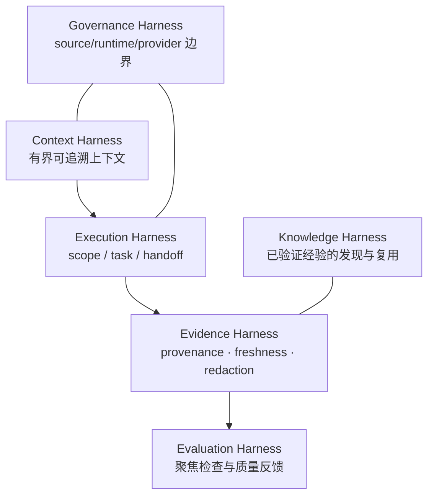
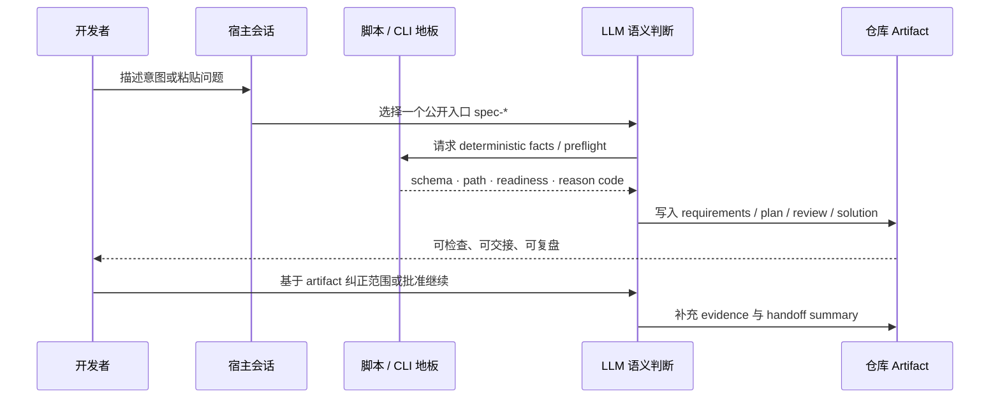

一次 AI coding 对话常常很聪明，却很难被团队信任：结论散落在聊天记录里，范围会漂移，下一会话接不上，审查也缺少可核对的证据。Spec-First 方法论要解决的不是「再写一个更长的 prompt」，而是把**不稳定的推理**约束成一条**仓库承载、可检查、可交接、可学习**的工程闭环。本文面向初学者，说明这条方法论的第一性原理、主链路心智模型，以及它为什么能让 AI 协作从「聊完即散」走向「可治理交付」。

Sources: [README.zh-CN.md](README.zh-CN.md#L18-L32) · [AGENTS.md](AGENTS.md#L30-L56) · [结构化项目角色契约.md](docs/10-prompt/结构化项目角色契约.md#L5-L31)

## 问题起点：一次性对话为什么不够

在没有 harness 的默认用法里，开发者把意图丢进聊天窗口，模型直接改代码。这条路径在小任务上很快，但在真实仓库里会反复暴露同一类缺口：

| 对话式 AI coding 的常见缺口 | 对团队的实际代价 |
| --- | --- |
| 意图只存在于会话上下文 | 换人、换宿主、换会话后无法复盘「当初承诺了什么」 |
| 没有可检查的中间产物 | 审查只能对着 diff 猜，无法对照 requirements / plan |
| 工具输出被默认为真相 | MCP、图谱、搜索结果悄悄升级成需求或根因结论 |
| 没有明确的出口证据 | 「看起来好了」与「可信任变更」之间缺少 claim 边界 |
| 经验无法沉淀 | 同类问题下次仍从零开始，系统不会越用越好 |

Spec-First 把稀缺资源重新排序：真正稀缺的不是代码行数，而是**正确意图、有效上下文、可靠反馈、验证能力与人的注意力**。方法论的目标函数因此不是「更多 agent / 更多自动化步骤」，而是更短的 **time-to-trusted-change** 与更高的 **quality-adjusted throughput**——任何局部提速若把成本转嫁给 reviewer、CI、集成或未来维护，都不算系统改善。

Sources: [AI-Coding-Harness演化方法论.md](docs/10-prompt/AI-Coding-Harness演化方法论.md#L16-L33) · [结构化项目角色契约.md](docs/10-prompt/结构化项目角色契约.md#L15-L31)

## 一句话定义：AI Coding Harness，而不是流程引擎

**Spec-First** 是面向 Claude Code、Codex、Kiro、Qoder 与 Cursor 的 **AI Coding Harness**：它把不稳定的 agent 推理收敛为有界工程循环——上下文、规格、计划、任务、代码、审查与知识。脚本强制确定性不变量并准备事实，LLM 在这层「地板」之上做语义充分性判断，证据作为持久 artifact 留在仓库里。

这里有两个必须同时记住的否定句：

- 它**不是**中心化流程引擎或刚性状态机：不会强制你永远 `plan → work → review → knowledge` 一路跑完。
- 它**不是**「再堆一层 prompt 库」：公开入口统一是 `spec-*` workflow，宿主 runtime 只是投射细节，真正治理的是契约、证据与交接边界。

Sources: [CONCEPTS.md](CONCEPTS.md#L9-L15) · [README.zh-CN.md](README.zh-CN.md#L18-L18) · [ai-coding-harness.md](docs/contracts/ai-coding-harness.md#L1-L13) · [02-核心概念.md](docs/05-用户手册/02-核心概念.md#L1-L3)

## 三层工程概念：从 Prompt 到 Harness

理解 Spec-First，先把「工程化 AI 协作」拆成三层，避免把所有问题都当成「prompt 写得不够好」。



| 层次 | 关注点 | 单独做到会怎样 | Spec-First 的补强 |
| --- | --- | --- | --- |
| Prompt Engineering | 指令清晰度 | 单次回答更好，但不可交接 | 把关键判断收进 skill 钢架与触发式 reference |
| Context Engineering | 信息相关性与边界 | 模型「知道更多」，仍可能幻觉权威 | Context Harness：有界、可追溯，禁止广播整仓与 raw dump |
| Harness Engineering | 系统如何运行与闭环 | 有流程无证据时只是仪式 | 脚本地板 + LLM 语义 + 仓库证据 + 可失效学习 |

对初学者最实用的推论是：**先确认工作是否变得可检查**（仓库里出现了可阅读的 Markdown artifact），再深入治理细节。健康的第一圈不是「agent 很多」，而是「一次 workflow 留下了下一步能读的东西」。

Sources: [02-核心概念.md](docs/05-用户手册/02-核心概念.md#L55-L63) · [README.zh-CN.md](README.zh-CN.md#L28-L32) · [ai-coding-harness.md](docs/contracts/ai-coding-harness.md#L17-L24)

## 三条第一性原理

Spec-First 的哲学可以压缩成三条互相咬合的原则。它们决定了后续所有 skill、脚本与 contract 的设计姿态。

### 1. Light contract（轻量契约）

顶层契约只保留**会改变决策**的 durable invariants；条件流程与实现细节按需披露。上下文追求更高的 **decision sufficiency per token**——相关、可信、新鲜、能改变当前判断——达到语义充分与证据义务后停止扩张。低风险、可逆任务允许短路径，但不得降低与 completion claim 匹配的证据义务。

### 2. Explicit boundaries（显式边界）

必须说清楚：真相从哪里来（source）、谁产生事实或 artifact（producer）、谁实际消费（consumer）、谁能决定语义或授权 mutation（authority）、可能写什么（side effect）、失败如何降级（failure）。外部工具可以提供 readiness 与日志，但**不拥有** scope、finding、root-cause、mutation 或 workflow state 的权威。

### 3. Deterministic floor, semantic judgment（确定性地板之上的语义判断）

脚本 / 工具强制可机械判定的不变量并准备事实（路径、schema、hash、readiness、reason code、artifact ref）；LLM / agent 判断意图、方案、风险与语义充分性；人 / 项目 owner 裁决价值与不可逆取舍。任何一方都不得伪造另一方的权威——脚本不能替代架构评审，LLM 也不能用自检报告替代测试与日志。

Sources: [结构化项目角色契约.md](docs/10-prompt/结构化项目角色契约.md#L51-L57) · [AGENTS.md](AGENTS.md#L45-L56) · [ai-coding-harness.md](docs/contracts/ai-coding-harness.md#L26-L34) · [AI-Coding-Harness演化方法论.md](docs/10-prompt/AI-Coding-Harness演化方法论.md#L108-L120)

## 主链路心智模型：从 Codebase 到 Knowledge

方法论服务的核心链路始终是：

```text
Codebase -> Spec -> Plan -> Tasks -> Code -> Review -> Knowledge
```

任何新能力、目录、schema、skill 或 CLI 行为，都应当服务这条链上的明确节点，或改善输入质量、上下文传递、证据留存、产物复用、审查闭环与知识沉淀。若不改善链路，就应留在核心路径之外，或做成 opt-in / session-local 能力。

Sources: [ai-coding-harness.md](docs/contracts/ai-coding-harness.md#L7-L13) · [AGENTS.md](AGENTS.md#L51-L56)

### 五阶段最小模型（初学者先记住这个）

仓库用户手册把主链路收敛成五阶段心智模型：

```text
Brainstorm -> Plan -> Work -> Review -> Compound
```

| 阶段 | 回答的问题 | 典型公开入口 | 仓库内可检查信号（示例） |
| --- | --- | --- | --- |
| Brainstorm / Spec | **WHAT** 是什么 | `spec-ideate` / `spec-brainstorm` / `spec-prd` | `docs/plans/` 需求向 unified plan，或 `docs/brainstorms/` 中的 legacy PRD |
| Plan | **HOW** 怎么做 | `spec-plan` | `docs/plans/YYYY-MM-DD-NNN-<type>-…-plan.md` |
| Tasks（可选） | 如何可执行拆分 | `spec-write-tasks` | `docs/tasks/` 派生 task pack |
| Work | 如何落地 | `spec-work`（失败旁路 `spec-debug`） | 代码变更 + 工作 closeout 证据 |
| Review | 是否可信任 | `spec-code-review` / `spec-doc-review` | `docs/reviews/` findings |
| Compound | 如何让下次更好 | `spec-compound` | `docs/solutions/` 可复用 learning |



注意：五阶段是**最小心智模型**，不是强制状态机。入口路由按当前意图选择「一个」最佳入口；active workflow 自己拥有 handoff，而不是由 harness 自动串完全程。

Sources: [02-核心概念.md](docs/05-用户手册/02-核心概念.md#L66-L121) · [using-spec-first/SKILL.md](skills/using-spec-first/SKILL.md#L14-L31) · [README.zh-CN.md](README.zh-CN.md#L105-L145)

### 当前更完整的工程闭环

在五阶段之上，实际工程闭环更完整，但仍保持「契约串联、阶段自治」：

```text
mcp-setup
  -> ideate / brainstorm / doc-review
  -> plan / write-tasks
  -> work / debug / optimize / polish
  -> code-review / app-consistency-audit
  -> compound / compound-refresh
```

准备步骤（如 `spec-mcp-setup`）写入 setup-owned facts，**不替代**后续 planning / review 的语义判断。调试、优化、App 一致性审查等是**旁路或支撑入口**，在特定风险下切入主链路，而不是把主链路拆散。

Sources: [02-核心概念.md](docs/05-用户手册/02-核心概念.md#L104-L133) · [09-首次工作流走查.md](docs/05-用户手册/09-首次工作流走查.md#L1-L12)

## 可治理意味着什么：六层 Harness

「可治理」在 Spec-First 里不是审批流，而是六类可观察、可验证的 harness 职责协同工作：



| Harness 层 | 一句话职责 | 初学者可感知的结果 |
| --- | --- | --- |
| Context | 给 LLM 有界、相关、可追溯的上下文 | 不把整仓、generated runtime 或 raw MCP dump 塞进会话 |
| Execution | 在 plan / task / work / review 间传递 scope 与 handoff | 交接有 artifact 形状，但不是隐藏状态机 |
| Evidence | 保留来源、新鲜度、限制与脱敏 | 结论可质疑，而不是「模型说了就算」 |
| Evaluation | 记录系统是否真的变好 | 关注决策相关质量，而不是调用次数 |
| Governance | 明确 source / runtime / provider 与 mutation 边界 | 修行为改 source，再 `init` 重建 runtime |
| Knowledge | 只沉淀已验证、可复用经验 | `docs/solutions/` 可被后续任务发现，而非强制全量预读 |

边界规则再压缩四条，便于日常自检：

1. **脚本 fail-closed 机械不变量**；语义充分性由 LLM 判断。  
2. **外部工具证据默认 advisory**，回源、测试、日志、契约或用户确认前不得升级为结论。  
3. **Durable artifact 必须 summary-first 且完成 redaction**，禁止把凭证、完整 private dump 写进长期文档。  
4. **Artifact 声明 authority 与 freshness**，不静默变成 workflow state。

Sources: [ai-coding-harness.md](docs/contracts/ai-coding-harness.md#L15-L45) · [CONCEPTS.md](CONCEPTS.md#L35-L37) · [CONCEPTS.md](CONCEPTS.md#L101-L103)

## 从对话到闭环：一次变更如何被「接住」

把方法论落到一次真实变更上，可以想象下面这条「对话 → 仓库 → 信任」路径：



对初学者，最小成功信号非常具体：

1. 安装 CLI 并完成 `doctor` / `init`（宿主 runtime 可重建）。  
2. 在宿主会话中运行**一个** workflow（例如 `spec-brainstorm "…"`）。  
3. 在仓库中打开新的 Markdown artifact（常见于 `docs/plans/` 或 `docs/brainstorms/`）。  

当 artifact 出现在仓库里，工作就从「聊天记录里的印象」变成了「可治理对象」：下游 plan / work / review 读取的是同一份可审查材料，而不是另一段不可复现的对话。

Sources: [README.zh-CN.md](README.zh-CN.md#L28-L32) · [README.zh-CN.md](README.zh-CN.md#L105-L120) · [09-首次工作流走查.md](docs/05-用户手册/09-首次工作流走查.md#L1-L12)

## 证据如何支撑「可信变更」

方法论对证据的态度是**claim-scoped（声明范围匹配）**：每一类结论只接受能覆盖它的证据，禁止用「测试绿灯」证明「产品决策正确」，也禁止用「多 agent 共识」证明「根因成立」。

| 结论类型 | 需要的证据形态 |
| --- | --- |
| 结构存在 | schema / source check |
| 机械行为正确 | deterministic test / log / exit code |
| 语义方案合理 | 独立 review / 人的纠正 |
| 相对方案更好 | 对照 baseline / 盲比 |
| 真实研发有效 | 有代表性的 field outcome |

默认证据通道（Direct Evidence Lanes）优先使用有界直接证据：聚焦 source-read、验证输出、handoff summary；外部工具与项目图谱只是候选导航，结论层必须回源确认。**Trusted Change** 因此是带新鲜度、可撤销的状态，而不是永久勋章——生产反例、依赖变化或新证据可以降级信任、触发回滚评估，并让关联 knowledge 失效。

Sources: [AI-Coding-Harness演化方法论.md](docs/10-prompt/AI-Coding-Harness演化方法论.md#L55-L70) · [AI-Coding-Harness演化方法论.md](docs/10-prompt/AI-Coding-Harness演化方法论.md#L122-L132) · [ai-coding-harness.md](docs/contracts/ai-coding-harness.md#L35-L45)

## 契约串联，而不是中心化状态机

早期架构快照已经点出并被当前合同延续的设计选择：**契约串联 + 阶段自治**。每个 workflow node（如 brainstorm、PRD、plan、work、debug、review、compound）拥有自己的输入、输出、artifact、失败模式与下游 handoff；下一阶段只消费上游确认过的结果，而不是依赖全局 task 状态机推进。

`using-spec-first` 作为入口治理器，进一步把「我该跑什么」变成语义地图：主链路定义 WHAT → HOW → work → review → knowledge；on-ramp 处理环境、失败、文档批评与 runtime 维护；Direct Lane 保留低风险直接执行。它**选择一个入口并让出控制权**，自己不创建 workflow artifact，也不重路由已经激活的公开 workflow。

Sources: [01-整体架构.md](docs/02-架构设计/01-整体架构.md#L12-L18) · [CONCEPTS.md](CONCEPTS.md#L13-L19) · [using-spec-first/SKILL.md](skills/using-spec-first/SKILL.md#L1-L31)

## 常见误解（以及正确读法）

| 误解 | 正确读法 |
| --- | --- |
| Spec-First = 强制瀑布流程 | 按意图选入口；小任务可走 Direct Lane，证据义务随 claim 缩放 |
| 有 artifact 就等于做对了 | Artifact 是证据与交接载体，权威与新鲜度必须显式声明 |
| 脚本会替我做架构决策 | 脚本只守机械地板；架构、优先级、finding 是否成立由 LLM / 人判断 |
| MCP / 图谱 ready 就可以当真相 | Provider readiness ≠ 语义正确；结论必须回源或测试确认 |
| 生成 runtime 可以手改「修好」 | Source 才是真相；改 source 后 `spec-first init` 重建镜像 |
| Compound 是写日记 | 只沉淀已验证、可复用、带失效条件的 learning |

Sources: [ai-coding-harness.md](docs/contracts/ai-coding-harness.md#L26-L34) · [source-runtime-customization-boundary.md](docs/contracts/source-runtime-customization-boundary.md#L9-L55) · [CONCEPTS.md](CONCEPTS.md#L127-L137) · [AI-Coding-Harness演化方法论.md](docs/10-prompt/AI-Coding-Harness演化方法论.md#L168-L181)

## 方法论演化时的判断顺序

当你自己扩展 harness、写新 skill 或争论「要不要加一个 gate」时，沿用同一条主线，避免从工具出发找用途：

```text
Outcome -> Bottleneck -> Evidence -> Boundary
  -> Minimum Mechanism -> Bounded Loop -> Exit Proof -> Field Learning
```

最终只问一句：

> 它是否用**最小可维护机制**，更快地把正确意图变成**可复核、可恢复、可撤销、可学习**的可信结果，同时没有把隐藏成本转移给人、集成系统或未来维护？

答案不清楚时，优先补证据、收窄范围或保持实验——不要用更多自动化掩盖不确定性。

Sources: [AI-Coding-Harness演化方法论.md](docs/10-prompt/AI-Coding-Harness演化方法论.md#L35-L47) · [AI-Coding-Harness演化方法论.md](docs/10-prompt/AI-Coding-Harness演化方法论.md#L210-L220)

## 小结：你现在应建立的心智图

1. **问题**：一次性对话不可交接、不可检查、不可学习。  
2. **答案**：AI Coding Harness——仓库承载的 Spec → Plan → Tasks → Code → Review → Knowledge 闭环。  
3. **分工**：脚本守确定性地板；LLM 做语义判断；人裁决价值与不可逆风险。  
4. **形态**：轻量契约 + 显式边界 + 阶段自治的 workflow node，而不是中心状态机。  
5. **成功信号**：宿主里跑通一个 `spec-*`，仓库里出现可阅读的 artifact。  

下一层细节（词汇表、门禁与 LLM 职责切分、source/runtime 分离）属于相邻页面；主链路各节点的操作说明则在「主链路工作流」分组中展开。

Sources: [README.zh-CN.md](README.zh-CN.md#L18-L32) · [AGENTS.md](AGENTS.md#L40-L56) · [02-核心概念.md](docs/05-用户手册/02-核心概念.md#L104-L121)

## 建议阅读路径

按目录结构，建议这样继续：

1. 先巩固词汇边界：[核心词汇：Skill、Workflow、Artifact 与证据边界](10-he-xin-ci-hui-skill-workflow-artifact-yu-zheng-ju-bian-jie)  
2. 再理解脚本与 LLM 的职责切分：[确定性门禁与语义判断：脚本地板之上的 LLM 职责](11-que-ding-xing-men-jin-yu-yu-yi-pan-duan-jiao-ben-di-ban-zhi-shang-de-llm-zhi-ze)  
3. 然后建立 source / runtime 纪律：[Source of Truth 与 Generated Runtime 分离原则](12-source-of-truth-yu-generated-runtime-fen-chi-yuan-ze)  
4. 若要动手走主链路，从需求澄清开始：[需求澄清：ideate、brainstorm 与 Product Contract](13-xu-qiu-cheng-qing-ideate-brainstorm-yu-product-contract)  
5. 棕地与实现侧可分别进入：[棕地 PRD：spec-prd 的 grill、write 与 readiness 闭环](14-zong-di-prd-spec-prd-de-grill-write-yu-readiness-bi-huan) → [实现规划：spec-plan 如何把 WHAT 充实为 HOW](15-shi-xian-gui-hua-spec-plan-ru-he-ba-what-chong-shi-wei-how)  
6. 需要「我现在该跑哪个入口」时，回到路由页：[入口路由速查：按任务选择 spec-* 工作流](5-ru-kou-lu-you-su-cha-an-ren-wu-xuan-ze-spec-gong-zuo-liu) 或使用宿主内的 `using-spec-first`  

若你尚未完成安装与第一次 artifact，可先回到快速开始：[五分钟上手：安装、doctor 与 init](2-wu-fen-zhong-shang-shou-an-zhuang-doctor-yu-init) 与 [首次工作流走查：从 brainstorm 到可检查产物](4-shou-ci-gong-zuo-liu-zou-cha-cong-brainstorm-dao-ke-jian-cha-chan-wu)。