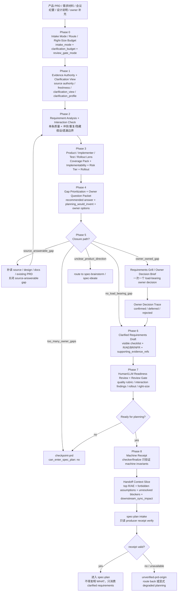

# spec-prd 研发侧需求澄清与计划准入优化方案

## 0. 结论

当前 `spec-prd` 的定位不是“替产品写 PRD”或“生成一份更专业的产品需求文档”，而是 **研发侧 PRD intake / 需求澄清 / planning-readiness workflow**。产品提供需求文档、会议纪要、设计说明或口头补充后，研发需要基于现有系统事实理解需求、识别会影响开发/测试/排期的歧义、向产品/owner 澄清、记录决策，再判断是否可以进入 `spec-plan`。

因此，`spec-prd` 的优势不是“模板丰富”，而是 brownfield source-first、Requirements Grill、OQ closure、ready receipt 这些机制能阻止 `spec-plan` 发明 WHAT。它应该把产品 PRD 当作输入和业务 source，而不是替换它；输出应是研发可执行的需求澄清包、owner decision trace、验收样例、scope boundary 和 plan handoff readiness。

当前缺口应重述为三类：

1. **输入权威边界不够显式**：产品 PRD、owner 决策、现有代码事实、设计源、研发判断的 authority 不够分层，容易把“产品原文”“研发补充”“模型假设”混在一起。
2. **脚本越界摩擦**：`check-prd-artifact.js` 用英文 section token 判 core section 存在，多语言澄清产物需要保留 `Summary` 等英文锚点，导致中文输出反复校准。用户最新反馈是正确的：**可以展示澄清 checklist，但不要用脚本判断 checklist 内容质量或语义充分性**。
3. **研发澄清覆盖度不够一等化**：用户/问题/目标/成功口径本应由产品提供，但研发必须澄清会影响实现的业务规则、权限、状态、异常、数据、依赖、NFR、验收、发布与运营边界；当前这些维度还偏 conditional 或 scattered，不足以稳定进入开发计划。

最终建议：

- **产物策略**：采用“单一 runtime workflow contract + 多套显式 engineering clarification checklist”。保留 Generic/App/H5-PC/Admin/Backend/CLI/Mixed 多端澄清视图，但不要恢复 `skills/spec-prd/templates/standard/*` 作为 packaged runtime 必读树，也不要让脚本按 checklist 内容打分。
- **脚本策略**：脚本只守机器不变量和安全出口，如 `artifact_kind`、路径边界、ready receipt、hash freshness、source input 可读性、OQ/Owner Trace 结构一致性、危险 ready 自证。澄清充分性、surface 专属内容、行业 checklist、研发可执行性由 LLM readiness、doc-review/fresh-source eval、人工/多角色审查负责。
- **多语言策略**：把英文标题锚点迁移为语言无关的轻量 section id 或把 core section presence 从 blocking 降级为 advisory；中文澄清产物应允许纯中文标题，不再为了脚本保留英文 token。
- **澄清策略**：新增 Engineering Clarification Coverage Pack（原 Professional PRD Completeness Pack 的定位修正），要求每个研发澄清产物显式说明：产品目标是否来自产品 source、当前系统事实、变更范围、业务规则、状态/权限/异常、NFR/约束、验收覆盖、风险依赖、发布/运营边界、owner 决策与未决问题。
- **研发可执行策略**：吸收用户提供的深度 PRD 提示词方法论，但不把 11 章大模板硬塞进所有澄清产物。它应成为 `engineering-implementability` 条件 lens：当需求是 UI-heavy / greenfield / tool / export-heavy / 需要 AI/研发直接实现的模块时，要求研发澄清真实内容 ASCII、模块状态清单、交互失败路径、可度量性能指标、P0-P3 用户影响优先级和开发者交接说明；当需求只是 brownfield 小增量时，只采纳其中对当前 slice 有用的维度。
- **质量策略**：补充 requirements-quality rubric、风险分级 overlay、Living requirements intake lifecycle、跨产物 traceability 和优化效果指标；这些只作为 LLM/readiness/doc-review/eval 判断，不进入脚本语义打分。
- **稳定性策略**：保留 prewrite/readiness/finalize 机制，但把 `check-prd-artifact --stdin` 收缩为机器字段 dry-run；补 `spec-plan` 消费端只读检查；明确 Codex 没有 Claude PRD hooks 的降级边界。

## 1. 目标与非目标

### 1.1 Goals

- 让 `$spec-prd` 能稳定接收产品提供的需求文档、会议纪要、设计说明和 owner 补充，完成研发侧理解、澄清、决策追踪和计划准入判断。
- 在进入 `spec-plan` 前尽早确认会影响开发/测试/排期的细节：变更范围、业务规则、验收、异常、权限、状态、数据、合规、依赖、非功能、发布与运营边界。
- 让不同端需求有明确研发澄清视图：Generic、App、H5/PC、Admin、Backend、CLI/DevTool、Mixed。
- 让复杂产品 PRD 在研发侧形成可执行的澄清包：有真实状态、真实交互、失败路径、可观察验收、数字化 NFR 和明确交接边界。
- 保持 spec-first 的 core boundary：Scripts prepare, LLM decides。脚本给事实，不判断语义专业度。
- 让中文研发澄清产物可自然使用中文标题和中文 checklist，不再为了脚本 token 反复调标题。

### 1.2 Non-goals

- 不把 `spec-prd` 变成 0-1 产品探索；不清楚 WHAT 时仍 route to `spec-brainstorm` 或 `spec-ideate`。
- 不替产品经理写需求文档，不替代产品 PRD，也不把产品 PRD 改写成另一份 canonical 业务需求。
- 不让研发澄清产物写完整实现方案、接口字段、数据库 schema、任务拆解，这些归 `spec-plan`。
- 不把技术架构、依赖库、包体积、组件拆分、数据库 schema 作为所有澄清产物的必填内容；只有当它们是产品约束、平台限制、输出格式或用户可见能力时，才进入澄清。
- 不要求所有澄清产物固定输出用户提示词里的 11 章；章节深度跟随风险、端族、产品复杂度和 downstream ambiguity，而不是模板位置。
- 不建立复杂 schema 状态机或模板全文生成器。
- 不让脚本评判“产品 PRD 是否专业”“checklist 内容质量是否充分”“是否满足 App/Admin/Backend 完整模板”。
- 不把证券行业 overlay 当通用行业事实或法务/合规意见。

### 1.3 Requirements Trace

本方案进入 `spec-plan` 前必须保持下面的需求追踪。每条 R 都需要至少一个 AE 或验证方式；后续 plan/task 不应只从叙述段落中推断范围。

| ID | Requirement | Acceptance / verification | Priority | Evidence posture |
| --- | --- | --- | --- | --- |
| R-01 | `$spec-prd` 澄清前必须选择并展示 `clarification_view`，并把 selected human-facing checklist 的应澄清问题纳入上下文。 | AE-01：给定 App/Admin/Backend/CLI/Mixed 输入，closeout 或 readiness 摘要能列出 `clarification_view.primary`、`rendered_checklist_refs` 与 `checklist_use_mode`。 | P0 | confirmed from current checklist visibility gap + advisory external PRD template research |
| R-02 | checker 不再把 checklist 内容质量或英文普通 core heading token 当作研发澄清充分性的 BLOCKING 判断。 | AE-02：stage 1 先支持中文标题 + section id 且保持英文 heading 兼容；stage 2 才把普通 core heading 缺失从 blocking 降级为 advisory `template_structure_hint`。缺 surface 专属澄清项只进入 readiness/doc-review 语义风险。 | P0 | confirmed from current checker friction |
| R-03 | 机器安全区块仍必须可被 deterministic checker 定位和复验。 | AE-03：当 `can_enter_spec_plan: yes` 或 `write_mode=final-prd` 时，`Readiness Self-Check`、`Outstanding Questions`、`Owner Decision Trace`、source/design accounting 等 machine-owned sections 必须有 canonical heading 或 `<!-- prd:section=... -->` section id；否则不得写 ready receipt。checker implementation 必须让 `parseHeadings`/`sectionRange` 或等价解析层识别 section id，并同步更新 `missingCoreSections`、`prdShaped`、Acceptance section 与 OQ/Trace 推导。 | P0 | review-confirmed boundary correction |
| R-04 | Engineering Clarification Coverage Pack 必须先提供 P0-minimum coverage，让 ready clarified-requirements 的最小研发关键维度显式声明 status，并携带可审查 evidence/source；完整 16 维作为 P1/full lens 按风险展开。 | AE-04：P0-minimum 六项至少包含 `status`、`source_tag`、`evidence_ref` 或 `deferred_owner/deferred_unblock_condition`；full coverage lens 不作为 P0 完成门槛。脚本最多报告 presence/advisory，不判断语义充分性。 | P0 | advisory external requirements-engineering support |
| R-05 | Engineering Implementability Lens 必须作为 LLM-owned clarification profile，而不是 universal template 或 checker gate。 | AE-05：UI-heavy/tool/greenfield 输入启用 implementability lens；compact brownfield 输入可声明不适用；缺 ASCII/状态/失败路径最多 advisory。 | P1 | user prompt methodology + deep research advisory support |
| R-06 | `spec-plan` 消费 clarified-requirements origin 前必须只读复验 producer-local receipt/checker 状态。 | AE-06：`spec-plan` intake 遇到 `artifact_kind: prd-requirements` + `can_enter_spec_plan: yes` 时运行或要求等价 `finalize-prd-artifact.js --verify-receipt` consumer 模式；现有 `--check-only` 是 producer closeout preview，不能原样当作消费端通过信号。consumer verify 只复验已有 receipt/current hashes/blockers，不写入首次 receipt。缺 receipt、stale receipt、checker blocker、缺 inputs 导致 hash 复验不可确认、或机器安全区块不可定位时，route back to `$spec-prd` clarify/finalize 或 `$spec-doc-review`，不得继续发明 WHAT；用户明确接受 degraded planning 时必须记录 `unverified-prd-origin`。 | P0.5 | confirmed current downstream gap |
| R-07 | 澄清质量证据必须来自样本研发澄清包 + reviewer/fresh-source eval，而不是 contract tests 或内部对抗过程自证。 | AE-07：至少 5 类样本无 P0/P1；P2 必须 resolved 或 deferred-with-owner；每个样本记录 source refs、degraded mode、review findings。 | P2 | advisory evaluation requirement |
| R-08 | `$spec-prd` 必须提供需求语句质量 rubric，帮助 LLM/readiness/doc-review 检查澄清后的需求是否必要、单一、无歧义、完整、可行、可验证，并保持 WHAT not HOW。 | AE-08：样本澄清包的每条 R/BR/NFR 能被 reviewer 映射到质量 rubric；发现模糊词、复合需求、不可验证表达、HOW 越界时只产生 readiness/doc-review finding，不产生 checker semantic blocker。 | P1 | NASA/INCOSE requirements-quality advisory support |
| R-09 | 本优化必须定义效果指标，而不是只证明文档和 contract tests 通过。 | AE-09：P2 eval 报告至少记录 `spec-plan` 追问 WHAT 次数、plan 发明 WHAT 发现数、中文标题误阻断数、ready clarified-requirements 后续 P0/P1 review 发现数、owner gap 未闭合却进入 plan 次数；无历史 baseline 时记录 `baseline_unavailable` 和首次样本值。 | P2 | external PRD success-metrics practice + project evaluation harness direction |
| R-10 | Clarified-requirements handoff 必须支持跨产物 traceability：产品 PRD source refs / 澄清 R/AE/BR/NFR -> `spec-plan` unit -> task -> verification。 | AE-10：`spec-plan` 和 task-pack 消费 clarified-requirements origin 时保留或显式降级 requirement refs；缺失映射必须在 plan/task review 中暴露为 coverage gap，而不是由 downstream 重新发明语义。 | P0.5 | Kiro/GitHub spec-driven artifact-chain advisory support |
| R-11 | 研发澄清包必须具备 living artifact 生命周期语义，说明何时重开、失效、替换或重新验证 ready receipt。 | AE-11：最终 checklist/输出包含 `baseline_version`、`supersedes`、`reopen_trigger`、`invalidation_condition`、`last_validated_at` 或等价人读字段；输入/source/design hash 漂移或 owner 决策变更时不得继续使用 stale ready 结论。 | P1 | spec-driven source-of-truth advisory support |
| R-12 | `$spec-prd` 必须按风险分级选择 overlay 和验证强度，而不是按 checklist 章节数量判断专业度。 | AE-12：澄清前声明 `clarification_risk_tier: low | medium | high | regulated` 或等价理由；high/regulated 场景触发 security/privacy/accessibility/reliability/compliance review lens，low 场景保持 compact。 | P1 | risk-based requirements/review practice |
| R-13 | 安全、隐私、可访问性、可靠性等行业标准只能作为条件 overlay 和审查词汇，不得被通用化为所有澄清产物的必填 checklist 或合规声明。 | AE-13：涉及 auth/PII/public API/UI/reliability SLA 时 readiness/doc-review 可引用 OWASP ASVS、NIST SSDF、WCAG 2.2、Azure WAF 等作为 advisory checklist；未触发时可 `not-applicable`；不得输出“合规已满足”的 confirmed claim。 | P1 | official standard/framework advisory support |
| R-14 | 验收表达必须有结构化写作建议，但不强制所有验收使用 Gherkin。 | AE-14：复杂流程可用 Given/When/Then、Rule、状态矩阵或数据表；简单 brownfield 增量可用普通 AE；checker 不因未使用 Gherkin 阻断。 | P1 | Cucumber/Gherkin + INVEST advisory support |
| R-15 | Scope Boundaries 必须显式防 scope creep，至少覆盖 appetite、rabbit holes/no-gos 或等价边界表达。 | AE-15：中高风险澄清产物的 `Scope Boundaries` 或 `Out Of Scope` 能说明本轮投入边界、明确不做项和已识别高风险岔路；缺失只进入 readiness/doc-review 风险，不新增 artifact topology。 | P1 | Shape Up pitch + Atlassian out-of-scope advisory support |
| R-16 | 产品 PRD 必须被明确标为输入 source；`spec-prd` 输出不得替换产品 PRD，只能追加研发澄清、决策追踪和计划准入判断。 | AE-16：澄清包能列出 product source refs、owner decision refs、engineering clarification refs 和 current-system evidence；closeout 明确 `source_authority=product-owned` 与 `readiness_authority=engineering-owned`。 | P0 | user positioning correction |
| R-17 | `$spec-prd` 必须先判断 intake mode，避免 feature、bugfix、design-first、quick/compact 需求被同一种重流程处理。 | AE-17：closeout/readiness 能声明 `intake_mode: feature-clarification | bugfix-clarification | design-first-intake | requirements-first-intake | quick-compact` 或等价理由；mode 只指导澄清路径，不进入 checker blocker。 | P1 | Kiro Specs mode split advisory support |
| R-18 | `$spec-prd` 必须补一个 Requirement Interaction Analysis Pass，检查需求之间的冲突、重复、隐藏假设和遗漏边界，而不只检查单条需求质量。 | AE-18：readiness/doc-review 能输出 `interaction_findings`，至少区分 conflict、duplication、missing_edge_case、hidden_assumption、terminology_mismatch；脚本不判断交互语义充分性。 | P1 | Kiro Analyze Requirements advisory support |
| R-19 | Owner question 应升级为 decision-ready packet，而不是裸问题列表。 | AE-19：每个 owner-owned gap 至少包含 decision、recommended answer、affected R/AE/section、planning_would_invent、owner_options 或 dismiss/defer 处理；owner 回答后写入 Owner Decision Trace。 | P0 | Requirements Grill + Kiro suggested-fix pattern |
| R-20 | bugfix / brownfield 澄清必须显式保护 unchanged behavior 和 regression guard。 | AE-20：`bugfix-clarification` 或兼容性敏感需求必须声明 current behavior、expected behavior、unchanged behavior、regression-sensitive areas；缺失只进入 readiness/doc-review 风险。 | P1 | Kiro Bugfix Specs advisory support |
| R-21 | `$spec-prd` 必须有 right-size budget，防止小需求被完整 PRD 流程放大。 | AE-21：closeout/readiness 可声明 `clarification_budget: compact | standard | deep` 和 `review_gate_mode: quick | explicit | degraded`；deep 必须说明风险或复杂度理由，quick 不得绕过 owner-owned blocker。 | P1 | Kiro Quick Plan + Martin Fowler SDD tooling critique |
| R-22 | clarified-requirements 变更后必须能说明 downstream sync impact，避免旧 plan/task 继续引用过期 WHAT。 | AE-22：当 source/design/owner decision 或 R/AE 变化时，handoff 能列出 affected plan units/tasks/verification refs 或 `downstream_sync_unknown`；消费端必须记录 stale/degraded reason。 | P0.5 | GitHub Spec Kit artifact-chain advisory support |
| R-23 | `$spec-prd` closeout 应生成 agent-executable context slice，供 `spec-plan` 和 coding agent 快速读取。 | AE-23：context slice 包含 top R/AE、不可发明的 WHAT、critical source refs、owner blockers、degraded facts 和 forbidden assumptions；它是摘要，不替代完整澄清包或 ready receipt。 | P1 | AI-agent spec writing practice advisory support |
| R-24 | 研发澄清必须覆盖 rollout / product outcome readiness，而不只覆盖功能需求。 | AE-24：中高风险或用户可见变更应说明 success signal、rollout/rollback、monitoring/support/operation impact；缺失只进入 readiness/doc-review 风险，不输出 confirmed business success claim。 | P1 | Atlassian/Aha/Productboard PRD practice advisory support |
| R-25 | supporting evidence refs 必须作为澄清包的一等输入索引，区分产品 PRD、设计、会议、issue、代码事实和 external research 的 authority。 | AE-25：澄清包能列出 `supporting_evidence_refs`，每项包含 source_type、authority_level、freshness、consumed_by；external research 默认为 advisory，不得升级为 confirmed product truth。 | P1 | PRD single-source-of-truth practice + project authority boundary |
| R-26 | 所有新增节点必须遵守 Light contract：mode、budget、interaction、rollout、context slice 都是 LLM/readiness/doc-review 层，不新增第二模板拓扑或语义 checker。 | AE-26：contract tests 只锁名称、边界和不进入 BLOCKING reason code；样本 eval 审查语义质量，不让 checker 评判 PRD 专业度。 | P0 | project role contract boundary |

## 2. 证据输入

### 2.1 当前源码证据

- `skills/spec-prd/SKILL.md`：当前 workflow spine 是 `Input -> Classify / Route Decision -> Input Inventory & Sanitization -> Current-State Evidence -> Requirement Analysis Gate -> Product Expert Lens -> Requirements Grill -> Pre-Write Closure Decision -> PRD Write / Refine -> Readiness Lens + Finalize -> Handoff`。
- `skills/spec-prd/references/prd-output-template.md`：当前 runtime 模板合同拥有 core section、conditional section、surface lens、embedded standard skeleton。
- `skills/spec-prd/scripts/check-prd-artifact.js`：脚本声明只产出 Markdown 结构、frontmatter、trace、占位符等 deterministic facts，但实际会以英文 section token 判 core section 存在。
- `skills/spec-prd/scripts/finalize-prd-artifact.js`：基于 checker report 写 machine-owned `ready-for-planning` receipt，区分 finalizable 与 checkpoint closeout。
- `docs/需求文档模版/标准模版/`：已存在 human-facing 标准模板库，覆盖 `00-通用`、`10-App`、`20-Admin`、`30-Backend`、`90-证券行业附录`。
- `tests/unit/package-install-contracts.test.js`：明确 packaged files 不应包含 retired `skills/spec-prd/templates/standard/*`。
- `tests/unit/spec-prd-contracts.test.js`：锁定 human-facing 模板库与 embedded runtime skeleton 的关系。

### 2.2 多 agent 审查输入

- 产品/需求工程 reviewer 结论：当前更强在“阻止 plan 发明 WHAT”，但研发澄清产物仍缺用户/问题/目标/需求属性/NFR/验收充分性/治理信息/输出质量证据。
- workflow stability reviewer 结论：当前 producer-side 防线较强，但存在 Codex 无等价 hook、语义 fidelity 无法由脚本证明、下游消费端缺二次只读检查、reason-code 测试数量漂移等稳定性问题。
- 多端 checklist 与 i18n reviewer 结论：不要恢复 packaged 多模板树；建议保留多端 human-facing 澄清视图，并把英文标题锚点迁移为语言无关 section id 或降级为 advisory。

### 2.3 外部调研输入

以下资料只作为需求工程与产品 PRD/checklist 设计参考，不直接成为项目 confirmed truth：

- Atlassian Confluence PRD template：强调目的、features/functionality、assumptions、user stories、UX design、scoping、success metrics、open questions/out-of-scope。
  来源：https://www.atlassian.com/software/confluence/templates/product-requirements
- Aha! PRD templates：强调 problem、goals、scope、feature details、团队 alignment，且提醒过重结构会拖慢团队。
  来源：https://www.aha.io/roadmapping/guide/requirements-management/what-is-a-good-product-requirements-document-template
- Productboard AI product spec tools 评估：把 product context、success metrics、rollout considerations、acceptance criteria、collaboration fit 作为 AI PRD/spec 工具的重要评估点。
  来源：https://www.productboard.com/blog/ai-tools-for-writing-product-specs/
- ProductPlan PRD glossary：强调 PRD 是 release record，包含 capabilities、use cases、purpose、functional requirements、environment/usability requirements、assumptions、constraints、dependencies，并交给工程、UX、QA 形成后续 artifacts。
  来源：https://www.productplan.com/glossary/product-requirements-document/
- ISO/IEC/IEEE 29148:2018：定义 requirements engineering lifecycle processes 和 information items。
  来源：https://www.iso.org/standard/72089.html
- NASA “How to Write a Good Requirement”：强调 requirement 应清晰、无歧义、单一、完整、可验证、无 implementation HOW，并带 rationale/assumptions。
  来源：https://www.nasa.gov/reference/appendix-c-how-to-write-a-good-requirement/
- EARS：用轻量句式约束自然语言需求，减少歧义。
  来源：https://alistairmavin.com/ears/
- Agile Alliance INVEST：用 Independent、Negotiable、Valuable、Estimable、Small、Testable 检查 user story 质量。
  来源：https://www.agilealliance.org/glossary/invest/
- Cucumber Gherkin reference：Given/When/Then/Scenario 适合作为可读验收例的结构。
  来源：https://cucumber.io/docs/gherkin/reference/
- GitHub Spec Kit：强调 spec-driven development 的 artifact chain，用 specs、plans、tasks 驱动实现并保持 source-of-truth。
  来源：https://github.github.com/spec-kit/
- Kiro Specs：把需求、设计、任务拆成 `requirements.md` / `design.md` / `tasks.md`，并强调 user stories、acceptance criteria、trackable tasks。
  来源：https://kiro.dev/docs/specs/
- Kiro Feature/Bugfix/Quick Plan / Analyze Requirements：提示 PRD skill 不应只有一种重流程；feature、bugfix、requirements-first、design-first、quick plan 应先分流；Analyze Requirements 用于发现需求冲突、模糊、遗漏边界并给出 suggested fixes；Bugfix Specs 强调 current / expected / unchanged behavior。
  来源：https://kiro.dev/docs/specs/、https://kiro.dev/docs/specs/feature-specs/、https://kiro.dev/docs/specs/quick-plan/、https://kiro.dev/docs/specs/analyze-requirements/
- GitHub Spec Kit spec-driven development：强调先以 spec 承载意图，再派生 plan 和 tasks，并保持 artifact chain 可追踪；对本方案的启发是 downstream sync impact 和 stale plan/task detection。
  来源：https://github.com/github/spec-kit/blob/main/spec-driven.md
- Martin Fowler 对 Kiro 等 SDD tools 的体验记录：指出小 bug 可能被展开成过重的 user stories / acceptance criteria / design 文档，提醒 `$spec-prd` 必须有 right-size budget 和 quick/compact 逃生口。
  来源：https://martinfowler.com/articles/exploring-gen-ai/sdd-3-tools.html
- O'Reilly “How to Write a Good Spec for AI Agents”：强调 agent specs 需要控制 context size、保持可执行焦点并随项目演化；对本方案的启发是完整澄清包之外还需要 agent-executable context slice。
  来源：https://www.oreilly.com/radar/how-to-write-a-good-spec-for-ai-agents/
- OWASP ASVS、NIST SSDF、WCAG 2.2、Azure Well-Architected Reliability：分别可作为 security/privacy、secure development、accessibility、reliability/NFR 的条件 overlay 参考，不是通用 PRD 合规结论。
  来源：https://owasp.org/www-project-application-security-verification-standard/、https://csrc.nist.gov/pubs/sp/800/218/final、https://www.w3.org/TR/WCAG22/、https://learn.microsoft.com/en-us/azure/well-architected/reliability/metrics
- Shape Up Pitch：用 problem、appetite、solution、rabbit holes、no-gos 控制 scope 与风险岔路。
  来源：https://basecamp.com/shapeup/1.5-chapter-06

### 2.4 用户提供的 AI 可执行需求表达方法论输入

用户本轮提供的中文版 PRD 深度模板提示词，是一个偏 greenfield / UI-heavy / AI 直接实现的产品需求表达参考。它的可吸收价值不是“固定 11 章不可跳过”，也不是让 `$spec-prd` 代写产品 PRD，而是以下方法论：

- 先做产品定位、竞品差异、用户画像和可行性边界，而不是只列需求项。
- 用真实内容 ASCII 表达布局、流程、层级、模块状态和失败路径，减少 AI 实现时的界面歧义。
- 对模块写状态清单、数据流、待决问题，确保需求澄清阶段暴露会导致返工的产品决策。
- 明确区分产品约束与实现细节；必须决策的地方做决策，真的不清楚则写具体 known unknown。
- 对性能、导出、优先级、开发者交接、自检设置可执行标准，避免“快、流畅、轻量、可扩展”等模糊词。

本方案将其吸收为 **Engineering Implementability Lens**，由 LLM 根据 `clarification_profile` 选择性启用；脚本不校验 lens 是否“填满”。

### 2.5 deep research 独立验证输入

原 003 plan（现已合并到本文件 §15）对本方案做了一轮独立交叉验证：86 个 subagent / 7 个阶段（源码精读、方法论提炼、业界调研、多角色辩证、对抗验证、综合评判、文档合成），并以 4 角色 23 条主张、69 票三 lens（correctness / necessity / risk）做对抗验证。

可吸收进本方案的结论不是完整执行 plan，而是以下裁决：

- 方向独立确认：`single-with-overlays` 两层澄清视图、Engineering Clarification Coverage Pack、脚本退回机器不变量、语言无关 section id 均被独立确认。
- 膨胀主张全否决：23 条“加章节 / 加机制 / 加模板 / 删现有机制”主张经 69 票验证，结果 **69/69 refute，survived=0**。这为“不扩 core、不新增语义 checker、不删除已被实证证明 load-bearing 的现有机制”提供 advisory 背书；它不能替代样本 PRD、fresh-source eval、doc-review 或 `spec-plan` 消费端验证。
- 3 条 accept-modified：`Out Of Scope` 子节可做 advisory presence 锚定；004 plan 的治理盲区只需最小关闭注记；Engineering Clarification Coverage Pack 应落为 LLM-owned lens，而不是脚本 gate。
- Engineering Implementability Lens 背书：`clarification_profile`、Engineering Implementability Lens、11 章映射下推 `spec-plan`、约束 vs HOW 标注、No False Certainty 5 个新增元素均通过同一套对抗标准自检，前提是它们保持 LLM-owned、不进 BLOCKING。

## 3. 当前实现逻辑、流程与方法论

### 3.1 当前 workflow 逻辑

`spec-prd` 的主链路是：

```text
输入材料
-> 输入分类和 route-out 判断
-> Input Sanitization
-> 当前系统证据采集
-> Requirement Analysis Gate
-> Product Expert Lens 风险排序
-> Requirements Grill 一问一答闭合 WHAT
-> Pre-Write Closure Gate
-> Clarified Requirements Write / Refine
-> Readiness Lens
-> finalize-prd-artifact ready receipt
-> handoff to spec-plan / doc-review / ask-owner / route-out
```

这套链路本质是一个 brownfield requirements engineering workflow，而不是普通 PRD 模板填空器或产品 PRD 生成器。

### 3.2 当前方法论

- **Brownfield first**：先确认现有系统现状，再描述增量。
- **WHAT not HOW**：研发澄清产物写产品行为、验收、边界、证据，不写实现。
- **Evidence-tag current-state claims**：现状主张必须标 `confirmed-source`、`user-stated`、`source-candidate`、`external-research` 或 `assumption`。
- **Clarify relentlessly before planning**：进入计划前必须做 requirement closure 判断；存在 owner-owned load-bearing gap 时进入 Requirements Grill / Owner Decision Brief，每个 load-bearing branch 只能在四个合法停点结束。
- **Product Expert Lens**：从产品、实现者、测试作者视角识别会让下游发明 WHAT 的缺口。
- **No second product-PRD artifact topology**：clarified-requirements artifact 仍落在 `docs/brainstorms/*-requirements.md`，不另建产品 PRD 拓扑。
- **reason-then-act**：owner question、clarification write、readiness、handoff 前先声明理由和 run-local field。
- **producer-local finalize**：只有 finalize 写入的 machine-owned receipt 才能让 artifact 声明 `ready-for-planning`。

### 3.3 当前强项

- 对现有系统增量非常友好，能避免凭空补写 WHAT。
- 对 source/runtime、generated mirror、workflow/contract change 有强拓扑意识。
- 对设计源降级、owner answer fidelity、OQ closure、防 ready 自证有强防线。
- `check-prd-artifact.js` 与 `finalize-prd-artifact.js` 建立了确定性出口。
- 多端 lens 已覆盖 App、H5/PC、Admin、Backend/Java、CLI/DevTool、Mixed。

### 3.4 当前主要缺口

| 缺口 | 影响 |
| --- | --- |
| 澄清 checklist 不够显式 | LLM 可能只看到 compressed skeleton，不能稳定覆盖研发澄清问题 |
| 多语言标题被脚本约束 | 中文澄清产物需要保留英文 token，产生反复校准 |
| 用户/问题/目标/成功指标仍偏 conditional | 澄清产物可能像“需求清单”，不像可进入计划的 clarified requirements |
| Business Rules / NFR / Data Definitions 不够一等化 | 重要产品约束容易被散落或下推到 plan |
| 验收只保证 trace 存在，不保证充分 | happy/exception/permission/empty/error 等覆盖可能不足 |
| owner governance 信息弱 | stakeholder、approver、version history、decision status 不完整 |
| 输出质量证据不足 | eval fixtures 不是真实生成质量证明 |
| Codex 缺 Claude 等价 PRD hook | 稳定性更多依赖 prompt 纪律 |
| 研发可执行细节不足 | UI-heavy 或 tool 类澄清产物可能缺真实 ASCII、状态清单、失败路径、数字化性能指标和开发者交接说明 |

deep research 进一步把缺口收敛为 8 个更精确的工程弱点：

1. discovery 与 closure 的机制密度不对称：closure/checker/finalize 很强，Requirement Analysis Gate、Pre-PRD Clarification Loop、grill 是否真实发生仍主要依赖 LLM 外化。
2. host transcript / owner answer provenance 仍是上界：系统无法证明 owner answer 真实性，只能消除无声省略，不能突破宿主 provenance ceiling。
3. Codex 缺 Claude Stop hook 等价 hard-block primitive，必须诚实声明 degraded enforcement。
4. cross-workflow 语义缺口仍在：producer 侧 ready receipt 不自动证明 `spec-plan` 消费端一定会 honor recheck。
5. checker 工程债存在：`check-prd-artifact.js` 单文件职责重、字段与 facts 命名易漂移、部分重复注释是噪声。
6. 冻结契约部分仍靠 prose：OQ/Trace header alias、WHAT_TOUCHING_KEYWORDS 等词表需要内容 freeze 测试，不只靠 fixture case 结构。
7. i18n 门槛明确存在：英文 canonical heading 作为 blocker 会阻断纯中文澄清产物。
8. prose 行为验证仍依赖 fresh-source eval / doc-review；不能把“prompt 写了”当成行为已生效。

关键判断：弱点 1 和弱点 8 说明 discovery 侧最值得提升；deep research 对抗结果也支持一个谨慎判断：**用确定性 checker 强补 discovery 是 anti-pattern**。正确方向是 LLM-owned forcing function、Push-Right Owner Brief、行为 eval 和消费端 recheck，而不是增加 BLOCKING gate。

## 4. 五次循环论证

### 循环 1：还原当前实现

输入证据：`SKILL.md`、所有 references、checker/finalize/run-evals、human-facing 模板库、相关 tests。

判断：当前实现不是简单 PRD skill，而是一套规划前需求工程 workflow。它最强的能力是“防止下游发明 WHAT”，不是“让用户填一份完整模板”。

结论变化：优化不应推翻 source-first、grill、finalize，而应把澄清 checklist 可见性、研发澄清覆盖度和计划准入判断补齐。

### 循环 2：行业 PRD 与需求工程对照

输入证据：Atlassian、Aha!、ProductPlan、ISO 29148、NASA、EARS、INVEST、Gherkin。

判断：外部 PRD/需求工程实践通常要求目的、问题、目标、用户/角色、范围、功能需求、用例、验收、非功能、约束、依赖、风险、假设、开放问题、成功指标和后续交付边界清晰可追踪。

结论变化：当前 `spec-prd` 的 conditional packs 是对的，但需要一个更显式的 Engineering Clarification Coverage Pack，要求每个会影响研发理解、验收、测试或排期的关键维度声明 `filled / not-applicable / deferred-with-reason`，并标明 source authority。

### 循环 3：多端模板策略辩证

输入证据：用户倾向多套模板、`docs/需求文档模版/标准模版/` 已存在多端模板、package tests 禁止恢复 runtime 多模板树。

争议：

- 多套 checklist 能提升产品输入被研发理解、澄清和复核的可见度。
- 多套 runtime 模板树会引入多真相源和 drift。

结论：采用“两层澄清视图”：

- runtime 仍是单一 `prd-output-template.md` contract，负责共同骨架、lens 选择和 workflow 约束。
- human-facing 显式澄清视图提供 Generic/App/H5-PC/Admin/Backend/CLI/Mixed，每个视图给 LLM/研发/owner 看，但不被脚本全文判断。

### 循环 4：用户反馈后的脚本边界校正

用户反馈：显示澄清 checklist，然后不用脚本判断是否按 checklist 生成；当前多语言下，脚本判断自然语言内容存在摩擦，多次重复校准。

判断：这是 P0 级架构反馈。脚本用英文标题锚点判 core section 是对自然语言模板的机械介入，和“Scripts prepare, LLM decides”边界存在张力。

结论：

- 不再把“按 checklist 生成”作为脚本-owned blocker。
- `core_section_missing` 应从 blocking reason 迁出或改成 advisory `template_structure_hint`。
- 如仍需机器识别 section，应使用语言无关轻量锚点，如 `<!-- prd:section=summary -->`，且只表示 artifact section identity，不表示内容专业或完整。
- readiness 的语义判断必须由 LLM + doc-review/fresh-source eval 完成。

### 循环 5：最终收敛

输入证据：多 agent 审查、外部调研、当前 tests/hook 边界、用户反馈。

最终方案：

1. P0：澄清 checklist 显式展示与选择机制。
2. P0：脚本退回机器不变量，不判断 checklist 内容质量，不用英文标题阻断中文澄清产物。
3. P0：Engineering Clarification Coverage Pack。
4. P1：多端澄清视图补齐 H5/PC、CLI/DevTool、Mixed。
5. P1：NFR/Business Rules/Data Definitions/Stakeholder Governance 一等化。
6. P0.5：消费端 `spec-plan` 只读 receipt/checker 检查。
7. P2：输出质量样本、blind review/fresh-source eval、真实 PRD case library。

## 5. 最终架构方案

### 5.1 澄清视图层架构

```text
skills/spec-prd/SKILL.md
  owns workflow spine, phase order, interaction, source/runtime boundary

skills/spec-prd/references/prd-output-template.md
  owns runtime authoring contract:
  - generic core skeleton
  - surface lens selection
  - clarification checklist display protocol
  - Engineering Clarification Coverage Pack
  - script boundary declarations

docs/需求文档模版/标准模版/
  owns human-facing clarification checklist views:
  - 00-通用增量需求模板.md
  - 10-App客户端需求模板.md
  - 20-Admin中后台需求模板.md
  - 30-Backend中台服务需求模板.md
  - 40-H5-PC端需求模板.md
  - 50-CLI-DevTool需求模板.md
  - 60-Mixed跨端需求模板.md
  - project/industry overlays

scripts/check-prd-artifact.js
  owns machine facts only:
  - artifact/frontmatter/path
  - machine readiness declarations
  - source input scan/hash
  - OQ/Owner Trace structural consistency
  - ready receipt freshness
```

### 5.2 澄清 checklist 显示协议

在 `$spec-prd` Phase 0/1 之后、第一次 durable write 之前，必须显式确定澄清视图：

```text
clarification_view:
  primary: Generic | App | H5-PC | Admin | Backend | CLI-DevTool | Mixed
  overlays: securities | project-local | compliance | none
  rendered_checklist_refs:
    - docs/需求文档模版/标准模版/00-通用增量需求模板.md
    - docs/需求文档模版/标准模版/<surface>.md
  checklist_use_mode:
    display-and-clarify | compact-source-resolved | route-out
  script_validation:
    machine-invariants-only
```

执行要求：

- LLM/研发澄清前要把选中 checklist 的“应澄清问题”和“必填/条件项”纳入上下文。
- 研发澄清产物可以是中文标题、英文标题或双语标题。
- checklist 不是脚本 schema；澄清充分性由 readiness lens 和 doc-review 判定。

### 5.3 多端澄清视图结论

建议采用多套澄清视图，但不是多套 runtime template tree。

| 澄清视图 | 是否需要 | 形式 |
| --- | --- | --- |
| Generic | 必须 | 已有扁平文件 `00-通用增量需求模板.md`，作为所有研发澄清产物底座 |
| App | 必须 | 已有扁平文件 `10-App客户端需求模板.md`，可继续作为 securities app overlay 示例 |
| H5/PC | 应补 | 新扁平文件 `40-H5-PC端需求模板.md`，强调路由、表单、响应式、登录态、浏览器行为、SEO/分享 |
| Admin | 必须 | 已有扁平文件 `20-Admin中后台需求模板.md` |
| Backend | 必须 | 已有扁平文件 `30-Backend中台服务需求模板.md` |
| CLI/DevTool | 应补 | 新扁平文件 `50-CLI-DevTool需求模板.md`，强调命令、参数、配置、dry-run、日志、失败恢复、升级 |
| Mixed | 应补 | 新扁平文件 `60-Mixed跨端需求模板.md`，强调 source-of-truth、跨端一致性、契约、异步同步、端到端验收 |

这样满足用户“按端族显示不同澄清 checklist”的直觉，同时不牺牲 spec-first 的 source/runtime 边界。

### 5.4 研发澄清产物结构裁决

最终研发澄清产物结构分三层，而不是把所有澄清维度都升为 core section：

| 层级 | 内容 | 约束 |
| --- | --- | --- |
| Core 6 | Summary、Change Delta、Requirements、Acceptance Examples、Scope Boundaries、Evidence And Assumptions | 保持现状不扩；支持中文标题 + 语言无关 section id |
| Conditional 11 | Problem Frame、Goals / Success Metrics、Actors、Use Cases、Surface Map、Data / Compliance Boundaries、Release / Operation Readiness、Exception Handling / Negative Acceptance、Decision Notes、Outstanding Questions、Source-Of-Truth Resolution | 按触发条件启用；不能因为 checklist 维度存在而变成 universal core |
| LLM-owned lenses | Engineering Clarification Coverage Pack、Requirements Quality Rubric、Risk Tier Overlay、Engineering Implementability Lens、Living Requirements Intake Lifecycle | 人读声明块，要求证据和取舍；不进脚本 BLOCKING |

裁决理由：

- 扩 core 到 8-10 节会增加可机械填充的空标题，反而削弱澄清可信度。
- Conditional section 是“按风险启用”的专业表达，不是次等内容。
- Clarification Coverage、Quality Rubric、Risk Tier、Living Lifecycle 是 lens，用来逼 LLM 说明覆盖情况、风险边界和有效期，不是第二套章节拓扑。
- `Out Of Scope` 可以做子节 advisory presence 锚定，但不能新增 blocker 或独立 artifact topology。

## 6. Engineering Clarification Coverage Pack

这个 pack 是 LLM-owned quality lens，不是脚本评分器。为避免 P0 重新变成 16 维全量模板，Coverage Pack 分两层：

- **P0-minimum coverage**：所有进入 `final-prd` / `can_enter_spec_plan: yes` 的 clarified-requirements 必须声明这 6 项：`source_authority`、`current_state`、`change_delta`、`requirements_acceptance`、`owner_oq_trace`、`evidence_refs`。每项通过 `status` 声明 `filled`、`not-applicable` 或 `deferred-with-reason`，并携带 `source_tag/evidence_ref/deferred_owner`。
- **Full coverage lens**：下面完整 16 维用于 P1 quality lens、medium/high/regulated 风险、UI-heavy/tool/export-heavy profile 或 doc-review/fresh-source eval；低风险 compact brownfield 不要求逐项展开，但若某项明显 load-bearing，必须进入 P0-minimum 的 evidence/OQ/owner trace。

| Full coverage lens 维度 | 中高风险、UI-heavy/tool/export-heavy 或 P1 质量增强时应回答 |
| --- | --- |
| Product Context | 为什么做、谁受益、当前痛点、业务价值 |
| Stakeholders | owner、reviewer、decision maker、affected teams |
| Target Users / Actors | 用户、运营、管理员、系统、下游消费者 |
| Current State | 当前系统怎么做，证据是什么 |
| Change Delta | keep/extend/replace/remove/unknown |
| Requirements | 原子化、优先级、触发条件、角色、可观察行为、证据 |
| Business Rules | 产品规则、状态、权限、准入、边界 |
| Acceptance Examples | happy path、exception、permission、empty/error/loading、negative acceptance |
| NFR / Constraints | 性能感知、安全、隐私、合规、兼容、可用性、可观测性 |
| Data / Compliance | 数据分类、展示/脱敏、留痕、保存、导出 |
| Dependencies / Risks | 外部系统、设计、合规、运营、第三方、发布风险 |
| Release / Operation | 灰度、回滚、运营 SOP、客服口径、监控口径 |
| Open Questions | 每个开放问题有 write target、closure disposition、规划是否会发明 WHAT |
| Traceability | R -> AE -> evidence/OQ，Feature Slice -> R/AE |
| Change History | 版本、决策、变更来源、废弃/替换内容 |
| Lifecycle | baseline、supersedes、reopen trigger、invalidation condition、last validated |

P0-minimum 推荐在研发澄清产物的 `Readiness Self-Check` 或 closeout 中加入人读声明：

```text
engineering_clarification_coverage:
  source_authority:
    status: filled | not-applicable | deferred-with-reason
    source_tag: confirmed-source | user-stated | source-candidate | external-research | assumption
    evidence_ref: <section/source/OQ id>
    deferred_owner: <owner or none>
    deferred_unblock_condition: <condition or none>
  current_state:
    status: filled | not-applicable | deferred-with-reason
    source_tag: confirmed-source | user-stated | source-candidate | external-research | assumption
    evidence_ref: <section/source/OQ id>
  change_delta:
    status: filled | not-applicable | deferred-with-reason
    source_tag: confirmed-source | user-stated | source-candidate | external-research | assumption
    evidence_ref: <Change Delta/source/OQ id>
  requirements_acceptance:
    status: filled | not-applicable | deferred-with-reason
    source_tag: confirmed-source | user-stated | source-candidate | external-research | assumption
    evidence_ref: <R/AE/source/OQ id>
  owner_oq_trace:
    status: filled | not-applicable | deferred-with-reason
    source_tag: confirmed-source | user-stated | source-candidate | external-research | assumption
    evidence_ref: <OQ/Owner Decision Trace id>
  evidence_refs:
    status: filled | not-applicable | deferred-with-reason
    source_tag: confirmed-source | user-stated | source-candidate | external-research | assumption
    evidence_ref: <source_inputs/design/source/code ref>
```

脚本不校验这些值的语义；最多可报告字段是否存在为 advisory，不阻断 finalize。`status=filled` 不能成为 LLM 自证，必须带可审查 `source_tag` 与 `evidence_ref`；`deferred-with-reason` 必须说明 owner 或 unblock condition，避免把 unknown 伪装成 closure。

### 6.1 Requirements Quality Rubric

这个 rubric 用于 readiness、doc-review 和 fresh-source eval，不是 checker 语义评分器。它承接 NASA/INCOSE 类需求质量原则，但只作为 writing/review lens：

| 维度 | 检查问题 | 典型风险 |
| --- | --- | --- |
| Necessary | 这条澄清后的需求是否服务产品输入的目标和当前 scope？ | 把 nice-to-have 或实现偏好包装成 P0 |
| Atomic / Single | 是否只表达一个可验收行为或约束？ | 一条 R 同时写 UI、权限、导出和性能，导致 trace 不可用 |
| Unambiguous | 主体、触发条件、对象、结果是否明确？ | “优化体验”“支持灵活配置”“尽快响应” |
| Complete Enough | 是否包含 actor、condition、observable behavior、evidence/OQ？ | plan 仍需补 WHAT 才能实现 |
| Feasible / Bounded | 是否受当前系统、平台、设计、合规和发布边界约束？ | 目标过大或超出本轮 appetite |
| Verifiable | 是否能写出 AE、测试、review check 或 owner acceptance？ | 成功与失败不可观察 |
| WHAT not HOW | 是否描述产品行为/约束，而非文件、组件、库或数据库方案？ | 澄清产物把实现方案当需求，压缩 `spec-plan` 判断空间 |

裁决：rubric 发现的问题进入 `Readiness Self-Check`、doc-review finding 或样本 eval；脚本最多报告 requirement id、trace、receipt 等机器事实，不判断上述语义是否成立。

### 6.2 Risk Tier Overlay

新增 `clarification_risk_tier` 是为了控制澄清深度和审查强度，而不是增加固定章节：

| tier | 适用场景 | 必须启用的 lens |
| --- | --- | --- |
| `low` | 单点 brownfield 增量、无权限/数据/多端/公开接口风险 | Compact clarification、R/AE trace、OQ closure |
| `medium` | 多页面/多端、导出、状态规则、运营流程、兼容性影响 | Engineering Clarification Coverage Pack、Requirements Quality Rubric、negative acceptance |
| `high` | Auth/authorization、PII、资金、审计、public API、核心 workflow、source-of-truth 迁移 | Security/privacy/data/reliability/accessibility 条件 overlay、doc-review 建议 |
| `regulated` | 行业合规、审计留痕、法务或监管口径、证券行业 overlay | 明确 owner/compliance reviewer、source_tag、deferred owner，不输出 confirmed legal claim |

`clarification_risk_tier` 可写入 readiness 或 closeout，但 checker 不因 tier 缺失或 tier 与内容不匹配阻断；它最多触发 advisory，真实充分性由 readiness/doc-review 判断。

### 6.3 Living Requirements Intake Lifecycle

Clarified-requirements artifact 不应是一次性静态文档。为避免 stale ready receipt 被长期复用，澄清 checklist 和 readiness 应支持以下人读字段：

```text
requirements_intake_lifecycle:
  baseline_version: <version/date/source hash or none>
  supersedes: <prior PRD/spec id or none>
  reopen_trigger: <product source/design/owner decision/test failure/change request trigger>
  invalidation_condition: <what makes this clarification no longer safe for planning>
  last_validated_at: <date or none>
```

裁决：

- `last_validated_at` 和 `baseline_version` 不是 ready proof；machine receipt freshness 仍由 finalize/checker 负责。
- 当 product source/design input hash、owner 决策、scope 或 downstream finding 变化时，研发澄清产物应重开 readiness，而不是沿用旧 ready 结论。
- `supersedes` 只表达文档生命周期，不创建第二 PRD topology。

### 6.4 Cross-Artifact Traceability

研发澄清产物的 trace 不应停在 R -> AE。为了服务 `Codebase -> Spec -> Plan -> Tasks -> Code -> Review -> Knowledge`，handoff 后必须尽量保留以下链路：

```text
Clarified Requirements R / BR / NFR / AE
  -> spec-plan implementation unit / KTD / risk
  -> task-pack task requirement_refs
  -> verification evidence / review finding / knowledge note
```

这不是要求研发澄清产物预写 plan 或 task，也不是新增 trace ledger artifact。它只要求 downstream consumers 不丢失需求 ID；无法映射时显式记录 degraded/coverage gap，不能用新的 plan 语言替换澄清后的需求语义。

## 7. 脚本边界重构

### 7.0 术语切分

本方案中的“checklist 语义”必须拆开三类信号，否则实现会把不同边界混成同一个 blocker：

| 信号 | 示例 | 归属 |
| --- | --- | --- |
| 普通 core section presence | Summary / Change Delta / Requirements / Acceptance Examples / Scope Boundaries / Evidence And Assumptions 是否能被识别 | stage 1 兼容旧英文 heading 与 section id；stage 2 可从 blocking 降为 advisory |
| machine-owned section identity | Readiness Self-Check、Outstanding Questions、Owner Decision Trace、source/design accounting 的可定位性 | final-ready 路径的 deterministic invariant；必须 canonical heading 或 section id 任一可解析，否则 fail closed |
| content quality / semantic adequacy | 是否覆盖 App checklist、NFR 是否充分、验收是否完整、需求是否无歧义 | LLM/readiness/doc-review/fresh-source eval；不得进入 checker BLOCKING |

### 7.1 保留为 blocking 的机器不变量

| 类别 | 示例 |
| --- | --- |
| artifact identity | `artifact_kind: prd-requirements`、禁止 `docs/prds/` |
| readiness machine receipt | `readiness_verified_by`、hash freshness、receipt schema |
| write safety | `write_mode` 合法值、`can_enter_spec_plan` 合法值 |
| owner trace structure | owner-* OQ 必须能绑定 Owner Decision Trace row |
| source input facts | input path 是否可读、是否在 repo root、inputs hash |
| design degradation facts | design source 存在但未读时必须显式记录 read/unread/degraded |
| contradiction safety | checkpoint 自称 ready、how-pushdown 触及 WHAT 等危险矛盾 |

### 7.2 降级为 advisory 的模板/语言相关项

| 当前项 | 建议 |
| --- | --- |
| `core_section_missing` | stage 1 继续保持兼容旧英文 heading，同时新增 section id 识别；stage 2 才从 blocking 移出，改 advisory `template_structure_hint`，或仅在 explicit `strict_template_check` 时阻断 |
| 英文标题锚点 | 迁移为语言无关 `<!-- prd:section=summary -->`，且仅表示 section identity |
| `requirement_without_acceptance_ref` | 保留 advisory 或 blocking 取决于 `can_enter_spec_plan=yes`，但不要证明验收充分 |
| placeholder/TODO | 保留 advisory；若 PRD 自称 ready 且 TODO 在 machine fields/OQ closure 内，可 blocking |
| surface lens 内容 | 只由 LLM/doc-review 判断 |
| industry checklist | 只由 LLM/owner/compliance 判断 |

### 7.3 禁止脚本做的事

- 不判断产品 PRD 或研发澄清产物是否“专业”。
- 不判断 App/Admin/Backend 模板是否填满。
- 不判断中文标题是否等价于英文 section。
- 不判断验收是否覆盖所有业务场景。
- 不判断 owner 真的回答过或回答是否忠实。
- 不把 external research 或 design tool output 当 confirmed truth。

### 7.4 多语言 section id 迁移建议

示例：

```markdown
<!-- prd:section=summary -->
## 需求概述

<!-- prd:section=requirements -->
## 需求明细

<!-- prd:section=acceptance_examples -->
## 验收样例
```

section id registry 必须先在方案中固定，避免实现者各自发明锚点名。P0 只要求下面这些 section identity；其他 conditional section 可以后续按同一规则扩展：

| canonical heading / field | section id | 类型 | stage 1 行为 | stage 2 行为 |
| --- | --- | --- | --- | --- |
| `Summary` | `summary` | ordinary core | 英文 heading 或 section id 任一命中即视为存在 | 缺失降为 advisory `template_structure_hint` |
| `Change Delta` | `change_delta` | ordinary core | 同上 | 同上 |
| `Requirements` | `requirements` | ordinary core | 同上 | 同上 |
| `Acceptance Examples` | `acceptance_examples` | ordinary core + acceptance parser | section id 必须驱动 `acceptanceSection` 与 `uncoveredRequirements` 推导 | 缺普通 section identity 只 advisory；acceptance trace 安全规则另行保留 |
| `Scope Boundaries` | `scope_boundaries` | ordinary core | 同上 | 缺 ordinary section identity advisory；内容深度属 P1 readiness/doc-review |
| `Evidence And Assumptions` | `evidence_assumptions` | ordinary core | 同上 | 同上 |
| `Outstanding Questions` | `outstanding_questions` | machine-owned section | final-ready 路径必须 heading 或 section id 可定位；驱动 OQ row/count/closure facts | 继续 fail closed |
| `Owner Decision Trace` | `owner_decision_trace` | machine-owned section | final-ready 路径必须可定位；驱动 owner trace binding | 继续 fail closed |
| `Readiness Self-Check` | `readiness_self_check` | machine-owned section | final-ready 路径必须可定位；驱动 write_mode / can_enter_spec_plan / preflight 等 declaration facts | 继续 fail closed |
| frontmatter `source_inputs` plus source input accounting body if present | `source_inputs` | machine-owned accounting | final-ready 路径必须能确定 inputs 复验状态；frontmatter 字段仍是当前 hard contract | 继续 fail closed 或 degraded，不因中文标题放行 |
| `Design Source Coverage` / design accounting | `design_source_coverage` | machine-owned accounting | design refs 存在时必须可定位或通过既有 field facts 复验 | 继续 fail closed 或 degraded，不因中文标题放行 |

实现约束：

- `parseHeadings` 可在 heading entry 上携带 `sectionId`，或新增独立 section identity index；无论采用哪种实现，`sectionRange(lines, headings, title)` 的调用方必须能按 canonical title 或 registry id 解析同一个区间。
- section id 注释默认绑定它后面的第一个 Markdown heading；注释和 heading 中间只允许空行。孤立 section id、重复 section id、未知 P0 section id 应至少产生 advisory；重复 machine-owned section id 在 final-ready 路径应 fail closed。
- section id 只表达 artifact section identity，不表达内容充分性；例如 `<!-- prd:section=requirements -->` 不证明 requirements 质量，只让 checker 找到对应区间。

迁移步骤：

1. stage 1：checker 同时识别旧英文标题和新 section id。必须修改 `parseHeadings` / `sectionRange` 或新增等价解析层，使 `<!-- prd:section=... -->` 能成为 section identity。
2. stage 1：同步重算所有依赖 section identity 的派生 facts，包括 `missingCoreSections`、`acceptanceSection`、`prdShaped`、Outstanding Questions、Owner Decision Trace、Readiness Self-Check 和 source/design accounting。不得只改 `core_section_missing` 输出级别。
3. stage 1：新 clarified-requirements 模板优先输出 section id + 自然语言标题，但旧英文 heading 继续兼容。
4. stage 2：确认安全区块 fail-closed 与中文 section-id fixtures 通过后，普通 core section 缺失才从 blocker 降为 advisory `template_structure_hint`；final readiness 由 LLM 明确判断。

机器安全区块例外：

- 普通模板章节、human-facing core section presence 和 surface-specific 内容可以降为 advisory。
- 但 `Readiness Self-Check`、`Outstanding Questions`、`Owner Decision Trace`、source input accounting、design-source accounting 等 machine-owned sections 在 `can_enter_spec_plan: yes` 或 `write_mode=final-prd` 时必须可被 checker 通过 canonical heading 或 section id 定位。
- machine-owned section 的存在定义是：canonical heading 或 section id 任一可解析。两者都没有时，checker 必须 fail closed 并阻断 ready receipt；这不是模板语义判断，而是 producer exit 的 deterministic invariant。
- 纯中文标题无 section id 只允许通过普通模板结构检查；不得绕过 OQ/Trace、receipt、source/design accounting 等安全出口。

### 7.5 防退化 anti-patterns

以下形态必须明确禁止，防止“模板专业化”滑回过度工程或脚本语义判断：

| Anti-pattern | 为什么危险 | 本方案裁决 |
| --- | --- | --- |
| 强制 core 扩节 | 更多硬标题会鼓励模型挂空壳，不能证明澄清更充分 | 保持 Core 6，其他交给 conditional + LLM-owned lens |
| 脚本做语义判断 | checker 无法可靠判断澄清是否充分、Then 是否真可观测、NFR 是否真有产品依据 | 脚本只报 machine facts / safety contradiction |
| presence-token 空壳 gate | 只验标题或字段存在，会逼模型填空过关 | 最多 advisory，不进 BLOCKING |
| absence-of-evidence 删除机制 | “没看到触发证据”不等于机制没有 load-bearing 价值 | 不删除 Glossary / pack / seats / Decision Card 等已证实有用机制 |
| 捆绑销售 | 把轻量收益和重型机制绑在一起，让复杂方案借好点子过关 | 只吸收轻量修复和 LLM-owned 表达层 |
| 重开已否决决策门 | discovery 侧 checker、强制 NFR 四元组等已被多轮否决 | 除非有新失败证据，否则不重提 |
| 给偶然值赋规范性 | 把 BLOCKING 码数量 30/31 当上限，会阻止真实安全码增长 | freeze 语义不变量，不 freeze 偶然数量 |
| 推测性重构 | 单文件大不等于必须拆；无 bug 驱动拆分会扩大漂移面 | 只做有证据的局部修复 |
| 第二 canonical source | 多模板 runtime tree 或第二 artifact topology 会制造 drift | runtime 单 contract，human-facing templates 只做展示层 |
| 把治理问题工程化 | plan 间关闭注记用机制化对账，会引入治理噪声 | 用最小注记解决 |

## 8. Workflow 稳定性优化

### 8.1 Phase 重排

建议把当前复杂流程压缩成 8 个可执行阶段；其中强制的是 closure 判断，不是每次都提问式 grill：

```text
Phase 0 Intake Mode / Route / Right-Size Budget
Phase 1 Evidence Authority And Clarification View Selection
Phase 2 Requirement Analysis And Interaction Check
Phase 3 Product / Implementer / Test / Rollout Lens
Phase 4 Gap Prioritization And Owner Question Packet
Phase 5 Grill Decision / Requirement Closure Gate
Phase 6 Clarified Requirements Draft From Visible Checklist
Phase 7 Human/LLM Readiness Review And Review Gate
Phase 8 Machine Receipt, Context Slice And Handoff
```

核心变化：

- Phase 0 先声明 `intake_mode`、`clarification_budget` 和 `review_gate_mode`，避免小 bug、小增量或 design-first 输入被完整 PRD 流程放大。
- 澄清视图选择提前到 Phase 1。
- Phase 2 在单条 requirement quality 之外增加 interaction check，显式查需求冲突、重复、术语不一致、隐藏假设和遗漏边界。
- Phase 3 增加 rollout/outcome lens，用来识别上线、回滚、运营、监控和成功信号风险。
- Phase 4 把 owner-owned gap 收敛为 decision-ready packet，而不是散落开放问题。
- `Requirements Grill` 不再被表述为无条件提问动作，而是 Phase 5 内的一个分支。
- Phase 5 必须判断所有 load-bearing gap 的 closure status，并记录为什么可以写 clarified requirements、为什么必须问、或为什么只能 checkpoint。
- Clarified Requirements Draft 明确“从 visible checklist 写”，不是从脑中 skeleton 写。
- Machine Receipt 移到最后，只证明 machine invariants，不证明 checklist 内容质量；同阶段生成 context slice 供 `spec-plan` 快速消费，但 context slice 不是 ready proof。

#### 8.1.1 优化后的 PRD 主链路



图中只有 Phase 8 的 receipt/checker 属于 deterministic exit 证明；Phase 0-7 的 `intake_mode`、interaction findings、owner packet、rollout readiness、context slice 都是 LLM/readiness/doc-review 层的语义判断或人读证据，不进入 BLOCKING checker。

Phase 5 的分支结构：

```text
Grill Decision / Requirement Closure Gate
    |
    +-- no_load_bearing_gap
    |       -> 记录 why_no_grill_needed，进入 Clarified Requirements Draft
    |
    +-- source_answerable_gap
    |       -> agent 先查源码/文档/设计/产品输入，关闭后再写
    |
    +-- owner_owned_gap
    |       -> Requirements Grill / Owner Decision Brief
    |
    +-- too_many_owner_gaps
    |       -> checkpoint-prd，can_enter_spec_plan: no
    |
    +-- unclear_product_direction
            -> route to spec-brainstorm / spec-ideate
```

真正提问式 grill 的触发条件：

- 用户只给一句话需求或粗糙草稿。
- 当前系统行为、业务规则、权限、状态、数据、导出、合规、计费或运营规则不清楚。
- 存在多个可行产品决策，且不同答案会改变验收或实现路径。
- 澄清产物准备声明 `can_enter_spec_plan: yes`，但仍有 owner-owned gap。
- 研发可执行 lens 中模块状态、失败路径、性能指标、输出格式不明确。

可以跳过提问式 grill 的条件：

- 输入已经是高质量产品 PRD，且关键决策、验收和边界完整。
- 所有关键 gap 都能从源码、设计、已有文档或用户输入中确认。
- 只是小型 brownfield 增量，Change Delta 与 Acceptance 已闭合。
- 未决问题已被明确证明为 non-load-bearing，且不会改变本轮 WHAT、验收、scope、业务规则、数据/权限/发布边界，也不会迫使 `spec-plan` 自行补产品决策；否则必须 route back to `$spec-prd` clarification 或 `$spec-doc-review`。

跳过提问式 grill 时，LLM 仍必须写明 `why_no_grill_needed`；这属于 LLM-owned readiness evidence，不是 checker blocker。

### 8.2 Push-Right Owner Brief

当前 relentless grill 容易让 PM 体验变重。建议在 Phase 5 内默认采用右移 owner checkpoint：

1. source-answerable gap 由 agent 自己查。
2. owner-owned decisions 暂存为 decision-ready brief。
3. 每个 brief item 包含：
   - decision
   - recommended answer
   - affected clarified-requirements write target
   - what planning would invent if unanswered
   - owner options / suggested fixes / defer-or-dismiss choice
4. owner 回答后写入 Owner Decision Trace。

这不取消一问一答纪律，而是把低价值追问和 source-answerable 问题提前消化，让 owner 只回答真正决策。

### 8.3 Codex 与 Claude 宿主差异

Claude 当前有 `prd-prewrite-guard` 与 `prd-readiness-guard`。Codex 当前没有等价 PreToolUse/Stop guard，只能依赖 skill prose 与手动 finalize。

优化建议：

- 如果 Codex hook 能力可用，则补等价 guard。
- 如果不可用，P0/P0.5 路径必须明确输出：

```text
codex_prd_guard: not_available
degraded_enforcement: prewrite/readiness machine guard unavailable; verification/handoff gate not hard-enforced in Codex; workflow used manual finalize/receipt-verify discipline
```

不要在 docs 或 closeout 中暗示 Codex 已拥有 Claude 同等级机械保护。
在 Codex degraded enforcement 下，`spec-plan` 的 producer receipt verify 是必需的 handoff discipline，不是可选建议；缺复验证据时只能 route back，或在用户明确接受后标记 degraded planning。

### 8.4 消费端二次检查

`spec-plan` 消费 `artifact_kind: prd-requirements` 时，建议只读执行：

```bash
if [ -f skills/spec-prd/scripts/finalize-prd-artifact.js ]; then
  PRD_FINALIZER=skills/spec-prd/scripts/finalize-prd-artifact.js
elif [ -f .agents/skills/spec-prd/scripts/finalize-prd-artifact.js ]; then
  PRD_FINALIZER=.agents/skills/spec-prd/scripts/finalize-prd-artifact.js
elif [ -f .claude/spec-first/workflows/spec-prd/scripts/finalize-prd-artifact.js ]; then
  PRD_FINALIZER=.claude/spec-first/workflows/spec-prd/scripts/finalize-prd-artifact.js
else
  echo "spec-prd receipt verifier not found" >&2
  exit 2
fi
node "$PRD_FINALIZER" <prd-path> --inputs <input-path> --verify-receipt
```

consumer receipt verify 的边界：

- 它只读取 artifact 和 inputs，返回当前 producer-local verification result，不写入首次 ready receipt。
- 首次进入 `ready-for-planning` 必须先由非 `--check-only` finalize 写入 machine-owned receipt。
- 它复验的最小信号是 `artifact_kind: prd-requirements`、`can_enter_spec_plan: yes`、receipt producer、`readiness_prd_hash`、`readiness_inputs_hash`、current checker blockers 和 machine-owned section identity。
- 现有 `--check-only` 语义是“preview receipt without writing / closeout allowed”，可作为内部事实来源，但必须由 `--verify-receipt` 或等价 wrapper 收紧为“已有 receipt 被验证通过”；不得把 `should_block_closeout=false` 误读成 receipt verified。
- 无 `--inputs` 或 inputs 不可读时，不能把 inputs freshness 当 confirmed；必须记录 `input_side_recheck_degraded` 或等价 limitation。
- 如果缺 ready receipt、receipt stale、checker 有 blocker、inputs freshness 无法确认、或机器安全区块不可定位，`spec-plan` 不应继续发明 WHAT，应 route back to `$spec-prd` refine/finalize 或 `$spec-doc-review`。只有用户明确接受 degraded planning 时才可继续，并记录 `unverified-prd-origin`、`origin_grade: prd`、`origin_verification_status: degraded` 与剩余限制；`origin_grade` 继续只表示来源类别，不承载复验状态。

### 8.5 业界 PRD/Spec Skill 对照后的补充节点

这些节点来自 Kiro、GitHub Spec Kit、Atlassian/Aha/Productboard PRD 实践和 AI-agent spec 写作经验的横向对照。它们只补 workflow forcing function，不新增第二套 runtime template，也不让 checker 判断语义充分性。

| 问题 | 判断 | 补充节点 | 所属边界 |
| --- | --- | --- | --- |
| 所有输入是否都该走同一条 PRD 澄清流程？ | 不该。feature、bugfix、design-first、quick/compact 输入的澄清深度不同。 | `Intake Mode Router`：声明 `intake_mode` 并选择 `clarification_budget`。 | LLM-owned routing；不进 checker。 |
| 单条需求质量过关是否足够？ | 不够。需求之间可能冲突、重复、缺前置假设或遗漏异常边界。 | `Requirement Interaction Analysis Pass`：输出 interaction findings 与 affected R/AE。 | readiness/doc-review lens；不做脚本语义判定。 |
| owner 问题是否只需要列出来？ | 不够。owner 更需要可决策包。 | `Owner Question Packet`：decision、recommended answer、affected target、planning_would_invent、suggested fixes。 | 写入 Owner Decision Trace；不证明 owner answer 真实性。 |
| bugfix 是否只写 expected behavior？ | 不够。必须保护 unchanged behavior 和 regression-sensitive areas。 | `Unchanged Behavior / Regression Guard`：记录 current、expected、unchanged 和回归敏感面。 | bugfix/brownfield 条件 lens。 |
| 是否每次都需要显式 review gate？ | 不需要。低风险 quick 可轻量，高风险必须 explicit。 | `Review Gate Mode`：`quick | explicit | degraded`，由 risk tier 和 budget 驱动。 | LLM/readiness 判断；缺失最多 advisory。 |
| clarified requirements 变更后，下游是否自动安全？ | 不安全。旧 plan/task 可能继续引用过期 WHAT。 | `Downstream Sync Impact Map`：列 affected plan/task/verification refs 或记录 unknown/degraded。 | handoff/consumer discipline；消费端只读复验。 |
| 完整澄清包是否适合直接塞给 coding agent？ | 不一定。agent 需要短上下文切片。 | `Agent-Executable Context Slice`：top R/AE、critical refs、owner blockers、forbidden assumptions。 | 摘要，不替代完整 artifact 或 receipt。 |
| PRD 澄清是否只关注功能和验收？ | 不够。用户可见变更还需要上线、回滚、监控、运营和成功信号。 | `Rollout / Product Outcome Readiness`：success signal、rollout/rollback、monitoring/support impact。 | 条件 lens；不得输出 confirmed success claim。 |
| 证据只散落在文内是否足够？ | 不够。必须一眼看出每种 source 的 authority 和 freshness。 | `Supporting Evidence Workspace`：`supporting_evidence_refs` 索引产品 PRD、设计、会议、issue、代码、外部研究。 | authority map；external 默认 advisory。 |
| 如何避免小问题被大锤流程放大？ | 必须有预算和退出规则。 | `Right-Size Budget`：`compact | standard | deep`；deep 需要风险/复杂度理由。 | Light contract；不新增强状态机。 |

### 8.6 补充节点的最小输出形态

建议在 closeout 或 `Readiness Self-Check` 中采用人读字段，而不是新增 schema gate：

```text
intake_mode: feature-clarification | bugfix-clarification | design-first-intake | requirements-first-intake | quick-compact
clarification_budget: compact | standard | deep
review_gate_mode: quick | explicit | degraded

interaction_findings:
  - type: conflict | duplication | missing_edge_case | hidden_assumption | terminology_mismatch
    affected_refs: [R-..., AE-...]
    suggested_fix: <owner/source/rewrite recommendation>

owner_question_packet:
  - decision: <owner-owned decision>
    recommended_answer: <recommended default, not confirmed>
    affected_target: <R/AE/section/spec-plan risk>
    planning_would_invent: <what spec-plan would invent if unanswered>
    owner_options: [accept, revise, defer, dismiss]

supporting_evidence_refs:
  - source_type: product_prd | design | meeting | issue | code | external_research
    authority_level: product-owned | owner-confirmed | engineering-confirmed | advisory | degraded
    freshness: current | stale | unknown
    consumed_by: [R-..., AE-..., OQ-...]

handoff_context_slice:
  top_requirement_refs: [R-...]
  critical_acceptance_refs: [AE-...]
  forbidden_assumptions: []
  unresolved_owner_blockers: []
  downstream_sync_impact: none | affected | unknown
```

裁决：

- 这些字段可以被模板提示、readiness 或 doc-review 引用，但 checker 不因内容缺失或语义不充分新增 BLOCKING reason code。
- `intake_mode`、`clarification_budget` 和 `review_gate_mode` 是 right-size 说明，不是强状态机；实际是否 ready 仍由 OQ closure、owner trace、source/design accounting 和 machine receipt 约束。
- `handoff_context_slice` 是 downstream ergonomics，不是新的 source-of-truth；与完整 clarified-requirements 冲突时，以完整 artifact 和 producer receipt 为准。

## 9. 多角色评审结论

| 角色 | 关注点 | 结论 |
| --- | --- | --- |
| 产品经理 | 产品输入是否能表达问题、目标、范围、验收、优先级 | 需要 Engineering Clarification Coverage Pack 和显式澄清 checklist，帮助研发定位缺口 |
| 研发负责人 | 是否避免 plan 发明 WHAT | 保留 source-first、Change Delta、OQ closure、ready receipt |
| QA / 测试作者 | 是否可写测试 | 强化 R -> AE trace、异常/权限/空态/边界验收 |
| UX / 设计 | 是否覆盖交互状态 | App/H5/PC/Admin checklist 应显式列 state/copy/accessibility/i18n |
| Backend / Platform | 是否覆盖状态语义与契约 | Backend checklist 保留产品级状态/幂等/一致性/兼容，不写接口 HOW |
| 合规/安全 | 是否覆盖数据与审计 | Data/Compliance、审计、风险揭示、权限与留存必须一等化 |
| Workflow maintainer | 是否稳定执行 | 脚本退回机器不变量，checklist 内容质量由 LLM/review 判断 |
| 多语言 reviewer | 是否自然支持中文 | 迁移 section id，不再要求英文标题 token |

## 10. 分阶段落地路线

### P0：立刻做（边界修正 + 最小稳定性锚点）

P0 的 MVP 只解决会阻断后续安全实施的边界问题：可见 checklist、语言无关 section identity、machine-owned section fail-closed、最小 owner decision packet 和最小 coverage 声明。P1/P2 的 right-size、risk、interaction、rollout、context-slice 等增强不得捆绑进 P0 完成条件。P0 内部再分为 required 和 opportunistic cleanup：required 才是独立交付门槛，cleanup 只在同一改动面已打开且不会扩大风险时顺手做。

#### P0 required

1. 更新 `prd-output-template.md`：加入 Clarification Checklist Display Protocol、Core 6 / Conditional 11 / LLM-owned Pack 裁决和 Engineering Clarification Coverage Pack。
2. 更新 `SKILL.md`：Phase 1 增加澄清视图选择和显示，首写前声明 `clarification_view` 与 `clarification_profile`；两者正交，surface 表示端族，profile 表示澄清深度。
3. 调整 checker stage 1 设计：新增 section id 解析兼容，支持 `<!-- prd:section=summary -->` 等语言无关锚点；section id 只表示 artifact section identity，不表示内容专业或完整。
4. stage 1 必须同步更新 `parseHeadings`/`sectionRange` 或等价解析层，以及 `missingCoreSections`、`acceptanceSection`、`prdShaped`、Outstanding Questions、Owner Decision Trace、Readiness Self-Check、source/design accounting 等所有依赖 section identity 的推导；不得只在 finding 层降级 `core_section_missing`。
5. stage 1 保持旧英文 heading 兼容，不立即把普通 `core_section_missing` 从 blocking 降级。stage 2 才在安全区块 fail-closed fixtures 通过后，把普通 core heading 缺失降级为 advisory `template_structure_hint` 或受 `strict_template_check=false` 控制。
6. 明确机器安全区块例外：`Readiness Self-Check`、`Outstanding Questions`、`Owner Decision Trace`、source/design accounting 在 final-ready 路径必须有 canonical heading 或 section id，不能因“纯中文标题合法”而不可定位；两者都没有时阻断 ready receipt。
7. 更新 `docs/需求文档模版/标准模版/README.md`：明确“checklist 用于澄清展示，不是脚本语义校验源”，并指向 Generic/App/H5-PC/Admin/Backend/CLI/Mixed 视图。
8. Engineering Clarification Coverage Pack 输出最小 `status + source_tag + evidence_ref + deferred_owner/deferred_unblock_condition`，避免 `filled` 成为 LLM 自证；语义充分性不进 checker blocker。
9. Owner-owned gap 默认输出最小 `Owner Question Packet`：decision、recommended answer、affected target、planning_would_invent、owner options；owner 回答后写入 Owner Decision Trace。
10. reason-code 测试只修正“不要把 30/31 这类历史偶然值当语义上限”的表述；P0 保留当前 exact `BLOCKING_REASON_CODES` freeze。若要改为“命名语义子集 + 复现形态”分类法，单列 P1 设计与测试任务。

#### P0 opportunistic cleanup（不阻塞 P0 required）

1. 为 OQ/Trace header alias 与 WHAT_TOUCHING_KEYWORDS 增加内容 freeze 测试，补齐“注释声称冻结但 fixture 只锁 case 结构”的工程债。
2. 删除 `finalize-prd-artifact.js` 中重复注释块，减少维护噪声。
3. 为 `### Out Of Scope` 子节增加 advisory presence 锚定，emit `out_of_scope_subsection_absent` 一类非阻断提示；不得新增 BLOCKING。
4. 在 004 plan handoff 段加最小关闭注记，说明相关治理盲区已由 2026-06-26-003 的 product-expert-lens 落地关闭；不要新增 plan 对账机制。

### P0.5：跨 workflow handoff 消费端闸口

1. 更新 `skills/spec-plan/references/planning-flow.md`：消费 `artifact_kind: prd-requirements` + `can_enter_spec_plan: yes` 的 clarified-requirements origin 前，必须只读复验 producer-local receipt/checker 状态。
2. `spec-plan` 可执行路径必须解析当前 source/runtime 可用的 `PRD_FINALIZER` 后执行 `node "$PRD_FINALIZER" <prd-path> --inputs <input-path> --verify-receipt`,或使用等价只读 producer verification。现有 `--check-only` 是 producer preview；若复用其 JSON，必须经 consumer wrapper 收紧为 receipt-present/current/no-blocker 才算通过。首次 ready 必须先由 `$spec-prd` finalize 写入 receipt。
3. 无 inputs、inputs 不可读或 inputs hash 无法按 producer receipt 复验时，必须记录 `input_side_recheck_degraded` 或等价 limitation，不能把 inputs freshness 当 confirmed。
4. 如果缺 ready receipt、receipt stale、checker 有 blocker、input freshness 不可确认、或机器安全区块不可定位，`spec-plan` 不得继续发明 WHAT，应 route back to `$spec-prd` refine/finalize 或 `$spec-doc-review`；只有用户明确接受 degraded planning 时才可继续，并记录 `unverified-prd-origin`、`origin_grade: prd`、`origin_verification_status: degraded` 与限制。
5. 增加 contract/eval 覆盖：clarified-requirements origin 无有效 receipt 时不得标为 ready/confirmed；`origin_grade` 保持 `prd | brainstorm | legacy` 来源类别，另用 `origin_verification_status: verified | unverified | degraded` 或等价字段记录 producer receipt 复验状态，并在 plan closeout 中记录 route-back reason_code。
6. 保留 clarified-requirements IDs：`spec-plan` implementation units、task-pack `requirement_refs` 和 review findings 应能指回澄清 R/BR/NFR/AE；缺失时记录 coverage gap，不允许用 plan 自己的新编号掩盖澄清语义丢失。
7. 增加 `Downstream Sync Impact Map`：当澄清 R/AE、产品 source、design source 或 owner decision 变化时，`spec-plan` intake 必须识别 stale plan/task 风险，无法确认时标 `downstream_sync_unknown`。

### P1：补强多端澄清 checklist

1. 新增 H5/PC human-facing 澄清视图。
2. 新增 CLI/DevTool human-facing 澄清视图。
3. 新增 Mixed/cross-surface human-facing 澄清视图。
4. 把 Business Rules、NFR、Data Definitions、Stakeholder/Approval、Change History 写入 Generic checklist。
5. 更新 readiness lens：Engineering Clarification Coverage Pack 是 LLM-owned quality check。
6. 增加 Engineering Implementability Lens 卡：真实内容 ASCII、模块状态、失败路径、数据流、导出/输出、P0-P3 用户行为影响优先级、数字化性能指标、开发者交接说明。
7. 更新 examples：增加“中文标题无英文 token 也合法”的成功 case、“脚本不判断 checklist 内容质量”的 boundary case，以及“UI-heavy 需求未启用 implementability lens 时 readiness 应提示语义风险”的 review case。
8. 把 Engineering Implementability Lens 并入 Readiness Self-Check，与 Engineering Clarification Coverage Pack 并列为人读声明；checker 最多报告 advisory，不参与 ready/blocking 判断。
9. 把 Requirements Quality Rubric 并入 readiness/doc-review：必要、单一、无歧义、完整、可行、可验证、WHAT not HOW 只作为 reviewer lens。
10. 增加 `clarification_risk_tier` 写作建议：low/medium/high/regulated 控制 overlay 和 review 强度；security/privacy/accessibility/reliability/compliance 只按触发条件启用。
11. 增加 `Intake Mode Router` 和 `Right-Size Budget`：首写前声明 `intake_mode`、`clarification_budget`、`review_gate_mode`，避免 quick/bugfix/design-first 输入被完整 PRD 流程放大；quick 只降低表达体量，不允许绕过 owner-owned blocker、machine receipt 或 source/design degraded facts。
12. 在 `prd-output-template.md` 加入 Engineering Implementability Lens 的适用条件和不适用边界，明确技术架构、依赖库、包体积、数据库 schema 默认属于 `spec-plan`，除非它们构成产品承诺或平台限制。
13. 增加 Living Requirements Intake lifecycle 字段：`baseline_version`、`supersedes`、`reopen_trigger`、`invalidation_condition`、`last_validated_at`，用于说明 ready 结论何时需要重开。
14. 把 Scope Guard 写入 `Scope Boundaries` / `Out Of Scope`：P0 只处理 section identity / advisory presence；P1 才要求中高风险澄清产物说明 appetite、no-gos、rabbit holes 或等价边界，避免 checklist 专业化诱导范围膨胀。
15. 增加 `Requirement Interaction Analysis Pass`：readiness/doc-review 检查需求冲突、重复、遗漏边界、隐藏假设、术语不一致，并给出 suggested fix 或 owner/source-needed。
16. 增加 `Unchanged Behavior / Regression Guard`：bugfix/brownfield 需求必须说明 current、expected、unchanged behavior 和 regression-sensitive areas。
17. 增加 `Rollout / Product Outcome Readiness`：用户可见或中高风险变更必须说明 success signal、rollout/rollback、monitoring/support/operation impact。
18. 增加 `Supporting Evidence Refs`：把产品 PRD、设计、会议、issue、代码事实、外部研究以 source_type、authority_level、freshness、consumed_by 列出。
19. 增加 `Agent-Executable Context Slice`：给 `spec-plan` / AI coding agent 的短上下文摘要，包含 top R/AE、critical refs、owner blockers、forbidden assumptions、degraded facts。
20. 如果需要替换 reason-code exact freeze 为“命名语义子集 + 复现形态”，本阶段定义分类法、逐码归属、复现 fixture 与下游 prose parity，而不是把它混入 P0。

### P2：质量证据闭环

1. 建立真实 clarified-requirements output case library，至少覆盖 Admin、App/design-source、Backend、CLI/workflow、Mixed multi-source。
2. 每类至少做一次 fresh-source eval 或 doc-review，记录 reviewer-scored findings。
3. 建立 blind output review protocol：with new template display vs current compressed skeleton 对比。
4. 增加 Engineering Implementability blind review：同一输入分别用当前 compact skeleton 与新 lens 生成 clarified requirements，比较 AI/研发实现者是否减少追问、是否少漏状态和失败路径。
5. 评估是否需要将 human-facing checklist 通过 README route 自动加入 `$spec-prd` source reads。
6. 对 Codex degraded enforcement 做样本 closeout：展示无 hook 时仍会手动运行 finalize 和 receipt verify，并在 closeout 中明确 `codex_prd_guard: not_available`。
7. 建立效果指标基线：记录 `spec-plan` 追问 WHAT 次数、plan 发明 WHAT 发现数、中文标题误阻断数、ready clarified-requirements 后续 P0/P1 review 发现数、owner-owned gap 未闭合进入 plan 次数。
8. 增加跨产物 traceability eval：检查 clarified-requirements R/AE/BR/NFR 是否能在 plan units、task `requirement_refs` 和验证证据中保留；无法保留时必须有 degraded reason。
9. 增加 right-size eval：同一小 bug/小增量输入不应被扩展为 deep clarification；同一高风险输入不应被 quick mode 绕过 owner-owned blocker。
10. 增加 interaction eval：构造互相冲突、重复、术语不一致和遗漏异常路径的需求输入，验证 readiness/doc-review 能发现而 checker 不新增 semantic blocker。
11. 增加 handoff context slice eval：检查 context slice 是否减少 `spec-plan` 首轮 intake 追问，且与完整 clarified-requirements 不冲突。

## 11. 方案风险与缓解

| 风险 | 缓解 |
| --- | --- |
| 多澄清视图引入 drift | runtime 只保留单一 contract；human-facing checklist 只做 display/reference；drift test 只锁共同骨架和 lens 名称 |
| 脚本不阻断 core section 后模型可能漏章节 | LLM readiness + visible checklist + doc-review/fresh-source eval 承担语义质量；机器 receipt 不等于澄清充分证明 |
| 纯中文标题导致机器安全区块不可定位 | 普通模板 section 可 advisory；final-ready 路径的 Readiness/OQ/Trace/source/design accounting 必须 canonical heading 或 section id，否则 fail closed |
| section id 增加模板噪音 | 注释锚点不可见于渲染，且比英文标题 token 更少干扰中文输出 |
| Clarification Coverage Pack 让小需求变重 | 每项允许 `not-applicable`，compact clarification 仍可短，但必须显式说明为何不需要，并带 `source_tag/evidence_ref` 防止自证 |
| Engineering Implementability Lens 让澄清产物越界写 HOW | 明确技术架构、依赖库、包体积、数据库 schema 只在产品约束场景出现；否则作为 `spec-plan` 输入候选或 developer handoff 的已知未知项 |
| 11 章提示词被误用为强制模板 | `clarification_profile` 选择启用；compact/brownfield 小增量只吸收必要维度，readiness 评估“是否足够”，不是“是否填满 11 章” |
| `clarification_profile` 被做成 blocking schema | 明确 profile 是 LLM-owned lens；未声明或不匹配最多 advisory，不阻断 finalize |
| Numeric NFR / 状态覆盖被做成机器 gate | checker 不校验“是否有具体数字”“状态数量是否足够”；缺失由 readiness/doc-review 报语义风险，避免逼模型写假数字或空状态 |
| Requirements Quality Rubric 被脚本化 | 必须保持 LLM/readiness/doc-review lens；脚本只能报 trace、receipt、section id 等机器事实 |
| 风险分级变成固定模板膨胀 | `clarification_risk_tier` 只控制 overlay 强度；low tier 仍可 compact，high/regulated 才触发安全/合规/可靠性 lens |
| 条件标准被误写成合规承诺 | OWASP/NIST/WCAG/Azure WAF 等只能作为 advisory checklist；没有 owner/legal/source evidence 不得写 confirmed compliance |
| Living Requirements Intake lifecycle 造成第二状态机 | lifecycle 字段只说明重开/失效/替换条件；不新增 PRD 状态机、不替代 finalize receipt freshness |
| 跨产物 traceability 变成 plan/task 预写 | 澄清产物只保留 R/AE/BR/NFR ID 和语义；plan/task 负责消费映射，不让 `spec-prd` 写 HOW |
| Scope Guard 被理解成冻结未来方向 | appetite/no-gos/rabbit holes 只约束当前 release slice；未来方向可进 Future Work，不影响本轮 ready 判断 |
| discovery 侧弱点诱导新增 checker | 用 Push-Right Owner Brief、Decision Card、人读 readiness 与行为 eval 提升 discovery，不把 grill 真实性伪装成 machine receipt |
| 因 absence-of-evidence 删除现有机制 | 保留已被 real-run/gaming 证明 load-bearing 的 pack、seats、glossary、Decision Card 等机制；删除必须有反证而非“未见触发” |
| human-facing checklist 变成第二 canonical source | 模板库只承载展示视图；runtime contract 仍是 `prd-output-template.md`，drift test 只锁共同骨架和 lens 名称 |
| `intake_mode` / `clarification_budget` 变成强状态机 | 它们只解释为什么 compact/standard/deep；ready 仍由 OQ closure、owner trace、source/design accounting 和 receipt 决定 |
| quick/compact 被滥用绕过澄清 | quick 只降低表达体量，不允许绕过 owner-owned blocker、machine receipt 或 source/design degraded 事实 |
| Requirement Interaction Analysis 被脚本化 | interaction finding 是语义判断；脚本最多锁字段名和“不进 BLOCKING”，冲突/遗漏由 readiness/doc-review 判断 |
| Owner Question Packet 被误认为 owner confirmed | `recommended_answer` 只是建议默认值；只有 owner 回答或 source 证据进入 Owner Decision Trace 后才可标 confirmed |
| Agent-Executable Context Slice 变成第二 source-of-truth | context slice 只是摘要；与完整 clarified-requirements 或 producer receipt 冲突时以后者为准 |
| Supporting Evidence Refs 给 external research 过高权威 | external research 默认 advisory；没有产品/owner/source 证据不得升级为 confirmed product truth |
| Rollout readiness 被误写成业务成功承诺 | success signal、rollout/rollback、monitoring/support 只是可观察准备度；不得承诺结果已经达成 |
| owner 问题变多 | Push-Right Brief 默认聚合高风险 owner decisions，source-answerable 自查 |
| Codex 没有 hook | 明示 degraded enforcement，并靠手动 finalize、receipt verify 与消费端检查兜底 |
| LLM-owned lenses 变成仪式化自证 | 首批只把 Engineering Clarification Coverage Pack、Owner Question Packet、Requirement Interaction Analysis 作为防止 `spec-plan` 发明 WHAT 的 load-bearing review lenses；它们不进 checker blocker，但 P2 必须用样本 doc-review/fresh-source eval 证明能发现遗漏。其他 lenses 先作为 advisory writing aids，不得以存在字段自证 ready。 |
| PRD 历史命名继续混淆 product source 与 engineering readiness | 本轮不做脚本名、字段名、路径大规模重命名；但 clarified-requirements closeout/readiness 必须显式区分 `source_authority=product-owned` 与 `readiness_authority=engineering-owned`。若后续三次以上出现 owner 把 `$spec-prd` 输出当产品 PRD source 的真实误用，启动延后重命名 ADR/plan。 |

## 12. 验证计划

### 12.1 文档与合同验证

- `git diff --check`
- `npx jest tests/unit/changelog-format.test.js --runInBand`
- 修改 skill/references 后运行：
  - `npx jest tests/unit/spec-prd-contracts.test.js tests/unit/spec-prd-reason-code-parity.test.js --runInBand`
  - `node skills/spec-prd/scripts/run-evals.js --json`
  - `npm run lint:skill-entrypoints`

### 12.2 checker 行为验证

新增 fixtures：

- stage 1 中文标题 + section id：不报 blocking `core_section_missing`，且 `missingCoreSections`、`acceptanceSection`、`prdShaped`、OQ/Trace/Readiness/source-design accounting 均按 section id 正确推导。
- stage 1 纯中文普通模板标题无 section id：普通 core section 仍按迁移期兼容规则处理；final-ready 路径中机器安全区块无 canonical heading/section id 时必须阻断 ready receipt。
- stage 2 普通 core heading 缺失：只报 advisory `template_structure_hint`，不因普通模板 core presence 阻断；但 machine-owned section identity 仍 fail closed。
- App 模板缺 accessibility/i18n：脚本不报 blocker；doc-review/readiness lens 报语义风险。
- UI-heavy 澄清产物缺模块状态清单、失败路径或真实内容 ASCII：脚本不报 blocker；readiness lens/doc-review 报语义风险。
- 澄清产物写入依赖库包体积但无产品约束依据：脚本不报 blocker；readiness lens 标记 HOW 越界并建议下推 `spec-plan`。
- ready clarified-requirements 缺 machine receipt：仍 blocker。
- owner-* OQ 无 Trace 绑定：仍 blocker。
- Engineering Clarification Coverage Pack 项目 `status=filled` 但无 `source_tag/evidence_ref`：最多 advisory；readiness/doc-review 必须把它当自证风险审查。
- `spec-plan` 消费 clarified-requirements origin 时 `finalize --verify-receipt` 或等价 consumer receipt verification 失败：不得继续生成 HOW plan，必须 route back 或标 degraded。
- Requirements Quality Rubric 缺项、`clarification_risk_tier` 缺失、Living Requirements Intake lifecycle 缺失、Gherkin 缺失、Scope Guard 缺失：不得新增 BLOCKING reason_code；只能进入 advisory/readiness/doc-review/eval。
- high/regulated 澄清产物未触发 security/privacy/accessibility/reliability/compliance overlay：脚本不阻断；readiness/doc-review 必须报告风险。
- Clarified Requirements R/AE/BR/NFR 在 `spec-plan` / task handoff 中丢失映射：属于 downstream coverage gap，不由 PRD checker 语义判定。
- `intake_mode`、`clarification_budget`、`review_gate_mode` 缺失或不匹配：不得新增 BLOCKING reason_code；readiness/doc-review 可报告 right-size 风险。
- `interaction_findings` 为空但样本存在明显冲突/重复/遗漏边界：checker 不阻断；fresh-source eval/doc-review 必须报告语义遗漏。
- `owner_question_packet.recommended_answer` 存在但无 owner/source confirmation：不得被 Owner Decision Trace 标为 confirmed。
- `handoff_context_slice` 缺失或过短：不得阻断 finalize；`spec-plan` 可把 intake 体验标为 degraded。

### 12.3 输出质量验证

用 5 类真实或合成 brownfield 输入做 fresh-source eval：

1. App UI + design degraded。
2. Admin 权限/导出/审计。
3. Backend 状态语义/幂等/资金边界。
4. CLI/DevTool workflow contract。
5. Mixed cross-surface source-of-truth change。

每类评审：

- 是否按 visible checklist 回答核心问题。
- 是否保留 WHAT not HOW。
- 是否减少 `spec-plan` 发明 WHAT。
- 是否不因中文标题触发脚本摩擦。
- 是否在 open questions 中保留 owner-owned blockers。
- UI-heavy/tool 类输入是否包含真实内容 ASCII、模块状态、错误/空/加载状态、数字化性能目标和开发者交接说明。
- 每条 R/BR/NFR 是否通过 Requirements Quality Rubric 的人读审查，至少覆盖必要、单一、无歧义、可验证、WHAT not HOW。
- `clarification_risk_tier` 是否合理控制 overlay 深度，low 澄清产物不膨胀，high/regulated 澄清产物不漏安全、隐私、可访问性、可靠性或合规风险。
- Living Requirements Intake lifecycle 是否说明 stale / reopen / supersede 条件，source/design/owner 变化时是否要求重新 readiness。
- Scope Boundaries 是否包含 appetite、no-gos、rabbit holes 或等价边界，避免 plan 把未来方向并入本轮实现。
- Clarified Requirements R/AE/BR/NFR 是否能在 `spec-plan` units、task `requirement_refs` 和验证证据中被追踪；缺失时是否记录 degraded reason。
- `intake_mode` 与 `clarification_budget` 是否 right-sized：小 bug 不膨胀为 deep，high/regulated 不被 quick 误放行。
- Requirement Interaction Analysis 是否发现跨需求冲突、重复、隐藏假设、术语不一致和遗漏异常路径。
- bugfix/brownfield 样本是否明确 current / expected / unchanged behavior 与 regression-sensitive areas。
- Owner Question Packet 是否让 owner 能直接选择、修改、延期或驳回，而不是需要重新理解上下文。
- `supporting_evidence_refs` 是否区分产品 PRD、设计、会议、issue、代码事实和 external research 的 authority。
- `handoff_context_slice` 是否能让 `spec-plan` 快速读取关键 R/AE、不可发明 WHAT、owner blocker 和 forbidden assumptions，且不与完整澄清包冲突。
- reviewer/fresh-source eval 通过标准：无 P0/P1；P2 必须 resolved、accepted-deferred 或 deferred-with-owner；每个样本记录 source refs、degraded mode、review findings 和未执行验证。

### 12.4 优化效果指标

P2 质量闭环至少记录下面的 run-level 指标；没有历史数据时记录 `baseline_unavailable`，从首批样本开始形成 baseline：

| 指标 | 目标方向 | 记录方式 |
| --- | --- | --- |
| `plan_what_questions_count` | 下降 | `spec-plan` intake / doc-review 统计仍需追问 WHAT 的次数 |
| `plan_invented_what_findings_count` | 下降至 0 | plan/task/code-review 中发现的 PRD 未授权 WHAT |
| `localized_heading_false_block_count` | 下降至 0 | 中文标题/section id 引发的误阻断 |
| `ready_clarification_p0_p1_review_findings_count` | 下降至 0 | ready clarified-requirements 后续 doc-review/fresh-source eval 的 P0/P1 |
| `owner_gap_leaked_to_plan_count` | 下降至 0 | owner-owned gap 未闭合但进入 plan 的次数 |
| `traceability_gap_count` | 下降 | R/AE/BR/NFR 到 plan/task/verification 的断链数量 |
| `right_size_mismatch_count` | 下降至 0 | quick 输入被 deep 化，或 high/regulated 输入被 quick 误放行的次数 |
| `interaction_gap_count` | 下降 | ready 澄清包后续仍被发现的需求冲突、重复、遗漏边界、术语不一致 |
| `context_slice_followup_questions_count` | 下降 | `spec-plan` 读取 context slice 后仍需追问的基础 WHAT / owner blocker / source ref 问题数 |

这些指标是 Evaluation Harness 证据，不是当前单次 contract test 的通过条件。

## 13. 用户提示词方法论补充：Engineering Implementability Lens

### 13.1 核心裁决

用户提供的提示词是高质量的 **maximal product-requirements expression profile**，适合从一句话产品描述生成 UI-heavy / greenfield / tool / export-heavy 产品 PRD。它不适合作为 `spec-prd` 的 universal core template，原因是：

- 它要求“各章节不可跳过”，但 spec-first 需要 compact/brownfield clarification，章节深度必须跟随风险与下游歧义。
- 它包含技术架构、依赖库、包体积、数据模型等内容；这些在 spec-first 中通常属于 `spec-plan`，只有当它们影响用户可见行为、平台限制、输出格式、合规或兼容性时才进入研发澄清。
- 它要求竞品差异化和商业判断；这对 greenfield 产品有效，但对内部 workflow、bugfix、后台规则增量可能是噪声。
- 它的最大价值是把产品输入从“需求条目集合”澄清为“人类与 AI 都能理解并进入计划的产品行为表达”，这应作为 LLM-owned lens，而不是脚本校验模板。

### 13.2 Clarification Profiles

`$spec-prd` 应在澄清视图选择时同时选择 `clarification_profile`：

| profile | 适用场景 | 启用重点 | 默认不启用 |
| --- | --- | --- | --- |
| `compact-brownfield-increment` | 单点增量、已有系统清楚 | Change Delta、Requirements、Acceptance、OQ closure | 竞品、完整布局、依赖库 |
| `ai-executable-product-clarification` | 一句话新产品、UI-heavy、AI/研发需要直接理解模块 | 产品定位、真实 ASCII、模块状态、失败路径、性能数字、developer handoff | 代码级文件结构、CSS、DB schema |
| `frontend-ux-heavy` | App/H5/PC/Admin 页面与交互 | 布局导航、模块 UI、空/错/加载、快捷键、accessibility/i18n | 后端库选型 |
| `backend-contract-heavy` | 状态语义、规则、导入导出、异步流程 | domain data、状态机、幂等、权限、错误语义、NFR | 前端视觉布局 |
| `export-output-heavy` | 文件导出、批处理、报告生成、包产物 | 输出格式、文件结构、批处理流程、质量选项 | 竞品画像 |

profile 是 clarification lens，不是 frontmatter 必填 schema。LLM 需要在写 clarified requirements 前说明为什么选它；checker 不校验 profile 内容是否填满。
如果输入主要要求竞品差异、用户切换、商业化、开源定位或 0-1 产品方向探索，`$spec-prd` 不在内部启用 `strategy-discovery` profile；应 route out 到 `$spec-brainstorm` 或 `$spec-ideate`。只有当这些信息已经由产品 source/owner 决定，并且会影响当前研发澄清 scope 时，才能作为 Product Context / Scope Boundaries 的输入证据被消费。

### 13.3 11 章提示词到 spec-prd 的映射

| 用户提示词章节 | 在 spec-prd 中的归属 | 裁决 |
| --- | --- | --- |
| 产品概述 / 差异化 / 用户画像 / 可行性边界 | Product Context、Problem Frame、Scope Boundaries、Strategy overlay | greenfield 或竞争替换场景启用；内部小增量可 `not-applicable` |
| 整体布局与导航 | Surface Map / UX State overlay | UI-heavy 必启用；Backend/CLI 默认不启用 |
| 核心模块详细设计 | Requirements + Acceptance Examples + Interaction/State Matrix | 高价值，应吸收；每个模块要有真实状态、失败路径、数据流、待决问题 |
| 超越竞品的差异化功能 | Strategy / Differentiation overlay | 只在竞品基准影响产品决策时启用 |
| 数据模型 | Product data model / domain object contract | 只写产品语义、字段含义、有效范围、版本与约束；数据库 schema/API 字段下推 `spec-plan` |
| 技术架构 / 依赖库 | Architecture constraints / platform boundary | 默认下推 `spec-plan`；只有浏览器限制、平台 SDK、输出兼容、合规边界影响产品承诺时进入研发澄清 |
| 交互细节 | Interaction Details overlay | UI-heavy 必启用；空/错/加载/快捷键/上下文菜单应写真实文案 |
| 导出与输出系统 | Output Contract overlay | export-heavy 必启用；应含格式、文件树、批处理并行/串行边界 |
| 开发优先级 | Prioritization Pack | 吸收 P0-P3，但按用户行为影响分级，不按实现难度 |
| 性能指标 | NFR Metrics Pack | 吸收“具体数字 + 测量方法 + 劣化阈值”；禁止“快/流畅/轻量/可扩展”裸词 |
| 开发者交接说明 | Handoff To Implementation Pack | 吸收为给 `spec-plan` / AI coding agent 的人读交接，不作为机器 receipt |

### 13.4 Engineering Implementability Lens

Engineering Clarification Coverage Pack 解决“研发澄清是否覆盖关键维度”。对于 UI-heavy / greenfield / tool / export-heavy 场景，还需要一个 **Engineering Implementability Lens**，由 LLM/readiness/doc-review 判断：

| 维度 | 研发澄清产物需要证明 |
| --- | --- |
| Real Content Examples | ASCII 图、菜单、状态、导出文件名、错误提示都使用代表性真实内容，不用“按钮 A/标签 B” |
| Module State Coverage | 每个主模块有默认、激活、空、错误、加载/禁用等状态；不适用时说明原因 |
| Failure Path Coverage | 关键流程至少包含正常路径和两个失败路径，失败提示与恢复动作清楚 |
| Product Constraint vs HOW | 明确哪些是不得偏离的产品约束，哪些只是实现建议；技术细节不过度前置 |
| Numeric NFR | 性能、容量、延迟、帧率、文件大小、批处理数量有目标值、测量方法和劣化阈值 |
| Developer Handoff | 实现顺序、最可能返工的决策、安全默认值、严格/灵活边界、已知未知项明确 |
| No False Certainty | 对未确认竞品、包体积、平台限制、性能数字，不猜测；写 `unknown` 或 owner/source-needed |

这个 lens 的结论只进入 `Readiness Self-Check` 或 doc-review findings，不进入 blocker reason_code。

### 13.5 对现有方案的修正

本轮提示词使原方案需要三点加强：

1. **Clarification Coverage Pack 不够细**：要补一个 Engineering Implementability Lens，专门覆盖真实内容、状态、失败路径、数字化指标和开发者交接。
2. **多端 checklist 不只端族不同，还要 clarification profile 不同**：App/H5/Admin/Backend 是 surface；`compact-brownfield`、`ai-executable-product-clarification`、`export-heavy` 是澄清深度，两者应正交选择。
3. **“checklist 显示但不脚本判断”的边界更重要**：这份提示词很强，但越强越不能变成机器 template gate。否则 LLM 会机械填 11 章、写空洞架构和假数字，反而降低澄清可信度。

### 13.6 对抗验证背书与防退化护栏

原 003 plan 用同一套 correctness / necessity / risk 对抗标准自检后，确认 lens 的 5 个元素均可采纳：`clarification_profile`、Engineering Implementability Lens、11 章映射下推 `spec-plan`、Constraint vs HOW 标注、No False Certainty。它们成立的前提是保持以下护栏：

1. **`clarification_profile` 选择不进 BLOCKING**。profile 是澄清姿态声明，与 `write_mode` 同层但更轻；checker 不得因未声明 profile 或 profile 与 surface 不匹配阻断，只能 advisory。
2. **Engineering Implementability Lens 不进 BLOCKING**。特别是 Numeric NFR 和 Module State Coverage：数字目标、劣化阈值、状态覆盖是否充分都是产品判断，checker 校验会产生假阳性并诱导假数字。
3. **ASCII / 状态清单 / 失败路径是表达手段，不是 artifact 结构 gate**。checker 在 `ai-executable-product-clarification` 或 `frontend-ux-heavy` profile 下最多提示“未见 module state 痕迹 / 未见 failure path”，最终充分性由 readiness/doc-review/fresh-source eval 判断。
4. **No False Certainty 优先于数字填空**。竞品、包体积、平台限制、性能阈值没有来源时写 `unknown`、`owner-needed` 或 `source-needed`，不要为了满足模板写猜测值。
5. **lens 不替代 closure 侧机器闸**。现有 BLOCKING reason_code、finalize receipt、OQ/Trace 结构、source input hash freshness 继续有效；lens 只补研发澄清表达质量。

## 14. 完成定义

本优化按阶段完成。P0/P0.5 source implementation 可以独立交付；P1 是质量与表达增强；P2 是 behavioral effectiveness evidence，不得反向阻塞 P0 source 修复。

### 14.1 DoD-P0：边界修正与最小稳定性锚点

- `$spec-prd` 在澄清前能明确展示或加载选中的澄清 checklist。
- `$spec-prd` 在澄清前能选择 `clarification_view` 与最小 `clarification_profile`，但 profile 不进 blocking checker。
- 中文澄清产物可用 section id + 自然语言标题表达普通 core section；stage 1 保持旧英文 heading 兼容。
- checker 支持语言无关 section id，并同步更新 `missingCoreSections`、`acceptanceSection`、`prdShaped`、OQ/Owner Trace/Readiness/source-design accounting 等 section identity 推导。
- final-ready clarified-requirements 的 machine-owned sections 必须可被 checker 通过 canonical heading 或 section id 定位；纯中文标题放宽不得绕过 OQ/Trace、receipt、source/design accounting。
- 脚本不阻断“未按 checklist 内容质量生成”，只报告机器事实和安全矛盾。
- Engineering Clarification Coverage Pack 成为最小 LLM-owned readiness 声明，并带 `source_tag/evidence_ref/deferred_owner` 等可审查字段，不能只用 `filled` 自证。
- owner-owned gap 能被聚合为最小 Owner Question Packet，包含 recommended answer、affected target、planning_would_invent 和 owner options；recommended answer 不得被当作 confirmed answer。
- `Out Of Scope` 子节存在性可被 advisory 锚定，但不得阻断 finalize；Scope Boundaries 的内容深度留到 P1。
- 普通 `core_section_missing` 从 blocking 降为 advisory 仅属于 stage 2，必须等 section-id 安全区块 fixtures 通过后实施。

### 14.2 DoD-P0.5：跨 workflow 消费端闸口

- `spec-plan` 对 clarified-requirements artifact 有只读 producer receipt/checker 消费边界。
- consumer receipt verify 被定义为只读复验已有 receipt/current hashes/blockers，不写首次 receipt；现有 `--check-only` 不得不经收紧就作为消费端通过信号。
- 缺有效 receipt verify 通过证据、inputs freshness 无法确认、或机器安全区块不可定位时，`spec-plan` 不得继续发明 WHAT；只能 route back 或在用户明确接受后 degraded planning。
- Codex 无 hook 路径必须显式声明 `codex_prd_guard: not_available` 与 verification/handoff gate 未硬强制，不得暗示与 Claude 同等级机械保护。
- Clarified Requirements R/AE/BR/NFR 能被 `spec-plan`、task-pack 和验证证据保留或显式降级，避免跨产物语义断链。
- clarified-requirements 变更后能说明 downstream sync impact；无法确认影响面时必须标 `downstream_sync_unknown` 或 degraded。

### 14.3 DoD-P1：质量 lens 与 right-size 表达

- Generic/App/H5-PC/Admin/Backend/CLI/Mixed 都有可见澄清视图或 lens card，并使用扁平文件命名约定。
- `$spec-prd` 在首写前能声明 `intake_mode`、`clarification_budget` 和 `review_gate_mode`，并用它们控制澄清体量而非控制 ready 结论。
- `$spec-prd` readiness/doc-review 能执行 Requirement Interaction Analysis，发现跨需求冲突、重复、隐藏假设、遗漏边界和术语不一致。
- `$spec-prd` 在进入计划前必须通过 `Grill Decision / Requirement Closure Gate`：强制判断 gap closure，不强制每次提问；跳过提问式 grill 时必须留下 `why_no_grill_needed`。
- Engineering Implementability Lens 成为 readiness/doc-review 的 LLM-owned 检查，覆盖真实 ASCII、模块状态、失败路径、数字化 NFR 和 developer handoff。
- Requirements Quality Rubric 成为 readiness/doc-review/fresh-source eval 的 LLM-owned 检查，覆盖必要、单一、无歧义、完整、可行、可验证和 WHAT not HOW。
- `clarification_risk_tier` 能控制 overlay 深度：low 不膨胀，high/regulated 不漏 security/privacy/accessibility/reliability/compliance 风险。
- clarified-requirements 支持 Living Requirements Intake lifecycle，能说明 baseline、supersedes、reopen trigger、invalidation condition 和 last validated；stale ready 不被当作当前 confirmed readiness。
- bugfix/brownfield 澄清包能说明 current behavior、expected behavior、unchanged behavior 和 regression-sensitive areas。
- 用户可见或中高风险变更能说明 rollout/rollback、success signal、monitoring/support/operation impact，且不把这些写成已达成的 confirmed outcome。
- 澄清包能提供 `supporting_evidence_refs`，明确产品 PRD、设计、会议、issue、代码事实、external research 的 authority、freshness 和 consumed_by。
- closeout 能提供 `handoff_context_slice`，供 `spec-plan` / coding agent 快速获取 top R/AE、critical refs、owner blockers、forbidden assumptions 和 degraded facts；它不得替代完整澄清包。
- Scope Boundaries / Out Of Scope 对中高风险澄清产物明确 appetite、no-gos、rabbit holes 或等价边界，防止 checklist 专业化扩大 scope。
- `clarification_profile`、Engineering Implementability Lens、ASCII/状态/失败路径检查、Requirements Quality Rubric、`clarification_risk_tier`、Living Requirements Intake lifecycle、Gherkin/INVEST 写作建议、Scope Guard、Intake Mode、Right-Size Budget、Requirement Interaction Analysis、Rollout Readiness、Supporting Evidence Refs 和 Handoff Context Slice 均不得进入 BLOCKING reason_code；最多 advisory/readiness/doc-review/eval。

### 14.4 DoD-P2：行为有效性证据

- 至少 5 类输出样本通过 reviewer/fresh-source eval，用真实或高保真合成样本验证产物不是只在 contract tests 上健康；通过标准为无 P0/P1，P2 必须 resolved、accepted-deferred 或 deferred-with-owner。
- 样本必须覆盖 Admin、App/design-source、Backend、CLI/workflow、Mixed multi-source；若使用合成样本，必须说明 synthetic_reason、source refs 和限制。
- P2 eval 记录优化效果指标，至少包含 plan 追问 WHAT、plan 发明 WHAT、中文标题误阻断、ready clarified-requirements P0/P1 finding、owner gap 泄漏和 traceability gap。
- P2 eval 额外记录 right-size mismatch、interaction gap 和 context slice follow-up question，验证新增节点带来真实 plan 准入质量提升。
- deep research 的 **69/69 refute、survived=0** 结论被保留为“不扩 core、不加语义 checker、不删 load-bearing 机制”的 advisory 背书，而不是实现完成或语义正确性的 confirmed proof。

## 15. 003 plan 合并附录

本章合并自原 `docs/plans/2026-06-28-003-feat-spec-prd-skill-optimization-plan.md`。合并后，本文件是 `spec-prd` 专业化与稳定性优化的唯一主文档；003 plan 不再作为第二份方案或执行边界存在。

### 15.1 文档关系裁决

| 文档层次 | 合并前职责 | 合并后职责 |
| --- | --- | --- |
| 本优化方案文档 | 方案边界、目标、非目标、模板/脚本/grill/overlay 取舍 | 唯一 canonical 方案文档；同时承载独立验证摘要和落地路线 |
| 003 plan | deep research 验证、对抗裁决、implementation order | 已合并；不再保留为独立 plan，避免第二 source |
| `docs/brainstorms/2026-06-28-002-...requirements.md` | skill 体系健壮性 PRD-grade requirements | 仍是并列输入，不被本次合并覆盖 |

合并原则：

- 主文档保留 WHAT、边界、裁决和完成定义。
- 003 plan 中的独立验证、judge 裁决、anti-pattern、P0/P1/P2 锚点、URL 证据库和证据限制被并入本章或前文相应章节。
- 003 plan 的完整 fan-out 过程、重复论证和执行计划包装不再作为独立 artifact 保留。

### 15.2 对抗验证记录摘要

原 003 plan 的 deep research workflow：

- workflow：`prd-skill-optimization-deep-research`
- run ID：`wf_1bc1e4d3-59f`
- 规模：86 个 subagent，7 个阶段
- 辩证输入：4 角色 × 23 主张，每条带 falsifiable claim 与自我反驳
- 对抗验证：每条主张 3 票，分别从 correctness、necessity、risk 三个 lens 验证
- 存活条件：需 2/3 not-refuted 才存活
- 结果：69/69 refute，survived=0

方法论意义：`survived=0` 不是“没有优化空间”，而是“没有经得起三-lens 对抗的膨胀主张”。它作为 advisory research 背书轻量修复、LLM-owned 表达层、行为 eval 和消费端 recheck 的方向，但不证明实现已经生效，也不替代真实 PRD 样本、fresh-source eval、doc-review 或 `spec-plan` 消费端复验。

### 15.3 4 角色辩证主张摘要

| 角色 | 主张数 | 代表主张 | 最终裁决 |
| --- | --- | --- | --- |
| 世界级产品经理 | 6 | Goals/Problem Frame 升 core、Out Of Scope 独立一等公民、三阶段初稿转 PRD | 不扩 core；Out Of Scope 只做 advisory 子节锚定 |
| 资深工程负责人 | 5 | Data Contract 必填、Error Matrix 强制、AC Gherkin 可观测机器校验、NFR 四元组、Non-Goals blocking | Data/NFR/AC 作为 conditional + LLM-owned lens，不进机器 gate |
| workflow/agent harness 架构师 | 5 | discovery 侧 machine receipt、how_pushdown 降 advisory、冻结 30 码、拆 checker 模块、discovery/closure 对账 | 不加 discovery checker，不降 how_pushdown，不给偶然码数设上限，不做推测性拆分 |
| 极度怀疑论者/YAGNI | 7 | 删 Glossary、删 Map-Reduce、砍 pack、砍三座位、删 Decision Card 两字段、单一可裁剪模板 | 不以 absence-of-evidence 删除 load-bearing 机制 |

### 15.4 judge 12 条裁决完整表

| # | 主张 | 裁决 | 进入本方案的结果 |
| --- | --- | --- | --- |
| 1 | 扩 CORE_SECTIONS 为 8-10 节 | reject | 维持 Core 6，不扩硬骨架 |
| 2 | Out Of Scope 子节加 checker 锚定 | accept-modified | 子节 advisory presence，不增 BLOCKING |
| 3 | Data Contract 提为必填 section | reject | 保持在 conditional / product data model 语义层 |
| 4 | AC Gherkin 机器校验 / Error Matrix / NFR 四元组 | reject | Gherkin 和 NFR 结构作为 clarity anchor，不做机器语义校验 |
| 5 | discovery 侧 machine receipt 镜像 Decision Card | reject | discovery 侧走 Push-Right Owner Brief + 行为 eval |
| 6 | how_pushdown_touches_what 降为 advisory | reject | 保持 BLOCKING，防止重开 gaming 后门 |
| 7 | 冻结 BLOCKING reason_code 为 30 码上限 | reject | freeze 语义不变量，不 freeze 偶然数量 |
| 8 | 拆 `check-prd-artifact.js` 为多模块 | reject | 无 bug 驱动不拆，避免漂移面扩大 |
| 9 | discovery/closure 两份 plan 显式合并对账 | accept-modified | 只加最小关闭注记，不新增对账机制 |
| 10 | YAGNI 删除类 | reject | 保留 Glossary / pack / seats / Decision Card 等 load-bearing 机制 |
| 11 | 多端单一可裁剪模板 + 可选平台字段段附录 | reject as phantom | 实际方向与本方案 single-with-overlays 一致，不另立方案 |
| 12 | Professional PRD Completeness Pack（原名）作为 LLM-owned 质量镜头 | accept-modified | 重定位为 Engineering Clarification Coverage Pack，非脚本 gate |

### 15.5 外部调研 URL 证据库

以下资料只作为方案设计的 advisory research，不直接成为项目 confirmed truth：

- Atlassian PRD：https://www.atlassian.com/agile/product-management/requirements
- Atlassian PRD template：https://www.atlassian.com/software/confluence/templates/product-requirements
- Atlassian product requirements document：https://www.atlassian.com/agile/product-management/product-requirements-document
- Atlassian Definition of Done：https://www.atlassian.com/agile/project-management/definition-of-done
- Aha! PRD template guide：https://www.aha.io/roadmapping/guide/requirements-management/what-is-a-good-product-requirements-document-template
- ProductPlan PRD glossary：https://www.productplan.com/glossary/product-requirements-document/
- ISO/IEC/IEEE 29148:2018：https://www.iso.org/standard/72089.html
- NASA good requirement guide：https://www.nasa.gov/reference/appendix-c-how-to-write-a-good-requirement/
- EARS：https://alistairmavin.com/ears/
- Agile Alliance INVEST：https://www.agilealliance.org/glossary/invest/
- Cucumber BDD：https://cucumber.io/docs/bdd/
- Cucumber Gherkin：https://cucumber.io/docs/gherkin/reference/
- Roman Pichler Product Canvas：https://www.romanpichler.com/blog/the-product-canvas/
- Lenny's Newsletter templates：https://www.lennysnewsletter.com/p/my-favorite-templates-issue-37
- Shape Up Pitch：https://basecamp.com/shapeup/1.5-chapter-06
- Working Backwards：https://www.workingbackwards.com/
- Azure Resiliency：https://learn.microsoft.com/en-us/azure/architecture/framework/resiliency/
- GitHub spec-kit spec-driven：https://raw.githubusercontent.com/github/spec-kit/main/spec-driven.md
- GitHub spec-kit README：https://raw.githubusercontent.com/github/spec-kit/main/README.md
- Kiro specs：https://kiro.dev/docs/specs/
- Cursor rules for AI：https://docs.cursor.com/context/rules-for-ai
- 中文 PM 社区多端 PRD：https://www.woshipm.com/?s=多端+PRD

取证限制：Amazon working backwards PR/FAQ、SVPG、Productboard 等资料在原调研中出现 robots.txt、403 或直接取证不足，不能作为 confirmed evidence，只能作为未验证参考。

### 15.6 deep research workflow 方法论

原 003 plan 的 7 阶段：

1. Understand：5 个 agent 并行精读源码切片，包括 SKILL spine、references-method、references-output-readiness、scripts、演进史。
2. Methodology：综合提炼方法论，区分 script-owned facts 与 LLM-owned judgment。
3. Industry：5 角度 web 扇出，覆盖 templates、multi-platform、agile PRD、AI coding PRD、acceptance/NFR。
4. Dialectic：PM / eng-lead / workflow-arch / skeptic 4 角色辩证，每条主张带可证伪 claim 和自我反驳。
5. Verify：每条主张 3 票对抗验证，correctness / necessity / risk 三 lens，2/3 refute 即否决。
6. Judge：综合评判委员会裁决，输出多端模板策略、章节结构、anti-pattern、implementation order。
7. Synthesize：写文档；原流程中此阶段两次遭遇 upstream provider error，最终由主会话基于前 6 阶段结构化产物整合。

这套 workflow 的可复用设计点是“默认 refuted=true”：让 plausible-but-wrong 主张默认失败，只有经过多 lens 对抗后仍存活的主张才进入方案。这一方法可继续用于后续高风险 workflow/prompt/contract 演化，但不应变成普通小改动的默认成本。

### 15.7 证据诚实声明

- 003 plan 的 synthesize 阶段两次遭遇 upstream provider error；最终内容由主会话基于前 6 阶段结构化产物整合，不是 synthesize subagent 直写。
- 003 plan 本身未修改 `skills/spec-prd/**` 行为，也未验证 prose 改动的 runtime 效果。
- fresh-source eval 未执行；Engineering Implementability Lens 的真实有效性仍需后续样本 clarified-requirements + doc-review/fresh-source eval 证明。
- 本合并只改变文档拓扑：把 003 plan 的有效内容并入本主文档，避免第二 source；不声称实现已完成。

## 16. 当前执行备注

本文件是优化方案文档，也是原 003 plan 合并后的唯一主文档。未直接修改 `skills/spec-prd/**` 行为，也未修改 generated runtime mirrors。

当前工作树另有未跟踪 artifact：

- `docs/brainstorms/2026-06-28-002-spec-skill-robustness-stability-optimization-requirements.md`

本方案不覆盖、不回滚该 artifact。

## 17. `grill-with-docs` 澄清确认记录

本节记录 2026-06-29 使用 `/Users/kuang/xiaobu/skills/skills/engineering/grill-with-docs/SKILL.md` 对本方案做 relentless grill 后，owner 已确认的决策。它们是后续进入 `spec-plan` 或实施时的 confirmed boundary；未在本节确认的实现细节仍按前文章节、源码证据和后续计划判断。

### 17.1 确认决策表

| ID | 决策问题 | Confirmed answer | Consequence |
| --- | --- | --- | --- |
| D-01 | 本轮是否做脚本名、字段名、产物路径的大规模重命名？ | 不做。本轮只做语义定位迁移，并保留兼容字段。 | 保留 `artifact_kind: prd-requirements`、`write_mode=final-prd`、`checkpoint-prd`、`check-prd-artifact.js`、`finalize-prd-artifact.js` 和 `docs/brainstorms/*-requirements.md`；文档解释它们是历史兼容字段，不代表 `$spec-prd` 替产品写 PRD。 |
| D-02 | `core_section_missing` 与中文标题摩擦如何处理？ | 采用两阶段兼容。 | 第一阶段新增语言无关 section id，例如 `<!-- prd:section=summary -->`，并保持旧英文 heading 兼容；同时确保 `Readiness Self-Check`、`Outstanding Questions`、`Owner Decision Trace`、`source_inputs`、design accounting 和 ready receipt 等机器安全区块仍 fail-closed；第二阶段才把普通 core heading 缺失从 blocking 降为 advisory。 |
| D-03 | `spec-plan` 是否要消费端复验 `$spec-prd` ready receipt？ | 要，进入 P0.5 首批实施范围。 | `spec-plan` 只做轻耦合只读 producer receipt 协议，不复制 `spec-prd` readiness lens 或 checklist 内容质量判断。实现形态应是 `--verify-receipt` 或等价 consumer wrapper，不能把现有 `--check-only` 的 closeout preview 直接当通过信号。最小信号包括 `artifact_kind: prd-requirements`、`can_enter_spec_plan: yes`、`readiness_verified_by: check-prd-artifact.js`、`readiness_prd_hash` 和 `readiness_inputs_hash`。 |
| D-04 | receipt/checker 不存在时 `spec-plan` 是否可以跳过？ | 不静默跳过。 | 明确 PRD origin 但缺有效 receipt verification 结果时标记为 `unverified-prd-origin`；默认 route back to `$spec-prd` refine/finalize 或 `$spec-doc-review`。只有用户明确接受 degraded planning 时才可继续，并记录 `origin_grade: prd`、`origin_verification_status: degraded` 与剩余限制。 |
| D-05 | Engineering Clarification Coverage Pack 是否进入 checker blocker？ | 不进入。 | 它是人读 coverage 声明块，包含 `status`、`source_tag`、`evidence_ref`、`deferred_owner` 和 `deferred_unblock_condition`；checker 最多做 advisory presence，语义充分性由 readiness、doc-review 和 fresh-source eval 判断。 |
| D-06 | `clarification_view` 与 `clarification_profile` 是否分离？ | 分离，作为正交概念。 | `clarification_view` 表示端族或表面，例如 Generic、App、H5-PC、Admin、Backend、CLI-DevTool、Mixed；`clarification_profile` 表示澄清深度或表达方式，例如 compact、frontend-ux-heavy、backend-contract-heavy、export-output-heavy、ai-executable-product-clarification。两者都不进 blocking checker；竞品差异、商业化、开源定位或 0-1 产品方向探索应 route out 到 `$spec-brainstorm` / `$spec-ideate`，不作为 `$spec-prd` 内部 `strategy-discovery` profile。 |
| D-07 | 用户提示词中的 11 章深度模板是否成为默认模板？ | 不成为默认模板。 | 它只映射到 high-detail profile，例如 `ai-executable-product-clarification`、`frontend-ux-heavy`、`export-output-heavy`。`compact-brownfield-increment` 不需要竞品分析、完整布局、技术架构、依赖库、包体积或数据库 schema。 |
| D-08 | `No False Certainty` 是否成为明确原则？ | 是。 | 不为了模板完整而编造竞品、指标、性能数字、包体积、平台限制、合规结论、owner answer 或 confirmed source。推荐默认值必须保持为 recommended default，直到 owner/source 确认。 |
| D-09 | `Out Of Scope / Scope Boundaries` 是否进入 blocking checker？ | 不进入。 | `Scope Boundaries` 仍是 core section；`Out Of Scope` 子节最多触发 advisory presence。high/regulated 场景由 readiness/doc-review 把缺少 scope guard 视为语义风险，不新增 blocking reason code。 |
| D-10 | Requirements Quality Rubric 是否进入 checker？ | 不进入。 | 必要、单一、无歧义、完整、可行、可验证、WHAT not HOW 都是语义判断。checker 只管 R/AE trace、frontmatter、receipt、OQ/Owner Trace 等结构事实。 |
| D-11 | 当前 `skills/spec-prd` source 文案是否必须同步？ | 必须，属于 P0。 | `skills/spec-prd/SKILL.md`、`prd-output-template.md`、`prd-readiness-lens.md`、`product-expert-lens.md`、`design-source-evidence.md`、`spec-plan` planning-flow、contract tests 和 eval examples 需要同步从 “PRD-grade / standard durable PRD / Standard PRD write-in” 迁移到研发侧澄清语义。 |
| D-12 | 实施完成后是否刷新 generated runtime mirrors？ | 是，但不手改 runtime。 | source 变更完成并验证后运行 `spec-first init` 或目标宿主 init；changelog 记录 “未手改 generated runtime mirrors；runtime refreshed by init”。如果仅修改方案文档，则不运行 init，只记录后续实施要求。 |

### 17.2 轻耦合 receipt 协议边界

P0.5 的 `spec-plan` 消费端复验只验证上游 producer 是否留下可复验 ready 出口，不把 `spec-plan` 变成 `spec-prd` 的第二个 readiness engine。

最小协议：

```text
- origin artifact_kind == prd-requirements
- origin claims can_enter_spec_plan == yes
- producer receipt exists and is fresh enough to trust as current producer exit
- receipt producer is check-prd-artifact.js / finalize-prd-artifact.js family
- origin_grade remains the source class (`prd`); receipt status is recorded separately as origin_verification_status
- if receipt/checker unavailable: mark unverified-prd-origin, route back or continue only as degraded with explicit user acceptance
```

禁止事项：

- 不复制 `spec-prd` readiness lens。
- 不解释 App/Admin/Backend/H5/CLI checklist 内容质量。
- 不因 checker 工具不可用而把 PRD 自证 ready 当 confirmed truth。
- 不让 `spec-plan` 为了继续计划而补写 `$spec-prd` 未确认的 WHAT。

### 17.3 ADR 候选

本轮 grill 识别出两个后续可考虑落 ADR 的 hard-to-reverse 设计决策；是否落 ADR 留给实施阶段判断：

1. 保留 `artifact_kind: prd-requirements` 等历史字段，同时把用户语义迁移为“研发侧澄清产物”。
2. 普通 core heading token 从 blocking 降为 advisory 的同时，引入语言无关 section id，并保持机器安全区块 fail-closed。
