# 研发侧需求澄清与计划准入流程

本页总结 `$spec-prd` 在产品或 owner 已提供 PRD、需求材料、会议纪要、设计说明或系统增量说明后，研发侧如何做 intake、澄清、source-first 校准、owner 决策追踪和 `spec-plan` 计划准入判断。它对应当前 `spec-prd` 需求质量增强方案：把 `grill-with-docs` 的 source-first、术语校准、场景压力测试、代码矛盾核对和决策闭环能力前置到研发进入 planning 前，让后续 `spec-plan`、task pack 和 `spec-work` 消费更稳定的 WHAT/WHY 输入。

`$spec-prd` 不是替产品写 PRD。产品 PRD 或需求材料是输入 source；`$spec-prd` 输出的是研发侧 clarified requirements / planning-readiness artifact，记录 current-state evidence、Change Delta、owner 决策、未闭合问题和是否可以进入计划。当前产物路径仍复用 `docs/brainstorms/*-requirements.md`，frontmatter 仍兼容历史字段 `artifact_kind: prd-requirements`，这是 artifact 兼容字段，不代表新增产品 PRD 真相源。

> 注意：本页描述的是用户手册层面的流程意图和设计边界。具体可用行为以当前版本的 `skills/spec-prd/` source、生成后的宿主 runtime 和 release notes 为准。

## 设计思想与思路

这套流程的出发点是：研发质量很大程度取决于输入质量。产品 PRD 或需求材料如果在用户、目标、范围、术语、现有系统行为、异常、验收和决策后果上含糊，后续 plan、task 和实现就会被迫补 WHAT，导致返工、误实现或 review 时才发现需求不稳。

它把研发侧“读需求”拆成三类工作：先理解产品材料在说什么，再用代码和文档证据校准它是否与现有系统成立，最后只把真正需要业务裁决的问题交给 owner。这样 `$spec-prd` 输出的是可交给 planning 的需求澄清判断，而不是一份未经压测的长摘要，也不是替产品重写一版 PRD。

设计上遵循七个原则。

### 1. 模拟资深 PM / 架构师理解需求的过程

人类理解复杂需求时，通常不是读完就写方案，而是先判断材料质量，再抽事实、查证据、归类冲突、确认关键问题，最后重写成稳定需求。流程中的 `Sanitization`、`Preliminary Diagnosis`、`Map-Reduce`、`Deep Requirements Grill` 和 `Final Readiness Diagnosis` 对应的就是这个过程。

这个过程有一个明确目标：让后续研发不再猜。它不是把文档“摘要得更短”，而是把需求里的事实、假设、冲突、术语、场景和决策后果变成可以被计划和实现消费的结构化输入。

### 2. 先完整澄清，再写入研发侧澄清产物

PRD 输入有大小和风险差异，但 `$spec-prd` 的目标不是尽快替产品写一版轻文档，而是先把产品材料澄清到后续 planning 不需要补发明 WHAT，再写入研发侧 clarified requirements / planning-readiness artifact。Progressive Detail Ladder 现在用于选择澄清方式和证据归约方式，而不是给粗输入找轻量捷径：

- source 已经完全闭合的需求可以直接写 L0 source-resolved 澄清产物。
- 有少量不确定性时进入 shared understanding map。
- 超大或多来源材料才进入 Map-Reduce。
- 只有影响 planning invention 的问题才触发 P0/P1 packs。
- rough PRD、draft、reference-claims、resume-prd、pure-text 和多来源材料默认进入 `grill-with-docs` 的 one-question-at-a-time 深度澄清；如果缺系统/产品锚点、属于 broad discovery、下一问无法关闭命名 gap 或没有可负责的提问序列，才输出 blocker cluster / route-out。

这让流程按证据和决策展开，但最终回到研发侧澄清产物与 readiness 判断输出。

### 3. Map-Reduce 是证据归约，不是分段摘要

超大需求文档的问题通常不是“太长”，而是 claim 分散、重复、冲突、例外和术语漂移散落在不同章节。普通摘要会把这些细节压扁，最后留下看似顺滑但不可追溯的结论。

这里的 Map-Reduce 只做 run-local evidence reduction：

- Map 从每个 chunk 抽取带 `source_ref` 的需求原子。
- Shuffle 按 actor、flow、feature、data、state、permission、exception、澄清产物 section 和 source contradiction 聚组。
- Reduce 合并重复、保留冲突，并输出 blockers、assumptions、owner questions 和 clarification write targets。

它保留 Map-Reduce 思想，但不新增持久 schema、JSON contract、向量索引、脚本 reducer 或独立 artifact。

### 4. 证据优先，owner 只裁决真正需要人的问题

`grill-with-docs` 的重要思想是：能从代码库回答的问题，就不要问用户。`spec-prd` 继承这个原则，把 source/docs/tests/contracts/prior PRDs/context/ADR 都当作 evidence candidates。

代码负责回答“当前系统是什么”；owner 负责回答“目标行为应该是什么”。LLM 负责判断差异是否会影响 PRD 和 planning readiness。这个分工避免让脚本做语义裁决，也避免让用户回答已经能从仓库确认的事实。

### 5. Deep Grill 前置到需求阶段

`grill-with-docs` 原本用于 stress-test plan 和领域语言。这里把它前置到需求文档阶段，因为术语、场景、代码矛盾和 owner 决策如果等到 planning 或实现阶段才发现，成本更高。

深度集成保留方法，不复制节点：

- 一次只问一个问题。
- 每个问题给 recommended answer 和后果。
- 挑战 glossary 冲突和模糊词。
- 用具体场景压测边界。
- 对照代码暴露矛盾。
- 把决议落回研发侧澄清产物 section。

这样做的目标是把需求澄清先压实，再交给后续流程。

### 6. PRD-local closure 优先，知识晋升 preview-first

`CONTEXT.md` 和 ADR 很适合沉淀稳定术语与难逆决策，但如果把它们变成每个 PRD 的默认输出，会制造第二真相源和不必要的写入副作用。

所以这里采用 adapter 思路：

- 已有 `CONTEXT.md` / `CONTEXT-MAP.md` / ADR 先作为 evidence。
- 本轮需求澄清的术语和决策先在 PRD-local sections 闭环。
- 只有稳定术语或 hard decision 满足晋升条件时，才生成 preview-first promotion candidate。
- 不 silent write，不把 context/ADR 设为 readiness 前置条件。

这兼顾了短期 PRD 质量和长期知识沉淀。

### 7. 轻合同、清边界，不把流程做成强状态机

这套流程不追求把 PRD 写作变成固定状态机。强制的是边界和证据纪律：不能把 generated runtime 当 source，不能把 chunk summary 当 truth，不能让 `spec-plan` 发明 WHAT，不能把 owner 未确认的目标行为伪装成 confirmed requirement。

语义判断仍由 LLM 完成：哪些 gap 会影响 planning readiness、哪些冲突需要 owner、哪些 assumption 可以接受、哪些问题应该 route-out。脚本只提供 deterministic facts、结构检查、trace gaps 和 literal drift；owner 只裁决目标行为、业务取舍和代码无法证明的问题。

## 解决什么问题

很多研发返工不是因为 plan 不会拆任务，而是因为产品需求材料还没把关键 WHAT 说清楚：

- 谁是目标用户、操作者、受益方和下游消费者不清楚。
- 需求描述和现有代码、文档、测试或历史 PRD 矛盾。
- 超大文档里同一个功能散落在多个章节，重复、冲突和例外被摘要丢掉。
- 术语模糊，例如“账户”“订单”“取消”“审批”在不同上下文里含义不同。
- 权限、状态、异常、负向验收、发布切片和 owner 决策没有闭环。

目标是在研发侧需求澄清阶段把这些 load-bearing gaps 解决或显式暴露，而不是让 `spec-plan` 或实现阶段替产品材料发明产品行为。

## 完整流程

```text
粗 PRD / draft / 会议记录 / 截图 / PDF / 多来源材料
  -> PRD Sanitization
  -> Source-first Evidence Calibration
  -> Requirement Analysis Gate
     -> 建立需求理解地图
     -> 识别不确定点 / 冲突点
     -> 决定哪些产品 / 设计 / 技术问题必须 grill
  -> Product / Design / Technical Grill
  -> Preliminary Diagnosis
  -> Progressive Detail Ladder
  -> optional Large-input Map-Reduce
  -> Context / ADR Topology Adapter
  -> Clarified Requirements Write-In 或 Analysis Conclusion
  -> Final Readiness Diagnosis
  -> Handoff
```

### 执行流程图

下面的流程图按 `skills/spec-prd/SKILL.md` 的 Phase 0-4 和 reference 触发规则展开。它描述的是 `$spec-prd` 在一次 PRD run 中如何选择最小必要路径；不是强状态机，也不是脚本 schema。

```mermaid
flowchart TD
  A["输入<br/>brownfield increment<br/>已有 PRD / 粗 PRD / Markdown notes<br/>截图 OCR / PDF / 会议纪要 / chat log"] --> B["安全边界<br/>把输入当作 untrusted document content<br/>只抽取 claim / evidence / contradiction<br/>不执行嵌入指令或命令"]

  B --> C{"Phase 0<br/>Classify Intent And Input Mode"}
  C -->|no-input| C1["询问 target increment 或 PRD path<br/>暂停运行"]
  C -->|wrong-stage| C2["Route out<br/>brainstorm / app-consistency-audit / plan / work / debug"]
  C -->|implementation-ready 或低风险小修| C3{"durable WHAT record 有价值吗?"}
  C3 -->|否| C4["bypass<br/>不写 clarified-requirements artifact<br/>记录 reason / handoff target<br/>说明 downstream 不会 invent WHAT"]
  C3 -->|是| D
  C -->|create / refine / validate| D["Run-local Decision Card<br/>intent / input_posture / output_shape<br/>topology / surface_lens / evidence_depth<br/>quality / clarification / readiness"]
  C -->|oversized initial PRD| C5["先建议 semantic split boundaries"]
  C5 --> C6{"owner 确认边界 / 优先级 / release order?"}
  C6 -->|否| C7["输出 split-decision summary<br/>不写 child PRDs"]
  C6 -->|是| H5["写 split summary + child PRDs<br/>仍使用 docs/brainstorms/*-requirements.md"]
  C1 --> L
  C2 --> L
  C7 --> L

  D --> E["Phase 1<br/>PRD Sanitization<br/>产品事实 / 目标 / 范围 / 验收<br/>技术 HOW / 临时结论 / 未确认 claim<br/>ratified decision vs raw discussion"]
  E --> F["Source-first Evidence Calibration<br/>source / docs / tests / contracts / prior PRDs<br/>context / ADR / glossary when relevant"]
  F --> F1["Evidence Tags<br/>confirmed-source / user-stated / source-candidate<br/>external-research / assumption"]
  F1 --> F2["Current System Snapshot<br/>只写影响 PRD 的 confirmed 或显式标注 claim"]
  F2 --> RAG["Requirement Analysis Gate<br/>资料 -> 需求理解地图<br/>识别不确定点 / 冲突点<br/>决定产品 / 设计 / 技术 grill 问题"]
  RAG --> RAG1["Run-local map<br/>input inventory / source authority<br/>target surface / current-state summary<br/>change delta / module map<br/>open decisions / design coverage / API coverage<br/>risk -> clarification write target"]
  RAG1 --> RAG2{"有 owner-owned open decision<br/>会改变 WHAT / acceptance / scope / authority?"}
  RAG2 -->|是| I2
  RAG2 -->|source 可闭合| G
  RAG2 -->|缺系统/产品锚点| G0

  G{"Preliminary Diagnosis<br/>只决定展开层级"}
  G -->|缺目标用户 / 产品问题 / 系统锚点 / 核心场景| G0["route-out to brainstorm<br/>不伪造 PRD closure"]
  G -->|source 已闭合| G1["L0 source-resolved PRD"]
  G -->|claim 需 evidence/gap/write target 对齐| G2["L1 shared understanding map<br/>run-local scratch"]
  G -->|超大 / 多来源 / 无法整体可靠判断| G3["L2 Map-Reduce<br/>Map source_ref claim actor flow state gap<br/>Shuffle by actor / flow / feature / data / state / permission / exception / contradiction<br/>Reduce canonical candidates + conflicts + blockers"]
  G -->|problem/outcome/metric/NFR/trace/owner closure 触发| G4["L3 P0 packs<br/>写回 PRD-local core sections"]
  G -->|actor/design/release/change-management 有后果| G5["L4 P1 packs<br/>写回 conditional sections"]
  G -->|多 gap 决策需要持续裁决<br/>或缺系统/产品锚点| G6{"L5 deep grill<br/>或 blocker / route-out"}

  G1 --> H
  G2 --> H
  G3 --> H
  G4 --> H
  G5 --> H
  G6 -->|锚点足够且可 owner 裁决闭合| I3
  G6 -->|缺锚点 / broad discovery / 无可负责提问序列| J4
  G0 --> C2

  H["Phase 2<br/>Change Delta And Domain Language"] --> H1["Change Delta<br/>keep / extend / replace / remove / unknown"]
  H1 --> H2{"Topology risk?"}
  H2 -->|workflow / contract / migration / replace / remove / source-of-truth / runtime / mixed surface| H3["Topology Framing Gate<br/>surface map / producer-consumer<br/>source-of-truth resolution / negative space"]
  H2 -->|低风险 add / extend| H4["保持轻量边界<br/>不扩大 scope"]
  H3 --> I
  H4 --> I

  I{"Domain / terminology / contradiction / hard boundary?"}
  I -->|source-answerable| I1["先查 source / docs / tests / contracts / glossary<br/>不问 owner"]
  I -->|clarification write target 依赖产品/设计/技术决策| I2["Product / Design / Technical Grill<br/>一次一个问题<br/>绑定 gap / source attempt / write target<br/>给 recommended_answer / consequence / closure state"]
  I -->|rough / draft / reference-claims<br/>或需要持续裁决| I3["Deep grill-with-docs mode<br/>持续 one-question-at-a-time<br/>等待反馈<br/>必要时 inline 更新 CONTEXT.md / CONTEXT-MAP.md / ADR"]
  I1 --> J
  I2 --> J
  I3 --> J

  J["Phase 3<br/>Draft / Refine / Split<br/>只有 Requirement Analysis Gate 闭合或显式阻塞后进入"] --> J1{"选择 output_shape"}
  J1 -->|bypass| C4
  J1 -->|compact-prd| J2["Core sections<br/>Summary / Change Delta / Requirements<br/>Acceptance Examples / Scope Boundaries<br/>Evidence And Assumptions"]
  J1 -->|normal-prd| J3["Core + triggered sections<br/>Problem Frame / Current Snapshot / Glossary<br/>Decision Notes / Actors / Use Cases / Exceptions<br/>Outstanding Questions / Planning Recheck"]
  J1 -->|topology-heavy-prd| J5["Topology sections<br/>Change Topology / Surface Map<br/>Producer Artifact Consumer<br/>Source-Of-Truth Resolution / Negative Acceptance"]
  J1 -->|analysis conclusion| J8["Analysis conclusion<br/>不写 final clarified artifact<br/>列出 blockers / open decisions / next grill question / route"]
  J2 --> J6["写入或更新 clarified-requirements artifact<br/>docs/brainstorms/*-requirements.md<br/>artifact_kind: prd-requirements"]
  J3 --> J6
  J5 --> J6
  J8 --> J4
  H5 --> J6

  J6 --> K["Phase 4<br/>Readiness And Handoff"]
  K --> K1["Producer-local finalize<br/>finalize-prd-artifact.js<br/>calls check-prd-artifact.js<br/>writes ready receipt only when producer blocking reasons are clear"]
  K1 --> K2["Script-owned facts<br/>frontmatter / core sections / R-AE trace / feature slice trace<br/>readiness declarations / ready receipt freshness<br/>design-source accounting / glossary drift"]
  K2 --> K3["LLM-owned readiness lens<br/>Core Pack always<br/>conditional packs only when triggered<br/>semantic readiness consumes finalize receipt"]
  K3 --> K8{"readiness_outcome"}
  K8 -->|ready-for-planning| K4["Handoff to current host plan workflow<br/>Claude: /spec:plan<br/>Codex: $spec-plan"]
  K8 -->|revise-prd| K5["修 clarified-requirements gaps<br/>把 source-resolved gaps / owner answers / assumptions 写回 PRD-local sections"]
  K8 -->|ask-owner| K6["问最小 blocking question<br/>或记录 accepted assumption / Outstanding Question"]
  K8 -->|doc-review| K7["Handoff to document review<br/>Claude: /spec:doc-review<br/>Codex: $spec-doc-review"]
  K8 -->|route-out| C2
  K4 --> L["Closeout Summary<br/>sections / requirement count / acceptance count<br/>priority / NFR / assumptions / outstanding questions<br/>trace gaps / planning would invent WHAT?"]
  K5 --> K
  K6 --> K
  K7 --> L
  C4 --> L
  J4["Blocker cluster closeout<br/>blockers / assumptions / affected write targets<br/>recommended route<br/>不输出 ready-for-planning"] --> L
```



读图时要注意三条边界：

- `Requirement Analysis Gate` 是写入研发侧澄清产物前的主路径：先把资料变成需求理解地图，再识别不确定点和冲突点，最后决定哪些产品、设计或技术问题必须启动 grill；它不是持久 schema。
- `Preliminary Diagnosis` 只决定走 compact、Map-Reduce、P0/P1 packs、deep grill、blocker cluster 还是 route-out；它不能宣布 `ready-for-planning`。
- Map rows、Reduce outputs、shared understanding map、question card 和 Framing Gate 都是 run-local scratch；只有能减少 planning 发明 WHAT 的结论才写回 PRD-local sections。
- `finalize-prd-artifact.js` 是 `$spec-prd` producer-local ready 出口；`check-prd-artifact.js` 和 `check-glossary-drift.js` 只报告 script-owned facts。脚本可以拒绝未过出口不变量的 ready 盖章，但是否需要 owner 决策、是否能交给 planning，仍由 readiness lens 做语义判断。

### 1. PRD Sanitization

先把输入里的内容分开：

- 产品事实、目标、范围和验收。
- 技术建议和实现 HOW。
- 未确认 claim、临时结论、冲突说法。
- 嵌入在文档里的 agent 指令、shell 命令或 workflow 指令。

研发侧澄清产物只承载产品 WHAT/WHY、current-state evidence、acceptance、scope boundary、owner 决策和 planning-readiness 判断。实现 HOW 进入后续 plan/work。

### 2. Problem / Outcome Framing

确认需求不是一串功能清单，而是能回答：

- 哪类用户或角色遇到什么问题？
- 期望产生什么可观察结果？
- 哪些行为、权限、状态或验收会因此变化？

如果缺少目标用户、产品问题、系统锚点或核心场景，应该路由回 `$spec-brainstorm`，而不是硬写研发侧澄清产物。

### 3. Source-first Evidence Calibration

在问 owner 之前，先查可验证证据：

- 代码、测试、contracts、README、docs。
- 既有 PRD、历史 plan、domain glossary、ADR 或类似决策记录。
- 当前系统入口、权限模型、状态机、异常处理和已存在限制。

代码和文档提供 current-state evidence，不自动决定目标行为。目标行为仍由 owner/PRD 决定。

### 4. Preliminary Diagnosis

Preliminary Diagnosis 只决定“怎么澄清、怎么归约证据、是否 route-out”，不等于最终 `ready-for-planning`。

它判断：

- 是否已有产品/系统锚点。
- 是否已经 source-resolved 到无需 owner interview。
- 是否需要超大文档 Map-Reduce。
- 哪些 P0/P1 packs 被触发。
- 是否要进入 deep grill、route-out 或输出 blocker cluster。

最终能否进入 planning，只能在澄清产物写入或更新后由 Final Readiness Diagnosis 判断。

### 5. Product Expert Lens

`$spec-prd` 的默认热路径现在是：

```text
Product Expert Lens -> Requirements Grill -> Engineering Clarification Write-In -> Readiness Lens
```

Product Expert Lens 不是一个新的公开 workflow，也不是默认独立 reviewer。它是需求澄清前的产品判断层：先识别用户、场景、结果、范围、权限、异常、验收和 downstream confirmation risk，再把每个 load-bearing gap 绑定到具体澄清写入目标。Requirements Grill 只消费它产出的最小接口：

```text
downstream_confirmation_risk -> claim -> evidence/source -> gap
  -> owner_question_or_assumption -> clarification_write_target -> closure_state
```

这让 owner 问题不再是 checklist 式追问，而是围绕“哪个问题会让 planning / work 发明 WHAT”排序。已经成型或已决策的输入会被综合进研发侧澄清产物 sections；其中 implementation/testing/API/schema/task 细节会降级为 HOW，除非它改变 scope、acceptance 或 source-of-truth。

**双座位再读(逼出所有该问的问题)。** product-only 视角天然会漏掉"实现者/测试者才会问"的 load-bearing 问题(典型如:某个接口是否可用、未就绪时怎么降级、某条需求有没有可观测信号能写断言)。所以 Lens 对每条 load-bearing 需求,除产品座位外,还从**实现者座位**("哪个未命名的接口可用性/权限/状态/数据权威/降级会逼我发明产品行为")与**测试作者座位**("哪条需求没有可观测信号让我写 pass/fail 断言")各读一遍,每座位产出"一个绑定澄清写入目标的具体 gap"或显式 `none-found`。关键约束:`none-found` 只有在真正对着该需求的 source/现状证据跑过反事实问题之后才合法——因为"产品侧看着已说清"就跳过,是过早 none-found 的退化,不算合法结局。它还会嗅 brownfield 多义:"与 X 一致"而 repo 里 X 有多实现、add/extend/replace/remove 未言明。这一层只负责把问题**逼出来**绑到写入目标;问题是否真闭合由出口的 closure 剃刀(见末节)保证。两层分工:Lens 逼出全部问题(surfacing),剃刀保证每个写下来的问题真闭合(closure)。

## 写前门槛与澄清证据

`$spec-prd` 现在在写入研发侧澄清产物前先做一个轻量的 run-local 判定，避免“材料看起来完整，所以直接生成 ready 文档”。这个判定不新增持久状态机，也不要求每次都表演式提问；它只要求在提问、写入澄清产物、readiness 和 handoff 这些会改变用户可见结果的动作前，先说明理由和关键字段。

核心字段是：

- `write_mode=ask-owner-first`：表示下一步是继续 relentless 深挖最高风险分支，**不是**"问一个就停下来不写"。澄清默认持续深挖，分支只在 `Canonical: Four Legal Stop Points`(leaf / source-resolved / owner-capped / how-pushdown)之一才停。
- `write_mode=checkpoint-prd`：relentless 兜底——当 owner 未给出 cap/continue 信号(不在场/headless，或软封顶选择点后持续沉默，可观测信号相同)时停在此恢复点,必须写 `can_enter_spec-plan: no`、`next_owner_question` 和 `pre_prd_clarification_status=checkpoint-blocked`,绝不静默判 ready;也用于多来源/长链路/true headless 恢复。
- `write_mode=final-prd`：只有**每个 load-bearing 分支都到达 Canonical 停点**(source evidence、owner answer、evidence-backed accepted assumption 或 owner 封顶)时才可使用;owner 未封顶且分支仍有可深挖子决策时不得 final-prd。
- `write_mode=route-out`：输入属于 brainstorm、plan、work、debug 或无 durable clarified-requirements 价值时路由出去。
- `clarification_evidence=asked-owner`：本轮实际通过 blocking question tool 或 chat fallback 问过 owner 并获得回答。
- `clarification_evidence=source-proven-no-ask`：无需 owner 提问，因为 source refs 已能闭合相关 WHAT。
- `clarification_evidence=headless-degraded-logged`：确实无法等待用户时才允许降级，并且必须记录降级原因和被降级问题清单。
- `clarification_evidence=skipped`：违规态，不能支撑 `ready-for-planning`。

Codex 或当前 host 没有 blocking question tool，不等于 true headless。只要还能在 chat 里等待用户，就必须用 `question_delivery=chat-fallback` 问一个 source-backed owner question。只有明确 headless/report-only、上游禁止交互或运行时无法接收回复时，才可用 `question_delivery=true-headless-unavailable`。

source 已闭合的简单需求不需要反复问 owner，这属于 `source-proven-no-ask`，不是跳过流程。相反，如果问题会改变用户行为、范围、验收、数据权威、接口可用性、降级展示、埋点验收或 source-of-truth，它就是 owner-owned / product-owned 问题，必须在澄清产物输出过程中逐一确认、写成有证据的 accepted assumption，或阻塞 readiness；不能放进 `Planning Recheck` 后宣称 `ready-for-planning`。

## 用户可见执行 UX

进入 `$spec-prd` 后，用户应先看到一段短播报：本轮目标、输入姿态、预计输出的 PRD artifact 姿态，以及硬边界。硬边界包括不做 implementation work、不生成 implementation plan、不手改 `.claude/`、`.codex/` 或 `.agents/skills/` generated runtime mirrors。

Phase 1 之后的 durable action 前，应有可见任务清单或轻量编号列表，覆盖 load-bearing OQ、source/evidence work、PRD write target、下一条 owner question 和 finalize/checker gap。推进中状态更新应该短，只说明正在处理哪个 gap、source claim、owner question、PRD write target 或 finalize fact；不应输出长 transcript，也不应伪造类似 `Ran command` 的工具日志。

写入 PRD 前，应看到 compact Decision Card：`write_mode`、`highest_risk_gap`、`next_action`、`why planning will not invent WHAT`。如果 blocking question tool 不可用但 chat 可以等待用户，执行必须声明 `question_delivery=chat-fallback`，一次只问一个 source-backed owner question，并等待回复；这不是 `question_delivery=true-headless-unavailable`。

证据措辞必须保守。`confirmed`、`ready` 或“口径已明确”只能用于有 source、owner 或 checker evidence 支撑的具体 claim。`source-candidate`、`external-research`、`assumption`、degraded facts 和 checker presence-only facts 必须保持标注，不能被说成 confirmed truth。

`write_mode=checkpoint-prd` 是 non-ready recovery，不是 planning handoff。它必须说明 `can_enter_spec-plan: no`、`next_owner_question` 或下一条 source question，并保持 `readiness_outcome=revise-prd` 或 `readiness_outcome=ask-owner`。最终 closeout 应展示 finalize/checker summary：finding count、blocking `reason_codes`、receipt status 和 `readiness_outcome`，并区分 script-owned facts 与 LLM-owned readiness judgment。

## Progressive Detail Ladder

流程按风险渐进展开，避免所有 PRD 都走最重路径。

| Level | 触发 | 停止条件 | 输出 |
| --- | --- | --- | --- |
| L0 source-resolved clarified artifact | 输入锚点清楚且 source/owner context 已证明关键需求 | 不会让 planning 发明 WHAT，且无需 owner interview | core sections 的 compact/normal clarified artifact |
| L1 shared understanding map | claim 需要对齐 evidence/gap/write target | gap 已解决、假设化或升级 | run-local shared understanding |
| L2 large-input Map-Reduce | 超大、多来源或无法整体可靠判断 | reduced candidates 保留 source refs 和 conflicts | run-local Map/Reduce 结果 |
| L3 P0 packs | problem/outcome、metric、NFR、trace、owner closure 会影响 planning | P0 gap 已闭环或显式阻塞 | PRD-local core sections |
| L4 P1 packs | actor/design/release/change-management 信号明确且有后果 | conditional detail 被捕获或延后 | PRD-local conditional sections |
| L5 deep grill / blocker route-out | 澄清产物仍依赖 owner 决策、交互 gap、source/user 矛盾、术语/范围/验收不稳，或缺系统/产品锚点 | 有锚点且下一问可关闭或缩窄命名 gap 时进入 one-question-at-a-time；否则 route 明确且不输出 ready | guided owner adjudication，或 blockers、assumptions、affected write targets |

## 超大文档的 Map-Reduce

超大需求文档不能只做“分段摘要再拼接”。摘要容易丢掉 source refs、例外、矛盾和术语漂移。Map-Reduce 用来先把证据归约成可判断输入，再进入深度澄清。

```text
Map row:
  source_ref / claim / actor / flow / state / gap /
  evidence_tag / confirmation_posture / write_target_candidate

Reduce output:
  canonical_requirement / supporting_refs / conflicts /
  assumptions / load_bearing_gap / owner_question_candidate /
  affected_write_targets
```

Map 负责从 chunk 里抽取需求原子并保留来源。Shuffle 按 actor、flow、feature、data、state、permission、exception、澄清产物 section 和 source contradiction 聚组。Reduce 合并重复、保留冲突，并输出 blockers、assumptions、owner questions 和 clarification write targets。Reduce output 随后进入 Product Expert Lens 的风险排序，而不是绕过产品判断直接写入澄清产物。

这些都是 run-local scratch，不是持久 schema、JSON contract 或新 artifact。

长链路、超大或多来源材料可以把 reduced candidates 提前写入澄清产物作为 checkpoint：已闭合内容进入正式 sections，未确认内容进入 `Evidence And Assumptions`，owner 决策进入 `Outstanding Questions`，planning-time advisory 项进入 `Planning Recheck`。checkpoint artifact 不是 final-ready 澄清产物，不能进入 `$spec-plan`；它必须保留下一步 owner/source 问题和 `can_enter_spec-plan: no`。resume 时优先按 `source_ref` 恢复；如果 source_ref stale、缺失或冲突，则 degraded 重新归约相关 chunk 并记录原因。普通短需求仍然闭合后再写，不新增 transcript 或 progress schema。`Planning Recheck` 是 `$spec-prd` producer-side advisory handoff：它说明下游在选 HOW 前必须复核，不等于 `$spec-plan` 已经完成 re-confirm。

## 设计源 / Figma 输入

当前端、H5、PC、Admin 或其他 UI PRD 带有 Figma 链接、截图、导出的设计上下文或交互状态说明时，`$spec-prd` 会把设计源作为 trigger-only evidence path 处理：

```text
URL parse -> tool discovery -> auth/access probe -> fetch or degraded reason
  -> design-WHAT extraction -> code/owner reconciliation -> clarification write targets / Planning Recheck
```

设计源证据默认是 `source-candidate` / `provider_untrusted`，直到经过代码、文档或 owner 决策校准。工具不可用、未授权、无访问权限或 headless 无法抓取时，不阻断需求澄清；它会 loud degrade 到截图、导出 context、本地 `figma-context:<path>`、reference-claim 或 owner 描述。`spec-prd` 只提取会影响 WHAT/WHY、entry、state、copy、empty/error/loading、permission、i18n、accessibility 和 acceptance 的事实；PRD/Figma/source 一致性审计仍应 route 到 `$spec-app-consistency-audit`。

如果 Figma 或其它 design-source 会影响页面结构、二级页/详情页入口、模块状态、错误/空/加载态、交互触发、验收或范围，`$spec-prd` 必须先建立 `design_source_inventory` 分母，再记录 `design_sources_read`、`design_sources_unread` 和 `design_source_coverage`。每个条目应说明 `source_or_node`、`read_status`、影响的 clarification write target、未读原因、evidence level 和 readiness consequence。未读节点仍会改变 WHAT 或 acceptance 时，readiness 不得返回 `ready-for-planning`；这些问题不能只作为 non-blocking `Planning Recheck` 后移给 `$spec-plan`。

## Deep Requirements Grill

Deep Requirements Grill 是 `grill-with-docs` 思想在研发侧需求澄清阶段的主路径。它不是澄清产物写完后的 review，而是写入前确认 shared understanding；rough PRD、draft、reference-claims、resume-prd、pure-text 和多来源材料默认先经过它，再写入研发侧澄清产物。

核心动作：

- source/code-first：能从代码、docs、tests、contracts 回答的问题，不问 owner。
- one question at a time：一次只问一个 load-bearing 问题。
- recommended answer：每个问题都尽量给推荐答案、理由和后果。
- glossary challenge：发现术语与现有 glossary 或代码用法冲突时立即指出。
- fuzzy term sharpening：把“账户”“订单”“审批”等模糊词锐化为 canonical term。
- scenario stress：用具体 actor、flow、state、exception、permission 场景压测边界。
- code contradiction：用户说法和现有代码冲突时，要求明确以哪个为准。
- decision closure：owner answer 必须落回 PRD-local section，而不是停留在聊天里。

正常需求澄清 run 的姿态是 **relentless（理解透才停）**：默认沿每个 load-bearing 分支一次一个问题深挖到底，而不是"够写某个 section 就停"。固定问题数量、"看起来小"、"只问了一个关键问题"、"问题序列变长"、"不影响当前发布切片" 都**不是停止理由**——它们只影响提问顺序。每个 owner 问题仍必须绑定命名 gap、已做 source attempt、clarification write target 和 closure state；一个分支只在 `Canonical: Four Legal Stop Points`(leaf / source-resolved / owner-capped / how-pushdown)之一才停。当 owner 未给出 cap/continue 信号时，落 `write_mode=checkpoint-prd` 兜底，绝不静默判 `ready-for-planning`。只有缺系统/产品锚点、属于 broad discovery、或没有可负责提问序列时，才 `route-out` 到 prioritized blocker cluster 并推荐下一 route。`ready-for-planning` 要求每个 load-bearing 分支都到达 Canonical 停点（含 owner 已封顶）。

## Context / ADR Topology Adapter

`grill-with-docs` 默认会围绕根目录 `CONTEXT.md`、`CONTEXT-MAP.md`、context-specific `CONTEXT.md` 和 `docs/adr/` 沉淀领域语言与决策。`spec-prd` 可以集成这套拓扑，但设计重心不是建立一套新的 PRD 外部目录规范，而是把已存在或本轮明确触发的长期上下文作为辅助证据，并始终让 PRD-local sections 成为 planning 的直接输入。

当前 source 的边界是“兼容拓扑、按需创建、PRD 内闭环”：

```text
user-repo/
  CONTEXT.md                 # 可选；项目或根 context，内容是 glossary，不是 spec
  CONTEXT-MAP.md             # 可选；多 context 路由图
  docs/
    contracts/
      domain-glossary.md     # 可选；跨 PRD canonical term layer
    adr/
      0001-some-decision.md  # 可选；满足三条件时才创建或更新
  src/
    ordering/
      CONTEXT.md             # 可选；context-specific glossary
```

目录边界：

- `CONTEXT.md` 是项目或某个 context 的 glossary，只记录项目/领域专属术语和 avoid terms，不承载需求正文、实现计划或决策日志。
- `CONTEXT-MAP.md` 只在多 context repo 中作为路由图存在，用来说明主题应该读取哪个 context。
- `docs/contracts/domain-glossary.md` 是 `spec-prd` 当前代码明确支持的跨 PRD canonical term layer；它是 opt-in、preview-first 晋升目标，不是每个 PRD 的前置条件。
- `docs/adr/**` 是 sparse decision record，只在决策 hard-to-reverse、surprising without context、real tradeoff 三个条件同时成立时创建或更新。
- 需求文档仍写入 `docs/brainstorms/*-requirements.md`，不是一个需求一个 context 目录。

集成方式：

- 已存在 `CONTEXT.md`、`CONTEXT-MAP.md`、context-specific `CONTEXT.md`、`docs/contracts/domain-glossary.md` 或 `docs/adr/**` 且与本轮 PRD 相关时，作为 source-first evidence 读取。
- PRD 内先闭环：术语写入 `Glossary`，决策写入 `Decision Notes` / `Evidence And Assumptions` / `Scope Boundaries`。
- 普通 PRD 模式下，稳定项目术语满足跨 PRD 条件时，生成 preview-first `docs/contracts/domain-glossary.md` 晋升建议；不会 silent-write `CONTEXT.md`。
- 只有触发 `grill-with-docs` 深度模式时，已解决的项目专属术语才会 inline 更新相关 `CONTEXT.md`，且只在有内容时 lazy create。
- hard decision 同时满足 hard-to-reverse、surprising without context、real tradeoff 时，普通模式只给 preview-first ADR promotion candidate；触发式 `grill-with-docs` 模式可 inline 创建或更新 ADR。
- 不 silent write，不把 context/glossary/ADR 创建设为 PRD readiness 前置条件。

如果 topology 不存在，PRD 仍然可以完成；缺 topology 是 degraded/no-op，不是失败。

### 后续消费场景

`CONTEXT.md`、`CONTEXT-MAP.md`、`docs/contracts/domain-glossary.md` 和 `docs/adr/**` 的价值不在于本轮 PRD 多写几个文件，而在于让后续 workflow 能复用稳定语言和历史决策。它们是辅助上下文，不替代 PRD 本身。

| 消费方 | 何时读取 | 消费方式 |
| --- | --- | --- |
| `$spec-prd` | 写作或 refine PRD 时 | 校准术语、识别历史决策约束、发现需求 claim 与现有上下文冲突；输出仍先落在 PRD-local sections |
| `$spec-plan` | 从 PRD 进入实施计划时 | 消费 PRD 中的 context/ADR source refs，避免重新发明术语、scope boundary、架构约束和 hard decision；`Planning Recheck` 项仍是 producer-side advisory handoff，只有被 planning 重新读取、重跑或 owner/source 确认后才可当作 confirmed truth |
| `write-tasks` public workflow | 从 plan 派生 task pack 时 | 保留计划中已经确认的术语、决策和非目标，避免任务拆分时丢掉上下文 |
| `$spec-work` | 实现阶段 | 在代码变更前读取相关 context/ADR，确认实现没有违背领域语言、source-of-truth、runtime/source 边界或既有决策 |
| `$spec-doc-review` | review PRD、plan 或 task 文档时 | 检查文档是否与稳定术语、ADR、scope boundary 冲突，或是否遗漏必须传递给下游的决策后果 |
| `$spec-code-review` | review 代码 diff 时 | 检查代码是否违反已确认的领域边界、命名、数据 ownership、runtime/source 决策或已记录 trade-off |
| `$spec-compound` | 工作完成后沉淀知识时 | 判断本轮 PRD-local Glossary / Decision Notes 是否已经被验证为可复用知识，preview-first 建议晋升到 `docs/contracts/domain-glossary.md`、相关 `CONTEXT.md` 或 `docs/adr/**` |
| `$spec-compound-refresh` | 刷新长期知识时 | 对照当前源码、PRD、plan 和 review 结果，更新、合并、替换或退役过期 context/ADR |

消费时有两条边界：

- 下游 workflow 优先消费 PRD / plan 中已经携带的 source refs 和 closure summary；只有需要核对原文、发现冲突或缺少上下文时，才回读 `CONTEXT.md`、`CONTEXT-MAP.md`、`docs/contracts/domain-glossary.md` 或 `docs/adr/**`。
- context、glossary 和 ADR 是长期知识，不是本轮需求的 approval state。它们能约束和解释需求，但不能替 owner 决定新的目标行为。

## Final Readiness Diagnosis

研发侧澄清产物写入或更新后再判断是否可以进入 planning：

- actor、flow、state、exception、permission、scope、acceptance 是否闭环。
- load-bearing questions 是否由 source、owner answer、accepted assumption、Outstanding Question 或 blocker cluster 处理。
- planning 是否仍需要发明 WHAT。
- P0/P1 触发项是否已解决、假设化或显式阻塞。

只有当 `spec-plan` 不再需要补产品行为时，才能 `ready-for-planning`。

`ready-for-planning` 不是 LLM 自己写 frontmatter 就成立。clarified-requirements artifact 必须带有当前 producer-local finalize receipt，例如 `readiness_verified_by: check-prd-artifact.js`、`readiness_checker_schema`、`readiness_prd_hash` 和 `readiness_inputs_hash`。缺 receipt、receipt 陈旧、design-source 未 accounting、grill closure 未声明或 Requirement Analysis Gate 未闭合时，只能继续修澄清产物、继续问 owner，或降级为 checkpoint。

## 使用建议

- source 已完全闭合的需求：可直接写 L0 source-resolved 澄清产物；否则先 grill，再写研发侧澄清产物。
- 多来源或超大文档：先做 Map-Reduce，再做 Deep Requirements Grill。
- source 能回答的问题：不要问 owner。
- owner 问题不能关闭或缩窄命名 gap：有足够锚点且可裁决时进入 `grill-with-docs` 一问一答；否则输出 blocker cluster、Outstanding Questions 或 route-out。每个问题都需要 source attempt、clarification write target 和 closure state。
- 术语或决策可沉淀时：先 PRD-local closure，再 preview-first 提出 context/ADR promotion。

这套流程的价值是让需求澄清先“变硬”：证据来源、术语、场景、冲突、假设和决策后果都进入研发侧澄清产物，再交给 planning 和实现。它提升的不是单个 PRD 的字数，而是后续研发链路的输入质量。

## Closure-disposition 剃刀(用户可见行为)

从 004 起,`$spec-prd` 的 ready 判定用一把剃刀:**任一未决问题(Outstanding Question)默认不算 ready**,只有显式声明一个合法 `closure_disposition` 并附证据才算非阻塞:

- `source-resolved` / `source-backed-non-WHAT-assumption`:附可核查引用(仓库路径、URL、`file:line` 或锚点);
- `owner-answered` / `owner-capped` / `owner-accepted-assumption`:在 Owner Decision Trace 里有对应行;
- `implementation-only-how-pushdown`:声明 `planning_would_invent_what=no`,且不触及接口可用性/权限/范围/数据权威/降级显示/埋点(否则在 ready clarified artifact 中视为矛盾被阻断)。

“我判断它是规划期并行项”不是合法 disposition——这正是过去把未确认接口/权限问题自降级为非阻塞却从未问 owner 的失败形态。`blocks_planning=no` 必须由合法 disposition 派生,没有“随手判非阻塞”的自由。

实操:先 source-first 把能查的查掉,把不可约的 owner 决策整理成决策就绪 Brief(决策 | 推荐答案 | 影响的写入目标 | 不答会让规划发明什么),用于排序和预览;真正问 owner 时仍按最高风险项一次只问一个 source-backed question,等待回复,并把该回复绑定到对应 Owner Decision Trace 行。一个全局 Brief 或批量回复不能一次关闭多个 `owner-*` OQ。owner 不在场/headless 时只能停在 `checkpoint-prd`,不能自行标 ready。脚本只做确定性结构检查(token 与证据格是否在),不替你判断问题是否重要——语义仍由你和 owner 承担。
