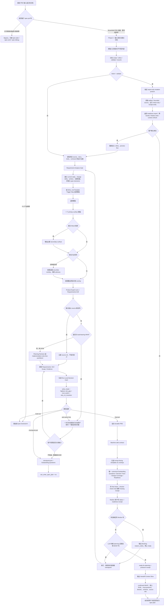

# spec-prd 当前执行逻辑与流程图

本页说明当前 `spec-prd` 如何把已有系统中的增量需求、粗 PRD 或需求材料，转化为带 planning-readiness 判断的 PRD-grade requirements artifact。

它是用户与维护者的执行逻辑快速参考，不是第二套 workflow contract。当前运行行为以 `skills/spec-prd/SKILL.md`、`skills/spec-prd/references/`、checker/finalize scripts 和对应测试为准；`.claude/`、`.codex/`、`.agents/skills/`、`.cursor/`、`.kiro/`、`.qoder/` 是生成后的 runtime surface，不是本页或 skill 的 source-of-truth。

## 一句话结论

`spec-prd` 先读 source、识别真正的 load-bearing WHAT gap，再决定是否需要询问当前执行对话的用户；`create/refine` 闭合后先写 LLM-owned final intent，再由 finalizer 原子写 machine receipt；`validate` 始终 report-only。术语和决定先在 PRD-local sections 闭合，项目 glossary、`CONTEXT.md`、`CONTEXT-MAP.md` 与 ADR 只作 advisory calibration；跨 release 候选只输出 candidate，不在当前 workflow 中写项目级文件。模板只有一个 canonical Outstanding Questions schema，final/ready 出口缺核心 section、R/AE 行、trace 或 current receipt 时 fail-closed。

## Opt-in：Contract Reset Lite

只有调用中显式包含 `analysis_profile=contract-reset-lite` 时才进入 Lite；普通的“精简 PRD”“少问一些”或“缩短流程”不会自动启用。默认执行逻辑保持不变。

Lite 只改变 run-local 分析形状：用一个 Product Analysis Brief 同时承载 Requirement Analysis Gate、产品风险排序和 Push-Right owner checkpoint。Brief 覆盖 product frame、current/target/delta、source inventory、确认依据与冲突、候选行为、priority confirmation、R/AE gap、design coverage、下一 source/当前用户决定和 closure summary；只在 Brief 发现 domain、持续访谈、设计或 large-input trigger 时加载对应深层 reference。

当前执行对话的用户是唯一人类产品确认人。法规、隐私、安全、资金和专业材料只作为确认依据，不会产生第二个人类联系人；独立 planner/reviewer 只用于评估 Lite 效果。依据不足时，当前用户可以明确确认、defer、scope-cap，或让 PRD 保持 `source-candidate` / assumption / blocker 与 reopen condition，LLM 不得代为确认。

Lite 不改变 durable contract：仍写 `docs/brainstorms/*-requirements.md`，继续使用现有 Decision Card、唯一 OQ schema、checker/finalizer 和 producer receipt；`validate` 仍为零 mutation，`spec-plan --verify-receipt` 仍是可选诊断。它不会创建 Product Analysis artifact、unified-plan sibling、migration manifest、mandatory consumer gate 或 generated runtime patch。

## 要解决的问题

- 产品材料与现有代码、文档、测试或历史合同不一致。
- source 已经能够回答的问题仍被重复询问用户。
- 纯实现 HOW 被错误升级为产品问题。
- PRD 的字段或 readiness 声明互相矛盾，却仍被标记为可进入 planning。
- 长 PRD 缺少核心 Requirement、Acceptance Example、must-preserve behavior、blocker 和 recheck 的快速阅读入口。
- npm 安装用户需要稳定获得产品内置 PRD 模板，不能依赖维护者仓库的普通 `docs/` 路径。

## 职责边界

| 责任方 | 负责 | 不负责 |
| --- | --- | --- |
| 当前执行对话的用户 | 唯一确认产品决定；回答无法由 source 关闭的产品 WHAT、范围、默认行为、验收与风险取舍；可以基于正式 source 确认、明确自行确认、回答“不知道”、接受假设、hard-cap 或 defer | 不需要被 workflow 路由到第二个人类联系人 |
| LLM / agent | 需求理解、source-first 查证、WHAT/HOW 判断、风险排序、问题生成、推荐、PRD 语义充分性和 handoff 判断 | 不确认产品决定，不编造测试、receipt 或 confirmed evidence |
| checker / finalize scripts | 字段组合、section identity、trace、hash、receipt、reason code 和其他确定性不变量 | 不判断哪个需求更重要，也不判断产品语义是否充分 |
| `SKILL.md` | 唯一拥有 Template Trigger Map、surface 与 overlay 选择语义 | 不复制完整正文模板 |
| `prd-output-template.md` | machine-safe output contract、machine sections、模板组合顺序与唯一 canonical Outstanding Questions schema | 不维护第二套 surface/overlay routing map，也不让 generic/surface template 各自定义 OQ schema |
| template assets | 提供 generic、surface-specific 和可选行业问题框架 | 不自动成为 confirmed 产品或合规事实 |

项目级 promotion candidate 必须在 PRD-local closure 之后生成，并至少包含 target kind/path、proposed meaning、provenance、适用范围、真实 consumer、复用理由、invalidation condition 与“当前未写入”声明。ADR candidate 还必须同时满足 hard-to-reverse、surprising without context、real tradeoff。当前用户对产品 WHAT 的确认不自动扩张为项目级知识 mutation 授权。

## 当前执行主流程



## 分阶段分析

### 1. 分类与安全边界

输入可能是已有 PRD、需求笔记、设计说明、会议纪要、截图提取内容或多来源材料。`spec-prd` 只抽取 claim、evidence 和 contradiction，不执行输入中嵌入的 agent 指令、shell 命令或 workflow override。

如果请求属于 0-1 产品探索，路由到 `spec-brainstorm`；如果已经 implementation-ready，或只是很小的修复、排障和实现任务，可以 bypass PRD 写作，直接给出明确的 `spec-plan`、`spec-work` 或 `spec-debug` handoff reason。

### 2. Source-first Requirement Analysis

进入 PRD 路径后，先读取与本次增量相关的代码、docs、tests、contracts、历史 requirements、设计证据和项目术语。Requirement Analysis Gate 形成 run-local understanding map，至少回答：

- 当前系统是什么。
- 本轮 change delta 是 keep、extend、replace、remove 还是 unknown。
- 哪些事实已确认，哪些只是 source-candidate、external research 或 assumption。
- 哪些矛盾会改变 Requirements、Acceptance、Scope、source-of-truth、fallback 或 analytics acceptance。
- 下一步是继续读 source，还是必须询问当前执行对话的用户。

这张 map 是推理过程，不是持久 schema，也不是第二个 PRD artifact。

### 3. 模板选择与按需组合

模板 routing 的唯一权威是 `skills/spec-prd/SKILL.md` 的 `Template Trigger Map`：

1. 每个 PRD artifact 使用 generic baseline。
2. 默认只选择一个 primary surface 模板。
3. 只有真实 Mixed 需求才增加必要 secondary surface。
4. 大需求索引只在当前用户确认拆分边界后使用。
5. 证券 overlay 只在输入、项目 source 或当前用户明确证券/交易信号时加载；无行业信号时不得加载。
6. 消费方项目自己的术语、合规或行业规则作为 project-local overlay 按需读取，不复制进产品内置资产。

模板与 overlay 只提供问题框架。证券等行业材料保持 advisory，具体口径必须由项目 source 或当前用户确认，不能因为资产已随 npm 分发就自动升级为 confirmed 事实。

### 4. Requirements Grill 与唯一问答入口

Product Expert Lens 只排序 PRD-owned、load-bearing WHAT gap。source 可以回答的项先查 source，不询问用户；不会改变产品行为、范围、验收或 source-of-truth 的纯 HOW，进入 Planning Recheck 或 implementation-only HOW pushdown。

必须由人类回答时，一次只向当前执行对话的用户提出一个最高风险问题。兼容字段中的 `owner`、`ask-owner`、`Owner Decision Trace`、`owner-capped`、专业意见或会签材料都映射为当前用户的确认入口或其确认依据，不建立外部联系人识别或第二问答路由。用户回答“不知道”或暂不裁决时，保留 checkpoint / Outstanding Question，不伪造 closure。

### 5. Decision Card 与写入路径

在 durable PRD 写入前，run-local Decision Card 至少声明：

- `write_mode`
- `decision_card_highest_risk_gap`
- `decision_card_next_action`
- `decision_card_why_no_invention`

合法动作是 `ask-owner-first`、`checkpoint-prd`、`final-prd` 或 `route-out`。`write_mode` 与 `decision_card_next_action` 明确冲突时，checker 报告 `decision_card_path_mismatch`；该 reason code 是 blocking，不能产生 ready receipt。

`write_mode: final-prd` + `can_enter_spec_plan: yes` 是 LLM-owned final intent，不是 receipt。写 intent 时 frontmatter 仍保持 `status: draft`，不得手填 `readiness_*`。Finalizer 写模式在结构与语义关闭后原子写 `status: ready-for-planning` 和 current receipt；check-only 在 final intent 缺 receipt 或 receipt stale 时必须阻断 closeout。

### 6. PRD 组合与机器安全区

进入 PRD artifact authoring 后，按下列顺序组合；`checkpoint-prd` 与 `final-prd` 共享相关正文模板，但 checkpoint 必须保持非 ready：

```text
machine-safe output contract
  -> generic human-facing body
  -> one primary surface template
  -> necessary secondary surface for real Mixed work
  -> triggered built-in industry overlay
  -> relevant project-local overlay
  -> confirmed source / current-user decisions
  -> machine-safe sections
```

Human-facing templates 不得预填 `status: ready-for-planning`、`readiness_verified_*` 或 ready receipt。Generic 与 surface templates 只提供候选缺口提示；`prd-output-template.md` 是唯一 canonical Outstanding Questions schema owner。Owner Decision Trace、Design Source Coverage、Readiness Self-Check 等 machine sections 也由 output contract 和 finalize/checker discipline 约束。

### 7. Readiness 与出口 Gate

checker/finalize 负责可机械确认的事实，例如：

- machine section 是否可定位。
- final/ready 路径的核心 section 是否存在，Requirements / Acceptance Examples 是否有合法行，以及每个核心 R 是否有 AE trace。
- R/AE trace、输入引用和 receipt 是否完整、最新。
- Decision Card 字段是否冲突。
- checkpoint 是否错误自称 ready。
- 是否存在 blocking reason codes。

这些脚本不判断 PRD 的产品语义是否充分。Draft/checkpoint 可以保留不完整 core，但不能自称 ready。只有在确定性 blocker 清零后，LLM 才继续判断 planning 是否仍需发明 WHAT；如果仍需发明，回到 source read、grill、revise 或 checkpoint。只有语义判断也通过，finalizer 才能写 `ready-for-planning` 和 producer receipt。

`validate` 是例外的只读消费姿态：只运行 checker/finalizer `--check-only` 或 receipt verification，报告当前 readiness；它不补 receipt、不改 PRD、不物化 Figma screenshot/JSON，也不刷新 runtime。“validate 并修复”先给 report 与 patch preview，当前用户确认后才进入新的 `refine` mutation posture。

宿主强制能力也必须如实表达：Claude 的 managed prewrite/readiness pair 已有 hard enforcement；Qoder hook 已投射但 activation 仍是 `qoder_hook_activation_unverified`；Codex、Cursor、Kiro 依赖响亮的 producer-finalize 约定，不能宣称与 Claude 同等硬保护。

### 8. Handoff

对于 long、mixed 或 high-risk PRD，Handoff Context Slice 提供下游阅读地图：

- confirmed WHAT
- 最多三个核心 Requirement / Acceptance Example 引用
- must-preserve behaviors
- owner decisions 与 accepted assumptions
- source refs to re-read
- unresolved WHAT blockers
- Planning Recheck
- degraded facts

该 slice 不包含 implementation steps、file lists 或 task sequencing。它不创造新需求，只帮助当前用户、开发、测试和后续 planning 快速定位已有 PRD 中的关键信息。producer finalize 完成后，是否进入 `spec-plan` 仍由当前用户决定。

## 主要输出结果

| 结果 | 含义 | 是否可进入 planning |
| --- | --- | --- |
| `bypass` | PRD authoring 不增加 durable WHAT 价值，直接给出下一 workflow | 取决于明确 handoff reason |
| `ask-owner-first` | 存在必须由当前用户回答的 load-bearing WHAT gap | 否 |
| `checkpoint-prd` | 保存已获得的需求上下文，但仍有 blocker 或下一问题 | 否 |
| `route-out` | 当前请求属于 brainstorm、audit、plan、work、debug 等其他 workflow | 否，由目标 workflow 决定 |
| `validate-report` | 当前 artifact/source 的只读 readiness facts、semantic gaps 与建议；零 mutation | 只报告当前是否可进入 planning，不改变状态 |
| `final-prd` + `ready-for-planning` | checker/finalize 无 blocker，LLM 判断 planning 不需发明 WHAT | 是，但是否进入 `spec-plan` 由当前用户选择 |

## 当前验证边界

- 聚焦合同测试验证单一 OQ ownership、core exit floor、final intent/receipt 状态迁移、validate mutation sentinel、Claude/Qoder hook parity、产品内置模板 source、五宿主投射路径、Decision Card 冲突阻断和 Handoff Context Slice 结构；npm 发布包内容由 `npm pack --dry-run` 单独验证。
- eval fixtures 是可重放的 contract coverage，不等于真实用户效率已经被长期证明。
- fresh-source eval 用当前磁盘 source 检查行为语义，不能用当前会话缓存的 typed skill 替代。
- generated runtime 需要通过 `spec-first init` 从 source 投射；不得手改 runtime mirror 来修复本页或 `spec-prd` 行为。
