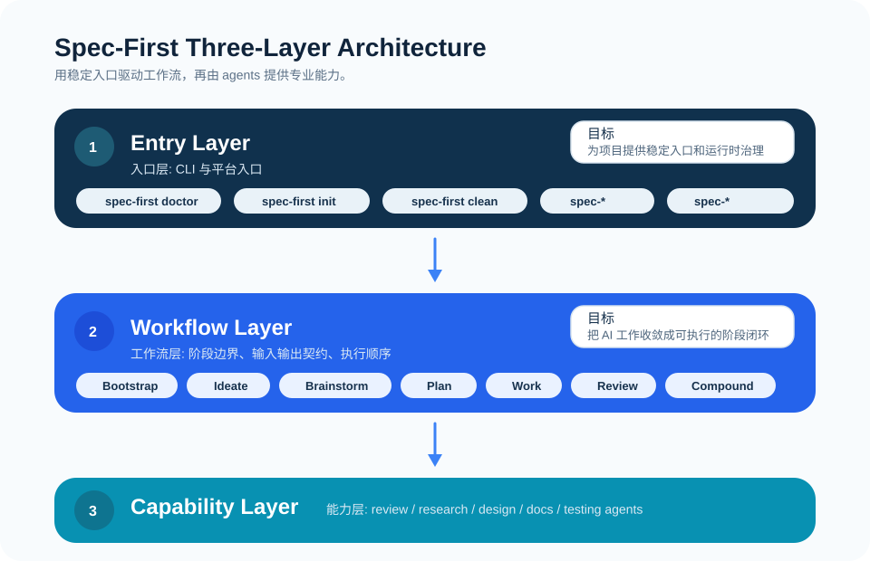

# Spec-First 用户手册

这套手册对应当前 `spec-first` npm CLI 模型。

`spec-first` 是面向 Claude Code、Codex、Cursor、Kiro 与 Qoder 的 **AI Coding Harness**：它把一次性的 AI coding 对话，变成可治理、可验证、可复用的工程闭环。AI 写代码很快，真正会丢失的是塑造代码的判断——需求、计划、评审结论和经验常常随对话窗口一起消失。`spec-first` 把这些工作作为持久 artifact 留在你的仓库里：**脚本产出可信事实，LLM 做语义判断，证据留在仓库**，让下一次会话、reviewer 和同事直接继承上下文，而不是从零开始。Kiro 与 Qoder 当前都是 opt-in preview 宿主，Cursor 当前是 opt-in generated-runtime preview。

落到 CLI，它通过 `doctor / init [--claude] [--codex] [--cursor] [--kiro] [--qoder] [-y] / update / clean (--claude|--codex|--cursor|--kiro|--qoder)` 把统一的 `spec-*` workflow 入口投射到各宿主 runtime assets，并同步 workflow skills、agents、agent support files 和受管状态。开发者偏好单独保存在全局 `~/.spec-first/.developer`。

完成 `doctor`、`init` 和宿主重启后，首次进入业务 workflow 前先运行 `spec-runtime-setup`，准备 required harness runtime、MCP/helper readiness 与 setup facts。后续普通 plan/work/debug/review 不需要每次重复 setup，继续使用 bounded direct source reads、`rg`、ast-grep、git diff、tests、logs 和用户提供证据；宿主、provider、helper 配置或 setup facts 变化时再重跑。

当前推荐的事实准备、专项审查、治理与知识沉淀入口：

- `using-spec-first`：入口路由治理（standalone；只选下一步，不写 artifact）
- `spec-runtime-setup`：required harness runtime、MCP servers 和 helper tools 的安装与验证入口
- `spec-app-consistency-audit`：移动 App 的 PRD / Figma / source / route / architecture / analytics / i18n 静态一致性审查入口
- `spec-write-skill`：创建 / 修改 / 迁移项目拥有的 Agent Skill package，或只读 readiness 校验
- `spec-dogfood` / `spec-polish`：分支/PR 浏览器 QA 与 UI polish
- `spec-compound` / `spec-compound-refresh`：工作完成后的稳定知识捕获与 learnings 刷新
- 完整公开 / standalone / internal 清单见 [公开入口与 Skill 目录](./24-公开入口与Skill目录.md)

当前功能状态：

- `spec-first init [--claude] [--codex] [--kiro] [--qoder] [-y]`：已支持；无平台 flag 时交互式多选，显式平台 flag 会覆盖默认宿主集合；`-y` 默认只安装 Claude Code + Codex，Kiro/Qoder 需要显式 flag
- `spec-first doctor`：支持自动检测，也支持 `--claude` / `--codex` / `--kiro` / `--qoder`
- `spec-first update`：已支持；升级 npm 包到 `@latest`，成功后自动启动 fresh `spec-first init` 刷新本地 runtime；刷新失败或 scope 不明时输出可复制 fallback
- `spec-first clean --claude / --codex / --kiro / --qoder`：已支持
- `spec-first repair-worktree`：已支持；预览失效 worktree pointer 的修复指引（`--dry-run` 仅预览）
- `spec-first tasks <subcommand>` / `spec-first session <subcommand>`：派生 task pack 的确定性校验入口，以及 opt-in 多 actor 会话 advisory
- `spec-first plans audit [--status <active|partially-shipped|completed|superseded>] [--json]`：只读扫描当前仓库 `docs/plans/*.md` 的直接普通文件，盘点 unified code plan 和兼容的 legacy `feat|fix|refactor` plan；历史 missing/closed/invalid 是 advisory，不改变成功退出码。

Plan lifecycle audit 的边界：

- 新的 Markdown software unified plan 默认写 `status: active`；`artifact_readiness` 仍只表示文档能否执行。
- Standalone `spec-work`、goal 或 LFG/caller 只有在各自完整 shipping tail 的 verification、required review 与 residual gate 收口后，才调用内部 helper 执行 `active → completed`。Direct plan 更新自身；task pack 只更新 `source_plan`，自身保持 derived/draft。
- `partially-shipped` 与 `superseded` 首期仅做读取兼容，不提供自动 mutation、恢复协议或非 active intake gate。
- JSON 固定输出 `schema_version: plan-status-audit/v1` 与 `plans[]`，每条只包含 `path/status/readiness/validity`。
- `--status` 只接受 canonical taxonomy，并且只匹配 `validity: valid` 记录。
- HTML plan 不参与首期 audit，这是显式 degraded boundary。
- `completed` 只表示 plan 文件的 lifecycle marker；它不证明 tests、CI、merge、release 或 field outcome 已完成。
- Internal helper 的 expected-old-status 与 temp-file + rename 不是跨进程 CAS；shipping-tail 单写者是未硬强制的 loud convention。

`init` 支持在交互式引导中选择开发者姓名和语言；`-y` 会使用默认宿主集合和默认身份/语言，显式 `--claude` / `--codex` / `--kiro` / `--qoder` 会覆盖默认宿主集合。如果没有传用户名，它会优先回退到全局 `~/.spec-first/.developer`，再回退到 `git config user.name`。

关于升级：

- 日常升级直接运行 `spec-first update`：它会把 npm 包升级到 `@latest`，成功后用 fresh `spec-first init` 子进程刷新本地 runtime；刷新失败或 scope 不明时会输出可复制 fallback（它不会在旧进程内直接执行 runtime generator）
- 如果你不是通过 `npm -g` 安装（如 Claude plugin / pnpm / volta），`update` 可能装出冲突副本，应按你自己的包管理器升级
- 如果 `doctor` 报告 `legacy managed state`，直接重新运行 `spec-first init` 并选择目标宿主
- `init` 会执行 managed hard reset 并按当前版本全量重建运行时
- `clean` 只清理当前受管资产，不承担 legacy 迁移



## 你会得到什么

- 一个前置的 `spec-ideate` 候选发散入口
- 跨宿主统一的 `spec-*` workflow 入口
- 当前推荐的 App 一致性审查入口 `spec-app-consistency-audit`、skill 包治理入口 `spec-write-skill`，以及知识沉淀入口 `spec-compound`（完整清单见 [公开入口与 Skill 目录](./24-公开入口与Skill目录.md)）
- 一条 `Ideate -> Brainstorm -> Plan -> Work -> Review -> Compound` 的标准闭环
- 项目级 `.claude/commands/spec-*.md`
- 项目级 `.claude/skills`、`.claude/spec-first/workflows` 与 `.claude/agents`
- 项目级 `.agents/skills` 与 `.codex/agents`
- 全局 `~/.spec-first/.developer` 中的开发者与宿主选择偏好（不跟随项目提交）
- 严格 schema 的 `.claude/spec-first/state.json` / `.codex/spec-first/state.json`
- `init` 自动维护的 `.gitignore` spec-first managed block，只忽略明确的 host-local scratch/settings、`.spec-first` 本地 facts 与 optional provider artifacts；selected-host generated runtime 默认 Git 可见并跟随项目提交
- 一份研发场景与降级路径手册，说明 scenario fingerprint、capability matrix、parent orphan quarantine、build-target coverage 和 quality signals 如何帮助 workflow 在单仓、多仓、非 Git folder 与 dirty worktree 场景中选择证据路径
- 可更新、可恢复、可清理的受管资产模型
- 一条面向首次使用者的 workflow 走查，说明从一个需求句子到 requirements / plan / task pack 的真实产物链路
- 一份 workflow 产物目录，说明每类文档和 generated runtime assets 的生成者、读取方与 Git 边界
- 一份 [source/runtime/provider customization boundary](../contracts/source-runtime-customization-boundary.md)，说明 source-of-truth、generated runtime mirrors、workflow artifacts、provider/tool facts、raw output safety 和 credential boundary

## 当前工程闭环

主链路可以从 `Ideate -> Brainstorm -> Plan -> Work -> Review -> Compound` 理解，但当前用户手册覆盖的是更完整的工程闭环：

```text
using-spec-first（入口路由，可选）
  -> runtime-setup（首次 workflow 前；环境/MCP 变化后重跑）
  -> ideate / brainstorm / prd / doc-review
  -> plan
  -> write-tasks（可选）
  -> work / debug / optimize / polish / dogfood
  -> code-review / app-consistency-audit
  -> compound / compound-refresh
  -> 反哺项目知识、文档、skills 和下一次 workflow 选择
旁路（按意图直接进入，非主链路状态）：
  write-skill | explain | pov | strategy | rule-miner | simplify-code
  | product-pulse | sweep | riffrec-feedback-analysis | promote | lfg（仅显式）
```

这不是必须顺序执行的命令链。用户应从当前状态最匹配的节点进入；当下一步不清楚时，在宿主会话里询问即可由 `using-spec-first` 推荐一个公开入口。`write-tasks` 是可选派生 workflow，入口是 `spec-write-tasks`；它不替代 source plan，也不是强制阶段。完整入口表见 [公开入口与 Skill 目录](./24-公开入口与Skill目录.md)。skill 包治理入口为 `spec-write-skill`。

首次 setup 必须完成 required baseline；后续普通 workflow 不把 setup 当成每次运行的硬前置。当外部工具或 setup facts 后续变得 stale 或不可用时，workflow 可以用 bounded direct repo reads 继续，但必须披露 limitation，不能把缺失证据包装成成功证据。

## 支持的开发模式

当前文档按仓库拓扑区分三种开发模式：

1. 单仓单项目
2. 单仓多模块
3. 多仓工作区

核心边界是：`.spec-first` 的权威事实属于 **selected Git repo root**。单仓多模块不在每个 module 下拆多套 `.spec-first`；多仓工作区的父目录只拥有 advisory workspace summaries，不拥有 child repo 的 `.spec-first/config/*` 或当前源码事实。详见 [三种开发模式](./08-三种开发模式.md)。

## App 一致性审查

移动 App 的产品、设计和代码在进入模拟器、真机或打包验证前，可以使用专项入口做静态一致性审查：

```text
spec-app-consistency-audit prd:<path> figma-context:<path> source:<path>
```

它适合检查 PRD、materialized Figma context、本地源码、页面路由、KMP / Clean Architecture、组件复用、埋点、i18n 和行业规则之间是否一致。审查产物写入 `.spec-first/app-audit/runs/<run-id>/`，默认是 runtime/control-plane evidence，不作为长期手工维护文档提交。

边界：

- `figma-context:<path>` 是可抽取 evidence；`figma-ref:<id-or-url>` 只是 reference。
- Figma MCP 是宿主可选能力，只在默认交互模式下用于 materialize 本地 JSON；它不是 `spec-runtime-setup` 的 required baseline。
- 缺 PRD、Figma 或直接源码证据时应降级披露能力范围，不把缺失输入直接当作整个审查失败。




## 阅读顺序

1. [快速开始](./01-快速开始.md)
2. [首次工作流走查](./09-首次工作流走查.md)
3. [核心概念](./02-核心概念.md)
4. [完整示例](./03-完整示例.md)
5. [Workflows 与产物地图](./04-workflows-artifacts-map.md)
6. [产物目录](./10-产物目录.md)
7. [Gitignore 参考](./12-gitignore参考.md)
8. [研发场景与降级路径](./20-研发场景与降级路径.md)
9. [OpenSpec 与 spec-first 项目阶段适用性对比](./21-OpenSpec与spec-first阶段适用性对比.md)
10. [研发侧需求澄清与计划准入流程](./22-PRD需求文档质量增强流程.md)
11. [spec-prd 当前执行逻辑与流程图](./23-spec-prd当前执行逻辑.md)
12. [公开入口与 Skill 目录](./24-公开入口与Skill目录.md)
13. [常见问题](./04-常见问题.md)
14. [最佳实践](./05-最佳实践.md)
15. [三种开发模式](./08-三种开发模式.md)
16. [本地源码安装](./06-本地源码安装.md)
17. [内部培训使用讲稿](./07-内部培训使用讲稿.md)

## 建议阅读路径

- 如果你第一次使用，先看 [快速开始](./01-快速开始.md)，再看 [首次工作流走查](./09-首次工作流走查.md)
- 如果你要理解运行模型、工程闭环和 evidence 边界，先看 [核心概念](./02-核心概念.md)
- 如果你要共享 project guidance，优先放在 `AGENTS.md`、`CLAUDE.md`、目录级 instruction 文件或明确的 `docs/contracts/**`，再看 [Gitignore 参考](./12-gitignore参考.md) 的提交边界
- 如果你要判断单仓、多模块或多仓 workspace 怎么使用，先看 [三种开发模式](./08-三种开发模式.md)
- 如果你要判断 OpenSpec 和 spec-first 在不同项目阶段怎么取舍，先看 [OpenSpec 与 spec-first 项目阶段适用性对比](./21-OpenSpec与spec-first阶段适用性对比.md)
- 如果产品或 owner 已经给出 PRD、需求材料、会议纪要、设计说明或系统增量说明，你要在进入研发 planning 前澄清 WHAT/WHY、owner 决策和计划准入条件，先看 [研发侧需求澄清与计划准入流程](./22-PRD需求文档质量增强流程.md)
- 如果你要快速理解当前 `spec-prd` 从输入、模板选择、grill、Decision Card 到 checker/finalize 和 handoff 的实际执行逻辑，看 [spec-prd 当前执行逻辑与流程图](./23-spec-prd当前执行逻辑.md)
- 如果你要查当前全部公开 workflow、standalone skill 与 internal helper 清单，看 [公开入口与 Skill 目录](./24-公开入口与Skill目录.md)
- 如果你要确认真实执行过程，看 [完整示例](./03-完整示例.md)
- 如果你要判断某个文档或 runtime 目录该不该手改、该不该提交，先看 [产物目录](./10-产物目录.md)
- 如果你要判断当前仓库属于哪类研发场景、dirty / multi-repo / non-git build target 该如何降级，先看 [研发场景与降级路径](./20-研发场景与降级路径.md)
- 如果你要给业务项目配置 `.gitignore`，先看 [Gitignore 参考](./12-gitignore参考.md)
- 如果你在排障，看 [常见问题](./04-常见问题.md)
- 如果你关注 runtime/control-plane 与 Git 协作边界，重点看 [核心概念](./02-核心概念.md)、[Workflows 与产物地图](./04-workflows-artifacts-map.md)、[最佳实践](./05-最佳实践.md) 和 [常见问题](./04-常见问题.md)
- 如果你在做本地调试或仓库维护，看 [本地源码安装](./06-本地源码安装.md)
- 如果你在做团队内部分享或培训，先看 [内部培训使用讲稿](./07-内部培训使用讲稿.md)

## 版本

本手册对应当前 `spec-first` 代码与运行时资产布局。当前版本以 `spec-first -v` 与 `package.json` 的 `version` 字段为单一真相源（撰写时为 `v1.13.2`），手册不再单独维护版本号以避免漂移。

> 说明：遇到行为疑问时，优先以 source-of-truth 文件、CLI contract 和本手册当前章节为准。
