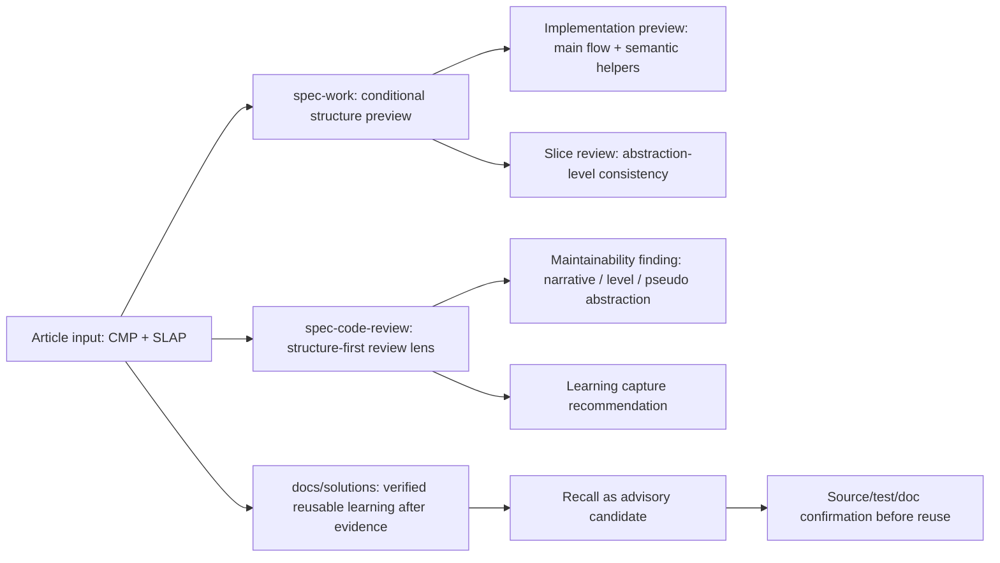

# AI 生成代码结构护栏需求分析报告：spec-work / spec-code-review / docs/solutions 优化

## Summary（文档概要）

本文基于外部文章《两条原则，让AI写出让人省心的代码》的本地结构化材料，结合当前 `spec-first` 的 `spec-work`、`spec-code-review`、`docs/solutions/` 与 Knowledge Harness source，提出一组面向 AI Coding 结构质量的 workflow 优化需求。核心结论是：`CMP`（组合方法模式）与 `SLAP`（抽象层次一致性原则）不应被引入为机械 lint 或硬状态机；首轮应先作为 `spec-code-review` maintainability reviewer 的结构 lens 试点，用行为验证证明它能产出可信 finding，再决定是否扩展到 `spec-work` 热路径和 `docs/solutions/` durable learning。

## Problem Frame

AI Coding 的速度优势可能放大既有结构模式。当前 `spec-first` 已经具备反馈回路、垂直切片、结构性 maintainability reviewer、知识召回和知识沉淀机制，但 `CMP / SLAP` 这类“先组织代码意图，再填实现细节”的结构护栏尚未被显式写入 reviewer 的入口叙事 / 抽象层一致性检查。

本报告接受当前证据等级为 `mixed`：外部文章原则与仓库现有 reviewer 能力高度相容，但尚未列出 2-3 个 repo-local 复发失败样本来证明必须同时改造 `spec-work` 和 `docs/solutions/` 热路径。因此首轮需求采用 probe-first：先扩展最小可回退的 review lens，并用行为验证确认收益；`spec-work` 结构预览和 durable learning 只在真实 review finding / implementation evidence 累积后推进。

如果不补这层轻量约束，风险不是代码一定不能跑，而是：

- `spec-code-review` 已能发现复杂度与抽象债，但可能把“主流程叙事失真 / 抽象层混杂”当成普通 maintainability 建议，而不是 AI 生成代码的第一轮结构风险。
- 如果 review-lens 试点证明该问题真实存在，`spec-work` 可在匹配触发条件时加入 run-local 结构预览，避免入口方法缺少叙事结构。
- 如果真实落地或 review 已形成 verified evidence，`docs/solutions/` 可沉淀项目级“AI 生成代码结构护栏”知识资产，避免后续 agent 反复重新理解同一原则。

本报告的目标是把文章原则翻译成符合 `spec-first` 的 Light contract：脚本准备可量化事实，LLM / reviewer 判断语义结构是否成立；不把风格原则硬编码成脚本裁决。

## Current System Snapshot

| surface | current behavior | evidence | implication |
| --- | --- | --- | --- |
| `spec-work` | 已要求先建立最小反馈回路、按垂直切片执行、持续测试、阶段性简化，并在 shipping 阶段进入必需 review。 | confirmed-source: `skills/spec-work/SKILL.md` `Feedback Loop And Vertical Slices`、`Simplify as You Go`、`references/shipping-workflow.md` | 执行质量已有骨架；结构预览应先作为条件化能力，不在缺少复发信号时默认进入所有非平凡任务。 |
| `spec-work` 任务 intake | 已从 plan/task-pack 读取 scope、patterns、verification、review_gate，不允许静默扩 scope。 | confirmed-source: `skills/spec-work/SKILL.md` Phase 1 task-pack checks | 适合把结构预览绑定到既有 task/unit，而不是新增独立 artifact。 |
| `spec-code-review` | 默认 core 包含 `spec-maintainability-reviewer` 和 `spec-learnings-researcher`；review 产出结构化 findings、Coverage、residual status。 | confirmed-source: `skills/spec-code-review/SKILL.md` Reviewers / Stage 6 | 评审链路已有结构质量入口和知识召回入口。 |
| maintainability reviewer | 已关注结构质量、复杂度删除、薄 wrapper、错误层级、文件过长、抽象债、类型边界。 | confirmed-source: `agents/spec-maintainability-reviewer.agent.md` | 与 CMP/SLAP 高度相容，但未显式检查“入口方法叙事”和“同方法抽象层一致”。 |
| `docs/solutions/` | `spec-compound` 将 verified learning 写入 `docs/solutions/`，新 promoted solution 需 `source_refs` 和 `invalidation_condition`；召回保持 advisory。 | confirmed-source: `skills/spec-compound/SKILL.md`、`docs/contracts/knowledge/knowledge-harness.md`、`agents/spec-learnings-researcher.agent.md` | 可以沉淀 CMP/SLAP 作为项目知识，但必须来源于已验证实践，而不是直接把外部文章当 confirmed team standard。 |
| Knowledge Harness | L4 recall 是 advisory candidate，必须回源到 source/test/doc 或人工 reviewer 才能升为 confirmed。 | confirmed-source: `docs/contracts/knowledge/knowledge-harness.md` | 文章原则只能成为需求输入或 advisory learning source，不能直接成为硬规则。 |

## Change Delta

| item | current | target | delta | evidence |
| --- | --- | --- | --- | --- |
| Work implementation posture | 反馈回路与垂直切片显式；结构组织原则隐式。 | 仅在新增/重写主入口、handler、service orchestration、跨层控制流或 review 已指出结构风险时，加入 run-local 结构预览 / 抽象层一致性复查。 | conditional extend | confirmed-source: `skills/spec-work/SKILL.md`；external-research: article note remains advisory |
| Code review lens | maintainability reviewer 查复杂度、抽象债和薄 wrapper。 | 首轮最小试点：显式覆盖入口叙事、同方法抽象层一致、伪抽象、异常/校验细节冲散主流程，并验证 finding 能抵达用户。 | extend / probe | confirmed-source: `agents/spec-maintainability-reviewer.agent.md` |
| Knowledge reuse | `docs/solutions/` 支持 verified learning recall，但无 CMP/SLAP 项目级结构护栏学习。 | 在真实落地或 review 发现后沉淀一篇结构化 learning，并让 recall 能按 code-implementation / abstraction-debt / AI-generated-code 命中。 | deferred add | confirmed-source: `skills/spec-compound/SKILL.md` |
| Automation boundary | 脚本可记录 verification / artifacts / resource advisory。 | 只用脚本收集可量化结构信号，不让脚本判定 CMP/SLAP 是否语义成立。 | policy-change | confirmed-source: `docs/10-prompt/结构化项目角色契约.md` |

## Requirement Analysis Gate

| field | analysis |
| --- | --- |
| input_inventory | repo 外文章材料、本仓库 `spec-work` / `spec-code-review` / `spec-compound` / `docs/solutions` / Knowledge Harness source、相关 tests。 |
| source_authority_order | 仓库 source 与 contract > deterministic command/test facts > 本地文章材料 > Graphify/codegraph advisory navigation。 |
| target_surface_anchor | `skills/spec-work/SKILL.md`、`skills/spec-code-review/SKILL.md`、`agents/spec-maintainability-reviewer.agent.md`、`docs/solutions/**` / `spec-compound`。 |
| current_state_summary | 执行、评审、知识机制已存在；当前可确认的最小缺口是 maintainability reviewer 未显式检查“入口叙事 / 同方法抽象层一致”。 |
| change_delta | 首轮 extend `spec-code-review` reviewer lens 并做行为验证；`spec-work` 改为条件化 follow-up；`docs/solutions` learning 等 verified evidence 后再 add；不新增 public workflow。 |
| module_map | workflow prose、reviewer persona prose、contract tests、future solution doc。 |
| open_decisions | 实现时精确改哪些 prose anchors、是否调整 maintainability demotion 例外、spec-work 是否进入本轮、何时沉淀 solution doc 需要由 planning/work 基于 diff 与行为验证决定。 |
| design_coverage | 不涉及 UI / design source。 |
| api_coverage | 不涉及 CLI/API schema；若后续新增 fields 或 run artifact 字段，需要另行做 contract-change。 |
| risk_to_prd_write_target | 见 Requirements、Acceptance Examples、Scope Boundaries、Planning Recheck。 |
| source-backed no-question reason | 需求目标来自用户明确请求与当前 source 证据，未发现必须先问 owner 才能决定 WHAT 的缺口；实现 HOW 留给后续 planning。 |

## Mapping Diagram（映射图）

图已经承载三段映射关系；正文只解释需求、边界与验收，不重复展开每条箭头。

## Requirements And Constraints

| id | priority | requirement | rationale/source |
| --- | --- | --- | --- |
| R-01 | P1（probe-gated） | `spec-work` 只在明确触发条件下加入轻量“结构预览”：新增/重写主入口、workflow handler、service orchestration、跨层控制流、复杂异常/IO 装配，或 review 已指出结构风险。预览只写当前 task/unit 的主入口、主流程步骤、哪些细节会下沉，以及不应新增的伪抽象。**本轮不把它作为所有非平凡行为代码的强制前置步。** | external-research: article note（前提为 advisory）; confirmed-source: `skills/spec-work/SKILL.md` 已有 feedback-loop / vertical slice，可承接此步骤。 |
| R-02 | Constraint | 结构预览必须是 run-local / closeout-level 信号，默认不新增持久 artifact；只有长任务、handoff、review/compound 触发时才进入现有 summary / run artifact。 | confirmed-source: `skills/spec-work/SKILL.md` Summary-First Handoff 与 Run Artifact Boundary。 |
| R-03 | P1（probe-gated） | `spec-work` 的实现指导应鼓励“先形成主流程骨架，再填局部实现”，但必须保留“不是机械拆方法”的边界：只有具备独立语义、稳定命名、变化理由、测试价值或复用价值时才抽取。**Probe-first 决策：gated-on review-lens 累积的真实结构 findings。** | external-research: article note（前提为 advisory）; role-contract: Light contract。 |
| R-04 | P1（probe-gated） | `spec-work` 的 `Simplify as You Go` 应显式包含 CMP/SLAP 复查：入口是否像目录、同一方法是否混合业务步骤/校验/装配/IO/异常包装等不同层级、异常处理是否冲散主流程。**Probe-first 决策：gated-on review-lens 累积的真实结构 findings。** | confirmed-source: `skills/spec-work/SKILL.md` 当前已有简化阶段，但未列此结构 lens。 |
| R-05 | P1（conditional） | `spec-work` closeout / work-to-review handoff 仅在 R-01 触发或结构风险已被 review 指出时记录结构证据：主要入口、拆出的语义 helper、保留/拒绝的抽象、验证命令与限制。对应 AE-01 / AE-03。 | confirmed-source: Summary-First Handoff；supports downstream `spec-code-review`。 |
| R-06 | P0 | `spec-code-review` 的 maintainability lens 应把首轮新增 delta 收窄为两点：入口叙事能力、同一方法内抽象层一致性；伪抽象、薄 wrapper、复杂度搬家等既有 reviewer 覆盖项只作为边界引用，不重复包装成新交付。 | confirmed-source: `agents/spec-maintainability-reviewer.agent.md`; external-research: article note。 |
| R-07 | P0 | 当入口叙事失真 / 抽象层混杂影响主入口理解、后续变更成本或测试可写性时，`spec-code-review` 必须让该结构 finding 真正抵达用户、而不是被静默降级为 advisory 风格建议被抑制门压掉；finding 需带具体 reframe / suggested_fix。具体抵达门的机制（emit 锚点、severity、autofix 类别等）由 planning 决定，见 Planning Recheck。 | confirmed-source（real risk，源码确认）: 结构判断属 `agents/spec-maintainability-reviewer.agent.md`:54 的 anchor-50「suppress unless P1」判断题；`skills/spec-code-review/SKILL.md`:788 confidence-first gate suppress-below-75、:776-786 Stage-5 step-6c mode-aware demotion 三条路径会压掉 anchor-50/P2/advisory 的单 reviewer 结构 finding，故"带 reframe 即可"不足以保证抵达。 |
| R-08 | P1 | `spec-code-review` 的报告或 Coverage 在适用时应说明结构评审覆盖状态：已检查主流程叙事 / 抽象层一致性，或因 diff 类型不适用而跳过。对应 AE-04。 | confirmed-source: Stage 6 Coverage 机制。 |
| R-09 | Constraint | 当 review 中出现可复用结构教训时，只给出 `spec-compound` 捕获建议，不在 review 中自动写 `docs/solutions/`。对应 AE-06。 | confirmed-source: `skills/spec-code-review/SKILL.md` Learning Capture Recommendation；`spec-compound` promotion gate。 |
| R-10 | P2（deferred, blocked-on: verified implementation+review evidence） | `docs/solutions/` 后续应沉淀一篇 verified knowledge-track learning（`problem_type` 取 `best_practice` 或 `convention`，具体值由 `spec-compound` schema 的 `problem_type` enum 决定；schema 无独立 `category` 字段），描述 AI 生成代码中的 CMP/SLAP 结构护栏、适用条件、反例、失效条件和 source refs。 | confirmed-source: `skills/spec-compound/SKILL.md` structured promotion gate。 |
| R-11 | Constraint | 该 learning 必须标注 `source_refs` 和 `invalidation_condition`；文章观点只能作为 external/advisory input，最终可复用结论必须由本仓库 source、review finding、测试或人工确认支撑。 | confirmed-source: `docs/contracts/knowledge/knowledge-harness.md` Recall Trust Boundary。 |
| R-12 | Constraint | `spec-learnings-researcher` 召回该 learning 时，应以 advisory candidate 输出，并提示后续 `spec-work` / `spec-code-review` 回源确认；不把 learning 当作 hard coding standard。 | confirmed-source: `agents/spec-learnings-researcher.agent.md`。 |
| R-13 | Constraint | 不新增脚本去判定“是否符合 CMP/SLAP”；可选脚本只能提供方法长度、文件行数、复杂度、wrapper 数量、helper 命名等 deterministic facts，由 reviewer 判断语义结构。 | role-contract: scripts prepare facts, LLM decides semantic adequacy。 |
| R-14 | P1 | 实施阶段修改 workflow prose / agent prose 时，必须补 contract tests 锁住关键 anchors，并执行覆盖 AE-04 的行为级 fresh-source eval 或 fixture diff 验证。若无法执行行为验证，degraded record 至少包含：reason_code、改动文件、人工核对的 source anchors、未验证的行为风险、后续补验条件。 | confirmed-source: AGENTS.md Agent 与 Skill 变更验证规则；现有 tests pattern。 |

## Acceptance Examples

AE-01（对应 R-01/R-03/R-05/R-14）
Given `spec-work` 执行一个新增或重写主入口 / workflow handler / service orchestration / 跨层控制流任务
When 该任务命中 R-01 的触发条件，或已有 review finding 指出入口叙事 / 抽象层混杂风险
Then agent 应形成 run-local 结构预览：主入口要表达的业务步骤、下沉细节的语义边界、明确不新增的伪抽象，并只在 handoff/review/compound 相关时把预览带入 summary。

AE-02（对应 R-02/R-13）
Given 一个两行文案修复或 docs-only 改动
When `spec-work` 执行
Then 不应强制生成结构预览 artifact，也不应运行任何 CMP/SLAP 结构脚本；只做适合 docs/config 的 diff-shape 或 contract check。

AE-03（对应 R-04/R-05）
Given 一个完成的行为切片包含入口方法、校验、数据装配、持久化和异常处理
When R-04 已被后续 plan/work 激活，且 `spec-work` 进入阶段性 simplification
Then agent 应复查这些语句是否处于同一抽象层；若不一致，应优先通过语义 helper 或结构重排恢复主流程叙事，而不是只消除重复。

AE-04（对应 R-06/R-07/R-08/R-14）
Given diff 新增一个可运行但入口方法混入字段拼接、异常文案、底层调用和业务步骤的实现
When `spec-code-review` 运行 maintainability lens
Then reviewer 应将其作为结构风险评审，并在 finding 中给出具体 reframe，例如保留入口业务步骤、下沉校验/装配/IO/异常细节；且该 finding 必须真正抵达用户、不被抑制门静默压成 advisory（具体抵达门的 emit 机制由 planning 决定，见 Planning Recheck）。

AE-04b（对应 R-07/R-14）
Given 同一段混层入口 diff 的 before/after fresh-source eval 或 fixture diff
When 实施后的 reviewer 仍只能产出 anchor-50/FYI/residual_risks，或 finding 被 Stage 5/6 静默压掉
Then 本轮不得声称 R-07 行为已兑现；plan 必须选择调整 finding emit 指引、demotion 规则，或接受该 lens 暂停在 FYI。

AE-05（对应 R-03/R-07）
Given diff 把三行局部逻辑拆成多个 `Helper` / `Processor` 但没有独立语义或复用价值
When review 评估 CMP/SLAP
Then reviewer 不应奖励“拆了方法”本身，而应指出这是伪抽象或复杂度搬家。

AE-06（对应 R-09/R-10/R-11/R-12）
Given `docs/solutions/` 中已有 CMP/SLAP learning
When `spec-learnings-researcher` 在后续 work/review 中召回它
Then 输出必须标为 structured recall candidate 或 legacy advisory，并携带 `source_refs` / `invalidation_condition`；下游使用前必须回源确认。

AE-07（对应 R-13）
Given 工具报告某个方法超过长度阈值
When reviewer 形成最终 finding
Then 长度只能作为证据线索；是否违反 CMP/SLAP 必须由 reviewer 结合主流程叙事、语义边界和实际变更成本判断。

## Scope Boundaries

### In Scope

- 首轮 `spec-code-review` maintainability / structural review lens 试点。
- `spec-work` 的条件化执行姿态与 handoff prose 优化边界。
- `docs/solutions/` 中未来结构护栏 learning 的 promoted shape 与 recall 边界，不在本轮直接写 durable learning。
- 聚焦 contract tests / prose anchors / fresh-source eval 要求。
- 把文章原则映射为 project-local workflow requirements。

### Out Of Scope

- 新增 public workflow、agent type、中心化流程引擎或硬状态机。
- 引入默认 AST linter 来自动判定 CMP/SLAP 语义通过。
- 把文章原文直接升级为 confirmed team standard。
- 为所有语言/框架建立完整代码风格手册。
- 修改 generated runtime mirrors（`.claude/**`、`.codex/**`、`.agents/skills/**`）。
- 在本需求报告中直接实现 skill / agent / test 变更。

## Change Topology

Primary topology: workflow-change

Why this topology matters:

- 首轮影响 `spec-code-review` 的评审 lens；`spec-work` 与 `docs/solutions/` 是条件化 follow-up。
- 不改变 public entrypoint，也不改变 schema/API；因此不应升级为重型 contract-change。
- 关键风险是把结构原则误做成 hard gate、让 reviewer 为穿过 gate 上浮校准，或反过来只写成“代码风格建议”而不影响 review 行为。

## Surface Map

| surface | current behavior | owner/source | artifact/contract | consumer | delta | evidence |
| --- | --- | --- | --- | --- | --- | --- |
| `spec-work` skill | 执行、反馈回路、垂直切片、简化和 review handoff。 | source | `skills/spec-work/SKILL.md` | worker / future review | conditional structure preview / handoff evidence | confirmed-source |
| `spec-code-review` skill | review scope、reviewer selection、merge/dedup、Coverage、learning capture recommendation。 | source | `skills/spec-code-review/SKILL.md` | human reviewer / spec-work shipping | extend structure-first review reporting | confirmed-source |
| maintainability reviewer | 结构质量、复杂度删除、抽象债。 | source | `agents/spec-maintainability-reviewer.agent.md` | `spec-code-review` | add explicit entry narrative / abstraction-level lens | confirmed-source |
| `docs/solutions/` | verified learning store。 | source | `skills/spec-compound/references/schema.yaml` | plan/work/review/debug recall | future structure learning after verified evidence | confirmed-source |
| tests | contract anchors for workflow/agent prose。 | source | `tests/unit/*contracts.test.js` | maintainers | add/update focused assertions | confirmed-source |

## Producer / Artifact / Consumer

| producer | artifact/schema/path | freshness/authority | consumers | change effect | evidence |
| --- | --- | --- | --- | --- | --- |
| `spec-work` | work closeout / optional run artifact / review handoff | current run, source-scoped | `spec-code-review`, human reviewer, `spec-compound` | add structure evidence only when R-01 triggers or review risk is known | confirmed-source: `skills/spec-work/SKILL.md` |
| `spec-code-review` | findings report / Coverage / Learning Capture Recommendation | session-scoped review, findings source-confirmed | `spec-work` shipping, PR, human reviewer, `spec-compound` | make structural findings more explicit | confirmed-source: `skills/spec-code-review/SKILL.md` |
| `spec-compound` | one `docs/solutions/**` learning doc | durable but advisory until recalled and re-confirmed | plan/work/review/debug/humans | capture structure learning only after verified implementation/review evidence | confirmed-source: `skills/spec-compound/SKILL.md` |

## Source-Of-Truth Resolution

| item | current source-of-truth | target source-of-truth | generated mirrors / non-authoritative refs | conflict rule |
| --- | --- | --- | --- | --- |
| workflow behavior | `skills/spec-work/SKILL.md`, `skills/spec-code-review/SKILL.md` | same source files | `.claude/**`, `.codex/**`, `.agents/skills/**` are generated | modify source, then project runtime through `spec-first init` only when implementation requires it |
| reviewer behavior | `agents/spec-maintainability-reviewer.agent.md` and review references | same | runtime agent mirrors generated | source wins |
| reusable learning | `docs/solutions/**` via `spec-compound` schema | future verified learning doc | article note is external advisory | learning must carry source refs and invalidation condition |
| article input | repo外本地材料 + original URL metadata | evidence row / external advisory | not repo source truth | do not treat as confirmed team standard without project confirmation |

## Goals / Success Metrics

| goal | observable signal | baseline / note |
| --- | --- | --- |
| review-lens 试点可观察 | maintainability reviewer 或 review workflow 明确检查入口叙事、同方法抽象层一致，并避免重复包装既有薄 wrapper / 抽象债规则。 | 当前 reviewer 已查复杂度与抽象债，但缺入口叙事 / 同方法层级一致的显式 lens。 |
| spec-work 执行姿态保持轻量 | `spec-work` 结构预览仅在 R-01 触发条件命中或 review 已指出结构风险时出现，不进入 docs-only/trivial 默认路径。 | 当前已有反馈回路；不把外部文章原则直接升级为全局热路径 ceremony。 |
| 知识可复用而不越权 | 新 learning 使用 `source_refs` / `invalidation_condition`，召回时保持 advisory。 | Knowledge Harness 已定义边界。 |
| 不增加过重 ceremony | docs-only / trivial changes 不触发结构预览 artifact 或硬 gate。 | 验收 AE-02。 |
| 可验证不漂移 | contract tests 锁住关键 prose anchors；fresh-source eval 的结果或 degraded record 最小字段被记录。 | 现有 tests 模式可复用。 |
| 行为真改而非仅 prose merge（可返回负面） | 对植入的混层 / 失真入口 diff 做 before/after fresh-source eval：reviewer 是否产出一条**存活抑制门、抵达用户**的结构 finding（而非降级到 residual_risks）。该信号可能返回负面，用以区分 output（prose merged）与 outcome（behavior changed），也是 probe-first 的核心验收。 | 对应 DQ-05；baseline=当前结构叙事 finding 多落 anchor-50 被压。 |

## Negative Acceptance

NA-01
Given 后续实现采用 CMP/SLAP
When 编写脚本或 checker
Then 脚本不得输出“CMP/SLAP 通过/失败”这类语义裁决，只能输出 line count、complexity、method count、wrapper count 等 deterministic facts。

NA-02
Given 一个短小清晰的函数没有拆分
When review 运行
Then 不得因为“没有拆方法”而报 finding；CMP 是为了提升主流程叙事，不是强制 extraction。

NA-03
Given 一个 docs-only 或 config-only diff
When `spec-work` / `spec-code-review` 运行
Then 不得引入结构预览 ceremony、代码结构 finding 或无关 learning capture 建议。

NA-04
Given 外部文章提出工程原则
When 写入 `docs/solutions/`
Then 不得直接把文章观点作为 verified project learning；必须结合本仓库 source/review/test 证据。

NA-05
Given source 与 generated runtime mirror 不一致
When 实现这些需求
Then 不得手改 generated mirrors 来“刷新”行为。

## Evidence And Assumptions

| claim | tag | source / owner | note |
| --- | --- | --- | --- |
| 文章主张 CMP/SLAP 能约束 AI 生成代码结构风险。 | external-research | `/Users/kuang/xiaobu/spec-first-doc/业界学习/01-外部文章/ai-coding范式/2026-04-11-两条原则，让AI写出让人省心的代码.md`; original URL metadata: `https://mp.weixin.qq.com/s/tgxT4-J0FsNCD2r2G31GIA` | 本地文件声明为结构化阅读笔记，不是全文转载；完整原文未作为 repo source truth。 |
| `spec-work` 已有 feedback-loop / vertical-slice / simplify / review-required 基础。 | confirmed-source | `skills/spec-work/SKILL.md`; `skills/spec-work/references/shipping-workflow.md` | 可承接结构先行要求。 |
| `spec-code-review` 已有 maintainability reviewer、confidence gate、learning recall/capture。 | confirmed-source | `skills/spec-code-review/SKILL.md`; `agents/spec-maintainability-reviewer.agent.md` | 可在现有 lens 上扩展，无需新 reviewer。 |
| `docs/solutions/` 只能沉淀 verified learning，recall 是 advisory candidate。 | confirmed-source | `skills/spec-compound/SKILL.md`; `docs/contracts/knowledge/knowledge-harness.md`; `agents/spec-learnings-researcher.agent.md` | 阻止外部文章直接成为 hard context。 |
| Graphify query 可帮助导航 work/review/solutions 关系。 | source-candidate | `graphify query` 本轮输出 | 已用 direct source reads 确认重要结论；Graphify 不作为 confirmed source。 |
| 不需要新增 public workflow。 | assumption | role contract + source fit | 当前需求可由 existing work/review/compound 链路承载。 |
| 仓库内 CMP/SLAP 复发失败样本尚未充分列举。 | review-evidence | 2026-06-30 multi-agent doc-review: product-lens/adversarial/scope-guardian 收敛 | 首轮按 advisory pilot 处理；若后续要把 `spec-work` 结构预览升级为默认热路径，需补真实 review finding、脏入口方法、维护者痛点或 fixture eval。 |

## Planning Recheck

| item | why recheck | required before | blocks planning? |
| --- | --- | --- | --- |
| 原始微信公众号全文可访问性 | 本地文件是结构化阅读笔记，不是全文；若后续要逐句引用文章，需要重新核验原文。 | 引用原文长段或将外部原则写成 team standard 前 | no，当前需求只使用文章原则作为 advisory 输入 |
| repo-local evidence baseline | 若要把 R-01/R-03/R-04 升级为 `spec-work` 默认热路径，需先列 2-3 个真实 review finding、脏入口方法、维护者痛点或 fixture eval；否则继续保持 review-lens pilot。 | 扩大到 `spec-work` 默认热路径前 | no，blocks only hot-path expansion |
| `spec-work` 精确 prose 落点 | 本报告定义条件化 WHAT，不指定具体段落 patch。 | 实施 plan / work 前 | no |
| R-07 结构 finding 抵达门的 emit 机制（HOW，从 R-07 下推） | R-07 只定 WHAT（结构 finding 须抵达用户、不被静默压成 advisory）。HOW 待 planning 决：调整 reviewer emit 指引、Stage-5 demotion / anchor 例外，或接受未达阈值时留在 FYI。源码已确认三条抑制路径真实存在：`agents/spec-maintainability-reviewer.agent.md`:54、`skills/spec-code-review/SKILL.md`:788 / :776-786。 | 实施 plan 前 | no |
| 是否立即创建 `docs/solutions` learning | `spec-compound` 要求 recently solved / verified learning；当前是需求分析，不是已落地经验。 | 真实实现或 review 形成可复用经验后 | no |
| Fresh-source eval 能否执行 | skill/agent prose 改动后需验证；Codex dispatch 授权可能影响 subagent eval。 | source prose 实现后 closeout 前 | no，planning 不需先执行；implementation closeout 前必须执行或记录 R-14 的 degraded record 最小字段 |

## Outstanding Questions

| id | question | PRD write target | owner_status | blocks_planning | closure_disposition | planning_would_invent_what | closure_state | recommended_default/deferred_reason |
| --- | --- | --- | --- | --- | --- | --- | --- | --- |
| OQ-01 | 后续 verified learning 的 `problem_type` 取 `best_practice`、`convention` 还是 `architecture_pattern`？ | Requirements R-10 | not-needed | no | implementation-only-how-pushdown | no | route-out | 由 `spec-compound` 依据 `problem_type` enum 和真实证据分类；不影响本轮 WHAT。 |
| OQ-02 | maintainability demotion 是否需要 workflow 级例外？ | Requirements R-07 | not-needed | no | implementation-only-how-pushdown | no | route-out | plan 先用 AE-04b 行为验证决定：若 reviewer emit 指引足够则不改 Stage 5；若仍被压掉，再改 demotion / anchor 例外。 |

## Decision Notes

| question | recommended_answer | source_tag | chosen_answer | consequence | deferred_reason |
| --- | --- | --- | --- | --- | --- |
| CMP/SLAP 应成为 hard gate 还是 semantic lens？ | semantic lens；脚本只准备 facts。 | confirmed-source | semantic lens | 符合角色契约，避免脚本裁决语义结构。 | none |
| 是否新增 public workflow？ | 不新增。 | confirmed-source | 不新增 | 复用 work/review/compound 三段链路，降低入口复杂度。 | none |
| 是否立即写 `docs/solutions` learning？ | 暂不在本报告中写，等真实落地或 review 形成 verified evidence。 | confirmed-source | 延后到 `spec-compound` | 避免把外部文章直接 promoted 为 durable knowledge。 | 需要 source/review/test 证据。 |
| 正文是否复述图表内容？ | 不复述，正文只写图表承载不了的结论、边界、风险、验收。 | user-stated | 采用 | 提高报告信噪比。 | none |
| 首轮是否同时改 `spec-work` / review / knowledge 三段？ | 不同时改；先 review-lens 试点，验证后再扩。 | review-evidence | review-lens pilot first | 降低回滚成本，避免把 external/advisory 原则直接变成默认 ceremony。 | `spec-work` / `docs/solutions` 需等待 repo-local evidence 或 verified implementation/review evidence。 |
| spec-work 三条热路径需求（R-01/R-03/R-04）现在执行还是 probe-first？ | probe-first：前提为 advisory，先以 review-lens(R-06/R-07) 为 P0 探针，spec-work 结构姿态降 P1 且 gated-on 累积真实 review findings。 | review-evidence | probe-first | R-01/R-03/R-04→P1(probe-gated)，R-06/R-07 留 P0；先用最低回退成本面验证前提，再据真实 findings 拉动执行姿态；对齐 DQ-01/02/06/09。 | none |
| R-10 优先级与自身延后决策矛盾？ | 降为 P2 deferred，标 blocked-on verified implementation+review evidence。 | confirmed-source（文档自身三处延后） | P2 deferred | 消除 P0 自相矛盾（DQ-07），优先级与 Decision/Planning/Impl-Order 延后一致。 | none |

## Implementation Order Recommendation

1. 首轮只更新 `agents/spec-maintainability-reviewer.agent.md`：加入入口叙事能力、同方法抽象层一致性、具体 reframe 示例，并避免重复包装既有薄 wrapper / 抽象债 lens。
2. 同步更新 `skills/spec-code-review/SKILL.md` 或相关 reference 的 Coverage / synthesis 指引：确保结构 finding 的抵达门由明确机制决定，不靠人为上浮 confidence/severity。
3. 补 `tests/unit/spec-code-review-contracts.test.js` 的 prose anchor 断言，并运行 AE-04b 行为验证（fresh-source eval 或 fixture diff）。
4. 若 AE-04b 仍显示 finding 被压掉，再在 plan 中选择调整 Stage 5 demotion / anchor 例外；若已可抵达用户，则保持最小改动。
5. 只有当 review-lens 试点积累 repo-local evidence 后，才更新 `skills/spec-work/SKILL.md` 的条件化结构预览 / simplification / handoff prose，并补 `tests/unit/spec-work-contracts.test.js`。
6. 在实际落地并经 review 后，运行 `$spec-compound` 捕获 verified CMP/SLAP learning；若已有相关 learning，再用 `$spec-compound-refresh` 合并或刷新。

## Validation Plan

- Baseline syntax/prose check（改动前或 anchor 前可跑）：`npx jest tests/unit/spec-code-review-contracts.test.js --runInBand`
- Post-delta contract check（补完 R-14 anchors 后必须跑）：`npx jest tests/unit/spec-code-review-contracts.test.js --runInBand`；若本轮激活 `spec-work` follow-up，再追加 `tests/unit/spec-work-contracts.test.js`。
- AE-04b 行为验证：用混层入口 fixture diff 或 fresh-source eval 确认 maintainability reviewer 会产出具体结构 reframe，且 finding 能通过当前 review synthesis 抵达用户；若未执行，记录 R-14 degraded record 最小字段。
- `npx jest tests/unit/changelog-format.test.js --runInBand`
- `git diff --check -- skills/spec-code-review/SKILL.md agents/spec-maintainability-reviewer.agent.md tests/unit/spec-code-review-contracts.test.js CHANGELOG.md`
- 实施阶段修改 skill / agent prose 时：执行 fresh-source eval；无法执行时记录 `dispatch_authorization_missing` 或具体 degraded reason，并包含 R-14 最小字段。
- 实施阶段创建 `docs/solutions` learning 时：从 `skills/spec-compound/` 运行 `python3 scripts/validate-frontmatter.py $OUTPUT_PATH`，并确认 frontmatter 含 `source_refs` / `invalidation_condition`。

## Readiness Self-Check

write_mode: final-prd
clarification_evidence: source-proven-no-ask
preflight_sweep_closure: closed
decision_card_highest_risk_gap: 把 CMP/SLAP 误做成硬 gate，或降级成无执行影响的风格建议。缓解：CMP/SLAP 定为 semantic lens；R-07 要求结构 finding 抵达用户而非被静默压成 advisory；新增可返回负面的 fresh-source eval outcome 指标；probe-first 先以最低成本面验证前提。
decision_card_next_action: final-prd
decision_card_why_no_invention: 本报告已定义 work/review/knowledge 三段 WHAT、边界、验收与非目标，并已把唯一影响优先级的前提争议降级为 probe-first；implementation HOW（emit 锚点 / demotion 例外 / 精确 patch）显式下推 Planning Recheck。
design_source_coverage: not-needed
readiness_verified_by:
readiness_checker_schema:
readiness_prd_hash:
readiness_inputs_hash:
first_unclosed_owner_question: none
recommended default: 先做 maintainability reviewer 的入口叙事 / 抽象层一致性试点和 AE-04b 行为验证；不新增 public workflow、hard checker 或默认 `spec-work` 热路径 ceremony。
can_enter_spec_plan: yes
readiness_outcome: ready-for-planning
why_not: n/a（ready-for-planning）。2026-06-30 round-2 finalize（单写者）：消化 multi-agent doc-review 全部发现，owner probe-first 决策已拍板，R-07/AE-04 WHAT-HOW 分离、emit 机制下推 Planning Recheck、R-10 延后、R-02/R-09/R-11/R-12/R-13 重分类为 Constraint、补可证伪 outcome 指标；checker 内容 findings=0，无未关闭 owner question；finalize receipt 由 `finalize-prd-artifact.js` 写入。

## Deferred / Open Questions

### From 2026-06-30 doc-review（resolved into current draft）

以下为多 persona 评审收敛出的范围/前提/优先级判断项；本轮已吸收到正文，不再作为 current open questions：

- **DQ-01（前提强度）**：已在 Problem Frame / Evidence And Assumptions 标明 repo-local 复发样本不足，首轮降为 review-lens advisory pilot。
- **DQ-02（R-01 热路径 ceremony）**：已把 `spec-work` 结构预览改为条件触发，不作为所有非平凡行为代码的强制前置步。
- **DQ-03（R-06/R-07 与既有 reviewer 重叠）**：已把新增 reviewer delta 收窄为入口叙事能力与同方法抽象层一致性。
- **DQ-04（R-07 真正 gate）**：已把 R-07 改成 outcome requirement，并把 emit/gate HOW 下推到 Planning Recheck + AE-04b 行为验证。
- **DQ-05（度量测不出失败）**：已新增 AE-04b 和“行为真改而非仅 prose merge”成功指标。
- **DQ-06（优先级膨胀）**：已将 P0 收敛到 R-06/R-07；边界守则改为 `Constraint`。
- **DQ-07（R-10 延后矛盾）**：已将 R-10 改为 P2 deferred，并标 `blocked-on: verified implementation+review evidence`。
- **DQ-08（知识契约复述）**：已将 R-09/R-11/R-12 改为 constraints，不作为首轮新交付。
- **DQ-09（实施排序）**：已将 Implementation Order 改为 review-lens pilot first，`spec-work` 与 `docs/solutions` 后置。

Resolved before planning:
- 明确 CMP/SLAP 在 spec-first 中的定位：LLM-owned semantic lens，不是 script-owned hard gate。
- 明确三段落点：首轮 `spec-code-review` 结构优先评审；`spec-work` 条件化结构预览；`docs/solutions` verified learning 后置。
- 明确 source/runtime 边界：只改 source，不手改 generated mirrors。
- 明确知识边界：文章观点是 external/advisory input，durable knowledge 必须 source-confirmed。

Still carried:
- 原文全文如需逐句引用需重新核验。
- 精确 patch 落点、测试断言与 fresh-source eval 在 implementation plan/work 阶段处理。

planning_would_invent_what: no

### From 2026-06-30 doc-review (round 2, resolved into current draft)

- **Validation / R-14 验证刚性不足** — R-14 / Validation Plan (P2, feasibility, confidence-first 75)

  已修复：R-14 现在定义 degraded record 最小字段；Validation Plan 区分 baseline check、post-delta contract check 与 AE-04b 行为验证。

sections included: Summary, Problem Frame, Current System Snapshot, Change Delta, Requirement Analysis Gate, Mapping Diagram, Requirements, Acceptance Examples, Scope Boundaries, Change Topology, Surface Map, Producer / Artifact / Consumer, Source-Of-Truth Resolution, Goals / Success Metrics, Negative Acceptance, Evidence And Assumptions, Planning Recheck, Outstanding Questions, Decision Notes, Implementation Order Recommendation, Validation Plan, Readiness Self-Check.
requirement/constraint row count: 14
acceptance example count: 8
priority distribution: P0=2, P1/probe/conditional=5, P2/deferred=1, Constraint=5
NFR count: 0
assumption count: 1; review-evidence advisory claim count: 1
outstanding question count: 2 non-blocking implementation HOW pushdown items
planning recheck item count: 6
current-state claims without confirmed evidence: article interpretation remains external/advisory; repo-local recurrence evidence not yet sufficient for `spec-work` hot-path expansion; repo behavior claims are confirmed from source reads.
