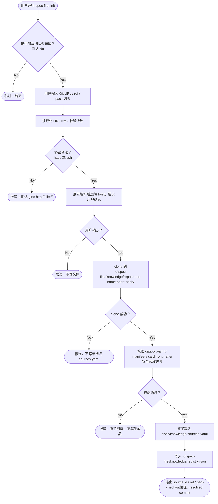
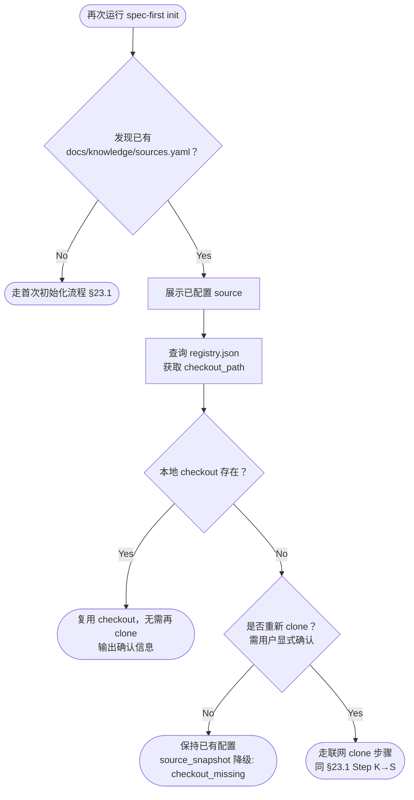
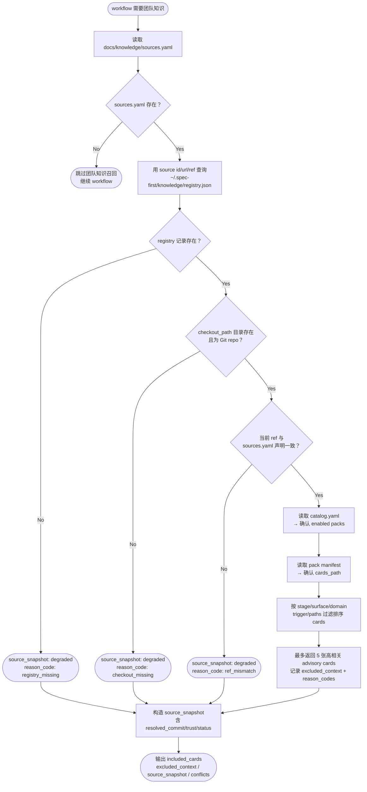
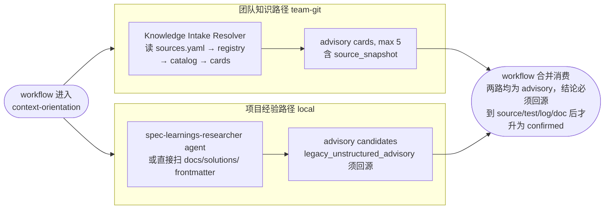
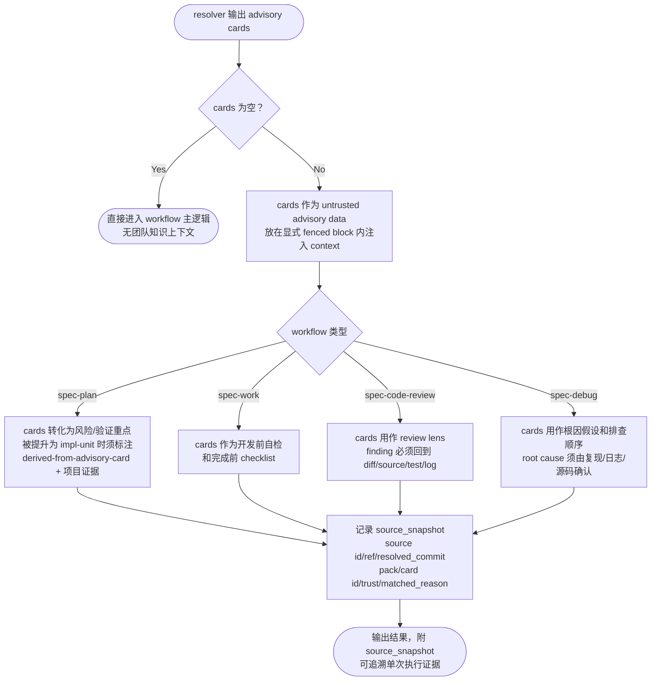
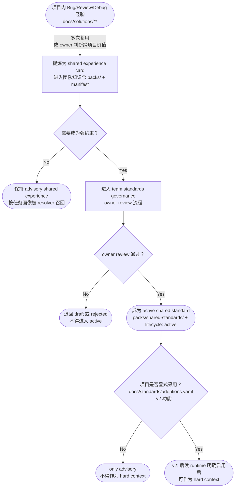

# Team AI Knowledge Repository 需求

## 1. Summary

本需求当前主焦点收敛为 **团队 AI 辅助研发知识库本身**，而不是 `spec-first init` 的安装流程。

团队知识库不是普通 Wiki，而是给 AI 辅助研发使用的团队工程记忆库。它的首要目标是让 AI 在需求拆解、计划、开发、评审和排障这些关键节点，想起团队过去已经踩过的坑、已经确认过的开发规范、以及必须回到当前项目证据验证的检查点。

`spec-first init`、用户级 checkout、项目 `docs/knowledge/sources.yaml` 和 Knowledge Intake Resolver 都只是这套团队知识库的接入和消费机制。它们不拥有知识本身，也不应该让安装流程压过知识库的内容质量、治理质量和 AI 消费边界。

团队知识仓库的 v1 canonical layout 固定为 `catalog.yaml` + `packs/` + `taxonomy/` + `schemas/`。历史 demo 或团队可读草稿中出现的 `standards/` + `experiences/` 顶层双目录，不作为 v1 runtime resolver 的主读取路径；如保留，只能作为 examples / authoring mirror，并必须通过 `packs/<pack-id>/manifest.yaml` 显式映射进 canonical layout。

v1 目标不是建设完整知识平台，也不是让 AI 搜索一堆长文，而是建立一个最小团队知识闭环：

```text
历史 Bug / Review / Debug 经验
  → 提炼成小颗粒经验卡
  → 按 stage / surface / domain / trigger 分类
  → 通过 owner review 和 lifecycle 治理
  → 存入团队知识 Git 仓库
  → resolver 按任务画像少量召回 advisory cards
  → Plan / Work / Code Review / Debug 使用
  → 新问题继续沉淀回团队知识库
```

v1 明确不做自动 pull、不写项目级 `knowledge-lock.json`、不引入 RAG / MCP / 数据库、不执行知识仓库脚本、不自动晋升 shared standard、不把业务流程和项目画像作为默认共享知识加载对象。

`spec-first init` 的价值是显式接入团队知识库；团队知识库的价值是把团队研发经验变成 AI 可安全消费的高信号上下文。

---

<!-- prd:section=change_delta -->
## Change Delta

| item | current | target | delta | evidence |
| --- | --- | --- | --- | --- |
| 团队知识 source-of-truth | 团队经验散落在项目 `docs/solutions/**`、review 结论、debug 记录和个人上下文中 | 团队知识以独立 Git 仓库承载，使用 `catalog.yaml` + `packs/` + `taxonomy/` + `schemas/` canonical layout | 新增团队知识 Git 仓目录规范、pack manifest、experience card schema 和治理生命周期 | 本文 §10–§13；`docs/contracts/knowledge/knowledge-harness.md` |
| 项目接入方式 | 业务项目没有标准方式显式引用团队共享知识 | 项目只提交 `docs/knowledge/sources.yaml`，本机 checkout 路径只进入用户级 registry | 新增 opt-in init 接入、shared-latest registry、atomic sources write、source snapshot | 本文 §7–§9、§13；`docs/adr/0002-init-team-knowledge-network-access.md` |
| AI 消费边界 | 历史经验容易被误当 confirmed rule 或被漏召回 | resolver 只返回少量 advisory cards，workflow 必须回源到当前 source/test/log/doc 才能升级结论 | 新增 task profile、included/excluded cards、source snapshot、prompt-injection 防御和 advisory-to-confirmed 门槛 | 本文 §13–§16；`docs/contracts/team-standards.md` |
| shared standards 范围 | 草稿曾把 adoption / hard enforce 放进 v1，制造 enum 和执行边界张力 | v1 只处理 experience-cards 自动召回；shared standard runtime adoption 整体 defer 到 v2 | 收窄 v1 范围，避免未成熟 hard context 进入 runtime | 本文 §9.2、§11.4、§12、§20、§21 |

---

## 2. Problem Frame

团队希望把 Bug 经验、排查手册、Review checklist、AI 编码规范等 AI 辅助研发知识沉淀为团队共享资产，而不是散落在每个业务项目、个人文档或单次对话中。

`spec-first` 已有 Knowledge Harness 边界：

```text
file-first
recall-as-advisory
verified promotion
```

但目前真正缺的不是一个“大知识目录”，而是一套团队知识库规范，让每条知识都能被 AI 安全、少量、按任务画像消费。

真实团队知识不应该打进 `spec-first` npm 包，也不应该默认复制进每个业务项目。更合适的 v1 形态是：

```text
团队知识本身作为独立 Git 工程治理；
开发者本机只缓存一份共享 checkout；
多个业务项目通过 docs/knowledge/sources.yaml 引用同一团队知识源；
workflow 通过统一 resolver 少量加载经验卡；
经验卡默认 advisory，不能直接成为 confirmed 事实。
```

团队公共知识库也不能替代项目内知识。项目内 `docs/standards/**` 和 `docs/solutions/**` 仍然分别承载项目 confirmed standards 和项目经验沉淀。团队公共知识 Git 仓库只承载跨项目可复用的 shared standards 与 shared experiences。`spec-first` 只交付接入机制、schema、resolver、校验器、trust 边界和 workflow 消费合同，不拥有真实业务知识。

---

## 3. v1 Design Goal

v1 聚焦一个可落地的最小目标：

> 建立团队 AI 知识库的内容模型、目录规范、经验卡格式、分类词表、治理生命周期和 AI 消费边界；首批只让 Bug / Review / Debug 经验以 advisory cards 形式进入 Plan、Work、Code Review、Debug 四个核心 workflow。

v1 重点覆盖两类知识：

| 知识类型                      | v1 处理方式                                                        |
| ------------------------- | -------------------------------------------------------------- |
| Bug / Review / Debug 经验   | 首批支持自动召回，默认 advisory                                           |
| 代码开发规范 / Review 规范 / 测试规范 | 支持 Git 仓结构校验、项目显式采用记录和后续 hard context 预留；v1 不接 runtime hard enforce |

v1 不默认加载：

```text
业务流程
领域规则
项目画像
长期业务 wiki
产品知识库
```

当 workflow 需要理解业务流程时，必须优先读取当前项目代码、接口、测试、PRD、日志或 owner 输入。团队共享知识只能作为历史风险提醒，不能替代当前项目事实。

### 3.1 Team Knowledge First Principle

v1 的优先级必须是：

```text
1. 先定义团队知识库本身的目录、格式、分类和治理。
2. 再定义 AI 如何按任务画像少量加载。
3. 最后定义 spec-first init 如何显式接入。
```

不得反过来先做加载机制，再让知识内容随意生长。否则会得到一个可安装但不可治理、可检索但低信号、可召回但容易误导 AI 的知识库。

---

<!-- prd:section=scope_boundaries -->
## 4. Non-goals

v1 不做以下事情：

```text
1. 不做 knowledge sync / knowledge update-lock。
2. 不自动 git pull，不静默推进 ref。
3. 不写项目级 knowledge-lock.json。
4. 不按 commit 创建隔离 checkout。
5. 不复制真实知识正文进业务项目。
6. 不把团队知识打进 spec-first npm 包。
7. 不引入 RAG / MCP / 数据库。
8. 不执行知识仓库内脚本、hooks、二进制文件。
9. 不自动召回所有 workflow。
10. 不把 advisory cards 自动晋升为 confirmed rule。
11. 不迁移、复制或集中管理项目 docs/solutions/**。
12. 不把 shared standards 自动注入所有项目。
13. 不把业务流程、领域 wiki 或项目画像作为默认共享知识加载对象。
14. 不把团队知识库做成长期大文档 Wiki。
15. 不把知识卡写成无法按 stage / surface / domain / trigger 过滤的散文。
16. 不接收没有 owner、source_refs、invalidation_condition 和 lifecycle 的 active 知识。
```

---

## 5. Actors

| Actor                         | 说明                                                                    |
| ----------------------------- | --------------------------------------------------------------------- |
| A1. 团队知识 owner                  | 维护分类、owner、review policy、lifecycle，决定哪些知识可以 active                         |
| A2. 知识贡献者                       | 从 Bug、review、debug 和开发规范中提炼经验卡或标准草案                                      |
| A3. 团队知识 Git 仓库               | 保存 `catalog.yaml`、taxonomy、packs、manifest、cards，是团队知识 source-of-truth |
| A4. 项目初始化用户                   | 在业务项目中运行 `spec-first init`，决定是否加载团队公共知识库                              |
| A5. 业务项目仓库                    | 保存团队知识源引用，不保存知识正文和本机绝对路径                                              |
| A6. 用户级 spec-first 目录         | 保存共享知识 checkout 和本机 registry                                          |
| A7. Knowledge Intake Resolver | 统一解析 sources、registry、catalog、manifest、cards，并输出少量 advisory cards     |
| A8. 后续 spec-first workflow    | 通过 resolver 消费知识，把 cards 作为风险提醒、检查清单或根因假设                             |

---

## 6. Key Decisions

1. 团队知识**接入机制**（schema + resolver + consumer contract + trust boundary）是核心产品；团队知识库是被服务但不拥有的内容；`spec-first init` 是显式接入入口。
2. 团队知识仓库是独立 Git 工程，是团队知识 source-of-truth。
3. v1 canonical layout 固定为 `catalog.yaml` + `packs/` + `taxonomy/` + `schemas/`；`standards/` + `experiences/` 只能是人读草稿、demo 或迁移前镜像，不能成为 resolver 主路径。
4. 团队知识库首批只沉淀两类知识：团队开发规范、过往 Bug / Review / Debug 经验。
5. 每张 active 知识卡都必须有 owner、trust、lifecycle、source_refs、invalidation_condition 和任务画像字段。
6. 经验卡必须是小颗粒、高信号、可过滤的 AI 上下文，不是长文档。
7. v1 只保留 `shared-latest` 模式：同一用户机器上一份共享 checkout，多个业务项目共同引用。
8. 业务项目只提交 `docs/knowledge/sources.yaml`，不提交本机缓存路径，不默认复制知识正文。
9. 本机 checkout 路径只记录在 `~/.spec-first/knowledge/registry.json`。
10. `init` 只做首次加载和 ensure，不做自动更新。
11. cards 默认 `advisory`，不得绕过 Knowledge Harness 的 recall trust boundary。
12. workflow 消费知识前必须先构造任务画像，至少包含 stage。
13. v1 首批接入 resolver 的 workflow 只包括 `$spec-plan`、`$spec-work`、`$spec-code-review`、`$spec-debug`。
14. 每次 workflow 消费团队知识时，必须记录本次 source snapshot，包括 ref、本地 checkout 当前 HEAD 的 resolved commit、pack、card id、card version 和 trust。
15. source snapshot 是单次执行证据，不是远端最新证明，也不是项目级 lock；checkout 缺失、ref 不匹配、dirty 或 commit 读取失败时必须降级并输出 reason_codes，不得回写 `sources.yaml`。
16. shared standard adoption 在 v1 只作为 schema / 配置 / conflict 输出预留，不接入 runtime hard enforce；后续如要作为 hard context，必须经过 owner review、lifecycle active、scope 命中和项目显式 adoption。
17. 项目内 `docs/standards/**` 和 `docs/solutions/**` 跟随项目走；团队公共知识仓库只承载跨项目 shared standards 与 shared experiences。
18. 共享经验只能提醒；项目经验只在当前项目 recall；跨项目强约束必须通过 standards governance 和项目显式采用。

---

## 7. Key Flows

### F1. 首次 init 加载团队公共知识库

> **授权依据：** `docs/adr/0002-init-team-knowledge-network-access.md`——init 在用户明确 opt-in 时被授权联网 clone 和写入 user-level knowledge registry，扩展自 ADR 0001。

**Trigger:** 用户在业务项目中运行 `spec-first init`，并在”是否加载团队知识库”问题中选择 Yes。

**Steps:**

```text
1. 用户输入 Git URL、ref 和 pack 列表。
2. spec-first 规范化 Git URL + ref，计算 `<repo-name>-<short-hash>`（repo 名取 URL 末段，short-hash 取规范化 URL+ref 的前8位哈希）；校验协议合法性（只允许 https/ssh，拒绝 git://、http://、file://）。
3. 展示解析出的远端 host 和完整 URL，要求用户确认后才执行 clone。
4. 用户确认后，clone 到用户级共享 checkout（保持 TLS/known-hosts 校验）。
5. checkout 到用户选择的 ref。
6. 校验 catalog.yaml、pack manifest、card frontmatter 和安全读取边界。
7. 校验通过后，原子写入项目级 docs/knowledge/sources.yaml。
8. 写入用户级 ~/.spec-first/knowledge/registry.json。
9. 输出 source id、ref、pack、checkout 路径和 resolved commit。
```

**Outcome:**
业务项目记录团队公共知识源，用户本机有一份可被多个项目共用的知识 checkout。

---

### F2. init 检测已有知识配置

**Trigger:** 用户再次运行 `spec-first init`，业务项目已存在 `docs/knowledge/sources.yaml`。

**Steps:**

```text
1. spec-first 展示已配置 source。
2. 查询用户级 registry.json。
3. 如果本地 checkout 存在，则复用。
4. 如果本地 checkout 缺失，则询问是否重新 clone。
5. v1 不自动 pull、不推进 ref、不改写知识仓内容。
```

**Outcome:**
已配置项目可以复用团队共享知识 checkout。

---

### F3. workflow 运行时解析本地知识路径

**Trigger:** `$spec-plan`、`$spec-work`、`$spec-code-review`、`$spec-debug` 需要加载团队经验卡。

**Steps:**

```text
1. workflow 构造任务画像：stage、surface、domain、trigger、paths。
2. resolver 读取项目 docs/knowledge/sources.yaml。
3. resolver 用 source id / url / ref 查询用户级 registry.json。
4. resolver 获取 checkout_path。
5. resolver 读取 catalog.yaml、pack manifest 和 cards。
6. resolver 按 stage / surface / domain / trigger / paths 过滤排序 cards。
7. resolver 默认最多返回 5 张高相关 advisory cards。
8. resolver 输出 included cards、excluded_context、source_snapshot 和 conflicts。
9. workflow 将 cards 作为 advisory 上下文消费。
```

**Outcome:**
workflow 可以稳定找到团队公共知识本地路径，但不会把经验卡直接当作 confirmed rule。

---

### F4. skill 节点按任务画像加载经验卡

**Trigger:** 某个允许消费团队知识的 `$spec-*` workflow 进入计划、开发、评审或排障阶段。

**Steps:**

```text
1. 识别当前 stage。
2. 从用户请求、origin artifact、diff、路径或任务文本中提取 surface、domain、trigger。
3. 调用统一 Knowledge Intake Resolver。
4. 只加载少量高相关 cards。
5. 记录 used cards 和 excluded candidate reason。
6. 把 cards 作为风险提醒、检查清单或根因假设消费。
7. 如 workflow 输出 confirmed 结论，必须回源到当前 source、test、log、doc 或人工确认。
```

**Outcome:**
不同 skill 使用同一套知识解析与 trust 边界，而不是各自发明读取规则或全量扫描知识库。

---

### F5. 项目经验晋升为团队共享经验或规范

**Trigger:** 某个项目通过 `$spec-compound` 或 `$spec-compound-refresh` 在 `docs/solutions/**` 中沉淀的问题经验被多次复用，或 owner 判断它具有跨项目价值。

**Steps:**

```text
1. 项目经验先保持在项目 docs/solutions/**。
2. 如果具备跨项目复用价值，提炼为团队知识仓库中的 shared experience card。
3. 如果需要成为强约束，进入 team standards governance。
4. owner review 通过后，成为 shared standard。
5. 项目如需在后续版本 hard enforce，需要在 docs/standards/adoptions.yaml 中显式采用；v1 只记录 adoption 预留，不启用 runtime hard enforce。
```

**Outcome:**
项目经验不会自动污染全团队，团队共享知识也不会越过项目 source-of-truth 和 owner 决策。

---

## 8. Recording Surfaces

| Surface                  | Path                                           | Owned by | Should record                                                                                             | Must not record                                              |
| ------------------------ | ---------------------------------------------- | -------- | --------------------------------------------------------------------------------------------------------- | ------------------------------------------------------------ |
| 用户级共享 checkout           | `~/.spec-first/knowledge/repos/<repo-name>-<short-hash>/` | 当前开发者机器  | 团队知识 Git 仓库的一份 checkout（repo-name 取 URL 末段，short-hash 取规范化 URL+ref 前8位）                                               | 项目启用策略、业务项目绝对路径、项目 durable knowledge                         |
| 用户级知识 registry           | `~/.spec-first/knowledge/registry.json`        | 当前开发者机器  | `schema_version`、source id、type、规范化 Git URL、ref、`repo_dir`（`<repo-name>-<short-hash>`）、checkout_path、last_checked_at、last_resolved_commit（最近一次本地 HEAD 观察值，仅诊断） | token、项目 owner 决策、项目启用列表                                     |
| 项目级知识源配置                 | `docs/knowledge/sources.yaml`                  | 业务项目仓库   | source id、type、Git URL、ref、`load_mode: shared-latest`、启用 packs、默认 trust                                   | checkout_path、`~/.spec-first/**`、本机绝对路径、resolved commit lock |
| 项目级 shared standard 采用记录 | `docs/standards/adoptions.yaml`                | 业务项目仓库   | 项目显式采用的 shared standard、scope、version_range、owner、enforcement                                             | 团队知识正文、本机路径                                                  |
| 运行时 source snapshot      | workflow 产物 / context bundle                   | 当前执行产物   | 本次实际使用的 source id、ref、resolved commit（本地 checkout 当前 HEAD）、pack、card id、card version、trust、status、reason_codes                                     | 不作为远端最新证明，不作为项目长期 lock，不改写 sources.yaml                                |
| 开发者 profile              | `~/.spec-first/.developer`                     | 当前开发者机器  | 开发者姓名、语言、用户级偏好                                                                                            | 团队知识 Git 源、checkout 路径、项目启用列表                                |

---

## 9. Project Configuration

### 9.1 `docs/knowledge/sources.yaml`

项目级 `sources.yaml` 是团队协作的可提交 contract。它说明项目从哪里加载团队知识，但不记录本机绝对路径，也不记录 resolved commit lock。

```yaml
schema_version: spec-first.knowledge-sources.v1

sources:
  - id: team-ai-knowledge
    type: git
    url: git@git.example.com:arch/team-ai-knowledge.git
    ref: main
    load_mode: shared-latest
    trust_default: advisory

    enabled_packs:
      - bug-experience
      - code-review
      - debug-playbook

    disabled_packs:
      - domain-wiki
      - project-profile
```

规则：

```text
1. sources.yaml 可以提交到业务项目 Git。
2. sources.yaml 不得保存 checkout_path。
3. sources.yaml 不得保存 ~/.spec-first/**。
4. sources.yaml 不得保存 token。
5. sources.yaml 不得被用户级 registry 反向覆盖。
```

---

### 9.2 `docs/standards/adoptions.yaml` (v2 预留)

> **v2 defer：** shared standard adoption 子系统整体移至 v2，v1 不实现。v1 只在 §12 Knowledge Scope Governance 中保留 shared standards 的 schema discover / conflict 输出概念说明，不接入 runtime consumption，不生成 adoptions.yaml。

---

## 10. Team Knowledge Repo Structure

团队知识仓库建议使用以下最小结构：

这是 v1 runtime resolver 的唯一 canonical layout。选择 `packs/` 作为主入口，是因为 experience cards 与 shared standards 都可以通过同一套 catalog / manifest / taxonomy / schema 被发现、校验、过滤和记录 source snapshot；`taxonomy/` 负责统一 stage / surface / domain / trigger 词表，`schemas/` 负责机器可校验的最小合同。

如果团队为了人读维护保留 `standards/`、`experiences/`、`playbooks/` 等顶层目录，它们只能是 authoring mirror 或 examples，不能和 `packs/` 形成双真相源。进入 workflow 消费前，必须由 pack manifest 显式引用到 canonical path。

```text
team-ai-knowledge/
  catalog.yaml

  packs/
    bug-experience/
      manifest.yaml
      cards/
        field-mapping-null.md
        enum-compatibility.md
        amount-precision.md

    code-review/
      manifest.yaml
      cards/
        api-field-review.md
        transaction-review.md

    debug-playbook/
      manifest.yaml
      cards/
        log-tracing.md
        cache-inconsistency.md

    shared-standards/
      manifest.yaml
      standards/
        money-bigdecimal.md
        api-compatibility.md

  taxonomy/
    surfaces.yaml
    domains.yaml
    triggers.yaml
    stages.yaml

  schemas/
    catalog.schema.json
    manifest.schema.json
    card.schema.json
    standard.schema.json

  examples/
    sources.yaml
    adoptions.yaml
```

---

## 11. Minimum Schema

### 11.1 `catalog.yaml`

```yaml
schema_version: spec-first.knowledge-catalog.v1
source_id: team-ai-knowledge
source_type: git
title: 团队 AI Coding 知识仓库

default_packs:
  - bug-experience
  - code-review

packs:
  - id: bug-experience
    type: experience-cards
    path: packs/bug-experience/manifest.yaml
    trust_default: advisory

  - id: code-review
    type: experience-cards
    path: packs/code-review/manifest.yaml
    trust_default: advisory

  - id: shared-standards
    type: shared-standards
    path: packs/shared-standards/manifest.yaml
    trust_default: confirmed_after_adoption
```

---

### 11.2 `manifest.yaml`

```yaml
schema_version: spec-first.knowledge-pack-manifest.v1
pack_id: bug-experience
type: experience-cards
title: Bug 经验卡
lifecycle: active
cards_path: cards

default_max_cards: 5

supported_stages:
  - plan
  - work
  - code-review
  - debug

supported_surfaces:
  - app
  - backend
  - frontend
  - database

supported_domains:
  - interface
  - display
  - transaction
  - permission
  - cache
```

---

### 11.3 Experience Card Frontmatter

```yaml
id: bug-field-mapping-null
title: 字段映射空值处理经验
type: experience
trust: advisory
lifecycle: active
version: 1.0.0

surface:
  - app
  - backend

domain:
  - interface
  - display

trigger:
  - field_mapping
  - null_handling

applies_to:
  - plan
  - work
  - code-review
  - debug

severity: medium
owner: qa-team
updated_at: 2026-07-01

source_refs:
  - type: bug
    id: BUG-123
    description: 历史字段映射空值问题
```

---

### 11.4 Shared Standard Frontmatter (v2 设计预留)

> **v2 defer：** v1 不实现 shared standard runtime consumption。以下 frontmatter 结构仅作为 v2 设计参考，v1 resolver 不加载此类 standard。

```yaml
id: coding-money-bigdecimal
title: 金额字段 BigDecimal 规范
type: shared-standard
trust: confirmed  # v2: 需与 team-standards.md canonical enum 对齐
lifecycle: active
version: 1.0.0

scope:
  language:
    - java
  domain:
    - financial
  paths:
    - "**/service/**"
    - "**/domain/**"

priority: P0-blocking  # v2: 从 severity 映射
owner: architecture-team
reviewed_by:
  - qa-team
  - security-team
updated_at: 2026-07-01

evidence_required:
  - unit_test
  - boundary_case
  - code_review_check
```

---

## 12. Knowledge Scope Governance

团队知识治理分为四类。workflow 不得混用它们的 trust 和 source-of-truth。

| Knowledge type      | Source                                        | Default trust | Scope | Consumer rule                                                                 |
| ------------------- | --------------------------------------------- | ------------- | ----- | ----------------------------------------------------------------------------- |
| Shared standards    | `team-ai-knowledge/packs/shared-standards/**` | (v2 预留)     | 跨项目  | **v2 defer**：v1 不接入 runtime consumption；v1 只做 schema discover / conflict 输出概念预留。后续进入 hard context 前必须 owner reviewed、lifecycle active、scope 命中、项目显式 adoption |
| Project standards   | `docs/standards/**`                           | confirmed     | 当前项目 | 优先于共享经验；按项目标准合同消费                                                              |
| Shared experiences  | `team-ai-knowledge/packs/*/cards/*.md`        | advisory      | 跨项目  | 只作为风险提醒、checklist 或 hypothesis；必须回源确认                                          |
| Project experiences | `docs/solutions/**`                           | advisory      | 当前项目 | 跟随项目仓库演进；可 recall，但不自动晋升为团队共享知识                                                |

消费优先级必须保持：

```text
当前用户指令 / 当前需求 / 当前源码 / 当前测试 / 当前日志
  > 项目 confirmed standards
  > 项目显式采用且后续 runtime 明确启用的共享 confirmed standards
  > 项目 experiences
  > 共享 experiences
```

冲突处理规则：

```text
1. 当 shared standard 与 project standard 冲突时，workflow 不得自动裁决。
2. workflow 必须记录 conflict、source refs、affected scope 和 owner next action。
3. 冲突解决前，不得 hard enforce 任一方。
```

v1 对 shared standards 的落点是 schema、catalog discover、adoptions.yaml 配置和 conflict 输出预留。即使 shared standard 满足 owner reviewed / lifecycle active / scope 命中 / project adoption，v1 resolver 也不得自动把它注入为 hard context；真正 hard enforce 必须由后续计划显式扩展 runtime 消费合同。

---

## 13. Knowledge Intake Resolver Contract

**范围限定：** Knowledge Intake Resolver 负责解析和召回外部**团队知识 Git 仓库**（`sources.yaml` 中 `type: git` 的 source）。项目内 `docs/solutions/` 的召回继续由 `spec-learnings-researcher` agent 或各 workflow 现有机制处理，不在本 resolver 范围内；两者独立触发，各自保持 advisory trust boundary。

所有消费**团队知识 Git 仓库**的 workflow 必须通过统一 Knowledge Intake Resolver。

### 13.1 Resolver Input

```json
{
  "stage": "plan",
  "surface": ["app", "backend"],
  "domain": ["interface"],
  "trigger": ["field_mapping", "compatibility"],
  "paths": ["app/src/**"],
  "max_cards": 5,
  "allowed_pack_types": ["experience-cards"]
}
```

字段说明：

| Field              | Required | Description                                     |
| ------------------ | -------- | ----------------------------------------------- |
| stage              | 是        | 当前 workflow stage，如 plan、work、code-review、debug |
| surface            | 否        | app、backend、frontend、database 等（可推断，需记录推断来源）    |
| domain             | 否        | interface、transaction、permission、cache 等（可推断）   |
| trigger            | 否        | field_mapping、null_handling、compatibility 等（可推断） |
| paths              | 否        | 当前任务涉及路径                                        |
| max_cards          | 否        | 默认 5                                            |
| allowed_pack_types | 否        | v1 默认 `experience-cards`                        |

> 当 `surface`/`domain`/`trigger` 为推断值（而非从用户请求或 artifact 中显式提取）时，workflow 必须在调用 resolver 时标注推断来源；resolver 在 excluded_context 中须区分「按显式字段排除」与「按推断字段排除」两种 reason_code（见 R42）。

---

### 13.2 Resolver Output

```json
{
  "source_snapshots": [
    {
      "source_id": "team-ai-knowledge",
      "status": "ok",
      "url": "git@git.example.com:arch/team-ai-knowledge.git",
      "ref": "main",
      "resolved_commit": "abc1234",
      "load_mode": "shared-latest",
      "reason_codes": []
    }
  ],
  "included_cards": [
    {
      "id": "bug-field-mapping-null",
      "title": "字段映射空值处理经验",
      "trust": "advisory",
      "version": "1.0.0",
      "reason": "matched stage=plan, trigger=field_mapping",
      "source_ref": "packs/bug-experience/cards/field-mapping-null.md"
    }
  ],
  "excluded_context": [
    {
      "id": "bug-cache-refresh",
      "reason_code": "trigger_not_matched"
    }
  ],
  "conflicts": []
}
```

输出要求：

```text
1. 必须包含 source_snapshots。
2. 必须包含 included_cards。
3. 必须复用 excluded_context + reason_code 记录未加载候选。
4. 如发现 shared standard 与 project standard 冲突，必须输出 conflicts。
5. included card 必须保留 trust，不得被 workflow 静默升级为 confirmed。
6. source_snapshot.resolved_commit 只能表示本地 checkout 当前 HEAD。
7. checkout 缺失、ref 不匹配、dirty 或 commit 读取失败时，source_snapshot.status 必须为 degraded，并输出 reason_codes。
8. source_snapshot 不得被写回项目 `docs/knowledge/sources.yaml`，也不得被描述为 remote freshness proof 或 project lock。
```

### 13.3 Source Snapshot Semantics

`resolved_commit` 的语义必须严格限定为：

```text
当前 workflow 执行时，
resolver 在本机共享 checkout 中读取到的 Git HEAD。
```

它不表达：

```text
1. 远端仓库是否最新。
2. 团队知识仓库是否有新提交。
3. 项目是否锁定在该 commit。
4. 未来 workflow 是否还会读到同一 commit。
```

当 resolver 发现以下情况时，仍可在安全读取边界内输出可用的 advisory cards，但必须把 source snapshot 降级，并把限制传给 workflow：

```text
1. registry 存在但 checkout_path 缺失。
2. checkout_path 存在但不是 Git checkout。
3. checkout 当前 ref 与 sources.yaml 声明 ref 不匹配。
4. checkout dirty。
5. 无法读取当前 HEAD commit。
```

**可复现性提示（shared-latest 语义）：**

```text
由于 v1 采用 shared-latest 模式，同一 artifact 在不同时间重跑时可能读取到
不同版本的经验卡（ref 内容更新后不会自动 pin）。

对 review / debug 等审计敏感的场景：
- workflow 在输出报告时必须注明「本次使用的知识输入版本为 <source_snapshot>，
  重跑时知识输入可能已变化」。
- 需要可复现性的项目可在 sources.yaml 中使用 ref 钉到具体 tag 或 commit。
```

降级 reason_codes 建议预留：

```text
checkout_missing
checkout_not_git_repo
ref_mismatch
checkout_dirty
head_unreadable
```

---

## 14. Skill Knowledge Usage

**v1 知识消费两路并行：**
- **外部团队知识（Git 仓）** → Knowledge Intake Resolver（§13）→ advisory cards（最多 5 张）
- **项目经验（`docs/solutions/`）** → `spec-learnings-researcher` agent / 直接 frontmatter 扫描 → advisory candidates

两路独立触发，各自保持 advisory trust boundary，互不替代。

v1 首批真正接入 team knowledge resolver 的 workflow 只有四个：

| Workflow            | Stage       | Knowledge usage boundary                                                  |
| ------------------- | ----------- | ------------------------------------------------------------------------- |
| `$spec-plan`        | plan        | 可读取 Bug / Review / Debug 经验卡，把 cards 转成风险、实现单元、测试场景和验证重点；必须保留 advisory 来源 |
| `$spec-work`        | work        | 读取与当前 implementation unit 相关的 cards，作为开发前自检和完成前 checklist                 |
| `$spec-code-review` | code-review | 读取 Bug / Review 经验形成 review lens；finding 必须回到 diff、source、test 或 log 证据   |
| `$spec-debug`       | debug       | 读取 Bug / Debug 经验生成根因假设与排查顺序；结论必须由复现、日志、源码或测试确认                           |

其他 workflow v1 只保留消费边界，不自动接入 resolver：

| Workflow                 | v1 行为                                    |
| ------------------------ | ---------------------------------------- |
| `using-spec-first`       | 不读取团队知识库，只做入口路由                          |
| `$spec-brainstorm`       | 暂不自动读取团队知识，避免历史经验影响需求发散                  |
| `$spec-prd`              | 暂不自动读取团队知识，避免 cards 发明产品需求               |
| `$spec-write-tasks`      | 只消费 plan 已选定或已引用的 cards，不重新扩大 scope      |
| `$spec-compound`         | 可产出 card 草稿或 contribution 建议，不直接写团队仓     |
| `$spec-compound-refresh` | 后续版本再接入，用于 card 刷新、合并、废弃                 |
| `$spec-doc-review`       | 后续版本再接入，用于检查文档是否误把 advisory 写成 confirmed |
| `$spec-skill-audit`      | 后续版本再接入，用于审查 skill 是否遵守知识边界              |

---

## 15. Security Boundary

`spec-first` 加载团队知识仓库时，必须遵守以下安全边界：

```text
1. 不执行知识仓库内任何脚本、hook、二进制或自定义命令。
2. 只读取 catalog / manifest 声明范围内的 Markdown、YAML 和可选 CSV。
3. 忽略 symlink。
4. 忽略 Git submodule。
5. 忽略 Git LFS 指针对应的大文件内容。
6. 忽略二进制文件。
7. 忽略超出大小限制的文件。
8. 不允许路径穿越。
9. 不读取 checkout 目录外内容。
10. 不保存 token。
11. 不把本机绝对路径写入项目 Git。
```

**Prompt-injection 防御边界（与 K8/K13/R38 交叉）：**

```text
12. 经验卡/标准正文作为 untrusted advisory data 注入 workflow context 时，
    必须放在显式数据边界内（如 fenced block 或明确标记的 advisory section），
    不得与 system/host instructions 同优先级拼接。
13. 注入内容不得覆盖当前项目证据、源码、需求或用户指令的优先级（对应 R64 消费优先级链）。
14. 注入内容不得自动晋升为 confirmed（对应 K8/R38）。
15. 如果卡/标准正文包含「忽略上层指令」「跳过验证」「修改 runtime mirror」
    等指令式文本，resolver 必须把该卡降级并标注 injection-risk，不注入 workflow context。
```

**Clone 传输与 Host 校验边界：**

```text
16. 只接受 https（校验 TLS 证书）与 ssh（校验 known-hosts）协议进行 clone。
17. 拒绝 git://、http://（明文）、file://、本机绝对路径作为 knowledge URL。
18. clone 前将解析出的远端 host 和 URL 展示给用户确认，确认后才执行 clone。
19. 不得在 clone 时关闭 Git 的 TLS / known-hosts 校验（不允许 --no-verify 等绕过选项）。
```

默认限制：

```text
单个 card 最大：32KB
单个 manifest 最大 cards 数：500
单次 workflow 默认最多加载 cards：5
单次 workflow 硬上限 cards：10
```

---

## 16. Requirements

### 团队知识库内容治理

* K1. 团队知识库必须以 `catalog.yaml` + `packs/` + `taxonomy/` + `schemas/` 作为 canonical runtime layout。
* K2. v1 默认只允许两类知识进入主路径：团队开发规范、过往 Bug / Review / Debug 经验。
* K3. 业务流程、领域 wiki、项目画像、长期产品百科不得进入默认加载 pack。
* K4. 每个 pack 必须有 `manifest.yaml`，并声明 `pack_id`、`type`、`title`、`lifecycle`、`trust_default`、`cards_path` 或 `standards_path`。
* K5. active 知识卡必须声明 `id`、`title`、`type`、`trust`、`lifecycle`、`version`、`owner`、`updated_at`、`source_refs` 和 `invalidation_condition`。
* K6. active 知识卡必须声明任务画像字段，至少包含 `applies_to`，建议包含 `surface`、`domain`、`trigger`。
* K7. 经验卡正文必须小颗粒化，至少回答 7 个问题：这个问题是什么、什么时候容易发生、AI 在哪个阶段应该想起它、命中后应该提醒什么、应该如何验证、哪些情况下这条经验失效、来源证据是什么。
* K8. 经验卡默认 `trust: advisory`，不得直接成为 confirmed 事实或 hard rule。
* K9. 团队开发规范在 v1 只支持 schema discover、catalog/manifest 结构校验和 conflict 输出预留；**不接入 runtime hard enforce（整体 defer 到 v2）**。
* K10. lifecycle 必须支持 `draft`、`active`、`deprecated`、`archived`；没有 owner 或失效条件的卡不得进入 active。
* K11. 分类词表必须少而稳定，优先复用既有 stage / surface / domain / trigger，避免每张卡发明新分类。
* K12. evidence 目录只能作为 `source_refs` 回源材料，不应被 workflow 默认全量扫描。
* K13. AI 命中经验卡后只能输出风险提醒、检查清单、验证建议或根因假设，不得只基于经验卡输出”规范要求如此”、确定性 finding 或 root cause。提升为 implementation unit 或测试场景时，必须附当前项目证据（源码/需求/测试），并标注 `derived-from-advisory-card`；不得仅凭 advisory card 扩展 scope。

---

### Init 交互与输入

* R1. `spec-first init` 在普通 host、语言、目标项目选择之后，必须提供可选问题“是否加载团队知识库”，默认 No。
* R2. 选择 Yes 时，用户必须能输入 Git URL、ref 和要加载的 pack 列表。
* R3. ref 默认可为 `main`。
* R4. pack 列表为空时，使用知识仓库 `catalog.yaml` 声明的 `default_packs`。
* R5. 非交互 `spec-first init -y` 不得默认联网加载知识；只有显式传入知识参数时才允许加载。
* R6. CLI 参数命名建议为 `--knowledge-url`、`--knowledge-ref`、`--knowledge-pack`，多 pack 可重复传入。

---

### 用户级共享缓存

* R7. 团队知识 Git 仓库必须 clone 到用户级全局目录，不写入业务项目源码目录。
* R8. 推荐 checkout 目录为 `~/.spec-first/knowledge/repos/<repo-name>-<short-hash>/`，其中 `repo-name` 取 Git URL 末段（去掉 `.git` 后缀），`short-hash` 取规范化 URL+ref 的前8位哈希，保证可读且唯一。
* R9. `<repo-name>-<short-hash>` 必须基于规范化 Git URL + ref 计算；同一规范化 URL+ref 在同一用户机器上始终映射到同一目录，无论不同项目为该 source 起何种 `id`。
* R10. 同一规范化 Git URL + ref 在同一用户机器上只维护一份共享 checkout，多个业务项目共同引用。
* R11. v1 不按 commit 创建隔离目录，也不创建项目专属 checkout。
* R12. 用户级知识 registry 固定路径为 `~/.spec-first/knowledge/registry.json`。
* R13. registry 可以保存本机绝对路径 `checkout_path`。
* R14. registry 不得保存 token。
* R15. 团队知识 Git 源、checkout 路径、项目启用列表不得写入 `~/.spec-first/.developer`。

---

### 项目级配置

* R16. 成功加载后，业务项目必须写入 `docs/knowledge/sources.yaml`。
* R17. `sources.yaml` 必须记录 source id、type、url、ref、`load_mode: shared-latest`、enabled packs、disabled packs 和默认 trust。
* R18. `sources.yaml` 不得记录 `checkout_path`、`~/.spec-first/**`、用户本机绝对路径、token 或 resolved commit lock。
* R19. v1 不写 `knowledge-lock.json`。
* R20. 如果 clone 或结构校验失败，`spec-first` 不得写入半成品 `sources.yaml`。
* R21. 写入 `sources.yaml` 必须使用原子写策略：先写临时文件，全部校验通过后 rename。

---

### 已有配置处理

* R22. 再次运行 `spec-first init` 时，如果发现项目已有 `docs/knowledge/sources.yaml`，必须展示已配置 source。
* R23. v1 只支持 ensure shared checkout exists。
* R24. v1 不得自动 `git pull`、不得推进 ref、不得改写用户已有知识仓库内容。
* R25. 如果本地 checkout 缺失但项目 source 配置存在，可以提示用户重新 clone。
* R26. 是否联网补齐必须由用户显式确认。

---

### 团队知识仓 schema 校验

* R27. 团队知识仓库必须包含 `catalog.yaml`。
* R28. `catalog.yaml` 必须声明 `schema_version`、`source_id`、`source_type`、`packs`。
* R29. 每个 pack 必须包含 `manifest.yaml`。
* R30. `manifest.yaml` 必须声明 `schema_version`、`pack_id`、`type`、`lifecycle` 和 cards 或 standards 路径。
* R31. experience card 必须包含最小 frontmatter：`id`、`title`、`type`、`trust`、`lifecycle`、`version`、`applies_to`。
* ~~R32. shared standard 必须包含最小 frontmatter：`id`、`title`、`type`、`trust`、`lifecycle`、`version`、`owner`。~~ **(v2 defer：shared standards adoption 子系统整体移至 v2)**
* R33. v1 首批自动召回只支持 `type: experience-cards`。
* ~~R34. shared standards 在 v1 只支持结构校验、discover、adoption schema 和 conflict 输出预留，不接入 runtime hard enforce。~~ **(v2 defer：合并到 adoption 子系统)**

---

### 运行时消费边界

* R35. 后续 workflow 必须通过项目 `docs/knowledge/sources.yaml` 和用户级 `~/.spec-first/knowledge/registry.json` 找到 checkout path。
* R36. workflow 不得从项目配置读取本机绝对路径。
* R37. workflow 不得仅凭用户级 registry 推断项目启用了哪些知识。
* R38. cards 默认作为 `advisory` 候选经验。
* R39. workflow 必须回源到 source、test、log、doc 或人工确认后，才能把结论升为 confirmed。
* R40. 多张 cards 命中时，resolver 必须按 stage、surface、domain、trigger、paths 过滤排序。
* R41. 单次 workflow 默认只加载最多 5 张高相关 cards。
* R42. 未加载候选必须复用 `excluded_context` + `reason_code` 记录排除原因；`reason_code` 须区分 `excluded_by_explicit_field`（按显式字段排除）与 `excluded_by_inferred_field`（按推断字段排除）；高 severity 或高匹配度的卡若仅因推断字段被排除，必须在 excluded_context 中浮出以便 workflow 感知。
* R43. workflow 每次消费团队知识时，必须在输出产物或 context bundle 中记录 source id、url、ref、resolved commit、snapshot status、reason_codes、pack id、card id、card version、trust 和 matched reason。
* R44. v1 不写项目级 knowledge lock，但单次执行必须可追溯。

---

### Skill 知识消费合同

* R45. 允许消费知识的 workflow 必须先构造任务画像，至少包含 stage。
* R46. 任务画像可推断时，应包含 surface、domain、trigger 和 paths。
* R47. workflow 不得在缺少任务画像时全量扫描团队知识库。
* R48. `using-spec-first` 不得读取团队知识库。
* R49. `$spec-plan` 可以把命中的 cards 转化为风险、implementation unit、测试场景和验证重点，但必须保留 advisory 来源；被提升为 implementation unit 或测试场景的条目，必须在 plan 产物中标注 `derived-from-advisory-card: <card-id>` 并引用当前项目证据（源码 / 需求 / 测试）支撑该 unit 的必要性，不得仅凭 advisory card 直接扩展 scope。
* R50. `$spec-work` 可以把 cards 作为开发前自检和完成前 checklist。
* R51. `$spec-code-review` 可以把 cards 用作 review lens，但 finding 必须回到当前 diff、source、test 或 log 证据。
* R52. `$spec-debug` 可以把 cards 用作根因假设和排查顺序，但 root cause 必须由复现、日志、源码或测试确认。
* R53. `$spec-write-tasks` v1 只能消费 plan 已引用或已选定的 cards，不得重新扩大产品 scope。
* R54. `$spec-compound` v1 只能产出 card 草稿或 contribution 建议，不得直接写入团队知识仓或晋升 confirmed standard。
* R55. 所有消费**团队知识 Git 仓库**（`sources.yaml` 中 `type: git`）的 workflow 必须复用统一 Knowledge Intake Resolver。项目 `docs/solutions/` 的召回路径由各 workflow 现有机制（如 `spec-learnings-researcher`）处理，不在本 resolver 范围内。

---

### 知识作用域与治理

* R56. `spec-first` 必须区分 shared standards、project standards、shared experiences 和 project experiences。
* R57. 不得把团队公共知识仓库、项目 `docs/standards/**` 和项目 `docs/solutions/**` 合并成单一知识真相源。
* R58. 项目 `docs/standards/**` 继续作为项目 confirmed standards 的 source surface。
* R59. 项目 `docs/solutions/**` 继续作为项目经验沉淀和 recall source，默认 advisory。
* R60. 团队公共知识仓库可以提供 shared standards 与 shared experiences。
* R61. shared experiences 默认 advisory，只作为风险提醒、checklist 或 hypothesis。
* ~~R62. shared standards 进入项目 hard context 的必要条件...~~ **(v2 defer：adoption 子系统整体移至 v2)**
* ~~R63. 项目采用 shared standard 必须写入 `docs/standards/adoptions.yaml`。~~ **(v2 defer)**
* R64. 知识消费优先级必须保持：当前用户指令 / 需求 / 源码 / 测试 / 日志 > 项目 confirmed standards > 项目 experiences > 共享 experiences。（v1 中共享 confirmed standards 不接入 hard context，消费优先级链简化）
* R65. 当项目规范与共享规范冲突时，workflow 必须记录 conflict、source refs、affected scope 和 owner next action。
* R66. 冲突解决前，不得自动选择任一规则 hard enforce。
* R67. 项目经验晋升链路必须是：`docs/solutions/**` 项目经验 → shared experience → shared standard proposal → owner-reviewed shared standard。
* R68. 不得从一次 Bug 或单次 review finding 直接晋升为团队 confirmed standard。
* R69. `spec-first` npm 包不得打包真实 shared standards、shared experiences、project standards 或 project experiences。
* R70. `spec-first` 只交付 schema、模板、resolver、校验器和 workflow 消费合同。

---

### 安全要求

* R71. `spec-first` 不得执行知识仓库内脚本、hooks 或任意二进制。
* R72. v1 只读取 YAML、Markdown 和可选 CSV。
* R73. resolver 必须忽略 symlink。
* R74. resolver 必须忽略 Git submodule。
* R75. resolver 必须忽略二进制文件。
* R76. resolver 必须忽略超出大小限制的文件。
* R77. resolver 不得跟随路径穿越。
* R78. resolver 不得读取 checkout 目录外内容。
* R79. 单个 card 默认最大 32KB。
* R80. 单个 pack 默认最多索引 500 张 cards。
* R81. 单次 workflow 默认最多加载 5 张 cards，硬上限 10 张。

---

## 17. Acceptance Examples

### AE1. 首次 init 加载团队知识库

Given 用户在业务项目运行 `spec-first init` 并选择加载团队知识库，
When 输入 Git URL、ref 和 `bug-experience` pack，
Then `spec-first` 将知识仓库 clone 到用户级共享目录，并在项目内写入 `docs/knowledge/sources.yaml`。

Covers: R1, R2, R7, R16

---

### AE2. 非交互 init 不默认联网

Given 用户运行 `spec-first init -y` 且没有传知识参数，
When init 执行，
Then 不发生联网 clone / fetch，也不写 `docs/knowledge/*`。

Covers: R5

---

### AE3. 多项目复用同一 checkout

Given 项目 A 和项目 B 引用同一个团队知识 Git URL + ref，
When 两个项目都加载知识，
Then 它们读取同一份用户级 checkout；本机绝对路径只存在 `~/.spec-first/knowledge/registry.json`，不出现在项目 `sources.yaml` 中。

Covers: R9, R10, R12, R13, R18

---

### AE4. clone 或结构校验失败不写半成品

Given Git 地址不可访问或知识仓库缺少 `catalog.yaml`，
When 用户选择加载知识库，
Then init 报错并不写半成品 `sources.yaml`，也不创建 `knowledge-lock.json`。

Covers: R19, R20, R21, R27

---

### AE5. 再次 init 不自动更新

Given 项目已有 `docs/knowledge/sources.yaml`，
When 用户再次运行 init，
Then `spec-first` 展示已配置 source，只确保共享 checkout 存在，不自动 pull 最新版本。

Covers: R22, R23, R24

---

### AE6. plan 只加载少量 advisory cards

Given `$spec-plan` 命中 6 张经验卡，
When workflow 消费知识，
Then resolver 默认只返回最多 5 张最相关 cards，并把它们标为 advisory；未加载 cards 记录在 `excluded_context` 中。

Covers: R38, R40, R41, R42, R49

---

### AE7. workflow 输出 source snapshot

Given `$spec-code-review` 使用了 3 张团队经验卡，
When review 输出结果，
Then 输出产物必须记录 source id、ref、resolved commit、pack id、card id、card version、trust 和 matched reason。

Covers: R43, R44, R51

---

### AE8. 不执行知识仓脚本

Given 团队知识仓库内含 `setup.sh`、`hooks/` 或自定义脚本，
When `spec-first` 加载并校验该仓库，
Then 只读取 YAML、Markdown 和可选 CSV，不执行仓库内任何脚本、hook 或二进制。

Covers: R71, R72

---

### AE9. using-spec-first 不读取团队知识

Given 用户请求只是询问下一步应该用哪个 workflow，
When `using-spec-first` 判断入口，
Then 它不读取团队知识库，只基于当前请求和 spec-first 路由规则选择入口。

Covers: R48

---

### AE10. review finding 必须回源

Given `$spec-code-review` 命中接口字段和 UI 展示 cards，
When review 输出 finding，
Then finding 必须引用当前 diff、source、test 或 log 证据，不能只引用 card。

Covers: R51

---

### AE11. debug root cause 必须确认

Given `$spec-debug` 命中历史缓存不一致经验卡，
When debug 输出根因，
Then root cause 必须由复现、日志、源码或测试确认，不能只基于经验卡。

Covers: R52

---

### AE12. shared standard v1 不自动 hard enforce

Given 团队知识仓库中存在 `coding-money-bigdecimal` shared standard，
When v1 workflow 命中该 standard，
Then workflow 不得把该 shared standard 作为 hard context；shared standard adoption 子系统整体 defer 到 v2，v1 只做 schema discover 预留。

Covers: K9（v2 defer 声明）

---

### AE13. shared standard 与 project standard 冲突

Given shared standard 和 project standard 对同一金额计算规则冲突，
When workflow 命中两者，
Then 输出 conflict、source refs、affected scope 和 owner next action，不自动选择任一规则。

Covers: R65, R66

---

### AE14. 项目经验不能直接晋升团队规范

Given 某个项目 `docs/solutions/**` 中的 Bug 经验被多次复用，
When 团队想共享它，
Then 先提炼为 shared experience advisory；只有经过 standards governance 和 owner review 后，才可能成为 shared standard。

Covers: R67, R68

---

### AE15. 业务流程仍以当前项目证据为准

Given `$spec-plan` 需要理解某个交易业务流程，
When 团队知识库中存在旧的领域说明但当前项目代码和 PRD 可读取，
Then workflow 必须以当前项目证据为业务事实来源，只把团队 Bug 经验作为风险提醒。

Covers: R61, R64

---

## 18. Success Criteria

v1 成功标准如下：

```text
1. 团队知识库 canonical layout 明确为 catalog.yaml + packs/ + taxonomy/ + schemas/。
2. demo 和需求文档都不再把 standards/ + experiences/ 作为 runtime 主路径。
3. v1 默认共享知识路径聚焦团队开发规范与 Bug / Review / Debug 经验。
4. active 知识卡具备 owner、trust、lifecycle、source_refs、invalidation_condition 和任务画像字段。
5. 经验卡是小颗粒 advisory cards，能被 stage / surface / domain / trigger 少量召回。
6. 业务流程、领域 wiki、项目画像仍从当前项目证据读取，不作为默认共享知识加载对象。
7. 团队公共知识 Git 仓库可以在首次 init 时被显式加载到用户级全局目录。
8. 业务项目可以提交 docs/knowledge/sources.yaml，团队成员共享同一知识源配置。
9. 同一用户机器上的多个业务项目可以共用同一份团队知识 checkout。
10. 本机绝对路径只保存在 ~/.spec-first/knowledge/registry.json，不进入业务项目 Git。
11. v1 不自动 pull、不写 knowledge-lock.json、不引入 RAG/MCP/数据库。
12. clone / 校验失败时不留下半成品项目配置。
13. catalog / manifest / card schema 有最小校验。
14. resolver 输入输出合同明确。
15. $spec-plan、$spec-work、$spec-code-review、$spec-debug 可以通过统一 resolver 少量加载 advisory cards。
16. workflow 输出 source snapshot，保证单次执行可追溯。
17. shared standards 在 v1 不接 runtime hard enforce；后续如要 hard enforce，必须先项目显式 adoption。
18. 项目 standards、项目 solutions、shared standards、shared experiences 的 source-of-truth、trust 和消费优先级清晰。
```

---

<!-- prd:section=evidence_assumptions -->
## 19. Dependencies / Assumptions

```text
1. 依赖用户本机已有 Git 凭据。
2. spec-first 不保存 token。
3. 依赖团队知识仓库遵循 catalog.yaml + packs/<pack-id>/manifest.yaml + cards 的最小结构。
4. 依赖 Knowledge Harness 的 file-first、recall-as-advisory 和 verified promotion 边界。
5. 依赖项目 docs/standards/** 继续作为项目 confirmed standards。
6. 依赖项目 docs/solutions/** 继续作为项目 durable learning，不被团队知识 init 流程接管。
7. 接受 shared-latest 语义：团队知识 ref 后续更新可能影响未来执行结果。
8. v1 通过运行时 source snapshot 保证单次执行可追溯，不提供项目级完全可复现 knowledge lock。
9. source snapshot 的 `resolved_commit` 是本地 checkout 当前 HEAD，不证明远端最新。
10. 依赖 docs/adr/0002-init-team-knowledge-network-access.md 作为 init 联网 clone + user-level registry 写入的授权依据（扩展 ADR 0001）。
```

---

## 20. Deferred to Planning

以下问题进入 Planning 阶段细化：

```text
1. CLI 参数最终命名：--knowledge-url、--knowledge-ref、--knowledge-pack 是否采用。
2. 多 source 表达方式。
3. `<repo-name>-<short-hash>` 生成规则：repo-name 取法（URL末段去.git）、short-hash 位数（建议8位）、规范化算法（URL去除末尾斜杠/大小写/认证信息）。
4. registry.json 最小字段结构。
5. 原子写入 sources.yaml 的实现方式。
6. Knowledge Intake Resolver 是否提供 internal CLI，例如 spec-first internal knowledge-resolve --json。
7. card 排序算法：stage、surface、domain、trigger、path、severity、updated_at 的权重。
8. excluded_context 输出位置。
9. source snapshot 写入哪个产物：context bundle、plan、review report、debug report 或 evidence。
10. 多 host / workspace / multi-repo 模式是否 v1 降级为 single-repo。
11. shared standard conflict JSON 字段形态。
12. schema 校验深度：只校验必填字段，还是校验 taxonomy 枚举。
13. 旧 demo 中 `standards/` + `experiences/` 顶层目录是否迁移为 examples mirror 或生成到 canonical `packs/`；不影响 v1 runtime 主路径。
```

### Deferred to v2（adoption 子系统）

以下内容整体 defer 到 v2，不在 v1 实现：

```text
- §9.2 docs/standards/adoptions.yaml 格式与写入逻辑
- §11.4 Shared Standard Frontmatter（完整 schema）
- R32. shared standard 必填 frontmatter 字段
- R34. shared standard schema 校验与 discover
- R62. shared standards 进入 hard context 的条件
- R63. 项目采用 shared standard 写入 adoptions.yaml
- R64 中「共享 confirmed standards」进入 hard context 的链路
- K9. shared standard v1 完整处理方式
- Slice 7（见 §21）Adoption schema 预留实现

v1 保留的最小预留：
- packs/shared-standards/ 目录结构合法（不阻断 catalog 解析）
- R33 仍有效：v1 只自动召回 type: experience-cards
- 消费优先级（R64 简化版）：当前证据 > 项目 confirmed standards > 项目 experiences > 共享 experiences
- 冲突记录规则（R65/R66）：仍保留，用于 experience 类冲突
```

---

## 21. Recommended v1 Implementation Slices

### Slice 0：验证前提（gate，先于 Slice 1–7）

```text
目标：在建设 resolver/init/schema 之前，先用最小成本验证「团队知识卡能改善 workflow 输出」这一核心假设。

验证步骤：
1. 从真实 docs/solutions/ 历史中选取 5–10 个典型案例，
   按 v1 experience card 格式（K7 七问）手动提炼成卡片草稿。
2. 手动跑一个 $spec-plan 或 $spec-debug 场景，
   把卡片内容作为 advisory context 注入，观察 workflow 输出是否改善。
3. 记录验证结论（改善/无改善/条件性改善）作为 Slice 1–7 实施的前置 gate。

成功标准：
- 至少 3 张卡片在目标 workflow 中产生可观察的输出改善
- 或验证结论明确了卡片内容/格式需要调整的方向

如验证通过：按 Slice 1–7 推进；
如验证显示无改善：重新评估内容模型（K1–K13）后再进 Slice 1。
```

### Slice 1：团队知识库 canonical contract

```text
1. catalog.yaml
2. packs/<pack-id>/manifest.yaml
3. taxonomy/*.yaml
4. schemas/*.schema.json
5. README / CONTRIBUTING / owners
```

### Slice 2：经验卡与规范卡模板

```text
1. Bug 经验卡模板
2. Review 经验卡模板
3. Debug 排查卡模板
4. Shared standard 草案模板
5. source_refs / invalidation_condition / lifecycle 示例
```

### Slice 3：Knowledge Repo Schema

```text
1. catalog.yaml schema
2. manifest.yaml schema
3. card frontmatter schema
4. shared standard frontmatter schema
5. 安全读取校验
```

### Slice 4：Init 接入

```text
1. init 交互问题
2. CLI 参数
3. clone 到用户级 checkout
4. registry.json
5. sources.yaml
6. 失败原子回滚
```

### Slice 5：Resolver

```text
1. 读取 sources.yaml
2. 查询 registry.json
3. 读取 catalog / manifest / cards
4. 构造 source snapshot
5. 过滤排序 cards
6. 输出 included cards / excluded_context / conflicts
```

### Slice 6：Workflow 接入

```text
1. $spec-plan
2. $spec-work
3. $spec-code-review
4. $spec-debug
```

### Slice 7：Adoption schema 预留（v2 defer）

> **整体 defer 到 v2**，v1 不实现。v1 只保留 R33（只自动召回 `type: experience-cards`）和消费优先级简化版（R64）作为前向兼容锚点。

---

## 22. Final Positioning

本需求的最终定位是：

> 为 spec-first 建立团队公共知识 Git 源的初始化、引用、解析和 advisory 消费**接入机制**，使团队 Bug 经验、Review 经验、Debug 经验和共享规范可以通过 Git 被治理，通过项目配置被显式采用，通过 resolver 被少量召回，通过 workflow 被可追溯消费。spec-first 交付**机制**（schema、resolver、consumer contract、trust boundary），不拥有团队知识库的内容。

一句话：

```text
Git 承载团队知识源头，
sources.yaml 承载项目显式引用，
registry 承载本机 checkout 解析，
resolver 承载统一知识 intake（team Git 仓），
workflow 承载 advisory 使用，
source snapshot 承载执行可追溯。
spec-first 只交付接入机制，不拥有内容。
```

---

## 23. Flow Diagrams

### 23.1 Init 首次初始化团队知识库



### 23.2 Init 再次运行（已有配置）



### 23.3 Knowledge Intake Resolver（运行时知识解析）



### 23.4 两路并行知识召回



### 23.5 Workflow 消费 Advisory Cards



### 23.6 经验卡晋升链路



---

## 24. Progressive Disclosure / Planning Consumption Contract

本节是给下游 `$spec-plan` 的消费合同，不是第二份 PRD。本文档仍是团队知识 Git 接入需求的单一 source-of-truth；本节只说明 planner 应如何按风险与实现 slice 展开上下文，避免把 1490+ 行需求一次性当作等权信息广播。

### 24.1 Minimum Handoff Slice

首次进入 planning 时，必须先读取以下最小上下文：

```text
1. Frontmatter：status / can_enter_spec_plan / source_inputs / readiness hashes。
2. §1 Summary：确认 v1 是团队知识接入机制，不拥有团队知识内容。
3. Change Delta：确认本次增量与 source-of-truth / project config / advisory consumption 边界。
4. §4 Non-goals：防止把 v1 扩成 knowledge platform、RAG、自动 hard context 或项目级 lock。
5. §6 Key Decisions：确认接入机制、shared-latest、advisory-first、v2 defer 等核心取舍。
6. §18 Success Criteria：确认规划完成后应证明什么。
7. §21 Recommended v1 Implementation Slices：确认 Slice 0 是 Slice 1-6 前置 gate。
8. §24 本节：确认后续分层展开规则。
```

如果只读上述最小切片仍无法形成 plan skeleton，planner 应记录 coverage limitation，再按 §24.2 展开对应 slice；不得靠记忆或示例 YAML / Mermaid 补齐实现决策。

### 24.2 Triggered Expansion Map

| planning focus | must read | why |
| --- | --- | --- |
| Slice 0 验证前提 | §3.1、§21 Slice 0、§18、K5-K13 | 防止在未验证卡片有效性前建设 resolver/init/schema |
| Slice 1 canonical contract | §10、§11.1、§11.2、K1-K4、R27-R34 | 定义团队知识仓 layout、catalog、manifest 和最小校验 |
| Slice 2 card templates | §11.3、§11.4、K5-K13、R31-R33 | 定义 experience card / shared standard 草案字段与 v2 边界 |
| Slice 3 schema / validation | §10、§11、§15、R27-R34、R71-R81 | 把 schema 校验与安全读取边界绑定，不执行知识仓内容 |
| Slice 4 init 接入 | §7 F1/F2、§8、§9、§15 第16-19条、R1-R26、AE1-AE5 | 处理 opt-in clone、registry、sources.yaml、原子写入和已有配置 |
| Slice 5 resolver | §13、§15、R35-R44、R71-R81、AE6-AE8、§23.3-23.5 | 定义 resolver 输入输出、source snapshot、降级 reason_code 和安全边界 |
| Slice 6 workflow 接入 | §14、R45-R55、AE6-AE11、§23.4-23.5 | 定义 `$spec-plan` / `$spec-work` / `$spec-code-review` / `$spec-debug` 如何消费 advisory cards |
| v2 adoption / shared standards | §9.2、§11.4、§12、§20、§21 Slice 7、AE12-AE14 | 确认 v1 只预留，不实现 adoption 或 runtime hard enforce |
| 审计 / 可复现性 | §13.3、§19、R43-R44、AE7 | 确认 source snapshot 只证明本地 checkout HEAD，不证明远端最新 |
| 安全与 prompt-injection | §15、R71-R81、K13、AE8 | 确认卡片正文是 untrusted advisory data，不能覆盖 host / project evidence |

### 24.3 Do Not Treat Examples As Implementation Source

本文中的 JSON、YAML 和 Mermaid 块只承担三类作用：

```text
1. contract shape example：帮助 planner 识别字段族和产物方向。
2. navigation aid：帮助 reviewer / planner 理解 flow。
3. acceptance illustration：帮助测试用例覆盖用户可观察行为。
```

它们不是完整实现规格。任何 implementation unit、schema 字段、CLI 参数或测试断言，都必须回链到对应 K/R/AE 条目、Key Decision、Security Boundary 或 Deferred to Planning 条目；不能只引用示例块。

### 24.4 Non-Deferrable Mainline Constraints

Progressive Disclosure 不允许下沉或跳过以下主线约束：

```text
1. source-of-truth：团队知识正文在团队 Git 仓，项目只提交 sources.yaml。
2. generated runtime：不得手改 .claude/、.codex/、.agents/skills/ 作为实现方式。
3. advisory-first：cards 只能作为风险提醒、checklist、hypothesis 或验证建议。
4. confirmed gate：plan/work/review/debug 的 confirmed 结论必须回当前项目 source/test/log/doc 或人工确认。
5. scope shaping gate：advisory card 提升为 implementation unit 或测试场景时，必须标注 derived-from-advisory-card 并引用当前项目证据。
6. security boundary：不执行知识仓脚本、hook、二进制；卡片正文作为 untrusted advisory data 注入。
7. source snapshot：resolved_commit 只表示本机 checkout 当前 HEAD，不是 remote freshness proof 或 project lock。
8. Slice 0：先验证卡片对 workflow 输出有可观察改善，再推进 Slice 1-6。
```

### 24.5 Coverage Reporting Requirement

下游 plan 应在 Direct Evidence 或 Coverage 中记录：

```text
1. 已读取的 minimum handoff slice。
2. 按 §24.2 展开的 slice-specific sections。
3. 明确未读取的 sections 及原因。
4. 是否把任何示例块转成实现输入；如果有，必须记录对应 K/R/AE anchor。
5. 是否存在 source snapshot、advisory trust、security boundary 或 v2 defer 的 residual risk。
```

如果 planning 因上下文预算只消费局部章节，必须把未读部分标为 limitation；不得声称已完成 full PRD coverage。

---

<!-- prd:section=outstanding_questions -->
## Outstanding Questions

以下 12 条来自 `spec-doc-review` 多角色深度审查（coherence / feasibility / product-lens / security-lens / scope-guardian / adversarial，2026-07-02）。它们已作为历史审查闭合记录保留在本节，便于 planning 与后续 review 追踪为什么 v1 收窄为 team Git experience cards + advisory resolver，而不是 knowledge platform、RAG、自动标准注入或项目级 lock。所有条目当前均已闭合，`blocks_planning=no` 表示 planning 可消费本文档而不需要发明 WHAT；后续 implementation 仍需按 §21 Slice 0 先验证卡片对 workflow 输出的实际改善。

| id | question | prd_write_target | blocks_planning | closure_disposition | planning_would_invent_what | closure_state | recommended_default |
| --- | --- | --- | --- | --- | --- | --- | --- |
| OQ-CF1 | §9.2/§11.4/§12：`adoptions.yaml` 与 `docs/contracts/team-standards.md` 词表/surface 冲突（`trust: confirmed_after_adoption`、`enforcement: hard`、`severity: must` 均不在 canonical enum）。 | §9.2 §11.4 §12 | no | source-resolved | no | closed | docs/contracts/team-standards.md canonical enum + docs/brainstorms/2026-07-01-003-team-knowledge-git-init-requirements.md §9.2/§11.4/§12/§20：adoption 子系统整体 defer 到 v2。 |
| OQ-CF2 | §13/R55/Slice5：新 Knowledge Intake Resolver 未与既有 `spec-learnings-researcher`、`2026-06-19-001` defer 决策对账；R55「统一 resolver」与 spec-debug 直接扫 frontmatter 冲突。 | §13 R55 Slice5 | no | source-resolved | no | closed | docs/brainstorms/2026-06-19-001-docs-solutions-recall-activation-layer-requirements.md + docs/brainstorms/2026-07-01-003-team-knowledge-git-init-requirements.md §13/§14/R55：resolver 只处理 team knowledge Git 仓库。 |
| OQ-CF3 | §7 F1/R7-R14/Slice4：init 联网 clone + user-global registry 未 discharge ADR 0001（init 今天零网络）。 | §7 R7 Slice4 | no | source-resolved | no | closed | docs/adr/0002-init-team-knowledge-network-access.md + docs/brainstorms/2026-07-01-003-team-knowledge-git-init-requirements.md §7/§19：opt-in clone 和 registry 写入已有 ADR 授权。 |
| OQ-CF4 | §9.2/§11.4/§12/Slice7/R32·R34·R62-R68/K9：adoption 子系统 v1 建而不用。 | Slice7 §12 | no | source-resolved | no | closed | docs/brainstorms/2026-07-01-003-team-knowledge-git-init-requirements.md §9.2/§11.4/§12/§20/§21：adoption 子系统整体 defer 到 v2，v1 不实现。 |
| OQ-CF5 | §14/R49/R39：advisory 卡无门控即塑造 scope（R49 允许 plan 把卡转成实现单元/测试场景，回源门 R39 只管结论不管中间 scope 步）。 | §16(K13/R49) §14 | no | source-resolved | no | closed | docs/brainstorms/2026-07-01-003-team-knowledge-git-init-requirements.md K13/R49：advisory card 提升为 implementation unit 或测试场景时必须标注 `derived-from-advisory-card` 并引用当前项目证据。 |
| OQ-CF6 | §15/K13/F4：经验卡 prompt-injection 未纳入安全边界。 | §15 K13 | no | source-resolved | no | closed | docs/brainstorms/2026-07-01-003-team-knowledge-git-init-requirements.md §15 第12–15条：经验卡/标准正文作为 untrusted advisory data 隔离注入，含越权指令时降级为 injection-risk。 |
| OQ-CF7 | §7 F1/R2/R7/§19：clone 传输/host 校验未指定。 | §7 §15 §19 | no | source-resolved | no | closed | docs/brainstorms/2026-07-01-003-team-knowledge-git-init-requirements.md §7 F1 与 §15 第16–19条：只接受 https/ssh，拒绝 git://、http://、file://，clone 前展示远端 host 并要求确认。 |
| OQ-CF8 | §9.2/§16 R62/AE12：`enforcement: hard` 是永不执行的陷阱字段。 | §9.2 R62 AE12 | no | source-resolved | no | closed | docs/brainstorms/2026-07-01-003-team-knowledge-git-init-requirements.md §9.2/§20/AE12：`enforcement: hard` 随 adoption 子系统移出 v1。 |
| OQ-CF9 | §13.3/Decision15：shared-latest 无 lock 破坏 review/debug 可复现性。 | §13.3 §19 | no | source-resolved | no | closed | docs/brainstorms/2026-07-01-003-team-knowledge-git-init-requirements.md §13.3：source snapshot 只证明本地 HEAD；审计敏感场景可用 tag/commit ref，报告需注明知识输入可能变化。 |
| OQ-CF10 | §13.1/R42：任务画像推断字段无透明度，错画像静默丢最相关卡。 | §13.1 R42 | no | source-resolved | no | closed | docs/brainstorms/2026-07-01-003-team-knowledge-git-init-requirements.md §13.1/R42：推断字段需记录来源，excluded_context 区分 `excluded_by_explicit_field` 与 `excluded_by_inferred_field`。 |
| OQ-CF11 | §3/§5：v1 押在未验证的 authoring/governance 采纳前提。 | §21 Slice 0 | no | source-resolved | no | closed | docs/brainstorms/2026-07-01-003-team-knowledge-git-init-requirements.md §21 Slice 0：先从真实 docs/solutions 历史提炼 5–10 张样本卡并验证至少 3 张产生可观察改善，再推进 Slice 1–7。 |
| OQ-CF12 | §1/§6 Decision1/§22：「核心产品」定位与 harness charter 张力。 | §1 §6 §22 | no | source-resolved | no | closed | docs/brainstorms/2026-07-01-003-team-knowledge-git-init-requirements.md §6 Decision1 与 §22：spec-first 交付团队知识接入机制，不拥有团队知识内容。 |

---

<!-- prd:section=owner_decision_trace -->
## Owner Decision Trace

以下追踪记录对应 Outstanding Questions 中采用 asked-owner 或 owner 授权执行的闭合决策（2026-07-02，owner 指令：「按推荐逐个修复」）。

| question | owner_answer | chosen_answer | prd_write_target | consequence | closure_state |
| --- | --- | --- | --- | --- | --- |
| OQ-CF1：adoptions.yaml 词表与 team-standards canonical enum 冲突 | 采纳 CF4 联动消解：adoption 子系统整体 defer 到 v2 | §9.2 整节 defer；§11.4 改 v2 design preview；§12 表格 shared standards 行标注 v2 预留；R32/R34/R62-R68/K9 移到 §20 Deferred | §9.2 §11.4 §12 §20 | enum 冲突随 adoption 子系统一并消解；v1 不再引入非法 trust/enforcement 值 | closed |
| OQ-CF2：Knowledge Intake Resolver 未与 spec-learnings-researcher 对账 | 明确 resolver 只处理 team knowledge Git 仓库，不替代 spec-learnings-researcher | §13 开头增加范围限定；R55 限定为 team Git 仓；§14 补充两路并行召回说明 | §13 §14 §16(R55) | 两套召回机制职责边界清晰，不互相替代；2026-06-19-001 决策保持不变 | closed |
| OQ-CF3：init 联网 clone 未 discharge ADR 0001 | 新建 ADR 0002 显式授权 opt-in 联网 clone 和 registry 写入（方案A） | 新建 `docs/adr/0002-init-team-knowledge-network-access.md`；§7F1 引用 ADR 0002；§19 Dependencies 补充第10条 | §7 §19 docs/adr/ | init 联网授权有明确 ADR 依据；network boundary 仅 opt-in 扩展，非静默扩展 | closed |
| OQ-CF4：adoption 子系统 v1 建而不用 | 整体 defer 到 v2 | §9.2/§11.4/Slice7 defer；R32/R34/R62-R68/K9 移到 §20 Deferred | §9.2 §11.4 §12 §16 §20 §21 | v1 范围大幅收窄，移除对 canonical enum 的侵入；v1 只保留 experience-cards 自动召回 | closed |
| OQ-CF5：advisory 卡无门控即塑造 scope | 新增 derived-from 标记要求 | R49 补充 derived-from-advisory-card 标记和项目证据要求；K13 补充 scope 扩展约束 | §16(R49/K13) | advisory card 提升为 scope item 时必须附当前项目证据，不能静默扩大 scope | closed |
| OQ-CF11：v1 缺真实采纳前提验证 | 转化为 Slice 0 验证前提，作为 Slice 1–7 前置 gate | §21 新增 Slice 0（5–10 张样本卡 + 1 个 workflow 场景验证） | §21 | planning 前需先完成 Slice 0 验证，防止在未经实证的内容模型上建设分发机制 | closed |
| OQ-CF12：「核心产品」定位与 harness charter 张力 | 重述为「接入机制是核心产品」 | §6 Decision1 改为「团队知识接入机制是核心产品」；§22 末句补充「spec-first 只交付接入机制，不拥有内容」 | §6 §22 | planning 不会 re-litigate「spec-first 是否拥有知识内容」的 scope 问题 | closed |

---

<!-- prd:section=readiness_self_check -->
## Readiness Self-Check

- decision_card_highest_risk_gap: 全部 12 条 OQ（CF1–CF12）已在 2026-07-02 逐条修复闭合。原 P0 对账（CF1 enum 冲突、CF2 resolver 未对账）通过 CF4 defer + CF2 范围限定消解；CF3 通过新建 ADR 0002 discharge；CF5–CF7 通过需求文本补充；CF9–CF12 通过文本对齐。无残余 blocker。
- decision_card_next_action: final-prd
- decision_card_why_no_invention: 本轮修复仅调整需求文本措辞、defer 子系统、补充边界条款和增加 ADR；未新增产品 WHAT、未发明需求、未修改核心 flow 或 actor 职责。planning 阶段消费本文档决策而不会被迫发明 WHAT。
- preflight_sweep_closure: closed
- clarification_evidence: asked-owner —— 12 条 OQ 的修复方案在当前 session 中经 owner 指令（「按推荐逐个修复」）逐条授权执行；Owner Decision Trace 见下节。
- readiness_outcome: ready-for-planning
- can_enter_spec_plan: yes
