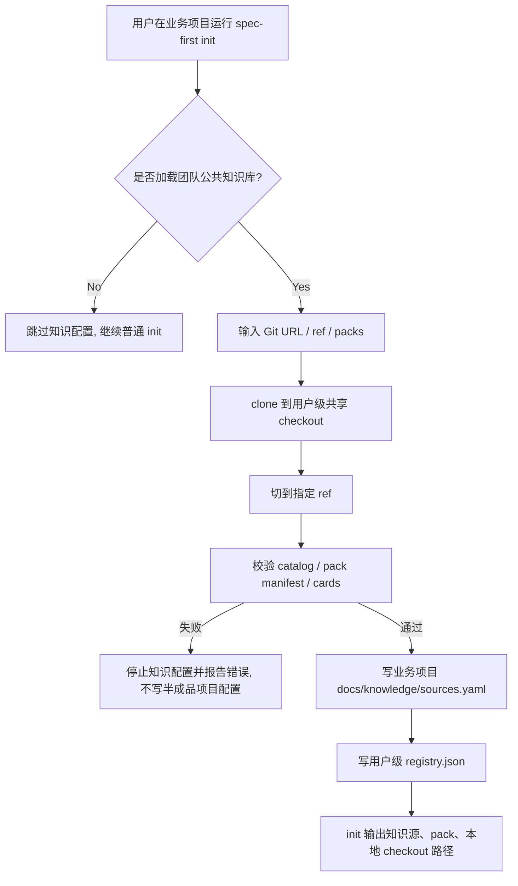
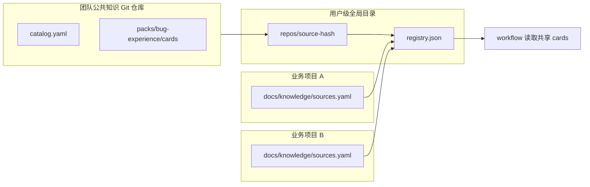
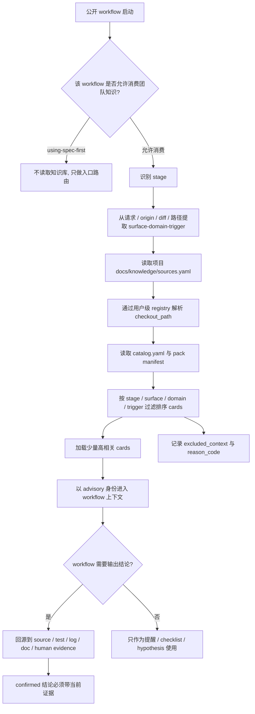
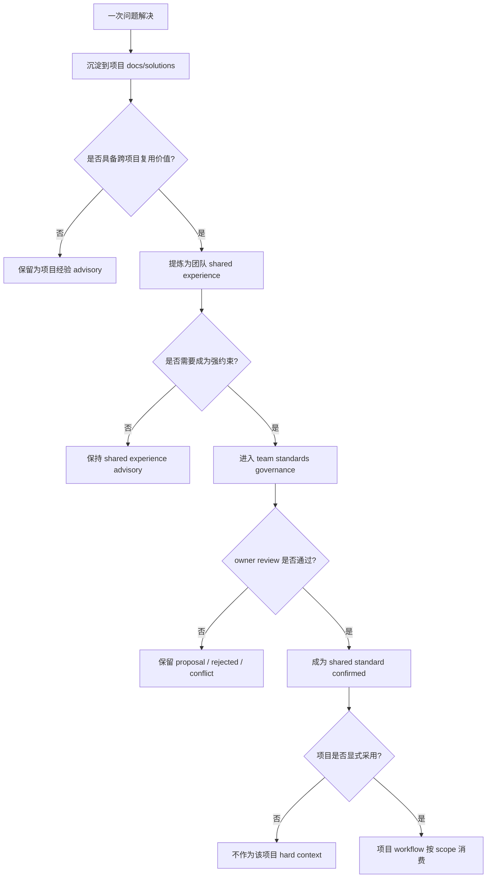

# Team Knowledge Git Init

## Summary

为 `spec-first init` 增加一个可选的团队公共知识 Git 源加载步骤：用户在首次初始化业务项目时显式输入团队知识仓库 Git 地址、ref 和知识包范围，`spec-first` 将该知识仓库 clone 到用户级全局目录的一份共享 checkout，并在业务项目中写入可提交的 `docs/knowledge/sources.yaml`。v1 只保留 shared-latest 模式，不做知识锁定、commit 隔离、自动 pull 或长期规则晋升；同时定义各 workflow 后续按共同 Knowledge Intake 合同消费少量 advisory cards 的边界。

---

## Problem Frame

团队希望把 Bug 经验、排查手册、review checklist 等 AI 辅助研发知识沉淀为团队共享资产，而不是散落在每个业务项目或单次对话中。`spec-first` 已有 Knowledge Harness 边界：file-first、recall-as-advisory、verified promotion；但还缺一个让团队公共知识库被业务项目稳定发现和加载的初始化入口。

真实团队知识不应打进 `spec-first` npm 包，也不应默认复制进每个业务项目。更合适的 v1 形态是：团队知识本身作为独立 Git 工程治理，开发者本机只缓存一份共享 checkout，多个业务项目通过 `docs/knowledge/sources.yaml` 引用同一团队知识源。后续 workflow 运行时通过用户级 registry 找到本地 checkout 后，再按触发词读取少量经验卡。

团队公共知识库不应替代项目内知识。`docs/standards/**` 和 `docs/solutions/**` 仍跟随业务项目仓库，分别承载项目 confirmed standards 和项目经验沉淀；团队公共知识 Git 仓库只承载跨项目可复用的 shared standards 与 shared experiences。`spec-first` 只提供接入、解析、筛选、trust 边界和治理合同，不拥有真实业务知识。

---

## Actors

- A1. 项目初始化用户：在业务项目中运行 `spec-first init`，决定是否加载团队公共知识库。
- A2. 业务项目仓库：保存团队知识源引用，但不保存知识正文和本机绝对路径。
- A3. 团队知识 Git 仓库：保存 `catalog.yaml`、taxonomy、知识包和经验卡，是团队知识 source-of-truth。
- A4. 用户级 spec-first 目录：保存共享知识 checkout 和本机 registry。
- A5. 后续 spec-first workflow：通过项目 source 配置和用户 registry 找到本地知识 checkout，并把命中的 cards 作为 advisory 上下文。

---

## Key Flows

- F1. 首次 init 加载团队公共知识库
  - **Trigger:** 用户在业务项目中运行 `spec-first init`，并在“是否加载团队知识库”问题中选择 Yes。
  - **Actors:** A1, A2, A3, A4
  - **Steps:** 用户输入 Git 地址、ref 和知识包范围；`spec-first` clone 到用户级共享 checkout；切到用户选择的 ref；校验知识仓库结构；写项目级 `docs/knowledge/sources.yaml`；写用户级 `registry.json`，记录本地 checkout 路径。
  - **Outcome:** 业务项目记录团队公共知识源，用户本机有一份可被多个项目共用的知识 checkout。
  - **Covered by:** R1, R2, R3, R4, R5, R6, R7, R8, R9, R10

- F2. init 检测已有知识配置
  - **Trigger:** 用户再次运行 `spec-first init`，业务项目已存在 `docs/knowledge/sources.yaml`。
  - **Actors:** A1, A2, A4
  - **Steps:** `spec-first` 展示已配置知识源；查询用户级 `registry.json`；若本地 checkout 存在则复用；若缺失则询问是否重新 clone。
  - **Outcome:** 已配置项目可以复用团队共享知识 checkout；v1 不自动 pull、不更新 ref。
  - **Covered by:** R11, R12, R13

- F3. workflow 运行时解析本地知识路径
  - **Trigger:** 后续 `$spec-plan`、`$spec-work`、`$spec-code-review`、`$spec-debug` 等需要加载项目知识。
  - **Actors:** A2, A4, A5
  - **Steps:** workflow 读取项目 `docs/knowledge/sources.yaml`；用 source id/url/ref 查询用户级 `registry.json`；得到 `checkout_path`；读取 checkout 中的 `catalog.yaml`、pack manifest 和 cards；按触发词选择少量 cards；将 cards 标记为 advisory 后消费。
  - **Outcome:** workflow 可找到团队公共知识本地路径，但不会把经验卡直接当作 confirmed rule。
  - **Covered by:** R14, R15, R16

- F4. skill 节点按任务画像加载经验卡
  - **Trigger:** 某个允许消费知识的 `$spec-*` workflow 进入需求、计划、任务拆分、开发、评审、排障或知识沉淀阶段。
  - **Actors:** A2, A4, A5
  - **Steps:** workflow 先识别自身 stage；从用户请求、origin artifact、diff、路径或任务文本中提取 surface、domain、trigger；调用共同 resolver 获取候选 cards；只加载少量高相关 cards；记录 used cards 和 excluded candidate reason；把 cards 作为风险提醒、检查清单或根因假设消费。
  - **Outcome:** 不同 skill 使用同一套知识解析与 trust 边界，而不是各自发明读取规则或全量扫描知识库。
  - **Covered by:** R17, R18, R19, R20, R21, R22, R23, R24

- F5. 项目经验晋升为团队共享经验或规范
  - **Trigger:** 某个项目通过 `$spec-compound` 或 `$spec-compound-refresh` 在 `docs/solutions/**` 中沉淀的问题经验被多次复用，或 owner 判断它具有跨项目价值。
  - **Actors:** A2, A3, A5
  - **Steps:** 项目经验先保持在项目 `docs/solutions/**`；若具备跨项目复用价值，提炼为团队知识仓库中的 shared experience card；若需要成为强约束，再通过 team standards governance 提议晋升为 shared standard；项目采用共享标准时仍要在项目侧显式记录或选择启用。
  - **Outcome:** 项目经验不会自动污染全团队，团队共享知识也不会越过项目 source-of-truth 和 owner 决策。
  - **Covered by:** R25, R26, R27, R28, R29, R30, R31, R32

---

## Flow Diagram





---

## Skill Knowledge Usage

各 `$spec-*` workflow 使用团队知识库时必须先构造任务画像，再加载少量高相关 cards。`using-spec-first` 是入口路由治理，不消费团队知识，避免知识内容影响 workflow admission。

| Workflow | Stage | Knowledge usage boundary |
| --- | --- | --- |
| `using-spec-first` | routing | 不读取团队知识库，只判断当前请求应进入哪个公开 workflow。 |
| `$spec-brainstorm` | brainstorm | 可读取 `requirement-checklist`、`bug-experience` 作为历史风险提醒，但不能让经验卡发明产品需求。 |
| `$spec-prd` | prd | 可读取需求验收边界、项目画像和领域 wiki，用于补齐异常态、多端边界和验收问题；未确认内容必须标注为 assumption 或 open question。 |
| `$spec-plan` | plan | 可读取 `bug-experience`、工程 wiki 和项目画像，把 cards 转成风险、实现单元、测试场景和验证重点。 |
| `$spec-write-tasks` | tasks | 只消费 plan 已引用或已选定的 cards，把知识影响落到任务说明和验收点，不重新扩大 scope。 |
| `$spec-work` | work | 读取与当前 implementation unit 相关的 cards，作为开发前自检和完成前 checklist。 |
| `$spec-code-review` | code-review | 读取 `bug-experience` 和 `code-review` 形成 review lens；finding 必须回到 diff、source、test 或 log 证据。 |
| `$spec-debug` | debug | 读取 `bug-experience` 和 `debug-playbook` 生成根因假设与排查顺序；结论必须由复现、日志、源码或测试确认。 |
| `$spec-compound` | compound | 从已解决问题中产出新 card 草稿或更新建议，默认落到团队知识仓库的 contribution flow，而不是直接晋升 confirmed rule。 |
| `$spec-compound-refresh` | refresh | 检查旧 cards 是否过期、重复、冲突，建议 deprecated、retired、merge 或补 source_refs。 |
| `$spec-doc-review` | doc-review | 检查需求、计划或任务文档是否误把 advisory cards 写成 confirmed 结论。 |
| `$spec-skill-audit` | audit | 审查 skill 是否遵守少量加载、advisory、回源确认和不全量扫描的知识边界。 |



---

## Knowledge Scope Governance

团队知识治理分为四类：共享规范、项目规范、共享经验、项目经验。它们的 source-of-truth、trust 和消费边界不同，workflow 不得混用。

| Knowledge type | Source | Default trust | Scope | Consumer rule |
| --- | --- | --- | --- | --- |
| Shared standards | `team-ai-knowledge/standards/**` | confirmed after owner review | 跨项目 | 只有被项目显式采用、scope 命中且 lifecycle active 时，才作为 hard context。 |
| Project standards | `docs/standards/**` | confirmed | 当前项目 | 优先于共享经验；按 `docs/contracts/team-standards.md` 的 selection contract 消费。 |
| Shared experiences | `team-ai-knowledge/experiences/**` 或 `packs/*/cards/*.md` | advisory | 跨项目 | 只作为风险提醒、checklist 或 hypothesis；必须回源确认。 |
| Project experiences | `docs/solutions/**` | advisory | 当前项目 | 跟随项目仓库演进；可被 recall，但不自动晋升为团队共享知识。 |

消费优先级应保持：

```text
当前用户指令 / 当前需求 / 当前源码 / 当前测试 / 当前日志
  > 项目 confirmed standards
  > 项目显式采用的共享 confirmed standards
  > 项目 experiences
  > 共享 experiences
```

当共享规范与项目规范冲突时，workflow 不得自动裁决。它必须记录 conflict、source refs、affected scope 和 owner next action；冲突解决前不得 hard enforce 任一方。



---

## Requirements

**Init 交互与输入**
- R1. `spec-first init` 在普通 host、语言、目标项目选择之后，必须提供可选问题“是否加载团队知识库”，默认 No。
- R2. 选择 Yes 时，用户必须能输入 Git URL、ref 和要加载的 pack 列表；ref 默认可为 `main`，pack 列表为空时使用知识仓库 catalog 声明的默认 pack。
- R3. 非交互 `spec-first init -y` 不得默认联网加载知识；只有显式传入知识参数时才允许加载。

**用户级共享缓存**
- R4. 团队知识 Git 仓库必须 clone 到用户级全局目录，不写入业务项目源码目录；推荐结构为 `~/.spec-first/knowledge/repos/<source-hash>/`。
- R5. 同一规范化 Git URL + ref 在同一用户机器上只维护一份共享 checkout，多个业务项目共同引用这份 checkout；v1 不按 commit 创建隔离目录，也不创建项目专属 checkout。
- R6. 用户级 `registry.json` 可以保存本机绝对路径；项目级配置不得保存本机绝对路径。
- R7. `spec-first` 不得执行知识仓库内脚本；v1 只读取 YAML、Markdown 和可选 CSV。

**项目级配置**
- R8. 成功加载后，业务项目必须写入 `docs/knowledge/sources.yaml`，记录 source id、type、url、ref、packs 和默认 trust；默认 trust 复用 `knowledge-harness.md` 的 recall advisory 语义（对齐 `provider_untrusted`），不新建第二套 trust/evidence enum。
- R9. v1 不写 `knowledge-lock.json`，不锁定 resolved commit，不生成 commit 隔离 checkout。
- R10. 如果 clone 或结构校验失败，`spec-first` 不得写入半成品 `sources.yaml`。

**已有配置处理**
- R11. 再次运行 `spec-first init` 时，如果发现项目已有 `docs/knowledge/sources.yaml`，必须展示已配置 source。
- R12. v1 只支持 ensure shared checkout exists；不得自动 `git pull`、不得推进 ref、不得改写用户已有知识仓库内容。
- R13. 如果本地 checkout 缺失但项目 source 配置存在，可以提示用户重新 clone；是否联网补齐必须由用户显式确认。

**运行时消费边界**
- R14. 后续 workflow 通过项目 `docs/knowledge/sources.yaml` 和用户级 `registry.json` 找到 checkout path，不从项目配置读取本机绝对路径。
- R15. cards 默认作为 `advisory` 候选经验；workflow 必须回源到 source/test/log/doc 或人工确认后，才能把结论升为 confirmed。
- R16. 多张 cards 命中时，workflow 应先按 stage、surface、domain、trigger 过滤排序，默认只加载少量高相关 cards，并复用 `context-bundle.v1` 的 `excluded_context` + `reason_code` 记录 excluded candidate reason，不新增 included/omitted 字段。

**Skill 知识消费合同**
- R17. 允许消费知识的 workflow 必须先构造任务画像，至少包含 stage，并在可推断时包含 surface、domain、trigger；不得在缺少任务画像时全量扫描团队知识库。
- R18. `using-spec-first` 不得读取团队知识库；它只能做入口路由治理，不能让团队知识内容影响 workflow admission。
- R19. `$spec-brainstorm` 和 `$spec-prd` 可以读取相关 cards 作为历史风险提醒和验收边界输入，但不得让 cards 发明用户未确认的产品需求；未确认内容必须落为 assumption、open question 或 planning research item。
- R20. `$spec-plan` 可以把命中的 cards 转化为风险、implementation unit、测试场景和验证重点，但必须保留 cards 的 advisory 来源，不得把经验卡写成 confirmed system behavior。
- R21. `$spec-write-tasks` 只能消费 plan 已引用或已选定的 cards，把知识影响落到任务说明、验收点和风险提示；不得重新扩大产品 scope。
- R22. `$spec-work`、`$spec-code-review` 和 `$spec-debug` 可以把 cards 用作自检清单、review lens 或根因假设；代码评审 finding、debug root cause 和修复完成声明必须回到当前 diff/source/test/log/doc 或人工确认。
- R23. `$spec-compound` 和 `$spec-compound-refresh` 可以产出、刷新、合并、废弃或建议迁移 cards，但经验卡晋升为 confirmed standards 仍必须走 team standards governance。
- R24. 所有消费知识的 workflow 应复用共同 resolver 或等价的统一解析合同；不得各自发明 `sources.yaml`、registry、catalog、manifest 或 card frontmatter 的读取语义。

**知识作用域与治理**
- R25. `spec-first` 必须区分共享规范、项目规范、共享经验和项目经验；不得把团队公共知识仓库、项目 `docs/standards/**` 和项目 `docs/solutions/**` 合并成单一知识真相源。
- R26. 项目 `docs/standards/**` 继续作为项目 confirmed standards 的 source surface，并按 `docs/contracts/team-standards.md` 的 trust、lifecycle、scope selection 和 conflict contract 消费。
- R27. 项目 `docs/solutions/**` 继续作为项目经验沉淀和 recall source，默认 advisory，必须跟随项目仓库演进，不得被 `spec-first init` 复制进团队公共知识仓库。
- R28. 团队公共知识仓库可以提供 shared standards 与 shared experiences；shared experiences 默认 advisory，shared standards 只有经过 owner review、lifecycle active、scope 命中并被项目显式采用后，才能作为项目 hard context。
- R29. 知识消费优先级必须保持：当前用户指令/需求/源码/测试/日志优先，其次项目 confirmed standards，其次项目显式采用的共享 confirmed standards，其次项目 experiences，最后共享 experiences。
- R30. 当项目规范与共享规范冲突时，workflow 必须记录 conflict、source refs、affected scope 和 owner next action；冲突解决前不得自动选择任一规则 hard enforce。
- R31. 项目经验晋升链路必须是 `docs/solutions/**` 项目经验 -> shared experience -> shared standard proposal -> owner-reviewed shared standard；不得从一次 Bug 或单次 review finding 直接晋升为团队 confirmed standard。
- R32. `spec-first` npm 包不得打包真实 shared standards、shared experiences、project standards 或 project experiences；它只交付 schema、模板、resolver、校验器和 workflow 消费合同。

---

## Acceptance Examples

- AE1. **Covers R1, R2, R4, R8.** Given 用户在业务项目运行 `spec-first init` 并选择加载团队知识库，when 输入 Git URL、ref 和 `bug-experience` pack，then `spec-first` 将知识仓库 clone 到用户级共享目录，并在项目内写入 `docs/knowledge/sources.yaml`。
- AE2. **Covers R3.** Given 用户运行 `spec-first init -y` 且没有传知识参数，when init 执行，then 不发生联网 clone/fetch，也不写 `docs/knowledge/*`。
- AE3. **Covers R5, R6, R14.** Given 项目 A 和项目 B 引用同一个团队知识 Git URL + ref，when 两个项目都加载知识，then 它们读取同一份用户级 checkout；本机绝对路径只存在用户级 registry，不出现在项目配置中。
- AE4. **Covers R9, R10.** Given Git 地址不可访问或知识仓库缺少 `catalog.yaml`，when 用户选择加载知识库，then init 报错并不写半成品 `sources.yaml`，也不创建 `knowledge-lock.json`。
- AE5. **Covers R11, R12, R13.** Given 项目已有 `docs/knowledge/sources.yaml`，when 用户再次运行 init，then `spec-first` 展示已配置 source，只确保共享 checkout 存在，不自动 pull 最新版本。
- AE6. **Covers R15, R16.** Given `$spec-plan` 命中 6 张经验卡，when workflow 消费知识，then 只加载少量最相关 cards，并把它们标为 advisory；未加载 cards 复用 `excluded_context` + `reason_code` 记录排除原因。
- AE7. **Covers R7.** Given 团队知识仓库内含 `setup.sh`、`hooks/` 或 `catalog.yaml` 里声明的自定义脚本，when `spec-first` 加载并校验该仓库，then 只读取 YAML、Markdown 和可选 CSV，不执行仓库内任何脚本、hook 或二进制。
- AE8. **Covers R17, R18.** Given 用户请求只是询问下一步应该用哪个 workflow，when `using-spec-first` 判断入口，then 它不读取团队知识库，只基于当前请求和 spec-first 路由规则选择入口。
- AE9. **Covers R19, R20, R21.** Given `$spec-plan` 从需求中识别到订单、金额和多端展示风险，when 知识 resolver 命中相关 cards，then plan 可以把它们转成风险、测试场景和任务验收点，但必须标明这些来自 advisory cards。
- AE10. **Covers R22.** Given `$spec-code-review` 命中接口字段和 UI 展示 cards，when review 输出 finding，then finding 必须引用当前 diff/source/test/log 证据，不能只引用 card。
- AE11. **Covers R23, R24.** Given `$spec-compound` 从已解决 Bug 中沉淀新经验，when 需要新增团队知识，then 它应产出 card 草稿或 contribution 建议，并复用统一 card 合同，而不是直接写 confirmed standard。
- AE12. **Covers R25, R26, R27, R32.** Given 业务项目已有 `docs/standards/**` 和 `docs/solutions/**`，when 用户运行 `spec-first init` 加载团队知识库，then init 只写 `docs/knowledge/sources.yaml` 并配置用户级 checkout，不复制项目经验或真实团队知识正文，也不改变项目 standards/solutions 的 source-of-truth。
- AE13. **Covers R28, R29.** Given 项目显式采用了团队 shared standard，when `$spec-plan` 或 `$spec-work` 消费知识，then 当前需求、源码、测试和项目 confirmed standards 仍优先；scope 命中的 adopted shared standard 才能作为 hard context。
- AE14. **Covers R30.** Given shared standard 和 project standard 对同一金额计算规则冲突，when workflow 命中两者，then 输出 conflict 和 owner next action，不自动选择任一规则。
- AE15. **Covers R31.** Given 某个项目 `docs/solutions/**` 中的 Bug 经验被多次复用，when 团队想共享它，then 先提炼为 shared experience advisory；只有经过 standards governance 和 owner review 后，才可能成为 shared standard。

---

## Success Criteria

- 团队公共知识 Git 仓库可以在首次 init 时被显式加载到用户级全局目录。
- 业务项目可以提交 `docs/knowledge/sources.yaml`，团队成员共享同一知识源配置。
- 同一用户机器上的多个业务项目可以共用同一份团队知识 checkout。
- 本机绝对路径只保存在用户级 registry，不进入业务项目 Git。
- v1 不做知识更新、不自动 pull、不写 `knowledge-lock.json`、不接 workflow 自动召回、不引入 RAG/MCP/数据库。
- 失败路径可恢复：clone/校验失败时不留下半成品项目配置。
- 后续 planning 可以直接围绕 init 参数、缓存目录、配置 schema、校验器和测试面做实现。
- 各 workflow 的团队知识使用边界清晰：入口路由不读知识，需求/计划/执行/review/debug/compound 按共同 Knowledge Intake 合同少量加载并保持 advisory。
- 项目 `docs/standards/**`、项目 `docs/solutions/**`、团队 shared standards 和团队 shared experiences 的 source-of-truth、trust 和消费优先级清晰，不形成多真相源。

---

## Scope Boundaries

- v1 不支持知识库更新、`knowledge sync`、`knowledge update-lock`、commit lock 或第二次 init 自动 pull。
- v1 不复制真实知识正文进业务项目 `docs/knowledge/packs/`。
- v1 不把团队知识打进 `spec-first` npm 包；包内最多提供模板和合同。
- v1 不要求一次性交付所有 workflow 的自动召回；首期只需保证运行时有可解析的本地 checkout 路径、统一 resolver 合同和各 workflow 的消费边界。
- v1 不执行知识仓库中的脚本、hooks 或任意二进制。
- v1 不把 cards 升级为 `docs/standards/**` confirmed rule；标准晋升仍走 team standards governance。
- v1 不迁移、复制或集中管理项目 `docs/solutions/**`；项目经验仍跟随项目仓库。
- v1 不把团队 shared standards 自动注入所有项目；项目必须显式采用后才可作为 hard context。

---

## Key Decisions

- 团队知识仓库是独立 Git 工程，是知识 source-of-truth。
- v1 只保留 shared-latest 模式：同一用户机器上一份共享 checkout，多个业务项目共同引用。
- 业务项目只提交 source 配置，不提交本机缓存路径，不默认复制知识正文。
- `init` 只做首次加载和 ensure，不做静默更新。
- cards 默认 `advisory`，不能绕过 Knowledge Harness 的 recall trust boundary。
- 各 skill 使用知识库时先识别 stage/surface/domain/trigger，再少量加载 cards；`using-spec-first` 明确不读取团队知识库。
- 项目内 `docs/standards/**` 和 `docs/solutions/**` 跟随项目走；团队公共知识仓库只承载跨项目 shared standards 与 shared experiences；`spec-first` 只承载机制与合同。
- 共享经验只能提醒，项目经验只能在当前项目内作为 recall；任何跨项目强约束都必须通过 standards governance 和项目显式采用。

---

## Dependencies / Assumptions

- 依赖用户本机已有 Git 凭据；`spec-first` 不保存 token。
- 依赖团队知识仓库遵循 `catalog.yaml` + `packs/<pack-id>/manifest.yaml` + cards 的文件结构。
- 依赖 `docs/contracts/knowledge/knowledge-harness.md` 的 file-first、recall-as-advisory 和 verified promotion 边界。
- 依赖 `docs/contracts/team-standards.md` 对 `docs/standards/**` 的 trust、lifecycle、scope selection、conflict 和 promotion 语义。
- 依赖 `docs/solutions/**` 继续作为项目级 durable learning，不被团队知识 init 流程接管。
- 假设 v1 只支持 `type: experience-cards`，其他 pack type 后续再扩展。
- 接受 shared-latest 的语义：经验卡是团队公共 advisory 资产，后续更新可能影响所有引用同一 ref 的项目；v1 不提供完全可复现知识版本锁定能力。

---

## Outstanding Questions

### Resolve Before Planning

- 无。当前 WHAT 已足够进入实现规划。

### Deferred to Planning

- [Affects R2, R8][Technical] `--knowledge-url`、`--knowledge-ref`、`--knowledge-pack` 的 CLI 参数命名和多 source 表达。
- [Affects R4, R5][Technical] source hash 的规范化输入，至少需要覆盖 Git URL 和 ref，确保同一团队知识源在多个业务项目间复用同一 checkout。
- [Affects R10][Technical] 失败时原子写入策略：项目配置是否先写临时文件，全部校验通过后再 rename。
- [Affects R14][Technical] runtime 读取知识路径时是否需要新增 helper，例如 `spec-first internal knowledge-resolve --json`。
- [Affects R16][Technical] 多 cards 命中时的排序字段、max cards 默认值和 excluded candidate 输出位置。
- [Affects R17-R24][Technical] 哪些 workflow 在 v1 首批接入 resolver；推荐先接 `$spec-plan`、`$spec-work`、`$spec-code-review`、`$spec-debug`，其余 workflow 先只记录消费边界。
- [Affects R2, R10][Technical] `catalog.yaml` + `packs/<pack-id>/manifest.yaml` + cards 的最小校验 schema 由谁定义（`spec-first` 侧最小合同 vs 团队仓库自带）、校验深度到哪一层（仅 catalog 存在性 vs pack manifest vs 单卡 frontmatter），以及默认 pack 在 catalog 中如何声明。
- [Affects R1, R3][Scope] 多 host（同时选 Claude + Codex）与 `--all-repos` / `--repo` workspace 模式下，知识加载问题问几次、写几份 `sources.yaml`（每子 repo 一份 vs 父 workspace 一份）、共享 checkout 是否跨子 repo 复用；v1 是否先限定为 single-repo 单 host，多 host / workspace 场景显式降级或延后。
- [Affects R6, R14][Technical] 用户级 `registry.json` 的最小字段集（如 source id、规范化 url、ref、checkout_path、last_synced_at、schema_version）与多 source 条目结构。
- [Affects R28, R29][Technical] 项目显式采用 shared standard 的记录位置，是复用 `docs/knowledge/sources.yaml`、项目 `docs/standards/index.md`，还是新增独立 adoption manifest。
- [Affects R30][Technical] shared standard 与 project standard 冲突时，resolver 输出的 conflict JSON 字段形态和 downstream workflow 展示格式。

---

## Sources / Research

- `docs/contracts/knowledge/knowledge-harness.md`
- `docs/contracts/context-bundle.md`
- `docs/contracts/team-standards.md`
- `docs/solutions/**`
- `src/cli/commands/init.js`
- `src/cli/state.js`
- 仓库外本地 demo 工程 `team-ai-knowledge-demo`，用于验证团队知识 Git 仓库结构与示例 cards；它是 session-local 示例，不作为本需求文档的 repo-relative source ref。
