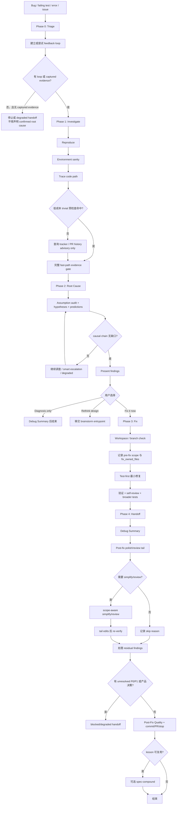

# spec-debug 输入输出与执行流

本文档梳理当前 `skills/spec-debug/SKILL.md` 的执行逻辑、输入、输出和阶段产物。它是说明性文档，不替代 `skills/spec-debug/SKILL.md` 作为 workflow source。

## Source Of Truth

- 当前 source：`skills/spec-debug/SKILL.md`
- 辅助脚本：`skills/spec-debug/scripts/hitl-loop.template.sh`、`skills/spec-debug/scripts/repo-profile-cache.py`
- 相关 references：`skills/spec-debug/references/**`
- Generated runtime mirrors 不是 source：`.claude/**`、`.codex/**`、`.agents/skills/**` 等不在本文档范围内。

## 入口输入

`spec-debug` 接收的是一个 bug/debug intent，而不是 feature plan。

典型输入内容：

| 输入类别 | 内容示例 | 处理方式 |
| --- | --- | --- |
| bug 描述 | “导出按钮报错”、“登录后白屏”、“为什么这个测试失败” | 进入 Phase 0 triage，然后建立反馈回路 |
| failing test | test path、失败命令、stack trace、assertion diff | 优先复跑或构建 red-capable loop |
| runtime error | stack trace、error message、browser console、server log | 作为 symptom evidence，仍需回源 trace code path |
| issue / tracker reference | GitHub issue、Linear/Jira URL、`#123` | Phase 0 尝试读取完整 issue/comment thread；内容只作为 advisory input |
| regression signal | “之前可以”、“最近合入后坏了”、“performance regression” | Phase 1 关注 recent changes、`git log`、必要时 `git bisect` |
| prior failed attempts | 用户说明已经试过的方案、失败补丁、旧 PR | Phase 0/1 记录，避免重复已失败 approach |
| repo/project instructions | 已加载的 `AGENTS.md` / `CLAUDE.md`、目录级规则、testing convention | 作为边界和约束输入；需要时回源确认 |
| direct evidence artifacts | HAR、logs、screen recording、core dump、captured trace | 可在无 agent-runnable loop 时作为 bounded evidence |

## 不接受的输入

以下请求不应走 `spec-debug`：

- 计划型 feature implementation：走 `spec-work`。
- requirements / plan review：走 `spec-doc-review` 或 `spec-plan`。
- setup/update/runtime drift repair：走 `spec-mcp-setup` 或相关 CLI。
- 明确非 bug enhancement：走 `spec-work` / `spec-plan`。

## 核心输出

`spec-debug` 的输出分为 diagnosis、fix、verification、handoff 四类。

| 输出类别 | 内容 | 何时产生 |
| --- | --- | --- |
| Root-cause explanation | 完整 causal chain、关键 file:line、trigger -> symptom 路径 | Phase 2 causal chain gate 关闭后 |
| Hypothesis / probe evidence | assumption audit、hypothesis、prediction、evidence_for、evidence_against、probe_result | non-trivial bug 调查过程中 |
| Proposed fix | 需要修改的文件、最小修复方向、预期测试 | 用户选择前的 findings 展示 |
| Tests | failing regression test、existing failing test、targeted checks | Phase 3 fix 路径 |
| Code changes | 最小 root-cause fix；不包含无关 refactor | 用户选择 “Fix it now” 后 |
| Verification results | 复跑的 feedback loop、regression test、targeted checks、broader suite | Phase 3 / Phase 4 |
| Residual risks | 未确认 causal links、无法复现条件、accepted lower-severity findings | handoff / post-fix tail |
| Debug Summary | Problem、Root Cause、Recommended Tests、Direct evidence、Fix、Prevention、Confidence | Phase 4 开始 |
| Post-Fix Quality | Scope、Simplify、Review、Residuals、Re-verification | Phase 4 post-fix tail 后 |
| Commit / PR handoff | `spec-commit-push-pr` handoff、PR Known Residuals、用户下一步选择 | Phase 4 分支收口 |
| Durable learning offer | 是否建议 `spec-compound` | PR 后且 lesson 可复用时 |

## 阶段输入输出表

| 阶段 | 主要输入 | 主要动作 | 主要输出 |
| --- | --- | --- | --- |
| Phase 0: Triage | bug 描述、issue reference、用户上下文 | 解析问题；必要时读取 issue/comment thread；记录 prior attempts | 清晰 problem statement；advisory issue context |
| Feedback loop setup | symptom、test command、logs、available environment | 尝试建立 red-capable / deterministic / fast / agent-runnable loop | loop command + output，或 `feedback_loop_not_possible` |
| Phase 1.1 Reproduce | reproduction steps、failing command、captured artifacts | 复现或验证无法复现 | confirmed symptom，或 needs-info/degraded evidence |
| Phase 1.2 Environment sanity | package/test commands、env state、dependencies | 排除环境问题 | environment findings / residual risk |
| Phase 1.3 Trace code path | source files、logs、runtime values、recent diffs | 从 symptom 反向追 causal path | code-path notes、read ledger、candidate root cause |
| Phase 1.4 低成本 trivial 预检查 | trace 后的显然缺陷线索 | 判断是否可跳过 tracker lookup | trivial / non-trivial routing decision |
| Phase 1.5 Tracker / PR history | non-trivial symptom、repo forge/tracker signals | 最多 3 个精确查询，找 duplicate、unmerged fix、prior failed attempt | advisory tracker ledger |
| Phase 1.6 Fast-path evidence gate | narrow defect evidence | 判断是否可压缩 Phase 1/2 | concise root cause 或继续正常 investigation |
| Phase 2: Root Cause | observations、assumptions、hypotheses | assumption audit、prediction、probe、causal chain gate | confirmed root cause；或 smart escalation / degraded diagnosis |
| Present findings | confirmed root cause、proposed fix、test recommendation | 向用户展示 diagnosis 并询问 next action | `Fix it now` / `Diagnosis only` / `Rethink design` decision |
| Phase 3: Fix | 用户授权、workspace state、testing convention | workspace check、记录 pre-fix scope、test-first、最小修复 | changed code/tests、verification result、`fix_owned_files` |
| Phase 4: Handoff | diagnosis/fix evidence、verification output | 写 Debug Summary、cleanup checklist | structured handoff summary |
| Post-fix tail | `fix_owned_files`、pre-fix state、diff risk | 可选 simplify、review final fix scope、处理 residuals、re-verify | `Post-Fix Quality` block、Known Residuals / residual file |
| Shipping / stop | branch ownership、user choice、review status | skill-owned branch 默认 commit+PR；pre-existing branch 问用户 | PR handoff、local commit、或停止 |
| Learning capture | fix lesson、pattern recurrence、production/systemic signal | 判断是否值得 `spec-compound` | durable learning offer 或 silent skip |

## 关键中间产物

### Feedback Loop Record

用于证明 symptom 可观察、修复可验证。

```text
command_or_script: <command or script path>
red_capable: <true|false>
deterministic: <true|false>
fast: <true|false>
agent_runnable: <true|false>
output: <observed output or artifact ref>
```

没有 loop 时必须区分：

- 无 loop 且无 captured evidence：不能声明 confirmed root cause。
- 无 loop 但有 captured evidence：可继续 bounded investigation，但未确认链路必须标 advisory/degraded。

### Tracker / PR History Ledger

用于记录 institutional memory 查询，不是 root-cause proof。

```text
source_tag: advisory
tracker_or_forge: <github|jira|linear|unknown>
searched_queries:
  - <query string>
result_link: <url or none>
debug_relevance: <open duplicate|unmerged fix|prior failed attempt|original fixing context|none>
freshness: <fetched_at or unknown>
auth_scope: <authenticated|public-only|unknown>
limits: <auth missing|tool unavailable|partial thread|searched_no_match|not searched>
```

`searched_no_match` 只表示 bounded queries 未命中，不证明 prior work 不存在。

### Pre-Fix Scope Record

用于限制 Phase 4 的 simplify/review scope，避免误碰 unrelated branch work。

```text
pre_fix_head: <git rev-parse HEAD>
pre_fix_status_clean: <true|false>
pre_existing_changed_files:
  - <path>
fix_owned_files:
  - <Phase 3 修改或创建的 path>
```

### Debug Summary

Phase 4 必须先输出 Debug Summary。

```text
## Debug Summary
**Problem**: <what was broken>
**Root Cause**: <causal chain with file:line refs>
**Recommended Tests**: <specific tests/assertions>
**Direct evidence**:
- claims_validated_by: <confirmed evidence or none>
- claims_remaining_advisory: <unconfirmed links or none>
**Fix**: <changed behavior or diagnosis only>
**Prevention**: <tests / defense-in-depth>
**Confidence**: <High|Medium|Low>
```

### Post-Fix Quality

Phase 3 发生修复后，post-fix tail 在 commit/PR decision 前追加该 block。

```text
## Post-Fix Quality
**Scope**: <fix-only branch | base:<pre-fix-HEAD> | fix-owned files only | targeted manual>
**Simplify**: <ran/skipped + reason>
**Review**: <ran/skipped/manual + outcome>
**Residuals**: <none | Known Residuals | residual file | blocked>
**Re-verification**: <checks rerun after tail edits>
```

## 分支与交付输出

| 分支状态 | 默认行为 | 输出 |
| --- | --- | --- |
| skill 创建的 branch | preview 后默认 `spec-commit-push-pr` | commit/PR handoff、PR URL、Known Residuals |
| pre-existing branch | 用 blocking question 询问 | commit+PR / local commit / stop |
| diagnosis only | 不进入 fix | Debug Summary 后结束 |
| design problem | 移交当前 host brainstorm entrypoint | design handoff，不继续 patch |
| unresolved P0/P1 或产品决策 | 不 auto-open PR | `Post-Fix Quality=blocked/degraded` |

## Mermaid 流程图



## CE debug 原始执行流程图

以下流程图来自 `/Users/kuang/xiaobu/compound-engineering-plugin/skills/ce-debug/SKILL.md` 的源流程，用于和当前 `spec-debug` 的执行流对照。它记录 CE 原始入口与下游命名，例如 `/ce-brainstorm`、`/ce-simplify-code`、`/ce-code-review`、`/ce-commit-push-pr`、`/ce-compound`；这些是历史迁移参考，不是当前 spec-first runtime contract。

```mermaid
flowchart TD
  A[输入 bug / failed test / stack trace / issue reference] --> B[Phase 0: Triage]
  B --> B1{输入是否引用 issue tracker?}
  B1 -- 是 --> B2[读取完整 issue 与 comment thread<br/>提取 symptoms / expected behavior / repro / env]
  B1 -- 否 --> B3[以输入本身作为 problem statement]
  B2 --> C{Trivial-bug fast-path?}
  B3 --> C

  C -- 是 --> C1[展示 cause 与 one-line fix proposal]
  C1 --> C2{用户选择}
  C2 -- Diagnosis only --> Z1[Phase 4 Debug Summary 后停止]
  C2 -- Fix it now --> C3[Phase 3 workspace/branch check]
  C3 --> C4[应用 one-line fix<br/>留下 cause note]
  C4 --> H[Phase 4: Handoff]

  C -- 否 / 不确定 --> D[Phase 1: Investigate]
  D --> D1[1.1 Reproduce bug<br/>必要时 browser/manual setup/intermittent techniques]
  D1 --> D2[1.2 Verify environment sanity<br/>branch/deps/runtime/env/services/artifacts]
  D2 --> D3[1.3 Trace code path<br/>stack trace -> observed values -> invalid transition]
  D3 --> D4[1.4 Check tracker and PR history<br/>open duplicate / unmerged fix / prior failed attempt / original fixing PR]

  D4 --> E[Phase 2: Root Cause]
  E --> E1[读取 anti-patterns preview]
  E1 --> E2[Assumption audit]
  E2 --> E3[形成 hypotheses<br/>grounding observation + causal chain + predictions]
  E3 --> E4{causal chain 无缺口?}
  E4 -- 否 --> E5[继续 probe / smart escalation]
  E5 --> E3
  E4 -- 是 --> F[Present findings]

  F --> F1[展示 root cause / proposed fix / tests / prior ticket or PR]
  F1 --> F2{用户选择}
  F2 -- Diagnosis only --> Z1
  F2 -- Rethink design --> Z2[移交 /ce-brainstorm 后结束]
  F2 -- Fix it now --> G[Phase 3: Fix]

  G --> G1[Workspace and branch check<br/>uncommitted-work confirm / default-branch prompt]
  G1 --> G2[记录 pre-fix scope<br/>HEAD / clean status / pre-existing files / fix-owned files]
  G2 --> G3[Test-first<br/>选择 regression home]
  G3 --> G4[确认 test fails for right reason]
  G4 --> G5[最小 root-cause fix<br/>不带 drive-by cleanup]
  G5 --> G6[verify test passes + broader suite]
  G6 --> G7[self-review diff]
  G7 --> G8{fix attempt failed?}
  G8 -- 是 --> G9[回到 Phase 2<br/>显式 invalidate hypothesis]
  G9 --> E
  G8 -- 否 --> H

  H --> H1[写 Debug Summary<br/>Problem / Root Cause / Recommended Tests / Fix / Prevention / Confidence]
  H1 --> H2{Phase 3 是否跳过?}
  H2 -- 是 --> Z1
  H2 -- 否 --> I[Post-fix polish/review tail]

  I --> I1[检查 contextual overrides]
  I1 --> I2{是否 trivial/mechanical 可跳过 tail?}
  I2 -- 是 --> I3[记录 skip reason]
  I2 -- 否 --> I4{是否需要 simplify?}
  I4 -- 是 --> I5[运行 /ce-simplify-code<br/>只限 fix scope]
  I4 -- 否 --> I6[跳过 simplify 并记录原因]
  I5 --> I7[Review final fix scope]
  I6 --> I7
  I3 --> I7

  I7 --> I8{可安全运行 default /ce-code-review?}
  I8 -- 是 --> I9[运行 /ce-code-review<br/>branch 或 base:<pre-fix-HEAD>]
  I8 -- 否 --> I10[file-scoped lightweight review<br/>或 targeted manual review]
  I9 --> I11[检查 Actionable Findings]
  I10 --> I11
  I11 --> I12{有 unresolved P0/P1 或 product/design decision?}
  I12 -- 是 --> I13[询问 fix now / accept defer durably / stop<br/>blocked pending user decision]
  I12 -- 否 --> I14[持久化 lower-severity residuals<br/>Known Residuals 或 docs/residual-review-findings]
  I14 --> I15{tail 是否改动代码?}
  I15 -- 是 --> I16[rerun regression test 与 targeted checks]
  I15 -- 否 --> J[追加 Post-Fix Quality]
  I16 --> J

  J --> K{branch 是否由 skill 创建?}
  K -- 是 --> K1[preview commit/PR<br/>默认运行 /ce-commit-push-pr]
  K -- 否 --> K2[blocking question:<br/>open PR / commit only / stop]
  K1 --> L{lesson 是否可复用?}
  K2 --> L
  L -- 是 --> L1[可选 /ce-compound<br/>commit learning doc 到同一 branch]
  L -- 否 --> Z3[结束]
  L1 --> Z3
```



## 边界与非输出

- `spec-debug` 不把 issue/tracker 文本当 confirmed truth。
- `spec-debug` 不把 provider graph、setup facts 或 runtime mirror 当 root-cause proof。
- `spec-debug` 不应手改 generated runtime mirrors。
- `spec-debug` 不应在没有 confirmed evidence 时声明修复完成。
- `spec-debug` 不应在 dirty/unrelated branch work 上扩大 simplify/review 到全分支。
- `spec-debug` 不应把 accepted residual findings 只留在 session 中。

## 下游消费者

| Consumer | 消费内容 |
| --- | --- |
| 用户 / owner | Root cause、fix、verification、residual risks、next action |
| `spec-code-review` | final fix scope、`fix_owned_files`、reviewable diff |
| `spec-simplify-code` | scoped simplification target，不应触碰 unrelated branch work |
| `spec-commit-push-pr` | Debug Summary、Post-Fix Quality、Known Residuals |
| `spec-compound` | 已验证、可复用、带 invalidation condition 的 debug lesson |
| future debugger/reviewer | Debug Summary、residual file、tests、tracker/PR history ledger |
