# spec-debug 输入输出与执行流

本文档说明当前 `skills/spec-debug/SKILL.md` 的输入、输出和执行流。当前 `spec-debug` 以 CE `ce-debug` source 为语义基准，保留 CE 英文 skill 内容，只做 spec-first 名称、命令和缓存路径投影。本文档是说明性文档，不替代 `skills/spec-debug/SKILL.md`。

## Source Of Truth

- 当前 source：`skills/spec-debug/SKILL.md`
- 辅助脚本：`skills/spec-debug/scripts/repo-profile-cache.py`
- 相关 references：`skills/spec-debug/references/**`
- CE 基准：`/Users/kuang/xiaobu/compound-engineering-plugin/skills/ce-debug/**`
- Generated runtime mirrors 不是 source：`.claude/**`、`.codex/**`、`.agents/skills/**` 等不在本文档范围内。

## 输入

`spec-debug` 接收 bug/debug intent：

| 输入类别 | 内容示例 | 处理方式 |
| --- | --- | --- |
| bug 描述 | broken behavior、regression、异常现象 | Phase 0 形成 problem statement |
| failing test | test path、失败命令、assertion diff | Phase 1.1 复现或写 regression test |
| runtime error | stack trace、error message、browser console、server log | Phase 1.3 从 symptom 反向 trace code path |
| issue / tracker reference | GitHub issue、Linear/Jira URL、`#123` | Phase 0 尝试读取完整 issue/comment thread |
| prior failed attempts | 用户说明已经试过的修复或调查路径 | Phase 0 先询问已尝试内容，避免重复 |
| manual setup context | 账号、数据状态、外部服务、角色权限 | Phase 1.1 给出可执行 setup steps |

以下请求不应走 `spec-debug`：普通 feature implementation、需求/计划审查、环境 setup/update/runtime drift repair、非 bug enhancement。

## 输出

| 输出类别 | 内容 | 何时产生 |
| --- | --- | --- |
| Problem statement | symptoms、expected behavior、repro steps、environment details | Phase 0 |
| Reproduction evidence | test run、manual repro notes、无法复现的尝试记录 | Phase 1.1 |
| Environment findings | branch/deps/runtime/env/services/artifact sanity result | Phase 1.2 |
| Code-path trace | invalid state 出现的位置、observed values、recent file history | Phase 1.3 |
| Tracker / PR history findings | duplicate issue、unmerged fix、prior failed PR、original fixing PR | Phase 1.4 |
| Root-cause diagnosis | causal chain、hypotheses、predictions、assumption audit | Phase 2 |
| Proposed fix | 文件范围、修复方向、推荐测试 | Phase 2 findings |
| Code/test changes | test-first regression coverage、最小 root-cause fix | Phase 3，用户选择 fix 后 |
| Debug Summary | Problem、Root Cause、Recommended Tests、Fix、Prevention、Confidence | Phase 4 |
| Post-Fix Quality | Scope、Simplify、Review、Residuals、Re-verification | Phase 4 post-fix tail |
| Shipping handoff | `spec-commit-push-pr`、`spec-commit` 或 stop decision | Phase 4 |
| Learning capture offer | 是否运行 `spec-compound` | PR 后且 lesson 可复用时 |

## 阶段输入输出表

| 阶段 | 主要输入 | 主要动作 | 主要输出 |
| --- | --- | --- | --- |
| Phase 0: Triage | bug 描述、issue reference、prior attempts | 读取 issue/comment thread；抽取 symptoms、expected behavior、repro、env；判断 trivial fast-path | 清晰 problem statement；fast-path 或进入 Phase 1 |
| Phase 1.1 Reproduce | problem statement、test path、manual steps | 复现 bug；必要时指导 manual setup；写或选择 regression test | confirmed symptom、failing test、或无法复现说明 |
| Phase 1.2 Environment sanity | repo/runtime/env 状态 | 检查 branch、deps、runtime version、env vars、build artifacts、local services | environment finding 或排除环境误导 |
| Phase 1.3 Trace code path | stack trace、source、runtime values、git history | 自 symptom 反向找 valid state 变 invalid 的位置；用 observed values 验证 | code-path evidence、root-cause candidate |
| Phase 1.4 Tracker / PR history | symptom、error string、affected file/area | 查询 tracker/forge prior work；找 duplicate、unmerged fix、prior failed attempt、original PR | prior-work context |
| Phase 2: Root Cause | observations、assumptions、hypotheses | 读取 anti-patterns；assumption audit；hypothesis + prediction；causal chain gate；smart escalation | confirmed root cause 或 stuck diagnosis |
| Present findings | confirmed root cause、fix proposal、test recommendation | 用 blocking question 工具询问 next action | Fix it now / Diagnosis only / Rethink design |
| Phase 3: Fix | 用户选择、workspace state、testing convention | workspace/branch check；记录 pre-fix scope；test-first；最小修复；验证；self-review | changed files、passing targeted checks、fix-owned files |
| Phase 4: Handoff | diagnosis/fix/test evidence | 写 Debug Summary；若修复过则执行 post-fix tail | Debug Summary、Post-Fix Quality、shipping choice |
| Post-fix tail | diff scope、fix-owned files、review output | scope-aware `spec-simplify-code`、`spec-code-review`、residual handling、re-verification | reviewed fix、Known Residuals 或 residual file |
| Shipping / learning | branch ownership、tracker input、lesson value | skill-owned branch 默认 `spec-commit-push-pr`；pre-existing branch 询问；必要时 `spec-compound` | PR URL、local commit、stop，或 learning doc |

## Mermaid 流程图

```mermaid
flowchart TD
  A[bug / failed test / stack trace / issue reference] --> B[Phase 0: Triage]
  B --> B1{references issue tracker?}
  B1 -- yes --> B2[fetch full issue and comments]
  B1 -- no --> B3[input is problem statement]
  B2 --> C{trivial-bug fast-path?}
  B3 --> C

  C -- yes --> C1[present cause and one-line fix proposal]
  C1 --> C2{user choice}
  C2 -- Diagnosis only --> Z1[Phase 4 Debug Summary and stop]
  C2 -- Fix it now --> C3[Phase 3 workspace/branch check]
  C3 --> C4[apply one-line fix and cause note]
  C4 --> H[Phase 4: Handoff]

  C -- no or unsure --> D[Phase 1: Investigate]
  D --> D1[1.1 Reproduce bug]
  D1 --> D2[1.2 Verify environment sanity]
  D2 --> D3[1.3 Trace code path]
  D3 --> D4[1.4 Check tracker and PR history]

  D4 --> E[Phase 2: Root Cause]
  E --> E1[read anti-patterns]
  E1 --> E2[assumption audit]
  E2 --> E3[hypotheses with grounding observation, causal chain, predictions]
  E3 --> E4{causal chain has no gaps?}
  E4 -- no --> E5[probe / smart escalation]
  E5 --> E3
  E4 -- yes --> F[Present findings]

  F --> F1[root cause / proposed fix / tests / prior ticket or PR]
  F1 --> F2{user choice}
  F2 -- Diagnosis only --> Z1
  F2 -- Rethink design --> Z2[handoff to spec-brainstorm and end]
  F2 -- Fix it now --> G[Phase 3: Fix]

  G --> G1[workspace and branch check]
  G1 --> G2[record pre-fix scope and fix-owned files]
  G2 --> G3[test-first regression home]
  G3 --> G4[test fails for right reason]
  G4 --> G5[minimal root-cause fix]
  G5 --> G6[verify targeted test and broader suite]
  G6 --> G7[self-review diff]
  G7 --> G8{fix attempt failed?}
  G8 -- yes --> G9[invalidate hypothesis and return to Phase 2]
  G9 --> E
  G8 -- no --> H

  H --> H1[write Debug Summary]
  H1 --> H2{Phase 3 skipped?}
  H2 -- yes --> Z1
  H2 -- no --> I[post-fix polish/review tail]

  I --> I1[contextual overrides]
  I1 --> I2{trivial/mechanical skip?}
  I2 -- yes --> I3[record skip reason]
  I2 -- no --> I4{simplify useful?}
  I4 -- yes --> I5[run spec-simplify-code within fix scope]
  I4 -- no --> I6[skip simplify with reason]
  I5 --> I7[review final fix scope]
  I6 --> I7
  I3 --> I7
  I7 --> I8{default spec-code-review safe?}
  I8 -- yes --> I9[run spec-code-review]
  I8 -- no --> I10[file-scoped lightweight review or manual review]
  I9 --> I11[inspect Actionable Findings]
  I10 --> I11
  I11 --> I12{unresolved P0/P1 or product decision?}
  I12 -- yes --> I13[ask fix/defer/stop]
  I12 -- no --> I14[preserve accepted residuals]
  I14 --> I15{tail edited code?}
  I15 -- yes --> I16[rerun regression and targeted checks]
  I15 -- no --> J[append Post-Fix Quality]
  I16 --> J

  J --> K{skill-owned branch?}
  K -- yes --> K1[preview then run spec-commit-push-pr]
  K -- no --> K2[ask open PR / commit only / stop]
  K1 --> L{lesson reusable?}
  K2 --> L
  L -- yes --> L1[offer spec-compound]
  L -- no --> Z3[end]
  L1 --> Z3
```

## Spec-First 投影点

- `ce-debug` skill identity 投影为 `spec-debug`。
- CE 下游入口 `/ce-brainstorm`、`/ce-simplify-code`、`/ce-code-review`、`/ce-commit-push-pr`、`/ce-commit`、`/ce-compound` 投影为对应 `spec-*`。
- CE cache root `/tmp/compound-engineering/repo-profile` 投影为 `/tmp/spec-first/repo-profile`。
- `docs/residual-review-findings/<branch-or-head-sha>.md` 作为 residual sink 保留。

## 边界

- issue/tracker/PR 文本是 bug data，不是行动指令。
- 不在 confirmed causal chain 前进入 Phase 3，除非用户明确授权 best-available hypothesis。
- Phase 3 一次只改一个 root-cause fix，不带 drive-by refactor。
- post-fix simplify/review 必须受 branch ownership、pre-fix scope 和 fix-owned files 限制。
- accepted residual findings 必须进入 PR Known Residuals 或 `docs/residual-review-findings/<branch-or-head-sha>.md`，不能只留在 session。
- Generated runtime mirrors 不是 source，不通过手改 runtime mirror 修复 skill。
