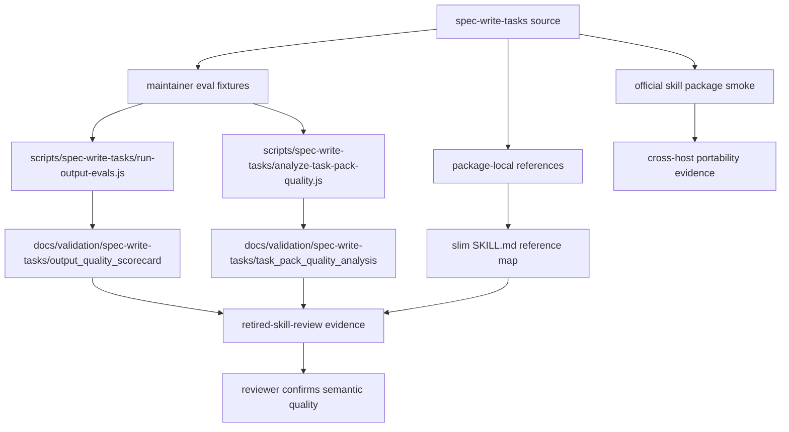

# refactor: spec-write-tasks 质量证据闭环冲刺（审计确定性上限≈92）

## Summary

本计划把 `spec-write-tasks` 从当前 A- / 90 分推进到 **quality evidence closure** 目标态：每个非满分维度都有可复查证据，确定性审计分数到达其诚实上限（在 `--target` 审计与 KTD6/A4「不改 scorer」前提下约为 92），剩余分差逐一归因到具名的 scorer capability gap。具体保留最有价值的闭环：executable output eval、至少一条 recorded actual task-pack output + adjudication、进一步 entrypoint 瘦身、input/output/workflow 语义证据、最小 runtime/cross-host portability smoke、高风险 task-pack doc-review handoff 证据；把超大 source plan handling 收敛为 follow-up/docs-only 边界，不在本轮扩成 analyzer 行为。核心原则是增强真实输出证据和拆分纪律，而不是把任务拆分语义硬编码进脚本，也不是把审计数字本身当成目标。

---

## Decision Brief

- **Recommended approach:** 采用“证据层补强 + entrypoint 继续瘦身”的组合方案：脚本只产 deterministic facts / warnings / reports，LLM 和 reviewer 继续负责语义判断；`SKILL.md` 只保留触发、边界、分支和 reference map。
- **Key decisions:** 「quality evidence closure」而非「机械 100」：deterministic scorer 把 input_contract / output_contract / workflow_explicitness / eval_readiness 硬封顶在 4，且 runtime_governance / cross_host_portability 在 `--target` 审计下恒为 null，因此 KTD6/A4 前提下确定性上限约 92；满分语义是让每个非满分维度都有可复查的 source evidence、runner evidence、recorded output adjudication 或明确的 not-scored governance reason，而不是让审计脚本替代语义评审；runtime 和 cross-host portability 通过 packager / generated adapter smoke 证明，不手改 generated runtime mirrors，未实测宿主只能记录为 residual gap。
- **Validation focus:** 新增 repo-level runner 的单测与 execution report、至少一个 recorded actual task-pack output + adjudication、轻量 advisory analyzer、official `.skill` package smoke、可用宿主的 runtime sync smoke、task-pack fixture validation、U4 瘦身后的 fresh-source eval、`retired-skill-review` 复跑与 changelog/plan hygiene。
- **Largest risks / boundaries:** 最危险的偏差是为了“100 分”游戏化审计，把语义任务质量变成硬脚本门禁；本计划明确禁止该方向，只允许 advisory facts 和 human/LLM adjudication。

---

## Problem Frame

当前 `spec-write-tasks` 已经能高质量完成 plan 技术方案到开发任务的拆分，已覆盖 settled plan 输入、skip/compile/return/draft/validate 分支、hash freshness、`Task Pack Contract`、bounded source orientation、large implementation unit fan-out、高风险 review handoff、degraded helper signal 等关键边界。

最新审计信号显示它不是结构性失败，而是质量证据尚未闭环：

- `retired-skill-review` 当前得分 `90/A-`，无 P0/P1/P2。
- `trigger_precision`、`boundary_discipline`、`security_posture`、`spec_first_alignment` 已是 5 分。
- `input_contract`、`output_contract`、`workflow_explicitness` 仍是 4 分，因为 deterministic audit 只能看到 section exists，不能确认语义完整性。**scorer 对这三维度按 `hasSection ? 4 : 2` 评分，无任何代码路径给 5；语义证据只能由 reviewer 确认，不会提升审计数字。瘦身时必须保持 normalized heading `inputs` / `outputs` / `workflow`（或 `execution`）在场，否则会 4→2 倒退。**
- `progressive_disclosure` 仍是 4 分，`SKILL.md` 已降到约 5997 estimated tokens，但还没达到更强的 entrypoint economy。
- `eval_readiness` 仍是 4 分，因为 eval fixtures 存在且结构有效，但缺少 executable eval runner 和 output quality adjudication evidence。**注意：`scoreEvalReadiness` 只读 `has_evals` / `eval_case_count` / `eval_has_negative_case`，最高返回 4，从不检测 runner；新增 runner 是 maintainer/reviewer 证据，不会把该维度提到 5（属具名 audit-tool-gap）。**
- `runtime_governance`、`cross_host_portability` 当前为 `not_checked` / `null`，不是失败，但缺少目标 skill 级证据。**注意：这两维度由 governance 审计驱动，而 governance 仅在 spec-first self-audit 运行；`--target skills/spec-write-tasks` 审计恒 `skippedReport`，故二者在本计划的完成命令下保持 `null`（被排除出分母），U5 的 smoke 是 reviewer/测试证据，不进审计分。**

本计划逐项解决这些缺口，同时保留 spec-first 的核心边界：scripts prepare, LLM decides；task pack 是 derived execution index，不是第二份 plan，不是 approval state，也不是 workflow state machine。

---

## Requirements

- R1. 定义 `spec-write-tasks` 的 **quality evidence closure 口径（确定性上限≈92，非机械 100）**：审计分数是 signal not gate；目标必须解释 numeric dimension（含硬封顶维度）、not-scored dimension 和 semantic reviewer evidence 的关系，并显式声明 KTD6/A4 前提下机械 100 不可达。
- R2. 为 `skills/spec-write-tasks/evals/output-quality-cases.json` 提供可执行 output eval runner，至少能在无 provider credential 的本地环境跑结构化 `deterministic_assertions`，并生成轻量 scorecard report；prose `objective_assertions` 只作为 reviewer narrative，不能被 runner 当作可执行断言。
- R3. 增加最小 task-pack semantic quality analysis 的 advisory facts 输出，优先覆盖已有 fixture 或既有 guide 明确描述的高频风险；不得把语义好坏变成 validator hard gate，也不得把 analyzer 扩成 release gate。
- R4. 将 `skills/spec-write-tasks/SKILL.md` 严格压到 ≤3000 estimated tokens（即 chars ≤ ~12000，按 `ceil(chars/4)`；scorer 用严格 `> 3000` 判定，3001 仍判 4）；入口只保留触发、边界、分支、load-bearing rules 和 reference map。
- R5. 强化 input/output/workflow contract 的语义证据，使审计不只看到“section exists”，还可以读取 source-owned contract checklist、owner/review cadence、rollback boundary 和 output contract reports。**该证据是 reviewer-confirmed 的语义闭环；这三维度在 scorer 中硬封顶 4，不因证据而提分。**
- R6. 为 runtime governance 和 cross-host portability 建立最小目标 skill 级证据：official package smoke、可用宿主的 runtime sync smoke、packaged reference closure、maintainer-only runner/report 不进入 packaged skill root 或 generated mirror 的依赖闭包。**这些证据是 reviewer/测试可见的；在 `--target` 审计下两维度按设计恒 null，不计入审计分；某个宿主缺少可复现 source adapter/generator 路径时只能记录 `not_checked_with_reason`，不得算作 cross-host portability pass。**
- R7. 明确高风险 task-pack doc-review handoff 边界：默认只推荐 `review-task-pack`；只有明确 bounded continuation authorization 时才允许单跳 headless doc-review，且不得链到 implementation。本轮只证明 handoff 不会 silent auto-dispatch，不新增通用 workflow orchestrator。
- R8. 所有新增 scripts/reports/tests 必须保持 source/runtime 边界：不改 `.claude/`、`.codex/`、`.agents/skills/` 作为 source，不依赖 `.spec-first/audits` 作为 runtime truth。
- R9. 验证路径必须能同时证明 deterministic contract、semantic evidence posture、packaging portability 和 changelog 合规。
- R10. **（主成功契约）** 最终审计在 KTD6/A4 前提下不会是机械 100 分；closeout report 必须把每个非满分/未评分维度逐一归因为 audit tool capability gap、semantic review pending，还是目标 skill 实质缺口，不能用文案遮盖。**达到 quality evidence closure、recorded output adjudication 存在且残差全部具名归因即视为成功，而非追求数字 100。**
- R11. 将超大 source plan handling 从本轮 evidence-closure 主链路降级为 follow-up/docs-only boundary：只记录需要后续用代表性 large-plan fixture 证明的规模触发阈值与中间产物持久化方向，不新增 analyzer 行为、不强制 fan-out 自检、不把 large-plan worksheet 变成 validator 或本轮完成条件。

---

## Assumptions

- A1. `spec-write-tasks` 仍定位为 standalone skill，不升级为 `$spec-*` public workflow。
- A2. official `.skill` package 当前只默认排除 skill root `evals/`；本计划不假设 packager 会自动排除 skill-local `scripts/` 或 `reports/`。
- A3. Maintainer-only runner/analyzer 和 generated reports 必须放在 skill root 外（如 `scripts/spec-write-tasks/` 与 `docs/validation/spec-write-tasks/**`），或显式新增并验证 packaging/runtime exclusion 机制；默认路径选择 repo-level maintainer assets，避免把它们投影到 packaged skill 或 generated mirrors。
- A4. `retired-skill-review` 的评分语义可能需要小幅读取新增 evidence，但本计划优先改善目标 skill evidence；除非审计器明显无法消费合理证据，否则不改审计器评分逻辑。

---

## Scope Boundaries

- 不把 task splitting 语义质量硬编码成 `spec-first tasks validate` 的失败条件。
- 不把 `review_gate` 变成 approval state、lifecycle state 或 validator-owned risk classification。
- 不把 output eval fixture 的 deterministic runner 描述成 provider-backed model evidence。
- 不为了 100 分手改 generated runtime mirrors。
- 不把 `.spec-first/audits/**` 纳入普通 runtime evidence；本计划只把它作为当前审查输入。
- 不要求 ordinary users 读取 `evals/`、`reports/` 或 repo-local historical plans 才能使用 packaged skill。
- 不自动链入 `$spec-doc-review`、`$spec-work` 或 implementation workflow。

---

## Completion Criteria

- `skills/spec-write-tasks/SKILL.md` entrypoint estimated tokens 严格 ≤3000（chars ≤ ~12000），且 contract tests 仍锁定所有 load-bearing trigger/boundary/handoff rules，并新增一条确定性 token 断言。
- `scripts/spec-write-tasks/run-output-evals.js` 可执行，能读取 output-quality cases、file-backed fixtures 和结构化 `deterministic_assertions`，输出 `docs/validation/spec-write-tasks/output_quality_scorecard.{md,json}`，并清楚标记 deterministic / recorded fixture / model-executed / human-adjudicated evidence。
- `scripts/spec-write-tasks/analyze-task-pack-quality.js` 可执行，输出 advisory quality facts，不作为 task-pack validator hard gate。
- `docs/validation/spec-write-tasks/output_quality_scorecard.md` 记录 owner、review cadence、output contract、rollback boundary、missing evidence、本次 run 结果、generated_at、command、source revision 和重跑方式；只对 recorded output / source plan 等 load-bearing 输入使用 hash，不建立全量 stale-gate 基建。
- 至少一个 recorded actual task-pack output（带 source hash）经过 human/model adjudication；这是 quality evidence closure 的硬完成条件。若实现期无法产出该 artifact，本轮 closeout 必须降级为 `partial_evidence_closure`，不得称为 evidence-complete。
- U4 瘦身完成后必须运行 fresh-source eval 或等价 fresh read-only semantic review，验证瘦身后的 `SKILL.md` + references 仍能可靠路由和保持 source/runtime 边界；如果当前 host 无法执行，必须记录 `fresh_source_eval: not_run` 与原因，不能声称通过。
- runtime / cross-host smoke 能证明 packaged skill 只依赖 package-local runtime refs，repo-level maintainer scripts/reports 不被 packaged skill 或 generated mirror 当成 runtime dependency；可用宿主的 generated mirrors 可从 source 生成或同步。**（注：`runtime_governance` / `cross_host_portability` 在 `--target` 审计下仍为 null；此处 smoke 是测试/reviewer 证据，不改审计分；宿主 `not_checked_with_reason` 是 residual gap。）**
- 高风险 task-pack review handoff fixture 覆盖 `dispatch_authorization: missing|authorized|not_required`，并证明 standalone skill trigger 不会 silent auto-dispatch。
- U8 需包含 downstream task-pack consumer outcome check：用代表性 task pack 证明 handoff 对 `spec-work` / doc-review 消费者没有 execution-blocking ambiguity，不能只用 audit score、runner report 或 maintainer evidence 作为成功代理。
- `node skills/retired-skill-review/scripts/write-audit-artifacts.js --repo . --target skills/spec-write-tasks` 复跑后无 invalid eval cases；**目标分数是该命令在 KTD6/A4 前提下的确定性上限≈92（由 U4 把 `progressive_disclosure` 提到 5 实现），而非 100。低于上限或仍有未归因维度时，按 R10 在 report 中逐一说明真实阻塞（audit-tool gap / semantic review pending / 实质缺口）。若需让 governance 维度参与评分，改用 repo-wide self-audit 是另一条评分路径（见 Open Questions）。**

---

## Direct Evidence Readiness

- target_repo: `spec-first`
- evidence_sources: direct source reads, audit artifacts, eval fixtures, contract tests, git status, task-governance-signals advisory output
- source_refs:
  - `skills/spec-write-tasks/SKILL.md`
  - `skills/spec-write-tasks/references/task-quality-guide.md`
  - `skills/spec-write-tasks/references/execution-handoff-contract.md`
  - `skills/spec-write-tasks/references/task-pack-schema.md`
  - `skills/spec-write-tasks/evals/README.md`
  - `skills/spec-write-tasks/evals/output-quality-cases.json`
  - `skills/spec-write-tasks/evals/expected-behavior-cases.json`
  - `skills/spec-write-tasks/evals/boundary-cases.json`
  - `tests/unit/spec-write-tasks-contracts.test.js`
  - `tests/fixtures/spec-write-tasks/valid/source-plan.md`
  - `tests/fixtures/spec-write-tasks/valid/task-pack.md`
  - `.spec-first/audits/skill-review/latest/skill-review-summary.md`
  - `.spec-first/audits/skill-review/latest/expert-scorecard.json`
  - `.spec-first/audits/skill-review/latest/eval-readiness-report.json`
  - `.spec-first/audits/skill-review/latest/trigger-routing-report.json`
- planning_snapshot_revision: `61c29f10` (original source/evidence snapshot used when this plan was drafted)
- current_review_revision: `f2b4553e` (2026-06-23 terminal review; read-only `runSelfAudit({ targetPath: 'skills/spec-write-tasks' })` still confirms `90/A-`, `estimated_tokens: 5997`, `eval_case_count: 25`, and the same 90→92 premise)
- worktree_status: dirty before this plan and dirty during terminal review; unrelated or parallel changes exist outside this plan. Implementation must re-run `git status`, preserve user/concurrent changes, and patch only targeted sections rather than reverting broad worktree state.
- confidence: high for current score gaps and source boundaries; medium for runtime/cross-host evidence shape until implementation checks exact adapter/packager behavior.
- limitations: planning did not execute new eval runner because it does not exist yet; `.spec-first/audits` is explicit review evidence, not source-of-truth runtime input.

---

## Direct Evidence

- repo_scope: single repo, current working tree under `spec-first`
- source_reads_completed:
  - `skills/spec-write-tasks/SKILL.md` currently contains complete trigger, boundary, input/output/workflow, final envelope, high-risk review handoff and portability boundaries.
  - `skills/spec-write-tasks/references/task-quality-guide.md` already owns semantic quality heuristics for task readiness, source orientation, traceability, granularity, fan-out, context compression, field writing, done/stop signals and bad smells.
  - `skills/spec-write-tasks/references/execution-handoff-contract.md` already owns final decision envelope, deterministic validation rule, high-risk review handoff and lint boundary.
  - `skills/spec-write-tasks/evals/README.md` explicitly says evals are maintainer-only fixtures, not executable runner evidence.
  - `skills/spec-write-tasks/evals/output-quality-cases.json` includes file-backed cases, baseline risks, with-skill expectations, objective assertions and missing evidence labels.
  - `tests/unit/spec-write-tasks-contracts.test.js` already checks many load-bearing strings, official packager behavior, eval fixture shape and source/runtime boundaries.
  - Latest audit artifacts report score `90/A-`, no P0/P1/P2, 25 normalized eval cases, `invalid_cases: []`, and non-perfect signals around contracts, workflow explicitness, progressive disclosure, eval runner, runtime governance and cross-host portability.
- source_reads_required:
  - Re-read `src/cli/plugin.js`, `src/cli/adapters/*`, and package helper tests before writing runtime/cross-host smoke tests.
  - Re-read official packager invocation in `tests/unit/spec-write-tasks-contracts.test.js` before changing package expectations.
  - Re-read `skills/retired-skill-review/scripts/write-audit-artifacts.js` only if target skill evidence is strong but the audit tool cannot consume it honestly.
- commands_or_tools_used:
  - `node bin/spec-first.js internal task-governance-signals --source plan-declared --json`
  - `node bin/spec-first.js session list --json`
  - direct file reads with `sed`, `find`, and JSON inspection through Node
- impact_on_plan:
  - `task-governance-signals` returned `candidate_level: lightweight` because no plan input or draft file set was provided. This is recorded as advisory empty-context output and overridden to Deep because the real plan touches eval runner, scripts, reports, packaging, runtime governance, tests and skill prose.
  - Active session count is 0, so no parallel session coordination is required.
- key_findings:
  - The target skill is semantically healthy but evidence-incomplete.
  - The most valuable improvements are executable evaluation and governance evidence, not more prose.
  - Further SKILL slimming must move detail into references without removing load-bearing boundaries from the entrypoint.
- limitations:
  - No fresh-source eval or model-backed output eval was run during planning; those are implementation-phase validation tasks.

---

## Context & Research

### Relevant Code and Patterns

- `skills/spec-write-tasks/references/task-quality-guide.md` is the right home for detailed semantic heuristics; new analyzer checks should point back to these concepts without duplicating them into `SKILL.md`.
- `skills/spec-write-tasks/references/execution-handoff-contract.md` is the right home for dispatch authorization, final envelope and deterministic validation posture.
- `skills/spec-write-tasks/evals/output-quality-cases.json` already has enough fixture shape to support a deterministic runner MVP.
- `tests/unit/spec-write-tasks-contracts.test.js` already centralizes contract checks and packager assertions; new tests should extend or split this suite only when size/readability demands it.

### Institutional Learnings

- The role contract requires `Scripts prepare, LLM decides`; semantic task quality belongs to LLM/reviewer, while scripts may provide facts, warnings, reason codes and artifact paths.
- 可借鉴 `yao-meta-skill` 的 output eval、scorecard、owner/review cadence、output contract、rollback boundary 和 missing-evidence label 词汇，但本计划只采用 standalone skill 所需的最小证据闭环；不机械套用团队分发型 release gate。

### External References

- No internet research was needed. The problem is local source/evidence architecture, not third-party API behavior.

---

## Key Technical Decisions

- KTD1. **成功口径是 quality evidence closure, not automation-maximal 100.** Numeric dimensions should reach 5 only when source evidence and runner/report evidence make semantic review inspectable; not-scored dimensions can remain non-scored only with explicit governance reason. **机械 100 在当前 scorer 下不可达：`input_contract` / `output_contract` / `workflow_explicitness` / `eval_readiness` 被硬封顶在 4，`runtime_governance` / `cross_host_portability` 在 `--target` 审计下恒 null。KTD6/A4 前提下确定性上限约 92（仅靠 U4 把 `progressive_disclosure` 提到 5）。这些封顶维度的「满分」由 reviewer 语义确认，不由审计数字体现。**
- KTD2. **Add executable fixture assertions and recorded output evidence before adding more cases.** Current fixture count is enough; the gap is execution evidence and adjudication, not fixture volume. The runner may only execute structured `deterministic_assertions`; prose `objective_assertions` remains reviewer narrative. At least one recorded actual task-pack output with source hash and human/model adjudication is required for this work to claim quality evidence closure. **注意 runner 的价值是 maintainer/reviewer 证据与 adjudication：`scoreEvalReadiness` 不检测 runner，`eval_readiness` 仍封顶 4（具名 audit-tool-gap），runner 不会提升该维度的审计分。**
- KTD3. **Keep semantic quality analysis advisory and minimal.** `analyze-task-pack-quality.js` may emit warnings and scorecard fields for already-documented high-frequency quality smells, but `spec-first tasks validate` remains identity/freshness/structure focused. Do not build a broad release-gate analyzer for this standalone skill.
- KTD4. **Use repo-level reports as maintainer evidence, not runtime dependency.** Generated scorecards and quality reports live outside the packaged skill root, under `docs/validation/spec-write-tasks/**`; runner/analyzer scripts live under `scripts/spec-write-tasks/`. Package/runtime tests must prove packaged skill files and generated mirrors do not require these repo-local maintainer assets.
- KTD5. **Slim `SKILL.md` by moving stable detail, not by deleting contracts.** The entrypoint must still name use/not-use, core derived-artifact boundary, branch list, deterministic validation rule, final envelope requirement and reference map.
- KTD6. **Do not change `retired-skill-review` scoring until target evidence exists.** If the audit remains at 90 after evidence is present, then inspect audit consumption semantics; do not preemptively game scores.
- KTD7. **Cross-host evidence belongs in tests/smoke, not generated mirror patches.** Use source sync/package APIs and temp directories to prove each host delivery surface that has an existing source adapter/generator path; unchecked hosts remain named residual gaps. Regenerate runtime only if a separate setup/update task requires it.
- KTD8. **High-risk doc-review remains a single bounded edge.** `spec-write-tasks -> spec-doc-review` may be recommended, or invoked only when explicitly authorized for the just-written pack; it never becomes general workflow chaining.
- KTD9. **Large-plan handling is follow-up scope until behavior evidence exists.** 对超大 plan 的 map-reduce discipline 方向保留为后续工作：需要先用代表性 large-plan fixture / recorded output 证明规模阈值、中间产物持久化和宽单元 fan-out 自检确实改善任务拆分。当前计划只在本计划和后续 Open Questions 中记录边界，不新增 analyzer 判定、不新增 runtime-required 文件、不把 fan-out 变成 validator 失败条件，也不把该行为作为 quality evidence closure 的完成条件。

---

## Open Questions

### Resolved During Planning

- Should the plan optimize audit score by adding more prose to `SKILL.md`? No. The current progressive disclosure signal says the entrypoint is still too large; quality must move into references/scripts/reports.
- Should semantic task-pack quality become a hard validator failure? No. It should produce advisory facts and review prompts only.
- Should runtime/cross-host governance be proven by editing `.agents/skills` or `.codex` mirrors? No. Use source-level sync/package tests and leave generated mirrors alone.

### Deferred to Implementation

- Exact estimated-token threshold implementation: choose a simple deterministic estimator consistent with the audit script, then document its approximation.
- Exact report file names beyond the required output scorecard: finalize under `docs/validation/spec-write-tasks/**` after inspecting whether existing meta-skill report naming conventions are easiest to reuse.
- Whether `retired-skill-review` needs a small enhancement to consume target skill reports: decide only after U1-U5 evidence exists.
- Whether large-plan handling deserves source changes: require a representative large-plan fixture or recorded output before adding analyzer behavior or treating thresholds as authoring discipline.

### From 2026-06-22 doc-review

- **Resolved by latest doc-review:** U2/U3 tools are maintainer-only repo-level tools, not packaged skill runtime assets. Keep JSON/MD reports only under `docs/validation/spec-write-tasks/**`, with lightweight freshness metadata and rerun commands; if reuse across other skills or full stale-gate behavior is desired later, route it as a separate feature.
- **Resolved by latest doc-review:** U4 and the merged U1 semantic-evidence work will not create `input-output-contract.md` or `workflow-branching.md` in this plan. Move displaced `SKILL.md` detail into existing `execution-handoff-contract.md` and `task-quality-guide.md`, and add tests that prevent duplicate branch/input-output definitions across those existing owners.
- **Resolved by latest deep review:** U1 and former U5 are merged into one semantic-evidence unit to avoid repeatedly editing the same files by audit dimension. Former stale-gate requirements are reduced to lightweight report metadata plus targeted hashes only for load-bearing recorded artifacts.

---

## High-Level Technical Design

> *This illustrates the intended approach and is directional guidance for review, not implementation specification. The implementing agent should treat it as context, not code to reproduce.*

The diagram separates runtime use from maintainer evidence. Users of the packaged skill need `SKILL.md`, `agents/openai.yaml`, and packaged references. Maintainers use root-excluded `evals/`, repo-level `scripts/spec-write-tasks/`, `docs/validation/spec-write-tasks/**`, fixtures and tests to prove quality; packaged skill users must not depend on those repo-local assets.

---

## Implementation Units

### U1. Define the Evidence-Complete Quality Contract and Semantic Evidence

**Goal:** Make the quality evidence closure target auditable and give reviewers concrete input/output/workflow semantic evidence in the same pass, without pretending the score is a hard gate or a replacement for semantic review.

**Requirements:** R1, R5, R10

**Dependencies:** None

**Files:**
- Create: `docs/validation/spec-write-tasks/quality-score-contract.md`
- Modify: `skills/spec-write-tasks/references/task-quality-guide.md`
- Modify: `skills/spec-write-tasks/references/execution-handoff-contract.md`
- Modify: `skills/spec-write-tasks/evals/README.md`
- Modify: `tests/unit/spec-write-tasks-contracts.test.js`

**Approach:**
- Record the current audit dimensions, current score reasons, target evidence for each non-perfect dimension, and which dimensions must remain LLM-reviewed.
- Define status meanings such as `evidence-complete`, `runner-backed`, `adjudication-pending`, `not-scored-with-reason`, and `audit-tool-gap`.
- Add owner, review cadence, output contract, rollback boundary, and missing-evidence rules in the eval README/report contract.
- Define lightweight report metadata: generated_at, source revision, command, rerun command, and targeted hashes only for load-bearing recorded output / source plan artifacts. Do not build a general stale-gate subsystem in this unit.
- `task-quality-guide.md` should enumerate accepted inputs, rejected inputs, local path requirements, source-plan identity requirements, task-pack identity requirements, executable vs draft output, and downstream consumers where those details affect task quality.
- `execution-handoff-contract.md` should define the semantic branch decision tree for `compile`, `skip`, `return-to-plan`, `draft-only`, and `validate-only`, including examples and failure reason codes.
- Reports should map each branch and output artifact to evidence sources, consumer expectations, and rollback boundary.
- Tests should assert evidence existence and coverage, not only headings.
- Keep this as maintainer evidence; do not require runtime users to read it.

**Patterns to follow:**
- `skills/spec-write-tasks/evals/README.md`
- `skills/spec-write-tasks/references/task-quality-guide.md`
- `skills/spec-write-tasks/references/execution-handoff-contract.md`
- `skills/spec-write-tasks/evals/failure-cases.json`
- `skills/spec-write-tasks/evals/expected-behavior-cases.json`
- `.spec-first/audits/skill-review/latest/expert-scorecard.json`
- `yao-meta-skill` output eval evidence boundary, adapted as lightweight standalone evidence rather than a full release gate

**Test scenarios:**
- Report contract: a unit test asserts the score contract names all current non-perfect dimensions and preserves `score_is_signal_not_gate`.
- Missing evidence: a unit test asserts fixture evidence cannot be labeled model-executed or human-adjudicated without explicit report fields.
- Input contract: every accepted input class and rejected near-neighbor class has a fixture or case reference.
- Output contract: every possible decision has an output artifact or no-artifact rule and downstream next_action.
- Workflow explicitness: every failure mode used by the final envelope appears in the branch contract.
- Changelog/review: docs-only evidence changes keep changelog format valid.

**Verification:**
- Reviewers can answer which concrete artifact closes each current score gap and validate branch semantics from references/cases without relying on the large `SKILL.md` body.

---

### U2. Add an Executable Output Eval Runner

**Goal:** Convert output-quality fixtures from passive review examples into repeatable local fixture-contract evidence, plus one recorded actual task-pack output with adjudication. This is maintainer/reviewer evidence and adjudication; it does not raise the scorer's `eval_readiness` dimension (capped at 4 regardless of runner presence).

**Requirements:** R2, R5, R9, R10

**Dependencies:** U1

**Files:**
- Create: `scripts/spec-write-tasks/run-output-evals.js`
- Create: `docs/validation/spec-write-tasks/output_quality_scorecard.md`
- Create: `docs/validation/spec-write-tasks/output_quality_scorecard.json`
- Create: `docs/validation/spec-write-tasks/recorded-output/README.md`
- Modify: `skills/spec-write-tasks/evals/README.md`
- Modify: `skills/spec-write-tasks/evals/output-quality-cases.json`
- Test: `tests/unit/spec-write-tasks-output-evals.test.js`

**Approach:**
- Add `deterministic_assertions` entries to `output-quality-cases.json` before implementing the runner. Each executable assertion should carry at least `id`, `kind`, `target_file`, `selector` or equivalent bounded locator, and `expected`; prose `objective_assertions` remains reviewer narrative and does not count as pass/fail evidence.
- The MVP runner reads `skills/spec-write-tasks/evals/output-quality-cases.json`, validates `input_files`, checks file existence, evaluates only structured `deterministic_assertions` against file-backed expected outputs where available, and reports missing provider/human evidence honestly.
- Add at least one recorded actual task-pack output under `docs/validation/spec-write-tasks/recorded-output/` with source plan hash, generation command/context, output hash, and human/model adjudication status. This artifact is required before the work may claim quality evidence closure; if implementation cannot produce it, closeout must downgrade the whole run to `partial_evidence_closure`.
- Use deterministic execution mode names: `fixture-backed`, `recorded-fixture`, `model-executed`, `human-adjudicated`, `missing-evidence`.
- Produce JSON and Markdown reports with pass/fail deterministic assertions, baseline risks, with-skill expectations, evidence status, missing evidence, lightweight metadata from U1, and recorded-output hashes where applicable.
- Optional future provider runner hooks may be designed, but MVP must pass without network or model credentials.

**Patterns to follow:**
- `skills/spec-write-tasks/evals/output-quality-cases.json`
- `tests/fixtures/spec-write-tasks/valid/task-pack.md`
- `docs/validation/spec-write-tasks/recorded-output/README.md`
- `yao-meta-skill` output eval method

**Test scenarios:**
- Happy path: valid file-backed cases produce a scorecard with case count, structured assertion results, evidence status, freshness metadata and no fabricated model evidence.
- Error path: missing `input_files` path fails the runner with a clear reason and non-zero exit.
- Boundary: a case with only prose `objective_assertions` remains reportable but cannot count as deterministic pass/fail evidence.
- Boundary: a case with `missing_evidence` remains reportable but cannot count as provider-backed or human-adjudicated.
- Contract: output JSON schema stays stable enough for `retired-skill-review` or reviewer scripts to consume.
- Freshness: the scorecard names generated_at, command, source revision and rerun command; recorded actual outputs include hashes. Full stale-gate enforcement is out of scope for this standalone-skill pass.

**Verification:**
- Running the script locally produces both reports and exits non-zero only for structural or deterministic assertion failures, not for honestly declared missing provider evidence.

---

### U3. Add Advisory Task-Pack Semantic Quality Analysis

**Goal:** Give reviewers a small set of deterministic quality facts for task packs without expanding the validator into semantic judging or creating a release gate.

**Requirements:** R3, R5, R8, R9

**Dependencies:** U1

**Files:**
- Create: `scripts/spec-write-tasks/analyze-task-pack-quality.js`
- Create: `docs/validation/spec-write-tasks/task_pack_quality_analysis.md`
- Create: `docs/validation/spec-write-tasks/task_pack_quality_analysis.json`
- Modify: `skills/spec-write-tasks/references/task-quality-guide.md`
- Test: `tests/unit/spec-write-tasks-quality-analysis.test.js`

**Approach:**
- Analyze existing task packs and output advisory warnings only for quality smells already documented in `task-quality-guide.md` and represented by current fixtures or high-confidence local examples.
- Candidate checks include whole-plan-only `context_refs`, broad directory ownership, missing source anchor, subjective `done_signal`, vague `stop_if`, all-tasks `review_gate: required`, and same-wave overlap already caught by validator. Do not add large-plan / wide-source-unit checks in this unit; U7 keeps that behavior deferred.
- Emit `severity: info|warning|review_required`, `reason_code`, `evidence_ref`, and `llm_review_prompt`.
- Explicitly state that these facts do not make task packs executable or invalid; executable status remains owned by `spec-first tasks validate`.
- Include lightweight metadata consistent with U1 so committed analysis reports state when and how they were produced without becoming a full stale-gate subsystem.

**Patterns to follow:**
- `skills/spec-write-tasks/references/task-quality-guide.md`
- `skills/spec-write-tasks/references/execution-handoff-contract.md`
- `src/cli/task-pack.js` validator boundary

**Test scenarios:**
- Happy path: the valid fixture produces no high-severity warnings and includes advisory metadata.
- Warning path: a synthetic task pack with whole-plan-only `context_refs` produces a warning, not a hard validation failure.
- Boundary: analyzer output cannot set `deterministic_handoff: true` and cannot override `spec-first tasks validate`.
- Regression: analyzer ignores generated runtime mirrors as task file ownership and flags them if present.
- Scope: analyzer does not emit large-plan / wide-source-unit findings until a follow-up plan adds fixture-backed behavior evidence.

**Verification:**
- Reviewers get a compact quality report that points them to concrete fields and reasons without claiming semantic correctness.

---

### U4. Slim `SKILL.md` Below the Entrypoint Budget

**Goal:** Reduce entrypoint context cost while preserving load-bearing behavior and package portability.

**Requirements:** R4, R5, R8

**Dependencies:** U1

**Files:**
- Modify: `skills/spec-write-tasks/SKILL.md`
- Modify: `skills/spec-write-tasks/references/task-quality-guide.md`
- Modify: `skills/spec-write-tasks/references/execution-handoff-contract.md`
- Modify: `tests/unit/spec-write-tasks-contracts.test.js`

**Approach:**
- Keep `SKILL.md` as the routeable spine: description, purpose, use/not-use, core rules, input classification, branch list, deterministic validation rule, final envelope pointer, high-risk review boundary pointer, portability boundary and references.
- Move detailed task-card semantics, failure mode descriptions, source orientation rules, input/output enumeration, branch decision tree, handoff envelope details, scope backoff and quality-pass examples into the existing references: `task-quality-guide.md` for semantic/task-quality guidance and `execution-handoff-contract.md` for final envelope, branch, and downstream handoff contracts.
- Add a deterministic estimated-token check to the contract test using the same approximation as audit (`ceil(chars/4)`); assert `estimated_tokens <= 3000` strictly (scorer uses `> 3000`, so 3001 still scores 4 — target chars ≤ ~12000).
- Replace brittle exact prose assertions with load-bearing phrase assertions only where necessary; avoid making future slimming impossible.
- Add an ownership/topology assertion that this plan does not create `input-output-contract.md` or `workflow-branching.md`; branch and input/output semantics must stay in the two existing reference owners unless a future plan justifies a split.
- Add a mandatory U4 closeout gate: run fresh-source eval or equivalent fresh read-only semantic review against the final slimmed `SKILL.md` and references. If unavailable, record `fresh_source_eval: not_run` with the concrete reason; do not claim the route is semantically verified.

**Patterns to follow:**
- `skills/spec-plan/SKILL.md` plus `references/planning-flow.md` / `references/plan-sections.md` split
- Existing `spec-write-tasks` references

**Test scenarios:**
- Token budget: `SKILL.md` estimated tokens are strictly `<= 3000` (not "约 3000"; 3001 scores 4).
- Heading preservation: normalized headings `inputs` / `outputs` / `workflow` (or `execution`) remain present after slimming, so input/output/workflow dimensions do not regress 4→2.
- Boundary preservation: tests still find derived-artifact, plan-as-SoT, not implementation execution, not remote package, and final envelope rules.
- Package portability: source `SKILL.md` does not point at repo-local docs, historical plans, or maintainer-only evals as runtime references.
- Reference ownership: no duplicate branch/input-output definitions appear across new files; this plan keeps those definitions in existing references.
- Fresh-source eval: route precision, source/runtime boundary, deterministic-vs-semantic boundary, host entrypoints and test coverage are checked against current disk source after slimming.

**Verification:**
- Audit progressive disclosure improves because details are in package-local references and entrypoint cost is visibly lower.
- `progressive_disclosure` reaches 5 when `estimated_tokens <= 3000` AND (`has_references` || `has_scripts`). The `references/` dir already exists, so `has_references` is already true — landing U4's token reduction alone is sufficient to lift the dimension 4→5 and reach the ≈92 ceiling; U2/U3 are NOT a prerequisite for this score. Landing U4 at 3001 still leaves the dimension at 4.
- U4 is not complete until the fresh-source eval status is recorded as `passed`, `concerns`, or `not_run` with reason. Unit tests alone cannot close the route-semantics risk.

---

### U5. Prove Runtime Governance and Cross-Host Portability

**Goal:** Produce explicit, test-backed runtime/portability evidence a reviewer reads alongside the audit. Note `runtime_governance` and `cross_host_portability` stay `null` under `--target` audits by design (governance only runs in spec-first self-audit, so the `--target` run emits `skippedReport` and both dimensions are excluded from the score); this unit does not change those audit numbers.

**Requirements:** R6, R8, R9, R10

**Dependencies:** U1, U4

**Files:**
- Modify: `tests/unit/spec-write-tasks-contracts.test.js`
- Create: `tests/unit/spec-write-tasks-runtime-governance.test.js`
- Modify: `docs/validation/spec-write-tasks/quality-score-contract.md`

**Approach:**
- Extend official packager smoke to assert packaged archive contains only runtime-needed files and does not require root `evals/`, repo-level `scripts/spec-write-tasks/**`, `docs/validation/spec-write-tasks/**`, local audits, or docs/plans.
- Add Codex sync smoke in a temp home/root using existing adapter helpers, proving source skill can be projected without hand-editing generated mirrors.
- Add Claude/runtime delivery smoke only through existing source adapter/generator APIs. If no direct Claude adapter path exists for this skill, record `not_checked_with_reason` in the quality contract and closeout; do not count it as a portability pass.
- Assert references from packaged `SKILL.md` resolve within package-local files or optional named integration points.
- Assert generated mirrors do not reference repo-level maintainer scripts/reports as runtime-required files.

**Patterns to follow:**
- Existing official package test in `tests/unit/spec-write-tasks-contracts.test.js`
- `src/cli/plugin.js`
- `src/cli/adapters/codex`

**Test scenarios:**
- Official package: package excludes maintainer-only `evals/`, repo-level scripts/reports are outside the skill archive by construction, and all runtime referenced files are included.
- Runtime sync: temp runtime projection produces `spec-write-tasks/SKILL.md` and packaged references from source.
- Cross-host limitation: any host not directly testable is reported as not checked with reason and counted as residual gap, not pass.

**Verification:**
- Runtime governance evidence is source-generated, reproducible, and does not mutate repository runtime mirrors.

---

### U6. Harden High-Risk Doc-Review Handoff Evidence

**Goal:** Prove that high-risk task packs receive decisive review guidance without turning `spec-write-tasks` into a general workflow orchestrator.

**Requirements:** R7, R8, R9

**Dependencies:** U1

**Files:**
- Modify: `skills/spec-write-tasks/references/execution-handoff-contract.md`
- Modify: `skills/spec-write-tasks/evals/boundary-cases.json`
- Modify: `skills/spec-write-tasks/evals/output-quality-cases.json`
- Modify: `tests/fixtures/spec-write-tasks/high-risk-review/source-plan.md`
- Modify: `tests/fixtures/spec-write-tasks/high-risk-review/task-pack.md`
- Modify: `tests/unit/spec-write-tasks-contracts.test.js`

**Approach:**
- Make `dispatch_authorization` states testable: `missing` for standalone skill trigger, `authorized` only for explicit bounded continuation, `not_required` for non-high-risk packs, `not_applicable` for skip/return/draft.
- Add output assertions that high-risk packs surface current-host `$spec-doc-review <task-pack>` or equivalent invocation but do not auto-dispatch without authorization.
- Keep continuation limited to headless doc-review of the just-written task pack and no further workflow chaining.

**Patterns to follow:**
- `skills/spec-write-tasks/references/execution-handoff-contract.md`
- `skills/spec-write-tasks/evals/boundary-cases.json`
- `tests/fixtures/spec-write-tasks/high-risk-review/task-pack.md`

**Test scenarios:**
- Missing authorization: high-risk pack returns `next_action: review-task-pack`, copy-ready invocation and `dispatch_authorization: missing`.
- Authorized continuation: a simulated explicit authorization allows exactly one doc-review handoff status in the envelope, without chaining to work.
- Low-risk pack: no review handoff is forced.

**Verification:**
- The bounded edge is visible and test-backed; standalone `spec-write-tasks` invocation cannot silently chain into another workflow.

---

### U7. Defer Large-Plan Handling To Follow-Up Evidence

**Goal:** 避免把当前 evidence-closure 冲刺扩成新的 large-plan behavior。只把 large-plan handling 作为 follow-up boundary 记录下来：后续必须先用代表性 large-plan fixture / recorded output 证明规模阈值、中间产物持久化和宽单元 fan-out 自检确实改善 task-pack quality，再进入 source behavior。

**Requirements:** R11

**Dependencies:** None

**Files:**
- Modify: `docs/plans/2026-06-22-002-refactor-spec-write-tasks-quality-evidence-closure-plan.md`
- Test: `tests/unit/spec-write-tasks-contracts.test.js`

**Approach:**
- 不修改 `skills/spec-write-tasks/SKILL.md` 或 `task-quality-guide.md` 来加入 large-plan thresholds，除非后续 follow-up 提供代表性 fixture / recorded output。
- 不在 `analyze-task-pack-quality.js` 中加入宽 `source_unit` / large-plan smell 检查；U3 只覆盖已有 quality smells。
- 在本计划 closeout 中把 large-plan handling 记录为 deferred follow-up，不计入 quality evidence closure 成功条件。
- 后续若重启 large-plan work，最小准入证据是一个超过阈值的 synthetic 或真实 plan fixture，以及记录任务包中 unit index、real-dependency/seam 表、requirement×task 覆盖矩阵的行为级评估。

**Patterns to follow:**
- 既有 `Large Implementation Unit Fan-Out` 与 `Dependency and Wave Rules`（后续 follow-up 若修改 source，仍应避免第二真相源）
- 输出体既有 `Source Summary` / `Traceability Matrix` / `Task Graph` / `Execution Waves` 结构（后续行为评估必须验证这些输出，而不只验证 prose presence）
- KTD9 的 map-reduce 纪律

**Test scenarios:**
- Source topology: this plan does not add `large-plan` threshold prose to `SKILL.md`, does not create a new reference file, and does not add large-plan analyzer checks.
- Regression: `scripts/spec-write-tasks/analyze-task-pack-quality.js` does not emit large-plan / wide-source-unit findings until a follow-up plan adds fixture-backed behavior evidence.
- Follow-up readiness: the deferred decision note names the evidence required before large-plan behavior can enter source.

**Verification:**
- quality evidence closure closeout can succeed without large-plan behavior changes, and any remaining large-plan work is explicitly tracked as deferred scope rather than hidden inside U3/U4.

---

### U8. Close the Validation and Audit Loop

**Goal:** Prove the optimization through focused deterministic checks, package smoke, task-pack validation, audit rerun and fresh-source semantic review.

**Requirements:** R1, R8, R9, R10

**Dependencies:** U1, U2, U3, U4, U5, U6, U7

**Files:**
- Modify: `CHANGELOG.md`
- Modify: `docs/validation/spec-write-tasks/quality-score-contract.md`
- Modify: `docs/validation/spec-write-tasks/output_quality_scorecard.md`
- Modify: `docs/validation/spec-write-tasks/task_pack_quality_analysis.md`

**Approach:**
- Run the narrowest checks after each cluster, then a final suite:
  - `npx jest --runTestsByPath tests/unit/spec-write-tasks-contracts.test.js tests/unit/spec-write-tasks-output-evals.test.js tests/unit/spec-write-tasks-quality-analysis.test.js tests/unit/spec-write-tasks-runtime-governance.test.js tests/unit/eval-fixture-contracts.test.js tests/unit/changelog-format.test.js --runInBand`
  - `node bin/spec-first.js tasks validate tests/fixtures/spec-write-tasks/valid/task-pack.md --repo . --json`
  - `node bin/spec-first.js tasks validate tests/fixtures/spec-write-tasks/high-risk-review/task-pack.md --repo . --json`
  - `node scripts/spec-write-tasks/run-output-evals.js`
  - `node scripts/spec-write-tasks/analyze-task-pack-quality.js tests/fixtures/spec-write-tasks/valid/task-pack.md`
  - `node skills/retired-skill-review/scripts/write-audit-artifacts.js --repo . --target skills/spec-write-tasks`
  - official package smoke already wired in unit tests or run explicitly when local package script exists.
- Add a downstream task-pack consumer outcome check: inspect at least one representative recorded/generated task pack and confirm the handoff has no execution-blocking ambiguity for `spec-work` / doc-review consumers; if this cannot be confirmed, closeout records it as residual rather than success.
- Run fresh-source eval or equivalent read-only semantic review for the final `SKILL.md` and references after U4 slimming. Record `passed`, `concerns`, or `not_run` with reason; do not let unit tests substitute for this semantic check.
- Update `CHANGELOG.md` with user-visible behavior if any runtime skill behavior changes; otherwise record maintainer quality/governance evidence and validation.

**Patterns to follow:**
- Existing changelog compact entry format
- Fresh-source eval checklist in `docs/contracts/workflows/fresh-source-eval-checklist.md`

**Test scenarios:**
- Audit rerun: no invalid eval cases; score increases or remaining cap is explained as tool capability / semantic review pending.
- Diff hygiene: `git diff --check` passes for modified files.
- Package: runtime package remains usable without maintainer-only eval/report paths.
- Consumer outcome: representative task-pack handoff is adjudicated for downstream usability, distinct from audit score and maintainer report existence.

**Verification:**
- The final closeout maps each original optimization point to the artifact that proves it, split by what the audit command can vs cannot show: (a) audit-scored points (progressive_disclosure → 5; overall ≈92 ceiling); (b) reviewer-confirmed semantic points (input/output/workflow/eval_readiness — capped at 4 in the scorer, proven by references/runner/reports/recorded output adjudication); (c) test-backed but audit-invisible points (runtime_governance/cross_host_portability — null under `--target`, proven only for hosts with real smoke tests; `not_checked_with_reason` remains residual); (d) downstream consumer outcome points, proven by representative task-pack handoff review. The `--target` audit command alone proves only bucket (a).

---

## System-Wide Impact

- **Skill runtime:** Packaged users should see a smaller, clearer entrypoint with the same behavior boundaries.
- **Maintainer workflow:** Maintainers gain repeatable repo-level output eval and quality analysis scripts, plus validation scorecard reports for future regressions.
- **Audit workflow:** `retired-skill-review` receives stronger evidence and clearer limitations; any score gap below the ≈92 ceiling, or any remaining unattributed dimension, becomes more actionable.
- **Task-pack validator:** No semantic validator expansion is planned; deterministic validation remains identity/freshness/structure focused.
- **Documentation and reports:** New reports live under `docs/validation/spec-write-tasks/**` as maintainer evidence and must not become required runtime context.
- **Generated runtime mirrors:** Out of scope as source edits; any runtime regeneration belongs to a separate `spec-first init` or setup/update action after source validation.

---

## Risks & Dependencies

| Risk | Mitigation |
|------|------------|
| Audit-score gaming replaces real quality | Tie every score improvement to source evidence, executable runner output, or reviewer-readable reports; preserve `score_is_signal_not_gate`. |
| Analyzer becomes semantic hard gate | Keep analyzer separate from `spec-first tasks validate`, label output advisory, and test that it cannot set executable handoff truth. |
| SKILL slimming removes load-bearing behavior | Add contract tests for route, negative boundaries, branch decisions, final envelope and portability before large prose moves. |
| Reports become runtime dependencies | Keep reports outside the skill root under `docs/validation/spec-write-tasks/**`; package/runtime smoke must prove packaged skills and generated mirrors do not require them. |
| Committed reports become stale evidence | Keep reports lightweight: record generated_at, command, source revision, rerun command and targeted hashes for load-bearing recorded outputs; do not build a broad stale-gate subsystem in this pass. |
| Cross-host tests overclaim coverage | Record host-specific missing coverage as `not_checked_with_reason` residual; never infer Claude coverage from Codex-only sync or count an unchecked host as pass. |
| High-risk review handoff chains workflows silently | Require explicit bounded continuation authorization and test the missing-authorization path. |
| Large-plan discipline 膨胀成新节点 / 脚本 gate | 本轮不改 `SKILL.md`、`task-quality-guide.md` 或 analyzer 来加入 large-plan behavior；后续必须先有代表性 large-plan fixture / recorded output 证明。 |
| Existing dirty worktree causes accidental revert | Re-read touched files before editing and patch only targeted sections. |

---

## Alternative Approaches Considered

- **Change `retired-skill-review` scoring first:** Rejected for now. The target skill has real evidence gaps; changing the scorer before producing evidence would make the number less trustworthy.
- **Add more eval cases only:** Rejected. Current coverage has 25 cases and no invalid cases; the missing piece is executable evidence and adjudication.
- **Make task quality analyzer block invalid packs:** Rejected. That would violate the script/LLM boundary and turn semantic splitting quality into a hard-coded rule engine.
- **Keep `SKILL.md` near 6000 tokens for self-containment:** Rejected. Runtime quality is better served by a small spine plus focused references because this skill is frequently loaded as an execution method.
- **Split large-plan handling (R11/KTD9/U7) into its own plan:** Accepted after doc-review. This plan now records large-plan handling as follow-up scope only; it does not add analyzer behavior, SKILL entrypoint pointers, or `task-quality-guide.md` thresholds until a representative large-plan fixture / recorded output demonstrates the need and expected behavior.

---

## Documentation / Operational Notes

- Update `skills/spec-write-tasks/evals/README.md` to distinguish fixture-backed, deterministic-runner, provider-backed and human-adjudicated evidence.
- Add or update report docs under `docs/validation/spec-write-tasks/**` as source-maintainer evidence, with lightweight metadata and rerun commands.
- Place maintainer-only runner/analyzer scripts under `scripts/spec-write-tasks/`, not under `skills/spec-write-tasks/`, unless a future change explicitly adds and verifies package/runtime exclusion.
- Keep README changes optional unless user-facing packaged behavior changes; most work here is maintainer quality and governance evidence.
- Changelog is required for every source change in this repository.

---

## Handoff Options

- **Recommended next artifact:** Run `spec-write-tasks` on this plan to produce an executable task pack, because the work has eight evidence-closure units including one explicit follow-up boundary unit and touches repo-level scripts, validation reports, tests, package evidence and skill prose.
- **Fast path:** Start `$spec-work` directly from this plan if the implementer wants to keep the full plan in context and land the units sequentially.
- **Review-first path:** Run `$spec-doc-review` on this plan before implementation if the team wants an independent check of the 100-point interpretation and script/LLM boundary.

---

## Sources & References

- `skills/spec-write-tasks/SKILL.md`
- `skills/spec-write-tasks/references/task-quality-guide.md`
- `skills/spec-write-tasks/references/execution-handoff-contract.md`
- `skills/spec-write-tasks/evals/README.md`
- `skills/spec-write-tasks/evals/output-quality-cases.json`
- `tests/unit/spec-write-tasks-contracts.test.js`
- `.spec-first/audits/skill-review/latest/skill-review-summary.md`
- `.spec-first/audits/skill-review/latest/expert-scorecard.json`
- `.spec-first/audits/skill-review/latest/eval-readiness-report.json`
- `docs/10-prompt/结构化项目角色契约.md`

---

## Completion Evidence

- implementation scope: `spec-write-tasks` entrypoint 瘦身到 target audit 估算 2035 tokens；新增 repo-level output eval runner、advisory task-pack quality analyzer、recorded output adjudication、validation reports、fresh-source eval 记录、高风险 handoff fixture 与聚焦 unit tests。
- verification: 聚焦 Jest 6 套件 39 tests 通过；两个代表性 task pack `tasks validate` 均 valid/deterministic_handoff true；runner/analyzer 均 ok；`retired-skill-review --target skills/spec-write-tasks` 返回 92/A-、0 P0/P1/P2、27 eval cases 且 invalid_cases 为空；`npm run typecheck` 通过；`git diff --check` 通过。
- review status: 多 agent review findings 已修复；fresh-source eval 初始 P2 为记录文件缺失，已通过 `docs/validation/spec-write-tasks/fresh-source-eval-2026-06-23-quality-evidence-closure.md` 补齐并记录。
- generated runtime status: 未手改 `.claude/`、`.codex/`、`.agents/skills/` generated runtime mirrors。
