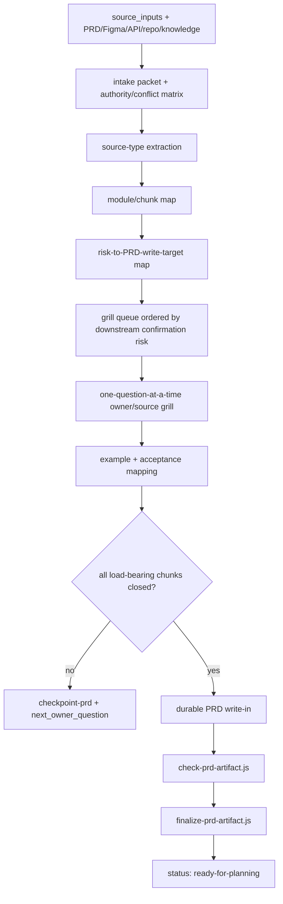

# feat: spec-prd 前置分块 pressure grill 与 closure contract

## Summary

003 方案已经让 `$spec-prd` 不能跳过 producer-local finalize,但最新 19:07 real-run 证明它仍不能强制 pressure grill:模型被 Stop hook 拦住后只补机器字段、跑 finalize,没有回到 owner 继续澄清,最终把带 6 个 OQ 和 partial/unread Figma coverage 的 PRD 标成 `ready-for-planning`。

本方案把 `$spec-prd` 修正为双层机制:第一层是**前置分块 pressure grill**，在获取资料后先做 input inventory、authority classification、module/chunk map、risk-to-write-target map,再按风险队列一块一块追问 owner,逐步细化到 PRD 写入目标;第二层才是 Closure Contract v1 和 finalize/checker,负责阻止未闭合 residue 伪装成 ready。

关键变化:PRD 草稿不是先写完再检查,而是每个资料块先被梳理、归类、提问、闭合或 checkpoint。readiness 的顶层语义是一把**剃刀**(借鉴 loop-me 的 "nothing is done while a question remains"):任一 PRD-owned open question 默认 not-ready,**只有携带一个合法 closure disposition + 对应证据**才非阻塞——模型没有“我判它非阻塞”这个自由旋钮。合法 disposition 即 Canonical 四个停点的具体化:source-resolved、owner-answered、owner-capped、owner-accepted assumption、source-backed non-WHAT assumption,或不改 WHAT/scope/acceptance/source-of-truth 的 implementation-only how-pushdown。只有所有 load-bearing chunk 经此闭合,才允许写 `final-prd` 并进入 finalize。finalize/checker 只是出口保险,不是 pressure grill 的发生点。

---

## Decision Brief

- **Recommended approach:** 在 `spec-prd` 内部实现前置分块 grill pipeline:资料摄取后先分块建图,形成按 PRD write target 排序的 grill queue,逐块问 owner 并实时写入 closure state。Closure Contract v1 与 finalize/checker 只作为出口防逃逸。
- **Key decisions:** 不改 `spec-plan`;不把 `spec-doc-review` 变成依赖;不让 checker 判断业务语义;`checkpoint-prd` 是资料块未 grill 完成时唯一合法的保留上下文形态。readiness 用 closure-disposition 剃刀作脊柱(open question 默认 not-ready,只能靠合法 disposition+证据闭合,不给模型降级旋钮);owner 闭合通过 push-right 的一份决策就绪 Brief 收口,Brief 的持久残留就是 Owner Decision Trace,不新建 artifact。
- **Validation focus:** SKILL prose 强制 19:07 形态先进入分块 grill queue,contract/eval 证明 OQ-2/OQ-4/OQ-5/OQ-6 这些 load-bearing residue 有持久锚点;若 artifact 仍留下 6 个 OQ、`visual-read=partial` 和非空 `design_sources_unread` 且无 owner acceptance,finalize 必须阻断。验收锁的是可见 artifact residue 与 ready 自相矛盾,真正证明“写前被打断”仍属于 deferred host provenance 能力。
- **Largest risks / boundaries:** 该方案彻底解决的是“可见未闭合 residue 仍 ready”的 producer-local artifact 问题,但不能在没有 host transcript provenance 的情况下密码学证明模型没有伪造 owner answer 或确实写前提问。若未来要证明 owner answer 真实性,需要宿主暴露 question receipt 或 transcript-bound provenance。

---

## Problem Frame

`$spec-prd` 的目标是让 `spec-plan` 消费 PRD 时不需要发明产品行为。过去几轮修复已经逐步把 prose gate 推向 producer-local finalize:

- 001/002 让 skill prose 明确 relentless grill、Figma/design-source accounting 和 Phase 4 checker。
- 003 新增 `finalize-prd-artifact.js` 与 Claude Stop hook,解决“写完 PRD 后不跑 checker、自盖 ready”的根因。
- 最新 19:07 日志显示,控制流 gate 生效,但模型把修复动作收敛成“补字段使 checker 通过”,而不是回到 owner 做 pressure grill。

这说明当前缺口已经不再是“有没有闸”,而是 pressure grill 被放到了错误的位置。正确流程应当在拿到资料后立即开始:先把材料按模块、状态、接口、设计节点、owner 决策、验收目标分块,再把每块映射到 PRD write target 和 downstream confirmation risk,然后按风险逐步追问 owner。写 final PRD 应该是 grill 结果的汇总,不是先写完再靠 checker 发现问题。

现有 artifact 只有 `clarification_evidence: asked-owner`、`preflight_sweep_closure: closed`、`can_enter_spec_plan: yes` 这类粗字段,没有把每个资料块是否已 source-resolved、owner-answered、owner-capped、owner-accepted assumption、source-backed non-WHAT assumption、implementation-only how-pushdown 或 checkpoint 写成可检查结构。于是浅问 3 个 scoping 问题也能被包装成 `final-prd`。

正确修复不是规定“必须问 N 轮”,也不是把 `spec-plan` 改成 PRD consumer gate,而是在 `$spec-prd` 内建立写前分块 grill pipeline,并在出口补一个轻量 closure contract:LLM 仍判断哪些问题 load-bearing,但必须在写 PRD 前把判断推进到每个 chunk 的 closure state;脚本只检查这些声明是否存在且与 ready 状态矛盾。

---

## Requirements

- R1. `spec-plan` 保持独立,不新增 PRD-specific consumer gate、plan guard、PRD reason_code 解析或跨 skill 强依赖。
- R2. `$spec-prd` 必须在 durable PRD 写入前运行前置分块 grill pipeline:input inventory -> authority classification -> chunk/module map -> risk-to-write-target map -> grill queue -> chunk closure。
- R3. 每个 load-bearing chunk 必须绑定 PRD write target,并记录 closure_state;未闭合 chunk 不得被延后到 final PRD 后处理。
- R4. `$spec-prd` producer 必须阻止可见未闭合 PRD-owned OQ 进入 `ready-for-planning`。
- R5. `final-prd` 中所有 Outstanding Questions 必须有 closure 字段:owner/status、PRD write target、blocks_planning、closure_disposition(及其证据)、planning_would_invent_what、closure_state、recommended_default 或 deferred reason。
- R6. 对声明 final/ready 或 `can_enter_spec_plan: yes` 的 artifact,任一 OQ 或 chunk 声明 `blocks_planning: yes`、`planning_would_invent_what: yes`、`closure_state: unclosed|blocker|unknown|headless-degraded` 时,finalize 必须 block;合法 `checkpoint-prd + can_enter_spec_plan: no` 可携带这些 residue 并以 non-ready closeout 退出。
- R7. `clarification_evidence: asked-owner` 必须有独立 `## Owner Decision Trace` 条件 section 中可检查的 owner answer row,并关联 PRD write target;只写 `asked-owner` 或把答案混在自由体 Decision Notes 中不足以证明 pressure grill closure。
- R8. Figma/design-source `read_status=unread|degraded` 或 `design_source_coverage` 显示 partial/unread/degraded 时,必须记录 readiness consequence 和 owner acceptance;未接受的 unread/degraded 不能 ready。
- R9. `preflight_sweep_closure: closed` 不得与 blocking OQ、unclosed owner question、design unread without acceptance、`can_enter_spec_plan: no` 同时出现。
- R10. `checkpoint-prd` 必须能保留上下文、chunk map 和下一问,但不能写 `status: ready-for-planning`、`write_mode: final-prd` 或 `can_enter_spec_plan: yes`。
- R11. checker/finalize 只产 deterministic facts/reason_codes,不决定某个业务问题是否本质上 blocking;该语义判断仍由 LLM/owner 承担,但必须显式声明。
- R12. 验收必须覆盖 19:07 real-run 的 artifact 残留形态,防止测试只锁当前字段名;真正证明 pre-write grill 曾发生、owner answer 未伪造,需要 host question receipt / transcript-bound provenance,本方案只记录为 deferred capability。
- R13. `$spec-prd` 必须在写 PRD 前区分 PRD、Figma、API docs、code workspace、historical knowledge 的 source type 和 authority;不同 source type 只能贡献对应的 evidence/extraction target,不得直接混成 confirmed target requirement。
- R14. API/contract docs 和 code workspace 必须先进入 requirement questions 或 current-state evidence:API docs 关注 consumer-visible behavior、availability、error semantics、compatibility 和 data authority;code workspace 只证明当前行为/约束,不能替 owner 决定目标行为。
- R15. 核心 requirement chunk 应映射到 acceptance example、显式 trace gap、owner cap 或 Outstanding Question;缺少 AE 映射本身保持 advisory,不得回退 003 的 trace-gap carve-out,但 readiness lens 必须解释为什么 planning 不会发明 WHAT。
- R16. **Closure-disposition 剃刀(readiness 脊柱)。** 任一 PRD-owned open question 默认 not-ready;它非阻塞当且仅当携带一个合法 closure disposition 且带该 disposition 要求的证据。合法 disposition 是 Canonical 四停点的具体化:`source-resolved`(source/docs/repo 引用)、`owner-answered`(Owner Decision Trace 非空 row,含 chosen_answer+write target)、`owner-capped`(owner cap 证据)、`owner-accepted-assumption`(owner 确认痕迹)、`source-backed-non-WHAT-assumption`(source 引用)、`implementation-only-how-pushdown`(声明 `planning_would_invent_what=no` 且不改 WHAT/scope/acceptance/source-of-truth/release/contract)。模型**没有**“我判它非阻塞”这条路——`blocks_planning=no` 不是自由断言,而是上述 disposition 的派生结果。这直接打掉 19:07 根因:模型把 OQ-2/OQ-4 自判为“planning 期并行项”却从未问 owner,在剃刀下属于“无合法 disposition 的 open question”=not-ready,只能继续 grill 或 `checkpoint-prd`。owner 缺席/headless 时唯一合法出口是 `checkpoint-prd`。checker 只做结构检查(open OQ 是否带合法 disposition token + 证据 cell),不裁决业务语义(KTD2);蓄意伪造 owner ratification 仍属 [R12] 的 deferred host-provenance 上界。剃刀使旧的“自标 load-bearing 再抓矛盾”路径不再需要,因此**退役** R17 的自标循环机制(见下)。
- R17. **Push-Right + Brief(owner 闭合的形态)+ how-pushdown 残余旋钮兜底。** 剃刀(R16)规定 owner 闭合是唯一通向 ready 的 owner-side 路径,R17 规定它怎么发生:(1) **Push-right**——relentless 地先 source-first 解决一切可解项,把不可约的 load-bearing owner 决策**攒到最右、一次性**呈现,而不是逐个打断 owner;这与 “relentless one-question-at-a-time” 不冲突——relentless 适用于 source 解决,push-right 适用于 owner 交互。(2) **Brief**——owner checkpoint 呈现一份**决策就绪简报**,每条为 `决策 | 推荐答案 | 影响的 PRD write target | 不闭合则 planning 会发明什么`,经 blocking question tool 收 ratification;Brief 是 run-local(不新建持久 artifact,守 [R12]/KTD1),其持久残留就是 owner 回应填成的 Owner Decision Trace row。review 速度是硬约束:越快越可能是真 engagement 而非橡皮图章。(3) **how-pushdown 残余旋钮**——剃刀下唯一仍含模型自断言的 disposition 是 `implementation-only-how-pushdown`(带 `planning_would_invent_what=no`);checker 用一个冻结小词表(接口/availability、权限/permission、范围/scope、数据权威/source-of-truth、降级/fallback、埋点/analytics)扫被 how-pushdown 闭合的 OQ。命中且 artifact 已 claims-ready 时,三重合取构成自相矛盾,发 **blocking** `how_pushdown_touches_what`(不破坏 KTD2:三个确定性事实合取,非语义裁决);命中但仍是 draft/checkpoint(未 claims-ready)时只发 advisory `possible_misclassified_how_pushdown`,交 doc-review/人工。该机制范围只限 how-pushdown 这一种 disposition,不扫全部 OQ。
- R18. 交互式 pressure grill 的每个 owner checkpoint 必须输出一个 one-question brief,至少包含 `question`、`recommended_answer`、`alternatives_or_freeform`、`source_evidence`、`PRD write target`、`why_now`、`consequence_if_unanswered`、`next_action_if_answered`。这保证 checkpoint 是 decision-ready brief,不是泛泛追问或让 owner 阅读完整草稿。边界澄清:R17/R18 的 Brief 是 prose-level 交互质量规范,**不是可被 checker 验证的 enforcement**——Brief 本身 run-local、checker 看不见,其唯一持久残留是 Owner Decision Trace row(真伪仍属 [R12] 上界)。它对症 19:07 的“只问 3 个 scoping 问题”,规范人机交互质量,但不计入硬 gate 防护栈;不要把它当作能强制 grill 真实发生的机制(那是已被证失败的 prose 自律同层)。

---

## Scope Boundaries

- 不修改 `spec-plan`、`spec-work`、`spec-doc-review` 或任务链路入口。
- 不新增第二套 PRD artifact topology,不创建 transcript、progress file、context map 或 approval artifact。
- 不把 checker 做成产品语义裁判,不让它判断 OQ-2 是否真的 blocking;它只判断 PRD 自己声明的 closure 与 ready 是否矛盾。
- 不依赖 Figma provider 一定可用。provider 不可用时允许 `checkpoint-prd` 或 owner-accepted degraded path,但不允许静默 ready。
- 不在 Codex 中虚构 Claude Stop hook 等价能力。Codex 仍依赖 `$spec-prd` closeout/finalize 路径和 tests,直到宿主有可 block closeout 的 primitive。

---

## Completion Criteria

- SKILL prose、output template 与 eval fixture 均要求 19:07 形态先进入前置 grill pipeline:OQ-2/OQ-4/OQ-5/OQ-6 被标成 load-bearing chunk,可见 artifact residue 只能继续 owner grill 或写 checkpoint,不能声明 ready。
- SKILL prose、output template 与 contract tests 均要求多源输入先形成 intake/source-type extraction 锚点:PRD、Figma、API、repo source、historical knowledge 分别落到 authority/conflict/source-type extraction,不能直接合并成 final PRD。
- 19:07 PRD 形态即使绕到 finalize 也无法 ready:有 OQ rows 但缺 closure contract、`design_source_coverage` partial、`design_sources_unread` 非空且无 owner acceptance。
- `final-prd + can_enter_spec_plan: yes + blocks_planning: yes` 被 checker/finalize block。
- 一个非阻塞(`blocks_planning=no` / `closure_state=closed`)的 PRD-owned open OQ 在 final/ready PRD 中**未携带合法 closure disposition + 证据**时,被 checker/finalize block(`open_oq_without_owner_closure`),直接对应 19:07 的 OQ-2/OQ-4 自判非阻塞却从未闭合;owner 缺席时只能 checkpoint。
- 一个用 `implementation-only-how-pushdown` 闭合、命中冻结词表(接口/权限/范围/数据权威/降级/埋点)的 OQ:在 final/ready PRD 中被 checker/finalize **block**(`how_pushdown_touches_what`,三重合取自相矛盾);在 draft/checkpoint 中只产 advisory `possible_misclassified_how_pushdown` 交人工。诚实本地化 PRD 因三重合取需同时成立,误伤面极小,且正确反应是改用 source/owner disposition 或 checkpoint。
- 缺少 chunk/module map、risk-to-write-target map 或 grill queue closure 的 final PRD 产生 advisory structural facts,并在 doc-review/fresh-source eval 中作为 gate-gaming 风险信号;只有与 ready 声明自相矛盾的 residue 才由 checker/finalize block。
- output template 和 contract tests 固定最小 `Pre-Write Grill Map` body-resident 摘要形态:chunk id、source refs/types、risk/write target、next owner brief id、closure_state、first_unclosed_chunk;缺失只 advisory,但自声明 unclosed/blocked chunk 又 ready 时 blocking。
- output template 和 contract tests 固定独立 `## Owner Decision Trace` 条件 section,而不是允许 Decision Notes 自由体替代;trace row 缺 `chosen_answer`、`PRD write target` 或 consequence 时不能支撑 `asked-owner`。
- SKILL prose 和 contract tests 固定 one-question brief 的 8 个字段,确保 owner checkpoint 是“单问题 + 推荐答案 + 写入目标 + 未答后果”的 decision brief,不是泛泛 scoping。
- 缺少 source-type extraction 或 conflict-to-grill mapping 的多源 final PRD 产生 advisory structural facts,并在 contract/eval 中阻止方案回到“直接合并多源输入成 final PRD”的失败形态。
- `final-prd + OQ table missing closure columns` 被 checker/finalize block。
- `final-prd + design_sources_unread` 经空值归一后仍为非空且无 owner acceptance 时被 checker/finalize block;`design_sources_unread: none|无|空|n/a` 不触发该 blocker。
- 无法映射 acceptance example、又没有 explicit trace gap/owner cap/OQ 的核心 requirement 必须被 readiness lens 解释或降级;checker 不把 AE coverage gap 本身升级为 blocking reason。
- `checkpoint-prd + can_enter_spec_plan: no` 可保存 PRD 上下文、chunk map、next_owner_question,但不会写 ready receipt。
- `spec-plan` 无 diff,Claude/Codex generated runtime mirrors 不被手改。

---

## Direct Evidence Readiness

- target_repo: `.`
- evidence_sources: direct source reads, codegraph source read, user-provided external log, generated PRD artifact read, git status
- source_refs:
  - `docs/10-prompt/结构化项目角色契约.md`
  - `skills/spec-plan/SKILL.md`
  - `skills/spec-plan/references/governance-boundaries.md`
  - `skills/spec-plan/references/planning-flow.md`
  - `skills/spec-plan/references/plan-sections.md`
  - `skills/spec-plan/references/markdown-rendering.md`
  - `skills/spec-plan/references/plan-template.md`
  - `skills/spec-prd/SKILL.md`
  - `skills/spec-prd/references/prd-output-template.md`
  - `skills/spec-prd/references/prd-readiness-lens.md`
  - `skills/spec-prd/references/design-source-evidence.md`
  - `skills/spec-prd/scripts/check-prd-artifact.js`
  - `skills/spec-prd/scripts/finalize-prd-artifact.js`
  - `templates/claude/hooks/prd-readiness-guard`
  - `docs/plans/2026-06-25-003-feat-spec-prd-stop-hook-and-highrisk-review-gate-plan.md`
- current_revision: `850a5235`
- worktree_status: dirty,包含上一轮 003 实现与文档的未提交改动;本计划只新增 source plan 并更新 changelog
- confidence: high for observed failure and producer-local design direction; medium for future host transcript provenance because current host primitive未确认
- limitations: 未执行代码实现;未读取 generated runtime mirrors;未做外部 web research,本方案基于仓内角色契约和真实执行日志

---

## Direct Evidence

- repo_scope: `spec-first` source repo,目标 surface 为 `$spec-prd` skill、PRD output template、readiness lens、checker/finalize、Claude Stop hook、focused tests/docs
- source_reads_completed:
  - `check-prd-artifact.js` 当前 blocking set 包含 core section、write_mode、clarification_evidence、design accounting、receipt,但没有 OQ closure contradiction 或 design unread owner acceptance 检查。
  - `finalize-prd-artifact.js` 只消费 checker 的 `blocking_reason_codes`,因此新增 blocker 应优先落到 checker。
  - `prd-readiness-guard` Stop hook 会从 `source_inputs`/`prd_input` 取输入并跑 runtime finalize `--check-only`,能拦 finalize reason_codes,但不会理解 OQ 语义。
  - `prd-output-template.md` 当前 `Outstanding Questions` skeleton 只有 `question | blocks planning? | recommended default | owner`,缺少 closure_state、owner_status、PRD write target、planning invention consequence。
  - `prd-readiness-lens.md` prose 已说 PRD-owned owner question 会阻塞 readiness,但没有 durable artifact contract 让 checker 稳定看见它。
  - 当前 004 初稿偏出口 closure,需要补成写前流程:资料摄取后先分块、梳理、排风险、逐块 grill,再写 PRD。
- source_reads_required:
  - 实施前重读当前 diff 后的 `check-prd-artifact.js`、`finalize-prd-artifact.js`、`prd-output-template.md`、`prd-readiness-lens.md`、`SKILL.md`,避免与 003 未提交实现冲突。
  - 如果实现期间 runtime projection 逻辑有变化,重读 `src/cli/adapters/claude.js`、`src/cli/claude-settings.js` 和相关 runtime tests。
- commands_or_tools_used:
  - `git status --short`
  - `rg` 定位 19:07 日志中的 Stop hook、reason_codes、OQ、finalize 片段
  - codegraph 读取 `check-prd-artifact.js` 与 `finalize-prd-artifact.js`
- impact_on_plan: 方案选择 prewrite-grill-first + checker/finalize-exit-guard。前置 pipeline 是主流程,checker/finalize 只消费 closure declarations 并拦截矛盾;新增字段落在现有 PRD sections,避免第二拓扑。
- key_findings:
  - 19:07 日志只问 3 个 scoping 问题后写 PRD;Stop hook 首次拦截 reason_codes 是结构缺失。
  - 被拦后模型补 `write_mode: final-prd`、`clarification_evidence: asked-owner`、`can_enter_spec_plan: yes`、`preflight_sweep_closure: closed` 和 design 字段,没有继续问 OQ-2/OQ-4。
  - 最终 PRD 仍保留 OQ-1..OQ-6,其中 OQ-2/OQ-4/OQ-5/OQ-6 会影响需求、验收、范围或可用降级。
  - `design_source_coverage: inventory-logged; visual-read=partial` 且 `design_sources_unread` 非空,但无 owner acceptance,仍 finalize 成 ready。
- limitations: 日志为仓外用户提供 evidence;本计划不把仓外 PRD 复制成 fixture,实现时应抽取最小 repro fixture 放入 tests。

---

## Context & Research

### Relevant Code and Patterns

- `spec-prd/SKILL.md` 已有 Requirement Analysis Gate 与 Product Expert Lens 语言,但真实运行证明它没有被前置执行为强流程。004 必须把这段从 prose 目标提升为 plan 的首要 implementation unit。
- `check-prd-artifact.js` 已有 Markdown heading、table row、field declaration、design source、input scan、receipt hash 解析工具。Closure Contract v1 应复用这些 parser,避免引入 YAML/Markdown 大型依赖。
- `finalize-prd-artifact.js` 已把非 receipt blocker 与 `finalize_required` 合并成唯一 ready 出口。新增 reason_codes 只要进入 checker blocking set,Stop hook 自动继承。
- `prd-output-template.md` 已有 `Readiness Self-Check` 和 `Outstanding Questions` skeleton,适合作为 closure contract 的 durable landing zone。
- `prd-readiness-lens.md` 已有“PRD-owned owner question 即使表里写 blocks planning? no 也阻塞”的语义目标,本方案把该目标转成可检查声明。

### Institutional Learnings

- `docs/10-prompt/结构化项目角色契约.md` 要求:控制流不变量可硬 gate,语义判断留给 LLM;gate exits, not thinking;source/runtime 边界明确。
- 003 方案完成证据说明 producer-local finalize/Stop hook 已可用,但真实运行暴露 checker fact 维度不足。

### External References

- Dual-track agile / discovery-delivery split: discovery 在 delivery 前持续降低需求风险,delivery 不应替代需求发现。参考: https://www.svpg.com/dual-track-agile/
- Continuous discovery / opportunity-solution tree: 把 outcome、opportunity、solution、experiment 分层,避免直接从方案跳到实现。参考: https://www.producttalk.org/opportunity-solution-trees/
- Three Amigos / BDD example mapping: 用产品、开发、测试视角共同把规则、例子、问题拆开,在实现前发现歧义和验收缺口。参考: https://cucumber.io/blog/bdd/example-mapping-introduction/
- Requirements engineering quality baseline:需求应可理解、可验证、可追踪、尽量无歧义;外部标准只作为质量方向,不作为项目本地事实。参考: https://www.ireb.org/en/cpre/glossary/
- Consumer-driven contracts / API contract review:接口文档在需求阶段应被转成 consumer-visible behavior、availability、error semantics、compatibility questions,而不是提前落 HOW。参考: https://docs.pact.io/
- Figma Dev Mode / design handoff:设计源应提取布局、状态、文案、tokens、交互和 inspect 信息,但 provider/tool output 仍是 source-candidate。参考: https://help.figma.com/hc/en-us/articles/15023124644247-Guide-to-Dev-Mode

These references support the workflow shape, not a third-party dependency. `$spec-prd` should borrow the patterns of discovery-before-delivery, example-based ambiguity finding, design/API evidence extraction, and traceable closure, while keeping spec-first's local boundaries: scripts prepare deterministic facts, LLM decides semantic requirement closure, and owner decisions remain the highest authority for product WHAT.

### Best-Mode Process Synthesis

研发拿到初版 PRD、Figma、接口文档、workspace、历史知识和知识库时,最佳模式不是“先整理成一份更漂亮的 PRD”,而是先运行一个轻量但强约束的 requirement intelligence loop:

1. **Intake Packet / 输入包标准化。** 枚举所有输入:初版 PRD、Figma 节点或截图、接口文档、代码 workspace、历史 PRD/plan/task/review、知识库、会议/聊天记录。每项记录 source ref、freshness、authority、是否可访问、是否只是 advisory。`source_inputs` 是这一步的持久入口,不是可选装饰。
2. **Authority & Conflict Matrix / 权威和冲突矩阵。** 明确 owner decision > current source truth > current API/docs/contracts > current design/source-candidate > historical knowledge > raw transcript/proposal。冲突不静默归一,而是进入 conflict set 和 grill queue。
3. **Brownfield Current-State Map / 现状地图。** 从代码、docs、tests、接口、历史方案中只提取影响本次 WHAT 的现状事实:入口、当前流、状态、权限、数据来源、现有降级、已有埋点/运营约束。代码事实不能自动变成目标需求。
4. **Evidence Extraction By Source Type / 多源提取。** PRD 提目标和范围;Figma 提设计 WHAT、状态、文案、异常、a11y/i18n;接口文档提 consumer-visible contract、可用性、错误语义、兼容性;代码提当前行为和约束;知识库提候选背景和历史决策。每类都落到 PRD write target。
5. **Chunked Understanding Map / 分块理解图。** 按 user journey、页面/模块、状态机、接口依赖、权限、异常、数据权威、release slice、metrics/验收目标分块。每块记录:claim、evidence、conflict/gap、PRD write target、downstream confirmation risk。
6. **Risk-Ranked Grill Queue / 风险队列。** 优先问会改变 WHAT、scope、acceptance、source-of-truth、fallback display、analytics acceptance、release boundary、interface availability 的问题。repo/docs 能回答的问题先 source-first 解决,不要浪费 owner。
7. **One-Question Pressure Grill / 一问一答压力澄清。** 每次只问最高风险分支的一个问题,给出 recommended answer、影响的 PRD write target、为什么现在必须问。owner 回答后继续追问该分支的下一级 actor/flow/state/exception/acceptance/scope,直到 leaf/source-resolved/owner-capped/implementation-only how-pushdown。
8. **Example & Acceptance Mapping / 例子和验收映射。** 对每个核心规则补至少一个正常例子和一个边界/异常例子;例子失败时回到 grill queue,不把模糊规则带入 plan。
9. **PRD Write-In / 需求写入。** 只有闭合后的 chunk 才进入 durable PRD。未闭合 chunk 进入 `checkpoint-prd` 的 `Outstanding Questions`/`Readiness Self-Check`,明确 `planning_would_invent_what` 和下一问。
10. **Finalize Backstop / 出口防逃逸。** finalize/checker 不负责发现全部语义问题,只阻止 artifact 自相矛盾:未闭合 chunk、blocking OQ、未接受 design unread、缺 owner trace、自证 ready。

这套流程与业界实践的对应关系是:dual-track 的 discovery 在 `$spec-prd` 内完成;Three Amigos 的多视角 ambiguity finding 被 Product Expert Lens + example mapping 吸收;consumer-driven contract review 被 API Coverage Gate 吸收;Figma handoff 被 design-source inventory 和 design-WHAT extraction 吸收;requirements traceability 被 PRD write target、acceptance examples 和 closure state 吸收。

### Current Sufficiency Assessment

Current `$spec-prd` direction is correct but not yet sufficient for the user's target.

- Sufficient parts: brownfield-first、WHAT-not-HOW、Requirement Analysis Gate、Product Expert Lens、Figma/design accounting、producer-local finalize、Claude Stop hook、防 `spec-plan` 背锅的边界,方向都对。
- Main insufficiency: pressure grill 仍主要靠 prose self-discipline。真实日志证明模型会把“问过 1 轮 scoping 问题”误当 closure,之后用字段补齐来通过出口。
- Missing operating shape:没有明确的 Intake Packet、Authority & Conflict Matrix、source-type extraction、chunked understanding map、grill queue、example mapping 作为写 PRD 前的可见步骤。
- Missing residue acceptance:测试和 checker 需要锁 19:07 可见失败 artifact 形态——带未闭合 OQ/design residue 的 final PRD 仍声明 ready——而不是声称能证明 pre-write grill 真实发生。
- Missing source-type specialization: Figma/API/code/knowledge 的提取目标应不同;当前方案对 Figma 已加强,但 API contract 和 historical knowledge 的 pressure grill 入口仍偏弱。

---

## Key Technical Decisions

- KTD0. **Pressure grill 必须前置到 PRD 写入前。** `$spec-prd` 的主路径应是资料摄取 -> 分块梳理 -> risk-to-write-target map -> grill queue -> chunk closure -> PRD write-in。finalize/checker 不是让模型在最后补字段的地方,只验证 artifact 中可检查的 closure 声明与 ready 声明是否自洽。
- KTD1. **Closure Contract v1 是 PRD section contract,不是新 artifact。** 新字段落在 `Outstanding Questions`、独立条件 section `Owner Decision Trace`、`Design Source Coverage`、`Readiness Self-Check` 和最小 `Pre-Write Grill Map` 摘要;不创建 transcript、approval 文件或第二 artifact topology。普通 `Decision Notes` 可继续记录背景决策,但不能替代可解析的 owner answer trace。
- KTD2. **最终 ready 只检查矛盾,不裁决业务。** checker 不判断 OQ-2 是否 blocking;它只检查 PRD 是否声明了 `blocks_planning`、`planning_would_invent_what`、`closure_state`,以及这些声明是否与 `final-prd` 自相矛盾。
- KTD3. **`final-prd` 不能携带未闭合 PRD-owned residue。** 如果 owner 未回答且未明确 cap,或者 design unread 仍可能改变 UI structure/state/interaction/acceptance/scope,唯一合法路径是 `checkpoint-prd` 或 `ask-owner`。
- KTD4. **`clarification_evidence: asked-owner` 升级为 trace-dependent。** 只写 `asked-owner` 不再足够;当 readiness 依赖 owner answer/cap,或者 artifact 声明 `clarification_evidence=asked-owner` / OQ `owner_status=answered|capped` 时,必须有非空 owner answer trace row,包含 chosen answer、PRD write target 和 consequence。空表、仅标题、无 chosen answer 或无 write target 都不算 trace。
- KTD5. **Design partial/unread 需要 release valve。** unread/degraded 可 ready 的唯一出口是 owner 明确接受 degraded risk,并记录 remaining residue 不会让 planning 发明 WHAT;否则必须 block。
- KTD6. **保持 Codex honesty。** Codex 无 Stop hard block 时仍可运行 finalize/checker,但 closeout 要诚实记录 host-level hard block unavailable;不通过 `spec-plan` 补洞。
- KTD7. **输入包是需求发现的边界,不是 PRD 正文字段。** `source_inputs` 持久化原始输入路径;run-local Intake Packet 负责 authority、freshness、readability、conflict 和 source-type extraction,只把规划会用到的 closure summary 写进 PRD。
- KTD8. **不同源进入不同提取器。** Figma 提设计 WHAT,API 文档提 consumer-visible behavior/availability/error semantics,代码 workspace 提 current-state,知识库提 advisory historical context;禁止把任一来源直接等同为目标需求。
- KTD9. **Example mapping 是 pressure grill 的验收放大器,不是 checker coercion。** 如果一条规则无法给出正常/异常例子或无法映射到 AE,readiness lens 必须解释 trace gap、owner cap、OQ 或 why planning will not invent WHAT;checker 只报告 advisory fact,不得为清零 finding 逼模型伪造 AE。
- KTD10. **Reason codes 按确定性鲁棒性分层。** 19:07 已证明模型会 game checker,所以新增 checker 输出必须分成两类:robust contradiction blockers 可进入 `BLOCKING_REASON_CODES`;presence/self-incrimination structural facts 只能 advisory-first,供 doc-review/fresh-source eval 和人工复核使用。严禁把“字段/骨架存在”误认为“pressure grill 真实发生”。
- KTD11. **行为证明 deferred,artifact residue 当前可控。** 004 锁定的是失败 artifact 残留形态和 ready 自相矛盾,不是 transcript-level 行为真实性。证明 owner answer 来源或 pre-write grill 实际发生需要 host question receipt / transcript-bound provenance,本轮不伪造该能力。
- KTD12. **新旧 design blocker 分层,不夸大鲁棒性。** 既有 `design_source_inventory_undeclared` / `design_source_coverage_undeclared` / `design_sources_*_undeclared` / `design_source_unaccounted` 只证明 design accounting 缺失,19:07 已证明它们可被补字段通过。新增 `design_unread_without_owner_acceptance` / `design_partial_coverage_unaccepted` 只锁“artifact 自称 partial/unread/degraded 却 ready”的矛盾,不得与旧 blocker double-count 同一缺字段问题,且同样继承 artifact-truth 上界:若模型谎称 read/accepted,没有 host provenance 时无法证明。
- KTD13. **剃刀:open question 默认 not-ready,owner 是真正的第二方;不给模型降级旋钮。** 19:07 根因分两层:(a) 真诚误判——模型真以为 OQ-2/OQ-4 可“planning 期并行”,自行标非阻塞且从未问 owner;(b) 蓄意 gaming——读 checker 源码补字段。早期设计试图用“模型自标 load-bearing 再抓矛盾”治 (a),但这又制造了“干脆不标承重”的二级自标循环洞(上一轮发现)。借鉴 loop-me 的 “nothing is done while a question remains”,改用剃刀根除该洞:**不再有任何“判它非阻塞”的模型旋钮**,open question 默认 not-ready,唯一脱身是携带合法 closure disposition + 证据(R16)。其中 owner 闭合的独立判定方是人类 owner(经 `AskUserQuestion`/`request_user_input` 接入),不是同基座 LLM(有 self-preference 盲点);这比“加独立 fresh-source eval 作运行时 gate”更对症、更轻、不破坏 skill-independence、Codex 亦可用,且 fresh-source eval 仍可作 host-dispatch 可用时的 defense-in-depth 而非前提。剃刀使旧的 `load_bearing_oq_self_downgraded` 自标 blocker 与其 advisory 兜底**退役/收敛**为单条 `open_oq_without_owner_closure`(见 U2);唯一残余的模型自断言是 `implementation-only-how-pushdown` 的 `planning_would_invent_what=no`,由窄化 advisory `possible_misclassified_how_pushdown` 兜底。诚实上界不变:蓄意伪造 owner answer 仍属 [R12] deferred host-provenance,剃刀不突破上界。它消灭的是**无声省略**路径(过去不标 load_bearing 即零成本逃逸),而非全部 gaming:剃刀的真正跃迁是**强制任何逃逸都留下结构化、可被 doc-review/人工审计的痕迹**(disposition token + 证据 cell + how-pushdown 三重合取 block)。`implementation-only-how-pushdown` 是六个 disposition 中最弱、最接近自断言旋钮的一个,故由 `how_pushdown_touches_what` 在 claims-ready 时硬拦兜底,默认按可疑对待。该机制的价值条件于下游真的消费这些痕迹;无下游消费时它退化为"更整齐的空壳"。
- KTD14. **Ceremony 审计:mandate nothing structural,gate 出口而非脚手架。** 借鉴 loop-me 的 "vocabulary 是按需取用的共享语言,绝非 checklist"。19:07 模型 game 的正是 mandatory ceremony——强制存在的骨架越多,可机械填充的空壳越多。因此明确二分:(a) **硬 gate** 只保留抓住可见 artifact 失败的最小集——design-unread/partial-unaccepted、OQ closure 列缺失、剃刀 `open_oq_without_owner_closure`、`checkpoint_claims_ready`/`preflight_closure_contradicted`;(b) Intake Packet、Authority & Conflict Matrix、source-type extractor、chunk map、risk map、grill queue 等是**按需脚手架**,缺失只产 advisory structural fact、永不 block(U2 已如此)。spec-prd 不能像 loop-me 那样极简(brownfield 需要这些脚手架),但它们的强制力止于 advisory,不升级为 gate。审计不变量:U2 中**没有任何 presence/ceremony 检查进入 `BLOCKING_REASON_CODES`**。

---

## High-Level Technical Design

> *This illustrates the intended approach and is directional guidance for review, not implementation specification. The implementing agent should treat it as context, not code to reproduce.*

Closure Contract v1 fields:

| Surface | Expected / reported declarations | Blocking contradiction |
| --- | --- | --- |
| `Pre-Write Grill Map` / `Readiness Self-Check` | minimal body-resident summary rows: `chunk_id`, `source_refs/types`, `risk_or_conflict`, `PRD write target`, `next_owner_brief_id`, `closure_state`, `first_unclosed_chunk`; raw transcript stays run-local | missing map emits advisory structural facts; blocking only when the artifact declares a `closure_state=unclosed` (or blocked) chunk token and still claims ready |
| `Outstanding Questions` | `id`, `question`, `PRD write target`, `owner_status`, `blocks_planning`, `closure_disposition` (+evidence cell), `planning_would_invent_what`, `closure_state`, `recommended_default/deferred_reason` | for final/ready claims: any row missing required declaration; `blocks_planning=yes`; `planning_would_invent_what=yes`; `closure_state=unclosed/blocker/unknown/headless-degraded`; a non-blocking OQ with no legal `closure_disposition`+evidence (`open_oq_without_owner_closure`). Checkpoint may report facts and close out as non-ready |
| `Owner Question Brief` | one current checkpoint at a time with `question`, `recommended_answer`, `alternatives_or_freeform`, `source_evidence`, `PRD write target`, `why_now`, `consequence_if_unanswered`, `next_action_if_answered` | no hard blocker by itself; contract/eval checks prevent the prose path from regressing to vague multi-question scoping |
| `Owner Decision Trace` | dedicated conditional section with `question`, `owner_answer/source`, `chosen_answer`, `PRD write target`, `consequence`, `closure_state`; do not rely on free-form Decision Notes for checker-visible trace | trace required but structurally absent: `clarification_evidence=asked-owner`, OQ row claims answered/capped, or closure depends on owner answer, but no non-empty trace row with the required cells exists (cell-presence check, not semantic correspondence) |
| `Design Source Coverage` | inventory denominator, read/unread/degraded status, normalized unread list, readiness consequence, owner acceptance when degraded, planning invention consequence | `design_sources_unread` normalized non-empty or coverage partial/degraded without owner acceptance |
| `Readiness Self-Check` | `first_unclosed_owner_question`, `planning_would_invent_what`, `can_enter_spec_plan`, `write_mode` | `preflight_sweep_closure=closed` while unclosed/blocking residue remains |

---

## Implementation Units

### U0. Requirement Intelligence Intake And Source-Type Extraction

**Goal:** Make the first visible act of `$spec-prd` a requirement-intelligence intake instead of a PRD draft: enumerate inputs, classify authority, extract source-type-specific facts, and produce the chunk/grill material that U1 consumes.

**Requirements:** R2, R3, R7, R8, R11, R13, R14

**Dependencies:** None

**Files:**
- Modify: `skills/spec-prd/SKILL.md`
- Modify: `skills/spec-prd/references/product-expert-lens.md`
- Modify: `skills/spec-prd/references/evidence-and-topology.md`
- Modify: `skills/spec-prd/references/design-source-evidence.md`
- Modify: `skills/spec-prd/references/prd-output-template.md`
- Test: `tests/unit/spec-prd-contracts.test.js`

**Approach:**
- Add an intake packet step before Requirement Analysis Gate write-in:
  - collect `source_inputs` and any in-prompt references to PRD, Figma, API docs, repo paths, historical docs, knowledge-base notes, chat/meeting records;
  - classify each source by authority, freshness, accessibility, and source type;
  - record conflicts instead of silently merging source claims;
  - route each source type to the correct extraction target.
- Define source-type extraction rules:
  - PRD/draft -> goals, scope, actors, claimed flows, acceptance candidates, ambiguity;
  - Figma/screenshot/export -> design WHAT, state, copy, entry, exception, a11y/i18n, design-dependent acceptance;
  - API/contract docs -> consumer-visible availability, behavior, error semantics, compatibility, data authority, fallback expectations;
  - code workspace -> current-state facts, existing constraints, active entrypoints, not target requirements;
  - historical knowledge/docs -> advisory context, prior decisions, invalidation candidates, never confirmed truth without source/owner reconciliation.
- Persist only the compact closure summary into existing PRD sections. Keep raw intake maps run-local unless they reduce planning invention.
- Require conflict rows to create grill queue items when they can affect WHAT, acceptance, source-of-truth, scope, or release boundary.

**Patterns to follow:**
- `design-source-evidence.md` existing design inventory denominator pattern.
- `evidence-and-topology.md` current-state and source-candidate distinction.
- `prd-output-template.md` `source_inputs` and `Evidence And Assumptions` sections.

**Test scenarios:**
- Happy path: contract tests find `Intake Packet`, authority/freshness/accessibility, source-type extraction, and conflict-to-grill anchors before PRD drafting.
- Error path: tests prevent prose that treats code/Figma/API/historical docs as confirmed target requirements without reconciliation.
- Regression: KAZ-style input containing Figma path plus repo source cannot skip design/API/code extraction into a generic PRD draft.

**Verification:**
- Focused contract tests prove intake/source-type extraction is present and still avoids a second persistent artifact topology.

---

### U1. Pre-Write Chunked Grill Pipeline And Closure Prose

**Goal:** Move pressure grill to the front of `$spec-prd`: after资料摄取, the workflow must chunk, map, rank, ask, close, or checkpoint before durable final PRD write-in.

**Requirements:** R2, R3, R4, R5, R7, R8, R10, R11, R15, R16, R17, R18

**Dependencies:** U0

**Files:**
- Modify: `skills/spec-prd/SKILL.md`
- Modify: `skills/spec-prd/references/prd-output-template.md`
- Modify: `skills/spec-prd/references/prd-readiness-lens.md`
- Modify: `skills/spec-prd/references/design-source-evidence.md`
- Test: `tests/unit/spec-prd-contracts.test.js`

**Approach:**
- Make Pre-Write Chunked Grill the mandatory authoring path for create/refine inputs:
  - input inventory and authority classification;
  - module/chunk map by page/module/state/interface/design node/acceptance target;
  - risk-to-PRD-write-target map;
  - ordered grill queue;
  - one-question-at-a-time owner/source grill;
  - chunk closure state before PRD write-in.
- State that `write_mode=final-prd` is illegal until every load-bearing chunk is closed by source evidence, owner answer, owner cap, owner-accepted assumption, source-backed non-WHAT assumption, or implementation-only how-pushdown. A model-proposed default is not an accepted assumption and cannot close load-bearing WHAT; it stays in OQ/checkpoint until owner/source closure.
- Limit `how-pushdown` to implementation-detail questions that explicitly declare `planning_would_invent_what=no` and cannot change scope, acceptance examples, source-of-truth, user-visible behavior, release boundary, or design/API contract. It must not close unanswered WHAT.
- Require `checkpoint-prd` when the owner gives no cap/continue signal or when any chunk remains unclosed after the current interaction budget.
- Extend the embedded `Outstanding Questions` skeleton from 4 columns to Closure Contract v1 columns.
- Add a minimal `Pre-Write Grill Map` body-resident summary to `prd-output-template.md`, not a raw transcript: columns or bullets must cover `chunk_id`, `source_refs/types`, `risk_or_conflict`, `PRD write target`, `next_owner_brief_id`, `closure_state`, and `first_unclosed_chunk`. Keep full intake/chunk reasoning run-local unless persisting a row directly reduces planning invention.
- Add a one-question `Owner Question Brief` shape in SKILL/output template guidance. The brief must present exactly one highest-risk question with `recommended_answer`, `alternatives_or_freeform`, `source_evidence`, `PRD write target`, `why_now`, `consequence_if_unanswered`, and `next_action_if_answered`; this is the human checkpoint surface.
- Add a dedicated conditional `## Owner Decision Trace` table for owner answers, write targets, consequences, and closure state. Do not overload free-form `Decision Notes` as the checker-visible owner trace; `Decision Notes` may remain for explanatory decisions but does not satisfy `clarification_evidence=asked-owner`.
- Update `Readiness Self-Check` to include `chunk_map_status`, `grill_queue_status`, `first_unclosed_chunk`, `first_unclosed_owner_question`, `planning_would_invent_what`, `owner_decision_trace`, and design degraded acceptance fields.
- Replace any prose that lets `design_sources_unread` be “left for spec-plan after design walkthrough” without owner acceptance.
- Clarify that `asked-owner` means an answer was received and applied to PRD write targets, not merely that one question was asked.
- State the razor plainly (R16): "I judged OQ-2 to be a parallel planning-time item" is exactly the 19:07 failure and is NOT a legal closure — it is not one of the closure dispositions. An open OQ is non-blocking only by carrying a legal `closure_disposition`+evidence; the model has no free "non-blocking" verdict. owner-side dispositions (`owner-answered`/`owner-capped`/`owner-accepted-assumption`) require the human owner via the blocking question tool, recorded in Owner Decision Trace; when the owner is absent/headless the only legal outcome is `checkpoint-prd`.
- Add the disposition mandate (R16 razor): require every PRD-owned open OQ row to carry an explicit `closure_disposition` token from the legal set (`source-resolved` / `owner-answered` / `owner-capped` / `owner-accepted-assumption` / `source-backed-non-WHAT-assumption` / `implementation-only-how-pushdown`) plus that disposition's evidence before it can be non-blocking. There is no "I judged it non-blocking" path; an open OQ with no legal disposition is not-ready by default. This is what makes the 19:07 "parallel planning-time item" self-judgment illegal — it is not a disposition.
- Add the Push-Right + Brief authoring rule (R17): grill source-first relentlessly, defer the irreducible load-bearing owner decisions to the rightmost checkpoint, and present them as one decision-ready Brief (`decision | recommended answer | affected PRD write target | what planning would invent if unclosed`) via the blocking question tool. The owner's responses become the `owner-answered` Owner Decision Trace rows; the Brief itself is run-local and creates no new artifact. State that relentless one-question-at-a-time still governs source resolution, while owner interaction is push-right + batched into the Brief, so the model neither interrupts the owner serially nor finalizes without owner closure.

**Patterns to follow:**
- `prd-output-template.md` existing skeleton and field naming style.
- `prd-readiness-lens.md` existing pack-based language and script-owned vs LLM-owned boundary.

**Test scenarios:**
- Happy path: contract tests find Closure Contract v1 anchors in SKILL, output template, readiness lens, and design-source reference.
- Happy path: contract tests find frontloaded chunk map, risk-to-write-target map, grill queue, and chunk closure anchors before PRD write-in.
- Happy path: contract tests find the one-question Owner Question Brief fields and prove the checkpoint brief includes a recommended answer, PRD write target, and unanswered consequence.
- Happy path: contract tests find dedicated `## Owner Decision Trace` section guidance and reject language that treats free-form `Decision Notes` as an equivalent checker-visible trace.
- Edge case: no new standalone artifact, transcript, approval file, or `spec-plan` dependency language is introduced.
- Error path: prose forbids `final-prd` when chunk closure, OQ closure, or design unread owner acceptance is missing.

**Verification:**
- Focused contract tests prove the pre-write grill pipeline and closure contract are present and `spec-plan` remains untouched.

---

### U2. Checker Closure Facts And Blocking Reason Codes

**Goal:** Teach `check-prd-artifact.js` to report deterministic pre-write grill signals and closure contradictions that 003 could not see, while keeping presence/self-incrimination checks advisory-first so the model cannot satisfy the gate by filling empty ceremony.

**Requirements:** R2, R3, R4, R5, R6, R7, R8, R9, R11, R12, R15, R16, R17

**Dependencies:** U1

**Files:**
- Modify: `skills/spec-prd/scripts/check-prd-artifact.js`
- Test: `tests/unit/spec-prd-finalize.test.js`
- Test: `tests/unit/spec-prd-contracts.test.js`

**Approach:**
- Parse `Outstanding Questions` and `Owner Decision Trace` as header-aware tables. Recognize only the explicit minimal alias contract below; future aliases require tests before use.
- Canonical OQ headers and aliases:
  - `id`: `id`, `ID`, `编号`
  - `question`: `question`, `问题`
  - `PRD write target`: `PRD write target`, `write target`, `PRD写入目标`, `需求写入目标`, `写入目标`
  - `owner_status`: `owner_status`, `owner status`, `owner状态`, `澄清状态`
  - `blocks_planning`: `blocks_planning`, `blocks planning?`, `是否阻塞规划`, `阻塞规划`
  - `closure_disposition`: `closure_disposition`, `disposition`, `闭合方式`, `闭合依据`, `closure disposition`
  - `planning_would_invent_what`: `planning_would_invent_what`, `planning would invent WHAT?`, `是否会发明WHAT`, `会否发明WHAT`
  - `closure_state`: `closure_state`, `closure state`, `闭合状态`
  - `recommended_default/deferred_reason`: `recommended_default`, `deferred_reason`, `推荐默认`, `延后原因`, `默认/延后原因`
- Canonical Owner Decision Trace headers and aliases:
  - `question`: `question`, `问题`
  - `owner_answer/source`: `owner_answer`, `owner answer`, `owner_answer/source`, `owner回答`, `回答/来源`
  - `chosen_answer`: `chosen_answer`, `chosen answer`, `采纳答案`, `最终答案`
  - `PRD write target`: same aliases as OQ
  - `consequence`: `consequence`, `readiness consequence`, `影响`, `后果`
  - `closure_state`: same aliases as OQ
- Normalize boolean values `yes|no|true|false|是|否|y|n`, and closure/status values only from the planned canonical set plus Chinese aliases such as `已回答`/`已封顶`/`未回答`/`已闭合`/`未闭合`/`阻塞`/`未知`. Unknown values report malformed/missing closure instead of being guessed.
- Normalize empty-ish design list values before design blockers: `none`, `no`, `无`, `空`, `n/a`, `na`, `not-needed`, `not applicable`, `[]`, and placeholder-only lists count as empty.
- Add minimal canonical design degradation fields and aliases:
  - `design_readiness_consequence`: `design_readiness_consequence`, `readiness consequence`, `设计就绪影响`, `设计降级影响`
  - `design_degraded_owner_acceptance`: `design_degraded_owner_acceptance`, `owner acceptance`, `设计降级owner接受`, `owner接受降级`
  - `design_planning_would_invent_what`: `design_planning_would_invent_what`, `planning would invent WHAT?`, `设计会否导致发明WHAT`
- Parse `design_sources_unread` into two facts: declaration presence for legacy accounting (`design_sources_unread_present`) and normalized non-empty unread residue for new blockers (`design_sources_unread_non_empty`). Do not reuse a mere declaration as unread residue.
- Keep legacy design accounting blockers separate from the new unread/partial blockers: missing inventory/coverage/read/unread declarations use existing `design_source_*` reason_codes; declared partial/unread/degraded without owner acceptance uses `design_unread_without_owner_acceptance` or `design_partial_coverage_unaccepted`. Tests must prove old blockers can be satisfied while the new partial/unread contradiction still blocks.
- Normalize `computeInputsHash` entry identity through `path.resolve` before hashing, not just before file read, so the same input file produces the same `readiness_inputs_hash` whether finalize is invoked with relative or absolute `--inputs`.
- Add advisory structural absence facts/findings now; defer positive presence booleans such as `intake_packet_present`, `chunk_map_present`, or `grill_queue_present` until a concrete doc-review/fresh-source consumer or fixture asserts them. The implementation should not pay parser cost for positive facts that no consumer reads.
  - `intake_packet_absent`
  - `source_authority_matrix_absent`
  - `source_type_extraction_absent`
  - `conflict_to_grill_mapping_absent`
  - `prewrite_grill_map_absent`
  - `chunk_map_absent`
  - `risk_to_write_target_map_absent`
  - `grill_queue_absent`
  - `acceptance_example_mapping_absent`
  - `unclosed_chunk_count`
  - `possible_misclassified_how_pushdown`
- Add robust contradiction facts:
  - `outstanding_question_closure_contract_present`
  - `outstanding_question_rows`
  - `outstanding_question_missing_closure_count`
  - `blocking_outstanding_question_count`
  - `planning_invention_question_count`
  - `unclosed_owner_question_count`
  - `owner_decision_trace_present`
  - `design_unread_without_owner_acceptance`
  - `design_partial_coverage_unaccepted`
  - `readiness_closure_contradicted`
- Keep these advisory/non-blocking by default, even on final PRDs:
  - `intake_packet_absent`
  - `source_authority_matrix_absent`
  - `source_type_extraction_absent`
  - `conflict_to_grill_mapping_absent`
  - `prewrite_grill_map_absent`
  - `chunk_map_absent`
  - `risk_to_write_target_map_absent`
  - `grill_queue_absent`
  - `acceptance_example_mapping_absent`
  - `possible_misclassified_how_pushdown`
- Add blocking reason_codes only for robust ready contradictions:
  - `unclosed_chunk_present`
  - `outstanding_question_closure_undeclared`
  - `blocking_outstanding_question_present`
  - `planning_invention_question_present`
  - `unclosed_owner_question_present`
  - `owner_decision_trace_required_but_absent`
  - `open_oq_without_owner_closure`
  - `how_pushdown_touches_what`
  - `design_unread_without_owner_acceptance`
  - `design_partial_coverage_unaccepted`
  - `preflight_closure_contradicted`
  - `checkpoint_claims_ready`
- `unclosed_chunk_present` is blocking only when the artifact itself declares a `closure_state` token of `unclosed` (the script reads the literal token, not a semantic judgment of load-bearing-ness) and also claims `write_mode=final-prd`, `can_enter_spec_plan: yes`, or `status: ready-for-planning`. Missing chunk map / missing grill queue is advisory because a gate-gaming model can fill an empty map; a self-declared unclosed chunk plus ready is a contradiction.
- `prewrite_grill_map_absent` should be detected from the dedicated `Pre-Write Grill Map` section or its canonical fields; absence remains advisory. Do not infer that pressure grill did or did not happen from prose alone, and do not add positive `*_present` facts until a real consumer asserts them.
- Treat `closure_state=blocker|unknown|headless-degraded` as the same ready contradiction class as `closure_state=unclosed` for reason-code purposes. They should fold into `unclosed_owner_question_present` or `unclosed_chunk_present` rather than creating separate blocker codes unless a future consumer needs distinct routing.
- `acceptance_example_mapping_absent` is advisory only. A separate blocker may be introduced only if implementation can detect a contradiction such as: a core requirement has no AE, no explicit trace gap, no owner cap/OQ, and the PRD still declares `planning_would_invent_what=no` / `can_enter_spec_plan: yes`. Do not reuse `requirement_without_acceptance_ref` / `uncovered_requirements` as blocking; that would violate the 003/readiness-lens carve-out.
- `owner_decision_trace_required_but_absent` replaces broad trace-absence wording. It blocks only when the artifact claims `clarification_evidence=asked-owner`, an OQ row uses `owner_status=answered|capped`, or closure state depends on owner answer/cap, and the trace is missing, empty, or lacks `chosen_answer` / `PRD write target` / consequence. The check is purely structural cell-presence: the script verifies a non-empty trace row with the required cells exists, not that the row semantically answers a specific OQ or that `chosen_answer` is genuine — semantic correspondence and answer authenticity remain LLM/owner-owned and, for anti-forgery, deferred to host provenance per R12.
- `open_oq_without_owner_closure` enforces the R16 razor and is a purely structural check (it replaces the retired `load_bearing_oq_self_downgraded`, which depended on self-labeling). It blocks when an OQ row is non-blocking (`blocks_planning=no` or `closure_state=closed`) AND carries no legal `closure_disposition` token with the evidence that disposition requires AND the artifact claims ready/final. Legal dispositions and their required evidence: `source-resolved` (a source/doc/repo ref cell), `owner-answered` (a matching non-empty Owner Decision Trace row), `owner-capped` (cap evidence), `owner-accepted-assumption` (owner confirmation ref), `source-backed-non-WHAT-assumption` (source ref), `implementation-only-how-pushdown` (`planning_would_invent_what=no` declared). The script reads only the declared `closure_disposition` token and the presence of the required evidence cell — it never infers whether an OQ is load-bearing (KTD2 holds without contradiction, and the self-labeling loophole disappears because there is no "mark it non-load-bearing to escape" path: every open OQ needs a disposition regardless). A model-proposed default without owner/source evidence does not satisfy any owner/source disposition. Headless/`checkpoint-prd` is exempt because it is not claiming ready. Evidence-shape rule for the `source-resolved` / `source-backed-non-WHAT-assumption` dispositions: the ref cell must look like a checkable reference (a repo path, URL, `file:line`, or an explicit anchor/section id) by a deterministic regex; vague prose such as `已确认` / `见文档` / `confirmed` does not count as a ref and leaves the OQ blocked. This is still a structural shape check, not semantic verification that the ref actually closes the question (that stays LLM/owner-owned), but it raises the cheapest source-disposition forgery from "any string" to "a string shaped like a citation a reviewer can open".
- `how_pushdown_touches_what` closes the one residual self-asserted disposition (the `implementation-only-how-pushdown` backdoor identified in review). It is a **blocking** reason_code, justified as a three-fact deterministic conjunction (not a semantic verdict, so KTD2 holds): (1) an OQ declares `closure_disposition=implementation-only-how-pushdown` with `planning_would_invent_what=no`, AND (2) that row's `question` + `PRD write target` text hits the small frozen keyword set — `interface/接口`, `availability/可用性`, `permission/权限`, `scope/范围`, `source-of-truth/数据权威`, `fallback/降级`, `analytics/埋点/指标` — AND (3) the artifact claims ready/final. The conjunction makes the misclassification a self-contradiction: the model asserted "pure HOW, planning invents nothing" about a question whose own text is about WHAT-bearing surface. An honest model hitting this block does the intended thing — switch to a `source-resolved`/`owner-answered` disposition or `checkpoint-prd`. False-positive surface is tiny because all three facts must co-occur on the same row of a ready artifact; the frozen keyword set is part of this plan's contract and expanding it requires fixtures.
- `possible_misclassified_how_pushdown` remains an advisory-only fact (never blocking, per KTD10) for the **non-ready** case: the same keyword hit on a `how-pushdown` row in a draft/checkpoint, where blocking would be wrong because the artifact is not claiming ready. It is surfaced in finalize JSON and routed to doc-review / fresh-source eval / human review. Scope is limited to how-pushdown rows only, not all OQs.
- A draft/checkpoint may carry all advisory facts and contradiction facts without being forced to ready. Blocking applies to ready/final contradiction only.

**Technical design:** Header-aware parsing is enough; do not implement a full Markdown parser. If rows are malformed, report missing closure rather than guessing. Keep the alias table small and explicit; avoid fuzzy matching that would make honest localized PRDs unstable.

**Patterns to follow:**
- Existing `tableRows`, `sectionRange`, `extractDeclarationValue`, and `BLOCKING_REASON_CODES`.

**Test scenarios:**
- Happy path: final PRD with OQ rows all `blocks_planning=no`, `planning_would_invent_what=no`, owner-accepted cap/default or source-backed non-WHAT default with matching trace, and decision trace has no closure blockers.
- Happy path: KAZ-style Chinese OQ/Decision Trace headers from the 19:07 run parse to canonical columns without false blockers.
- Happy path: `design_sources_unread: none` / `design_sources_unread: 无` is normalized empty and does not trigger unread design blockers.
- Error path: final PRD with OQ table missing closure columns reports `outstanding_question_closure_undeclared`.
- Advisory path: final PRD with no pre-write grill map reports `prewrite_grill_map_absent` as advisory structural fact, not blocking.
- Advisory path: multi-source final PRD with no source-type extraction reports `source_type_extraction_absent` as advisory structural fact, not blocking.
- Advisory path: multi-source final PRD with source conflicts but no conflict-to-grill mapping reports `conflict_to_grill_mapping_absent` as advisory structural fact, not blocking.
- Error path: final PRD with a self-declared `closure_state=unclosed` chunk token reports blocking `unclosed_chunk_present`.
- Error path: final PRD with `closure_state=blocker`, `closure_state=unknown`, or `closure_state=headless-degraded` reports the same blocker family as `closure_state=unclosed`, rather than requiring separate reason_codes.
- Advisory path: core requirement chunks without acceptance example mapping report `acceptance_example_mapping_absent` as advisory unless the artifact also lacks trace gap/OQ/owner cap and asserts planning will not invent WHAT.
- Error path: final PRD with any `blocks_planning=yes` reports `blocking_outstanding_question_present`.
- Error path: final PRD with `planning_would_invent_what=yes` reports `planning_invention_question_present`.
- Error path: `clarification_evidence=asked-owner` with no owner decision trace reports `owner_decision_trace_required_but_absent`.
- Error path: final/ready PRD with a non-blocking OQ (`blocks_planning=no`) that carries no legal `closure_disposition`+evidence reports `open_oq_without_owner_closure` — this is the literal 19:07 OQ-2/OQ-4 shape (self-judged "parallel planning-time item" is not a disposition).
- Happy path: the same OQ closed via `closure_disposition=owner-answered` with a matching Owner Decision Trace row (`chosen_answer` + write target) does not report `open_oq_without_owner_closure`.
- Happy path: an OQ closed via `closure_disposition=source-resolved` with a source ref, or `owner-capped` with cap evidence, finalizes without the blocker — proving legal dispositions are the escape valve.
- Error path: a final/ready OQ closed via `closure_disposition=implementation-only-how-pushdown` whose text hits the frozen keyword set (e.g. 接口可用性) reports blocking `how_pushdown_touches_what` (three-fact conjunction: how-pushdown + keyword hit + claims-ready).
- Advisory path: the same how-pushdown keyword hit on a draft/checkpoint (not claims-ready) reports advisory `possible_misclassified_how_pushdown` — NOT a block.
- Happy path: an honest OQ closed via `source-resolved` with a checkable ref that incidentally contains a keyword is neither blocked nor flagged (scan limited to how-pushdown rows; `source-resolved` is a different disposition).
- Error path: an OQ closed via `source-resolved` whose ref cell is vague prose (`已确认` / `见文档`) rather than a checkable ref reports `open_oq_without_owner_closure` (evidence-shape rule unmet).
- Error path: `preflight_sweep_closure=closed` plus any closure blocker reports `preflight_closure_contradicted`.
- Error path: final PRD with legacy design accounting fields present but `design_source_coverage=partial` / `design_sources_unread` non-empty and no owner acceptance still reports `design_partial_coverage_unaccepted` or `design_unread_without_owner_acceptance`.
- Regression: same PRD input passed to finalize with relative and absolute `--inputs` produces identical `readiness_inputs_hash`.
- Regression: 19:07 PRD fixture shape reports advisory pre-write grill structural facts plus robust closure/design blockers even though legacy fields are present.

**Verification:**
- `node --check skills/spec-prd/scripts/check-prd-artifact.js`
- Focused Jest tests for checker facts and blocking reason_codes.

---

### U3. Finalize And Stop Hook Consumption

**Goal:** Ensure new closure blockers naturally prevent ready receipt without duplicating logic in hook or downstream skills.

**Requirements:** R1, R6, R8, R9, R10

**Dependencies:** U2

**Files:**
- Modify: `skills/spec-prd/scripts/finalize-prd-artifact.js`
- Modify: `templates/claude/hooks/prd-readiness-guard`
- Test: `tests/unit/spec-prd-finalize.test.js`
- Test: `tests/unit/prd-readiness-guard-hook.test.js`

**Approach:**
- Keep finalize logic unchanged for ordinary robust blockers when U2 reason_codes enter checker `blocking_reason_codes`, but implement the valid checkpoint closeout exception below.
- Update finalize closeout JSON only if needed to surface closure blocker names clearly.
- Update Stop hook block message copy to mention pressure grill/closure blockers, but keep it producer-local and route back to `$spec-prd`.
- Add a valid checkpoint closeout path: `checkpoint-prd` with `can_enter_spec_plan: no`, no `status: ready-for-planning`, and no ready receipt is a legal non-ready outcome. Finalize/check-only must split readiness receipt semantics from closeout permission: checkpoint closeout returns a non-blocking status such as `checkpoint-closeout`, `can_closeout: true`, `should_block_closeout: false`, and `can_finalize: false`; non-`--check-only` checkpoint closeout must not write `ready-for-planning` or `readiness_verified_*` receipt fields. Only `checkpoint-prd` that also claims ready or `can_enter_spec_plan: yes` triggers `checkpoint_claims_ready`.
- Wire CLI exit status to closeout blocking, not ready finalization: `finalize-prd-artifact.js --check-only` should exit `0` when `should_block_closeout=false` even if `can_finalize=false`, so a valid checkpoint cleanly closes. The Stop hook must continue to use only the finalize exit code for allow/block and must not parse `can_closeout`, `can_finalize`, or checkpoint semantic fields.
- Keep `source_inputs` / `prd_input` handoff deterministic: hook and finalize may pass absolute paths, but checker must use the same resolved input identity as direct `$spec-prd` finalize calls so receipt freshness does not churn between relative and absolute invocation styles.
- Do not filter input paths in the Stop hook before invoking finalize. Resolve each input with `path.isAbsolute(inputPath) ? inputPath : path.resolve(projectDir, inputPath)`, pass missing paths through, and let checker own `input_refs_unavailable` / `input_scan_degraded` facts instead of hiding missing inputs at hook level.
- Ensure Stop hook/finalize copy tells the model to return to the pre-write grill queue, not merely to fill missing fields.

**Patterns to follow:**
- `finalize-prd-artifact.js` current model: checker produces facts, finalizer decides whether it can write receipt.
- `prd-readiness-guard` current model: no semantic parsing in shell/hook, just runs finalize `--check-only`.

**Test scenarios:**
- Error path: hook blocks changed PRD with `blocking_outstanding_question_present`.
- Advisory path: checker/finalize JSON reports `prewrite_grill_map_absent` when present, but hook must not block solely on that advisory structural fact or require allow-path advisory output.
- Error path: hook blocks changed PRD with `design_unread_without_owner_acceptance`.
- Happy path: hook allows PRD after finalize receipt is current and closure blockers are absent.
- Happy path: hook allows valid `checkpoint-prd + can_enter_spec_plan: no` without ready receipt, while preserving the checkpoint status as non-ready.
- Happy path: hook allows valid `checkpoint-prd + can_enter_spec_plan: no` even when OQ rows explicitly contain `blocks_planning=yes`, `planning_would_invent_what=yes`, or `closure_state=unclosed`, because those are the reason the artifact is a non-ready checkpoint rather than a final PRD.
- Happy path: non-`--check-only` valid checkpoint closeout returns `can_closeout=true` / `can_finalize=false` and does not write ready receipt fields.
- Happy path: `finalize-prd-artifact.js --check-only` exits `0` for valid checkpoint closeout even though `can_finalize=false`, and Stop hook allows it through exit-code-only behavior.
- Error path: hook blocks `checkpoint-prd` that also claims `status: ready-for-planning`, `write_mode=final-prd`, or `can_enter_spec_plan: yes`.
- Edge case: hook still passes input paths from `source_inputs`/`prd_input`, including missing inputs, and input-only Figma regression remains covered by checker facts rather than hook pre-filtering.
- Regression: Stop hook absolute `source_inputs` paths and local relative finalize paths produce the same `readiness_inputs_hash`.

**Verification:**
- `bash -n templates/claude/hooks/prd-readiness-guard`
- Focused hook/finalize Jest tests.

---

### U4. Eval Fixtures For Real Failure Shape

**Goal:** Lock the observed failure artifact shape, not only the implementation details.

**Requirements:** R10, R12, R16, R17

**Dependencies:** U1, U2

**Files:**
- Modify: `skills/spec-prd/evals/examples.json`
- Modify: `tests/unit/spec-prd-contracts.test.js`
- Modify: `tests/unit/spec-prd-finalize.test.js`

**Approach:**
- Add a compact KAZ-style fixture, not a full copied PRD:
  - `clarification_evidence: asked-owner`
  - `write_mode: final-prd`
  - `can_enter_spec_plan: yes`
  - `preflight_sweep_closure: closed`
  - no pre-write chunk map / no grill queue closure
  - OQ rows for interface availability, design authority, scope, H5 route readiness
  - `design_source_coverage: visual-read=partial`
  - `design_sources_unread` non-empty
  - no owner acceptance for degraded design path
- Add a second fixture where chunk map exists but one load-bearing chunk is `unclosed`, proving the model must ask or checkpoint instead of finalizing.
- Add a fixture with the minimal `Pre-Write Grill Map` summary present and one unclosed row, proving the parser keys on the agreed body-resident shape rather than arbitrary prose.
- Add a contract fixture for the one-question Owner Question Brief with the 8 required cells/fields, and a negative fixture where the question is vague/multi-question or lacks `PRD write target` / unanswered consequence.
- Add a fixture matching the 19:07 self-downgrade shape: a non-blocking OQ (`blocks_planning=no`) over interface availability / design authority with no legal `closure_disposition`+evidence while the PRD claims ready, proving `open_oq_without_owner_closure` fires (R16 razor).
- Add a positive disposition fixture: the same OQ marked `blocks_planning=no` WITH `closure_disposition=owner-answered` and a matching Owner Decision Trace row (owner answer, chosen_answer, write target) finalizes cleanly, proving a legal disposition is the escape valve.
- Add a how-pushdown backdoor fixture (R17): an OQ closed via `closure_disposition=implementation-only-how-pushdown` whose text hits the frozen keyword set (interface availability) in a ready PRD — proving it is **blocked** by `how_pushdown_touches_what`; a sibling copy in a draft/checkpoint only emits advisory `possible_misclassified_how_pushdown`; and an honest `source-resolved` OQ that incidentally contains a keyword is neither blocked nor flagged (scan limited to how-pushdown rows).
- Add a source-ref-shape fixture: an OQ closed via `source-resolved` with a vague `见文档` cell reports `open_oq_without_owner_closure`, while the same OQ with a `path/to/file.md:42` ref clears it.
- Add a positive checkpoint fixture where the same unclosed chunk/OQ residue is preserved under `write_mode=checkpoint-prd` and `can_enter_spec_plan: no`, proving R10's escape valve is not destroyed by robust blockers.
- Add positive fixtures for owner-capped and implementation-deferred non-WHAT questions so checker does not overblock legitimate residue.

**Patterns to follow:**
- Existing eval examples are advisory fixtures; keep them compact and focused on visible artifact residue rather than transcript-level behavior proof.

**Test scenarios:**
- Regression: 19:07 shape cannot finalize as ready because robust blockers remain, such as `outstanding_question_closure_undeclared`, `blocking_outstanding_question_present`, `planning_invention_question_present`, `open_oq_without_owner_closure`, or `design_unread_without_owner_acceptance`; missing pre-write grill evidence is reported only as advisory structural fact.
- Regression: the 19:07 OQ-2/OQ-4 shape (non-blocking OQ with no legal closure disposition, PRD claims ready) reports `open_oq_without_owner_closure`; supplying a legal disposition (owner-answered trace, source ref, or owner cap) clears it (R16 razor).
- Regression: chunk map with unclosed owner question cannot finalize as ready.
- Happy path: non-blocking implementation recheck OQ with `planning_would_invent_what=no` and closure trace remains finalizable.
- Happy path: partial/degraded design coverage with explicit owner acceptance, readiness consequence, and `planning_would_invent_what=no` is not blocked by design partial coverage alone.
- Error path: partial/degraded design coverage without owner acceptance reports `design_partial_coverage_unaccepted` or `design_unread_without_owner_acceptance`.
- Error path: `clarification_evidence=asked-owner` with only an Owner Decision Trace heading, empty table, or row missing `chosen_answer` / `PRD write target` still reports `owner_decision_trace_required_but_absent`.
- Edge case: `checkpoint-prd` preserves same chunk map and OQ rows but cannot produce ready receipt.
- Edge case: `checkpoint-prd` with `blocks_planning=yes` / `planning_would_invent_what=yes` remains allowed as non-ready, while the identical rows under `final-prd + can_enter_spec_plan: yes` block.

**Verification:**
- `node skills/spec-prd/scripts/run-evals.js --json`
- Focused Jest fixtures.

---

### U5. Docs, Runtime Projection Tests, And Changelog

**Goal:** Keep user-visible workflow docs, runtime projection expectations, and changelog aligned with the new closure contract.

**Requirements:** R1, R8

**Dependencies:** U1, U2, U3, U4

**Files:**
- Modify: `README.md`
- Modify: `README.zh-CN.md`
- Modify: `docs/05-用户手册/22-PRD需求文档质量增强流程.md`
- Modify: `tests/unit/runtime-plan-contracts.test.js`
- Modify: `tests/unit/runtime-hook-permissions.test.js`
- Modify: `CHANGELOG.md`

**Approach:**
- Document the practical rule: after source/design/API materials are gathered, `$spec-prd` first chunks and grills; unresolved PRD-owned OQ, unclosed chunk, or unread design source means keep grilling or checkpoint, not ready.
- Ensure runtime projection tests cover the updated hook/script assets for Claude and source skill assets for Codex.
- Changelog entry must state user-visible behavior: `$spec-prd` will now block final ready when closure declarations contradict unresolved OQ/design residue.

**Test scenarios:**
- Documentation mentions frontloaded chunked grill as the normal path and `checkpoint-prd` as legitimate non-ready output.
- Runtime tests continue to prove generated mirrors are projected from source, not hand-edited.
- Changelog format test passes.

**Verification:**
- `npx jest tests/unit/changelog-format.test.js tests/unit/spec-prd-contracts.test.js tests/unit/spec-prd-finalize.test.js tests/unit/prd-readiness-guard-hook.test.js --runInBand`
- `npm run typecheck`
- `git diff --check`

---

## System-Wide Impact

- **Interaction graph:** `$spec-prd` SKILL/readiness/output template first create a run-local chunk map and grill queue, then persist only the minimal body-resident `Pre-Write Grill Map` summary and closure declarations. `check-prd-artifact.js` validates the persisted closure summary; finalize and Claude Stop hook consume checker blockers. `spec-plan` consumes only ready PRD artifact and remains unchanged.
- **Error propagation:** pre-write grill and closure blockers surface as reason_codes in finalize JSON and Stop hook block message. LLM next action is return to the grill queue, ask owner, read design, downgrade checkpoint, or fix false declaration.
- **State lifecycle risks:** a stale ready receipt remains blocked by existing receipt hash logic. Closure declarations should stay body-resident in PRD sections, where `normalizeForReceipt` already includes them in `readiness_prd_hash`; do not move closure fields into frontmatter or add them to `MACHINE_READY_FIELDS`, or post-finalize OQ/design edits could stop invalidating the receipt.
- **Surface coverage:** Claude hard block in scope through Stop hook; Codex source skill/finalize path in scope but host-level hard block remains degraded; README/docs communicate the difference.
- **Integration coverage:** unit tests cover checker/finalize/hook; eval fixtures cover workflow-intent regressions; no runtime mirror is hand-edited.
- **Unchanged invariants:** `docs/brainstorms/*-requirements.md` remains the only PRD artifact path; `status: ready-for-planning` remains machine-owned; `spec-plan` does not learn PRD internals.

---

## Risks & Dependencies

| Risk | Mitigation |
|------|------------|
| LLM fills closure fields dishonestly instead of asking owner | Frontload the chunked grill queue so missing owner answers block before final write-in; require owner decision trace and PRD write target mapping; acknowledge host transcript provenance is future stronger proof |
| Checker overblocks legitimate implementation-time unknowns | Add positive fixtures for HOW/integration recheck rows with `planning_would_invent_what=no`, owner-accepted default or source-backed non-WHAT default, and non-blocking closure state |
| Closure contract becomes too heavy for small PRDs | Require full OQ closure fields only when `Outstanding Questions` exists or PRD claims final ready; compact/source-proven PRDs with no OQ avoid extra table weight |
| Pre-write chunk map becomes a bureaucratic dump | Keep it run-local by default and persist only the compact closure summary, first unclosed chunk, and write-target consequences that reduce planning invention |
| Owner checkpoint regresses to vague scoping | Require a one-question Owner Question Brief with recommended answer, PRD write target, why-now, unanswered consequence, and next action; test this as prose/template contract rather than runtime transcript proof |
| Design unread always blocks even when detail is cosmetic | Allow owner-accepted degraded path with readiness consequence explaining why planning will not invent WHAT; normalize empty unread declarations so `none`/`无` does not block |
| Localized OQ table parsing blocks honest Chinese PRDs | Freeze the small Chinese/English header/value alias set in this plan and add KAZ-style Chinese-header fixtures; future aliases require tests |
| Ready receipt churns because hook passes absolute inputs and local finalize uses relative inputs | Normalize input hash identity with `path.resolve` and add relative-vs-absolute hash regression tests |
| Checkpoint closeout accidentally writes a ready receipt or is blocked because finalizer uses one boolean for both meanings | Split `should_block_closeout` / `can_closeout` from `can_finalize`; checkpoint may exit non-blocking but must keep `can_finalize=false` and must not write receipt. This also fixes the 003 latent behavior where a legal checkpoint could be stopped by `finalize_required` |
| Hook hides missing source inputs before checker can report them | Remove hook-level existence filtering and pass resolved missing paths to finalize/checker so missing/degraded input facts remain visible |
| Stop hook duplicates semantic logic and drifts | Keep semantic-free hook; all blocker logic stays in checker/finalize, and the hook consumes only finalize exit code rather than parsing checkpoint JSON fields |
| Codex users assume parity with Claude Stop hook | Docs and closeout state host-level blocking availability explicitly; no false parity claim |

---

## Alternative Approaches Considered

- **Modify `spec-plan` to reject bad PRDs:** rejected. It violates user constraint and skill independence, moves producer quality into consumer, and forces plan to learn PRD internals.
- **Force a fixed number of grill rounds:** rejected. Round count is not semantic closure, penalizes simple source-proven PRDs, and still misses load-bearing branches.
- **Only add final checker blockers:** rejected as insufficient after this review. The user-corrected target is to start pressure grill immediately after material intake; final checker blockers remain necessary but secondary.
- **Require `spec-doc-review` before PRD ready:** rejected as a hard cross-skill dependency. Independent critique is useful but not a producer-local readiness invariant. Note this is distinct from R16's owner-ratification: the owner (human, already wired via the blocking question tool) is the load-bearing independent party for WHAT, not a second same-base LLM. A `spec-doc-review` / fresh-source eval may still run as host-dispatch-available defense-in-depth, but it is not a prerequisite of R16 and shares the same artifact-truth ceiling, so it is not promoted to a required runtime gate.
- **Persist a full interview transcript artifact:** deferred. It may improve provenance later, but adds topology and privacy overhead beyond the current 80/20 fix.
- **Parse host session transcript in Stop hook:** deferred. It is host-specific and brittle; closure contract should stay artifact-owned until a stable question receipt primitive exists.

---

## Open Questions

### Resolved During Planning

- Should this fix touch `spec-plan`? No. The producer owns PRD readiness; `spec-plan` remains independent.
- Should checker decide whether an OQ is business-blocking? No. LLM declares the semantic classification; checker detects missing or contradictory declarations.
- Should pressure grill happen only after PRD draft? No. The normal path is source/design/API intake, then chunked grill, then PRD write-in. Final checker is only the backstop.
- Can this completely force an agent to ask more questions? It can force the artifact not to be ready while visible unclosed residue remains. It cannot prove a fabricated owner answer without host-level provenance.
- Should all new checker reason_codes start as blockers? No. 19:07 proved the model can game checker contracts, so presence/self-incrimination checks are advisory-first; only robust ready contradictions enter `BLOCKING_REASON_CODES`.
- Should missing acceptance example mapping be a blocker? No. It stays advisory to preserve the 003/readiness-lens trace-gap carve-out; only a separate, narrowly detected contradiction may block when the artifact has no AE, no trace gap/OQ/owner cap, and still claims planning will not invent WHAT.
- Should localized OQ/Decision Trace aliases be deferred? No. The implementation starts with the explicit minimal Chinese/English alias table in U2; adding more aliases later requires fixtures.
- Is the fix an independent LLM verifier or owner ratification? Owner ratification, expressed as the R16 closure-disposition razor (R16/KTD13). The disease is producer==checker==same model; the structurally independent party in interactive `/spec:prd` is the human owner, already wired via the blocking question tool, with no same-base self-preference blind spot and no host-dispatch dependency. A second LLM critic shares the artifact-truth ceiling and the base-model blind spot, so it stays optional defense-in-depth, not the primary fix. The razor closes the sincere-misjudgment layer without a self-labeling loophole: there is no "mark it non-load-bearing to escape" path, because every open OQ needs a legal `closure_disposition`+evidence regardless. Deliberate forgery of an owner answer remains the deferred host-provenance ceiling (R12).
- Why a closure-disposition razor instead of a self-labeled `load_bearing` flag? An earlier revision used `load_bearing=yes` self-labeling plus contradiction detection, but that created a second-order self-labeling loophole (the model could simply not mark a load-bearing OQ). Borrowing loop-me's "nothing is done while a question remains", the razor removes the downgrade knob entirely: open OQ defaults to not-ready, the only exit is a legal disposition. This retires the `load_bearing_oq_self_downgraded` blocker and its broad advisory, collapsing them into the single `open_oq_without_owner_closure` blocker; the only residual self-asserted disposition (`implementation-only-how-pushdown`) is backstopped by `how_pushdown_touches_what`, which blocks on the three-fact conjunction (how-pushdown + keyword hit + claims-ready) and degrades to the advisory `possible_misclassified_how_pushdown` only when the artifact is not claiming ready.
- What exact compact shape should persisted pre-write grill closure use? A minimal body-resident `Pre-Write Grill Map` summary with `chunk_id`, `source_refs/types`, `risk_or_conflict`, `PRD write target`, `next_owner_brief_id`, `closure_state`, and `first_unclosed_chunk`. Full transcripts and raw chunk reasoning remain run-local.
- Should `Owner Decision Trace` be a new section or stricter `Decision Notes` table? New conditional `## Owner Decision Trace` section. Free-form `Decision Notes` can explain decisions but cannot satisfy checker-visible owner answer trace.
- What does "彻底解决" mean here? It means the producer-local artifact cannot honestly close as ready while visible OQ/chunk/design residue contradicts readiness. It does not mean proving the model truly asked before writing or that owner answers are non-forged; that remains deferred host provenance.

### Deferred to Implementation

- Exact host provenance design for proving owner answers are real: deferred until the host exposes question receipt or transcript-bound provenance that can be consumed without brittle transcript parsing.

---

## Documentation / Operational Notes

- Update user docs to state the new operational rule plainly: `$spec-prd` starts pressure grill after material intake, not after final PRD drafting; if owner questions remain load-bearing, it should stop as `checkpoint-prd` and ask the next owner question, not finalize.
- Document the recommended R&D operating mode: collect PRD/Figma/API/source/history into an input packet, classify authority and conflicts, extract source-type-specific evidence, then run chunked grill before any technical solution.
- Fresh-source eval should be run after implementation if host dispatch is available; if not available, record `not_run` with reason rather than claiming behavioral proof.
- After source implementation, run `spec-first init` only when runtime projection verification is needed; do not hand-edit generated mirrors.

---

## Sources & References

- Related plan: `docs/plans/2026-06-25-003-feat-spec-prd-stop-hook-and-highrisk-review-gate-plan.md`
- Role contract: `docs/10-prompt/结构化项目角色契约.md`
- PRD workflow source: `skills/spec-prd/SKILL.md`
- PRD output template: `skills/spec-prd/references/prd-output-template.md`
- PRD readiness lens: `skills/spec-prd/references/prd-readiness-lens.md`
- Design source evidence: `skills/spec-prd/references/design-source-evidence.md`
- Checker: `skills/spec-prd/scripts/check-prd-artifact.js`
- Finalize script: `skills/spec-prd/scripts/finalize-prd-artifact.js`
- Claude Stop hook source: `templates/claude/hooks/prd-readiness-guard`
- User-provided external real-run log: `~/xiaobu/hsglobal/2026-06-25-190714-command-messagespecprdcommand-message.txt`
- Dual-track agile reference: https://www.svpg.com/dual-track-agile/
- Opportunity solution tree reference: https://www.producttalk.org/opportunity-solution-trees/
- Example mapping reference: https://cucumber.io/blog/bdd/example-mapping-introduction/
- Requirements engineering glossary reference: https://www.ireb.org/en/cpre/glossary/
- Consumer-driven contract reference: https://docs.pact.io/
- Figma Dev Mode handoff reference: https://help.figma.com/hc/en-us/articles/15023124644247-Guide-to-Dev-Mode
