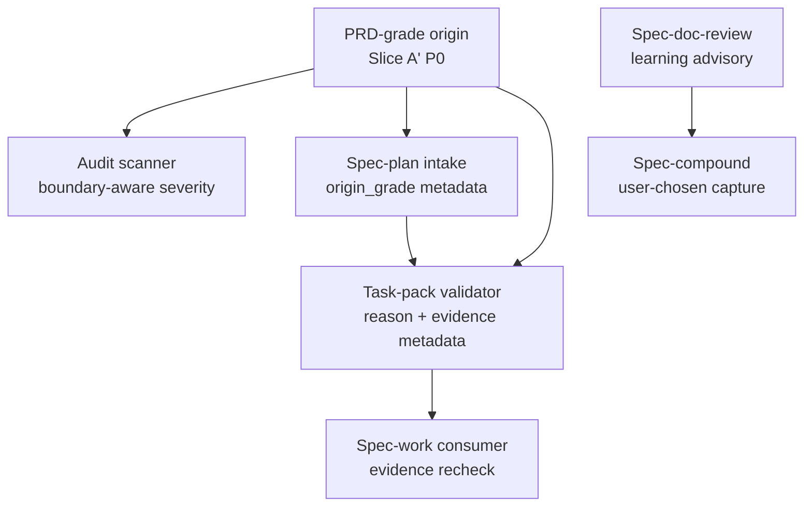

# refactor: 加固 spec skill 稳定性门禁

## Summary

本计划实现 origin PRD 的 Slice A' P0 wave：用四个独立 checkpoint 加固 audit signal、Spec->Plan origin grade、Tasks->Work execution evidence 和 doc-review learning capture。计划保留 PRD 已确认的 WHAT 决策，把 P1/P2 继续留作 follow-up，并坚持 scripts 只产确定性事实、LLM/human review 负责语义判断。

---

## Decision Brief

- **Recommended approach:** 同一 release wave 落地四个 P0 checkpoint，但用独立 implementation unit 和验证门控制每个 checkpoint。这样遵守 owner 决策中的“四个 P0 同批执行”，又避免把不同 ownership 的改动压成一个不可审查的大任务。
- **Key decisions:** 增加 evidence metadata 而不新增 `semantic_posture` enum；把 `origin_grade` 做成可见但非阻断的 metadata；doc-review learning capture 只做 advisory 和用户选择，不自动运行 `spec-compound`。
- **Validation focus:** scanner、plan metadata、task-pack validation、workflow handoff prose 的 contract/unit tests；skill 行为 eval fixtures；公开 workflow prose 变更后的 fresh-source eval。
- **Largest risks / boundaries:** 最大风险是把语义判断下推给 CLI，或让 `origin_grade` 意外阻断 brainstorm-grade direct planning。本计划明确拒绝这两点。

---

## Problem Frame

origin PRD 确认了 spec-first skill system 的四个 P0 质量债：scanner false positives 会削弱 audit trust；Spec->Plan intake 无法在候选发现和 plan metadata 中暴露 PRD-grade 与 brainstorm-grade origin；task-pack execution posture 可以裸 LLM 自报而缺少可复验证据；doc-review 缺少 learning-capture 路径。这些问题会让 `Codebase -> Spec -> Plan -> Tasks -> Code -> Review -> Knowledge` 主链路中的 handoff evidence 变得嘈杂或不可验证。

本计划只实现 origin PRD 的 Slice A'。R-05 到 R-40 保持 backlog slice，除非后续计划明确扩大范围。

---

## Requirements

- R1. Audit scanner 必须停止把 generated-runtime boundary 说明报成 P0，同时保留真实危险指令的 P0/P1 severity。Origin trace: R-01, AE-01, NA-01。
- R2. Spec-plan upstream requirements discovery 和 plan metadata 必须暴露 origin 是 PRD-grade 还是 brainstorm-grade，但不得阻断 brainstorm-grade direct entry。Origin trace: R-02, AE-02, NA-02。
- R3. Task-pack handoff 必须为 `semantic_posture` 和 `dispatch_authorization` 携带 reason codes 与 evidence metadata；spec-work 必须复验证据存在性、来源、freshness 与合法 enum，且不得把语义充分性判断交给 CLI。Origin trace: R-03, AE-03。
- R4. Spec-doc-review 在发现可复用 architecture、contract、boundary 或 handoff lesson 时，必须产出可追踪的 learning-capture recommendation path，覆盖 headless mode 与 `safe_auto` paths，但不得自动运行 `spec-compound` 或写入 `docs/solutions/`。Origin trace: R-04, AE-04, NA-03。

**Origin actors:** Spec-First Evolution Architect；downstream plan/work/doc-review/code-review/compound consumers。
**Origin flows:** Slice A' P0 same release wave；Spec->Plan handoff；Tasks->Work handoff；Review->Knowledge handoff。
**Origin acceptance examples:** AE-01 至 AE-04；NA-01 至 NA-04。

---

## Assumptions

- A1. `skills/spec-write-tasks/references/execution-handoff-contract.md` 里的既有 task-pack posture enum 继续有效：`generated-this-run`、`reviewed-existing`、`unchecked-existing`、`not-applicable`。
- A2. evidence metadata 的最终字段名可在实现时确定，但必须同步写入 task-pack contract，并在 CLI、skill prose、fixtures 和 tests 中一致验证或消费。
- A3. `origin_grade` 是 plan/document metadata signal，不是 execution gate。下游 workflow 可以把它用于 review/audit context，但不得只因 plan 不是 PRD-grade 就拒绝有效的 brainstorm-grade plan。

---

## Scope Boundaries

- 不实现 PRD 的 P1/P2 requirements。
- 不新增 public workflow，也不新增 generated runtime source。
- 不手改 `.claude/`、`.codex/` 或 `.agents/skills/`；source 变更落在 `skills/`、`src/cli/`、`tests/` 和 docs，implementation 完成后需要 runtime regeneration 时再从 source 生成。
- 不让 CLI validator 判断 semantic quality、task splitting adequacy、review sufficiency 或 learning-worthiness。
- 不在没有 migration plan 的情况下新增 `semantic_posture` enum，例如 `reviewed-existing-with-evidence`。
- 不从 doc-review 自动运行 `spec-compound`、创建 issue 或写 durable solution docs。

### Deferred to Follow-Up Work

- Slice B: R-40 的 Markdown link checker placeholder 与 code-block handling。
- Slice C: R-05 至 R-12 的 entrance routing governance。
- Slice D: R-24、R-25、R-26、R-37、R-38 的 high-risk workflow eval seed 和 compound-refresh promotion checks。
- Slice E: R-13 至 R-23、R-28 至 R-36/R-39 的 work/plan handoff、compound schema、recall consistency、drift/reporting 和 eval-before-slimming requirements。

---

## Completion Criteria

- Scanner fixtures 证明已知 generated-runtime boundary false positives 不再产出 P0，同时真实 direct runtime edit instruction 仍然产出 P0。
- PRD-grade origin 与 brainstorm-grade origin 都能被 spec-plan discovery 识别，并在 plan metadata 写入 `origin_grade`；brainstorm-grade 不被拒绝。
- Task-pack validation 与 handoff contracts 暴露 posture/authorization 的 reason code 与 evidence metadata；spec-work prose 要求在 metadata 缺失、stale、illegal 或 contradicted 时拒绝 executable task-pack handoff。
- Spec-doc-review 具备 learning-capture recommendation contract 和 eval coverage；headless/report-only output 能携带 advisory line，而不是静默丢失可复用 lesson。
- U2、U4、U5 这类公开 workflow prose 语义变更必须做 fresh-source eval；如果 host 无法执行，必须记录明确 reason。

---

## Direct Evidence Readiness

- target_repo: `.`
- evidence_sources: direct source reads、Codegraph source reads、Graphify query、targeted `rg`、git status、package scripts、origin PRD、source review artifact、single-agent report-only doc-review。
- source_refs: `docs/brainstorms/2026-06-28-002-spec-skill-robustness-stability-optimization-requirements.md`, `docs/项目审查/2026-06-28-spec-skill-健壮性稳定性优化审查.md`, `skills/spec-skill-audit/scripts/lib/security-patterns.js`, `skills/spec-skill-audit/scripts/scan-instruction-security.js`, `tests/unit/skill-audit-scripts.test.js`, `src/cli/task-pack.js`, `tests/unit/task-pack-command.test.js`, `skills/spec-write-tasks/references/execution-handoff-contract.md`, `skills/spec-write-tasks/references/task-pack-schema.md`, `skills/spec-work/SKILL.md`, `skills/spec-plan/references/planning-flow.md`, `skills/spec-plan/references/plan-sections.md`, `skills/spec-plan/references/plan-template.md`, `skills/spec-doc-review/SKILL.md`, `skills/spec-code-review/SKILL.md`, `tests/unit/spec-code-review-contracts.test.js`, `tests/unit/spec-plan-contracts.test.js`, `skills/spec-plan/evals/examples.json`, `skills/spec-doc-review/evals/examples.json`, `package.json`。
- planning_snapshot_revision: `bc71b4be`
- current_review_revision: `bc71b4be`
- worktree_status: dirty before this plan；已有 modified files 包括 `CHANGELOG.md`、`skills/spec-prd/scripts/check-prd-artifact.js`、`skills/spec-prd/scripts/finalize-prd-artifact.js`、`tests/unit/spec-prd-checker-unit.test.js`、`tests/unit/spec-prd-reason-codes-unit.test.js`，另有未跟踪 PRD/source-analysis docs。completion audit 时还看到并发/无关变更：删除旧 `docs/plans/2026-06-26-001-feat-spec-plan-enterprise-readiness-plan.md` 与 `docs/plans/2026-06-26-002-refactor-spec-plan-architect-grade-upgrade-plan.md`，并新增 `docs/plans/2026-06-28-004-refactor-spec-plan-enterprise-architect-upgrade-plan.md`。本计划只 owns `docs/plans/2026-06-28-003-refactor-spec-skill-stability-gates-plan.md` 及其 changelog entry，不回退或吸收这些并发变更。
- confidence: Slice A' scope 与 file/test surface 为 high；exact evidence metadata field naming 为 medium，需要 implementation-time design。
- limitations: Graphify query 只提供低价值 advisory navigation，未用于 conclusion-level claims；没有运行 implementation tests，因为本 workflow 只做 planning。

---

## Direct Evidence

- repo_scope: 当前 workspace root 的单一 Git repo。
- source_reads_completed: origin PRD full body；source review P0 excerpts；scanner pattern catalog 与 scanner tests；task-pack validator、schema、handoff contract、work consumer prose 和 task-pack tests；plan intake/template/metadata contract；doc-review 与 code-review learning-capture surfaces；eval fixture structure。
- source_reads_required: implementer 编辑前应重新读取目标文件，因为 worktree 已有无关 spec-prd in-progress changes。
- commands_or_tools_used: `git status --short`, `git rev-parse --short HEAD`, `spec-first internal task-governance-signals --json`, `rg`, `find`, Codegraph `codegraph_explore`/`codegraph_node`, Graphify `query`, bounded `sed` reads。
- impact_on_plan: 将 plan depth 判定为 Deep；把 R-03 拆成 CLI/schema checkpoint 与 consumer-workflow checkpoint；确认 R-40/P1/P2 不进入本 release wave。
- key_findings: `PROHIBITION_HINTS` 缺少 PRD 点名的 boundary phrases；task-pack validation 当前主要证明 identity/freshness/structure，并导出 field whitelist；`execution-handoff-contract.md` 已有 posture/authorization envelope vocabulary，但 CLI 不拥有 semantic truth；`spec-doc-review` 无 learning-capture section，而 `spec-code-review` 有可复用 advisory pattern。
- limitations: planning 阶段未执行 repo-wide scanner run；source review 里的 line-level evidence 按历史 review evidence 对待，implementation 需要重新核对 current source。

---

## Context & Research

### Relevant Code and Patterns

- `skills/spec-skill-audit/scripts/lib/security-patterns.js` 拥有 dangerous pattern definitions 与 `PROHIBITION_HINTS`；`skills/spec-skill-audit/scripts/scan-instruction-security.js` 负责 context classification，并只排除 detector catalog 自身。
- `tests/unit/skill-audit-scripts.test.js` 已有 real dangerous commands、negative-boundary downgrades、runtime path references 和 detector-own-source exclusion fixtures。U1 应扩展这组 fixture，而不是新建 test harness。
- `src/cli/task-pack.js` 拥有 deterministic task-pack validation，包括 `REQUIRED_TASK_FIELDS`、`ALLOWED_TASK_FIELDS`、hash/identity checks、generated-runtime file rejection、dependency/wave checks、same-wave file overlap checks，以及供 parity tests 消费的 exported field whitelist。
- `skills/spec-write-tasks/references/task-pack-schema.md` 说明 deterministic validation 只检查 identity、freshness、structure，并记录 validator fields 与 task-card schema tables 必须同步维护。
- `skills/spec-write-tasks/references/execution-handoff-contract.md` 已定义 final envelope、posture enum、dispatch authorization enum，以及 deterministic handoff 不证明 semantic task quality 的 non-goal。
- `skills/spec-work/SKILL.md` 已拒绝 stale/unverifiable task packs，并在执行前校验 frontmatter/hash/structure，但当前 prose 会在 upstream workflow 声称 `generated-this-run` 或 `reviewed-existing` 后信任 task-pack return posture。
- `skills/spec-plan/references/planning-flow.md` 已在文件被选中后处理 PRD-grade origin；缺口在 candidate discovery/selection 与 metadata visibility。
- `skills/spec-plan/references/plan-sections.md` 拥有 plan metadata field contract；`origin_grade` 需要在这里和 `plan-template.md` 一起更新，不能只改 markdown skeleton。
- `skills/spec-code-review/SKILL.md` Stage 6 "Learning Capture Recommendation" 是 R4 最接近的既有模式；`tests/unit/spec-code-review-contracts.test.js` 冻结 advisory/non-gating 边界。

### Institutional Learnings

- `docs/contracts/knowledge/knowledge-harness.md` 确认可召回和可推广的 learnings 必须 evidence-backed；在确认前保持 advisory，并由用户通过 `spec-compound`/`spec-compound-refresh` 拥有。
- 项目角色契约要求 "Scripts prepare, LLM decides"。这直接约束 R3：CLI 可以验证 evidence presence/freshness，但不能判断 semantic sufficiency。

### External References

- 未使用外部研究。本改动由本地 workflow contracts、本地 CLI validators 和当前项目角色边界决定。

---

## Key Technical Decisions

- KTD1. 只实现 Slice A'：本计划处理 origin R-01 至 R-04，并明确 defer R-05 至 R-40，匹配 PRD owner 对首个 planning increment 的决策。
- KTD2. Scanner false positives 用 boundary-hint classification，而不是 line/path allowlist：hint-based classifier 能覆盖重复出现的 guardrail language，避免只硬编码当前三行。
- KTD3. `origin_grade` 是 visible metadata，不是 gate：PRD-grade 应被优先展示和继承，但 brainstorm-grade 仍是合法 direct planning input。
- KTD4. 在既有 posture enum 旁增加 evidence metadata：`semantic_posture` 保持现有 enum，证据字段携带 source、producer、evidence reference、checked-at/freshness 和 reason-code 信息，避免 enum migration，并保持 semantic judgment 在 CLI 之外。
- KTD5. `dispatch_authorization` evidence 只验证 presence/freshness，不让 CLI 拥有授权判断：CLI 可以报告 missing/available evidence 与 reason codes，真正的授权语境仍由 host/workflow context 判断。
- KTD6. 移植 code-review learning-capture pattern 的意图，而不是照抄 wording：doc-review 的可复用 lesson 通常是 document scope、architecture decisions、contracts、handoff boundaries 和 review heuristics，不是 code findings。

---

## Open Questions

### Resolved During Planning

- Slice A' 是否包含 Markdown link checker R-40？否。origin PRD 明确把 R-40 移到 Slice B，并从 R-01 的 P0 scope 中移除。
- `origin_grade` 是否阻断 brainstorm-grade plans？否。owner decision OQ-03 明确它可见但不阻断。
- R3 是否新增 semantic posture enum？否。origin PRD 禁止无 migration 的 enum expansion；既有 `unchecked-existing` 已表达 default untrusted posture。
- doc-review 是否在 reusable lesson 出现时自动运行 compound？否。origin PRD 与 knowledge harness 都把 learning capture 保持为用户选择。

### Deferred to Implementation

- posture/authorization evidence metadata 的精确字段名：implementation 应选择符合当前 task-pack envelope conventions 的命名，并同步 schema/docs/tests。
- scanner boundary phrase list 的最终形态：implementation 应从当前 false positives 推导最终列表，并补 true instruction 的 negative fixtures。
- fresh-source eval prompt：U2/U4/U5 应使用编辑后的当前 source 文件内容和既有 checklist 执行；无法 dispatch 时记录 reason。

---

## High-Level Technical Design

> 这张图只说明预期 approach，供 review 校验方向；它不是 implementation specification，implementer 不应把它当成可复制代码或固定实现。

四个 checkpoint 通过 harness chain 相关联，但应保持可独立 review 和 rollback。Scanner 改动保护 audit signal quality；plan 改动暴露 origin quality；task-pack/work 改动让 execution posture 可审计；doc-review 改动避免可复用 review lesson 消失。

---

## Implementation Units

### U1. Audit Scanner Runtime Boundary False-Positive Hardening

**Goal:** 把 generated-runtime guardrail false positives 从 P0 降为非阻断 documented/prohibited context，同时保持 true direct runtime edit instructions 的 high severity。

**Requirements:** R1

**Dependencies:** None

**Files:**
- Modify: `skills/spec-skill-audit/scripts/lib/security-patterns.js`
- Modify: `tests/unit/skill-audit-scripts.test.js`
- Test: `tests/unit/skill-audit-scripts.test.js`

**Approach:**
- 扩展 scanner 对 generated-runtime contexts 中 boundary/prohibition language 的识别，例如 "does not"、"are not source"、"not source"、"excludes generated mirrors"。
- 优先使用 reusable classifier 或 hint list，而不是 path-specific allowlists，使未来 guardrail prose 也受益。
- 保留已有 detector-own-source exclusion 和 documented-pattern handling。

**Patterns to follow:**
- `tests/unit/skill-audit-scripts.test.js` 中已有 negative-boundary 与 runtime-path-reference fixtures。
- `skills/spec-skill-audit/scripts/lib/security-patterns.js` 中的 `classifyPatternContext`。

**Test scenarios:**
- Happy path: 声明 generated mirrors are not source and are excluded from ordinary context 的行不产生 P0 `runtime_governance` finding。
- Happy path: 声明 provider-owned runtime output does not auto-add, commit, or promote generated runtime paths 的行不产生 P0 finding。
- Edge case: "will not hand-edit generated runtime mirrors" 继续保持现有 downgrade 行为。
- Error path: 不带 boundary/prohibition context 的 direct instruction to edit or patch `.claude/`、`.codex/`、`.agents/skills/` 仍为 P0。
- Integration: 既有 scanner tests 仍能以原 severity 检出 remote script pipe patterns 和 destructive commands。

**Verification:**
- Scanner fixtures 同时证明 false-positive suppression 和 true-positive preservation。
- Implementation 后的 full scanner run 应显示已知 guardrail lines 不再主导 P0 output。

---

### U2. Spec-Plan Origin Grade Discovery and Metadata

**Goal:** 让 spec-plan 在 candidate discovery 阶段区分 PRD-grade 与 brainstorm-grade requirements，并把 `origin_grade` 写入 plan metadata，同时不改变 direct-entry semantics。

**Requirements:** R2

**Dependencies:** None

**Files:**
- Modify: `skills/spec-plan/references/planning-flow.md`
- Modify: `skills/spec-plan/references/plan-sections.md`
- Modify: `skills/spec-plan/references/plan-template.md`
- Modify: `skills/spec-plan/evals/examples.json`
- Modify: `skills/spec-plan/evals/output-quality-cases.json`
- Modify: `tests/unit/spec-plan-contracts.test.js`
- Test: `tests/unit/spec-plan-contracts.test.js`
- Test: `skills/spec-plan/evals/examples.json`
- Test: `skills/spec-plan/evals/output-quality-cases.json`

**Approach:**
- 更新 Phase 0.2 intake guidance：candidate discovery 对 relevant requirements files 读取最小 frontmatter，并基于 `artifact_kind: prd-requirements`、ready status、ready receipt fields 标注或优先显示 PRD-grade origins。
- 在 plan metadata contract 和 markdown skeleton 中加入 `origin_grade`，支持 `prd`、`brainstorm`、`legacy` 等 descriptive values，保持非阻断语义。
- 增加 PRD-grade source 与 brainstorm-grade source 两类 eval coverage，防止后续改动把 distinction 折叠掉。

**Patterns to follow:**
- `skills/spec-plan/references/planning-flow.md` 中既有 `spec_id` inheritance contract。
- `skills/spec-plan/references/plan-sections.md` 中的 plan metadata field contract。
- `skills/spec-plan/references/plan-template.md` 中的 canonical frontmatter skeleton。
- `skills/spec-plan/evals/examples.json` 中既有 spec-plan eval case style。

**Test scenarios:**
- Happy path: 当 PRD-grade 与 brainstorm-grade requirements document 都匹配 topic 时，spec-plan 优先或清晰标注 PRD-grade candidate，并在 plan 写入 `origin_grade: prd`。
- Happy path: 只有 brainstorm-grade requirements document 匹配时，spec-plan 仍能基于它计划，并写入 `origin_grade: brainstorm`。
- Edge case: 缺少 `spec_id` 或 `artifact_kind` 的 legacy requirements document 被标为 weak/legacy trace，且不编辑 origin。
- Integration: 既有 spec-plan contract tests 继续确认 `spec_id` inheritance 和 PRD-grade carry-forward 的 R/F/AE trace。

**Verification:**
- Plan metadata contract tests 覆盖新字段。
- Eval fixtures 在现有 eval fixture tests 下能 normalize 和 validate。
- fresh-source eval 或明确 recorded reason 证明更新后的 spec-plan prose 没有把 `origin_grade` 变成 gate。

---

### U3. Task-Pack Envelope Evidence in CLI and Schema

**Goal:** 扩展 task-pack validation/schema output，使 handoff posture 与 authorization claims 携带 reason codes 和 evidence metadata，而不是依赖裸 LLM self-report。

**Requirements:** R3

**Dependencies:** None

**Files:**
- Modify: `src/cli/task-pack.js`
- Modify: `src/cli/commands/tasks.js`
- Modify: `skills/spec-write-tasks/references/task-pack-schema.md`
- Modify: `skills/spec-write-tasks/references/execution-handoff-contract.md`
- Modify: `tests/unit/task-pack-command.test.js`
- Modify: `tests/fixtures/spec-write-tasks/valid/task-pack.md`
- Modify: `tests/fixtures/spec-write-tasks/high-risk-review/task-pack.md`
- Test: `tests/unit/task-pack-command.test.js`
- Test: `tests/fixtures/spec-write-tasks/valid/task-pack.md`
- Test: `tests/fixtures/spec-write-tasks/high-risk-review/task-pack.md`

**Approach:**
- 从既有 validator findings 和 validity states 投射 deterministic reason codes，让 caller 区分 missing source plan、wrong chain、stale hash、unverifiable hash、invalid contract 与 valid handoff，而不是解析 prose。
- 增加或文档化 semantic posture 与 dispatch authorization 的 evidence metadata。最小语义契约是：evidence source/provenance、producer workflow 或 CLI、durable evidence reference、checked-at/freshness basis、reason code、以及 freshness/provenance degraded 时的 limitation。
- Validator 可以 shape-check 这些字段并报告 absence/default posture；不得认证 semantic adequacy、review quality 或 host-level dispatch authorization。
- 保持 field whitelist 与 schema tables 同步，避免 unknown fields 静默掉进 limitations。

**Execution note:** 先写 task-pack contract tests，证明 `reviewed-existing` claim 缺少 evidence 时不能被当成 executable evidence。

**Patterns to follow:**
- `src/cli/task-pack.js` 中的 `deriveValidity` 和 `validateTaskPack`。
- `skills/spec-write-tasks/references/task-pack-schema.md` 中的 field whitelist parity contract。
- `tests/unit/task-pack-command.test.js` 中既有 stale/wrong-chain/valid handoff tests。

**Test scenarios:**
- Happy path: valid generated-this-run task pack 报告 valid deterministic handoff、machine-readable reason code，以及指向当前 validation source、producer、freshness basis 的 evidence metadata。
- Edge case: 标为 `reviewed-existing` 但缺少 review/evidence metadata 的 existing task pack，identity/freshness/structure 可以有效，但不得获得 direct execution posture。
- Edge case: 缺少 durable evidence reference 的 evidence metadata 只有在清晰报告 degraded provenance 或 current-run proof 时才允许，不得静默视为 reviewed evidence。
- Error path: stale task pack 报告 stale reason code 且 `deterministic_handoff: false`。
- Error path: wrong-chain task pack 报告 wrong-chain reason code，并保留既有 validation detail。
- Integration: schema prose 与 validator recognized fields 保持同步。

**Verification:**
- Unit tests 证明 reason-code mapping 与 metadata shape。
- Fixtures 展示 normal valid handoff 与 high-risk review handoff behavior。

---

### U4. Spec-Work and Spec-Write-Tasks Handoff Recheck

**Goal:** 让 consumer workflows 在 posture 或 dispatch authorization evidence 缺失、stale、illegal 或 contradicted 时拒绝 executable task-pack handoff。

**Requirements:** R3

**Dependencies:** U3

**Files:**
- Modify: `skills/spec-work/SKILL.md`
- Modify: `skills/spec-write-tasks/SKILL.md`
- Modify: `skills/spec-write-tasks/references/execution-handoff-contract.md`
- Modify: `skills/spec-write-tasks/evals/boundary-cases.json`
- Modify: `skills/spec-write-tasks/evals/expected-behavior-cases.json`
- Modify: `tests/unit/spec-work-contracts.test.js`
- Modify: `tests/unit/spec-write-tasks-contracts.test.js`
- Test: `tests/unit/spec-work-contracts.test.js`
- Test: `tests/unit/spec-write-tasks-contracts.test.js`
- Test: `skills/spec-write-tasks/evals/boundary-cases.json`

**Approach:**
- 更新 spec-work task-pack intake：identity/freshness/structure 是必要但不充分条件。执行前应验证 legal posture enum values、evidence presence、source path 或 artifact reference、freshness。
- 更新 spec-write-tasks final envelope rules：`dispatch_authorization: authorized` 必须携带 concrete bounded continuation 或 doc-review outcome reference；否则 high-risk packs 应暴露 `dispatch_authorization: missing`。
- unsupported 或 unreviewed existing packs 保持 `unchecked-existing` posture，并路由到 review 或 regeneration，而不是 execution。

**Patterns to follow:**
- `skills/spec-work/SKILL.md` 中的 task-pack validation checklist。
- `skills/spec-write-tasks/evals/boundary-cases.json` 中的 high-risk review handoff cases。
- `skills/spec-write-tasks/references/execution-handoff-contract.md` 中的 handoff semantics。

**Test scenarios:**
- Happy path: 同一运行生成且 evidence current 的 task pack，在 deterministic validation 通过后可以进入 task-pack work intake。
- Happy path: 带 current review evidence 的 reviewed existing task pack，在 evidence source 与 freshness 可验证时可以继续。
- Error path: `semantic_posture: reviewed-existing` 没有 evidence 时被拒绝或路由到 review/regeneration。
- Error path: `dispatch_authorization: authorized` 没有 bounded doc-review continuation 或 outcome reference 时降级为 missing。
- Integration: high-risk task-pack eval 仍推荐 doc-review，而不是在无授权下静默串联。

**Verification:**
- Contract tests 证明 prose 要求 recheck，并且没有扩大 CLI semantic ownership。
- Eval cases 保持 standalone-skill dispatch authorization boundaries。
- fresh-source eval 或明确 recorded reason 证明更新后的 spec-work/spec-write-tasks prose 不会把 host authorization 当成裸字段自证。

---

### U5. Spec-Doc-Review Learning-Capture Recommendation

**Goal:** 给 doc-review 增加用户拥有的 learning-capture path，使可复用 document、contract、architecture 和 handoff lessons 能在 interactive、headless 与 `safe_auto` outcomes 中保留下来。

**Requirements:** R4

**Dependencies:** None

**Files:**
- Modify: `skills/spec-doc-review/SKILL.md`
- Modify: `skills/spec-doc-review/evals/examples.json`
- Modify: `tests/unit/spec-doc-review-contracts.test.js`
- Test: `tests/unit/spec-doc-review-contracts.test.js`
- Test: `skills/spec-doc-review/evals/examples.json`

**Approach:**
- 只在 accepted reusable lessons 的语境下把 `spec-compound` 加为 downstream consumer，不把它变成 review gate。
- 在 synthesis/presentation 后增加 doc-review-specific learning-capture recommendation step，借鉴 code-review 三段式：mechanical findings 静默跳过；one-sentence reusable lessons 中性提供；repeated/shared-boundary lessons 更积极推荐。
- 在 headless 与 report-only paths 中，当存在 learning-worthy evidence 时最多输出一条 advisory line。该行应包含 candidate lesson、evidence path、recommended action 和 user choice recording 方式。
- 不允许 `safe_auto` fixes 创建 learning docs；document edits 仍限制在 doc-review 既有 document-fix scope 内。

**Execution note:** 该单元改变 public workflow behavior semantics，编辑后必须运行 fresh-source eval；无法 dispatch 时记录 reason。

**Patterns to follow:**
- `skills/spec-code-review/SKILL.md` 中的 code-review learning-capture contract。
- `tests/unit/spec-code-review-contracts.test.js` 中锁定 advisory/non-gating boundary 的 assertions。
- `skills/spec-doc-review/SKILL.md` 中的 fallback 与 headless mode boundaries。

**Test scenarios:**
- Happy path: 关于 reusable source/runtime boundary lesson 的 doc-review finding 能产出 learning-capture recommendation，包含 candidate、evidence path、suggested `spec-compound` handoff 和 user-choice recording guidance。
- Happy path: headless doc-review 遇到 learning-worthy evidence 时输出 single advisory line，且不提问。
- Edge case: mechanical copy edits、one-off wording fixes 或不可泛化 findings 静默跳过 learning capture。
- Error path: workflow 永不自动运行 `spec-compound`、永不写 `docs/solutions/`、永不把 learning capture 作为 verdict input。
- Integration: Codex 无 explicit subagent/persona authorization 时，dispatch authorization fallback behavior 保持不变。

**Verification:**
- Contract tests 冻结 advisory/non-gating behavior。
- Eval fixture 覆盖 learning-capture trigger 与 no-auto-compound boundary。
- Fresh-source eval 确认更新后的 source skill 会让全新 reviewer 只在 documented boundary 内推荐 learning capture。

---

## System-Wide Impact

- **Interaction graph:** spec-plan 产出更明确的 origin metadata；spec-write-tasks 与 spec-work 消费 task-pack posture evidence；spec-doc-review 可由用户选择把 learning recommendation hand off 到 knowledge layer。
- **Error propagation:** validator reason codes 会成为更清晰的 handoff failure signals，但不得被当成 semantic findings，除非有 source/test/review confirmation。
- **State lifecycle risks:** task packs 仍是 derived artifacts；source plans 或 review evidence 改变时 validation metadata 可能 stale，因此 work intake 必须复验 freshness。
- **API surface parity:** CLI JSON output、skill prose、task-pack schema docs、fixtures、tests 必须一起演进。
- **Surface coverage:** CLI validator -> in-scope；workflow prose -> in-scope；eval fixtures -> in-scope；generated runtime mirrors -> out-of-scope，需要 implementation 后从 source regeneration；README/user docs -> deferred，除非 implementation 改变 user-facing CLI semantics。
- **Integration coverage:** U3 与 U4 需要交叉验证，因为 CLI output 本身不能证明 spec-work 会正确消费新 evidence。
- **Unchanged invariants:** Scripts prepare deterministic facts；LLM/human review decides semantic adequacy。Direct brainstorm-grade planning 继续允许。

---

## Risks & Dependencies

| Risk | Mitigation |
|------|------------|
| Scanner boundary hints 过度压低真实危险指令 | 为 direct runtime edit commands 和 remote script patterns 增加 negative fixtures；保留 true-positive severity assertions。 |
| `origin_grade` 变成 accidental gate | 在 plan、plan-sections、plan-template 和 downstream prose 中写明 non-blocking；测试 brainstorm-grade direct planning。 |
| Task-pack evidence fields 形成第二 source of truth | 保持 source plan 为 scope authority、task pack 为 derived；metadata 只记录 evidence freshness，不记录 approval state。 |
| CLI 开始判断 semantic review sufficiency | 在 schema 与 tests 中明确 validator scope：identity、freshness、structure、evidence shape only。 |
| Doc-review learning capture 变吵 | 使用 skip/offer/lean 三段式，并要求 one-sentence reusable lesson 与 evidence path。 |
| Source skill changes 没有反映到 runtime mirrors | 把 runtime regeneration 作为 source 变更后的 delivery step；不手改 generated mirrors。 |

---

## Alternative Approaches Considered

- 单一 mega implementation unit：拒绝。四个 P0 涉及不同 ownership 和测试策略，合并会让 review 与 rollback 变困难。
- 为当前三条 scanner false positives 写 path allowlist：拒绝。它只能解决当前样本，不能改善未来 audit signal quality。
- 新增用 enum 名称表达 proof 的 semantic posture：拒绝。origin PRD 明确避免 enum migration，且既有 `unchecked-existing` 已表达 untrusted posture。
- 从 doc-review 自动运行 `spec-compound`：拒绝。knowledge promotion 仍由用户拥有，需要 verified、reusable lessons 和 invalidation context。

---

## Success Metrics

- 已知 generated-runtime boundary statements 不再作为 P0 scanner results 出现，而 direct generated-runtime edit instructions 仍保持 high severity。
- 从 PRD-grade requirements 产出的 plan 可见 `origin_grade: prd`；brainstorm-grade plan 也携带 grade 并继续被接受。
- Task pack 不能只靠 unchecked/reviewed self-report 就进入 executable work，必须有 current evidence metadata。
- Doc-review 能在 interactive 或 headless output 中给出 learning-capture recommendation，而不把它变成 gate。

---

## Documentation / Operational Notes

- implementation 落地时继续更新 `CHANGELOG.md`。
- public skill source 修改后，应从 source regeneration runtime mirrors，不手改 `.claude/`、`.codex/` 或 `.agents/skills/`。
- README 更新默认不属于 Slice A'，除非 implementation 改变 task-pack JSON fields 以外的用户可见 CLI 行为。
- U2、U4、U5 都涉及 public workflow prose 语义，必须 fresh-source eval；若 host 缺少 dispatch primitive 或授权，记录 `dispatch_authorization_missing` 或对应 reason。

---

## Sources & References

- **Origin document:** [docs/brainstorms/2026-06-28-002-spec-skill-robustness-stability-optimization-requirements.md](../brainstorms/2026-06-28-002-spec-skill-robustness-stability-optimization-requirements.md)
- **Source review:** [docs/项目审查/2026-06-28-spec-skill-健壮性稳定性优化审查.md](../项目审查/2026-06-28-spec-skill-健壮性稳定性优化审查.md)
- Related code: `skills/spec-skill-audit/scripts/lib/security-patterns.js`
- Related code: `skills/spec-skill-audit/scripts/scan-instruction-security.js`
- Related code: `src/cli/task-pack.js`
- Related workflow source: `skills/spec-plan/references/planning-flow.md`
- Related workflow source: `skills/spec-plan/references/plan-sections.md`
- Related workflow source: `skills/spec-plan/references/plan-template.md`
- Related workflow source: `skills/spec-write-tasks/references/execution-handoff-contract.md`
- Related workflow source: `skills/spec-write-tasks/references/task-pack-schema.md`
- Related workflow source: `skills/spec-work/SKILL.md`
- Related workflow source: `skills/spec-doc-review/SKILL.md`
- Related workflow source: `skills/spec-code-review/SKILL.md`
- Related tests: `tests/unit/skill-audit-scripts.test.js`
- Related tests: `tests/unit/task-pack-command.test.js`
- Related tests: `tests/unit/spec-plan-contracts.test.js`
- Related tests: `tests/unit/spec-doc-review-contracts.test.js`
- Related tests: `tests/unit/spec-code-review-contracts.test.js`
