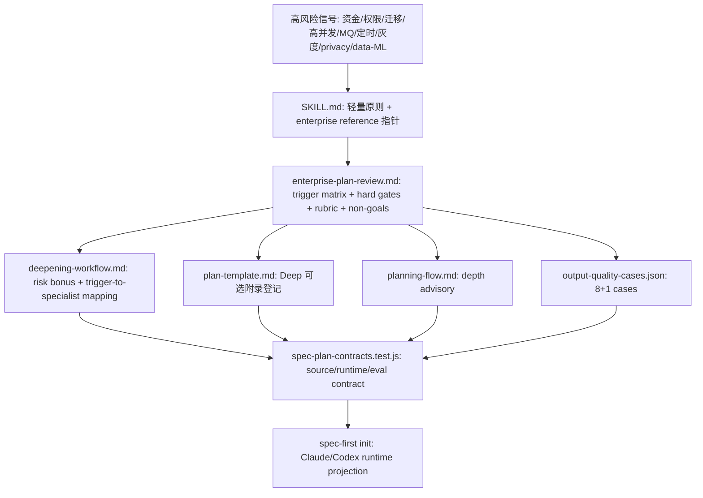

# refactor: spec-plan 企业风险就绪度与架构师级方案升级

## Summary

把两份旧方案合并为单一 canonical plan: `spec-plan` 将在高风险场景显式触发企业生产风险就绪度检查，同时用架构师级 design doc 标准补强 trade-off、privacy、数据/ML 一致性和 eval 判据。升级形态是一个条件化 reference、若干 source 指针、deepening 评分扩展、可选 Deep 附录、output-quality fixtures 与 contract/runtime 投影验证；不新建 specialist、不扩 core template、不破坏 plan-only 边界。

---

## Decision Brief

- **Recommended approach:** 以 `skills/spec-plan/references/enterprise-plan-review.md` 作为企业风险就绪度单一真相源，`SKILL.md` 只放轻量原则和指针，`deepening-workflow.md` 消费触发器并复用现有 specialist，`plan-template.md` 只登记 Deep 可选附录。
- **Key decisions:** 企业能力是条件触发的 readiness lens，不是默认大模板；硬闸是 plan-time 决策完整性闸，不是脚本化语义判决；privacy 与数据/ML 走现有 `spec-security-sentinel`、`spec-data-integrity-guardian`、`spec-data-migration-expert`，不新建 agent。
- **Validation focus:** `tests/unit/spec-plan-contracts.test.js` 锁 reference 存在、source-ref 安全、specialist 名称、Claude/Codex runtime projection；`skills/spec-plan/evals/output-quality-cases.json` 覆盖 8 类高风险场景和 1 个轻量反例；`spec-first init` 同步 generated runtime mirrors。
- **Largest risks / boundaries:** 最大风险是企业附录滑向所有 plan 都填的大模板。缓解方式是轻量任务零触发、Deep 扩展可选、eval 反例守护、不让脚本替代 LLM 做风险闭合判断。

---

## Problem Frame

旧方案 001 聚焦企业生产风险就绪度门，已经把调研报告中的高风险触发矩阵、硬闸、附录化和 deepening 加权拆成 7 个实施单元。旧方案 002 是合并升级方案，补上顶尖架构师工作流对标、trade-off/privacy/data-ML 三句 rubric 和 8+1 eval 判据，但仍把 WS1 指回旧方案 001，形成双源跳转。

本 plan 将两者合并为一个可直接交给 `spec-work` 执行的完整技术方案。目标不是新增一套大而全流程，而是让 `spec-plan` 已有的 risk-weighted deepening、specialist mapping、right-size artifact 和 plan-only handoff 在生产高风险场景中被显式触发，避免高风险计划只写 `handle errors`、`add monitoring`、`consider rollback` 这类泛泛描述。

---

## Requirements

- R1. 新增企业风险触发矩阵，覆盖资金/账务/支付、认证/授权/权限/审计/敏感数据、高 QPS/大数据量/长耗时、跨服务 RPC/MQ/异步事件、状态机/补偿/死状态、DDL/数据迁移/不可逆变更/缓存一致性、后台定时任务、灰度/回滚/功能开关八类硬触发信号。
- R2. 命中触发后，相关 plan section 必须给出具体 plan-time 决策、参数、失败路径、观察/回滚条件，或显式进入 `Open Questions` / `Deferred to Implementation`。
- R3. 定义评审硬闸: PRD 功能点未覆盖且无解释、资金/安全/权限未详细设计、数据迁移无回滚/备份、高风险上线无 feature flag/回滚条件、重试设计无最终失败处理时，触发 deepening 或阻断 handoff。
- R4. 对 PRD-grade origin 提供可选 Requirements Coverage Matrix，能把 origin item 映射到 plan section / U-ID / coverage；`not covered` 且无解释时进入 Open Questions 或 blocker。
- R5. 把企业风险触发器接入 `deepening-workflow.md` 既有 risk-bonus 评分与 section-to-agent mapping，复用现有 `spec-api-contract-reviewer`、`spec-security-sentinel`、`spec-data-integrity-guardian`、`spec-data-migration-expert`、`spec-deployment-verification-agent`、`spec-performance-oracle`。
- R6. core plan template 零改动；企业附录只作为 Deep plan 可选扩展登记，轻量/常规计划默认不触发。
- R7. enterprise Review Rubric 必须补强三句架构师级检查: 高风险 KTD 显式 trade-off、privacy 显式声明且覆盖非 DB 个人数据流、数据/ML 改动触发 schema 演化/回填/离在线一致性检查。
- R8. 组织特定禁用技术清单、合规规则或内部 policy 不内置到通用 skill；仅保留 project policy hook 概念占位，具体文件路径和 schema 后续单独设计。
- R9. `output-quality-cases.json` 增量覆盖 8 类高风险场景和 1 个轻量 CRUD 反例，每个 case 带 `missing_evidence`，并明确 fixture 不是 model telemetry 或 executable eval runner。
- R10. `spec-plan-contracts.test.js` 覆盖新 reference、source refs、canonical 锚点、现有 specialist、eval shape、Claude/Codex runtime projection 和 generated mirror 非 source 边界。
- R11. 完成后运行 `spec-first init` 刷新 Claude/Codex runtime mirrors；不手改 `.claude/**`、`.codex/**`、`.agents/skills/**`。
- R12. 本 plan 取代旧 001/002 两份 active plan；旧文件删除后，本文档保留其关键决策、实施单元、证据和排期，不再要求实现者跨文件跳转。
- R13. 新增通用 Existing Capability / Reuse Analysis 要求：`spec-plan` 在提出新增文件、reference、agent、skill、script、helper、template、workflow、schema、artifact contract 或 source/runtime 入口前，必须先分析仓库内是否已有相近组件、工具、方法或扩展点，明确 `reuse / extend / new` 决策、source-of-truth 和新增必要性；该要求应落在独立 Decision Lens reference 中，不塞进 enterprise 专属 reference，也不混入通用 context/evidence 边界。

**Origin actors:** 无，来源是审查/调研报告和旧方案，不是 brainstorm requirements doc。
**Origin flows:** 无。
**Origin acceptance examples:** 无。

---

## Assumptions

- A1. 维护者接受“企业能力 = 条件触发 + 附录 + deepening 加权”的吸收方式，而不是把企业模板 12 章扩进 core template。
- A2. `spec-plan` eval 维持 maintainer-only fixture 形态，不新增 provider-backed runner 或 model telemetry。
- A3. project policy hook 本轮只声明边界，不定义路径/schema/CLI 集成，避免范围蔓延到组织治理机制。
- A4. 旧 001/002 的删除是计划文档合并，不表示对应实施工作已经完成；当前实施结果以本 plan frontmatter 的 `status: completed` 和 `Completion Evidence` 为准。

---

## Scope Boundaries

- 不让 `spec-plan` 执行代码、测试、review 或上线动作；升级只改变 plan 生成和 deepening 期间应暴露的决策要求。
- 不新增 specialist agent，不创建 `privacy` 或 `data-ML` 专用 agent。
- 不把高风险 rubric 写成脚本可判定的语义 gate；脚本只校验文件、shape、source-ref 和锚点。
- 不修改 `spec-work`、`spec-write-tasks`、`spec-doc-review` 的下游 artifact contract。
- 不手改 generated runtime mirrors；runtime 变化通过 `spec-first init` 投影。
- 不把组织特定 policy 内置进通用 source。

### Deferred to Follow-Up Work

- project policy hook 的具体路径、schema、读取时机和 CLI/skill 集成。
- planning-depth 的更深自动化，例如由 deterministic helper 直接把企业触发器抬升为 Deep 候选。
- ML 特有 specialist，仅在真实使用频率证明当前复用机制不足后再单独设计。
- Enterprise Readiness fresh-source eval，在 host 支持合适 dispatch 且有真实输出样本时再执行。

---

## Completion Criteria

- `skills/spec-plan/references/enterprise-plan-review.md` 存在，且被 `skills/spec-plan/SKILL.md` 与 `skills/spec-plan/references/deepening-workflow.md` 明确引用。
- enterprise reference 覆盖 8 类触发器、5 条硬闸、Required Appendix by Trigger、Review Rubric、三句架构师级检查和 Non-Goals/Policy 边界。
- `skills/spec-plan/references/plan-template.md` 仅在 Deep 扩展列表登记企业附录类型，core template 主体不被扩章。
- `skills/spec-plan/references/planning-flow.md` 增加企业高风险触发器作为 Standard/Deep advisory 信号，不改 `task-governance-signals` 脚本契约。
- `skills/spec-plan/evals/output-quality-cases.json` 新增 9 个 output-quality case，均通过现有 shape、唯一性、source-ref 和 `missing_evidence` 断言。
- `tests/unit/spec-plan-contracts.test.js` 覆盖 reference 集合、canonical 锚点、specialist 存在性、eval case、runtime projection 和 generated mirror 非 source。
- `skills/spec-plan/references/reuse-analysis.md` 存在，定义已有能力盘点、`reuse / extend / new` 决策、新增门槛、ownership boundaries、Non-Goals、输出位置和 work-phase recheck，并被 `SKILL.md` / planning flow 或 template 以轻量方式引用。
- `spec-first init` 后 Claude 与 Codex runtime mirrors 含新 reference 和更新后的 source 投影；未手改 generated mirrors。
- `CHANGELOG.md` 记录 source 变更、用户可见影响和已执行验证。

---

## Direct Evidence Readiness

- target_repo: `.`，spec-first 本仓。
- evidence_sources: direct source reads、旧 plan 全文、`rg`、`find`、git status、task-governance-signals advisory helper、developer profile、CHANGELOG 头部。
- source_refs: `skills/spec-plan/SKILL.md`, `skills/spec-plan/references/deepening-workflow.md`, `skills/spec-plan/references/plan-template.md`, `skills/spec-plan/references/planning-flow.md`, `skills/spec-plan/evals/README.md`, `skills/spec-plan/evals/output-quality-cases.json`, `tests/unit/spec-plan-contracts.test.js`, `agents/`, `CHANGELOG.md`。
- current_revision: branch `leo-2026-06-25-work-update`, commit `bc71b4be`。
- worktree_status: 已存在与本次计划合并无关的未提交改动，包括 `CHANGELOG.md`、若干 `skills/spec-prd/scripts/**`、`tests/unit/spec-prd-*.test.js`、`docs/brainstorms/2026-06-28-002-...` 和 `docs/plans/2026-06-28-003-...`。
- confidence: high，本 plan 的合并输入和主要 source target 已直接读取；implementation 细节仍需执行期按当前 source 复核。
- limitations: 未执行 `spec-first init` 或 spec-plan contract tests，因为本次只整理 plan artifact；external web research 未重新浏览，旧方案中的外部对标仅作为 advisory 背景。

---

## Direct Evidence

- repo_scope: `docs/plans/**`, `skills/spec-plan/**`, `agents/*.agent.md`, `tests/unit/spec-plan-contracts.test.js`, `CHANGELOG.md`。
- source_reads_completed: 两份旧 plan 全文、`docs/10-prompt/结构化项目角色契约.md`、runtime `spec-plan` skill 与必读 references、source `skills/spec-plan/SKILL.md` 关键段、`deepening-workflow.md` 关键段、`plan-template.md` Deep 扩展段、`planning-flow.md` 0.6、`evals/README.md`、`output-quality-cases.json`、`spec-plan-contracts.test.js` 相关断言、agent 名单、CHANGELOG 头部、developer profile。
- source_reads_required: 实施期需要重读 `skills/spec-plan/references/governance-boundaries.md`、`plan-sections.md`、完整 `tests/unit/spec-plan-contracts.test.js`、完整 target source files 和当前 runtime projection generator。
- commands_or_tools_used: `spec-first startup-reminder --codex`, `sed`, `rg`, `find`, `git status`, `git rev-parse`, `date`, `spec-first internal task-governance-signals --json`。
- impact_on_plan: task-governance-signals 给出 `candidate_level: deep`，`reason_codes` 包含 `cross-module`、`critical-path-hit`、`keyword-hit`、`candidate-deep`，确认本合并 plan 应保留 Deep 深度和完整验证闭环。
- key_findings:
  1. `deepening-workflow.md` 已有 risk-weighted scoring 和 section-to-agent mapping；企业触发器应扩充现有 risk bonus 与 mapping 解释，而不是新增 workflow。
  2. 六个目标 specialist 均存在于 `agents/`，且 deepening mapping 已使用 `spec-api-contract-reviewer`、`spec-security-sentinel`、`spec-data-integrity-guardian`、`spec-data-migration-expert`、`spec-deployment-verification-agent`、`spec-performance-oracle`。
  3. `output-quality-cases.json` 当前是 maintainer-only fixture，contract test 只校验 JSON shape、source-ref 安全、case id、declared coverage 和 `missing_evidence`，因此新增 eval 应落 fixture，不新建 runner。
  4. `plan-template.md` 的 Deep 扩展区已有可选 section 机制，适合登记企业附录；core template 主体不需要扩章。
  5. 旧 001 已包含具体实施单元，旧 002 已包含合并论证和 eval 判据；两者重叠处应合并到单一 U-ID 序列，避免后续实现重复建文件。
- limitations: specialist agent profile 未全文逐一读取；旧方案中的外部 best practice 未重新验证当前网页内容；CHANGELOG 已有未提交改动，实施者需合并时保护用户现有变更。

---

## Context & Research

### Relevant Code and Patterns

- `skills/spec-plan/SKILL.md`: Plan Quality Bar 是新增企业就绪度原则的锚点；Phase 5.3 已声明高风险 topic 和 deepening 入口。
- `skills/spec-plan/references/deepening-workflow.md`: 5.3.3 评分与 5.3.4 section-to-agent mapping 是企业触发器接入点。
- `skills/spec-plan/references/plan-template.md`: Deep extension list 是企业附录登记点；core template 仍保持 right-size。
- `skills/spec-plan/references/planning-flow.md`: 0.6 Assess Plan Depth 是企业风险作为 Standard/Deep advisory 信号的合适位置。
- `skills/spec-plan/evals/output-quality-cases.json`: 现有 4 个 output-quality case 提供 shape、source-ref 和 `missing_evidence` 模式。
- `tests/unit/spec-plan-contracts.test.js`: 已有 source/runtime projection、eval fixture、template naming 和 generated mirror source-boundary 断言，可增量扩展。

### Institutional Learnings

- 项目角色契约要求 Light contract、Explicit boundaries、Scripts prepare and LLM decides。企业硬闸只能 gate plan-time artifact 完整性，不能脚本化判断“资金风险是否真的闭合”。
- source/runtime 边界要求改 `skills/**`、`tests/**`、`CHANGELOG.md` 等 source，再用 `spec-first init` 投影，不手改 `.claude/**`、`.codex/**`、`.agents/skills/**`。
- 旧 001 和旧 002 已共同裁决: 升级重点是显式触发已有能力，而不是新增 agent、模板轴或独立 enterprise workflow。

### External References

- 旧方案引用的 Google Design Docs、AWS Well-Architected、Google SRE Production Readiness Review、consumer-driven contract testing、RFC/ADR/arc42/C4 等只作为 advisory 背景。实现时不要把任何厂商清单或组织清单写死进 `spec-plan`。

---

## Key Technical Decisions

- **KTD1. 合并后的 canonical plan 使用新 spec chain。** 本 plan 是对旧 001/002 的合并和替代，不是普通 deepening；旧 `spec_id` 分别代表两个局部方案，因此新文件使用 `2026-06-28-004-spec-plan-enterprise-architect-upgrade` 并在 frontmatter 记录 `supersedes`。
- **KTD2. 企业就绪度的 source-of-truth 是单个 reference。** `enterprise-plan-review.md` 承载触发矩阵、硬闸、rubric、policy hook 边界和非目标，`SKILL.md` 只保留原则和加载指针，避免 spine 膨胀。
- **KTD3. 硬闸是 plan-time 决策完整性闸。** 缺资金/权限/迁移/灰度/重试最终失败处理时，结果是 deepening、Open Questions 或 handoff blocker；脚本不能替代 LLM 判定语义闭合。
- **KTD4. 复用现有 specialist。** privacy 复用 `spec-security-sentinel` 和 `spec-data-integrity-guardian`，数据/ML 数据侧复用 `spec-data-migration-expert` 和 `spec-data-integrity-guardian`，容量/上线复用 `spec-performance-oracle` 和 `spec-deployment-verification-agent`。
- **KTD5. 三句架构师级 rubric 进入企业 reference，不进入 core template。** 高风险 KTD trade-off、非 DB 个人数据流 privacy、数据/ML 一致性是条件触发的 Review Rubric，不要求所有 plan 填写。
- **KTD6. Eval 落 fixture，不新建 runner。** `spec-plan` 当前没有 `scripts/run-evals.js`；新增 8+1 cases 应由 `spec-plan-contracts.test.js` 做 shape 和 source-ref 守护，由 LLM/reviewer 做语义审查。
- **KTD7. plan-template 只登记 Deep 可选附录。** `Enterprise Risk Appendix`、`API Contract Appendix`、`Data Migration & Rollback Appendix`、`Scheduled Job Appendix` 只在 Deep extension list 出现，轻量计划不自动注入。
- **KTD8. planning-flow depth 联动是 advisory。** 企业触发器可以提示倾向 Standard/Deep，但不新增 helper 字段，也不让 deterministic helper 决定最终 plan depth。
- **KTD9. 复用分析是独立 Decision Lens，不属于 enterprise readiness 或 context-governance。** 新增 `reuse-analysis.md` 承载“先查已有能力、优先复用/扩展、必要时才新增”的轻量检查；`governance-boundaries.md` 继续拥有 context/evidence/source-runtime 边界，`planning-flow.md` 只负责触发时机，`plan-template.md` 只负责可选呈现。work 阶段只按当前 source 复核和调整，不把重复造轮子问题后移到实现期才发现。

---

## Open Questions

### Resolved During Planning

- 是否新建 privacy / data-ML specialist: 否，现有 specialist 足够覆盖默认路径。
- 是否新增独立 enterprise workflow: 否，企业风险是 `spec-plan` 的 planning lens。
- 是否扩 core template: 否，只登记 Deep 可选扩展。
- 是否新建 eval runner: 否，使用现有 output-quality fixture 和 contract test。
- 旧 001/002 的处理方式: 合并为本 plan，并删除旧 active plan 文件，避免双源。
- 是否独立新增 reuse-analysis reference: 是，命名为 `reuse-analysis.md`，定位为独立 Decision Lens；它只拥有 `reuse / extend / new` 决策边界，不承接 context/evidence 边界、enterprise readiness 或 core template 默认输出。

### Deferred to Implementation

- enterprise reference 的具体 section heading 和 canonical anchor token: 由实现期按现有 reference 风格和 contract test 锚点确定。
- Requirements Coverage Matrix 放在 enterprise reference 还是同时登记为 Deep appendix: 实现期按模板噪声和 PRD-grade origin 频率取舍。
- project policy hook 文件路径/schema: 后续单独设计。
- fresh-source eval 是否可执行: 取决于 host 是否支持合适的 read-only reviewer/dispatch，以及是否需要验证 skill prose 语义行为。

---

## High-Level Technical Design

> 下图展示升级后的 source 职责分配，是评审用方向图，不是实现代码或逐字规范。实现者应把它当作上下文，而不是照抄结构。

---

## Implementation Units

### U1. 新增 enterprise-plan-review.md reference

**Goal:** 建立企业风险就绪度的单一真相源，承载触发矩阵、必需附录、硬闸、Review Rubric、policy hook 边界和非目标。

**Requirements:** [R1, R2, R3, R4, R7, R8]

**Dependencies:** None

**Files:**
- Create: `skills/spec-plan/references/enterprise-plan-review.md`
- Test: `tests/unit/spec-plan-contracts.test.js`

**Approach:**
- 结构采用 5 个主段: `Trigger Matrix`、`Required Appendix by Trigger`、`Hard Gates`、`Review Rubric`、`Non-Goals / Policy Boundary`。
- 触发矩阵覆盖 R1 的 8 类风险，并明确轻量/常规 CRUD 默认不触发。
- hard gates 明确“缺失则 deepening、Open Questions 或 blocker”，不得写成脚本可直接判定的语义否决。
- Review Rubric 必含三句: 高风险 KTD 显式 trade-off；个人数据流含日志、埋点、第三方传输、客户端采集等非 DB 路径时声明保留/最小化/合规边界；数据/ML 改动触发 schema 演化、回填、离在线一致性检查，ML 特有问题 explicit opt-in。
- Policy 段写明组织禁用清单不内置，repo 提供 policy 时可作为 advisory/source input 读取，否则不阻断计划。

**Patterns to follow:**
- `skills/spec-plan/references/governance-boundaries.md` 的边界声明风格。
- `skills/spec-prd/**` readiness-lens 的“声明 + 自相矛盾才阻断”哲学。

**Test scenarios:**
- Integration: reference 文件存在，且包含 8 类 trigger 和 5 类 hard gate 的 canonical anchor。
- Edge case: 轻量 CRUD 场景命中“默认不触发”说明，不能要求企业附录。
- Error path: reference 中出现组织特定禁用技术清单、执行代码、真实 PII 或“脚本判断资金风险闭合”类措辞时，contract/review 应失败。

**Verification:**
- 文件结构完整，包含三句 rubric 和 policy boundary；无组织清单；无 implementation code；无 generated runtime 路径作为 source authority。

---

### U2. 在 SKILL.md 增企业就绪度原则与指针

**Goal:** 在 `spec-plan` hot-path spine 中用最小文本暴露企业就绪度原则，让高风险计划进入 enterprise reference，而不把矩阵内联进主 skill。

**Requirements:** [R2, R6, R11]

**Dependencies:** U1

**Files:**
- Modify: `skills/spec-plan/SKILL.md`
- Test: `tests/unit/spec-plan-contracts.test.js`

**Approach:**
- 在 `## Plan Quality Bar` 附近新增一条 `Enterprise / High-Risk Readiness` 原则: 命中企业高风险信号时，必须给出具体 plan-time 决策、显式 Deferred/Open Questions，或触发 deepening；轻量/常规计划默认不触发。
- 增加指向 `skills/spec-plan/references/enterprise-plan-review.md` 的 STOP-style reference 指针。
- 不改 Plan-Only Safety Contract、handoff 菜单、question-tool fallback 或 workflow routing。

**Patterns to follow:**
- `SKILL.md` 中对 `planning-flow.md`、`governance-boundaries.md`、`plan-template.md` 的 reference 指针写法。

**Test scenarios:**
- Integration: contract test 断言 `SKILL.md` 包含 `enterprise-plan-review.md` 指针。
- Edge case: `SKILL.md` 不内联完整 trigger matrix，spine 仍保持精简。
- Error path: `SKILL.md` 文案不得暗示 `spec-plan` 会执行 review、测试或代码。

**Verification:**
- 主 spine 只新增一小段原则和指针；plan-only 与 handoff 语义不变。

---

### U3. deepening-workflow.md 接入企业触发器和 specialist 映射

**Goal:** 让企业风险在 confidence-first deepening 中成为 risk-bonus 信号，并从企业触发器角度标明复用哪些现有 specialist。

**Requirements:** [R3, R5, R7]

**Dependencies:** U1

**Files:**
- Modify: `skills/spec-plan/references/deepening-workflow.md`
- Test: `tests/unit/spec-plan-contracts.test.js`

**Approach:**
- 在 5.3.3 scoring/checklist 中增加 enterprise trigger risk-bonus: 命中资金、权限、迁移、高并发、MQ/异步、状态机、定时任务、灰度、privacy、数据/ML 时，相关 section 应获得高风险加权。
- 在 System-Wide Impact、Risks & Dependencies、Implementation Units 的 checklist 中补充 PRD coverage、state lifecycle、API contract 幂等、data migration rollback、observability、rollout gate 等检查项，并引用 U1 reference，不重复完整矩阵。
- 在 5.3.4 mapping 中显式写明触发器到现有 specialist 的对应关系: API contract 到 `spec-api-contract-reviewer`；security/permission/privacy 到 `spec-security-sentinel`；persistent data 到 `spec-data-integrity-guardian`；migration/backfill 到 `spec-data-migration-expert`；capacity 到 `spec-performance-oracle`；rollout/rollback 到 `spec-deployment-verification-agent`。
- 保留 Codex dispatch authorization 和 inline fallback 约束。

**Patterns to follow:**
- `deepening-workflow.md` 现有 checklist-first、risk-bonus 和 deterministic section-to-agent mapping 格式。

**Test scenarios:**
- Integration: contract test 断言 deepening 引用 `enterprise-plan-review.md`，并断言列出的 specialist 均存在于 `agents/*.agent.md`。
- Edge case: 高风险计划如果已充分覆盖 rubric，deepening 可快速 passed，不强制扩写。
- Error path: 引用不存在 agent 名称或新建 privacy/data-ML specialist 名称时，测试失败。

**Verification:**
- risk-bonus 含企业触发器；mapping 只引用现有 specialist；未改变 dispatch/handoff 边界。

---

### U4. plan-template.md 登记企业附录为 Deep 可选扩展

**Goal:** 为高风险 Deep plan 提供标准附录槽位，同时保持 core template 不扩章，轻量任务不受影响。

**Requirements:** [R4, R6]

**Dependencies:** U1

**Files:**
- Modify: `skills/spec-plan/references/plan-template.md`
- Test: `tests/unit/spec-plan-contracts.test.js`

**Approach:**
- 仅在 `#### 4.1b Optional Deep Plan Extensions` / Deep extension list 中登记企业附录类型: `Enterprise Risk Appendix`、`API Contract Appendix`、`Data Migration & Rollback Appendix`、`Scheduled Job Appendix`。
- 每个附录只给一行用途说明和触发条件指针，完整规则仍归 U1 reference。
- 对 `Requirements Coverage Matrix` 采用低噪声策略: 优先写在 enterprise reference 的可选附录说明中，只有实现期确认模板登记不会制造噪声时才加入 Deep extension list。
- core plan template 主体不改；不要在 `## Summary`、`## Requirements`、`## Implementation Units` 默认 skeleton 中新增企业章节。

**Patterns to follow:**
- `plan-template.md` 现有 Deep extension 登记方式。

**Test scenarios:**
- Integration: contract test 断言企业附录 token 出现在 Deep extension list。
- Edge case: 轻量 CRUD output-quality case 不应出现企业附录。
- Error path: core template 主体被新增企业必填章节时，template anchor/diff 检查或 review 失败。

**Verification:**
- Deep extension list 有附录登记；core template 主体保持 right-size；runtime projection 含更新后模板。

---

### U5. planning-flow.md 增 depth advisory 与 greenfield 轻提示

**Goal:** 让高风险企业触发器影响 plan depth 判断，同时保留 LLM 最终判断；低优先补一句 greenfield “先立规则再收敛”的解空间定界提示。

**Requirements:** [R1, R2, R8]

**Dependencies:** U1

**Files:**
- Modify: `skills/spec-plan/references/planning-flow.md`
- Test: `tests/unit/spec-plan-contracts.test.js`

**Approach:**
- 在 0.6 Assess Plan Depth 中加一句: enterprise high-risk triggers 是倾向 Standard/Deep 的 advisory signal，最终 depth 仍由 LLM 结合 helper facts 和 direct evidence 决定。
- 不改 `spec-first internal task-governance-signals` input/output schema，不新增 reason code。
- 可在 3.4/3.4b 相关 prose 或 planning-flow 合适位置补一句低优先 greenfield 提示: 绿地目录/API/DSL 设计应先声明约束和收敛规则，再展开 implementation units；如果实现期认为噪声大，可不做。

**Patterns to follow:**
- `planning-flow.md` 0.6 “helper prepares signals, LLM decides”措辞。

**Test scenarios:**
- Integration: contract test 断言 enterprise reference 被 planning-flow 引用，且未出现新增 helper schema 字段。
- Edge case: 无高风险触发器的轻量任务不被 depth advisory 抬升。
- Error path: 文案暗示 helper 决定 plan depth 或脚本强制 Deep 时，review 失败。

**Verification:**
- depth 联动是 advisory；helper contract 未变；greenfield 提示若加入，保持低优先且不成为必填项。

---

### U6. 扩充 output-quality-cases.json 的 8+1 eval 判据

**Goal:** 把企业风险和架构师级 rubric 转成可复查的 maintainer-only output-quality fixtures，证明高风险要具体、轻量任务不膨胀。

**Requirements:** [R2, R7, R9]

**Dependencies:** U1, U4

**Files:**
- Modify: `skills/spec-plan/evals/output-quality-cases.json`
- Test: `tests/unit/spec-plan-contracts.test.js`

**Approach:**
- 在 `source_refs` 中加入 `skills/spec-plan/references/enterprise-plan-review.md`，保持 source refs repo-relative，不加入 generated runtime mirrors。
- 新增 9 个 case，建议 id:
  - `highrisk-permission-api-requires-concrete-authz`
  - `highrisk-high-qps-requires-capacity-decisions`
  - `highrisk-mq-write-requires-idempotency-and-failure-path`
  - `highrisk-data-migration-requires-backfill-and-rollback`
  - `highrisk-scheduled-job-requires-idempotency-and-monitoring`
  - `highrisk-rollout-requires-flag-and-rollback-gate`
  - `highrisk-prd-coverage-gap-blocks-handoff`
  - `highrisk-api-contract-change-requires-compatibility-plan`
  - `lightweight-crud-stays-lean-no-enterprise-appendix`
- 每个 case 按现有 schema 填 `input`、`input_files`、`baseline_risks`、`with_skill_expectations`、`objective_assertions`、`expected_outcome`、`evidence_status`、`missing_evidence`。
- objective_assertions 只描述可审查输出质量，不声称模型已真实改善。

**Patterns to follow:**
- 现有 `review-origin-plan-preserves-findings`、`unsupported-plan-needs-direct-evidence`、`generated-runtime-mirror-remains-non-source` 的字段结构。
- `skills/spec-plan/evals/README.md` 关于 fixture 非 runner、非 telemetry、必须标注 missing evidence 的边界。

**Test scenarios:**
- Happy path: 所有新增 case id 唯一，`missing_evidence` 包含 `model execution evidence` 或 `human adjudication`。
- Edge case: 轻量 CRUD case 明确断言不出现 Enterprise Risk / API Contract / Data Migration / Scheduled Job appendix。
- Error path: case 引用不存在 source path、generated mirror path 或缺字段时，contract test 失败。

**Verification:**
- `output-quality-cases.json` 通过 JSON parse、shape、source-ref、case id 和 declared coverage 断言。

---

### U7. 更新 spec-plan contract tests 并验证 runtime projection

**Goal:** 用确定性测试锁住新 reference、source/runtime 边界、specialist 复用、reuse analysis、eval fixture 质量和双宿主投影。

**Requirements:** [R5, R9, R10, R11, R13]

**Dependencies:** U1, U2, U3, U4, U5, U6, U8

**Files:**
- Modify: `tests/unit/spec-plan-contracts.test.js`
- Generated by command: `.claude/spec-first/workflows/spec-plan/**`
- Generated by command: `.agents/skills/spec-plan/**`

**Approach:**
- 增加 `ENTERPRISE_PLAN_REVIEW_PATH` 常量或等价 reference 集合成员，并断言文件存在。
- 断言 `SKILL.md`、`deepening-workflow.md`、`planning-flow.md` 引用 `enterprise-plan-review.md`。
- 断言 enterprise reference 含 8 类 trigger、5 类 hard gate、三句 rubric canonical token、policy hook boundary、lightweight 不触发边界。
- 断言 deepening 中列出的 specialist 名称均能在 `agents/*.agent.md` 找到 `name:`。
- 断言 reuse-analysis reference 存在，并被 `SKILL.md`、`planning-flow.md` 或 `plan-template.md` 以轻量方式引用；内容包含 `Existing Capability Inventory`、`Reuse / Extend / New Decision`、`Ownership Boundaries`、`Non-Goals`、`Work-Phase Recheck`、source-of-truth 和新增门槛等 canonical token。
- 断言 `plan-template.md` Deep extension 包含企业附录 token，同时 core template 关键 anchor 未被大幅替换。
- 断言 `output-quality-cases.json` 包含 9 个新增 case、source refs 无 generated mirror、每个 case 有 `missing_evidence`。
- 修改 source 后运行 `spec-first init`，再通过现有 plannedRuntimeContent / projection tests 确认 Claude/Codex runtime 含 enterprise/reuse references 和 eval 文件。

**Patterns to follow:**
- `spec-plan-contracts.test.js` 已有 reference path、eval support projection、source-authority refs、runtime projection 断言。

**Test scenarios:**
- Happy path: `npx jest tests/unit/spec-plan-contracts.test.js --runInBand` 通过。
- Integration: runtime projection 中 `.claude/spec-first/workflows/spec-plan/references/enterprise-plan-review.md`、reuse-analysis reference 及 `.agents/skills/spec-plan/references/enterprise-plan-review.md`、reuse-analysis reference 均存在。
- Edge case: source refs 出现 `.agents/skills/`、`.claude/`、`.codex/` 时测试失败。
- Error path: 引用不存在 specialist 或新增 eval 缺 `missing_evidence` 时测试失败。
- Error path: reuse-analysis reference 暗示脚本可判定“应该新增”、把 generated runtime mirror 当 source，或要求所有轻量计划输出长表格时，测试或 review 失败。

**Verification:**
- `npx jest tests/unit/spec-plan-contracts.test.js --runInBand`
- `spec-first init`
- `git diff --check`
- `git diff --name-only -- .claude .codex .agents/skills` 用于确认 runtime 变化来自 projection，不是手改。

---

### U8. 新增通用 reuse-analysis reference

**Goal:** 把“新增前先分析已有能力、优先复用或扩展”的要求提升为 `spec-plan` 通用 plan-time Decision Lens，减少 AI 默认新造文件、组件、工具或 workflow，同时把复用决策边界和 context/evidence、enterprise readiness、template 呈现边界区分清楚。

**Requirements:** [R13]

**Dependencies:** None

**Files:**
- Create: `skills/spec-plan/references/reuse-analysis.md`
- Modify: `skills/spec-plan/SKILL.md`
- Modify: `skills/spec-plan/references/planning-flow.md`
- Optional modify: `skills/spec-plan/references/plan-template.md`
- Test: `tests/unit/spec-plan-contracts.test.js`

**Approach:**
- reference 定义 5 个主段: `Existing Capability Inventory`、`Reuse / Extend / New Decision`、`Ownership Boundaries`、`Non-Goals`、`Work-Phase Recheck`。
- ownership table 明确: `reuse-analysis.md` 只负责已有能力盘点、`reuse / extend / new` 决策、证据要求、source-of-truth 判断和 work-phase recheck；`governance-boundaries.md` 负责 context/evidence/source-runtime/provider 信任边界；`planning-flow.md` 负责触发时机；`plan-template.md` 负责可选呈现；`enterprise-plan-review.md` 负责企业高风险 readiness。
- Non-Goals 明确: 不判断业务优先级；不脚本化决定是否新增；不替代 deepening；不要求轻量任务输出长表格；不把 generated runtime mirror 当已有能力 source；不内置组织 policy。
- 触发条件限定为计划提出新增文件、reference、agent、skill、script、helper、template、workflow、schema、artifact contract 或 source/runtime 入口时；轻量文案修正、docs-only 小修、单点修复、仅修改测试断言或只补 changelog 不要求重表格。
- 决策输出必须回答: 当前已有相近能力是什么、为什么复用或扩展足够/不足、新增后的 source-of-truth 是什么、哪些旧入口不应继续作为权威入口。
- 输出位置保持 right-size: 小到中型新增写入 `Key Technical Decisions` 或对应 Implementation Unit 的 `Approach`；Deep plan 或多新增 surface 才使用可选 `Existing Capability / Reuse Analysis` 小节；不修改 core plan template 默认 skeleton。
- `SKILL.md` 只加入一条轻量原则和 reference 指针；`planning-flow.md` 在 evidence / solution shaping 阶段引用该 reference；`plan-template.md` 如需登记，只做可选小节。
- work 阶段只做当前 source 复核：若发现 plan 的新增判断过期，应优先调整为复用/扩展，并在 closeout 说明偏离 plan 的证据。

**Patterns to follow:**
- `governance-boundaries.md` 的边界声明风格。
- `planning-flow.md` 现有 “helper prepares signals, LLM decides” 与 right-size artifact 风格。

**Test scenarios:**
- Integration: contract test 断言 reuse-analysis reference 存在且被 `SKILL.md` / planning-flow 或 template 引用。
- Integration: contract test 断言 reference 含 `Existing Capability Inventory`、`Reuse / Extend / New Decision`、`Ownership Boundaries`、`Non-Goals`、`Work-Phase Recheck` 等 canonical tokens。
- Edge case: 轻量 CRUD 或单点文案计划不强制输出长篇 reuse matrix。
- Error path: reference 暗示脚本可判定“应该新增”或把 generated runtime mirror 当已有能力 source-of-truth 时，review/contract 应失败。

**Verification:**
- reference 覆盖 existing inventory、`reuse / extend / new`、ownership boundaries、Non-Goals、source-of-truth、work-phase recheck 和 right-size 输出位置；无 generated mirror source authority；不新增 runner 或 helper schema；contract test 不判定具体 reuse 决策语义是否正确。

---

### U9. 更新文档、CHANGELOG 与最终验证记录

**Goal:** 把用户可见行为变化和 source/runtime 边界写入项目记录，并给后续实现者留下清晰 closeout。

**Requirements:** [R11, R12]

**Dependencies:** U1, U2, U3, U4, U5, U6, U7, U8

**Files:**
- Modify: `CHANGELOG.md`
- Optional modify: `README.md`
- Optional modify: `README.zh-CN.md`
- Optional modify: `docs/05-用户手册/**`

**Approach:**
- CHANGELOG 记录: 新增企业高风险 readiness lens、通用 reuse-analysis 设计治理、三句架构师级 rubric、eval/contract/runtime 投影验证、轻量计划不膨胀边界，标注 `(user-visible)`。
- README/用户手册仅在实现后用户可见行为说明不足时更新；不要为了本 plan 文档合并而扩写用户手册。
- Fresh-source eval 只在 skill/agent prose 行为语义变更需要外部只读复核且 host capability 可用时执行；不可声称未执行的 eval 已通过。

**Patterns to follow:**
- `CHANGELOG.md` 现有 compact 条目格式。
- Agent/skill prose 变更验证规则: 优先 source truth，必要时 fresh-source eval，runtime 通过 `spec-first init`。

**Test scenarios:**
- Happy path: changelog-format test 通过。
- Edge case: README 不更新时，closeout 明确说明原因是用户可见说明已由 skill/source change + changelog 覆盖或文档更新无必要。
- Error path: 缺 CHANGELOG 条目、声称执行未跑的 fresh-source eval、或把 generated runtime 手改当 source 修复时，review 失败。

**Verification:**
- `npx jest tests/unit/changelog-format.test.js --runInBand`
- `git diff --check`
- 若 README/docs 修改，执行对应 markdown/source-ref 检查。

---

## System-Wide Impact

- **Interaction graph:** 影响集中在 `spec-plan` skill source、references、eval fixture、unit contract test 和 runtime projection；下游 `spec-work`、`spec-write-tasks`、`spec-doc-review` 继续消费 markdown plan，不需要 schema 变化。
- **Error propagation:** 高风险缺口通过 existing deepening、Open Questions 或 handoff blocker 暴露，不引入新失败通道。
- **State lifecycle risks:** 无持久业务状态；主要 lifecycle 是 source reference 更新后必须投影到 Claude/Codex runtime，并保持旧 generated mirror 非 source。
- **API surface parity:** Claude `spec-plan` 和 Codex `spec-plan` 均需要新 reference、eval fixture 和 SKILL 指针投影。
- **Surface coverage:** `skills/spec-plan/**` in-scope；`tests/unit/spec-plan-contracts.test.js` in-scope；`agents/*.agent.md` read-only existence evidence；`.claude/**`、`.codex/**`、`.agents/skills/**` generated projection in-scope but not source；`spec-prd`、`spec-work`、`spec-doc-review` out-of-scope。
- **Integration coverage:** Unit/contract test 能证明文件、锚点、runtime projection 和 eval fixture contract；真实模型是否在高风险 plan 中触发企业附录仍需后续 fresh-source eval 或 human adjudication。
- **Unchanged invariants:** plan-only safety、handoff 菜单、U-ID 稳定规则、markdown canonical artifact、source/runtime 边界、Scripts prepare and LLM decides。

---

## Risks & Dependencies

| Risk | Mitigation |
|------|------------|
| 企业 rubric 膨胀为所有 plan 必填模板 | U1/U2/U4 明确条件触发，U6 轻量 CRUD 反例守护，core template 主体不扩章 |
| 脚本化硬闸替代 LLM 语义判断 | U1/U3/KTD3 规定脚本只校验 shape/anchor/source-ref，语义闭合由 LLM/reviewer 判断 |
| 002 的三句 rubric 与 001 U1 重复落地 | 本 plan 合并为单一 U1，三句直接进入 enterprise reference |
| U7 依赖 U4/U5/U8 导致 P0 无法快速落地 | 推荐单次完整落地；若分阶段，P0 先测 U1-U3/U6 最小闭环，P1 补 U4/U5/U8 后再跑完整 U7 |
| generated runtime 被手改 | 实施单元只修改 source；runtime 用 `spec-first init` 生成，并用 git diff 标明来源 |
| 旧 plan 删除后历史证据断链 | 本 plan frontmatter 记录 `supersedes`，正文保留旧 001/002 的关键内容与来源；CHANGELOG 记录删除原因 |
| 当前工作树已有无关改动 | 实施者只改本 plan 文件列出的 source surface，写 CHANGELOG 前重读头部，避免覆盖他人改动 |

---

## Phased Delivery

### 推荐单次落地

按 U1 -> U2 -> U3 -> U4 -> U5 -> U6 -> U8 -> U7 -> U9 顺序一次完成。这样可以避免 reference、eval、runtime projection 和 tests 在中间态互相缺失。

### 可切分落地

- **P0: 最小可行企业 readiness gate。** U1、U2、U3、U6 的核心 case、U7 的 reference/SKILL/deepening/eval 最小断言、U9 的 CHANGELOG。产出后高风险计划已经会看到 enterprise reference 和 deepening 触发器。
- **P1: 模板、depth 与复用分析治理。** U4、U5、U8、U6 剩余 case、U7 完整 projection/template/depth/reuse 断言。
- **Deferred:** project policy hook 完整实现、ML 特有 specialist、planning-depth 深度自动化、fresh-source eval。

---

## Alternative Approaches Considered

- **保留 001/002 双 plan，靠 002 指向 001:** 拒绝。实现者需要跨文件跳转，U1/U7 与 WS2/WS3 重叠，容易重复建文件或漏合并判据。
- **直接把 002 当 canonical，只删除 001:** 拒绝。002 明确说 WS1 的权威实现规格在 001，删除 001 会让 002 自身缺失具体实施单元。
- **把企业模板扩进 core plan template:** 拒绝。会让轻量/常规计划膨胀，违背 right-size artifact。
- **新增 enterprise workflow 或 architect workflow:** 拒绝。企业风险是 `spec-plan` 的 lens，拆出 workflow 会割裂 Spec -> Plan -> Work 链路。
- **新建 privacy / data-ML specialist:** 暂拒。现有 specialist 已覆盖默认路径，ML 特有问题低频且应 explicit opt-in。
- **脚本判定风险是否闭合:** 拒绝。脚本可校验 reference 和 fixture，不能替代 LLM 判断资金、权限、迁移、回滚方案是否充分。

---

## Documentation / Operational Notes

- 实施本 plan 后，`spec-plan` 在高风险场景的用户可见输出会更严格，CHANGELOG 必须标注 `(user-visible)`。
- README/用户手册是否更新取决于现有文档是否已经说明 `spec-plan` 的 high-risk/deepening 行为；实现期不要默认扩写。
- 本 plan 自身已经合并旧 001/002，并删除旧 active plan 文件。后续实现只应引用本 plan。
- 任何 runtime drift 修复都先改 source，再运行 `spec-first init`；不得把 `.agents/skills/spec-plan/**` 当 source。

---

## Completion Evidence

本计划已完成并标记 `status: completed`。实现范围覆盖 `skills/spec-plan/SKILL.md`、`skills/spec-plan/references/{enterprise-plan-review,reuse-analysis,deepening-workflow,plan-template,planning-flow}.md`、`skills/spec-plan/evals/output-quality-cases.json`、`tests/unit/spec-plan-contracts.test.js` 和 `CHANGELOG.md`；收尾时还修复了全量 unit/smoke 暴露的相邻 workflow 合同漂移。

验证已执行：JSON parse、`npx jest tests/unit/changelog-format.test.js tests/unit/spec-plan-contracts.test.js tests/unit/using-spec-first-contracts.test.js tests/unit/public-workflow-contract-summary.test.js tests/unit/scenario-capability-matrix-contracts.test.js tests/unit/ai-coding-harness-contracts.test.js --runInBand`、`npm run typecheck`、`npm run lint:skill-entrypoints`、`npm run test:unit`、`npm run test:smoke`、`npm run test:integration`、`git diff --check`、行尾空白扫描、`node bin/spec-first.js init --claude --codex -y` runtime 投影抽检。

Review：按 `spec-code-review` single-agent report-only fallback 完成，原因是当前 Codex dispatch 未获显式 subagent/persona 授权且 required MCP host config 存在 version drift；审查未发现 residual actionable findings。Generated runtime mirrors 仅通过 `spec-first init` 投影，未作为 source 手改或 tracked diff。

---

## Sources & References

- **Primary origin:** `docs/项目审查/详细审查/2026-06-26-architect-workflow-vs-spec-plan-gap-analysis.md`
- **Secondary origin:** `docs/项目审查/详细审查/2026-06-25-tech-design-doc-spec-plan-integration-report.md`
- **Merged and superseded plans:** `docs/plans/2026-06-26-001-feat-spec-plan-enterprise-readiness-plan.md`, `docs/plans/2026-06-26-002-refactor-spec-plan-architect-grade-upgrade-plan.md`
- Related source: `skills/spec-plan/SKILL.md`, `skills/spec-plan/references/deepening-workflow.md`, `skills/spec-plan/references/plan-template.md`, `skills/spec-plan/references/planning-flow.md`, `skills/spec-plan/evals/output-quality-cases.json`, `tests/unit/spec-plan-contracts.test.js`, `agents/*.agent.md`
- Advisory external references inherited from old plans: Google Design Docs, AWS Well-Architected, Google SRE Production Readiness Review, consumer-driven contract testing, RFC/ADR/arc42/C4 patterns.
