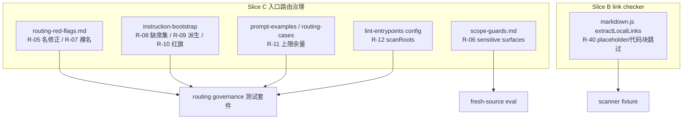

# refactor: 入口路由治理 + markdown link checker 修复（Slice C + B）

## Summary

本计划实施源 PRD 的 Slice C（入口路由治理，R-05~R-12）与 Slice B（markdown link checker，R-40）。Slice C 闭合一组入口路由防守缺口：反转 skill 名、sensitive surfaces 无定义、裸名 route target、bootstrap 缺席集不全、CURATED_CORE 硬编码、load-bearing 红旗未守护、prompt cases 上限无余量、lint scanRoots 漏扫 host 入口文档。Slice B 修 markdown link checker 把 `{url}` placeholder 和代码块内链接误报为 broken_local_link。两个 slice 都是 governance/scanner source 修正 + 测试，不新增 workflow、不改 CLI 协议、不动语义判断边界。

---

## Decision Brief

- **推荐方案：** 单一 release wave 内分 9 个 implementation unit 落地 Slice C（R-05~R-12）+ Slice B（R-40），每个 requirement 独立 unit、独立验证，互不耦合。这尊重 PRD 的 slice ownership 互斥原则，且 R-05~R-12 同属 routing governance source 面、共享测试套件，合并一个 wave 比拆两轮成本低。
- **关键决策：** R-09 CURATED_CORE 从 `skills-governance.json` 派生而非硬编码；R-11 放宽 cases.length 上限并留 breathing margin；R-40 在 `extractLocalLinks` 阶段跳过 placeholder 与代码块内链接，不在消费端 patch。
- **验证焦点：** routing-red-flags / scope-guards prose 改动走 contract test；bootstrap 缺席集/CURATED_CORE 派生走 `instruction-bootstrap.test.js`；lint scanRoots 走 `lint-skill-entrypoints.test.js`；markdown placeholder 走 scanner fixture。R-06（sensitive surfaces 定义）属 public workflow prose 变更，需 fresh-source eval。
- **最大风险/边界：** 最大风险是 R-09 CURATED_CORE 派生改动触碰 bootstrap 生成逻辑导致双宿主 byte-faithful 失配。计划要求改源后跑 `npm run sync:instructions` 并重新生成 runtime mirrors。

---

## Problem Frame

源 PRD 识别出入口路由治理（Slice C）的 8 个经源码确认的防守缺口，以及 markdown link checker（Slice B）的 1 个误报缺口。这些缺口本身不破坏功能，但削弱"入口路由不可被合理化绕过"和"audit 信号不被误报淹没"两条系统目标：反转 skill 名会误导路由判断（正确性缺陷），sensitive surfaces 无定义是 PRD 标注的"最大合理化漏洞"，placeholder 误报让 audit 输出含噪音。

本计划只实施 Slice C + B。Slice A' 已完成（见 `docs/plans/2026-06-28-003-refactor-spec-skill-stability-gates-plan.md`）；Slice D/E 保持 backlog，本轮不折入。

---

## Requirements

- R1. routing-red-flags.md 不得含反转 skill 名 `bug-report`，应为真实名 `report-bug`。Origin trace: R-05。
- R2. sensitive surfaces 必须在 scope-guards.md 或红旗中有定义与举例，LLM 不得把架构/contract/governance/runtime-delivery/multi-file 改动判为"非 sensitive"绕过路由。Origin trace: R-06, AE-05。
- R3. 红旗 route target 不得用裸名 `update`/`setup` 引发 `spec-*` 命名混淆，应写 `spec-first update`/`spec-mcp-setup`。Origin trace: R-07。
- R4. bootstrap 显式缺席集必须覆盖 `slack-research`/`skill-audit`/`app-consistency-audit`/`polish-beta`（当前仅断言 `sessions`/`release-notes`）。Origin trace: R-08。
- R5. CURATED_CORE 必须从 `skills-governance.json` 派生，不得硬编码数组字面量。Origin trace: R-09。
- R6. 两条 load-bearing 红旗（vague→brainstorm/plan、run-init-now→route first）必须在 bootstrap 内联或有 intentional deferral 测试。Origin trace: R-10。
- R7. prompt-examples / routing-cases 的 cases.length 上限必须留 breathing margin（当前恰为 14，上限 `<= 14`，补 case 即破测）。Origin trace: R-11。
- R8. lint-skill-entrypoints scanRoots 必须覆盖 `CLAUDE.md`/`AGENTS.md` host 入口文档（当前仅 `["skills"]`）。Origin trace: R-12。
- R9. Markdown link checker 必须跳过 `{url}`/`{older_url}` placeholder 与代码块内链接，真实本地 broken link 仍被报告。Origin trace: R-40, AE-12。

**Origin actors:** Spec-First Evolution Architect；using-spec-first 路由消费者；bootstrap 生成器；skill-audit 消费者。
**Origin flows:** Slice C 入口路由防守同一 release wave；Slice B 复用 A' 的 scanner fixture 分层但不重新拥有 R-01。
**Origin acceptance examples:** AE-05（R-06）；AE-07（R-05/R-07/R-08/R-09/R-10/R-11/R-12）；AE-12（R-40）。

---

## Assumptions

- A1. R-05 真实 skill 名是 `report-bug`（已源码核对：`skills/report-bug/` 存在，`skills/bug-report/` 不存在）。
- A2. R-09 `skills-governance.json` 含可派生 CURATED_CORE 的字段（entry_surface/command_name 等），实现期需读取确认确切字段名。
- A3. R-11 放宽上限的目标是留余量而非取消上限——上限仍应防止 cases 无限膨胀，只是当前值需上调（如 `<= 20`）并保留断言。
- A4. R-40 修复在 `extractLocalLinks` 内做，placeholder 模式（`{...}`）和代码块行区间跳过；不改 broken_local_link 消费端逻辑。

---

## Scope Boundaries

- 不实施 Slice A'（已完成）、Slice D、Slice E。
- 不新增 public workflow 或新 generated runtime source。
- 不手改 `.claude/`、`.codex/`、`.agents/skills/`；source 改动落 `skills/`、`scripts/`、`src/cli/`、`tests/`，runtime regeneration 用 `spec-first init` 作为交付步骤。
- 不重写已 byte-faithful 的 bootstrap 守卫主体（R-08/R-09/R-10 仅补边界与派生来源）。
- 不把 R-09 CURATED_CORE 派生扩展成完整自动生成 Route Map。
- R-40 不重新拥有 R-01 scanner 分类逻辑，仅修 markdown link 提取。

### Deferred to Follow-Up Work

- Slice D：R-24/R-25/R-26/R-37/R-38 high-risk eval seed 与 compound-refresh promotion。
- Slice E：R-13~R-23、R-28~R-36/R-39 work/plan handoff、compound schema、recall consistency、drift/reporting、eval-before-slimming。

---

## Completion Criteria

- routing-red-flags.md 用 `report-bug`，contract test 守护无反转名回归。
- sensitive surfaces 在 scope-guards.md 有定义与举例，fresh-source eval 确认 LLM 不会把架构改动判为非 sensitive。
- 红旗 route target 用 `spec-first update`/`spec-mcp-setup` 而非裸名。
- bootstrap 缺席集断言覆盖 6 项（sessions/release-notes + slack-research/skill-audit/app-consistency-audit/polish-beta）。
- CURATED_CORE 从 skills-governance.json 派生，test 守护其不硬编码。
- 两条 load-bearing 红旗在 bootstrap 内联或有 intentional deferral 测试。
- cases.length 上限上调并留 margin，补 1 个 case 不破测。
- lint scanRoots 覆盖 CLAUDE.md/AGENTS.md，test 守护。
- markdown link checker 对 `{url}` placeholder 和代码块内链接不产 broken_local_link，真实 broken link 仍报告（fixture 验证）。

---

## Direct Evidence Readiness

- target_repo: `.`
- evidence_sources: direct source reads, targeted `rg`/`grep`, git status, package scripts, origin PRD。
- source_refs: `skills/using-spec-first/references/routing-red-flags.md`, `skills/using-spec-first/references/scope-guards.md`, `tests/unit/instruction-bootstrap.test.js`, `src/cli/instruction-bootstrap.js`, `src/cli/contracts/dual-host-governance/skills-governance.json`, `tests/unit/prompt-examples-contracts.test.js`, `skills/using-spec-first/evals/routing-cases.json`, `scripts/lint-skill-entrypoints.config.json`, `scripts/lint-skill-entrypoints.js`, `tests/unit/lint-skill-entrypoints.test.js`, `skills/spec-skill-audit/scripts/lib/markdown.js`, `skills/spec-skill-audit/scripts/lint-skill-structure.js`, `skills/spec-release-notes/SKILL.md`。
- current_revision: `bc71b4be`（worktree 含 Slice A' 已落地变更 + 本计划文件）。
- worktree_status: dirty；Slice A' 变更已落地（security-patterns.js、task-pack.js、spec-doc-review/SKILL.md 等）；本计划不修改 A' 文件。
- confidence: high — 9 条 requirement 均已 bounded direct read 确认当前源码状态与缺口。
- limitations: R-09 skills-governance.json 确切可派生字段名留实现期确认；fresh-source eval 未在规划期执行。

---

## Direct Evidence

- repo_scope: 单 Git repo at workspace root。
- source_reads_completed: routing-red-flags.md 全文（反转名在 L25、sensitive surfaces 仅 L7 出现无定义、裸名 update/setup 在 L13）；instruction-bootstrap.test.js L510-544（CURATED_CORE 硬编码数组 L514-517、缺席集仅断言 sessions/release-notes L539-540）；prompt-examples-contracts.test.js（cases.length `<= 14` L107，routing-cases.json 实测 14 条）；lint-skill-entrypoints.config.json（scanRoots `["skills"]`）；markdown.js（extractLocalLinks L89 不跳过 placeholder/代码块）；spec-release-notes/SKILL.md（L132/137/202 含 `{url}`/`{older_url}`）。
- source_reads_required: 实现期需读 skills-governance.json 确认 CURATED_CORE 派生字段；读 scope-guards.md 全文确认 sensitive surfaces 定义插入点。
- commands_or_tools_used: `git rev-parse`, `grep`, `find`, `ls`, `python3 json`, bounded `sed`/Read。
- impact_on_plan: 9 requirement 各成独立 unit；R-05/R-07 为纯 prose 修正最简单，R-09 触碰 bootstrap 生成逻辑风险最高。
- key_findings: R-05 反转名确认（report-bug 存在，bug-report 不存在）；R-11 cases 恰为 14 顶满上限；R-40 三处 placeholder 误报源确认。
- limitations: 未在规划期跑 audit 全仓实扫或 fresh-source eval。

---

## Context & Research

### Relevant Code and Patterns

- `skills/using-spec-first/references/routing-red-flags.md` — 7 条红旗表 + 10 条 Hard Rules，R-05/R-06/R-07 的修正面。
- `skills/using-spec-first/references/scope-guards.md` — R-06 sensitive surfaces 定义的预期落点。
- `src/cli/instruction-bootstrap.js` + `tests/unit/instruction-bootstrap.test.js` — R-08/R-09/R-10 的 bootstrap 生成器与守护测试；CURATED_CORE 当前为 test 内硬编码数组。
- `src/cli/contracts/dual-host-governance/skills-governance.json` — R-09 CURATED_CORE 派生来源。
- `tests/unit/prompt-examples-contracts.test.js` + `skills/using-spec-first/evals/routing-cases.json` — R-11 cases.length 上限与 fixture。
- `scripts/lint-skill-entrypoints.config.json` + `scripts/lint-skill-entrypoints.js` + `tests/unit/lint-skill-entrypoints.test.js` — R-12 scanRoots 扩展面。
- `skills/spec-skill-audit/scripts/lib/markdown.js` `extractLocalLinks` — R-40 修复点；`lint-skill-structure.js:143-146` 是 broken_local_link 消费端（不改）。

### Institutional Learnings

- `docs/solutions/workflow-issues/modify-source-not-artifacts-2026-04-13.md` — 改 source 不改 generated mirror。
- `docs/solutions/workflow-issues/host-entrypoint-mapping-source-boundary-2026-04-29.md` — host 入口映射 source 边界，与 R-12 scanRoots 扩展相关。
- Slice A' 留下的 `docs/solutions/workflow-issues/spec-skill-handoff-gate-hardening-slice-a-prime-2026-06-28.md` — scanner fixture 分层模式，R-40 复用。

### External References

无外部研究。本变更由本地 routing governance 契约、bootstrap 生成器和 audit scanner 治理。

---

## Key Technical Decisions

- KTD1. R-09 CURATED_CORE 从 skills-governance.json 派生：消除"列表自身 stale"风险，让新增/退役 core skill 自动反映。派生逻辑放测试 helper 或 bootstrap 模块，保持 byte-faithful 守护。
- KTD2. R-11 上调上限保留断言：把 `<= 14` 改为更高值（如 `<= 20`）而非删除，既留 breathing margin 又防无限膨胀。
- KTD3. R-40 在提取阶段跳过：`extractLocalLinks` 跳过含 `{...}` placeholder 的 target 和落在代码块行区间内的链接，比消费端 patch 更彻底、复用面更广。
- KTD4. R-06 sensitive surfaces 定义放 scope-guards.md：与现有 scope 治理同源，红旗表只引用不重复定义。
- KTD5. 9 unit 各自独立、无依赖链：R-05~R-12 + R-40 互不耦合，可任意顺序落地，但共享 routing governance 测试套件需合跑。

---

## Open Questions

### Resolved During Planning

- R-05 真实 skill 名？ → `report-bug`（源码核对确认）。
- R-11 上限取消还是上调？ → 上调保留断言（PRD 要求"留 breathing margin"，非取消）。
- R-40 在哪修？ → `extractLocalLinks` 提取阶段，不改消费端。

### Deferred to Implementation

- R-09 skills-governance.json 确切可派生字段名（entry_surface / command_name / curated 标记）。
- R-06 sensitive surfaces 定义的确切措辞与举例集。
- R-11 上限确切新值（取决于预期 case 增长空间）。

---

## High-Level Technical Design

> 本节为方向性指引，非实现规格。实现 agent 应视作上下文。

九个 checkpoint 互相独立，但 Slice C 的五个 source 面共享 routing governance 测试套件，需在各自落地后合跑全量。

---

## Implementation Units

### U1. R-05 修正 routing-red-flags 反转 skill 名

**Goal:** 把 `bug-report` 改为真实名 `report-bug`，并加 contract test 守护无反转名回归。

**Requirements:** R1

**Dependencies:** None

**Files:**
- Modify: `skills/using-spec-first/references/routing-red-flags.md`
- Modify/Test: `tests/unit/using-spec-first-contracts.test.js`

**Approach:**
- 将 L25 `bug-report helpers` 改为 `report-bug helpers`。
- 加 contract 断言：red-flags 不含 `bug-report`，且 `report-bug` 在 helper 列表中。

**Patterns to follow:** 现有 using-spec-first-contracts.test.js 的 source-string 断言风格。

**Test scenarios:**
- Happy: red-flags 含 `report-bug`，不含 `bug-report`。
- Error path: 若回归引入 `bug-report`，断言失败。

**Verification:** `npx jest tests/unit/using-spec-first-contracts.test.js` 通过。

---

### U2. R-06 定义 sensitive surfaces

**Goal:** 在 scope-guards.md 定义 sensitive surfaces 并举例，红旗表引用该定义。

**Requirements:** R2

**Dependencies:** None

**Files:**
- Modify: `skills/using-spec-first/references/scope-guards.md`
- Modify: `skills/using-spec-first/references/routing-red-flags.md`
- Modify/Test: `tests/unit/using-spec-first-contracts.test.js`

**Approach:**
- 在 scope-guards.md 加 sensitive surfaces 定义段：列举 architecture/contract/governance/runtime-delivery/multi-file behavior 等，附 1-2 个正向/负向例子。
- routing-red-flags.md L7 的 "sensitive surfaces" 引用该定义（保持红旗简短）。

**Patterns to follow:** scope-guards.md 现有 scope 边界定义结构。

**Execution note:** 改 public workflow prose，落地后必须 fresh-source eval。

**Test scenarios:**
- Happy: scope-guards.md 含 sensitive surfaces 定义与举例（grep 命中）。
- Edge: 架构改动示例被定义覆盖。
- Integration: 红旗表引用与定义一致。

**Verification:** contract test 命中定义；fresh-source eval 确认新 reviewer 不把架构改动判为非 sensitive。

---

### U3. R-07 修正裸名 route target

**Goal:** 红旗表 route target 用 `spec-first update`/`spec-mcp-setup` 而非裸名 `update`/`setup`。

**Requirements:** R3

**Dependencies:** None

**Files:**
- Modify: `skills/using-spec-first/references/routing-red-flags.md`
- Modify/Test: `tests/unit/using-spec-first-contracts.test.js`

**Approach:**
- L13 "Route to `update` or `setup` first" 改为明确入口：`spec-first update`（终端）/`spec-mcp-setup`（Claude workflow）。

**Patterns to follow:** CLAUDE.md 入口锚点措辞（`setup/runtime→spec-mcp-setup 或终端 spec-first update`）。

**Test scenarios:**
- Happy: 红旗含 `spec-first update` 和 `spec-mcp-setup`，不含裸名 route target。
- Error path: 裸 `update`/`setup` route target 回归被断言捕获。

**Verification:** contract test 通过。

---

### U4. R-08 补全 bootstrap 缺席集断言

**Goal:** bootstrap 缺席集断言覆盖 slack-research/skill-audit/app-consistency-audit/polish-beta。

**Requirements:** R4

**Dependencies:** None

**Files:**
- Modify: `tests/unit/instruction-bootstrap.test.js`

**Approach:**
- 在 L539-540 缺席集断言旁补 4 项 `expect(blockIds.has('<id>')).toBe(false)`，确认这些非 curated-core skill 不进 bootstrap block。

**Patterns to follow:** L539-540 现有 progressive-disclosure 负向断言。

**Test scenarios:**
- Happy: slack-research/skill-audit/app-consistency-audit/polish-beta 均不在 bootstrap block。
- Edge: 若未来误把这些加进 block，断言失败。

**Verification:** `npx jest tests/unit/instruction-bootstrap.test.js` 通过。

---

### U5. R-09 CURATED_CORE 从 governance 派生

**Goal:** CURATED_CORE 从 skills-governance.json 派生，不再硬编码数组，加 test 守护。

**Requirements:** R5

**Dependencies:** None

**Files:**
- Modify: `tests/unit/instruction-bootstrap.test.js`
- Possibly Modify: `src/cli/instruction-bootstrap.js`（若派生逻辑应放生成器侧）
- Read: `src/cli/contracts/dual-host-governance/skills-governance.json`

**Approach:**
- 读 skills-governance.json 确认可派生 curated-core 的字段（如 entry_surface=workflow_command + 标记）。
- 把 L514-517 硬编码数组替换为从 governance JSON 派生的列表，保留"CURATED_CORE ⊆ Route Map"和"每个 core 在 block"的双向守护。
- 加断言：派生列表非空且来自 governance registry。

**Patterns to follow:** 现有 governance JSON 读取（plugin.js loadSkillsGovernance）。

**Execution note:** 触碰 bootstrap 守护逻辑，改后跑 sync:instructions 确认双宿主 byte-faithful 不破。

**Test scenarios:**
- Happy: CURATED_CORE 从 governance 派生，含全部 workflow_command 入口。
- Edge: governance 新增/退役 core skill 时派生列表自动反映。
- Error path: 硬编码数组字面量回归被守护断言捕获。
- Integration: 派生后 bootstrap block 仍含全部 curated-core。

**Verification:** `npx jest tests/unit/instruction-bootstrap.test.js`；`npm run sync:instructions` 无 drift。

---

### U6. R-10 load-bearing 红旗守护

**Goal:** 两条 load-bearing 红旗（vague→brainstorm/plan、run-init-now→route first）在 bootstrap 内联或有 intentional deferral 测试。

**Requirements:** R6

**Dependencies:** None

**Files:**
- Modify: `tests/unit/instruction-bootstrap.test.js`
- Possibly Modify: `src/cli/instruction-bootstrap.js`

**Approach:**
- 确认这两条红旗当前是否在 bootstrap 内联（routing-red-flags 有 7 条，bootstrap 内联 5 条）。
- 若内联，加断言守护其存在；若有意不内联，加 intentional deferral 测试记录"这两条只在 reference 不在 bootstrap"的理由。

**Patterns to follow:** 现有 bootstrap segment probe 断言（L552-554）。

**Test scenarios:**
- Happy: 两条红旗在 bootstrap 内联（或有 deferral 测试明确记录）。
- Edge: 红旗静默删除被守护捕获。

**Verification:** `npx jest tests/unit/instruction-bootstrap.test.js` 通过。

---

### U7. R-11 放宽 cases.length 上限留余量

**Goal:** prompt-examples / routing-cases 的 cases.length 上限上调并留 breathing margin，补 1 个 case 不破测。

**Requirements:** R7

**Dependencies:** None

**Files:**
- Modify: `tests/unit/prompt-examples-contracts.test.js`

**Approach:**
- L107 `toBeLessThanOrEqual(14)` 上调（如 20），保留断言防无限膨胀。
- 确认 routing-cases.json 当前 14 条在新上限下有余量。

**Patterns to follow:** 现有 length 断言区间风格（`>= N && <= M`）。

**Test scenarios:**
- Happy: 当前 14 条通过；新上限留 ≥4 余量。
- Edge: 上限仍存在，超大膨胀被捕获。

**Verification:** `npx jest tests/unit/prompt-examples-contracts.test.js` 通过。

---

### U8. R-12 lint scanRoots 覆盖 host 入口文档

**Goal:** lint-skill-entrypoints scanRoots 覆盖 CLAUDE.md/AGENTS.md，加 test 守护。

**Requirements:** R8

**Dependencies:** None

**Files:**
- Modify: `scripts/lint-skill-entrypoints.config.json`
- Possibly Modify: `scripts/lint-skill-entrypoints.js`（若需支持文件级 scanRoot 而非仅目录）
- Modify/Test: `tests/unit/lint-skill-entrypoints.test.js`

**Approach:**
- scanRoots 加 `CLAUDE.md`、`AGENTS.md`（或其所在根）。
- 确认 lint.js 的 scanRoot 遍历支持文件路径，不支持则扩展。
- 加 test：CLAUDE.md/AGENTS.md 在扫描范围内，错误入口语法能被 lint 捕获。

**Patterns to follow:** lint-skill-entrypoints.js L121 scanRoot 遍历逻辑。

**Test scenarios:**
- Happy: scanRoots 含 CLAUDE.md/AGENTS.md。
- Edge: host 文档里的 `spec-*`（Codex 侧）或 `spec-*`（Claude 侧）错误语法被 lint 捕获。
- Integration: 现有 skills 扫描不回归。

**Verification:** `npm run lint:skill-entrypoints`；`npx jest tests/unit/lint-skill-entrypoints.test.js` 通过。

---

### U9. R-40 markdown link checker 跳过 placeholder 与代码块

**Goal:** `extractLocalLinks` 跳过 `{url}`/`{older_url}` placeholder 与代码块内链接，真实本地 broken link 仍报告。

**Requirements:** R9

**Dependencies:** None

**Files:**
- Modify: `skills/spec-skill-audit/scripts/lib/markdown.js`
- Modify/Test: `tests/unit/skill-audit-scripts.test.js`

**Approach:**
- `extractLocalLinks` 跳过 target 含 `{...}` placeholder 的链接。
- 利用已有 `extractCodeBlocks` 的行区间，跳过落在代码块内的链接（link 的行号在某 code block 的 [line, line+块行数] 区间内）。
- 保留真实本地 broken link 检测不变。

**Patterns to follow:** 现有 `extractCodeBlocks`（L111）行号计算；Slice A' scanner fixture 分层模式。

**Test scenarios:**
- Happy: `[full notes]({url})` 不产 broken_local_link。
- Happy: 代码块内 `[x](./missing.md)` 不产 broken_local_link。
- Edge: `{older_url}` 多 placeholder 同行跳过。
- Error path: 代码块外真实 `[x](./does-not-exist.md)` 仍报 broken_local_link。
- Integration: spec-release-notes/SKILL.md 全文扫描 broken_local_link 数降为 0（其 3 处均为 placeholder）。

**Verification:** scanner fixture 通过；对 spec-release-notes 实扫确认 broken_local_link 消除。

---

## System-Wide Impact

- **Interaction graph:** routing-red-flags/scope-guards 改 prose → using-spec-first 路由消费者；bootstrap 派生改动 → CLAUDE.md/AGENTS.md managed block 双宿主投影；lint scanRoots 扩展 → CI 入口治理；markdown.js 改动 → skill-audit broken_local_link 消费者。
- **Error propagation:** R-09 派生若读错 governance 字段会导致 bootstrap block 缺失 core 入口——双向守护断言拦截。
- **API surface parity:** R-12 scanRoots 改 config + 可能改 lint.js 遍历；R-40 改 markdown.js 提取——均需对应 test 同步。
- **Surface coverage:** routing governance source → 范围内；bootstrap 生成器 → 范围内；lint/markdown scanner → 范围内；generated runtime mirrors → 范围外（spec-first init 重生成）。
- **Unchanged invariants:** scripts 产确定性事实，LLM 判语义路由；bootstrap byte-faithful 守护不破；R-40 不改 broken_local_link 消费端语义。

---

## Risks & Dependencies

| Risk | Mitigation |
|------|------------|
| R-09 CURATED_CORE 派生改动破坏 bootstrap byte-faithful | 改后跑 `npm run sync:instructions`，双向守护断言 + 双宿主对齐测试 |
| R-06 sensitive surfaces 定义过宽，把普通小改判为 sensitive | 定义含正向与负向例子；fresh-source eval 验证边界 |
| R-40 跳过逻辑过宽，漏报真实 broken link | 负向 fixture：代码块外真实 broken link 仍报告 |
| R-12 scanRoots 文件级支持需改 lint.js 遍历 | 先确认 lint.js 是否支持文件路径，不支持则扩展并加 test |
| source skill prose 改动未反映到 runtime mirror | runtime regeneration 作为交付步骤，spec-first init |

---

## Alternative Approaches Considered

- 把 Slice C 拆成多轮 plan：拒绝——8 个 requirement 同属 routing governance source 面、共享测试套件，一个 wave 比多轮成本低。
- R-40 在 broken_local_link 消费端 patch：拒绝——提取阶段跳过更彻底，复用面更广（path_references 等也受益）。
- R-09 完全自动生成 Route Map：拒绝——超出 R-09 范围（仅 CURATED_CORE 派生），且 PRD 明确"不把 workflow map 改成全自动生成"。
- R-11 取消上限：拒绝——PRD 要求"留 breathing margin"，取消会失去膨胀防护。

---

## Success Metrics

- routing-red-flags 无反转名/裸名 route target；contract test 守护。
- sensitive surfaces 定义存在（grep 命中 scope-guards.md）；fresh-source eval PASS。
- bootstrap 缺席集断言覆盖 6 项；CURATED_CORE 从 governance 派生。
- cases.length 上限留 ≥4 余量。
- lint scanRoots 覆盖 CLAUDE.md/AGENTS.md。
- spec-release-notes broken_local_link 数从 ≥3 降为 0，真实 broken link 仍报。

---

## Documentation / Operational Notes

- 更新 `CHANGELOG.md`，记录 Slice C + B 实施。
- source skill prose 改动后跑 `spec-first init --claude --codex -y` 重生成双宿主 runtime mirrors。
- U2（sensitive surfaces）必须 fresh-source eval；U5（CURATED_CORE 派生）改 bootstrap 生成器后跑 `npm run sync:instructions`。
- 落地后更新源 PRD Feature Slices 段的 Slice B/C 状态标注，并刷新 ready receipt。

---

## Sources & References

- **Origin document:** [docs/brainstorms/2026-06-28-002-spec-skill-robustness-stability-optimization-requirements.md](../brainstorms/2026-06-28-002-spec-skill-robustness-stability-optimization-requirements.md)
- **Slice A' plan（前序）:** [docs/plans/2026-06-28-003-refactor-spec-skill-stability-gates-plan.md](2026-06-28-003-refactor-spec-skill-stability-gates-plan.md)
- Related code: `skills/using-spec-first/references/routing-red-flags.md`
- Related code: `skills/using-spec-first/references/scope-guards.md`
- Related code: `src/cli/instruction-bootstrap.js`
- Related code: `src/cli/contracts/dual-host-governance/skills-governance.json`
- Related code: `scripts/lint-skill-entrypoints.config.json`
- Related code: `skills/spec-skill-audit/scripts/lib/markdown.js`
- Related tests: `tests/unit/instruction-bootstrap.test.js`
- Related tests: `tests/unit/prompt-examples-contracts.test.js`
- Related tests: `tests/unit/lint-skill-entrypoints.test.js`
- Related tests: `tests/unit/using-spec-first-contracts.test.js`
- Related tests: `tests/unit/skill-audit-scripts.test.js`
