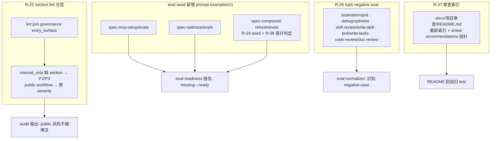

# refactor: 高风险 workflow eval seed + 知识沉淀（Slice D）

## Summary

本计划实施源 PRD 的 Slice D：为缺 eval 的高风险 public workflow 补 eval seed（R-24），让 section lint 按 entry_surface 分层使 internal_only skill 缺 section 不淹没 public workflow 风险（R-25），为 top 5 boundary pair 各补 negative eval（R-26），重建 `docs/项目审查/README.md` 审查索引与 active recommendations 指针（R-37），并为 spec-compound-refresh 补"审查报告候选可否晋升 durable knowledge"判定 eval（R-38）。全部是 eval fixture 新增 + lint 分层逻辑 + 文档索引，不改 workflow 运行语义、不新增 public workflow、不动 CLI 协议。

---

## Decision Brief

- **推荐方案：** 单一 release wave 内分 6 个 implementation unit。R-24/R-26/R-38 是 eval fixture 新增（同类、低风险），R-25 是 section lint 分层逻辑 + governance join（唯一带代码逻辑改动的 unit，风险最高），R-37 是文档索引重建。
- **关键决策：** R-25 的 entry_surface 分层通过 lint 侧 join governance registry 实现（collect-skill-facts 当前不带 entry_surface）；eval seed 用现有 `prompt-examples/v1` schema，不发明新 schema；R-37 README 索引人工维护 + 防回归 test 守护"最新审查在场"。
- **验证焦点：** 新 eval fixture 走现有 eval-fixture normalizer/contract test；R-25 分层走 `lint-skill-structure` 单测（internal_only 缺 section 降级 P2/P3）；R-37 走 README 索引 contract test。R-24/R-26/R-38 的 eval seed 是 maintainer fixture，不改 workflow prose，无需 fresh-source eval；除非某 eval seed 顺带改了 workflow SKILL prose。
- **最大风险/边界：** R-25 改 section lint severity 逻辑可能影响现有 audit 输出基线——需确认 public workflow 的 section 要求不被意外降级，只降 internal_only。

---

## Problem Frame

源 PRD 识别出 Slice D 的两类质量债：(1) eval 覆盖缺口——高风险 public workflow（spec-mcp-setup/spec-optimize/spec-compound-refresh）零 eval、top 5 boundary pair 无 negative eval、compound-refresh 无晋升判定 eval，导致这些高风险面的回归无 fixture 防护；(2) 信号淹没与知识检索成本——section lint 不分 entry_surface 让 61 P1 + 61 P2 internal_only 缺 section 淹没 public workflow 风险，审查 README 是 5 行 stub 无最新索引。

本计划只实施 Slice D（R-24/R-25/R-26/R-37/R-38）。Slice A'/B/C 已完成；Slice E（含 R-27~R-36/R-39）保持 backlog，本轮不折入。注意 R-27（governance schema 拆分 entry_surface/host_discoverability）属 Slice E，**不在本轮**——本计划 R-25 仅消费现有 entry_surface 字段做 lint 分层，不改 governance schema。

---

## Requirements

- R1. 高风险 public workflow（spec-mcp-setup/spec-optimize/spec-compound-refresh）必须有 eval seed。Origin trace: R-24, AE-10。
- R2. section lint 必须按 entry_surface 分层，internal_only skill 缺 section 默认降为 P2/P3，不淹没 public workflow 风险。Origin trace: R-25, AE-10。
- R3. top 5 boundary pair（brainstorm/prd、debug/optimize、skill-review/write-skill、prd/write-tasks、code-review/doc-review）必须各补 negative eval。Origin trace: R-26, AE-10。
- R4. `docs/项目审查/README.md` 必须有最新审查索引与 active recommendations 指针。Origin trace: R-37, AE-11。
- R5. spec-compound-refresh 必须有"审查报告候选可否晋升 durable knowledge"判定 eval。Origin trace: R-38, AE-10。

**Origin actors:** Spec-First Evolution Architect；skill-review 消费者；高风险 workflow 维护者；知识沉淀消费者。
**Origin flows:** Slice D 高风险 eval seed + 知识沉淀同一 release wave。
**Origin acceptance examples:** AE-10（R-24/R-25/R-26/R-35/R-38）；AE-11（R-37 等 governance/reporting 切片）。

---

## Assumptions

- A1. eval seed 用现有 `prompt-examples/v1` schema（与 spec-work/spec-plan/spec-doc-review evals 同源），不发明新 schema。
- A2. R-25 的 entry_surface 数据来自 `skills-governance.json`（已有字段，R-27 schema 拆分不在本轮）；lint 侧 join 该 registry 取 entry_surface。
- A3. R-26 negative eval 每个 pair 至少 1 条断言"必须 NOT 命中对面 workflow"的 case，承载于 `forbidden_signals[]` 或显式 boundary_note（与 collect-skill-facts 的 negative-case 识别一致）。
- A4. R-37 README 索引人工维护，防回归 test 仅守护"最新审查文档在索引中在场 + active recommendations 指针存在"，不强制全量自动生成。
- A5. R-38 晋升判定 eval 是 compound-refresh 的 maintainer fixture，断言"审查报告候选必须经验证才可晋升 docs/solutions/"，不自动写 docs/solutions/。

---

## Scope Boundaries

- 不实施 Slice A'/B/C（已完成）、Slice E。
- 不实施 R-27（governance schema 拆分 entry_surface/host_discoverability）——属 Slice E。本轮 R-25 仅消费现有 entry_surface 字段。
- 不实施 R-35（长主面瘦身）——属 Slice E E4。
- 不新增 public workflow，不改 workflow 运行语义。
- eval seed 是 maintainer fixture，不改 workflow SKILL prose（除非某 seed 顺带修一处明显 prose bug，那时该 prose 改动需 fresh-source eval）。
- 不自动写 docs/solutions/；R-38 只补判定 eval。
- 不手改 `.claude/`、`.codex/`、`.agents/skills/`。

### Deferred to Follow-Up Work

- Slice E：R-13~R-23、R-27、R-28~R-36/R-39（work/plan handoff、governance schema 拆分、compound schema、recall consistency、drift/reporting、eval-before-slimming）。

---

## Completion Criteria

- spec-mcp-setup/spec-optimize/spec-compound-refresh 各有 evals/ 目录与至少 1 条 thin eval seed；eval-readiness 报告对应项从 missing 变为 ready/conservative_signal。
- section lint 对 internal_only skill 的缺 section finding 降为 P2/P3；public workflow 缺 section 仍按原 severity；lint 单测守护分层。
- top 5 boundary pair 各有至少 1 条 negative eval（forbidden_signals 或 boundary_note 承载），eval normalizer 识别为 negative case。
- `docs/项目审查/README.md` 含最新审查（2026-06-28 spec-skill 健壮性优化审查）索引与 active recommendations 指针；防回归 test 守护。
- spec-compound-refresh 有晋升判定 eval（审查报告候选未验证不得进 docs/solutions/）。

---

## Direct Evidence Readiness

- target_repo: `.`
- evidence_sources: direct source reads, `grep`/`find`, governance JSON, eval fixture 结构, git status, package scripts。
- source_refs: `skills/retired-skill-review/scripts/lint-skill-structure.js`, `skills/retired-skill-review/scripts/collect-skill-facts.js`, `skills/retired-skill-review/scripts/lib/scoring.js`, `src/cli/contracts/dual-host-governance/skills-governance.json`, `skills/spec-mcp-setup/`, `skills/spec-optimize/`, `skills/spec-compound-refresh/`, `skills/spec-brainstorm/evals/routing-cases.json`, `skills/spec-work/evals/examples.json`, `docs/项目审查/README.md`, `tests/unit/workflow-eval-readiness-contracts.test.js`, `tests/unit/eval-fixture-contracts.test.js`, `tests/unit/skill-review-scripts.test.js`。
- current_revision: `bc71b4be`（worktree 含 Slice A'/B/C 已落地变更）。
- worktree_status: dirty；Slice A'/B/C 变更已落地；本计划不修改它们。
- confidence: high — 5 条 requirement 均已 bounded direct read 确认当前缺口；R-37 README 现状（5 行 stub）已读全文。
- limitations: R-25 lint 分层对现有 audit 基线的精确影响需实现期跑全仓 audit 确认；eval seed 具体 case 内容留实现期设计。

---

## Direct Evidence

- repo_scope: 单 Git repo at workspace root。
- source_reads_completed: 三个高风险 workflow 的 evals 目录（均不存在）；lint-skill-structure.js REQUIRED_SECTIONS（flat severity P1/P2）与 missing_section finding 逻辑；collect-skill-facts.js（不带 entry_surface）；scoring.js eval_readiness 维度（has_evals→missing）；governance JSON 四个高风险 workflow 的 entry_surface；brainstorm routing-cases.json negative-case 结构；docs/项目审查/README.md 全文（5 行 stub）。
- source_reads_required: 实现期读 workflow-eval-readiness-contracts.test.js 确认 eval seed 须满足的 contract；读各 boundary pair workflow 的 SKILL 边界段以写准 negative case。
- commands_or_tools_used: `git rev-parse`, `grep`, `find`, `ls`, `python3 json`, bounded Read。
- impact_on_plan: 6 unit；R-24/R-26/R-38 eval fixture 同类；R-25 唯一带 lint 逻辑改动（最高风险）；R-37 文档索引。
- key_findings: 三高风险 workflow 零 eval 确认；section lint flat severity 确认；README 是 stub 确认；entry_surface 字段已存在（R-27 schema 拆分非本轮前置）。
- limitations: 未在规划期跑全仓 audit 或 eval normalizer。

---

## Context & Research

### Relevant Code and Patterns

- `skills/retired-skill-review/scripts/lint-skill-structure.js` — REQUIRED_SECTIONS（flat P1/P2）+ missing_section finding；R-25 分层改点。
- `skills/retired-skill-review/scripts/collect-skill-facts.js` — inventory 来源，当前不带 entry_surface；R-25 需 join governance。
- `skills/retired-skill-review/scripts/lib/scoring.js` — eval_readiness 维度（`has_evals ? 'conservative_signal' : 'missing'`）；R-24 落地后该维度变化。
- `skills/spec-work/evals/examples.json`、`skills/spec-plan/evals/examples.json` — `prompt-examples/v1` schema 模板，R-24/R-38 复用。
- `skills/spec-brainstorm/evals/routing-cases.json` — negative-case 结构（forbidden_signals/boundary_note），R-26 复用。
- `src/cli/contracts/dual-host-governance/skills-governance.json` — entry_surface 来源，R-25 join。
- `docs/项目审查/README.md` — R-37 重建目标（当前 5 行 stub）。

### Institutional Learnings

- Slice A' 的 `docs/solutions/workflow-issues/spec-skill-handoff-gate-hardening-slice-a-prime-2026-06-28.md` — eval fixture 分层与 negative-case 模式。
- `docs/contracts/knowledge/knowledge-harness.md` — 知识晋升须 evidence-backed、user-owned，约束 R-38 晋升判定 eval。

### External References

无外部研究。本变更由本地 eval fixture 契约、audit lint 逻辑和审查文档治理。

---

## Key Technical Decisions

- KTD1. eval seed 用现有 `prompt-examples/v1` schema：与现有 workflow evals 同源，被 eval normalizer/readiness 报告一致消费，不发明新 schema。
- KTD2. R-25 entry_surface 分层在 lint 侧 join governance：collect-skill-facts 不带 entry_surface，lint 输入处 join skills-governance.json 取 entry_surface；internal_only → missing_section 降 P2/P3，public workflow 保持原 severity。
- KTD3. R-26 negative eval 每 pair 至少 1 条 forbidden_signals/boundary_note case：确保 eval normalizer 识别为真 negative case（非 positive-only），守护 boundary 回归。
- KTD4. R-37 README 人工索引 + 防回归 test：test 仅守护"最新审查在场 + active recommendations 指针存在"，不强制全自动生成（PRD non-goal：不把 map 改全自动）。
- KTD5. R-38 晋升判定 eval 是 advisory fixture：断言审查报告候选未验证不得进 docs/solutions/，不自动写、不改 compound-refresh 运行语义。
- KTD6. eval seed 与 lint 分层独立无依赖：R-24/R-26/R-37/R-38 互不耦合；R-25 独立但改 audit 基线，需单独验证。

---

## Open Questions

### Resolved During Planning

- eval seed 用什么 schema？ → 现有 `prompt-examples/v1`（源码确认与 spec-work/plan/doc-review 同源）。
- R-25 entry_surface 从哪来？ → skills-governance.json 现有字段（R-27 schema 拆分非前置）。
- R-37 README 已存在？ → 是，但仅 5 行 stub，无最新索引与 active recommendations 指针，需重建。

### Deferred to Implementation

- 各 eval seed 的具体 case 内容（trigger/boundary/should-not）。
- R-25 分层后对现有全仓 audit P1/P2 计数的精确影响（实现期跑 audit 确认）。
- R-26 各 boundary pair 的精确 negative-case 措辞（需读对面 workflow SKILL 边界段）。

---

## High-Level Technical Design

> 本节为方向性指引，非实现规格。

六个 checkpoint：三个 eval seed（R-24）+ boundary negative eval（R-26）+ lint 分层（R-25）+ 审查索引（R-37），其中 compound-refresh 的 R-38 晋升判定 eval 与其 R-24 seed 同目录但语义独立。

---

## Implementation Units

### U1. R-24 高风险 workflow eval seed：spec-mcp-setup

**Goal:** 为 spec-mcp-setup 补 evals/examples.json thin seed，覆盖 trigger / boundary / failure 至少各 1。

**Requirements:** R1

**Dependencies:** None

**Files:**
- Create: `skills/spec-mcp-setup/evals/examples.json`
- Modify/Test: `tests/unit/workflow-eval-readiness-contracts.test.js`（或 eval-fixture-contracts.test.js，取决于哪个守护 seed 契约）

**Approach:**
- 用 `prompt-examples/v1` schema，参照 spec-work/evals/examples.json 结构。
- case 覆盖：setup/runtime readiness 触发、误把普通改动当 setup 的 boundary、degraded mode failure。
- source_refs 指向 spec-mcp-setup/SKILL.md。

**Patterns to follow:** `skills/spec-work/evals/examples.json` schema；Slice A' eval seed 风格。

**Test scenarios:**
- Happy: examples.json 通过 eval normalizer，schema_version=prompt-examples/v1。
- Edge: 至少 1 条 negative/boundary case 被识别。
- Integration: eval-readiness 报告对 spec-mcp-setup 不再为 missing。

**Verification:** `npx jest tests/unit/workflow-eval-readiness-contracts.test.js tests/unit/eval-fixture-contracts.test.js`。

---

### U2. R-24 高风险 workflow eval seed：spec-optimize

**Goal:** 为 spec-optimize 补 evals/examples.json thin seed。

**Requirements:** R1

**Dependencies:** None

**Files:**
- Create: `skills/spec-optimize/evals/examples.json`
- Modify/Test: 同 U1 的 eval 契约测试

**Approach:**
- 同 U1 schema。case 覆盖 optimize 触发、与 debug/refactor 的 boundary、unclear-target failure。

**Patterns to follow:** U1 seed；spec-optimize/SKILL.md 边界。

**Test scenarios:**
- Happy: schema 通过 normalizer。
- Edge: negative/boundary case 在场。
- Integration: eval-readiness 不再 missing。

**Verification:** eval 契约测试通过。

---

### U3. R-24 + R-38 spec-compound-refresh eval seed + 晋升判定

**Goal:** 为 spec-compound-refresh 补 evals/examples.json，含基础 eval seed（R-24）与"审查报告候选可否晋升 durable knowledge"判定 case（R-38）。

**Requirements:** R1, R5

**Dependencies:** None

**Files:**
- Create: `skills/spec-compound-refresh/evals/examples.json`
- Modify/Test: 同 U1 的 eval 契约测试

**Approach:**
- 基础 seed：refresh 触发、与 spec-compound 的 boundary、stale-knowledge failure。
- 晋升判定 case（R-38）：给定一份未验证审查报告候选，expected_posture 是"必须先验证，不得直接晋升 docs/solutions/"；forbidden_signals 含 auto-write-docs-solutions、promote-unverified。
- 引用 knowledge-harness.md 约束。

**Patterns to follow:** U1 seed；`docs/contracts/knowledge/knowledge-harness.md`。

**Test scenarios:**
- Happy: seed schema 通过 normalizer。
- Happy: 晋升判定 case 断言未验证候选不晋升。
- Error path: case 的 forbidden_signals 含 auto-write docs/solutions。
- Integration: eval-readiness 不再 missing。

**Verification:** eval 契约测试通过；normalizer 识别晋升判定 case 为 negative case。

---

### U4. R-25 section lint 按 entry_surface 分层

**Goal:** section lint 对 internal_only skill 的 missing_section finding 降为 P2/P3，public workflow 保持原 severity，消除信号淹没。

**Requirements:** R2

**Dependencies:** None

**Files:**
- Modify: `skills/retired-skill-review/scripts/lint-skill-structure.js`
- Possibly Modify: `skills/retired-skill-review/scripts/collect-skill-facts.js`（若需把 entry_surface 带进 inventory）
- Modify/Test: `tests/unit/skill-review-scripts.test.js`

**Approach:**
- 在 lint 输入处 join skills-governance.json 取每个 skill 的 entry_surface（或在 collect-skill-facts join 后带入 inventory）。
- missing_section finding：当 skill.entry_surface === 'internal_only'，severity 降级（P1→P2、P2→P3）；其他 entry_surface 保持 REQUIRED_SECTIONS 原 severity。
- 不改 REQUIRED_SECTIONS 本身的 public workflow 要求。

**Patterns to follow:** lint-skill-structure.js 现有 missing_section finding；plugin.js loadSkillsGovernance。

**Execution note:** 改 audit 基线逻辑，落地后跑全仓 audit 确认 public workflow 风险不被意外降级。

**Test scenarios:**
- Happy: internal_only skill 缺 When-To-Use（原 P1）报为 P2。
- Happy: public workflow 缺 When-To-Use 仍报 P1。
- Edge: 无 entry_surface 信息时按原 severity（保守不降级）。
- Error path: 不得把 public workflow section 降级。
- Integration: 现有 lint 单测不回归。

**Verification:** `npx jest tests/unit/skill-review-scripts.test.js`；全仓 audit 确认分层生效。

---

### U5. R-26 top 5 boundary pair negative eval

**Goal:** 为 5 个 boundary pair 各补至少 1 条 negative eval，守护 workflow 边界不被混淆。

**Requirements:** R3

**Dependencies:** None

**Files:**
- Modify/Create: 相关 workflow 的 evals（如 `skills/spec-brainstorm/evals/routing-cases.json`、`skills/spec-debug/evals/`、`skills/retired-skill-review/evals/`、`skills/spec-prd/evals/`、`skills/spec-code-review/evals/`）——具体落点取决于每个 pair 的 owner skill。
- Modify/Test: `tests/unit/eval-fixture-contracts.test.js`

**Approach:**
- 5 pair：brainstorm/prd、debug/optimize、skill-review/write-skill、prd/write-tasks、code-review/doc-review。
- 每 pair 在其中一侧 workflow 的 eval 加 1 条 negative case：input 是易混淆到对面的请求，forbidden_signals/boundary_note 断言"必须 NOT 路由到对面 workflow"。
- 复用现有 routing-cases.json / examples.json negative-case 结构。

**Patterns to follow:** `skills/spec-brainstorm/evals/routing-cases.json` 的 boundary_note/forbidden_signals case。

**Test scenarios:**
- Happy: 每 pair 至少 1 条 negative case，normalizer 识别为 negative。
- Edge: negative case 的 forbidden_signals 指向对面 workflow。
- Integration: eval-fixture contract 不回归。

**Verification:** `npx jest tests/unit/eval-fixture-contracts.test.js`；normalizer 对 5 pair 均报 has_negative_case。

---

### U6. R-37 重建审查 README 索引

**Goal:** `docs/项目审查/README.md` 补最新审查索引与 active recommendations 指针，加防回归 test。

**Requirements:** R4

**Dependencies:** None

**Files:**
- Modify: `docs/项目审查/README.md`
- Create/Modify: `tests/unit/` 下新增或扩展一个 README 索引 contract test

**Approach:**
- README 加审查文档索引表（按日期，含 2026-06-28 spec-skill 健壮性优化审查）+ active recommendations 指针段（指向当前未闭合的审查建议/PRD）。
- 防回归 test：断言 README 含最新审查文件名 + "active recommendations" 锚点；不强制全量自动生成。

**Patterns to follow:** docs/ 下现有索引文档结构；workflow-skill-agent-map 防回归 test 思路（token 集 ⊆ 实际文件）。

**Test scenarios:**
- Happy: README 含最新审查（2026-06-28）索引条目。
- Happy: README 含 active recommendations 指针。
- Edge: 若最新审查未入索引，test 失败。

**Verification:** `npx jest` 对应 README contract test 通过。

---

## System-Wide Impact

- **Interaction graph:** 三 eval seed → eval-readiness 报告 readiness 提升；R-25 lint 分层 → audit 输出 severity 分布；R-26 negative eval → eval normalizer has_negative_case；R-37 README → 审查检索入口。
- **Error propagation:** R-25 若 join governance 失败应保守不降级（按原 severity），不得静默丢 finding。
- **API surface parity:** R-25 改 lint 逻辑需对应单测；eval seed 改 fixture 需对应 normalizer/contract test。
- **Surface coverage:** eval fixtures → 范围内；section lint → 范围内；审查 README → 范围内；governance schema（R-27）→ 范围外（Slice E）；workflow SKILL prose → 范围外（除非顺带修 bug）。
- **Unchanged invariants:** workflow 运行语义不变；eval seed 是 maintainer fixture 不进 runtime；知识晋升仍 user-owned（R-38 只补判定 eval）。

---

## Risks & Dependencies

| Risk | Mitigation |
|------|------------|
| R-25 分层意外降级 public workflow section | 单测断言 public workflow 缺 section 仍原 severity；全仓 audit 复查 |
| R-25 governance join 失败导致丢 finding | join 失败时保守按原 severity，不静默丢 |
| eval seed 被当作 runtime 依赖 | seed 在 evals/（maintainer-only），打包排除 root evals/ |
| R-26 negative case 写成 positive-only | normalizer has_negative_case 守护；每 pair 用 forbidden_signals |
| R-37 README 索引人工维护漂移 | 防回归 test 守护最新审查在场 |
| eval seed 顺带改 workflow prose 未跑 fresh-source eval | 若 seed 不改 SKILL prose 则无需；若改则补 fresh-source eval |

---

## Alternative Approaches Considered

- 把 R-25 与 R-27（governance schema 拆分）合做：拒绝——R-27 属 Slice E，schema 变更是更重的 sensitive surface；本轮 R-25 仅消费现有 entry_surface 字段即可分层。
- eval seed 发明新 schema：拒绝——现有 prompt-examples/v1 已被 normalizer/readiness 一致消费，新 schema 增加维护面。
- R-37 README 全自动生成：拒绝——PRD non-goal 明确不把 map 改全自动；人工索引 + 防回归 test 成本更低。
- R-26 在独立 boundary eval 文件集中放 5 pair：拒绝——分散到各 owner workflow 的 evals 更贴近 ownership，normalizer 按 skill 聚合。

---

## Success Metrics

- spec-mcp-setup/spec-optimize/spec-compound-refresh eval-readiness 从 missing 变 ready/conservative_signal。
- section lint 对 internal_only 缺 section 降 P2/P3；public workflow 风险计数不被淹没。
- top 5 boundary pair 各有 negative eval，normalizer has_negative_case=true。
- docs/项目审查/README.md 含最新审查索引 + active recommendations 指针。
- compound-refresh 有晋升判定 eval（未验证候选不晋升）。

---

## Documentation / Operational Notes

- 更新 `CHANGELOG.md`，记录 Slice D 实施。
- eval seed 是 maintainer fixture，不触发 runtime regeneration（除非顺带改 SKILL prose，那时跑 `spec-first init`）。
- R-25 改 lint 逻辑后跑全仓 `skill-review` 确认 audit 基线变化符合预期。
- 落地后更新源 PRD Feature Slices 段 Slice D 状态标注，刷新 ready receipt。
- 若任一 eval seed 改了 workflow SKILL prose，该 prose 改动需 fresh-source eval。

---

## Sources & References

- **Origin document:** [docs/brainstorms/2026-06-28-002-spec-skill-robustness-stability-optimization-requirements.md](../brainstorms/2026-06-28-002-spec-skill-robustness-stability-optimization-requirements.md)
- **前序 plan:** [Slice A'](2026-06-28-003-refactor-spec-skill-stability-gates-plan.md) · [Slice C+B](2026-06-28-005-refactor-routing-governance-link-checker-plan.md)
- Related code: `skills/retired-skill-review/scripts/lint-skill-structure.js`
- Related code: `skills/retired-skill-review/scripts/collect-skill-facts.js`
- Related code: `skills/retired-skill-review/scripts/lib/scoring.js`
- Related code: `src/cli/contracts/dual-host-governance/skills-governance.json`
- Related fixture template: `skills/spec-work/evals/examples.json`
- Related fixture template: `skills/spec-brainstorm/evals/routing-cases.json`
- Related doc: `docs/项目审查/README.md`
- Related tests: `tests/unit/workflow-eval-readiness-contracts.test.js`
- Related tests: `tests/unit/eval-fixture-contracts.test.js`
- Related tests: `tests/unit/skill-review-scripts.test.js`
