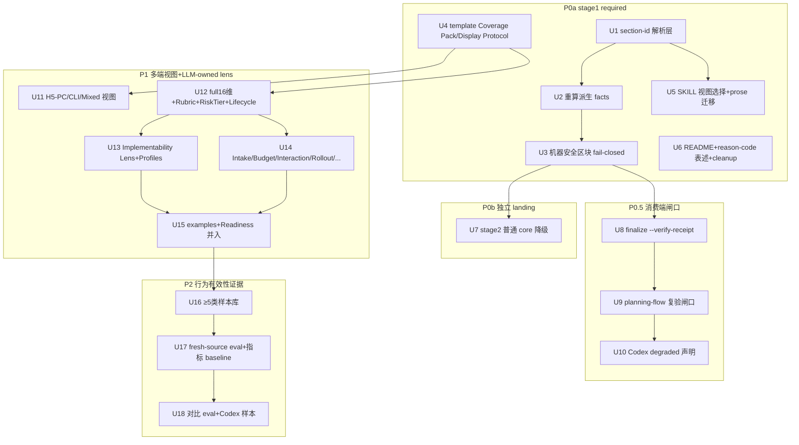

# feat: spec-prd 研发侧澄清专业化与稳定性优化

## Summary

把已成熟的优化方案(R-01~R-26 + §10 路线 + §14 DoD + §17 owner 决策)落为可执行 HOW 计划。核心是把 `spec-prd` 从"被脚本英文标题摩擦的 PRD 模板器"推进为"研发侧需求澄清 / planning-readiness workflow":P0 修边界(语言无关 section id + 机器安全区块 fail-closed + 可见澄清 checklist + 最小 coverage/owner packet),P0.5 补 `spec-plan` 消费端只读 receipt 复验,P1 补多端澄清视图与 LLM-owned lens,P2 做行为有效性证据。脚本只守机器不变量,澄清充分性交给 LLM/readiness/doc-review。

---

## Decision Brief

- **Recommended approach:** 严格按 P0a → P0b → P0.5 → P1 → P2 分阶段交付,每阶段独立可发布;P0a 是 required stage1(识别 + 安全 fail-closed),P0b 是普通 core heading 降级的独立 landing,opportunistic cleanup 顺手做但不阻塞。所有新增 lens/字段一律 LLM-owned,绝不进入 `BLOCKING_REASON_CODES`。
- **Key decisions:** (1) section-id 解析改造是 P0a 的载重单元,必须同步重算所有依赖 section identity 的派生 facts,不能只降级 finding;(2) 普通 core heading 降级是 P0b/stage2 独立 landing,必须等机器安全区块 fail-closed fixtures 通过;(3) `spec-plan` 消费端用只读 `--verify-receipt` 语义,不复制 readiness lens。详见 Key Technical Decisions。
- **Validation focus:** checker 行为 fixtures(中文标题 + section id 正确推导 / OQ-Trace razor 在纯中文标题下不静默失效 / 机器安全区块 fail-closed)、`spec-prd-checker-unit` + `spec-prd-contracts`(后者按 good/bad fixture **执行** checker,属回归面)、两个 hook 测试(`prd-prewrite-guard-hook` / `prd-readiness-guard-hook`)、`spec-prd-reason-code-parity` 与 `spec-prd-finalize` freeze、`lint:skill-entrypoints`;`run-evals --json` 只守 eval fixture 契约、**不**消费 checker facts,不能当 checker 回归证据;P2 才补样本 fresh-source eval 与效果指标。
- **Largest risks / boundaries:** 最大风险是 section-id 改造遗漏依赖 section identity 的派生 fact——尤其整条 `analyzeOutstandingQuestions` OQ/Trace razor 与 `ownerTraceHasDesignDegradedAcceptance` 的独立 re-parse:纯中文 OQ/Trace 标题会让安全 razor **静默失效(no-op)而非 fail-closed**,直接违背 KTD3;缓解是 U2 全量枚举依赖 fact、U3 按**每条 OQ/Trace reason code** 补纯中文 fixture。次大风险是 stage2(U7)与 stage1(U3)部分落地削弱安全 gate——整集 BLOCKING freeze 可能在 U3 fixture 缺失下**假绿**(安全区块经 OQ/trace 码间接阻断),故 U7 硬前置改为**专门**的安全区块 fail-closed fixture 而非整集 freeze。边界:本轮不做脚本名/字段名/路径大规模重命名(D-01),不新增第二模板拓扑或语义 checker。

---

## Problem Frame

源方案(见 origin)已结论:`spec-prd` 的优势不是模板丰富,而是 brownfield source-first / Requirements Grill / OQ closure / ready receipt 这套机制阻止 `spec-plan` 发明 WHAT。当前三类缺口:(1)输入权威边界不显式(产品 PRD / owner 决策 / 代码事实 / 模型假设混在一起);(2)脚本越界摩擦——checker 用英文 section token 判 core section,纯中文澄清产物被反复校准;(3)研发澄清覆盖度不够一等化。

owner 已在 §17 用 `grill-with-docs` 确认 12 条决策(D-01~D-12)。本计划是这些决策的 HOW 实现路径,不重开已确认边界。

**关键校正(Direct Evidence 详述):** origin 写于 2026-06-28,其后 plan 001/002 已落地(reason-codes 拆到 `scripts/lib/reason-codes.js`、`buildReport` 三阶段解构、checker 已支持**带英文锚点**的本地化标题)。因此本计划的 section-id 单元是在**当前**已有 `stripHeadingDecoration`/`matchHeadingTitle` 基础上,补**纯中文标题(无英文 token)** 的语言无关 section id,而非从零造解析层。

---

## Requirements

承接 origin §1.3 的 R-01~R-26。本计划按交付阶段引用,不复述全文;每条在对应 Implementation Unit 的 **Requirements** 字段回链。

- R1 (=R-01)。澄清前选择并展示 `clarification_view`,把 selected checklist 应澄清问题纳入上下文。【P0】
- R2 (=R-02)。checker 不把 checklist 内容质量或普通英文 core heading token 当 BLOCKING;stage1 兼容、stage2 降级。【P0】
- R3 (=R-03)。机器安全区块仍可被 deterministic checker 定位复验(canonical heading 或 section id 任一),否则 fail closed。【P0】
- R4 (=R-04)。Engineering Clarification Coverage Pack 先给 P0-minimum 6 项(带 status/source_tag/evidence_ref/deferred),full 16 维为 P1 lens。【P0/P1】
- R5 (=R-05)。Engineering Implementability Lens 为 LLM-owned profile,不是 universal template 或 checker gate。【P1】
- R6 (=R-06)。`spec-plan` 消费 clarified-requirements origin 前只读复验 producer receipt/checker。【P0.5】
- R7 (=R-07)。澄清质量证据来自样本 + reviewer/fresh-source eval,不来自 contract tests 自证。【P2】
- R8 (=R-08)。提供 Requirements Quality Rubric(必要/单一/无歧义/完整/可行/可验证/WHAT not HOW),仅 readiness/doc-review lens。【P1】
- R9 (=R-09)。定义效果指标(plan 追问 WHAT 数、发明 WHAT 数、中文标题误阻断数等),无 baseline 记 `baseline_unavailable`。【P2】
- R10 (=R-10)。跨产物 traceability:R/AE/BR/NFR → plan unit → task → verification,缺失记 coverage gap。【P0.5】
- R11 (=R-11)。living artifact 生命周期语义(baseline/supersedes/reopen/invalidation/last_validated)。【P1】
- R12 (=R-12)。按 `clarification_risk_tier`(low/medium/high/regulated)选 overlay 与验证强度。【P1】
- R13 (=R-13)。安全/隐私/可访问/可靠性标准只作条件 overlay 与审查词汇,不通用化为必填合规声明。【P1】
- R14 (=R-14)。验收表达有结构化建议(Gherkin/Rule/状态矩阵/数据表),不强制 Gherkin。【P1】
- R15 (=R-15)。Scope Boundaries 防 scope creep(appetite/rabbit holes/no-gos)。【P1】
- R16 (=R-16)。产品 PRD 明确标为输入 source;输出区分 `source_authority=product-owned` / `readiness_authority=engineering-owned`。【P0】
- R17 (=R-17)。先判 `intake_mode`(feature/bugfix/design-first/requirements-first/quick-compact)。【P1】
- R18 (=R-18)。Requirement Interaction Analysis Pass(conflict/duplication/missing_edge_case/hidden_assumption/terminology_mismatch)。【P1】
- R19 (=R-19)。Owner question 升级为 decision-ready packet(decision/recommended/affected/planning_would_invent/options)。【P0】
- R20 (=R-20)。bugfix/brownfield 显式保护 unchanged behavior 与 regression guard。【P1】
- R21 (=R-21)。right-size budget(`clarification_budget` compact/standard/deep + `review_gate_mode`)。【P1】
- R22 (=R-22)。clarified-requirements 变更后说明 downstream sync impact 或 `downstream_sync_unknown`。【P0.5】
- R23 (=R-23)。closeout 生成 agent-executable context slice。【P1】
- R24 (=R-24)。覆盖 rollout / product outcome readiness。【P1】
- R25 (=R-25)。`supporting_evidence_refs` 作一等输入索引(source_type/authority/freshness/consumed_by)。【P1】
- R26 (=R-26)。所有新增节点遵守 Light contract:不新增第二模板拓扑或语义 checker;contract tests 只锁名称/边界/不进 BLOCKING。【P0 贯穿】

**Origin actors:** 无显式 A-ID;隐含角色见 origin §9(PM / 研发负责人 / QA / UX / Backend / 合规 / Workflow maintainer / 多语言 reviewer)。
**Origin acceptance examples:** origin §1.3 每条 R 带 AE-01~AE-26;§12 验证计划提供 checker 行为 fixtures 与 eval 通过标准。

---

## Scope Boundaries

- 不做脚本名、字段名、产物路径大规模重命名(D-01)。保留 `artifact_kind: prd-requirements`、`write_mode=final-prd`、`checkpoint-prd`、`check-prd-artifact.js`、`finalize-prd-artifact.js`、`docs/brainstorms/*-requirements.md`,只在文档中解释它们是历史兼容字段。
- 不把任何新增 lens / 字段 / coverage pack / interaction / rollout / context slice 做成 `BLOCKING_REASON_CODES`(R26 / D-05 / D-09 / D-10)。
- 不新增第二套 runtime template tree 或第二 artifact topology;runtime 单 contract 仍是 `prd-output-template.md`(origin §7.5)。
- 不让 `spec-plan` 复制 `spec-prd` readiness lens 或 checklist 内容质量判断(D-03 / §17.2)。
- 不把证券行业 overlay 当通用行业事实或法务/合规意见。
- 本计划是 source 实施计划。运行 `spec-first init` 刷新 generated runtime mirrors 属实施收尾,不手改 `.claude/`、`.codex/`、`.agents/skills/`(D-12)。

### Deferred to Follow-Up Work

- reason-code 分类法从 exact freeze 改为"命名语义子集 + 复现形态":origin §10 P1 第 20 项明确单列设计与测试任务,**不并入 P0**;本计划保留 exact freeze 机制,只修正"不要把 43/历史数字当语义上限"的表述。U3 如新增 `machine_section_identity_missing`,属于现有 exact freeze 下的普通结构性码增量,不是分类法重构。
- ADR 候选(§17.3):保留历史字段 + 语义迁移、普通 core heading 降级 + section id 引入——是否落 ADR 留实施阶段判断。
- 重命名 ADR/plan:仅当后续 ≥3 次出现 owner 把 `$spec-prd` 输出当产品 PRD source 的真实误用才启动(origin §11 末行)。

---

## Completion Criteria

本计划按阶段完成,各阶段 DoD 见 origin §14(DoD-P0 / DoD-P0.5 / DoD-P1 / DoD-P2)。frontmatter `status` 推进规则:

- P0a(stage1) + P0.5 source 实施验证通过 → 可独立标 `partially-shipped`(P0b/P1/P2 未完成也不反向阻塞)。
- P0b(U7 普通 core heading 降级)在 U3 专门安全区块 fail-closed fixture 绿后独立 landing;不得与 U3 同一 landing 合入。
- P1 lens 与多端视图落地并通过 contract/eval → 继续 `partially-shipped`。
- P2 行为有效性证据(≥5 类样本 fresh-source eval + 效果指标 baseline)完成 → `completed`。
- 任一阶段:source 变更已验证且已运行 `spec-first init` 刷新 runtime mirror,CHANGELOG 记录"未手改 generated runtime mirrors;runtime refreshed by init"。

P2 不得反向阻塞 P0 source 修复(origin §14 开头)。

---

## Direct Evidence Readiness

- target_repo: spec-first(当前仓库,非父级 workspace)
- evidence_sources: 直接源码读取 + rg/grep + git rev-parse
- source_refs: skills/spec-prd/SKILL.md, skills/spec-prd/scripts/check-prd-artifact.js (1255 行), skills/spec-prd/scripts/finalize-prd-artifact.js (259 行), skills/spec-prd/scripts/lib/reason-codes.js (101 行), skills/spec-prd/references/prd-output-template.md, skills/spec-prd/references/prd-readiness-lens.md, skills/spec-plan/references/planning-flow.md, docs/需求文档模版/标准模版/, tests/unit/spec-prd-*.test.js
- current_revision: 351f4e56
- worktree_status: MM CHANGELOG.md;MM docs/brainstorms/2026-06-30-002-...requirements.md(无关并发/既有改动);M docs/plans/2026-06-30-002-feat-spec-prd-skill-optimization-plan.md(本计划修订)
- confidence: high(P0/P0.5 锚点为已读源码);medium(P1/P2 为 lens prose 设计,行为有效性需 P2 eval 证明)
- limitations: 未执行 fresh-source eval(归 P2);未 dispatch 研究 subagent(用户未授权,记 `dispatch_authorization_missing`,用 inline bounded reads 代偿)

---

## Direct Evidence

- repo_scope: skills/spec-prd/**、skills/spec-plan/references/planning-flow.md、docs/需求文档模版/标准模版/**、tests/unit/spec-prd-*
- source_reads_completed:
  - `check-prd-artifact.js`:`CORE_SECTIONS`(L23-30,6 项);`parseHeadings`(L301-313,只认 `^#{2,6}` heading,无 section-id 识别);`stripHeadingDecoration`+`matchHeadingTitle`(L317-338,**已支持**去序号装饰 + 英文锚点前缀匹配,如 `## 一、Summary 概要` 命中 Summary);`sectionRange`(L340-353,基于 `matchHeadingTitle`);`parseStructure`(L872-960)派生 `missingCoreSections`/`acceptanceSection`/`uncoveredRequirements`/`prdShaped` 全部经由 `matchHeadingTitle`;`deriveFindings`(L1094-1096)emit `core_section_missing`(当前是 BLOCKING)
  - `lib/reason-codes.js`:`BLOCKING_REASON_CODES`(经确定性核查 **31 码**,含 `core_section_missing`);`CLOSURE_BLOCKER_REASON_CODES`/`RECEIPT_ONLY_REASONS`/`CHECKPOINT_INPUT_SCAN_EXEMPT` 子集 + 分类器——**已是 check 与 finalize 共享单一真相源**(origin §3.4 弱点 5/6、§10 P0 cleanup 第 1 项的"双归属"工程债已部分被 plan 001 关闭)
  - `finalize-prd-artifact.js`:`--check-only`(L33-34,preview 不写,exit 0=closeout allowed / 1=should_block_closeout / 2=usage);`buildFinalizeReceipt`(L110-188)区分 `can_finalize`/`can_closeout`/`should_block_closeout`,合法 checkpoint closeout 已实现;**无 `--verify-receipt` 选项**(R6/P0.5 需新增 consumer 语义)
  - `SKILL.md`:Phase 0/1/2/3/4 现名为 Classify Intent / Current-State Analysis / Change Delta And Domain Language / Draft Refine Or Split / Readiness And Handoff;L237 明确写"checker anchors core sections on canonical English token...localized PRD must keep that token...otherwise core_section_missing"——这是本计划要迁移的 prose
  - `planning-flow.md`:L48-54 已有 origin grade(prd/brainstorm/legacy)与 PRD-grade `can_enter_spec_plan: yes` 识别;**无消费端 receipt verify 步骤**(R6/P0.5 需补)
  - template lib:仅 `00-通用` / `10-App` / `20-Admin` / `30-Backend` / `90-证券附录` + README;**缺 40-H5-PC / 50-CLI-DevTool / 60-Mixed**(P1)
  - tests:`spec-prd-reason-code-parity.test.js`(锁 SKILL+lens prose 覆盖全部 BLOCKING_REASON_CODES);`spec-prd-finalize.test.js`(L418 起 BLOCKING 整集 freeze + characterization);`spec-prd-contracts.test.js`(L1099-1108 锁 human core template 与 runtime template 共享 section 名)
- source_reads_required: 实施 P0 单元前需补读 `check-prd-artifact.js` 的 `gateReadyClaims`(符号锚点,~L1044)、`analyzeOutstandingQuestions`(~L494)/`parseOwnerDecisionTrace`(~L483)/`ownerTraceHasDesignDegradedAcceptance`(~L801)段、`spec-prd-checker-unit.test.js` fixtures 结构,确认 section-id 改造不破坏 OQ/Trace 推导。注:原计划引用的 `L450-620` 实为 `analyzeOutstandingQuestions` 区段而非 `gateReadyClaims`(深化已校正,统一改用符号锚点防行号漂移)
- commands_or_tools_used: `rg`/`grep -n`、`wc -l`、`ls`、`git rev-parse --short HEAD`、`git status --short`
- impact_on_plan: 校正三处方案快照偏差(见下),使 P0 U1/U2 锚点指向当前真实代码而非 origin 的 2026-06-28 描述
- key_findings:
  1. **校正一**:checker 已支持带英文锚点的本地化标题(`stripHeadingDecoration`+`matchHeadingTitle`)。真正 gap 是**纯中文标题无英文 token**(如 `## 需求概述`)仍 `core_section_missing`。section-id(`<!-- prd:section=summary -->`)的价值是让纯中文标题可被定位,与现有本地化匹配**叠加**而非替换。
  2. **校正二**:reason-codes 已拆 `lib/`、buildReport 已三阶段解构(origin §10 P0 cleanup 第 2 项"删 finalize 重复注释"、弱点 5"单文件职责重"部分已被 plan 001/002 关闭)。本计划不重做拆分,只在现有 `lib/reason-codes.js` 与三阶段结构上扩展。
  3. **校正三**:当前 `BLOCKING_REASON_CODES` 经确定性核查是 **31 码**(origin 叙述的"30/31"反而接近真值;计划早期误记 43,本次深化已校正)。reason-code freeze 测试锁"当前真实整集";本计划不重构 freeze 机制。除 U3 可能新增 `machine_section_identity_missing` 这类结构性 deterministic blocker 外,不把历史偶然数字当语义上限,也不在 P0 引入"语义子集 + 复现形态"分类法。
  4. `--verify-receipt` 不存在,需 P0.5 新增 consumer-only 语义(只读已有 receipt,不写首次 receipt)。
  5. **深化补证(2026-06-30,Agent 源码复核)**:U2 依赖 section identity 的派生 fact 清单不只 4 项——经 `sectionRange()`→`matchHeadingTitle()` 单一 chokepoint,还包含 `assumptionRowCount`/`priority_distribution`/`feature_slice_trace_gap_count`/`outstanding_questions_present`+count/`planning_recheck_present`+count、整条 `analyzeOutstandingQuestions` OQ razor、以及 `ownerTraceHasDesignDegradedAcceptance` 的**独立** `parseHeadings` re-parse(`design_degraded_owner_accepted` 第二条定位依赖)。design source 检测(`detectDesignSourceRefs` 等)是**全文 regex 扫描、非 section-scoped**,不受影响——原"source/design accounting"措辞偏宽,已在 U2 校正。
  6. **深化补证**:两个 Claude hook 直接耦合 checker——`prd-prewrite-guard` 内联 `require(checker).buildReport().facts`(读 `ready_claim_present`/`write_mode`/`design_source_refs_present`/`outstanding_questions_present`/`blocking_reason_codes`),`prd-readiness-guard` `spawn finalize --check-only` 读 exit code + stdout。故 hook 单测须纳入 U1–U3/U7 回归;且 hook 运行时从 generated runtime mirror 解析 checker,source 改动需 `spec-first init` 后才在真实会话生效。
- limitations: 未运行测试套件(计划阶段不执行验证);未读 `domain-language-and-decision-ledger.md` 全文(23K,按需在实施时读);fresh-source eval 与效果指标 baseline 归 P2,本计划不产出。

---

## Context & Research

### Relevant Code and Patterns

- `skills/spec-prd/scripts/check-prd-artifact.js` — `parseHeadings`(L301)/`matchHeadingTitle`(L327)/`sectionRange`(L340)/`parseStructure`(L872)/`deriveFindings`(L1080+)/`buildReport`(L1166)。section-id 改造的核心修改面。
- `skills/spec-prd/scripts/lib/reason-codes.js` — `BLOCKING_REASON_CODES` 及子集分类器的单一真相源。新增 advisory reason code(如 `template_structure_hint`/`out_of_scope_subsection_absent`)绝不加入 BLOCKING set。
- `skills/spec-prd/scripts/finalize-prd-artifact.js` — `--check-only` 现状(producer preview);P0.5 新增 `--verify-receipt` consumer 语义参考此处 `parseArgs`(L18)与 `buildFinalizeReceipt`(L110)。
- `skills/spec-prd/references/prd-output-template.md`(510 行)— runtime authoring contract,P0 加 Clarification Checklist Display Protocol + Coverage Pack。
- `skills/spec-prd/references/prd-readiness-lens.md`(25K)— LLM-owned readiness 判断,P1 lens 大多落这里。
- `docs/需求文档模版/标准模版/` — human-facing 澄清视图;P1 补 40/50/60。
- `tests/unit/spec-prd-checker-unit.test.js` / `spec-prd-finalize.test.js` / `spec-prd-reason-code-parity.test.js` / `spec-prd-contracts.test.js` — checker 行为、freeze、prose parity、template lock。

### Institutional Learnings

- origin §15(003 plan 合并附录):86-subagent / 7-阶段 deep research,69/69 refute、survived=0。作为 advisory 背书"不扩 core、不加语义 checker、不删 load-bearing 机制",**不是** confirmed proof。
- 内存 [[codex-spec-prd-stability-review]]:Codex 侧 spec-prd 稳定性修复的覆盖图与 P0-B 残洞——与本计划 P0.5 Codex degraded enforcement 相关,实施时回查。
- origin §17 grill-with-docs owner 决策(D-01~D-12)是 confirmed boundary。

### External References

- origin §2.3 / §15.5 URL 证据库(Atlassian/Aha/ISO 29148/NASA/EARS/INVEST/Gherkin/Kiro/GitHub Spec Kit/Shape Up/OWASP/NIST/WCAG)。全部 **advisory research**,不升级为 confirmed product truth(R13/R25 边界)。

---

## Key Technical Decisions

- **KTD1 — section-id 与现有本地化匹配叠加,不替换(校正校正一)。** 当前 `matchHeadingTitle` 已处理带英文锚点的本地化标题;新增 `<!-- prd:section=summary -->` 解析层只是补"纯中文标题"的定位能力。实现上 `sectionRange`/`parseStructure` 必须能按 canonical title **或** section id 命中同一区间。理由:不破坏现有兼容,最小改动面闭合纯中文 gap(R2/R3/D-02)。
- **KTD2 — 两阶段降级,stage1 只加识别不降级,stage2 才降级普通 core heading。** stage1:checker 同时识别旧英文标题、本地化标题、section id,并同步重算 `missingCoreSections`/`acceptanceSection`/`uncoveredRequirements`/`prdShaped`/OQ/Trace/Readiness/source-design accounting。stage2:确认机器安全区块 fail-closed fixtures 通过后,才把普通 `core_section_missing` 从 blocking 降为 advisory `template_structure_hint`(或受 `strict_template_check` 控制)。理由:防止安全区块在降级过程中被绕过(R3/D-02 两阶段兼容)。
- **KTD3 — 机器安全区块"存在"定义 = canonical heading 或 section id 任一可解析,两者皆无则 fail closed。** `Readiness Self-Check`/`Outstanding Questions`/`Owner Decision Trace`/`source_inputs` accounting/`Design Source Coverage` 在 `can_enter_spec_plan: yes` 或 `write_mode=final-prd` 时必须可定位。理由:这是 producer exit 的 deterministic invariant,不是模板语义判断(R3 / origin §7.4)。
- **KTD4 — Coverage Pack / Owner Packet / 所有 P1 lens 一律 LLM-owned 人读声明块,checker 最多 advisory presence。** 新增 reason code 全部不进 `BLOCKING_REASON_CODES`;`status=filled` 必须带 `source_tag`+`evidence_ref` 防自证。理由:Scripts prepare, LLM decides(R4/R5/R8/R26 / D-05/D-10)。
- **KTD5 — `spec-plan` 消费端 `--verify-receipt` 是只读复验,不写首次 receipt、不复制 readiness lens。** 新增 finalize consumer 模式只读已有 receipt/current hashes/blockers/机器安全区块可定位性;首次 ready 仍由 `$spec-prd` 非 `--check-only` finalize 写入。`--check-only`(producer preview)不得不经收紧直接当消费端通过信号。**exit-code 契约本轮 plan-time 钉定(不 defer,因 U9 据此分支):`verified=0` / `unverified≠0` / `usage=2`;degraded(如缺 `--inputs`)必须 `≠0`,强制 `spec-plan` 走显式 owner-accept 降级而非静默放行。** verified 判定 = `can_enter_spec_plan==='yes'` AND `ready_receipt_current===true` AND 无 non-receipt-only blocking code AND 机器安全区块可定位;**不复用** `should_block_closeout`(它对合法 checkpoint 放行,会把 checkpoint 误判 verified)。理由:轻耦合 receipt 协议 + producer↔consumer 契约不可留空缝(R6/D-03 / §17.2)。
- **KTD6 — `clarification_view`(端族)与 `clarification_profile`(澄清深度)正交,二者均不进 blocking。** view ∈ {Generic/App/H5-PC/Admin/Backend/CLI-DevTool/Mixed};profile ∈ {compact-brownfield-increment / ai-executable-product-clarification / frontend-ux-heavy / backend-contract-heavy / export-output-heavy}。竞品/商业化/0-1 方向 route out 到 `$spec-brainstorm`/`$spec-ideate`,不做内部 `strategy-discovery` profile。理由:D-06/D-07 owner 确认。
- **KTD7 — reason-code 本轮保留 exact freeze 机制,不做分类法重构。** P0a/U3 若现有码无法表达 machine-owned section identity 缺失,允许新增结构性 blocker `machine_section_identity_missing`,但必须按现有 exact freeze + prose parity 更新;除此之外,P0 只修正"不要把历史偶然数字当语义上限"的措辞。"命名语义子集 + 复现形态"分类法单列 P1 设计任务,不并入 P0。理由:origin §10 P0 第 10 项 + U3 fail-closed 需要 deterministic identity signal。
- **KTD8 — Reuse 决策:全部 extend,零 new source-of-truth。** section-id 解析扩 `check-prd-artifact.js` 现有函数;coverage pack/lens 扩 `prd-output-template.md`/`prd-readiness-lens.md`;消费端复验扩 `finalize-prd-artifact.js` + `planning-flow.md`;多端视图扩 `docs/需求文档模版/标准模版/`(已有目录)。唯一"new file"是 3 个 human-facing 模板(40/50/60),落在已存在的展示层目录,不构成新 runtime contract 或 artifact topology。理由:R26 Light contract + origin §5.1 架构。

---

## Implementation Units

> 单元按交付阶段分组(P0 → P0.5 → P1 → P2)。U-ID 跨阶段连续不复用。feature-bearing 单元含测试场景;纯 docs/prose 单元标注 `Test expectation`。

### Phase P0a — stage1 边界修正与最小稳定性锚点(required 交付门槛)

### U1. checker 新增 section-id 解析层(stage1 识别,不降级)

**Goal:** 让 `<!-- prd:section=<id> -->` 成为语言无关 section identity,与现有 canonical/本地化标题匹配叠加;纯中文标题(无英文 token)可被定位。

**Requirements:** R2, R3, R26

**Dependencies:** None

**Files:**
- Modify: `skills/spec-prd/scripts/check-prd-artifact.js`(`parseHeadings`/`matchHeadingTitle`/`sectionRange` 或新增等价 section-identity index;固定 section id registry:summary/change_delta/requirements/acceptance_examples/scope_boundaries/evidence_assumptions/outstanding_questions/owner_decision_trace/readiness_self_check/source_inputs/design_source_coverage)
- Test: `tests/unit/spec-prd-checker-unit.test.js`, `tests/unit/spec-prd-contracts.test.js`(按 good/bad fixture 执行 checker,属回归面), `tests/unit/prd-prewrite-guard-hook.test.js`, `tests/unit/prd-readiness-guard-hook.test.js`(hook 直接/间接消费 checker facts,见 System-Wide Impact)

**Approach:**
- section id 注释默认绑定其后第一个 Markdown heading;注释与 heading 间只允许空行。
- `sectionRange(lines, headings, title)` 调用方能按 canonical title 或 registry id 解析同一区间。
- 孤立 / 重复 / 未知 P0 section id 至少 advisory;重复 machine-owned section id 在 final-ready 路径 fail closed。
- section id 只表达 identity,不表达内容充分性。

**Test scenarios:**
- Happy path: PRD 用 `<!-- prd:section=summary -->` + 纯中文标题 `## 需求概述` → section 被识别,不报 `core_section_missing`。
- Happy path: 旧英文标题 `## Summary` 无 section id → 仍按现有 `matchHeadingTitle` 命中(向后兼容)。
- Edge case: 带英文锚点本地化标题 `## Summary（概要）` → 继续命中(回归保护现有 `stripHeadingDecoration`)。
- Edge case: 孤立 section id(后面无 heading)/ 重复 section id → advisory finding,不崩溃。
- Error path: 重复 machine-owned section id(两个 `prd:section=readiness_self_check`)在 final-ready 路径 → fail closed。

**Verification:** 新 fixtures 全绿;现有 checker-unit 测试无回归;`spec-prd-contracts`(fixture 执行)+ 两个 hook 单测纳入回归。注:hook 在真实会话从 generated runtime mirror(`.claude/spec-first/...`)解析 checker,source 改动后需 `spec-first init` 刷新 mirror 才反映新行为(见 Documentation/Operational Notes)。

---

### U2. 同步重算依赖 section identity 的派生 facts(stage1)

**Goal:** section-id 识别后,所有依赖 section identity 的派生 facts 用新解析层重算,不只在 finding 层降级。

**Requirements:** R2, R3

**Dependencies:** U1

**Files:**
- Modify: `skills/spec-prd/scripts/check-prd-artifact.js` — **所有经 `sectionRange()`→`matchHeadingTitle()` 单一 chokepoint 定位 section 的派生 fact 都必须同时认 section id**。完整清单(经 Agent 源码复核,符号锚点防行号漂移):
  - `parseStructure`:`missingCoreSections`、`acceptanceSection`/`acceptanceText`/`uncoveredRequirements`、`prdShaped`、`assumptionRowCount`(`countAssumptionRows` ~L822)、`priority_distribution`(`priorityDistribution` ~L830)、`feature_slice_trace_gap_count`(`detectFeatureSliceGaps` ~L843)、`outstanding_questions_present`+count、`planning_recheck_present`+count(`sectionPresent`/`countSectionRows`)
  - `computeFacts`→`analyzeOutstandingQuestions`(~L494)整条 OQ razor:`blocking_outstanding_question_count`、`open_oq_without_owner_closure_count`、`unclosed_owner_question_count`、`planning_invention_question_count`、`how_pushdown_touches_what_count`、`owner_decision_trace_present`(经 `sectionRange(...,'Outstanding Questions')` 与 `parseOwnerDecisionTrace` ~L483 `sectionRange(...,'Owner Decision Trace')`)
  - `ownerTraceHasDesignDegradedAcceptance`(~L801)**独立再跑 `parseHeadings`**(不接收已解析 headings)→ `design_degraded_owner_accepted` 有第二条独立 Owner-Decision-Trace 定位依赖,必须一并改
- Test: `tests/unit/spec-prd-checker-unit.test.js`, `tests/unit/spec-prd-contracts.test.js`(按 fixture 执行 checker)

**Approach:**
- `missingCoreSections` 用"canonical title 或 section id 任一命中"判存在。
- `acceptanceSection` 用 section id `acceptance_examples` 驱动 `uncoveredRequirements` 推导(不能因中文标题漏算验收覆盖)。
- 不得只改 `core_section_missing` 输出级别而留派生 facts 用旧 heading 推导(会导致 ready 路径误判)。
- **最高风险**:纯中文 OQ/Trace 标题不得让 `analyzeOutstandingQuestions` razor 退化为 no-op(静默放行)——razor 的所有计数与 `gateReadyClaims` 阻断必须在中文标题下与英文等值,否则安全 razor 静默失效而非 fail-closed(违背 KTD3)。
- **方案措辞校正**:design source 检测(`detectDesignSourceRefs`/`detectDesignSourceInventory`)是**全文 regex 扫描、非 section-scoped**,不受 section-id 影响;只有经 Owner-Decision-Trace 路由的 `design_degraded_owner_accepted` 是 section 依赖。

**Test scenarios:**
- Happy path: 中文标题 + section id PRD → `missingCoreSections` 为空、`acceptanceSection` 正确、`uncoveredRequirements` 按 section id 推导。
- Happy path: 纯中文 `## 未决问题` + `prd:section=outstanding_questions` 含 blocking OQ → `blocking_outstanding_question_count`/`open_oq_without_owner_closure_count` 正确计数,不因中文标题归零。
- Edge case: 中文 `## 验收样例` + `prd:section=acceptance_examples` 含 R-01 → R-01 不被误报 `requirement_without_acceptance_ref`。
- Edge case: 纯中文 `## Owner 决策追踪` + `prd:section=owner_decision_trace` → `design_degraded_owner_accepted` 的**独立** re-parse 也命中(回归保护 `ownerTraceHasDesignDegradedAcceptance`)。
- Edge case: `assumptionRowCount`/`priority_distribution`/`feature_slice_trace_gap_count`/`planning_recheck` 在纯中文 + section id 下与英文标题等值。
- Integration: `prdShaped` 在纯中文 + section id 下为 true(配合 requirementIds>0)。

**Verification:** 派生 facts fixtures 全绿(覆盖上面**完整清单**,不止 4 项);`buildReport` 公开接口/返回形状不变,且 **`facts` 字段名集合不删不改名**——prewrite-guard 对 `ready_claim_present`/`write_mode`/`design_source_refs_present`/`outstanding_questions_present`/`blocking_reason_codes` 做 `=== true` 判定,字段消失即等价信号关闭且不报错,故须断言字段名集合稳定。

---

### U3. 机器安全区块 fail-closed 不变量(stage1)

**Goal:** final-ready 路径下机器安全区块必须 canonical heading 或 section id 任一可定位,否则 fail closed,纯中文标题放宽不得绕过 OQ/Trace/receipt/source-design accounting。

**Requirements:** R3, R16

**Dependencies:** U1, U2

**Files:**
- Modify: `skills/spec-prd/scripts/check-prd-artifact.js`(`gateReadyClaims` ~L1044 及 OQ/Trace/Readiness/`source_inputs`/`Design Source Coverage` 定位逻辑)
- Modify(if needed): `skills/spec-prd/scripts/lib/reason-codes.js`(仅当现有码无法表达 section identity 缺失时,新增结构性 blocker `machine_section_identity_missing`;它不是 checklist/lens 语义码)
- Modify(if new blocker added): `skills/spec-prd/SKILL.md` + `prd-readiness-lens.md` reason-code prose parity
- Test: `tests/unit/spec-prd-checker-unit.test.js`, `tests/unit/spec-prd-finalize.test.js`, `tests/unit/spec-prd-reason-code-parity.test.js`, `tests/unit/prd-prewrite-guard-hook.test.js`, `tests/unit/prd-readiness-guard-hook.test.js`

**Approach:**
- 机器安全区块"存在" = canonical heading 或 section id 任一可解析(KTD3)。
- `can_enter_spec_plan: yes` / `write_mode=final-prd` 时两者皆无 → 阻断 ready receipt。优先复用现有 BLOCKING 码;若缺失的是"section identity 本身"且现有码只覆盖字段内容/row 矛盾,使用结构性 blocker `machine_section_identity_missing` 承载 deterministic invariant,不得把它扩展为 checklist 内容质量判断。
- **Reason-code mapping(实施时不可留给猜测):**
  | Machine-owned identity | Missing/unlocatable final-ready outcome |
  | --- | --- |
  | `Readiness Self-Check` / `readiness_self_check` | `machine_section_identity_missing(section=readiness_self_check)`;字段级缺失仍继续 emit `write_mode_undeclared` / `can_enter_spec_plan_undeclared` / `preflight_sweep_closure_absent` 等现有码 |
  | `Outstanding Questions` / `outstanding_questions` | `machine_section_identity_missing(section=outstanding_questions)`;section 可定位后,表结构/row closure 继续使用现有 `outstanding_question_*` / `*_owner_question_*` / `how_pushdown_touches_what` 码 |
  | `Owner Decision Trace` / `owner_decision_trace` | 当 owner trace 被 OQ disposition、`clarification_evidence=asked-owner` 或 design-degraded acceptance 需要时,缺 identity emit `machine_section_identity_missing(section=owner_decision_trace)` 并保留现有 `owner_decision_trace_required_but_absent` 语义 |
  | frontmatter `source_inputs` accounting | frontmatter key 是 canonical locator;缺/不可复验继续走 `input_refs_unavailable` / `input_scan_degraded` / U8 `input_side_recheck_degraded`,不新增 body-section ceremony |
  | `Design Source Coverage` / `design_source_coverage` | 当 design refs 存在且 final-ready 时,缺 heading/id emit `machine_section_identity_missing(section=design_source_coverage)`;field-level inventory/read/unread/coverage 仍用现有 design-source blocker |
- 安全区块经 OQ/trace reason code **间接**阻断(非独立"安全区块可定位"布尔),故必须有**专门** fixture 逐条断言纯中文标题下每条 OQ/Trace BLOCKING 码仍触发;**整集 BLOCKING freeze 全绿不充分**(那些码仍在 set 内,U3 fixture 缺失也可假绿)。此专门 fixture 是 U7 stage2 降级的**硬前置**。

**Test scenarios:**
- Happy path: final-ready PRD 机器安全区块用 section id 标注 → 可定位,不阻断。
- Error path(专门安全 fixture,U7 硬前置): final-ready PRD 的 `Readiness Self-Check`/`Outstanding Questions`/`Owner Decision Trace` 既无 canonical heading 又无 section id → fail closed,按上表 emit 结构性 identity blocker,并在 section 可定位但内容有风险时逐条保留对应 OQ/Trace BLOCKING 码。
- Error path(逐 reason code): 纯中文 OQ/Trace 标题但缺 section id 于 final-ready → `analyzeOutstandingQuestions` razor 仍按每条 reason code 阻断,不静默 no-op。
- Edge case: 纯中文普通 core 标题无 section id 但机器安全区块有 canonical heading → 普通 section 走兼容,安全区块仍 fail-closed 通过。

**Verification:** **专门**安全区块 fail-closed fixtures 全绿(含 `machine_section_identity_missing` 映射与逐条 OQ/Trace 码,非整集 freeze;这是 U7 stage2 降级的硬前置门槛);若新增 blocker,finalize freeze + reason-code parity 同步;hook 单测无回归。

---

### U4. prd-output-template.md 加 Clarification Checklist Display Protocol + Coverage Pack + Core/Conditional/Lens 裁决

**Goal:** runtime authoring contract 加入可见澄清 checklist 协议、Core 6 / Conditional 11 / LLM-owned Pack 裁决、Engineering Clarification Coverage Pack(P0-minimum 6 项)、`source_authority`/`readiness_authority` 区分。

**Requirements:** R1, R4, R16, R19, R26

**Dependencies:** None(可与 U1-U3 并行)

**Files:**
- Modify: `skills/spec-prd/references/prd-output-template.md`
- Test: `tests/unit/spec-prd-contracts.test.js`(template section lock)

**Approach:**
- Clarification Checklist Display Protocol:首写前声明 `clarification_view` + `rendered_checklist_refs` + `checklist_use_mode`。
- Coverage Pack P0-minimum 6 项(source_authority/current_state/change_delta/requirements_acceptance/owner_oq_trace/evidence_refs),每项带 `status`+`source_tag`+`evidence_ref`+`deferred_owner/deferred_unblock_condition`;明确脚本不校验语义。
- Owner Question Packet 最小形态(decision/recommended_answer/affected_target/planning_would_invent/owner_options)。
- 明确 `source_authority=product-owned` / `readiness_authority=engineering-owned`。

**Test scenarios:** Test expectation: contract test 锁 section 名与"不进 BLOCKING"边界;语义充分性属 readiness/doc-review/P2 eval,非本单元测试对象。

**Verification:** `spec-prd-contracts.test.js` 通过;`run-evals.js --json` 无回归。

---

### U5. SKILL.md 澄清视图选择 + prose 语义迁移

**Goal:** Phase 1 加 `clarification_view`/`clarification_profile` 选择与展示;把 L237/L238 等"canonical English token / standard PRD"prose 迁移为研发侧澄清语义 + section-id 兼容描述。

**Requirements:** R1, R2, R16, R26, D-11

**Dependencies:** U1(prose 必须与 checker 新行为一致)

**Files:**
- Modify: `skills/spec-prd/SKILL.md`(Phase 1 Current-State Analysis 后加视图选择;L237 改写 section-id 兼容;Core Principles 措辞)
- Modify: `skills/spec-prd/references/prd-readiness-lens.md`(L36 同步 section-id 兼容描述)
- Test: `tests/unit/spec-prd-reason-code-parity.test.js`(prose parity)

**Approach:**
- 首写前声明 `clarification_view`(端族)与 `clarification_profile`(澄清深度),正交、均不进 blocking。
- L237 从"必须保留英文 token,否则 core_section_missing"改为"canonical heading 或 `<!-- prd:section=... -->` 任一可定位即可,纯中文标题合法"。
- 保持 reason-code prose parity:BLOCKING 列表与 `lib/reason-codes.js` 一致。

**Test scenarios:** Test expectation: reason-code-parity 测试守 prose 覆盖全部 BLOCKING_REASON_CODES;视图选择是 LLM-owned,无 checker 断言。

**Verification:** `spec-prd-reason-code-parity.test.js` 通过;fresh-source eval 留 P2。

---

### U6. README + reason-code 表述 + opportunistic cleanup

**Goal:** 模板库 README 明确"checklist 用于澄清展示,不是脚本语义校验源";修正 reason-code 数字表述;P0 cleanup(不阻塞 required)。

**Requirements:** R26, R2

**Dependencies:** None

**Files:**
- Modify: `docs/需求文档模版/标准模版/README.md`
- Modify(仅当字面存在): reason-code 数量表述。**澄清两个不同概念**(回应 doc-review P3):(a)`BLOCKING_REASON_CODES` 当前 Set **条目数 = 31**(确定性核查值,会随真实安全码增删变化,非上限);(b)源码中**没有**把 `30`/`31` 这类数字硬编码为"码数上限"。二者不矛盾——freeze 测试锁的是"当前真实整集"(语义子集),不是某个固定数量。若实施时在 prose(SKILL/lens/docs 注释)发现"30/31 码上限"类表述,则改为"语义子集 freeze,非数量上限",否则本子项 no-op。
- Modify(cleanup,条件性): `### Out Of Scope` advisory presence anchor(emit `out_of_scope_subsection_absent`,非 BLOCKING);OQ/Trace header alias + WHAT_TOUCHING_KEYWORDS 内容 freeze 测试

**Approach:**
- cleanup 仅在同一改动面已打开且不扩大风险时顺手做(origin §10 P0 opportunistic 边界)。
- 004 plan handoff 段最小关闭注记(治理盲区已由 003 product-expert-lens 关闭),不新增对账机制。

**Test scenarios:** Test expectation: cleanup 若加 freeze 测试,则锁内容而非 case 结构;`out_of_scope_subsection_absent` 不得进 BLOCKING set。

**Verification:** `spec-prd-contracts.test.js` + `spec-prd-reason-code-parity.test.js` 通过。

---

### Phase P0b — stage2 普通 core heading 降级(独立 landing,不与 U3 同合入)

### U7. 普通 core heading 缺失从 blocking 降为 advisory

**Goal:** 确认 U3 机器安全区块 fail-closed fixtures 通过后,把普通 `core_section_missing` 从 blocking 降为 advisory `template_structure_hint`(或受 `strict_template_check=false` 控制)。

**Requirements:** R2

**Dependencies:** U1, U2, U3(前置门槛:安全区块 fail-closed 必须先稳)

**Files:**
- Modify: `skills/spec-prd/scripts/check-prd-artifact.js`(`deriveFindings` 中 `core_section_missing` 级别)
- Modify: `skills/spec-prd/scripts/lib/reason-codes.js`(从 `BLOCKING_REASON_CODES` 移出 `core_section_missing`,新增 advisory `template_structure_hint`)
- Modify: `skills/spec-prd/SKILL.md` + `prd-readiness-lens.md`(prose parity 同步)
- Test: `tests/unit/spec-prd-finalize.test.js`(BLOCKING freeze 整集更新)、`spec-prd-reason-code-parity.test.js`、`tests/unit/prd-prewrite-guard-hook.test.js`、`tests/unit/prd-readiness-guard-hook.test.js`(降级改 `blocking_reason_codes`,两 hook 均消费)

**Approach:**
- 普通 core section 缺失 → advisory;machine-owned section identity 仍 fail closed(U3 不受影响)。
- BLOCKING freeze 测试整集相应更新,reviewer 显式确认增删。
- **Landing gating invariant(硬前置,不可仅靠 prose 依赖)**:U7 **不得与 U3 在同一 landing 合入**;U7 的硬前置是 U3 的**专门**安全区块 fail-closed fixture(逐条 OQ/Trace 码)已变绿——**整集 BLOCKING freeze 全绿不充分**,因为安全区块经 OQ/trace 码间接阻断,可在 U3 fixture 缺失下假绿。

**Test scenarios:**
- Happy path: 缺普通 core heading 且无 section id → 只报 advisory `template_structure_hint`,不阻断。
- Error path: 机器安全区块缺失 → 仍 fail closed(回归保护 U3 的专门安全 fixture,非整集 freeze)。
- Integration: BLOCKING freeze 整集断言更新后全绿,prose parity 同步;hook 单测无回归。

**Verification:** finalize freeze + parity + hook 单测全绿;确认 `core_section_missing` 不再 BLOCKING、安全区块 OQ/trace 码仍 BLOCKING;reviewer checklist 显式确认 U3 专门安全 fixture 为绿(非仅整集 freeze)。

---

### Phase P0.5 — 跨 workflow 消费端闸口

### U8. finalize 新增 `--verify-receipt` consumer 只读复验模式

**Goal:** 给 `finalize-prd-artifact.js` 加只读 consumer 模式,复验已有 receipt/current hashes/blockers/机器安全区块可定位性,不写首次 receipt。

**Requirements:** R6

**Dependencies:** U3(安全区块定位逻辑)

**Files:**
- Modify: `skills/spec-prd/scripts/finalize-prd-artifact.js`(`parseArgs` 加 `--verify-receipt`;新增 consumer verify 分支,只读复验 `artifact_kind`/`can_enter_spec_plan`/receipt producer/`readiness_prd_hash`/`readiness_inputs_hash`/current checker blockers/section identity)
- Test: `tests/unit/spec-prd-finalize.test.js`

**Approach:**
- `--verify-receipt`:只读,不调用 `upsertFrontmatterFields`,不写 receipt。
- **exit-code 三态(KTD5,本轮钉定)**:`verified=0` / `unverified≠0` / `usage=2`;degraded **必须非 0**(防消费端把 degraded 当 verified 静默放行)。
- **verified 判定独立组合**:`can_enter_spec_plan==='yes'` + `ready_receipt_current===true` + 无 non-receipt-only blocker + 机器安全区块可定位;**不复用** `should_block_closeout`(现有 `--check-only` 对合法 checkpoint 返回 `should_block_closeout=false`/exit 0,naive 复用会把 checkpoint 误判 verified)。
- 无 `--inputs` 或 inputs 不可读 → 记 `input_side_recheck_degraded`,exit 非 0,不把 inputs freshness 当 confirmed。
- 输出 `origin_verification_status: verified | unverified | degraded`(与 `origin_grade` 分离)。

**Test scenarios:**
- Happy path: 有效 receipt + current hashes + 无 blocker + 安全区块可定位 → verified,exit 0。
- Error path: 缺 receipt / stale receipt / checker blocker / 机器安全区块不可定位 → unverified,exit 非 0。
- Error path(契约关键): 合法 checkpoint(`can_enter_spec_plan: no`,`should_block_closeout=false`)→ unverified(非 0),**不得**因 `should_block_closeout=false` 报 verified。
- Edge case: 无 `--inputs` → degraded + `input_side_recheck_degraded`,exit 非 0,不报 verified。
- Edge case: `--verify-receipt` 不写文件(读 mtime/hash 前后一致)。

**Verification:** consumer verify fixtures 全绿;确认不写盘;三态 exit code 与 verified 判定组合断言齐全。

---

### U9. spec-plan planning-flow 加 PRD origin 消费端复验闸口

**Goal:** `spec-plan` 消费 `artifact_kind: prd-requirements` + `can_enter_spec_plan: yes` origin 前,只读复验 producer receipt;缺有效复验则 route back 或 degraded。

**Requirements:** R6, R10, R22

**Dependencies:** U8

**Files:**
- Modify: `skills/spec-plan/references/planning-flow.md`(0.2/0.3 PRD-grade origin 段加 verify-receipt 步骤 + route-back 规则 + `unverified-prd-origin`/`origin_verification_status` + Downstream Sync Impact Map + R/AE/BR/NFR trace 保留)。**并收紧现有无条件继承**:当前 `can_enter_spec_plan: yes` 段(~planning-flow.md L50)直接记 `origin_grade: prd` 并(~L73)无条件继承 R/F/AE/Scope,**无任何复验步骤**——必须改为 `origin_grade: prd` 仅表来源类别,继承 confirmed trace 前须 `origin_verification_status: verified`;`unverified`/`degraded` 时不得把 origin R/AE/Scope 当 confirmed。
- Test: `tests/unit/spec-prd-contracts.test.js` 或新增 spec-plan consume contract fixture(origin 无有效 receipt 不得标 ready/confirmed)

**Approach:**
- 可执行路径:`node skills/spec-prd/scripts/finalize-prd-artifact.js <prd-path> --inputs <input-path> --verify-receipt`(D-03 形态),按 U8 三态 exit code 分支。
- 缺 receipt/stale/blocker/inputs freshness 不可确认/安全区块不可定位 → 不发明 WHAT,route back to `$spec-prd` 或 `$spec-doc-review`;用户明确接受才 degraded,记 `unverified-prd-origin`/`origin_grade: prd`/`origin_verification_status: degraded`。
- 保留 clarified-requirements IDs;缺映射记 coverage gap,不用 plan 新编号掩盖。
- Downstream Sync Impact Map:source/design/owner decision/R/AE 变化时识别 stale plan/task 或标 `downstream_sync_unknown`。

**Test scenarios:** Test expectation: contract/eval 锁"无有效 receipt 不得标 ready/confirmed"与 `origin_grade`(来源类别)/`origin_verification_status`(复验状态)分离;route-back reason_code 记录在 closeout。

**Verification:** contract fixture 通过;`lint:skill-entrypoints` 无回归。

---

### U10. Codex degraded enforcement 显式声明

**Goal:** Codex 无 Claude PRD hooks 时显式输出 `codex_prd_guard: not_available` + 未硬强制边界,不暗示同等机械保护;在 Codex 下 `spec-plan` receipt verify 是必需 handoff discipline。

**Requirements:** R6

**Dependencies:** U9

**Files:**
- Modify: `skills/spec-prd/SKILL.md` 或 `prd-readiness-lens.md`(Codex degraded enforcement 段)
- Modify: `skills/spec-plan/references/planning-flow.md`(Codex 下 verify 必需)

**Approach:** 落 origin §8.3 文案;关联内存 [[codex-spec-prd-stability-review]] 的 P0-B 残洞实施时回查。**degraded 有两个面**:Codex 既无 PreToolUse prewrite guard(`prd-prewrite-guard`),也无 Stop closeout guard(`prd-readiness-guard`,Claude 下由 `finalize --check-only` 自动触发);Codex 下 producer finalize 与 consumer verify 全为约定、无机械兜底。`SKILL.md`(~L188)现仅在 prewrite 处提 degraded,需补 Stop/closeout 这半边,避免 Codex 用户误以为 closeout 仍有机械保护。

**Test scenarios:** Test expectation: prose-only,无 checker 断言;若有 dual-host contract test 则锁"不暗示 Codex 同等保护"。

**Verification:** 文档审查确认无误导性同等保护暗示。

---

### Phase P1 — 多端澄清视图与 LLM-owned lens(质量增强,不阻塞 P0)

### U11. 新增 H5-PC / CLI-DevTool / Mixed human-facing 澄清视图

**Goal:** 补 `40-H5-PC端`/`50-CLI-DevTool`/`60-Mixed跨端` 三个扁平模板,延续现有 00/10/20/30 命名约定。

**Requirements:** R1, R26

**Dependencies:** U4(checklist display protocol 已定)

**Files:**
- Create: `docs/需求文档模版/标准模版/40-H5-PC端需求模板.md`(路由/表单/响应式/登录态/浏览器行为/SEO/分享)
- Create: `docs/需求文档模版/标准模版/50-CLI-DevTool需求模板.md`(命令/参数/配置/dry-run/日志/失败恢复/升级)
- Create: `docs/需求文档模版/标准模版/60-Mixed跨端需求模板.md`(source-of-truth/跨端一致性/契约/异步同步/端到端验收)
- Modify: `docs/需求文档模版/标准模版/README.md`(index 指向 7 视图)
- Test: `tests/unit/spec-prd-contracts.test.js`(若锁 template index)

**Test scenarios:** Test expectation: 纯 human-facing 展示层,不被脚本全文判断;contract test 仅锁文件存在/index 引用。

**Verification:** README index 完整;contracts 通过。

---

### U12. Coverage Pack full 16 维 + Requirements Quality Rubric + Risk Tier + Living Lifecycle

**Goal:** prd-output-template + readiness-lens 加 full 16 维 coverage lens、Quality Rubric、`clarification_risk_tier`、Living Requirements Intake lifecycle 字段。

**Requirements:** R4, R8, R11, R12, R13

**Dependencies:** U4

**Files:**
- Modify: `skills/spec-prd/references/prd-output-template.md`
- Modify: `skills/spec-prd/references/prd-readiness-lens.md`
- Test: `tests/unit/spec-prd-contracts.test.js`

**Approach:** 全部 LLM-owned;rubric/risk tier/lifecycle 只作 readiness/doc-review lens;security/privacy/accessibility/reliability 按 tier 条件 overlay,不通用化。

**Test scenarios:** Test expectation: contract test 锁名称 + "不进 BLOCKING";语义充分性属 P2 eval。

**Verification:** contracts + run-evals 通过。

---

### U13. Engineering Implementability Lens + Clarification Profiles + 11 章映射

**Goal:** 加 Engineering Implementability Lens(真实 ASCII/模块状态/失败路径/数字化 NFR/developer handoff/No False Certainty)与 clarification profiles + 11 章→spec-prd 映射(下推 HOW 到 spec-plan)。

**Requirements:** R5

**Dependencies:** U12

**Files:**
- Modify: `skills/spec-prd/references/prd-output-template.md`(适用条件/不适用边界:技术架构/依赖库/包体积/DB schema 默认属 spec-plan)
- Modify: `skills/spec-prd/references/prd-readiness-lens.md`(并入 Readiness Self-Check)

**Approach:** 落 origin §13;profile 选择不进 blocking;Numeric NFR/Module State 不进 checker(防假数字)。

**Test scenarios:** Test expectation: lens 结论只进 readiness/doc-review findings,无 BLOCKING reason_code。

**Verification:** contracts 通过;UI-heavy 行为有效性留 U18 P2 eval。

---

### U14. Workflow 节点:Intake Mode / Right-Size Budget / Interaction Analysis / Rollout / Supporting Evidence / Context Slice / Regression Guard / Scope Guard

**Goal:** 把 origin §8.5/§8.6 补充节点落为 readiness 人读字段,全部不进 blocking。

**Requirements:** R14, R15, R17, R18, R20, R21, R23, R24, R25

**Dependencies:** U12

**Files:**
- Modify: `skills/spec-prd/SKILL.md`(Phase 重排意识:intake_mode/budget/review_gate_mode 首写前声明;interaction check;rollout lens;owner packet)
- Modify: `skills/spec-prd/references/prd-readiness-lens.md`(interaction_findings/supporting_evidence_refs/handoff_context_slice/regression guard/scope guard)
- Modify: `skills/spec-prd/references/prd-output-template.md`(字段形态)
- Test: `tests/unit/spec-prd-reason-code-parity.test.js`(prose parity)

**Approach:** 全部 LLM/readiness 字段;Gherkin/INVEST 仅写作建议(R14 不强制);Scope Guard P1 才要求中高风险说明 appetite/no-gos/rabbit holes。

**Sizing / cohesion 说明(回应 doc-review P2):** 本单元聚合 9 条节点(R14/R15/R17/R18/R20/R21/R23/R24/R25)是有意为之——它们全是 `prd-readiness-lens.md` / `prd-output-template.md` 的**无代码 LLM-owned 人读字段**,共享同一 review surface(readiness/doc-review),彼此**无 inter-field 依赖**,也都遵守"不进 BLOCKING"同一边界。拆成 9 个微单元会违反"避免 micro-step"。执行时可作为 1 个提交落地;若单提交过大,允许按 concern 切片(建议分组:① intake_mode/clarification_budget/review_gate_mode;② interaction_findings/regression guard;③ rollout/supporting_evidence_refs/handoff_context_slice/scope guard),切片**不新增 U-ID**、不改依赖,仅为提交粒度便利。

**Test scenarios:** Test expectation: 所有字段缺失/不匹配最多 advisory;checker 不新增 BLOCKING。

**Verification:** parity + contracts 通过。

---

### U15. examples 更新 + Readiness Self-Check 并入 lens

**Goal:** eval examples 加成功/边界/审查 case;把 Implementability Lens 与 Coverage Pack 并入 Readiness Self-Check 人读声明。

**Requirements:** R5, R8

**Dependencies:** U13, U14

**Files:**
- Modify: `skills/spec-prd/evals/`(examples 文件)
- Modify: `skills/spec-prd/references/prd-readiness-lens.md`
- Test: `tests/unit/spec-prd-evals-unit.test.js`, `node skills/spec-prd/scripts/run-evals.js --json`

**Approach:** 加"中文标题无英文 token 合法"成功 case、"脚本不判 checklist 内容质量"边界 case、"UI-heavy 未启用 implementability lens 时 readiness 提示风险"审查 case。

**Test scenarios:** Test expectation: eval cases 是 examples-as-context,非 deterministic router;evals-unit 锁结构。

**Verification:** `run-evals.js --json` + evals-unit 通过。

---

### Phase P2 — 行为有效性证据(不反向阻塞 P0)

### U16. 真实 clarified-requirements 样本库(≥5 类)

**Goal:** 建 Admin / App+design-source / Backend / CLI+workflow / Mixed multi-source 样本输出。

**Requirements:** R7

**Dependencies:** U15

**Files:**
- Create: 样本 clarified-requirements 产物,优先放 `skills/spec-prd/evals/fixtures/` 或 `docs/validation/spec-prd-samples/`;合成样本标 `synthetic_reason`。
- Avoid by default: 不把 synthetic eval 样本直接落到 `docs/brainstorms/*-requirements.md`,因为 `spec-plan` 会搜索该 glob 作为真实 planning candidate。若确需放入 `docs/brainstorms/`,必须加 `doc_role: eval-fixture` / `artifact_kind: eval-sample` 等排除标记,并同步 U9 的 `planning-flow.md` 候选过滤规则,避免污染真实 requirements discovery。

**Test scenarios:** Test expectation: 样本是 eval 输入,非 contract test;每样本记 source refs/degraded mode。

**Verification:** 5 类样本就绪;确认 synthetic 样本不会被 `spec-plan` 普通 requirements discovery 当作可规划 origin。

---

### U17. fresh-source eval / doc-review + 效果指标 baseline

**Goal:** 每类样本做 fresh-source eval/doc-review;记录 origin §12.4 效果指标,无历史 baseline 记 `baseline_unavailable`。

**Requirements:** R7, R9

**Dependencies:** U16

**Files:**
- Create: eval 报告(docs/validation/ 或等价),含 plan_what_questions_count / plan_invented_what_findings_count / localized_heading_false_block_count / ready_clarification_p0_p1_review_findings_count / owner_gap_leaked_to_plan_count / traceability_gap_count / right_size_mismatch_count / interaction_gap_count / context_slice_followup_questions_count

**Approach:** 按 `docs/contracts/workflows/fresh-source-eval-checklist.md`;通过标准:无 P0/P1,P2 resolved/deferred-with-owner;每样本记 source refs/degraded mode/review findings/未执行验证。

**Test scenarios:** Test expectation: eval 是行为证据,非单次 contract test 通过条件。

**Verification:** ≥5 类样本无 P0/P1;指标 baseline 形成。

---

### U18. 对比 eval(blind review / right-size / interaction / context-slice)+ Codex degraded 样本

**Goal:** blind output review(new template vs current skeleton);right-size/interaction/context-slice eval;Codex degraded closeout 样本(`codex_prd_guard: not_available`)。

**Requirements:** R5, R7, R9

**Dependencies:** U17

**Files:**
- Create: 对比 eval 报告

**Test scenarios:** Test expectation: 验证新 lens 减少 spec-plan 追问、少漏状态/失败路径;right-size 防小 bug 膨胀/high-risk 被 quick 误放行。

**Verification:** 对比 eval 显示 plan 准入质量提升;deep research 69/69 refute 保留为 advisory 背书,非 confirmed proof。

---

## High-Level Technical Design

> *本图说明单元依赖与阶段交付边界,是 review 用的方向性指引,不是实现规范。*

关键路径:`U1→U2→U3` 是 P0a 载重链(section identity + 安全区块),`U3` 同时门控 `U7`(P0b 独立 landing,不得与 U3 同合入)与 `U8`(消费端复验依赖安全区块定位)。`U4` 可与 U1-U3 并行启动。

---

## System-Wide Impact

- **Interaction graph:** `check-prd-artifact.js` 的 `buildReport`(`parseStructure`/`computeFacts`/`deriveFindings`)被三类下游消费:(1)`finalize-prd-artifact.js` 内部调用;(2)`prd-prewrite-guard` hook **内联 `require(checker).buildReport().facts`**(直接耦合 `facts` 字段名);(3)`prd-readiness-guard` hook `spawn finalize --check-only` 读 exit code + stdout;(4)`spec-prd-contracts.test.js` 按 good/bad fixture **执行** checker(回归面)。section-id 改造影响全部四条。`spec-plan` 经 `--verify-receipt` 新增对 finalize 的只读依赖。注:`run-evals.js` **不**消费 checker facts(只校验 eval fixture JSON 结构),不能当 checker 行为回归证据。
- **Error propagation:** stage1(U1-U3)对既有 anchored good/bad fixtures 的 `blocking_reason_codes` 必须逐位不变,但会新增专门 fixture 证明 final-ready 且 machine-owned section identity 不可定位时 fail closed(`machine_section_identity_missing` 或现有码映射)。stage2(U7)改 BLOCKING 整集——必须经 freeze 测试整集更新让 reviewer 显式确认;且 U7 硬前置是 U3 的**专门**安全区块 fail-closed fixture 为绿,**整集 freeze 全绿不充分**(安全区块经 OQ/trace 码间接阻断,可在 U3 fixture 缺失下假绿)。
- **State lifecycle risks:** 最大风险是 U2 漏改依赖 section identity 的派生 fact——尤其整条 `analyzeOutstandingQuestions` OQ/Trace razor 与 `ownerTraceHasDesignDegradedAcceptance` 的独立 re-parse:纯中文 OQ/Trace 标题会让安全 razor **静默失效(no-op)而非 fail-closed**,导致纯中文 PRD 误判 ready。缓解:U2 全量枚举 + U3 按每条 OQ/Trace reason code 补纯中文 fixture。
- **API surface parity:** `buildReport` 公开接口/返回形状不变(U2 验证项);**`facts` 字段名集合不删不改名**(prewrite-guard 对缺失字段做 `=== true` 判定会静默失效);`finalize` 新增 `--verify-receipt` 是新增 flag、三态 exit code(verified=0/unverified≠0/usage=2)是 producer↔consumer 契约本轮钉定,不改现有 `--check-only`/`--refresh-inputs-hash` 行为。
- **Surface coverage:** spec-prd skill(prose + checker)→ in-scope;spec-plan(消费端)→ in-scope(P0.5);human-facing 模板库 → in-scope(P1);generated runtime mirror(`.claude`/`.codex`/`.agents/skills`)→ deferred: `spec-first init` 实施收尾刷新(D-12);Codex hooks → out-of-scope: **prewrite + readiness 两个 hook 均无等价 primitive**,Codex 下 producer finalize 与 consumer verify 全为约定、无机械兜底,声明 degraded(U10)。
- **Integration coverage:** dual-host(Claude/Codex)影响在 U10 显式声明;`spec-first init` 后需 doctor 复查 runtime drift(实施收尾,非本计划单元)。
- **Unchanged invariants:** `artifact_kind: prd-requirements`、`write_mode` 合法值、receipt schema `spec-prd-finalize.v1`/`spec-prd-artifact-check.v1`、`docs/brainstorms/*-requirements.md` 路径、现有 `--check-only` 语义、现有本地化标题匹配(`matchHeadingTitle`)、`WHAT_TOUCHING_KEYWORDS` 双写(`check-prd-artifact.js` + `prd-prewrite-guard` hook,冻结契约;若改需两边同步 + 加 fixture)——全部本计划显式不改(D-01)。

---

## Risks & Dependencies

| Risk | Mitigation |
|------|------------|
| U2 漏改某条依赖 section identity 的派生 fact → 纯中文 PRD ready 误判 | U1-U3 fixtures 覆盖**完整**派生清单(`missingCoreSections`/`acceptanceSection`/`uncoveredRequirements`/`prdShaped`/`assumptionRowCount`/`priority_distribution`/`feature_slice_trace_gap_count`/`outstanding`+`planning_recheck` present/count/OQ razor 全量/`ownerTraceHasDesignDegradedAcceptance`);buildReport 返回形状回归断言 |
| OQ/Trace razor 在纯中文标题下静默 no-op(最高危,违背 KTD3) | U2 全量枚举 razor facts;U3 按**每条** OQ/Trace reason code 补纯中文 fixture;U3 专门安全区块 fail-closed fixture |
| stage2(U7)降级误删机器安全区块保护 | U7 不得与 U3 同一 landing 合入;U7 硬前置是 U3 **专门**安全区块 fail-closed fixture 绿(逐条 OQ/trace 码);**整集 freeze 全绿不充分**(安全区块间接阻断,可在 U3 fixture 缺失下假绿) |
| section-id 重算误删/改名 `facts` 字段 → prewrite-guard 信号静默失效 | U2 验证断言 `facts` 字段名集合不变;`buildReport` 返回形状回归 |
| `--verify-receipt` degraded 被消费端误当 verified | exit-code 三态钉定 degraded≠0(KTD5/U8);U9 收紧 planning-flow 无条件继承(继承 confirmed trace 需 `origin_verification_status: verified`);U8 verified 判定不复用 `should_block_closeout` |
| 新增 lens/字段被误做成 blocking | U4/U12/U13/U14 contract test 显式锁"不进 BLOCKING";`spec-prd-reason-code-parity` 守 prose/code 一致 |
| `--verify-receipt` 误写盘或误把 `--check-only` 当通过信号 | U8 fixtures 断言不写盘(mtime/hash 前后一致)+ 收紧语义测试 |
| Codex 无 hook 被暗示同等保护 | U10 显式 `codex_prd_guard: not_available`;文档审查检查无误导性表述 |
| 方案 2026-06-28 快照偏差导致按过时描述实施 | 已在 Direct Evidence 校正 3 处;实施前 U1/U3/U8 补读 `gateReadyClaims`/OQ 段与现有 fixtures |
| P1/P2 lens 沦为仪式化自证 | 首批只把 Coverage Pack/Owner Packet/Interaction Analysis 当 load-bearing,P2 用样本 eval 证明能发现遗漏;其余先 advisory |
| 多端视图变第二 canonical source | 模板库只承载展示;runtime contract 仍 `prd-output-template.md`;drift test 只锁共同骨架与 lens 名 |
| reason-code freeze 被误改 | KTD7:本轮保留 exact freeze 机制;U3 如新增 `machine_section_identity_missing` 必须同步 freeze/parity,但"语义子集 + 复现形态"分类法单列 Deferred Follow-Up,不并入 P0 |

---

## Open Questions

### Resolved During Planning

- 是否从零造 section-id 解析层?→ 否。当前已有 `matchHeadingTitle` 本地化匹配,只叠加 section-id 识别闭合纯中文 gap(KTD1,Direct Evidence 校正一)。
- 是否本轮重做 checker 模块拆分?→ 否。plan 001/002 已拆 `lib/reason-codes.js` 与三阶段 buildReport;本计划在现有结构上扩展(校正二)。
- 消费端复验用什么形态?→ 新增 finalize `--verify-receipt` 只读模式(KTD5/D-03),不复制 readiness lens。
- reason-code 是否本轮改 freeze 机制?→ 否,保留 exact freeze 机制;U3 如新增 `machine_section_identity_missing` 按现有 freeze/parity 同步,分类法重构单列 Follow-Up(KTD7)。
- `--verify-receipt` exit-code 约定?→ **已 plan-time 钉定**(深化校正,不再 defer,因 U9 据此分支):`verified=0` / `unverified≠0` / `usage=2`,degraded **必须非 0**;verified 判定不复用 `should_block_closeout`(KTD5/U8)。
- U2 依赖 section identity 的派生 fact 是否只有 4 项?→ 否,完整清单已在 U2 枚举(含整条 OQ razor + `ownerTraceHasDesignDegradedAcceptance` 独立 re-parse);design source 检测是全文扫描、不受影响(深化校正)。

### Deferred to Implementation

- `template_structure_hint` 与 `out_of_scope_subsection_absent` 的精确 finding payload 形状 → U7/U6 实施时按现有 finding 结构定。
- section id registry 是否需要在 conditional section 扩展 → P0 只固定 12 个 P0 section id;其余按同规则后续扩(origin §7.4)。
- `spec-first init` 后 runtime drift 是否一次性刷新还是分阶段 → 实施收尾按 D-12 判断,每阶段 source 验证后刷新。

---

## Documentation / Operational Notes

- 每个 source 变更单元必须按仓库格式更新根 `CHANGELOG.md`(作者读 `~/.spec-first/.developer`,回退 git 身份);用户可见行为变化追加 `(user-visible)`。
- 影响 README/docs 的单元(U6 README、U11 模板 index)同步更新。
- 各阶段 source 验证通过后运行 `spec-first init` 刷新 generated runtime mirrors;CHANGELOG 记"未手改 generated runtime mirrors;runtime refreshed by init"(D-12)。仅改方案文档时不运行 init。
- Agent/skill prose 变更(U5/U10/U12-U15)受会话缓存影响:行为语义验证用 fresh-source eval(归 P2 U17),不依赖当前会话缓存的 typed-agent 调用。
- 两个 Claude hook(`prd-prewrite-guard` 内联 `require(checker).buildReport().facts`;`prd-readiness-guard` `spawn finalize --check-only`)运行时从 **generated runtime mirror**(`.claude/spec-first/...`)解析 checker。U1–U3/U7 改 source 后,真实会话中的 hook 行为需先 `spec-first init` 刷新 mirror 才反映新 checker;hook 单测(`prd-prewrite-guard-hook`/`prd-readiness-guard-hook`)纳入 U1–U3/U7 回归。

---

## Sources & References

- **Origin document:** `docs/01-需求分析/16.spec-prd-skill-optimization/2026-06-28-prd-skill专业化与稳定性优化方案.md`(含 §10 路线 / §14 DoD / §12 验证 / §15 003 合并附录 / §17 grill 确认决策 D-01~D-12)
- Related code: `skills/spec-prd/scripts/check-prd-artifact.js`, `skills/spec-prd/scripts/finalize-prd-artifact.js`, `skills/spec-prd/scripts/lib/reason-codes.js`, `skills/spec-prd/SKILL.md`, `skills/spec-prd/references/prd-output-template.md`, `skills/spec-prd/references/prd-readiness-lens.md`, `skills/spec-plan/references/planning-flow.md`
- Related tests: `tests/unit/spec-prd-checker-unit.test.js`, `spec-prd-finalize.test.js`, `spec-prd-reason-code-parity.test.js`, `spec-prd-contracts.test.js`, `spec-prd-evals-unit.test.js`
- Template lib: `docs/需求文档模版/标准模版/`
- Institutional: [[codex-spec-prd-stability-review]], [[op-season2-delivery]]
- Verification commands(实施时): `npx jest tests/unit/spec-prd-*.test.js tests/unit/prd-prewrite-guard-hook.test.js tests/unit/prd-readiness-guard-hook.test.js --runInBand`, `node skills/spec-prd/scripts/run-evals.js --json`, `npm run lint:skill-entrypoints`, `node bin/spec-first.js init -y --claude --codex`(source 验证后刷新 runtime mirrors), `node bin/spec-first.js doctor --claude --json`, `node bin/spec-first.js doctor --codex --json`, `git diff --check`, `npx jest tests/unit/changelog-format.test.js --runInBand`
