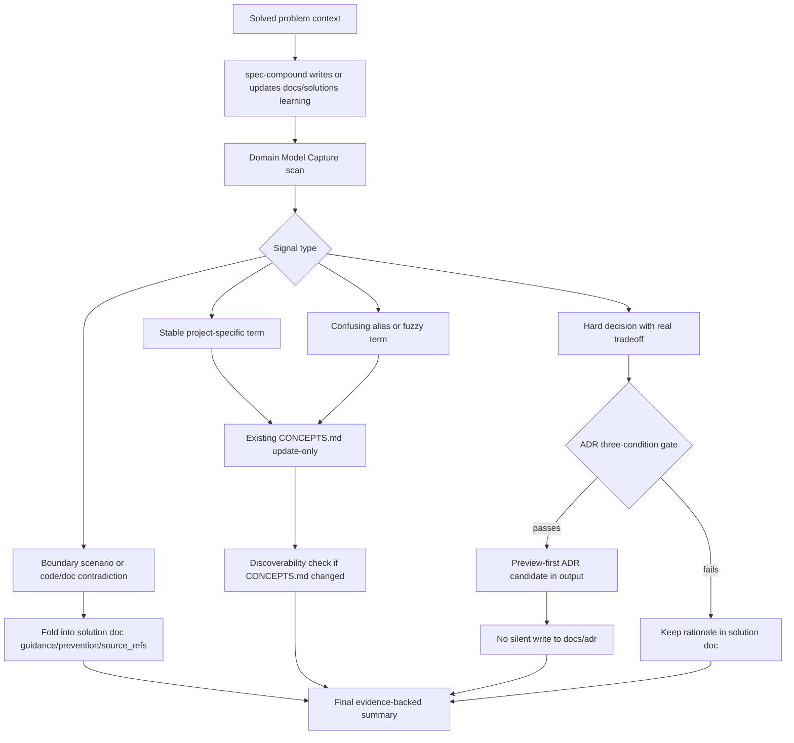

# feat: Integrate domain-modeling discipline into spec-compound

## Summary

本方案规划把外部 `domain-modeling` skill 的有效方法吸收到 `spec-compound` 的知识沉淀链路中：保留 `docs/solutions/` 作为唯一主产物，把术语澄清、边界场景、代码/文档矛盾回证和 ADR 候选判断作为可选的 Domain Model Capture 子阶段。方案不新增公开 workflow，不默认创建 `CONTEXT.md`、`CONTEXT-MAP.md` 或 `docs/adr/**`，也不把 advisory vocabulary 升格为 source-of-truth。

---

## Decision Brief

- **Recommended approach:** 扩展 `spec-compound`，新增一个小型 `domain-model-capture` reference 来承接外部方法的本地化规则；`SKILL.md` 只放阶段锚点，`CONCEPTS.md` 维护仍由现有 `concepts-vocabulary.md` 负责。
- **Key decisions:** 集成方法，不复制外部 skill；默认 update-only `CONCEPTS.md`；对 existing `CONTEXT.md`/ADR 拓扑只输出 preview-first 候选；source/runtime 仍以 `skills/` 为 source-of-truth。
- **Validation focus:** `tests/unit/spec-compound-contracts.test.js` 锁定主产物不变、无默认 context/ADR 创建、CONCEPTS advisory 边界、refresh 对齐；skill prose 变更后跑 fresh-source eval。
- **Largest risks / boundaries:** 最大风险是把 `spec-compound` 从 knowledge promotion workflow 膨胀成领域模型/ADR 管理平台。计划用“一个主文档 + 可选维护副作用 + preview-first 候选”约束边界。

---

## Problem Frame

用户问题是：`domain-modeling` 是否可以集成到 `spec-compound`，并要求深度调研、全局思考、规划和输出详细方案。

当前事实：

- `spec-compound` 已经有 `docs/solutions/` 结构化知识晋升、`invalidation_condition`、`source_refs`、`domain`、`pattern`、`rejected_alternatives` 等字段，能承载大部分“可复用经验”的召回上下文。
- `spec-compound` 已有 Phase 2.4 `Vocabulary Capture`，当根目录存在 `CONCEPTS.md` 时做 update-only advisory vocabulary 维护，不存在时不创建。
- 外部 `domain-modeling` 的核心价值不是“读 glossary”，而是在设计/澄清过程中主动挑战术语、锐化模糊词、构造边界场景、回证代码，并在术语或重大决策 crystallize 时写入 glossary 或 ADR。
- 本仓库此前在 `spec-prd` 已吸收过相同思想，明确结论是：借方法和筛选标准，不复制 `CONTEXT.md`/ADR 默认拓扑，不制造第二真相源。

因此，这次计划的目标不是把 `domain-modeling` 作为另一个 public skill 接到 `spec-compound` 后面，而是把它的“领域模型捕获纪律”变成 `spec-compound` 的可选增强阶段。

---

## Requirements

- R1. `spec-compound` 必须继续以一个 `docs/solutions/` learning document 作为 primary artifact；任何 vocabulary/context/ADR 维护都只能是受限副作用或候选建议。
- R2. 集成必须覆盖 `domain-modeling` 的四个核心动作：challenge glossary、sharpen fuzzy language、scenario stress、cross-reference with code。
- R3. `CONCEPTS.md` 仍是 repo-local advisory vocabulary；存在时 update-only，不存在时不创建，不得变成 PRD、ADR、workflow contract、setup requirement 或 source-of-truth override。
- R4. `CONTEXT.md`、`CONTEXT-MAP.md`、`docs/adr/**` 不得成为 `spec-compound` 默认 artifact、completion gate 或 silent-write 目标；只有 existing topology 且用户明确授权时才可进入单独后续写入。
- R5. ADR 候选必须同时满足 hard to reverse、surprising without context、real tradeoff；不满足时只保留在 solution doc 的 rationale、rejected alternatives 或 prevention/guidance 中。
- R6. 新规则必须 source-contained，不依赖仓外本机路径；外部 `domain-modeling` skill 只能作为本计划的 advisory method input。
- R7. 行为型 skill prose 变更必须更新 `CHANGELOG.md`、补 contract tests，并按 skill prose 规则执行 fresh-source eval；如果无法执行，记录 `not_run` 和具体原因。
- R8. 若改动影响 `spec-compound-refresh` 的同类 vocabulary/knowledge 维护边界，必须同步最小 contract，避免 compound 与 refresh 对同一 `CONCEPTS.md`/domain signal 形成漂移。

---

## Assumptions

- A1. 本计划只输出实现方案，不直接修改 `skills/spec-compound/**`。后续真正改 skill 时应走 `$spec-work` 或由用户明确授权继续实施。
- A2. 目标仓库是当前 checkout：`spec-first`。当前工作树已有大量非本次改动，实施时必须只触碰本计划列出的文件。
- A3. 不需要联网调研；本问题的权威依据来自本仓库 source、既有计划/learning、外部本地 `domain-modeling` skill contract 和项目角色契约。
- A4. `domain-modeling` 的原始 `CONTEXT.md` lazy-create 行为不适合直接搬入 `spec-compound` 的默认流程，因为这会让一个知识晋升 workflow 隐式创建新的项目级真相源。

---

## Scope Boundaries

- 不新增 `$spec-domain-modeling`、`$spec-context`、`$spec-adr` 或任何公开 workflow。
- 不把外部 `domain-modeling` skill 原文作为运行时依赖，也不在 `spec-compound` 中暴露它的 entrypoint。
- 不默认创建或编辑 `CONTEXT.md`、`CONTEXT-MAP.md`、`docs/adr/**`。
- 不新增 `docs/solutions/` schema 字段，除非实施阶段证明现有 `domain`、`pattern`、`rejected_alternatives`、`invalidation_condition`、`source_refs` 无法表达必要召回信息。
- 不让脚本判断“术语是否足够领域特定”或“ADR 是否成立”；脚本只能检查文本锚点、schema、frontmatter、安全格式和 runtime projection。
- 不手改 generated mirrors：`.claude/**`、`.codex/**`、`.agents/skills/**`。

### Deferred to Follow-Up Work

- 显式“创建或更新 `CONTEXT.md`/ADR”的用户交互流程：如果需要，应作为单独计划或明确 opt-in 的后续 workflow，不混进本次 `spec-compound` 默认增强。
- repo-wide vocabulary bootstrap：如果一个项目没有 `CONCEPTS.md` 但希望采用 advisory vocabulary，应单独设计，不由普通 compound run 创建。
- durable ADR registry 或 decision index：本计划只做候选建议，不新增决策平台。

---

## Completion Criteria

- C1. `spec-compound` source 明确新增 Domain Model Capture 子阶段或 reference 指针，并保持 primary artifact 为一个 `docs/solutions/` learning document。
- C2. `concepts-vocabulary.md` 与新增/扩展 reference 明确区分 `CONCEPTS.md` update-only、existing `CONTEXT.md` preview candidate、ADR candidate 三类目标。
- C3. `tests/unit/spec-compound-contracts.test.js` 锁定关键边界：不默认创建 `CONTEXT.md`/ADR、不依赖仓外路径、不把 `CONCEPTS.md` 升格、refresh 对齐。
- C4. 如同步 `spec-compound-refresh`，其 reference 与 contract tests 不得与 `spec-compound` 产生单边漂移。
- C5. 完成 source 变更后运行聚焦验证，至少包括 `npx jest tests/unit/spec-compound-contracts.test.js tests/unit/concepts-vocabulary-contracts.test.js tests/unit/changelog-format.test.js --runInBand` 和 `git diff --check`。
- C6. 若 skill prose 行为语义变化已落地，执行 fresh-source eval 或记录明确未执行原因。
- C7. 若 runtime projection 受影响，运行 `spec-first init` 刷新目标宿主 runtime，并验证没有把 generated mirrors 当 source 修改。

---

## Direct Evidence Readiness

- target_repo: `spec-first`
- evidence_sources: direct source reads, `rg`, codegraph verbatim source, Graphify advisory query, git status, existing plans/learnings, external local skill files
- source_refs:
  - `docs/10-prompt/结构化项目角色契约.md`
  - `skills/spec-compound/SKILL.md`
  - `skills/spec-compound/references/concepts-vocabulary.md`
  - `skills/spec-compound/references/schema.yaml`
  - `skills/spec-compound/references/yaml-schema.md`
  - `skills/spec-compound/assets/resolution-template.md`
  - `skills/spec-compound-refresh/SKILL.md`
  - `skills/spec-compound-refresh/references/concepts-vocabulary.md`
  - `tests/unit/spec-compound-contracts.test.js`
  - `tests/unit/concepts-vocabulary-contracts.test.js`
  - `CONCEPTS.md`
  - `docs/contracts/context-governance.md`
  - `docs/contracts/project-graph-consumption.md`
  - `docs/plans/2026-06-03-001-feat-spec-prd-domain-grill-quality-loop-plan.md`
  - `docs/plans/2026-06-22-003-feat-spec-prd-requirements-grill-plan.md`
  - `docs/solutions/architecture-patterns/competitor-skill-borrowing-judgment-2026-06-01.md`
  - `docs/solutions/architecture-patterns/upstream-ce-sync-upgrade-methodology-2026-04-26.md`
  - external local `domain-modeling` skill `SKILL.md`
  - external local `domain-modeling` skill `CONTEXT-FORMAT.md`
  - external local `domain-modeling` skill `ADR-FORMAT.md`
- current_revision: `aa0938e6`
- worktree_status: dirty before this plan; many unrelated source/runtime/doc changes already existed
- confidence: high for boundary design, medium for exact implementation line edits until `spec-work` re-reads current source
- limitations: Graphify output was used only as provider-untrusted orientation; no external web research; no subagent research dispatch because the visible request did not explicitly authorize subagents

---

## Direct Evidence

- repo_scope: current repository only, with external local `domain-modeling` files read as advisory method input
- source_reads_completed:
  - Read project role contract to calibrate light contract, source/runtime, script-vs-LLM ownership and knowledge-promotion gates.
  - Read `spec-compound` full workflow contract, schema, YAML schema, template and concept vocabulary reference.
  - Read `spec-compound-refresh` vocabulary and refresh anchors to identify drift risk.
  - Read compound contract tests that currently assert `CONCEPTS.md` advisory/update-only behavior and schema/template alignment.
  - Read `CONCEPTS.md`, context governance and project graph consumption contract.
  - Read external `domain-modeling` skill plus `CONTEXT-FORMAT.md` and `ADR-FORMAT.md`.
  - Read prior `spec-prd` plans and source reference showing the repository already adopted `domain-modeling` as an adapted method, not as a copied topology.
- source_reads_required:
  - Before implementation, re-read any target files immediately before editing because current checkout is dirty and other sessions may have changed adjacent source.
  - Re-read `skills/spec-compound/evals/examples.json` if implementation adds or changes eval fixtures.
  - Re-read runtime projection tests only if `spec-first init` or bundled asset projection becomes part of the change.
- commands_or_tools_used:
  - `codegraph_explore` for `spec-compound`/CONCEPTS/test relationships.
  - `graphify query "spec-compound domain modeling CONCEPTS docs/solutions vocabulary ADR integration boundaries" --budget 1800` as advisory orientation.
  - `spec-first internal task-governance-signals --source plan-declared --input <temporary-planning-context.json> --json`, which returned `candidate_level: deep`, `risk_domains: ["contract", "workflow"]`.
  - `rg` and bounded `sed` reads for exact source/test/document evidence.
- impact_on_plan:
  - The implementation should be a source prose/reference/test change, not a CLI/schema/runtime rewrite.
  - Existing `CONCEPTS.md` support is the natural first-class landing zone; `CONTEXT.md`/ADR should remain preview-first or explicit opt-in.
  - Because `spec-compound-refresh` already carries parallel vocabulary maintenance, implementation must either update it or state why refresh remains out of scope.
- key_findings:
  - `spec-compound` already states the primary output remains one `docs/solutions/` learning document, with optional `CONCEPTS.md` and instruction-file maintenance.
  - `concepts-vocabulary.md` explicitly says `CONCEPTS.md` is advisory and update-only.
  - `domain-modeling` writes `CONTEXT.md` inline and offers ADRs sparingly, but that default persistence model conflicts with `spec-compound`'s one-primary-artifact contract if copied directly.
  - Prior `spec-prd` work already established a reusable judgment: borrow source-first questioning, glossary challenge, scenario stress and ADR criteria, but do not make `CONTEXT.md`/ADR topology mandatory.
- limitations:
  - This is a plan-only artifact; it does not verify actual edited skill behavior.
  - The exact line placement may change if current in-progress work modifies `spec-compound` before implementation.

---

## Context & Research

### Relevant Code and Patterns

- `skills/spec-compound/SKILL.md` already has Phase 2.4 `Vocabulary Capture`, `Structured Promotion Gate`, `Distilled Replay References`, selective refresh and discoverability checks. This is the correct extension point.
- `skills/spec-compound/references/concepts-vocabulary.md` owns only `CONCEPTS.md` advisory vocabulary rules. It should not grow into context/ADR topology ownership.
- `skills/spec-compound/references/schema.yaml` and `assets/resolution-template.md` already provide `domain`, `pattern`, `rejected_alternatives`, `applicable_versions`, `invalidation_condition`, and `source_refs`; first implementation should reuse these fields.
- `tests/unit/spec-compound-contracts.test.js` already verifies advisory vocabulary maintenance, no `ce-compound` leakage, structured promotion fields, schema/template alignment, and byte-identical schema copies with refresh. This is the primary test home for new contract anchors.
- `skills/spec-compound-refresh/SKILL.md` has Phase 4.5 vocabulary capture and `concepts-vocabulary.md`. If compound learns new domain-model signal categories, refresh should either collect equivalent signals or explicitly remain unchanged.

### Institutional Learnings

- `docs/solutions/architecture-patterns/competitor-skill-borrowing-judgment-2026-06-01.md`: 外部 skill 借鉴应读全双方 source，用边界、覆盖、边际成本过滤，只借“纪律”不借“形态/仪式”。
- `docs/solutions/architecture-patterns/upstream-ce-sync-upgrade-methodology-2026-04-26.md`: 上游/外部能力同步要先取具体 diff 和当前项目语义，再做适配；路径映射不等于可直接复制。
- `docs/plans/2026-06-03-001-feat-spec-prd-domain-grill-quality-loop-plan.md`: 对 `domain-modeling` 的既有项目判断是：保留 source-first、术语挑战和 ADR 筛选标准，拒绝默认 `CONTEXT.md`/ADR 拓扑。
- `docs/plans/2026-06-22-003-feat-spec-prd-requirements-grill-plan.md`: 后续深化为 Context/ADR Topology Adapter，强调 existing topology 可作为 evidence/promotion target，但 PRD-local closure 仍是 source-of-truth。

### External Local Method Input

- External local `domain-modeling/SKILL.md` 定义主动领域建模纪律：术语冲突立即挑战、模糊词精确化、具体场景压测、代码回证、术语 resolved 后 inline 更新 `CONTEXT.md`、ADR sparingly。
- `CONTEXT-FORMAT.md` 要求 glossary 只收项目上下文特有术语，定义“是什么”而不是“做什么”，列出 `_Avoid_` 近义词。
- `ADR-FORMAT.md` 强调 ADR 可短到一段，只有 hard to reverse、surprising without context、real tradeoff 三条件同时满足时才建议。

### External References

- 未使用外部联网资料。原因：该计划需要本地 workflow/skill contract 适配判断，权威来源是当前仓库 source 和用户指定的本地外部 skill。

---

## Key Technical Decisions

- KTD1. **集成方法，不集成 public skill。** `domain-modeling` 的价值进入 `spec-compound` 的内部阶段和 reference，不新增公开入口，也不让用户在 compound 内看到第二个 workflow 菜单。
- KTD2. **新建小型 reference，而不是塞进 `concepts-vocabulary.md`。** `concepts-vocabulary.md` 只拥有 `CONCEPTS.md` update-only 规则；Domain Model Capture 还包含 scenario stress、code contradiction 和 ADR/context candidate，放在独立 `skills/spec-compound/references/domain-model-capture.md` 更清晰。
- KTD3. **默认持久化顺序为 solution doc → existing `CONCEPTS.md` → preview candidate。** 已解决问题的 reusable lesson 先写入 `docs/solutions/`；若已有 `CONCEPTS.md`，再做 update-only vocabulary refinement；`CONTEXT.md`/ADR 只作为显式候选，不在普通 run 中 silent write。
- KTD4. **不新增 schema 字段。** 现有 frontmatter 和模板字段足以承载 domain/pattern/rejected alternatives/source refs。新增 schema 会放大 downstream refresh/consumer 成本，先靠 prose contract 和 examples 覆盖。
- KTD5. **ADR 候选使用三条件 gate，但由 LLM 判断。** 脚本和测试只能锁定三条件文案、禁止默认 ADR 创建；是否满足三条件由当前 evidence 和人类/LLM 语义判断决定。
- KTD6. **refresh 同步最小语义，不复制 full capture。** `spec-compound-refresh` 的职责是维护已有 learnings；它需要识别 vocabulary/domain-signal drift，但不需要重新执行 solved-problem capture 的完整流程。
- KTD7. **运行时自包含。** 新 reference 应总结方法和本地边界，不依赖仓外本机路径；本计划可引用外部 local skill 作为调研证据，但 runtime source 不应引用它作为必读文件。

---

## Open Questions

### Resolved During Planning

- 是否直接把 `domain-modeling` 并入 `spec-compound`？结论：不直接合并 skill，只吸收方法和边界判断。
- 是否默认创建 `CONTEXT.md`？结论：不创建。`spec-compound` 已有 `CONCEPTS.md` update-only 模型，且 downstream 项目不需要该文件才能使用 spec-first。
- 是否默认写 ADR？结论：不写。普通 compound run 最多输出 ADR candidate 或 follow-up recommendation。
- 是否新增 docs/solutions schema 字段？结论：首批不新增，优先复用现有 structured recall fields。

### Deferred to Implementation

- 新 reference 的最终行文是否应命名为 `domain-model-capture.md` 或并入 `concepts-vocabulary.md`：本计划建议新 reference；实施前应按当前文件长度和测试锚点重读后确认。
- 是否需要更新 `skills/spec-compound/evals/examples.json`：如果行为语义变更需要 examples-as-context 覆盖，实施时应添加正反例；计划阶段不预写 fixture。
- 是否需要同步 `README`/用户手册：若最终用户可见行为显著变化，实施 closeout 时判断；计划阶段只要求 `CHANGELOG.md`。

---

## High-Level Technical Design

> *This illustrates the intended approach and is directional guidance for review, not implementation specification. The implementing agent should treat it as context, not code to reproduce.*

核心约束：Domain Model Capture 发生在 solution doc 写入或更新之后，服务“这次 learning 是否暴露了可复用领域语言或决策边界”。它不是 active debugging、PRD grilling 或设计访谈。

---

## Implementation Units

### U1. Add Domain Model Capture Reference

**Goal:** 新增或等价扩展一个 source-contained reference，定义 `domain-modeling` 方法在 `spec-compound` 中的本地化边界。

**Requirements:** R1, R2, R4, R5, R6

**Dependencies:** None

**Files:**
- Create: `skills/spec-compound/references/domain-model-capture.md`
- Modify: `skills/spec-compound/SKILL.md`
- Test: `tests/unit/spec-compound-contracts.test.js`

**Approach:**
- 在 `Support Files` 中加入新 reference，注明只在 Domain Model Capture 阶段读取。
- 新 reference 包含四类 signal：project-specific terms、confusing aliases、boundary scenarios / code-doc contradictions、ADR-worthy hard decisions。
- 定义目标顺序：solution doc first、existing `CONCEPTS.md` update-only、existing context/ADR preview candidate only。
- 明确不依赖外部 `/Users/.../domain-modeling` 路径，不复制它的 entrypoint 或 file topology。
- 新 reference 必须包含可操作的判断启发式：至少 3 个"应该捕获"正面示例（说明为何是 project-specific）、至少 2 个"不应捕获"反面示例（通用工程词汇、或已存在于 `CONCEPTS.md` 的词）；明确规则：凡在主流工程词汇表中已有标准定义的词汇，不捕获。

**Patterns to follow:**
- `skills/spec-compound/references/concepts-vocabulary.md` 的 update-only 和 advisory 语气。
- `skills/spec-prd/references/grill-with-docs-integration.md` 的“方法适配，不复制外部拓扑”判断。

**Test scenarios:**
- Happy path: `SKILL.md` 指向 `references/domain-model-capture.md`，reference 包含 glossary challenge、fuzzy term sharpening、scenario stress、code cross-reference 四类动作。
- Edge case: reference 明确 `CONTEXT.md`/`CONTEXT-MAP.md`/`docs/adr/**` 不得默认创建或编辑。
- Error path: contract test 拒绝 runtime source 依赖仓外本机路径。
- Integration: support-file 指针不会把 `concepts-vocabulary.md` 改成 ADR/context owner。

**Verification:**
- `npx jest tests/unit/spec-compound-contracts.test.js --runInBand`
- `git diff --check -- skills/spec-compound/SKILL.md skills/spec-compound/references/domain-model-capture.md tests/unit/spec-compound-contracts.test.js`

---

### U2. Extend Vocabulary Capture Into Domain Model Capture

**Goal:** 把现有 Phase 2.4 从单纯 `CONCEPTS.md` scan 扩展成更清晰的 Domain Model Capture 子阶段，同时保持 `CONCEPTS.md` 规则独立。

**Requirements:** R1, R2, R3, R5

**Dependencies:** U1

**Files:**
- Modify: `skills/spec-compound/SKILL.md`
- Modify: `skills/spec-compound/references/concepts-vocabulary.md`
- Test: `tests/unit/spec-compound-contracts.test.js`
- Test: `tests/unit/concepts-vocabulary-contracts.test.js`

**Approach:**
- 将 Phase 2.4 标题可改为 `Domain Model And Vocabulary Capture`，或保留标题并增加“Domain Model Capture scan”子段。
- 保持 `CONCEPTS.md` 不存在时的行为不变：记录 `not present; no vocabulary maintenance applied`。
- 若 `CONCEPTS.md` 存在，先按 `concepts-vocabulary.md` 执行 update-only refinement，再按新 reference 判断是否需要输出 context/ADR preview candidate。
- 对 bug track 和 knowledge track 都适用，但只捕获与 solved lesson 直接相关的术语/边界，不做 repo-wide sweep。

**Patterns to follow:**
- `spec-compound` 当前“primary output remains one learning document”合同。
- `CONTEXT-FORMAT.md` 的 domain-specific-only 原则，但本地落点默认是 `CONCEPTS.md` 或 solution doc，不是 `CONTEXT.md`。

**Test scenarios:**
- Happy path: solution 暴露稳定项目术语且 `CONCEPTS.md` 存在，workflow 允许 update-only refinement。
- Edge case: `CONCEPTS.md` 不存在，workflow 不创建，不建议普通 run bootstrap。
- Error path: reference 不允许把 general programming terms 加入 vocabulary。
- Integration: final output 仍包含 `CONCEPTS.md: <updated | scanned | not present>` 类结果。

**Verification:**
- `npx jest tests/unit/spec-compound-contracts.test.js tests/unit/concepts-vocabulary-contracts.test.js --runInBand`

---

### U3. Add Context And ADR Preview Candidate Rules

**Goal:** 定义 existing `CONTEXT.md`/`CONTEXT-MAP.md`/ADR 拓扑的只读发现与 preview-first candidate 输出，不进入默认写入。

**Requirements:** R4, R5, R6

**Dependencies:** U1, U2

**Files:**
- Modify: `skills/spec-compound/references/domain-model-capture.md`
- Modify: `skills/spec-compound/SKILL.md`
- Test: `tests/unit/spec-compound-contracts.test.js`

**Approach:**
- 如果根目录存在 `CONTEXT.md` 或 `CONTEXT-MAP.md`，普通 compound run 可以把它作为 advisory vocabulary evidence 精确读取，但只有在 solved lesson 的术语与其直接相关时才读取。
- 如果缺少 context topology，不降级、不提示创建，除非用户明确要求领域模型维护。
- ADR candidate 只在三条件同时满足时出现在 final summary 或 solution doc 的 Related/Guidance 中，默认不创建文件。
- 若用户明确授权写 context/ADR，建议作为后续独立任务处理，避免 compound primary artifact 变形。

**Patterns to follow:**
- `docs/contracts/context-governance.md` 的 summary/bounded read 和 source-first 边界。
- External local `domain-modeling/ADR-FORMAT.md` 的 sparse ADR 三条件。

**Test scenarios:**
- Happy path: hard-to-reverse、surprising、real-tradeoff 的决策产生 ADR candidate wording。
- Edge case: 只有一个普通实现选择，不产生 ADR candidate。
- Error path: contract test 拒绝 `Create docs/adr`、`create CONTEXT.md` 这类默认命令式行为。
- Integration: existing context topology 被描述为 advisory evidence，不是 readiness gate。

**Verification:**
- `npx jest tests/unit/spec-compound-contracts.test.js --runInBand`

---

### U4. Align spec-compound-refresh Vocabulary Drift Handling

**Goal:** 防止 `spec-compound` 与 `spec-compound-refresh` 对 domain/vocabulary signal 的边界分叉。

**Requirements:** R8

**Dependencies:** U1, U2, U3

**Files:**
- Modify: `skills/spec-compound-refresh/SKILL.md`
- Modify: `skills/spec-compound-refresh/references/concepts-vocabulary.md`
- Test: `tests/unit/spec-compound-contracts.test.js`

**Approach:**
- 不把 full Domain Model Capture 搬进 refresh；refresh 只在调查既有 learning 时收集 vocabulary/domain-signal drift。
- 如果 refresh 发现旧 learning 的术语或边界已经被当前 source 推翻，应更新 learning 或报告 stale，而不是只改 `CONCEPTS.md`。
- `CONCEPTS.md` 仍然存在时 update-only；不存在时 no-op 或建议单独 bootstrap。
- context/ADR candidate 在 refresh 中保持 report-only，尤其 `mode:autofix` 不编辑 instruction files 或 context/ADR。

**Patterns to follow:**
- `skills/spec-compound-refresh/SKILL.md` Phase 4.5 现有 vocabulary capture。
- `tests/unit/spec-compound-contracts.test.js` 已有 compound/refresh alignment tests。

**Test scenarios:**
- Happy path: refresh 收集术语 drift，并在有 `CONCEPTS.md` 时 scoped refinement。
- Edge case: `mode:autofix` 只报告 discoverability/context/ADR recommendation，不做额外项目配置写入。
- Error path: compound-refresh 不创建 `_archived/`、不创建 `CONTEXT.md`、不写 ADR。
- Integration: compound 与 refresh vocabulary references 保持共同的 advisory wording，但不强行字节相等。
- Contract anchor：refresh 的 `concepts-vocabulary.md` 的 string assertion 检查包含"advisory"或"update-only"相关措辞（与 compound 语义对齐）；同时不包含允许"创建 CONTEXT.md"或"写入 ADR"的命令式措辞。

**Verification:**
- `npx jest tests/unit/spec-compound-contracts.test.js --runInBand`

---

### U5. Add Examples And Fresh-Source Evaluation Coverage

**Goal:** 用 examples-as-context 和 fresh-source eval 防止新规则在语义上漂移成“默认写 context/ADR”或“无条件加术语”。

**Requirements:** R2, R3, R4, R5, R7

**Dependencies:** U1, U2, U3

**Files:**
- Modify: `skills/spec-compound/evals/examples.json`
- Create or update: `docs/validation/spec-compound/<fresh-source-eval-file>.md`
- Test: `tests/unit/spec-compound-contracts.test.js`
- Test: `tests/unit/workflow-eval-readiness-contracts.test.js` if eval fixture contract requires it

**Approach:**
- 添加正例：solved problem clarifies a project-specific term, updates existing `CONCEPTS.md`, and records source refs.
- 添加反例：general engineering term is not promoted; routine decision does not create ADR; missing `CONTEXT.md` does not trigger bootstrap; **过度输出反例**：一次 compound run 涉及多个词汇，其中只有 1 个是 project-specific term，其余 4 个是通用工程词汇——预期行为是只推荐更新 1 个词，其余记录"通用词汇，不捕获"，而非全部推荐（anti-pattern）。
- fresh-source eval 使用当前磁盘 source，让独立 reviewer 检查主产物、advisory vocabulary、context/ADR candidate 和 source/runtime 边界。

**Patterns to follow:**
- `docs/contracts/workflows/fresh-source-eval-checklist.md`
- `skills/spec-compound/evals/examples.json` 当前 examples-as-context 说明。

**Test scenarios:**
- Happy path: eval fixture demonstrates domain-term capture without new schema.
- Edge case: no qualifying terms yields explicit “scanned, no qualifying terms” rather than silent skip.
- Error path: example rejects creating `CONTEXT.md` in ordinary compound run.
- Integration: eval support remains source-only and projects into runtime if required.

**Verification:**
- `npx jest tests/unit/spec-compound-contracts.test.js tests/unit/workflow-eval-readiness-contracts.test.js --runInBand`
- Fresh-source eval：**必须执行**；仅在以下明确技术障碍下可记录 `not_run`：(a) 宿主 dispatch primitive 不可用；(b) 当前语义变更完全被 contract tests 覆盖且无 LLM-judged 边界。不得以"没有明确授权"或"时间有限"为由 skip。

---

### U6. Documentation, Runtime Projection, And Changelog Closeout

**Goal:** 完成用户可见行为记录、runtime refresh 判断和最窄验证。

**Requirements:** R6, R7

**Dependencies:** U1, U2, U3, U4, U5

**Files:**
- Modify: `CHANGELOG.md`
- Modify: `README.md` or `README.zh-CN.md` only if final behavior materially changes documented user workflow
- Runtime refresh: no source file under generated mirrors; run `spec-first init` only if implementation changes projected skill assets and closeout needs runtime parity

**Approach:**
- Changelog 记录 source surfaces、用户可见影响、验证命令和 generated runtime posture。
- 若只改 skill source，实施后应考虑 `spec-first init` 刷新 Claude/Codex runtime；但不得手改 `.claude/**`、`.codex/**`、`.agents/skills/**`。
- README 仅在用户手册入口需要说明“compound 会维护 advisory vocabulary”时更新，否则避免文档噪音。

**Test scenarios:**
- Happy path: changelog 条目包含 `(user-visible)`，因为 compound 行为变化会影响用户使用。
- Edge case: README 不更新也需在 closeout 说明原因。
- Error path: generated runtime mirror 出现手工 source edit，必须回退该做法并改 source/generator。
- Integration: runtime projection tests only在 init/projection surfaces 实际变更时运行。

**Verification:**
- `npx jest tests/unit/changelog-format.test.js --runInBand`
- `git diff --check`
- If runtime refreshed: focused runtime projection/skill path tests plus source/runtime comparison.

---

## System-Wide Impact

- **Workflow entry surface:** 不新增公开入口；`$spec-compound` 仍是知识沉淀入口。
- **Knowledge harness:** 提高 learnings 的可召回性和术语一致性，但不扩大 durable knowledge promotion gate。
- **Source/runtime boundary:** 修改只应发生在 `skills/`、`tests/`、`CHANGELOG.md` 和必要 docs；generated mirrors 只由 `spec-first init` 生成。
- **Downstream consumers:** `spec-plan`、`spec-work`、`spec-code-review` 读取 `docs/solutions/` 时可获得更清晰的 domain/pattern/source_refs；不得把 `CONCEPTS.md` 当 confirmed truth。
- **spec-compound-refresh:** 需要最小同步，避免 refresh 后把 domain/vocabulary signals 当成普通 doc wording 而漏掉。
- **Testing:** 以 contract tests 锁边界，以 examples/fresh-source eval 锁语义，不用脚本判断“领域术语是否正确”。
- **Unchanged invariants:** `docs/solutions/` schema 不变；`CONCEPTS.md` advisory；`CONTEXT.md`/ADR 非默认；scripts prepare facts, LLM decides semantic adequacy。

---

## Risks & Dependencies

| Risk | Likelihood | Impact | Mitigation |
|------|------------|--------|------------|
| `spec-compound` 膨胀成领域建模平台 | Medium | High | 新 reference 限定为 capture scan；primary artifact 不变；context/ADR preview-only |
| `CONCEPTS.md` 被误当 source-of-truth | Medium | High | 保留并加强 advisory wording；tests 锁定“not PRD/ADR/workflow contract/source-of-truth override” |
| 过度新增 schema 字段导致 refresh/consumer 成本上升 | Low | Medium | 首批不改 schema；复用现有 structured recall fields |
| 只更新 compound、不更新 refresh 形成语义漂移 | Medium | Medium | U4 明确最小同步与 contract tests |
| 外部 `/Users/...` 路径泄漏进 runtime source | Low | Medium | U1 test 拒绝仓外路径依赖；reference 自包含方法摘要 |
| ADR 候选被模型过度生成 | Medium | Medium | 三条件 gate + negative eval fixture + no silent write |
| 当前 dirty worktree 导致实施覆盖他人改动 | Medium | High | 实施前 re-read target files，apply_patch 精确修改，只触碰列出的文件 |

---

## Alternative Approaches Considered

- **完整复制 `domain-modeling` skill 到 `spec-compound`。** Rejected. 会复制默认 `CONTEXT.md`/ADR lazy-write 拓扑，破坏 `spec-compound` primary artifact contract，并新增用户入口/内部节点复杂度。
- **只保留现状，不集成。** Rejected. 现有 `CONCEPTS.md` 维护已经接近领域词汇捕获，但缺少 scenario/code contradiction/ADR candidate 的明确方法边界，容易漏掉可复用领域知识。
- **把所有规则塞进 `concepts-vocabulary.md`。** Rejected. 该文件只应拥有 `CONCEPTS.md` update-only 规则；context/ADR candidate 和 scenario stress 不属于纯 vocabulary 目标。
- **新增 `docs/contracts/domain-model-capture.md` 作为全局 contract。** Rejected for first slice. 当前只有 compound 需要此适配，升为全局 contract 会过早扩大 source surface。
- **新增 `docs/solutions` schema 字段如 `domain_model_delta`。** Deferred. 现有字段足够；只有在真实 compound runs 证明召回不足时再考虑。

---

## Success Metrics

- 首批实施后，`spec-compound` 能在不新增主产物的前提下，明确记录或报告 solved problem 产生的项目特定术语、混淆别名、边界场景和 ADR 候选。
- Contract tests 对 `CONCEPTS.md` advisory/update-only、no default `CONTEXT.md`/ADR、one primary solution doc 三条边界有明确覆盖。
- 一个 fresh-source eval reviewer 能从当前 source 判断：该集成是 domain-modeling discipline adapter，不是第二套领域模型 workflow。
- 后续 `spec-compound-refresh` 不会把同一 vocabulary/domain drift 处理成另一套不一致规则。

---

## Phased Delivery

### Phase 1: Boundary Adapter

- 完成 U1-U3，建立 `domain-model-capture` reference、Phase 2.4 扩展和 context/ADR preview-only 规则。
- 验证重点：主产物不变、无仓外 runtime 依赖、无默认 context/ADR 写入。
- **Phase 1 Closeout Gate**（进入 Phase 2 的前提）：contract tests 全部通过 + fresh-source eval 通过或有明确 `not_run` 技术障碍说明 + 至少一次人工 review 在真实 solved-problem context 下的 compound 输出，确认主产物未变形、`CONCEPTS.md` 更新是 update-only、无 ADR/`CONTEXT.md` 默认写入。满足以上条件后才推进 Phase 2；否则应回到 planning 修正。

### Phase 2: Refresh Alignment And Eval

- 完成 U4-U5，让 refresh 至少理解 vocabulary/domain drift，并补 examples/fresh-source eval。
- 验证重点：compound/refresh 边界一致，语义案例覆盖正反路径。

### Phase 3: Closeout And Runtime

- 完成 U6，更新 changelog，按需刷新 runtime mirrors，跑最窄测试。
- 验证重点：source/runtime 边界、changelog、projection 状态。

---

## Documentation / Operational Notes

- 本计划本身是 docs-only plan，不改变 runtime 行为。
- 后续实施如果改 `skills/spec-compound/**`，应更新 `CHANGELOG.md`，并在 closeout 说明是否刷新 generated runtime mirrors。
- 如果实施发现 `CONTEXT.md`/ADR 写入必须成为用户显式能力，应先回到 planning 或 PRD，不在本方案内扩大。
- 如果 `CONCEPTS.md` 被更新，full compound mode 的 discoverability check 应检查 host instruction 是否让 agent 能找到该 advisory vocabulary；lightweight mode 只输出 tip。
- **实施前 Dirty Worktree 检查清单**：(1) `git diff --name-only HEAD` 确认当前改动范围；(2) 将无关改动 stash 或创建隔离 worktree；(3) 实施完成后只 stage 本计划 Files 列表中的文件；(4) commit 前运行 `git diff --name-only --staged` 核验文件范围。

---

## Existing Capability / Reuse Analysis

- **Inventory:** 已检查 `spec-compound` Phase 2.4、`concepts-vocabulary.md`、`docs/solutions` schema/template、`spec-compound-refresh` Phase 4.5、`CONCEPTS.md` 和既有 `spec-prd` domain-grill plans。
- **Decision:** `extend` + one focused `new` reference。扩展 `spec-compound` 的现有 vocabulary phase；新增 `domain-model-capture.md` 是因为 `concepts-vocabulary.md` 只拥有 `CONCEPTS.md` 规则，不应承载 context/ADR/scenario 方法。
- **Source-of-truth:** `skills/spec-compound/SKILL.md` 和 `skills/spec-compound/references/domain-model-capture.md`；`skills/spec-compound/references/concepts-vocabulary.md` 继续只拥有 `CONCEPTS.md` update-only 规则。
- **Rejected owner:** `docs/10-prompt/结构化项目角色契约.md` 不承载执行细节；`docs/contracts/context-governance.md` 只承载上下文读取边界；`spec-prd` 的 grill reference 是相邻 precedent，不是 compound source。
- **Work-phase recheck:** `spec-work` 实施前必须重读 target source。如果发现当前 `spec-compound` 已新增等价 reference，应优先复用/扩展而不是再建新文件，并在 closeout 说明计划偏离。

---

## Sources & References

- Project role contract: `docs/10-prompt/结构化项目角色契约.md`
- Compound source: `skills/spec-compound/SKILL.md`
- Compound vocabulary rules: `skills/spec-compound/references/concepts-vocabulary.md`
- Compound schema/template: `skills/spec-compound/references/schema.yaml`, `skills/spec-compound/references/yaml-schema.md`, `skills/spec-compound/assets/resolution-template.md`
- Compound refresh source: `skills/spec-compound-refresh/SKILL.md`, `skills/spec-compound-refresh/references/concepts-vocabulary.md`
- Contract tests: `tests/unit/spec-compound-contracts.test.js`, `tests/unit/concepts-vocabulary-contracts.test.js`
- Advisory vocabulary: `CONCEPTS.md`
- Context governance: `docs/contracts/context-governance.md`
- Project graph consumption: `docs/contracts/project-graph-consumption.md`
- Prior domain-grill plan: `docs/plans/2026-06-03-001-feat-spec-prd-domain-grill-quality-loop-plan.md`
- Prior context/ADR adapter plan: `docs/plans/2026-06-22-003-feat-spec-prd-requirements-grill-plan.md`
- External local method input: user-provided local `domain-modeling` skill files outside this target repo, read during planning as advisory method evidence only.
