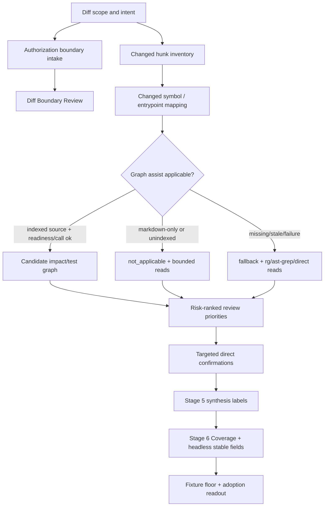

# feat: Strengthen spec-code-review boundary, graph impact, and eval harness

## Summary

本方案把 Superpowers 6.0 与 code-review-graph 的高价值机制吸收到 `spec-code-review`，但把当前可执行范围收敛为 **Phase A implementation plan with roadmap appendix**：首批只改 review-only 能力，包括 Diff Boundary Review、Graph-Assisted Impact Review、diff hunk 到 changed symbol 的降级映射、risk-ranked review priorities、test gaps 一等 Coverage、report/headless 稳定字段，以及 R-30 的最小 fixture/adoption floor。

Phase B/C/D 保留为 roadmap anchors，不作为本计划当前 Implementation Units。这样能让首批交付补上“完整 diff 视角 + 影响面候选 + 不伪造 clean”的审查质量短板，同时避免把 Expected Touch Set、progress ledger 或完整 eval harness 偷偷并入 Phase A。其中 Graph-Assisted Impact Review 的 impact 质量取决于 provider 就绪度:provider 不可用时按 fallback/consumption 契约降级(见 Success Metrics),Phase A 不因此声称已交付跨源影响面能力。

---

## Decision Brief

- **Recommended approach:** 首批扩展 `skills/spec-code-review/**`、review output template、leaf reviewer prompt references、eval examples/fixtures 和聚焦 tests；不先修改 `spec-plan`、`spec-work`、task-pack schema、progress ledger 或新增 public workflow。
- **Key decisions:** `finding_type` 首轮由 Stage 5 synthesis 派生，不直接改 `findings-schema.json`；`scope_boundary`、`authorized_scope_source`、`graph_assist`、`test_gaps` 等先进入 Stage 6 Coverage 与 report/headless 稳定字段块；code-graph/codegraph 只做 `provider_untrusted` candidate，confirmed finding 必须回到 diff/source/test/log/contract。
- **Validation focus:** Phase A completion 只能声明“review contract floor + 最小 fixture/adoption readout 已建立”，不能声明跨模型、跨 diff 类型的稳定行为已经证明。R-30 的 100%/zero/no-noise 指标在 Phase A 中以 fixture intent、must-find/must-not-find、Coverage signal 和 pilot readout 证明；可重复 scorecard 与 trial stability 属于 Phase D。
- **Largest risks / boundaries:** 不把 graph 变成确定性 TIA/coverage/ownership provider；不新增第二套 graph evidence schema；不让 prose anchor tests 冒充实际 reviewer 行为证明；不把 Phase B/C/D 的 roadmap anchors 当成本轮实现单元。

---

## Problem Frame

origin 文档指出，当前 `spec-code-review` 已有多 persona、confidence gate、Stage 5b validator、Coverage、summary-first handoff 和 `autofix_class` 骨架，但还缺少两个关键能力：一是把“改了不该改的东西”作为一等审查轴；二是对 shared helper、public API、workflow、contract、source/runtime 等高影响 diff，有调用链、依赖链、affected-test 候选和 test gap 视角。

Superpowers 6.0 实测中，质量提升来自 reviewer 读取完整 diff 和 review package，而不是更多 persona 本身。code-review-graph 提供了可借鉴的方法：从 diff hunk 映射 changed symbols，按风险排序 review priority，再 minimal-first 扩展 callers/flows/source snippets 和 test gaps。spec-first 的落地必须保留自己的角色契约：脚本准备事实，LLM/reviewer 做语义判断；provider 输出只能缩小下一步读取范围，不能直接证明 finding。

本计划从一个 degraded checkpoint PRD 进入 planning：origin frontmatter 标记 `can_enter_spec_plan: no`，receipt verifier 返回 `origin_verification_status: degraded`。用户本次明确要求输出 deep 技术方案并执行多 agent 文档审查，因此本方案按 owner override 继续；该 override 只授权继续规划，不等于 owner 已确认所有字段落点、eval floor 或 roadmap 决策。相关高反转成本问题在实现前仍需 preflight 确认或按本计划的保守默认执行。

---

## Requirements

> 说明:本文档正文引用的 `R-xx`(带连字符)沿用 origin PRD 2026-06-30-004 的需求编号;本 plan 自身的需求命名空间为 `R1`–`R17`(不带连字符)。

- R1. Phase A 必须增加 Diff Boundary Review 轴，检查 diff 是否超出任务/计划/声明授权边界；无 explicit touch set 时不得输出 `scope_boundary=clean`。
- R2. Phase A 必须输出 `scope_boundary: clean | concern | violation | unknown` 及依据等级：`explicit-touch-set`、`declared-files-only`、`inferred-plan`、`diff-only`、`unknown`。
- R3. Phase A 必须支持 `finding_type` 的首轮映射，至少覆盖 `scope_creep`、`unauthorized_file_change`、`unverifiable_claim`、`missing_verification`，且高置信 scope-boundary finding 不被 Stage 5 soft-bucket 静默吞掉。
- R4. Phase A 必须明确 reviewer 不信任 implementer report；执行者声明只能作为 claim source，必须回到 diff/source/test/log/contract 验证。
- R5. Phase A 必须实现 Graph-Assisted Impact Review 的触发、降级、预算和 Coverage；Graph provider missing/unknown/stale/failure 只能导致 fallback，不能阻断 review 或制造 confirmed finding。
- R6. Graph output 必须分层为 candidate evidence：`changed_symbols`、`changed_entrypoints`、`changed_contracts`、`impact_chain_candidates`、`blast_radius_candidates`、`affected_test_candidates`、`caller_callee_paths`、`review_priority_candidates`、`test_gaps`、`limitations`。
- R7. 任何 graph/blast-radius 相关 confirmed finding 必须有 direct confirmation；codegraph relationship edge、risk score、caller count 或 affected-test candidate 不能单独支撑 P0/P1 finding、severity、confidence 或 merge readiness。
- R8. Phase A 必须采用 minimal-first expansion：默认最多 5 个 high-impact symbols/entrypoints，候选预算受限，只有 medium/high risk、test gap、public/contract/source-runtime、security/permission 或 owner-requested 时扩展 callers/flows/source snippets。
- R9. `test_gaps` 必须是一等 Coverage 信号，不只出现在 recommendations prose。
- R10. Phase A adoption gates 必须覆盖 R-30 的最小 floor：scope creep、graph false elevation、clean diff noise、fallback/not-applicable、symbol mapping、priority ordering、test gap、minimal expansion、pilot evidence 边界。
- R11. Phase A 必须为 report-only/headless 定义稳定字段位置；若某字段只做人类可读展示，必须禁止 downstream-consumption gate 依赖它。
- R12. Phase A 必须把实际 leaf reviewer prompt/catalog surfaces 纳入修改决策：`subagent-template.md`、`diff-scope.md`、`persona-catalog.md` 必须读取并修改或显式记录保持不变的依据。
- R13. Phase A 必须产生用户可感知 adoption readout 或 golden report 示例，展示 scope violation、unknown boundary、graph fallback/rejected candidate、test gap 和 pilot limitation 的最终呈现。
- R14. Phase B 必须规划 Expected Touch Set、low-risk unified reviewer lens 与 per-task review package，但不阻塞 Phase A；优先复用 `artifact-summary.v1`、`context-bundle.v1` 和现有 review/headless envelope。
- R15. Phase C 必须规划 Pre-Flight Plan Review 与 long-running work recovery evidence，但 progress ledger 不能成为 approval state、scope authority 或完成证明。
- R16. Phase D 必须规划 `spec-code-review` 自身 eval harness：case corpus、deterministic scorecard、durable eval trace、trial/pass^k stability、bad-case regression、rubric/human calibration 后置边界。
- R17. 所有实现必须修改 source-of-truth，不手改 `.claude/**`、`.codex/**`、`.agents/skills/**` generated runtime mirrors；需要 runtime 刷新时由 `spec-first init` 投射。

**Origin acceptance examples:** AE-01 through AE-26 are preserved as scenario coverage. Phase A directly covers AE-01 through AE-04, AE-10 through AE-22, and the Phase A portion of AE-23/AE-24. AE-08 low-risk unified reviewer lens moves to Phase B roadmap with Expected Touch Set/per-task review package. Phase C covers AE-06/AE-07. Phase D covers AE-23 through AE-26 beyond the Phase A fixture floor.

---

## Assumptions

- A1. Owner override allows planning from the checkpoint PRD despite `can_enter_spec_plan: no`; degraded receipt status stays visible and does not become `verified`.
- A2. Phase A defaults are planning defaults pending owner confirmation: derived `finding_type`, Stage 6 Coverage/headless stable field block, no immediate `findings-schema.json` change, graph candidate fields as Coverage first.
- A3. Current `codegraph` support is strongest for indexed JS source such as `src/cli/**`; Markdown skill/doc prose remains bounded direct read / `rg` territory and should emit `not_applicable(markdown-only-diff)` rather than failed graph assist.
- A4. Phase D can start as internal harness/scripts/tests, not as a new public `$spec-code-review-eval` workflow or dashboard.
- A5. A single `graph_assist: used` sample proves provider path integration only for that sample; it does not prove graph impact quality across all source surfaces.

---

## Scope Boundaries

- Phase A does not directly edit `spec-plan`, task-pack generation, `spec-work` review gate, or progress ledger.
- Phase A does not add a new reviewer persona by default and does not merge all persona into one unified reviewer.
- Phase A does not modify `findings-schema.json` unless implementation proves Stage 5/6 derived fields cannot satisfy report/headless needs without breaking consumers.
- Phase A may modify `subagent-template.md`, `diff-scope.md`, and `persona-catalog.md` only when the new boundary/graph/test-gap behavior must enter leaf reviewer execution or selection; otherwise it must document why orchestrator-only wording is sufficient.
- No implementation may read raw `graphify-out/graph.json`, dump project graph artifacts into reviewer context, or treat project-graph/code-graph candidates as confirmed evidence.
- No script may semantically decide whether scope creep is real; scripts/helpers may prepare changed files, diff hunks, candidate touch-set matches, provider readiness, query output, reason codes, and budgets.

### Deferred to Follow-Up Work

- Phase B: Expected Touch Set in plans/task packs, low-risk unified reviewer lens, and per-task review package handoff from `spec-work`.
- Phase C: Pre-Flight Plan Review and recoverable task-state/progress evidence for long-running `spec-work`.
- Phase D: Full eval harness beyond R-30 Phase A adoption gates, including corpus/scorecard/trace/stability/bad-case regression and rubric/human calibration.
- Schema upgrades: promote `finding_type`, `scope_boundary`, graph candidates, `review_priority_candidates`, `changed_symbols`, or `test_gaps` to stable reviewer-return schema only after Phase A report/headless trials prove downstream need.

---

## Completion Criteria

- Phase A can be marked completed only when U1-U5 are implemented or explicitly superseded inside `spec-code-review` source surfaces, with no unplanned edits to Phase B/C/D owners.
- Phase A must have focused contract tests for prompt/template/output field anchors, plus a minimal source-owned fixture contract covering `diff_or_input`, `expected_scope_boundary`, `authorized_scope_source`, `must_find`, `must_not_find`, `expected_coverage_signals`, `expected_graph_assist`, `expected_reason_code`, `expected_symbol_mapping`, `expected_test_gaps`, and `limitations`.
- Phase A must have at least one fresh-source reviewer simulation or deterministic report fixture that checks must-find, must-not-find, and Coverage signal outcomes against current disk source. If runtime dispatch is unavailable, record `dispatch_authorization_missing` or equivalent and downgrade the claim to contract floor only.
- Phase A must include a user-visible adoption readout under `docs/validation/spec-code-review/` or an equivalent source-owned validation path, using 2-3 real or representative diffs. The readout must record before/after report snippets, scope-boundary usefulness, graph/test-gap usefulness, false positive/noise, fallback honesty, and cost/time notes.
- Phase A cannot claim durable graph impact capability, reviewer stability, or no-noise behavior from a single sample. Those claims require Phase D scorecard/trial evidence.
- The overall spec chain is not complete while Phase B/C/D remain roadmap anchors. Phase A completion means the first review-only slice is shippable with explicit limitations, not that the full origin roadmap is done.

---

## Direct Evidence Readiness

- target_repo: `spec-first`
- evidence_sources: direct source reads, `rg`, Codegraph for indexed JS source, Graphify query as advisory navigation, PRD receipt verifier, git status, task-governance-signals helper, multi-agent document review
- source_refs:
  - `docs/brainstorms/2026-06-30-004-spec-code-review-superpowers60-integration-requirements.md`
  - `docs/10-prompt/结构化项目角色契约.md`
  - `skills/spec-code-review/SKILL.md`
  - `skills/spec-code-review/references/subagent-template.md`
  - `skills/spec-code-review/references/diff-scope.md`
  - `skills/spec-code-review/references/persona-catalog.md`
  - `skills/spec-code-review/references/findings-schema.json`
  - `skills/spec-code-review/references/review-output-template.md`
  - `skills/spec-code-review/evals/examples.json`
  - `docs/contracts/workflows/eval-fixture-contract.md`
  - `docs/contracts/project-graph-consumption.md`
  - `tests/unit/spec-code-review-contracts.test.js`
  - `tests/unit/project-graph-consumption-contracts.test.js`
  - `src/cli/helpers/setup-facts.js`
- current_revision: `b9ccc9bb`
- worktree_status: dirty before this plan; existing unrelated modifications include `CHANGELOG.md`, the origin requirements doc, spec-compound/spec-prd files, and untracked validation/brainstorm assets. This plan must not revert or normalize those changes.
- confidence: high for current source boundaries and Phase A implementation surface; medium for final machine-readable field placement because origin owner decisions remain degraded/unverified.
- limitations: Graphify query returned broad low-signal navigation for this specific topic; Codegraph was useful for indexed JS setup facts but not for Markdown skill/doc source. No implementation tests were run because this workflow is planning-only.

---

## Direct Evidence

- repo_scope: single repo `spec-first`
- source_reads_completed:
  - `skills/spec-plan/SKILL.md` and planning references for plan contract, markdown rendering, deepening, doc-review handoff, reuse analysis, and synthesis discipline.
  - `docs/10-prompt/结构化项目角色契约.md` for source/runtime, evidence, hard gate, and script-vs-LLM boundaries.
  - Origin requirements sections for requirements R-01 through R-41, AE-01 through AE-26, scope boundaries, producer/artifact/consumer, source-of-truth, planning recheck, success metrics, and outstanding questions.
  - `skills/spec-code-review/SKILL.md` sections for context orientation, capability-class boundary, Stage 2b plan discovery, Stage 3 reviewer selection/direct evidence routing, runtime readiness, Stage 5 merge/confidence gate, Stage 5b validator, and Stage 6 Coverage/report/headless output.
  - `skills/spec-code-review/references/findings-schema.json`, `review-output-template.md`, and available reviewer prompt/catalog references.
  - `skills/spec-code-review/evals/examples.json` and `docs/contracts/workflows/eval-fixture-contract.md`.
  - `docs/contracts/project-graph-consumption.md` and its tests.
  - `tests/unit/spec-code-review-contracts.test.js` for current contract-test patterns.
- source_reads_required:
  - During implementation, re-read exact current `skills/spec-code-review/SKILL.md` sections before patching because the file may change in this dirty worktree.
  - Read `subagent-template.md`, `diff-scope.md`, and `persona-catalog.md` before each U1-U3 patch; decide per file whether to modify or document unchanged.
  - Read `skills/spec-code-review/evals/examples.json` before changing examples or adding eval cases.
  - Read `src/cli/contracts/**` only if Phase D creates a new eval trace/scorecard schema.
- commands_or_tools_used:
  - `node skills/spec-prd/scripts/finalize-prd-artifact.js ... --verify-receipt` returned degraded receipt with reason codes listed in frontmatter.
  - `spec-first internal task-governance-signals --source plan-declared --json` returned `candidate_level: deep` with `cross-module`, `critical-path-hit`, `keyword-hit`, and `candidate-deep`.
  - `git status --short` showed a dirty worktree before this plan.
  - `git rev-parse --short HEAD` returned `b9ccc9bb`.
  - `rg` located current spec-code-review/project-graph/test anchors.
  - Codegraph explored `setup-facts.js` and provider readiness normalization; Graphify query was low precision and is treated as navigation-only.
  - Multi-agent doc review ran with coherence, feasibility, scope-guardian, product-lens, and adversarial reviewers; accepted findings are integrated in this revision.
- impact_on_plan:
  - Confirms the plan should be Deep, but the active Implementation Units should be Phase A only.
  - Confirms provider readiness belongs to advisory facts/Coverage, not finding proof.
  - Confirms existing prose contract tests are useful but insufficient for R-30 behavior claims; Phase A needs minimal fixture/readout evidence.
  - Confirms leaf reviewer prompt/catalog surfaces must be in-scope for modification decisions, not only pre-read notes.
- limitations:
  - Receipt verification did not prove the PRD is planning-ready.
  - Multi-agent document review validates this plan artifact, not the future implementation.

---

## Context & Research

### Relevant Code and Patterns

- `skills/spec-code-review/SKILL.md` is the workflow source of truth for review stages, dispatch boundaries, Coverage, Stage 5 synthesis, Stage 5b validation, and headless output.
- `skills/spec-code-review/references/subagent-template.md` and `diff-scope.md` are part of the actual leaf reviewer execution context; Phase A behavior that reviewers must apply belongs there, not only in orchestrator prose.
- `skills/spec-code-review/references/persona-catalog.md` owns reviewer selection guidance; graph/scope trigger changes may require catalog updates or an explicit unchanged decision.
- `skills/spec-code-review/references/findings-schema.json` is the reviewer-return schema. It should remain stable in Phase A unless synthesis/report-only output proves insufficient.
- `skills/spec-code-review/references/review-output-template.md` owns interactive report shape and Coverage examples. It is the lowest-risk place to stabilize human-readable and headless-visible scope/graph Coverage headings.
- `docs/contracts/project-graph-consumption.md` owns candidate-only graph/provider trust rules. Phase A should reference and apply it rather than create a graph-specific evidence contract.
- `docs/contracts/workflows/eval-fixture-contract.md` allows source-owned structural fixtures but explicitly does not prove semantic quality or multi-trial behavior.
- `tests/unit/spec-code-review-contracts.test.js` already asserts many prose contracts by stable anchor strings. Phase A can extend this file and add minimal fixture validation, but must not present those assertions as full reviewer behavior proof.

### Institutional Learnings

- The role contract requires light contract, explicit boundaries, deterministic floor, and LLM semantic judgment. This directly rules out a script that decides scope creep or a graph provider that decides severity.
- Existing resource-governance-lens pattern shows how deterministic advisory facts can enter Coverage without blocking review or becoming reviewer judgment.
- Existing spec-prd and spec-code-review tests show a pattern for locking workflow prose and output templates with focused unit tests, then using fresh-source eval for skill behavior drift when semantics change.
- Ability that is only internally stronger is not enough; the plan needs adoption evidence so maintainers can identify, try, and evaluate the value.

### External References

- Superpowers SDD is advisory external evidence for file-based review package, full diff review, task reviewer distrust of implementer report, pre-flight plan review, and durable progress recovery.
- code-review-graph is advisory external evidence for diff hunk to symbol mapping, BFS impact radius, changed-area snippets, risk-ranked priorities, missing tests, and minimal-first expansion.
- The 2026-06-22 code-review eval report is advisory evidence that `spec-code-review` needs its own eval corpus, deterministic scorecard, durable trace, trial stability, and bad-case regression rather than relying on examples or single reviews.

---

## Existing Capability / Reuse Analysis

| Proposed surface | Decision | Rationale |
| --- | --- | --- |
| Diff Boundary Review | Extend `skills/spec-code-review/SKILL.md`, `diff-scope.md`, and output template | Stage 3/5/6 already own review focus, synthesis, and Coverage; diff-scope is the natural leaf-reviewer boundary reference. |
| Leaf reviewer prompt updates | Extend `subagent-template.md` / `diff-scope.md` when behavior must be applied by reviewers | Orchestrator-only prose cannot reliably change reviewer behavior when reviewer prompts are separately assembled. |
| Persona selection/catalog | Read and modify `persona-catalog.md` only if scope/graph triggers affect reviewer choice | Avoid unnecessary catalog churn, but require an explicit unchanged decision. |
| `finding_type` | Reuse Stage 5 synthesis first; defer reviewer-return schema upgrade | `findings-schema.json` is consumed by every reviewer and validator. A derived synthesis label satisfies Phase A reporting while avoiding premature schema churn. |
| `scope_boundary` / `authorized_scope_source` | Extend Stage 6 Coverage and report/headless stable field block | Coverage already owns direct evidence posture, limitations, suppressed findings, residual risks, and testing gaps. Stable names are needed for downstream readability without changing reviewer schema. |
| Graph-Assisted Impact Review | Extend direct evidence routing and Coverage while reusing `docs/contracts/project-graph-consumption.md` | The contract already defines candidate-only provider use. A separate graph evidence schema would violate origin R-14/R-28. |
| Phase A eval gates | Extend `skills/spec-code-review/evals/examples.json`, add minimal source-owned fixture contract if needed, and add focused tests/readout | Current examples are examples-as-context. Phase A needs a small deterministic floor without inventing the Phase D platform. |
| Adoption readout / golden report | Create source-owned validation readout and update report template examples | This is the user-visible proof that the workflow output improved, not just internal prose. |
| Phase D eval harness | Roadmap anchor with default producer/artifact choices; separate plan before implementation | A real corpus/scorecard/trace likely exceeds examples and should not be smuggled into Phase A. |
| Expected Touch Set / review package / progress ledger | Defer to existing `spec-plan`, `spec-work`, `artifact-summary.v1`, `context-bundle.v1`, and `spec-work-run-artifact/v2` extension decisions | These are Phase B/C surfaces and should not be introduced in Phase A unless review-only data proves the need. |

---

## Key Technical Decisions

- KTD1. **Ship Phase A as complete review-only, not a split core/graph fork.** The origin explicitly says graph assist, symbol mapping, priorities, test gaps, fallback, and R-30 gates are Phase A requirements. Treating graph as a later optional trial would preserve the current blast-radius blind spot.
- KTD2. **Use Stage 5/6 derived fields before reviewer-return schema changes, but make report/headless field names stable.** `finding_type` and `scope_boundary` are needed for user-visible and downstream-readable output. They do not need to enter `findings-schema.json` first, but they must have a stable location if any consumer is expected to read them.
- KTD3. **Anchor scope-boundary evidence in authorization source + diff hunk.** A scope finding needs both sides: what changed and why that change was outside the task/plan/declared scope. If authorization source is missing, the verdict is `unknown` or `concern`, not `clean`.
- KTD4. **Treat implementer reports as claims, never evidence.** Reviewer prompts and Stage 6 Coverage should name claim-vs-code-fact boundaries so “I did not touch X” is checked against full diff before review verdict.
- KTD5. **Graph assist is an exploration layer with a budget.** It may choose what to read first, but cannot decide root cause, ownership, affected tests, severity, confidence, or readiness. Query budget and minimal-first expansion are part of correctness, not just efficiency.
- KTD6. **Expose test gaps as Coverage, not prose recommendations.** Missing tests for high-risk changed symbols are downstream-relevant review facts. They must survive report/headless output even when no confirmed bug finding exists.
- KTD7. **Keep Phase A eval evidence small but executable.** Contract anchors alone prove wording exists; minimal fixture/readout evidence proves the new report path can express expected outcomes. Durable scorecard and trial stability remain Phase D.
- KTD8. **Runtime mirrors are generated outputs.** Implementation changes source `skills/`, `docs/`, `tests/`, and maybe `src/cli/` for later eval scripts, then uses `spec-first init` only if runtime projection needs refresh.

---

## Open Questions

### Planning Defaults Pending Owner Confirmation

- OQ-01. Phase A is review-only and excludes `spec-plan`/`spec-work`; Phase B/C carry broader handoff/recovery surfaces unless owner redirects before implementation.
- OQ-02. Reviewer JSON schema is not changed in Phase A; `finding_type` is Stage 5 synthesis-derived and report/headless-visible.
- OQ-03. `scope_boundary` lands first in Stage 6 Coverage/headless stable field block, alongside `authorized_scope_source`.
- OQ-08. Graph assist stays in Phase A, but `fallback` and `not_applicable` are valid first-class outcomes and do not prove graph impact capability.
- OQ-12. Phase D eval harness belongs in the complete roadmap but is not a Phase A blocker.

### Implementation Preflight Decisions

- OQ-09. Confirm whether report-only/headless must expose stable machine-readable fields for `finding_type`, `scope_boundary`, and `authorized_scope_source`; if not, explicitly mark them human-readable only and forbid downstream machine gates.
- OQ-10. Confirm whether Phase A completion requires fresh-source reviewer simulation. If unavailable, downgrade completion wording to contract floor + readout only.
- OQ-11. Confirm graph `used` minimum: at least one indexed JS sample should reach `graph_assist: used`; if provider is unavailable, Phase A must claim only graph consumption/fallback contract.
- OQ-13. Confirm Phase D default producer/artifact path before implementation: source corpus under `skills/spec-code-review/evals/cases/`, runner under `skills/spec-code-review/scripts/run-evals.js`, validation output under `docs/validation/spec-code-review/`, trace schema only when machine consumers appear.
- OQ-14. Rubric judge and human adjudication placement remain P2 calibration; do not add to Phase A gates.

### Deferred to Implementation

- OQ-15. Exact prose placement inside `subagent-template.md` vs `diff-scope.md`: decide after reading current prompt assembly boundaries.
- OQ-16. Exact minimal fixture representation: extend `examples.json` if it can carry multi-file diff/must-find/must-not-find/Coverage signals; otherwise create `tests/unit/fixtures/spec-code-review-phase-a/` with a small local fixture contract.

---

## High-Level Technical Design

> 这张图只表达预期方案形状，供审查方向使用；实现 agent 应把它当作上下文，不应照抄成代码。

关键边界在 `G/J` 与 `K` 之间：graph/risk/test candidates 可以改变 reviewer 优先读什么，但只有 `K` 能支撑 confirmed findings。

---

## Phase A Output Contracts

### Report / Headless Stable Fields

Phase A 不必修改 `findings-schema.json`，但 report-only/headless 输出必须有稳定命名位置。最低字段如下：

| Field | Owner | Phase A status | Consumer rule |
| --- | --- | --- | --- |
| `finding_type` | Stage 5 synthesis | derived | 可用于报告分组；若不在结构化块中，不得作为 downstream machine gate。 |
| `scope_boundary` | Stage 6 Coverage/headless summary | stable field | 可取 `clean`、`concern`、`violation`、`unknown`。 |
| `authorized_scope_source` | Stage 6 Coverage/headless summary | stable field | 必须写 `explicit-touch-set`、`declared-files-only`、`inferred-plan`、`diff-only` 或 `unknown`。 |
| `graph_assist` | Stage 6 Coverage/headless summary | stable field | 可取 `used`、`fallback`、`not_applicable`。 |
| `graph_reason_code` | Stage 6 Coverage/headless summary | stable field | 用于解释 fallback/not_applicable/used-with-limitations。 |
| `changed_symbols` / `review_priority_candidates` | Stage 6 Coverage | candidate list | 只做 review orientation；不得决定 severity/confidence。 |
| `test_gaps` | Stage 6 Coverage/headless summary | stable field | 记录 affected-test candidates、missing confirmation 和 limitations。 |

### Graph Degradation Classification

| Situation | `graph_assist` | `graph_reason_code` | Required fallback posture |
| --- | --- | --- | --- |
| Markdown-only diff | `not_applicable` | `markdown-only-diff` | 使用 bounded direct reads / `rg`，不得算 provider failure。 |
| Unindexed source or unsupported language | `not_applicable` | `unindexed-diff` or `unsupported-language` | 使用 file-level seed、bounded reads 和 limitations。 |
| Provider command/tool missing | `fallback` | `provider_missing` | 记录 readiness limitation，review 继续。 |
| Setup facts missing or readiness unknown | `fallback` | `readiness_unknown` | 可尝试 runtime call；不能把 unknown 当 ready。 |
| Provider index stale | `fallback` | `provider_stale` | 不用 stale graph 支撑 candidate；改用 direct evidence path。 |
| Runtime call failure | `fallback` | `runtime_call_failure` | 记录 error class/reason，review 继续。 |
| Provider call succeeds but no useful edges | `used` | `no_candidates` | 记录 rejected/no-candidate result，不升格成 finding。 |
| Provider call succeeds with candidates | `used` | `candidate_results` | 候选必须经 direct confirmation 后才能支撑 finding。 |

---

## Phased Delivery

### Phase A: Review-Only Boundary + Graph + Eval Floor

- **A1 Boundary/report fields:** deliver `scope_boundary`, `authorized_scope_source`, derived `finding_type`, claim-source distrust, and stable report/headless field placement.
- **A2 Graph applicability/fallback/candidates:** deliver graph trigger rules, degradation classification, candidate buckets, provider trust boundary, and minimal-first budget.
- **A3 Symbol/priority/test gaps:** deliver degraded symbol mapping, review priority candidates, and `test_gaps` as first-class Coverage.
- **A4 Fixture/readout closeout:** deliver minimal fixture contract, fresh-source simulation or deterministic report fixture, golden report/adoption readout, and Phase A limitation wording.

Each wave can be reviewed independently, but Phase A is only complete after A1-A4 are all present. None of the waves may edit `spec-plan`, `spec-work`, task-pack schemas, progress ledger, or public workflow entrypoints.

### Phase B: Boundary Handoff Between Plan/Work/Review

- Add Expected Touch Set guidance to plan/task-pack or review handoff surfaces.
- Add AE-08 low-risk unified reviewer lens only after Phase A report fields prove useful.
- Standardize per-task review package as paths-first handoff using existing summary/context contracts.

### Phase C: Pre-Flight and Recovery Evidence

- Add lightweight Pre-Flight Plan Review at the most appropriate owner surface after Phase A/B evidence.
- Add long-running work recovery evidence without making progress ledger a source-of-truth or approval state.

### Phase D: Durable `spec-code-review` Eval Harness

- Build eval corpus, deterministic scorecard, durable trace, trial stability, bad-case regression loop, and later semantic calibration.
- Keep deterministic scorecard failures dominant over token/cost improvement, LLM judge scores, or one-off human approval.

### Phase A to Phase D Bridge

Start the smallest Phase D scorecard/trace slice early if Phase A pilot/readout finds any of these signals: P1/P2 miss in a representative case, new P1/P2 noise on clean diff, graph candidate accidentally elevated into confirmed finding, headless/report-only consumer needs machine fields, or maintainers want external adoption claims beyond “pilot evidence”.

---

## Implementation Units

### U1. Phase A boundary verdict and report fields

**Goal:** Add Diff Boundary Review as a first-class `spec-code-review` axis and expose `scope_boundary`, `authorized_scope_source`, and derived `finding_type` without immediately changing reviewer JSON schema.

**Requirements:** R1, R2, R3, R4, R11, R12, R17

**Dependencies:** None

**Files:**
- Modify: `skills/spec-code-review/SKILL.md`
- Modify or explicitly confirm unchanged: `skills/spec-code-review/references/subagent-template.md`
- Modify or explicitly confirm unchanged: `skills/spec-code-review/references/diff-scope.md`
- Modify: `skills/spec-code-review/references/review-output-template.md`
- Modify: `skills/spec-code-review/evals/examples.json`
- Test: `tests/unit/spec-code-review-contracts.test.js`

**Approach:**
- Add Stage 2/3 intake language that distinguishes scope authority (`plan:`, task/work artifact, declared files, explicit touch set when present) from implementer claims.
- Put claim-source distrust and scope authority rules into leaf reviewer context when reviewers must apply them directly.
- Add Stage 5 synthesis rule for derived `finding_type` and a carve-out that high-confidence scope-boundary findings cannot be mode-aware-demoted into generic soft buckets.
- Add Stage 6 Coverage/headless stable fields for `scope_boundary`, `authorized_scope_source`, and `finding_type`, including the explicit rule that missing authorization cannot produce `clean`.
- Keep `findings-schema.json` unchanged in Phase A unless implementation finds no defensible way to pass labels through synthesis/report/headless output.

**Execution note:** Start with tests that fail on missing stable field names, missing “implementer report is claim source” wording, and missing no-clean-without-authority rule.

**Patterns to follow:**
- Existing Stage 5 confidence-gate and mode-aware demotion text in `skills/spec-code-review/SKILL.md`.
- Existing Coverage format in `skills/spec-code-review/references/review-output-template.md`.
- Existing diff scope and subagent prompt assembly references.

**Test scenarios:**
- Happy path: explicit touch set permits changed test companion file; Coverage can report `scope_boundary=clean` or `concern` with rationale, no violation.
- Edge case: no plan/touch-set/declaration available; Coverage reports `scope_boundary=unknown` or `concern`, never `clean`.
- Error path: implementer report claims no out-of-scope files but diff shows an unrelated delete; derived `finding_type=scope_creep` or `unauthorized_file_change` survives Stage 5 and reaches user-facing report.
- Integration: report-only/headless templates include boundary verdict and basis without requiring `findings-schema.json` changes.

**Verification:**
- Contract tests pin Stage 5/6 language, Coverage/headless field names, and schema non-upgrade boundary.
- `git diff --check` passes for touched files.

---

### U2. Phase A graph-assisted impact coverage

**Goal:** Add Graph-Assisted Impact Review triggers, applicability, fallback, provider trust language, candidate buckets, degradation reason codes, and query budget to `spec-code-review`.

**Requirements:** R5, R6, R7, R8, R11, R12, R17

**Dependencies:** U1

**Files:**
- Modify: `skills/spec-code-review/SKILL.md`
- Modify or explicitly confirm unchanged: `skills/spec-code-review/references/subagent-template.md`
- Modify or explicitly confirm unchanged: `skills/spec-code-review/references/diff-scope.md`
- Modify or explicitly confirm unchanged: `skills/spec-code-review/references/persona-catalog.md`
- Modify: `skills/spec-code-review/references/review-output-template.md`
- Modify: `skills/spec-code-review/evals/examples.json`
- Test: `tests/unit/spec-code-review-contracts.test.js`
- Test: `tests/unit/project-graph-consumption-contracts.test.js` only if contract wording changes

**Approach:**
- Extend Stage 3 direct evidence routing candidates with graph-assist trigger language for shared helper, public/exported API, route/tool/schema, workflow entrypoint, source/runtime generation, permissions/security, migration, and cross-module dependency.
- Add the degradation classification table to workflow/report contracts and keep reason codes stable enough for tests.
- Add candidate buckets and Coverage fields: changed symbols/entrypoints/contracts, impact/blast/test candidates, accepted/rejected candidates, direct confirmations, provider readiness/freshness, query shape, fallback reason, and limitations.
- Add budget rules from R-29 and minimal-first expansion from R-33.
- Reuse `docs/contracts/project-graph-consumption.md`; do not add graph evidence schema.
- Require at least one representative indexed JS sample or deterministic fixture to exercise `graph_assist: used`; if provider is unavailable, state that Phase A only proves fallback/consumption contract.

**Execution note:** Keep graph wording provider-neutral in workflow prose where possible. Provider-specific examples may mention native codegraph/code-graph surfaces only where they are examples, not workflow contract requirements.

**Patterns to follow:**
- `docs/contracts/project-graph-consumption.md` candidate-only, fallback, no raw graph, and relay-chain language.
- Resource advisory Coverage pattern in Stage 6.
- Stage 3 direct evidence routing candidates in current `spec-code-review`.

**Test scenarios:**
- Happy path: JS shared helper diff reaches `graph_assist=used`, outputs candidate buckets, then finding requires direct source/test/contract confirmation.
- Edge case: Markdown-only skill prose diff records `not_applicable(markdown-only-diff)` and uses bounded direct reads / `rg`.
- Error path: provider readiness unknown or runtime call fails records `graph_assist=fallback`, reason, and alternative evidence path; review continues.
- Integration: low-risk private helper diff with no public/test-gap signal stays minimal and does not expand full callers/flows/source snippets.

**Verification:**
- Contract tests assert no raw graph dump, no skip-layer elevation, degradation reason codes, candidate bucket names, and query budget anchors.
- Existing project-graph consumption tests remain green.

---

### U3. Phase A symbol mapping, review priorities, and test gaps

**Goal:** Define how `spec-code-review` maps changed hunks to review seeds, ranks review priorities, and records test gaps as first-class Coverage.

**Requirements:** R6, R8, R9, R10, R11, R12, R17

**Dependencies:** U2

**Files:**
- Modify: `skills/spec-code-review/SKILL.md`
- Modify or explicitly confirm unchanged: `skills/spec-code-review/references/subagent-template.md`
- Modify or explicitly confirm unchanged: `skills/spec-code-review/references/diff-scope.md`
- Modify or explicitly confirm unchanged: `skills/spec-code-review/references/persona-catalog.md`
- Modify: `skills/spec-code-review/references/review-output-template.md`
- Modify: `skills/spec-code-review/evals/examples.json`
- Test: `tests/unit/spec-code-review-contracts.test.js`

**Approach:**
- Add a Phase A mapping contract: first try changed line ranges to symbol/entrypoint/contract candidates; if unavailable, fall back to file-level seed and mark `symbol_mapping=degraded`.
- Define `review_priority_candidates` as advisory ordering only. Include reasons such as public/shared/entrypoint/contract/source-runtime, caller/dependent count, affected flow, test gap, and security/permission signal.
- Define `test_gaps` fields in Coverage: `affected_test_candidates`, `tests_for_query_result`, `missing_test_confirmation`, and limitations.
- Make it explicit in reviewer context and report template that priority/risk score cannot decide severity, confidence, finding existence, or merge gate.

**Execution note:** Avoid committing to exact parsing implementation in prose. The first implementation may use bounded `rg`/ast-grep/source reads where graph symbol mapping is unavailable.

**Patterns to follow:**
- Existing Stage 3 file-type awareness and direct evidence target language.
- Current `testing_gaps` soft bucket in Stage 5, extended rather than replaced.

**Test scenarios:**
- Happy path: changed hunk maps to one exported function; Coverage records `changed_symbols` and priority reason.
- Edge case: large file changed but symbol cannot be confidently mapped; Coverage records `symbol_mapping=degraded` and file-level fallback.
- Error path: graph returns affected-test candidate but source/test confirmation is missing; Coverage records `missing_test_confirmation`; no P0/P1 finding is created solely from the candidate.
- Integration: shared/public/contract/source-runtime/test-gap candidates rank before local private helpers in `review_priority_candidates`.

**Verification:**
- Contract tests assert the presence of symbol mapping, degraded fallback, priority-not-severity boundary, and first-class test gap fields.

---

### U4. Phase A adoption gates and fixture floor

**Goal:** Convert R-30 into focused Phase A fixture/contract coverage so quality cannot be claimed from token reduction, a single review, or partial scope-only success.

**Requirements:** R10, R11, R17

**Dependencies:** U1, U2, U3

**Files:**
- Modify: `skills/spec-code-review/evals/examples.json`
- Modify: `tests/unit/spec-code-review-contracts.test.js`
- Create: `tests/unit/fixtures/spec-code-review-phase-a/` only if existing examples cannot express multi-file diff, must-find/must-not-find, or Coverage signal expectations
- Test: `tests/unit/spec-code-review-contracts.test.js`

**Approach:**
- First try to extend `skills/spec-code-review/evals/examples.json` with local `extensions.phase_a_expectations`; create a new fixture directory only if examples cannot carry the needed structure.
- Minimal fixture contract must cover `diff_or_input`, `expected_scope_boundary`, `authorized_scope_source`, `must_find`, `must_not_find`, `expected_coverage_signals`, `expected_graph_assist`, `expected_reason_code`, `expected_symbol_mapping`, `expected_test_gaps`, and `limitations`.
- Add or strengthen fixtures for scope creep, graph false elevation, clean diff noise, fallback/not-applicable, symbol mapping/degraded, priority ordering, test gap, minimal expansion, and pilot-evidence boundary.
- Add explicit anti-Goodhart language: cost/token improvements are secondary and cannot offset critical misses.
- Keep this as Phase A precursor to R13, not the full Phase D scorecard/trace platform.

**Execution note:** New fixtures must be minimal and source-owned. Do not introduce provider dependency, generated trace schema, large synthetic repos, or a scorecard runner in U4.

**Patterns to follow:**
- `skills/spec-code-review/evals/examples.json` examples-as-context boundary.
- `docs/contracts/workflows/eval-fixture-contract.md` structural fixture rules and limitation language.
- Existing Jest contract tests for workflow prose and templates.

**Test scenarios:**
- Happy path: scope creep fixture expectation requires user-visible violation.
- Edge case: clean diff fixture expectation disallows new P1/P2 noise.
- Error path: graph false elevation fixture expectation disallows P0/P1 finding without direct confirmation.
- Integration: fallback/not-applicable fixture expectation requires honest Coverage signal and reason code.

**Verification:**
- Focused Jest tests pass and fail if minimal fixture expectations or R-30 anchors are removed.
- No new test depends on actual provider availability unless explicitly marked as pilot/provider-readiness evidence.

---

### U5. Phase A adoption readout and golden report

**Goal:** Make Phase A value user-visible before handoff by producing a small adoption readout and report example that show how the new signals change review output.

**Requirements:** R13, R17

**Dependencies:** U1, U2, U3, U4

**Files:**
- Create: `docs/validation/spec-code-review/phase-a-boundary-graph-readout.md` or equivalent validation artifact
- Modify: `skills/spec-code-review/references/review-output-template.md`
- Modify: `skills/spec-code-review/evals/examples.json` if a golden report example belongs with examples
- Test: `tests/unit/spec-code-review-contracts.test.js`

**Approach:**
- Select 2-3 real or representative diffs covering boundary violation/unknown, graph fallback or used-with-candidates, rejected candidate, and test gap.
- Record before/after report snippets or compact summaries, including whether scope-boundary appeared earlier, whether graph/test-gap candidates helped evidence targeting, where fallback was honest, and where noise/false positives remained.
- Update the output template or golden example so users can see `scope_boundary`, `authorized_scope_source`, `graph_assist`, rejected candidates, and `test_gaps` in final report form.
- Keep the readout labeled pilot evidence. It supports adoption evaluation; it does not certify durable reviewer quality.

**Execution note:** If fresh-source reviewer simulation cannot run due to host dispatch limits, the readout should say so and use deterministic report fixture output instead.

**Patterns to follow:**
- Existing docs/validation artifacts for source-owned verification records.
- Existing review output template Coverage examples.

**Test scenarios:**
- Happy path: readout includes at least one sample where the new scope-boundary signal changes the review summary.
- Edge case: graph not applicable/fallback sample still reads as useful rather than as a hidden failure.
- Error path: sample with candidate but no direct confirmation shows rejected/limited candidate instead of confirmed finding.
- Integration: golden report example remains consistent with Stage 6 Coverage/headless stable field names.

**Verification:**
- Contract tests lock required output-template field labels.
- Validation readout path is referenced from the changelog entry for the implementation.

---

## Roadmap Anchors / Follow-Up Design Notes

### Phase B Boundary Handoff

**Purpose:** Strengthen future boundary review inputs by adding Expected Touch Set, AE-08 low-risk unified reviewer lens, and per-task review package handoff.

**Default shape:** Expected Touch Set starts as a recommended field, not universally required. Per-task review package carries task id, source plan, expected touch set, actual changed files, verification summary, review focus, full diff path/range, and known limitations. Use paths-first handoff and existing summary/context contracts before adding schema.

**Not Phase A:** Do not modify `skills/spec-plan/**`, `skills/spec-work/**`, task-pack schemas, or progress ledger during Phase A to satisfy this anchor.

### Phase C Pre-Flight and Recovery Evidence

**Purpose:** Add a semantic Pre-Flight Plan Review and recoverable task-state evidence without creating a state machine or second source-of-truth.

**Default shape:** Pre-flight checks contradictions, source/runtime violations, interface mismatch, verification gaps, oversized tasks, ambiguous boundary, and likely review blockers. Recovery evidence helps resume and locate diff/review/verification state, but completion still requires git diff, review result, and verification evidence.

**Not Phase A:** No progress ledger authority, no plan progress checkboxes, and no claim that recovery state proves completion.

### Phase D Deterministic Eval Harness

**Purpose:** Turn Phase A prompt/report changes into repeatable quality evidence.

**Default producer and artifact boundary:** Source corpus under `skills/spec-code-review/evals/cases/`; runner under `skills/spec-code-review/scripts/run-evals.js` if existing eval scripts cannot be extended; durable scorecard/readout output under `docs/validation/spec-code-review/`; machine-readable trace schema under `docs/contracts/workflows/spec-code-review-eval-trace.schema.json` only when a downstream consumer exists.

**Scorecard focus:** schema/format, scope/base, expected finding hit, critical miss, false positive, route/severity/autofix owner, evidence completeness, fallback honesty, graph false elevation, and cost budget. Trial N/pass^k and rubric/human calibration follow only after deterministic floor is useful.

---

## System-Wide Impact

- **Review workflow:** Phase A changes `spec-code-review` reviewer focus, leaf reviewer context where needed, Stage 5 synthesis, Stage 6 Coverage, and headless/report-only output wording. It should not change mutation permissions or autofix routing beyond preserving scope-boundary findings.
- **Contracts:** `project-graph-consumption.v1` remains the trust boundary. Any change to graph contract must keep candidate-only, fallback, no raw graph, and existing evidence-field reuse semantics.
- **Downstream consumers:** `spec-work`, PR prep, tracker defer, and human reviewers may see new Coverage fields. They may rely only on stable report/headless fields, not prose-only recommendations.
- **Tests/evals:** Phase A adds contract/eval/readout floor but not a full eval harness. Phase D is the durable evaluation layer.
- **Source/runtime:** Source changes live in `skills/`, `docs/`, `tests/`, and maybe `src/cli/` for later eval scripts. Runtime mirrors are regenerated, not hand-edited.
- **Unchanged invariants:** `confidence` anchors remain discrete; `autofix_class` still routes action ownership; Stage 5b validator still independently verifies externalized findings; external-tool fallback remains non-blocking.

---

## Risks & Dependencies

| Risk | Mitigation |
| --- | --- |
| Scope boundary review over-flags legitimate companion changes | Require authorization source + diff hunk + necessity reasoning; allow `concern` and “accept as necessary with evidence” rather than only revert. |
| Missing touch set causes false clean verdict | Explicitly require `unknown`/`concern` when basis is `diff-only` or `unknown`; add basis-layered fixture expectations. |
| Stable fields are prose-only and downstream cannot read them | Define report/headless stable field names and add consumer-facing tests; if not machine-readable, forbid downstream machine gates. |
| Graph candidates become fake confirmed findings | Reuse `project-graph-consumption.v1`; require direct confirmation for conclusion-tier claims; add graph false elevation fixture. |
| Graph assist never exercises `used` path | Require at least one indexed JS representative sample or downgrade graph claim to fallback/consumption contract. |
| Graph assist bloats reviewer context | Enforce R-29/R-33 budgets and minimal-first expansion. |
| Markdown-heavy spec-first diffs make graph look broken | Treat Markdown/unindexed diff as `not_applicable`, not failure; use bounded direct reads and `rg`. |
| Premature schema upgrade breaks reviewer/validator consumers | Start with Stage 5/6 derived labels; upgrade only with consumer tests. |
| Contract-string tests create fake confidence | Add fixture expectations, fresh-source simulation or deterministic report fixture, and adoption readout; reserve durable stability for Phase D. |
| Plan derived from degraded PRD misses owner intent | Preserve degraded receipt status, list implementation preflight decisions, and keep Phase A claims conservative. |

---

## Alternative Approaches Considered

- **Directly add `finding_type` and graph fields to `findings-schema.json` in Phase A.** Rejected for first pass because it forces all persona prompts, validators, headless/autofix consumers, and tests to move before report semantics are proven.
- **Expose only human-readable Coverage with no stable field names.** Rejected because origin R-16 and downstream consumers need readable fields; prose-only output cannot satisfy machine-consumption gates.
- **Create a separate graph evidence schema.** Rejected because `project-graph-consumption.v1` explicitly says to reuse existing evidence fields and not create graph-specific evidence enums.
- **Make Phase A only Diff Boundary and push graph to Phase B.** Rejected because the origin explicitly corrected this: graph assist, symbol mapping, priorities, test gaps, fallback/eval, and R-30 gates are all complete Phase A requirements.
- **Implement Expected Touch Set and per-task review package in the same first PR.** Rejected for blast radius. It would touch `spec-plan`, `spec-work`, task-pack/contract consumers, and review behavior at once.
- **Add LLM judge/human adjudication gate immediately.** Rejected because deterministic scorecard can cover many quality failures first, while judge/human layers are expensive and cannot override critical deterministic misses.

---

## Success Metrics

- Scope creep fixture: must-find violation appears in user-visible output when explicit authorization is present and violated.
- Basis discipline: no `clean` when authorization basis is missing, insufficient, or only `diff-only`/`unknown`.
- Clean diff noise: minimal fixture/readout has no new P1/P2 findings from boundary/graph additions.
- Graph false elevation: no P0/P1 finding from graph candidates without direct confirmation.
- Graph `used` path: at least one indexed-source representative sample reaches `graph_assist=used` with `graph_reason_code=candidate_results` and produces at least one of `changed_symbols`, `caller_callee_paths`, or `affected_test_candidates`; a `no_candidates` result proves provider call plumbing only, not graph impact capability. If this cannot be shown, Phase A graph claim is explicitly downgraded to fallback/consumption contract.
- Fallback honesty: Markdown-only, unindexed, provider-missing, readiness-unknown, stale, and runtime-failure cases emit the expected `graph_assist` value and `graph_reason_code`.
- Symbol mapping: fixtures output `changed_symbols` or `symbol_mapping=degraded`.
- Priority ordering: shared/public/contract/source-runtime/test-gap candidates rank before local low-risk helpers without deciding severity/confidence.
- Test gap visibility: high-risk no-test fixture records `test_gaps`, affected test candidates or fallback reason, and `missing_test_confirmation`.
- Expansion discipline: low-risk fixture stays minimal; medium/high/test-gap fixture expands targeted evidence within budget.
- Adoption readout: 2-3 samples show how the report changes and clearly mark remaining limitations.
- Real sample maturity: real reviews are labeled pilot evidence until deterministic scorecard and stability signals support stronger claims.

---

## Documentation / Operational Notes

- Update `CHANGELOG.md` for every source change in implementation.
- Treat review report/headless output as user-visible product surface. If Phase A changes report semantics, update `review-output-template.md`, golden examples/readout, and user-facing docs or workflow references as needed even when invocation stays unchanged.
- If Phase A implementation changes runtime skill behavior, run `spec-first init` for relevant hosts after source changes and verify runtime mirror drift rather than hand-editing generated assets.
- Fresh-source eval is recommended for semantic prompt changes to `spec-code-review` because host sessions may cache skill definitions.
- Multi-agent document review has been run for this plan; accepted findings were integrated into Requirements, Completion Criteria, Phase A contracts, U1-U5, Roadmap Anchors, risks, and success metrics.

---

## Multi-Agent Document Review Synthesis

Review posture: five persona reviewers inspected the first plan draft after it was written: coherence, feasibility, scope-guardian, product-lens, and adversarial.

Accepted changes:

- Coherence: downgraded “resolved” owner-needed OQs to planning defaults pending owner confirmation; assigned AE-08 to Phase B roadmap; kept R13 out of U4 except as precursor.
- Feasibility: added `subagent-template.md`, `diff-scope.md`, and `persona-catalog.md` to U1-U3 modification decisions; strengthened U4 from prose anchors to minimal fixture contract.
- Scope-guardian: moved Phase B/C/D from Implementation Units to roadmap anchors; split Phase A into A1-A4 internal waves; tightened fixture directory creation conditions.
- Product-lens: added adoption readout/golden report as U5 and made report output a user-visible product surface.
- Adversarial: added stable report/headless field contract, graph degradation classification, graph `used` path requirement, basis-layered boundary metrics, and implementation preflight decisions for degraded origin assumptions.

Residual risks after integration:

- Phase A still cannot prove durable reviewer quality without Phase D scorecard/trial evidence.
- `finding_type` remains LLM synthesis-owned; tests can pin output contract but cannot guarantee perfect semantic classification.
- Graph provider readiness and freshness remain runtime-dependent; fallback honesty is part of the contract, not an error condition.

---

## Sources & References

- **Origin document:** `docs/brainstorms/2026-06-30-004-spec-code-review-superpowers60-integration-requirements.md`
- **Role contract:** `docs/10-prompt/结构化项目角色契约.md`
- **Review workflow source:** `skills/spec-code-review/SKILL.md`
- **Leaf reviewer template:** `skills/spec-code-review/references/subagent-template.md`
- **Diff scope reference:** `skills/spec-code-review/references/diff-scope.md`
- **Persona catalog:** `skills/spec-code-review/references/persona-catalog.md`
- **Reviewer schema:** `skills/spec-code-review/references/findings-schema.json`
- **Review output template:** `skills/spec-code-review/references/review-output-template.md`
- **Eval examples:** `skills/spec-code-review/evals/examples.json`
- **Eval fixture contract:** `docs/contracts/workflows/eval-fixture-contract.md`
- **Graph consumption contract:** `docs/contracts/project-graph-consumption.md`
- **Spec-code-review tests:** `tests/unit/spec-code-review-contracts.test.js`
- **Graph consumption tests:** `tests/unit/project-graph-consumption-contracts.test.js`
- **Setup facts helper:** `src/cli/helpers/setup-facts.js`

---

## Completion Evidence

Phase A review-only scope completed on 2026-07-01.

- Implemented U1-U3 in `skills/spec-code-review/SKILL.md`, `references/diff-scope.md`, `references/subagent-template.md`, `references/persona-catalog.md`, and `references/review-output-template.md`: stable boundary fields, derived `finding_type`, graph candidate/fallback fields, symbol mapping degraded/mapped status, test confirmation fields, minimal-first expansion, and first-class `test_gaps`.
- Implemented U4-U5 in `skills/spec-code-review/evals/examples.json`, `tests/unit/spec-code-review-contracts.test.js`, and `docs/validation/spec-code-review/phase-a-boundary-graph-readout.md`: Phase A fixture floor, adoption readout, cost/time notes, fallback honesty, no-overclaim limitations, and report/headless field anchors.
- Multi-agent code review ran with scope/boundary, graph/evidence, and test/delivery lenses. Accepted P1/P2 findings were fixed: stable `finding_type` output, complete graph candidate fields, degraded symbol mapping/test-confirmation fields, fallback fixture coverage, cost/time notes, and runtime projection closeout.
- A second full-code review pass covered the whole `spec-code-review` skill surface with workflow-logic, contract/detail, and adversarial failure-mode lenses. Accepted findings were fixed: source-runtime instruction-prose graph fallback semantics, report/headless stable field coverage, leaf `<boundary-context>` / `<graph-impact-context>` handoff, validator-failure retention, `expansion_budget` definition, fixture combination consistency, and parent-owned diff scope.
- Verification passed: focused Jest contract suites, changelog format, eval fixture contract, provider capability contract, skill entrypoint lint, typecheck, JSON parse check, scoped diff whitespace scans, and generated runtime projection via `node bin/spec-first.js init -y --codex` and `node bin/spec-first.js init -y --claude` with no tracked generated runtime diff.
- Full `npm run test:unit` was attempted and failed on unrelated dirty-worktree docs/project-review/docs-solutions contract failures; this Phase A slice's previously failing eval/provider tests now pass in focused verification.

Phase B/C/D remain roadmap anchors and are not completed by this plan status update.
