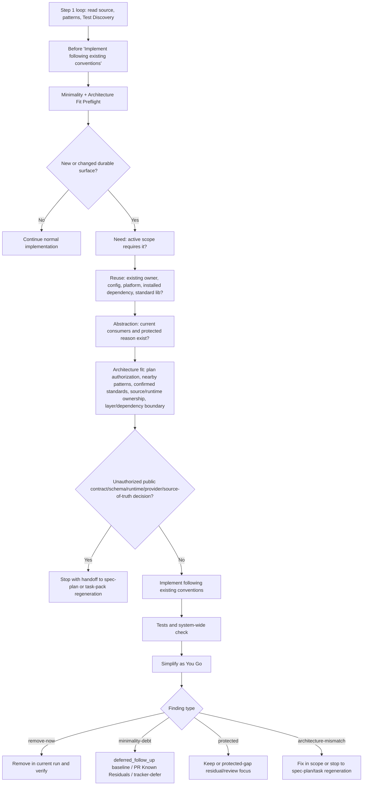

# feat: Add spec-work minimality and architecture-fit preflight

## Summary

本计划把 `spec-work` 的执行热路径升级为 `Minimality + Architecture Fit Preflight`：在新增 dependency、file、abstraction、configuration、helper、wrapper 或 durable surface 前，先要求 agent 判断是否真需要新增、能否复用/扩展/删除，以及该改法是否符合当前 plan/task、nearby source、confirmed standards、source/runtime ownership、分层和复用锚点。P0 只改 `spec-work` source、一个 examples-as-context case、prose contract tests 和 changelog；不新增 CLI、schema、task-pack 字段、run artifact 字段、public workflow 或 generated runtime mirror 手改。

---

## Decision Brief

- **Recommended approach:** 直接扩展 `skills/spec-work/SKILL.md` 的现有执行循环和 `Simplify as You Go` 段，复用已有 Decision Ledger、team standards consumption、reuse recheck、shipping residual sink 和 prose contract tests，不创建 minimality 子系统。preflight 只**实写真增量**（「为想象未来造抽象」+ architecture-fit 停回），reuse/scope/standards 维度**引用**既有机制而非重述，避免在 555 行的 `SKILL.md` 制造第二处 source-of-truth。
- **Key decisions:** `spec-plan` 仍是架构设计主责阶段；`spec-work` 只做执行期 architecture-fit 判断和越界停回。最小性与 architecture fit 合并为一个轻量注意力 prompt，不是 hard gate，也不由脚本裁决语义充分性。
- **Validation focus:** 先用 Phase 1a validation spike（fresh-source eval 或 manual fresh-read）验证 preflight 是否真的改变 agent 行为，据 go/no-go 决定是否继续；再用 `tests/unit/spec-work-contracts.test.js` 锁定 preflight 唯一 heading、step 1 loop 调用 pointer、3+2 判断、非 gate 文风、Simplify 四分类、reuse 维度指针、tier-independent debt sink 和 negative boundaries；用 `skills/spec-work/evals/examples.json` 增加一个聚焦 future-only abstraction refusal 的 example（path B，不改 6-cap/schema），但明确 tests/example 只证明静态结构、不证明 runtime 行为。
- **Largest risks / boundaries:** 最大风险是把“少写代码”和“遵循架构”误实现成新 schema/命令/审计系统，或让 `spec-work` 在执行期临场设计公共 contract、跨模块抽象、provider/source-runtime boundary。本计划用 scope boundaries、negative assertions 和 stop-back-to-plan 文案防止越界。

---

## Problem Frame

`spec-work` 已有反馈回路、vertical slice、pattern following、test discovery、system-wide test check 和 simplify review，但 Phase 2 当前从 pattern following 直接进入 implementation（`Test Continuously` 在 implement 之后），缺少一个明确的写前注意力检查：这项 durable surface 是否真的该新增，以及它是否应该落在当前架构位置。

用户前序调研已将方向收敛为：借鉴 Ponytail/YAGNI 的“少生成不必要代码”方法，但不照搬复杂 mode、gate、audit artifact 或 debt system；同时补上用户明确关心的架构层面判断，即执行阶段必须遵循现有项目规范、架构、分层、解耦、复用和 source/runtime ownership。计划的核心不是让 `spec-work` 接管架构设计，而是让它在执行前发现“计划未授权的架构决策”并停回 `spec-plan`。

---

## Requirements

- R1. 在 `Feedback Loop And Vertical Slices` 后新增 `Minimality + Architecture Fit Preflight` 段，定位为 implementation choice 前的 attention prompt，明确不是 gate，也不替代 LLM 语义判断。覆盖 origin R-01。
- R2. `Minimality + Architecture Fit Preflight` 的规则定义段放在 `Feedback Loop And Vertical Slices` 后，作为 `spec-work` 执行前通用注意力提示；Phase 2 step 1（Task Execution Loop）只添加一句执行调用 pointer，锚定在 `Implement following existing conventions` 行之前，要求在新增或修改 durable surface 前应用该 preflight。之所以锚定 step 1 loop 而非 step 3 `Follow Existing Patterns`：真正的写动作在 step 1 loop 内，step 3 在编号上位于其后，pointer 放 step 3 会在 durable surface 写完后才触发。不要在 Phase 2 loop 内重复同名 heading 或复制规则正文，避免第二处 source-of-truth。覆盖 origin R-02。
- R3. Preflight 采用 3+2 结构：active scope 是否要求、是否可复用/扩展/删除/配置/标准库/平台/已装依赖、是否只是为未来想象新增抽象。其中 reuse 维度与 scope-stop 维度**引用** `skills/spec-work/SKILL.md` 既有 work-phase reuse recheck、`Follow Existing Patterns` 与 `Anti-Rationalization Red Flags`，不在 preflight 内重述；preflight 自身只实写真增量——「为想象中的未来造抽象」这一 minimality 维度与 architecture-fit 判断。覆盖 origin R-03、R-04、R-05。
- R4. Preflight 的 architecture-fit 判断必须基于 direct source/test/docs/contracts evidence，消费 scope-matched confirmed standards 时遵循 `docs/contracts/team-standards.md` 和 `docs/standards/index.md`。覆盖 origin R-15、R-16、R-20。
- R5. 当实现需要新增公共 contract、跨模块抽象、schema/runtime/config surface、source-of-truth entry、workflow handoff、provider boundary 或 generated runtime delivery 变化，且 plan/task 未授权时，`spec-work` 必须停回 `spec-plan` 或 task-pack regeneration。覆盖 origin R-17。
- R6. 该 reuse recheck 行为已由 `skills/spec-work/SKILL.md` 既有 work-phase reuse recheck 段实现（plan 含 `Reuse decision:`/`Existing Capability / Reuse Analysis`/`Work-phase recheck:` 时实现前重查 source、`new` 过期则优先 reuse/extend 并在 closeout 解释）。preflight 只**引用**该既有机制，不重写规则，避免在 `SKILL.md` 制造第二处 source-of-truth。覆盖 origin R-18。
- R7. `Simplify as You Go` 必须分类为 `remove-now`、`minimality-debt`、`protected`、`architecture-mismatch`；`protected` 区分 keep/gap；`architecture-mismatch` 在当前 scope 内能修则修，若需要新架构决策则只停回 `spec-plan` 或 task-pack regeneration，review 仅作为已实现 diff 的 residual/follow-up focus。覆盖 origin R-06、R-08、R-09、R-19。
- R8. Decision note 只在 minimality 或 architecture-fit 改变实现方向、拒绝明显 overbuild、或保留非显然 protected code 时记录；普通小改动不输出长 minimality note。覆盖 origin R-07、R-20。
- R9. P0 不新增 `minimality_mode`、public workflow、CLI 子命令、独立 minimality reference 子系统、task-pack 字段、run artifact 字段、contract schema 或 generated runtime mirror 手改。覆盖 origin R-10、R-11。
- R10. `skills/spec-work/evals/examples.json` 只新增 1 个 case，使 examples 达到 `prompt-examples-contracts` 6-cap。P0 定为 **path B**：该 case **只聚焦承载最高价值真增量 subcase——future-only abstraction refusal**（preflight 最核心、最不易与既有 reuse 语义混淆者），用 `coverage_tags`、`context_snippets`、`negative_signal` 等既有扁平单值字段干净表达单一信号，不改 fixture schema。其余三类真增量（architecture-fit stop-back、protected-code keep、small-change-zero-note）在 P0 **不进 examples-as-context**：其行为约束仍由 U5 prose contract anchors 锁定，示范 case 显式 defer 到后续 example 计划（见 Deferred to Follow-Up Work）。native-before-dependency、single-use-abstraction 和普通 reuse decision 属既有 reuse 语义，不作为验证信号。覆盖 origin R-12 与 AE-01 到 AE-10 的 P0-relevant 部分。
- R11. `tests/unit/spec-work-contracts.test.js` 必须锁定 source prose anchors、loop order、3+2 关键词、非 gate 文风、Simplify 四分类、architecture-fit stop-back、negative schema/CLI/runtime-mirror boundaries。覆盖 origin R-13。
- R12. Closeout 和 changelog 必须区分静态结构验证与行为有效性；contract tests 和 examples fixture 不得声称证明 agent runtime 行为已改变。fresh-source eval 可为 `passed`、`concerns` 或 `not_run`，`not_run` 必须带具体 reason code。覆盖 origin R-14。

**Origin acceptance examples carried forward:** U1 到 U5 覆盖 AE-01 到 AE-06、AE-08、AE-09、AE-10 的 work-skill / source-contract 部分；AE-02 和 AE-10 中涉及 origin R-21 的后续 review-lens 能力、AE-07 中涉及 origin R-22 的 plan/compound 后续能力仍 deferred，不作为 P0 完成条件。AE-08、AE-09、AE-10 是本计划对 architecture-fit 的关键保护面。

---

## Assumptions

- A1. 本计划只规划 P0 source-only 改动；不执行实现，不刷新 runtime mirrors。
- A2. `spec-plan` 是架构设计主责阶段，`spec-work` 的 architecture-fit 只负责执行期遵循与越界发现，不负责临场重做架构方案。
- A3. 当前 confirmed architecture standards 能硬约束的重点是 source/runtime ownership；其他分层、依赖方向、解耦和 owner fit 必须从 current plan、nearby source、confirmed standards 或 direct evidence 中读取，不能用 generic clean architecture 口号替代。证据冲突时按 `confirmed active standard / source-of-truth > explicit plan/task decision > owner or source module boundary > nearby pattern` 处理；只有单个可疑 nearby pattern 时不得当作 hard context；若需要新架构决策，应停回 `spec-plan`，review 只能记录 advisory 或已实现 diff 的 residual/follow-up focus。
- A4. 行为有效性需要 fresh-source eval、人工复核或真实 work run 观察；本计划的测试只要求静态 contract 与 fixture structure。

---

## Scope Boundaries

- 不新增 `spec-work minimality-audit`、`minimality-review`、`minimality-debt`、`minimality-gain` 或类似 public workflow/CLI。
- 不新增 `minimality_mode`、task-pack 字段、run artifact schema 字段、contract schema、persistent minimality artifact 或指标采集管线。
- 不新增 `skills/spec-work/references/minimality-*.md`；P0 先把规则放在 `SKILL.md` 的相邻执行上下文中。
- 不修改 `spec-plan`、`spec-code-review`、`spec-compound`、`spec-optimize` 或 standards contract source。它们是后续 P1/P2 的可能消费者，不是本 P0 的写入目标。
- 不手改 `.claude/**`、`.codex/**`、`.agents/skills/**`。
- 不把 generic clean architecture、DDD、layered architecture、解耦口号写成 hard rule；只有 repo source、scope-matched confirmed standards、plan/task-pack decision 或 owner/source evidence 能约束当前 work。

### Deferred to Follow-Up Work

- `spec-code-review` 后续增加 protected-code-regression 或 architecture-mismatch review focus。
- `spec-plan` 后续在 material 时输出 Minimal Implementation Contract / Architecture Fit Contract。
- `spec-compound` 后续沉淀 verified minimal-implementation / architecture-fit learning。
- 真实行为效果度量和 bad-case regression corpus，可由后续 eval/optimize 计划承接。
- P0 未进 examples-as-context 的三类真增量示范（architecture-fit stop-back、protected-code keep、small-change-zero-note）：后续若示范价值足够，可评估提高 `prompt-examples-contracts` 上限并拆成聚焦 case，或并入 eval/optimize 计划的 example 扩充；P0 期这三类行为已由 U5 prose anchors 锁定。

---

## Completion Criteria

这些 criteria 分成两层：C1-C7 证明 **source contract completed**；C8-C10 才能支持 **behavior/runtime delivery claimed**。若 C8 或 C9 未满足，implementation closeout 只能声明 source contract updated，不能声明优化后 runtime 行为已被证明或当前 host 已生效。

- C1. `skills/spec-work/SKILL.md` 包含标题 `Minimality + Architecture Fit Preflight`，且明确非 gate、非脚本裁决、非每行代码仪式。
- C2. `Minimality + Architecture Fit Preflight` heading 只出现一次且位于 `Feedback Loop And Vertical Slices` 后；Phase 2 step 1（Task Execution Loop）在 `Implement following existing conventions` 前显式调用该 preflight（以磁盘真实 loop 结构为准；Test Discovery 是 step 1 loop 内的子小节而非顶层编号步，pointer 锚定 `Implement following existing conventions` 行，不锚定 step 3 `Follow Existing Patterns`）。
- C3. `Simplify as You Go` 明确四分类及每类去向，包含 `architecture-mismatch` stop-back 或 current-scope correction。
- C4. `skills/spec-work/evals/examples.json` 新增且仅新增 1 个 case（path B：聚焦 future-only abstraction refusal 单一 subcase），examples 总数达到但不超过 `prompt-examples-contracts` 6-cap，且不改 fixture schema。
- C5. `tests/unit/spec-work-contracts.test.js` 增加 positive anchors 和 negative assertions，覆盖 scope boundaries 中的禁止项。
- C6. `CHANGELOG.md` 增加 compact `(user-visible)` 条目，说明 source skill 行为语义变化、验证和未验证边界。
- C7. 聚焦验证通过或诚实记录 not-run reason：至少包括 `npx jest tests/unit/spec-work-contracts.test.js tests/unit/prompt-examples-contracts.test.js tests/unit/eval-fixture-contracts.test.js tests/unit/changelog-format.test.js --runInBand` 与 `git diff --check -- CHANGELOG.md skills/spec-work/SKILL.md skills/spec-work/evals/examples.json tests/unit/spec-work-contracts.test.js`。
- C8. behavior 有效性验证分两处：(a) **Phase 1 spike go/no-go**——在 U1a preflight 骨架 + step 1 loop 调用 pointer 落地后先跑一次 fresh-source eval（或 manual fresh-read 显式判断），并对照“无 preflight 基线”做 A/B 对照，据**基线下不会出现的**新增语义信号决定是否继续 U1/U2/U3/U4/U5/U6；(b) **closeout behavior claim**——若要声明 behavior target achieved，必须执行 fresh-source eval、manual fresh-read eval 或真实 work run 观察，且至少覆盖 future-only abstraction refusal、protected-code keep、small-change-zero-note、architecture stop-back。任一处若未运行，记录 `behavior_validation: not_run` 和具体 reason code，并留下 follow-up；spike 处 not_run 时仍必须保留一个显式 go/no-go 判断，不得静默跳过。**硬前置（防绿测试假信号）**：只有 spike 判为 `go` 且 (b) 至少一种行为证据 `passed`，closeout 与 CHANGELOG 才可使用超出 `source contract updated` 的行为交付措辞；否则收尾措辞封顶为 `source contract updated; behavior_validation: not_run`。契约测试全绿本身不得作为行为达成证据。
- C9. 若要声明当前 host runtime 行为已生效，必须运行并验证 `spec-first init` 或等价 runtime projection；若 P0 只做 source-only，closeout 和 changelog 必须写明 `source contract updated; runtime not refreshed`，不得声称当前 `.agents/skills/**`、`.claude/**` 或 `.codex/**` 已更新。
- C10. 若 fresh-source eval 执行，只能报告 eval 结论和限制，不能把它包装成 deterministic proof；contract tests 和 examples fixture 仍只证明静态结构与 source anchors。

---

## Direct Evidence Readiness

- target_repo: `spec-first`
- evidence_sources: direct source reads, `rg`, PRD receipt verification, task-governance-signals, git status, package version, changelog diff
- source_refs:
  - `docs/brainstorms/2026-07-01-001-spec-work-minimality-preflight-requirements.md`
  - `skills/spec-work/SKILL.md`
  - `skills/spec-work/references/shipping-workflow.md`
  - `skills/spec-work/evals/examples.json`
  - `tests/unit/spec-work-contracts.test.js`
  - `tests/unit/prompt-examples-contracts.test.js`
  - `tests/unit/eval-fixture-contracts.test.js`
  - `skills/spec-plan/references/reuse-analysis.md`
  - `docs/contracts/team-standards.md`
  - `docs/standards/index.md`
  - `docs/standards/architecture.md`
  - `docs/standards/shared.md`
  - `docs/10-prompt/结构化项目角色契约.md`
  - `CHANGELOG.md`
- current_revision: `b9ccc9bb67e89ce6fdd191c26c8aae2e807b6913`
- worktree_status: dirty before this plan; existing unrelated changes include `CHANGELOG.md`, a spec-compound plan, spec-prd/spec-compound source changes, and the origin PRD as untracked
- confidence: high for source/runtime and scope boundaries; medium for exact insertion wording until implementation re-reads current source
- limitations: line numbers in the PRD are advisory because source may shift; generated runtime mirrors intentionally excluded; no external web research used because the relevant authority is local source and the user-provided PRD

---

## Direct Evidence

- repo_scope: current repository only
- source_reads_completed:
  - Read and verified the origin PRD with `finalize-prd-artifact.js --inputs-from-frontmatter --verify-receipt`; current receipt verification returned `status=verified`, `ready_receipt_current=true`, `checker.finding_count=0`, `checker.blocking_finding_count=0`. The origin frontmatter still records an earlier `readiness_finding_count: 1` / `readiness_blocking_count: 0`; treat current receipt verification as the planning-time consumer check and the older frontmatter count as historical non-blocking readiness metadata.
  - Read `skills/spec-work/SKILL.md` around context orientation, feedback loop, Phase 2 loop, reuse recheck, pattern following, test continuity, system-wide test check and simplify rules.
  - Read `skills/spec-work/references/shipping-workflow.md` for residual sink and review tiers.
  - Read `skills/spec-work/evals/examples.json` and prompt/eval fixture tests to confirm examples-as-context shape and limits.
  - Read `tests/unit/spec-work-contracts.test.js` to confirm current prose contract style and suitable test home.
  - Read team standards contract/index plus `architecture.md` and `shared.md` to identify confirmed active rules relevant to source/runtime ownership and changelog.
  - Read project role contract to calibrate script-vs-LLM boundary, source/runtime, and architecture judgment.
- source_reads_required:
  - Before implementation, re-read `skills/spec-work/SKILL.md`, `skills/spec-work/evals/examples.json`, `tests/unit/spec-work-contracts.test.js` and `CHANGELOG.md` because the worktree is dirty and these files may change.
  - If runtime projection becomes necessary, re-read generator/source projection tests before running `spec-first init`; P0 itself does not require runtime refresh.
- commands_or_tools_used:
  - `spec-first startup-reminder --codex` returned no output.
  - `node skills/spec-prd/scripts/finalize-prd-artifact.js docs/brainstorms/2026-07-01-001-spec-work-minimality-preflight-requirements.md --inputs-from-frontmatter --verify-receipt`
  - `node bin/spec-first.js internal task-governance-signals --source plan-declared --input <temporary-planning-context.json> --json`, which returned `candidate_level: deep` with `cross-module`, `critical-path-hit`, `keyword-hit`, `candidate-deep`.
  - `git status --short`, `find docs/plans -name '2026-07-01-*'`, `git rev-parse HEAD`, `node -e "require('./package.json').version"`, bounded `rg` and `sed`.
- impact_on_plan:
  - The work is Deep despite small file count because it touches workflow behavior semantics, contract tests, examples-as-context, source/runtime ownership, standards consumption and architecture-fit boundaries.
  - Reuse is preferred: extend existing `spec-work` source, examples and tests rather than creating new reference, schema, command or artifact.
  - Verification must be honest about static prose anchors versus runtime behavior.
- key_findings:
  - `spec-work` already has Decision Ledger, standards consumption, reuse recheck and Follow Existing Patterns; preflight should pull those into the write-before-durable-surface moment instead of duplicating them.
  - Current Phase 2 step 1 (Task Execution Loop) runs `Look for similar patterns` → `Find existing test files` (Test Discovery — a subsection at `SKILL.md:407`, referenced from the step 1 loop, not a top-level numbered step) → `Implement following existing conventions`; the top-level numbered steps 3-5 are `Follow Existing Patterns` → `Test Continuously` → `Simplify as You Go`. The write-before-durable-surface moment is the `Implement following existing conventions` line inside step 1's loop, not step 3. The stable design is a two-layer anchor: one `Minimality + Architecture Fit Preflight` definition after `Feedback Loop And Vertical Slices`, plus a pointer inside the step 1 loop immediately before `Implement following existing conventions` that invokes it before durable surface changes.
  - `Simplify as You Go` currently advises simplification but lacks finding classification and sink direction.
  - Confirmed standards for this repo harden source/runtime ownership and changelog; broader architecture terms must be evidence-based per changed files, not treated as pre-existing hard rules.
- limitations:
  - This is a plan-only artifact; it does not prove the later `spec-work` prompt actually changes model behavior.
  - The plan uses source paths, not generated mirror paths, as authority.

---

## Context & Research

### Relevant Code and Patterns

- `skills/spec-work/SKILL.md` already frames examples as context, not semantic proof. The new eval case should preserve that limitation.
- `skills/spec-work/SKILL.md` already has a non-gate `Anti-Rationalization Red Flags` table. The new preflight should mirror that “attention prompt, not deterministic gate” posture.
- `skills/spec-work/SKILL.md` already has `Domain Language And Decision Ledger`, `Follow Existing Patterns`, work-phase reuse recheck and team standards consumption. Architecture-fit wording should reference those existing mechanisms rather than create a new standards selector.
- `skills/spec-work/references/shipping-workflow.md` already provides Known Residuals and review escalation. `minimality-debt` and `protected-gap` should reuse existing residual/review paths.
- `tests/unit/spec-work-contracts.test.js` uses `toContain` / `not.toContain` prose anchors. The new tests should follow this style.
- `tests/unit/prompt-examples-contracts.test.js` requires `skills/spec-work/evals/examples.json` to have 4 to 6 examples; current file has 5, so one focused addition (path B) reaches the limit.
- `tests/unit/eval-fixture-contracts.test.js` confirms eval fixtures declare structural coverage and do not prove semantic quality.

### Standards Matched

- `SHARED-SOURCE-001`: source truth before runtime mirrors. Applies to this P0 because the implementation must edit `skills/`, tests and changelog, not `.agents/skills/**`.
- `ARCH-RUNTIME-001`: runtime assets are delivery outputs, not architecture source truth. Applies to architecture-fit wording and generated mirror negative assertions.
- `SHARED-CHANGELOG-001`: any source change needs compact changelog breadcrumb. Applies to this plan and the eventual implementation.

### Institutional Learnings

- `docs/solutions/architecture-patterns/competitor-skill-borrowing-judgment-2026-06-01.md` and similar borrowing patterns are advisory support for this posture: borrow mechanism only after filtering by local boundaries; do not import external system topology.
- `docs/solutions/workflow-issues/modify-source-not-artifacts-2026-04-13.md` is consistent with source-first runtime mirror boundaries.
- `docs/solutions/workflow-issues/skill-prose-rewrite-contract-test-coverage-2026-06-28.md` supports using focused prose contract tests plus fresh-source eval for skill prompt changes.

### External References

- No external web references used. The origin PRD already incorporates the user-provided Ponytail/YAGNI research as reference-claims; plan authority comes from the verified PRD and current repository source.

---

## Existing Capability / Reuse Analysis

| Proposed surface | Decision | Rationale |
| --- | --- | --- |
| Minimality / architecture preflight instructions | Extend `skills/spec-work/SKILL.md` | The behavior is execution-loop posture and belongs in the hot path. A new reference would add indirection for a compact prompt and increase drift risk. |
| Simplify classification | Extend `skills/spec-work/SKILL.md` | Existing `Simplify as You Go` already owns the phase-boundary simplification review. Add classifications there instead of creating a new review workflow. |
| Eval coverage | Extend `skills/spec-work/evals/examples.json` | The file already owns examples-as-context for `spec-work`; one focused case (path B, future-only abstraction refusal) keeps within current tests' 6-example cap. |
| Validation | Extend `tests/unit/spec-work-contracts.test.js` | Existing spec-work tests already assert prose contracts, source/runtime boundaries, reuse recheck and host entrypoint behavior. |
| Residual/debt sink | Reuse shipping review Known Residuals / tracker-defer paths | P0 should not create a minimality debt artifact; shipping workflow already owns durable residual handling. |
| Standards enforcement | Reuse `docs/contracts/team-standards.md` + matched active standards | Do not create a standards sub-system or generic architecture hard rule in `spec-work`. |
| Runtime projection | Reuse existing `spec-first init` when needed, but out of P0 | Runtime mirrors are generated delivery outputs; source changes can be projected later through existing tooling. |

Work-phase recheck: before implementing U1 or U2, reread the current `spec-work` source. If another parallel change already introduced equivalent minimality/architecture-fit wording, prefer extending that wording instead of adding a second section.

---

## Key Technical Decisions

- KTD1. **Architecture design stays in `spec-plan`; architecture fit moves into `spec-work`.** The plan must preserve the boundary: work can verify fit against current architecture and stop on unauthorized architecture decisions, but it cannot invent public contracts, cross-module abstractions or source-of-truth boundaries during execution. 因为“fit vs design”是语义判断、仅靠散文与静态测试无法强制，边界必须落在**可观察触发**上而非 agent 自评：凡改动 R5 枚举的 durable surface（public contract、跨模块抽象、schema/runtime/config、source-of-truth entry、provider boundary）且 plan/task 未点名授权，一律 stop-back，**不论 agent 是否自认“fit”**；不得以“我判断它 fit 当前架构”为由做 in-scope 自我授权。spike 须专门探一个“诱人的 in-scope 自我修正”场景，验证 agent 停回而非自授权。
- KTD2. **Use a single combined preflight.** Minimality and architecture fit both fire when adding or changing durable surfaces; splitting them into two sections would create duplicate attention prompts and raise friction.
- KTD3. **Keep it advisory, not a deterministic gate.** Scripts cannot decide semantic minimality or architecture adequacy. Contract tests only prove source anchors exist.
- KTD4. **Record notes only when they change the work.** A compact decision note is required when preflight changes direction or preserves protected code for non-obvious reasons; routine small changes stay quiet.
- KTD5. **Protected code outranks shorter code.** Security validation, data-loss protection, accessibility, observability and required verification must not be deleted just because a shorter implementation exists.
- KTD6. **Architecture mismatch gets an explicit sink.** If current diff puts logic in the wrong layer, bypasses source/runtime ownership, duplicates an owner, or creates cross-boundary coupling, fix it in scope if possible. If a new architecture decision is required, stop to `spec-plan` or task-pack regeneration; review only carries residual/follow-up focus for already implemented diffs.
- KTD7. **Negative boundaries are first-class tests.** The implementation should assert absence of new CLI/schema/runtime mirror/public workflow/minimality artifact language so future prompt drift does not quietly expand P0.
- KTD8. **Fresh-source eval 前移为 Phase 1 validation spike 的 go/no-go 依据，而非 Phase 3 可 not_run 的收尾。** 先落 U1a（preflight 规则骨架 + step 1 loop 调用 pointer），立即按 `docs/contracts/workflows/fresh-source-eval-checklist.md` 跑一次 fresh-source eval 或 manual fresh-read，并对照“无 preflight 基线”做 A/B 对照，观察是否产生**基线下不会出现的**新增语义信号：future-only abstraction refusal、unauthorized architecture stop-back、small-change-zero-note；若与基线不可区分则 no-go。`go` 后再补全 U1/U2/U3/U4/U5/U6；`no-go`（agent 走过场或只表现出既有 reuse 行为）先回炉调 preflight 措辞。dispatch 不可用时降级为 manual fresh-read 判断，但仍必须留下一个**显式 go/no-go 决策点**，不得直接跳到全量交付；未运行自动 eval 时记录 `fresh_source_eval: not_run` 与具体 reason（如 `dispatch_authorization_missing`）。

---

## Open Questions

### Resolved During Planning

- **Should the plan modify generated runtime mirrors?** No. Source truth is `skills/`, tests and changelog; generated mirrors are out of P0.
- **Should `spec-work` do architecture-level thinking?** Yes, as architecture-fit checking against evidence and plan authorization. It should not do planning-time architecture design.
- **Should the preflight become a schema/artifact?** No. It is semantic attention and LLM judgment above deterministic facts.
- **Should P0 add a new reference file?** No. The current target is compact and belongs in the execution spine.
- **Should the preflight get a deterministic floor (advisory fact / schema)?** No. preflight 有意保持与 `SKILL.md` `Anti-Rationalization Red Flags` 一致的 attention-prompt 定位（无 floor 是该既有被接受模式的固有属性，不是本计划缺陷）；加 advisory fact 会引入 schema creep。重估条件：若 spike 或后续 fresh-source eval 显示 preflight 误报/漏报率高，再评估最轻量的 advisory fact，而非现在加。
- **Composite eval 一条塞 4 类 subcase 还是聚焦一类（doc-review F8）？** 走 **path B**。examples 5→6 撞 `prompt-examples-contracts` 6-cap，且 fixture 为扁平单值 schema（单 `negative_signal`、一层数组），一条并列 4 类要么撑破字段设计意图、要么每类证不实，还可能诱使偷改共享 schema/上限。因此本 case 只承载最高价值的 future-only abstraction refusal，其余三类（architecture-fit stop-back、protected-code keep、small-change-zero-note）行为由 U5 prose anchors 锁定、示范 defer 到后续 example 计划。放弃 path (a)（提高上限并拆聚焦 case）的原因是它要动共享 contract test、扩出 P0 声明的 4 文件边界，价值不足以在 P0 承担。

### Deferred to Implementation

- **Exact wording under the fixed heading:** Implementer should use the heading `Minimality + Architecture Fit Preflight`, then choose concise body wording that fits current `SKILL.md` style after re-reading the latest file.
- **Fresh-source eval execution:** Decide based on current host dispatch availability and authorization. If not run, record the reason; do not block static contract completion on unavailable dispatch.
- **Runtime projection:** Only run `spec-first init` if the implementation scope explicitly includes refreshing runtime assets after source edits. Do not hand-edit mirrors.

---

## High-Level Technical Design

> *This illustrates the intended approach and is directional guidance for review, not implementation specification. The implementing agent should treat it as context, not code to reproduce.*

---

## Implementation Units

### U1. Add Minimality + Architecture Fit Preflight

**Goal:** Add the preflight section to `skills/spec-work/SKILL.md` after `Feedback Loop And Vertical Slices`, preserving source-first and non-gate boundaries.

**Requirements:** R1, R3, R4, R5, R6, R8

**Dependencies:** None

**Files:**
- Modify: `skills/spec-work/SKILL.md`

**Approach:**
- Add a compact section titled `Minimality + Architecture Fit Preflight`.
- 收敛原则：preflight 只**实写真增量**，不重述既有规则。真增量为两块——(A) minimality 的「为想象中的未来造抽象」维度；(B) architecture-fit 判断与停回 `spec-plan`。
- 3+2 结构中的 reuse 维度（复用/扩展/删除/配置/标准库/平台/已装依赖）与 scope-stop 维度，用一句指针引回既有机制：`skills/spec-work/SKILL.md` 的 work-phase reuse recheck、`Follow Existing Patterns` 与 `Anti-Rationalization Red Flags`；不复制它们的规则正文，避免在 555 行的 `SKILL.md` 里制造第二处 source-of-truth。
- Explicitly name durable surface triggers: dependency, file, abstraction, configuration, helper, wrapper, public contract, schema/runtime/config surface, source-of-truth entry, provider boundary and generated runtime delivery.
- State that this is an attention prompt, not a gate or script-owned semantic decision.
- Reuse existing Decision Ledger vocabulary for compact notes, including `question`, `recommended_answer`, `source_tag`, `chosen_answer`, `consequence`.
- State that architecture-fit evidence must cite concrete source path, matched standard rule ID, plan/task decision or nearby pattern, not generic best practice.
- Include evidence precedence: confirmed active standard or source-of-truth first, explicit plan/task decision second, owner/source module boundary third, nearby pattern last. If those conflict and a new architecture decision is needed, stop for `spec-plan` rather than choosing a convenient source; review can only carry advisory notes or residual/follow-up focus for implemented diffs.
- **差异化前提（防冗余）**：U1 落地前必须能点名 preflight 相对既有 `Anti-Rationalization Red Flags` + work-phase reuse recheck + `Follow Existing Patterns` 的**具体不同决策**——即"有 preflight 时 agent 会做而基线下不会做"的动作（典型为 future-only abstraction refusal 与 unauthorized architecture stop-back）。若说不出该差异，应把 preflight 收敛为一句 pointer 而非新 section，避免只增 heading 不增行为。

**Execution note:** Source prose change; use a diff-shape feedback loop first, then contract tests.

**Patterns to follow:**
- Non-gate language in `skills/spec-work/SKILL.md` `Anti-Rationalization Red Flags`.
- Standards consumption language in `Domain Language And Decision Ledger` and `Follow Existing Patterns`.
- Reuse recheck language in Phase 1 plan intake.

**Test scenarios:**
- Happy path: source contains the preflight heading, durable surface trigger vocabulary, 3+2 minimality checks and architecture-fit evidence requirements.
- Edge case: source says preflight is not a gate and not script-owned semantic judgment.
- Error path: source does not include generic best practice as a sufficient architecture-fit basis.
- Integration: source ties architecture-fit stop-back to current host handoff rather than silently expanding implementation scope.

**Verification:**
- `tests/unit/spec-work-contracts.test.js` contains targeted assertions for the new section and non-gate/standards/reuse evidence anchors.

---

### U2. Insert Preflight Into Phase 2 Loop

**Goal:** Wire the existing preflight definition into the real Phase 2 execution moment without duplicating the heading or rules.

**Requirements:** R2, R3, R5

**Dependencies:** U1

**Files:**
- Modify: `skills/spec-work/SKILL.md`

**Approach:**
- 保留 `Minimality + Architecture Fit Preflight` 的唯一 heading 在 `Feedback Loop And Vertical Slices` 后。
- 在 Phase 2 step 1（Task Execution Loop）的循环体中、`Implement following existing conventions` 行之前添加一句 pointer：在新增或修改 dependency、file、abstraction、configuration、helper、wrapper、public contract、schema/runtime/config surface、source-of-truth entry、provider boundary 或 generated runtime delivery 前，先应用上方 preflight。选择 step 1 loop 而非 step 3 `Follow Existing Patterns`，是因为真正的写动作在 step 1 loop 内，step 3 在编号上位于其后，pointer 放 step 3 会在写完后才触发。
- 不改动稳定的 1-7 步编号结构，也不改 step 1 loop 内既有 Test Discovery 子小节的位置。
- 不在 Phase 2 内新增第二个 `Minimality + Architecture Fit Preflight` heading。
- Ensure the stop-back behavior uses existing User-Facing Handoff Contract style when execution cannot continue safely.

**Patterns to follow:**
- Current Phase 2 loop format in `skills/spec-work/SKILL.md`.
- User-Facing Handoff Contract in Phase 0 oversized intake.

**Test scenarios:**
- Happy path: preflight heading appears once and appears after `Feedback Loop And Vertical Slices`.
- Happy path: Phase 2 step 1（Task Execution Loop）contains a pointer to apply `Minimality + Architecture Fit Preflight`, positioned before the `Implement following existing conventions` line.
- Edge case: task loop still preserves the existing numbered steps 3-5 (`Follow Existing Patterns` → `Test Continuously` → `Simplify as You Go`) and the step 1 Test Discovery subsection.
- Error path: test fails if the heading is duplicated or if the step 1 loop lacks the pointer before `Implement following existing conventions`.

**Verification:**
- Prose contract test proves loop-order anchor, not runtime execution behavior.

---

### U3. Upgrade Simplify as You Go Classification

**Goal:** Convert post-implementation simplification from generic reminder into four classifications with explicit sinks.

**Requirements:** R7, R8

**Dependencies:** U1

**Files:**
- Modify: `skills/spec-work/SKILL.md`

**Approach:**
- Replace or extend current `Simplify as You Go` prose with `remove-now`, `minimality-debt`, `protected`, and `architecture-mismatch`.
- For `remove-now`, require current-run removal and same feedback-loop verification.
- For `minimality-debt`, use existing sinks without creating a new debt store, and make the sink **review-tier-independent** to close the Phase 2→Phase 3 gap: `shipping-workflow.md` 的 Residual Work Gate 只在 Tier 2 code review 跑过时触发，因此不能把 minimality-debt 的唯一落点绑定在该 gate 上。定两层：
  - **保底 sink（无论 review tier）**：Simplify 阶段产生的 minimality-debt 必须写入 closeout 既有的 `deferred_follow_up[]` 字段（它已触发 `trigger-deferred-follow-up` 并记入 spec-work run artifact，见 `skills/spec-work/references/shipping-workflow.md:147`），携带最小字段 title、reason、evidence path、suggested owner。不要引用 `shipping-workflow.md` 中不存在的“closeout residual 段”。复用既有 `deferred_follow_up[]` 不算新增 minimality artifact 或新 run-artifact 字段。
  - **升级 sink**：若 Phase 3 Tier 2 Residual Work Gate 触发则合并去重进该 gate；若创建/更新 PR 则进 PR Known Residuals；若选择 tracker-defer 则复用既有 tracker-defer 路径。
  - 不新增 debt store 或持久化 minimality artifact。
- For `protected`, distinguish `keep` from `protected-gap`; explicitly protect security validation, data-loss protection, accessibility, observability and required verification.
- For `architecture-mismatch`, require current-scope correction when possible. If correction needs new architecture decisions, stop back to `spec-plan` or task-pack regeneration; review is only for implemented-diff residual/follow-up focus, not a design authorization source.

**Patterns to follow:**
- Current Simplify section.
- `skills/spec-work/references/shipping-workflow.md` residual work gate and Known Residuals.

**Test scenarios:**
- Happy path: tests assert all four classification labels exist and each has a sink.
- Edge case: protected code cannot be deleted solely for lower LOC.
- Error path: tests assert no new `minimality-debt` command, artifact or CLI vocabulary is introduced.
- Integration: `architecture-mismatch` links to `spec-plan` or task-pack regeneration for new architecture decisions, and only uses review as residual/follow-up focus for already implemented diffs.

**Verification:**
- Focused contract tests cover classification labels, sinks and protected/architecture ownership negative boundaries.

---

### U4. Add Focused Eval Example

**Goal:** Add one examples-as-context case focused on the single highest-value preflight 真增量 subcase——future-only abstraction refusal（path B）。其余三类真增量（architecture-fit stop-back、protected-code keep、small-change-zero-note）P0 不进本 case 示范，仅由 U5 prose anchors 锁定行为、defer 到后续 example 计划；普通 reuse 类 subcase 由既有能力覆盖，不进本 case。

**Requirements:** R10, R12

**Dependencies:** U1

**Files:**
- Modify: `skills/spec-work/evals/examples.json`
- Test: `tests/unit/prompt-examples-contracts.test.js`
- Test: `tests/unit/eval-fixture-contracts.test.js`

**Approach:**
- Add a single focused case to the existing `examples` array.
- Include user intent around a task that is tempted to add a future-only helper/adapter/service justified only by imagined future reuse.
- Expected posture should refuse the abstraction justified only by imagined future reuse; `negative_signal` 表达单一反信号（接受了 future-only 抽象），不并列相反方向的反信号。
- 先跑 `tests/unit/eval-fixture-contracts.test.js` 确认扁平单值 schema（`negative_signal` 单值、`context_snippets`/`coverage_tags` 一层数组）能干净承载该单一 subcase；path B 下只装一类，不触发撑破扁平字段的风险，也不改 schema。
- Make the case auditable: include explicit `coverage_tags`、`context_snippets`、`negative_signal` 和 source note text for the future-only-abstraction-refusal family。
- Keep source refs as source authority paths only; do not cite generated mirrors or external local paths.

**Patterns to follow:**
- Existing `skills/spec-work/evals/examples.json` case shape.
- `tests/unit/prompt-examples-contracts.test.js` 4-6 examples contract.
- `tests/unit/eval-fixture-contracts.test.js` source authority boundary.

**Test scenarios:**
- Happy path: JSON remains valid and examples count becomes 6, still within the current upper bound.
- Happy path: case carries `future-only-abstraction-refusal` as its single focused signal, so the new minimality signal is not confused with ordinary reuse decisions.
- Edge case: `negative_signal` 保持单值且方向单一（未并列相反反信号），未改 fixture schema。
- Error path: no source ref points to `.agents/skills/**`, `.claude/**`, `.codex/**`, `docs/plans/**` or external URLs.
- Integration: fixture normalizer accepts the updated file and coverage tags remain structural.

**Verification:**
- `tests/unit/prompt-examples-contracts.test.js` and `tests/unit/eval-fixture-contracts.test.js` pass.

---

### U5. Extend Spec-Work Contract Tests

**Goal:** Add focused Jest coverage that locks the P0 contract without pretending to validate runtime behavior.

**Requirements:** R1 through R12

**Dependencies:** U1, U2, U3, U4

**Files:**
- Modify: `tests/unit/spec-work-contracts.test.js`

**Approach:**
- Add a new `describe` block for minimality and architecture-fit preflight.
- Use source string assertions matching current test style.
- Assert positive anchors: exact single heading, step 1 loop pointer positioned before `Implement following existing conventions`, durable surface list, 3+2 checks, architecture-fit evidence precedence, stop-back boundary, decision-note fields, four simplify classes, residual sink mapping and the focused eval case structural keyword (future-only-abstraction-refusal only, per path B — do not assert the three deferred subcase families as example tags).
- 新增断言 1（防冗余）：preflight 的 reuse/scope 维度以指针形式引回既有机制（含既有 reuse recheck / `Follow Existing Patterns` / `Anti-Rationalization Red Flags` 的锚点关键词），而非重述其规则正文——断言指针存在，不断言 preflight 复制了全部 reuse 规则。
- 新增断言 2（防衔接缝隙）：`minimality-debt` 存在 review-tier-independent 的保底 sink 措辞（绑定既有 `deferred_follow_up[]` + 最小字段），不把唯一落点绑定在 Tier 2 Residual Work Gate 上，也不引用不存在的“closeout residual 段”。
- Assert negative boundaries precisely: no `minimality_mode`, no `spec-work minimality-audit`, no minimality-specific CLI command, schema field, task-pack field, run artifact contract, persistent minimality artifact, or generated runtime mirror modification. Existing `spec-work` task-pack/run-artifact/schema/CLI prose must remain allowed, and boundary prose may mention those surfaces when describing unauthorized-architecture stop-back behavior.
- Include an assertion that examples/tests are structural only if a suitable existing anchor exists; otherwise cover this via changelog/closeout rather than overfitting tests.

**Patterns to follow:**
- Existing prose contract tests in `tests/unit/spec-work-contracts.test.js`.
- Negative assertion style around deprecated workflow names and runtime mirrors.

**Test scenarios:**
- Happy path: all planned anchors exist.
- Edge case: architecture-fit uses concrete evidence terms such as `source path`, `rule ID`, `nearby pattern` or equivalent, and names evidence precedence or conflict handling.
- Error path: prohibited minimality-specific schema/CLI/runtime expansion strings are absent without banning existing unrelated `spec-work` contracts.
- Integration: test suite covers `shipping-workflow.md` only where residual sinks are referenced.

**Verification:**
- `npx jest tests/unit/spec-work-contracts.test.js --runInBand` passes.

---

### U6. Update Changelog and Closeout Evidence

**Goal:** Record the user-visible workflow behavior change and the verification boundary.

**Requirements:** R9, R12

**Dependencies:** U1 through U5

**Files:**
- Modify: `CHANGELOG.md`

**Approach:**
- Add a compact v1.12.0 entry at the top.
- Mention changed source surfaces: `skills/spec-work/SKILL.md`, `skills/spec-work/evals/examples.json`, `tests/unit/spec-work-contracts.test.js`.
- Mark `(user-visible)` because `spec-work` behavior guidance changes.
- Include verification commands and explicitly state fresh-source eval status if relevant.
- CHANGELOG 条目必须携带显式 `behavior_validation: passed|not_run` token（not_run 附 reason code），使全绿测试套件不会被读成行为已交付。
- Avoid claiming contract tests prove agent runtime behavior.

**Patterns to follow:**
- Current top entries in `CHANGELOG.md`.
- `SHARED-CHANGELOG-001`.

**Test scenarios:**
- Test expectation: none -- changelog format is covered by existing `tests/unit/changelog-format.test.js`.

**Verification:**
- `npx jest tests/unit/changelog-format.test.js --runInBand` passes.
- `git diff --check -- CHANGELOG.md ...` passes.

---

## System-Wide Impact

- **Interaction graph:** `spec-plan` produces architecture decisions; `spec-work` checks architecture fit against plan/task, current source and scope-matched confirmed standards, then corrects in scope or stops back when authorization is missing; `spec-code-review` and `shipping-workflow` remain review/residual sinks; `spec-compound` may later capture verified learnings but is out of P0.
- **Error propagation:** Unauthorized architecture decisions discovered during work should produce the existing user-facing handoff envelope, not a hidden local workaround.
- **State lifecycle risks:** No runtime state or persistent artifact changes in P0. The only durable changes are source skill prose, eval fixture, tests and changelog.
- **API surface parity:** No public CLI, schema or task-pack contract changes.
- **Surface coverage:** workflow source: in-scope; tests/eval fixture: in-scope; generated runtime mirrors: out-of-scope because source-first projection; CLI/schema/run artifact: out-of-scope because P0 rejects schema creep.
- **Integration coverage:** Unit tests cover source contract anchors; fresh-source eval or real run observation remains the only evidence for runtime semantic effect.
- **Unchanged invariants:** Scripts prepare deterministic facts; LLM judges semantic minimality and architecture adequacy above that floor. Generated mirrors are not source truth.

---

## Risks & Dependencies

| Risk | Likelihood | Impact | Mitigation |
| --- | --- | --- | --- |
| Preflight becomes ceremony on tiny edits | Medium | Medium | Trigger only on new/changed durable surfaces; decision note only when direction changes or protected code is non-obvious. |
| Preflight 重述既有 reuse/scope 规则,在 `SKILL.md` 造第二处 source-of-truth | Medium | High | preflight 只实写真增量,reuse/scope 维度用指针引回既有 reuse recheck / `Follow Existing Patterns` / `Anti-Rationalization Red Flags`;U5 断言指针存在而非规则复制;R6 降为引用既有机制。 |
| 核心假设(prompt 改变行为)在全量交付后才验证 | Medium | High | Phase 1a validation spike 先落 U1a preflight 骨架 + step 1 loop 调用 pointer，对照“无 preflight 基线”跑 A/B fresh-source eval/manual fresh-read 做 go/no-go，再投 U1-U6。 |
| `architecture fit` is misread as work doing architecture design | Medium | High | KTD1, R5 and tests require stop-back to `spec-plan` for unauthorized public contract/schema/runtime/source-of-truth/provider decisions. |
| Generic best practices become fake hard rules | Medium | High | Require direct source/docs/contracts evidence and matched confirmed standards; tests should reject generic-best-practice-only justification wording where feasible. |
| New minimality subsystem creeps into P0 | Medium | High | Negative scope/tests forbid CLI, schema, task-pack/run artifact fields, public workflow and new minimality reference. |
| Contract tests overclaim behavior | High | Medium | Completion and changelog must say static contract/fixture validation only; fresh-source eval or real run is separate. |
| Parallel dirty worktree causes accidental overwrite | Medium | Medium | Implementation must reread target files before edit and inspect scoped diff; do not revert unrelated changes. |
| Eval examples hit upper bound and block future cases | Low | Low | P0 走 path B 只加 1 条聚焦 case（future-only abstraction refusal），不改 6-cap/schema；未覆盖的三类示范显式 defer，未来扩充先评估提高上限并拆聚焦 case。 |

---

## Document Review Notes

- Multi-agent / multi-perspective review ran in report-only mode across coherence, feasibility, scope guardian, architecture strategist and adversarial perspectives.
- Accepted findings revised this plan to: use the `003` filename consistently after a concurrent `002` plan appeared; split source-contract completion from behavior/runtime delivery claims; narrow AE coverage to P0-relevant portions; add architecture-fit evidence precedence; clarify review is not an architecture authorization source; make residual sink mapping executable; avoid brittle negative tests against existing task-pack/run-artifact/schema/CLI prose; require composite eval structural keywords.
- Residual risk: later implementation can still over-generalize prompt wording. U5 negative assertions, C8 behavior validation and C9 runtime delivery status are the planned safeguards.
- 2026-07-01 spec-doc-review 多 persona 评审修订（coherence + feasibility + scope-guardian + adversarial 四 persona 派发，源码 file:line 直接核验）：(1) **纠正事实错误**——前一条复核注记 (2) 断言“真实 Phase 2 numbered loop 中无 pre-implementation `Test Discovery` 步”有误；`SKILL.md:389` loop 内引用 + `:407` 子小节“Before implementing changes to a file, find its existing test files”表明 Test Discovery 以子小节形式存在于 step 1 loop（非顶层编号步）。据此**重定位 U2 锚点**：pointer 从 step 3 `Follow Existing Patterns` 移入 step 1（Task Execution Loop）循环体、`Implement following existing conventions` 之前——因真正写动作在 step 1 loop 内，step 3 编号在其后，放 step 3 会在写完后才触发（R2/U2/C2/mermaid）。(2) **sink 目标不存在**——U3 保底 sink 原写“closeout residual 段”在 `shipping-workflow.md` 无此面，改绑既有 `deferred_follow_up[]`（`shipping-workflow.md:147`，触发 `trigger-deferred-follow-up`）(U3/U5/mermaid)。(3) **spike 不可证伪**——Phase 1a/KTD8/C8 增加对“无 preflight 基线”的 A/B 对照与“基线下不会出现的差异”判据，自读记为 degraded (Phase 1a/KTD8/C8)。(4) **preflight 冗余风险**——U1 增加差异化前提：说不出相对既有机制的具体不同决策就收敛为一句 pointer。(5) **stop-back 无强制**——KTD1 收紧为可观察 durable-surface 触发清单、禁止 in-scope 自我授权。(6) **绿测试假信号**——C8 增加“spike-go + 至少一种行为证据 passed”硬前置、CHANGELOG 带 `behavior_validation` token、Success Metrics 静态项不得单独充当行为证据 (C8/U6/Success Metrics)。(7) composite eval 4-subcase/6-cap/扁平 schema 取舍（F8）经用户决策定为 **path B**：本 case 只聚焦 future-only abstraction refusal，其余三类示范 defer、行为由 U5 anchors 锁定（已同步 R10/U4 标题与正文/C4/U5 anchor/Decision Brief/Risks/Open Questions Resolved/Deferred to Follow-Up Work，U4 依赖由 U1+U3 收敛为 U1）。feasibility persona 首派因 403 模型访问失败、以 `model: opus` 重派成功。
- 2026-07-01 证据化复核修订（对话内单人复核，源码 file:line 锚定，未跑多 agent 独立对抗审查）：(1) 发现 preflight 与既有 `SKILL.md` reuse recheck（work-phase recheck 段）、`Follow Existing Patterns`、`Anti-Rationalization Red Flags` 实质冗余，R6 几乎等于既有段——收敛 preflight 到真增量 A/B，R6/R3/U1 改为引用既有机制；(2) U2 原「find tests 与 implement 之间」锚点在真实 Phase 2 numbered loop 中不存在（无 pre-implementation `Test Discovery` 步），R2/U2/U2-tests 进一步收敛为两层锚点：唯一 heading 放在 `Feedback Loop And Vertical Slices` 后，`Follow Existing Patterns` 只加调用 pointer；(3) examples 当前 5 条，新增 1 条后达到 6-cap，且 fixture 为扁平单值 schema，因此 R10/U4 把 subcase 数收敛到真增量（future-only abstraction refusal / architecture-fit stop-back / protected-code keep / small-change-zero-note）并加 fixture 承载性预检，普通 reuse decision 不作为验证信号；(4) minimality-debt 落点原绑定 Tier 2 Residual Work Gate（Tier 1/无 review 时会漏），U3/U5 补 review-tier-independent 保底 sink；(5) fresh-source eval 从 Phase 3 可 not_run 收尾前移为 Phase 1a spike go/no-go，并改为 U1a skeleton + pointer 先验证，避免在 U3 前强行落依赖 U3 的完整 U4；(6) 明确 preflight 有意不加 deterministic floor（Open Questions 记重估条件）。

---

## Documentation / Operational Notes

- README updates are not required for P0 because this changes agent-facing workflow behavior, not public CLI usage.
- Runtime regeneration is not part of the P0 source-contract slice. If implementation wants to claim current host runtime behavior is updated, add a delivery step that runs and verifies `spec-first init`; otherwise close out explicitly as `source contract updated; runtime not refreshed`. Do not hand-edit mirrors.
- Implementation closeout should name whether fresh-source eval ran. If it did not run, use a concrete reason such as `dispatch_authorization_missing`, `dispatch_unavailable` or `runtime_dispatch_failed`.

---

## Alternative Approaches Considered

- **Add a separate `minimality` reference under `skills/spec-work/references/`:** Rejected for P0. The prompt is compact and belongs next to the loop; a reference would add context switching and a second maintenance point.
- **Create `minimality_mode` or run artifact fields:** Rejected. The decision is semantic and LLM-owned; making it schema-shaped would create fake determinism and schema creep.
- **Push all architecture-fit logic into `spec-plan`:** Rejected. `spec-plan` should own design, but execution still needs a preflight to catch stale source, plan gaps and unauthorized durable-surface expansion.
- **Let `spec-work` freely decide architecture during execution:** Rejected. This breaks workflow boundaries; public contracts, cross-module abstractions and source-of-truth/provider/runtime boundaries must return to plan or task regeneration.
- **Do a repo-wide minimality audit:** Rejected. P0 is execution-time guardrail for current diff, not cleanup campaign.

---

## Phased Delivery

### Phase 1a: Validation Spike (go/no-go)

- 先落 `U1a`：仅添加 preflight 规则骨架和 step 1 loop 调用 pointer（`Implement following existing conventions` 前），不先落完整 U3/U4/U5。
- **A/B 对照（必需，防自我印证）**：spike 必须对照“无 preflight 基线”跑——即对仅有既有 `Anti-Rationalization Red Flags` + work-phase reuse recheck + `Follow Existing Patterns` 的源，与加了 preflight 骨架的源，各跑一次同一场景；场景须包含一个“诱人的 future-only 抽象”和一个“未授权 durable surface 变化 + 诱人的 in-scope 自我修正”案例。
- **差异化判据**：go 的前提是能点名“有 preflight 时 agent 做出的、基线下不会做出的具体不同决策”（future-only abstraction refusal / unauthorized architecture stop-back / small-change-zero-note）。若行为与 pre-preflight 基线不可区分，即为 no-go。
- 用 fresh-source eval 或 manual fresh-read 判断上述信号：拒绝只为想象未来新增抽象；对未授权 public contract / schema / runtime / provider / source-of-truth 变化停回 `spec-plan`；对普通小型非 durable 改动不强制输出 minimality note。
- **go**：进入 Phase 1b。**no-go**（走过场 / 无信号 / 与基线不可区分 / 只表现出既有 reuse 行为）：先回炉调整 preflight 措辞，不继续堆测试和 fixture。dispatch 不可用时降级为 manual fresh-read，但必须留下显式 go/no-go 判断和 reason code；自读证据记为 degraded，不等同真实 dispatch eval 的通过。

### Phase 1b: Source Skill Spine

- go 后再补全 U1，并 land U2 与 U3，使 preflight definition、step 1 loop 调用 pointer 与 simplify 分类连贯。Keep test expectations as planning guidance in those units, but defer actual `tests/unit/spec-work-contracts.test.js` edits until U5 after source wording stabilizes.

### Phase 2: Fixtures and Tests

- Land 完整 U4 and U5 after source wording stabilizes so tests assert final anchors rather than draft prose.

### Phase 3: Evidence and Closeout

- Land U6 after verification. Include fresh-source eval status and generated-runtime status honestly.

### Suggested Execution Order

1. U1a: preflight skeleton + step 1 loop pointer (before `Implement following existing conventions`).
2. Phase 1a validation spike.
3. U1 full wording.
4. U2 loop pointer hardening.
5. U3 Simplify classification.
6. U4 final focused example (future-only abstraction refusal, path B).
7. U5 contract tests.
8. U6 changelog and closeout evidence.

---

## Success Metrics

- Static contract: focused Jest tests pass and prove the planned prose anchors, loop ordering, eval shape and changelog format are present. 该项只证明静态结构，不得单独充当 behavior target 达成证据（见 C8 硬前置）。
- Scope discipline: final diff touches only `skills/spec-work/SKILL.md`, `skills/spec-work/evals/examples.json`, `tests/unit/spec-work-contracts.test.js`, `CHANGELOG.md` unless implementation records an explicit plan-approved deviation.
- Runtime honesty: closeout does not claim behavior is proven by prose tests.
- Future behavior evidence: first fresh-source eval or real work run shows a durable-surface decision note or stop-back on unauthorized architecture decision, without forcing notes on small non-durable edits.

---

## Sources & References

- **Origin document:** [docs/brainstorms/2026-07-01-001-spec-work-minimality-preflight-requirements.md](../brainstorms/2026-07-01-001-spec-work-minimality-preflight-requirements.md)
- `skills/spec-work/SKILL.md`
- `skills/spec-work/references/shipping-workflow.md`
- `skills/spec-work/evals/examples.json`
- `tests/unit/spec-work-contracts.test.js`
- `tests/unit/prompt-examples-contracts.test.js`
- `tests/unit/eval-fixture-contracts.test.js`
- `skills/spec-plan/references/reuse-analysis.md`
- `docs/contracts/team-standards.md`
- `docs/standards/index.md`
- `docs/standards/architecture.md`
- `docs/standards/shared.md`
- `docs/10-prompt/结构化项目角色契约.md`
