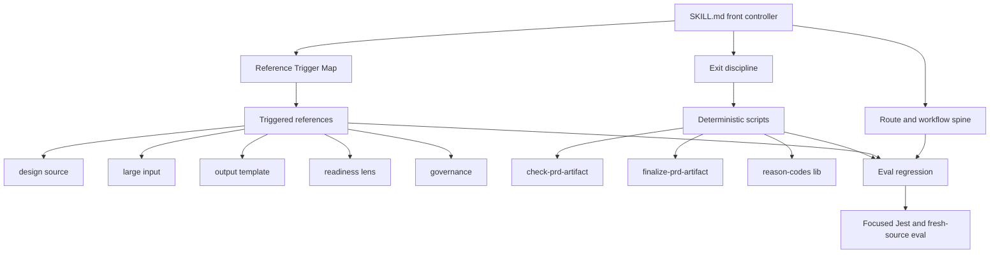
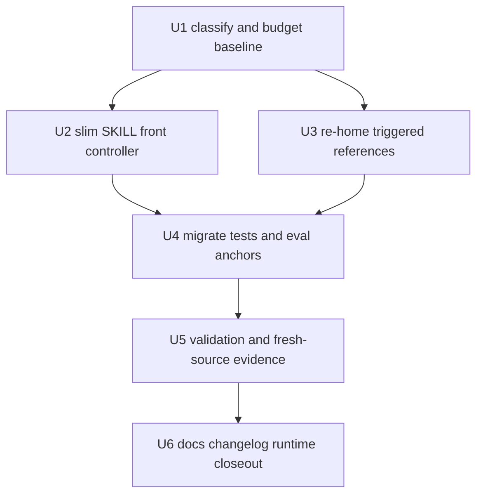

# refactor: spec-prd front-controller 分层瘦身

## Summary

基于最新 source 状态继续推进 `skills/spec-prd/SKILL.md` front-controller 分层瘦身：当前入口已完成一轮小步迁移（60653B≈15163 proxy tokens -> 58012B≈14503 proxy tokens），Phase 4 blocking `reason_codes` 全量列表和两段 observed-failure 长解释已下沉到 `prd-readiness-lens.md`，相关 parity / contract 测试已迁移。

**本轮修订的核心结论（基于实测 source 事实）：** 规划期实测显示 R2 显式点名的 must-stay 段落（Workflow Contract Summary + Interaction Method + Reference Trigger Map + Decision Card + Four Legal Stop Points 压缩版 + Phase 0-4 Execution Flow）合计已约 42384B≈10596 proxy tokens，**超出早期 7000-9000 目标上限约 18%，且这还未计入同为 hot-path、不可下沉的 Purpose / Core Principles / Execution Compass / User-Visible Execution UX Protocol**。同时逐段探测证明：入口 Phase 1 的 owner-answer fidelity、Requirement Analysis Gate、Pre-Write Closure Gate、closure-disposition razor、Push-Right 等长段，在 references 中**没有近逐字副本**——references 反而写着 `see SKILL.md ... single source of truth` 反向指回入口。因此「可安全删除的逐字重复副本」实测接近 0。综合这两条算术事实：**7000-9000 数字目标物理不可达，Deep 结构迁移（U2/U3）大概率无正收益，本工作的默认预期结局是「关闭或机会性轻清理」**，而非从零重构。

据此，剩余工作的执行形态是：U1 先做一次调查，用 floor gate 判定是否存在 Deep 方案的正当性；默认导向轻清理——删除极少量可证明的逐字冗余、加防回涨 negative assertion 固化已完成的下沉、并在 closeout 诚实报告 must-stay floor / triggered-path budget / 行为未经 live 验证。只有 U1 同时举证「存在 `>=4000` proxy tokens 的 R11-safe 可清除空间」且「15k 现状有可观测退化证据」时，才解锁 U2-U6 的结构迁移。入口无论走哪条路径都必须继续保留路由、workflow spine、关键边界、reference trigger map、Decision Card、四个合法停点压缩版和 Phase 0-4 骨架。contract tests 与 evals 证明「迁移后的规则仍存在于对应 source owner、入口仍有触发指针」这一结构守恒；fresh-source eval 只用于证明「行为改善」这类 live-model 声明，不是结构守恒的必需前置。

**术语定义（本计划）：** `estimated initial-load tokens`（≈ `context budget`）指入口 `SKILL.md` 首次被加载时进入上下文的近似 token 量，本计划以可复现代理度量（`wc -c ÷ 4`，或后续 committed 的确定性 token 估算脚本）近似，advisory 而非精确 attention 分布。`triggered-path budget` 指某条正常执行路径实际触发加载的入口 + reference 代理体积，例如 PRD handoff 前几乎必经的 `prd-readiness-lens.md` 当前为 33646B≈8412 proxy tokens；它不计入初始加载，但计入端到端上下文成本判断。`冷路径`（cold path）指仅在特定触发信号后才需加载的 reference 细则；`热路径`（hot path）指每次进入 `$spec-prd` 都必须在场的 spine 与安全边界。

---

## Decision Brief

- **Recommended approach:** 默认走轻清理，而不是 Deep 结构迁移。U1 先算 must-stay floor 并做问题真实性判断：由于实测 floor（≈10596 proxy tokens）已超早期目标上限、且入口长段在 references 无近逐字副本，Deep 方案默认判 not-applicable。轻清理 = 删除可证明的逐字冗余（实测接近 0）+ 加防回涨 guard 固化已完成下沉 + closeout 诚实报告 floor / triggered-path / 行为未验证。只有 U1 双重举证（`>=4000` proxy tokens R11-safe 可清除空间 **且** 15k 现状可观测退化）才解锁 U2-U6。
- **Key decisions:** `SKILL.md` 继续拥有 public workflow identity 和 hot-path safety spine；`references/*.md` 拥有设计源、大输入、readiness、输出模板、产品 lens、governance 等触发细节，但 owner-answer fidelity / Requirement Analysis Gate / closure-disposition razor 等承重语义的 SSOT 仍在入口，references 反向指回，不得为凑迁移把 SSOT 挪走导致指针断链；`scripts/*.js` 只守 deterministic facts；`evals/examples.json` 是 examples-as-context，不变成 runtime API 或 semantic scorecard。已完成的 reason-code 全量列表下沉不再作为待办。
- **Host-commoditization boundary（评审新增）：** 手工把 `SKILL.md` 切成 front controller，本质是在赌宿主不提供可靠的原生按需上下文加载；而本模式沉淀文档的 `invalidation_condition` 自己就写明「若 host skill runtime 原生支持可靠按需加载则需重估」。因此投入 Deep 结构迁移前必须先评估宿主 skill-reference / progressive-disclosure 能力的到达时间；若临近，本工作停在轻清理，不重建宿主即将免费提供的能力（对齐角色契约「系统边界」）。
- **Validation focus:** 当前/after 入口代理 token 估算（`wc -c ÷ 4`）、must-stay floor 复算、normal authoring / readiness handoff triggered-path budget、`node skills/spec-prd/scripts/run-evals.js --json`、focused `spec-prd` Jest 套件、fresh-source eval 记录、`git diff --check` 和 changelog format。
- **Largest risks / boundaries:** 最大风险是为追一个物理不可达的 token 数字而误删 owner-question、checkpoint、design-source、Codex degraded、finalize/checker handoff 等承重边界，或把体积从入口搬到几乎必经的 readiness reference 后误报收益。缓解方式是把验收门锚定在 R2/R11 完整性而非 token 数字，每个迁移块必须有“从哪里迁到哪里”的映射和测试锚点，并同时报告 initial-load 与 triggered-path budget；不得用脚本判 semantic readiness；不得手改 `.claude/`、`.codex/`、`.agents/skills/`。

---

## Problem Frame

`spec-prd` 已经具备大 workflow 的关键工程资产：9 个 references、checker/finalize/glossary/eval runner 脚本、111 个 eval fixture cases、focused contract tests、fresh-source eval 记录，以及 `evaluation-governance.md` 对成熟度和证据边界的说明。问题不是能力缺失，而是入口 `SKILL.md` 仍承载了不少冷路径细节和历史失败案例。原始 plan baseline 为 60653 bytes≈15163 proxy tokens；最新代码已完成一轮小步瘦身，当前 `SKILL.md` 为 58012 bytes≈14503 proxy tokens（advisory；`context_sizer` 不存在于本仓，不作依据）。

近期 Darwin/yao 类评测把这个问题暴露为 P1：对于 `spec-prd` 这种核心 workflow，不能机械套小 skill 的极低 token 预算，否则会把 workflow 压成路由菜单，丢掉实际执行骨架。正确目标是把入口变成 front controller：每次调用先读到足够的主链路和安全边界，只有触发设计源、大输入、readiness、输出模板、governance 等信号时才加载相应 reference。注意 readiness 是 `$spec-prd` 正常 handoff 前的高频触发路径，`prd-readiness-lens.md` 当前 33646 bytes≈8412 proxy tokens；因此收益评估必须同时看 initial-load 与 triggered-path budget。

**must-stay floor 算术事实（评审新增，实测）：** 对 R2 显式点名的 must-stay 段落逐段测量（可复现，`wc -c ÷ 4`）：Workflow Contract Summary≈556、Interaction Method≈395、Reference Trigger Map≈607、Run-Local Decision Card≈871、Four Legal Stop Points（已压缩）≈618、Execution Flow(Phase 0-4 skeleton + Phase 4 discipline)≈7549，仅这几项合计已约 10596 proxy tokens，**尚未计入同为 hot-path 的 Purpose、Core Principles、Execution Compass、User-Visible Execution UX Protocol**。其中 Execution Flow 单段就占全文约 52%，而 Phase 1(≈4322 proxy tokens)是全文最大单块。这意味着早期设定的 7000-9000 目标区间在算术上不可达：要进入区间必须砍掉三分之一以上 Phase 0-4 骨架，直接违反 R2。因此本计划不再把 7000-9000 作为目标（连 stretch 也不是），验收门改锚定 R2/R11 完整性 + 实删是否为真冗余。

**问题真实性前提（评审新增）：** P1 定级目前仅源自一次评测读数（n=1），且本计划自认代理 token 度量不代表模型实际 attention 分布。因此 U1 分类阶段须先判断 15k 现状是否造成可观测代价（截断、丢边界、路由错误、执行质量退化）。若举不出可观测退化证据，则本工作的真实性质是「指标偏大」而非「行为受损」，应降级为机会性冷路径清理，不启动 Deep 结构迁移（见 A5、P2 简方案分支）。最优情况是「行为不变、代理指标下降」——这对用户不可见，需诚实纳入风险/收益权衡，不得以指标改善冒充用户增益。

本计划承接新沉淀的知识文档 `docs/solutions/architecture-patterns/front-controller-triggered-references-gates-eval-regression-2026-07-01.md`，并与已完成的 `docs/plans/2026-06-30-002-feat-spec-prd-skill-optimization-plan.md` 区分：前者已解决 section-id、receipt、澄清专业化和 P2 样本证据；本计划只处理 `spec-prd` source topology 和 hot-path context budget。

---

## Requirements

- R1. 以最新 `skills/spec-prd/SKILL.md` 58012 bytes≈14503 proxy tokens 作为当前执行 baseline，并以实测 must-stay floor（R2 点名部分当前 ≈10596 proxy tokens，随 source 变化重算）作为不可逾越的物理下限。**不设低于 floor 的绝对 token 目标**：早期方案的 7000-9000 区间已被实测证明低于 floor、算术不可达，本轮予以废弃（既非目标也非 stretch）。该 token 数以可复现代理度量近似（`wc -c ÷ 4`，或后续 committed 的确定性估算脚本），不依赖仓库中并不存在的 `context_sizer`。**达标机制说明：** 允许的收益只有两种——删除可证明的逐字冗余副本，或在不改语义、不违反 R2/R11 的前提下压缩非承重措辞；若 must-stay spine 已占满 floor（现状如此），合法结局是按 C1 报告 floor 与实际删除增量并停止，不为了指标删除承重边界。
- R2. **（must-stay hot-path SSOT）** 保留 public workflow identity、near-neighbor route boundary、source/runtime boundary、artifact invariant、Interaction Method、Reference Trigger Map、Decision Card、Four Legal Stop Points 压缩版、Phase 0-4 skeleton 和 Phase 4 finalize/checker discipline。本条是 must-stay 清单的唯一真相源；C2、U1、U2 引用它，不再各自复述以免漂移。
- R3. 下沉长 failure cases、guard/hook 细节、design-source 细则、owner-answer fidelity 长解释、closure-disposition razor 长解释、output template 细节到已有 references 或 tests。已完成：Phase 4 blocking reason_code 全量列表迁至 `scripts/lib/reason-codes.js` + `prd-readiness-lens.md`，入口只保留 hot-path pointer；后续不得把该全量列表重新复制回 `SKILL.md`。
- R4. 所有 reference 迁移必须有触发信号和 owner：普通 authoring/refinement 默认只加载必要热路径；UI/design、大输入、readiness/output/governance 按信号加载。
- R5. Deterministic gates 只守路径、frontmatter、receipt、hash、reason_code、machine-owned section identity、input scan 等事实；不得新增脚本语义判断 PRD 是否“足够好”。
- R6. Eval regression 必须证明 routing、readiness、design-source、checkpoint、source/runtime、Codex degraded 和 helper-boundary 语义没有因瘦身退化。
- R7. Contract tests 必须从“旧内容在 `SKILL.md` 中逐字出现”迁移为“入口有触发指针，reference 有承重规则，scripts/evals 有事实和样例守护”。
- R8. 不新增 per-skill `manifest.json`、全局治理索引、第二 PRD artifact topology、new workflow、new agent、progress ledger、state machine 或 runtime API。
- R9. 任何 source 变更必须更新 `CHANGELOG.md`；如 source 变更后需要 runtime 刷新，只能通过 `spec-first init` 投射，不能手改 generated mirrors。
- R10.（R1 的派生风险义务，非独立目标）因为瘦身会引入行为静默漂移风险：如果 closeout 声称行为层改善，必须有 fresh-source eval、真实样本运行或等价 fresh read-only review；否则只能声明结构验证通过，行为验证未运行。
- R11. **承重安全边界不得依赖软触发。** 区分两类下沉内容：(a)「丢了只是质量下降」的细则可走软 trigger + 冷 reference；(b)「丢了就破防」的承重安全边界（owner-answer fidelity、checkpoint non-ready、design laundering、direct-write 禁令、Codex degraded enforcement、finalize/checker evasion）必须要么保留在 hot path（哪怕压缩到一句 policy），要么由确定性 script gate（如 `check-prd-artifact.js`/`finalize-prd-artifact.js`）兜底，不得仅靠 LLM 软触发加载 reference 来守护。理由：contract test 只能证「文字存在于 reference」，不能证「模型在需要时加载了它」。
- R12. 同时记录 `initial-load budget` 与 `triggered-path budget`。至少报告 `SKILL.md` 当前/after 体积，以及正常 PRD readiness handoff 会触发的 `prd-readiness-lens.md` 体积；不得把“从入口移到高频 reference”的体积转移包装成端到端成本下降。

---

## Assumptions

- A1. 入口瘦身目标以可复现代理度量（`wc -c ÷ 4`，或后续 committed 的确定性估算脚本）近似 `estimated initial-load tokens` 为量化信号；它是近似指标，不替代行为验证。注意：本计划早期草稿引用的 `context_sizer` 并不存在于本仓、不在 PATH、也不是 `spec-first` 子命令，故不作为可复现度量依据。
- A2. 当前 references 已覆盖主要冷路径 owner；本计划默认 extend existing references，不创建新 reference。只有实施时发现现有 owner 混淆，才允许另起新文件，并必须补 reuse/new 决策。
- A3. `evaluation-governance.md` 对 yao-style output scorecard 的 out-of-scope 决策继续有效。本计划不重开自动主观 PRD 打分。
- A4. 当前 Codex 没有与 Claude PreToolUse/Stop hook 等价的 PRD ready-field 强制能力；瘦身后仍必须显式保留 degraded enforcement wording。
- A5. 本计划把 15k 初始加载视为值得处理的问题，前提是它确有可观测代价（如截断、丢边界、路由错误）。若实施 U1 阶段无法举证现状造成可观测执行退化，应把本工作降级为机会性冷路径清理，而非 Deep 结构重构——见 Problem Frame 的问题真实性说明。
- A6. 最新代码已经完成部分 front-controller 化：reason-code parity 改为 `code -> readiness lens + SKILL hot-path pointer`，observed failure details 部分下沉，focused tests 与 eval runner 当前通过。后续实施必须从该状态继续，不能按旧 plan 假设把这些工作当未完成任务重做。
- A7. `prd-readiness-lens.md` 虽是 triggered reference，但它在正常 PRD handoff 前高频触发；因此它不是 free storage。任何迁移到 readiness lens 的 prose 都必须能解释为什么它属于 handoff/readiness 判断，而不只是为了降低入口 token。

---

## Scope Boundaries

- 不改变 `$spec-prd` 的 WHAT/WHY 语义，不把它改成 plan、task、debug、review 或 app consistency audit。
- 不改默认 PRD artifact 路径 `docs/brainstorms/*-requirements.md`，不新增 `docs/prds/`。
- 不把 semantic readiness 编进 `check-prd-artifact.js`、`finalize-prd-artifact.js` 或 eval runner。
- 不新增 `manifest.json`、package lifecycle schema、scorecard baseline、global governance registry 或 public workflow entrypoint。
- 不修改 generated runtime mirrors；如实施阶段需要刷新，使用 `spec-first init` 并记录 projection evidence。
- 不把 `evals/examples.json` 当作 runtime API、state machine 或 semantic proof。
- 不以“测试锚点少了”为目标删除 contract coverage；测试迁移必须让新结构可被长期守护。

### Deferred to Follow-Up Work

- 真实 provider-backed A/B PRD output quality scorecard 仍按 `evaluation-governance.md` 记录为 out of scope。
- host-level owner-answer provenance、transcript-bound question receipt 和 Codex hook 等价能力不在本计划中实现。
- 若后续 spec-first 决定采用 per-skill manifest 作为 source truth，再另起 governance/packaging plan；本计划不提前兼容。

---

## Completion Criteria

- C1. 可复现代理度量（`wc -c skills/spec-prd/SKILL.md ÷ 4`，或后续 committed 的确定性估算脚本）显示估算初始加载相对当前 baseline（58012 bytes≈14503 proxy tokens）下降，且进入 7000-9000 区间仅作为 stretch；若未进入，计划 closeout 明确说明未达标的承重原因。**真正的验收门是 R2 的 must-stay 清单完整性，而非这个数字**：数字达标但删了 R2/R11 承重边界 = 不通过；数字未达标但 must-stay 清单完整且已尽力压缩 = 走承重原因说明后可通过。before/after 用同一度量方式取数，并保留 original baseline（60653 bytes≈15163 proxy tokens）作为历史对照。
- C2. `SKILL.md` 仍在入口层包含 route boundary、artifact invariant、source/runtime boundary、Interaction Method、Reference Trigger Map、Decision Card、Four Legal Stop Points 压缩版、Phase 0-4 skeleton 和 Phase 4 finalize/checker handoff discipline。
- C3. 每个迁移出 `SKILL.md` 的承重规则在对应 reference、script、eval 或 test 中有明确落点，并有测试或 fresh-source eval 锚点。
- C4. `tests/unit/spec-prd-contracts.test.js` 不再强迫冷路径长文出现在入口，但必须锁入口 trigger pointers 和 reference reachability。
- C5. `tests/unit/spec-prd-reason-code-parity.test.js` 继续保证 code-owned blocking reason codes 与 prose consumer 可见性一致；当前已采用 code -> readiness lens parity + SKILL hot-path pointer 结构，后续不得退回入口全量列表复制。
- C6. `node skills/spec-prd/scripts/run-evals.js --json` 通过，且 eval fixture coverage 继续覆盖 routing、evidence、readiness、design-source、checkpoint、source/runtime、Codex degraded 和 execution UX。
- C7. Focused Jest 通过：`spec-prd-contracts`、`spec-prd-checker-unit`、`spec-prd-finalize`、`spec-prd-evals-unit`、`spec-prd-reason-code-parity`、`prd-prewrite-guard-hook`、`prd-readiness-guard-hook`。
- C8. 如变更 skill prose 语义或关键 route/readiness wording，新增或更新 `docs/validation/spec-prd/` fresh-source eval 记录，明确 `passed`、`passed-with-concerns` 或 `not_run`，不得声称未执行的 eval 通过。
- C9. `CHANGELOG.md` 有 compact `(user-visible)` 条目，说明 source/runtime 边界和执行过的验证。
- C10. 若刷新 runtime mirrors，`spec-first init` 后必须验证 Claude/Codex 关键 mirror 与 source 一致；若未刷新，closeout 必须明确 `runtime not refreshed`。
- C11. Closeout 同时报告 `SKILL.md` initial-load budget 与 readiness handoff triggered-path budget；如果只是把入口 prose 搬到高频 reference，不得声明端到端上下文成本改善。
- C12. `spec-prd-contracts` 或专用 topology test 锁住 after-baseline 防回涨：至少禁止完整 `BLOCKING_REASON_CODES` 列表、observed-failure 长解释、以及已迁出的冷路径 owner prose 回流 `SKILL.md`；若实施者设置 after-edit byte/proxy-token 上限，阈值必须高于实际 after 值并说明承重余量。

---

## Direct Evidence Readiness

- target_repo: `spec-first`
- evidence_sources: direct source reads, existing plans, docs/solutions recall, focused `rg`, `wc -c` 代理 token 估算, task-governance-signals, git status
- source_refs:
  - `docs/10-prompt/结构化项目角色契约.md`
  - `skills/spec-prd/SKILL.md`
  - `skills/spec-prd/references/evaluation-governance.md`
  - `skills/spec-prd/references/prd-readiness-lens.md`
  - `skills/spec-prd/references/product-expert-lens.md`
  - `skills/spec-prd/evals/examples.json`
  - `tests/unit/spec-prd-contracts.test.js`
  - `tests/unit/spec-prd-reason-code-parity.test.js`
  - `docs/solutions/architecture-patterns/front-controller-triggered-references-gates-eval-regression-2026-07-01.md`
  - `docs/solutions/architecture-patterns/rebar-structure-skill-simplification-pattern-2026-06-04.md`
  - `docs/solutions/workflow-issues/skill-prose-rewrite-contract-test-coverage-2026-06-28.md`
- current_revision: `eb874f72`
- worktree_status: 写入本计划前已有 dirty worktree：`CHANGELOG.md`、`CONCEPTS.md`，以及未跟踪的 `docs/solutions/architecture-patterns/front-controller-triggered-references-gates-eval-regression-2026-07-01.md`
- confidence: high for topology and test-surface plan; medium for remaining token-reduction ROI because最新 source 已部分瘦身，剩余可删空间需要重新 inventory
- limitations: 未执行 subagent dispatch，按 Codex 授权边界记录 `dispatch_authorization_missing` 并用内联只读研究代偿；未使用 Graphify/provider evidence；未运行 `$spec-prd` live behavior eval；本次方案更新只依据当前 source/test direct evidence，不声明 live-model 行为改善

---

## Direct Evidence

- repo_scope: `skills/spec-prd/**`、`tests/unit/spec-prd-*`、`tests/unit/prd-*-guard-hook.test.js`、`docs/solutions/**`、`docs/validation/spec-prd/**`
- source_reads_completed:
  - 读取 `skills/spec-prd/SKILL.md` 的 frontmatter、Purpose、Workflow Contract Summary、Interaction Method、Capability Boundary、Core Principles、Execution Compass、User-Visible UX Protocol、Reference Trigger Map、Decision Card、Four Legal Stop Points、Failure-Mode Blacklist 和 Phase 0-4。
  - 读取 `evaluation-governance.md`，确认它已定义 production posture、examples-as-context、deterministic script facts、focused Jest、fresh-source eval 与 yao-style scorecard out-of-scope 边界。
  - 读取 `prd-readiness-lens.md` 和 `product-expert-lens.md`，确认 readiness、closure disposition、design-source、Product Expert Lens 等细节已有 reference owner。
  - 读取 `tests/unit/spec-prd-contracts.test.js` 关键锚点，确认当前测试锁 source topology、entrypoint anchors、failure blacklist、execution UX、eval fixture coverage、fresh-source eval artifacts 和 stop-point SSOT。
  - 读取 `skills/spec-prd/evals/examples.json` 概要，确认当前有 111 cases，contract 测试要求至少 70 cases 并覆盖 routing、evidence、readiness、helper boundary 等 tags。
  - 以 `wc -c` / `fs.statSync` 代理估算（advisory）：original plan baseline `SKILL.md` 约 60653 bytes ÷ 4 ≈ 15163 initial-load tokens；最新 source 为 58012 bytes ÷ 4 ≈ 14503 proxy tokens。注意：本计划早期草稿曾把该数记为「运行 context_sizer 得到 15144」，但 `context_sizer` 不存在于本仓/PATH/`spec-first` 子命令，故该数应视为代理估算而非 confirmed 工具输出。
  - 以同一代理度量记录 high-frequency triggered reference：`skills/spec-prd/references/prd-readiness-lens.md` 当前 33646 bytes ÷ 4 ≈ 8412 proxy tokens；正常 PRD handoff 前会加载 readiness lens，故剩余优化必须同时看 triggered-path budget。
  - 读取最新 `tests/unit/spec-prd-reason-code-parity.test.js`，确认它已要求 `SKILL.md` Phase 4 指向 readiness lens，且 `prd-readiness-lens.md` 覆盖全部 `BLOCKING_REASON_CODES`，入口不再复制全量列表。
  - 运行 `spec-first internal task-governance-signals`，返回 `candidate_level: deep`，原因包括 `cross-module`、`critical-path-hit`、`keyword-hit` 和 `candidate-deep`。
  - 读取相关完成计划 `docs/plans/2026-06-30-002-feat-spec-prd-skill-optimization-plan.md` 和 `docs/plans/2026-07-01-004-feat-spec-prd-execution-ux-plan.md` 的前部，确认本计划不复写既有 completed 工作。
- source_reads_required:
  - 实施前重新读取完整 `skills/spec-prd/SKILL.md` 与所有 target references，因为当前仓库频繁迭代且 tests 逐字锚点可能已变。
  - 实施 U4 前读取完整 `tests/unit/spec-prd-reason-code-parity.test.js` 和 `scripts/lib/reason-codes.js`，但 treat as already-migrated baseline；只在继续调整 reason-code prose owner 时再改该测试。
  - 实施 U4 前读取 `run-evals.js` 和 `evals/examples.json` contract 部分，确认 fixtures schema 不被误扩。
- commands_or_tools_used:
  - `spec-first startup-reminder --codex`
  - `git status --short`
  - `git rev-parse --short HEAD`
  - `rg --files skills/spec-prd`
  - `rg -n` focused searches
  - `wc -l` / `wc -c`（代理 token 估算）
  - `spec-first internal task-governance-signals --source plan-declared --json`
  - `npx jest tests/unit/spec-prd-reason-code-parity.test.js tests/unit/spec-prd-contracts.test.js --runInBand`
  - `node skills/spec-prd/scripts/run-evals.js --json`
- impact_on_plan:
  - 计划深度采用 Deep，因为触及 public workflow skill 的 source topology、contract tests、eval evidence、runtime projection boundary 和 knowledge recall。
  - 不做 external research；本仓库已有充足本地模式、前序 plans、docs/solutions 和 source tests。外部行业方法论已由前序讨论沉淀为本地 knowledge 文档，本计划以 current source 为准。
  - 最新 focused tests 已证明当前 topology 可被 contract/parity 测试接受；本计划的剩余开发应优先判断是否还有可观测 ROI，而不是重复已完成的迁移。
- key_findings:
  - `SKILL.md` 入口已经有 Reference Trigger Map，且 Phase 4 reason-code 全量列表已下沉；入口仍有不少承重边界和部分可疑冷路径细则，需要重新 inventory 后决定是否继续压缩。
  - `evaluation-governance.md` 已明确 examples-as-context 与 deterministic script facts 的证据边界，适合作为 eval/test 迁移依据。
  - `spec-prd-contracts.test.js` 当前仍有大量入口逐字 anchors，但已经包含 source topology、readiness reference 和 Phase 4 pointer 断言；后续瘦身必须同步调整测试，否则要么阻止合理迁移，要么形成 false-green。
  - 近期 `User-Visible Execution UX Protocol` 属 hot path，不能下沉到冷 reference；它是每次执行都应扫描到的 UX/安全纪律。
- limitations:
  - 代理 token 度量（`wc -c ÷ 4`）是估算，不代表模型实际 attention 分布。
  - 本计划不声明 `$spec-prd` live output 质量提升；该结论需要后续 fresh-source eval 或真实样本对照。

---

## Context & Research

### Relevant Code and Patterns

- `skills/spec-prd/SKILL.md`：当前 front controller 候选入口，必须保留 workflow identity、boundaries、Reference Trigger Map、Decision Card 和 Phase skeleton。
- `skills/spec-prd/references/design-source-evidence.md`：设计链接、截图、Figma、交互状态和 degraded design acceptance 的冷路径 owner。
- `skills/spec-prd/references/large-input-checkpoint.md`：oversized/multi-source/resume 风险和 checkpoint discipline 的冷路径 owner。
- `skills/spec-prd/references/prd-readiness-lens.md`：readiness packs、must-not-ready、handoff entropy、script facts vs LLM judgment 的 owner。
- `skills/spec-prd/references/prd-output-template.md`：durable PRD skeleton、section contract、closeout wording 和 template details 的 owner。
- `skills/spec-prd/references/product-expert-lens.md`：Requirement Analysis Gate 后的 risk-to-write-target、downstream confirmation risk、owner question ordering owner。
- `skills/spec-prd/references/evaluation-governance.md`：eval/governance/lifecycle/public-claim boundary owner。
- `skills/spec-prd/scripts/check-prd-artifact.js`、`finalize-prd-artifact.js`、`scripts/lib/reason-codes.js`：deterministic gate and reason-code source。
- `tests/unit/spec-prd-contracts.test.js`：source topology、trigger pointer、eval coverage 和 fresh-source eval artifact contract 的主要测试 owner。

### Institutional Learnings

- `front-controller-triggered-references-gates-eval-regression-2026-07-01.md`：本计划采用的主模式，强调入口 hot path、triggered references、deterministic gates 和 eval regression 的分层。
- `rebar-structure-skill-simplification-pattern-2026-06-04.md`：提醒先找承重轴再删文件；测试要绑定能力和 source/runtime 边界，不绑定历史文件形状。
- `skill-prose-rewrite-contract-test-coverage-2026-06-28.md`：提醒 contract tests green 不等于新增/迁移行为被测到；迁移 prose 时必须新增 witness 新结构的断言。

### External References

- 未使用外部网页或行业资料作为本计划证据。用户前序讨论中的行业方法论已先沉淀为 repo-local advisory knowledge，本计划只从当前 source、tests 和 knowledge docs 规划。

---

## Key Technical Decisions

- **KTD1. 入口目标是 front controller，不是 miniature workflow。** `SKILL.md` 仍需保留每次进入 `$spec-prd` 都必须看到的 route、boundary、UX、Decision Card 和 exit discipline；不能只留下“去读 reference”的菜单。
- **KTD2. 冷路径内容按 owner 下沉到已有 references，默认 extend 而不是 new。** 当前 reference owner 已覆盖设计源、大输入、产品 lens、输出模板、readiness、evidence/topology、domain language 和 governance。新增 reference 会增加 source topology，而不是减负。
- **KTD3. 保持现有 reason_code topology，不得回退入口全量列表复制。** 当前 baseline 已完成下沉：code truth 在 `scripts/lib/reason-codes.js`，完整 prose parity 在 `prd-readiness-lens.md`，`SKILL.md` 只保留“任何 blocking reason_codes 阻止 ready handoff”的 hot-path pointer/policy guard。后续实施不得把全量 `BLOCKING_REASON_CODES` 重新复制回入口；只有继续移动或折行 readiness 列表时，才同步调整 `spec-prd-reason-code-parity` 的锚点/窗口。
- **KTD4. Failure-mode blacklist 保留短形态，长解释迁移。** Direct write、checkpoint escape、fake headless、owner answer laundering、design laundering、checker/finalize evasion、runtime mirror patch 这些 observed failures 需要入口可见，但案例长解释和恢复细则可以转到相应 reference 或 eval cases。
- **KTD5. Eval regression 优先守语义边界，不守历史位置。** Tests 应证明旧边界迁移后仍可被找到，例如入口 trigger pointer 存在、reference 承载细则、eval case 覆盖 failure mode，而不是要求冷路径长文仍在 `SKILL.md`。
- **KTD6. Fresh-source eval 是行为声明的证据上限。** Contract tests 和 eval runner 是 file-backed deterministic evidence；它们不证明 live model 会稳定执行新结构。若 closeout 声称行为改善，需要 fresh read-only eval 或真实样本 run。
- **KTD7. Runtime projection 是实施收尾，不是 source 修复方式。** Source truth 在 `skills/spec-prd/**`、tests、docs 和 templates；`.claude/**`、`.codex/**`、`.agents/skills/**` 只通过 `spec-first init` 刷新。

---

## Existing Capability / Reuse Analysis

- **Inventory:** 已检查 `skills/spec-prd/SKILL.md`、9 个 references、4 个 scripts + `scripts/lib/reason-codes.js`、`evals/examples.json`、focused Jest、`evaluation-governance.md` 和相关 knowledge docs。
- **Decision:** `extend`。本计划不新增 reference、script、schema、manifest、workflow 或 agent；把已有入口内容迁到已有 owner，并重写测试锚点。
- **Source-of-truth:** `skills/spec-prd/SKILL.md` 是 public workflow front controller；`references/*.md` 是 triggered judgment owners；`scripts/*.js` 是 deterministic gate owners；`evals/examples.json` 是 source-owned examples-as-context；`tests/unit/*` 是 regression owners。
- **Rejected owner:** 不把 cold-path 细则放进 `CONCEPTS.md`、`docs/solutions/**` 或 generated runtime mirror。前者只是 advisory vocabulary/learning，后者不是 source truth。
- **Work-phase recheck:** 实施前重新运行 `rg --files skills/spec-prd` 和 focused tests，若 source topology 已变，优先复用最新 owner，不盲目套本计划的文件名假设。

---

## Open Questions

### Resolved During Planning

- 是否更新已有 `2026-06-30-002` 计划而不是新建计划？不更新。该计划已 `completed`，主题是 PRD 澄清专业化和稳定性；本计划是新的 source topology/context-budget refactor。
- 是否按 yao-style per-skill manifest 兼容？不做。`evaluation-governance.md` 已记录不新增 per-skill `manifest.json`，除非 spec-first 后续采用它作为 source truth。
- 是否把目标设为 1000 tokens？不设。大 workflow 需要保留入口 skeleton 和 safety boundaries，目标是 7000-9000 estimated initial-load tokens。

### Deferred to Implementation

- 走简方案还是重方案：由 U1 量化「与 references 逐字重复的 prose 占比」+「下沉后入口必须保留的 trigger/policy 残留体积」后决定。删纯重复即接近目标 → 停在简方案，不做 U2/U3 结构迁移；残留体积+must-stay spine 已接近/超目标下限 → 说明物理拿不到目标并否决重方案（见 A5、U1）。
- 是否举证得到 15k 现状的可观测退化：U1 判断，无证据则降级机会性清理（A5）。
- 每段 prose 的最终迁移落点：实施时需要逐段分类，并在 diff 中保持“从哪里迁到哪里”的 reviewer 可见性。
- `reason-code-parity` 的当前结构已是 baseline：入口只断言 pointer/policy guard，readiness lens 覆盖全部 blocker 码。只有继续移动或折行 readiness 列表时，才调整锚点/窗口；不得把全量列表回流 `SKILL.md`。
- runtime mirror 是否刷新：由实施 closeout 根据 source 变更范围决定；无刷新时必须显式说明。

---

## High-Level Technical Design

> This illustrates the intended approach and is directional guidance for review, not implementation specification. The implementing agent should treat it as context, not code to reproduce.

The front controller owns the first-pass execution skeleton. References own triggered detail. Scripts own deterministic exit facts. Tests and evals prove the refactor did not weaken protected behavior.

---

## Implementation Units

### U1. Classify current entrypoint and lock budget baseline

**Goal:** Build a working migration map for the latest `SKILL.md`: hot path, triggered path, deterministic fact, eval evidence, historical rationale, already-migrated prose, and remaining duplicate prose.

**Requirements:** R1, R3, R7

**Dependencies:** None

**Files:**
- Modify: `docs/plans/2026-07-01-005-refactor-spec-prd-front-controller-plan.md` only if implementation discovers plan assumptions are stale
- Test: `tests/unit/spec-prd-contracts.test.js` if the implementation records a durable source-topology expectation there

**Approach:**
- Measure current state with the reproducible proxy (`wc -c skills/spec-prd/SKILL.md ÷ 4`)，记录 latest baseline（当前约 58012 bytes≈14503 proxy tokens），并保留 original baseline（60653 bytes≈15163 proxy tokens）作为历史对照。
- Measure triggered-path state for high-frequency references, at minimum `prd-readiness-lens.md`（当前约 33646 bytes≈8412 proxy tokens），避免把入口体积转移误报为端到端收益。
- **先做问题真实性判断（见 A5、Problem Frame）：** 判断 15k 现状是否有可观测退化证据。无证据则本单元产出「降级为机会性清理」的建议，不进入 U2/U3 结构迁移。
- **量化三个比例，作为方案分叉依据：** (1) 与 references 逐字/近逐字重复的 prose 占比；(2) 下沉后入口仍必须保留的 trigger + policy pointer 残留体积；(3) 被移动 prose 是否进入高频 triggered reference（特别是 readiness lens）。若「删纯重复」即可显著降低 initial-load 且不增加高频 triggered-path budget，则停在**简方案**（只删重复副本 + 留 pointer，结构原地不动），不执行 U2/U3 的结构性迁移——用最小 durable mechanism 解决问题。若残留体积 + must-stay spine 已接近/超过目标下限，说明本 skill 物理上拿不到目标收益，据此在 closeout 说明并否决重方案。
- **分叉阈值（防主观化）：** 安全可删/可压缩空间预计 `<1000 proxy tokens` 时停止或只做机会性清理；预计 `>=2000 proxy tokens` 且不增加 readiness triggered-path budget 时进入简方案；只有存在可重写的 must-stay spine、预计总降幅 `>=4000 proxy tokens`、且 R11 承重边界能继续留 hot path 或 script gate 兜底时，才进入重方案。`1000-1999 proxy tokens` 区间默认走简方案，除非 U1 发现明确可观测退化证据需要更强处理。
- Produce an implementation-local section inventory from `skills/spec-prd/SKILL.md`。**给每段 must-compress 的 prose 标注其当前在 `tests/unit/spec-prd-contracts.test.js` / `spec-prd-reason-code-parity.test.js` 中的断言行号**，供 U2/U4 prose 与测试锁步编辑。
- For each candidate removal, write a migration target: existing reference, script, eval, test, docs/validation, or delete-as-duplicate.
- Mark “must stay hot path” content before editing，清单以 **R2（must-stay SSOT）** 为准，不另立副本。同时按 R11 标注哪些属「承重安全边界」（不得依赖软触发），并标注哪些已在上一轮迁移完成，避免重复迁移。

**Patterns to follow:**
- `docs/solutions/architecture-patterns/rebar-structure-skill-simplification-pattern-2026-06-04.md`
- `docs/solutions/architecture-patterns/front-controller-triggered-references-gates-eval-regression-2026-07-01.md`

**Test scenarios:**
- Happy path: inventory maps every removed paragraph to a target owner or duplicate deletion rationale.
- Edge case: a paragraph protects an observed failure mode and has no clear reference owner -> keep compressed form in `SKILL.md` rather than delete.
- Error path: inventory proposes a new reference without boundary reason -> reject or record explicit `new` decision.

**Verification:**
- Current metric recorded: 入口代理 token 估算（`wc -c ÷ 4`）、readiness triggered-path 代理 token 估算 and file list.
- Reviewer can trace each high-risk removal to a destination.
- 重复占比 + 残留体积 + 高频 triggered-path 影响三个比例已量化，方案分叉（简方案 / 重方案 / 否决）有明确依据。

---

### U2. Slim SKILL.md into a front controller

**Goal:** Reduce `SKILL.md` to the route/skeleton/exit spine while preserving first-pass safety and execution UX.

**Requirements:** R1, R2, R3, R4, R9, R11

**Dependencies:** U1

**前置门（评审新增）：** 真正压缩承重入口语义前，先判断当前请求是否显式授权 subagents/personas/fresh-source reviewer。若已授权且 runtime 可调度，运行 fresh-source eval 或等价 fresh read-only reviewer；若未授权或调度不可用，不把它视为永久阻塞，但必须把 U2 范围缩到「纯冗余 prose 删除/压缩」或当前 orchestrator 的 single-agent fresh read-only review 可覆盖的改动，并在 closeout 明确不声明 live-model 行为改善。只有在 fresh-source eval、真实样本运行或等价独立视角可用时，才允许声明行为层改善。

**Files:**
- Modify: `skills/spec-prd/SKILL.md`
- Modify: `tests/unit/spec-prd-contracts.test.js`
- Test: `tests/unit/spec-prd-contracts.test.js`

**Approach:**
- **达标机制：** 进入 7000-9000 区间仍要求**重写精简保留 spine**，不仅是搬走冷路径段落；但该区间现在是 stretch，不能压倒 R2/R11。逐块预声明哪些保留块要缩、约缩到多少，以及会不会增加高频 triggered-path budget。
- 按 R11 处理承重安全边界：不得把「丢了就破防」的边界降级为软触发 + 冷 reference；要么留 hot path 压缩句，要么由 script gate 兜底。
- Keep route boundary and workflow contract summary compact.
- Keep `User-Visible Execution UX Protocol` because it is every-run execution discipline.
- Keep `Reference Trigger Map`, but make each trigger point to the owning reference instead of restating its details.
- Compress `Canonical: Four Legal Stop Points` to the canonical tuple, field mapping, non-stop reasons, and checkpoint fallback; move long observed-case explanation to eval/reference if still needed.
- Compress `Failure-Mode Blacklist` into shortcut -> recovery table; move detailed examples into eval cases or reference prose.
- Preserve Phase 0-4 headings and major gates, but remove duplicate explanations already owned by references.
- Keep Codex degraded enforcement boundary visible wherever planning handoff or finalize/checker handoff is described.

**Execution note:** Treat this as a behavior-preserving refactor. Do not improve or reinterpret PRD workflow semantics while slimming.

**Patterns to follow:**
- Existing `skills/spec-plan/SKILL.md` spine + references pattern.
- `skills/spec-prd/references/evaluation-governance.md` ownership wording.

**Test scenarios:**
- Happy path: entrypoint still contains public workflow description, route-out hints, `docs/brainstorms/*-requirements.md`, generated mirror boundary, Interaction Method, Reference Trigger Map, Decision Card fields, legal stop-point anchor, and Phase 4 finalize/checker pointer.
- Edge case: `checkpoint-prd` remains non-ready and cannot be described as planning handoff.
- Edge case: Codex degraded enforcement is still explicit.
- Error path: `SKILL.md` no longer contains reference trigger for design-source or readiness -> contract test fails.

**Verification:**
- 代理 token 估算（`wc -c ÷ 4`）after edit shows initial-load reduction and triggered-path impact, or closeout explains why a retained hot-path block is load-bearing.
- `tests/unit/spec-prd-contracts.test.js --runInBand` passes with migrated anchors.

---

### U3. Re-home cold-path detail into triggered references

**Goal:** Ensure every removed cold-path rule has a current source owner with a trigger, and references do not drift into duplicate hot-path spines.

**Requirements:** R3, R4, R5, R8

**Dependencies:** U1

**Files:**
- Candidate modify only when U1 migration map points there: `skills/spec-prd/references/design-source-evidence.md`
- Candidate modify only when U1 migration map points there: `skills/spec-prd/references/large-input-checkpoint.md`
- Candidate modify only when U1 migration map points there: `skills/spec-prd/references/prd-readiness-lens.md`
- Candidate modify only when U1 migration map points there: `skills/spec-prd/references/prd-output-template.md`
- Candidate modify only when U1 migration map points there: `skills/spec-prd/references/product-expert-lens.md`
- Candidate modify only when U1 migration map points there: `skills/spec-prd/references/evaluation-governance.md`
- Candidate modify only when U1 migration map proves current owner fit: `skills/spec-prd/references/evidence-and-topology.md`, `skills/spec-prd/references/domain-language-and-decision-ledger.md`, `skills/spec-prd/references/grill-with-docs-integration.md`
- Test: `tests/unit/spec-prd-contracts.test.js`

**Approach:**
- Move design-source degraded/readiness detail to `design-source-evidence.md` and readiness summary to `prd-readiness-lens.md`.
- Move owner-answer fidelity and closure-disposition long explanation to `prd-readiness-lens.md` or output template, keeping the canonical token/policy pointer in `SKILL.md`.
- Move output shape details, section contract, closeout wording and template skeleton details to `prd-output-template.md`.
- Move product lens/write-target ranking detail to `product-expert-lens.md`.
- Move eval maturity/lifecycle/public-claim wording to `evaluation-governance.md`.
- Avoid copying full readiness lens into `SKILL.md` or `spec-plan`.

**Test scenarios:**
- Happy path: each reference trigger in `SKILL.md` resolves to an existing file and the file contains its key owner concept.
- Edge case: a reference includes a by-reference pointer to `SKILL.md` canonical stop points instead of restating the four-token tuple.
- Edge case: `evaluation-governance.md` still says eval fixtures are examples-as-context, not runtime API or public-claim proof.
- Error path: moved owner-answer fidelity text disappears entirely -> contract/fresh-source eval catches missing boundary.

**Verification:**
- Focused source topology tests pass.
- No generated runtime mirror path is modified.

---

### U4. Migrate contract tests and eval regression to the new topology

**Goal:** Make automated coverage witness the new structure, not the historical location of prose.

**Requirements:** R6, R7, R8

**Dependencies:** U2, U3

**Files:**
- Modify: `tests/unit/spec-prd-contracts.test.js`
- Modify if reason-code prose moves: `tests/unit/spec-prd-reason-code-parity.test.js`
- Modify if examples need new sentinel coverage: `skills/spec-prd/evals/examples.json`
- Modify if eval contract changes are required: `tests/unit/spec-prd-evals-unit.test.js`

**Approach:**
- Replace brittle long entrypoint substring requirements with:
  - hot-path anchors in `SKILL.md`;
  - reference reachability and owner assertions;
  - negative assertions against duplicate or retired structures;
  - eval fixture coverage for known failure modes.
- The full blocking reason-code list has already left `SKILL.md`; preserve the current parity shape: full coverage in `prd-readiness-lens.md` plus a hot-path policy pointer in `SKILL.md`.
- **一等 checklist：测试是数十处耦合的源码编辑，非泛化 note。** 具体已核实的脆弱锚点：
  - `spec-prd-reason-code-parity.test.js` 用锚点句向下扫 8 行（`idx + 8`）：当前 `SKILL.md` 锚点窗口必须找不到任何 full blocking code，`prd-readiness-lens.md` 锚点窗口必须覆盖全部 `BLOCKING_REASON_CODES`。若继续移动或折行 readiness 列表，必须同 commit 改锚点/窗口。
  - `spec-prd-contracts.test.js` 有 `entrypointHeadLines = slice(0, 230)` 硬窗口：入口 intake 锚点必须留在前 230 行，任何段落重排后须复核该窗口仍成立。
  - 该文件约 34 处 `expect(skill)` 断言 pin 在 `SKILL_PATH`（含 ~75 子串的 clarification write-mode 块、execution UX 块）；每压缩一句被 pin 的 prose，须在同 commit 同步改测试，否则 C7 红。
  - 用 U1 产出的「prose→断言行号」映射逐条锁步，避免 false-green（旧子串仍在但迁移行为未被测）与 false-red。
- Add/adjust eval cases only when they protect a moved behavior; do not expand fixture schema or convert examples into deterministic behavior proof.
- Preserve existing tests that validate scripts/checker/finalize deterministic facts.
- Add a lightweight anti-regression guard after the accepted edit: negative assertions that full `BLOCKING_REASON_CODES`, observed-failure long explanations, and any migrated cold-path owner prose do not flow back into `SKILL.md`; optionally add an after-baseline byte/proxy-token ceiling when the final retained hot-path size is known.

**Patterns to follow:**
- `docs/solutions/workflow-issues/skill-prose-rewrite-contract-test-coverage-2026-06-28.md`

**Test scenarios:**
- Happy path: deleting a cold-path paragraph from `SKILL.md` passes only if the owning reference contains the moved rule and `SKILL.md` points to it.
- Edge case: `SKILL.md` keeps the hot-path policy “blocking reason_codes prevent ready” while full list stays in readiness reference -> parity passes.
- Error path: test suite still passes after removing a moved behavior from both `SKILL.md` and reference -> add missing assertion.
- Integration: eval runner still reports `eval_fixture_passed` for the unchanged schema.

**Verification:**
- Focused Jest passes.
- `node skills/spec-prd/scripts/run-evals.js --json` passes.
- Anti-regression guard fails if future edits re-expand `SKILL.md` by copying migrated cold-path details back into the entrypoint.

---

### U5. Validate behavior-preservation evidence

**Goal:** Produce credible evidence that the slimming preserved route/readiness/source-runtime behavior, and label anything not actually verified.

**Requirements:** R6, R10

**Dependencies:** U4

**Files:**
- Create or modify: `docs/validation/spec-prd/fresh-source-eval-2026-07-01-front-controller-refactor.md`
- Modify: `tests/unit/spec-prd-contracts.test.js` only if validation reveals a missing durable assertion

**Approach:**
- Run current/after 入口代理 token 估算（`wc -c ÷ 4`）and readiness triggered-path budget.
- Run focused deterministic suites.
- **预期现实：** 规划阶段已记 `dispatch_authorization_missing`，故 fresh-source eval 很可能落在 fallback/`not_run`。预先承认这一点，并预置补偿控制（eval fixtures + contract tests + 人工 read-only review），使 closeout 不过度依赖极可能不执行的 eval；fallback 时按 `docs/contracts/workflows/fresh-source-eval-checklist.md` 作为具体替代。这也是 U2 前置门要求「dispatch 不可用则缩范围」的原因。
- Run a fresh-source eval or equivalent fresh read-only review using current disk source, not cached skill invocation. The review should check:
  - route-out boundaries;
  - no direct final PRD after read;
  - design-source degraded path;
  - checkpoint non-ready;
  - Codex degraded enforcement;
  - source/runtime mirror boundary;
  - script facts vs LLM semantic judgment.
- If dispatch is unavailable or unauthorized, record `not_run` or single-agent fallback honestly.

**Test scenarios:**
- Happy path: validation record lists source files read, status, limitations, and consumer.
- Edge case: fresh-source eval not run -> record `reason_code: fresh-source-eval-not-run` or equivalent, do not claim semantic pass.
- Error path: reviewer finds a missing hot-path boundary -> return to U2/U3 before closeout.

**Verification:**
- Validation artifact exists and is referenced by tests or changelog when behavior-preservation is claimed.
- No unverified behavior claim appears in closeout.

---

### U6. Update docs, changelog, and runtime closeout posture

**Goal:** Close the refactor with source/runtime boundaries and user-visible evidence clear.

**Requirements:** R9, R10

**Dependencies:** U5

**Files:**
- Modify: `skills/spec-prd/references/evaluation-governance.md`
- Modify if user-facing behavior wording changes: `docs/05-用户手册/22-PRD需求文档质量增强流程.md`
- Modify: `CHANGELOG.md`
- Optional generated by command, not hand-edited: `.claude/**`, `.codex/**`, `.agents/skills/**` only if `spec-first init` is run
- Test: `tests/unit/changelog-format.test.js`

**Approach:**
- Update `evaluation-governance.md` with new source topology and evidence posture if topology or tests changed.
- Update user manual only if user-visible execution wording changed; otherwise avoid docs churn.
- Add changelog entry including current/after token metric, triggered-path budget status, tests run, fresh-source eval status, and runtime mirror status.
- If runtime projection is refreshed, run `spec-first init` and verify target mirror parity. If not refreshed, state `runtime not refreshed`.

**Test scenarios:**
- Happy path: changelog entry names source surfaces, validation commands, runtime status, and generated mirror boundary.
- Edge case: only source prose/tests changed and runtime not refreshed -> closeout says so.
- Error path: generated mirror has hand edits -> reject and regenerate from source.

**Verification:**
- `git diff --check`
- `npx jest tests/unit/changelog-format.test.js --runInBand`
- Projection checks only if runtime refresh happens.

---

## System-Wide Impact

- **Interaction graph:** `$spec-prd` public entrypoint remains the only user workflow. References become stronger cold-path owners; scripts/checker/finalize remain deterministic fact providers; `spec-plan` continues consuming PRD receipt without copying readiness semantics.
- **Error propagation:** A missing migrated rule should surface as contract test/fresh-source eval failure, not as runtime silent behavior drift.
- **State lifecycle risks:** No new persistent workflow state. Run-local Decision Card remains scratch. Plans and validation artifacts are durable evidence only.
- **API surface parity:** Claude `/spec:prd` and Codex `$spec-prd` still share `skills/spec-prd/SKILL.md` source. Runtime mirrors require projection, not hand edits.
- **Surface coverage:** `skills/spec-prd/**` in scope; `tests/unit/spec-prd-*` in scope; `docs/validation/spec-prd/**` in scope; `docs/05-用户手册/**` conditional; `.claude/**`, `.codex/**`, `.agents/skills/**` generated and out-of-scope except projection verification.
- **Integration coverage:** Need at least one validation artifact or fresh read-only review if claiming behavior preservation/improvement because contract tests cannot prove live model behavior. For docs-only plan updates, direct source/test evidence is sufficient and must be labeled as such.
- **Unchanged invariants:** `artifact_kind: prd-requirements`、`docs/brainstorms/*-requirements.md`、`write_mode` vocabulary、`readiness_outcome` vocabulary、script-owned facts vs LLM-owned readiness judgment remain unchanged.

---

## Risks & Dependencies

| Risk | Mitigation |
|------|------------|
| Hot-path shrink removes a safety rule the model needs before loading references | R11：承重安全边界不得降级为软触发+冷 reference，要么留 hot path 压缩句、要么 script gate 兜底；U1 inventory 按 R11 标注承重边界；U4 tests check hot-path anchors。注意 contract test 只证文本存在、fresh-source eval 极可能 `not_run`（见 U5 预期现实），二者都不能证运行时加载，故此风险的真正兜底是 R11，不是行为验证 |
| Tests become false-green because old substrings remain while moved behavior is untested | U4 follows skill-prose contract-test learning: add assertions for new structure and moved owner rules |
| 已完成的 reason_code 下沉被误当待办或被回滚 | Preserve current topology: code truth in `scripts/lib/reason-codes.js`, full prose parity in `prd-readiness-lens.md`, and `SKILL.md` hot-path pointer only |
| Initial-load 指标改善掩盖 high-frequency reference 体积转移 | R12：同时报告 `SKILL.md` initial-load budget 与 readiness handoff triggered-path budget；把迁移到高频 reference 的 prose 视为路径成本，不视为 free deletion |
| Reference files become dumping grounds and recreate the same problem | Each reference keeps a trigger owner; no full workflow spine duplicated in references |
| Token target incentivizes over-compression | C1 treats 7000-9000 as stretch and allows explicit non-hit rationale when retained content is load-bearing；真正验收门是 R2/R11 must-stay 清单完整性而非 token 数字 |
| 问题真实性未证：为不代表 attention 的代理指标做 Deep 重构 | A5/Problem Frame：U1 须先举证 15k 现状造成可观测退化，否则降级机会性清理；U1 先量化重复占比决定简/重方案 |
| Runtime mirrors drift after source change | Use `spec-first init` only as projection step, or explicitly record runtime not refreshed |
| Behavior improvement is overstated | Closeout separates deterministic file-backed validation from fresh-source or live behavior validation |

---

## Documentation / Operational Notes

- This plan itself changes no runtime behavior. It is planning-only.
- Implementation must update `CHANGELOG.md` for all source changes.
- If implementation changes `skills/spec-prd/SKILL.md`, host sessions may still have cached old skill definitions; use fresh-source eval and do not rely on invoking the cached `$spec-prd` skill for validation.
- If implementation refreshes generated runtime mirrors, note whether Claude, Codex, or both were refreshed, and use targeted diff/checks instead of assuming repo-level doctor advisory means failure.

---

## Success Metrics

- **首要成功条件（非 token）：** R2 must-stay 清单在入口完整、R11 承重边界未降级为软触发。token 下降是手段不是目的；数字达标但破坏 R2/R11 = 失败。
- `skills/spec-prd/SKILL.md` 代理 token 估算（`wc -c ÷ 4`）: original baseline ~15163 -> current baseline ~14503 -> after-edit delta；7000-9000 仅为 stretch，未达标须按 C1 说明承重原因，若 U1 判定走简方案，以简方案实际降幅为准。
- `triggered-path budget`: 至少报告 `prd-readiness-lens.md` 当前/after proxy tokens，并说明 normal PRD handoff 是否增加、降低或不变。
- `skills/spec-prd/evals/examples.json` case count and required coverage tags remain at least as strong as current contract expectations.
- Focused `spec-prd` Jest suites pass.
- No new `manifest.json`、public workflow、schema、state machine、runtime API 或 generated mirror hand edit.
- Fresh-source eval or validation record honestly reports behavior-preservation status（含诚实标注 `not_run`）。

---

## Sources & References

- Related source: `skills/spec-prd/SKILL.md`
- Related references: `skills/spec-prd/references/evaluation-governance.md`, `skills/spec-prd/references/prd-readiness-lens.md`, `skills/spec-prd/references/product-expert-lens.md`, `skills/spec-prd/references/prd-output-template.md`, `skills/spec-prd/references/design-source-evidence.md`, `skills/spec-prd/references/large-input-checkpoint.md`
- Related scripts: `skills/spec-prd/scripts/check-prd-artifact.js`, `skills/spec-prd/scripts/finalize-prd-artifact.js`, `skills/spec-prd/scripts/lib/reason-codes.js`, `skills/spec-prd/scripts/run-evals.js`
- Related tests: `tests/unit/spec-prd-contracts.test.js`, `tests/unit/spec-prd-checker-unit.test.js`, `tests/unit/spec-prd-finalize.test.js`, `tests/unit/spec-prd-evals-unit.test.js`, `tests/unit/spec-prd-reason-code-parity.test.js`, `tests/unit/prd-prewrite-guard-hook.test.js`, `tests/unit/prd-readiness-guard-hook.test.js`
- Institutional learning: `docs/solutions/architecture-patterns/front-controller-triggered-references-gates-eval-regression-2026-07-01.md`
- Institutional learning: `docs/solutions/architecture-patterns/rebar-structure-skill-simplification-pattern-2026-06-04.md`
- Institutional learning: `docs/solutions/workflow-issues/skill-prose-rewrite-contract-test-coverage-2026-06-28.md`
- Related completed plan: `docs/plans/2026-06-30-002-feat-spec-prd-skill-optimization-plan.md`
- Related completed plan: `docs/plans/2026-07-01-004-feat-spec-prd-execution-ux-plan.md`
