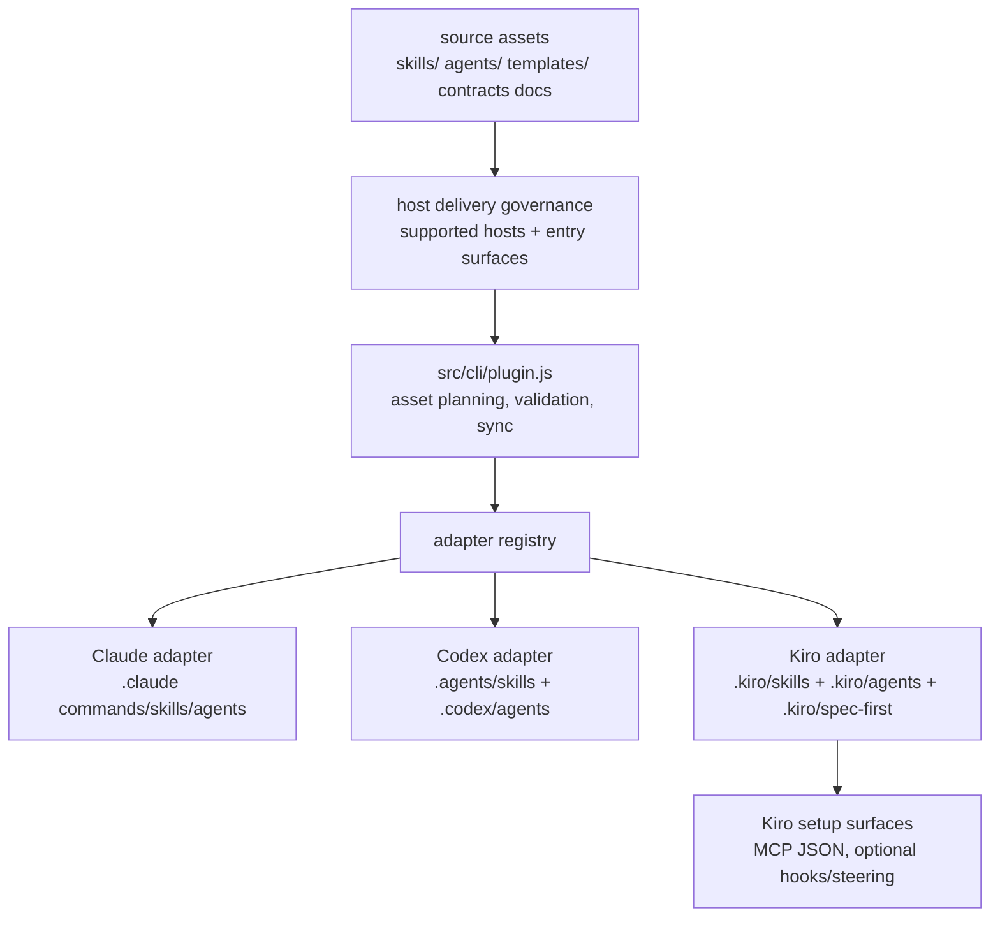
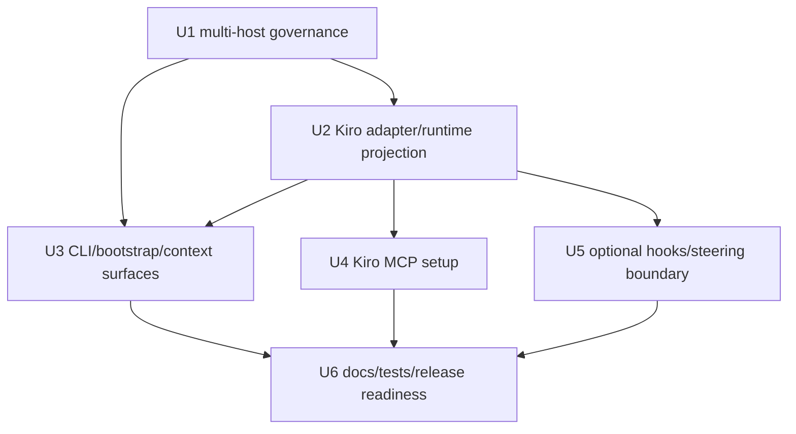

# feat: Add Kiro host support

## Summary

本计划把 Kiro 作为 spec-first 的第三个一等宿主接入：新增 Kiro adapter 与 runtime 投影，泛化现有 Claude/Codex 双宿主治理，补齐 CLI host selection、MCP 配置、context/runtime 边界、文档和测试。核心原则是 source-first：只修改 `skills/`、`agents/`、`templates/`、`src/cli/`、`docs/contracts/` 等 source-of-truth，由 `spec-first init` 生成 `.kiro/**` runtime 资产。

---

## Decision Brief

- **Recommended approach:** 新增 `kiro` 平台 adapter，并把当前 dual-host contract 泛化为 supported-host contract；不要只在现有命令里散落添加 `--kiro` 分支。
- **Key decisions:** Kiro workflow 先通过 `.kiro/skills/spec-*/SKILL.md` 交付为 Agent Skill；不占用 Kiro 原生 `/spec` namespace；Kiro native Specs 保持 Kiro-owned artifact，不成为 spec-first source-of-truth。
- **Validation focus:** runtime projection contract、governance schema、`init/doctor/clean --kiro`、MCP JSON 配置、context exclusion、README/用户手册入口表、三宿主 smoke。
- **Largest risks / boundaries:** Kiro 文档确认 skill on-demand activation 与 slash command discovery；实现期仍必须在 Kiro 实机 session 验证 spec-first 生成 skill 的显示名、触发方式和完整执行体验。

---

## Problem Frame

当前 spec-first 已围绕 Claude Code 与 Codex 建立 host adapter、workflow delivery、MCP setup、instruction bootstrap、runtime mirror 和 source/runtime governance。要支持 Kiro，不能把 Kiro 当作单个安装路径补丁，因为 Kiro 的宿主表面不同：

- Agent Skills 使用 `.kiro/skills/**/SKILL.md`，frontmatter 需要 `name` 与 folder 匹配。
- Steering 使用 `.kiro/steering/**`，可按 `always`、`fileMatch`、`manual`、`auto` inclusion 载入。
- MCP 使用 JSON 配置，workspace 路径是 `.kiro/settings/mcp.json`，user 路径是 `~/.kiro/settings/mcp.json`。
- Custom subagents 使用 `.kiro/agents/*.md`，frontmatter 包含 `name`、`description`、`tools`、`model` 等。
- Hooks 使用 `.kiro/hooks/**` JSON，只有 `PreToolUse`、`PreTaskExec`、`UserPromptSubmit` 这类 blocking trigger 可用 exit code 2 阻断。
- Kiro 原生 Specs 有自己的 structured workflow 与 `/spec` 体验，不能被 spec-first 入口抢占。

目标不是复制 Kiro Specs 引擎，而是在 Kiro 中交付 spec-first 的现有 workflow harness，并继续守住 Light contract、Explicit boundaries、Deterministic floor + LLM semantic judgment。

---

## Requirements

- R1. Kiro 必须成为 `claude`、`codex` 同级的 supported host，可由 adapter registry、CLI flags、doctor、clean、init、runtime state 和 docs 统一识别。
- R2. Kiro runtime 投影必须从现有 source assets 生成到 `.kiro/skills`、`.kiro/agents`、`.kiro/spec-first`，不得手改 `.kiro/**` 作为 source 修复。
- R3. Kiro workflow 交付必须避开 Kiro 原生 `/spec` namespace；文档应表达为 Kiro Agent Skill invocation，并在实机 smoke 后才承诺具体生成 skill 的最终显示名和触发细节。
- R4. 现有 `dual-host-governance` 的语义必须泛化为 multi-host/supported-host governance，并保持向后兼容或提供明确迁移边界。
- R5. `skills-governance.json` 与 `agents-governance.json` 必须能表达 `host_delivery.kiro`，并由 schema/tests 防止漏登记、错误 delivery、错误 entry surface。
- R6. Kiro MCP setup 必须写入/读取 JSON `mcpServers` 配置，并保持 credential boundary：只写 env var references 或 non-secret config，不提交凭据。
- R7. Runtime context exclusion 必须覆盖 Kiro spec-first-managed runtime roots；Kiro native `.kiro/specs/**` 只能作为 named/advisory input，不成为 spec-first source-of-truth。
- R8. Hook 支持如进入本计划实现范围，只能承载确定性边界提醒或阻断，不让 hook 做语义判断。
- R9. README、README.zh-CN、用户手册、runtime capability/catalog、doctor/help 输出必须同步体现三宿主支持。
- R10. 测试必须覆盖三宿主投影、CLI flags、MCP setup、context governance、release/package 内容；实现期还需 Kiro 实机 smoke 验证。

---

## Assumptions

- A1. Kiro Agent Skills 是首选 workflow 交付面，因为官方文档确认 `.kiro/skills/**/SKILL.md`、workspace/global skill scope、frontmatter `name`/`description` 约束和 on-demand activation。
- A2. Kiro 官方 Skills 文档确认技能可自动激活，也可在聊天输入 `/` 查看为 slash commands；实现期仍需要确认 spec-first 生成 skill 在 Kiro IDE 中的最终显示名、排序和执行体验。
- A3. Kiro 官方 Steering 文档确认 workspace root `AGENTS.md` 会被自动 picked up 且 always included；P0 保留根 `AGENTS.md` 作为跨宿主 checked-in instruction source，只有在需要 Kiro-specific inclusion modes 或额外 UX 时才考虑 generated `.kiro/steering/spec-first.md`。
- A4. Kiro hooks 是 P1/P2 增强，不是 P0 host support 的硬依赖；P0 先交付 skills、agents、MCP、CLI/runtime projection。

---

## Scope Boundaries

- 不重建或替换 Kiro 原生 Specs、Quick Plan、task waves 或 `/spec` 流程。
- 不把 `.kiro/specs/**` 当作 spec-first 计划/任务/source 文件写入；未来如做 interop，只作为 advisory import 或 explicit conversion。
- 不新增单独的 Kiro workflow source tree；继续从 `skills/`、`agents/`、`templates/`、`src/cli/contracts/**` 投影。
- 不把 Kiro Powers 作为 P0 交付面；Skills 足够承载 spec-first workflow，Powers 只作为未来 MCP integration packaging 的候选。
- 不在共享 workflow prose 里散落 Claude/Codex/Kiro 三套入口映射；具体映射集中在 adapter、init guidance、governance/docs 入口表和 tests。
- 不提交用户级 `~/.kiro/**` 配置；只在安装/setup 命令执行时按用户选择写入。

### Deferred to Follow-Up Work

- Kiro-specific steering generation：若实机验证发现根 `AGENTS.md` 不足，再新增 `.kiro/steering/spec-first.md` 生成逻辑。
- Kiro hook hardening：在 P0 Kiro skill/runtime delivery 通过后，再为 startup reminder、mutation/source-runtime gate 设计最小 blocking hook。
- Kiro Specs import/export：未来可以把 `.kiro/specs/**` 转为 spec-first advisory input，但必须另起 plan，明确 artifact authority 和 freshness。

---

## Completion Criteria

- `spec-first init --kiro` 在临时项目中生成 Kiro workflow skills、standalone skills、agents、state 和必要 managed files，且不会触碰 Kiro native `.kiro/specs/**`。
- `spec-first doctor --kiro` 能识别 Kiro runtime readiness、missing/drifted assets、MCP config 状态和 degraded reason。
- `spec-first clean --kiro` 只移除 spec-first managed Kiro assets，不删除用户 Kiro skills、agents、hooks、settings 或 specs。
- Governance schemas/tests 明确覆盖 `claude`、`codex`、`kiro` 三宿主，并保持旧双宿主 fixture 的兼容或迁移说明。
- Kiro MCP setup 支持 workspace/user JSON config，并通过 shell 与 PowerShell contract tests。
- README、README.zh-CN、相关 docs/contracts、runtime capability 文档说明 Kiro 支持与 source/runtime 边界。
- 实机或等价 fixture smoke 证明 Kiro 能发现至少一个 workflow skill，并能按文档方式触发。

---

## Direct Evidence Readiness

- target_repo: `.`
- evidence_sources: direct source reads, codegraph, `rg`, `curl` 官方文档抓取, git status, git revision, durable learnings
- source_refs:
  - `docs/10-prompt/结构化项目角色契约.md`
  - `src/cli/adapters/base.js`
  - `src/cli/adapters/claude.js`
  - `src/cli/adapters/codex.js`
  - `src/cli/adapters/index.js`
  - `src/cli/plugin.js`
  - `src/cli/commands/init.js`
  - `src/cli/commands/doctor.js`
  - `src/cli/commands/clean.js`
  - `src/cli/instruction-bootstrap.js`
  - `src/cli/user-language-sync.js`
  - `skills/spec-mcp-setup/scripts/detect-host.sh`
  - `skills/spec-mcp-setup/scripts/configure-host.sh`
  - `skills/spec-mcp-setup/mcp-tools.json`
  - `docs/contracts/context-governance.md`
  - `docs/contracts/workflows/spec-work-run-artifact.schema.json`
  - `docs/solutions/workflow-issues/host-entrypoint-mapping-source-boundary-2026-04-29.md`
  - `docs/solutions/workflow-issues/modify-source-not-artifacts-2026-04-13.md`
  - `docs/solutions/architecture-patterns/workflow-entrypoint-exposure-contract-2026-04-26.md`
  - `docs/solutions/conventions/skill-publication-command-surface-alignment-2026-06-23.md`
- current_revision: `2bc5b26d`
- worktree_status: dirty before this plan; existing modified/untracked files were unrelated and were not reverted.
- confidence: medium-high for repo change surface; medium for exact Kiro runtime invocation until Kiro session smoke confirms.
- limitations:
  - `dispatch_authorization_missing`: Codex `$spec-plan` did not authorize subagent/research-agent dispatch, so research ran inline.
  - Kiro docs were fetched from official web pages, but no Kiro IDE runtime was launched in this planning run.
  - Codegraph output is advisory navigation; load-bearing conclusions are grounded in direct source paths and docs listed above.

---

## Direct Evidence

- repo_scope: single repo, current working tree is the repository root, and all plan paths are repo-relative.
- source_reads_completed:
  - Platform adapter interface and Claude/Codex adapter shapes.
  - Governance hard-coded host lists and delivery validation loops.
  - CLI host selection/help surfaces for init/doctor/clean.
  - Bootstrap, user-language, context-governance and spec-work runtime exclusion surfaces.
  - MCP setup host detection/configuration scripts and tool metadata.
  - Durable learnings for host entrypoint mapping, source/runtime mirror discipline, workflow entrypoint exposure, and skill publication alignment.
  - Kiro official docs for Agent Skills, Steering, MCP configuration, Subagents, Hooks, and Specs.
- source_reads_required:
  - Full implementation-time reads of `src/cli/plugin.js`, all command parsers, adapter tests, `init-i18n`, `init-guidance`, runtime capability/catalog generators, and all mcp setup shell/PowerShell scripts before editing.
  - Full schema/test reads for generated runtime exclusion patterns and release package expectations.
- commands_or_tools_used:
  - `git status --short`, `git rev-parse --short HEAD`, `rg --files`, targeted `rg`, codegraph exploration, `curl -Ls https://kiro.dev/docs/...`.
- impact_on_plan:
  - Confirmed this must be a multi-host architecture change, not a single flag patch.
  - Confirmed Kiro support must touch CLI, adapter registry, governance schema/data, runtime projection, MCP setup, docs, context governance, and tests.
  - Confirmed `/spec` should remain Kiro-native; spec-first should not create a Kiro `/spec:*` command family by assumption.
- key_findings:
  - `PlatformAdapter` already provides the extension point for runtime roots, commands, skills, workflows, agents, state, instruction file and platform-specific runtime hooks.
  - `src/cli/plugin.js` still hard-codes `SUPPORTED_PLATFORM_IDS = ['claude', 'codex']` and only returns `host_delivery.claude/codex`.
  - `init` host choices and remembered-host filtering derive from `INIT_PLATFORM_CHOICES`, currently Claude/Codex only.
  - `doctor` partially uses `getSupportedPlatforms()`, but parser/help still expose Claude/Codex flags only.
  - `clean` flag parser is Claude/Codex-only.
  - `instruction-bootstrap.js`, `user-language-sync.js`, README/docs and context contracts still name only `.claude/**`, `.codex/**`, `.agents/skills/**`.
  - `spec-mcp-setup` currently supports Claude JSON and Codex TOML, but Kiro also needs JSON with top-level `mcpServers`.
- limitations:
  - No direct Kiro IDE smoke; invocation and UI discovery behavior remain implementation-time verification.
  - Existing `dual-host-governance` path name may remain temporarily for compatibility even if semantic model becomes multi-host.

---

## Context & Research

### Relevant Code and Patterns

- `src/cli/adapters/base.js` is the correct extension point; Kiro should subclass it instead of adding host-specific branches throughout CLI code.
- `src/cli/adapters/codex.js` demonstrates a no-command host (`hasCommands=false`) that exposes workflows via skills; Kiro should follow that broad shape, with Kiro-specific runtime paths and frontmatter constraints.
- `src/cli/plugin.js` owns bundled asset sync, governance validation, command manifest construction, skill/agent projection and runtime inspection; Kiro support must flow through this owner.
- `src/cli/commands/init.js` owns supported host selection and remembered host filtering; host choices should be registry-driven or explicitly include Kiro in the same table.
- `skills/spec-mcp-setup/scripts/configure-host.*` owns host MCP config writers; Kiro JSON support belongs there, not in workflow prose.

### Institutional Learnings

- Host entrypoint mapping belongs in init/governance/adapter/central docs, not ordinary shared workflow prose.
- Generated mirrors such as `.claude/**`, `.codex/**`, `.agents/skills/**` are not source; Kiro-managed `.kiro/**` assets must follow the same source-first discipline.
- New workflow entrypoints must align source skill, governance contract, command/runtime surface and adapter projection.
- Skill publication must align governance, command surface, runtime projection name and docs; standalone skill and workflow command remain distinct.

### External References

- Kiro Agent Skills: workspace skills under `.kiro/skills/`, global skills under `~/.kiro/skills/`, required `SKILL.md`, required `name`/`description`, on-demand activation and open Agent Skills standard.
- Kiro Steering: workspace/global steering, `always`/`fileMatch`/`manual`/`auto` inclusion, manual/auto steering slash availability, security warning for codebase steering files.
- Kiro MCP configuration: JSON `mcpServers`, workspace `.kiro/settings/mcp.json`, user `~/.kiro/settings/mcp.json`, security guidance to use env var references and not commit credentials.
- Kiro Subagents: custom markdown agents under `~/.kiro/agents` or workspace `.kiro/agents`, frontmatter attributes, subagents can run in parallel, but do not have Specs and hooks do not trigger in subagents.
- Kiro Hooks: JSON files under `.kiro/hooks` or `~/.kiro/hooks`, blocking only on specific triggers, exit code 2 blocks only for blocking triggers.
- Kiro Specs: Kiro has native Feature/Bugfix Specs, `tasks.md` task UI and task waves; this plan does not replace or own those artifacts.

---

## Key Technical Decisions

- KTD1. Treat Kiro as a first-class adapter: `src/cli/adapters/kiro.js` should own runtime roots, transforms, inspect/remove behavior and any Kiro-specific managed files.
- KTD2. Generalize host governance before widening runtime projection: update schema/data/tests so `host_delivery.kiro` is validated centrally; keep `dual_host` as a legacy alias only if needed for migration.
- KTD3. Deliver Kiro workflows as Agent Skills in `.kiro/skills`: do not create Kiro native `/spec` commands; official docs confirm skills appear through `/` discovery, while generated spec-first skill display/trigger details remain a docs/smoke item.
- KTD4. Keep source/runtime separation strict: Kiro runtime files are generated outputs; source remains `skills/`, `agents/`, `templates/`, `src/cli/`, `docs/contracts/**`, README and checked-in host instructions.
- KTD5. Use JSON MCP writer/reader for Kiro: extend `spec-mcp-setup` instead of adding workflow-specific setup instructions.
- KTD6. Transform Kiro agents deliberately: source `agents/*.agent.md` may not match Kiro custom subagent frontmatter, so `KiroAdapter.transformAgentContent()` must emit Kiro-compatible `name`, `description`, optional `tools`/`model`, and body rather than blindly copying Claude/Codex agent files.
- KTD7. Make hooks optional and deterministic: if hooks are generated, they can block only deterministic mutation/source-runtime boundary exits; they cannot decide plan quality, review correctness or semantic adequacy.
- KTD8. Do not blanket-classify all `.kiro/**` as one thing: `.kiro/skills`, `.kiro/agents`, `.kiro/hooks`, `.kiro/settings`, `.kiro/spec-first` are Kiro/spec-first runtime/config surfaces; `.kiro/specs/**` is Kiro-native advisory artifact when explicitly named.

---

## Open Questions

### Resolved During Planning

- Should support be a flag-only patch or a host adapter? Resolved: adapter. Kiro has distinct skills, agents, hooks, MCP and native Specs surfaces, so central adapter/governance keeps boundaries maintainable.
- Should spec-first use Kiro `/spec`? Resolved: no. Kiro owns native Specs and `/spec` experience; spec-first uses Agent Skill delivery.
- Should Kiro native Specs become spec-first source? Resolved: no. They can be future advisory input but not source-of-truth.

### Deferred to Implementation

- Exact generated skill display/trigger details: verify in Kiro IDE after `.kiro/skills/spec-plan/SKILL.md` exists, even though official docs confirm slash discovery for skills.
- Whether additional generated steering is useful beyond root `AGENTS.md`: verify in Kiro IDE only if root instructions plus skill content prove insufficient for startup guidance or language/governance propagation.
- Whether hook generation belongs in P0 or P1: decide after P0 Kiro delivery passes smoke and current hook schema can be represented without overfitting.
- Naming of renamed governance directory: implementation may retain `dual-host-governance` path for compatibility while changing semantics, or introduce a new multi-host path with migration tests.

---

## High-Level Technical Design

> *This illustrates the intended approach and is directional guidance for review, not implementation specification. The implementing agent should treat it as context, not code to reproduce.*

| Surface | Claude | Codex | Kiro |
| --- | --- | --- | --- |
| Public workflow delivery | `/spec:*` command | `$spec-*` skill invocation | Kiro Agent Skill invocation from `.kiro/skills` |
| Workflow runtime asset | `.claude/commands/spec/*.md` + `.claude/spec-first/workflows` | `.agents/skills/spec-*` | `.kiro/skills/spec-*` |
| Standalone skills | `.claude/skills` | `.agents/skills` | `.kiro/skills` |
| Agents | `.claude/agents` | `.codex/agents` | `.kiro/agents` |
| MCP config | Claude JSON config | Codex TOML config | Kiro JSON `.kiro/settings/mcp.json` / `~/.kiro/settings/mcp.json` |
| Hooks | Claude hook templates | Codex hook support where available | Optional `.kiro/hooks` JSON |
| Native spec system | N/A | N/A | Kiro-owned `.kiro/specs/**`, advisory only when named |

---

## Implementation Units

### U1. Multi-host governance contract

**Goal:** Replace Claude/Codex-only governance assumptions with a supported-host model that includes `kiro`.

**Requirements:** R1, R4, R5

**Dependencies:** None

**Files:**
- Modify: `src/cli/plugin.js`
- Modify: `src/cli/contracts/dual-host-governance/skills-governance.json`
- Modify: `src/cli/contracts/dual-host-governance/skills-governance.schema.json`
- Modify: `src/cli/contracts/dual-host-governance/agents-governance.json`
- Modify: `src/cli/contracts/dual-host-governance/agents-governance.schema.json`
- Modify: `docs/contracts/dual-host-governance/README.md`
- Test: `tests/unit/governance-contracts.test.js`
- Test: `tests/unit/agents-governance-contracts.test.js`
- Test: `tests/smoke/release-dual-host-governance.sh`

**Approach:**
- Introduce a single supported host registry/list consumed by governance validation, filtering and runtime projection.
- Add `host_delivery.kiro` for every public workflow, standalone skill and internal-only asset.
- Keep existing `dual_host` records valid during migration if changing them all at once creates unnecessary churn; document whether it means "all supported hosts" or is superseded.
- Reject records that omit `kiro`, deliver a workflow to an unsupported surface, or expose internal-only assets to Kiro.

**Patterns to follow:**
- Existing `SUPPORTED_PLATFORM_IDS`, `HOST_SCOPES`, `host_delivery` validation loops in `src/cli/plugin.js`.
- Existing governance contract tests for skill/agent records.

**Test scenarios:**
- Happy path: all workflow records with `host_delivery.kiro = skill` validate and are included in Kiro asset set.
- Error path: a record missing `host_delivery.kiro` fails schema/contract validation with a precise message.
- Error path: a Kiro `workflow_command` record attempting `command` delivery fails because Kiro adapter has no command directory in P0.
- Compatibility: legacy `dual_host` records either continue to validate as all-supported-hosts or are migrated with tests proving no asset disappears.
- Integration: command manifest generation still includes Claude commands, still excludes Codex command files, and does not invent Kiro command files.

**Verification:**
- Governance contract tests cover all three hosts and all entry surfaces.
- Release smoke validates that packaged governance data is schema-valid after adding Kiro.

---

### U2. Kiro adapter and runtime projection

**Goal:** Add a Kiro platform adapter that projects existing source skills and agents into Kiro workspace runtime locations.

**Requirements:** R1, R2, R3, R10

**Dependencies:** U1

**Files:**
- Create: `src/cli/adapters/kiro.js`
- Modify: `src/cli/adapters/index.js`
- Modify: `src/cli/plugin.js`
- Test: `tests/unit/init-source-path-coverage.test.js`
- Test: `tests/unit/init-plan.test.js`
- Test: `tests/unit/init-dry-run.test.js`
- Test: `tests/unit/init-plan-exports.test.js`
- Test: `tests/unit/clean-dry-run.test.js`

**Approach:**
- Define Kiro runtime roots:
  - `runtimeRoot`: `.kiro`
  - `managedRoot`: `.kiro/spec-first`
  - `skillsRoot`: `.kiro/skills`
  - `workflowsRoot`: `.kiro/skills`
  - `agentsRoot`: `.kiro/agents`
  - `stateFile`: `.kiro/spec-first/state.json`
  - `instructionFile`: `AGENTS.md`, because Kiro official steering docs confirm workspace-root `AGENTS.md` is automatically picked up and always included.
  - `hasCommands`: `false`
- Transform skill frontmatter so `name` matches Kiro folder constraints and stays under 64 chars.
- Transform agent frontmatter/body to Kiro custom subagent markdown. At minimum, generated agent files need a Kiro-compatible `name` and `description`; `tools` and `model` should be emitted only from confirmed source metadata or conservative defaults.
- Preserve source skill content and references/assets; avoid copying provider-specific implementation details into workflow prose.
- Ensure inspect/remove methods distinguish spec-first managed assets from user-owned Kiro assets.

**Execution note:** Start with adapter projection tests before enabling `init --kiro` so runtime path mistakes fail before docs are updated.

**Patterns to follow:**
- `src/cli/adapters/codex.js` for skill-based workflow delivery with `hasCommands=false`.
- `src/cli/adapters/claude.js` / `src/cli/adapters/codex.js` inspect/remove patterns for host-specific runtime files.

**Test scenarios:**
- Happy path: Kiro sync writes workflow skill `SKILL.md` under `.kiro/skills/spec-plan/` and agent files under `.kiro/agents/`.
- Happy path: Kiro runtime skill frontmatter `name` matches the folder and Kiro naming constraints.
- Happy path: Kiro runtime agent frontmatter is valid for Kiro custom subagents and does not leak Claude/Codex-only metadata.
- Edge case: standalone and workflow skills with references/scripts/assets preserve relative paths after projection.
- Error path: Kiro adapter does not require or create `.kiro/commands` or `/spec` command templates.
- Integration: dry-run plan reports Kiro writes without mutating files.
- Cleanup: Kiro clean plan removes spec-first managed Kiro assets but leaves unrelated `.kiro/skills/*`, `.kiro/agents/*`, `.kiro/hooks/*`, `.kiro/settings/*`, `.kiro/specs/*` untouched.

**Verification:**
- Kiro adapter tests prove runtime projection, dry-run and cleanup behavior before broader smoke.

---

### U3. CLI host selection, bootstrap, language and context surfaces

**Goal:** Expose Kiro through supported CLI commands and update host-facing bootstrap/context behavior without duplicating entrypoint mappings in shared prose.

**Requirements:** R1, R3, R7, R9

**Dependencies:** U1, U2

**Files:**
- Modify: `src/cli/commands/init.js`
- Modify: `src/cli/commands/doctor.js`
- Modify: `src/cli/commands/clean.js`
- Modify: `src/cli/init-i18n.js`
- Modify: `src/cli/init-guidance.js`
- Modify: `src/cli/instruction-bootstrap.js`
- Modify: `src/cli/user-language-sync.js`
- Modify: `src/cli/helpers/target-repo.js`
- Modify: `src/cli/task-pack.js`
- Modify: `docs/contracts/context-governance.md`
- Modify: `docs/contracts/workflows/spec-work-run-artifact.schema.json`
- Test: `tests/unit/init-interactive.test.js`
- Test: `tests/unit/init-i18n.test.js`
- Test: `tests/unit/doctor-codex-global-hook.test.js` or a new doctor host test
- Test: `tests/unit/context-governance-contracts.test.js`
- Test: `tests/unit/context-bundle-contracts.test.js`
- Test: `tests/unit/spec-write-tasks-runtime-governance.test.js`

**Approach:**
- Add `--kiro` everywhere host selection is parsed, displayed or remembered.
- Keep `-y` default host selection conservative: either include Kiro once supported, or require explicit `--kiro` in first release and document why.
- Update bootstrap language to describe "current host entrypoint" and central host tables, not scattered `/spec:*` / `$spec-*` / Kiro aliases.
- Extend user language sync to include Kiro runtime if Kiro consumes `AGENTS.md` or generated steering.
- Update runtime exclusion rules to block spec-first-managed Kiro runtime/config roots from ordinary task files and context bundles.
- Treat `.kiro/specs/**` as Kiro-native advisory artifact only when named; do not include it in generated runtime mirror regex by accident.

**Patterns to follow:**
- `INIT_PLATFORM_CHOICES` and `SUPPORTED_HOST_IDS` in `src/cli/commands/init.js`.
- Host instruction reuse and context exclusion contracts in `instruction-bootstrap.js` and `docs/contracts/context-governance.md`.

**Test scenarios:**
- Happy path: `init` accepts `--kiro`, remembers Kiro only when supported, and renders host-specific guidance.
- Error path: mutually exclusive or unknown host flags still produce clear errors.
- Happy path: `doctor --kiro` inspects Kiro runtime and returns missing/drifted managed assets.
- Happy path: `clean --kiro --dry-run` lists only Kiro spec-first managed removals.
- Edge case: context bundle/task artifact schemas reject `.kiro/skills/**`, `.kiro/agents/**`, `.kiro/hooks/**`, `.kiro/settings/**`, `.kiro/spec-first/**` as task-owned files.
- Edge case: named `.kiro/specs/**` evidence can be referenced as advisory input without being classified as generated mirror source.

**Verification:**
- CLI host tests and context-governance tests prove Kiro is visible where intended and excluded where unsafe.

---

### U4. Kiro MCP setup support

**Goal:** Extend `spec-mcp-setup` so Kiro can configure and verify required MCP servers through Kiro JSON config.

**Requirements:** R6, R9, R10

**Dependencies:** U1, U2

**Files:**
- Modify: `skills/spec-mcp-setup/scripts/detect-host.sh`
- Modify: `skills/spec-mcp-setup/scripts/detect-host.ps1`
- Modify: `skills/spec-mcp-setup/scripts/configure-host.sh`
- Modify: `skills/spec-mcp-setup/scripts/configure-host.ps1`
- Modify: `skills/spec-mcp-setup/scripts/install-mcp.sh`
- Modify: `skills/spec-mcp-setup/scripts/install-mcp.ps1`
- Modify: `skills/spec-mcp-setup/scripts/uninstall-mcp.sh`
- Modify: `skills/spec-mcp-setup/scripts/uninstall-mcp.ps1`
- Modify: `skills/spec-mcp-setup/scripts/verify-tools.sh`
- Modify: `skills/spec-mcp-setup/scripts/verify-tools.ps1`
- Modify: `skills/spec-mcp-setup/mcp-tools.json`
- Modify: `skills/spec-mcp-setup/references/supported-mcp-tools.md`
- Test: `tests/unit/mcp-setup.sh`
- Test: `tests/unit/mcp-setup-powershell-contracts.test.js`
- Test: `tests/unit/mcp-setup-verify-host-contracts.test.js`
- Test: `tests/unit/mcp-setup-config-template-contracts.test.js`

**Approach:**
- Add `MCP_SETUP_HOST=kiro` detection and explicit host override.
- Add JSON writer/reader for:
  - workspace `.kiro/settings/mcp.json`
  - user `~/.kiro/settings/mcp.json`
- Preserve existing config entries and comments/format where feasible; if JSON rewrite cannot preserve comments, document that JSON has no comment preservation.
- Extend `mcp-tools.json` `host_config` to include Kiro command/url/env config variants.
- Use env var references for secrets and never write raw tokens.

**Execution note:** Treat config writing as security-sensitive. Add fixture coverage before changing install/uninstall behavior.

**Patterns to follow:**
- Existing Claude JSON writer path in `configure-host.*`.
- Existing Codex TOML writer tests for preservation, install and uninstall behavior.

**Test scenarios:**
- Happy path: workspace Kiro MCP config with no existing file is created with top-level `mcpServers`.
- Happy path: existing Kiro `mcpServers` entries are preserved while spec-first tools are added/updated.
- Error path: invalid JSON returns a degraded reason and does not silently overwrite user config.
- Security: generated config uses env references and never writes fixture secret values.
- Cross-platform: shell and PowerShell writers produce equivalent JSON for the same tool metadata.
- Uninstall: removing spec-first-managed MCP entries leaves unrelated Kiro MCP servers intact.

**Verification:**
- MCP setup contract tests cover Kiro detection, installation, verification and uninstall on shell and PowerShell paths.

---

### U5. Kiro hooks and steering boundary

**Goal:** Define the optional Kiro hook/steering projection boundary without making hooks a P0 dependency or semantic decision engine.

**Requirements:** R2, R7, R8, R9

**Dependencies:** U2, U3

**Files:**
- Create: `templates/kiro/hooks/` only if P1 hook generation is implemented in this plan.
- Modify: `src/cli/adapters/kiro.js`
- Modify: `src/cli/instruction-bootstrap.js`
- Modify: `docs/contracts/source-runtime-customization-boundary.md`
- Modify: `docs/catalog/runtime-capabilities.md`
- Test: new or existing adapter/runtime file tests for Kiro hooks/steering

**Approach:**
- P0: document hooks and steering as supported Kiro surfaces, but do not generate hooks unless the implementation can prove the exact JSON schema and cleanup behavior.
- P1: if generating hooks, use only deterministic guard patterns:
  - startup/setup reminder through non-blocking `SessionStart` or `UserPromptSubmit` as appropriate.
  - mutation/source-runtime guard through blocking `PreToolUse` or `UserPromptSubmit` only when command/path facts are deterministic.
- If generated steering is needed for Kiro-specific inclusion or UX, keep it under `.kiro/steering/spec-first.md` and mark it generated runtime; do not duplicate the full root `AGENTS.md` contract by default.

**Patterns to follow:**
- Claude SessionStart hook generation where source-backed.
- Role contract hard gate boundary: mutation/source-runtime can be deterministic; plan/review semantics remain LLM-owned.

**Test scenarios:**
- Happy path: if hook generation is enabled, Kiro hook JSON is valid and installed only under spec-first managed names.
- Error path: clean removes spec-first managed hooks but leaves user hooks intact.
- Security: generated blocking hooks do not run arbitrary semantic prompts as hard gates.
- Edge case: generated steering does not become a second source-of-truth for language/governance blocks.

**Verification:**
- Kiro hook/steering support is either explicitly absent in P0 docs, or covered by adapter and cleanup tests if implemented.

---

### U6. Documentation, smoke tests and release readiness

**Goal:** Make Kiro support discoverable, verifiable and package-safe across docs, smoke tests and release artifacts.

**Requirements:** R1, R3, R7, R9, R10

**Dependencies:** U1, U2, U3, U4; U5 if hooks/steering implemented

**Files:**
- Modify: `README.md`
- Modify: `README.zh-CN.md`
- Modify: `docs/05-用户手册/02-核心概念.md`
- Modify: `docs/05-用户手册/05-最佳实践.md`
- Modify: `docs/catalog/runtime-capabilities.md`
- Modify: `docs/contracts/source-runtime-customization-boundary.md`
- Modify: `package.json` only if scripts or package include rules need updates.
- Test: `tests/smoke/*`
- Test: `tests/unit/init-source-path-coverage.test.js`
- Test: release/build package expectations

**Approach:**
- Add a centralized host entrypoint/support table that lists Claude, Codex and Kiro surfaces.
- Update source/runtime boundary docs to include Kiro managed runtime roots and Kiro native Specs caveat.
- Add smoke fixture for Kiro init/doctor/clean and package verification.
- Keep ordinary workflow docs saying "current host" unless the section is the centralized host support table.
- Include manual Kiro smoke checklist in docs or validation artifact only after implementation runs it.

**Patterns to follow:**
- Existing README workflow entrypoint tables and runtime mirror explanations.
- Existing smoke tests for `init`, `doctor`, `clean`, and release governance.

**Test scenarios:**
- Happy path: package/build includes Kiro adapter/templates and governance data.
- Happy path: README and zh-CN README list Kiro support consistently.
- Edge case: docs do not instruct users to edit `.kiro/skills` or `.kiro/agents` as source fixes.
- Integration: Kiro smoke validates generated files, doctor JSON status, clean dry-run, and at least one Kiro workflow skill discovery check.

**Verification:**
- Smoke and build-level checks prove Kiro assets are shippable and docs match real runtime behavior.

---

## System-Wide Impact

- **Interaction graph:** `init` -> adapter registry -> `plugin.js` asset projection -> governance contracts -> runtime roots; `doctor` and `clean` must consume the same adapter truth.
- **Error propagation:** unknown/unsupported host errors should include `kiro` once supported; Kiro setup failures should emit degraded reason codes instead of silently falling back to Claude/Codex.
- **State lifecycle risks:** Kiro state under `.kiro/spec-first/state.json` must not collide with user Kiro state; clean must remove only spec-first managed files.
- **API surface parity:** CLI host flags, governance schemas, MCP metadata and docs need parity across Claude/Codex/Kiro.
- **Surface coverage:**
  - CLI: in-scope
  - Runtime projection: in-scope
  - MCP setup: in-scope
  - Hooks/steering: deferred or optional P1 inside this plan
  - Kiro native Specs: out-of-scope, advisory input only when explicitly named
  - README/user docs: in-scope
  - Release package: in-scope
- **Integration coverage:** unit tests alone will not prove Kiro IDE discovery; implementation closeout needs a manual or automated Kiro smoke note.
- **Unchanged invariants:** source assets remain in checked-in source paths; generated runtime mirrors remain disposable; scripts prepare deterministic facts and LLM judges semantic adequacy above that floor.

---

## Phased Delivery

### Phase 1: Kiro host delivery baseline

- Land U1, U2 and U3 together or in tightly ordered commits.
- A project can run Kiro init/doctor/clean and see generated Kiro workflow skills/agents.
- Docs describe Kiro support as Agent Skill delivery with exact invocation caveat.

### Phase 2: MCP setup parity

- Land U4 after baseline projection is stable.
- Kiro setup can install/verify/uninstall required MCP config through JSON.
- Security and invalid JSON behavior are covered before user-facing docs claim MCP readiness.

### Phase 3: Hooks/steering hardening and release polish

- Land U5 only if P0 proves Kiro runtime discovery and cleanup semantics.
- Land U6 final docs/smoke/build updates after all implemented surfaces are real.

---

## Existing Capability / Reuse Analysis

- **Inventory:** Existing adapter interface, `plugin.js` sync/inspect/remove pipeline, dual-host governance data/schema, init/doctor/clean command surfaces, `spec-mcp-setup` scripts, context-governance contracts and README runtime boundary docs.
- **Decision:** Extend existing host adapter and governance pipeline; create only the new `src/cli/adapters/kiro.js` and optional Kiro-specific templates because Kiro has distinct runtime paths and config files.
- **Source-of-truth:** Host delivery remains in `src/cli/contracts/**`, adapter paths remain in `src/cli/adapters/**`, workflow content remains in `skills/**`, agent content remains in `agents/**`.
- **Rejected owner:** Do not encode Kiro paths in every skill or README prose section; that would duplicate host entrypoint mapping outside the governance/adapter layer.
- **Work-phase recheck:** Before implementation, re-read current adapter, governance and MCP scripts. If source has already been generalized by another change, prefer extending the new registry instead of creating parallel Kiro-specific tables.

---

## Alternative Approaches Considered

- **Flag-only patch in init/doctor/clean:** Rejected because it leaves `plugin.js`, governance, runtime projection, docs and MCP setup with separate host truths.
- **Treat Kiro as Codex-compatible `.agents/skills` only:** Rejected because Kiro has official `.kiro/skills`, `.kiro/agents`, `.kiro/settings/mcp.json` and `.kiro/hooks` surfaces.
- **Expose spec-first via Kiro `/spec` commands:** Rejected because Kiro native Specs own that namespace and product expectation.
- **Use Kiro Powers as P0 workflow delivery:** Deferred. Kiro docs position powers as better for MCP integrations, but spec-first workflows map more directly to Agent Skills and already follow the portable skill format.
- **Generate `.kiro/steering` first:** Deferred because official Kiro docs already support root `AGENTS.md` as always-included context; generating steering first would risk creating a second instruction truth source before there is evidence it is needed.

---

## Risks & Dependencies

| Risk | Mitigation |
|------|------------|
| Kiro skill discovery/invocation differs from plan assumptions | Keep exact invocation wording deferred; require Kiro IDE smoke before final docs claim a shortcut or slash syntax. |
| Governance migration breaks existing Claude/Codex delivery | Preserve backward compatibility or migrate with explicit tests for every existing entry surface. |
| `.kiro/**` exclusion accidentally hides useful Kiro Specs input | Do not use a single blanket generated-mirror rule; distinguish managed runtime/config roots from `.kiro/specs/**` advisory artifacts. |
| MCP JSON writer corrupts user config | Parse/validate before writing, preserve unrelated entries, fail loudly on invalid JSON, and test install/uninstall fixtures. |
| Hooks overreach into semantic gates | Restrict generated hooks to deterministic mutation/source-runtime guards and keep semantic planning/review checks in LLM workflows. |
| Docs drift from runtime truth | Centralize host mappings and add docs/tests that compare documented entry surfaces with governance/runtime projection data where feasible. |
| Existing dirty worktree includes unrelated changes | Implementation must avoid reverting user changes and should inspect touched files before editing if they are dirty. |

---

## Success Metrics

- A new project can opt into Kiro during init and receive Kiro runtime assets without selecting Claude or Codex.
- Existing Claude/Codex tests and smoke remain green after adding Kiro.
- Kiro MCP setup can install and remove required server config without losing unrelated user config.
- User-facing docs explain where Kiro assets live and what not to edit as source.
- A Kiro session can trigger at least one spec-first workflow skill from `.kiro/skills`.

---

## Enterprise Risk Appendix

- **MCP credential boundary:** Kiro MCP setup touches authentication-adjacent config. The invariant is that generated config may reference env vars but must not write raw secrets or commit user-level config.
- **Hook execution boundary:** Kiro hooks can execute commands and sometimes block. The invariant is deterministic-only blocking: mutation/source-runtime gates may block; plan/review semantic adequacy must not be hook-decided.
- **Config rollback boundary:** Install/uninstall must preserve unrelated `mcpServers` entries and produce recoverable diagnostics for invalid JSON.
- **Privacy/logging boundary:** Doctor/setup output should not print secret env values; it may print env var names and missing/ready status.

---

## Documentation Plan

- README / README.zh-CN: add Kiro to host support, runtime asset paths, install/doctor/clean examples and source/runtime boundary.
- User manual: explain Kiro Agent Skills delivery and Kiro native Specs boundary.
- Contracts: update context-governance, source-runtime boundary, runtime capabilities/catalog and governance README.
- Changelog: implementation PR must add user-visible entry for Kiro host support and any migration/deprecation note for dual-host terminology.
- Validation docs: after implementation, add a short Kiro smoke validation artifact if Kiro IDE manual verification is required.

---

## Sources & References

- Role contract: `docs/10-prompt/结构化项目角色契约.md`
- Adapter interface: `src/cli/adapters/base.js`
- Current host registry: `src/cli/adapters/index.js`
- Runtime sync/governance owner: `src/cli/plugin.js`
- Host CLI surfaces: `src/cli/commands/init.js`, `src/cli/commands/doctor.js`, `src/cli/commands/clean.js`
- MCP setup owner: `skills/spec-mcp-setup/scripts/configure-host.sh`, `skills/spec-mcp-setup/scripts/configure-host.ps1`, `skills/spec-mcp-setup/mcp-tools.json`
- Context governance: `docs/contracts/context-governance.md`, `docs/contracts/workflows/spec-work-run-artifact.schema.json`
- Durable learning: `docs/solutions/workflow-issues/host-entrypoint-mapping-source-boundary-2026-04-29.md`
- Durable learning: `docs/solutions/workflow-issues/modify-source-not-artifacts-2026-04-13.md`
- Durable learning: `docs/solutions/architecture-patterns/workflow-entrypoint-exposure-contract-2026-04-26.md`
- Durable learning: `docs/solutions/conventions/skill-publication-command-surface-alignment-2026-06-23.md`
- Kiro Agent Skills: https://kiro.dev/docs/skills/
- Kiro Steering: https://kiro.dev/docs/steering/
- Kiro MCP configuration: https://kiro.dev/docs/mcp/configuration/
- Kiro Subagents: https://kiro.dev/docs/chat/subagents/
- Kiro Hooks: https://kiro.dev/docs/hooks/
- Kiro Specs: https://kiro.dev/docs/specs/
