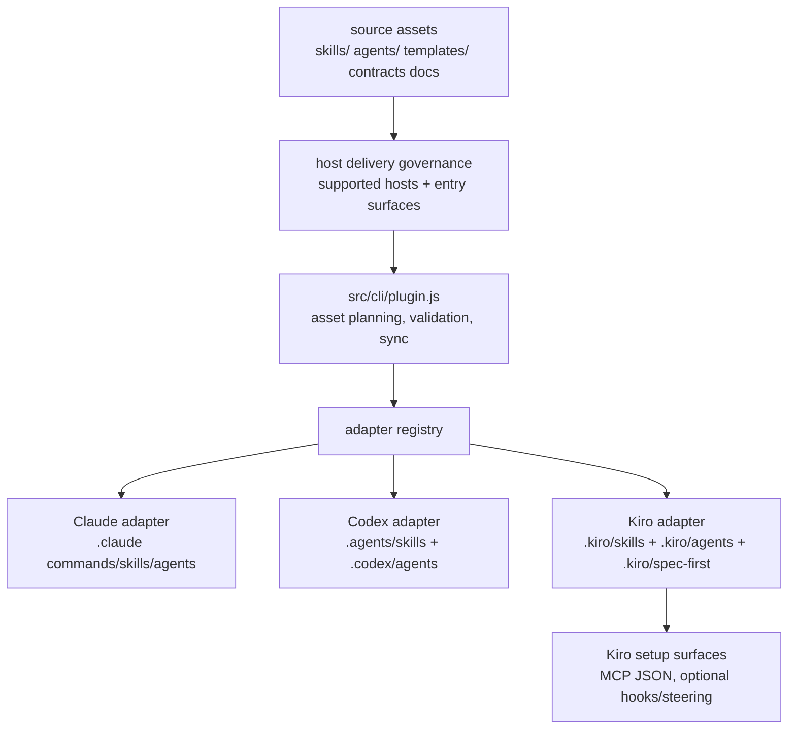
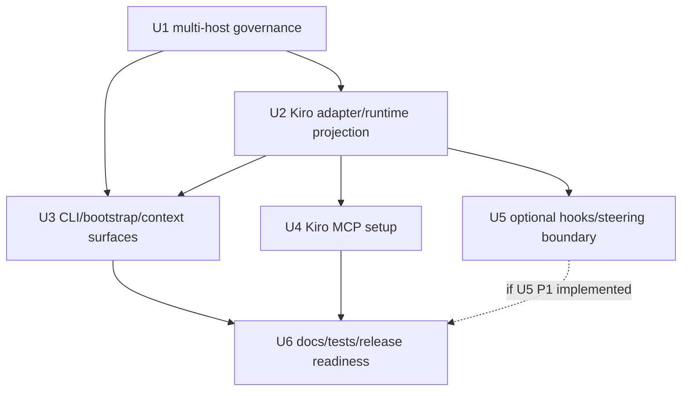

# feat: Add Kiro host support

## Summary

本计划把 Kiro 作为 spec-first 的第三个一等宿主接入：新增 Kiro adapter 与 runtime 投影，泛化现有 Claude/Codex 双宿主治理，补齐 CLI host selection、MCP 配置、context/runtime 边界、文档和测试。Kiro 支持的定位不是替代 Kiro native Specs，而是让已经采用 spec-first 的团队在 Kiro 中继续获得跨宿主一致的 workflow artifacts、source/runtime 边界、MCP readiness 和知识闭环。核心原则是 source-first：只修改 `skills/`、`agents/`、`templates/`、`src/cli/`、`docs/contracts/` 等 source-of-truth，由 `spec-first init` 生成 `.kiro/**` runtime 资产。

---

## Decision Brief

- **Recommended approach:** 新增 `kiro` 平台 adapter，并把当前 skill delivery governance 从 Claude/Codex 双宿主泛化为 supported-host contract；不要只在现有命令里散落添加 `--kiro` 分支。
- **Key decisions:** Kiro workflow 先通过 `.kiro/skills/spec-*/SKILL.md` 交付为 Agent Skill；不占用 Kiro 原生 `/spec` namespace；Kiro native Specs 保持 Kiro-owned artifact，不成为 spec-first source-of-truth；Kiro interop 作为 P1 follow-up，先不阻塞 P0 runtime substrate。
- **Validation focus:** runtime projection contract、governance schema、`init/doctor/clean --kiro`、MCP JSON 配置、context exclusion、README/用户手册入口表、三宿主 smoke。
- **Largest risks / boundaries:** Kiro 文档确认 skill on-demand activation 与 slash command discovery；实现期仍必须在 Kiro 实机 session 验证 spec-first 生成 skill 的显示名、触发方式和完整执行体验。

---

## Problem Frame

当前 spec-first 已围绕 Claude Code 与 Codex 建立 host adapter、workflow delivery、MCP setup、instruction bootstrap、runtime mirror 和 source/runtime governance。要支持 Kiro，不能把 Kiro 当作单个安装路径补丁，因为 Kiro 的宿主表面不同：

- Agent Skills 使用 `.kiro/skills/**/SKILL.md`，frontmatter 需要 `name` 与 folder 匹配。
- Steering 使用 `.kiro/steering/**`，可按 `always`、`fileMatch`、`manual`、`auto` inclusion 载入。
- MCP 使用 JSON 配置，workspace 路径是 `.kiro/settings/mcp.json`，user 路径是 `~/.kiro/settings/mcp.json`。
- Custom subagents 使用 `.kiro/agents/*.md`，frontmatter 包含 `name`、`description`、`tools`、`model` 等。
- Hooks 使用 `.kiro/hooks/**` JSON，只有 `PreToolUse`、`PreTaskExec`、`UserPromptSubmit` 这类 blocking trigger 可用 exit code 2 阻断。
- Kiro 原生 Specs 有自己的 structured workflow 与 `/spec` 体验，不能被 spec-first 入口抢占。

目标不是复制 Kiro Specs 引擎，也不是劝 Kiro 用户弃用原生 Specs。P0 的用户定位是：给跨宿主团队一个 opt-in preview 级 Kiro runtime substrate，使同一套 spec-first workflows、MCP setup、runtime governance 和 handoff/knowledge artifacts 能进入 Kiro 环境。P1 才考虑 Kiro native Specs interop，也就是把 `.kiro/specs/**` 作为 advisory input 接入 spec-first 的证据/知识闭环；该方向需要单独设计 artifact authority、freshness 和 conversion boundary。

---

## Requirements

- R1. Kiro 必须成为 `claude`、`codex` 同级的 supported host，可由 adapter registry、CLI flags、doctor、clean、init、runtime state 和 docs 统一识别。
- R2. Kiro runtime 投影必须从现有 source assets 生成到 `.kiro/skills`、`.kiro/agents`、`.kiro/spec-first`，不得手改 `.kiro/**` 作为 source 修复。*(P1 条件路径：若 hooks/steering 在 P1 阶段实现，`.kiro/hooks/` 和 `.kiro/steering/` 将成为额外的 generated runtime roots，受同等 source-first 纪律约束；P0 范围内不生成这两类路径。)*
- R3. Kiro workflow 交付必须避开 Kiro 原生 `/spec` namespace；文档应表达为 Kiro Agent Skill invocation，并在实机 smoke 后才承诺具体生成 skill 的最终显示名和触发细节。
- R4. 现有 `dual-host-governance` 路径可暂时保留为向后兼容目录名，但其 `skills-governance` 语义必须明确泛化为 supported-host governance；所有 dual-host skill records 必须在同一原子迁移中显式携带 `host_delivery.kiro`。
- R5. `skills-governance.json` 必须能表达 `host_delivery.kiro`，并由 schema/tests 防止漏登记、错误 delivery、错误 entry surface。当前 `agents-governance.json` 是 standalone agent orphan-detection allowlist，不是 host delivery contract；Kiro agent projection 由 adapter transform、runtime projection tests 和 agent integrity checks 覆盖，不把 `host_delivery.kiro` 强行塞入现有 agents governance。
- R6. Kiro MCP setup 必须写入/读取 JSON `mcpServers` 配置，并保持 credential boundary：只写 env var references 或 non-secret config，不提交凭据。
- R7. Runtime context exclusion 必须覆盖 Kiro spec-first-managed runtime roots；Kiro native `.kiro/specs/**` 只能作为 named/advisory input，不成为 spec-first source-of-truth。
- R8. README、README.zh-CN、用户手册、runtime capability/catalog、doctor/help 输出必须同步体现三宿主支持。
- R9. 测试必须覆盖三宿主投影、CLI flags、MCP setup、context governance、release/package 内容；实现期还需 Kiro 实机 smoke 验证。

---

## Implementation Constraints

- C1. 如 hook 被生成，只能承载确定性边界提醒或阻断（mutation/source-runtime guard），不得做语义判断或充当 plan/review 质量门控。此约束等价于 role contract 中的确定性门控原则；hooks 本身是 P1/deferred 交付，见 U5 与 Deferred to Follow-Up Work。

---

## Assumptions

- A1. Kiro Agent Skills 是首选 workflow 交付面，因为官方文档确认 `.kiro/skills/**/SKILL.md`、workspace/global skill scope、frontmatter `name`/`description` 约束和 on-demand activation。
- A2. Kiro 官方 Skills 文档确认技能可自动激活，也可在聊天输入 `/` 查看为 slash commands；实现期仍需要确认 spec-first 生成 skill 在 Kiro IDE 中的最终显示名、排序和执行体验。
- A3. Kiro 官方 Steering 文档确认 workspace root `AGENTS.md` 会被自动 picked up 且 always included；P0 保留根 `AGENTS.md` 作为跨宿主 checked-in instruction source，只有在需要 Kiro-specific inclusion modes 或额外 UX 时才考虑 generated `.kiro/steering/spec-first.md`。
- A4. Kiro hooks 是 P1/P2 增强，不是 P0 host support 的硬依赖；P0 先交付 skills、agents、MCP、CLI/runtime projection。
- A5. Kiro P0 是 opt-in preview capability。发布文档可以说明 Kiro 支持与边界，但在 Kiro 实机 smoke 与至少一个真实跨宿主采用信号确认前，不把它表述为与 Claude/Codex 等价成熟的主路径。

---

## Scope Boundaries

- 不重建或替换 Kiro 原生 Specs、Quick Plan、task waves 或 `/spec` 流程。
- 不把 spec-first 在 Kiro 上定位为第二套 spec 工作流；对用户的心智表达应是“叠加在 Kiro 原生能力之上的跨宿主治理、证据、MCP readiness 和知识闭环”。
- 不把 `.kiro/specs/**` 当作 spec-first 计划/任务/source 文件写入；未来如做 interop，只作为 advisory import 或 explicit conversion。
- 不新增单独的 Kiro workflow source tree；继续从 `skills/`、`agents/`、`templates/`、`src/cli/contracts/**` 投影。
- 不把 Kiro Powers 作为 P0 交付面；Skills 足够承载 spec-first workflow，Powers 只作为未来 MCP integration packaging 的候选。
- 不在共享 workflow prose 里散落 Claude/Codex/Kiro 三套入口映射；具体映射集中在 adapter、init guidance、governance/docs 入口表和 tests。
- 不提交用户级 `~/.kiro/**` 配置；只在安装/setup 命令执行时按用户选择写入。

### Deferred to Follow-Up Work

- Kiro-specific steering generation：若实机验证发现根 `AGENTS.md` 不足，再新增 `.kiro/steering/spec-first.md` 生成逻辑。注意：Kiro 官方文档明确指出 codebase steering 文件存在安全隐患（untrusted content auto-inclusion）；后续 steering 计划必须显式选择 inclusion mode（优先 `manual` 或 `fileMatch` 而非 `always`），且不得将 generated steering 作为 spec-first 治理/语言 block 的第二 source-of-truth。
- Kiro hook hardening：在 P0 Kiro skill/runtime delivery 通过后，再为 startup reminder、mutation/source-runtime gate 设计最小 blocking hook。
- Kiro Specs import/export：未来可以把 `.kiro/specs/**` 转为 spec-first advisory input，但必须另起 plan，明确 artifact authority、freshness、conversion boundary，以及它如何进入 review/knowledge closure。

---

## Completion Criteria

- `spec-first init --kiro` 在临时项目中生成 Kiro workflow skills、standalone skills、agents、state 和必要 managed files，且不会触碰 Kiro native `.kiro/specs/**`。
- `spec-first doctor --kiro` 能识别 Kiro runtime readiness、missing/drifted assets、MCP config 状态和 degraded reason。
- `spec-first clean --kiro` 只移除 spec-first managed Kiro assets，不删除用户 Kiro skills、agents、hooks、settings 或 specs。
- Skills governance schema/tests 明确覆盖 `claude`、`codex`、`kiro` 三宿主，并保持旧双宿主 fixture 的兼容或迁移说明；agent projection 通过 adapter transform/runtime integrity tests 覆盖，不依赖当前 `agents-governance.json`。
- Kiro agent support 不只验证 frontmatter 合法性：至少一个需要代码库探索的 projected reviewer/researcher agent 必须在 Kiro 实机或等价 fixture 中证明能发现并读取目标文件；若 `read` 工具不足以支撑该能力，发布文档必须把受影响 agent 标为 degraded/not-delivered，而不是声明完整 agent parity。
- Kiro MCP setup 支持 workspace/user JSON config，并通过 shell 与 PowerShell contract tests。
- README、README.zh-CN、相关 docs/contracts、runtime capability 文档说明 Kiro 支持与 source/runtime 边界。
- 实机或等价 fixture smoke 证明 Kiro 能发现至少一个 workflow skill，并能按文档方式触发。**降级声明：** 若实现期无 Kiro IDE 访问，此条标注为 `degraded`，原因记录于 validation artifact；fixture smoke 覆盖文件生成与 schema 合法性，视为最低连通性检查；Kiro 实机 session 验证作为已命名 open item 保留，需补充重评条件（如"获得 Kiro IDE 环境后 smoke 并关闭此条"）。
- 发布文档把 Kiro 标为 opt-in preview，直到满足两个激活条件：Kiro IDE smoke 通过；至少一个用户价值信号被确认（例如跨宿主团队需要同一 spec-first artifacts，或 Kiro native Specs interop 进入后续计划）。

---

## Direct Evidence Readiness

- target_repo: `.`
- evidence_sources: direct source reads, codegraph, `rg`, `curl` 官方文档抓取, git status, git revision, durable learnings
- source_refs:
  - `docs/10-prompt/结构化项目角色契约.md`
  - `src/cli/adapters/base.js`
  - `src/cli/adapters/claude.js`
  - `src/cli/adapters/codex.js`
  - `src/cli/adapters/index.js`
  - `src/cli/plugin.js`
  - `src/cli/commands/init.js`
  - `src/cli/commands/doctor.js`
  - `src/cli/commands/clean.js`
  - `src/cli/instruction-bootstrap.js`
  - `src/cli/user-language-sync.js`
  - `skills/spec-mcp-setup/scripts/detect-host.sh`
  - `skills/spec-mcp-setup/scripts/configure-host.sh`
  - `skills/spec-mcp-setup/mcp-tools.json`
  - `src/cli/contracts/dual-host-governance/agents-governance.json`
  - `src/cli/contracts/dual-host-governance/agents-governance.schema.json`
  - `tests/unit/agents-governance-contracts.test.js`
  - `docs/contracts/context-governance.md`
  - `docs/contracts/workflows/spec-work-run-artifact.schema.json`
  - `docs/solutions/workflow-issues/host-entrypoint-mapping-source-boundary-2026-04-29.md`
  - `docs/solutions/workflow-issues/modify-source-not-artifacts-2026-04-13.md`
  - `docs/solutions/architecture-patterns/workflow-entrypoint-exposure-contract-2026-04-26.md`
  - `docs/solutions/conventions/skill-publication-command-surface-alignment-2026-06-23.md`
- current_revision: `b4a2ae80`
- worktree_status: dirty; this plan file is being revised during document-review fix application, with no code/runtime edits in this pass.
- confidence: medium-high for repo change surface; medium for exact Kiro runtime invocation until Kiro session smoke confirms.
- limitations:
  - `dispatch_authorization_missing`: Codex `$spec-plan` did not authorize subagent/research-agent dispatch, so research ran inline.
  - Kiro docs were fetched from official web pages, but no Kiro IDE runtime was launched in this planning run.
  - Codegraph output is advisory navigation; load-bearing conclusions are grounded in direct source paths and docs listed above.

---

## Direct Evidence

- repo_scope: single repo, current working tree is the repository root, and all plan paths are repo-relative.
- source_reads_completed:
  - Platform adapter interface and Claude/Codex adapter shapes.
  - Governance hard-coded host lists and delivery validation loops.
  - CLI host selection/help surfaces for init/doctor/clean.
  - Bootstrap, user-language, context-governance and spec-work runtime exclusion surfaces.
  - MCP setup host detection/configuration scripts and tool metadata.
  - Durable learnings for host entrypoint mapping, source/runtime mirror discipline, workflow entrypoint exposure, and skill publication alignment.
  - Kiro official docs for Agent Skills, Steering, MCP configuration, Subagents, Hooks, and Specs.
- source_reads_required:
  - Full implementation-time reads of `src/cli/plugin.js`, all command parsers, adapter tests, `init-i18n`, `init-guidance`, runtime capability/catalog generators, and all mcp setup shell/PowerShell scripts before editing.
  - Full schema/test reads for generated runtime exclusion patterns and release package expectations.
- commands_or_tools_used:
  - `git status --short`, `git rev-parse --short HEAD`, `rg --files`, targeted `rg`, codegraph exploration, `curl -Ls https://kiro.dev/docs/...`.
- impact_on_plan:
  - Confirmed this must be a multi-host architecture change, not a single flag patch.
  - Confirmed Kiro support must touch CLI, adapter registry, governance schema/data, runtime projection, MCP setup, docs, context governance, and tests.
  - Confirmed `/spec` should remain Kiro-native; spec-first should not create a Kiro `/spec:*` command family by assumption.
- key_findings:
  - `PlatformAdapter` already provides the extension point for runtime roots, commands, skills, workflows, agents, state, instruction file and platform-specific runtime hooks.
  - `src/cli/plugin.js` still hard-codes `SUPPORTED_PLATFORM_IDS = ['claude', 'codex']` and only returns `host_delivery.claude/codex`.
  - `init` host choices and remembered-host filtering derive from `INIT_PLATFORM_CHOICES`, currently Claude/Codex only.
  - `doctor` partially uses `getSupportedPlatforms()`, but parser/help still expose Claude/Codex flags only.
  - `clean` flag parser is Claude/Codex-only.
  - `instruction-bootstrap.js`, `user-language-sync.js`, README/docs and context contracts still name only `.claude/**`, `.codex/**`, `.agents/skills/**`.
  - `spec-mcp-setup` currently supports Claude JSON and Codex TOML, but Kiro also needs JSON with top-level `mcpServers`.
- limitations:
  - No direct Kiro IDE smoke; invocation and UI discovery behavior remain implementation-time verification.
  - Existing `dual-host-governance` path name may remain temporarily for compatibility even if semantic model becomes multi-host.

---

## Context & Research

### Relevant Code and Patterns

- `src/cli/adapters/base.js` is the correct extension point; Kiro should subclass it instead of adding host-specific branches throughout CLI code.
- `src/cli/adapters/codex.js` demonstrates a no-command host (`hasCommands=false`) that exposes workflows via skills; Kiro should follow that broad shape, with Kiro-specific runtime paths and frontmatter constraints.
- `src/cli/plugin.js` owns bundled asset sync, governance validation, command manifest construction, skill/agent projection and runtime inspection; Kiro support must flow through this owner.
- `src/cli/commands/init.js` owns supported host selection and remembered host filtering; host choices should be registry-driven or explicitly include Kiro in the same table.
- `skills/spec-mcp-setup/scripts/configure-host.*` owns host MCP config writers; Kiro JSON support belongs there, not in workflow prose.

### Institutional Learnings

- Host entrypoint mapping belongs in init/governance/adapter/central docs, not ordinary shared workflow prose.
- Generated mirrors such as `.claude/**`, `.codex/**`, `.agents/skills/**` are not source; Kiro-managed `.kiro/**` assets must follow the same source-first discipline.
- New workflow entrypoints must align source skill, governance contract, command/runtime surface and adapter projection.
- Skill publication must align governance, command surface, runtime projection name and docs; standalone skill and workflow command remain distinct.

### External References

- Kiro Agent Skills: workspace skills under `.kiro/skills/`, global skills under `~/.kiro/skills/`, required `SKILL.md`, required `name`/`description`, on-demand activation and open Agent Skills standard.
- Kiro Steering: workspace/global steering, `always`/`fileMatch`/`manual`/`auto` inclusion, manual/auto steering slash availability, security warning for codebase steering files.
- Kiro MCP configuration: JSON `mcpServers`, workspace `.kiro/settings/mcp.json`, user `~/.kiro/settings/mcp.json`, security guidance to use env var references and not commit credentials.
- Kiro Subagents: custom markdown agents under `~/.kiro/agents` or workspace `.kiro/agents`, frontmatter attributes, subagents can run in parallel, but do not have Specs and hooks do not trigger in subagents.
- Kiro Subagents tool access：官方文档说明省略 `tools` 时默认为 No tools（无工具），省略 `model` 时使用当前选中的 chat model；`tools` 可取 `read`、`write`、`shell`、`web`、`spec`、`@builtin`、MCP server selectors 或 wildcard。
- Kiro Hooks: JSON files under `.kiro/hooks` or `~/.kiro/hooks`, blocking only on specific triggers, exit code 2 blocks only for blocking triggers.
- Kiro Specs: Kiro has native Feature/Bugfix Specs, `tasks.md` task UI and task waves; this plan does not replace or own those artifacts.

---

## Key Technical Decisions

- KTD1. Treat Kiro as a first-class adapter: `src/cli/adapters/kiro.js` should own runtime roots, transforms, inspect/remove behavior and any Kiro-specific managed files.
- KTD2. 先泛化 skill delivery governance，再扩展 runtime projection：通过 schema/data/tests 集中验证 `host_delivery.kiro`。`dual-host-governance` 目录名在本计划执行后语义上已过时（覆盖三宿主），但本计划保留该路径名以减少迁移 churn；必须在 U1 Approach 和 `docs/contracts/dual-host-governance/README.md` 中显式标注“此路径为 supported-host / 三宿主治理目录，命名保持向后兼容”，不得无声搁置。
- KTD3. Deliver Kiro workflows as Agent Skills in `.kiro/skills`: do not create Kiro native `/spec` commands; official docs confirm skills appear through `/` discovery, while generated spec-first skill display/trigger details remain a docs/smoke item.
- KTD4. Keep source/runtime separation strict: Kiro runtime files are generated outputs; source remains `skills/`, `agents/`, `templates/`, `src/cli/`, `docs/contracts/**`, README and checked-in host instructions.
- KTD5. Use JSON MCP writer/reader for Kiro: extend `spec-mcp-setup` instead of adding workflow-specific setup instructions.
- KTD6. Kiro agent 必须做显式转换：source `agents/*.agent.md` 不等同于 Kiro custom subagent frontmatter，因此 `KiroAdapter.transformAgentContent()` 必须输出 Kiro-compatible `name`、`description`、`tools`、可选 `model` 和正文，不能盲拷 Claude/Codex agent 文件。**已纠正的官方事实：** Kiro custom subagent 省略 `tools` 时默认是 No tools（无工具），不是自动继承宿主环境工具；省略 `model` 才会使用当前 chat model。**P0 保守默认候选：** 生成 `tools: ["read"]`，默认不给 `write`、`shell`、`web`、`spec` 或 MCP tools；但该默认值必须先通过 Kiro 实机或等价 fixture 证明 `read` 足以支撑文件读取、必要目录遍历和内容定位，否则不能把现有 reviewer/researcher agent 视为 P0 可用。若 `read` 不覆盖检索能力，实现必须选择三者之一：为具备 Kiro-compatible 检索能力的 agent 显式增加已验证工具（如经官方/实机确认的 built-in selector）、将需要检索的 agent 标为 degraded/not-delivered、或推迟 Kiro agent projection 的对应 agent 集合。只有 agent 源文件通过待设计的 Kiro-specific annotation 或 adapter allowlist 明确声明需要时，才可扩权到 `web`、`shell`、`@context7`、`@builtin` 等兼容值；扩权必须有测试证明不会把 Claude-only tool names 原样泄漏到 Kiro frontmatter。`model` 默认省略，除非源文件提供 Kiro-compatible model 值。
- KTD7. Make hooks optional and deterministic: if hooks are generated, they can block only deterministic mutation/source-runtime boundary exits; they cannot decide plan quality, review correctness or semantic adequacy.
- KTD8. 不要把所有 `.kiro/**` 一概归类：P0 的 spec-first managed runtime/config roots 是 `.kiro/skills`、`.kiro/agents`、`.kiro/settings`（仅 spec-first 管理的 config）和 `.kiro/spec-first`；`.kiro/hooks` 与 `.kiro/steering` 只有在 P1 实际生成时才成为 spec-first managed runtime roots；`.kiro/specs/**` 是 Kiro-native advisory artifact，只有被显式命名时才作为输入。

---

## Open Questions

### Resolved During Planning

- 是否做成 flag-only patch，还是 host adapter？已决策：使用 adapter。Kiro 有独立的 skills、agents、hooks、MCP 与 native Specs 表面，集中在 adapter/governance 中表达更能保持边界可维护。
- spec-first 是否使用 Kiro `/spec`？已决策：不使用。Kiro 拥有 native Specs 与 `/spec` 体验；spec-first 使用 Agent Skill delivery。
- Kiro native Specs 是否成为 spec-first source？已决策：不成为。它们未来可以作为 advisory input，但不是 source-of-truth。
- Kiro P0 应先做 skill projection 还是 native Specs interop？已决策：P0 保持 opt-in runtime substrate，通过 Agent Skills、adapter/governance/MCP parity 打通最小宿主基座。理由：interop 需要单独的 artifact-authority 设计，并依赖 Kiro 文件语义；P0 先创建最小 substrate，并把用户可见承诺保持在 preview 范围。等 runtime substrate 和 Kiro smoke 成真后，P1 再评估 Kiro Specs advisory import/export。
- Kiro 的用户价值前提是什么？已决策：跨宿主连续性，而不是替代 native Specs。目标用户是已经在 Claude/Codex 使用 spec-first artifacts、并希望在 Kiro 中获得同一套治理、setup、source/runtime 纪律和 knowledge handoff 的团队。若 preview 后没有采用信号，Kiro 支持保持 degraded/aspirational，不提升为主路径 parity。
- R4 的迁移策略是什么？已决策：skills governance 采用显式 `host_delivery.kiro` 原子迁移，同时保留旧目录名作为 compatibility path。本计划不接受“只保留旧名、不做语义迁移”的路径。

### Deferred to Implementation

- Exact generated skill display/trigger details: verify in Kiro IDE after `.kiro/skills/spec-plan/SKILL.md` exists, even though official docs confirm slash discovery for skills.
- Whether additional generated steering is useful beyond root `AGENTS.md`: verify in Kiro IDE only if root instructions plus skill content prove insufficient for startup guidance or language/governance propagation.
- Whether hook generation belongs in P0 or P1: decide after P0 Kiro delivery passes smoke and current hook schema can be represented without overfitting.
- Governance directory rename is not P0: retain `dual-host-governance` as a compatibility path, but update its README and docs text so consumers understand it now means supported-host governance for skills delivery.
- Kiro `read` tool 的能力边界：实现期必须确认 `read` 是否只读已知文件，还是也覆盖目录遍历与内容检索；若不能支撑现有 reviewer/researcher agent 所依赖的 `Read/Grep/Glob/Bash` 类代码库探索能力，P0 不得把这些 agent 表述为 fully usable。
- 根 `AGENTS.md` always-included 后的开销与多层指令优先级：Kiro 官方文档确认 workspace root `AGENTS.md` 会被自动 always-include，但该文件同时承载 spec-first managed governance/language block、workflow 入口治理 block 等大量内容，且 Kiro session 中可能同时叠加 workflow 层（如具体 spec workflow）自身的注入指令。实现期需要在 Kiro 实机验证：(a) 全量 always-include 后的 token 开销是否显著影响可用上下文预算，(b) 根 `AGENTS.md` 指令与其他层注入指令之间是否存在优先级不明或内容冲突。若开销显著，需评估是否精简 managed block 或改用 Kiro `fileMatch`/`manual` inclusion 分层，而不是默认假设"能读到即等价 Claude/Codex 体验"。

---

## High-Level Technical Design

> *This illustrates the intended approach and is directional guidance for review, not implementation specification. The implementing agent should treat it as context, not code to reproduce.*



| Surface | Claude | Codex | Kiro |
| --- | --- | --- | --- |
| Public workflow delivery | `/spec:*` command | `$spec-*` skill invocation | Kiro Agent Skill invocation from `.kiro/skills` |
| Workflow runtime asset | `.claude/commands/spec/*.md` + `.claude/spec-first/workflows` | `.agents/skills/spec-*` | `.kiro/skills/spec-*` |
| Standalone skills | `.claude/skills` | `.agents/skills` | `.kiro/skills` |
| Agents | `.claude/agents` | `.codex/agents` | `.kiro/agents` |
| MCP config | Claude JSON config | Codex TOML config | Kiro JSON `.kiro/settings/mcp.json` / `~/.kiro/settings/mcp.json` |
| Hooks | Claude hook templates | Codex hook support where available | Optional `.kiro/hooks` JSON |
| Native spec system | N/A | N/A | Kiro-owned `.kiro/specs/**`, advisory only when named |

---

## Implementation Units



### U1. Multi-host governance contract

**Goal:** 将 Claude/Codex-only 的 skill delivery governance 假设改造成包含 `kiro` 的 supported-host model。

**Requirements:** R1, R4, R5

**Dependencies:** None

**Files:**
- Modify: `src/cli/plugin.js`
- Modify: `src/cli/contracts/dual-host-governance/skills-governance.json`
- Modify: `src/cli/contracts/dual-host-governance/skills-governance.schema.json`
- Modify: `docs/contracts/dual-host-governance/README.md`
- Test: `tests/unit/governance-contracts.test.js`
- Test: `tests/smoke/release-dual-host-governance.sh`

**Approach:**
- Introduce a single supported host registry/list consumed by governance validation, filtering and runtime projection.
- Add `host_delivery.kiro` for every public workflow, standalone skill and internal-only asset.
- When updating the schema, explicitly extend `skills-governance.schema.json` `owner_host` to `enum: ["claude", "codex", "kiro", null]`, `host_delivery.required` to include `kiro`, and `host_delivery.properties.kiro` to use the existing hostDelivery enum.
- 不要把 `host_delivery` retrofit 到当前 `agents-governance.json`。该文件是 light-contract standalone agent orphan allowlist（`standalone_agents`），schema 没有 host-delivery 字段。除非未来另起计划设计 agent delivery governance contract，否则 Kiro agent projection 归 U2 adapter transform tests 覆盖。
- **确定性 preflight：** 开始 U1 文件修改前，必须用确定性命令精确统计 `skills-governance.json` 中 `host_scope === "dual_host"` 的记录数，并输出缺失 `host_delivery` 的记录列表；当前复核命令结果为 `total=37`、`dual_host=37`、`missing_host_delivery=0`、`delivery_keys=["claude","codex"]`。实现后必须再次运行字段完整性断言，确保每条 dual_host skill record 都携带 `host_delivery.kiro`，且没有 Claude/Codex delivery 丢失。该步骤是实现前置，不是风险表里的叙述性提醒。推荐直接复用下面的确定性查询，避免把"约 37 条"一类估算写入迁移判断：

  ```bash
  node - <<'NODE'
  const fs = require('fs');
  const records = JSON.parse(fs.readFileSync('src/cli/contracts/dual-host-governance/skills-governance.json', 'utf8'));
  const dual = records.filter((record) => record.host_scope === 'dual_host');
  const missing = dual.filter((record) => !record.host_delivery).map((record) => record.id || record.name || record.source_path);
  const deliveryKeys = [...new Set(dual.flatMap((record) => Object.keys(record.host_delivery || {})))].sort();
  console.log(JSON.stringify({ total: records.length, dual_host: dual.length, missing_host_delivery: missing.length, missing, delivery_keys: deliveryKeys }, null, 2));
  NODE
  ```
- **原子迁移约束（无中间有效状态）：** schema 的 `host_delivery` 是 `additionalProperties:false`，且 plugin.js dual_host 验证循环对每个 `SUPPORTED_PLATFORM_IDS` 成员都会报错。一旦 `kiro` 被加入 `SUPPORTED_PLATFORM_IDS`，所有 `skills-governance.json` dual_host 记录必须已携带 `host_delivery.kiro`，否则治理加载立刻抛错。**实现要求单一原子提交**：(a) skills schema `host_delivery.required` 加入 `kiro`，(b) 所有 dual_host skill records 补 `host_delivery.kiro`，(c) `SUPPORTED_PLATFORM_IDS` 扩展，(d) 相关 test fixtures 同步更新。**迁移规模（硬前置条件）：开始 U1 任何文件修改前确认 `skills-governance.json` 中 dual_host 记录数（当前 direct read 确认为 37 条），并确认 `agents-governance.json` 不参与 host_delivery 迁移。** 不存在分步提交的安全窗口。
- Reject records that omit `kiro`, deliver a workflow to an unsupported surface, or expose internal-only assets to Kiro.

**Patterns to follow:**
- Existing `SUPPORTED_PLATFORM_IDS`, `HOST_SCOPES`, `host_delivery` validation loops in `src/cli/plugin.js`.
- 现有 skills governance contract tests。Agent projection tests 归 U2 所有，不归 `agents-governance-contracts.test.js` 所有。

**Test scenarios:**
- Happy path: all workflow records with `host_delivery.kiro = skill` validate and are included in Kiro asset set.
- Error path: a record missing `host_delivery.kiro` fails schema/contract validation with a precise message.
- Error path: a Kiro `workflow_command` record attempting `command` delivery fails because Kiro adapter has no command directory in P0.
- 兼容性：原子提交后，所有 legacy `dual_host` skill records 都必须携带 `host_delivery.kiro`。Contract tests 需要断言没有 skill record 缺少 kiro 字段，且迁移后 Claude/Codex delivery 没有资产消失。原先“二选一”的迁移表述不再适用：schema 的 `host_delivery.required` 包含 kiro 后，缺少显式 kiro 字段的记录不会再通过验证。
- 前置统计与完整性：确定性查询输出迁移前精确 dual_host 计数；迁移后 contract tests 必须在任何 dual_host skill record 缺少 `host_delivery.kiro` 或丢失既有 `host_delivery.claude/codex` 时失败。
- **人工复核（非脚本可判定项，对应角色契约 §4 script/LLM 边界）：** schema 校验只能证明每条 `dual_host` 记录"填了 `host_delivery.kiro` 且值域合法"，不能证明"这个 workflow 在 Kiro 上语义正确"。实现者必须逐条人工确认：是否有 workflow 依赖 Claude/Codex 特有的 hook 时序或 runtime 假设，照搬为 Kiro skill 后语义失真。此项作为实现 checklist 条目跟踪，不作为 blocking test assertion——脚本不应也不能裁决这层语义充分性。
- Integration: command manifest generation still includes Claude commands, still excludes Codex command files, and does not invent Kiro command files.

**Verification:**
- Governance contract tests cover all three hosts and all entry surfaces.
- Release smoke validates that packaged governance data is schema-valid after adding Kiro.

---

### U2. Kiro adapter and runtime projection

**Goal:** Add a Kiro platform adapter that projects existing source skills and agents into Kiro workspace runtime locations.

**Requirements:** R1, R2, R3, R9

**Dependencies:** U1

**Files:**
- Create: `src/cli/adapters/kiro.js`
- Modify: `src/cli/adapters/index.js`
- Modify: `src/cli/plugin.js`
- Test: `tests/unit/init-source-path-coverage.test.js`
- Test: `tests/unit/init-plan.test.js`
- Test: `tests/unit/init-dry-run.test.js`
- Test: `tests/unit/init-plan-exports.test.js`
- Test: `tests/unit/clean-dry-run.test.js`
- Test: 新增 Kiro adapter transform 覆盖 skill 与 agent frontmatter

**Approach:**
- Define Kiro runtime roots:
  - `runtimeRoot`: `.kiro`
  - `managedRoot`: `.kiro/spec-first`
  - `skillsRoot`: `.kiro/skills`
  - `workflowsRoot`: `.kiro/skills`
  - `agentsRoot`: `.kiro/agents`
  - `stateFile`: `.kiro/spec-first/state.json`
  - `instructionFile`: `AGENTS.md`, because Kiro official steering docs confirm workspace-root `AGENTS.md` is automatically picked up and always included.
  - `hasCommands`: `false`
- Transform skill frontmatter so `name` matches Kiro folder constraints and stays under 64 chars.
- 将 agent frontmatter/body 转换为 Kiro custom subagent markdown。生成的 agent 文件至少需要 Kiro-compatible `name`、`description` 和 P0 工具策略；初始候选是 `tools: ["read"]`，但实现前必须验证 Kiro `read` 的实际能力边界。除非 source metadata 或 Kiro-specific annotation 提供已确认兼容的值，否则应省略 `model`。任何超过 `read` 的工具扩权都必须来自显式 adapter allowlist 或 Kiro-specific annotation，不能来自 Claude/Codex frontmatter。
- Preserve source skill content and references/assets; avoid copying provider-specific implementation details into workflow prose.
- Ensure inspect/remove methods distinguish spec-first managed assets from user-owned Kiro assets.
- 保留现有 `agents-governance.json` 的 orphan-detection 职责。除非引入单独 contract，否则不要让 Kiro agent projection 依赖该文件。

**Execution note:** Start with adapter projection tests before enabling `init --kiro` so runtime path mistakes fail before docs are updated.

**Patterns to follow:**
- `src/cli/adapters/codex.js` for skill-based workflow delivery with `hasCommands=false`.
- `src/cli/adapters/claude.js` / `src/cli/adapters/codex.js` inspect/remove patterns for host-specific runtime files.

**Test scenarios:**
- Happy path: Kiro sync writes workflow skill `SKILL.md` under `.kiro/skills/spec-plan/` and agent files under `.kiro/agents/`.
- Happy path: Kiro runtime skill frontmatter `name` matches the folder and Kiro naming constraints.
- Happy path: Kiro runtime agent frontmatter is valid for Kiro custom subagents, emits `tools: ["read"]` by default, omits `model` by default, and does not leak Claude/Codex-only metadata.
- 能力边界：Kiro 实机或等价 fixture 必须验证 `read` 是否支持现有 reviewer/researcher agent 需要的文件发现、目录遍历和内容定位；fixture 不能只用 toy agent，至少要选一个真实依赖代码库探索的 reviewer/researcher source agent。若不支持，测试应要求 adapter 对受影响 agent 输出 degraded/not-delivered 决策，或要求显式 allowlist/annotation 选择已验证的 Kiro-compatible 检索工具。
- Error path: a source agent with Claude-only `tools` or `model` metadata is transformed without copying those values into Kiro frontmatter.
- Error path: an attempted Kiro tool widening to `write`, `shell`, `web`, `@builtin`, wildcard, or MCP tools fails unless the agent is explicitly listed in a Kiro adapter allowlist or carries a future Kiro-specific annotation covered by tests.
- Edge case: standalone and workflow skills with references/scripts/assets preserve relative paths after projection.
- Edge case: 投影后 `.kiro/skills/**` 下所有 folder 名唯一，且每个 folder 名与其 frontmatter `name` 一致。Kiro 的 workflow skill 和 standalone skill 共用同一个 `.kiro/skills` 根（不同于 Claude 把 command 与 skill 分到两个目录），命名空间压力与 Codex 的 `.agents/skills` 同构，需要显式测试防止 bundled skill 集合扩张后出现静默覆盖。
- Error path: Kiro adapter does not require or create `.kiro/commands` or `/spec` command templates.
- Integration: dry-run plan reports Kiro writes without mutating files.
- Cleanup: Kiro clean plan removes spec-first managed Kiro assets but leaves unrelated `.kiro/skills/*`, `.kiro/agents/*`, `.kiro/hooks/*`, `.kiro/settings/*`, `.kiro/specs/*` untouched.

**Verification:**
- Kiro adapter tests prove runtime projection, dry-run and cleanup behavior before broader smoke.

---

### U3. CLI host selection, bootstrap, language and context surfaces

**Goal:** Expose Kiro through supported CLI commands and update host-facing bootstrap/context behavior without duplicating entrypoint mappings in shared prose.

**Requirements:** R1, R3, R7, R8

**Dependencies:** U1, U2

**Files:**
- Modify: `src/cli/commands/init.js`
- Modify: `src/cli/commands/doctor.js`
- Modify: `src/cli/commands/clean.js`
- Modify: `src/cli/init-i18n.js`
- Modify: `src/cli/init-guidance.js`
- Modify: `src/cli/instruction-bootstrap.js`
- Modify: `src/cli/user-language-sync.js`
- Modify: `src/cli/helpers/target-repo.js`
- Modify: `src/cli/task-pack.js`
- Modify: `docs/contracts/context-governance.md`
- Modify: `docs/contracts/workflows/spec-work-run-artifact.schema.json`
- Test: `tests/unit/init-interactive.test.js`
- Test: `tests/unit/init-i18n.test.js`
- Test: `tests/unit/doctor-codex-global-hook.test.js` or a new doctor host test
- Test: `tests/unit/context-governance-contracts.test.js`
- Test: `tests/unit/context-bundle-contracts.test.js`
- Test: `tests/unit/spec-write-tasks-runtime-governance.test.js`

**Approach:**
- Add `--kiro` everywhere host selection is parsed, displayed or remembered.
- **`-y` 默认宿主选择策略（已决定）：** 首版 require explicit `--kiro`，`-y` 不自动选中 Kiro。原因：Success Metrics 说"opt into Kiro during init"（暗示显式选择）；首版应保守，避免现有 Claude/Codex 用户的 `-y` 自动化流程受影响。后续如有需求，另起 plan 评估纳入默认集。
- Update bootstrap language to describe "current host entrypoint" and central host tables, not scattered `/spec:*` / `$spec-*` / Kiro aliases.
- Extend user language sync to include Kiro runtime if Kiro consumes `AGENTS.md` or generated steering.
- **Runtime exclusion 语义必须分两类明确处理（避免混淆两种不同的排除规则）：**
  - *generated mirror roots exclusion（写入规则）：* spec-first 拥有并管理的路径，不得被用户手改当作 source 修复：P0 覆盖 `.kiro/skills/**`、`.kiro/agents/**`、`.kiro/spec-first/**`、`.kiro/settings/**`（仅 spec-first 管理的 config）；若 P1 生成 hooks/steering，再条件覆盖 spec-first managed `.kiro/hooks/**` 与 `.kiro/steering/**`。
  - *context bundle / task-file exclusion（读取规则）：* 不得被写入 task 产物的任务归属文件路径，P0 候选正则：`\.kiro/(skills|agents|spec-first|settings)/`；若 P1 生成 hooks/steering，再扩展为覆盖 `hooks|steering`。**注意：此正则只约束 task-pack / spec-work-run-artifact 的任务归属文件列表；doctor、configure 和 install 等 CLI 命令的直接文件读取不受此规则约束，doctor 读取 `.kiro/settings/mcp.json` 验证 MCP 状态属于正常 CLI 直接读取行为。**
  - `.kiro/specs/**` 属于 Kiro-native artifact，两类规则均不应覆盖：用户可将其命名传递为 advisory input，但不得在 generated mirror exclusion regex 中被意外捕获。具体 regex 实现须在 U3 代码实现阶段确认并补入 context-governance.md。

**Patterns to follow:**
- `INIT_PLATFORM_CHOICES` and `SUPPORTED_HOST_IDS` in `src/cli/commands/init.js`.
- Host instruction reuse and context exclusion contracts in `instruction-bootstrap.js` and `docs/contracts/context-governance.md`.

**Test scenarios:**
- Happy path: `init` accepts `--kiro`, remembers Kiro only when supported, and renders host-specific guidance.
- Error path: mutually exclusive or unknown host flags still produce clear errors.
- Happy path: `doctor --kiro` inspects Kiro runtime and returns missing/drifted managed assets.
- Happy path: `clean --kiro --dry-run` lists only Kiro spec-first managed removals.
- Edge case: context bundle/task artifact schemas reject P0 managed roots `.kiro/skills/**`, `.kiro/agents/**`, `.kiro/settings/**`, `.kiro/spec-first/**` as task-owned files; `.kiro/hooks/**` and `.kiro/steering/**` are added to this rejection only if P1 generation is implemented.
- Edge case: named `.kiro/specs/**` evidence can be referenced as advisory input without being classified as generated mirror source.
- Edge case: task-pack 产物不将 spec-first managed `.kiro/**` 路径列为 task-owned target files（可在 `context-bundle-contracts.test.js` 或 `spec-write-tasks-runtime-governance.test.js` 中补充 Kiro exclusion case）。

**Verification:**
- CLI host tests and context-governance tests prove Kiro is visible where intended and excluded where unsafe.

---

### U4. Kiro MCP setup support

**Goal:** Extend `spec-mcp-setup` so Kiro can configure and verify required MCP servers through Kiro JSON config.

**Requirements:** R6, R8, R9

**Dependencies:** U1, U2

**Files:**
- Modify: `skills/spec-mcp-setup/scripts/detect-host.sh`
- Modify: `skills/spec-mcp-setup/scripts/detect-host.ps1`
- Modify: `skills/spec-mcp-setup/scripts/configure-host.sh`
- Modify: `skills/spec-mcp-setup/scripts/configure-host.ps1`
- Modify: `skills/spec-mcp-setup/scripts/install-mcp.sh`
- Modify: `skills/spec-mcp-setup/scripts/install-mcp.ps1`
- Modify: `skills/spec-mcp-setup/scripts/uninstall-mcp.sh`
- Modify: `skills/spec-mcp-setup/scripts/uninstall-mcp.ps1`
- Modify: `skills/spec-mcp-setup/scripts/verify-tools.sh`
- Modify: `skills/spec-mcp-setup/scripts/verify-tools.ps1`
- Modify: `skills/spec-mcp-setup/mcp-tools.json`
- Modify: `skills/spec-mcp-setup/references/supported-mcp-tools.md`
- Test: `tests/unit/mcp-setup.sh`
- Test: `tests/unit/mcp-setup-powershell-contracts.test.js`
- Test: `tests/unit/mcp-setup-verify-host-contracts.test.js`
- Test: `tests/unit/mcp-setup-config-template-contracts.test.js`

**Approach:**
- Add `MCP_SETUP_HOST=kiro` detection and explicit host override.
- **自动探测信号未知（open item，需实现期先确认再编码）：** 现有 `detect-host.sh` 对 Claude/Codex 的非显式探测依赖 `CLAUDE_CODE_SESSION_ID`、`CODEX_SANDBOX` 等宿主注入的环境变量。Kiro 是否暴露等价的、可在子进程中读取的环境信号尚无证据支撑。实现前必须先确认该信号是否存在；若确认不存在，`detect_host()` 的 Kiro 分支应保守降级为"仅接受显式 `MCP_SETUP_HOST=kiro`，无法自动探测时报错并提示用户显式设置"，不得凭猜测添加匹配规则（避免误判为 Kiro 导致写错宿主配置文件）。
- **配置写入复用现有 Claude JSON 逻辑，不并行实现：** `configure-host.sh` 中 Claude 的 managed/user JSON 读取、合并、写入已经是标准 `mcpServers` 形态的通用逻辑，Kiro 的 workspace/user JSON config 结构本质相同（同一个 `mcpServers` 顶层 key，仅路径和是否有 `managed` 层不同）。实现时应把该 JSON 读取/合并/写入逻辑抽成共享函数并按路径参数化，Kiro 只提供 `.kiro/settings/mcp.json` / `~/.kiro/settings/mcp.json` 两个路径值，不要另起一套 JSON 处理代码——否则两份 JSON 逻辑会各自演化、各自漏修 bug。
- **configure-host.sh 分发必须从 binary else 改为显式 elif 链：** 当前 configure-host.sh:235 的终止 `else write_codex_config` 不受 codex 保护——新增 Kiro 后，未知宿主会静默落入 TOML writer。实现时必须将终止 else 改为 `elif [ "$HOST" = "codex" ]; then write_codex_config; elif [ "$HOST" = "kiro" ]; then write_kiro_config; else echo "未知宿主" >&2; exit 1; fi`。configure-host.ps1 同理。
- Add JSON writer/reader for:
  - workspace `.kiro/settings/mcp.json`
  - **user `~/.kiro/settings/mcp.json`（用户级 scope）：必须有显式 opt-in 门控。门控必须在 script 层实现（shell: `configure-host.sh` / `install-mcp.sh` 通过 `--user-scope` 标志或 `KIRO_USER_SCOPE=1` 控制；PowerShell: `configure-host.ps1` / `install-mcp.ps1` 通过 `-UserScope` 或 `KIRO_USER_SCOPE=1` 控制；缺失或非 opt-in 值时 script 默认 workspace-only 写入）——不能只在 `init.js` CLI 层拦截，否则 skill 直接调用 script 路径会绕过门控静默写用户全局 config。**
- Preserve existing config entries and comments/format where feasible; if JSON rewrite cannot preserve comments, document that JSON has no comment preservation.
- Extend `mcp-tools.json` `host_config` to include Kiro command/url/env config variants.
- **凭据边界必须有可验证的机制**：生成的 JSON 中 token 类字段必须是 env var reference 形式（如 `${MY_TOKEN}`），不得写入解析后的值。实现时在 write_kiro_config 中添加 post-write 断言（或 CI lint），解析写出的 JSON 并断言无非 reference 形式的 secret 值存在。
- Use env var references for secrets and never write raw tokens.

**Execution note:** Treat config writing as security-sensitive. Add fixture coverage before changing install/uninstall behavior.

**Patterns to follow:**
- Existing Claude JSON writer path in `configure-host.*`.
- Existing Codex TOML writer tests for preservation, install and uninstall behavior.

**Test scenarios:**
- Happy path: workspace Kiro MCP config with no existing file is created with top-level `mcpServers`.
- Happy path: existing Kiro `mcpServers` entries are preserved while spec-first tools are added/updated.
- Error path: invalid JSON returns a degraded reason and does not silently overwrite user config.
- Security: generated config uses env references and never writes fixture secret values. Parse written JSON and assert no mcpServers entry value matches a non-reference literal pattern (e.g., anything that is not `${VAR}` form for token-type fields).
- User-scope gate: `spec-first init --kiro` without `--user-scope` does NOT write `~/.kiro/settings/mcp.json`; only workspace scope is written in default/non-interactive mode.
- Skill invocation gate: 模拟 Kiro Agent Skill 直接或间接调用 shell 与 PowerShell 版本的 `install-mcp` / `configure-host` 脚本，在没有传入 `--user-scope` / `-UserScope` 且没有设置 `KIRO_USER_SCOPE=1` 时，script 层仍必须拒绝写入 `~/.kiro/settings/mcp.json`，只允许 workspace config 写入。
- Detection fallback: without `MCP_SETUP_HOST` set and without a confirmed Kiro-specific env signal, `detect_host()` does not guess Kiro; it either falls through to existing Claude/Codex heuristics or errors with guidance to set `MCP_SETUP_HOST=kiro` explicitly.
- Shared logic: Kiro and Claude JSON config writers share the same underlying read/merge/write function (parameterized by path), verified by a test that asserts both host branches call the shared function rather than duplicating parse/merge logic.
- Privacy: `doctor --kiro` and configure output for a Kiro entry prints only env var name (e.g., `MY_TOKEN`) and not any resolved value; test uses a fixture env var with a detectable sentinel value and asserts sentinel is absent from stdout/stderr.
- Cross-platform: shell and PowerShell writers produce equivalent JSON for the same tool metadata.
- Uninstall: removing spec-first-managed MCP entries leaves unrelated Kiro MCP servers intact.

**Verification:**
- MCP setup contract tests cover Kiro detection, installation, verification and uninstall on shell and PowerShell paths.

---

### U5. Kiro hooks and steering boundary *(P1/deferred — 本 P0 阶段无交付物)*

**Goal:** 定义 Kiro hook/steering 投影边界，防止 hooks 成为 P0 依赖或语义决策引擎。**P0 阶段不生成任何 hook/steering 文件；U5 的唯一 P0 交付是边界文档和 docs 更新（见 Deferred to Follow-Up Work）。** 若 P0 实现期无需生成 hooks/steering，可将 U5 的文档工作合并至 U6，U5 作为 follow-up plan 条目保留。

**Requirements:** R7, R8 *(C1 约束 hooks/steering；R2 条件性覆盖 hooks/steering 仅在 P1 实现后适用)*

**Dependencies:** U2, U3

**Files:**
- Create: `templates/kiro/hooks/` *(P1 only — P0 阶段不创建)*: only if P1 hook generation is implemented in this plan.
- Modify: `src/cli/adapters/kiro.js` *(P1 only — P0 阶段 kiro.js 由 U2 修改)*
- Modify: `src/cli/instruction-bootstrap.js` *(P1 only — P0 bootstrap 变更归 U3 所有，不在 U5 P0 范围内)*
- Modify: `docs/contracts/source-runtime-customization-boundary.md` *(P0 可选：作为边界文档更新，可合并至 U6)*
- Modify: `docs/catalog/runtime-capabilities.md` *(P0 可选：作为边界文档更新，可合并至 U6)*
- Test: new or existing adapter/runtime file tests for Kiro hooks/steering *(P1 only)*

**Approach:**
- P0: document hooks and steering as supported Kiro surfaces, but do not generate hooks unless the implementation can prove the exact JSON schema and cleanup behavior.
- P1: if generating hooks, use only deterministic guard patterns:
  - startup/setup reminder through non-blocking `SessionStart` or `UserPromptSubmit` as appropriate.
  - mutation/source-runtime guard through blocking `PreToolUse` or `UserPromptSubmit` only when command/path facts are deterministic.
  - **Hook 命令约束：** 生成的 hook JSON 中 `command` 字段值必须来自预定义的确定性脚本 allowlist（如 `skills/spec-mcp-setup/scripts/` 或 `src/cli/` 下的特定脚本）。禁止生成执行 LLM CLI 调用、任意用户脚本或 shell 展开命令的 hook。P1 实现时须在 `templates/kiro/hooks/` 的生成逻辑中添加 allowlist 校验；对应 test scenario：生成的 hook JSON `command` 值在 allowlist 内，否则 schema 校验失败。
- If generated steering is needed for Kiro-specific inclusion or UX, keep it under `.kiro/steering/spec-first.md` and mark it generated runtime; do not duplicate the full root `AGENTS.md` contract by default.

**Patterns to follow:**
- Claude SessionStart hook generation where source-backed.
- Role contract hard gate boundary: mutation/source-runtime can be deterministic; plan/review semantics remain LLM-owned.

**Test scenarios:**
- Happy path: if hook generation is enabled, Kiro hook JSON is valid and installed only under spec-first managed names.
- Error path: clean removes spec-first managed hooks but leaves user hooks intact.
- Security: generated blocking hooks do not run arbitrary semantic prompts as hard gates.
- Edge case: generated steering does not become a second source-of-truth for language/governance blocks.

**Verification:**
- Kiro hook/steering support is either explicitly absent in P0 docs, or covered by adapter and cleanup tests if implemented.

---

### U6. Documentation, smoke tests and release readiness

**Goal:** Make Kiro support discoverable, verifiable and package-safe across docs, smoke tests and release artifacts.

**Requirements:** R1, R3, R7, R8, R9

**Dependencies:** U1, U2, U3, U4; U5 if hooks/steering implemented

**Files:**
- Modify: `README.md`
- Modify: `README.zh-CN.md`
- Modify: `docs/05-用户手册/02-核心概念.md`
- Modify: `docs/05-用户手册/05-最佳实践.md`
- Modify: `docs/catalog/runtime-capabilities.md`
- Modify: `docs/contracts/source-runtime-customization-boundary.md`
- Modify: `package.json` only if scripts or package include rules need updates.
- Test: `tests/smoke/*`
- Test: `tests/unit/init-source-path-coverage.test.js`
- Test: release/build package expectations

**Approach:**
- Add a centralized host entrypoint/support table that lists Claude, Codex and Kiro surfaces.
- Update source/runtime boundary docs to include Kiro managed runtime roots and Kiro native Specs caveat.
- Add smoke fixture for Kiro init/doctor/clean and package verification.
- Keep ordinary workflow docs saying "current host" unless the section is the centralized host support table.
- Include manual Kiro smoke checklist in docs or validation artifact only after implementation runs it.

**Patterns to follow:**
- Existing README workflow entrypoint tables and runtime mirror explanations.
- Existing smoke tests for `init`, `doctor`, `clean`, and release governance.

**Test scenarios:**
- Happy path: package/build includes Kiro adapter/templates and governance data.
- Happy path: README and zh-CN README list Kiro support consistently.
- Edge case: docs do not instruct users to edit `.kiro/skills` or `.kiro/agents` as source fixes.
- Integration: Kiro smoke validates generated files, doctor JSON status, clean dry-run, and at least one Kiro workflow skill discovery check.

**Verification:**
- Smoke and build-level checks prove Kiro assets are shippable and docs match real runtime behavior.

---

## System-Wide Impact

- **Interaction graph:** `init` -> adapter registry -> `plugin.js` asset projection -> governance contracts -> runtime roots; `doctor` and `clean` must consume the same adapter truth.
- **Error propagation:** unknown/unsupported host errors should include `kiro` once supported; Kiro setup failures should emit degraded reason codes instead of silently falling back to Claude/Codex.
- **State lifecycle risks:** Kiro state under `.kiro/spec-first/state.json` must not collide with user Kiro state; clean must remove only spec-first managed files.
- **API surface parity:** CLI host flags, governance schemas, MCP metadata and docs need parity across Claude/Codex/Kiro.
- **Surface coverage:**
  - CLI: in-scope
  - Runtime projection: in-scope
  - MCP setup: in-scope
  - Hooks/steering: deferred or optional P1 inside this plan
  - Kiro native Specs: out-of-scope, advisory input only when explicitly named
  - README/user docs: in-scope
  - Release package: in-scope
- **Integration coverage:** unit tests alone will not prove Kiro IDE discovery; implementation closeout needs a manual or automated Kiro smoke note.
- **Unchanged invariants:** source assets remain in checked-in source paths; generated runtime mirrors remain disposable; scripts prepare deterministic facts and LLM judges semantic adequacy above that floor.

---

## Phased Delivery

### Phase 1: Kiro host delivery baseline

- Land U1, U2 and U3 together or in tightly ordered commits.
- A project can run Kiro init/doctor/clean and see generated Kiro workflow skills/agents.
- Docs describe Kiro support as Agent Skill delivery with exact invocation caveat.

### Phase 2: MCP setup parity

- Land U4 after baseline projection is stable.
- Kiro setup can install/verify/uninstall required MCP config through JSON.
- Security and invalid JSON behavior are covered before user-facing docs claim MCP readiness.

### Phase 3: Hooks/steering hardening and release polish

- Land U5 only if P0 proves Kiro runtime discovery and cleanup semantics.
- Land U6 final docs/smoke/build updates after all implemented surfaces are real.

---

## Existing Capability / Reuse Analysis

- **Inventory:** Existing adapter interface, `plugin.js` sync/inspect/remove pipeline, dual-host governance data/schema, init/doctor/clean command surfaces, `spec-mcp-setup` scripts, context-governance contracts and README runtime boundary docs.
- **Decision:** Extend existing host adapter and governance pipeline; create only the new `src/cli/adapters/kiro.js` and optional Kiro-specific templates because Kiro has distinct runtime paths and config files.
- **Source-of-truth:** Host delivery remains in `src/cli/contracts/**`, adapter paths remain in `src/cli/adapters/**`, workflow content remains in `skills/**`, agent content remains in `agents/**`.
- **Rejected owner:** Do not encode Kiro paths in every skill or README prose section; that would duplicate host entrypoint mapping outside the governance/adapter layer.
- **Work-phase recheck:** Before implementation, re-read current adapter, governance and MCP scripts. If source has already been generalized by another change, prefer extending the new registry instead of creating parallel Kiro-specific tables.

---

## Alternative Approaches Considered

- **Flag-only patch in init/doctor/clean:** Rejected because it leaves `plugin.js`, governance, runtime projection, docs and MCP setup with separate host truths.
- **Treat Kiro as Codex-compatible `.agents/skills` only:** Rejected because Kiro has official `.kiro/skills`, `.kiro/agents`, `.kiro/settings/mcp.json` and `.kiro/hooks` surfaces.
- **Expose spec-first via Kiro `/spec` commands:** Rejected because Kiro native Specs own that namespace and product expectation.
- **Use Kiro Powers as P0 workflow delivery:** Deferred. Kiro docs position powers as better for MCP integrations, but spec-first workflows map more directly to Agent Skills and already follow the portable skill format.
- **Generate `.kiro/steering` first:** Deferred because official Kiro docs already support root `AGENTS.md` as always-included context; generating steering first would risk creating a second instruction truth source before there is evidence it is needed.

---

## Risks & Dependencies

| Risk | Mitigation |
|------|------------|
| Kiro skill discovery/invocation 与计划假设不一致 | 延后精确调用文案；最终文档声明 shortcut 或 slash syntax 前，必须完成 Kiro IDE smoke。 |
| Governance 迁移破坏现有 Claude/Codex delivery | 原子迁移是唯一可行路径（见 U1 原子迁移约束）：一旦 kiro 进入 `SUPPORTED_PLATFORM_IDS`，分步提交或向后兼容窗口不存在——治理加载立刻报错。缓解：严格按 U1 Approach 单次提交 skills schema+skills data+SUPPORTED_PLATFORM_IDS+test fixtures；迁移前确认 `skills-governance.json` 中 dual_host skill record 数量，为每条现有 entry surface 补充 kiro delivery 并保留测试证明无 Claude/Codex 资产消失。当前 `agents-governance.json` 不参与 host_delivery 迁移。 |
| Kiro agent 投影后无法完成代码库检索 | Kiro 省略 `tools` 时默认是 No tools（无工具），因此 adapter 不能省略工具；但 `tools: ["read"]` 也必须验证是否足以支撑现有 reviewer/researcher agent 的文件发现、目录遍历和内容定位。若不足，受影响 agent 必须显式扩权到已验证的 Kiro-compatible 工具，或标为 degraded/not-delivered，不能以“frontmatter 合法”代替可用性验证。 |
| `.kiro/**` exclusion 意外隐藏有用的 Kiro Specs 输入 | 不使用单一 blanket generated-mirror 规则；必须区分 spec-first managed runtime/config roots 与 `.kiro/specs/**` advisory artifacts。 |
| MCP JSON writer corrupts user config | Parse/validate before writing, preserve unrelated entries, fail loudly on invalid JSON, and test install/uninstall fixtures. |
| Hooks overreach into semantic gates | Restrict generated hooks to deterministic mutation/source-runtime guards and keep semantic planning/review checks in LLM workflows. |
| Docs drift from runtime truth | Centralize host mappings and add docs/tests that compare documented entry surfaces with governance/runtime projection data where feasible. |
| Existing dirty worktree includes unrelated changes | Implementation must avoid reverting user changes and should inspect touched files before editing if they are dirty. |

---

## Success Metrics

- A new project can opt into Kiro during init and receive Kiro runtime assets without selecting Claude or Codex.
- Existing Claude/Codex tests and smoke remain green after adding Kiro.
- Kiro MCP setup can install and remove required server config without losing unrelated user config.
- User-facing docs explain where Kiro assets live and what not to edit as source.
- A Kiro session can trigger at least one spec-first workflow skill from `.kiro/skills`. *(最低连通性检查；成功标准不等于用户工作流价值兑现——能触发 skill 只证明管道打通。如未来有条件，补一条面向用户价值的验证目标：Kiro 实机任务中，用户通过 spec-first 工作流获得原生 Specs 不提供的产物，如跨宿主可复用的证据/知识 artifact 或治理外显记录。)*
- Projected Kiro agents are not counted as usable until a codebase-reading reviewer/researcher can locate and read target files under the chosen Kiro tool policy, or the docs explicitly mark the affected agents as degraded/not-delivered.

---

## Enterprise Risk Appendix

- **MCP credential boundary:** Kiro MCP setup touches authentication-adjacent config. The invariant is that generated config may reference env vars but must not write raw secrets or commit user-level config.
- **Hook execution boundary:** Kiro hooks can execute commands and sometimes block. The invariant is deterministic-only blocking: mutation/source-runtime gates may block; plan/review semantic adequacy must not be hook-decided.
- **Config rollback boundary:** Install/uninstall must preserve unrelated `mcpServers` entries and produce recoverable diagnostics for invalid JSON.
- **Privacy/logging boundary:** Doctor/setup output should not print secret env values; it may print env var names and missing/ready status.

---

## Documentation Plan

- README / README.zh-CN: add Kiro to host support, runtime asset paths, install/doctor/clean examples and source/runtime boundary.
- User manual: explain Kiro Agent Skills delivery and Kiro native Specs boundary.
- Contracts: update context-governance, source-runtime boundary, runtime capabilities/catalog and governance README.
- Changelog: implementation PR must add user-visible entry for Kiro host support and any migration/deprecation note for dual-host terminology.
- Validation docs: after implementation, add a short Kiro smoke validation artifact if Kiro IDE manual verification is required.

## Completion Evidence

- Implementation scope: Kiro adapter/registry, `init`/`doctor`/`clean --kiro`, supported-host governance, Kiro MCP JSON setup with user-scope opt-in, Kiro source/runtime boundaries, docs/catalog/README updates, and focused tests were implemented from source-of-truth assets.
- Verification: `npm test`, `npm run test:mcp-setup`, `npm run typecheck`, `npm run build`, `npm run docs:runtime-catalog`, targeted unit checks, `git diff --check`, and current-doc stale wording/source-runtime scans passed in the implementation checkout.
- Review status: final shipping review used single-agent report-only fallback because this Codex runtime did not expose authorized reviewer dispatch/subagent tooling.
- Degraded/open items: Kiro IDE smoke was not executed in this run; Kiro `read` tool's real codebase-search boundary remains unconfirmed, so projected Kiro reviewer/researcher agent usability stays preview/degraded until an IDE session verifies file discovery and reading behavior.

---

## Sources & References

- Role contract: `docs/10-prompt/结构化项目角色契约.md`
- Adapter interface: `src/cli/adapters/base.js`
- Current host registry: `src/cli/adapters/index.js`
- Runtime sync/governance owner: `src/cli/plugin.js`
- Host CLI surfaces: `src/cli/commands/init.js`, `src/cli/commands/doctor.js`, `src/cli/commands/clean.js`
- MCP setup owner: `skills/spec-mcp-setup/scripts/configure-host.sh`, `skills/spec-mcp-setup/scripts/configure-host.ps1`, `skills/spec-mcp-setup/mcp-tools.json`
- Context governance: `docs/contracts/context-governance.md`, `docs/contracts/workflows/spec-work-run-artifact.schema.json`
- Durable learning: `docs/solutions/workflow-issues/host-entrypoint-mapping-source-boundary-2026-04-29.md`
- Durable learning: `docs/solutions/workflow-issues/modify-source-not-artifacts-2026-04-13.md`
- Durable learning: `docs/solutions/architecture-patterns/workflow-entrypoint-exposure-contract-2026-04-26.md`
- Durable learning: `docs/solutions/conventions/skill-publication-command-surface-alignment-2026-06-23.md`
- Kiro Agent Skills: https://kiro.dev/docs/skills/
- Kiro Steering: https://kiro.dev/docs/steering/
- Kiro MCP configuration: https://kiro.dev/docs/mcp/configuration/
- Kiro Subagents: https://kiro.dev/docs/chat/subagents/
- Kiro Hooks: https://kiro.dev/docs/hooks/
- Kiro Specs: https://kiro.dev/docs/specs/
