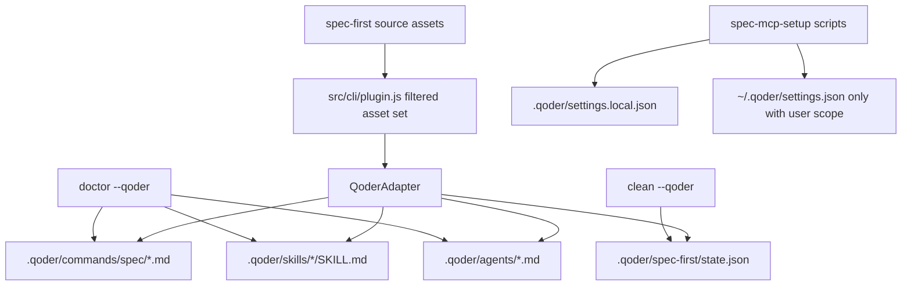

# feat: 支持 Qoder 宿主

## Summary

为 `spec-first` 增加 Qoder 作为 opt-in preview 宿主，沿用现有 host adapter 与 runtime generation 模型，把 commands、skills、agents、managed state 和 MCP setup 投影到 Qoder project surface。计划必须保持 source/runtime 边界清晰：`skills/`、`agents/`、`templates/`、`src/cli/` 与 docs 仍是 source-of-truth，`.qoder/**` 只作为 generated runtime 或 user-owned Qoder native assets。

---

## Decision Brief

- **Recommended approach:** 扩展现有 adapter registry 和 Kiro-era host support 模式，但为 Qoder 单独定义投影规则，因为 Qoder 官方能力同时覆盖 project commands、project skills、project subagents、MCP scopes、hooks 和 `AGENTS.md` static memory。
- **Key decisions:** Qoder 是 opt-in preview，不进入 `init -y` 默认；P0 生成 commands、skills 和 agents；agents 默认 `Read/Grep/Glob`；MCP 默认写 `.qoder/settings.local.json`；P0 不生成 hooks、plugin 或 `.qoder/rules/**`。
- **Validation focus:** 治理 schema/data 完整性、generated asset shape、doctor/clean 行为、精准 gitignore/context exclusion、shell 与 PowerShell MCP user-scope gate、release package 内容，以及真实或 degraded 记录的 Qoder CLI/IDE smoke。
- **Largest risks / boundaries:** `skills-governance.schema.json` 使用 `additionalProperties: false`，schema/data 部分迁移会硬失败；错误的 agent tools 默认值会产出不可用 reviewer；过宽 `.qoder/` ignore 或 clean 规则会隐藏或删除用户维护的 Qoder native files。

---

## Problem Frame

origin PRD 将 Qoder support 定义为新的宿主 runtime projection surface，而不是新的 workflow family。当前 `spec-first` 已支持 Claude Code、Codex 与 Kiro；Kiro P0 因宿主能力边界不生成 commands，并采用 Kiro-specific `tools: ["read"]`。Qoder 官方能力形状不同，若照搬 Kiro 策略，会低估 Qoder project command 能力，也可能让 review/research agents 缺少代码检索能力。

本计划交付最小可维护切片：新增一个 Qoder adapter，并聚焦更新 registry、governance、init/doctor/clean、MCP setup、generated-runtime docs、gitignore/context 边界与测试矩阵。实现必须 source-first、preview-scoped；完成前必须用 deterministic generated-asset evidence 和真实或 degraded 的 Qoder loader smoke 区分“已生成”与“已被 Qoder 识别”。

---

## Requirements

- R-01. 将 Qoder 作为 supported host id `qoder` 接入 CLI registry、governance schema/data、init、doctor、clean、runtime catalog 和 docs。Origin: R-01。
- R-02. Qoder 保持 opt-in preview；interactive init 可以选择，`init -y` 默认不安装 Qoder runtime。Origin: R-02。
- R-03. 生成 Qoder project commands 到 `.qoder/commands/spec/*.md`，并保持 Qoder path-derived command identity 可用。Origin: R-03。
- R-04. 生成 Qoder project skills 到 `.qoder/skills/{skill-name}/SKILL.md`，frontmatter `name` 与目录名一致，并满足 Qoder skill loader 约束。Origin: R-04。
- R-05. 生成 Qoder project subagents 到 `.qoder/agents/*.md`，使用 Qoder-native tools；默认 review/research 能力为 `Read`、`Grep`、`Glob`，默认排除写入、shell 和 dispatch tools。Origin: R-05/R-06。
- R-06. Qoder MCP 默认写本地 `.qoder/settings.local.json`；写 `~/.qoder/settings.json` 必须经过脚本层 `--user-scope` 或 `QODER_USER_SCOPE=1`。Origin: R-07。
- R-07. 复用 repo-root `AGENTS.md` 作为 Qoder static memory，不在 P0 生成 `.qoder/rules/**`。Origin: R-08。
- R-08. 只精准 ignore/exclude spec-first managed Qoder generated runtime；不得 blanket ignore 或 clean 整个 `.qoder/`。Origin: R-09/R-10/R-11。
- R-09. 更新用户可见 docs、runtime catalog、context governance、source-runtime boundary docs 和 changelog，明确 Qoder preview support。Origin: R-12。
- R-10. 用聚焦测试覆盖 Qoder init asset shape、doctor JSON/文本检查、clean 保留 user-owned `.qoder/**`、gitignore policy、MCP shell + PowerShell scope gate、runtime catalog、package 和 smoke。Origin: R-13。
- R-11. Qoder CLI/IDE loader smoke 可运行时必须记录真实证据；不可运行时必须记录 degraded reason，不能声称 parity。Origin: R-14。
- R-12. Qoder hooks、plugin packaging、auto-memory mutation 与 `.qoder/rules/**` projection 不进入 P0。Origin: R-15/R-16/R-17/R-18。

**Origin acceptance examples:** AE-01 到 AE-07 映射到 U1 到 U6；AE-03 与 AE-04 是最高风险验收点，分别覆盖 agent tools 可用性和 MCP user-scope 安全边界。

---

## Assumptions

- A1. `.qoder/commands/spec/*.md` 可以从现有 command templates 通过 host-specific path、frontmatter 和 invocation rewrite 生成，不需要改变 source workflow 语义。
- A2. Qoder subagent frontmatter 接受官方文档列出的 tools 值：`Read`、`Grep`、`Glob`、`WebFetch`、`WebSearch`、`Write`、`Edit`、`Bash`、`Agent`；实现前必须复核官方文档。
- A3. 实现环境可能没有 Qoder CLI/IDE。缺少本地 Qoder 只能形成 degraded validation evidence，不能删除 deterministic generated-asset tests。

---

## Scope Boundaries

- P0 不创建 Qoder plugin 或 plugin manifest。
- P0 不安装 Qoder hooks，也不写 hook settings。
- P0 不生成 `.qoder/rules/**`；`AGENTS.md` 保持共享 instruction source。
- P0 不默认写用户级 MCP config。
- P0 不承诺与 Claude/Codex/Kiro feature parity；preview 状态必须保留到 Qoder loader smoke 与用户价值信号确认。
- P0 不手改 `.qoder/**`；runtime assets 必须通过 `spec-first init --qoder` 生成。

### Deferred to Follow-Up Work

- `.qoder/rules/**` projection：需要先单独设计 rules 与 `AGENTS.md` 的 source-of-truth 分工。
- Qoder hooks：需要先单独设计 mutation/verification gate、opt-in 和跨宿主一致性。
- Qoder plugin packaging：需要等 project-local generated assets 证明价值后再评估。

---

## Completion Criteria

- `qoder` 成为 schema、governance data、plugin registry、adapter registry、init、doctor、clean、runtime catalog、docs 和 tests 中的有效 platform。
- 干净项目运行 `spec-first init --qoder` 能生成 commands、skills、agents、managed state 和精准 gitignore entries，且不触碰 user-owned Qoder assets。
- `doctor --qoder` 能报告 Qoder managed runtime health，且不会仅因 `.qoder/rules/**`、`.qoder/settings.json`、`.qoder/hooks/**` 等 native-only files 误判 runtime installed。
- `clean --qoder` 只删除 managed assets，并保留 user-owned Qoder native files。
- MCP setup 默认写 `.qoder/settings.local.json`，仅在 shell 和 PowerShell 路径都显式通过 user-scope gate 时写用户配置。
- Qoder CLI/IDE loader smoke 要么通过并记录证据，要么显式 degraded 并给出 reason，不得用官方文档替代 runtime evidence。

---

## Direct Evidence Readiness

- target_repo: current repository
- evidence_sources: PRD receipt verification、Qoder 官方文档复核、bounded source reads、`rg` source scan、task-governance advisory helper、existing Kiro implementation/tests。
- source_refs: `docs/brainstorms/2026-07-04-001-qoder-host-support-requirements.md`, `docs/10-prompt/结构化项目角色契约.md`, `src/cli/adapters/base.js`, `src/cli/adapters/kiro.js`, `src/cli/adapters/index.js`, `src/cli/plugin.js`, `src/cli/commands/init.js`, `src/cli/commands/doctor.js`, `src/cli/commands/clean.js`, `src/cli/contracts/dual-host-governance/skills-governance.schema.json`, `scripts/generate-runtime-capability-catalog.js`, `tests/smoke/cli.sh`, `tests/unit/gitignore-policy.test.js`, `tests/unit/mcp-setup-powershell-contracts.test.js`。
- current_revision: `3de869fa`
- worktree_status: dirty；当前工作树已有 Qoder 相关实现草稿和文档改动，本计划不把这些改动视为完成证据，后续 `$spec-work`/review 必须重新读取当前 source 和 diff。
- confidence: repo extension points 与 deterministic tests 为 high；真实 Qoder loader 行为为 medium，直到 smoke 运行或 degraded reason 记录。
- limitations: Qoder 官方文档是 planning evidence，不是 completion evidence；本阶段未运行真实 Qoder CLI/IDE loader smoke；当前工作树不是“计划前干净状态”。

---

## Direct Evidence

- repo_scope: `spec-first` 单仓 CLI/runtime support。
- source_reads_completed: `docs/10-prompt/结构化项目角色契约.md`, `$spec-plan` workflow references, origin PRD, `src/cli/adapters/base.js`, `src/cli/adapters/kiro.js`, `src/cli/adapters/index.js`, `src/cli/plugin.js`, `src/cli/commands/init.js`, `src/cli/commands/doctor.js`, `src/cli/commands/clean.js`, `src/cli/contracts/dual-host-governance/skills-governance.schema.json`, `scripts/generate-runtime-capability-catalog.js`, existing Qoder/Kiro-related tests and `skills/spec-mcp-setup/scripts/**` scan results。
- source_reads_required: implementation must re-open exact files before editing, especially adapter transform internals、shell/PowerShell MCP scripts、smoke scripts 和 governance JSON，因为计划不规定 line-level code。
- commands_or_tools_used: PRD receipt verifier、task-governance-signals helper、bounded `sed`/`rg` source reads、Qoder official docs web verification。
- impact_on_plan: `task-governance-signals` 返回 `candidate_level=deep`，reason codes 包含 `cross-module`、`many-files-or-paths`、`critical-path-hit`、`keyword-hit` 和 `candidate-deep`；本计划采用 Deep 深度。
- key_findings: governance schema 对 host enum 和 `host_delivery` 属性是硬约束；`doctor`/`clean` 已有 host flag 模式；Kiro tests 提供 native-file preservation 近邻模式；runtime catalog 从 source/governance 派生；Qoder 官方文档支持 commands/skills/subagents/MCP 和 `AGENTS.md` static memory。
- limitations: 当前 source/diff 中的 Qoder 实现草稿仍需后续 review 和测试验证；官方文档无法证明本仓库生成资产可被 Qoder loader 正确识别。

---

## Context & Research

### Relevant Code and Patterns

- `src/cli/adapters/base.js`: adapter contract，覆盖 runtime roots、commands、skills、agents、state、inspection 与 sync/remove hooks。
- `src/cli/adapters/kiro.js`: 最新 host-specific adapter，可复用 path rewrite、managed state、inspection 和 generated runtime 边界形状，但不能照搬 Qoder 不适用的 commands/tools 策略。
- `src/cli/plugin.js`: supported host list、governance loading/validation、filtered asset sets、runtime sync/drift functions。
- `src/cli/contracts/dual-host-governance/skills-governance.schema.json`: 严格 host enum 与 `host_delivery` shape；加入 Qoder 必须 schema/data 原子迁移。
- `tests/smoke/cli.sh` 与 `tests/smoke/release-dual-host-governance.sh`: full host install/doctor/clean/package smoke 模式。
- `skills/spec-mcp-setup/scripts/**`: shell 与 PowerShell MCP detection/configuration 路径，已有 Kiro local/user scope hardening，可扩展到 Qoder。

### Institutional Learnings

- `docs/solutions/workflow-issues/host-entrypoint-mapping-source-boundary-2026-04-29.md`: host entrypoint mappings 应集中在 init/governance/README 中心 surface，不散落到普通 workflow prose。
- `docs/solutions/workflow-issues/workflow-host-instruction-reuse-policy-2026-05-25.md`: 复用已加载 host instructions，避免把 runtime mirrors 或 instruction files 当作默认上下文 source。

### External References

- Qoder command docs: `https://docs.qoder.com/en/cli/command.md`
- Qoder skills docs: `https://docs.qoder.com/en/cli/Skills.md`
- Qoder subagent docs: `https://docs.qoder.com/en/cli/subagent.md`
- Qoder MCP docs: `https://docs.qoder.com/en/cli/mcp-servers.md`
- Qoder hooks docs: `https://docs.qoder.com/en/cli/hooks.md`
- Qoder memory docs: `https://docs.qoder.com/en/cli/memory.md`

---

## Key Technical Decisions

- KTD1. Qoder 作为 opt-in preview 交付。理由：新 runtime surface 与真实 loader evidence 尚不足以进入默认 `init -y`。
- KTD2. Qoder P0 同时生成 commands、skills 和 agents。理由：Qoder 官方支持三类 project-level surface；省略 commands 会让 Kiro workaround 泄漏到 Qoder。
- KTD3. Qoder 复用 `AGENTS.md`，不生成 `.qoder/rules/**`。理由：`AGENTS.md` 已是 repo instruction source，rules 需要单独 source-of-truth 设计。
- KTD4. Qoder MCP 默认写 local project config，并在脚本层 gate user scope。理由：用户级 settings 是跨项目副作用，不能只依赖 CLI wrapper 防护。
- KTD5. Qoder agents 默认 `Read/Grep/Glob`；web tools 按角色显式开启，write/shell/dispatch tools 默认关闭。理由：reviewer 需要检索能力，但 least privilege 仍是基线。
- KTD6. `.qoder/**` ignore/clean 规则必须精准。理由：`.qoder/` 可包含 user/team native rules、settings、hooks 和其他 Qoder-owned files。
- KTD7. P0 不交付 hooks/plugin。理由：hooks 和 plugins 扩大副作用、权限与发布复杂度；project-local generated assets 是最小可信 preview。
- KTD8. Qoder 官方文档是 planning evidence，不是 completion evidence。理由：完成需要 generated asset inspection、tests 和真实或 degraded 的 Qoder loader smoke。

---

## Open Questions

### Resolved During Planning

- Qoder 是否沿用 Kiro 的 no-command 策略？结论：不沿用。Qoder 官方 command docs 支持 project commands，P0 包含 `.qoder/commands/spec/*.md`。
- Qoder 是否沿用 Kiro 的 `tools: ["read"]` 默认？结论：不沿用。Qoder 官方 subagent docs 列出 `Read/Grep/Glob`，P0 用它们保证 review/research 最低可用性。
- P0 是否生成 `.qoder/rules/**`？结论：不生成。Qoder memory docs 支持 rules，但 `AGENTS.md` 是现有共享 static memory source，rules 需要单独边界设计。

### Deferred to Implementation

- 当前实现环境是否安装 Qoder CLI/IDE？交给 U6 记录 passed 或 degraded evidence。
- Qoder commands/skills/agents 是否 mid-session reload，还是需要新会话？交给 U6 影响 README/closeout wording。
- Qoder subagent loader 是否接受全部计划中的 transformed frontmatter 字段？交给 U2 的 generated fixture inspection 和 U6 的 loader smoke。

---

## High-Level Technical Design

> *This illustrates the intended approach and is directional guidance for review, not implementation specification. The implementing agent should treat it as context, not code to reproduce.*

---

## Implementation Units

### U1. Qoder Adapter 与 Registry Plumbing

**Goal:** 将 `qoder` 作为 supported host 接入，并提供专属 adapter 与 CLI platform plumbing。

**Requirements:** R-01, R-02, R-03, R-04, R-05, R-08

**Dependencies:** None

**Files:**
- Create: `src/cli/adapters/qoder.js`
- Modify: `src/cli/adapters/index.js`
- Modify: `src/cli/plugin.js`
- Modify: `src/cli/commands/init.js`
- Modify: `src/cli/commands/doctor.js`
- Modify: `src/cli/commands/clean.js`
- Modify: `src/cli/index.js`
- Test: `tests/unit/init-plan.test.js`
- Test: `tests/unit/init-source-path-coverage.test.js`
- Test: `tests/unit/cli-entry-contracts.test.js`
- Test: `tests/unit/doctor-qoder-detection.test.js`

**Approach:**
- 新增 `QoderAdapter` 并继承 `PlatformAdapter`，设置 `runtimeRoot=.qoder`、`commandRoot=.qoder/commands/spec`、`skillsRoot=.qoder/skills`、`workflowsRoot=.qoder/skills`、`agentsRoot=.qoder/agents`、`stateFile=.qoder/spec-first/state.json`、`instructionFile=AGENTS.md`。
- Qoder 保持 `hasCommands` 为 true。
- 将 Qoder 接入 adapter registry、supported platform constants、init choices、CLI help、doctor arg parsing、clean arg parsing 和 platform labels。
- 复用 Kiro opt-in preview 模式，让 `--qoder` 可用，但默认 `-y` 不包含 Qoder。

**Patterns to follow:**
- `src/cli/adapters/kiro.js`
- `src/cli/adapters/index.js`
- `src/cli/commands/init.js`
- `tests/unit/doctor-kiro-detection.test.js`

**Test scenarios:**
- Happy path: 显式 Qoder init 创建 Qoder plan/assets，并报告 generated command、skill、agent 和 state paths。
- Edge case: default yes-mode init 不包含 Qoder，除非显式传 `--qoder`。
- Error path: 加入 Qoder 后，unknown platform validation 仍拒绝 unsupported ids。
- Integration: managed Qoder state 存在时，`doctor --qoder --json` 返回 Qoder platform checks。

**Verification:**
- Qoder host 可通过现有 public CLI 模式选择、检查和清理。

---

### U2. Qoder Commands、Skills 与 Agents Projection

**Goal:** 将 source commands/skills/agents 转换为 Qoder-compatible runtime files。

**Requirements:** R-03, R-04, R-05, R-06, R-11

**Dependencies:** U1

**Files:**
- Modify: `src/cli/adapters/qoder.js`
- Modify: `src/cli/plugin.js`
- Test: `tests/smoke/cli.sh`
- Test: `tests/smoke/release-dual-host-governance.sh`
- Test: `tests/unit/init-source-path-coverage.test.js`
- Test: `tests/unit/runtime-capability-catalog.test.js`

**Approach:**
- 按 Qoder command frontmatter contract 渲染 command markdown，保留 path-derived command identity，避免把 workflow skill name 误用为 command identity。
- 将共享 runtime path references 改写到 `.qoder/commands/spec/`、`.qoder/skills/` 与 `.qoder/agents/`。
- 渲染 Qoder skills 时保证 folder name 与 frontmatter `name` 一致，并控制 description 约束。
- 从 source agent profiles 渲染 Qoder-native agent frontmatter，默认省略 model，默认 tools 为 `Read`、`Grep`、`Glob`。
- 只有 source profile 语义需要 web research 时才加 `WebFetch`/`WebSearch`；不全局启用 `Write`、`Edit`、`Bash` 或 `Agent`。

**Patterns to follow:**
- `src/cli/adapters/kiro.js` 的 transform/inspect 形状
- Qoder 官方 command、skills 和 subagent docs

**Test scenarios:**
- Happy path: bundled workflow commands 生成 Qoder command files，且使用 Qoder markdown frontmatter。
- Happy path: generated Qoder skills 的 folder/frontmatter names 匹配，并完成 runtime path rewrites。
- Happy path: generated Qoder agents 包含 `Read/Grep/Glob` 或明确的 read/web set，且默认不包含 write/shell/dispatch tools。
- Edge case: Qoder command subdirectory naming 可输入，不依赖 frontmatter `name` 作为 slash identity。
- Error path: Qoder skill name 无效、agent tool unsupported 或 runtime references stale 时，doctor 能报告 drift。

**Verification:**
- generated asset shape 可 deterministic inspection；真实 Qoder loader smoke 由 U6 覆盖。

---

### U3. Governance Schema、Host Delivery Data 与 Atomic Migration

**Goal:** 将 Qoder 加入 supported-host governance，并避免 schema/data 部分迁移状态。

**Requirements:** R-01, R-10

**Dependencies:** U1

**Files:**
- Modify: `src/cli/contracts/dual-host-governance/skills-governance.schema.json`
- Modify: `src/cli/contracts/dual-host-governance/skills-governance.json`
- Modify: `tests/unit/contract-drift-guard.test.js`
- Modify: `tests/unit/agent-native-architecture-contracts.test.js`
- Modify: `tests/unit/spec-write-skill-contracts.test.js`
- Modify: `tests/unit/skill-audit-scripts.test.js`

**Approach:**
- 一次性把 `qoder` 加入 schema host enum、owner host enum、required `host_delivery` properties，并给每条 governance record 补齐 Qoder delivery decision。
- 编辑 data 前，先对 `skills-governance.json` 跑确定性 record count 与 field completeness query；编辑后确认每条记录都有 `host_delivery.qoder`。
- 对 Qoder `workflow_command` records 使用 `command`，使 `buildFilteredAssetSet('qoder')` 同时产出 command files 和 workflow skill mirrors；standalone records 使用 `skill`，agent-facing internals 使用 `internal`，不应投影的使用 `none`。
- 保持 `additionalProperties: false`，不引入半迁移兼容态。

**Patterns to follow:**
- 当前 governance data 的 Kiro migration 形状
- `src/cli/plugin.js` 对 `SUPPORTED_PLATFORM_IDS` 的 governance validation loops

**Test scenarios:**
- Happy path: governance schema 校验每条记录都有 `host_delivery.qoder`。
- Edge case: fixture 缺少 `host_delivery.qoder` 时以清晰错误失败。
- Integration: `buildFilteredAssetSet('qoder')` 返回预期 commands、workflow skills、standalone skills、internal skills、agents 和 support files。
- Regression: Claude/Codex/Kiro delivery counts 和 exclusions 保持稳定，除非测试显式更新预期。

**Verification:**
- 任意 governance record 缺少 Qoder delivery decision 都无法通过加载。

---

### U4. Gitignore、Context Governance 与 Source/Runtime Boundary Updates

**Goal:** 让 spec-first 将 Qoder managed outputs 视为 generated runtime，同时保留 user-owned Qoder native assets。

**Requirements:** R-07, R-08, R-09, R-12

**Dependencies:** U1, U2

**Files:**
- Modify: `.gitignore`
- Modify: `src/cli/gitignore-policy.js`
- Modify: `docs/05-用户手册/12-gitignore参考.md`
- Modify: `docs/contracts/context-governance.md`
- Modify: `docs/contracts/source-runtime-customization-boundary.md`
- Modify: `src/cli/instruction-bootstrap.js`
- Modify: `src/cli/task-pack.js`
- Modify: `skills/spec-doc-review/SKILL.md`
- Modify: `skills/spec-code-review/SKILL.md`
- Modify: `skills/spec-sessions/SKILL.md`
- Modify: `skills/spec-debug/SKILL.md`
- Modify: `skills/spec-work/SKILL.md`
- Modify: `skills/spec-optimize/SKILL.md`
- Modify: `skills/spec-compound/SKILL.md`
- Modify: `skills/spec-plan/references/governance-boundaries.md`
- Modify: `skills/using-spec-first/SKILL.md`
- Test: `tests/unit/gitignore-policy.test.js`
- Test: `tests/unit/context-governance-contracts.test.js`
- Test: `tests/unit/instruction-bootstrap.test.js`
- Test: `tests/unit/context-bundle-contracts.test.js`
- Test: `tests/unit/target-repo-containment.test.js`
- Test: `tests/unit/task-pack-command.test.js`

**Approach:**
- 添加窄 managed patterns：`.qoder/commands/spec/`、`.qoder/skills/`、`.qoder/agents/`、`.qoder/spec-first/` 和 spec-first-managed `.qoder/settings.local.json`。
- 不 ignore `.qoder/`、`.qoder/rules/`、`.qoder/settings.json` 或 `.qoder/hooks/`。
- context-governance 默认排除 Qoder generated mirrors；用户显式命名 Qoder native files 时可作为 advisory input。
- source-runtime customization docs 明确 `.qoder/rules/**` 是 Qoder-native optional memory/rules，不是 P0 spec-first source。
- 同步当前 source skills 中的 runtime exclusion 文案，避免只覆盖 doc-review/code-review 而遗漏 work/debug/plan/compound/optimize/sessions 等入口。

**Patterns to follow:**
- Kiro gitignore 与 context-governance entries
- `tests/unit/gitignore-policy.test.js` negative assertions

**Test scenarios:**
- Happy path: generated gitignore block 包含 Qoder managed paths。
- Negative: generated gitignore block 不包含 `.qoder/` 或 `.qoder/rules/` blanket patterns。
- Integration: context bundle/governance tests 默认排除 Qoder generated mirrors，但可记录显式命名的 Qoder-native advisory paths。
- Regression: Kiro `.kiro/specs/**` treatment 保持不变。

**Verification:**
- Spec-first generated Qoder files 可安全重建；user-owned Qoder native files 保持可见且不被 clean 删除。

---

### U5. Qoder MCP Setup In Shell And PowerShell

**Goal:** 为 Qoder 增加 MCP configuration support，默认 local scope，并要求 user-scope 显式 opt-in。

**Requirements:** R-06, R-10

**Dependencies:** U1

**Files:**
- Modify: `skills/spec-mcp-setup/mcp-tools.json`
- Modify: `skills/spec-mcp-setup/references/supported-mcp-tools.md`
- Modify: `skills/spec-mcp-setup/scripts/detect-host.sh`
- Modify: `skills/spec-mcp-setup/scripts/configure-host.sh`
- Modify: `skills/spec-mcp-setup/scripts/install-mcp.sh`
- Modify: `skills/spec-mcp-setup/scripts/uninstall-mcp.sh`
- Modify: `skills/spec-mcp-setup/scripts/install-helpers.sh`
- Modify: `skills/spec-mcp-setup/scripts/verify-tools.sh`
- Modify: `skills/spec-mcp-setup/scripts/check-health`
- Modify: `skills/spec-mcp-setup/scripts/provider-readiness-renderer.cjs`
- Modify: `skills/spec-mcp-setup/scripts/detect-host.ps1`
- Modify: `skills/spec-mcp-setup/scripts/configure-host.ps1`
- Modify: `skills/spec-mcp-setup/scripts/install-mcp.ps1`
- Modify: `skills/spec-mcp-setup/scripts/uninstall-mcp.ps1`
- Modify: `skills/spec-mcp-setup/scripts/install-helpers.ps1`
- Modify: `skills/spec-mcp-setup/scripts/verify-tools.ps1`
- Test: `tests/unit/mcp-setup.sh`
- Test: `tests/unit/mcp-setup-powershell-contracts.test.js`

**Approach:**
- 增加 Qoder `host_config` targets：默认 local `.qoder/settings.local.json`，user scope 为 `$HOME/.qoder/settings.json`。
- 在 shell 与 PowerShell 脚本层引入 `QODER_USER_SCOPE=1` 和 `--user-scope` handling；即使从 Qoder skill invocation 或直接脚本调用进入，默认也只能写 local scope。
- 使用 Qoder `mcpServers` JSON shape 写配置，并保留 unrelated configured servers。
- 将 literal secret guard 扩展到 Qoder JSON settings，避免把 secret-like literal 写进可提交配置。

**Patterns to follow:**
- 既有 Kiro MCP shell 与 PowerShell hardening tests
- Qoder MCP docs 的 local/user/project scope 约定

**Test scenarios:**
- Happy path: Qoder default configure 写 `.qoder/settings.local.json`，不写 user config。
- Happy path: Qoder user-scope configure 写 `$HOME/.qoder/settings.json`，不写 local config。
- Error path: invalid Qoder JSON 不被静默覆盖。
- Integration: 未启用 user scope 的 uninstall 保留 user config；启用 user scope 时只移除匹配 user entry。
- Security: Qoder JSON config 中 literal secret-like values 被 guard 拒绝，除非通过 env placeholders 表达。

**Verification:**
- CLI invocation、Qoder skill invocation 和 direct script invocation 下，MCP setup 的默认副作用都保持 project-local。

---

### U6. Documentation、Runtime Catalog、Release Package 与 Qoder Smoke

**Goal:** 让 Qoder support 可发现、可测试，并在缺少真实 runtime evidence 时诚实保留 preview/degraded 表达。

**Requirements:** R-09, R-10, R-11, R-12

**Dependencies:** U1, U2, U3, U4, U5

**Files:**
- Modify: `README.md`
- Modify: `README.zh-CN.md`
- Modify: `docs/05-用户手册/README.md`
- Modify: `docs/05-用户手册/02-核心概念.md`
- Modify: `docs/05-用户手册/05-最佳实践.md`
- Modify: `docs/catalog/runtime-capabilities.md`
- Modify: `scripts/generate-runtime-capability-catalog.js`
- Modify: `tests/unit/runtime-capability-catalog.test.js`
- Modify: `tests/smoke/cli.sh`
- Modify: `tests/smoke/install-tarball.sh`
- Modify: `tests/smoke/release-dual-host-governance.sh`
- Modify: `package.json`
- Modify: `CHANGELOG.md`

**Approach:**
- 更新 README host summaries、quick start、workflow entrypoint table、runtime boundary sections 和 Qoder preview wording。
- 更新 runtime catalog generator，纳入 Qoder delivery counts、entrypoints、runtime paths 和 release evidence。
- 增加 package/smoke checks，确认 `src/cli/adapters/qoder.js` 和 generated Qoder assets 在 release package 中可用。
- Qoder real CLI/IDE smoke 采用 best-effort：Qoder 可用时验证 generated commands/skills/agents 被 loader 识别；不可用时记录 degraded validation 并保留 preview 标签。
- changelog 记录 source surfaces、用户可见影响、generated runtime impact 和实际验证。

**Patterns to follow:**
- 既有 Kiro README/runtime catalog/release evidence
- `tests/smoke/release-dual-host-governance.sh` Kiro block

**Test scenarios:**
- Happy path: runtime catalog 将 Qoder 与 Claude/Codex/Kiro 并列，并从当前 source 派生 counts。
- Integration: tarball/package smoke 包含 Qoder adapter，并能 programmatic init Qoder runtime。
- Integration: Qoder clean 保留 native `.qoder/rules/**`、`.qoder/settings.json` 和 `.qoder/hooks/**`。
- Degraded path: Qoder CLI 不可用时，smoke/closeout 记录明确 degraded reason，docs 保持 preview wording。

**Verification:**
- 用户能发现 Qoder support；reviewer 能区分 generated-runtime evidence 与真实 Qoder loader evidence。

---

## System-Wide Impact

- **Interaction graph:** `init`、`doctor`、`clean`、`plugin` asset generation、governance validation、MCP setup scripts、runtime catalog generation、README docs 和 smoke/release tests 都会增加第四宿主分支。
- **Error propagation:** unknown 或 partially migrated Qoder governance records 应在 plugin/governance validation 阶段 deterministic fail，不应拖到 runtime generation 阶段才失败。
- **State lifecycle risks:** `clean --qoder` 必须依赖 managed state 和 generated path manifest，不得 broad directory deletion。
- **API surface parity:** CLI help 与 docs 中列 host selection flags 的地方需要列出 Qoder；普通 workflow prose 保持 current-host-neutral。
- **Surface coverage:** CLI/init/doctor/clean in-scope；MCP setup in-scope；README/runtime catalog in-scope；generated `.qoder/**` runtime 只作为 output in-scope；Qoder hooks/rules/plugin deferred。
- **Integration coverage:** smoke tests 必须覆盖 install/doctor/clean path，因为 unit tests 不能单独证明 runtime asset layout。
- **Unchanged invariants:** `CLAUDE.md`、`AGENTS.md`、`skills/`、`agents/`、`templates/` 和 `src/cli/` 保持 source；generated mirrors 保持 disposable。

---

## Risks & Dependencies

| Risk | Likelihood | Impact | Mitigation |
| --- | --- | --- | --- |
| governance schema/data 部分迁移导致 plugin loading 全局失败。 | Medium | High | schema/data 原子更新；迁移前后做精确 record count 与 `host_delivery.qoder` completeness 检查。 |
| Qoder agents 默认 tools 实际无法完成代码检索。 | Medium | High | 默认 `Read/Grep/Glob`；要求 generated fixture inspection 和真实或 degraded Qoder smoke；若 smoke 证伪，完成前调整 tools 策略。 |
| broad `.qoder/` ignore 或 clean 删除/隐藏 user-owned Qoder assets。 | Medium | High | 为 `.qoder/`、`.qoder/rules/`、settings 和 hooks preservation 增加 negative tests。 |
| 直接脚本调用绕过 CLI，写入 user-level MCP config。 | Medium | High | user-scope gate 放在 shell 和 PowerShell 脚本层，而不是只放 CLI wrapper。 |
| docs 在 Qoder 证据不足时夸大 parity。 | Medium | Medium | 保持 opt-in preview wording，并分开 deterministic generated-asset evidence 与 Qoder loader evidence。 |
| Qoder 官方 docs 在实现前变化。 | Low | Medium | 实施开始时复核官方 docs，并在 closeout 记录差异。 |

---

## Documentation / Operational Notes

- README 与 README.zh-CN 应说明 Qoder support 是 opt-in preview，并集中描述 Qoder entrypoints，避免普通 workflow prose 散落 host-specific mapping。
- runtime catalog 继续从 source/governance 生成，列出 Qoder 作为 derived runtime capability。
- source/runtime boundary docs 需要明确 spec-first managed `.qoder/**` 是 generated output，同时 Qoder-native rules/settings/hooks 保持 user-owned。
- completion evidence 需要说明 `spec-first init --qoder` 后是否需要 Qoder session restart 或 Qoder-native reload action。

---

## Existing Capability / Reuse Analysis

- **Inventory:** 现有 `PlatformAdapter`、Kiro adapter、plugin filtered asset set、dual-host governance schema/data、init/doctor/clean host flag patterns、gitignore/context governance、MCP setup scripts、runtime catalog generator 和 Kiro tests。
- **Decision:** 扩展现有 source owners。只新增 `src/cli/adapters/qoder.js`，因为 Qoder-specific paths、frontmatter、tool defaults 和 inspect rules 属于 host adapter，不应塞进 generic plugin logic 或 Kiro adapter conditionals。
- **Source-of-truth:** `src/cli/adapters/qoder.js` 负责 Qoder runtime transform/inspect rules；`src/cli/contracts/dual-host-governance/**` 负责 delivery decisions；`skills/spec-mcp-setup/**` 负责 MCP config writing；docs/catalog 与 README 消费这些 source facts。
- **Rejected owner:** 不把 Qoder rules 编码进 generated `.qoder/**`；不把 Qoder-specific projection 放入 `src/cli/adapters/kiro.js`；不创建独立 Qoder workflow family。
- **Work-phase recheck:** 实施前重新读取 Qoder docs 和当前 source。若 Qoder support 已并发落地或官方路径变化，优先更新现有 owner，而不是新增重复 surface，并在 closeout 解释 deviation。

---

## Phased Delivery

### Phase 1

- U1、U2、U3 先让 Qoder 成为有效 generated runtime host，并阻断 schema/data 部分迁移状态。

### Phase 2

- U4、U5 加固 generated-runtime boundaries 与 MCP side effects。

### Phase 3

- U6 更新 docs/catalog/package evidence，并运行 deterministic 与真实或 degraded smoke validation。

---

## Sources & References

- **Origin document:** `docs/brainstorms/2026-07-04-001-qoder-host-support-requirements.md`
- Related code: `src/cli/adapters/base.js`
- Related code: `src/cli/adapters/kiro.js`
- Related code: `src/cli/plugin.js`
- Related code: `src/cli/contracts/dual-host-governance/skills-governance.schema.json`
- Related tests: `tests/smoke/cli.sh`
- Related tests: `tests/smoke/release-dual-host-governance.sh`
- Related tests: `tests/unit/doctor-kiro-detection.test.js`
- Related tests: `tests/unit/mcp-setup-powershell-contracts.test.js`
- Qoder commands: `https://docs.qoder.com/en/cli/command.md`
- Qoder skills: `https://docs.qoder.com/en/cli/Skills.md`
- Qoder subagents: `https://docs.qoder.com/en/cli/subagent.md`
- Qoder MCP: `https://docs.qoder.com/en/cli/mcp-servers.md`
- Qoder hooks: `https://docs.qoder.com/en/cli/hooks.md`
- Qoder memory/static rules: `https://docs.qoder.com/en/cli/memory.md`

---

## Completion Evidence

- **Status:** completed。实现范围覆盖 origin PRD 与本计划 U1-U6；Qoder 保持 opt-in preview，未手改 generated runtime mirrors。
- **Governance deterministic evidence:** `src/cli/contracts/dual-host-governance/skills-governance.json` 当前 37 条 `host_delivery` record 全部包含 `qoder`；`buildFilteredAssetSet('qoder')` 输出 counts 为 `commands=20`、`workflowSkills=20`、`skills=2`、`internalSkills=1`、`agents=51`、`agentSupportFiles=0`、`skipped=14`。
- **Runtime projection evidence:** Qoder generated surface 覆盖 `.qoder/commands/spec/`、`.qoder/skills/`、`.qoder/agents/` 与 `.qoder/spec-first/state.json`；`.qoder/rules/**`、`.qoder/settings.json`、`.qoder/hooks/**` 保持 Qoder-native/user-owned surface，不被 blanket ignore 或 clean。
- **MCP safety evidence:** Qoder MCP 默认 workspace-local `.qoder/settings.local.json`；用户级 `~/.qoder/settings.json` 仍需 `--user-scope` 或 `QODER_USER_SCOPE=1`，shell 与 PowerShell 脚本层都有覆盖。
- **Review finding resolution:** `$spec-code-review` 多 agent findings 已逐项修复，包括 Qoder managed sentinel 探测、`doctor --qoder` local MCP config 检查、generated `spec-mcp-setup` host pin、Kiro→Qoder MCP path 精确 rewrite、host-specific user-scope gate、npm install matrix 四宿主 release evidence、Qoder `AGENTS.md` `/spec:*` project command bootstrap、`mcp__...` selector 保留、Qoder `qodercli`/`qoder` host detection、`.qoder/settings.local.json` 的 `host_local_config_excluded` context reason、frontmatter-only agent tools 与 loader degraded reason 测试。
- **Validation executed:** `node --check src/cli/adapters/qoder.js && node --check src/cli/commands/doctor.js && node --check scripts/npm-install-matrix-smoke.js`；`bash -n skills/spec-mcp-setup/scripts/uninstall-mcp.sh tests/unit/mcp-setup.sh tests/smoke/cli.sh tests/smoke/release-dual-host-governance.sh`；focused Jest suites for Qoder doctor/source coverage/gitignore/governance/npm matrix/runtime contracts；`npx jest tests/unit/init-plan.test.js tests/unit/instruction-bootstrap.test.js tests/unit/context-bundle-contracts.test.js tests/unit/context-governance-contracts.test.js tests/unit/mcp-setup-powershell-contracts.test.js tests/unit/changelog-format.test.js --runInBand`；`npx jest tests/unit/web-researcher-contracts.test.js tests/unit/init-plan.test.js tests/unit/changelog-format.test.js --runInBand`；`npm run test:mcp-setup`；`bash tests/unit/mcp-setup.sh`；`bash tests/smoke/cli.sh`；`npx jest tests/unit/mcp-setup-powershell-contracts.test.js --runInBand`；`npm run typecheck`；`npm run docs:runtime-catalog`；`npm run test:smoke`；`bash tests/smoke/release-dual-host-governance.sh`；`bash tests/smoke/install-tarball.sh`；`npm run build`；`SPEC_FIRST_SMOKE_ARTIFACT_DIR=<tmp> node scripts/npm-install-matrix-smoke.js`；final `npx jest tests/unit/init-interactive.test.js tests/unit/context-governance-contracts.test.js tests/unit/mcp-setup-config-template-contracts.test.js --runInBand`；final `npm test`。
- **Remaining degraded evidence:** 本机 `qodercli` / `qoder` 不在 `PATH`，因此真实 Qoder CLI/IDE loader smoke 只能记录 degraded：`qodercli/qoder not found on PATH`。不声称 Qoder loader parity。
