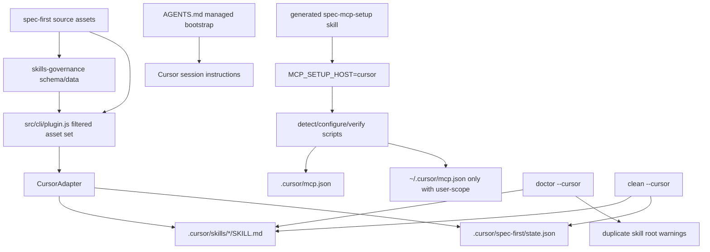

# feat: 支持 Cursor 宿主

## Summary

为 `spec-first` 增加 Cursor 作为 opt-in preview 宿主，先以 `.cursor/skills/**`、repo-root `AGENTS.md`、`.cursor/spec-first/state.json` 与项目级 `.cursor/mcp.json` 验证最小 workflow harness 使用路径，再决定是否进入完整 host support。P0 必须区分两层 gate：机械投射能力（adapter、`SUPPORTED_PLATFORM_IDS`、governance schema/data、`loadSkillsGovernance` host-key mapping、`buildFilteredAssetSet('cursor')`）是 `init --cursor` generated-runtime preview 的前提，必须随实现完成；U0 只 gate Cursor runtime 语义主张，例如完整 host support wording、`init -y` 默认、五宿主 full runtime catalog 列和 full-host promotion。若本地 Cursor loader/user journey 不能证明 `.cursor/skills/<skill>/SKILL.md` 可被发现并触发 workflow，本次交付只能降级为 generated-runtime preview，并在 init/doctor/release 输出显式运行时警示。

---

## Decision Brief

- **Recommended approach:** 先新增 U0 Cursor capability proof，再新增 `CursorAdapter` 并接入现有 multi-host runtime generation、doctor/clean、governance、MCP setup 和 docs；Cursor P0 采用 skill-first projection，不默认生成 `.cursor/commands/spec/**`、`.cursor/agents/**` 或 `.cursor/rules/**`。
- **Key decisions:** Cursor 是 opt-in preview，不进入 `init -y` 默认；Cursor workflow entrypoint 以 Cursor Agent Skills 为主，`AGENTS.md` 提供入口治理；项目级 MCP 默认写 `.cursor/mcp.json`，用户级 `~/.cursor/mcp.json` 必须显式 opt-in；doctor 必须报告 Cursor skill discovery 的 duplicate-root 风险。
- **Validation focus:** U0 loader/entrypoint proof、host registry 全链路、governance schema/data 原子迁移、Cursor runtime asset shape、duplicate skill root divergence warning、MCP shell/PowerShell explicit host-authority gate、context/source-runtime 边界、README/runtime catalog/release smoke，以及真实或 degraded 的 Cursor loader evidence 分级口径。
- **Largest risks / boundaries:** Cursor 官方 docs 当前确认 project、nested project、user-level 与 compatibility skills roots（`.cursor/skills/**`、`.agents/skills/**`、嵌套 `.cursor/skills/**` / `.agents/skills/**`、`~/.cursor/skills/**`、`~/.agents/skills/**`、`.claude/skills/**`、`.codex/skills/**`、`~/.claude/skills/**`、`~/.codex/skills/**`），因此 duplicate discovery 是 P0 confirmed risk；但 spec-first 自己生成且内容/managed signature 匹配同一 source 的多宿主镜像必须抑制告警，只有用户自有、未知 ownership 或内容发散的同名 skill 才告警。另一个高风险点是从 Claude/Kiro 误判事故中复发：install/configure/uninstall 写路径不得靠 PATH、runtime 目录或历史 facts 推断当前 host，所有宿主写路径都必须显式 pin `MCP_SETUP_HOST`，Cursor generated setup surface 必须注入 `MCP_SETUP_HOST=cursor`。
- **Role-contract alignment / why now:** 这不是重建 Cursor 已经商品化的 Agent Skills、MCP 或 subagents primitive；本计划的增量价值是把 Cursor 纳入 spec-first 不同宿主共用的 source/runtime 同源纪律、host authority fail-closed、duplicate-root divergence 诊断、MCP secret redaction 和证据分级表达。选择现在做第 5 个宿主，是为了验证这层跨宿主治理能否覆盖一个高使用率且 discovery root 更复杂的宿主；若 U0 证据长期 degraded，应停止扩展 rules/subagents/commands，把投入转回跨宿主证据闭环深化。

---

## Problem Frame

`spec-first` 已支持 Claude Code、Codex、Kiro 和 Qoder，但 Cursor 的宿主能力形状与 Kiro/Qoder 都不同。Cursor 支持 Agent Skills、project/user MCP config、rules 和 `AGENTS.md` instruction；同时 Cursor skill discovery 可能兼容多个既有目录，容易在多宿主 runtime 并存的仓库中发现重复或陈旧 skill。

因此 Cursor support 不能只是“复制 Qoder adapter”。P0 应先把 spec-first 的核心 workflow 能力投射到 Cursor 的最稳 surface，并显式保护 source/runtime 边界、setup host authority、重复 discovery、用户级 MCP 写入和 docs 可信度。rules、subagents、command-like entrypoints、hooks/plugin 等能力留到后续，在有 Cursor loader evidence 后再扩展。

本计划的 why-now 是一次受控押注：Cursor 是高使用率宿主，且其 official compatibility roots 会主动读取 `.agents/.claude/.codex` 等既有 spec-first runtime mirror，正好暴露跨宿主治理最容易失真的区域。成功信号不是“多一个宿主图标”，而是 `init --cursor` 在 preview 态也能诚实生成、诊断和回滚 managed assets，同时在 U0 未证实时清楚告诉用户 skills 可能不会被 Cursor 加载。

本计划没有上游 PRD 文档；`spec_id` 是本计划本地生成。计划阶段只写 docs/changelog，不修改 CLI 实现或 generated runtime mirrors。

---

## Requirements

- R0. 在任何完整 host support 声明、`init -y` 默认纳入、五宿主 full runtime catalog 列或 full-host promotion 前，必须用 Cursor 官方 docs 确认 repo-local `.cursor/skills/<skill>/SKILL.md` 的设计路径，并用本地 Cursor loader / user journey evidence 证明它可被发现并显式触发至少一条 skill-first spec-first workflow；不可验证时只能交付 generated-runtime preview。U0 pass 只能支撑 `skill_first_loader_confirmed_preview`，不等于完整 workflow parity；完整 host support 还必须单独验证依赖 typed reviewer/worker agent delegation 的核心 workflow，或在所有完整支持文案中显式排除该 parity。R0 不阻止实现机械投射能力。
- R1. 将 `cursor` 加入 supported host id，并接入 adapter registry、plugin governance、init、doctor、clean、runtime catalog、README 和 docs；该机械接入必须支持 `buildFilteredAssetSet('cursor')` 在 generated-runtime preview 态返回真实 assets，而不是因 unknown platform 或 governance missing field 崩溃。
- R2. Cursor 必须是 opt-in preview host；interactive init 可选，`init -y` 默认不安装 Cursor runtime。
- R3. P0 生成 Cursor skills 到 `.cursor/skills/<skill>/SKILL.md`，覆盖 workflow skills 与 standalone skills，保持 skill name/folder 一致和 source path rewrite 正确，并按 Cursor 官方 `SKILL.md` frontmatter 规范归一化 `name`、`description`、`paths`、`disable-model-invocation` 与 `metadata`，不得把非 Cursor 标准字段原样投射成不明语义。
- R4. P0 不默认生成 `.cursor/commands/spec/**`；除非实现期通过官方/本地 Cursor loader evidence 证明有稳定 command surface，并另立决策记录。
- R5. P0 不默认生成 `.cursor/agents/**`；现有 source `agents/` 仍可作为未来 Cursor subagent projection 输入，但不得在 P0 伪装成已支持。实现必须把 `supportsAgents=false` 作为 shared generator/inspector contract 处理，点名覆盖 `buildFilteredAssetSet()`、`syncBundledAssets()`、`planBundledAssetSync()`、`syncAgents()`、`planAgentsSync()`、`inspectInstalledAssets()`、state、doctor 和 clean，使 Cursor init/state/doctor/clean 均不生成或要求 `.cursor/agents/**`。
- R6. P0 不默认生成 `.cursor/rules/**`；repo-root `AGENTS.md` 仍是 Cursor instruction bootstrap 的 source，Cursor-native rules 只作为显式命名的 advisory input。
- R7. Cursor MCP 默认写项目级 `.cursor/mcp.json`；写/删用户级 `~/.cursor/mcp.json` 必须经 `--user-scope` 或 `CURSOR_USER_SCOPE=1` 脚本层 gate。Uninstall 默认只清理项目级 spec-first managed keys，不得在无 user-scope gate 时触碰用户级 Cursor config。
- R8. Cursor generated `spec-mcp-setup` surface 必须注入 `MCP_SETUP_HOST=cursor`，并明确 setup facts/host config 只能由脚本写，不能由 LLM 直接 patch。本次全宿主 fail-closed 变更还要求 Claude、Codex、Kiro、Qoder、Cursor 的 generated setup surfaces 都具备 canonical host pin，尤其补齐 Codex skill 的 `MCP_SETUP_HOST=codex` 注入与回归测试。
- R9. Doctor 必须检测并报告 Cursor duplicate skill discovery 风险。P0 至少覆盖官方确认的 project、nested project、user-level 与 compatibility skill roots：`.cursor/skills/**`、`.agents/skills/**`、嵌套 `.cursor/skills/**` / `.agents/skills/**`、`~/.cursor/skills/**`、`~/.agents/skills/**`、`.claude/skills/**`、`.codex/skills/**`、`~/.claude/skills/**` 和 `~/.codex/skills/**`；未被官方确认的 Kiro/Qoder roots 只能作为 advisory hypothesis，除非本地 Cursor evidence 证明会被发现。告警必须聚焦发散或非受管同名 skill：两个 root 都是 spec-first managed 且内容/来源签名匹配同一 source 时抑制告警。
- R10. Gitignore/context/source-runtime 边界只精准覆盖 spec-first managed Cursor outputs，不 blanket ignore、clean 或默认扫描整个 `.cursor/**`。
- R11. governance schema/data/plugin mapping 迁移必须原子完成，作为 `init --cursor` preview 可构建的机械前提；所有当前 governed skill record 都要用确定性命令精确统计并补齐 `host_delivery.cursor`。R0 未通过时不得把 `cursor` 宣称为 full host support、纳入 `init -y` 默认或展示为 five-host full support catalog column。
- R12. 用户可见 docs、runtime catalog、release package evidence、`init --cursor`、`doctor --cursor` 和 changelog 必须说明 Cursor preview status、entrypoint shape、MCP scope、安全边界和 degraded loader evidence；generated-runtime preview 态必须显式提示本机 Cursor skill discovery/invocation 尚未验证，skills 可能不会加载。
- R13. 实现必须有聚焦测试：init asset shape、Cursor skill frontmatter normalization、doctor/clean、governance schema/data、duplicate divergence warning suppression、MCP shell+PowerShell、context/gitignore、runtime catalog、package/smoke。
- R14. Cursor IDE/CLI loader smoke 可运行时记录真实证据；不可运行时记录 degraded reason，不能用官方文档替代 full host support completion evidence。Degraded loader evidence 只能支撑 generated-runtime preview，不能关闭 R0 或宣称完整 workflow harness 可用。

---

## Assumptions

- A1. Cursor 当前官方 docs 在 planning time（2026-07-05）暴露 Agent Skills、`.cursor/skills/`、`.agents/skills/`、nested `.cursor/skills/` / `.agents/skills/`、`~/.cursor/skills/`、`~/.agents/skills/`、`.claude/skills/`、`.codex/skills/`、`~/.claude/skills/`、`~/.codex/skills/`、`SKILL.md`、Viewing skills 与 `/migrate-to-skills` 路径；这是 planning-confirmed evidence，不是跳过实现期复核的许可证。实现前仍必须复核官方 docs 与本地 Cursor 版本，并用 U0 记录 exact evidence。
- A2. `.agents/skills`、`.claude/skills`、`.codex/skills` 已是官方 confirmed Cursor-compatible skill roots；P0 duplicate warning contract 必须覆盖它们。Cursor 是否会发现 `.kiro/skills`、`.qoder/skills` 等非官方兼容 roots 尚未确认，只能作为 advisory hypothesis。
- A3. Cursor project-level MCP config 使用 `.cursor/mcp.json`，user-level config 使用 `~/.cursor/mcp.json`；实现前必须再次复核官方 docs。
- A4. Cursor 没有必须使用的 spec-first command source；P0 以 Cursor Agent Skills 作为用户可见入口。`spec-*`/`spec-*` 只能作为跨宿主概念映射出现在说明文档中，不进入 Cursor bootstrap wording，也不暗示 Cursor 支持同名 slash command。
- A5. 当前实现环境可能没有 Cursor CLI/IDE 或无法从 CLI 自动证明 loader 行为；这种情况只能得到 degraded validation，不影响 deterministic generated-asset tests。
- A6. Cursor CLI 当前官方安装文档用 `agent --version` 验证，并在 CLI MCP 文档中使用 `agent mcp list` / `agent mcp list-tools <identifier>`；U0/U5 不得猜测 `cursor` 或 `cursor-agent`。实现期必须重新打开官方 CLI docs，记录 resolved binary path、version 和命令是否非交互可用。

---

## Scope Boundaries

- P0 不创建 Cursor plugin 或 marketplace packaging。
- P0 不生成 `.cursor/commands/spec/**`。
- P0 不生成 `.cursor/agents/**`。
- P0 不生成 `.cursor/rules/**`，也不把 rules 当作 source-of-truth。
- P0 不默认写用户级 MCP config。
- P0 不手改 `.cursor/**` generated/runtime files；所有 runtime assets 必须由 `spec-first init --cursor` 生成。
- P0 不承诺 Cursor 与 Claude/Codex/Kiro/Qoder 的 feature parity；preview 状态要持续到 Cursor loader evidence 成立。

### Deferred to Follow-Up Work

**P1 candidates after U0 passes and preview use is validated:**
- Cursor subagents projection：需要确认 Cursor subagent frontmatter、tool model、dispatch 行为和安全默认值；只有在 skill-first preview 确认可用后才进入。P0 的已知降级是 typed reviewer/worker agent 派发不能投射为 Cursor subagents，多 agent review/workflow 只能经 skill prose 和宿主原生能力执行。
- Cursor command-like entrypoint：只有在官方/本地证据证明稳定 surface 后再决定是否生成；若 Agent Skills 已足够，不必强行生成。P0 不提供 command surface，因此用户必须通过 Cursor skill invocation，而不是 `spec-*` 或 `spec-*`。
- Cursor remote MCP writer：当前 `skills/spec-mcp-setup/mcp-tools.json` 中 spec-first required MCP servers 都是 stdio/command shape；remote `url`/`headers`/`auth` writer、remote secret redaction matrix 和 remote CLI validation 移入 P1，待真正引入 remote MCP server 时再补。

**Later / adoption-dependent:**
- Cursor rules projection：需要单独设计 `.cursor/rules/**` 与 `AGENTS.md` 的权威边界、触发方式和 clean/ignore 策略；除非发现 `AGENTS.md` 无法满足 Cursor bootstrap，否则不应抢进 P0。
- Cursor plugin/marketplace packaging：等 project-local preview usage 证明价值后再评估。

---

## Completion Criteria

- U0 Cursor capability proof 明确记录 pass/degraded/error。只有 pass 才允许把 Cursor 计入完整 host support；degraded/error 只能交付 generated-runtime preview。若 U0 error 证明 `.cursor/skills/**` 本身不可用，release 不得发布 `init --cursor`；throwaway validation project 必须清理，已生成到用户项目的 managed preview assets 只能通过 `clean --cursor` 回滚。
- `cursor` 出现在 adapter registry、supported platform constants、CLI flags/help、doctor/clean、governance schema/data、preview runtime catalog/docs 和 tests 中；即使 U0 degraded，`init --cursor` 也不得因 unknown platform、missing `host_delivery.cursor` 或 `loadSkillsGovernance` host-key stripping 崩溃。
- 干净项目执行 Cursor init 能生成 `.cursor/skills/**`、`.cursor/spec-first/state.json`、精准 `.gitignore` entries 和 repo-root `AGENTS.md` managed bootstrap，不生成 P0 排除的 commands/agents/rules。
- `doctor --cursor` 能检查 Cursor managed runtime health，并在多宿主 skill roots 同名且 unmanaged/unknown/divergent 时给出 warning 和可执行修复建议；匹配的 spec-first managed mirrors 不告警，doctor 不要求 `.cursor/agents/**` 存在。
- `clean --cursor` 只删除 spec-first managed Cursor assets，不删除 `.cursor/rules/**`、用户维护 `.cursor/skills/**`、用户维护 `.cursor/mcp.json` 中非 spec-first server entries，或其他 Cursor-native files。
- MCP setup shell 与 PowerShell 默认写 `.cursor/mcp.json`，只有显式 user-scope gate 才写 `~/.cursor/mcp.json`。
- MCP install/configure/uninstall 写路径没有显式 canonical `MCP_SETUP_HOST` 时对所有宿主 fail closed；install/configure/uninstall/doctor/dry-run/errors/release evidence 对 `.cursor/mcp.json` 输出脱敏状态摘要。
- Cursor generated setup surface 包含 `MCP_SETUP_HOST=cursor` host pin 和 script-owned facts/write-safety 规则；Claude/Codex/Kiro/Qoder generated setup surfaces 也各自包含 canonical `MCP_SETUP_HOST=<host>` pin，避免全宿主 fail-closed 后现有入口变成不可用。
- Cursor loader smoke / minimal user journey 通过并记录 skill-first loader evidence；若 loader smoke degraded，仅满足 generated-runtime preview 完成标准，不得开启 `init -y` 默认、five-host full runtime catalog column 或完整 host support 声明。
- U0 pass 后只能开启 `skill_first_loader_confirmed_preview`。`full_host_preview` 或完整 host support 需要额外证明至少一个依赖 typed reviewer/worker agent delegation 的核心 workflow 在 Cursor 中可接受地运行；若 P0 仍 `supportsAgents=false`，full-support 文案必须显式排除 typed-agent workflow parity。

---

## Direct Evidence Readiness

- target_repo: current repository
- evidence_sources: bounded source reads、`rg` source scan、governance record count check、task-governance advisory helper、Cursor official docs URL availability check、prior Qoder/Kiro plans and runtime setup learning。
- source_refs: `docs/10-prompt/结构化项目角色契约.md`, `docs/plans/2026-07-04-001-feat-qoder-host-support-plan.md`, `docs/solutions/workflow-issues/runtime-setup-host-authority-and-script-owned-facts-2026-07-04.md`, `src/cli/adapters/base.js`, `src/cli/adapters/kiro.js`, `src/cli/adapters/qoder.js`, `src/cli/adapters/index.js`, `src/cli/plugin.js`, `src/cli/commands/init.js`, `src/cli/commands/doctor.js`, `src/cli/commands/clean.js`, `src/cli/contracts/dual-host-governance/skills-governance.schema.json`, `src/cli/instruction-bootstrap.js`, `src/cli/gitignore-policy.js`, `src/cli/task-pack.js`, `docs/contracts/context-governance.md`, `docs/contracts/source-runtime-customization-boundary.md`, `skills/spec-mcp-setup/scripts/detect-host.sh`, `skills/spec-mcp-setup/scripts/install-mcp.sh`, `skills/spec-mcp-setup/scripts/configure-host.sh`, `skills/spec-mcp-setup/scripts/uninstall-mcp.sh`, `skills/spec-mcp-setup/scripts/detect-host.ps1`, `skills/spec-mcp-setup/scripts/install-mcp.ps1`, `skills/spec-mcp-setup/scripts/configure-host.ps1`, `skills/spec-mcp-setup/scripts/uninstall-mcp.ps1`, `skills/spec-mcp-setup/mcp-tools.json`。
- current_revision: `883064b5`
- worktree_status: dirty；已有 `CHANGELOG.md`、`skills/spec-mcp-setup/SKILL.md`、`tests/unit/init-source-path-coverage.test.js` 和一份 solutions 文档的未提交改动，本计划不覆盖这些改动。
- confidence: high for local source extension points and governance migration shape；medium for Cursor runtime projection decisions until U0 records local Cursor loader / entrypoint evidence。
- limitations: Context7 查询 Cursor 文档失败；follow-up direct official `.md` docs extraction confirmed planning-time facts for `.cursor/skills/`、`.agents/skills/`、nested `.cursor/skills/` / `.agents/skills/`、`~/.cursor/skills/`、`~/.agents/skills/`、`.claude/skills/`、`.codex/skills/`、`~/.claude/skills/`、`~/.codex/skills/`、Cursor skill frontmatter fields、`.cursor/mcp.json`、`~/.cursor/mcp.json`、`mcpServers`、stdio/SSE/Streamable HTTP、`envFile` stdio-only、Cursor CLI `agent` / `agent mcp` commands、`AGENTS.md`、`.cursor/rules`、`.cursor/agents/` 和 `~/.cursor/agents/` references, but no local Cursor IDE/CLI loader smoke has been run. Official docs shape projection; U0/local smoke remains completion evidence.

---

## Direct Evidence

- repo_scope: `spec-first` 单仓 host runtime support。
- source_reads_completed: `spec-plan` workflow references, project role contract, Qoder/Kiro host support plan evidence, host authority solution doc, adapter registry, plugin governance, init/doctor/clean commands, governance schema, instruction bootstrap, gitignore/context/task-pack exclusions, source-runtime boundary, MCP setup shell/PowerShell scripts and `mcp-tools.json`。
- source_reads_required: implementation must re-open exact files before editing, especially `src/cli/plugin.js` validation loops、`src/cli/commands/init.js` host choice defaults、doctor/clean auto-detection、MCP scripts、runtime catalog generator 和 tests，因为计划不规定 line-level implementation。
- commands_or_tools_used: bounded `sed`/`rg`/`node` source reads；governance count check confirmed `skills.length=37` and all current records use `host_delivery` keys `claude,codex,kiro,qoder`；`task-governance-signals` returned `candidate_level=deep` with reason codes `cross-module`, `critical-path-hit`, `keyword-hit`, `candidate-deep`；Cursor docs URL HEAD probes confirmed pages resolve to `/en-US/docs/rules`, `/en-US/docs/skills`, `/en-US/docs/mcp`, `/en-US/docs/cli/mcp`；follow-up official `.md` docs extraction confirmed the path/frontmatter/MCP facts listed in Direct Evidence Readiness, with local loader smoke still not run。
- impact_on_plan: plan depth is Deep; U3 explicitly requires atomic governance migration; U2 and U6 explicitly address duplicate skill discovery and loader evidence; U5 inherits script-owned host facts and user-scope safety from the Claude/Kiro incident。
- key_findings: `SUPPORTED_PLATFORM_IDS` is hard-coded in `src/cli/plugin.js`; `INIT_PLATFORM_CHOICES` controls default `-y` behavior; doctor/clean still enumerate host flags; governance schema is `additionalProperties:false`; context/source-runtime docs and gitignore policy enumerate each generated runtime path; MCP setup currently accepts only `claude|codex|kiro|qoder` and has per-host scope overrides; Qoder implementation provides the closest host-specific adapter pattern but Cursor requires skill-first projection and duplicate-root warnings。
- limitations: no current Cursor runtime files were read because `.cursor/**` should become generated/runtime or host-native advisory surface; no Cursor IDE/CLI smoke was run in planning。

---

## Context & Research

### Relevant Code and Patterns

- `src/cli/adapters/base.js`: host adapter contract for runtime roots、commands、skills、agents、state、inspection and platform-specific sync/removal hooks。
- `src/cli/adapters/kiro.js`: no-command skill projection and setup host pin pattern; useful for Cursor skill-first delivery but not for duplicate skill discovery。
- `src/cli/adapters/qoder.js`: newest host-specific adapter; useful for path rewrite, MCP path rewrite and project command/skill/agent inspection, but Cursor should not copy Qoder command/agent projection by default。
- `src/cli/plugin.js`: current source of supported host ids and governance validation loops; adding Cursor affects manifest, filtered assets, delivery semantics and strict host-delivery validation。
- `src/cli/commands/init.js`: `INIT_PLATFORM_CHOICES` owns interactive/default host selection; Cursor should be selectable but `defaultForYes:false`。
- `src/cli/commands/doctor.js` and `src/cli/commands/clean.js`: current command flags and auto-detection hard-code known hosts; Cursor must add explicit flags and avoid false positives from host-native `.cursor/**` files。
- `src/cli/instruction-bootstrap.js`: host entrypoint wording and runtime exclusion prose; Cursor should use Cursor-specific entrypoint text, not Codex `spec-*` or Qoder project commands wording。
- `skills/spec-mcp-setup/scripts/*`: deterministic host detection/config writer; Cursor must be script-owned facts and config writes, not LLM-authored JSON edits。

### Institutional Learnings

- `docs/solutions/workflow-issues/runtime-setup-host-authority-and-script-owned-facts-2026-07-04.md`: current host comes from entrypoint host authority or fresh `detect-host.*` JSON, not PATH、runtime dirs or stale `.spec-first/config/*` facts。
- `docs/plans/2026-07-04-001-feat-qoder-host-support-plan.md`: new host support must update adapter, governance, runtime catalog, context/source-runtime boundaries, MCP scripts and release/package smoke together。
- `docs/plans/2026-07-03-001-feat-kiro-host-support-plan.md`: host native capability gaps must be explicit; agent/tool projections need concrete availability tests, not just docs assertions。

### External References

- Cursor rules docs: `https://cursor.com/docs/rules.md`
- Cursor skills docs: `https://cursor.com/docs/skills.md`
- Cursor MCP docs: `https://cursor.com/docs/mcp.md`
- Cursor CLI installation docs: `https://cursor.com/docs/cli/installation.md`
- Cursor CLI MCP docs: `https://cursor.com/docs/cli/mcp.md`
- Cursor subagents docs: `https://cursor.com/docs/subagents.md`

External docs note: this planning run confirmed the official `.md` docs are readable and extracted stable facts for skill roots/frontmatter、rules、MCP config/CLI and subagent paths. Treat these links as implementation-time primary sources to re-open before coding host-specific behavior because Cursor docs may still evolve.

---

## Existing Capability / Reuse Analysis

- **Inventory:** Existing host support already has `PlatformAdapter`, adapter registry, filtered asset generation, strict skills governance, init/doctor/clean, gitignore/context/source-runtime contracts, runtime catalog, release smoke, and MCP shell/PowerShell setup scripts.
- **Decision:** Extend existing host adapter and governance architecture. Create only one new source surface, `src/cli/adapters/cursor.js`, because host-specific path rewrite、inspection、duplicate discovery checks and setup pin prose belong in an adapter, not in shared plugin code.
- **Source-of-truth:** Cursor behavior lives in `src/cli/adapters/cursor.js`, shared host registry/governance code, `skills/spec-mcp-setup` source scripts, and docs/contracts. `.cursor/**` remains generated runtime or Cursor-native advisory surface.
- **Rejected owner:** Do not put Cursor-specific duplicate skill root heuristics into `QoderAdapter` or generic `PlatformAdapter`; generic adapter should remain light, while Cursor discovery behavior is host-specific.
- **Work-phase recheck:** Before implementing `src/cli/adapters/cursor.js`, re-open Cursor docs and current source. If Cursor has changed discovery roots or command/subagent surfaces, update KTDs in the implementation closeout rather than forcing this plan’s assumptions.

---

## Key Technical Decisions

- KTD1. Cursor is opt-in preview. This keeps user-visible installation conservative until loader evidence proves the projection works in real Cursor sessions.
- KTD2. Cursor P0 is skill-first. `.cursor/skills/**` is the only default workflow runtime projection; commands、agents and rules are deferred because they need separate host evidence and boundary decisions.
- KTD3. Cursor uses `AGENTS.md` as the instruction bootstrap source. This aligns with existing spec-first source/runtime discipline and avoids creating a second truth source under `.cursor/rules/**`.
- KTD4. Cursor MCP defaults to project scope. `.cursor/mcp.json` is the default write target; `~/.cursor/mcp.json` is a cross-project mutation and requires script-level opt-in.
- KTD5. Cursor setup host authority must be explicit. Generated Cursor `spec-mcp-setup` must set `MCP_SETUP_HOST=cursor`; generated Claude/Codex/Kiro/Qoder/Cursor setup surfaces must all carry their canonical host pin. Shell/PowerShell `install-mcp`、configure and uninstall write paths for every host must require an explicit canonical `MCP_SETUP_HOST` and must not fall back to `detect-host` single-CLI inference. This intentionally changes existing Claude/Codex/Qoder single-CLI write-path behavior. Read-only detect/doctor/report paths may still surface advisory candidates, but only through a separate report/candidate mode that cannot be called by mutation paths.
- KTD6. Duplicate skill discovery is P0 safety work for confirmed Cursor-compatible roots, but warnings must target divergence, not normal spec-first multi-host installs. Doctor must inspect duplicate same-name skill roots across official project/user/nested/compatibility roots (`.cursor`、`.agents`、`.claude`、`.codex` project and user skill roots where applicable), suppress warnings when both roots are spec-first managed mirrors with matching source signature/content hash, and warn when a root is user-owned, unmanaged/unknown, stale, or content-divergent. Local evidence is needed to refine precedence wording, not to decide whether those official roots belong in the inspection contract.
- KTD7. `.cursor/**` is not blanket generated runtime. `.cursor/skills/**`, `.cursor/spec-first/**` and `.cursor/mcp.json` are spec-first managed/runtime outputs in P0; `.cursor/rules/**` and unknown Cursor-native files remain host/user-owned unless explicitly targeted.
- KTD8. Official docs are planning evidence, loader smoke is completion evidence. The implementation can use docs to shape projection, but final support status must come from deterministic generated asset tests plus real or degraded Cursor runtime evidence.

---

## Open Questions

### Resolved During Planning

- Should Cursor copy Qoder commands? No. Cursor P0 should not invent `.cursor/commands/spec/**` without stable command docs and loader tests.
- Should Cursor copy Kiro no-command skill-only projection? Partially. Skill-first is appropriate, but Cursor’s multi-root discovery makes duplicate detection a unique P0 requirement.
- Should Cursor generate `.cursor/rules/**`? No. `AGENTS.md` remains source; rules projection is future work.
- Should Cursor be included in `init -y` defaults? No. Keep opt-in preview until real loader evidence and user feedback exist.

### Deferred to Implementation

- U0 must confirm the exact Cursor skill discovery roots and entrypoint behavior before any full host support claim. Current official docs support `.cursor/skills/`, `.agents/skills/`, nested `.cursor/skills/` / `.agents/skills`, `~/.cursor/skills/`, `~/.agents/skills/`, `.claude/skills/`, `.codex/skills/`, `~/.claude/skills/` and `~/.codex/skills/`; local evidence should refine root precedence and loader behavior, not downgrade these official roots to hypotheses.
- Exact Cursor skill discovery root precedence: re-confirm from current official docs and local Cursor version; update doctor duplicate warning wording if precedence is deterministic.
- Whether Cursor CLI can list or validate discovered skills non-interactively: if available, use it for loader smoke; otherwise record degraded evidence.
- Whether `.cursor/mcp.json` may contain user-owned MCP entries: implementation must preserve unknown entries and only manage spec-first server keys.
- Whether Cursor subagents are mature enough for P1 projection: defer until P0 skills path proves useful.
- Whether Cursor CLI `agent` command can validate discovered skills, or only MCP config: U0 must record exact binary path/version and classify each smoke as confirmed/degraded separately.
- Whether typed agent dispatch is required for any core spec-first workflow to be considered full host support: P0 accepts `supportsAgents=false` preview, but promotion beyond preview must re-evaluate workflows that currently rely on typed reviewer/worker agents.
- What evidence volume promotes Cursor beyond preview: require at least repeated local or user-provided successful workflow evidence before `init -y` consideration; owner and expiration/recheck cadence remain implementation-time release governance decisions.

---

## High-Level Technical Design

> *This illustrates the intended approach and is directional guidance for review, not implementation specification. The implementing agent should treat it as context, not code to reproduce.*

The plan intentionally has a narrow runtime projection:

| Cursor surface | P0 treatment | Reason |
| --- | --- | --- |
| `.cursor/skills/**` | generated spec-first runtime | Primary workflow delivery surface |
| `.cursor/spec-first/**` | generated spec-first state | Managed asset ledger and runtime facts |
| `.cursor/mcp.json` | host-local config output | Project-scope MCP setup target |
| `AGENTS.md` | checked-in source instruction | Shared host bootstrap source |
| `.cursor/rules/**` | host-native advisory input only | Avoid second truth source |
| `.cursor/agents/**` | deferred | Needs separate tool/dispatch model validation |
| `.cursor/commands/spec/**` | deferred | No P0 stable command contract assumed |

---

## Implementation Units

### U0. Cursor Capability Proof Gate

**Goal:** Prove Cursor can actually discover and invoke repo-local Agent Skills before committing to full host support claims, default installation, or full runtime catalog promotion.

**Requirements:** R0, R2, R3, R9, R12, R14

**Dependencies:** None

**Files:**
- Modify: `docs/validation/` or release evidence docs as needed by existing evidence patterns
- Test: `tests/smoke/cli.sh` or a new focused Cursor evidence smoke when a non-interactive Cursor CLI path exists

**Approach:**
- Re-open current official Cursor docs for skills、rules、MCP and subagents, and record exact evidence for `.cursor/skills/`, `.agents/skills/`, nested `.cursor/skills/` / `.agents/skills/`, `~/.cursor/skills/`, `~/.agents/skills/`, `.claude/skills/`, `.codex/skills/`, `~/.claude/skills/`, `~/.codex/skills/`, `SKILL.md`, Cursor skill frontmatter fields, viewing skills, `.cursor/mcp.json`, `~/.cursor/mcp.json`, Cursor CLI `agent mcp` commands, `AGENTS.md`, `.cursor/agents/` and `~/.cursor/agents/`.
- Re-open Cursor CLI installation docs and resolve the CLI binary from the current official command, currently `agent`. Record resolved path, `agent --version` output when available, and whether any non-interactive command can validate skills. Do not guess `cursor`、`cursor-agent` or other names.
- If a local Cursor IDE/CLI can validate skills, create a minimal throwaway project with a generated marker skill and confirm Cursor discovers it from `.cursor/skills/<skill>/SKILL.md`. Prefer non-interactive CLI evidence through the resolved official binary; IDE/UI evidence is acceptable only when the closeout records the exact version, visible path and observed result.
- If no local validation path exists, document the degraded reason and keep the implementation in generated-runtime preview mode: U1/U2/U3/U4/U5/U6 may still implement deterministic generated assets and governance mapping so `init --cursor` can build, but full workflow support claims、`init -y` default inclusion and five-host full runtime catalog promotion must not close.
- If official docs or local behavior contradict `.cursor/skills/**`, stop before publishing Cursor init support. Any throwaway project artifacts from U0 must be removed; if a user-facing preview path already generated managed assets during implementation testing, document `clean --cursor` as the rollback path and verify it removes only managed Cursor assets.
- Define the minimal user journey used for full support evidence: `spec-first init --cursor` generates Cursor runtime, Cursor shows the generated skill in the Skills UI or equivalent CLI output, invoking one generated workflow skill explicitly via `/skill-name` reaches its expected first-step instructions, `disable-model-invocation: true` suppresses unintended automatic workflow invocation for command-like workflow skills, `paths`/`metadata` frontmatter are recognized rather than ignored in a way that changes behavior, and MCP readiness is checked through script-owned facts.
- U0 evidence must classify Cursor frontmatter and MCP fields individually as `confirmed` or `advisory`: `disable-model-invocation`, `paths`, `metadata`, stdio `mcpServers`, and stdio-only `envFile` cannot be treated as deterministic host behavior unless the local proof or a current official doc-backed smoke demonstrates Cursor consumes them as intended.
- Treat official docs as design evidence and local Cursor loader smoke as completion evidence. Do not use docs alone to close full host support.

**Test scenarios:**
- Happy path: local Cursor loader evidence confirms `.cursor/skills/<skill>/SKILL.md` discovery and a generated workflow skill can be explicitly invoked via `/skill-name`.
- Happy path: U0 records resolved Cursor CLI binary path and version using the current official command (`agent --version` as of planning evidence) or records `cursor_cli_unavailable`.
- Happy path: local Cursor evidence confirms `disable-model-invocation` prevents generated workflow skills from model-selected automatic invocation while explicit `/skill-name` invocation still works.
- Happy path: local Cursor evidence or official CLI/editor validation confirms projected `paths` frontmatter scopes skill availability as expected; if this cannot be observed, `paths` remains advisory in release evidence.
- Happy path: Cursor stdio MCP config validation confirms `.cursor/mcp.json` `mcpServers` entries and stdio-only `envFile` shape are recognized; if only generated JSON shape is tested, MCP host consumption remains advisory.
- Degraded path: Cursor CLI/IDE loader validation is unavailable or cannot be recorded with enough evidence; release evidence records `cursor_loader_validation_unavailable` and support status remains generated-runtime preview.
- Error path: official docs or local Cursor behavior contradict `.cursor/skills/<skill>/SKILL.md`; implementation records the deviation, keeps only generated-runtime preview if assets still build, and blocks full host support promotion.
- Error path: `.cursor/skills/**` is contradicted strongly enough that `init --cursor` would be misleading; implementation does not ship Cursor init support, cleans throwaway artifacts, and records rollback/de-scope evidence.

**Verification:**
- Full Cursor host support cannot be claimed until U0 passes; generated-runtime preview remains allowed with explicit degraded evidence and runtime warnings.

---

### U1. Cursor Adapter and Platform Registry

**Goal:** Add `cursor` as a supported preview host with a dedicated adapter and CLI plumbing.

**Requirements:** R1, R2, R3, R4, R5

**Dependencies:** U0 for full host support; deterministic adapter scaffolding and governance mapping are still required for generated-runtime preview if U0 is degraded.

**Files:**
- Create: `src/cli/adapters/cursor.js`
- Modify: `src/cli/adapters/base.js`
- Modify: `src/cli/adapters/index.js`
- Modify: `src/cli/plugin.js`
- Modify: `src/cli/state.js`
- Modify: `src/cli/commands/init.js`
- Modify: `src/cli/commands/doctor.js`
- Modify: `src/cli/commands/clean.js`
- Test: `tests/unit/init-plan.test.js`
- Test: `tests/unit/init-interactive.test.js`
- Test: `tests/unit/clean-dry-run.test.js`
- Test: `tests/unit/doctor-cursor-detection.test.js`

**Approach:**
- Implement `CursorAdapter` with `runtimeRoot=.cursor`, `managedRoot=.cursor/spec-first`, `skillsRoot=.cursor/skills`, `workflowsRoot=.cursor/skills`, `stateFile=.cursor/spec-first/state.json`, `instructionFile=AGENTS.md`, `hasCommands=false` and `supportsAgents=false`.
- Extend shared asset planning/sync/inspection/state/clean paths so platforms can opt out of bundled agent projection. This is a shared contract change, not only a `CursorAdapter` field: `buildFilteredAssetSet()` should return empty `agents`/`agentSupportFiles` for `supportsAgents=false`, and `syncBundledAssets()`、`planBundledAssetSync()`、`syncAgents()`、`planAgentsSync()`、`inspectInstalledAssets()` must all respect the opt-out instead of touching `adapter.agentsRoot`. Cursor state should record `agents: []` and `agentSupportFiles: []`; `doctor --cursor` must not require `.cursor/agents/**`.
- Add `cursor` to adapter registry and supported host lists, then update init/doctor/clean flag parsing, help text and display labels.
- Extend `src/cli/plugin.js` host key normalization so `loadSkillsGovernance()` preserves `host_delivery.cursor` instead of stripping it, and make `buildFilteredAssetSet('cursor')` resolve in preview mode.
- Keep `defaultForYes:false` so `spec-first init -y` continues to install only default stable hosts unless the user passes `--cursor`.
- When support status is `generated_runtime_preview`, `init --cursor` must print a direct runtime warning that Cursor skill discovery/invocation has not been verified on this machine and generated skills may not load.
- Auto-detection should rely on spec-first managed Cursor state/skills, not any `.cursor/**` presence.

**Patterns to follow:**
- `src/cli/adapters/kiro.js`
- `src/cli/adapters/qoder.js`
- `tests/unit/doctor-kiro-detection.test.js`
- `tests/unit/doctor-qoder-detection.test.js`

**Test scenarios:**
- Happy path: explicit `--cursor` init includes Cursor in generated operation plans and writes Cursor managed state.
- Happy path: `buildFilteredAssetSet('cursor')` returns governed Cursor skill assets and does not throw unknown platform or strip `host_delivery.cursor`.
- Happy path: `init --cursor` in generated-runtime preview emits the unverified-loader warning while still writing deterministic managed assets.
- Happy path: `planBundledAssetSync()` and `syncBundledAssets()` for `CursorAdapter.supportsAgents=false` contain no `managed_agent_root` operation, create no `.cursor/agents/**`, and return empty `agents`/`agentSupportFiles`.
- Happy path: `inspectInstalledAssets()` for Cursor does not inspect or report missing `.cursor/agents/**`.
- Happy path: Cursor operation plans do not include `.cursor/agents/**`, and Cursor state records empty `agents`/`agentSupportFiles` arrays.
- Edge case: `init -y` without host flags does not include Cursor.
- Error path: unknown host ids remain rejected by registry and governance validation.
- Integration: `doctor --cursor --json` reports Cursor platform checks when `.cursor/spec-first/state.json` exists and does not fail because `.cursor/agents/**` is absent.
- Regression: `.cursor/rules/**` alone does not cause `doctor` auto-detection to treat Cursor runtime as installed.

**Verification:**
- Cursor is selectable, inspectable and cleanable through existing CLI patterns without changing stable host defaults.

---

### U2. Cursor Skill Projection and Duplicate Discovery Safeguards

**Goal:** Generate Cursor-compatible skills and prevent silent stale/duplicate skill discovery.

**Requirements:** R3, R4, R5, R6, R9, R13

**Dependencies:** U1

**Files:**
- Modify: `src/cli/adapters/cursor.js`
- Modify: `src/cli/plugin.js`
- Test: `tests/unit/init-source-path-coverage.test.js`
- Test: `tests/unit/doctor-cursor-detection.test.js`
- Test: `tests/smoke/cli.sh`

**Approach:**
- Project workflow and standalone source skills into `.cursor/skills/<skill>/SKILL.md`; keep frontmatter `name` aligned with folder name, require `description`, rewrite host-specific runtime paths to Cursor paths, and normalize Cursor frontmatter instead of blindly copying source-only fields.
- Normalize frontmatter to Cursor's official skill fields: `name`, `description`, `paths`, `disable-model-invocation` and `metadata`. Convert new scoped skills to `paths` rather than legacy `globs`; move or drop source-only fields such as `argument-hint` unless a Cursor-safe `metadata` mapping is intentionally defined and tested.
- Treat generated public workflow skills as command-like by default: set `disable-model-invocation: true` unless a specific skill has a documented reason to allow model-selected automatic invocation. Standalone skills may opt into automatic invocation only through an explicit per-skill delivery decision and test coverage.
- Do not project source `agents/` to `.cursor/agents/**` in P0; if Cursor docs are stronger by implementation time, record the deviation before expanding scope.
- Add Cursor-specific `inspectRuntimeFiles` checks for skill frontmatter, stale non-Cursor path references and generated setup host pin.
- Build a Cursor skill discovery inventory before coding warnings. P0 warning coverage must include official roots confirmed in current docs: project `.cursor/skills` and `.agents/skills`, nested `.cursor/skills` / `.agents/skills` within opened workspace folders when enumerable, user-level `~/.cursor/skills` and `~/.agents/skills` through HOME-overridable paths in tests, and compatibility roots `.claude/skills`, `.codex/skills`, `~/.claude/skills` and `~/.codex/skills`. If workspace folders cannot be enumerated from deterministic local context, doctor must report a limitation such as `nested_roots_not_fully_enumerated` rather than silently claiming complete nested coverage.
- Keep nested duplicate-root scanning bounded and deterministic: do not follow symlinks; skip dependency/generated/runtime-heavy directories such as `node_modules`, `.git`, `vendor`, `.spec-first`, `.claude`, `.codex`, `.kiro`, `.qoder` and already-inspected root `.cursor/skills` / `.agents/skills`; enforce explicit max-depth、max-directory-count and max-duration thresholds; when any bound is hit, emit `nested_roots_not_fully_enumerated` with reason details instead of reporting complete coverage.
- Add Kiro/Qoder generated mirror checks only if U0/local evidence confirms Cursor discovers them. Without that evidence, report them as advisory hypothesis in docs/doctor text, not as P0 warning contract.
- Duplicate warnings should classify as warning with repair guidance, not hard error, because other Cursor skill roots may legitimately exist. Suppress the warning when every same-name root in the set is a spec-first managed mirror with matching source path/signature/content hash; warn when any same-name root is user-owned, lacks a spec-first managed marker, has an unknown signature, points at a different source path, or has divergent content. When root precedence is known, include it in the warning; when unknown, say precedence is unverified.
- Ensure duplicate warnings only cover Cursor-compatible skill roots and do not scan unrelated `.cursor/rules/**`.

**Patterns to follow:**
- `inspectKiroSkillNames` in `src/cli/adapters/kiro.js`
- `inspectQoderSkillNames` and runtime path rewrite patterns in `src/cli/adapters/qoder.js`

**Test scenarios:**
- Happy path: generated Cursor skill folder and frontmatter names match.
- Happy path: generated Cursor skill frontmatter uses only Cursor-supported fields or tested `metadata`, includes required `description`, converts scoped delivery to `paths`, and sets `disable-model-invocation: true` for public workflow skills by default.
- Happy path: generated Cursor workflow skills contain Cursor runtime path rewrites and no `.kiro/**` or `.qoder/**` references.
- Edge case: `.cursor/skills/spec-plan` plus `~/.cursor/skills/spec-plan` triggers a duplicate discovery warning with HOME override when the user-level skill is unmanaged or content-divergent.
- Edge case: user-level root tests inject HOME/test-home explicitly; duplicate scanner must not hard-code the developer's real HOME or depend on cached host home state.
- Edge case: root `.cursor/skills/spec-plan` plus nested workspace `.cursor/skills/spec-plan` triggers a duplicate warning when nested roots are in the inspected workspace and ownership/content diverges.
- Edge case: nested workspace folders unavailable or partially enumerable reports `nested_roots_not_fully_enumerated` while still checking root project and user-level roots.
- Edge case: nested scanner skips symlinks and dependency/generated/runtime-heavy directories, honors max-depth/max-directory-count/max-duration bounds, and emits `nested_roots_not_fully_enumerated` with the triggered bound when coverage is incomplete.
- Edge case: `.cursor/skills/spec-plan` plus `.agents/skills/spec-plan` does not warn when both are spec-first managed mirrors with matching source signature/content hash; it warns when `.agents/skills/spec-plan` is user-owned, stale, unknown, or divergent.
- Edge case: `.cursor/skills/spec-plan` plus `.claude/skills/spec-plan` or `.codex/skills/spec-plan` follows the same suppression rule for spec-first managed matching mirrors and warning rule for unmanaged/divergent compatibility roots.
- Edge case: `.cursor/skills/spec-plan` alone passes without duplicate warning.
- Error path: stale `.claude/commands/spec/*.md` or `.qoder/commands/spec/*.md` references inside Cursor skill trigger doctor warning.
- Regression: no `.cursor/commands/spec/**` or `.cursor/agents/**` are created by P0 init.

**Verification:**
- Cursor runtime skill projection is deterministic, and doctor surfaces stale/unmanaged/divergent duplicate roots without flooding normal multi-host spec-first installs with warnings for matching managed mirrors.

---

### U3. Governance Schema/Data Atomic Migration

**Goal:** Add Cursor to the mechanical governance contract without a partial-load state, while keeping full host support status gated by U0.

**Requirements:** R1, R11, R13

**Dependencies:** U1

**Files:**
- Modify: `src/cli/contracts/dual-host-governance/skills-governance.schema.json`
- Modify: `src/cli/contracts/dual-host-governance/skills-governance.json`
- Modify: `src/cli/plugin.js`
- Modify: `docs/contracts/dual-host-governance/README.md`
- Test: `tests/unit/contract-drift-guard.test.js`
- Test: `tests/unit/spec-write-skill-contracts.test.js`
- Test: `tests/unit/agent-native-architecture-contracts.test.js`
- Test: `tests/unit/skill-audit-scripts.test.js`

**Approach:**
- Add `cursor` to schema host enums, `owner_host` enum and `host_delivery.required/properties` as part of the preview implementation so `buildFilteredAssetSet('cursor')` can load governed assets. Do not use U0 degraded evidence as a reason to leave governance four-host if `init --cursor` is shipped.
- Before editing data, run deterministic governance inventory to confirm exact current record count and field completeness, for example a `jq`/Node query that prints record count, records missing `host_delivery`, existing host keys and candidate records missing `cursor`. Current planning evidence shows 37 governed skill records, but implementation must re-run the command and paste the exact output into validation evidence.
- Add `host_delivery.cursor` to every governed skill record in the same change that updates the schema, `SUPPORTED_PLATFORM_IDS`, `loadSkillsGovernance()` host-key mapping and validation tests.
- For workflow and standalone skills that Cursor should expose, use `skill`; for internal-only skills, use `internal`; for excluded future-only surfaces, use `none`.
- Keep `additionalProperties:false`; do not introduce a compatibility shim that allows missing Cursor delivery.
- Treat this as mechanical delivery governance, not a product claim. U0 degraded still allows governed Cursor preview assets, but blocks full host support wording、`init -y` inclusion and full-support catalog promotion.

**Patterns to follow:**
- Existing Kiro/Qoder migration shape in governance schema/data.
- `validateSkillsGovernance` loops in `src/cli/plugin.js`.

**Test scenarios:**
- Happy path: all current governed records from the deterministic inventory contain valid `host_delivery.cursor`.
- Happy path: deterministic inventory command reports the exact governed record count and zero missing `host_delivery.cursor` after migration.
- Error path: fixture missing `host_delivery.cursor` fails schema/loader validation.
- Error path: `dual_host` record with `cursor=none` fails governance validation.
- Integration: `buildFilteredAssetSet('cursor')` returns expected workflow/standalone/internal sets and no command delivery.
- Regression: U0 degraded evidence does not make `buildFilteredAssetSet('cursor')` unusable; it only changes support-status wording.
- Regression: Claude/Codex/Kiro/Qoder delivery decisions remain unchanged unless explicitly updated in expected fixtures.

**Verification:**
- The repo cannot load plugin governance if any Cursor delivery decision is missing or invalid, and generated-runtime preview remains buildable even when U0 loader evidence is degraded.

---

### U4. Instruction Bootstrap, Context, Gitignore and Source/Runtime Boundaries

**Goal:** Make Cursor visible to users and safe for ordinary context consumption without treating `.cursor/**` as source.

**Requirements:** R6, R10, R12, R13

**Dependencies:** U1, U2

**Files:**
- Modify: `src/cli/instruction-bootstrap.js`
- Modify: `src/cli/gitignore-policy.js`
- Modify: `src/cli/task-pack.js`
- Modify: `docs/contracts/context-governance.md`
- Modify: `docs/contracts/source-runtime-customization-boundary.md`
- Modify: `README.md`
- Modify: `README.zh-CN.md`
- Test: `tests/unit/instruction-bootstrap.test.js`
- Test: `tests/unit/gitignore-policy.test.js`
- Test: `tests/unit/context-governance-contracts.test.js`
- Test: `tests/unit/context-bundle-contracts.test.js`
- Test: `tests/unit/task-pack-command.test.js`

**Approach:**
- Add Cursor-specific bootstrap wording: Cursor workflow entrypoints use Cursor Agent Skills, not Codex `spec-*` or Qoder project commands. `spec-*` and `spec-*` may be mentioned only as cross-host conceptual aliases in docs, not as Cursor invocation syntax.
- Extend default runtime exclusions with `.cursor/skills/**`, `.cursor/spec-first/**` and `.cursor/mcp.json` as generated/runtime or host-local config output.
- Define `.cursor/rules/**` as Cursor-native advisory input only when explicitly named; do not blanket exclude or consume all `.cursor/**`.
- Add `.cursor/skills/`, `.cursor/spec-first/` and `.cursor/mcp.json` to managed gitignore patterns, but avoid ignoring `.cursor/rules/` and future user-owned Cursor files.
- Update task-pack generated runtime denylist so plans/tasks cannot target Cursor generated mirrors as source edits.

**Patterns to follow:**
- Qoder and Kiro additions in `docs/contracts/context-governance.md`
- `GENERATED_RUNTIME_MIRROR_PREFIXES` and roots in `src/cli/task-pack.js`
- `SPEC_FIRST_GITIGNORE_SECTIONS` in `src/cli/gitignore-policy.js`

**Test scenarios:**
- Happy path: Cursor bootstrap in `AGENTS.md` names Cursor Agent Skills and excludes Cursor generated runtime paths.
- Happy path: `.gitignore` managed block includes Cursor generated paths without ignoring `.cursor/rules/`.
- Error path: task-pack validation rejects files under `.cursor/skills/**` and `.cursor/spec-first/**`.
- Edge case: `.cursor/rules/product.mdc` remains host-native advisory and is not treated as generated mirror.
- Regression: existing Claude/Codex/Kiro/Qoder exclusion wording remains valid.

**Verification:**
- Cursor runtime paths are excluded from ordinary context and protected from source edits while Cursor-native rules remain user-owned.

---

### U5. MCP Setup Shell and PowerShell Cursor Support

**Goal:** Add Cursor MCP configuration support with explicit host authority and user-scope safety.

**Requirements:** R7, R8, R12, R13

**Dependencies:** U1, U2, U4

**Files:**
- Modify: `skills/spec-mcp-setup/SKILL.md`
- Modify: `skills/spec-mcp-setup/mcp-tools.json`
- Modify: `skills/spec-mcp-setup/scripts/detect-host.sh`
- Modify: `skills/spec-mcp-setup/scripts/install-mcp.sh`
- Modify: `skills/spec-mcp-setup/scripts/configure-host.sh`
- Modify: `skills/spec-mcp-setup/scripts/uninstall-mcp.sh`
- Modify: `skills/spec-mcp-setup/scripts/verify-tools.sh`
- Modify: `skills/spec-mcp-setup/scripts/detect-host.ps1`
- Modify: `skills/spec-mcp-setup/scripts/install-mcp.ps1`
- Modify: `skills/spec-mcp-setup/scripts/configure-host.ps1`
- Modify: `skills/spec-mcp-setup/scripts/uninstall-mcp.ps1`
- Modify: `skills/spec-mcp-setup/scripts/verify-tools.ps1`
- Test: `tests/unit/mcp-setup-powershell-contracts.test.js`
- Test: `tests/unit/mcp-setup-config-template-contracts.test.js`
- Test: `tests/unit/init-source-path-coverage.test.js`

**Approach:**
- Add Cursor host config metadata for every MCP tool: default project target `.cursor/mcp.json`, user target `$HOME/.cursor/mcp.json`, Cursor `mcpServers` JSON format, and `requires_user_scope_opt_in:true` for user target.
- Define the P0 Cursor-specific MCP writer contract as stdio-only because current `skills/spec-mcp-setup/mcp-tools.json` required servers are command/args based. Local stdio servers must emit valid Cursor fields (`type: "stdio"` when required by current docs, `command`, `args`, `env`, optional `envFile`), and `envFile` is allowed only for stdio entries. Remote `url`/`headers`/`auth` writer support is deferred until a real remote server enters the required tool set.
- Use Cursor config interpolation for secrets and paths where applicable (`${env:NAME}`, `${workspaceFolder}`, `${userHome}`); never write literal token/password/apiKey-like values into `env` or secret-like args. Secret rejection/redaction tests are P0 for stdio shape; remote header/auth redaction moves with remote writer support to P1.
- Add `cursor` to shell and PowerShell host detection as an explicit `MCP_SETUP_HOST=cursor` value. For install/configure/uninstall write paths, require an explicit canonical `MCP_SETUP_HOST` for every host (`claude|codex|kiro|qoder|cursor`); these paths must not call or trust `detect_host()` single-CLI inference. `install-mcp.*` must pass the pinned host through to every configure/uninstall sub-step instead of letting child scripts re-detect the mutation target. A read-only detect/doctor/report command may still report Cursor and other host candidates as advisory facts only if it is separated from mutation target selection.
- Add `CURSOR_USER_SCOPE=1` handling in shell/PowerShell configure and uninstall paths; existing `--user-scope` may set Kiro/Qoder/Cursor env gates, but scripts must still apply the gate by current host. Uninstall must skip Cursor user target unless the gate is present, even though `uninstall_targets` lists both project and user targets.
- Add Cursor state/marker paths for setup facts and runtime capability output.
- Ensure generated Cursor `spec-mcp-setup` skill injects `MCP_SETUP_HOST=cursor` and repeats script-owned facts/write-safety guidance. Because all-host fail-closed removes single-CLI inference for mutation paths, verify every generated setup surface injects the canonical host pin: Claude command/skill `MCP_SETUP_HOST=claude`, Codex skill `MCP_SETUP_HOST=codex`, Kiro skill `MCP_SETUP_HOST=kiro`, Qoder command/skill `MCP_SETUP_HOST=qoder`, and Cursor skill `MCP_SETUP_HOST=cursor`.
- Preserve user-owned MCP entries in `.cursor/mcp.json`; setup/uninstall manages only spec-first server keys.
- Define spec-first MCP key ownership before writing: if a target key already exists but does not match the expected spec-first command/env/managed signature, fail closed and ask for explicit adopt/rename/force handling instead of overwriting it. Uninstall may delete only keys matching the spec-first managed signature.
- Redact MCP config output across configure、uninstall、doctor、dry-run、errors and release evidence: output server keys、managed/unmanaged status and validation results only; never print env values, token/password/apiKey-like values, secret-like args, or full JSON for user-owned server entries.
- When Cursor CLI is available, add non-destructive validation using `agent mcp list` and, for configured spec-first servers, `agent mcp list-tools <identifier>` where it can run without interactive side effects. If the CLI path is unavailable or interactive-only, record `cursor_mcp_cli_validation_unavailable` without blocking deterministic writer tests.

**Patterns to follow:**
- Qoder local/user MCP config metadata in `skills/spec-mcp-setup/mcp-tools.json`
- Host pin insertion in `src/cli/adapters/kiro.js` and `src/cli/adapters/qoder.js`
- Runtime setup host authority learning in `docs/solutions/workflow-issues/runtime-setup-host-authority-and-script-owned-facts-2026-07-04.md`

**Test scenarios:**
- Happy path: `MCP_SETUP_HOST=cursor` selects `.cursor/mcp.json` by default.
- Happy path: `MCP_SETUP_HOST=cursor` plus `CURSOR_USER_SCOPE=1` selects `~/.cursor/mcp.json`.
- Happy path: generated `.cursor/mcp.json` contains valid Cursor `mcpServers` stdio entries with `command`/`args`, optional `env` using `${env:NAME}` references, and `envFile` only on stdio entries.
- Error path: Cursor user target is not selected without user-scope opt-in, even when project target is not writable.
- Error path: Cursor uninstall without `--user-scope`/`CURSOR_USER_SCOPE=1` removes only `.cursor/mcp.json` spec-first managed keys and leaves `~/.cursor/mcp.json` untouched.
- Error path: install/configure/uninstall with no explicit `MCP_SETUP_HOST` fails closed and writes/deletes no config even when only one host CLI is visible on PATH.
- Error path: Cursor CLI plus exactly one other host CLI and no `MCP_SETUP_HOST` fails closed for install/configure/uninstall and writes/deletes no config; this covers the Claude/Kiro incident shape where PATH inference silently selected the wrong host.
- Error path: single Claude CLI, single Codex CLI, and single Qoder CLI each fail closed for install/configure/uninstall without explicit `MCP_SETUP_HOST`; this locks the all-host behavior change instead of applying host authority only to Cursor.
- Error path: Claude/Codex/Kiro/Qoder/Cursor CLIs coexist on PATH and no explicit `MCP_SETUP_HOST` causes install/configure/uninstall to fail closed; read-only detect/doctor may still report advisory candidates.
- Error path: `.cursor/mcp.json` has an existing same-name user server that does not match the spec-first managed signature; install/configure/uninstall refuses to overwrite/delete it.
- Integration: generated Cursor setup skill contains `MCP_SETUP_HOST=cursor` and script-owned facts guidance.
- Integration: generated setup surfaces for all supported hosts contain canonical pins for their host (`claude` command/skill, `codex` skill, `kiro` skill, `qoder` command/skill, `cursor` skill), with an explicit regression covering the previously unpinned Codex `spec-mcp-setup` projection.
- PowerShell parity: detect/install/configure/uninstall behavior matches shell for default project scope, user-scope opt-in and fail-closed ambiguity.
- Security: JSON config rejects literal secret-like values where the stdio host config writer already enforces env-reference safety.
- Security: doctor/clean/install/configure/uninstall/release evidence redacts token/password/apiKey/env/args values and never prints full user-owned MCP server JSON.
- Degraded path: Cursor CLI `agent mcp list` / `agent mcp list-tools` validation is unavailable or interactive-only; release evidence records degraded CLI validation while writer/schema tests still run.
- Degraded path: read-only host candidate reporting is not implemented; install/configure/uninstall remain fail-closed, and doctor omits advisory candidates rather than reusing mutation host detection.

**Verification:**
- Cursor MCP setup cannot silently write cross-project user config, cannot misclassify Claude/Kiro/Qoder sessions as Cursor from stale environment/filesystem/PATH evidence, and cannot let any host install/configure/uninstall path mutate config without explicit `MCP_SETUP_HOST`.

---

### U6. Doctor/Clean Runtime Safety and Cursor Loader Evidence

**Goal:** Make Cursor support diagnosable and removable without deleting user-owned Cursor files, and capture real or degraded loader evidence.

**Requirements:** R9, R10, R12, R13, R14

**Dependencies:** U1, U2, U4, U5

**Files:**
- Modify: `src/cli/adapters/cursor.js`
- Modify: `src/cli/commands/doctor.js`
- Modify: `src/cli/commands/clean.js`
- Modify: `docs/validation/` or release evidence docs as needed by existing release evidence patterns
- Test: `tests/unit/doctor-cursor-detection.test.js`
- Test: `tests/unit/clean-dry-run.test.js`
- Test: `tests/smoke/cli.sh`
- Test: `tests/smoke/install-tarball.sh`

**Approach:**
- `doctor --cursor` should report generated skill count, state presence, MCP config status, duplicate skill roots, stale path rewrites, and setup host pin status.
- When support status is generated-runtime preview, `doctor --cursor` must print a direct warning that local Cursor skill discovery/invocation has not been verified and generated skills may not load, even if deterministic generated files are healthy.
- Auto-detection should require spec-first managed Cursor state or generated skills, not host-native `.cursor/rules/**` or arbitrary `.cursor/mcp.json`.
- `clean --cursor` should remove only managed assets in the state ledger or files/directories carrying a spec-first managed marker/signature. It must preserve user-owned Cursor rules, user-owned Cursor skills, and non-spec-first MCP entries.
- Add a Cursor loader smoke hook if a local Cursor CLI exposes a deterministic way to validate skills or MCP config. If no such command is available, record degraded evidence with reason and keep generated-runtime preview wording unless U0 has another confirmed local evidence path.
- Ensure `doctor --cursor` and release evidence use redacted MCP summaries only.

**Patterns to follow:**
- Qoder doctor/clean native-file preservation tests.
- Existing release package smoke evidence schema and npm install matrix tests.

**Test scenarios:**
- Happy path: `doctor --cursor` passes for freshly generated `.cursor/skills/**` and `.cursor/spec-first/state.json`.
- Happy path: `doctor --cursor` in generated-runtime preview reports deterministic file health plus the unverified-loader warning.
- Happy path: `clean --cursor --dry-run` lists managed Cursor assets only.
- Happy path: pre-existing user `.cursor/skills/custom/SKILL.md` survives clean and is not listed as a managed removal.
- Edge case: `.cursor/rules/**` survives clean and does not trigger auto-detection by itself.
- Edge case: `.cursor/mcp.json` alone is treated as host-local config evidence, not as proof that spec-first Cursor runtime is installed.
- Edge case: `.cursor/mcp.json` with both spec-first and user entries reports managed server health without treating the whole file as disposable.
- Edge case: `.cursor/mcp.json` with token/password/apiKey/env-like values is reported only through redacted status output.
- Error path: missing setup host pin in generated `spec-mcp-setup` skill produces doctor warning.
- Degraded path: no Cursor CLI/IDE loader validation available records a clear reason and does not claim full parity.

**Verification:**
- Users can inspect and remove Cursor runtime safely, and support status distinguishes generated assets from Cursor-recognized assets.

---

### U7. Runtime Catalog, README, Release Package and Changelog

**Goal:** Update user-facing and release-facing surfaces so Cursor support is discoverable and correctly scoped.

**Requirements:** R1, R2, R12, R13, R14

**Dependencies:** U1, U2, U3, U4, U5, U6; U0 only gates full-support wording and default/catalog promotion.

**Files:**
- Modify: `scripts/generate-runtime-capability-catalog.js`
- Modify: `docs/catalog/runtime-capabilities.md`
- Modify: `docs/contracts/release-package-evidence.schema.json`
- Modify: `README.md`
- Modify: `README.zh-CN.md`
- Modify: `CHANGELOG.md`
- Test: `tests/unit/runtime-capability-catalog.test.js`
- Test: `tests/unit/npm-install-matrix-smoke.test.js`
- Test: `tests/unit/changelog-format.test.js`
- Test: `tests/smoke/release-dual-host-governance.sh`
- Test: `tests/smoke/install-tarball.sh`

**Approach:**
- Extend runtime catalog generator so it can render Cursor in at least two P0 states: `skill_first_loader_confirmed_preview` only when U0 passed, or `generated_runtime_preview` when U0 is degraded. `full_host_preview` is reserved for a later promotion that also proves at least one typed reviewer/worker delegation-dependent workflow can run acceptably in Cursor, or explicitly scopes that parity out of the claim. In generated-runtime preview mode, catalog/README should list Cursor as preview projection evidence rather than a five-host full support column.
- Update README/中文 README install and source/runtime sections with Cursor preview status、skill-first entrypoint、MCP scope and generated/runtime paths.
- Ensure README/runtime catalog/release evidence repeat the same warning as `init --cursor` and `doctor --cursor` when loader evidence is degraded: generated assets exist, but local Cursor skill discovery/invocation is not confirmed and skills may not load.
- Update release evidence schema and smoke fixtures to include Cursor programmatic init/doctor/clean and either full loader/user-journey evidence or explicit generated-runtime-preview degraded evidence.
- Keep changelog compact; long reasoning remains in this plan and implementation validation docs.

**Patterns to follow:**
- Qoder release package and runtime catalog entries.
- Changelog compact format at the top of `CHANGELOG.md`.

**Test scenarios:**
- Happy path: runtime catalog includes Cursor delivery counts and no stale four-host-only summary, while clearly distinguishing `generated_runtime_preview`, `skill_first_loader_confirmed_preview`, and any later `full_host_preview`.
- Happy path: README says Cursor is opt-in preview and does not say it is installed by `init -y`.
- Integration: release package smoke includes Cursor generated assets or explicit degraded validation.
- Regression: changelog format remains valid and user-visible behavior is marked `(user-visible)`.

**Verification:**
- Cursor support is externally understandable, package-visible and correctly framed as preview.

---

## System-Wide Impact

- **CLI surface:** `spec-first init|doctor|clean` gains `--cursor`; default `init -y` behavior remains stable-host only.
- **Runtime generation:** Cursor adds `.cursor/skills/**` and `.cursor/spec-first/**` as generated runtime mirrors; no commands/agents/rules in P0. Shared runtime generation must support host-level `supportsAgents=false`.
- **Governance contract:** `skills-governance.schema.json`、`skills-governance.json`、`SUPPORTED_PLATFORM_IDS` and `loadSkillsGovernance()` become Cursor-aware as a mechanical generated-runtime preview prerequisite; any missing Cursor field is a load failure once `cursor` ships. U0 degraded changes support status and user-facing claims, not whether governed Cursor assets can be built.
- **MCP setup:** shell and PowerShell scripts get a new host, target paths, user-scope gate and host pin projection; install/configure/uninstall write paths for every host require explicit `MCP_SETUP_HOST`.
- **Context consumption:** ordinary workflows must exclude Cursor generated runtime paths but not blanket ignore Cursor-native rules.
- **Docs/release:** README、runtime catalog、release evidence and changelog must explain preview status and degraded loader evidence.
- **Unchanged invariants:** source-of-truth remains `skills/`, `agents/`, `templates/`, `src/cli/`, `docs/`, `AGENTS.md` and `CLAUDE.md`; generated runtime is rebuilt through `spec-first init`, not patched by hand.

---

## Dependencies / Prerequisites

- Cursor official docs must be re-opened during implementation even though follow-up extraction confirmed key path facts; docs are current design evidence, not loader completion evidence.
- Cursor docs recheck is a work-phase gate, not an optional note: implementation must confirm skill discovery roots, MCP config paths, and any command/subagent/rules claims before coding host-specific behavior; if docs or local Cursor behavior disagree with this plan, update the implementation closeout and keep P0 scope narrower.
- If Cursor CLI/IDE is installed locally, implementation should capture loader evidence; if unavailable, record a degraded validation artifact and keep support status at generated-runtime preview.
- Existing dirty worktree changes must be preserved; implementation should inspect current diff before editing shared files.
- Governance migration should start from a deterministic record count and field completeness check so the schema cannot enter a half-updated state; implementation closeout must include the exact count and missing-field result, not an approximate "about 37" statement.

---

## Risk Analysis & Mitigation

| Risk | Likelihood | Impact | Mitigation |
| --- | --- | --- | --- |
| Cursor skill loader assumption is wrong or unverifiable | Medium | High | U0 proof gate before full support/default/catalog promotion; degraded evidence can close generated-runtime preview only and must show runtime warnings |
| Duplicate Cursor skill discovery runs stale skill from another root | High | High | U0 discovery inventory; inspect official project/user/nested/compatibility roots (`.cursor/skills`, `.agents/skills`, nested `.cursor/skills` / `.agents/skills`, `~/.cursor/skills`, `~/.agents/skills`, `.claude/skills`, `.codex/skills`, `~/.claude/skills`, `~/.codex/skills`); suppress matching spec-first managed mirrors and warn only on unmanaged/unknown/divergent roots |
| Cursor skill auto-invocation triggers workflow unexpectedly | Medium | High | Normalize Cursor frontmatter and set `disable-model-invocation: true` for generated public workflow skills by default; U0 verifies both suppressed auto-invocation and explicit `/skill-name` invocation behavior |
| Cursor docs changed after planning | Medium | Medium | Implementation-time docs recheck, record deviations in closeout, keep P0 projection minimal |
| Partial governance migration breaks package load | Medium | High | Atomic schema/data/plugin update; tests for missing `host_delivery.cursor`; preserve `additionalProperties:false` |
| User-level Cursor MCP config written or deleted without consent | Low | High | Script-level `CURSOR_USER_SCOPE` gate in shell and PowerShell configure/uninstall; negative tests prove uninstall leaves `~/.cursor/mcp.json` untouched without the gate |
| Host misclassification repeats Claude/Kiro incident | Medium | High | Generated setup surfaces for every host pin canonical `MCP_SETUP_HOST`; install/configure/uninstall for every host fail closed without explicit host authority, including single-CLI and Cursor+one-other-CLI PATH cases |
| Cursor MCP config shape diverges from official schema | Medium | High | P0 Cursor-specific stdio writer contract for `mcpServers`, `envFile` stdio-only, interpolation, and optional `agent mcp list` / `list-tools` validation; remote writer deferred until a real remote MCP server exists |
| MCP output leaks secrets or user-owned config | Medium | High | Redacted doctor/clean/install/configure/uninstall/release output; P0 tests for token/password/apiKey/env/args values in stdio shape; remote header/auth redaction deferred with remote writer |
| Clean deletes user-owned `.cursor/**` files | Medium | High | Ledger/managed-marker clean only; tests preserving `.cursor/rules/**`, user `.cursor/skills/**` and unknown MCP entries |
| Preview docs overclaim parity | Medium | Medium | README/runtime catalog mention generated vs loader evidence; degraded reason required when Cursor smoke unavailable |
| `supportsAgents=false` ignored by shared generator paths | Medium | High | U1 updates `buildFilteredAssetSet`、sync/plan/inspect/state/clean paths and tests empty Cursor agents output |
| Nested Cursor skill roots cannot be fully enumerated | Medium | Medium | Doctor uses a bounded scanner that skips symlinks and dependency/generated/runtime-heavy directories, enforces max-depth/max-directory-count/max-duration bounds, and reports `nested_roots_not_fully_enumerated` with reason details when coverage is incomplete |

---

## Documentation Plan

- Update `README.md` and `README.zh-CN.md` quickstart, host list, generated runtime section and context boundary section.
- Update `docs/contracts/context-governance.md` with Cursor generated mirror exclusions and Cursor-native rules advisory policy.
- Update `docs/contracts/source-runtime-customization-boundary.md` with Cursor runtime/source split and runtime impact label.
- Regenerate `docs/catalog/runtime-capabilities.md` through the existing catalog generator.
- Add implementation validation evidence if Cursor loader smoke is degraded or passed.
- Keep `CHANGELOG.md` as a compact breadcrumb pointing to this plan and later validation artifacts.
- Document Cursor support as explicit states: `generated_runtime_preview` when loader evidence is degraded, `skill_first_loader_confirmed_preview` when U0 passes, and `full_host_preview` only after typed reviewer/worker delegation workflow evidence exists or that parity is explicitly out of scope.
- In `generated_runtime_preview`, document the same runtime warning in README/catalog/release evidence and CLI output surfaces: Cursor skill discovery/invocation is not confirmed on this machine and generated skills may not load.

---

## Operational / Rollout Notes

- Ship Cursor as preview and opt-in only.
- Do not run `spec-first init --cursor` automatically in existing projects; users must select Cursor explicitly.
- When generated-runtime preview is the current state, `spec-first init --cursor` and `doctor --cursor` should be noisy at runtime, not only in docs, so users who do not read README still see the loader caveat before adopting the generated harness.
- If a repository already has `.cursor/skills/**`, init/doctor should distinguish spec-first managed skills from user-owned skills via state ledger and path inspection.
- If `.cursor/mcp.json` exists, MCP setup should preserve unknown `mcpServers` entries, fail closed on same-key ownership conflict, and update only the spec-first tool keys.
- Release notes should state whether Cursor loader smoke passed or is degraded on the release machine; degraded evidence must use generated-runtime preview wording.
- If U0 contradicts `.cursor/skills/**`, do not ship `init --cursor`; clean throwaway evidence projects and document `clean --cursor` as the rollback path for any implementation-time managed assets.

### Preview Promotion / Exit Criteria

- Promote Cursor from generated-runtime preview to `skill_first_loader_confirmed_preview` only after U0 passes, generated asset tests pass, and one minimal Cursor user journey is recorded from `spec-first init --cursor` through skill discovery/invocation and MCP readiness. Promote to `full_host_preview` only after typed reviewer/worker delegation-dependent workflow evidence exists, or the full-host claim explicitly excludes that parity.
- Keep Cursor opt-in preview, not `init -y` default, until there is repeated local or user-provided evidence that Cursor can run at least one core workflow without reading generated mirror internals.
- Pause expansion into rules、subagents、command-like entrypoints or marketplace packaging when loader evidence is degraded, duplicate-root precedence is unknown, or MCP config ownership remains ambiguous.
- Consider rollback or de-scoping if current Cursor docs/local behavior stops supporting repo-local `.cursor/skills/**`, or if generated-runtime support cannot be validated without unacceptable manual steps.

---

## Success Metrics

- `spec-first init --cursor` generates only intended Cursor runtime surfaces and leaves commands/agents/rules absent in P0.
- `doctor --cursor` catches unmanaged/unknown/divergent duplicate skill-root risks and stale path rewrites, suppresses matching spec-first managed mirror duplicates, and does not require `.cursor/agents/**`.
- `clean --cursor` removes managed Cursor runtime while preserving Cursor-native/user-owned assets, including user `.cursor/skills/**`.
- MCP setup writes project-level config by default, refuses user-level config without explicit opt-in, refuses install/configure/uninstall without explicit Cursor host authority, and redacts secret-like output.
- Runtime catalog and README accurately describe Cursor preview status, evidence status and entrypoint shape, distinguishing `generated_runtime_preview`, `skill_first_loader_confirmed_preview`, and any later `full_host_preview` claim.
- If U0 passes, a future Cursor user can run a skill-first spec-first workflow from Cursor Agent Skills without reading generated mirror internals; if U0 is degraded, success is limited to deterministic generated-runtime preview evidence. `full_host_preview` success additionally requires typed reviewer/worker delegation workflow evidence or explicit exclusion of that parity.

---

## Alternative Approaches Considered

- **Copy Qoder full projection:** Rejected. Qoder project commands and subagents do not establish Cursor command/subagent contracts; copying them would overclaim support and increase generated surface area.
- **Use `.agents/skills` only and skip `.cursor/skills`:** Rejected for P0 because Cursor-specific init/doctor/clean needs a managed state root it can own and inspect; relying only on a shared mirror makes duplicate/stale discovery harder to reason about.
- **Generate `.cursor/rules/**` as the primary entrypoint:** Rejected. Rules would create a second instruction truth source beside `AGENTS.md` and need a separate source/runtime contract.
- **Add Cursor to `init -y` defaults immediately:** Rejected. Preview support needs explicit user selection until loader evidence and docs stability are better established.
- **Defer MCP setup:** Rejected. Full spec-first workflow usage depends on required MCP tools; omitting MCP would produce a host that installs skills but cannot run the harness reliably.
- **Treat degraded loader evidence as full support:** Rejected. Generated asset correctness is useful, but it does not prove Cursor can discover or invoke workflows. Degraded evidence keeps the release at generated-runtime preview.
- **Do not add a fifth host and invest only in cross-host evidence/knowledge loops:** Rejected for this slice because Cursor's official compatibility roots create a concrete cross-host governance problem that cannot be evaluated without a Cursor projection. The plan limits the investment to skill-first generated-runtime preview plus safety boundaries; if U0 stays degraded, further Cursor-specific surfaces should stop and the effort should move back to evidence/knowledge loop depth.
- **Implement remote Cursor MCP writer now:** Rejected for P0 because the current required MCP tool inventory is stdio/command-only. Adding `url`/`headers`/`auth` writer logic before a real remote server exists would expand framework surface without a current consumer.

---

## Phased Delivery

### Phase 0: Capability Proof

- U0 Cursor capability proof gate.

### Phase 1: Core Projection and Governance

- U1 Cursor adapter and CLI registry.
- U2 skill projection and duplicate discovery safeguards.
- U3 governance schema/data/plugin host-key migration required for generated-runtime preview; U0 gates only full support promotion.

### Phase 2: Safety Boundaries and MCP

- U4 instruction/context/gitignore/source-runtime updates.
- U5 shell and PowerShell MCP setup support.
- U6 doctor/clean safety and loader evidence.

### Phase 3: User-Facing Release Surface

- U7 runtime catalog、README、release package smoke and changelog.

---

## Sources & References

- Project role contract: `docs/10-prompt/结构化项目角色契约.md`
- Prior host plan: `docs/plans/2026-07-04-001-feat-qoder-host-support-plan.md`
- Runtime setup learning: `docs/solutions/workflow-issues/runtime-setup-host-authority-and-script-owned-facts-2026-07-04.md`
- Adapter contract: `src/cli/adapters/base.js`
- Existing adapters: `src/cli/adapters/kiro.js`, `src/cli/adapters/qoder.js`
- Host registry/governance: `src/cli/plugin.js`, `src/cli/contracts/dual-host-governance/skills-governance.schema.json`
- CLI commands: `src/cli/commands/init.js`, `src/cli/commands/doctor.js`, `src/cli/commands/clean.js`
- Context/source-runtime boundaries: `docs/contracts/context-governance.md`, `docs/contracts/source-runtime-customization-boundary.md`
- MCP setup source: `skills/spec-mcp-setup/mcp-tools.json`, `skills/spec-mcp-setup/scripts/detect-host.sh`, `skills/spec-mcp-setup/scripts/install-mcp.sh`, `skills/spec-mcp-setup/scripts/configure-host.sh`, `skills/spec-mcp-setup/scripts/uninstall-mcp.sh`, `skills/spec-mcp-setup/scripts/detect-host.ps1`, `skills/spec-mcp-setup/scripts/install-mcp.ps1`, `skills/spec-mcp-setup/scripts/configure-host.ps1`, `skills/spec-mcp-setup/scripts/uninstall-mcp.ps1`
- Cursor rules docs: `https://cursor.com/docs/rules`
- Cursor skills docs: `https://cursor.com/docs/skills`
- Cursor MCP docs: `https://cursor.com/docs/mcp`
- Cursor CLI MCP docs: `https://cursor.com/docs/cli/mcp`
- Cursor CLI installation docs: `https://cursor.com/docs/cli/installation`
- Cursor subagents docs: `https://cursor.com/docs/subagents`
- Cursor official docs follow-up facts:
  - Skills docs confirm `.cursor/skills/`, `.agents/skills/`, nested `.cursor/skills/` / `.agents/skills/`, `~/.cursor/skills/`, `~/.agents/skills/`, compatibility roots `.claude/skills/`, `.codex/skills/`, `~/.claude/skills/`, `~/.codex/skills/`, `SKILL.md`, required `name`/`description`, optional `paths`/`disable-model-invocation`/`metadata`, Viewing skills and `/migrate-to-skills`.
  - Rules docs confirm `.cursor/rules` uses `.mdc` files, plain `.md` under `.cursor/rules` is ignored by the rules system, and `AGENTS.md` supports project/subdirectory instructions as the simple markdown alternative.
  - MCP docs confirm `.cursor/mcp.json`, `~/.cursor/mcp.json`, `mcpServers`, stdio/SSE/Streamable HTTP transports, `envFile` stdio-only, config interpolation, environment-variable secret guidance, tool approval and Run Modes.
  - CLI installation docs confirm the current Cursor CLI command is verified with `agent --version`; CLI MCP docs confirm `agent mcp list` and `agent mcp list-tools <identifier>` use the same configuration as the editor.
  - Subagents docs confirm `.cursor/agents/` and `~/.cursor/agents/`, built-in `explore`/`bash`/`browser`, inherited MCP tools, and custom subagent frontmatter including `readonly` and `is_background`.

## Completion Evidence

- Implementation scope: Cursor opt-in `generated_runtime_preview` landed across adapter registry, init/doctor/clean, governance schema/data, MCP setup scripts, context/source-runtime boundaries, runtime catalog, README surfaces, release package evidence, and focused tests. P0 does not generate `.cursor/commands/spec/**`, `.cursor/agents/**`, or `.cursor/rules/**`.
- Shipping review fixes: resolved Cursor duplicate-skill warning suppression, doctor auto-detect, clean empty-agent-root behavior, release evidence required checks, MCP diagnostic redaction, Cursor generated-runtime context exclusions, programmatic init warning visibility, and Cursor skill path rewrite drift for `.qoder/commands/spec/**` / `.kiro/settings/**`.
- Verification: focused Cursor/catalog/release/changelog/init tests, broader Cursor/init/doctor/clean/context/MCP Jest suites, `npm run typecheck`, `npm run test:mcp-setup`, `node scripts/npm-install-matrix-smoke.js`, `npm run test:smoke`, `bash tests/smoke/release-dual-host-governance.sh`, `bash tests/smoke/install-tarball.sh`, `npm run build`, `git diff --check`, and changelog/plan taxonomy tests passed during closeout.
- Review status: shipping review used Codex manual multi-perspective fallback because no host-native review or authorized subagent/persona dispatch was available (`dispatch_authorization_missing`); blocking findings were fixed and revalidated, with no remaining blocking residual in the closeout scope.
- Generated-runtime status: Cursor loader/user journey remains degraded with `cursor_loader_validation_unavailable`; this completes generated-runtime preview only, not full Cursor host support, `init -y` default inclusion, or typed reviewer/worker delegation parity.
