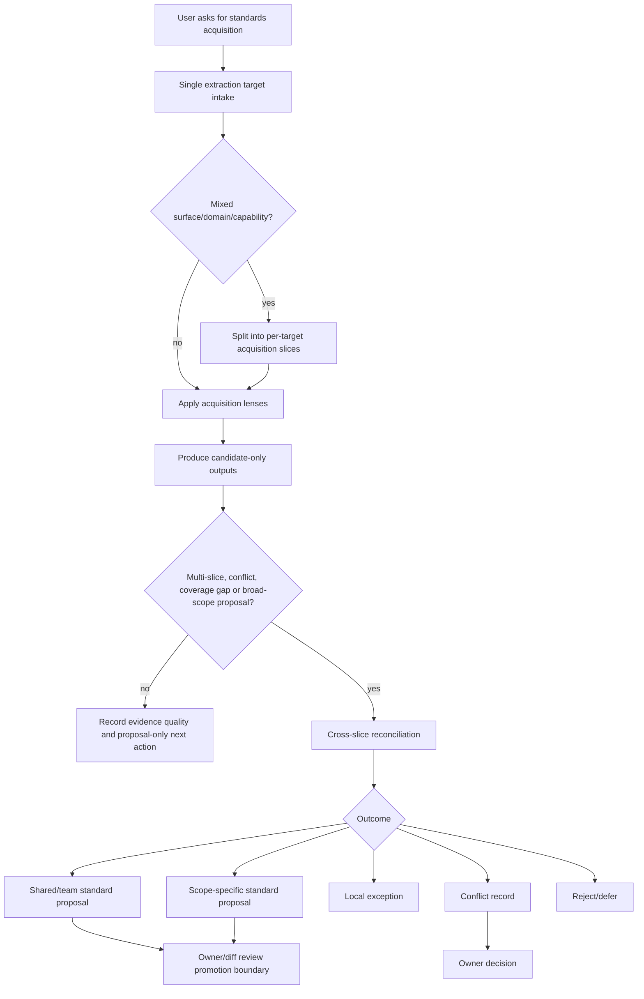
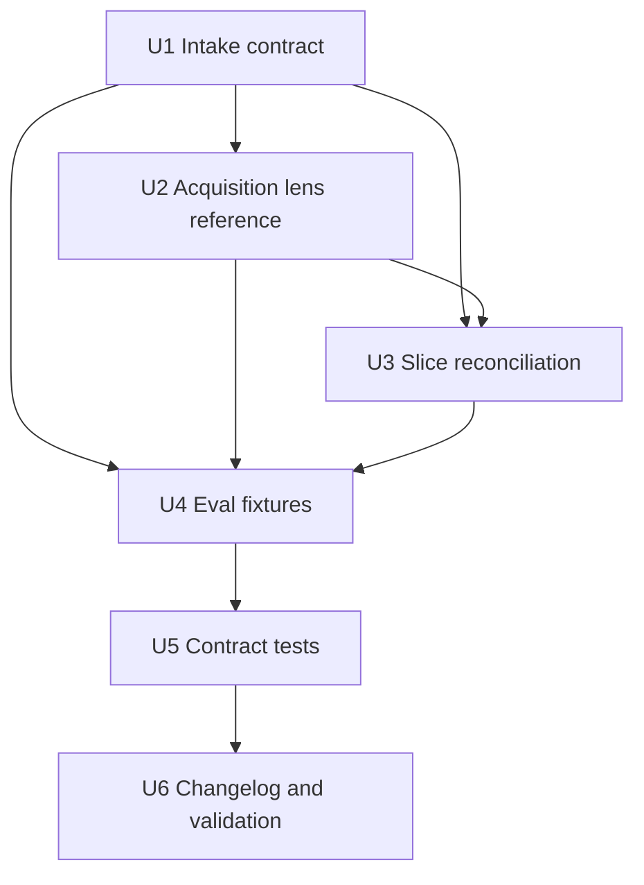

# refactor: 优化团队规范获取流程

## Summary

本计划把 `spec-rule-miner` 最值得借鉴的两个方法思想落地到 `spec-team-standards-governance`：单一 extraction target 与 lens-guided acquisition；第三条是复用 rule-miner 的大项目分层采样/披露纪律，并把结果收敛到 team-standards **自有**的 conflict/promotion 边界(reconciliation 本身不是从 rule-miner 借来的机制)。目标不是把代码习惯挖掘器变成团队标准，也不是恢复 legacy standards command spellings 或 retired `spec-standards` workflow，而是让 standards acquisition 的输入、抽取、归并和验证更可复核。

---

## Decision Brief

- **Recommended approach:** 扩展现有 standards governance source skill：在入口和 `initialization.md` 固化单一 extraction target intake，新增或扩展一个 standards 专属 acquisition lens reference（推荐 `acquisition-lenses.md`），并把大项目 slice-only acquisition 到 conditional reconciliation 的流程写进现有 acquisition references。
- **Key decisions:** `spec-rule-miner` 只作为方法来源；代码观察最多生成 `observed` candidate；derived AI rules 只能从 confirmed active standards 或 reviewable proposal 派生并引用 rule/proposal ID；不新增 public workflow。
- **Validation focus:** `team-standards-governance-contracts.test.js` 锁住 SKILL 指针、reference 存在、eval 覆盖、no public workflow/no hard-context 回退；eval fixtures 复用并强化 single-target、mixed-surface split，并新增 observed-not-confirmed、derived-not-source-truth、reconciliation-required-before-broad-scope 缺口。
- **Largest risks / boundaries:** 最大风险是把“项目代码里常见”误升为团队 confirmed standard。计划通过 source matrix、promotion boundary、owner/high-impact gate 和 reconciliation 阶段把这个风险卡在 promotion 出口，而不是把抽取流程做成自动确认器。

---

## Problem Frame

`spec-rule-miner` 的设计强在“从目标仓库证据中提炼给 AI 写代码看的项目规则”：先锁定 `target_repo`，按 `pattern-categories.md` 分类抽取，再处理大仓库采样、hidden associations、anti-patterns 和写入目标。

`spec-team-standards-governance` 处理的是另一类问题：团队级开发标准的 authority、trust、lifecycle、owner、promotion 和 downstream consumption。它已经有 V2 acquisition task pack、source matrix、evidence quality 和 replay 边界，但当前入口和 references 对三个执行思想表达得偏分散：

- 单一目标存在，但没有在 SKILL 主流程和 eval/test 中形成足够显眼的 intake contract。
- acquisition lenses 只有零散质量字段，缺一个像 `pattern-categories.md` 那样指导 LLM 避免只抽表层风格的 standards prompt lens 地图；该地图不是 rule-card canonical `category` enum。
- 大项目分批存在“mixed surface split”的局部要求，但缺少按需 reconciliation 的清晰流程：每批只能产 candidate，只有 multi-slice、冲突、覆盖不足或 broad-scope proposal 时才进入归并。归并的 outcome 语义已由现有 canonical 词表拥有(通用结局用 `docs/contracts/team-standards.md` 的 `outcome` enum,冲突分支用 `promotion-and-conflicts.md` 的 `Allowed exits`)；本计划只补“何时触发 + 产候选证据”的入口，不新造 outcome 词汇。

本计划只写 source 优化方案，不执行实现。

---

## Requirements

- R1. `spec-team-standards-governance` 必须在 init/propose/eval acquisition 场景先锁定一个 extraction target：`target_repo`、surface、sub_domain、capability、include/exclude、evidence_sources、output.mode 和 privacy boundary；混合 surface/domain/capability 必须 split。
- R2. 新增或完善 standards acquisition lenses，覆盖团队标准真正关心的观察维度，而不是复制代码风格分类：source/runtime boundary、verification、review/release、security/privacy、architecture/layering、workflow handoff、testing、deprecation/forbidden patterns、derived artifacts。该 lens map 只指导 acquisition prompt，不扩展 `docs/contracts/team-standards.md` 的 canonical `category` enum。
- R3. 大项目获取流程必须是 slice-first：每个 slice 只生成 candidate/facts/evidence quality，不产生 confirmed standard；只有 multi-slice、mixed split 后的 broad proposal、冲突或覆盖不足场景才进入 reconciliation。reconciliation 后才允许形成 shared rule proposal、scope-specific rule proposal、local exception、conflict record 或 reject/defer decision。
- R4. 保留 standards governance 权威边界：`trust=confirmed,lifecycle_state=active` 且 scope 命中的规则才可成为 hard context；`observed`、`suggested`、`confirmed-draft`、replay pass 或高 confidence 都不能 hard enforce。
- R5. 派生 AI rules、review checklist、query summary、workflow handoff snippets 必须引用 confirmed rule IDs 或 reviewable proposal IDs，不得成为独立 source truth，也不得从 `spec-rule-miner` 输出反向生成 standards source。
- R6. 不新增 legacy standards command spellings、retired `spec-standards` workflow、`skills/spec-standards/`、`.spec-first/standards/`，不手改 generated runtime mirrors。
- R7. 实现必须同步 focused eval 和 Jest contract tests，覆盖新增 acquisition flow 的触发、边界、输出合同和 no-regression。
- R8. 所有 source 变更必须同步 `CHANGELOG.md`，并使用最窄验证证明 skill source、eval fixture、contract tests 和 entrypoint lint 没有漂移。

---

## Scope Boundaries

- 不执行本计划，不修改 `skills/spec-team-standards-governance/**` 的实现内容。
- 不调整 `docs/contracts/team-standards.md` 的 canonical enum 或 rule card schema，除非实现期发现新增字段必须进入合同；若进入合同，需另行扩大测试范围。
- 不创建真实 `docs/standards/candidates/**` acquisition run 或 ledger；本计划只改 skill/source guidance 与 fixture。
- 不把 `spec-rule-miner` 输出接入 standards promotion，也不让 `spec-rule-miner` 成为 standards source-of-truth。
- 不刷新 `.claude/`、`.codex/`、`.agents/skills/` 等 generated runtime mirrors。

---

## Direct Evidence Readiness

- target_repo: current repository
- evidence_sources: bounded source reads、`rg` search、task-governance advisory helper、git revision/status。
- source_refs: `docs/10-prompt/结构化项目角色契约.md`, `skills/spec-plan/SKILL.md`, `skills/spec-plan/references/governance-boundaries.md`, `skills/spec-plan/references/reuse-analysis.md`, `skills/spec-plan/references/planning-flow.md`, `skills/spec-plan/references/plan-sections.md`, `skills/spec-plan/references/markdown-rendering.md`, `skills/spec-plan/references/plan-template.md`, `skills/spec-team-standards-governance/SKILL.md`, `skills/spec-team-standards-governance/references/initialization.md`, `skills/spec-team-standards-governance/references/acquisition-quality.md`, `skills/spec-team-standards-governance/references/source-matrix.md`, `skills/spec-team-standards-governance/references/loading-and-consumption.md`, `skills/spec-team-standards-governance/references/validation-and-replay.md`, `skills/spec-team-standards-governance/references/output-risk-profile.md`, `skills/spec-team-standards-governance/evals/trigger-cases.json`, `skills/spec-team-standards-governance/evals/output-cases.json`, `tests/unit/team-standards-governance-contracts.test.js`, `docs/contracts/team-standards.md`, `skills/spec-rule-miner/SKILL.md`, `skills/spec-rule-miner/references/pattern-categories.md`, `skills/spec-rule-miner/references/write-targets.md`。
- current_revision: `940d0814` (planning-time snapshot; the worktree has since advanced and the plan file itself was revised — implementation must recheck all target files against current disk source, not this pinned revision)
- worktree_status: dirty；存在大量与本计划无关的未提交修改，包括 Cursor/runtime setup 相关 source、`CHANGELOG.md`、`docs/catalog/runtime-capabilities.md`、`skills/spec-rule-miner/**` 等。本计划不得回滚或整理无关改动。
- confidence: high for target skill boundaries and implementation surfaces；medium for exact wording of new acquisition lenses until implementation reads current source again。
- limitations: 没有运行 runtime projection；没有读取 generated runtime mirrors；`task-governance-signals` 输出的 `generated_at` 与会话日期有偏差，作为 advisory 信号只用于 plan depth，不作为时间事实。

---

## Direct Evidence

- repo_scope: `spec-first` 当前仓库，计划文件写入 `docs/plans/**`，后续实现目标为 source skill、eval、unit tests 和 changelog。
- source_reads_completed: 读取了 plan workflow references、项目角色契约、目标 standards governance skill 与关键 references、现有 eval fixtures、contract tests、team standards contract、rule miner skill 与 pattern/write-target references。
- source_reads_required: 实现期需重新打开所有拟修改文件，尤其是 `skills/spec-team-standards-governance/SKILL.md`、`references/initialization.md`、`references/acquisition-quality.md`、拟新增或扩展的 acquisition lens reference（推荐 `references/acquisition-lenses.md`）、eval fixtures、`tests/unit/team-standards-governance-contracts.test.js` 和 `CHANGELOG.md`。
- commands_or_tools_used: `sed` bounded reads；`rg --files` / `rg -n` source scan；`git rev-parse --short HEAD`；`git status --short`；`find docs/plans -name '2026-07-05-*'`；`spec-first internal task-governance-signals --source plan-declared --json`。
- impact_on_plan: helper returned `candidate_level=deep` with `cross-module`, `critical-path-hit`, `keyword-hit`, `candidate-deep`; final depth is Deep because this touches skill behavior semantics, new reference surface, eval fixtures, contract tests and changelog.
- key_findings: `initialization.md` already states one extraction target and split policy, but it is only a short note; `acquisition-quality.md` already has V2 task pack fields and quality gates but no lens map; eval fixtures already cover single-target acquisition, mixed-surface split and retired workflow boundary but not all three borrowed ideas as explicit cases; tests already lock standalone skill, no public workflow, V2 references/evals and derived artifact boundary.
- limitations: This plan does not prove the final wording is sufficient; implementation should still run quick validation, focused Jest and entrypoint lint.

---

## Context & Research

### Relevant Code and Patterns

- `skills/spec-team-standards-governance/SKILL.md`: owns mode routing, reference loading map, hard boundaries and output contract; should gain only lightweight intake pointers, not absorb all acquisition details.
- `skills/spec-team-standards-governance/references/initialization.md`: currently owns V1 initialization only and already mentions single extraction target; the full V2 task pack field list lives in `acquisition-quality.md`. Best owner for the single-target + mixed-split process entry, not for a duplicated field list.
- `skills/spec-team-standards-governance/references/acquisition-quality.md`: owns V2 task pack fields, evidence quality, source anchors and gates; best owner for candidate quality and reconciliation prerequisites.
- `skills/spec-team-standards-governance/references/source-matrix.md`: already states code structure cannot produce `confirmed` trust by itself; use it to keep rule-miner-derived observations advisory.
- `skills/spec-team-standards-governance/references/loading-and-consumption.md`: owns derived artifact boundary; use it to keep AI rules/checklists/query summaries as derived outputs with rule/proposal citations.
- `skills/spec-team-standards-governance/evals/*.json`: existing fixture shape supports strengthening trigger/boundary and expected-output cases without inventing a new runner.
- `tests/unit/team-standards-governance-contracts.test.js`: existing contract test already asserts no public workflow, no hard-context promotion, V2 references and eval structure; extend this test rather than adding a separate duplicate suite.
- `skills/spec-rule-miner/references/pattern-categories.md`: provides the reusable method shape for lenses/categories, sampling disclosure, hidden associations and anti-patterns.
- `skills/spec-rule-miner/references/write-targets.md`: useful as a contrast for write-boundary discipline, but standards governance should not copy its AGENTS/CLAUDE write target model.

### Institutional Learnings

- `docs/10-prompt/结构化项目角色契约.md` requires light contract, explicit boundaries, deterministic floor and LLM semantic judgment. This plan keeps scripts/tests on deterministic structure and leaves semantic promotion to LLM/owner review.
- `docs/contracts/team-standards.md` defines the source authority hierarchy, confirmed-only hard context, candidate/pre-write boundary, V2 acquisition output boundary, conflict resolution and derived artifact boundary.
- Existing changelog history shows `spec-team-standards-governance` was deliberately kept standalone and not restored as `spec-standards`; this remains a hard boundary.

### External References

- None. Local source is sufficient; this is a repo-internal skill/source design plan.

---

## Existing Capability / Reuse Analysis

- **Inventory:** Existing standards governance already has `SKILL.md`, initialization/acquisition/source-matrix/loading/replay/output-risk references, trigger/output eval fixtures, contract tests, and `docs/contracts/team-standards.md`.
- **Decision:** Extend existing owners for target intake, split policy, evidence quality and reconciliation. Create one new reference, `skills/spec-team-standards-governance/references/acquisition-lenses.md`, unless implementation recheck proves an existing reference can own the same lens map without mixing concerns. The lens map is neither source authority (`source-matrix.md`) nor quality scoring (`acquisition-quality.md`); it answers “what classes of standards to look for.”
- **Source-of-truth:** `acquisition-lenses.md` becomes the source-owned lens map for acquisition prompts, not a canonical rule-card taxonomy; `initialization.md` owns the target/slice intake process entry; `acquisition-quality.md` owns the V2 task pack field list, candidate quality and reconciliation triggers; `docs/contracts/team-standards.md` owns the canonical `outcome` enum for the general reconciliation result (`keep-advisory`/`prepare-promotion-patch`/`merge-after-review`/`reject`/`defer`/`conflict-hold`) plus trust/lifecycle/other enums/promotion boundary; `promotion-and-conflicts.md` owns the conflict-only `Allowed exits` (`superseded`/`scoped-split`/`merged`/`deferred`/`both-rejected`).
- **Rejected owner:** Do not put standards acquisition lenses into `spec-rule-miner/references/pattern-categories.md`; that file is scoped to project AI coding rules and would make rule miner look like standards authority.
- **Work-phase recheck:** Before adding `acquisition-lenses.md`, re-open current `acquisition-quality.md` and `source-matrix.md`. If implementation finds lenses can be added cleanly to an existing reference without mixing concerns, prefer extend over new and explain the deviation in closeout.
- **Full reference inventory (12 files):** The `references/` directory actually holds 12 files, not the 6 named above: `acquisition-quality.md`, `adaptive-expansion.md`, `authority-tiers.md`, `initialization.md`, `lifecycle.md`, `loading-and-consumption.md`, `meta-prompt-governance.md`, `output-risk-profile.md`, `promotion-and-conflicts.md`, `role-interview-playbook.md`, `source-matrix.md`, `validation-and-replay.md`. Before U3 defines any reconciliation wording, confirm ownership against all 12 — especially that the general result code is the `outcome` enum in `docs/contracts/team-standards.md`, the conflict-only exit code is `Allowed exits` in `promotion-and-conflicts.md`, and lifecycle transitions are owned by `lifecycle.md`, so U3 reuses rather than re-invents.

---

## Key Technical Decisions

- KTD1. Treat `spec-rule-miner` as a method donor, not a source donor. The borrowed mechanisms are target locking, lens-guided extraction and large-repo sampling/disclosure discipline. Cross-slice reconciliation is *not* borrowed from rule-miner — it is team-standards' own conflict/promotion domain (`promotion-and-conflicts.md`); rule-miner only contributes the sampling discipline that feeds it. Its generated AI rules never become standards authority.
- KTD2. Make extraction target a first-class intake object. This avoids vague prompts like “summarize all team standards” and lets large repos split by surface/capability before any candidate is written.
- KTD3. Add standards-specific acquisition lenses. The lenses should bias the LLM toward durable team constraints such as source/runtime boundaries, verification, security/privacy and workflow handoff, not superficial naming or formatter rules. They must not be treated as the canonical `category` enum.
- KTD4. Separate slice acquisition from conditional standard reconciliation. Slice outputs are candidate-only; reconciliation is required only when multiple slices, conflicts, coverage gaps or broad-scope proposals require distinguishing common core, local exception, conflict, reject/defer or promotion proposal.
- KTD5. Keep promotion semantic and owner-governed. Tests can lock required fields, references and anti-regression wording; they must not decide whether a candidate is “good enough” to become a team standard.
- KTD6. Prefer extending current tests/evals. The implementation should add cases to existing fixtures and contract tests instead of creating a parallel evaluation system.

---

## Open Questions

### Resolved During Planning

- Should this become a new public workflow? No. `spec-team-standards-governance` remains standalone source-maintenance skill; public execution continues through `spec-work` or other established workflows when source edits are needed.
- Should `spec-rule-miner` expose standards governance? No. It explicitly routes team standards governance away to `spec-team-standards-governance`.
- Should standards lenses reuse `pattern-categories.md` directly? No. That file is project-rule oriented; standards need a separate lens map with different authority and promotion semantics.

### Deferred to Implementation

- Exact wording and ordering of `acquisition-lenses.md` or the chosen existing-reference section: implementation should keep it concise and test-locked only on load-bearing concepts.
- Whether to update `docs/contracts/team-standards.md`: defer unless implementation needs new canonical fields or enums. The current plan should work without contract schema changes.
- Whether to run fresh-source eval after implementation: recommended for behavior-semantic skill changes if host dispatch or equivalent read-only reviewer is available; if unavailable, record the limitation.

---

## High-Level Technical Design

> *This illustrates the intended approach and is directional guidance for review, not implementation specification. The implementing agent should treat it as context, not code to reproduce.*

---

## Implementation Units

### U1. Strengthen acquisition target intake

**Goal:** Make single extraction target intake visible in the SKILL main flow and initialization reference, so acquisition starts from a bounded target instead of an open-ended repo summary.

**Requirements:** R1, R3, R4, R6

**Dependencies:** None

**Files:**
- Modify: `skills/spec-team-standards-governance/SKILL.md`
- Modify: `skills/spec-team-standards-governance/references/initialization.md`
- Test: `tests/unit/team-standards-governance-contracts.test.js`

**Approach:**
- Add a short SKILL-level pointer in acquisition-producing modes (`init` / `propose`) that candidate synthesis requires one `extraction_target`; `eval/replay` should validate and report the existing acquisition run's target/lens evidence rather than re-mine broad scope. If lens evidence becomes an output field, update `SKILL.md` Output Contract in the same change; otherwise keep it inside source refs, limitations or eval fixture expectations.
- Strengthen `initialization.md`'s existing single-extraction-target + mixed-split process entry, and point to the V2 task pack in `acquisition-quality.md` for the full field list (`target_repo`, `surface`, `sub_domain`, `capability`, `scope.include`, `scope.exclude`, `time_window`, `evidence_sources`, `privacy_boundary`, `output.mode`, `non_goals`). Do not re-list the fields in `initialization.md`; `acquisition-quality.md` already owns them (`## V2 Acquisition Task Pack`), and duplicating them would split ownership.
- State that mixed input gets split before formal acquisition, and each slice gets its own target and candidate-only output.
- Keep the detail in `initialization.md`; do not bloat `SKILL.md`.

**Patterns to follow:**
- `skills/spec-rule-miner/SKILL.md` workflow step 1 for explicit `target_repo`.
- `skills/spec-team-standards-governance/references/acquisition-quality.md` V2 task pack field list.

**Test scenarios:**
- Happy path: SKILL/references contain single-target intake terms and `target_repo` / `extraction_target` fields.
- Edge case: mixed-surface prompt remains split/reject, not best-effort broad acquisition.
- Boundary: wording still says candidate-only/proposal-only until source-edit workflow and promotion boundary.

**Verification:**
- Focused Jest asserts SKILL and initialization reference contain the intake contract and do not restore public standards workflow.

---

### U2. Add standards acquisition lenses

**Goal:** Add a standards-specific lens map that helps LLMs extract durable team standards instead of shallow style observations.

**Requirements:** R2, R4, R5

**Dependencies:** U1

**Files:**
- Preferred create: `skills/spec-team-standards-governance/references/acquisition-lenses.md`
- Alternative modify: an existing reference only if implementation recheck proves it can own the lens map without mixing source authority, scoring and prompt guidance
- Modify: `skills/spec-team-standards-governance/SKILL.md`
- Modify: `skills/spec-team-standards-governance/references/initialization.md`
- Test: `tests/unit/team-standards-governance-contracts.test.js`

**Approach:**
- Create lenses inspired by `spec-rule-miner/references/pattern-categories.md`, but standards-specific and explicitly non-canonical:
  - source/runtime and source-of-truth boundaries
  - verification and completion evidence
  - review/release/change-management gates
  - security/privacy/PII/secret handling
  - architecture layering and ownership
  - workflow handoff and artifact contracts
  - testing strategy and regression expectations
  - deprecation, forbidden patterns and exceptions
  - derived artifact boundaries such as AI rules/checklists/summaries
- Include anti-pattern guidance: do not promote language defaults, formatter rules, personal preferences, temporary workarounds, stale remnants or unconfirmed review opinions.
- Reference this file only for acquisition modes; query/promote/deprecate should not default-read it.
- State that these lenses do not extend `docs/contracts/team-standards.md` canonical `category`; final rule cards still use the existing `architecture/design/coding/testing/security/review` enum unless a separate contract change is deliberately made.

**Reuse decision:** New `acquisition-lenses.md` is justified because no existing standards reference owns “what classes of standards to look for.” `source-matrix.md` owns authority by source type, and `acquisition-quality.md` owns scoring/gates.

**Patterns to follow:**
- `skills/spec-rule-miner/references/pattern-categories.md` for concise lens/category layout and anti-pattern emphasis.
- `docs/contracts/team-standards.md` for canonical enum and authority boundaries.

**Test scenarios:**
- Happy path: new reference exists and SKILL loading map points acquisition modes to it.
- Edge case: lenses include derived artifacts and privacy/security boundaries, not only coding style.
- Error path: lenses state observed code patterns cannot produce confirmed trust by themselves and do not redefine rule-card `category`.

**Verification:**
- Focused Jest locks the new reference path, acquisition-only loading, no canonical enum expansion without contract change, and no-confirmed-from-code boundary. Avoid locking the full lens wording beyond load-bearing concepts.

---

### U3. Document slice acquisition and conditional reconciliation

**Goal:** Make large-project acquisition explicitly slice-first while keeping reconciliation conditional and grounded in existing V2 ledgers.

**Requirements:** R3, R4, R5

**Dependencies:** U1, U2

**Files:**
- Modify: `skills/spec-team-standards-governance/references/initialization.md`
- Modify: `skills/spec-team-standards-governance/references/acquisition-quality.md`
- Optional modify: `skills/spec-team-standards-governance/references/validation-and-replay.md` only for a one-sentence boundary that replay consumes reconciliation evidence but does not promote rules
- Reference (do not duplicate): the general reconciliation result reuses the `outcome` enum in `docs/contracts/team-standards.md`; the conflict branch reuses `Allowed exits` in `skills/spec-team-standards-governance/references/promotion-and-conflicts.md`. U3 cites both instead of re-listing or conflating them
- Test: `tests/unit/team-standards-governance-contracts.test.js`

**Approach:**
- Add a concise large-repo flow:
  - split by surface/capability/sub-domain
  - each slice emits candidate/fact/evidence-quality outputs only
  - suppress broad-scope standard wording until reconciliation
  - single-target, non-conflicting runs can stop at evidence quality plus proposal-only next action
  - reconciliation is triggered only by multi-slice acquisition, mixed split followed by broad proposal, conflicts, coverage gaps or broad shared-rule claims
  - reconciliation compares consistency, conflicts, scope coverage, owner trace, risk level and migration cost (these dimensions already exist in `acquisition-quality.md` V2 Evidence Quality Fields — reuse, do not redefine)
  - the acquisition side only describes *when* reconciliation triggers and *what candidate evidence* it produces; it does not invent a parallel outcome vocabulary. Reuse the two canonical word lists that already exist: the general reconciliation result reuses the `outcome` enum in `docs/contracts/team-standards.md` (`keep-advisory`, `prepare-promotion-patch`, `merge-after-review`, `reject`, `defer`, `conflict-hold`), and the conflict-resolution branch reuses the `Allowed exits` in `promotion-and-conflicts.md` (`superseded`, `scoped-split`, `merged`, `deferred`, `both-rejected`). Do not conflate the two — `Allowed exits` is conflict-only, not the general result code.
- Make final reconciliation responsible for distinguishing “common team rule” from “project/surface-local habit”.
- Tie replay/retrieval/owner edit distance to reconciliation evidence, not promotion by itself.
- Do not introduce an implicit `reconciliation_decision` source truth. Record reconciliation outcomes through existing V2 artifacts: `lineage-ledger.md`, `promotion-log.md`, `owner-decision-queue.md` and `output-risk-profile.md`. If implementation truly needs a new field or artifact, first expand `docs/contracts/team-standards.md` and `SKILL.md` Output Contract.

**Patterns to follow:**
- `skills/spec-rule-miner/references/pattern-categories.md` large-repo sampling disclosure.
- `skills/spec-team-standards-governance/references/validation-and-replay.md` promotion boundary.

**Test scenarios:**
- Happy path: references describe slice-only candidate output, fast path for non-conflicting single-target runs, and reconciliation outcomes for broad/multi-slice cases.
- Edge case: one slice shows a strong local pattern but no cross-slice consistency; output remains scoped/local or observed.
- Boundary: replay pass and high confidence remain promotion evidence only.

**Verification:**
- Focused Jest asserts conditional reconciliation triggers, existing ledger owners and candidate-only boundary exist in references without requiring a new output artifact.

---

### U4. Expand eval fixtures for the borrowed ideas

**Goal:** Strengthen fixture coverage so future edits do not erase the three borrowed mechanisms or confuse rule-miner output with standards authority.

**Requirements:** R1, R2, R3, R4, R5, R7

**Dependencies:** U1, U2, U3

**Files:**
- Modify: `skills/spec-team-standards-governance/evals/trigger-cases.json`
- Modify: `skills/spec-team-standards-governance/evals/output-cases.json`
- Modify: `skills/spec-team-standards-governance/evals/README.md`
- Test: `tests/unit/team-standards-governance-contracts.test.js`

**Approach:**
- Reuse and strengthen existing trigger/boundary cases before adding new IDs:
  - strengthen `TRIGGER-ACQ-001` for single-target acquisition
  - strengthen `TRIGGER-BOUNDARY-001` for mixed-surface split
  - add only the missing cases: `rule-miner-output-is-derived-not-source-truth`, `observed-code-pattern-not-confirmed-standard`, `reconciliation-required-before-broad-scope`
- Every new trigger case must carry the existing dual-ID + reason shape: uppercase `case_id` (e.g. `TRIGGER-*`), a non-duplicating `reason_code`, and a non-empty `expected_outcome`. The trigger file's inherited `coverage_tags: ["trigger"]` makes `expected_outcome` a hard requirement in `eval-fixture-normalizer.js`, even for boundary-flavored cases; a missing field only fails `eval-fixture-contracts.test.js`, not the governance suite.
- Add or extend output cases only for fields represented in the active contracts: `extraction_target`, acquisition lens evidence, slice candidate-only posture, existing ledger-based reconciliation outcome, and derived artifact citation. Do not add `reconciliation_decision` as a new output field unless `SKILL.md` Output Contract and `docs/contracts/team-standards.md` are updated in the same implementation.
- Keep `threshold_result` honest, but only where it applies: `output-cases.json` cases carry `threshold_result` (existing ones are all `not-run`); `trigger-cases.json` cases do not use this field at all. New output cases can stay `not-run`; do not claim replay coverage.

**Patterns to follow:**
- Existing `trigger-boundary-001` mixed-surface case.
- Existing `output-derived-001` derived artifact citation case.

**Test scenarios:**
- Happy path: JSON parses and contains expected case IDs/reason codes without duplicating existing coverage.
- Edge case: eval cases distinguish `expected_mode: init` from near-neighbor code review or rule-miner work.
- Boundary: no fixture contains local absolute paths or `trust: confirmed` for candidate-only outputs.

**Verification:**
- JSON parse check, focused Jest fixture assertions, and `npx jest tests/unit/eval-fixture-contracts.test.js` (unconditional: this suite globs all `skills/**/evals/*.json`, so any new case is already in scope regardless of global-contract changes).

---

### U5. Lock contracts and no-regression tests

**Goal:** Ensure the skill remains standalone, source-first and confirmed-only while the acquisition flow becomes richer.

**Requirements:** R4, R5, R6, R7

**Dependencies:** U1, U2, U3, U4

**Files:**
- Modify: `tests/unit/team-standards-governance-contracts.test.js`
- Optional modify: `tests/unit/eval-fixture-contracts.test.js`

**Approach:**
- Extend existing `team-standards-governance-contracts.test.js` instead of adding a parallel suite.
- Assert:
  - SKILL loading map references `acquisition-lenses.md` only for acquisition modes when the new reference is created.
  - Source references contain single extraction target, slice-only candidate output, fast path, conditional reconciliation and existing ledger owners.
  - Reconciliation wording does not introduce outcome tokens outside the two canonical lists (`outcome` enum in `docs/contracts/team-standards.md` for the general result; `Allowed exits` in `promotion-and-conflicts.md` for the conflict branch); the lock extends from "no new field" to "no parallel outcome vocabulary".
  - Eval fixtures include strengthened existing IDs plus only the new missing IDs and required fields.
  - Both fixtures keep their top-level `schema_version` literally unchanged (`team-standards-trigger-evals/v1`, `team-standards-output-evals/v1`); the existing test locks these with `toBe`, so new `case_type`/`expected_result` values may be added (`arrayContaining`) but the envelope must not change.
  - No public workflow / retired surface wording remains locked.
  - Derived AI rules cannot become source truth.
- Keep Jest focused on deterministic floor: reference path/loading map, eval IDs/reason codes, required fields, no public workflow, no confirmed-from-code, derived citations and no local absolute paths. Do not test semantic adequacy by locking every lens label or reconciliation phrase.
- Run `eval-fixture-contracts.test.js` unconditionally, since it already validates every new fixture case through the shared normalizer. Only *edit* that test file if a global fixture rule (generic no-absolute-path or required-field extension) genuinely changes.

**Test scenarios:**
- Happy path: existing 8 governance tests continue passing with new assertions.
- Error path: deleting `acquisition-lenses.md` when referenced, removing conditional reconciliation triggers or removing ledger owner wording fails tests.
- Boundary: accidentally restoring a legacy standards command spelling or the retired `spec-standards` workflow, or making `observed` hard context, fails tests.

**Verification:**
- `npx jest tests/unit/team-standards-governance-contracts.test.js tests/unit/eval-fixture-contracts.test.js --runInBand` (eval-fixture suite is unconditional: it validates the new fixture cases via the shared normalizer).
- `changelog-format.test.js` runs in U6, after the CHANGELOG entry is added.

---

### U6. Changelog and validation closeout

**Goal:** Close the source change with the repo-required changelog entry and focused validation.

**Requirements:** R6, R8

**Dependencies:** U5

**Files:**
- Modify: `CHANGELOG.md`

**Approach:**
- Add a compact `refactor(skill)` or `optimize(spec-team-standards-governance)` changelog entry with source surfaces, user-visible behavior, no-runtime-mirror statement and validation commands.
- Do not regenerate `docs/catalog/runtime-capabilities.md` unless implementation actually changes runtime catalog source or governance delivery. A prose-only source skill optimization should not mix in unrelated dirty catalog output.
- Do not run `spec-first init` unless runtime projection source changes require it; if not run, say so.

**Test scenarios:**
- Test expectation: none -- changelog-only source bookkeeping plus validation command reporting.

**Verification:**
- Optional if locally available: `python3 /Users/kuang/.codex/skills/.system/skill-creator/scripts/quick_validate.py skills/spec-team-standards-governance`; absence of this host-local helper must not fail required validation.
- `npx jest tests/unit/team-standards-governance-contracts.test.js tests/unit/eval-fixture-contracts.test.js tests/unit/changelog-format.test.js --runInBand`
- `npm run lint:skill-entrypoints`
- JSON parse check for modified eval fixtures
- `git diff --check -- CHANGELOG.md skills/spec-team-standards-governance tests/unit/team-standards-governance-contracts.test.js`

---

## System-Wide Impact

- **Skill behavior:** `spec-team-standards-governance` acquisition modes become more explicit and safer for large repos; query/promote/deprecate modes should remain progressively loaded and unaffected.
- **Standards authority:** No change to `docs/contracts/team-standards.md` authority model unless implementation discovers a real canonical-field need.
- **Downstream workflows:** `spec-plan`, `spec-work`, `spec-code-review` and `spec-doc-review` continue consuming confirmed active standards only; candidate acquisition remains proposal evidence.
- **Runtime:** No generated runtime mirrors are edited by this plan. Any future runtime projection comes from source via `spec-first init` if needed.
- **Testing:** Existing focused Jest suite remains the main deterministic guard; semantic adequacy of candidate promotion remains LLM/owner judgment.
- **Unchanged invariants:** No public `spec-standards` workflow, no auto-confirmation, no provider output as confirmed truth, no broad `docs/standards/**` scan as index fallback.

---

## Risks & Dependencies

| Risk | Mitigation |
| --- | --- |
| Acquisition lenses become too broad and turn into generic best practices | Keep lenses tied to team standards authority and add anti-pattern wording plus tests for no generic/source-less promotion |
| `SKILL.md` becomes too large | Keep detailed intake/lenses/reconciliation in references; SKILL only points to them in loading map and workflow |
| Large-project reconciliation over-promotes local habits | Require slice-only candidates first, then reconciliation outcomes that include scoped/local exception/reject/defer |
| Eval fixtures are mistaken for quality proof | Keep `threshold_result: not-run` or `not-enough-sample` when no real replay exists; tests only assert structure |
| Existing dirty worktree causes accidental unrelated edits | Scope patches to plan/target source files only; do not regenerate runtime catalog or runtime mirrors unless explicitly needed |

---

## Documentation / Operational Notes

- Implementation closeout should state whether `docs/contracts/team-standards.md` remained unchanged; if changed, include why the contract surface had to expand.
- If the implementation modifies skill prose only, runtime mirrors should remain untouched; if runtime regeneration is needed, use `spec-first init` and report generated diff separately.
- Fresh-source eval is recommended after behavior-semantic skill changes, but not a hard gate if current host lacks authorized reviewer dispatch; record `dispatch_authorization_missing` or equivalent limitation.

---

## Sources & References

- Planning workflow: `skills/spec-plan/SKILL.md`
- Planning references: `skills/spec-plan/references/governance-boundaries.md`, `skills/spec-plan/references/reuse-analysis.md`, `skills/spec-plan/references/planning-flow.md`, `skills/spec-plan/references/plan-sections.md`, `skills/spec-plan/references/markdown-rendering.md`, `skills/spec-plan/references/plan-template.md`
- Role contract: `docs/10-prompt/结构化项目角色契约.md`
- Team standards contract: `docs/contracts/team-standards.md`
- Target skill: `skills/spec-team-standards-governance/SKILL.md`
- Target references: `skills/spec-team-standards-governance/references/initialization.md`, `skills/spec-team-standards-governance/references/acquisition-quality.md`, `skills/spec-team-standards-governance/references/source-matrix.md`, `skills/spec-team-standards-governance/references/loading-and-consumption.md`, `skills/spec-team-standards-governance/references/validation-and-replay.md`, `skills/spec-team-standards-governance/references/output-risk-profile.md`
- Target evals/tests: `skills/spec-team-standards-governance/evals/trigger-cases.json`, `skills/spec-team-standards-governance/evals/output-cases.json`, `tests/unit/team-standards-governance-contracts.test.js`
- Method reference: `skills/spec-rule-miner/SKILL.md`, `skills/spec-rule-miner/references/pattern-categories.md`, `skills/spec-rule-miner/references/write-targets.md`
