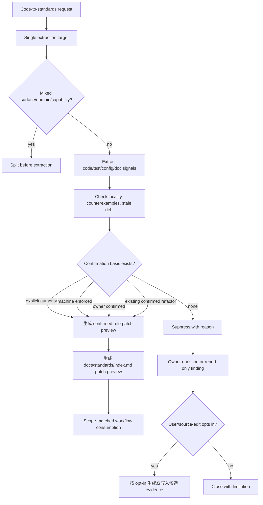
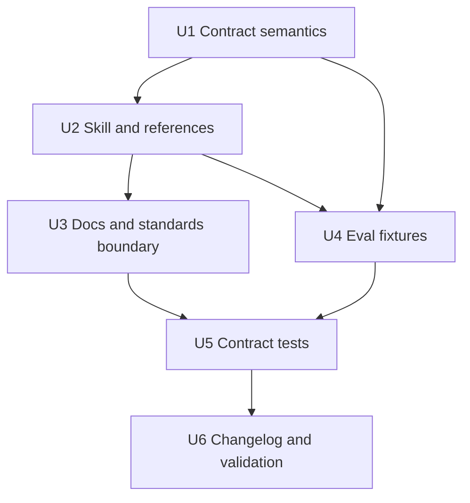

# refactor: confirmed-first code standards extraction

> Superseded 2026-07-07: the confirmed-first extraction direction was replaced by the complete retirement of `spec-team-standards-governance`, the `docs/standards/**` source surface, and downstream standards consumption. This document remains historical planning evidence only.

## Summary

本计划将 `spec-team-standards-governance` 的代码规范提炼路径从 candidate-first acquisition 调整为 confirmed-first extraction：默认目标产物是可被下游 workflow 消费的 `docs/standards/**` confirmed rule patch preview，而不是 `docs/standards/candidates/**` 候选账本。

核心边界不变：从代码中总结出的重复模式只能作为 signal；只有同时命中 explicit authority、machine-enforced policy、owner-confirmed decision 或 existing-confirmed refactor 这类 confirmation basis，才允许在 active source-edit workflow 中写入 `trust=confirmed,lifecycle_state=active`。standalone 直接使用只准备 confirmed patch preview / suppressed finding；code-only 模式不足时默认 suppressed/report-only，不自动落候选、不自动 confirmed。

---

## Decision Brief

- **Recommended approach:** 扩展现有 `spec-team-standards-governance` source skill 和 `docs/contracts/team-standards.md`，新增 confirmed-first extraction 语义、confirmation gate、suppressed finding 输出边界和 confirmed rule patch preview / source-edit 写入要求；不要创建新 public workflow。
- **Key decisions:** 默认产物从 candidate cards 改为 confirmed rule patch previews；真实 confirmed source 写入只发生在 `spec-work` 或等价 source-edit workflow 中；code-only repeated pattern 继续不能 confirmed；候选区改为显式 opt-in fallback；implementation 必须同步 user-facing docs、eval fixtures、contract tests 和 changelog。
- **Validation focus:** 聚焦 `team-standards-governance-contracts.test.js`、`eval-fixture-contracts.test.js`、`changelog-format.test.js`、entrypoint lint、JSON parse 和 diff check；如果 schema/contract 字段扩展，追加相应 downstream consumer tests。
- **Largest risks / boundaries:** 最大风险是把“代码现状”伪装成“团队规范”。本计划把风险前移到 confirmation gate：证据不足时阻断 confirmed 写入，而不是先生成 candidate 再期望后续流程修正。

---

## Problem Frame

前一版计划 `docs/plans/2026-07-05-001-refactor-standards-acquisition-flow-plan.md` 以 candidate-first 为中心：单一 extraction target、acquisition lenses、slice-only candidates 和 conditional reconciliation。该方向适合保守获取候选，但不符合当前用户确认的新目标：这个 skill 是为了“从代码中总结团队通用开发规范”，且默认希望产物就是可用的 confirmed 规范，而不是候选规范。

现有 source 已经提供 confirmed standards 的消费模型：

- `docs/contracts/team-standards.md` 定义 `docs/standards/**` 为 confirmed team standards source surface。
- `docs/standards/index.md` 与 `docs/standards/*.md` 已承载 confirmed active rule cards。
- 下游 `spec-plan`、`spec-work`、`spec-code-review`、`spec-doc-review`、`spec-debug` 只消费 scope-matched confirmed active standards。

但现有 acquisition 文案和测试仍以 proposal-only 为默认：

- `skills/spec-team-standards-governance/SKILL.md` 的 `init` / `propose` 输出是 candidate notes、candidate cards 和 patch preview。
- `references/source-matrix.md` 写明 code structure cannot produce `confirmed` trust by itself。
- `docs/standards/candidates/README.md` 和 user manual 仍描述 brownfield 初始化默认产候选。
- eval fixtures 和 Jest tests 锁定 V2 candidate/ledger contract。

本计划 supersedes 前一版 candidate-first 的默认输出方向，但保留其中正确的边界资产：single target、mixed-surface split、source matrix、confirmed-only hard context、no public workflow、no runtime mirror edits。

---

## Requirements

- R1. `spec-team-standards-governance` 的代码提炼路径必须默认以 confirmed usable standards 为目标产物；standalone/default 输出是 confirmed rule patch preview 加 suppressed findings，实际 confirmed 写入面为 active source-edit workflow 中的 `docs/standards/index.md` 与 `docs/standards/*.md`，不是默认写入 `docs/standards/candidates/**`。
- R2. 每次 extraction 必须先锁定一个 `extraction_target`：`target_repo`、surface、sub_domain、capability、include/exclude、evidence_sources、privacy boundary 和 output mode；mixed surface/domain/capability 必须 split。
- R3. 从代码、测试、目录结构、graph/code provider 或 `docs/solutions/**` 得到的观察只能作为 code signal；code-only signal 不能自动产生 `trust=confirmed`。
- R4. confirmed 写入必须命中至少一个 confirmation basis：`explicit-authority`、`machine-enforced-policy`、`owner-confirmed` 或 `existing-confirmed-refactor`。
- R5. 证据不足的 rule signal 默认输出为 suppressed finding / `needs-owner` / `insufficient-authority`，不得 silent promote，也不得默认写入 candidate 文件。
- R6. `docs/standards/candidates/**` 保留为显式 opt-in fallback：仅当用户要求保存候选、owner 暂不可用但需要保留 evidence，或 source-edit workflow 明确选择 proposal flow 时写入。
- R7. confirmed rule card 必须携带 confirmation basis、source refs、scope、owner、invalidation condition 和 counterexample/locality review 结果；若不扩展 YAML schema，必须在 rule card 正文中使用固定 `Confirmation basis:` 小节表达。
- R8. 派生 AI rules、review checklist、query summary、handoff snippets 只能从 confirmed rule IDs 或 reviewable proposal IDs 派生，不得成为独立 source truth。
- R9. 不恢复 legacy standards command spellings、retired `spec-standards` workflow、`skills/spec-standards/`、`.spec-first/standards/`，不手改 generated runtime mirrors。
- R10. 实现必须同步 focused eval、Jest contract tests、用户文档和 `CHANGELOG.md`；测试要同时证明 confirmed path 可用与 code-only path 被阻断。

---

## Scope Boundaries

- 本计划不执行代码扫描，也不生成真实的新团队规范；它规划 source skill / contract / docs / tests 的 confirmed-first 语义改造。
- 本计划不要求删除现有 `docs/standards/candidates/**` V2 pilot artifacts；这些仍是历史 pilot evidence，但不再作为默认输出路径。
- 不新增 public `spec-*` workflow。`spec-team-standards-governance` 继续是 standalone source-maintenance skill，source mutation 仍需 `spec-work` 或等价 source-edit workflow。
- 不新增 CLI、runner、centralized rule engine 或自动 promotion 脚本。
- 不让脚本判断一条规则语义上是否“好”；脚本只检查枚举、路径、index/card 一致性、privacy/path hygiene 和测试 fixture 结构。
- 不刷新 `.claude/`、`.codex/`、`.agents/skills/` runtime mirrors。若实现期决定投射 runtime，必须通过 `spec-first init` 并单独报告 generated diff。

### Deferred to Follow-Up Work

- 真实 code extraction pilot：等 confirmed-first source contract 落地后，另起一次 source-edit workflow，在一个明确 target repo/surface/capability 上跑真实提炼。
- 自动 rule-card 校验器扩展：如果 `confirmation_basis` 进入 YAML metadata 并需要机械校验，再扩展 `scripts/check-team-standards.js`。
- 旧 plan status 已在本次 plan 修复中清理：`docs/plans/2026-07-05-001-refactor-standards-acquisition-flow-plan.md` 标为 `superseded`，本计划通过 frontmatter `supersedes` 成为当前执行来源。

---

## Completion Criteria

- `docs/contracts/team-standards.md` 明确 confirmed-first code extraction 的 confirmation basis、suppressed output 和 candidate opt-in fallback。
- `skills/spec-team-standards-governance/**` 的 source guidance 默认指向 confirmed rule synthesis，并保留 code-only cannot confirmed 的边界。
- eval fixtures 覆盖 confirmed success paths 和 code-only suppressed paths。
- `tests/unit/team-standards-governance-contracts.test.js` 能锁住 confirmed-first 输出合同、no public workflow、no runtime mirror 和 no code-only auto-confirm。
- 用户手册说明默认产物变化，并仍强调 `docs/standards/candidates/**` 不可 hard enforce。
- `CHANGELOG.md` 记录 source surfaces、用户可见影响、验证命令和 runtime mirror 状态。

---

## Direct Evidence Readiness

- target_repo: current repository
- evidence_sources: bounded source reads、`rg` search、task-governance advisory helper、git revision/status。
- source_refs: `docs/10-prompt/结构化项目角色契约.md`, `docs/plans/2026-07-05-001-refactor-standards-acquisition-flow-plan.md`, `docs/contracts/team-standards.md`, `docs/standards/index.md`, `docs/standards/shared.md`, `docs/standards/candidates/README.md`, `docs/05-用户手册/23-团队开发规范治理.md`, `skills/spec-plan/SKILL.md`, `skills/spec-plan/references/governance-boundaries.md`, `skills/spec-plan/references/reuse-analysis.md`, `skills/spec-plan/references/planning-flow.md`, `skills/spec-plan/references/plan-sections.md`, `skills/spec-plan/references/markdown-rendering.md`, `skills/spec-plan/references/plan-template.md`, `skills/spec-plan/references/visual-communication.md`, `skills/spec-plan/references/plan-handoff.md`, `skills/spec-team-standards-governance/SKILL.md`, `skills/spec-team-standards-governance/references/initialization.md`, `skills/spec-team-standards-governance/references/acquisition-quality.md`, `skills/spec-team-standards-governance/references/source-matrix.md`, `skills/spec-team-standards-governance/references/loading-and-consumption.md`, `skills/spec-team-standards-governance/references/validation-and-replay.md`, `skills/spec-team-standards-governance/references/promotion-and-conflicts.md`, `skills/spec-team-standards-governance/evals/trigger-cases.json`, `skills/spec-team-standards-governance/evals/output-cases.json`, `tests/unit/team-standards-governance-contracts.test.js`, `tests/unit/eval-fixture-contracts.test.js`, `tests/unit/changelog-format.test.js`。
- current_revision: `c1eeba8a`
- worktree_status: dirty；当前已有与本计划无关的未提交修改，包括 `CHANGELOG.md`、`docs/catalog/runtime-capabilities.md`、`skills/spec-rule-miner/**` 和 `tests/unit/spec-rule-miner-contracts.test.js`。本计划不得回滚或整理无关改动。
- confidence: high for target boundary and required source surfaces；medium for exact fixture IDs and final confirmation-basis field placement until implementation reopens current source。
- limitations: 未运行 implementation tests；未执行 `spec-doc-review` subworkflow；未读取 generated runtime mirrors 作为 source；planning-depth helper output 是 advisory。

---

## Direct Evidence

- repo_scope: `spec-first` 当前仓库；本计划文件写入 `docs/plans/**`，后续实现目标为 standards contract、source skill、references、eval fixtures、tests、user docs 和 changelog。
- source_reads_completed: 读取了角色契约、spec-plan workflow references、旧 standards acquisition plan、team standards contract/index/current rules/candidates README、target skill 与 acquisition/source/promotion references、eval fixtures、focused Jest contracts、用户手册和 changelog 格式。
- source_reads_required: 实现期需重新打开所有拟修改文件，尤其是 `docs/contracts/team-standards.md`、`skills/spec-team-standards-governance/SKILL.md`、`references/initialization.md`、`references/source-matrix.md`、`references/acquisition-quality.md`、拟新增的 `references/confirmed-extraction.md` 或替代 owner、eval JSON、`tests/unit/team-standards-governance-contracts.test.js`、user docs 和 `CHANGELOG.md`。
- commands_or_tools_used: `sed` bounded reads；`rg -n` source scan；`git rev-parse --short HEAD`；`git status --short`；`find docs/plans -name '2026-07-05-*plan.md'`；`spec-first internal task-governance-signals --source plan-declared --json`。
- impact_on_plan: helper returned `candidate_level=deep` with `cross-module`, `critical-path-hit`, `keyword-hit`, `candidate-deep`; final depth is Deep because this changes standards authority semantics, source skill behavior, docs, eval fixtures and focused tests.
- key_findings: current contract already supports confirmed rule consumption but current acquisition path is proposal-only; `source-matrix.md` already provides the essential no-code-only-confirmed boundary; tests explicitly assert V2 pilot is candidate-only and source matrix cannot produce confirmed from code alone; user docs currently describe brownfield initialization as candidate-only.
- limitations: The plan does not prove final prose adequacy; behavior-semantic skill changes should receive focused source review or fresh-source eval if the implementation changes enough prompt behavior.

---

## Context & Research

### Relevant Code and Patterns

- `docs/contracts/team-standards.md` owns the semantic contract for trust, lifecycle, promotion, candidate boundary, V2 acquisition output and downstream consumption. It is the correct owner for confirmation basis and default output semantics.
- `docs/standards/index.md` owns registries and confirmed rule index. Any new confirmed rule output must update this file and keep rows consistent with rule cards.
- `skills/spec-team-standards-governance/SKILL.md` owns mode routing, reference loading map, output contract and hard boundaries. It should gain a confirmed-first mode description without absorbing the whole extraction algorithm.
- `references/source-matrix.md` 已经分离 code structure、explicit docs 与 machine-enforced config。应扩展它而不是替换它，让 code-only 保持阻断，同时允许 explicit/machine/owner confirmation 进入 confirmed patch preview 或 source-edit write 路径。
- `references/acquisition-quality.md` owns task pack, evidence quality, anchors and gates. It can keep source quality fields, but should not become the sole owner of confirmation semantics.
- `docs/standards/candidates/README.md` currently says code scanning cannot auto-confirm team policy. This boundary remains correct, but the document should explain candidates are opt-in fallback rather than default output.
- `tests/unit/team-standards-governance-contracts.test.js` already locks source authority, standalone skill name, runtime sync, V2 pilot artifacts, eval fixtures and user-facing docs. Extend it instead of creating a parallel suite.
- `skills/spec-team-standards-governance/evals/*.json` already use stable schema envelopes. Add cases within the same files and preserve `schema_version`.

### Institutional Learnings

- `docs/10-prompt/结构化项目角色契约.md` requires light contract, explicit boundaries, deterministic floor and LLM semantic judgment. This plan keeps confirmation as semantic/owner/source-authority judgment while tests lock deterministic structure.
- `docs/solutions/conventions/skill-publication-command-surface-alignment-2026-06-23.md` reinforces that `spec-team-standards-governance` is a standalone skill and must not become a public command-backed workflow.
- `docs/solutions/architecture-patterns/plan-work-architecture-fit-boundary-2026-07-01.md` frames confirmed standards as architecture-fit evidence for execution, supporting the need for confirmed-only downstream consumption.

### External References

- None. This is a repo-internal source/contract design plan.

---

## Existing Capability / Reuse Analysis

- **Inventory:** Existing standards governance has `docs/contracts/team-standards.md`, `docs/standards/**`, `scripts/check-team-standards.js`, `skills/spec-team-standards-governance/SKILL.md`, 12 references, trigger/output eval fixtures, focused Jest tests and user docs.
- **Decision:** Extend existing standards governance. Do not create a new skill, CLI, public workflow, schema package, runtime artifact directory or generated mirror path.
- **New source surface:** Prefer one new reference `skills/spec-team-standards-governance/references/confirmed-extraction.md` only if implementation confirms existing references would mix concerns. This reference would own code-to-confirmed extraction flow, confirmation basis, extraction lenses and suppressed output posture.
- **Rejected owner:** Do not put confirmed extraction semantics into `spec-rule-miner`; that skill generates AI coding project rules and explicitly routes team standards governance away. Do not put the full flow into `SKILL.md`; that would bloat the entrypoint and weaken progressive loading.
- **Source-of-truth after implementation:** `docs/contracts/team-standards.md` owns trust/promotion/default output semantics; `confirmed-extraction.md` or equivalent owns prompt-level extraction flow; `source-matrix.md` owns evidence source max authority; `acquisition-quality.md` owns quality and anchor fields; `loading-and-consumption.md` owns downstream selection.
- **Work-phase recheck:** Before adding `confirmed-extraction.md`, re-open all 12 references. If `source-matrix.md` plus `acquisition-quality.md` can own the change cleanly, extend them and explain the deviation in closeout.

---

## Key Technical Decisions

- KTD1. 默认产物转向 confirmed standards，但 confirmed 仍被 gate。skill 应默认准备 `docs/standards/**` confirmed rule patch preview；实际 `trust=confirmed,lifecycle_state=active` 写入只发生在 active source-edit workflow 内。缺少 confirmation basis 的 rule 必须 suppressed/report-only，或显式路由到 owner confirmation。
- KTD2. Code is signal, not authority. Repeated source patterns, directory structures and test layouts can justify inspection and examples, but cannot by themselves produce `trust=confirmed`.
- KTD3. Confirmation basis is explicit and enumerable. The accepted confirmation paths are `explicit-authority`, `machine-enforced-policy`, `owner-confirmed` and `existing-confirmed-refactor`.
- KTD4. Candidate files are fallback, not hot path. `docs/standards/candidates/**` remains useful for evidence preservation, conflict records and proposal flows, but the default requested outcome is either confirmed rule or suppressed finding.
- KTD5. Scope and counterexamples are load-bearing. A broad team rule must show checked locality/counterexamples; otherwise it must narrow scope, require owner review or suppress.
- KTD6. No semantic hard gate in scripts. Tests and scripts can reject missing fields, invalid enums, bad paths and unsafe candidate content; they must not decide whether a proposed rule is semantically worthy.
- KTD7. Keep the standalone skill boundary. No `spec-standards`, no command catalog entry, no runtime artifact directory, no generated mirror patch.

---

## Open Questions

### Resolved During Planning

- Should default output be candidate rules? No. User clarified the default should be confirmed usable rules.
- Should pure code repetition be sufficient for confirmed? No. It is a signal only; confirmation basis remains required.
- Should this become a new public workflow? No. Keep `spec-team-standards-governance` standalone and source-maintenance oriented.
- Should candidates disappear? No. They become opt-in fallback or evidence-preservation path, not default output.
- 前一版 candidate-first plan 是否应继续 active？不应。它已被本 confirmed-first plan supersede，只作为历史 rationale 保留。

### Deferred to Implementation

- `confirmation_basis` 是否要进入每张 code-extracted rule card 的 YAML metadata。默认先使用固定正文小节 `Confirmation basis:`；只有测试或下游消费者确实需要 structured metadata 时再扩展。
- Whether to create `references/confirmed-extraction.md` or extend existing references. Decide after re-reading all current references in implementation.
- Whether fresh-source eval is available for skill prose behavior changes. If not, record `dispatch_authorization_missing` or equivalent limitation.

---

## High-Level Technical Design

> *This illustrates the intended approach and is directional guidance for review, not implementation specification. The implementing agent should treat it as context, not code to reproduce.*

---

## Implementation Units

### U1. Update team-standards contract semantics

**Goal:** 让 `docs/contracts/team-standards.md` 明确：code-to-standards extraction 在存在 confirmation basis 时默认生成 confirmed rule patch preview，真实写入仍由 source-edit workflow 承担，同时保留 no-code-only-confirmed 边界。

**Requirements:** R1, R3, R4, R5, R6, R7, R8

**Dependencies:** None

**Files:**
- Modify: `docs/contracts/team-standards.md`
- Modify: `docs/standards/candidates/README.md`
- Test: `tests/unit/team-standards-governance-contracts.test.js`

**Approach:**
- Add a confirmed-first extraction subsection near Candidate / V2 acquisition boundaries.
- Define the four confirmation bases and state that code-only evidence is insufficient.
- Reframe candidates as explicit fallback, not default.
- Specify suppressed finding reasons such as `insufficient-authority`, `needs-owner`, `scope-too-local`, `counterexample-conflict`, `privacy-blocked`.
- State that code-extracted confirmed rules must record confirmation basis, source refs, scope, owner and counterexample/locality review.
- 避免新增 canonical enum，除非 implementation 确认 structured field 必要。若不新增 structured field，必须要求固定 `Confirmation basis:` 正文小节；若需要新 enum，同一 unit 内同步更新 tests 和 downstream docs。

**Patterns to follow:**
- `docs/contracts/team-standards.md` Canonical Enums and Rule Card Contract.
- `docs/standards/shared.md` compact rule-card shape.
- `docs/standards/candidates/README.md` pre-write and proposal-only boundary.

**Test scenarios:**
- Happy path: contract contains confirmed-first extraction, confirmation basis, and confirmed patch preview / source-edit write boundary.
- Error path: contract still rejects code-only auto-confirm and LLM self-evaluation.
- Boundary: candidates remain proposal-only and not hard context.

**Verification:**
- Focused Jest contract assertions for contract snippets and negative boundaries.

---

### U2. Refactor skill guidance and extraction references

**Goal:** Update `spec-team-standards-governance` mode guidance so code extraction aims at confirmed rule synthesis, not candidate synthesis, while keeping source edits gated by `spec-work`.

**Requirements:** R1, R2, R3, R4, R5, R6, R9

**Dependencies:** U1

**Files:**
- Modify: `skills/spec-team-standards-governance/SKILL.md`
- Modify: `skills/spec-team-standards-governance/references/initialization.md`
- Modify: `skills/spec-team-standards-governance/references/source-matrix.md`
- Modify: `skills/spec-team-standards-governance/references/acquisition-quality.md`
- Preferred create: `skills/spec-team-standards-governance/references/confirmed-extraction.md`
- Test: `tests/unit/team-standards-governance-contracts.test.js`

**Approach:**
- Rename or clarify `init` / `propose` outputs，使默认产物为 confirmed rule patch preview 加 suppressed findings，而不是 candidate cards。
- Add `confirmed-extraction.md` only if recheck shows no existing reference can own the flow without mixing source matrix and quality scoring.
- In `source-matrix.md`, allow explicit docs, machine-enforced config and owner decisions to feed confirmed patch preview / source-edit writes when source-edit workflow and review gates are satisfied. Keep code-structure max default as signal only.
- In `initialization.md`, preserve one extraction target and mixed-split policy.
- In `acquisition-quality.md`, keep evidence quality fields as confirmation inputs, not authority replacement.
- Update the SKILL loading map so confirmed extraction reads the new reference only for relevant modes.
- Keep `query`, `audit`, `deprecate` and ordinary consumption modes unaffected.

**Patterns to follow:**
- Current `Reference Loading Map` progressive loading style.
- `source-matrix.md` separation between source type, authority tier and confirmation.
- `promotion-and-conflicts.md` write boundary for confirmed/index changes.

**Test scenarios:**
- Happy path: SKILL output contract names confirmed rule patch preview and suppressed findings for extraction modes.
- Edge case: code-only extraction says `insufficient-authority`, not `trust=confirmed`.
- Boundary: standalone 直接使用在没有 `spec-work` 或等价 source-edit 授权时仍不能 mutate source。

**Verification:**
- Focused Jest asserts loading map, confirmation basis, suppressed output and no public workflow.

---

### U3. Update user-facing docs and standards boundary docs

**Goal:** Align user-facing docs with confirmed-first default output without weakening confirmed-only downstream consumption.

**Requirements:** R1, R5, R6, R8, R9

**Dependencies:** U1, U2

**Files:**
- Modify: `docs/05-用户手册/23-团队开发规范治理.md`
- Optional modify: `README.md`
- Optional modify: `README.zh-CN.md`
- Optional modify: `docs/README.md`
- Optional modify: `docs/05-用户手册/12-gitignore参考.md`
- Test: `tests/unit/team-standards-governance-contracts.test.js`

**Approach:**
- Change Brownfield 初始化 wording from candidate-only to confirmed-first with confirmation gate.
- Explain that candidates are opt-in fallback for suppressed evidence or owner-unavailable cases.
- Keep the consumption rule unchanged: downstream workflows enforce only `trust=confirmed,lifecycle_state=active` and scope-matched standards.
- Update README only if the high-level public description would otherwise be misleading. The current README wording already says workflows pick confirmed rules and may not need change.

**Patterns to follow:**
- Current user manual source-boundary and consumption-rule sections.
- Existing README compact standards mention.

**Test scenarios:**
- Happy path: user manual says code extraction defaults to confirmed rule patch when confirmation basis exists.
- Boundary: user manual still says candidates are not hard context.
- Error path: docs do not tell users to restore `spec-standards` or `.spec-first/standards/`.

**Verification:**
- Focused Jest docs assertions and `git diff --check` on docs paths.

---

### U4. Rework eval fixtures for confirmed-first behavior

**Goal:** Make fixtures capture both successful confirmed extraction and blocked code-only extraction.

**Requirements:** R1, R2, R3, R4, R5, R7, R10

**Dependencies:** U1, U2

**Files:**
- Modify: `skills/spec-team-standards-governance/evals/trigger-cases.json`
- Modify: `skills/spec-team-standards-governance/evals/output-cases.json`
- Modify: `skills/spec-team-standards-governance/evals/README.md`
- Test: `tests/unit/team-standards-governance-contracts.test.js`
- Test: `tests/unit/eval-fixture-contracts.test.js`

**Approach:**
- Preserve existing schema versions: `team-standards-trigger-evals/v1` and `team-standards-output-evals/v1`.
- Strengthen `TRIGGER-ACQ-001` or add a new trigger for confirmed-first code extraction with single target.
- Add output cases for:
  - explicit authority plus code examples -> confirmed rule patch preview；
  - machine-enforced config plus code examples -> confirmed rule patch preview；
  - code-only repeated pattern -> suppressed finding with `insufficient-authority`;
  - mixed-surface code summary -> split boundary;
  - derived artifact -> citations to confirmed rule IDs or reviewable proposal IDs.
- Keep existing V2 candidate cases only if they represent opt-in fallback or historical pilot. If they remain, update wording so they do not look like the default path.
- Keep `threshold_result: not-run` unless real replay data exists.

**Patterns to follow:**
- Existing trigger/output fixture envelope and source refs.
- Shared fixture normalizer expectations in `tests/unit/eval-fixture-contracts.test.js`.

**Test scenarios:**
- Happy path: new confirmed patch preview cases 可以 parse 并 normalize。
- Error path: code-only confirmed patch/write output fixture 会触发 governance assertion 失败。
- Boundary: no eval fixture uses local absolute paths or generated runtime mirrors as source refs.

**Verification:**
- JSON parse for modified fixtures.
- `npx jest tests/unit/team-standards-governance-contracts.test.js tests/unit/eval-fixture-contracts.test.js --runInBand`.

---

### U5. Extend deterministic contract tests

**Goal:** Lock the confirmed-first deterministic floor without making tests decide semantic rule quality.

**Requirements:** R3, R4, R5, R6, R7, R8, R9, R10

**Dependencies:** U1, U2, U3, U4

**Files:**
- Modify: `tests/unit/team-standards-governance-contracts.test.js`
- Optional modify: `scripts/check-team-standards.js`
- Optional modify: `tests/unit/eval-fixture-contracts.test.js` only if global fixture rules truly change

**Approach:**
- Update contract snippets currently tied to candidate-only V2 semantics.
- Add assertions for:
  - confirmation basis 以 structured metadata 或固定 `Confirmation basis:` 正文小节存在；
  - code-only cannot confirmed；
  - default extraction can produce confirmed rule patch previews；
  - candidates are opt-in fallback；
  - suppressed findings are represented；
  - index and rule-card consistency remains required；
  - no public workflow or runtime mirror path appears。
- Do not assert exact full wording of every lens or rule. Lock load-bearing concepts and file paths.
- Extend hygiene checks only if the implementation adds structured `confirmation_basis` metadata or new candidate output fields.

**Test scenarios:**
- Happy path: confirmed-first source contracts pass with current confirmed rule index consistency.
- Error path: deleting code-only suppression or letting `observed` become hard context fails tests.
- Boundary: restoring `spec-standards`, adding `.spec-first/standards/`, or referencing generated mirrors fails tests.

**Verification:**
- `npx jest tests/unit/team-standards-governance-contracts.test.js tests/unit/eval-fixture-contracts.test.js tests/unit/changelog-format.test.js --runInBand`.

---

### U6. Changelog, prior-plan status, and validation closeout

**Goal:** Close the source change with required release breadcrumbs, plan lineage cleanup and focused validation.

**Requirements:** R9, R10

**Dependencies:** U5

**Files:**
- Modify: `CHANGELOG.md`
- Modify: `docs/plans/2026-07-05-001-refactor-standards-acquisition-flow-plan.md`

**Approach:**
- Add a compact changelog entry naming standards contract, skill references, eval fixtures, user docs and tests.
- 保持前一版 candidate-first plan frontmatter 为 `status: superseded`，并保留指向本计划的短 supersession note。
- 不 regenerate runtime mirrors，除非 implementation 明确需要 runtime projection；若未运行，在 closeout 中说明。
- 运行 focused validation；只有 README/docs surfaces 发生变化时才扩大验证。
- 如果 skill prose 大幅改变，在 dispatch/equivalent reviewer 可用时运行 fresh-source eval；否则记录 limitation。

**Test scenarios:**
- Test expectation: none -- release bookkeeping and validation closeout.

**Verification:**
- Required: `npx jest tests/unit/team-standards-governance-contracts.test.js tests/unit/eval-fixture-contracts.test.js tests/unit/changelog-format.test.js --runInBand`.
- Required: `npm run lint:skill-entrypoints`.
- Required: JSON parse for modified eval fixtures.
- Required: `git diff --check -- CHANGELOG.md docs/contracts/team-standards.md docs/standards skills/spec-team-standards-governance tests/unit/team-standards-governance-contracts.test.js docs/05-用户手册/23-团队开发规范治理.md`.
- 本次 plan-fix artifact 必跑：`npx jest tests/unit/plan-status-taxonomy.test.js --runInBand`。

---

## System-Wide Impact

- **Workflow consumers:** `spec-plan`, `spec-work`, `spec-code-review`, `spec-doc-review` and `spec-debug` continue to consume only confirmed active scope-matched standards. The extraction default changes upstream of consumption, not the consumer selection rule.
- **Standards authority:** `docs/contracts/team-standards.md` becomes stricter about confirmed-first confirmation basis. It does not allow scripts or LLM self-evaluation to promote code-only patterns.
- **Skill behavior:** `spec-team-standards-governance` extraction modes become more assertive: either prepare confirmed rule patches with confirmation basis, or suppress/report insufficient signals.
- **Docs:** User-facing docs must explain why code extraction can produce confirmed patch preview / source-edit writes only when authority evidence exists.
- **Runtime:** No generated mirrors are edited by this plan. Runtime projection remains source-generated only.
- **Testing:** Focused Jest remains deterministic floor. Semantic adequacy of a rule remains LLM/owner/diff review judgment.
- **Unchanged invariants:** No public `spec-standards` workflow, no automatic code-only confirmation, no provider output as confirmed truth, no full `docs/standards/**` scan as index fallback.

---

## Risks & Dependencies

| Risk | Mitigation |
| --- | --- |
| Confirmed-first wording encourages over-promotion | Make confirmation basis mandatory and keep code-only suppressed tests |
| New reference creates reference sprawl | Prefer extending existing references unless ownership would mix source authority and prompt flow |
| Existing V2 candidate fixtures conflict with new default | Reclassify them as opt-in fallback or historical pilot cases, not default output |
| `confirmation_basis` schema expands downstream burden | Start with prose section unless structured consumers need YAML metadata |
| User docs become misleading by implying automation | Say confirmed patch preview / source-edit writes require confirmation basis, diff review and focused tests |
| Dirty worktree causes unrelated churn | Scope implementation patches to listed files; do not regenerate runtime catalog or runtime mirrors |

---

## Alternative Approaches Considered

- **Keep candidate-first default:** Rejected because the user clarified the skill should default to confirmed usable standards, not candidates.
- **Allow code-only auto-confirm:** Rejected because it violates the role contract and current source-matrix boundary; code现状 can be stale debt or local habit.
- **Create a new public workflow:** Rejected because standards governance is a standalone source-maintenance skill and existing public workflows already handle source edits.
- **Move the feature into `spec-rule-miner`:** Rejected because rule-miner targets AI coding project rules, not team standards authority and downstream workflow consumption.

---

## Documentation / Operational Notes

- Implementation closeout 必须明确 `docs/contracts/team-standards.md` 是新增 canonical enum tokens，还是只新增固定 prose semantics。
- 如果 `confirmation_basis` 成为 structured metadata，同一变更中更新 rule-card examples 和 hygiene/parser assumptions；否则保持固定 `Confirmation basis:` 小节在 prose 中可测试。
- Runtime mirrors should remain untouched unless a source-to-runtime projection check is intentionally run through `spec-first init`.
- The prior plan remains useful as historical rationale for target locking and lenses, but this plan controls the default output posture.

---

## Sources & References

- Role contract: `docs/10-prompt/结构化项目角色契约.md`
- Superseded direction: `docs/plans/2026-07-05-001-refactor-standards-acquisition-flow-plan.md`
- Planning workflow: `skills/spec-plan/SKILL.md`
- Planning references: `skills/spec-plan/references/governance-boundaries.md`, `skills/spec-plan/references/reuse-analysis.md`, `skills/spec-plan/references/planning-flow.md`, `skills/spec-plan/references/plan-sections.md`, `skills/spec-plan/references/markdown-rendering.md`, `skills/spec-plan/references/plan-template.md`, `skills/spec-plan/references/visual-communication.md`, `skills/spec-plan/references/plan-handoff.md`
- Team standards contract and source: `docs/contracts/team-standards.md`, `docs/standards/index.md`, `docs/standards/shared.md`, `docs/standards/candidates/README.md`
- Target skill: `skills/spec-team-standards-governance/SKILL.md`
- Target references: `skills/spec-team-standards-governance/references/initialization.md`, `skills/spec-team-standards-governance/references/acquisition-quality.md`, `skills/spec-team-standards-governance/references/source-matrix.md`, `skills/spec-team-standards-governance/references/loading-and-consumption.md`, `skills/spec-team-standards-governance/references/validation-and-replay.md`, `skills/spec-team-standards-governance/references/promotion-and-conflicts.md`
- Target evals/tests: `skills/spec-team-standards-governance/evals/trigger-cases.json`, `skills/spec-team-standards-governance/evals/output-cases.json`, `tests/unit/team-standards-governance-contracts.test.js`, `tests/unit/eval-fixture-contracts.test.js`, `tests/unit/changelog-format.test.js`
- User docs: `docs/05-用户手册/23-团队开发规范治理.md`, `README.md`, `README.zh-CN.md`, `docs/README.md`
