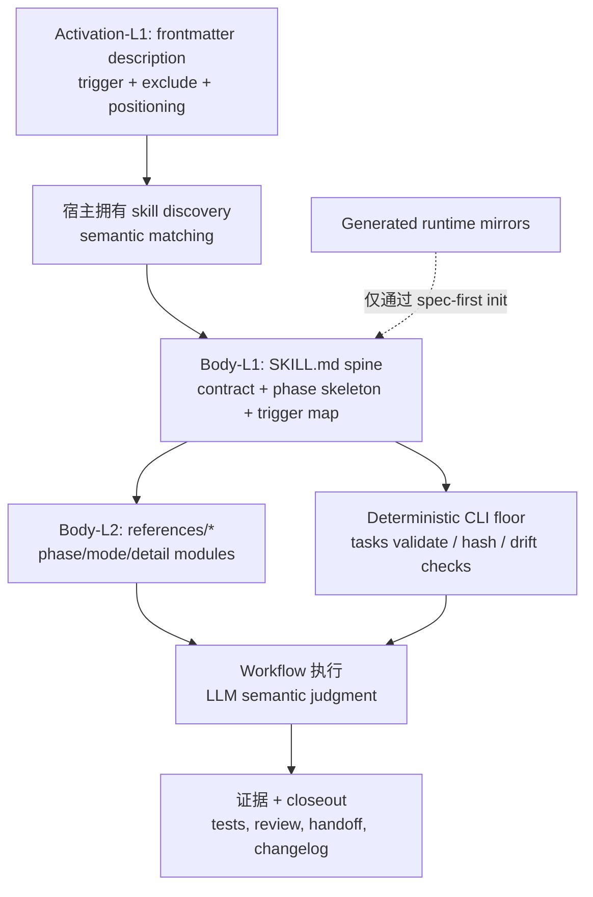
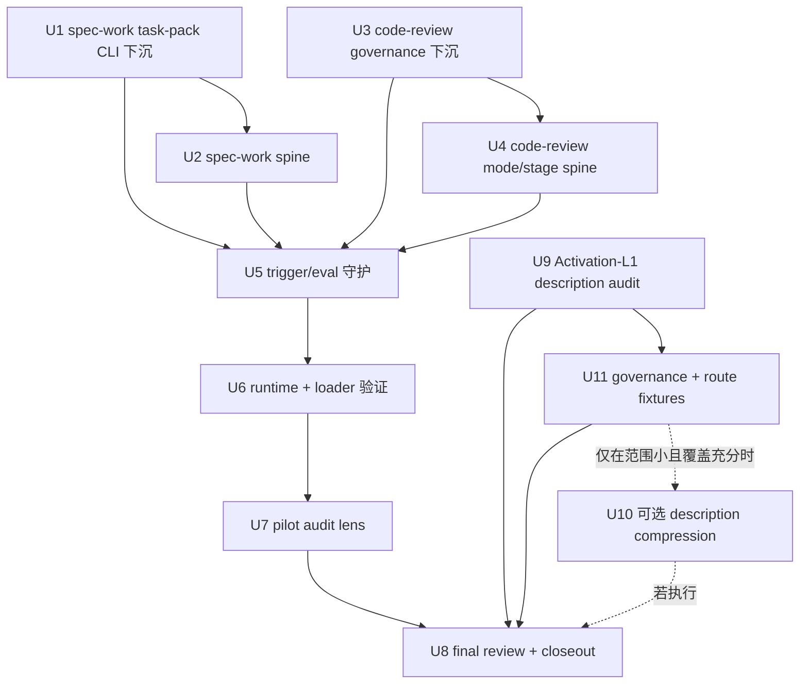

# refactor: 通过渐进披露精简 skill prompt

## 摘要

本计划把 spec-first 的长 skill prompt 从“主 `SKILL.md` 承载完整流程细节”调整为“轻 spine + 明确 STOP 触发 + 按需 references + deterministic CLI floor”。第一阶段以 `spec-work` 和 `spec-code-review` 为样板，验证瘦身不会丢失 source/runtime 边界、review/verification 纪律和 task-pack 执行安全。

---

## 决策摘要

- **推荐方案：** 第一刀先做最小、最可验证的 `spec-work` task-pack 校验 prose 下沉：让 prompt 消费 `spec-first tasks validate --json` 的 `deterministic_handoff` / `reason_code`，不再自然语言复写 hash/结构规则。它是行为承重的 ownership 迁移，不再误称为“只改 wording”。随后用 `spec-code-review` 做共享治理段落下沉样板，再进入两大 workflow 的完整 spine 重排；`spec-skill-audit` rubric 在 pilot 后沉淀，不阻塞第一刀。
- **关键决策：** 主 `SKILL.md` 只保留 workflow contract、热路径 Body-L1 phase spine、Reference Trigger Map、hard boundary 和 CLI handoff；Body-L2 条件细节进入 `references/`；Body-L3 背景叙事直接删除；确定性校验用 CLI 输出而不是 prompt prose 重写。
- **验证重点：** 以 line-count budget、reference trigger tests、fresh-source eval、现有 workflow contract tests、`spec-first tasks validate --json` 行为和 runtime projection drift tests 共同验证。
- **最大风险 / 边界：** 最大风险是把内容搬到 `references/` 后触发失败，所以每次 extraction 必须配套 `trigger_condition`、`must_read`、`fallback_if_unread` 和 eval/test 锚点。不得手改 `.claude/`、`.codex/`、`.agents/skills/` 等 generated runtime mirrors。

---

## 问题框架

`docs/项目审查/2026-07-06-真实状态与提升优先级.md` 指出当前最高优先级问题不是代码质量，而是 skill prompt 膨胀：38 个 skill 合计 10,628 行，`spec-code-review/SKILL.md` 1,241 行，`spec-work/SKILL.md` 579 行。主 prompt 过重会挤压用户代码、plan/source/test context，并让后置规则更容易在长上下文中被漏读。

这不是单纯压缩文字的问题。按 `docs/10-prompt/结构化项目角色契约.md`，正确方向是：

- Light contract：主入口保持轻、明确、可维护。
- Explicit boundaries：source-of-truth、generated runtime、provider、artifact、consumer 边界不能被瘦身稀释。
- Deterministic floor：脚本强制身份、hash、结构、drift 等确定性不变量；LLM 判断语义充分性。

因此，本计划的目标是重排 prompt 信息层级，而不是削弱治理。

---

## 2026-07-06 优化方案补充综合

`docs/项目审查/2026-07-06-skill-prompt-精简优化方案.md` 对本计划有三点应采纳的修正：

- **先复用已验证模式，而不是重新证明 progressive disclosure。** `spec-plan` 已经采用 `STOP. Before X, read references/Y.md` 的 spine + references 模式，并有 contract test 守护 runtime projection。后续实现应复制这个触发语气、路径投射断言和 reference integrity 检查，而不是发明新的 prompt-budget 机制。
- **先做 deterministic floor downshift。** `spec-work` task-pack intake 中重复描述 hash、`spec_id`、Task Pack Contract 结构等规则，是把脚本职责写回 prompt。第一个 workflow-prompt refactor PR 应先把这部分压成 CLI handoff contract：运行 `spec-first tasks validate <task-pack-path> --json`，只有 `deterministic_handoff: true` 才进入语义执行判断；失败时按 `reason_code` 停止并交还 handoff envelope。
- **治理下沉必须避免复制新的真相源。** `Runtime Context Exclusion` 的长路径清单不应原样复制到每个 skill 的 `governance-boundaries.md`。reference 只保留本 skill 的触发时机、例外和消费姿态；默认清单继续指向 `docs/contracts/context-governance.md`。

同时保留本计划原有的两条安全约束：

- 不能只凭“reference 文件存在”判断成功；每个迁移都要有 `trigger_condition`、`must_read`、`fallback_if_unread` 和至少一个 eval/test 锚点。
- 行数预算是 advisory budget，不是 completion gate。`spec-code-review` 第一阶段可参考 300-400 行作为现实预算，220/150 行只作为后续收敛方向；`spec-work` 可先完成 task-pack intake 与治理边界下沉，再观察实际 delta。真正的 completion gate 是边界保留、STOP trigger 覆盖、deterministic floor handoff、focused tests、fresh-source/runtime 验证和 honest closeout。

## Activation-L1 Description 补充（2026-07-06 借鉴报告）

`docs/项目审查/2026-07-06-skill-prompt-精简优化方案.md` §10 引入了与 Body-L1/Body-L2 正文瘦身正交的维度：**Activation-L1 description 索引税**。前述 U1-U8 主要处理 Active body（触发后才付的条件税）；本 addendum 补上 Activation index（每次对话无条件付的常驻税）。

实测常驻 metadata 约 6,200 tokens（89 skills ~4,369 + 51 agents ~1,856），当前约占 200K 窗口 3%，随体系扩张只增不减。

三条约束区分 spec-first 能做与不能做：

- **spec-first 拥有 Activation-L1 description 文本**：可压缩超长 offender（`proof` 149 词、`git-commit-push-pr` 119 词、`spec-slack-research` 84 词），但必须保留 exclude intent（38 skill 中已有 27 个）。压缩单位是“trigger + exclude + 定位三段各自最短”，不是裸 30 词——因为 `spec-plan/spec-work/spec-code-review/spec-doc-review/spec-compound` 边界相邻，误触发比漏触发更伤。
- **宿主拥有 L0/语义路由**：skill 由宿主加载（`src/cli/plugin.js` 只做投射），是否懒加载/向量路由由宿主决定。**本计划明确拒绝**自建 L0 域索引引擎、语义 registry 或 skill 联邦——重建宿主 primitive 违反角色契约商品化原则。
- **新增 skill 是体系变更**：新增/改 skill 有全局税与路由碰撞成本，扩展现有 `lint-skill-entrypoints` / `spec-skill-audit` 做 description 预算与重叠检查，而非新增 contract。

对应新增需求 R11-R13 与实现单元 U9-U11（见下文）。U9/U11 可与 Body-L2 单元并行并进入 U8 closeout；U10 只有在 U9/U11 证明 offender 集合小、route baseline 足够且改动不扩大 pilot scope 时才执行，否则作为 outcome-gated follow-up。

---

## 需求

- R1. `spec-work/SKILL.md` 第一阶段先完成 task-pack deterministic floor downshift 与 reference trigger 化；完整 spine 重排以 150 行级别作为 advisory budget。未达到预算时记录 line-count delta、未达原因和保留的承重文本，不阻断完成。
- R2. `spec-code-review/SKILL.md` 第一阶段优先下沉共享治理段落、mode/output 冷路径和 dispatch 细节；300-400 行是 advisory budget，220/150 行只作为后续收敛方向。未达到预算时记录 line-count delta、未达原因和保留的承重文本，不阻断完成。
- R3. 每个移入 `references/` 的 Body-L2 细节必须在主 spine 有确定性 STOP 触发，触发语句包含具体条件、目标 reference、继续执行前置性。
- R4. Body-L3 背景叙事、通用建议、重复原则不得迁移到 references；删除后不应造成 phase 步骤、artifact contract 或 safety boundary 缺失。
- R5. task-pack identity、freshness、hash、Task Pack Contract 结构校验以 `spec-first tasks validate <path> --json` 为确定性入口；prompt 不再手写 hash 比对规则。
- R6. 语义判断仍留在 LLM：task quality、scope adequacy、review finding 成立性、implementation readiness 不下沉为脚本裁决。
- R7. `references/` 文件保留 source-owned，随 `spec-first init` 复制到 runtime；不得手改 generated runtime mirrors。
- R8. 变更必须补或更新聚焦 tests/evals，证明主 spine 预算、reference trigger、deterministic floor handoff 和 source/runtime boundary 没有漂移。
- R9. 方案必须兼容 Claude/Codex/Cursor/Kiro/Qoder 的 runtime projection，不引入 host-specific prompt truth source。
- R10. 变更必须同步 `CHANGELOG.md`；用户可见的 prompt 行为变化标注 `(user-visible)`。
- R11. Activation-L1 description 审计：测量所有 spec-first skill/agent 的 frontmatter description token 占用，识别把功能说明写进 description 的超长 offender；任何压缩都必须保留 trigger + exclude + 定位三段，不得为凑长度砍掉边界相邻 workflow 的 exclude intent。
- R12. 新增/修改 skill 的系统级治理：扩展 `lint-skill-entrypoints` 或 `spec-skill-audit`，检查 description 长度预算、是否声明 exclude intent、是否与现有 skill 高重叠；不新增独立 contract/schema。
- R13. route collision 覆盖：为边界相邻 workflow（plan/work/code-review/doc-review/compound）建 eval fixture，用典型请求记录 expected / excluded workflow；脚本/Jest 只校验 fixture 结构、覆盖和可解析性，语义命中是否合理由 fresh-source/read-only eval 判断。不得自建宿主级 L0 域索引、语义向量 registry 或 skill 联邦（宿主 primitive，重建即反模式）。

---

## 范围边界

- 不新增新的 public workflow、skill 或 agent。
- 不新增新的 schema/contract 概念来替代已有 `spec-skill-audit`、`spec-plan`、`spec-work`、`spec-code-review` 边界。
- 不做全量 38 个 skill 的机械瘦身；先完成 `spec-work` 和 `spec-code-review` 样板。
- 不把 generated runtime mirrors 当 source 修复；runtime drift 只通过 `spec-first init` 修复。
- 不让脚本判断语义充分性；脚本只输出 deterministic facts、reason_code、artifact path、exit code。
- 不把 stats/run evidence 消费层塞进本轮 prompt 瘦身实现；它是相邻高优先级计划，可在 prompt 样板稳定后单独推进。
- 不自建宿主级 L0 域索引路由引擎、语义向量 skill registry 或 skill 联邦；skill discovery/routing 是宿主 primitive，spec-first 只拥有 description 文本与投射，不重建宿主能力。

### 后续工作

- `spec-first stats` / run evidence 消费层：单独计划，实现 `.spec-first/workflows/**/run.json` 趋势与 reason_code 汇总。
- Windows helper 迁移：单独计划，优先 `spec-code-review` base resolver Node 化。
- 首次体验 5 分钟闭环：单独计划，聚焦 init guidance、try/demo path 和 quick mode。
- Wave-2 rollout：只有 pilot closeout 产出最小 outcome bundle 后才创建或更新后续推广计划；不作为本轮 implementation unit。

---

## 完成标准

- `spec-work/SKILL.md` 不再在主 prompt 中复写 task-pack hash/structure 校验规则，且保留所有执行 hard boundaries。
- `spec-code-review/SKILL.md` 第一阶段记录 line-count delta 和未达预算原因，并保留 mode、安全、审查输出和 fallback 合同。
- 新增或更新的 references 均有主 spine STOP trigger，且 tests/evals 覆盖至少一个触发场景和一个不触发场景。
- task-pack intake 中 prompt 不再重复描述可由 `spec-first tasks validate --json` 判定的 hash/structure 细节。
- Activation-L1 description audit 产出 before baseline（或记录未执行 reason_code），并在 closeout 中与 Active body 瘦身收益分开报告。
- route collision fixtures 覆盖相邻 workflow 的 expected / excluded 意图；Jest/脚本只证明 fixture 结构和覆盖，fresh-source/read-only eval 或 closeout limitations 负责说明语义路由判断结果。
- 若执行 U10，必须先有 U9 baseline 与 U11 route fixture；若 U10 未执行，closeout 记录 `description_compression_deferred` 与触发条件，不阻断 Body-L1/Body-L2 pilot 完成。
- `npm run lint:skill-entrypoints`、相关 unit tests、`npm run typecheck` 通过。
- fresh-source eval 或等价 read-only reviewer 对两个样板确认：未丢失 source/runtime boundary、mutation gate、verification handoff、review handoff。
- 若运行 `spec-first init` 验证 runtime projection，必须确认只由 source 生成 runtime，未手改 generated mirrors。

---

## 直接证据准备度

- target_repo: `.`
- evidence_sources: direct source reads, `rg`, `find`, `wc -l`, Graphify query advisory, CodeGraph advisory, `spec-first internal task-governance-signals`, git status
- source_refs:
  - `docs/项目审查/2026-07-06-真实状态与提升优先级.md`
  - `docs/项目审查/2026-07-06-skill-prompt-精简优化方案.md`
  - `docs/10-prompt/结构化项目角色契约.md`
  - `skills/spec-work/SKILL.md`
  - `skills/spec-code-review/SKILL.md`
  - `skills/spec-plan/SKILL.md`
  - `skills/spec-skill-audit/references/skill-authoring-quality.md`
  - `src/cli/commands/tasks.js`
  - `src/cli/task-pack.js`
  - `src/cli/plugin.js`
  - `src/cli/skill-path-rewrite-markers.js`
  - `tests/unit/spec-work-contracts.test.js`
  - `tests/unit/spec-code-review-contracts.test.js`
- current_revision: `12b96c8d`
- worktree_status: 本计划创建前工作树已 dirty；既有无关变更包括 `CHANGELOG.md`、`CLAUDE.md`、`skills/spec-mcp-setup/scripts/verify-tools.*`、`src/cli/commands/update.js` 及相关 tests
- confidence: source structure 和 line-count evidence 置信度高；runtime loader behavior 置信度中等，因为尚未运行真实 host invocation
- limitations: Graphify 和 CodeGraph 仅作为 provider_untrusted navigation 使用；尚未运行真实 host workflow invocation 或 fresh-source eval

---

## 直接证据

- repo_scope: current `spec-first` repo
- source_reads_completed:
  - 已读取 2026-07-06 审查报告和角色契约。
  - 已读取 `spec-work` 与 `spec-code-review` spine，以及 references 目录清单。
  - 已读取本计划所需的 `spec-plan` 规划 references。
  - 已读取 task-pack validator 与 runtime skill copy/drift 代码。
  - 已读取 `spec-skill-audit` authoring quality rubric，作为 skill prompt 质量的现有 owner。
- source_reads_required:
  - 实施每个单元前，重新读取精确目标 skill 与 reference 文件，因为 prompt source 变化较快。
  - 修改断言前，重新读取受影响的 unit tests。
  - 如果 runtime 路径引用移动，重新读取 host adapter transforms。
- commands_or_tools_used:
  - `find skills -mindepth 2 -maxdepth 2 -name SKILL.md -print | xargs wc -l | sort -nr | head -20`
  - `skills/**/references` 下的 reference 目录清单
  - `spec-first internal task-governance-signals --source plan-declared --input <tmp> --json`
  - 用于 prompt 简化导航的 Graphify 查询
  - 用于相关 source 导航的 CodeGraph 查询
- impact_on_plan:
  - helper 返回 `candidate_level: deep`，reason code 包含 `cross-module`、`critical-path-hit` 和 `keyword-hit`。
  - `src/cli/plugin.js` 已经复制完整 skill 目录和 support files，因此 references extraction 不需要新的 runtime 机制。
  - `src/cli/commands/tasks.js` 已经暴露带 JSON 与 exit code 的 `tasks validate`，所以 `spec-work` 可以消费 deterministic task-pack validation，而不是重新描述它。
- key_findings:
  - 主 prompt 行数确认了审查报告的担忧：`spec-code-review` 1,241 行，`spec-work` 579 行，`spec-plan` 460 行，`spec-debug` 402 行。
  - `spec-code-review` 已有 1,233 行 reference，但仍在 main spine 保留完整 mode/stage prose，说明问题是缺 trigger discipline，而不是缺 references。
  - `spec-work` 已有 `references/shipping-workflow.md`，但 task-pack intake、branch/worktree setup、execution strategy 和 test strategy 仍然 always-loaded。
  - `skill-authoring-quality.md` 已把长 examples/rubrics 和缺 reference pointers 标为 P2 maintainability risk；应扩展这个现有 rubric，而不是新增 contract。
- limitations:
  - 在实现落地并收集 run evidence 前，无法直接测量 LLM output quality 或 not-run rate 的改善。
  - 外部文档仅作为 skill support files 可支持 progressive disclosure 的上下文确认；repo source 仍是实现权威。

---

## 上下文与调研

### 相关代码与模式

- `skills/spec-plan/SKILL.md` 是当前最好的本地 spine + STOP-triggered references 模式，尤其是 `governance-boundaries.md`、`reuse-analysis.md` 和 phase-specific references。
- `src/cli/plugin.js` 会带 transform 复制整个 skill 目录；`skillSupportFileIntegrityIssues` 会检查非 `SKILL.md` support files，因此移出的 references 仍属于 drift detection。
- `src/cli/skill-path-rewrite-markers.js` 会把 operational source skill paths 重写为 runtime paths，同时保留 source-of-truth marker lines。新的 reference pointers 必须写成该 transform 能处理的形式。
- `src/cli/task-pack.js` 校验 task-pack frontmatter、source plan path、`spec_id`、`source_plan_hash`、Task Pack Contract JSON、execution waves、task fields，并产出 `execution_focus`。
- `skills/spec-skill-audit/references/skill-authoring-quality.md` 拥有 prompt writing quality vocabulary，应扩展 prompt-budget/progressive-disclosure audit signals。

### 已有经验

- `docs/项目审查/2026-05-07-skill-agent-prompt-expert-review.md` 已建议 main `SKILL.md` 保留 Purpose、Trigger、Non-trigger、Inputs、Outputs、Workflow skeleton、Failure Modes 和 References，并用显式 STOP triggers 延迟复杂细节。
- `docs/11-业界调研/spec-first-skills-优化方案-基于16个思维模型.md` 增加了 Body-L1/Body-L2/Body-L3 区分：Body-L1 留在 spine，Body-L2 带 deterministic STOP triggers 进入 references，Body-L3 删除。
- `docs/11-业界调研/spec-first-skills-优化方案-50轮深度审查报告.md` 提醒 progressive disclosure 的失败点是 trigger failure，而不是 reference 数量。每次 extraction 都需要 `trigger_condition`、`must_read`、`fallback_if_unread` 和 `eval_case`。

### 外部参考

- Anthropic Claude Code Skills documentation: `https://docs.anthropic.com/en/docs/claude-code/skills`
  - 仅作为 skill support files 可支持 progressive disclosure 的上下文依据；它不是 spec-first source-of-truth。

---

## 现有能力 / 复用分析

- **清单：** 现有 owner 包括 `skills/spec-skill-audit/references/skill-authoring-quality.md`、`skills/spec-plan/references/plan-sections.md`、`src/cli/task-pack.js`、`src/cli/plugin.js` 和 workflow-specific reference directories。
- **决策：** 扩展现有 owner，而不是创建新的 prompt-budget contract 或 schema。audit rubric 拥有 skill quality language，各 workflow 拥有自己的 spine/reference split，CLI validator 拥有 deterministic task-pack facts。
- **真相源：** Source 变更位于 `skills/`、`src/cli/`、`tests/`、`docs/plans/` 和 `CHANGELOG.md`。
- **拒绝的 owner：** 不把 prompt-budget 规则放进 `docs/10-prompt/结构化项目角色契约.md`；角色契约拥有 value boundaries，不拥有 execution details。不把所有细节放进 `docs/contracts/context-governance.md`；该文档拥有 context exclusions 和 trust boundaries，不拥有 per-skill prompt architecture。
- **实现阶段复查：** 实现前重新运行 skill line counts，并检查最新 `spec-work` / `spec-code-review` 文本。如果其他分支已经瘦身目标 skill，优先扩展已有结构，而不是重新 extraction。

---

## 关键技术决策

- KTD1. 使用三层 Active body 模型：Body-L1 spine、Body-L2 on-demand references、Body-L3 deletion。
  - 理由：这与已有本地审查结论一致，并避免把 `references/` 变成堆放场。

- KTD2. 给长 workflow spine 增加 `Reference Trigger Map`。
  - 理由：集中 trigger map 让 references 可发现、可测试；“if applicable” 这类分散 prose 已被识别为脆弱模式。

- KTD3. 把 STOP triggers 当作承重 contract text。
  - 理由：只有模型可靠知道何时必须读取 reference，reference 才能安全减少 context。Trigger wording 必须具体到可测试。

- KTD4. 消费 deterministic CLI validation，而不是重新描述 deterministic checks。
  - 理由：`spec-first tasks validate --json` 已经拥有 task-pack identity/freshness/structure。Prompt prose 应解释结果并执行 semantic readiness judgment，而不是重复 hash rules。

- KTD5. 把 semantic adequacy 留在 LLM-owned prompt space。
  - 理由：Task split quality、review gate necessity、implementation readiness 和 finding validity 都是 deterministic floor 之上的 semantic judgments。

- KTD6. 以 `spec-work` 作为第一个 pilot。
  - 理由：它有高用户影响、已有 references、清晰 CLI validation handoff，并与 run evidence 报告的 not-run 问题直接相关。

- KTD7. 以 `spec-code-review` 作为第二个 pilot。
  - 理由：它是最大的 skill，已经 reference-heavy，并暴露出其他 workflow skills 也会遇到的 mode/output/template extraction 问题。

- KTD8. 广泛 rollout 前先扩展 tests/evals。
  - 理由：没有 guardrails 时，prompt slimming 可能静默移除 safety boundaries。前两个 pilots 应定义可复用 test pattern。

- KTD9. 把 Activation-L1 routing quality 作为并行 measurement lane，而不是 Body-L1/Body-L2 pilot 的 blocker。
  - 理由：description tokens 是 always-loaded，值得 audit coverage；但 route semantics 仍归 host/LLM 拥有。U9/U11 应建立 baseline 和 fixtures；只有证据显示改动足够小，U10 才压缩 descriptions。

---

## 待决问题

### 规划阶段已解决

- 是否应创建新的 prompt-budget schema？
  - 结论：不应。复用现有 audit rubric、skill source 和 tests。新增 schema 会违反审查报告“不要新增 contract/schema”的方向。

- 是否应直接更新 generated runtime assets？
  - 结论：不应。Source 变更进入 `skills/` 与相关 tests。若需要 runtime refresh，使用面向选定 host 的 `spec-first init`。

- 是否纳入 stats/run evidence consumption？
  - 结论：不纳入。它相邻且有价值，但应在 prompt slimming 形成可测量 before/after 后跟进。

### 延迟到实现阶段

- extraction 后的精确最终行数：
  - 延迟处理，因为它取决于 tests 和 fresh-source eval 后仍必须保留多少 contract text。

- `spec-code-review` 是否能在第一轮达到 150 行：
  - 延迟处理，因为 mode matrix 和 output envelope 可能需要两步 extraction，避免破坏 headless/autofix consumers。

- 小型 line-count test 应该是 hard 还是 advisory：
  - 延迟到实现阶段，在检查当前 test style 后决定。除非 strict threshold 是 completion criteria 的一部分，否则长期 workflow 优先使用 advisory thresholds。

---

## 高层技术设计

> *本图只展示目标方向，供审查理解，不是实现规格。实施 agent 应把它当作上下文，而不是需要逐字复现的代码。*

Activation path 总是支付 G 的成本，但 H 仍归宿主拥有。触发后，热路径默认只读 A；只有 A 的 STOP trigger 触发时才读取 B。它把 C 作为 confirmed deterministic facts 消费，并且永远不把 F 当作 source。

---

## 实施单元

### U1. 将 deterministic task-pack checks 下沉到 CLI output

**目标：** 在保留 semantic safety 的同时，从 `spec-work` 中移除 task-pack hash/structure prose duplication。这是第一个 workflow-prompt refactor PR 候选，因为表面积最小；但它仍是从 prompt prose 到 CLI handoff 的行为承重 ownership migration。

**需求：** R1, R5, R6, R8

**依赖：** 无

**文件：**
- 修改：`skills/spec-work/SKILL.md`
- 新建或修改：`skills/spec-work/references/task-pack-intake.md`
- 修改：`tests/unit/spec-work-contracts.test.js`
- 仅当当前 JSON output 需要小型兼容性断言时修改：`tests/unit/task-pack-command.test.js`
- 修改：`CHANGELOG.md`

**做法：**
- 让 `spec-work` 消费现有 validator shape：
  - exit `0` 且 `deterministic_handoff: true` 是 deterministic task-pack execution 的必要条件。
  - exit non-zero 或 `deterministic_handoff: false` 时，带 handoff envelope 停止。
  - invalid JSON 或缺少 expected fields 时，以 `task_pack_validation_unreadable` 或等价 degraded handoff 停止，而不是视作 semantic pass。
  - `reason_code` 作为 deterministic fact 报告，不重新解释为 semantic judgment。
  - `validity_scope: identity-freshness-structure-only` 保持可见，确保 LLM 仍检查 semantic posture。
- 用紧凑 STOP trigger 替代重复 prose：
  - `STOP. When the input is a task pack, run spec-first tasks validate <task-pack-path> --json and read references/task-pack-intake.md before creating execution tasks.`
- 在 prompt 中保留 semantic checks：
  - `semantic_posture`;
  - `dispatch_authorization`;
  - task `stop_if`;
  - review gate intent；
  - source plan scope 和 non-goals。
- 将 CLI unavailable 作为 deterministic task-pack execution 的停止条件。不要 fallback 到 prompt prose 手动重写 hash/structure checks。
- 除非当前 JSON 缺少 executor 真正需要的字段，否则不新增 CLI。

**遵循模式：**
- `src/cli/commands/tasks.js`
- `src/cli/task-pack.js`
- `skills/spec-plan/SKILL.md` STOP-trigger style
- `skills/spec-write-tasks/references/execution-handoff-contract.md`

**测试场景：**
- 正常路径：valid fixture task pack 通过 `spec-first tasks validate --json`，且 prompt contract 命名 `deterministic_handoff`。
- 错误路径：stale hash 或 wrong-chain fixture 拒绝执行，并路由到 regeneration/review。
- 错误路径：CLI unavailable 或 invalid JSON 会停止 deterministic task-pack execution，而不是在 prompt prose 中重建 validator logic。
- 边界：prompt 仍说明 deterministic handoff 对 semantic execution readiness 是必要但不充分条件。
- 边界：valid deterministic handoff 仍可被 semantic posture、`stop_if`、scope/non-goal 或 review-gate judgment 拒绝。

**验证：**
- `npx jest tests/unit/task-pack-command.test.js tests/unit/spec-work-contracts.test.js --runInBand`

---

### U2. 将 `spec-work` 精简为 pilot spine

**目标：** 在 task-pack CLI floor ownership 清晰后，把 `spec-work/SKILL.md` 转成第一个具体 progressive-disclosure execution sample。

**需求：** R1, R3, R4, R7, R8

**依赖：** U1

**文件：**
- 修改：`skills/spec-work/SKILL.md`
- 若 trigger map 需要细化，修改：`skills/spec-work/references/task-pack-intake.md`
- 新建：`skills/spec-work/references/execution-strategy.md`
- 新建：`skills/spec-work/references/feedback-and-tests.md`
- 仅当 closeout references 需要路径更新时修改：`skills/spec-work/references/shipping-workflow.md`
- 修改：`tests/unit/spec-work-contracts.test.js`
- 修改：`CHANGELOG.md`

**做法：**
- 在 main spine 中保留：
  - workflow contract 摘要；
  - 压缩形式的 Scenario Capability high-risk overrides；
  - input triage skeleton；
  - Reference Trigger Map；
  - mutation/source-runtime/verification/handoff boundaries；
  - triage、validation、execution、shipping handoff 的 phase skeleton。
- 将 branch/worktree/subagent/parallel dispatch rules 移到 `execution-strategy.md`。
- 将 Test Discovery、System-Wide Test Check、feedback loop 和 testing category details 移到 `feedback-and-tests.md`。
- 保留所有 spec-work-specific behavior 后，删除 generic Key Principles、Common Pitfalls 等 Body-L3 段落。

**遵循模式：**
- `skills/spec-plan/SKILL.md` STOP-trigger style.
- `skills/spec-work/references/shipping-workflow.md` existing late-phase reference.

**测试场景：**
- 正常路径：main `SKILL.md` 包含 `Reference Trigger Map`、`task-pack-intake.md`、`execution-strategy.md`、`feedback-and-tests.md` 和 `shipping-workflow.md` triggers。
- 边界情况：direct bare-prompt work 不读取 task-pack intake 仍可继续。
- 错误路径：task-pack execution 文本仍通过 CLI validation handoff 拒绝 stale/unverifiable packs。

**验证：**
- `tests/unit/spec-work-contracts.test.js` passes.
- 在 closeout 中记录 line-count delta 和任何 advisory-budget shortfall；不要只为满足 budget 删除 load-bearing text。

---

### U3. 下沉 `spec-code-review` shared governance prose

**目标：** 在移动详细 mode/stage flow 前，以 `spec-code-review` 作为 shared-governance extraction sample。

**需求：** R2, R3, R4, R8, R9

**依赖：** 无

**文件：**
- 修改：`skills/spec-code-review/SKILL.md`
- 新建：`skills/spec-code-review/references/governance-boundaries.md`
- 修改：`tests/unit/spec-code-review-contracts.test.js`
- 仅当新的 reference path handling 尚未覆盖时，修改 runtime projection/path rewrite tests
- 修改：`CHANGELOG.md`

**做法：**
- 仅在 Runtime Context Exclusion、Capability-Class Evidence Boundary、Summary-First Handoff、Cache-Friendly Context Layout、Direct Evidence Boundary、Anti-Rationalization Red Flags 等 repeated governance blocks 属于 cold-path 或 cross-skill repeated 时移动它们。
- 在 spine 中保留紧凑 STOP trigger：
  - when broad context, external capability evidence, runtime mirror exclusion, or summary-first handoff is relevant, read `references/governance-boundaries.md` before continuing.
- 在 reference 中，不复制完整 generated mirror denylist。指向 `docs/contracts/context-governance.md` 作为 source of truth，只记录 `spec-code-review`-specific posture 和 exceptions。
- 在 U4 用 targeted tests 移动它们前，保留 hot-path review identity、severity/finding output obligations、source/runtime boundary、dispatch authorization boundary 和 report-only/headless mode safety 于 main spine。

**遵循模式：**
- `skills/spec-plan/SKILL.md`
- `skills/spec-plan/references/governance-boundaries.md`
- `tests/unit/spec-plan-contracts.test.js`

**测试场景：**
- 正常路径：main `SKILL.md` 包含指向 `governance-boundaries.md` 的 STOP trigger。
- 边界：`governance-boundaries.md` 引用 `docs/contracts/context-governance.md`，而不是复制完整 generated mirror path list。
- 错误路径：移除 trigger 或 reference path 会让聚焦 contract test 失败。

**验证：**
- `npx jest tests/unit/spec-code-review-contracts.test.js --runInBand`
- 在 closeout 中记录 line-count delta 和任何 advisory-budget shortfall；不要只为满足 budget 删除 load-bearing text。

---

### U4. 围绕 mode 与 stage triggers 精简 `spec-code-review`

**目标：** 在 shared governance 安全迁移且 `@./references` semantics 完成分类后，把最大 prompt 转为带 mode-specific references 的显式 review spine。

**需求：** R2, R3, R4, R8, R9

**依赖：** U3

**文件：**
- 修改：`skills/spec-code-review/SKILL.md`
- 新建：`skills/spec-code-review/references/mode-rules.md`
- 新建：`skills/spec-code-review/references/scope-resolution.md`
- 新建：`skills/spec-code-review/references/dispatch-and-synthesis.md`
- 新建：`skills/spec-code-review/references/headless-output-format.md`
- 修改现有文件：`skills/spec-code-review/references/review-output-template.md`
- 修改：`tests/unit/spec-code-review-contracts.test.js`
- 如果 dispatch text 移动，修改：`tests/unit/spec-dispatch-boundary-contracts.test.js`
- 修改：`CHANGELOG.md`

**做法：**
- 删除 `## Included References` block 前，将每个现有 `@./references/...` entry 分类为：
  - required eager include / host loader contract；
  - ordinary markdown path hint；
  - STOP trigger replacement 的安全候选。
- 证据必须基于 source/test/runtime，不能从文件名推断。如果证据不可用，保留 schema/template-like references（`findings-schema.json`、`subagent-template.md`、persona catalog、output template）于 main spine，或记录 `loader_behavior_degraded`，并且不删除 load-bearing text。
- 在 main spine 中保留：
  - review contract 摘要；
  - severity scale；
  - mode detection table；
  - action routing summary；
  - reviewer selection summary；
  - Reference Trigger Map；
  - 压缩形式的 direct evidence 与 capability-class boundary；
  - fallback summary。
- 将 mode-specific rules 移到 `mode-rules.md`。
- 将 scope/base detection 与 PR/branch/base handling 移到 `scope-resolution.md`。
- 将 Stage 4 dispatch、runtime readiness preflight、model tiering、run-id、merge/dedupe、validation pass 移到 `dispatch-and-synthesis.md`。
- 将大型 headless output envelope 移到 `headless-output-format.md`。
- 只替换已证明可安全 lazy trigger 的 `@./references/...` entries。Required loader/schema/template entries 在 U6 验证所有目标 host runtime behavior 前仍保持显式。

**遵循模式：**
- 现有 `skills/spec-code-review/references/persona-catalog.md`
- 现有 `skills/spec-code-review/references/subagent-template.md`
- `skills/spec-plan/SKILL.md` trigger style

**测试场景：**
- 正常路径：extraction 后 interactive review 保留 safe-auto/gated/manual/human/release routing semantics。
- 边界情况：`mode:report-only` 仍然 read-only，且不写 review artifact dirs。
- 错误路径：conflicting mode flags 在 dispatch 前停止。
- 边界：Codex dispatch authorization rules 保持可见且完整。
- 边界：未分类 runtime role 的 `@./references` entries 不被移除。

**验证：**
- `npx jest tests/unit/spec-code-review-contracts.test.js tests/unit/spec-dispatch-boundary-contracts.test.js --runInBand`
- 在 closeout 中记录 line-count delta 和任何 advisory-budget shortfall；不要只为满足 budget 删除 load-bearing text。

---

### U5. 增加 trigger reliability tests 与 eval fixtures

**目标：** 用 trigger behavior 验证 progressive disclosure，而不是只验证 references 存在。

**需求：** R3, R4, R8

**依赖：** U1, U2, U3, U4

**文件：**
- 修改：`tests/unit/spec-work-contracts.test.js`
- 修改：`tests/unit/spec-code-review-contracts.test.js`
- 如果 eval fixture coverage 在其中跟踪，修改：`tests/unit/workflow-eval-readiness-contracts.test.js`
- 新增或修改：`skills/spec-work/evals/*.json`
- 新增或修改：`skills/spec-code-review/evals/*.json`

**做法：**
- 增加 static assertions 覆盖：
  - main spine line budget；
  - `Reference Trigger Map` 存在；
  - 每个 moved reference 都被 STOP trigger 命名；
  - U4 已将 on-demand loading 判定为目标的 spines 中，不存在 stale `@./references` eager include block；
  - 不存在直接编辑 generated runtime 的指令。
- 增加 eval fixtures 覆盖：
  - task-pack input 必须读取 task-pack intake；
  - bare prompt 默认不得读取 task-pack intake；
  - parallel dispatch 必须读取 execution strategy；
  - headless review 必须读取 headless output format；
  - report-only review 必须保持 read-only。

**遵循模式：**
- `skills/using-spec-first/evals/*`
- `skills/spec-write-tasks/evals/*`
- `tests/unit/spec-plan-contracts.test.js` reference-binding style

**测试场景：**
- 正常路径：每个 moved reference 都有且只有一个清晰 trigger source。
- 错误路径：缺失 STOP trigger 会让聚焦 unit test 失败。
- 边界：删除 Body-L3 prose 不要求 eval，除非行为发生变化。

**验证：**
- Targeted unit tests 通过。
- 如果 repo 已有 touched fixture family 的 runner，eval fixture tests 通过。

---

### U6. 验证 runtime projection、loader behavior 和 source/runtime boundary

**目标：** 确保 source prompt restructuring 正确投射到所有 generated runtime surfaces，并确保 moved references 在目标 host runtime 触发时可用。

**需求：** R7, R9, R10

**依赖：** U1, U2, U3, U4, U5

**文件：**
- 如果 new reference assertions 属于这里，修改：`tests/unit/init-source-path-coverage.test.js`
- 仅当 path rewriting assertions 需要更新时修改：`tests/unit/skill-path-rewrite-guard.test.js`
- 仅当 runtime plan expectations 变化时修改：`tests/unit/runtime-plan-contracts.test.js`
- 仅当 `@./references` handling 或 path rewriting 变化时，修改 host adapter tests
- 不编辑 generated runtime mirrors

**做法：**
- 确认 `src/cli/plugin.js` 仍复制 moved references。
- 确认 operational `skills/<skill>/references/...` pointers 在 runtime copies 中正确 transform。
- 增加或更新 assertions，确保 newly moved reference paths 在 Claude、Codex、Cursor、Kiro、Qoder 的 rendered skill/runtime plans 中被覆盖（仅限该 host 会投射该 workflow surface 的场景）。
- 除非 runtime verification 必须写 runtime assets，否则运行 init dry-run 或 plan tests。
- 每个 pilot workflow 增加一个 projected-runtime smoke 或等价 fresh-source runtime bundle check：
  - triggering input 证明 moved reference content 可达且被使用；
  - non-triggering input 证明在 host 支持 lazy loading 时，长 reference content 不会 default-loaded；
  - 如果无法运行，记录 `runtime_reference_smoke_degraded`，且不移除对应 load-bearing main-spine text。
- 如果实际需要 runtime regeneration，用显式 host flags 运行 `spec-first init`，并记录为 generated output，不记录为 source。
- 如果任一 host 的 `@./references` loader behavior 仍未被证明，记录 `loader_behavior_degraded`，并在 main spine 保留对应 schema/template/reference pointer。

**遵循模式：**
- `src/cli/plugin.js`
- `src/cli/skill-path-rewrite-markers.js`
- `tests/unit/init-source-path-coverage.test.js`
- `tests/unit/skill-path-rewrite-guard.test.js`

**测试场景：**
- 正常路径：new references 下的 support files 被纳入 runtime integrity checks。
- 边界情况：source-of-truth lines 在预期位置保留 `skills/<skill>/...`。
- 边界：每个 supported host 都有 rendered-path assertion 或显式 degraded reason。
- 边界：triggered runtime/fresh-source scenario 可以在使用 guidance 前读取 moved reference。
- 错误路径：runtime path rewrite drift 被现有 guard tests 检测。

**验证：**
- `npx jest tests/unit/init-source-path-coverage.test.js tests/unit/skill-path-rewrite-guard.test.js tests/unit/runtime-plan-contracts.test.js --runInBand`
- `npm run lint:skill-entrypoints`

---

### U7. 将 pilot 经验沉淀到 skill audit lens

**目标：** 在 pilots 产出具体样例后，用 reusable prompt-slimming signals 更新现有 skill-audit rubric。这不再阻塞 U1/U3，因为第一刀直接复用已验证的 `spec-plan` 模式。

**需求：** R1, R2, R3, R4, R8

**依赖：** U6

**文件：**
- 修改：`skills/spec-skill-audit/references/skill-authoring-quality.md`
- 修改：`tests/unit/spec-skill-audit-contracts.test.js`
- 如果当前 assertions 位于其中，修改：`tests/unit/skill-agent-quality-governance-contracts.test.js`
- 修改：`CHANGELOG.md`

**做法：**
- 基于 U1-U6 outcomes 增加一个简洁 prompt-slimming quality lens：
  - Body-L1 spine：contract、triggers、hot-path phase skeleton、hard boundaries。
  - Body-L2 reference：带 deterministic STOP trigger 的 conditional detail。
  - Body-L3 deletion：background principles、generic advice、duplicate warnings。
- 用 prose 定义每个 moved reference 的最小字段：`trigger_condition`、`must_read`、`fallback_if_unread`、`eval_case`。
- 增加警告：line-count budgets 是 advisory，不能覆盖 source/runtime、mutation、verification 或 handoff boundaries。
- 保持为 audit/review vocabulary，不变成 schema，也不新增 public workflow。

**遵循模式：**
- 本计划 U1-U6 的结果。
- `skills/spec-skill-audit/references/skill-authoring-quality.md`
- `docs/11-业界调研/spec-first-skills-优化方案-基于16个思维模型.md`

**测试场景：**
- 正常路径：long main spine 且没有 reference trigger map 的 skill 被分类为 progressive-disclosure risk。
- 边界情况：轻量 read-only skill 不被强制增加 heavyweight reference maps。
- 错误路径：列出但没有 trigger 的 reference 仍是 P2 maintainability signal。

**验证：**
- Relevant unit tests 通过。
- 新 rubric 不引入新的 formal schema/contract requirement。

---

### U9. Activation-L1 description token audit

**目标：** 测量并输出所有 spec-first skill/agent 的 frontmatter description 常驻 token 占用，作为 Activation-L1 优化的 before baseline。这是索引层工作的第一步，先测量再判断是否改。

**需求：** R11

**依赖：** 无（与 Body-L2 单元并行）

**文件：**
- 新建：`docs/validation/2026-07-06-skill-description-token-audit.md`（audit baseline artifact）
- 修改：`CHANGELOG.md`

**做法：**
- 脚本化统计每个 `skills/*/SKILL.md` 与投射 agent 的 description 词数/估算 token。
- 标注三类：高频核心（plan/work/code-review）、边界相邻（doc-review/compound）、其他。
- 标注 offender：把功能说明/案例写进 description 的（如 `proof`、`git-commit-push-pr`、`spec-slack-research`）。
- 标注每个 skill 是否已有 exclude intent。
- 输出为 advisory audit artifact，不改 skill 文本本身。是否进入 U10 取决于 offender 集合规模、route fixture 覆盖和 pilot scope。

**遵循模式：**
- `docs/项目审查/2026-07-06-skill-prompt-精简优化方案.md` §10 的测量方法。

**测试场景：**
- 正常路径：audit 产出每个 skill 的 description token 与 offender 标注。
- 边界：audit 是 advisory 事实，不作为硬 gate。

**验证：**
- audit artifact 存在且数据可复算；`npx jest tests/unit/changelog-format.test.js --runInBand`。

---

### U10. 条件性压缩 Activation-L1 description offenders

**目标：** 在 U9 baseline 与 U11 route fixture 已就绪后，条件性压缩 U9 标注的少量超长 description offender，收敛为 trigger + exclude + 定位三段，保留边界相邻 workflow 的 exclude intent。

**需求：** R11

**依赖：** U9, U11

**文件：**
- 可选修改：被 U9 标注为 offender 且满足执行 gate 的 `skills/*/SKILL.md` frontmatter（如 `skills/proof/SKILL.md`、`skills/git-commit-push-pr/SKILL.md`、`skills/spec-slack-research/SKILL.md`）
- 可选修改：`tests/unit/`（相关 skill contract / description 断言）
- 修改：`CHANGELOG.md`

**做法：**
- 先做 execution gate：只有当 U9 证明 offender 集合小、U11 route fixture 能覆盖被改 description 的 expected/excluded 意图、且不牵引全量 skill 瘦身时，才在本计划内执行；否则记录 `description_compression_deferred` 并转 follow-up。
- 只压把功能说明/案例写进 description 的部分；保留触发场景、exclude、一句话定位。
- 边界相邻 workflow（plan/work/code-review/doc-review/compound）的 exclude intent **不得为凑长度删除**。
- 改完 source 后如需验证 runtime，用 `spec-first init`，不手改 generated mirror。

**遵循模式：**
- 现有已有 exclude intent 的 skill description（27/38）。
- 报告原则 #10「误触发比漏触发更伤」。

**测试场景：**
- 正常路径：offender description 压缩后仍含 trigger + exclude。
- 错误路径：删除边界相邻 workflow 的 exclude intent 应被 contract test 拦截。
- 边界：U9/U11 证据不足时，本单元 deferred，不阻断 `spec-work` / `spec-code-review` Body pilot closeout。
- 边界：高频核心 skill description 保持可路由，不因压缩丢触发词。

**验证：**
- 若执行：相关 skill contract tests、`npm run lint:skill-entrypoints`、description token 复测显示下降，fresh-source/read-only eval 报告 route semantic judgment。
- 若不执行：closeout 记录 deferred reason、U9 baseline 和 U11 fixture coverage，不声称 description token 已下降。

---

### U11. 新 skill governance + route collision fixtures

**目标：** 把「新增 skill 是体系变更」落成可执行守护，并为边界相邻 workflow 建 route collision fixture，防止 Activation-L1 压缩破坏路由。

**需求：** R12, R13

**依赖：** U9

**文件：**
- 修改：`scripts/lint-skill-entrypoints.js` 或 `skills/spec-skill-audit/references/skill-authoring-quality.md`（description 预算 + exclude 声明 + 重叠检查）
- 若需新增检查项，修改：`scripts/lint-skill-entrypoints.config.json`
- 新增或修改：`skills/spec-code-review/evals/*.json`、`skills/spec-doc-review/evals/*.json`、`skills/spec-plan/evals/*.json`、`skills/spec-work/evals/*.json`、`skills/spec-compound/evals/*.json`（route collision fixtures）
- 修改：`tests/unit/`（fixture schema/coverage/parse 断言，不做语义裁决）
- 修改：`CHANGELOG.md`

**做法：**
- 扩展现有 lint / audit：新增或修改 skill 时检查 description 长度预算、是否声明 exclude intent、是否与现有 skill description 高重叠；**不新增独立 contract/schema**。
- 建 route collision fixture：用典型请求（如「review 这份计划」「按刚才计划改代码」「把这次修复沉淀」）记录 `expected_workflow` 与 `excluded_workflows`。
- Jest/脚本只校验 fixture 结构、覆盖范围、JSON/Markdown 可解析性和必填字段；不得把自然语言意图匹配写成确定性脚本结论。
- 语义路由判断由 fresh-source/read-only eval 或人工 reviewer 执行：读取当前 description 与 fixture，判断 expected/excluded 是否合理，并记录 limitations。
- **明确不做**：不建 L0 域索引引擎、语义向量 registry、skill 联邦——宿主 primitive。

**遵循模式：**
- `scripts/lint-skill-entrypoints.js` 现有 blockedPatterns 结构。
- `skills/using-spec-first/evals/*`、`skills/spec-write-tasks/evals/*` 的 eval fixture 风格。

**测试场景：**
- 正常路径：20 条典型请求 fixture 覆盖 expected workflow 与 excluded workflow，且结构检查通过。
- 错误路径：新增无 exclude intent 或超预算的 skill description 被 lint/audit 标记。
- 边界：route semantic adequacy 由 fresh-source/read-only eval 判断；Jest 不断言宿主实际加载机制或自然语言命中正确性（宿主拥有）。

**验证：**
- `npm run lint:skill-entrypoints`、route fixture 结构/覆盖相关 jest 套件、eval fixture JSON parse 通过。
- fresh-source/read-only eval 运行并报告 route semantic judgment；如不可运行，记录 `route_semantic_eval_not_run` 和 reason_code。

---

### U8. 最终审查、fresh-source eval 与 outcome-gated closeout

**目标：** 用可信证据、显式 adoption handoff 和清晰 outcome gate 收束 prompt slimming sample，并决定是否允许任何 wave-2 work。

**需求：** R8, R9, R10

**依赖：** U1-U7, U9, U11；U10 仅在 execution gate 通过时纳入

**文件：**
- 修改：`CHANGELOG.md`
- 可选：如果 verification evidence 足够值得保留，新增 `docs/validation/<date>-skill-prompt-slimming-validation.md`

**做法：**
- 运行 focused checks：
  - `npm run typecheck`
  - `npm run lint:skill-entrypoints`
  - U1-U7 与 U9/U11 的 targeted jest suites（若执行 U10，也包含 U10）
  - `git diff --check`
- 对 changed skill behavior 运行 fresh-source eval 或等价 read-only reviewer：
  - 确认 trigger precision；
  - 确认 source/runtime boundary；
  - 确认 deterministic-vs-semantic split；
  - 确认没有 generated runtime hand edit。
- 如果 fresh-source eval 不可用，记录 `fresh_source_eval_not_run` 和具体原因。不要声称它已通过。
- 记录 pilot outcome bundle：
  - line-count 和 approximate context-room delta；
  - Activation-L1 description token baseline/delta，或 `description_compression_deferred` reason；
  - trigger/eval/static-test results；
  - route fixture coverage 和 route semantic eval result 或 degraded reason；
  - fresh-source/runtime smoke result 或 degraded reason；
  - created references 清单，以及有意保留的 load-bearing text；
  - 明确说明 run-evidence consumption 仍 deferred，并链接或记录 follow-up stats plan。
- 除非 pilot outcome bundle 表明该模式足够安全、可推广，否则不要创建 wave-2 rollout checklist。如果证据不足，以 `wave2_blocked_pending_pilot_evidence` 收尾。
- 增加 adoption handoff：明确说明本计划不解决 5 分钟 first-experience loop；若 owner approval 存在，则链接或创建 follow-up plan。

**遵循模式：**
- `docs/contracts/workflows/fresh-source-eval-checklist.md`
- 现有 changelog compact style

**测试场景：**
- 正常路径：changed skill prompts 保留 documented workflow behavior，并通过 focused tests。
- 错误路径：任何 failed test 或 missing fresh-source eval 都在 closeout 中以 not-run/failed 暴露，不隐藏。

**验证：**
- Final closeout 命名实际运行的 commands 和 limitations。

---

## 系统级影响

- **交互图：** `spec-work` 会流向 `spec-code-review`、`spec-write-tasks`、`spec-compound`、release notes 和 human handoffs。`spec-code-review` 会流向 PR readiness、residual handling 和 work closeout。即使没有 JS 代码变更，prompt 变更也会影响 downstream behavior。
- **错误传播：** 缺失 STOP trigger 可能变成静默 behavioral regression。Tests 必须在 reference triggers 缺失时失败，而不是依赖 reviewer 记忆。
- **状态生命周期风险：** Plans 和 task packs 仍是 source artifacts；execution progress 留在 git/run evidence。Prompt slimming 不能重新引入 plan progress state。
- **API surface parity：** Public workflow entry names 保持 `spec-*`；runtime delivery 仍是 host projection。不引入 host-specific workflow product surface。
- **覆盖面：**
  - `skills/`: in-scope
  - `src/cli/task-pack.js`: in-scope only if JSON output needs small compatibility assertions
  - `src/cli/plugin.js`: read/verify in-scope; modify only if runtime projection tests prove required
  - `.claude/**`, `.codex/**`, `.agents/skills/**`: out-of-scope as generated runtime mirrors
  - README/user docs: deferred unless prompt behavior changes require user-facing docs
- **集成覆盖：** Static tests 必须覆盖 source prompt shape、route fixture structure 和 runtime projection。Fresh-source/read-only eval 必须覆盖 semantic behavior，包括 descriptions 变更处的 route adequacy。
- **不变不变量：** Scripts 产出 deterministic facts；LLM 拥有 semantic adequacy。Source/runtime boundary 保持不变。

---

## 风险与依赖

| 风险 | 缓解措施 |
|------|------------|
| References 被移动但需要时未读取 | 为每个 moved reference 增加显式 STOP triggers、trigger map 和 eval/test cases。 |
| Prompt line-count advisory budget 被误当成 hard target | 使用 Body-L1/Body-L2/Body-L3 分类和 fresh-source eval；只删除 Body-L3，移动 Body-L2，保留 Body-L1。Completion gates 是 boundary preservation 与 verified behavior，不是 line count。 |
| `spec-code-review` headless/autofix consumers 被破坏 | 删除 main-spine text 前，先用 mode-specific tests 把 output/mode details 移入 references。 |
| 新 references 导致 runtime path rewrites 漂移 | 运行 path rewrite 与 runtime plan tests；避免使用 `skill-path-rewrite-markers.js` 未覆盖的 source path formats。 |
| Deterministic floor downshift 过度侵入 semantic decisions | 保持 `validity_scope: identity-freshness-structure-only` 可见；保留 semantic posture 和 review gate prose。 |
| 既有 dirty worktree changes 与本实现冲突 | 保持 edits scoped；绝不 revert unrelated changes；编辑前重新读取 touched files。 |
| 外部 references 变成新的 truth source | 仅把 external docs 当作 advisory；repo source 和角色契约治理决策。 |
| Route fixture tests 意外变成 semantic routing authority | 保持 Jest/script checks 只检查 fixture structure 与 coverage；route adequacy 仍由 fresh-source/read-only eval 或显式 degraded limitation 处理。 |

---

## 已考虑的替代方案

- **一次性机械压缩所有 skill prompts：** 拒绝。它最大化 churn，并让 regressions 难以归因。
- **自动 LLM prompt compression：** 拒绝。它可能节省 tokens，但不能证明 workflow safety 或 boundary preservation。
- **新增 prompt-budget schema/contract：** 本阶段拒绝。现有 skill-audit rubric 和 focused tests 足够，审查报告也明确警告不要新增 contract/schema。
- **只把文本移到 references 而不加 tests：** 拒绝。既有审查指出 trigger failure 才是真正的 progressive-disclosure failure mode。

---

## 成功指标

- `spec-work/SKILL.md`：第一轮 workflow-prompt refactor 移除重复的 task-pack deterministic validation prose，并记录 line-count/context-room delta；150-line spine 仍是 advisory budget，不是 completion gate。
- `spec-code-review/SKILL.md`：第一轮 governance pass 移除重复的 cross-skill governance prose，并记录 line-count/context-room delta；300-400 行是 advisory first-pass budget，220/150 只作为后续 convergence targets。
- 每个 new reference 都有对应 STOP trigger，且至少有一个 trigger/no-trigger test 或 eval case。
- `spec-first tasks validate --json` 是 `spec-work` prompt text 中唯一的 task-pack hash/structure validation authority。
- Activation-L1 audit 在任何 description compression 前报告 description chars/words/estimated tokens、offender list 和 exclude-intent presence。
- Route collision fixture coverage 报告 plan/work/code-review/doc-review/compound 边界的 expected/excluded workflow coverage；route precision/recall 语言仅限 fixture-based semantic eval，不声称 statistical proof 或 host-loader guarantee。
- Focused test suite 通过，且不手改 generated runtime mirrors。
- Post-implementation closeout 诚实报告 exact line-count deltas、description token baseline/delta 或 deferred reason、retained load-bearing text、outcome bundle，以及 not-run/failed verification。

---

## 文档 / 操作说明

- 每次 source change 都更新 `CHANGELOG.md`。
- 除非 public workflow invocation 或 user-facing behavior 变化超出 internal prompt quality，否则不需要更新 README。
- 如果为验证执行 runtime regeneration，明确记录 generated runtime impact 和 host flags。
- 如果实现产出关于 prompt size 和 run outcomes 的有意义 before/after evidence，可考虑后续 validation report。

---

## 来源与参考

- 原始审查：`docs/项目审查/2026-07-06-真实状态与提升优先级.md`
- 优化审查：`docs/项目审查/2026-07-06-skill-prompt-精简优化方案.md`
- 角色契约：`docs/10-prompt/结构化项目角色契约.md`
- 早期 prompt 审查：`docs/项目审查/2026-05-07-skill-agent-prompt-expert-review.md`
- progressive disclosure 深度审查：`docs/11-业界调研/spec-first-skills-优化方案-50轮深度审查报告.md`
- 16 模型优化报告：`docs/11-业界调研/spec-first-skills-优化方案-基于16个思维模型.md`
- work skill source：`skills/spec-work/SKILL.md`
- code review skill source：`skills/spec-code-review/SKILL.md`
- skill audit rubric：`skills/spec-skill-audit/references/skill-authoring-quality.md`
- Task-pack CLI：`src/cli/commands/tasks.js`
- Task-pack validator：`src/cli/task-pack.js`
- Runtime skill projection：`src/cli/plugin.js`
- Runtime path rewrite guard：`src/cli/skill-path-rewrite-markers.js`
- 外部上下文：`https://docs.anthropic.com/en/docs/claude-code/skills`
