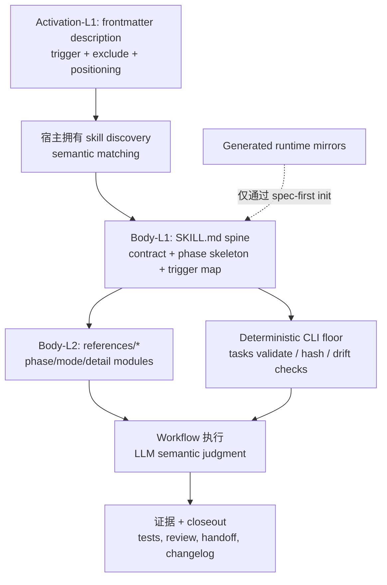
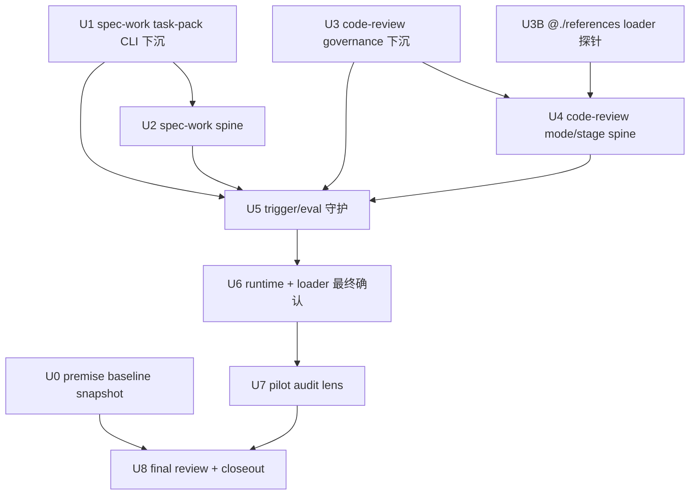

# refactor: 通过渐进披露精简 skill prompt

## 摘要

本计划把 spec-first 的长 skill prompt 从“主 `SKILL.md` 承载完整流程细节”调整为“轻 spine + 明确 STOP 触发 + 按需 references + deterministic CLI floor”。第一阶段以 `spec-work` 和 `spec-code-review` 为样板，验证瘦身不会丢失 source/runtime 边界、review/verification 纪律和 task-pack 执行安全。

---

## 决策摘要

- **推荐方案：** 第一刀先做最小、最可验证的 `spec-work` task-pack 校验 prose 下沉：让 prompt 消费 `spec-first tasks validate --json` 的 `deterministic_handoff` / `reason_code`，不再自然语言复写 hash/结构规则。它是行为承重的 ownership 迁移，不再误称为“只改 wording”。随后用 `spec-code-review` 做共享治理段落下沉样板，再进入两大 workflow 的完整 spine 重排；`retired-skill-review` rubric 在 pilot 后沉淀，不阻塞第一刀。
- **关键决策：** 主 `SKILL.md` 只保留 workflow contract、热路径 Body-L1 phase spine、Reference Trigger Map、hard boundary 和 CLI handoff；Body-L2 条件细节进入 `references/`；Body-L3 背景叙事直接删除；确定性校验用 CLI 输出而不是 prompt prose 重写。
- **验证重点：** 以 line-count budget、reference trigger tests、fresh-source eval、现有 workflow contract tests、`spec-first tasks validate --json` 行为和 runtime projection drift tests 共同验证。
- **最大风险 / 边界：** 最大风险是把内容搬到 `references/` 后触发失败，所以每次 extraction 必须配套 `trigger_condition`、`must_read`、`fallback_if_unread` 和 eval/test 锚点。不得手改 `.claude/`、`.codex/`、`.agents/skills/` 等 generated runtime mirrors。

---

## 问题框架

`docs/项目审查/2026-07-06-真实状态与提升优先级.md` 指出当前最高优先级问题不是代码质量，而是 skill prompt 膨胀：38 个 skill 合计 10,628 行，`spec-code-review/SKILL.md` 1,241 行，`spec-work/SKILL.md` 579 行。

需要区分两层 premise，避免把假设当既定事实：

- **已证实的维护性 premise（confirmed）：** 1,241 行单体、跨 6 个 skill 逐字重复的治理段落、超出 Anthropic 建议的 500 行上限——这些是 `wc -l` 与直接读源可复核的事实，是本计划的主要依据。
- **待验证的用户影响 premise（hypothesis）：** 「主 prompt 过重 → 挤压用户代码/plan/source/test context → 后置规则在长上下文中被漏读 → not-run 升高」是 origin（`origin_grade: legacy`、`origin_verification_status: not-applicable`）的推测性因果链，尚无 run-evidence 证实。本计划**不把它当既定事实**：pilot 只赌「维护性提升 + 行为无回归」，not-run 率与 review 质量改善的验证归后续 stats 计划（见 U0 baseline 与后续工作）。

这不是单纯压缩文字的问题。按 `docs/10-prompt/结构化项目角色契约.md`，正确方向是：

- Light contract：主入口保持轻、明确、可维护。
- Explicit boundaries：source-of-truth、generated runtime、provider、artifact、consumer 边界不能被瘦身稀释。
- Deterministic floor：脚本强制身份、hash、结构、drift 等确定性不变量；LLM 判断语义充分性。

因此，本计划的目标是重排 prompt 信息层级，而不是削弱治理。

---

## 2026-07-06 优化方案补充综合

`docs/项目审查/2026-07-06-skill-prompt-精简优化方案.md` 对本计划有三点应采纳的修正：

- **先复用已验证模式，而不是重新证明 progressive disclosure。** `spec-plan` 已经采用 `STOP. Before X, read references/Y.md` 的 spine + references 模式，并有 contract test 守护 runtime projection。后续实现应复制这个触发语气、路径投射断言和 reference integrity 检查，而不是发明新的 prompt-budget 机制。
- **先做 deterministic floor downshift。** `spec-work` task-pack intake 中重复描述 hash、`spec_id`、Task Pack Contract 结构等规则，是把脚本职责写回 prompt。第一个 workflow-prompt refactor PR 应先把这部分压成 CLI handoff contract：运行 `spec-first tasks validate <task-pack-path> --json`，只有 `deterministic_handoff: true` 才进入语义执行判断；失败时按 `reason_code` 停止并交还 handoff envelope。
- **治理下沉必须避免复制新的真相源。** `Runtime Context Exclusion` 的长路径清单不应原样复制到每个 skill 的 `governance-boundaries.md`。reference 只保留本 skill 的触发时机、例外和消费姿态；默认清单继续指向 `docs/contracts/context-governance.md`。

同时保留本计划原有的两条安全约束：

- 不能只凭“reference 文件存在”判断成功；每个迁移都要有 `trigger_condition`、`must_read`、`fallback_if_unread` 和至少一个 eval/test 锚点。
- 行数预算是 advisory budget，不是 completion gate。`spec-code-review` 第一阶段可参考 300-400 行作为现实预算，220/150 行只作为后续收敛方向；`spec-work` 可先完成 task-pack intake 与治理边界下沉，再观察实际 delta。真正的 completion gate 是边界保留、STOP trigger 覆盖、deterministic floor handoff、focused tests、fresh-source/runtime 验证和 honest closeout。

## Activation-L1 Description 维度：已拆分到 follow-up plan

`docs/项目审查/2026-07-06-skill-prompt-精简优化方案.md` §10-11 引入了与本计划 Body 正文瘦身**正交**的维度：**Activation-L1 description 索引税**（每次对话无条件付的常驻税，实测常驻 metadata 约 6,200 tokens）。

该维度触及 pilot 两个 skill 之外的多个 skill（description offender 压缩、`lint-skill-entrypoints` 系统级治理、相邻 workflow route collision fixtures），blast radius 与问题性质都不同于 Active body 瘦身。为让本计划回归「最小可验证第一刀」的单维度定位、closeout 只报 body 收益，**Activation-L1 维度（原 R11-R13 / U9-U11）已拆分到独立 follow-up plan**：

- `docs/plans/2026-07-06-002-refactor-skill-activation-index-governance-plan.md`

本计划（001）与 follow-up plan（002）的关系：

- 002 依赖 001 的 pilot 经验但**不阻塞** 001；001 的 body 瘦身可独立完成。
- 002 的 description token audit 可与 001 的 body 单元并行，作为索引层 before baseline。
- 002 不改 001 拥有的 `spec-work` / `spec-code-review` body spine 与 references。

本计划保留的核心边界与 002 一致：spec-first 只拥有 description 文本与 runtime 投射；L0/语义路由/skill 联邦归宿主拥有，明确拒绝自建。

---

## 需求

- R1. `spec-work/SKILL.md` 第一阶段先完成 task-pack deterministic floor downshift 与 reference trigger 化；完整 spine 重排以 ~200 行作为首轮现实 advisory budget，150 行为后续收敛方向。未达到预算时记录 line-count delta、未达原因和保留的承重文本，不阻断完成。
- R2. `spec-code-review/SKILL.md` 第一阶段优先下沉共享治理段落、mode/output 冷路径和 dispatch 细节；300-400 行是 advisory budget，220/150 行只作为后续收敛方向。未达到预算时记录 line-count delta、未达原因和保留的承重文本，不阻断完成。
- R3. 每个移入 `references/` 的 Body-L2 细节必须在主 spine 有确定性 STOP 触发，触发语句包含具体条件、目标 reference、继续执行前置性。注意：静态测试只能证明 STOP 触发语句**存在**于 spine；模型是否真的按触发读取 reference 属行为保证，依赖 fresh-source eval（见 P2-D 与测试/eval 验收），静态断言不替代行为验证。
- R4. Body-L3 背景叙事、通用建议、重复原则不得迁移到 references；删除后不应造成 phase 步骤、artifact contract 或 safety boundary 缺失。
- R5. task-pack identity、freshness、hash、Task Pack Contract 结构校验以 `spec-first tasks validate <path> --json` 为确定性入口；prompt 不再手写 hash 比对规则。
- R6. 语义判断仍留在 LLM：task quality、scope adequacy、review finding 成立性、implementation readiness 不下沉为脚本裁决。
- R7. `references/` 文件保留 source-owned，随 `spec-first init` 复制到 runtime；不得手改 generated runtime mirrors。
- R8. 变更必须补或更新聚焦 tests/evals，证明主 spine 预算、reference trigger、deterministic floor handoff 和 source/runtime boundary 没有漂移。
- R9. 方案必须兼容 Claude/Codex/Cursor/Kiro/Qoder 的 runtime projection，不引入 host-specific prompt truth source。
- R10. 变更必须同步 `CHANGELOG.md`；用户可见的 prompt 行为变化标注 `(user-visible)`。

> Activation-L1 索引维度需求（原 R11-R13：description 审计、新 skill 系统级治理、route collision 覆盖）已拆分到 follow-up plan `docs/plans/2026-07-06-002-refactor-skill-activation-index-governance-plan.md`（对应其 R-IDX-1 ~ R-IDX-3），不在本计划范围内。

---

## 范围边界

- 不新增新的 public workflow、skill 或 agent。
- 不新增新的 schema/contract 概念来替代已有 `retired-skill-review`、`spec-plan`、`spec-work`、`spec-code-review` 边界。
- 不做全量 38 个 skill 的机械瘦身；先完成 `spec-work` 和 `spec-code-review` 样板。
- 不把 generated runtime mirrors 当 source 修复；runtime drift 只通过 `spec-first init` 修复。
- 不让脚本判断语义充分性；脚本只输出 deterministic facts、reason_code、artifact path、exit code。
- 不把 stats/run evidence 消费层塞进本轮 prompt 瘦身实现；它是相邻高优先级计划，可在 prompt 样板稳定后单独推进。
- 不自建宿主级 L0 域索引路由引擎、语义向量 skill registry 或 skill 联邦；skill discovery/routing 是宿主 primitive，spec-first 只拥有 description 文本与投射，不重建宿主能力。
- 不做 Activation-L1 description 审计、压缩与 route collision fixtures；该正交维度已拆分到 follow-up plan `docs/plans/2026-07-06-002-refactor-skill-activation-index-governance-plan.md`。本计划只处理 Active body（触发后的正文）瘦身。

### 后续工作

- Activation-L1 description 索引治理：follow-up plan `docs/plans/2026-07-06-002-refactor-skill-activation-index-governance-plan.md`，承接 description token audit、新 skill 系统级治理与 route collision fixtures；可与本计划 body 单元并行，不阻塞本计划完成。
- `spec-first stats` / run evidence 消费层：单独计划，实现 `.spec-first/workflows/**/run.json` 趋势与 reason_code 汇总。**Committed trigger（防止无限 defer）：** U0 premise baseline 与 U8 closeout 一旦记录 before 分布，即创建该 stats 计划以采集 after，兑现 not-run/质量维度的验证——这是把 P1-A 假设从 hypothesis 推向 confirmed 的明确激活路径，不作为长期搁置的免责声明。
- Windows helper 迁移：单独计划，优先 `spec-code-review` base resolver Node 化。
- 首次体验 5 分钟闭环：单独计划，聚焦 init guidance、try/demo path 和 quick mode。
- Wave-2 rollout：只有 pilot closeout 产出最小 outcome bundle 后才创建或更新后续推广计划；不作为本轮 implementation unit。

---

## 完成标准

- `spec-work/SKILL.md` 不再在主 prompt 中复写 task-pack hash/structure 校验规则，且保留所有执行 hard boundaries。
- `spec-code-review/SKILL.md` 第一阶段记录 line-count delta 和未达预算原因，并保留 mode、安全、审查输出和 fallback 合同。
- 新增或更新的 references 均有主 spine STOP trigger，且 tests/evals 覆盖至少一个触发场景和一个不触发场景。
- task-pack intake 中 prompt 不再重复描述可由 `spec-first tasks validate --json` 判定的 hash/structure 细节。
- `npm run lint:skill-entrypoints`、相关 unit tests、`npm run typecheck` 通过。
- fresh-source eval 或等价 read-only reviewer 对两个样板确认：未丢失 source/runtime boundary、mutation gate、verification handoff、review handoff。
- 若运行 `spec-first init` 验证 runtime projection，必须确认只由 source 生成 runtime，未手改 generated mirrors。

## 质量不降级验收标准

这些验收标准用于判断 skill prompt 精简是否保持或提升 workflow 质量。行数下降、token 下降和 context-room delta 只作为经济性指标；不得作为 hard gate 替代边界保留、语义路由、执行纪律和可验证证据。

### Baseline 必须先建立

- 每个待改 skill 在修改前必须记录 Active body baseline：`SKILL.md` 行数、主 prompt 中 references 清单、每个 reference 的 STOP trigger。该 baseline 捕获由 U1（`spec-work`）和 U3（`spec-code-review`）在改动前作为首步执行，并在 U8 closeout 引用。
- 若 baseline 无法完整建立，closeout 必须记录 `baseline_degraded` 或更具体 reason_code。
- Activation-L1 description token baseline 与 route quality 不属于本计划；见 follow-up plan `docs/plans/2026-07-06-002-refactor-skill-activation-index-governance-plan.md`。

### Prompt 变更验收

- 只允许按 Body-L1 / Body-L2 / Body-L3 分类移动或删除内容：Body-L1 hard boundary、mutation/verification/handoff/source-runtime 纪律必须保留在主 spine；Body-L2 可移动到 reference，但必须有清晰 STOP trigger；Body-L3 重复解释、冗余例子或过期实现细节才可删除。
- 每个新增或移动后的 reference 必须在主 spine 有 STOP trigger，并至少覆盖一个触发场景和一个不触发场景；没有 STOP trigger 的 reference 视为不可验收。
- task-pack hash、结构、路径格式等 deterministic checks 可以下沉到 CLI/Jest；task quality、scope adequacy、route semantic adequacy、review finding 是否成立等语义判断仍归 LLM / fresh-source eval，不得由脚本裁决。
- `spec-first tasks validate --json` 只能成为 task-pack identity / freshness / structure 的 deterministic floor；不得把其输出解释为计划语义充分、任务拆分合理或可以跳过 reviewer judgment。

### 测试与 eval 验收

- Focused tests 必须覆盖两类形状：source prompt shape、runtime projection/path rewrite。Jest 或脚本只证明结构和覆盖。
- Fresh-source/read-only eval 必须覆盖 source/runtime boundary、mutation gate、verification handoff、handoff limitations、trigger precision；若未执行，closeout 必须写明 `fresh_source_eval_not_run` 及原因。
- Runtime projection 验证只能通过 source 生成结果观察；不得手改 `.claude/**`、`.codex/**` 或 `.agents/skills/**` 来制造通过。

### Rollout 与 closeout 验收

- Pilot 顺序保持 `spec-work` → `spec-code-review`；Wave-2 rollout 只有在 pilot closeout 产出 outcome bundle 后才允许进入后续计划。
- Closeout 必须报告 exact line-count delta、retained load-bearing text、moved references、测试/eval 命令、not-run/degraded limitation、generated runtime impact。
- 禁止把未运行的测试、未执行的 fresh-source eval、advisory evidence 或 transcript 声明写成 confirmed truth。

### 阻断条件

- 缺 baseline，且未记录 degraded reason。
- reference 没有主 spine STOP trigger。
- Body-L1 hard boundary 被删除或只藏入 reference。
- Jest/脚本试图裁决自然语言路由语义、任务质量或 review finding 是否成立。
- 手改 generated runtime mirror 作为修复或验证手段。
- fresh-source/read-only eval 未执行且 closeout 未记录 reason_code。
- **迁移/删除 main-spine load-bearing 文本（不可逆动作）而缺少 fresh-source eval 或等价 read-only 复核确认。** 未跑 eval 时本轮只允许**可逆动作**（新增 reference + STOP trigger），不得删除或迁移 spine 承重文本——把高 reversal-cost 动作 gate 在证据上，未验证则降级为可逆新增，而非放行。

---

## 直接证据准备度

- target_repo: `.`
- evidence_sources: direct source reads, `rg`, `find`, `wc -l`, Graphify query advisory, CodeGraph advisory, `spec-first internal task-governance-signals`, git status
- source_refs:
  - `docs/项目审查/2026-07-06-真实状态与提升优先级.md`
  - `docs/项目审查/2026-07-06-skill-prompt-精简优化方案.md`
  - `docs/10-prompt/结构化项目角色契约.md`
  - `skills/spec-work/SKILL.md`
  - `skills/spec-code-review/SKILL.md`
  - `skills/spec-plan/SKILL.md`
  - `skills/retired-skill-review/references/skill-authoring-quality.md`
  - `src/cli/commands/tasks.js`
  - `src/cli/task-pack.js`
  - `src/cli/plugin.js`
  - `src/cli/skill-path-rewrite-markers.js`
  - `tests/unit/spec-work-contracts.test.js`
  - `tests/unit/spec-code-review-contracts.test.js`
- current_revision: `12b96c8d`
- worktree_status: 本计划创建前工作树已 dirty；既有无关变更包括 `CHANGELOG.md`、`CLAUDE.md`、`skills/spec-mcp-setup/scripts/verify-tools.*`、`src/cli/commands/update.js` 及相关 tests
- confidence: source structure 和 line-count evidence 置信度高；runtime loader behavior 置信度中等，因为尚未运行真实 host invocation
- limitations: Graphify 和 CodeGraph 仅作为 provider_untrusted navigation 使用；尚未运行真实 host workflow invocation 或 fresh-source eval

---

## 直接证据

- repo_scope: current `spec-first` repo
- source_reads_completed:
  - 已读取 2026-07-06 审查报告和角色契约。
  - 已读取 `spec-work` 与 `spec-code-review` spine，以及 references 目录清单。
  - 已读取本计划所需的 `spec-plan` 规划 references。
  - 已读取 task-pack validator 与 runtime skill copy/drift 代码。
  - 已读取 `retired-skill-review` authoring quality rubric，作为 skill prompt 质量的现有 owner。
- source_reads_required:
  - 实施每个单元前，重新读取精确目标 skill 与 reference 文件，因为 prompt source 变化较快。
  - 修改断言前，重新读取受影响的 unit tests。
  - 如果 runtime 路径引用移动，重新读取 host adapter transforms。
- commands_or_tools_used:
  - `find skills -mindepth 2 -maxdepth 2 -name SKILL.md -print | xargs wc -l | sort -nr | head -20`
  - `skills/**/references` 下的 reference 目录清单
  - `spec-first internal task-governance-signals --source plan-declared --input <tmp> --json`
  - 用于 prompt 简化导航的 Graphify 查询
  - 用于相关 source 导航的 CodeGraph 查询
- impact_on_plan:
  - helper 返回 `candidate_level: deep`，reason code 包含 `cross-module`、`critical-path-hit` 和 `keyword-hit`。
  - `src/cli/plugin.js` 已经复制完整 skill 目录和 support files，因此 references extraction 不需要新的 runtime 机制。
  - `src/cli/commands/tasks.js` 已经暴露带 JSON 与 exit code 的 `tasks validate`，所以 `spec-work` 可以消费 deterministic task-pack validation，而不是重新描述它。
- key_findings:
  - 主 prompt 行数确认了审查报告的担忧：`spec-code-review` 1,241 行，`spec-work` 579 行，`spec-plan` 460 行，`spec-debug` 402 行。
  - `spec-code-review` 已有 1,233 行 reference，但仍在 main spine 保留完整 mode/stage prose，说明问题是缺 trigger discipline，而不是缺 references。
  - `spec-work` 已有 `references/shipping-workflow.md`，但 task-pack intake、branch/worktree setup、execution strategy 和 test strategy 仍然 always-loaded。
  - `skill-authoring-quality.md` 已把长 examples/rubrics 和缺 reference pointers 标为 P2 maintainability risk；应扩展这个现有 rubric，而不是新增 contract。
- limitations:
  - 在实现落地并收集 run evidence 前，无法直接测量 LLM output quality 或 not-run rate 的改善。
  - 外部文档仅作为 skill support files 可支持 progressive disclosure 的上下文确认；repo source 仍是实现权威。

---

## 上下文与调研

### 相关代码与模式

- `skills/spec-plan/SKILL.md` 是当前最好的本地 spine + STOP-triggered references 模式，尤其是 `governance-boundaries.md`、`reuse-analysis.md` 和 phase-specific references。
- `src/cli/plugin.js` 会带 transform 复制整个 skill 目录；`skillSupportFileIntegrityIssues` 会检查非 `SKILL.md` support files，因此移出的 references 仍属于 drift detection。
- `src/cli/skill-path-rewrite-markers.js` 会把 operational source skill paths 重写为 runtime paths，同时保留 source-of-truth marker lines。新的 reference pointers 必须写成该 transform 能处理的形式。
- `src/cli/task-pack.js` 校验 task-pack frontmatter、source plan path、`spec_id`、`source_plan_hash`、Task Pack Contract JSON、execution waves、task fields，并产出 `execution_focus`。
- `skills/retired-skill-review/references/skill-authoring-quality.md` 拥有 prompt writing quality vocabulary，应扩展 prompt-budget/progressive-disclosure audit signals。

### 已有经验

- `docs/项目审查/2026-05-07-skill-agent-prompt-expert-review.md` 已建议 main `SKILL.md` 保留 Purpose、Trigger、Non-trigger、Inputs、Outputs、Workflow skeleton、Failure Modes 和 References，并用显式 STOP triggers 延迟复杂细节。
- `docs/11-业界调研/spec-first-skills-优化方案-基于16个思维模型.md` 增加了 Body-L1/Body-L2/Body-L3 区分：Body-L1 留在 spine，Body-L2 带 deterministic STOP triggers 进入 references，Body-L3 删除。
- `docs/11-业界调研/spec-first-skills-优化方案-50轮深度审查报告.md` 提醒 progressive disclosure 的失败点是 trigger failure，而不是 reference 数量。每次 extraction 都需要 `trigger_condition`、`must_read`、`fallback_if_unread` 和 `eval_case`。

### 外部参考

- Anthropic Claude Code Skills documentation: `https://docs.anthropic.com/en/docs/claude-code/skills`
  - 仅作为 skill support files 可支持 progressive disclosure 的上下文依据；它不是 spec-first source-of-truth。

---

## 现有能力 / 复用分析

- **清单：** 现有 owner 包括 `skills/retired-skill-review/references/skill-authoring-quality.md`、`skills/spec-plan/references/plan-sections.md`、`src/cli/task-pack.js`、`src/cli/plugin.js` 和 workflow-specific reference directories。
- **决策：** 扩展现有 owner，而不是创建新的 prompt-budget contract 或 schema。audit rubric 拥有 skill quality language，各 workflow 拥有自己的 spine/reference split，CLI validator 拥有 deterministic task-pack facts。
- **真相源：** Source 变更位于 `skills/`、`src/cli/`、`tests/`、`docs/plans/` 和 `CHANGELOG.md`。
- **拒绝的 owner：** 不把 prompt-budget 规则放进 `docs/10-prompt/结构化项目角色契约.md`；角色契约拥有 value boundaries，不拥有 execution details。不把所有细节放进 `docs/contracts/context-governance.md`；该文档拥有 context exclusions 和 trust boundaries，不拥有 per-skill prompt architecture。
- **实现阶段复查：** 实现前重新运行 skill line counts，并检查最新 `spec-work` / `spec-code-review` 文本。如果其他分支已经瘦身目标 skill，优先扩展已有结构，而不是重新 extraction。

---

## 关键技术决策

- KTD1. 使用三层 Active body 模型：Body-L1 spine、Body-L2 on-demand references、Body-L3 deletion。
  - 理由：这与已有本地审查结论一致，并避免把 `references/` 变成堆放场。

- KTD2. 给长 workflow spine 增加 `Reference Trigger Map`（借鉴 + 新增，非纯复用）。
  - 理由：`spec-plan` 已验证的是**分散内联 STOP 触发**（`STOP. Before X, read Y`），并非集中式 trigger map；本计划借鉴其 STOP 触发语气与可测试性，并**新增**一个集中的 `Reference Trigger Map` 结构，让 references 更可发现、可测试；“if applicable” 这类分散 prose 已被识别为脆弱模式。集中 map 是新结构约定，需自带 contract test，不能声称是 spec-plan 现成模式的直接复用。

- KTD3. 把 STOP triggers 当作承重 contract text。
  - 理由：只有模型可靠知道何时必须读取 reference，reference 才能安全减少 context。Trigger wording 必须具体到可测试。

- KTD4. 消费 deterministic CLI validation，而不是重新描述 deterministic checks。
  - 理由：`spec-first tasks validate --json` 已经拥有 task-pack identity/freshness/structure。Prompt prose 应解释结果并执行 semantic readiness judgment，而不是重复 hash rules。

- KTD5. 把 semantic adequacy 留在 LLM-owned prompt space。
  - 理由：Task split quality、review gate necessity、implementation readiness 和 finding validity 都是 deterministic floor 之上的 semantic judgments。

- KTD6. 以 `spec-work` 作为第一个 pilot。
  - 理由：它有高用户影响、已有 references、清晰 CLI validation handoff，并与 run evidence 报告的 not-run 问题直接相关。

- KTD7. 以 `spec-code-review` 作为第二个 pilot。
  - 理由：它是最大的 skill，已经 reference-heavy，并暴露出其他 workflow skills 也会遇到的 mode/output/template extraction 问题。

- KTD8. 广泛 rollout 前先扩展 tests/evals。
  - 理由：没有 guardrails 时，prompt slimming 可能静默移除 safety boundaries。前两个 pilots 应定义可复用 test pattern。

- KTD9. 把 Activation-L1 routing quality 拆分为独立 follow-up plan，而不是本计划 body pilot 的一部分。
  - 理由：description tokens 是 always-loaded 的正交维度，touching 面超出 pilot 两个 skill；独立成 `docs/plans/2026-07-06-002-refactor-skill-activation-index-governance-plan.md` 让本计划 closeout 单维度、blast radius 可控。route semantics 仍归 host/LLM 拥有。

- KTD10. 把 `@./references` 宿主 loader 探针（U3B）前置到 U4 之前，而不是只在末尾 U6 验证。
  - 理由：`@./` eager-inline 是宿主特定行为（Claude import 语义，CLI 无展开逻辑）；只有先知道每个宿主是否 eager-inline，U4 才能在首轮就转换真正省 token 的 entry，而不是把 activation-token 收益全 gate 到 pilot 末尾。探针 read-only、可与其它单元并行，不增加 mutation 风险；U6 保留为最终投射确认。

---

## 待决问题

### 规划阶段已解决

- 是否应创建新的 prompt-budget schema？
  - 结论：不应。复用现有 audit rubric、skill source 和 tests。新增 schema 会违反审查报告“不要新增 contract/schema”的方向。

- 是否应直接更新 generated runtime assets？
  - 结论：不应。Source 变更进入 `skills/` 与相关 tests。若需要 runtime refresh，使用面向选定 host 的 `spec-first init`。

- 是否纳入 stats/run evidence consumption？
  - 结论：不纳入。它相邻且有价值，但应在 prompt slimming 形成可测量 before/after 后跟进。

### 延迟到实现阶段

- extraction 后的精确最终行数：
  - 延迟处理，因为它取决于 tests 和 fresh-source eval 后仍必须保留多少 contract text。

- `spec-code-review` 是否能在第一轮达到 150 行：
  - 延迟处理，因为 mode matrix 和 output envelope 可能需要两步 extraction，避免破坏 headless/autofix consumers。

- 小型 line-count test 应该是 hard 还是 advisory：
  - 延迟到实现阶段，在检查当前 test style 后决定。除非 strict threshold 是 completion criteria 的一部分，否则长期 workflow 优先使用 advisory thresholds。

---

## 高层技术设计

> *本图只展示目标方向，供审查理解，不是实现规格。实施 agent 应把它当作上下文，而不是需要逐字复现的代码。*

Activation path 总是支付 G 的成本，但 H 仍归宿主拥有。触发后，热路径默认只读 A；只有 A 的 STOP trigger 触发时才读取 B。它把 C 作为 confirmed deterministic facts 消费，并且永远不把 F 当作 source。

**收益边界（P2-1）：** 本计划做的是 B（A→B 的 body 下沉）。B 的**确定收益**是热路径可读性、维护性和减少长上下文漏读；而「activation-time context-room 下降」只在宿主激活 skill 后**惰性加载** B 时才成立——若某宿主把 `@./references` 当 eager-inline，则 body 下沉不省 activation token。因此 context-room 收益是 `contingent-on-loader-behavior`，**按宿主**判定：U3B loader 探针前置产出 per-host 事实（eager-inline / lazy / literal-text / not-projected），U4 据此在首轮转换可安全 lazy 的 entry，U6 做最终投射确认；未证明的宿主不写成 confirmed。G/H（Activation-L1 description 索引层）本身归 follow-up plan 002；此图仅作为分层理解上下文。

---

## 实施单元

> 注 1：`U1→U2` 与 `U3(+U3B)→U4` 是两条**独立链**，可并行；`spec-work → spec-code-review` 是推荐排程（先跑 work 复用经验），**非硬依赖**。U0（premise baseline）与 U3B（loader 探针）都是零改动的只读单元，可在任意时点先做；U3B 前置的目的是让 U4 首轮就能依 per-host loader 事实转换可安全 lazy 的 `@./` include，而不是把 token 收益全 gate 到 U6。
> 注 2：U8 是本计划终局 closeout，按依赖在 U0–U7 之后执行；单元编号与执行顺序一致。Activation-L1 索引维度（原 U9–U11）已拆分到 follow-up plan `docs/plans/2026-07-06-002-refactor-skill-activation-index-governance-plan.md`。

### U0. Premise baseline snapshot（thin，只读，零 source 改动）

**目标：** 在 pilot 前用**已存在**的 run evidence 建立一次性 before baseline，破解「pilot 无法自证痛点」的 self-sealing 问题。它不是 `spec-first stats` 消费层（那是独立后续计划），只做一次只读快照。

**需求：** R8（证据留存），支撑 P1-A premise 诚实化

**依赖：** 无（可最先做，或与任意单元并行）

**文件：**
- 新建：`docs/validation/2026-07-06-skill-prompt-slimming-premise-baseline.md`（advisory baseline artifact）
- 修改：`CHANGELOG.md`

**做法：**
- 只读扫描现有 `.spec-first/workflows/**/run.json`，记录当前 passed/not-run/failed/degraded 分布（origin 报告称约 26/18/5/3、not-run ~35%），作为 pilot 前的 advisory before 数字。
- 明确标注：这是 advisory snapshot，样本未按 workflow 分层、不构成因果证明；它的作用是让 pilot 后能有一个可对照的 before 值，而不是证明 prompt 瘦身能降 not-run。
- 不新建 CLI、不改 skill、不建消费层；若 run.json 不可读或样本过小，记录 `premise_baseline_degraded` 并继续，不阻断 pilot。

**遵循模式：**
- `docs/项目审查/2026-07-06-真实状态与提升优先级.md` §3.2 的 run evidence 分布统计口径。

**测试场景：**
- 正常路径：baseline artifact 产出可复算的 before 分布。
- 边界：样本不足或不可读时记 `premise_baseline_degraded`，不阻断。

**验证：**
- baseline artifact 存在且数据可复算；`npx jest tests/unit/changelog-format.test.js --runInBand`。

---

### U1. 将 deterministic task-pack checks 下沉到 CLI output

**目标：** 在保留 semantic safety 的同时，从 `spec-work` 中移除 task-pack hash/structure prose duplication。这是第一个 workflow-prompt refactor PR 候选，因为表面积最小；但它仍是从 prompt prose 到 CLI handoff 的行为承重 ownership migration。

**需求：** R1, R5, R6, R8

**依赖：** 无

**文件：**
- 修改：`skills/spec-work/SKILL.md`
- 新建或修改：`skills/spec-work/references/task-pack-intake.md`
- 修改：`tests/unit/spec-work-contracts.test.js`
- 仅当当前 JSON output 需要小型兼容性断言时修改：`tests/unit/task-pack-command.test.js`
- 修改：`CHANGELOG.md`

**做法：**
- 首步（body baseline）：改动前记录 `spec-work/SKILL.md` 行数、主 prompt references 清单、每个 reference 的 STOP trigger，供 U8 closeout 引用 delta。
- 让 `spec-work` 消费现有 validator shape：
  - exit `0` 且 `deterministic_handoff: true` 是 deterministic task-pack execution 的必要条件。
  - exit non-zero 或 `deterministic_handoff: false` 时，带 handoff envelope 停止。
  - invalid JSON 或缺少 expected fields 时，以 `task_pack_validation_unreadable` 或等价 degraded handoff 停止，而不是视作 semantic pass。
  - `reason_code` 作为 deterministic fact 报告，不重新解释为 semantic judgment。
  - `validity_scope: identity-freshness-structure-only` 保持可见，确保 LLM 仍检查 semantic posture。
- 用紧凑 STOP trigger 替代重复 prose：
  - `STOP. When the input is a task pack, run spec-first tasks validate <task-pack-path> --json and read references/task-pack-intake.md before creating execution tasks.`
- 在 prompt 中保留 semantic checks：
  - `semantic_posture`;
  - `dispatch_authorization`;
  - task `stop_if`;
  - review gate intent；
  - source plan scope 和 non-goals。
- 显式前提：假设目标宿主运行时 `spec-first` CLI 可用。CLI 缺失是 task-pack 执行的停止条件，以独立 reason_code（如 `task_pack_cli_unavailable`）停止并交还 handoff envelope，与 JSON 不可读的 `task_pack_validation_unreadable` 区分开。不要 fallback 到 prompt prose 手动重写 hash/structure checks。
- 边界：CLI 缺失只硬停 task-pack 执行路径；direct bare-prompt work 不依赖 task-pack validation，仍可继续（见 U2 边界测试），因此用户不会被完全阻塞。
- 除非当前 JSON 缺少 executor 真正需要的字段，否则不新增 CLI。

**遵循模式：**
- `src/cli/commands/tasks.js`
- `src/cli/task-pack.js`
- `skills/spec-plan/SKILL.md` STOP-trigger style
- `skills/spec-write-tasks/references/execution-handoff-contract.md`

**测试场景：**
- 正常路径：valid fixture task pack 通过 `spec-first tasks validate --json`，且 prompt contract 命名 `deterministic_handoff`。
- 错误路径：stale hash 或 wrong-chain fixture 拒绝执行，并路由到 regeneration/review。
- 错误路径：CLI unavailable 或 invalid JSON 会停止 deterministic task-pack execution，而不是在 prompt prose 中重建 validator logic。
- 边界：prompt 仍说明 deterministic handoff 对 semantic execution readiness 是必要但不充分条件。
- 边界：valid deterministic handoff 仍可被 semantic posture、`stop_if`、scope/non-goal 或 review-gate judgment 拒绝。

**验证：**
- `npx jest tests/unit/task-pack-command.test.js tests/unit/spec-work-contracts.test.js --runInBand`

---

### U2. 将 `spec-work` 精简为 pilot spine

**目标：** 在 task-pack CLI floor ownership 清晰后，把 `spec-work/SKILL.md` 转成第一个具体 progressive-disclosure execution sample。

**需求：** R1, R3, R4, R7, R8

**依赖：** U1

**文件：**
- 修改：`skills/spec-work/SKILL.md`
- 若 trigger map 需要细化，修改：`skills/spec-work/references/task-pack-intake.md`
- 新建：`skills/spec-work/references/execution-strategy.md`
- 新建：`skills/spec-work/references/feedback-and-tests.md`
- 仅当 closeout references 需要路径更新时修改：`skills/spec-work/references/shipping-workflow.md`
- 修改：`tests/unit/spec-work-contracts.test.js`
- 修改：`CHANGELOG.md`

**做法：**
- 在 main spine 中保留：
  - workflow contract 摘要；
  - 压缩形式的 Scenario Capability high-risk overrides；
  - input triage skeleton；
  - Reference Trigger Map；
  - mutation/source-runtime/verification/handoff boundaries；
  - triage、validation、execution、shipping handoff 的 phase skeleton。
- 将 branch/worktree/subagent/parallel dispatch rules 移到 `execution-strategy.md`。
- 将 Test Discovery、System-Wide Test Check、feedback loop 和 testing category details 移到 `feedback-and-tests.md`。
- 保留所有 spec-work-specific behavior 后，删除 generic Key Principles、Common Pitfalls 等 Body-L3 段落。

**遵循模式：**
- `skills/spec-plan/SKILL.md` STOP-trigger style.
- `skills/spec-work/references/shipping-workflow.md` existing late-phase reference.

**测试场景：**
- 正常路径：main `SKILL.md` 包含 `Reference Trigger Map`、`task-pack-intake.md`、`execution-strategy.md`、`feedback-and-tests.md` 和 `shipping-workflow.md` triggers。
- 边界情况：direct bare-prompt work 不读取 task-pack intake 仍可继续。
- 错误路径：task-pack execution 文本仍通过 CLI validation handoff 拒绝 stale/unverifiable packs。

**验证：**
- `tests/unit/spec-work-contracts.test.js` passes.
- 在 closeout 中记录 line-count delta 和任何 advisory-budget shortfall；不要只为满足 budget 删除 load-bearing text。

---

### U3. 下沉 `spec-code-review` shared governance prose

**目标：** 在移动详细 mode/stage flow 前，以 `spec-code-review` 作为 shared-governance extraction sample。

**需求：** R2, R3, R4, R8, R9

**依赖：** 无

**文件：**
- 修改：`skills/spec-code-review/SKILL.md`
- 新建：`skills/spec-code-review/references/governance-boundaries.md`
- 修改：`tests/unit/spec-code-review-contracts.test.js`
- 仅当新的 reference path handling 尚未覆盖时，修改 runtime projection/path rewrite tests
- 修改：`CHANGELOG.md`

**做法：**
- 首步（body baseline）：改动前记录 `spec-code-review/SKILL.md` 行数、主 prompt references 清单、每个 reference 的 STOP trigger，供 U8 closeout 引用 delta。
- 仅在 Runtime Context Exclusion、Capability-Class Evidence Boundary、Summary-First Handoff、Cache-Friendly Context Layout、Direct Evidence Boundary、Anti-Rationalization Red Flags 等 repeated governance blocks 属于 cold-path 或 cross-skill repeated 时移动它们。
- 在 spine 中保留紧凑 STOP trigger：
  - when broad context, external capability evidence, runtime mirror exclusion, or summary-first handoff is relevant, read `references/governance-boundaries.md` before continuing.
- 在 reference 中，不复制完整 generated mirror denylist。指向 `docs/contracts/context-governance.md` 作为 source of truth，只记录 `spec-code-review`-specific posture 和 exceptions。
- 在 U4 用 targeted tests 移动它们前，保留 hot-path review identity、severity/finding output obligations、source/runtime boundary、dispatch authorization boundary 和 report-only/headless mode safety 于 main spine。

**遵循模式：**
- `skills/spec-plan/SKILL.md`
- `skills/spec-plan/references/governance-boundaries.md`
- `tests/unit/spec-plan-contracts.test.js`

**测试场景：**
- 正常路径：main `SKILL.md` 包含指向 `governance-boundaries.md` 的 STOP trigger。
- 边界：`governance-boundaries.md` 引用 `docs/contracts/context-governance.md`，而不是复制完整 generated mirror path list。
- 错误路径：移除 trigger 或 reference path 会让聚焦 contract test 失败。

**验证：**
- `npx jest tests/unit/spec-code-review-contracts.test.js --runInBand`
- 在 closeout 中记录 line-count delta 和任何 advisory-budget shortfall；不要只为满足 budget 删除 load-bearing text。

---

### U3B. `@./references` 宿主 loader 行为前置探针（read-only）

**目标：** 在 U4 把任何 `@./references` eager include 转成 lazy STOP-trigger **之前**，先建立 per-host loader 事实：每个目标宿主是在激活时 eager-inline `@./references`，还是 lazy 解析 / 按字面文本处理 / 根本不投射该 surface。这决定哪些转换真正节省 activation token、哪些安全，让 code-review 首轮就能在已证明 eager-inline 的宿主上兑现 token 收益，而不是把全部收益 gate 到末尾的 U6。

**需求：** R7, R9（宿主兼容/runtime 投射），支撑 P1-B 收益前置

**依赖：** 无（read-only，可与 U1/U3 并行先做）

**文件：**
- 读取（不改）：`src/cli/plugin.js`、`src/cli/skill-path-rewrite-markers.js`、各 host adapter（`src/cli/adapters/*`）
- 新建：`docs/validation/2026-07-06-at-references-loader-probe.md`（per-host loader 事实表）
- 仅当需要固化探针断言时新增：`tests/unit/`（projection/inline 行为的只读断言）
- 修改：`CHANGELOG.md`

**做法：**
- 通过直接读源 + `spec-first init` dry-run / plan tests（不写 runtime）确定每个宿主对 `@./references` 的处理，产出事实表：`{host: eager-inline | lazy-resolve | literal-text | not-projected}`。
- 解读收益含义：eager-inline 的宿主上「转 lazy STOP-trigger」才省 activation token（转换候选）；literal-text / lazy / not-projected 的宿主上该 reference 本就不占 activation 预算，转换不省 token（但仍可为可读性做）。
- 若某宿主行为无法 read-only 证明，记 `loader_behavior_degraded:<host>`，该宿主对应的 `@./` entries 在 U4 保持显式、不转换。
- 只产事实，不改 skill 文本；结论交给 U4 分类与 U6 最终确认。

**遵循模式：**
- `src/cli/plugin.js`、`src/cli/skill-path-rewrite-markers.js`
- `tests/unit/init-source-path-coverage.test.js` 只读投射断言风格

**测试场景：**
- 正常路径：事实表覆盖 Claude/Codex/Cursor/Kiro/Qoder 五宿主的 `@./references` 处理判定。
- 边界：无法证明的宿主记 `loader_behavior_degraded:<host>`，不阻断。
- 错误路径：探针只读；任何需要写 runtime 才能判定的项标 degraded，不手改 generated mirror 制造结论。

**验证：**
- loader 事实表存在且可复算；`npx jest tests/unit/init-source-path-coverage.test.js --runInBand`（若新增只读断言）。

---

### U4. 围绕 mode 与 stage triggers 精简 `spec-code-review`

**目标：** 在 shared governance 安全迁移、且 U3B 已产出 per-host `@./references` loader 事实后，把最大 prompt 转为带 mode-specific references 的显式 review spine，并**依据 loader 事实在首轮就转换已证明可安全 lazy 的 eager include**。

**需求：** R2, R3, R4, R8, R9

**依赖：** U3, U3B

**文件：**
- 修改：`skills/spec-code-review/SKILL.md`
- 新建：`skills/spec-code-review/references/mode-rules.md`
- 新建：`skills/spec-code-review/references/scope-resolution.md`
- 新建：`skills/spec-code-review/references/dispatch-and-synthesis.md`
- 新建：`skills/spec-code-review/references/headless-output-format.md`
- 修改现有文件：`skills/spec-code-review/references/review-output-template.md`
- 修改：`tests/unit/spec-code-review-contracts.test.js`
- 如果 dispatch text 移动，修改：`tests/unit/spec-dispatch-boundary-contracts.test.js`
- 修改：`CHANGELOG.md`

**做法：**
- 删除 `## Included References` block 前，将每个现有 `@./references/...` entry 分类为：
  - required eager include / host loader contract；
  - ordinary markdown path hint；
  - STOP trigger replacement 的安全候选。
- 证据必须基于 source/test/runtime，不能从文件名推断。如果证据不可用，保留 schema/template-like references（`findings-schema.json`、`subagent-template.md`、persona catalog、output template）于 main spine，或记录 `loader_behavior_degraded`，并且不删除 load-bearing text。
- 在 main spine 中保留：
  - review contract 摘要；
  - severity scale；
  - mode detection table；
  - action routing summary；
  - reviewer selection summary；
  - Reference Trigger Map；
  - 压缩形式的 direct evidence 与 capability-class boundary；
  - fallback summary。
- 将 mode-specific rules 移到 `mode-rules.md`。
- 将 scope/base detection 与 PR/branch/base handling 移到 `scope-resolution.md`。
- 将 Stage 4 dispatch、runtime readiness preflight、model tiering、run-id、merge/dedupe、validation pass 移到 `dispatch-and-synthesis.md`。
- 将大型 headless output envelope 移到 `headless-output-format.md`。
- 依据 U3B 的 per-host loader 事实转换 `@./references/...` entries：对 U3B 判定为 eager-inline 且转 lazy 安全的 entry，本轮即可转成 STOP-trigger（首轮兑现 token 收益）；U3B 记为 `loader_behavior_degraded:<host>` 或行为未证明的 entry 保持显式，留待 U6 最终确认。Required schema/template entries（`findings-schema.json`、`subagent-template.md`、persona catalog、output template）在证据不足时仍保持显式。
- **可逆/不可逆分级（P2-D）：** 从 main spine **删除或迁移 load-bearing 文本**属不可逆动作，必须有 fresh-source eval 或等价 read-only 复核确认后才执行；eval 未跑时本单元只做**可逆的 reference 新增 + STOP trigger**，spine 承重文本原地保留，delta 记为「gated-pending-eval」。

**遵循模式：**
- 现有 `skills/spec-code-review/references/persona-catalog.md`
- 现有 `skills/spec-code-review/references/subagent-template.md`
- `skills/spec-plan/SKILL.md` trigger style

**测试场景：**
- 正常路径：extraction 后 interactive review 保留 safe-auto/gated/manual/human/release routing semantics。
- 边界情况：`mode:report-only` 仍然 read-only，且不写 review artifact dirs。
- 错误路径：conflicting mode flags 在 dispatch 前停止。
- 边界：Codex dispatch authorization rules 保持可见且完整。
- 边界：未分类 runtime role 的 `@./references` entries 不被移除。

**验证：**
- `npx jest tests/unit/spec-code-review-contracts.test.js tests/unit/spec-dispatch-boundary-contracts.test.js --runInBand`
- 在 closeout 中记录 line-count delta 和任何 advisory-budget shortfall；不要只为满足 budget 删除 load-bearing text。

---

### U5. 增加 trigger reliability tests 与 eval fixtures

**目标：** 用 trigger behavior 验证 progressive disclosure，而不是只验证 references 存在。

**需求：** R3, R4, R8

**依赖：** U1, U2, U3, U4

**文件：**
- 修改：`tests/unit/spec-work-contracts.test.js`
- 修改：`tests/unit/spec-code-review-contracts.test.js`
- 如果 eval fixture coverage 在其中跟踪，修改：`tests/unit/workflow-eval-readiness-contracts.test.js`
- 新增或修改（body trigger/no-trigger fixtures，沿用现有 `examples.json` 家族）：`skills/spec-work/evals/examples*.json`、`skills/spec-code-review/evals/examples*.json`

> **与 follow-up plan 002 的共享目录协调（P2-C）：** 本单元的 body trigger/no-trigger fixtures 使用 `examples*.json` 命名；002 U-IDX-3 的 route-collision fixtures 使用独立前缀 `route-collision-*.json`。两者同目录不同命名家族，避免同 glob 覆盖或归属混淆。

**做法：**
- 增加 static assertions 覆盖：
  - main spine line budget；
  - `Reference Trigger Map` 存在；
  - 每个 moved reference 都被 STOP trigger 命名；
  - U4 已将 on-demand loading 判定为目标的 spines 中，不存在 stale `@./references` eager include block；
  - 不存在直接编辑 generated runtime 的指令。
- 增加 eval fixtures 覆盖：
  - task-pack input 必须读取 task-pack intake；
  - bare prompt 默认不得读取 task-pack intake；
  - parallel dispatch 必须读取 execution strategy；
  - headless review 必须读取 headless output format；
  - report-only review 必须保持 read-only。

**遵循模式：**
- `skills/using-spec-first/evals/*`
- `skills/spec-write-tasks/evals/*`
- `tests/unit/spec-plan-contracts.test.js` reference-binding style

**测试场景：**
- 正常路径：每个 moved reference 都有且只有一个清晰 trigger source。
- 错误路径：缺失 STOP trigger 会让聚焦 unit test 失败。
- 边界：删除 Body-L3 prose 不要求 eval，除非行为发生变化。

**验证：**
- Targeted unit tests 通过。
- 如果 repo 已有 touched fixture family 的 runner，eval fixture tests 通过。

---

### U6. 验证 runtime projection、loader behavior 和 source/runtime boundary

**目标：** 在 U3B loader 探针的 per-host 事实基础上做**最终确认**：source prompt restructuring 正确投射到所有 generated runtime surfaces，moved references 在目标 host runtime 触发时可用，且 U4 依 U3B 做的 eager→lazy 转换在实际投射中站得住。

**需求：** R7, R9, R10

**依赖：** U1, U2, U3, U3B, U4, U5

**文件：**
- 如果 new reference assertions 属于这里，修改：`tests/unit/init-source-path-coverage.test.js`
- 仅当 path rewriting assertions 需要更新时修改：`tests/unit/skill-path-rewrite-guard.test.js`
- 仅当 runtime plan expectations 变化时修改：`tests/unit/runtime-plan-contracts.test.js`
- 仅当 `@./references` handling 或 path rewriting 变化时，修改 host adapter tests
- 修改：`CHANGELOG.md`
- 不编辑 generated runtime mirrors

**做法：**
- 确认 `src/cli/plugin.js` 仍复制 moved references。
- 确认 operational `skills/<skill>/references/...` pointers 在 runtime copies 中正确 transform。
- 增加或更新 assertions，确保 newly moved reference paths 在 Claude、Codex、Cursor、Kiro、Qoder 的 rendered skill/runtime plans 中被覆盖（仅限该 host 会投射该 workflow surface 的场景）。
- 除非 runtime verification 必须写 runtime assets，否则运行 init dry-run 或 plan tests。
- 每个 pilot workflow 增加一个 projected-runtime smoke 或等价 fresh-source runtime bundle check：
  - triggering input 证明 moved reference content 可达且被使用；
  - non-triggering input 证明在 host 支持 lazy loading 时，长 reference content 不会 default-loaded；
  - 如果无法运行，记录 `runtime_reference_smoke_degraded`，且不移除对应 load-bearing main-spine text。
- 如果实际需要 runtime regeneration，用显式 host flags 运行 `spec-first init`，并记录为 generated output，不记录为 source。
- 复核 U3B loader 事实表与本单元投射结果一致；若某 host 的 `@./references` loader behavior 在 U3B 或此处仍未被证明，记录 `loader_behavior_degraded:<host>`，并在 main spine 保留对应 schema/template/reference pointer（U4 已按此保持显式，此处做最终确认）。

**遵循模式：**
- `src/cli/plugin.js`
- `src/cli/skill-path-rewrite-markers.js`
- `tests/unit/init-source-path-coverage.test.js`
- `tests/unit/skill-path-rewrite-guard.test.js`

**测试场景：**
- 正常路径：new references 下的 support files 被纳入 runtime integrity checks。
- 边界情况：source-of-truth lines 在预期位置保留 `skills/<skill>/...`。
- 边界：每个 supported host 都有 rendered-path assertion 或显式 degraded reason。
- 边界：triggered runtime/fresh-source scenario 可以在使用 guidance 前读取 moved reference。
- 错误路径：runtime path rewrite drift 被现有 guard tests 检测。

**验证：**
- `npx jest tests/unit/init-source-path-coverage.test.js tests/unit/skill-path-rewrite-guard.test.js tests/unit/runtime-plan-contracts.test.js --runInBand`
- `npm run lint:skill-entrypoints`

---

### U7. 将 pilot 经验沉淀到 skill audit lens

**目标：** 在 pilots 产出具体样例后，用 reusable prompt-slimming signals 更新现有 skill-review rubric。这不再阻塞 U1/U3，因为第一刀直接复用已验证的 `spec-plan` 模式。

**需求：** R1, R2, R3, R4, R8

**依赖：** U6

**文件：**
- 修改：`skills/retired-skill-review/references/skill-authoring-quality.md`
- 修改：`tests/unit/retired-skill-review-contracts.test.js`
- 如果当前 assertions 位于其中，修改：`tests/unit/skill-agent-quality-governance-contracts.test.js`
- 修改：`CHANGELOG.md`

> **与 follow-up plan 002 的共享文件协调（P2-C）：** `skill-authoring-quality.md` 由本单元 U7 **拥有并建立** prompt-slimming（body）lens 的 section 结构；002 U-IDX-3 的 route-index lens 只以**追加子节**方式加入、不重写本单元建立的结构。若两计划同期活跃，U7 先落地建立 rubric 骨架，002 随后 append，避免同文件 + 同 contract test 的并发编辑冲突。

**做法：**
- 基于 U1-U6 outcomes 增加一个简洁 prompt-slimming quality lens：
  - Body-L1 spine：contract、triggers、hot-path phase skeleton、hard boundaries。
  - Body-L2 reference：带 deterministic STOP trigger 的 conditional detail。
  - Body-L3 deletion：background principles、generic advice、duplicate warnings。
- 用 prose 定义每个 moved reference 的最小字段：`trigger_condition`、`must_read`、`fallback_if_unread`、`eval_case`。
- 增加警告：line-count budgets 是 advisory，不能覆盖 source/runtime、mutation、verification 或 handoff boundaries。
- 保持为 audit/review vocabulary，不变成 schema，也不新增 public workflow。

**遵循模式：**
- 本计划 U1-U6 的结果。
- `skills/retired-skill-review/references/skill-authoring-quality.md`
- `docs/11-业界调研/spec-first-skills-优化方案-基于16个思维模型.md`

**测试场景：**
- 正常路径：long main spine 且没有 reference trigger map 的 skill 被分类为 progressive-disclosure risk。
- 边界情况：轻量 read-only skill 不被强制增加 heavyweight reference maps。
- 错误路径：列出但没有 trigger 的 reference 仍是 P2 maintainability signal。

**验证：**
- Relevant unit tests 通过。
- 新 rubric 不引入新的 formal schema/contract requirement。

---

### U8. 最终审查、fresh-source eval 与 outcome-gated closeout

**目标：** 用可信证据、显式 adoption handoff 和清晰 outcome gate 收束 prompt slimming sample，并决定是否允许任何 wave-2 work。

**需求：** R8, R9, R10

**依赖：** U0-U7（含 U3B）

**文件：**
- 修改：`CHANGELOG.md`
- 可选：如果 verification evidence 足够值得保留，新增 `docs/validation/<date>-skill-prompt-slimming-validation.md`

**做法：**
- 运行 focused checks：
  - `npm run typecheck`
  - `npm run lint:skill-entrypoints`
  - U1-U7 的 targeted jest suites
  - `git diff --check`
- 对 changed skill behavior 运行 fresh-source eval 或等价 read-only reviewer：
  - 确认 trigger precision；
  - 确认 source/runtime boundary；
  - 确认 deterministic-vs-semantic split；
  - 确认没有 generated runtime hand edit。
- 如果 fresh-source eval 不可用，记录 `fresh_source_eval_not_run` 和具体原因。不要声称它已通过。
- 记录 pilot outcome bundle：
  - exact line-count delta（确定可测的经济性指标）；
  - **按宿主分别记录** approximate context-room delta：Claude 惰性加载 references 时才有 activation-time 节省，其它宿主（Codex/Cursor/Kiro/Qoder）若把 `@./references` 当字面文本则无 activation 节省；标注为 `contingent-on-loader-behavior`，与 line-count delta 分开报告，不合并成单一数字；
  - `spec-code-review` 依 U3B loader 事实分宿主报告：对 eager-inline 宿主，U4 首轮转换的 `@./` include 记为已兑现 token 收益；对 `loader_behavior_degraded` 或未证明宿主，对应 entry 保持显式、收益记为 `gated-pending-loader-facts`，不把 line-count delta 误报为 token 收益；
  - trigger/eval/static-test results；
  - fresh-source/runtime smoke result 或 degraded reason；
  - created references 清单，以及有意保留的 load-bearing text；
  - 引用 U0 premise baseline 的 before 分布；若有 pilot 后可比数据则并列 after，否则显式声明「not-run/质量 after 仍需 stats 计划采集」；
  - 明确 pilot 成功判据 = 边界保留 + 行为无回归 + 行数/结构 delta 记录；not-run 率下降、review 质量改善等收益需后续 stats plan 验证，**不是本计划的验收项**；
  - 明确说明 run-evidence consumption 仍 deferred，并链接或记录 follow-up stats plan；
  - Activation-L1 description/route 收益不在本 bundle，见 follow-up plan `docs/plans/2026-07-06-002-refactor-skill-activation-index-governance-plan.md` 的 closeout。
- 除非 pilot outcome bundle 表明该模式足够安全、可推广，否则不要创建 wave-2 rollout checklist。如果证据不足，以 `wave2_blocked_pending_pilot_evidence` 收尾。
- 增加 adoption handoff：明确说明本计划不解决 5 分钟 first-experience loop；若 owner approval 存在，则链接或创建 follow-up plan。

**遵循模式：**
- `docs/contracts/workflows/fresh-source-eval-checklist.md`
- 现有 changelog compact style

**测试场景：**
- 正常路径：changed skill prompts 保留 documented workflow behavior，并通过 focused tests。
- 错误路径：任何 failed test 或 missing fresh-source eval 都在 closeout 中以 not-run/failed 暴露，不隐藏。

**验证：**
- Final closeout 命名实际运行的 commands 和 limitations。

---

## 系统级影响

- **交互图：** `spec-work` 会流向 `spec-code-review`、`spec-write-tasks`、`spec-compound`、release notes 和 human handoffs。`spec-code-review` 会流向 PR readiness、residual handling 和 work closeout。即使没有 JS 代码变更，prompt 变更也会影响 downstream behavior。
- **错误传播：** 缺失 STOP trigger 可能变成静默 behavioral regression。Tests 必须在 reference triggers 缺失时失败，而不是依赖 reviewer 记忆。
- **状态生命周期风险：** Plans 和 task packs 仍是 source artifacts；execution progress 留在 git/run evidence。Prompt slimming 不能重新引入 plan progress state。
- **API surface parity：** Public workflow entry names 保持 `spec-*`；runtime delivery 仍是 host projection。不引入 host-specific workflow product surface。
- **覆盖面：**
  - `skills/`: in-scope
  - `src/cli/task-pack.js`: in-scope only if JSON output needs small compatibility assertions
  - `src/cli/plugin.js`: read/verify in-scope; modify only if runtime projection tests prove required
  - `.claude/**`, `.codex/**`, `.agents/skills/**`: out-of-scope as generated runtime mirrors
  - README/user docs: deferred unless prompt behavior changes require user-facing docs
- **集成覆盖：** Static tests 必须覆盖 source prompt shape 和 runtime projection。Fresh-source/read-only eval 必须覆盖 semantic behavior。Activation-L1 route fixture 覆盖归 follow-up plan 002。
- **不变不变量：** Scripts 产出 deterministic facts；LLM 拥有 semantic adequacy。Source/runtime boundary 保持不变。

---

## 风险与依赖

| 风险 | 缓解措施 |
|------|------------|
| References 被移动但需要时未读取 | 为每个 moved reference 增加显式 STOP triggers、trigger map 和 eval/test cases。 |
| Prompt line-count advisory budget 被误当成 hard target | 使用 Body-L1/Body-L2/Body-L3 分类和 fresh-source eval；只删除 Body-L3，移动 Body-L2，保留 Body-L1。Completion gates 是 boundary preservation 与 verified behavior，不是 line count。 |
| `spec-code-review` headless/autofix consumers 被破坏 | 删除 main-spine text 前，先用 mode-specific tests 把 output/mode details 移入 references。 |
| 新 references 导致 runtime path rewrites 漂移 | 运行 path rewrite 与 runtime plan tests；避免使用 `skill-path-rewrite-markers.js` 未覆盖的 source path formats。 |
| Deterministic floor downshift 过度侵入 semantic decisions | 保持 `validity_scope: identity-freshness-structure-only` 可见；保留 semantic posture 和 review gate prose。 |
| 移除 prose 后 CLI 缺失使 task-pack 执行完全罢工（P3-3） | 显式声明 CLI 可用性前提；CLI 缺失以 `task_pack_cli_unavailable` 停止并交还 handoff，bare-prompt work 不受影响；实现前可提示 `spec-first doctor` 前置检查，但仍不 fallback 到 prose 重写校验。 |
| 既有 dirty worktree changes 与本实现冲突 | 保持 edits scoped；绝不 revert unrelated changes；编辑前重新读取 touched files。 |
| 外部 references 变成新的 truth source | 仅把 external docs 当作 advisory；repo source 和角色契约治理决策。 |
| 收益依赖未验证的宿主 lazy-load 行为（P2-1） | body 下沉的确定收益是热路径可读性/维护性/减少长上下文漏读；activation-time context-room 下降是 contingent-on-loader-behavior，由 U3B loader 探针**前置**产出 per-host 事实、U4 据此转换、U6 最终确认；未证明的宿主标 `loader_behavior_degraded:<host>` / `runtime_reference_smoke_degraded` 并保留 load-bearing text。 |

---

## 已考虑的替代方案

- **一次性机械压缩所有 skill prompts：** 拒绝。它最大化 churn，并让 regressions 难以归因。
- **自动 LLM prompt compression：** 拒绝。它可能节省 tokens，但不能证明 workflow safety 或 boundary preservation。
- **新增 prompt-budget schema/contract：** 本阶段拒绝。现有 skill-review rubric 和 focused tests 足够，审查报告也明确警告不要新增 contract/schema。
- **只把文本移到 references 而不加 tests：** 拒绝。既有审查指出 trigger failure 才是真正的 progressive-disclosure failure mode。

---

## 成功指标

- `spec-work/SKILL.md`：第一轮 workflow-prompt refactor 移除重复的 task-pack deterministic validation prose，并记录 line-count delta；`spec-work` 首轮现实预算 ~200 行，150 行为后续收敛方向；均为 advisory budget，不是 completion gate。
- `spec-code-review/SKILL.md`：第一轮 governance pass 移除重复的 cross-skill governance prose，并记录 line-count delta；300-400 行是 advisory first-pass budget，220/150 只作为后续 convergence targets。
- context-room delta 作为经济性指标**按宿主分别记录**，标注为 `contingent-on-loader-behavior`：仅在宿主激活后惰性加载 references 时成立（Claude `@./` inline 场景需转 lazy 才有节省；其它宿主若按字面文本处理则无 activation 节省）；与 line-count delta 分开，不作为 hard gate。
- `spec-code-review` 首轮预期：U3B loader 探针前置后，对 U3B 判定为 eager-inline 的宿主，U4 首轮即可转换对应 `@./` include 并兑现 activation-token 收益；U3B 记 `loader_behavior_degraded:<host>` 或行为未证明的宿主对应 entry 保持显式，其收益标为 `gated-pending-loader-facts`。不得把 line-count delta 误报为 token 收益。
- 每个 new reference 都有对应 STOP trigger，且至少有一个 trigger/no-trigger test 或 eval case。
- `spec-first tasks validate --json` 是 `spec-work` prompt text 中唯一的 task-pack hash/structure validation authority。
- Focused test suite 通过，且不手改 generated runtime mirrors。
- pilot 成功判据是**边界保留 + 行为无回归 + 行数/结构 delta 记录**；not-run 率下降与 review 质量改善需后续 stats plan 验证，不在本计划验收范围。
- Post-implementation closeout 诚实报告 exact line-count deltas、retained load-bearing text、outcome bundle，以及 not-run/failed verification。
- Activation-L1 description token 与 route collision 指标不在本计划，见 follow-up plan `docs/plans/2026-07-06-002-refactor-skill-activation-index-governance-plan.md`。

---

## 文档 / 操作说明

- 每次 source change 都更新 `CHANGELOG.md`。
- 除非 public workflow invocation 或 user-facing behavior 变化超出 internal prompt quality，否则不需要更新 README。
- 如果为验证执行 runtime regeneration，明确记录 generated runtime impact 和 host flags。
- 如果实现产出关于 prompt size 和 run outcomes 的有意义 before/after evidence，可考虑后续 validation report。

---

## 来源与参考

- 原始审查：`docs/项目审查/2026-07-06-真实状态与提升优先级.md`
- 优化审查：`docs/项目审查/2026-07-06-skill-prompt-精简优化方案.md`
- 角色契约：`docs/10-prompt/结构化项目角色契约.md`
- 早期 prompt 审查：`docs/项目审查/2026-05-07-skill-agent-prompt-expert-review.md`
- progressive disclosure 深度审查：`docs/11-业界调研/spec-first-skills-优化方案-50轮深度审查报告.md`
- 16 模型优化报告：`docs/11-业界调研/spec-first-skills-优化方案-基于16个思维模型.md`
- work skill source：`skills/spec-work/SKILL.md`
- code review skill source：`skills/spec-code-review/SKILL.md`
- skill audit rubric：`skills/retired-skill-review/references/skill-authoring-quality.md`
- Task-pack CLI：`src/cli/commands/tasks.js`
- Task-pack validator：`src/cli/task-pack.js`
- Runtime skill projection：`src/cli/plugin.js`
- Runtime path rewrite guard：`src/cli/skill-path-rewrite-markers.js`
- 外部上下文：`https://docs.anthropic.com/en/docs/claude-code/skills`
