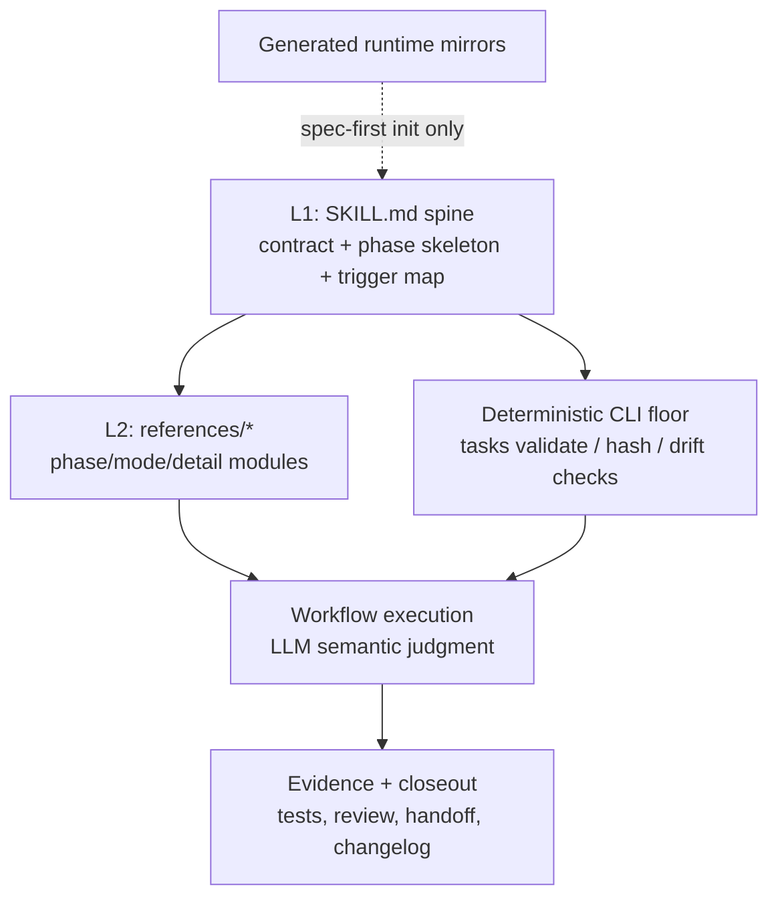
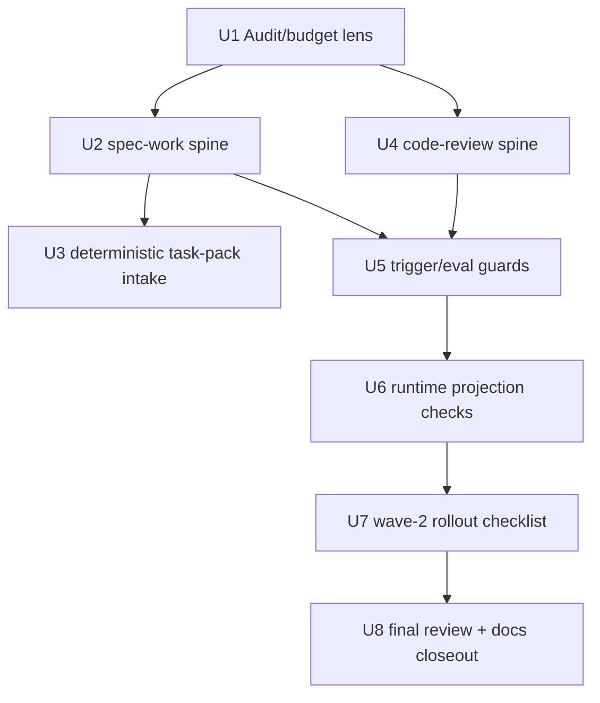

# refactor: Slim skill prompts with progressive disclosure

## Summary

本计划把 spec-first 的长 skill prompt 从“主 `SKILL.md` 承载完整流程细节”调整为“轻 spine + 明确 STOP 触发 + 按需 references + deterministic CLI floor”。第一阶段以 `spec-work` 和 `spec-code-review` 为样板，验证瘦身不会丢失 source/runtime 边界、review/verification 纪律和 task-pack 执行安全。

---

## Decision Brief

- **Recommended approach:** 第一刀先做最低风险、最高确定性的 `spec-work` task-pack 校验 prose 下沉：让 prompt 消费 `spec-first tasks validate --json` 的 `deterministic_handoff` / `reason_code`，不再自然语言复写 hash/结构规则。随后用 `spec-code-review` 做共享治理段落下沉样板，再进入两大 workflow 的完整 spine 重排。
- **Key decisions:** 主 `SKILL.md` 只保留 workflow contract、热路径 phase spine、Reference Trigger Map、hard boundary 和 CLI handoff；L2 条件细节进入 `references/`；L3 背景叙事直接删除；确定性校验用 CLI 输出而不是 prompt prose 重写。
- **Validation focus:** 以 line-count budget、reference trigger tests、fresh-source eval、现有 workflow contract tests、`spec-first tasks validate --json` 行为和 runtime projection drift tests 共同验证。
- **Largest risks / boundaries:** 最大风险是把内容搬到 `references/` 后触发失败，所以每次 extraction 必须配套 `trigger_condition`、`must_read`、`fallback_if_unread` 和 eval/test 锚点。不得手改 `.claude/`、`.codex/`、`.agents/skills/` 等 generated runtime mirrors。

---

## Problem Frame

`docs/项目审查/2026-07-06-真实状态与提升优先级.md` 指出当前最高优先级问题不是代码质量，而是 skill prompt 膨胀：38 个 skill 合计 10,628 行，`spec-code-review/SKILL.md` 1,241 行，`spec-work/SKILL.md` 579 行。主 prompt 过重会挤压用户代码、plan/source/test context，并让后置规则更容易在长上下文中被漏读。

这不是单纯压缩文字的问题。按 `docs/10-prompt/结构化项目角色契约.md`，正确方向是：

- Light contract：主入口保持轻、明确、可维护。
- Explicit boundaries：source-of-truth、generated runtime、provider、artifact、consumer 边界不能被瘦身稀释。
- Deterministic floor：脚本强制身份、hash、结构、drift 等确定性不变量；LLM 判断语义充分性。

因此，本计划的目标是重排 prompt 信息层级，而不是削弱治理。

---

## Additional Synthesis From 2026-07-06 Refinement

`docs/项目审查/2026-07-06-skill-prompt-精简优化方案.md` 对本计划有三点应采纳的修正：

- **先复用已验证模式，而不是重新证明 progressive disclosure。** `spec-plan` 已经采用 `STOP. Before X, read references/Y.md` 的 spine + references 模式，并有 contract test 守护 runtime projection。后续实现应复制这个触发语气、路径投射断言和 reference integrity 检查，而不是发明新的 prompt-budget 机制。
- **先做 deterministic floor downshift。** `spec-work` task-pack intake 中重复描述 hash、`spec_id`、Task Pack Contract 结构等规则，是把脚本职责写回 prompt。第一 PR 应先把这部分压成 CLI handoff contract：运行 `spec-first tasks validate <task-pack-path> --json`，只有 `deterministic_handoff: true` 才进入语义执行判断；失败时按 `reason_code` 停止并交还 handoff envelope。
- **治理下沉必须避免复制新的真相源。** `Runtime Context Exclusion` 的长路径清单不应原样复制到每个 skill 的 `governance-boundaries.md`。reference 只保留本 skill 的触发时机、例外和消费姿态；默认清单继续指向 `docs/contracts/context-governance.md`。

同时保留本计划原有的两条安全约束：

- 不能只凭“reference 文件存在”判断成功；每个迁移都要有 `trigger_condition`、`must_read`、`fallback_if_unread` 和至少一个 eval/test 锚点。
- 行数目标是反馈指标，不是删除承重文本的理由。`spec-code-review` 第一阶段先以 300-400 行为现实落点，220 行作为第二阶段目标，150 行只作为后续收敛方向；`spec-work` 可先完成 task-pack intake 与治理边界下沉，再追求 150 行级别。

---

## Requirements

- R1. `spec-work/SKILL.md` 第一阶段先完成 task-pack deterministic floor downshift 与 reference trigger 化；完整 spine 重排后目标降到 150 行级别。如果第一轮因 contract summary 和 trigger map 需要短期超出，必须低于 220 行并记录剩余压缩点。
- R2. `spec-code-review/SKILL.md` 第一阶段从 1,241 行降到 300-400 行，优先下沉共享治理段落、mode/output 冷路径和 dispatch 细节；220 行作为第二阶段目标，150 行只作为后续收敛方向。
- R3. 每个移入 `references/` 的 L2 细节必须在主 spine 有确定性 STOP 触发，触发语句包含具体条件、目标 reference、继续执行前置性。
- R4. L3 背景叙事、通用建议、重复原则不得迁移到 references；删除后不应造成 phase 步骤、artifact contract 或 safety boundary 缺失。
- R5. task-pack identity、freshness、hash、Task Pack Contract 结构校验以 `spec-first tasks validate <path> --json` 为确定性入口；prompt 不再手写 hash 比对规则。
- R6. 语义判断仍留在 LLM：task quality、scope adequacy、review finding 成立性、implementation readiness 不下沉为脚本裁决。
- R7. `references/` 文件保留 source-owned，随 `spec-first init` 复制到 runtime；不得手改 generated runtime mirrors。
- R8. 变更必须补或更新聚焦 tests/evals，证明主 spine 预算、reference trigger、deterministic floor handoff 和 source/runtime boundary 没有漂移。
- R9. 方案必须兼容 Claude/Codex/Cursor/Kiro/Qoder 的 runtime projection，不引入 host-specific prompt truth source。
- R10. 变更必须同步 `CHANGELOG.md`；用户可见的 prompt 行为变化标注 `(user-visible)`。

---

## Scope Boundaries

- 不新增新的 public workflow、skill 或 agent。
- 不新增新的 schema/contract 概念来替代已有 `spec-skill-audit`、`spec-plan`、`spec-work`、`spec-code-review` 边界。
- 不做全量 38 个 skill 的机械瘦身；先完成 `spec-work` 和 `spec-code-review` 样板。
- 不把 generated runtime mirrors 当 source 修复；runtime drift 只通过 `spec-first init` 修复。
- 不让脚本判断语义充分性；脚本只输出 deterministic facts、reason_code、artifact path、exit code。
- 不把 stats/run evidence 消费层塞进本轮 prompt 瘦身实现；它是相邻高优先级计划，可在 prompt 样板稳定后单独推进。

### Deferred to Follow-Up Work

- `spec-first stats` / run evidence 消费层：单独计划，实现 `.spec-first/workflows/**/run.json` 趋势与 reason_code 汇总。
- Windows helper 迁移：单独计划，优先 `spec-code-review` base resolver Node 化。
- 首次体验 5 分钟闭环：单独计划，聚焦 init guidance、try/demo path 和 quick mode。

---

## Completion Criteria

- `spec-work/SKILL.md` 不再在主 prompt 中复写 task-pack hash/structure 校验规则，且保留所有执行 hard boundaries。
- `spec-code-review/SKILL.md` 第一阶段满足 R2 的 300-400 行现实落点或记录未达原因，并保留 mode、安全、审查输出和 fallback 合同。
- 新增或更新的 references 均有主 spine STOP trigger，且 tests/evals 覆盖至少一个触发场景和一个不触发场景。
- task-pack intake 中 prompt 不再重复描述可由 `spec-first tasks validate --json` 判定的 hash/structure 细节。
- `npm run lint:skill-entrypoints`、相关 unit tests、`npm run typecheck` 通过。
- fresh-source eval 或等价 read-only reviewer 对两个样板确认：未丢失 source/runtime boundary、mutation gate、verification handoff、review handoff。
- 若运行 `spec-first init` 验证 runtime projection，必须确认只由 source 生成 runtime，未手改 generated mirrors。

---

## Direct Evidence Readiness

- target_repo: `.`
- evidence_sources: direct source reads, `rg`, `find`, `wc -l`, Graphify query advisory, CodeGraph advisory, `spec-first internal task-governance-signals`, git status
- source_refs:
  - `docs/项目审查/2026-07-06-真实状态与提升优先级.md`
  - `docs/10-prompt/结构化项目角色契约.md`
  - `skills/spec-work/SKILL.md`
  - `skills/spec-code-review/SKILL.md`
  - `skills/spec-plan/SKILL.md`
  - `skills/spec-skill-audit/references/skill-authoring-quality.md`
  - `src/cli/commands/tasks.js`
  - `src/cli/task-pack.js`
  - `src/cli/plugin.js`
  - `src/cli/skill-path-rewrite-markers.js`
  - `tests/unit/spec-work-contracts.test.js`
  - `tests/unit/spec-code-review-contracts.test.js`
- current_revision: `12b96c8d`
- worktree_status: dirty before this plan; existing unrelated changes include `CHANGELOG.md`, `CLAUDE.md`, `skills/spec-mcp-setup/scripts/verify-tools.*`, `src/cli/commands/update.js`, and related tests
- confidence: high for source structure and line-count evidence; medium for runtime loader behavior because real host invocation was not run
- limitations: Graphify and CodeGraph were used only as provider_untrusted navigation; no real host workflow invocation or fresh-source eval has been run yet

---

## Direct Evidence

- repo_scope: current `spec-first` repo
- source_reads_completed:
  - Read the 2026-07-06 review report and role contract.
  - Read `spec-work` and `spec-code-review` spines plus references inventory.
  - Read `spec-plan` planning references required for this plan.
  - Read task-pack validator and runtime skill copy/drift code.
  - Read `spec-skill-audit` authoring quality rubric as the existing owner for skill prompt quality.
- source_reads_required:
  - Before implementing each unit, re-read the exact target skill and reference files because prompt source may change quickly.
  - Re-read affected unit tests before editing assertions.
  - Re-read host adapter transforms if runtime path references move.
- commands_or_tools_used:
  - `find skills -mindepth 2 -maxdepth 2 -name SKILL.md -print | xargs wc -l | sort -nr | head -20`
  - reference directory inventory under `skills/**/references`
  - `spec-first internal task-governance-signals --source plan-declared --input <tmp> --json`
  - Graphify query for prompt simplification navigation
  - CodeGraph query for related source navigation
- impact_on_plan:
  - The helper returned `candidate_level: deep` with `cross-module`, `critical-path-hit`, and `keyword-hit` reason codes.
  - `src/cli/plugin.js` already copies full skill directories and support files, so references extraction does not require a new runtime mechanism.
  - `src/cli/commands/tasks.js` already exposes `tasks validate` with JSON and exit code, so `spec-work` can consume deterministic task-pack validation rather than re-describing it.
- key_findings:
  - Main prompt line counts confirm the review report's concern: `spec-code-review` 1,241 lines, `spec-work` 579 lines, `spec-plan` 460 lines, `spec-debug` 402 lines.
  - `spec-code-review` already has 1,233 reference lines but still keeps full mode/stage prose in the main spine, proving the issue is missing trigger discipline rather than missing references.
  - `spec-work` already has `references/shipping-workflow.md`, but task-pack intake, branch/worktree setup, execution strategy, and test strategy remain always-loaded.
  - `skill-authoring-quality.md` already flags long examples/rubrics and missing reference pointers as P2 maintainability risk; extend this existing rubric instead of adding a new contract.
- limitations:
  - No direct measurement of LLM output quality or not-run rate improvement is possible until implementation ships and run evidence is collected.
  - External docs were used only as contextual confirmation that skill support files can enable progressive disclosure; repo source remains the implementation authority.

---

## Context & Research

### Relevant Code and Patterns

- `skills/spec-plan/SKILL.md` is the current best local pattern for spine + STOP-triggered references, especially `governance-boundaries.md`, `reuse-analysis.md`, and phase-specific references.
- `src/cli/plugin.js` copies an entire skill directory with transforms; `skillSupportFileIntegrityIssues` checks non-`SKILL.md` support files, so moved references stay part of drift detection.
- `src/cli/skill-path-rewrite-markers.js` rewrites operational source skill paths to runtime paths while preserving source-of-truth marker lines. New reference pointers must be written in a form this transform handles.
- `src/cli/task-pack.js` validates task-pack frontmatter, source plan path, `spec_id`, `source_plan_hash`, Task Pack Contract JSON, execution waves, task fields, and produces `execution_focus`.
- `skills/spec-skill-audit/references/skill-authoring-quality.md` owns prompt writing quality vocabulary and should be extended with prompt-budget/progressive-disclosure audit signals.

### Institutional Learnings

- `docs/项目审查/2026-05-07-skill-agent-prompt-expert-review.md` already recommended that main `SKILL.md` keep Purpose, Trigger, Non-trigger, Inputs, Outputs, Workflow skeleton, Failure Modes, and References, with complex details delayed by explicit STOP triggers.
- `docs/11-业界调研/spec-first-skills-优化方案-基于16个思维模型.md` adds the L1/L2/L3 distinction: L1 stays in spine, L2 goes to references with deterministic STOP triggers, L3 is deleted.
- `docs/11-业界调研/spec-first-skills-优化方案-50轮深度审查报告.md` warns that progressive disclosure fails through trigger failure, not reference count. Each extraction needs `trigger_condition`, `must_read`, `fallback_if_unread`, and `eval_case`.

### External References

- Anthropic Claude Code Skills documentation: `https://docs.anthropic.com/en/docs/claude-code/skills`
  - Used only as contextual support for progressive disclosure with skill support files. It is not a spec-first source-of-truth.

---

## Existing Capability / Reuse Analysis

- **Inventory:** Existing owners include `skills/spec-skill-audit/references/skill-authoring-quality.md`, `skills/spec-plan/references/plan-sections.md`, `src/cli/task-pack.js`, `src/cli/plugin.js`, and workflow-specific reference directories.
- **Decision:** Extend existing owners instead of creating a new prompt-budget contract or schema. The audit rubric owns skill quality language, each workflow owns its own spine/reference split, and the CLI validator owns deterministic task-pack facts.
- **Source-of-truth:** Source changes live under `skills/`, `src/cli/`, `tests/`, `docs/plans/`, and `CHANGELOG.md`.
- **Rejected owner:** Do not put prompt-budget rules in `docs/10-prompt/结构化项目角色契约.md`; the role contract owns value boundaries, not execution details. Do not put all details in `docs/contracts/context-governance.md`; that doc owns context exclusions and trust boundaries, not per-skill prompt architecture.
- **Work-phase recheck:** Before implementation, re-run skill line counts and inspect latest `spec-work` / `spec-code-review` text. If another branch already slimmed a target skill, prefer extending that structure instead of redoing extraction.

---

## Key Technical Decisions

- KTD1. Use a three-layer prompt model: L1 spine, L2 on-demand references, L3 deletion.
  - Rationale: This matches existing local review conclusions and avoids turning `references/` into a dumping ground.

- KTD2. Add a `Reference Trigger Map` to long workflow spines.
  - Rationale: A centralized trigger map makes references discoverable and testable; scattered prose such as "if applicable" has already been identified as fragile.

- KTD3. Treat STOP triggers as load-bearing contract text.
  - Rationale: A reference only reduces context safely when the model reliably knows when it must read it. Trigger wording must be concrete enough to test.

- KTD4. Consume deterministic CLI validation instead of re-describing deterministic checks.
  - Rationale: `spec-first tasks validate --json` already owns task-pack identity/freshness/structure. Prompt prose should interpret the result and perform semantic readiness judgment, not duplicate hash rules.

- KTD5. Keep semantic adequacy in LLM-owned prompt space.
  - Rationale: Task split quality, review gate necessity, implementation readiness, and finding validity are semantic judgments above the deterministic floor.

- KTD6. Make `spec-work` the first pilot.
  - Rationale: It has high user impact, existing references, clear CLI validation handoff, and direct connection to the not-run problem reported by run evidence.

- KTD7. Make `spec-code-review` the second pilot.
  - Rationale: It is the largest skill, already reference-heavy, and exposes mode/output/template extraction problems that other workflow skills will share.

- KTD8. Extend tests/evals before broad rollout.
  - Rationale: Without guardrails, prompt slimming can silently remove safety boundaries. The first two pilots should define the reusable test pattern.

---

## Open Questions

### Resolved During Planning

- Should this create a new prompt-budget schema?
  - Resolution: No. Use existing audit rubric, skill source, and tests. A new schema would violate the review report's "不新增 contract/schema" direction.

- Should this update generated runtime assets directly?
  - Resolution: No. Source changes go under `skills/` and related tests. Runtime refresh, if needed, uses `spec-first init` for the selected host.

- Should stats/run evidence consumption be included?
  - Resolution: No. It is adjacent and valuable, but should follow once prompt slimming has a measurable before/after shape.

### Deferred to Implementation

- Exact final line counts after extraction:
  - Deferred because they depend on how much contract text remains necessary after tests and fresh-source eval.

- Whether `spec-code-review` can hit 150 lines in the first pass:
  - Deferred because the mode matrix and output envelope may need a two-step extraction to avoid breaking headless/autofix consumers.

- Whether a tiny line-count test should be hard or advisory:
  - Deferred to implementation after inspecting current test style. Prefer advisory thresholds for long-lived workflows unless a strict threshold is part of the completion criteria.

---

## High-Level Technical Design

> *This illustrates the intended approach and is directional guidance for review, not implementation specification. The implementing agent should treat it as context, not code to reproduce.*

The hot path reads only A. It reads B only when A's STOP trigger fires. It consumes C as confirmed deterministic facts. It never treats F as source.

---

## Implementation Units

### U1. Define the prompt slimming audit lens

**Goal:** Make the target shape explicit before moving text, using existing skill-audit ownership rather than adding a new contract.

**Requirements:** R1, R2, R3, R4, R8

**Dependencies:** None

**Files:**
- Modify: `skills/spec-skill-audit/references/skill-authoring-quality.md`
- Modify: `tests/unit/spec-skill-audit-contracts.test.js`
- Modify: `tests/unit/skill-agent-quality-governance-contracts.test.js` if current assertions live there
- Modify: `CHANGELOG.md`

**Approach:**
- Add a concise prompt-slimming quality lens:
  - L1 spine: contract, triggers, hot-path phase skeleton, hard boundaries.
  - L2 reference: conditional detail with deterministic STOP trigger.
  - L3 deletion: background principles, generic advice, duplicate warnings.
- Define the minimum fields for each moved reference in prose: `trigger_condition`, `must_read`, `fallback_if_unread`, `eval_case`.
- Keep this as audit/review vocabulary, not a schema and not a new public workflow.

**Patterns to follow:**
- `skills/spec-skill-audit/references/skill-authoring-quality.md`
- `docs/11-业界调研/spec-first-skills-优化方案-50轮深度审查报告.md`

**Test scenarios:**
- Happy path: a skill with a long main spine and no reference trigger map is classified as progressive-disclosure risk.
- Edge case: a lightweight read-only skill is not forced to add heavyweight reference maps.
- Error path: a reference listed without a trigger remains a P2 maintainability signal.

**Verification:**
- Relevant unit tests pass.
- The new rubric does not introduce a new formal schema/contract requirement.

---

### U2. Slim `spec-work` into a pilot spine

**Goal:** Convert `spec-work/SKILL.md` into the first concrete progressive-disclosure sample.

**Requirements:** R1, R3, R4, R7, R8

**Dependencies:** U1

**Files:**
- Modify: `skills/spec-work/SKILL.md`
- Create: `skills/spec-work/references/task-pack-intake.md`
- Create: `skills/spec-work/references/execution-strategy.md`
- Create: `skills/spec-work/references/feedback-and-tests.md`
- Modify: `skills/spec-work/references/shipping-workflow.md` only if closeout references need path updates
- Modify: `tests/unit/spec-work-contracts.test.js`

**Approach:**
- Keep in the main spine:
  - workflow contract summary;
  - Scenario Capability high-risk overrides in compact form;
  - Input triage skeleton;
  - Reference Trigger Map;
  - mutation/source-runtime/verification/handoff boundaries;
  - phase skeleton for triage, validation, execution, shipping handoff.
- Move task-pack intake details to `task-pack-intake.md` and replace them with:
  - `STOP. When the input is a task pack, run spec-first tasks validate <task-pack-path> --json and read references/task-pack-intake.md before creating execution tasks.`
- Move branch/worktree/subagent/parallel dispatch rules to `execution-strategy.md`.
- Move Test Discovery, System-Wide Test Check, feedback loop, and testing category details to `feedback-and-tests.md`.
- Delete L3 sections such as generic Key Principles and Common Pitfalls after preserving any spec-work-specific behavior in the spine or references.

**Patterns to follow:**
- `skills/spec-plan/SKILL.md` STOP-trigger style.
- `skills/spec-work/references/shipping-workflow.md` existing late-phase reference.

**Test scenarios:**
- Happy path: main `SKILL.md` contains `Reference Trigger Map`, `task-pack-intake.md`, `execution-strategy.md`, `feedback-and-tests.md`, and `shipping-workflow.md` triggers.
- Edge case: direct bare-prompt work can still proceed without reading task-pack intake.
- Error path: task-pack execution text still rejects stale/unverifiable packs through CLI validation handoff.

**Verification:**
- `spec-work/SKILL.md` line count meets R1 target or records a documented shortfall below 180 lines.
- `tests/unit/spec-work-contracts.test.js` passes.

---

### U3. Downshift deterministic task-pack checks to CLI output

**Goal:** Remove task-pack hash/structure prose duplication from `spec-work` while preserving semantic safety.

**Requirements:** R5, R6, R8

**Dependencies:** U2

**Files:**
- Modify: `skills/spec-work/SKILL.md`
- Modify: `skills/spec-work/references/task-pack-intake.md`
- Modify: `tests/unit/spec-work-contracts.test.js`
- Modify: `tests/unit/task-pack-command.test.js` only if current JSON output needs a small compatibility assertion

**Approach:**
- Make `spec-work` consume the existing validator shape:
  - exit `0` and `deterministic_handoff: true` are required for deterministic task-pack execution.
  - exit non-zero or `deterministic_handoff: false` stops with a handoff envelope.
  - `validity_scope: identity-freshness-structure-only` must remain visible so the LLM still checks semantic posture.
- Preserve semantic checks in prompt:
  - `semantic_posture`;
  - `dispatch_authorization`;
  - task `stop_if`;
  - review gate intent;
  - source plan scope and non-goals.
- Do not add a new CLI unless the current JSON lacks a field that the executor truly needs.

**Patterns to follow:**
- `src/cli/commands/tasks.js`
- `src/cli/task-pack.js`
- `skills/spec-write-tasks/references/execution-handoff-contract.md`

**Test scenarios:**
- Happy path: valid fixture task pack passes `spec-first tasks validate --json` and prompt contract names `deterministic_handoff`.
- Error path: stale hash or wrong-chain fixture rejects execution and routes to regeneration/review.
- Boundary: prompt still states deterministic handoff is necessary but not sufficient for semantic execution readiness.

**Verification:**
- `npx jest tests/unit/task-pack-command.test.js tests/unit/spec-work-contracts.test.js --runInBand`

---

### U4. Slim `spec-code-review` around mode and stage triggers

**Goal:** Convert the largest prompt into an explicit review spine with mode-specific references.

**Requirements:** R2, R3, R4, R8, R9

**Dependencies:** U1

**Files:**
- Modify: `skills/spec-code-review/SKILL.md`
- Create: `skills/spec-code-review/references/mode-rules.md`
- Create: `skills/spec-code-review/references/scope-resolution.md`
- Create: `skills/spec-code-review/references/dispatch-and-synthesis.md`
- Create: `skills/spec-code-review/references/headless-output-format.md`
- Modify: existing `skills/spec-code-review/references/review-output-template.md`
- Modify: `tests/unit/spec-code-review-contracts.test.js`
- Modify: `tests/unit/spec-dispatch-boundary-contracts.test.js` if dispatch text moves

**Approach:**
- Keep in the main spine:
  - review contract summary;
  - severity scale;
  - mode detection table;
  - action routing summary;
  - reviewer selection summary;
  - Reference Trigger Map;
  - direct evidence and capability-class boundary in compact form;
  - fallback summary.
- Move mode-specific rules to `mode-rules.md`.
- Move scope/base detection and PR/branch/base handling to `scope-resolution.md`.
- Move Stage 4 dispatch, runtime readiness preflight, model tiering, run-id, merge/dedupe, validation pass to `dispatch-and-synthesis.md`.
- Move the large headless output envelope to `headless-output-format.md`.
- Replace `## Included References` eager-style `@./references/...` block with trigger map entries unless a host-specific loader proves those are not eagerly injected. If `@` references are required by one host, keep them only for tiny schemas/templates and test the actual runtime behavior.

**Patterns to follow:**
- Existing `skills/spec-code-review/references/persona-catalog.md`
- Existing `skills/spec-code-review/references/subagent-template.md`
- `skills/spec-plan/SKILL.md` trigger style

**Test scenarios:**
- Happy path: interactive review keeps safe-auto/gated/manual/human/release routing semantics after extraction.
- Edge case: `mode:report-only` remains read-only and does not write review artifact dirs.
- Error path: conflicting mode flags stop before dispatch.
- Boundary: Codex dispatch authorization rules remain visible and intact.

**Verification:**
- `spec-code-review/SKILL.md` line count is below first-stage target.
- `npx jest tests/unit/spec-code-review-contracts.test.js tests/unit/spec-dispatch-boundary-contracts.test.js --runInBand`

---

### U5. Add trigger reliability tests and eval fixtures

**Goal:** Verify progressive disclosure by trigger behavior, not by the mere presence of references.

**Requirements:** R3, R4, R8

**Dependencies:** U2, U4

**Files:**
- Modify: `tests/unit/spec-work-contracts.test.js`
- Modify: `tests/unit/spec-code-review-contracts.test.js`
- Modify: `tests/unit/workflow-eval-readiness-contracts.test.js` if eval fixture coverage is tracked there
- Add or modify: `skills/spec-work/evals/*.json`
- Add or modify: `skills/spec-code-review/evals/*.json`

**Approach:**
- Add static assertions for:
  - main spine line budget;
  - `Reference Trigger Map` existence;
  - each moved reference is named by a STOP trigger;
  - no stale `@./references` eager include block in spines where on-demand loading is intended;
  - no direct generated runtime edit instruction.
- Add eval fixtures for:
  - task-pack input must read task-pack intake;
  - bare prompt must not read task-pack intake by default;
  - parallel dispatch must read execution strategy;
  - headless review must read headless output format;
  - report-only review must remain read-only.

**Patterns to follow:**
- `skills/using-spec-first/evals/*`
- `skills/spec-write-tasks/evals/*`
- `tests/unit/spec-plan-contracts.test.js` reference-binding style

**Test scenarios:**
- Happy path: every moved reference has exactly one clear trigger source.
- Error path: missing STOP trigger fails a focused unit test.
- Boundary: deleting L3 prose does not require an eval unless behavior changed.

**Verification:**
- Targeted unit tests pass.
- Eval fixture tests pass if the repo already has a runner for the touched fixture family.

---

### U6. Verify runtime projection and source/runtime boundary

**Goal:** Ensure source prompt restructuring projects correctly to all generated runtime surfaces.

**Requirements:** R7, R9, R10

**Dependencies:** U2, U4, U5

**Files:**
- Modify: `tests/unit/skill-path-rewrite-guard.test.js` only if path rewriting assertions need updates
- Modify: `tests/unit/runtime-plan-contracts.test.js` only if runtime plan expectations change
- Modify: host adapter tests only if `@./references` handling or path rewriting changes
- Do not edit generated runtime mirrors

**Approach:**
- Confirm `src/cli/plugin.js` still copies moved references.
- Confirm operational `skills/<skill>/references/...` pointers transform correctly in runtime copies.
- Run init dry-run or plan tests rather than writing runtime assets unless runtime verification requires it.
- If actual runtime regeneration is needed, run `spec-first init` with explicit host flags and record it as generated output, not source.

**Patterns to follow:**
- `src/cli/plugin.js`
- `src/cli/skill-path-rewrite-markers.js`
- `tests/unit/skill-path-rewrite-guard.test.js`

**Test scenarios:**
- Happy path: support files under new references are included in runtime integrity checks.
- Edge case: source-of-truth lines preserve `skills/<skill>/...` where intended.
- Error path: runtime path rewrite drift is detected by existing guard tests.

**Verification:**
- `npx jest tests/unit/skill-path-rewrite-guard.test.js tests/unit/runtime-plan-contracts.test.js --runInBand`
- `npm run lint:skill-entrypoints`

---

### U7. Prepare wave-2 rollout checklist

**Goal:** Convert pilot learnings into a bounded checklist for the next long skills without starting broad refactors prematurely.

**Requirements:** R1, R2, R3, R4, R8

**Dependencies:** U5, U6

**Files:**
- Modify: `docs/项目审查/2026-07-06-真实状态与提升优先级.md` only if the owner wants the review report amended
- Prefer create/update: a concise follow-up plan or checklist under `docs/plans/` if broad rollout is approved later
- Modify: `CHANGELOG.md`

**Approach:**
- Produce a ranked wave-2 list using actual post-pilot evidence:
  - `spec-debug`
  - `spec-optimize`
  - `spec-compound-refresh`
  - `spec-compound`
  - `spec-plan`
- For each, record likely L1/L2/L3 moves and expected line savings.
- Do not edit wave-2 skill sources until pilot verification passes.

**Patterns to follow:**
- This plan's U1-U6 results.
- `docs/11-业界调研/spec-first-skills-优化方案-基于16个思维模型.md`

**Test scenarios:**
- Happy path: wave-2 checklist is evidence-backed by pilot results.
- Boundary: checklist does not claim wave-2 implementation has started.

**Verification:**
- `git diff --check` on docs/changelog changes.

---

### U8. Final review, fresh-source eval, and closeout

**Goal:** Close the prompt slimming sample with credible evidence and a clear next action.

**Requirements:** R8, R9, R10

**Dependencies:** U1-U7

**Files:**
- Modify: `CHANGELOG.md`
- Optional: `docs/validation/<date>-skill-prompt-slimming-validation.md` if verification evidence is substantial enough to preserve

**Approach:**
- Run focused checks:
  - `npm run typecheck`
  - `npm run lint:skill-entrypoints`
  - targeted jest suites from U1-U6
  - `git diff --check`
- Run fresh-source eval or equivalent read-only reviewer for changed skill behavior:
  - confirm trigger precision;
  - confirm source/runtime boundary;
  - confirm deterministic-vs-semantic split;
  - confirm no generated runtime hand edit.
- If fresh-source eval is unavailable, record `fresh_source_eval_not_run` and the concrete reason. Do not claim it passed.
- Record final line-count deltas and references created.

**Patterns to follow:**
- `docs/contracts/workflows/fresh-source-eval-checklist.md`
- Existing changelog compact style

**Test scenarios:**
- Happy path: changed skill prompts retain documented workflow behavior and pass focused tests.
- Error path: any failed test or missing fresh-source eval is surfaced in closeout as not-run/failed, not hidden.

**Verification:**
- Final closeout names commands actually run and limitations.

---

## System-Wide Impact

- **Interaction graph:** `spec-work` feeds `spec-code-review`, `spec-write-tasks`, `spec-compound`, release notes, and human handoffs. `spec-code-review` feeds PR readiness, residual handling, and work closeout. Prompt changes affect downstream behavior even if no JS code changes.
- **Error propagation:** A missing STOP trigger can become a silent behavioral regression. Tests must fail on missing reference triggers rather than relying on reviewer memory.
- **State lifecycle risks:** Plans and task packs remain source artifacts; execution progress stays in git/run evidence. Prompt slimming must not reintroduce plan progress state.
- **API surface parity:** Public workflow entry names remain `spec-*`; runtime delivery remains host projection. No host-specific workflow product surface is introduced.
- **Surface coverage:**
  - `skills/`: in-scope
  - `src/cli/task-pack.js`: in-scope only if JSON output needs small compatibility assertions
  - `src/cli/plugin.js`: read/verify in-scope; modify only if runtime projection tests prove required
  - `.claude/**`, `.codex/**`, `.agents/skills/**`: out-of-scope as generated runtime mirrors
  - README/user docs: deferred unless prompt behavior changes require user-facing docs
- **Integration coverage:** Static tests must cover source prompt shape and runtime projection. Fresh-source eval must cover semantic behavior.
- **Unchanged invariants:** Scripts produce deterministic facts; LLM owns semantic adequacy. Source/runtime boundary remains unchanged.

---

## Risks & Dependencies

| Risk | Mitigation |
|------|------------|
| References are moved but not read when needed | Add explicit STOP triggers, trigger map, and eval/test cases for each moved reference. |
| Prompt line-count target causes deletion of load-bearing safety text | Use L1/L2/L3 classification and fresh-source eval; only delete L3, move L2, keep L1. |
| `spec-code-review` headless/autofix consumers break | Move output/mode details into references with mode-specific tests before deleting main-spine text. |
| Runtime path rewrites drift after new references | Run path rewrite and runtime plan tests; avoid source path formats not covered by `skill-path-rewrite-markers.js`. |
| Deterministic floor downshift overreaches into semantic decisions | Keep `validity_scope: identity-freshness-structure-only` visible; preserve semantic posture and review gate prose. |
| Existing dirty worktree changes collide with this implementation | Keep edits scoped; never revert unrelated changes; re-read touched files before editing. |
| External references become a new truth source | Treat external docs as advisory only; repo source and role contract govern decisions. |

---

## Alternative Approaches Considered

- **Mechanical compression of all skill prompts at once:** Rejected. It maximizes churn and makes regressions hard to attribute.
- **Automatic LLM prompt compression:** Rejected. It may save tokens but cannot prove workflow safety or boundary preservation.
- **New prompt-budget schema/contract:** Rejected for this phase. Existing skill-audit rubric and focused tests are enough, and the review report explicitly warns against adding new contract/schema.
- **Only move text to references without tests:** Rejected. Prior reviews identify trigger failure as the real progressive-disclosure failure mode.

---

## Success Metrics

- `spec-work/SKILL.md`: 579 lines to target <=150, or documented first-pass <=180 with remaining delta.
- `spec-code-review/SKILL.md`: 1,241 lines to first-pass <=220, then follow-up path toward <=150.
- Every new reference has a corresponding STOP trigger and at least one trigger/no-trigger test or eval case.
- `spec-first tasks validate --json` is the only task-pack hash/structure validation authority in `spec-work` prompt text.
- Focused test suite passes without hand-editing generated runtime mirrors.
- Post-implementation closeout reports exact line-count deltas and not-run/failed verification honestly.

---

## Documentation / Operational Notes

- Update `CHANGELOG.md` for every source change.
- README updates are not required unless public workflow invocation or user-facing behavior changes beyond internal prompt quality.
- If runtime regeneration is performed for verification, explicitly record generated runtime impact and host flags.
- Consider a later validation report if the implementation produces meaningful before/after evidence for prompt size and run outcomes.

---

## Sources & References

- Origin review: `docs/项目审查/2026-07-06-真实状态与提升优先级.md`
- Role contract: `docs/10-prompt/结构化项目角色契约.md`
- Earlier prompt review: `docs/项目审查/2026-05-07-skill-agent-prompt-expert-review.md`
- Deep review on progressive disclosure: `docs/11-业界调研/spec-first-skills-优化方案-50轮深度审查报告.md`
- Sixteen-model optimization report: `docs/11-业界调研/spec-first-skills-优化方案-基于16个思维模型.md`
- Work skill source: `skills/spec-work/SKILL.md`
- Code review skill source: `skills/spec-code-review/SKILL.md`
- Skill audit rubric: `skills/spec-skill-audit/references/skill-authoring-quality.md`
- Task-pack CLI: `src/cli/commands/tasks.js`
- Task-pack validator: `src/cli/task-pack.js`
- Runtime skill projection: `src/cli/plugin.js`
- Runtime path rewrite guard: `src/cli/skill-path-rewrite-markers.js`
- External context: `https://docs.anthropic.com/en/docs/claude-code/skills`
