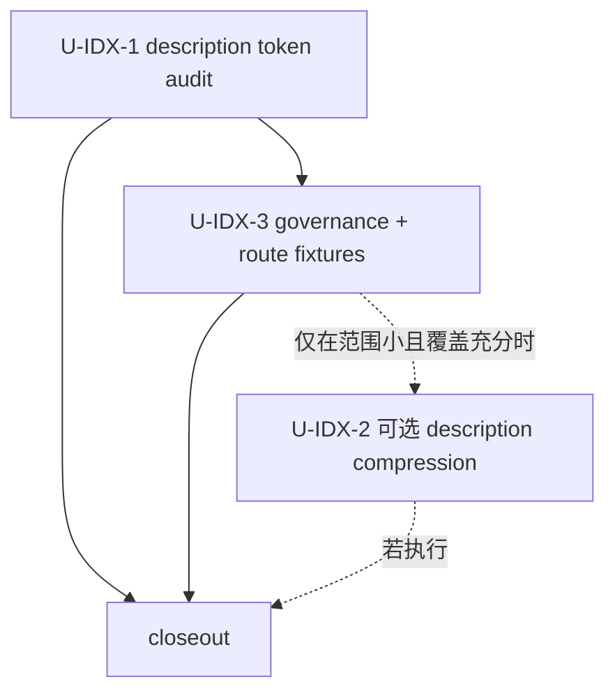

# refactor: Activation-L1 description 索引治理与 route collision 覆盖

## 摘要

本计划从 `docs/plans/2026-07-06-001-refactor-skill-prompt-slimming-plan.md` 拆分而来。计划 001 处理 **Active body（触发后才付的条件税）** 的 progressive-disclosure 瘦身；本计划处理与之正交的 **Activation-L1 description 索引税（每次对话无条件付的常驻税）** 与 route collision 覆盖。

拆分理由：Activation-L1 维度触及 pilot 两个 skill 之外的多个 skill（description offender、`lint-skill-entrypoints`、相邻 workflow route fixtures），属于不同问题维度与不同 blast radius。把它独立出来，让 001 回归「最小可验证第一刀」的单维度定位，也让本计划的 closeout 只报索引/路由收益，不与 body 瘦身收益混淆。

---

## 决策摘要

- **推荐方案：** 先做 U-IDX-1（description token audit，零 source 改动的 advisory baseline）与 U-IDX-3（新 skill 系统级治理 + route collision fixtures，只校验结构与覆盖，不裁决语义）。只有在 audit 证明 offender 集合小、route fixtures 覆盖足够、且改动不牵引全量 skill 瘦身时，才执行 U-IDX-2（条件性 description 压缩）。
- **关键决策：** spec-first 只拥有 Activation-L1 description 文本与 runtime 投射；L0/语义路由/skill 联邦归宿主拥有，本计划明确拒绝自建。压缩单位是「trigger + exclude + 定位三段各自最短」，不是裸 30 词。
- **验证重点：** description token 复算、`lint:skill-entrypoints`、route fixture 结构/覆盖 jest、fresh-source/read-only route semantic eval。
- **最大风险 / 边界：** 最大风险是为压缩长度砍掉边界相邻 workflow 的 exclude intent，造成误触发。不得手改 generated runtime mirrors；runtime 刷新只用 `spec-first init`。

---

## 与计划 001 的关系

- 本计划依赖计划 001 的 pilot 经验但不阻塞它：001 的 body 瘦身（U1–U8）可独立完成，其 closeout 只报 body 收益，并在 limitation 中指向本计划承接索引/路由维度。
- 本计划的 U-IDX-1 audit 可与 001 的 body 单元并行执行，作为索引层 before baseline。
- 本计划不改 001 拥有的 `spec-work` / `spec-code-review` body spine 与 references。

---

## 需求

- R-IDX-1（原 R11）. Activation-L1 description 审计：测量所有 spec-first skill/agent 的 frontmatter description token 占用，识别把功能说明写进 description 的超长 offender；任何压缩都必须保留 trigger + exclude + 定位三段，不得为凑长度砍掉边界相邻 workflow 的 exclude intent。
- R-IDX-2（原 R12）. 新增/修改 skill 的系统级治理：扩展 `lint-skill-entrypoints` 或 `spec-skill-audit`，检查 description 长度预算、是否声明 exclude intent、是否与现有 skill 高重叠；不新增独立 contract/schema。
- R-IDX-3（原 R13）. route collision 覆盖：为边界相邻 workflow（plan/work/code-review/doc-review/compound）建 eval fixture，用典型请求记录 expected / excluded workflow；脚本/Jest 只校验 fixture 结构、覆盖和可解析性，语义命中是否合理由 fresh-source/read-only eval 判断。不得自建宿主级 L0 域索引、语义向量 registry 或 skill 联邦（宿主 primitive，重建即反模式）。

---

## 范围边界

- 不新增新的 public workflow、skill 或 agent。
- 不新增独立 schema/contract 概念；扩展现有 `lint-skill-entrypoints` / `spec-skill-audit`。
- 不改计划 001 拥有的 `spec-work` / `spec-code-review` body spine 与 references。
- 不把 generated runtime mirrors 当 source 修复；runtime drift 只通过 `spec-first init` 修复。
- 不让脚本裁决自然语言路由语义；脚本只输出结构/覆盖/可解析性等 deterministic facts。
- 不自建宿主级 L0 域索引路由引擎、语义向量 skill registry 或 skill 联邦；skill discovery/routing 是宿主 primitive。

---

## 完成标准

- Activation-L1 description audit 产出 before baseline（或记录未执行 reason_code），标注每个 skill 的 description token、offender、是否已有 exclude intent。
- route collision fixtures 覆盖相邻 workflow 的 expected / excluded 意图；Jest/脚本只证明 fixture 结构和覆盖，fresh-source/read-only eval 或 closeout limitations 负责说明语义路由判断结果。
- 若执行 U-IDX-2，必须先有 U-IDX-1 baseline 与 U-IDX-3 route fixture；若未执行，closeout 记录 `description_compression_deferred` 与触发条件。
- `npm run lint:skill-entrypoints`、相关 unit tests、`npm run typecheck` 通过。
- 若运行 `spec-first init` 验证 runtime projection，必须确认只由 source 生成 runtime，未手改 generated mirrors。

### 阻断条件

- 缺 baseline，且未记录 degraded reason。
- Jest/脚本试图裁决自然语言路由语义。
- 为凑长度删除边界相邻 workflow 的 exclude intent 且未回滚。
- 手改 generated runtime mirror 作为修复或验证手段。
- route collision fixture 发现核心误触发/漏触发且未修复、未降级说明或未回滚相关 description 变更。

---

## 实施单元

### U-IDX-1. Activation-L1 description token audit（原计划 001 U9）

**目标：** 测量并输出所有 spec-first skill/agent 的 frontmatter description 常驻 token 占用，作为 Activation-L1 优化的 before baseline。先测量再判断是否改。

**需求：** R-IDX-1

**依赖：** 无（可与计划 001 body 单元并行）

**文件：**
- 新建：`docs/validation/2026-07-06-skill-description-token-audit.md`（audit baseline artifact）
- 修改：`CHANGELOG.md`

**做法：**
- 脚本化统计每个 `skills/*/SKILL.md` 与投射 agent 的 description 词数/估算 token。
- 标注三类：高频核心（plan/work/code-review）、边界相邻（doc-review/compound）、其他。
- 标注 offender：把功能说明/案例写进 description 的（如 `proof`、`git-commit-push-pr`、`spec-slack-research`）。
- 标注每个 skill 是否已有 exclude intent。
- 输出为 advisory audit artifact，不改 skill 文本本身。是否进入 U-IDX-2 取决于 offender 集合规模、route fixture 覆盖和范围。

**测试场景：**
- 正常路径：audit 产出每个 skill 的 description token 与 offender 标注。
- 边界：audit 是 advisory 事实，不作为硬 gate。

**验证：**
- audit artifact 存在且数据可复算；`npx jest tests/unit/changelog-format.test.js --runInBand`。

---

### U-IDX-3. 新 skill governance + route collision fixtures（原计划 001 U11）

**目标：** 把「新增 skill 是体系变更」落成可执行守护，并为边界相邻 workflow 建 route collision fixture，防止 Activation-L1 压缩破坏路由。

**需求：** R-IDX-2, R-IDX-3

**依赖：** U-IDX-1

**文件：**
- 修改：`scripts/lint-skill-entrypoints.js` 或 `skills/spec-skill-audit/references/skill-authoring-quality.md`（description 预算 + exclude 声明 + 重叠检查）
- 若需新增检查项，修改：`scripts/lint-skill-entrypoints.config.json`
- 新增或修改（route collision fixtures，用独立前缀 `route-collision-*.json`）：`skills/spec-code-review/evals/route-collision-*.json`、`skills/spec-doc-review/evals/route-collision-*.json`、`skills/spec-plan/evals/route-collision-*.json`、`skills/spec-work/evals/route-collision-*.json`、`skills/spec-compound/evals/route-collision-*.json`
- 修改：`tests/unit/`（fixture schema/coverage/parse 断言，不做语义裁决）
- 修改：`CHANGELOG.md`

> **与计划 001 的共享文件协调（P2-C）：** (1) route-collision fixtures 使用 `route-collision-*.json` 前缀，与 001 U5 的 body trigger `examples*.json` 家族在同目录下命名隔离，不同 glob、不互相覆盖。(2) `skill-authoring-quality.md` 的骨架由 001 U7（body-slimming lens）拥有并建立；本单元的 route-index lens 以**追加子节**方式加入、不重写 001 建立的结构；两计划同期活跃时 001 U7 先落地。

**做法：**
- 扩展现有 lint / audit：新增或修改 skill 时检查 description 长度预算、是否声明 exclude intent、是否与现有 skill description 高重叠；**不新增独立 contract/schema**。
- 建 route collision fixture：用典型请求（如「review 这份计划」「按刚才计划改代码」「把这次修复沉淀」）记录 `expected_workflow` 与 `excluded_workflows`。
- Jest/脚本只校验 fixture 结构、覆盖范围、JSON/Markdown 可解析性和必填字段；不得把自然语言意图匹配写成确定性脚本结论。
- 语义路由判断由 fresh-source/read-only eval 或人工 reviewer 执行：读取当前 description 与 fixture，判断 expected/excluded 是否合理，并记录 limitations。
- **明确不做**：不建 L0 域索引引擎、语义向量 registry、skill 联邦——宿主 primitive。

**遵循模式：**
- `scripts/lint-skill-entrypoints.js` 现有 blockedPatterns 结构。
- `skills/using-spec-first/evals/*`、`skills/spec-write-tasks/evals/*` 的 eval fixture 风格。

**测试场景：**
- 正常路径：典型请求 fixture 覆盖 expected workflow 与 excluded workflow，且结构检查通过。
- 错误路径：新增无 exclude intent 或超预算的 skill description 被 lint/audit 标记。
- 边界：route semantic adequacy 由 fresh-source/read-only eval 判断；Jest 不断言宿主实际加载机制或自然语言命中正确性（宿主拥有）。

**验证：**
- `npm run lint:skill-entrypoints`、route fixture 结构/覆盖相关 jest 套件、eval fixture JSON parse 通过。
- fresh-source/read-only eval 运行并报告 route semantic judgment；如不可运行，记录 `route_semantic_eval_not_run` 和 reason_code。

---

### U-IDX-2. 条件性压缩 Activation-L1 description offenders（原计划 001 U10）

**目标：** 在 U-IDX-1 baseline 与 U-IDX-3 route fixture 已就绪后，条件性压缩 U-IDX-1 标注的少量超长 description offender，收敛为 trigger + exclude + 定位三段，保留边界相邻 workflow 的 exclude intent。

**需求：** R-IDX-1

**依赖：** U-IDX-1, U-IDX-3

**文件：**
- 可选修改：被 U-IDX-1 标注为 offender 且满足执行 gate 的 `skills/*/SKILL.md` frontmatter（如 `skills/proof/SKILL.md`、`skills/git-commit-push-pr/SKILL.md`、`skills/spec-slack-research/SKILL.md`）
- 可选修改：`tests/unit/`（相关 skill contract / description 断言）
- 修改：`CHANGELOG.md`

**做法：**
- 先做 execution gate：只有当 U-IDX-1 证明 offender 集合小、U-IDX-3 route fixture 能覆盖被改 description 的 expected/excluded 意图、且不牵引全量 skill 瘦身时，才执行；否则记录 `description_compression_deferred` 并转 follow-up。
- 只压把功能说明/案例写进 description 的部分；保留触发场景、exclude、一句话定位。
- 边界相邻 workflow（plan/work/code-review/doc-review/compound）的 exclude intent **不得为凑长度删除**。
- 改完 source 后如需验证 runtime，用 `spec-first init`，不手改 generated mirror。

**遵循模式：**
- 现有已有 exclude intent 的 skill description。
- 报告原则「误触发比漏触发更伤」。

**测试场景：**
- 正常路径：offender description 压缩后仍含 trigger + exclude。
- 错误路径：删除边界相邻 workflow 的 exclude intent 应被 contract test 拦截。
- 边界：U-IDX-1/U-IDX-3 证据不足时，本单元 deferred。
- 边界：高频核心 skill description 保持可路由，不因压缩丢触发词。

**验证：**
- 若执行：相关 skill contract tests、`npm run lint:skill-entrypoints`、description token 复测显示下降，fresh-source/read-only eval 报告 route semantic judgment。
- 若不执行：closeout 记录 deferred reason、U-IDX-1 baseline 和 U-IDX-3 fixture coverage，不声称 description token 已下降。

---

## 关键技术决策

- KTD1. 把 Activation-L1 routing quality 作为独立 measurement lane，而不是计划 001 body pilot 的 blocker。
  - 理由：description tokens 是 always-loaded，值得 audit coverage；但 route semantics 仍归 host/LLM 拥有。U-IDX-1/U-IDX-3 建立 baseline 和 fixtures；只有证据显示改动足够小，U-IDX-2 才压缩 descriptions。

- KTD2. 明确拒绝自建 L0 域索引、语义向量 registry 与 skill 联邦。
  - 理由：skill discovery/routing 是宿主 primitive，重建即违反角色契约的商品化原则。

---

## 风险与依赖

| 风险 | 缓解措施 |
|------|------------|
| 为压缩长度砍掉 exclude intent 导致误触发 | 压缩单位固定为「trigger + exclude + 定位」，contract test 拦截边界相邻 workflow exclude 缺失。 |
| route fixture 意外变成 semantic routing authority | Jest/脚本只检查结构与覆盖，route adequacy 交给 fresh-source/read-only eval 或显式 degraded limitation。 |
| 索引维度牵引全量 skill 瘦身 | U-IDX-2 execution gate 要求 offender 集合小且不扩大范围，否则 deferred。 |

---

## 来源与参考

- 拆分来源：`docs/plans/2026-07-06-001-refactor-skill-prompt-slimming-plan.md`
- 优化审查（§10-11 索引/路由治理）：`docs/项目审查/2026-07-06-skill-prompt-精简优化方案.md`
- 角色契约：`docs/10-prompt/结构化项目角色契约.md`
- skill audit rubric：`skills/spec-skill-audit/references/skill-authoring-quality.md`
- lint 入口治理：`scripts/lint-skill-entrypoints.js`、`scripts/lint-skill-entrypoints.config.json`
