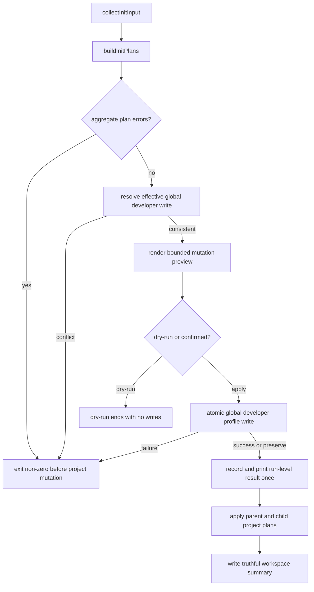

# fix(init): 对齐 workspace contract、失败边界与 mutation preview

## Goal Capsule

- **Objective:** 保持父 workspace 与 child repo 当前初始化写入集合不变，同时让 summary、preview 和失败行为与真实 mutation 一致。
- **Authority hierarchy:** 本计划中的 owner 决策 > 当前 source 与测试 > `docs/plans/init-flow-optimization-proposal.md` 的历史背景 > advisory graph 输出。
- **Stop conditions:** 若实现需要取消父 workspace 的 `.gitignore`、`CHANGELOG.md` 或 instruction 写入，或需要引入通用文件系统事务引擎，停止并重新确认范围。
- **Execution profile:** 先补 characterization/failure tests，再修改 source；不手改 generated runtime mirrors。
- **Tail ownership:** `spec-work` 负责实现、验证、代码审查和 closeout。

---

## Product Contract

### Summary

修复 `spec-first init` 的三处可信度缺口：父 workspace 的 summary 与帮助文案如实声明完整 bootstrap；全局 developer profile 写失败发生在项目 mutation 之前；确认前 preview 披露关键项目路径和项目外写入。父 workspace 与 child repo 的当前写入行为保持不变。

### Problem Frame

`all-repos` 路径在父 workspace 调用完整 project planner，会写入 host runtime、instruction、`.gitignore`、`CHANGELOG.md` 和 state，但 `workspace-init-summary.v1` 声明 `parent_writes_repo_local_artifacts: false`，preview 还把这些操作统称为 `Parent runtime assets`。machine-readable contract、CLI 文案与真实写入不一致。

项目 operation plan 当前先落盘，最后才写 `~/.spec-first/.developer`。当全局路径不可写时，CLI 返回失败，但项目 runtime、instruction、`.gitignore` 和 `CHANGELOG.md` 已经存在。preview 同时固定关闭路径采样，也没有展示这项 user-level mutation。

### Requirements

- R1. 保持当前行为：父 workspace 默认执行完整 workspace-root bootstrap；`--all-repos` 同时初始化父 workspace 和每个 child repo；`--repo <child>` 只初始化选定 child repo。
- R2. workspace summary 及 index 如实表达父 workspace 会写 workspace-root-local bootstrap artifacts；`parent_writes_repo_local_artifacts` 只表达物理写入事实，固定 additive `parent_artifact_authority` 对象分别表达父级治理、host runtime、advisory summary 与 child-canonical 边界。
- R3. preview、help、README 与当前用户手册使用 workspace bootstrap 语义，不再声称父级只写 runtime。
- R4. `globalDeveloperWrite` 承载的 developer identity/profile bootstrap create/overwrite 必须在一次 init run 的首个 parent/child/host project operation 前去重执行；嵌套 plans 的有效 payload 必须先做确定性 canonicalization 与一致性校验，冲突或写入失败时任何 project operation plan 都不得开始，CLI 返回非零并保留原始错误 code/message/target path。
- R5. global developer profile 写入复用共享 atomic-write，避免直接覆盖导致截断或半写。
- R6. preview 在确认前展示目标 root、关键写入与删除路径、runtime-untrack 路径和 `~/.spec-first/.developer` 等项目外写入；generated path 每组最多展示 8 条，整次运行最多展示 100 条 expandable detail rows，超限时输出 omitted target/path counts。
- R7. dry-run 不创建项目文件、global profile 或临时残留；interactive preview 与 dry-run 复用同一 disclosure 来源。
- R8. 只修改 source、tests、README/docs 和 `CHANGELOG.md`；generated runtime mirrors 不作为 source 修复。

### Acceptance Examples

- AE1. 父 workspace 含一个 child Git repo，执行 Codex `--all-repos --dry-run` 时，父计划与 child 计划都包含 instruction、`.gitignore`、缺失时的 `CHANGELOG.md` 和 host state，且不落盘 workspace summary；对同一 fixture 直接调用 summary builder 或执行成功 apply 时，summary/index 将父级本地写入标为真实，并输出固定 `parent_artifact_authority` shape，声明 child-canonical/setup/readiness truth 均为 false。
- AE2. `HOME` 指向无法创建 `.spec-first` 子目录的路径时，first-time `init --codex -y` 返回非零，stderr 保留底层文件系统错误 code/message 与 resolved global profile path，项目根目录不出现 `.codex/`、`.agents/`、`AGENTS.md`、`.gitignore` 或 `CHANGELOG.md`。
- AE3. first-time single-target dry-run 的 stdout 包含目标 root、instruction、`.gitignore`、按条件出现的 `CHANGELOG.md`、host state 和 resolved global profile path，但磁盘保持不变。
- AE4. 多宿主或 `--all-repos` preview 先展示 run-level global profile，再按 target/host 展示有界 detail；generated path 每组不超过 8 条、整次 expandable detail rows 不超过 100 条，未展开的 targets/paths 以 omitted counts 表达。
- AE5. multi-host 或 `--all-repos` apply 对同一 effective profile 只执行并报告一次 create/overwrite/preserve；后续 project 失败时已成功的 run-level profile result 仍保留真实记录。

### Success Criteria

- 父 workspace 与 child repo 的 operation path 集合不因修复缩减。
- summary、help、README 和 preview 对父 workspace 写入的描述一致。
- 不可写 global profile 场景从“失败且项目半安装”变为“失败且项目零写入”。
- multi-host/all-repos 的 preview 与 writer input 共享同一个 canonical `effectiveGlobalDeveloperWrite`；写入后只生成一个 `globalDeveloperWriteResult` 供成功输出消费，不重复执行或宣称写入。
- destructive reset、obsolete cleanup 与 runtime-untrack 在确认前有界披露路径，超大 workspace 的 detail 输出具有确定性上限。
- 现有 init、Qoder lifecycle、gitignore 和 runtime-untrack 测试保持通过。

### Scope Boundaries

- 不取消父 workspace 的 instruction、`.gitignore`、`CHANGELOG.md`、host runtime 或 state 写入。
- 不改变 `--repo`、`--all-repos`、默认 target selection、host selection 或成功退出语义。
- 不承诺整个 init operation plan 的通用事务性；只修 global profile failure 晚于 project mutation 的问题。
- 不承诺 global profile 写失败时用户 home 绝对零副作用；共享 atomic writer 可以在失败前创建空的 `~/.spec-first` 目录，但不得截断目标文件、残留临时文件或开始任何 project mutation。
- 不改变 `applyUserLanguageSyncPlan()` 的 post-project action-required/retry 语义；它是独立的用户级语言同步流程，不属于本次 `globalDeveloperWrite` 失败顺序修复。
- 不重构 adapter、plugin manifest、state schema 或 `clean`/`doctor` 生命周期。
- 不修改历史计划快照，只更新当前用户文档和当前 contract 表达。

### Sources

- `src/cli/commands/init-workspace.js`
- `src/cli/commands/init-project-plan.js`
- `src/cli/commands/init-developer.js`
- `src/cli/commands/init-apply.js`
- `src/cli/commands/init-output.js`
- `src/cli/developer.js`
- `src/cli/atomic-write.js`
- `README.md`
- `README.zh-CN.md`
- `docs/05-用户手册/01-快速开始.md`
- `docs/05-用户手册/02-核心概念.md`
- `docs/05-用户手册/05-最佳实践.md`
- `docs/05-用户手册/08-三种开发模式.md`
- `docs/contracts/parent-artifact-quarantine.md`
- `docs/plans/init-flow-optimization-proposal.md`

---

## Planning Contract

### Key Technical Decisions

- KTD1. **保持写入行为，修复 contract。** 父 workspace 的本地 bootstrap 是 owner-confirmed 行为；修复 summary 字段、authority 表达和文案，不删除写入。
- KTD2. **区分物理位置与 authority。** 父级 instruction、`.gitignore`、`CHANGELOG.md` 和 host runtime 是 workspace-root-local artifacts，可以治理从父目录启动的 CLI，但不能充当 child repo 的 source/setup/readiness truth。
- KTD3. **global profile 是 run-level project apply prerequisite。** `resolveEffectiveGlobalDeveloperWrite(plans)` 在 aggregate plan error gate 之后展开普通 plan 及 workspace parent/child plans，按 host 输入顺序、parent-first、child discovery 顺序得到确定性序列。它必须校验 `action`、`globalPath`、`name`、`lang`、`version`、排序后的 `hosts` 与 `syncUserLanguage` 一致；create plans 允许各自生成不同 `initializedAt`，但统一采用序列中首个 plan 的值作为 canonical payload。其他字段冲突时抛出 `global_developer_write_conflict`，列出冲突字段，并在 preview、global write 或任何 project operation 前终止。effective write 同时供 preview 与 apply 使用；create/overwrite 只 atomic-write 一次，preserve 保持 no-op。programmatic 单 plan 入口在自身 error gate 后通过同一 helper 保留完整行为。本次不扩张为通用 transaction engine。
- KTD4. **复用现有 atomic-write。** `writeGlobalDeveloperFile()` 改用 `writeFileAtomic()`，不新建第二套临时文件或 Windows retry 分支。
- KTD5. **preview 使用双层确定性预算。** `MAX_PREVIEW_PATH_SAMPLES_PER_GROUP = 8` 限制每个 target/host group 的 generated path 样本，`MAX_PREVIEW_DETAIL_LINES = 100` 限制整次运行所有可展开 target/path detail rows；固定 run summary、单个 global profile section、omitted counters 和确认提示不计入 detail budget，但它们自身是常数大小。展示优先级固定为 global profile、`remove_file`/`remove_dir`/`prune_command`/runtime-untrack、instruction/`.gitignore`/`CHANGELOG.md`/state/hook/pointer、generated assets。预算耗尽时不承诺逐个列出全部 child，而是保留 target/host 总数、已展示 target 的唯一标识及 omitted target/path counts。
- KTD6. **summary v1 做固定 shape 的兼容修正。** `parent_writes_repo_local_artifacts: true` 只表示父 root 的物理写入事实；每个 `workspace-init-summary.v1` 与 aggregate `workspace-init-summary-index.v1` 同时输出以下 additive object：

  ```json
  {
    "parent_artifact_authority": {
      "physical_scope": "workspace-root-local",
      "instruction_scope": "parent-session-governance",
      "host_runtime_scope": "parent-workspace",
      "workspace_summary_authority": "advisory",
      "child_repo_canonical": false,
      "child_repo_setup_truth": false,
      "child_repo_readiness_truth": false
    }
  }
  ```

  新 reader 接受缺少该对象的 legacy v1 payload，并将 authority 视为 unknown 而非推断为 child truth；冻结的 legacy-reader contract fixture 必须忽略新增对象并接受修正后的物理写入布尔值。该变化按 v1 factual bug fix + additive field 处理，兼容依据是双向 reader fixture 与 Changelog migration note，不以“仓内未发现 external consumer”作为版本判断条件。
- KTD7. **run-level result 拥有成功输出。** global prerequisite 返回一次性的 `globalDeveloperWriteResult`；`runInit()` 在 prerequisite 成功或 preserve 后立即记录并打印一次，所有 per-plan success renderer 禁止再根据 `plan.globalDeveloperWrite` 宣称 create/overwrite/preserve。这样即使后续 project operation 失败，已发生的 user-level mutation 仍有准确证据。

### High-Level Technical Design



| Invocation | Parent workspace | Child repo |
|---|---|---|
| 默认从父目录运行 | 完整 workspace-root bootstrap | 不写 |
| `--repo <child>` | 不写 | 选定 child 完整 bootstrap |
| `--all-repos` | 完整 workspace-root bootstrap + advisory summary | 每个 child 完整 bootstrap |

### Assumptions

- A1. summary v1 compatibility 由双向 fixture 证明：new reader 接受缺少 additive authority 的 legacy payload，frozen legacy reader 接受新 payload 并忽略新增字段；仓内 consumer 搜索只作为补充证据，不作为兼容结论。
- A2. global profile 成功、后续 project operation 失败时，保留已写 profile 符合其独立用户身份语义；本计划不声称 project plan 全局原子。
- A3. preview 路径可从 operation plan 和已 canonicalize 的 effective global write 确定性派生，不需要 adapter-specific 语义判断。

### Risks & Dependencies

- `parent-artifact-quarantine` 的广义 parent-local pollution 措辞可能与 owner-confirmed parent bootstrap 冲突；需明确 quarantine 只覆盖 child/foreign repo setup truth。
- global profile 提升为 run-level prerequisite 会改变调用边界；必须覆盖 create、overwrite、preserve、多宿主、all-repos、programmatic single-plan、invalid-plan no-write 与不同 `initializedAt` 的 canonicalization。
- programmatic 或未来 caller 可能组合冲突 plans；effective resolver 必须 fail closed，而不是任取一个 name/lang/action/path 后继续。
- 改写 v1 布尔值可能影响仓外 consumer；固定字段语义、双向 reader fixture 和 Changelog migration note 是本次兼容证据，不能用“未发现 consumer”替代。
- 直接打开全部 path samples 会在大 workspace 中制造噪声；双层 budget 会省略部分 target 细节，必须用总数和 omitted counts 明确披露 coverage gap。
- 当前工作树存在无关的 `spec-mcp-setup`、validation 和 test 改动；实施时必须保护这些用户改动。

---

## Implementation Units

### U1. 对齐父 workspace summary、preview 标签与文档 contract

**Goal:** 保持父/子写入集合不变，让 summary、CLI 文案和用户文档准确描述父 workspace bootstrap 及其 authority。

**Requirements:** R1, R2, R3, R8; AE1

**Dependencies:** None

**Files:**

- Modify: `src/cli/commands/init-workspace.js`
- Modify: `src/cli/commands/init-output.js`
- Modify: `README.md`
- Modify: `README.zh-CN.md`
- Modify: `docs/05-用户手册/01-快速开始.md`
- Modify: `docs/05-用户手册/02-核心概念.md`
- Modify: `docs/05-用户手册/05-最佳实践.md`
- Modify: `docs/05-用户手册/08-三种开发模式.md`
- Modify: `docs/contracts/parent-artifact-quarantine.md`
- Create: `tests/unit/init-workspace-contract.test.js`
- Modify: `CHANGELOG.md`

**Approach:**

- 修正 summary 与 index 的父级 artifact fact，并按 KTD6 同步输出固定 `parent_artifact_authority` object；`parent_writes_repo_local_artifacts` 的注释与文档只解释物理写入，不再承载 authority 推断。
- 将 `Parent runtime assets`、`parent workspace runtime only` 等措辞改为 workspace bootstrap。
- README、快速开始、核心概念、最佳实践和三种开发模式统一明确：父 workspace 默认创建 instruction、`.gitignore`、缺失时的 `CHANGELOG.md` 和 selected host runtime；`--all-repos` 再初始化 children。
- quarantine contract 明确 init-owned bootstrap 不属于 foreign/child setup pollution，不扩大现有 quarantine surface。

**Execution note:** 先写 characterization test 锁住 owner-confirmed 父/子 operation path，再修 contract 和文案。

**Patterns to follow:** `buildWorkspaceInitSummary()`/`buildWorkspaceInitSummaryIndex()` 的同字段投影；`tests/unit/qoder-runtime-lifecycle.test.js` 的 plan/filesystem assertions。

**Test scenarios:**

1. 父 workspace + child 的 Codex all-repos plan：父、child 都包含 instruction、`.gitignore`、host state 和缺失时的 `CHANGELOG.md`。
2. summary 与 index：`parent_writes_repo_local_artifacts` 为 true，且 `parent_artifact_authority` 与 KTD6 固定 shape 完全相等。
3. compatibility 双向 fixture：new reader 读取缺少 authority object 的 legacy v1 payload 时返回 unknown authority；冻结的 legacy reader 读取新 payload 时忽略 additive object、接受物理写入布尔值变化并保留既有 platform/counts 结果。
4. 父或 child 已有 `CHANGELOG.md` 时均 preserve，不覆盖。
5. `--repo <child>` 只构建 child plan。
6. help/preview 与当前用户文档不再含 `Parent runtime assets`、`parent workspace runtime only`、`默认只写父级 runtime` 或“父 workspace 只能写 advisory summary”等旧 contract 表达。

**Verification:** 当前父子 operation path 不减少，summary/index/docs 对相同事实使用一致术语。

### U2. 将 global developer profile 写入移到 project mutation 之前

**Goal:** global profile create/overwrite 失败或 nested plan payload 冲突时，init 在任何 project mutation 前终止；成功路径只执行并报告一次 run-level result。

**Requirements:** R4, R5, R7, R8; AE2, AE5

**Dependencies:** None

**Files:**

- Modify: `src/cli/developer.js`
- Modify: `src/cli/commands/init.js`
- Modify: `src/cli/commands/init-apply.js`
- Modify: `src/cli/commands/init-developer.js`
- Modify: `src/cli/commands/init-output.js`
- Modify: `src/cli/commands/init-workspace.js`
- Create: `tests/unit/init-apply-failure.test.js`
- Modify: `tests/smoke/cli-smoke.test.js`
- Modify: `CHANGELOG.md`

**Approach:**

- `writeGlobalDeveloperFile()` 改用 `writeFileAtomic()`，保留 format、路径与 public contract。
- 在 aggregate plan error gate 后调用 `resolveEffectiveGlobalDeveloperWrite(plans)`；helper 按 KTD3 展开 nested plans、规范化 host 集合、忽略 create plans 间的 `initializedAt` 差异并采用首个值，对其他字段差异 fail closed。
- effective result 在 preview 前只解析一次，并同时传给 preview 与 apply，避免两条路径各自挑选不同 plan。dry-run 只消费 result，不调用 writer。
- `applyInitPlan()`/`applyWorkspaceInitPlan()`/`applyProjectInitPlan()` 通过 internal apply context 区分“run-level prerequisite 已处理”与 programmatic single-plan 调用；programmatic 入口必须先检查自身 `errors`，再 resolve/apply profile，不能因 invalid plan 先产生 user-level mutation。
- global 写失败沿用真实异常，不包装成泛化成功/失败 result；CLI stderr 必须保留底层 code/message 与 `getGlobalDeveloperPath()` resolved target，失败发生在任何 parent/child/host project plan 前。
- prerequisite 返回 `globalDeveloperWriteResult`，包含 action、resolved path、applied/no-op status 与 developer summary；`runInit()` 在结果产生后只打印一次，per-plan success renderer 不再读取 `plan.globalDeveloperWrite`。failure 不得打印成功 summary。
- destructive reset backup 仍只负责 project runtime，不复制数百个普通 init 文件。

**Execution note:** 先固定不可写 user-home target 的失败复现，测试必须断言 project root 没有任何 init 产物；Windows 子进程同时隔离 `HOME`、`USERPROFILE`、`HOMEDRIVE`/`HOMEPATH`，若仍不能稳定控制 `os.homedir()`，改用可注入 writer failure，不用平台权限偶然性作 gate。

**Patterns to follow:** `src/cli/atomic-write.js` 的同目录临时文件与 rename retry；`tests/smoke/cli-smoke.test.js` 的隔离 HOME 子进程。

**Test scenarios:**

1. create 成功：profile 原子创建，project runtime 正常生成，run-level create summary 只输出一次。
2. create 失败：user-home target 是普通文件或 parent 不可创建时，CLI 非零；stderr 含底层 failure code/message 与 resolved global path，project root 为空。
3. overwrite 失败：现有 profile byte-preserved、无临时文件残留、project plan 未执行，stderr 保留同等原始证据。
4. preserve：不调用 writer，project init 正常，run-level preserve summary 只输出一次。
5. multi-host/all-repos create：各 project plan 的 `initializedAt` 不同时采用确定序列中的首个值，其他字段一致时只写一次，再依次执行所有 project plans。
6. conflict fail-closed：name/lang/action/globalPath/version/hosts/syncUserLanguage 任一 normalized 字段冲突时返回 `global_developer_write_conflict` 和冲突字段，parent、children、hosts 均零 init artifacts。
7. multi-plan global write failure：parent 和全部 children/hosts 均零 init artifacts，且不打印 global success summary。
8. programmatic single-plan：未经过 `runInit()` 时仍在 plan error gate 后写入所需 profile，不因 internal context 静默跳过。
9. invalid programmatic plan：`errors` 非空时不调用 global writer，也不执行 project operation。
10. destructive reset + global failure：reset 尚未开始，现有 runtime 不变且无 backup 残留。
11. project apply 后续失败：已成功的 global result 保留且只报告一次，不宣称整个 init 事务回滚。
12. user-language sync 继续通过 atomic writer 更新 preference，不丢 name/lang/hosts；其 post-project partial semantics 不变。

**Verification:** global conflict/failure 不再产生 project 半安装；profile 仍符合既有 parser/formatter contract，实际 writer call 次数与 preview/apply output 的 run-level 次数一致。

### U3. 在确认前披露有界 mutation 路径和 global 写入

**Goal:** dry-run 与 interactive confirmation preview 都能识别关键 project/workspace/user-level 写入、删除和 untrack，同时用双层预算保持大 workspace 输出可读。

**Requirements:** R3, R6, R7, R8; AE3, AE4

**Dependencies:** U1, U2

**Files:**

- Modify: `src/cli/commands/init-output.js`
- Modify: `src/cli/init-i18n.js`
- Modify: `tests/unit/init-workspace-contract.test.js`
- Modify: `tests/smoke/cli-smoke.test.js`
- Modify: `CHANGELOG.md`

**Approach:**

- preview 直接消费 U2 已解析的 effective global write，确认前展示一次 action、resolved path、name/lang；preserve 明确标为 no-op，不从每个 nested plan 再收集或任取 payload。
- 从 plan operations 提取 `remove_file`、`remove_dir`、`prune_command`、runtime-untrack、instruction、`.gitignore`、`CHANGELOG.md`、state、hook/pointer 等路径，按 KTD5 优先级渲染；destructive paths 必须出现在 write samples 之前。
- generated assets 保持总计数；每个 target/host group 最多展示 8 条 generated path samples，整次运行最多展示 100 条 expandable detail rows。预算包含已展开 target 标识与 path rows；固定 run summary、global section、omitted counters 和确认提示不计入预算。
- 超过 per-group cap 时输出 omitted path count；超过 run-wide budget 时停止新增 target detail，输出 omitted target/path counts。只承诺已展示 target 可唯一识别以及总覆盖数量准确，不承诺在超大 workspace 中逐个列出所有 child。
- user-language sync preview 保持独立 section，但相同 global path 不表现成不同文件。

**Patterns to follow:** `printUserLanguageSyncPreview()` 的项目外 mutation 表达；`printOperationPathSample()` 的有界输出；`printGlobalDeveloperWriteSummary()` 的字段格式。

**Test scenarios:**

1. first-time Codex dry-run：stdout 含 target root、`AGENTS.md`、`.gitignore`、`CHANGELOG.md`、state 和 resolved global path，磁盘无写入。
2. existing Changelog：preview 不声称创建或更新它。
3. interactive preview 与 dry-run 使用同一 renderer。
4. multi-host preview：global profile 只显示一次，host/target 总数和已展开 group 标识明确。
5. all-repos preview：父级标签为 workspace bootstrap；已展示 child 可唯一识别，generated samples 每组不超过 8 条，未展示 children/paths 以 omitted counts 表达。
6. destructive reset / obsolete cleanup：remove/prune/runtime-untrack 路径在 write samples 前出现，且与 interactive confirmation 使用相同 renderer。
7. 50-child × 5-host fixture：expandable detail rows 不超过 100；global profile、target/host totals、destructive priority 和 omitted counts 均保留。
8. `--no-sync-user-language`：profile 主写入与 preference/cleanup action 均保留 reason code。

**Verification:** 仅看 preview 即可识别最高影响 mutation、已展开 targets 与 coverage gap；输出不随 generated assets 或 `hosts × targets` 无界线性膨胀。

---

## Verification Contract

1. 聚焦 Jest：`tests/unit/init-workspace-contract.test.js`、`tests/unit/init-apply-failure.test.js`、`tests/unit/init-module-split.test.js`、`tests/smoke/cli-smoke.test.js`；覆盖 summary 双向 v1 fixture、effective-write canonicalization/conflict、run-level output 一次性、destructive preview 与 8/100 budget。
2. 相邻生命周期：`tests/unit/qoder-runtime-lifecycle.test.js`、`tests/integration/qoder-runtime-lifecycle.integration.test.js`、`tests/unit/gitignore-policy.test.js`、`tests/unit/runtime-untrack.test.js`、`tests/unit/platform-compatibility-characterization.test.js`。
3. 静态验证：`npm run typecheck`、`git diff --check`。
4. 主链验证：`npm test`。
5. 发布面验证：`npm run build`。

保留四项临时目录黑盒证据：parent + child 的 all-repos dry-run；不可写 global profile target 下的 project-root 零写入与原始 stderr 证据；multi-host apply 的 profile writer/output 各一次；large-workspace preview 的 100-row detail budget 与 omitted counts。不可写 user-home case 允许 atomic helper 创建空的 `~/.spec-first` parent directory，但目标 profile 必须 byte-preserved、无 temp 残留且 project root 零写入。若实现意外触及 templates、skills 或 adapter-projected contents，必须追加所有受支持宿主的 runtime regeneration/drift 验证；否则本计划不要求生成 runtime mirrors。

---

## Definition of Done

- R1-R8 均由 source、tests 或当前文档覆盖，U1-U3 的 test scenarios 全部通过。
- 父 workspace 与 child repo 的 owner-confirmed 写入集合未缩减。
- summary/index 不再输出错误的父级 artifact fact；固定 `parent_artifact_authority` shape 同时存在，new/legacy reader 双向 fixture 通过。
- effective global write 在 preview 前完成 nested-plan canonicalization；create 的不同 `initializedAt` 使用确定首值，其他冲突 fail closed。
- global profile conflict/failure 发生在 project mutation 前，writer 使用共享 atomic-write，失败输出保留原始 code/message/resolved target path。
- preview 与 writer input 消费同一个 canonical `effectiveGlobalDeveloperWrite`；create/overwrite/preserve 执行后只生成一个 `globalDeveloperWriteResult`，成功输出只消费该 result，并且每次 init 最多报告一次。
- dry-run 与 interactive preview 披露关键 project/workspace/user-level write/remove/prune/untrack；generated samples 每组最多 8 条、expandable detail rows 每次运行最多 100 条，超限有准确 omitted counts。
- README、中文 README、快速开始、核心概念、最佳实践、三种开发模式、quarantine contract 与 CLI help 语义一致。
- `CHANGELOG.md` 记录用户可见行为与验证结果。
- 未手改 generated runtime mirrors，未覆盖当前工作树无关改动，未留下失败尝试代码。
