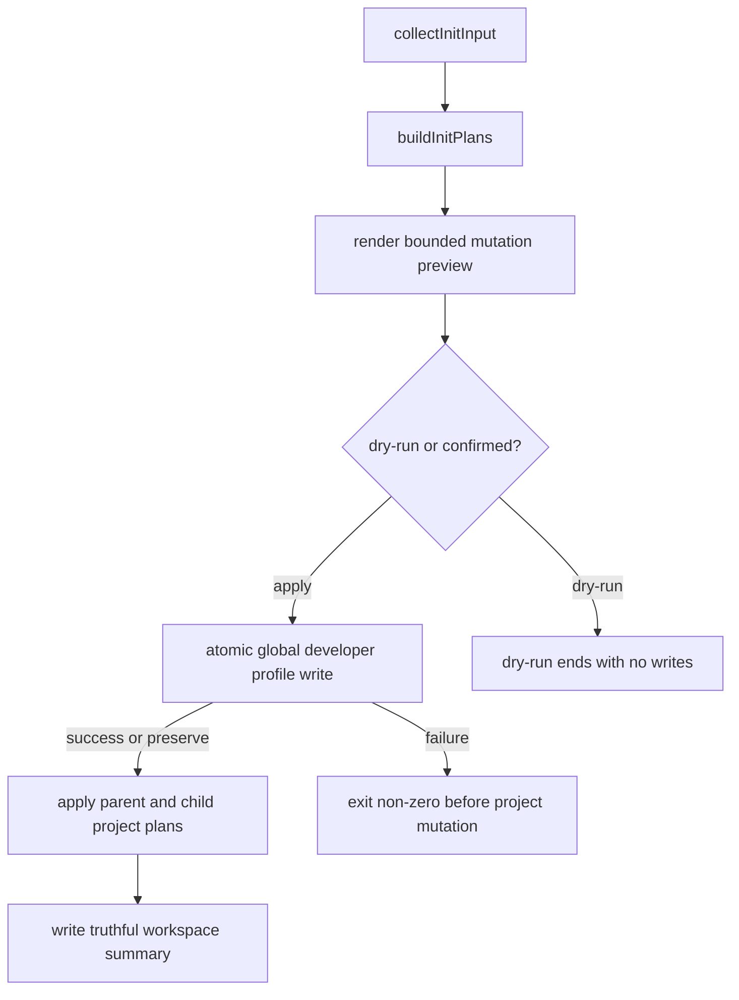

# fix(init): 对齐 workspace contract、失败边界与 mutation preview

## Goal Capsule

- **Objective:** 保持父 workspace 与 child repo 当前初始化写入集合不变，同时让 summary、preview 和失败行为与真实 mutation 一致。
- **Authority hierarchy:** 本计划中的 owner 决策 > 当前 source 与测试 > `docs/plans/init-flow-optimization-proposal.md` 的历史背景 > advisory graph 输出。
- **Stop conditions:** 若实现需要取消父 workspace 的 `.gitignore`、`CHANGELOG.md` 或 instruction 写入，或需要引入通用文件系统事务引擎，停止并重新确认范围。
- **Execution profile:** 先补 characterization/failure tests，再修改 source；不手改 generated runtime mirrors。
- **Tail ownership:** `spec-work` 负责实现、验证、代码审查和 closeout。

---

## Product Contract

### Summary

修复 `spec-first init` 的三处可信度缺口：父 workspace 的 summary 与帮助文案如实声明完整 bootstrap；全局 developer profile 写失败发生在项目 mutation 之前；确认前 preview 披露关键项目路径和项目外写入。父 workspace 与 child repo 的当前写入行为保持不变。

### Problem Frame

`all-repos` 路径在父 workspace 调用完整 project planner，会写入 host runtime、instruction、`.gitignore`、`CHANGELOG.md` 和 state，但 `workspace-init-summary.v1` 声明 `parent_writes_repo_local_artifacts: false`，preview 还把这些操作统称为 `Parent runtime assets`。machine-readable contract、CLI 文案与真实写入不一致。

项目 operation plan 当前先落盘，最后才写 `~/.spec-first/.developer`。当全局路径不可写时，CLI 返回失败，但项目 runtime、instruction、`.gitignore` 和 `CHANGELOG.md` 已经存在。preview 同时固定关闭路径采样，也没有展示这项 user-level mutation。

### Requirements

- R1. 保持当前行为：父 workspace 默认执行完整 workspace-root bootstrap；`--all-repos` 同时初始化父 workspace 和每个 child repo；`--repo <child>` 只初始化选定 child repo。
- R2. workspace summary 及 index 如实表达父 workspace 会写 workspace-root-local bootstrap artifacts，并明确它们不是任一 child repo 的 canonical truth。
- R3. preview、help、README 和快速开始使用 workspace bootstrap 语义，不再声称父级只写 runtime。
- R4. `globalDeveloperWrite` 承载的 developer identity/profile bootstrap create/overwrite 必须在一次 init run 的首个 parent/child/host project operation 前去重执行；失败时任何 project operation plan 都不得开始，CLI 返回非零并保留原始错误证据。
- R5. global developer profile 写入复用共享 atomic-write，避免直接覆盖导致截断或半写。
- R6. preview 在确认前展示目标 root、关键项目路径和 `~/.spec-first/.developer` 等项目外写入；generated asset 输出必须有界。
- R7. dry-run 不创建项目文件、global profile 或临时残留；interactive preview 与 dry-run 复用同一 disclosure 来源。
- R8. 只修改 source、tests、README/docs 和 `CHANGELOG.md`；generated runtime mirrors 不作为 source 修复。

### Acceptance Examples

- AE1. 父 workspace 含一个 child Git repo，执行 Codex `--all-repos --dry-run` 时，父计划与 child 计划都包含 instruction、`.gitignore`、缺失时的 `CHANGELOG.md` 和 host state，且不落盘 workspace summary；对同一 fixture 直接调用 summary builder 或执行成功 apply 时，summary 将父级本地写入标为真实，并声明 child-canonical 为 false。
- AE2. `HOME` 指向无法创建 `.spec-first` 子目录的路径时，first-time `init --codex -y` 返回非零，项目根目录不出现 `.codex/`、`.agents/`、`AGENTS.md`、`.gitignore` 或 `CHANGELOG.md`。
- AE3. first-time single-target dry-run 的 stdout 包含目标 root、instruction、`.gitignore`、按条件出现的 `CHANGELOG.md`、host state 和 global profile path，但磁盘保持不变。
- AE4. 多宿主或 `--all-repos` preview 按 target/host 分组并限制 generated path 样本；global profile mutation 去重展示。

### Success Criteria

- 父 workspace 与 child repo 的 operation path 集合不因修复缩减。
- summary、help、README 和 preview 对父 workspace 写入的描述一致。
- 不可写 global profile 场景从“失败且项目半安装”变为“失败且项目零写入”。
- 现有 init、Qoder lifecycle、gitignore 和 runtime-untrack 测试保持通过。

### Scope Boundaries

- 不取消父 workspace 的 instruction、`.gitignore`、`CHANGELOG.md`、host runtime 或 state 写入。
- 不改变 `--repo`、`--all-repos`、默认 target selection、host selection 或成功退出语义。
- 不承诺整个 init operation plan 的通用事务性；只修 global profile failure 晚于 project mutation 的问题。
- 不改变 `applyUserLanguageSyncPlan()` 的 post-project action-required/retry 语义；它是独立的用户级语言同步流程，不属于本次 `globalDeveloperWrite` 失败顺序修复。
- 不重构 adapter、plugin manifest、state schema 或 `clean`/`doctor` 生命周期。
- 不修改历史计划快照，只更新当前用户文档和当前 contract 表达。

### Sources

- `src/cli/commands/init-workspace.js`
- `src/cli/commands/init-project-plan.js`
- `src/cli/commands/init-apply.js`
- `src/cli/commands/init-output.js`
- `src/cli/developer.js`
- `src/cli/atomic-write.js`
- `README.md`
- `README.zh-CN.md`
- `docs/05-用户手册/01-快速开始.md`
- `docs/05-用户手册/02-核心概念.md`
- `docs/05-用户手册/05-最佳实践.md`
- `docs/05-用户手册/08-三种开发模式.md`
- `docs/contracts/parent-artifact-quarantine.md`
- `docs/plans/init-flow-optimization-proposal.md`

---

## Planning Contract

### Key Technical Decisions

- KTD1. **保持写入行为，修复 contract。** 父 workspace 的本地 bootstrap 是 owner-confirmed 行为；修复 summary 字段、authority 表达和文案，不删除写入。
- KTD2. **区分物理位置与 authority。** 父级 instruction、`.gitignore`、`CHANGELOG.md` 和 host runtime 是 workspace-root-local artifacts，可以治理从父目录启动的 CLI，但不能充当 child repo 的 source/setup/readiness truth。
- KTD3. **global profile 是 run-level project apply prerequisite。** 从所有 plans 中解析一个一致的 effective global write，在 parent/child/host plan 循环前只执行一次；create/overwrite 使用 atomic write，失败则在任何 project operation 前终止，preserve 保持 no-op。programmatic 单 plan 入口仍通过同一 helper 保留完整行为。本次不扩张为通用 transaction engine。
- KTD4. **复用现有 atomic-write。** `writeGlobalDeveloperFile()` 改用 `writeFileAtomic()`，不新建第二套临时文件或 Windows retry 分支。
- KTD5. **preview 展示关键路径和有界样本。** 从 operation plan 提取 instruction、`.gitignore`、`CHANGELOG.md`、state、hook/pointer 与 target root；commands/skills/agents 继续显示计数和固定上限样本。global profile 在多 host/child 中去重。
- KTD6. **summary v1 做兼容修正。** 将错误的父级 artifact 布尔值改为真实值；authority 字段必须采用 backward-compatible additive shape，并同时投影到 summary 与 index，明确 workspace-local/non-child-canonical authority，锁定 index/reader 行为。除非发现真实 external consumer 需要迁移，否则不 bump schema。

### High-Level Technical Design

| Invocation | Parent workspace | Child repo |
|---|---|---|
| 默认从父目录运行 | 完整 workspace-root bootstrap | 不写 |
| `--repo <child>` | 不写 | 选定 child 完整 bootstrap |
| `--all-repos` | 完整 workspace-root bootstrap + advisory summary | 每个 child 完整 bootstrap |

### Assumptions

- A1. 当前仓库内没有 `parent_writes_repo_local_artifacts` 的 machine consumer；修正其值可按 v1 bug fix 处理。
- A2. global profile 成功、后续 project operation 失败时，保留已写 profile 符合其独立用户身份语义；本计划不声称 project plan 全局原子。
- A3. preview 路径可从 operation plan 和 `globalDeveloperWrite` 确定性派生，不需要 adapter-specific 语义判断。

### Risks & Dependencies

- `parent-artifact-quarantine` 的广义 parent-local pollution 措辞可能与 owner-confirmed parent bootstrap 冲突；需明确 quarantine 只覆盖 child/foreign repo setup truth。
- global profile 提升为 run-level prerequisite 会改变调用边界；必须覆盖 create、overwrite、preserve、多宿主、all-repos 和 programmatic single-plan 入口。
- 直接打开全部 path samples 会在大 workspace 中制造噪声；实现必须使用关键路径和固定上限。
- 当前工作树存在无关的 `spec-mcp-setup`、validation 和 test 改动；实施时必须保护这些用户改动。

---

## Implementation Units

### U1. 对齐父 workspace summary、preview 标签与文档 contract

**Goal:** 保持父/子写入集合不变，让 summary、CLI 文案和用户文档准确描述父 workspace bootstrap 及其 authority。

**Requirements:** R1, R2, R3, R8; AE1

**Dependencies:** None

**Files:**

- Modify: `src/cli/commands/init-workspace.js`
- Modify: `src/cli/commands/init-output.js`
- Modify: `README.md`
- Modify: `README.zh-CN.md`
- Modify: `docs/05-用户手册/01-快速开始.md`
- Modify: `docs/05-用户手册/02-核心概念.md`
- Modify: `docs/05-用户手册/05-最佳实践.md`
- Modify: `docs/05-用户手册/08-三种开发模式.md`
- Modify: `docs/contracts/parent-artifact-quarantine.md`
- Create: `tests/unit/init-workspace-contract.test.js`
- Modify: `CHANGELOG.md`

**Approach:**

- 修正 summary 与 index 的父级 artifact fact，并补最小 authority 表达。
- 将 `Parent runtime assets`、`parent workspace runtime only` 等措辞改为 workspace bootstrap。
- README、快速开始、核心概念、最佳实践和三种开发模式统一明确：父 workspace 默认创建 instruction、`.gitignore`、缺失时的 `CHANGELOG.md` 和 selected host runtime；`--all-repos` 再初始化 children。
- quarantine contract 明确 init-owned bootstrap 不属于 foreign/child setup pollution，不扩大现有 quarantine surface。

**Execution note:** 先写 characterization test 锁住 owner-confirmed 父/子 operation path，再修 contract 和文案。

**Patterns to follow:** `buildWorkspaceInitSummary()`/`buildWorkspaceInitSummaryIndex()` 的同字段投影；`tests/unit/qoder-runtime-lifecycle.test.js` 的 plan/filesystem assertions。

**Test scenarios:**

1. 父 workspace + child 的 Codex all-repos plan：父、child 都包含 instruction、`.gitignore`、host state 和缺失时的 `CHANGELOG.md`。
2. summary 与 index：父级本地 artifact 为 true，authority 为 workspace-local/non-child-canonical。
3. 父或 child 已有 `CHANGELOG.md` 时均 preserve，不覆盖。
4. `--repo <child>` 只构建 child plan。
5. help/preview 与当前用户文档不再含 `Parent runtime assets`、`parent workspace runtime only`、`默认只写父级 runtime` 或“父 workspace 只能写 advisory summary”等旧 contract 表达。

**Verification:** 当前父子 operation path 不减少，summary/index/docs 对相同事实使用一致术语。

### U2. 将 global developer profile 写入移到 project mutation 之前

**Goal:** global profile create/overwrite 失败时，init 在任何 project mutation 前终止，并使用共享 atomic-write。

**Requirements:** R4, R5, R7, R8; AE2

**Dependencies:** None

**Files:**

- Modify: `src/cli/developer.js`
- Modify: `src/cli/commands/init.js`
- Modify: `src/cli/commands/init-apply.js`
- Modify: `src/cli/commands/init-workspace.js`
- Create: `tests/unit/init-apply-failure.test.js`
- Modify: `tests/smoke/cli-smoke.test.js`
- Modify: `CHANGELOG.md`

**Approach:**

- `writeGlobalDeveloperFile()` 改用 `writeFileAtomic()`，保留 format、路径与 public contract。
- 在 `runInit()` 的 plan apply 循环前解析并去重 effective global write；all-repos 的 parent/children 和多宿主不得重复写同一 profile。
- `applyInitPlan()`/`applyWorkspaceInitPlan()`/`applyProjectInitPlan()` 通过轻量 option 或 shared helper 区分“run-level 已执行”与 programmatic single-plan 调用，避免跳过后者必需的 profile 写入。
- global 写失败沿用真实异常，不伪造成成功 result；失败发生在任何 parent/child/host project plan 前。
- destructive reset backup 仍只负责 project runtime，不复制数百个普通 init 文件。

**Execution note:** 先固定不可写 HOME 的失败复现，测试必须断言 project root 没有任何 init 产物。

**Patterns to follow:** `src/cli/atomic-write.js` 的同目录临时文件与 rename retry；`tests/smoke/cli-smoke.test.js` 的隔离 HOME 子进程。

**Test scenarios:**

1. create 成功：profile 原子创建，project runtime 正常生成。
2. create 失败：HOME 是普通文件或 parent 不可创建时，CLI 非零且 project root 为空。
3. overwrite 失败：现有 profile byte-preserved，project plan 未执行。
4. preserve：不调用 writer，project init 正常。
5. multi-host/all-repos：相同 effective profile 只写一次，再依次执行所有 project plans。
6. multi-plan global failure：parent 和全部 children/hosts 均零 init artifacts。
7. programmatic single-plan：未经过 `runInit()` 时仍写入所需 profile，不因去重 option 静默跳过。
8. destructive reset + global failure：reset 尚未开始，现有 runtime 不变且无 backup 残留。
9. user-language sync 继续通过 atomic writer 更新 preference，不丢 name/lang/hosts。

**Verification:** global failure 不再产生 project 半安装；profile 仍符合既有 parser/formatter contract。

### U3. 在确认前披露有界 mutation 路径和 global 写入

**Goal:** dry-run 与 interactive confirmation preview 都能识别关键 project/workspace/user-level 写入，同时保持大 workspace 输出可读。

**Requirements:** R3, R6, R7, R8; AE3, AE4

**Dependencies:** U1, U2

**Files:**

- Modify: `src/cli/commands/init-output.js`
- Modify: `src/cli/init-i18n.js`
- Modify: `tests/unit/init-workspace-contract.test.js`
- Modify: `tests/smoke/cli-smoke.test.js`
- Modify: `CHANGELOG.md`

**Approach:**

- 从 plan operations 提取 instruction、`.gitignore`、`CHANGELOG.md`、state、hook/pointer 等关键路径，按 target root 分组。
- generated assets 保持计数，并通过现有 sample 能力设置固定上限。
- 收集并去重 `globalDeveloperWrite`，确认前展示 action、path、name/lang；preserve 明确无写入。
- user-language sync preview 保持独立 section，但相同 global path 不表现成不同文件。

**Patterns to follow:** `printUserLanguageSyncPreview()` 的项目外 mutation 表达；`printOperationPathSample()` 的有界输出；`printGlobalDeveloperWriteSummary()` 的字段格式。

**Test scenarios:**

1. first-time Codex dry-run：stdout 含 target root、`AGENTS.md`、`.gitignore`、`CHANGELOG.md`、state 和 global path，磁盘无写入。
2. existing Changelog：preview 不声称创建或更新它。
3. interactive preview 与 dry-run 使用同一 renderer。
4. multi-host preview：global profile 只显示一次，host roots 分组明确。
5. all-repos preview：父级标签为 workspace bootstrap，每个 child 可识别，sample 不超过上限。
6. `--no-sync-user-language`：profile 主写入与 preference/cleanup action 均保留 reason code。

**Verification:** 仅看 preview 即可识别高影响写入位置，输出不随每个 generated asset 线性膨胀。

---

## Verification Contract

1. 聚焦 Jest：`tests/unit/init-workspace-contract.test.js`、`tests/unit/init-apply-failure.test.js`、`tests/unit/init-module-split.test.js`、`tests/smoke/cli-smoke.test.js`。
2. 相邻生命周期：`tests/unit/qoder-runtime-lifecycle.test.js`、`tests/integration/qoder-runtime-lifecycle.integration.test.js`、`tests/unit/gitignore-policy.test.js`、`tests/unit/runtime-untrack.test.js`、`tests/unit/platform-compatibility-characterization.test.js`。
3. 静态验证：`npm run typecheck`、`git diff --check`。
4. 主链验证：`npm test`。
5. 发布面验证：`npm run build`。

保留两项临时目录黑盒证据：parent + child 的 all-repos dry-run；不可写 global profile target 下的 project-root 零写入。若实现意外触及 templates、skills 或 adapter-projected contents，必须追加所有受支持宿主的 runtime regeneration/drift 验证；否则本计划不要求生成 runtime mirrors。

---

## Definition of Done

- R1-R8 均由 source、tests 或当前文档覆盖，U1-U3 的 test scenarios 全部通过。
- 父 workspace 与 child repo 的 owner-confirmed 写入集合未缩减。
- summary/index 不再输出错误的父级 artifact fact。
- global profile failure 发生在 project mutation 前，writer 使用共享 atomic-write。
- dry-run 与 interactive preview 披露关键 project/workspace/user-level mutation，输出保持有界。
- README、中文 README、快速开始、核心概念、最佳实践、三种开发模式、quarantine contract 与 CLI help 语义一致。
- `CHANGELOG.md` 记录用户可见行为与验证结果。
- 未手改 generated runtime mirrors，未覆盖当前工作树无关改动，未留下失败尝试代码。
