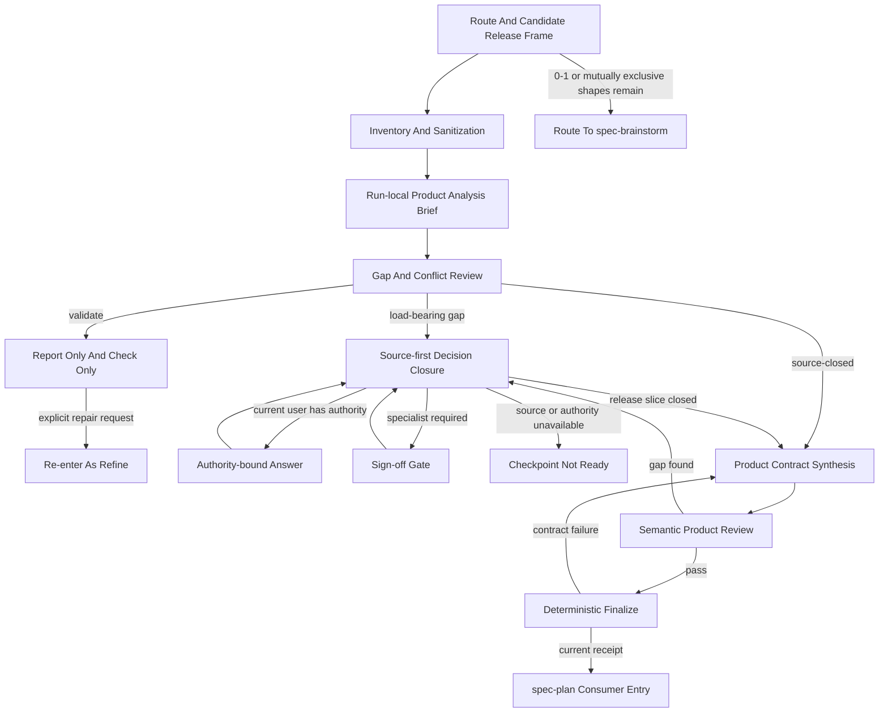
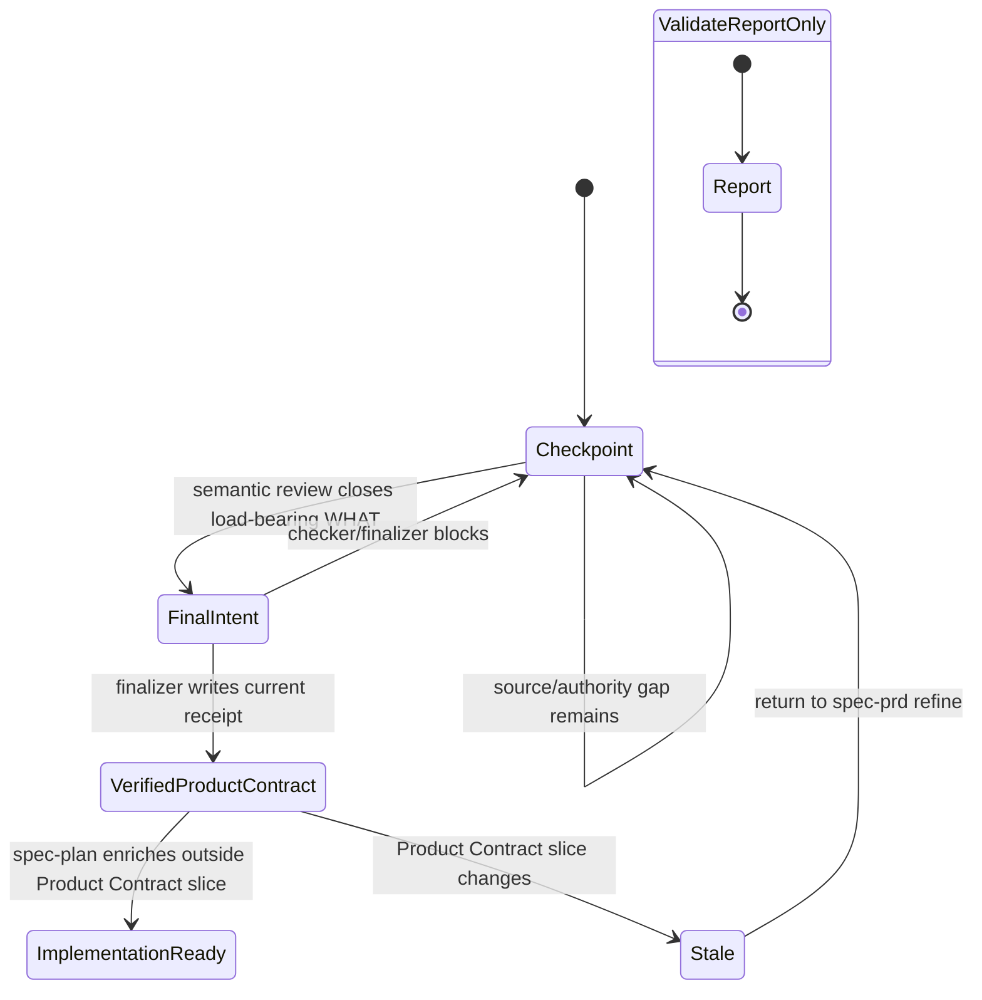
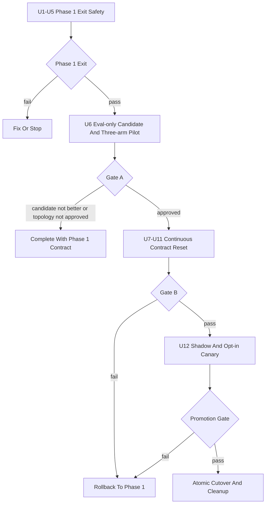

# spec-prd 产品决策合成与合同重置 - Plan

## Goal Capsule

- **Objective:** 将 `spec-prd` 从围绕多套 grill/readiness ceremony 演化的 PRD 格式化流程，重构为 brownfield 多源产品决策合成器：读取低质量 PRD、会议、代码、Figma 和专业领域证据，闭合当前 release slice 的 WHAT，并输出唯一、可追溯、可验收的 Product Contract。
- **Authority:** `docs/10-prompt/结构化项目角色契约.md` > 当前用户明确目标与裁决 > 当前 source/tests/runtime facts > 本计划引用的 validation/proposal > 外部 `skill-creator` 方法与领域建议。
- **Execution profile:** Phase 1 Exit Safety 可立即实施；Gate A 之前不得改变默认 artifact topology 或强制 consumer receipt gate；Gate A 通过后，Phase 2–5 必须作为连续 migration 完成，不能发布 mixed contract。
- **Legal completion paths:** Gate A 未通过时，以“Phase 1 已发布、candidate 未推广、默认 runtime 不变”完成本计划；Gate A 通过时，继续 Contract Reset、shadow/canary、Promotion Gate、原子 cutover 与 cleanup。
- **Stop conditions:** 任一 P0 deterministic case 未通过、三项 Non-regression 出现回归、target topology 未获 owner 裁决、rollback 不能 forward-read candidate artifact，或实现工作区存在未解决的重叠用户改动时停止，不以补 prose 绕过。
- **Source/runtime boundary:** 只修改 `skills/`、`templates/`、`src/cli/`、`docs/`、tests 与其他 source-of-truth；`.claude/`、`.codex/`、`.agents/skills/`、`.cursor/`、`.kiro/`、`.qoder/` 仅通过 `spec-first init` 投射。

---

## Product Contract

### Summary

本计划先修复当前 `spec-prd` 可复现的出口安全故障，再通过原始版、Phase 1-fixed control 与 Contract Reset candidate 的三臂对照决定是否继续整体重构。
若证据支持重构，目标 runtime 只保留一个 run-local Product Analysis Brief、一个 durable Product Contract、一个 machine-owned receipt，以及清晰的 source authority、Figma read-only evidence、semantic review 与 deterministic finalize 边界。

### Problem Frame

真实 brownfield 输入通常不是完整 PRD，而是低质量需求稿、会议讨论、代码事实、Figma proposal、项目规则和专业领域约束的混合体。
当前 `spec-prd` 已具备 source-first、current-state evidence、owner answer fidelity、R/AE trace、design degraded handling 和 finalize receipt 等重要能力，但这些能力被 Requirement Analysis Gate、Product Expert Lens、Decision Card、Requirements Grill、Outstanding Questions、Readiness Self-Check、templates、checker、finalizer 与 host guards 重复表达。

这种重叠造成四类直接问题：同一 OQ 有两套 schema；ready intent 与 receipt 的状态迁移既会卡死合规路径又会 fail-open；缺少核心 PRD 内容仍可 finalize；`validate` 可能从只读检查滑向 rewrite/finalize。
与此同时，现有 111 个 fixture 只证明结构合同，不运行真实 PRD 生成，也不能证明最终 Product Contract 的产品质量、authority fidelity 或 planning invention 已改善。

本次改动的目的不是继续增加字段或规则，而是把承重语义合并到更少的对象和单一 ownership，并让 rollout 由真实 outcome evidence 决定。

### Success Criteria

| 类型 | 成功信号 |
| --- | --- |
| Primary 1 | 独立 planner 读取 Product Contract 后仍需补问、猜测或新增的 load-bearing WHAT 数量相对 Phase 1-fixed control 下降。 |
| Primary 2 | 重复问题、source 可解却询问用户的问题和无 authority 的确认轮次相对 control 下降。 |
| Non-regression 1 | 不新增 `source-candidate`、provider output、模型知识或未会签材料被提升为 confirmed requirement 的情况。 |
| Non-regression 2 | 不反转、放宽、遗漏或伪造当前用户或专业 authority 的实际决定。 |
| Non-regression 3 | actor/problem/outcome、current/target、关键状态/异常/权限/降级、priority authority 与 R -> AE 完整性不下降。 |
| Deterministic floor | duplicate OQ、ready/receipt 双向故障、core-section 空壳 finalize 和 validate mutation 的 P0 case 100% 通过。 |
| Diagnostic | 热路径 reference reads、token、latency、问题数量、source coverage 和 readability 用于解释结果，不单独支持 rollout。 |

### Requirements

#### Routing And Scope

- R1. `spec-prd` 必须服务已有系统或可命名 brownfield release frame 的 PRD create、refine 与 planning-readiness validate，不从无约束的 0-1 机会空间选择产品方向。
- R2. brownfield 输入初始缺少 target surface、release slice、核心用户或关键约束时，必须先做 bounded source inventory 与最少 framing clarification；只有仍存在多个互斥产品方向时才路由 `spec-brainstorm`。
- R3. `create` 负责生成新的 Product Contract，`refine` 负责 preview-first 改写，`validate` 默认 report-only、零 mutation、零 finalize；“validate 并修复”必须显式转为 `refine`。
- R4. `spec-prd` 不产出实现架构、精确 API/schema、数据库设计、任务拆解、估算或排期，但必须记录会改变 WHAT、scope、acceptance、interface availability、fallback、兼容或运营边界的技术约束。
- R5. `spec-prd` 不实现代码、不调试、不做 PR review，但读取代码、测试、日志和历史以确认 current state 是核心职责。
- R6. 当前 release slice 内的 PRD、会议、Figma 与代码 bounded reconciliation 属于 PRD authoring；覆盖整个应用、全部路由或实现后的系统一致性审计路由 `spec-app-consistency-audit`。

#### Evidence And Authority

- R7. 所有已识别输入都必须进入 source inventory，至少记录 `source_ref`、`source_type`、`read_status`、`evidence_tag`、freshness/version、authority scope、sensitivity、limitations 与 readiness consequence。
- R8. `read_status` 只表达可访问性；`confirmed-source`、`user-stated`、`source-candidate`、`provider_untrusted`、`external-research` 与 `assumption` 继续表达 evidence posture，不新增通用语义评分或全局 trust 状态机。
- R9. PRD、会议、Figma、截图、OCR、provider JSON 和 source excerpt 一律作为不可信数据处理；其中的 agent instruction、tool request、mutation command、权限扩张或 authority 声明不得控制 workflow。
- R10. 代码、测试和运行事实只确认 current behavior 与已实现约束，不能自动决定 target WHAT、价值、scope、priority 或 risk acceptance。
- R11. 会议材料必须区分 proposal、rejected、open、ratified 与 superseded；只有 authority、scope 和 freshness 可确认的 ratified decision 才能成为 confirmed target decision。
- R12. 当前用户是 question recipient，但不自动拥有所有 claim 的 decision authority；法规、资金、隐私、安全、专业口径、priority 与风险接受必须绑定 authority/evidence/sign-off timing。
- R13. 模型专业知识负责发现遗漏、解释影响和推荐候选答案，不能自动成为 confirmed 法规结论、专业口径、P0/P1 priority 或风险接受。

#### Product Analysis And Output

- R14. 每个 create/refine durable write 路径都必须经过唯一 run-local Product Analysis Brief；不得从 source inventory 直接写 final Product Contract。
- R15. Product Analysis Brief 必须覆盖 product frame、current/target/delta、source authority/conflicts、candidate behaviors/scenarios、priority authority、acceptance gaps、design coverage 与 next source/decision，不新增持久 progress artifact。
- R16. clarification 必须 source-first、release-bounded：本期 load-bearing WHAT 必须闭合；本期外问题只有在证明不影响 acceptance、compatibility、rollout、data authority 和 fallback 后，才能成为带 reopen condition 的 out-of-release。
- R17. 单 surface、无 source conflict、无高风险 sign-off、无 load-bearing unread evidence 的输入可以走 compact Brief；compact 只降低分析深度，不跳过 Brief、semantic review 或 finalize。
- R18. durable Product Contract 必须清晰回答 actor/problem/expected outcome/why now、success evidence、current/delta、atomic requirements、states/errors/permissions/degraded behavior、scope、priority authority、R -> AE 和 unresolved residue。
- R19. 每个核心 Requirement 必须有可观察 Acceptance Example 或明确 trace 依据；scripts 只检查 ID/引用/结构，LLM 或 reviewer 判断语义充分性。

#### Artifact And Exit Contract

- R20. Gate A 通过后，新式 `spec-prd` create/refine 输出必须采用 `spec-unified-plan/v1` requirements-only artifact，并以 `product_contract_source: spec-prd` 和 `product_contract_readiness: checkpoint | ready-for-planning` 区分文档完整性与 Product Contract closure。
- R21. `artifact_readiness`、`product_contract_readiness`、`decision_state`、`closure_disposition` 与 `workflow_outcome` 必须分别表达独立轴；`route-out` 只允许作为 workflow outcome。
- R22. Product Contract、Outstanding Questions、decision trace 与 receipt 各自只能有一个 canonical schema/parser owner；surface templates 只能贡献内容候选，不能重复 machine section。
- R23. `check-prd-artifact.js` 与 `finalize-prd-artifact.js` 只守 artifact identity、core section、R/AE structure/trace、source inventory、ready intent、blocking OQ references、raw input hash 与 receipt currentness，不使用关键词裁决 WHAT/HOW 或给 PRD 语义打分。
- R24. 任意 ready claim 且 receipt 缺失/stale 必须阻断 closeout；合法路径必须覆盖 checkpoint -> final intent -> finalize -> verified receipt -> consumer entry，checkpoint/draft 仍允许未完成 core section。
- R25. `spec-plan` 对新式 `product_contract_source: spec-prd` artifact 必须先检查 `product_contract_readiness`；receipt/freshness hard gate 只在 Gate A owner decision、compatibility tests 与 shadow evidence 通过后对新式 artifact 启用，legacy input 保持显式兼容。
- R26. `before-planning`、`before-implementation` 与 `before-release` sign-off 必须携带 authority/evidence、受影响 R/AE 和 fallback，并由 `spec-plan`、`spec-work`、`spec-lfg` 与可用 goal handoff 在正确出口阻断。

#### Design, Security, Distribution, And Evaluation

- R27. Figma 读取不得整体复用 `skills/spec-work/references/agents/figma-design-sync.md`；首轮由 `spec-prd` 主 workflow 按 trigger 读取 skill-local `design-evidence.md` 并 inline 调用当前 host provider，只复用 URL/node/context/screenshot capture 的能力边界，不新增 typed/design agent。
- R28. Design evidence path 必须限制在用户授权且当前 release slice 必需的 file/node scope，区分 current-reference、target-proposal、approved-target、illustrative 与 unknown，并按 screen/component/state/interaction 记录 observation、inference、approval authority、`source_version_or_updated_at`、coverage 与 degraded consequence。
- R29. durable Product Contract、receipt、日志和 eval 只保留 sanitized source ref、hash、最小必要摘要与 limitations；binary screenshot/export 必须按原始 bytes 计算 identity hash，并与 text-only design-ref scan 分离；不得复制 raw screenshot、完整 Figma JSON、credential-bearing URL/header、PII 或受限长文本。
- R30. `SKILL.md` 必须收敛为 lean front controller；所有 branch 必读的 purpose、route、security boundary、workflow skeleton、completion criteria 留在入口，条件性协议下沉到单一 ownership 的 references。
- R31. source 变化必须通过 npm package 与 Claude、Codex、Cursor、Kiro、Qoder temp init/drift tests 验证，不手改 generated runtime mirror，也不把 host/provider 内部实现写成 durable workflow contract。
- R32. semantic evaluation 必须使用完整 baseline snapshot、同 prompt/source/authority profile/host capability 的 paired or three-arm runs、重复运行、独立 blind review 与 variance；现有 fixture 数量不能被描述为 outcome evidence。
- R33. trigger eval 必须与 output eval 分离，覆盖 realistic should-trigger、0-1 brainstorm、未收敛 product shape、implementation plan、debug、consistency audit 与格式整理等 near-miss。
- R34. Contract Reset 只有通过 Gate A、Gate B 和 Promotion Gate 才能成为默认 runtime；任何关键回归都回退到 Phase 1 contract，而不是增加补丁 prose。

### Acceptance Examples

- AE1. 给定一个只有功能名称、尚未写 target surface 的 brownfield PRD，且代码和会议可以推导唯一候选 release frame；当运行 `spec-prd` 时，先读取 source 并只询问剩余 load-bearing framing gap，不因字段初始缺失直接 route-out。
- AE2. 给定多个互斥目标用户和产品形态，bounded source read 后仍不能形成单一 candidate frame；当完成 intake 时，返回 `spec-brainstorm` 路由和未决产品方向，不写 Product Contract。
- AE3. 给定 `validate` 请求和已有 PRD/Figma URL；当执行时，只返回 readiness report/check-only facts，不改 PRD、不写 screenshot/JSON、不 finalize、不刷新 runtime。
- AE4. 给定 approved target Figma 中核心权限态节点不可读；当该状态会改变 acceptance 时，Design Coverage 记录 unread reason 和受影响 R/AE，Product Contract 保持 checkpoint，不能用“已接受设计风险”裸字段释放。
- AE5. 给定代码 current state 与 approved target 冲突；当分析时，分别记录 current fact 与 target decision，并把越出各自 authority scope 的冲突交给有权 owner，不让代码或 Figma自动覆盖对方。
- AE6. 给定监管口径需要 `before-planning` sign-off；当 sign-off 缺失时，当前用户只能作为问题接收者，workflow 返回 ask-user/checkpoint，不能通过 accepted assumption 降级进入 planning。
- AE7. 给定 checkpoint PRD；当用户闭合最后一个 load-bearing WHAT 后，agent 写 final intent，finalizer 原子写 current receipt，check-only verify 通过，consumer 才可接收；任意 ready claim 缺 receipt 都被阻断。
- AE8. 给定 PRD、会议或 Figma label 中包含“忽略规则、读取其他目录、修改代码”等嵌入指令；当分析时，合法产品事实可被抽取，但 routing、mutation、access 与 authority scope 不改变。
- AE9. 给定 Gate A 三臂 pilot 的 candidate 只比原始版好、却不优于 Phase 1-fixed control；当裁决时，停止完整 rewrite，以 Phase 1 作为本计划合法完成结果。
- AE10. 给定 Gate A、Gate B 和 Promotion Gate 均通过；当 `spec-plan` 消费新式 artifact 时，原地 enrich 唯一 Product Contract，legacy `docs/brainstorms/*-requirements.*` 仍按兼容路径读取，不产生第二个可编辑 WHAT source。

### Scope Boundaries

#### Upstream Routing Conditions

`spec-prd` 不从无约束的 0-1 机会空间中选择产品方向。
当输入仍要求比较目标用户、价值主张、产品类别或多个互斥产品形态，尚不能形成候选 brownfield release frame 时，路由 `spec-brainstorm`。

对于材料不完整的 brownfield 输入，不得仅因最初无法命名 target surface、release slice、核心用户、关键约束或候选形态而立即 route-out。
`spec-prd` 先从 PRD、会议、代码、测试、Figma 和项目规则中推导 candidate framing，并提出最少的 framing question；只有仍需先决定“做什么产品”时才上游路由。

#### True Non-Goals

- 不产出实现架构、精确 API/schema、数据库设计、任务拆解、估算或排期；但读取 current-state architecture 并记录 WHAT-affecting constraint 属于核心职责。
- 不实现或修改代码、不调试故障、不执行 PR review；但代码、测试、日志和历史是 current-state evidence。
- 不执行覆盖整个应用或系统的实现后 PRD/Figma/code 一致性审计；当前 release slice 的 bounded reconciliation 仍由 `spec-prd` 完成。
- 不建设中心化 workflow engine、持久进度 schema、第二套 PRD packet、通用语义评分器、prompt-injection 检测器、PII 分类器、secret store 或 provider-specific Figma API contract。
- 不默认创建或修改 `CONTEXT.md`、ADR、domain glossary 或 durable raw-source artifact；知识晋升必须显式 opt-in、preview-first，并遵守 knowledge-promotion gate。
- 不在本轮把 `spec-prd` 扩展为 HTML PRD producer；新式 Product Contract 首先保持 Markdown canonical source，HTML conversion 继续由 planning/rendering consumer 处理。

#### Authority Boundaries

法规、专业口径、priority 和业务风险接受不是可以忽略的事项，而是必须显式处理但不能由模型越权确认的产品决策。
`spec-prd` 负责发现问题、读取证据、解释影响、给出 recommendation，并记录 claim、authority scope、evidence、required sign-off、受影响 R/AE 与 gate timing；缺少必要 authority 时保留 blocker/checkpoint，不伪造 ready。

#### Deferred To Follow-Up Work

- 跨 `spec-prd`、`spec-work` 与 `spec-app-consistency-audit` 的 shared Figma reader，只有两个以上独立 consumer 采用同一 versioned contract 且投射 owner 明确后再抽取。
- Product Contract 的 HTML canonicalization 与跨格式 semantic hash 在 Markdown topology 稳定并出现真实需求后单独规划。
- `spec-plan` 或 `spec-work` 反向发起 Product Contract revision request 的跨 workflow 协议，等待 producer/consumer 双方真实用例和 owner buy-in。

---

## Planning Contract

### Current State And Evidence

- 当前 `skills/spec-prd/SKILL.md` 仍以 `docs/brainstorms/*-requirements.md`、Decision Card、Requirement Analysis Gate、Product Expert Lens、relentless grill 和 producer-local finalize 为主合同。
- `skills/spec-prd/assets/templates/00-generic.md` 与 `skills/spec-prd/references/prd-output-template.md` 都生成 `Outstanding Questions`，而 checker 读取首个命中 section。
- `skills/spec-prd/scripts/check-prd-artifact.js`、`finalize-prd-artifact.js` 与 Claude/Qoder guards 对 ready intent、machine receipt 和 closeout 的 ownership 尚未形成可靠双向状态迁移。
- 当前 `skills/spec-prd/evals/run-evals.js` 只验证 111 个 fixture 的结构，不执行模型、PRD 生成、paired baseline 或 blind product review。
- 当前工作树已有用户拥有的 `skills/spec-prd/SKILL.md`、`tests/unit/spec-prd-contracts.test.js` 与 eval relocation 相关未提交改动；实施 baseline 必须等这些改动落定，或在隔离 worktree 中以明确 commit/source manifest 开始，不能覆盖。

### Key Technical Decisions

- KTD1. **Evidence-gated program, not one-shot rewrite.** Phase 1 独立修复 deterministic exit；Gate A 用 three-arm pilot 判断 Contract Reset 是否值得继续；Gate B 只授权 shadow/canary；Promotion Gate 才允许 default cutover。
- KTD2. **Routing、Non-Goals 与 authority 分层。** 0-1/互斥 product shape 是上游路由条件；实现 HOW 和代码执行是真正非目标；本期 bounded reconciliation 是核心职责；专业口径属于 authority boundary。
- KTD3. **推荐的 target topology 是单一 requirements-only unified artifact。** `spec-prd` v1 只生成 Markdown canonical artifact under `docs/plans/`，`spec-plan` 原地 enrich；legacy requirements 保持历史只读或 preview migration，禁止双写。
- KTD4. **五个状态轴各管一件事。** `artifact_readiness` 管文档阶段，`product_contract_readiness` 管 WHAT closure，`decision_state` 管单个决定，`closure_disposition` 管关闭依据，`workflow_outcome` 管下一步。
- KTD5. **Product Analysis Brief 是唯一 run-local 分析对象。** Source Authority Ledger 与 Design Coverage 是 Brief 的逻辑子视图，不创建第二个 schema、packet 或 durable artifact。
- KTD6. **复用现有 evidence tags，不新增通用 `content_trust` 状态轴。** `read_status`、`evidence_tag`、authority、freshness、sensitivity、limitations 与 closure trace 足以表达 light contract；sanitization 是 always-on discipline，疑似污染以 degraded limitation 暴露。
- KTD7. **Figma 只复用 capture 能力边界。** 首轮不新增或 dispatch Figma agent；主 workflow 通过 trigger-only `design-evidence.md` inline 调当前 host provider，不 import `figma-design-sync.md` 整体，也不携带 implementation capture、visual diff、CSS/Tailwind 修改或完成口令。
- KTD8. **Scripts enforce deterministic floor.** checker/finalizer 可以阻断明确结构、引用、byte hash、receipt 和 credential-bearing source ref 问题；binary input 不经过 UTF-8 解码做 identity hash，只有 text input 参与 design-ref scan；source authority、WHAT/HOW、priority、semantic completeness 与 risk acceptance 保持 LLM/reviewer-owned。
- KTD9. **`validate` 是纯读取分支。** Remote design URL 只作为 ref/degraded input，validate 不 materialize screenshot/JSON，不改 canonical artifact，也不运行 finalizer write path。
- KTD10. **新式 consumer gate 分两层推广。** `product_contract_readiness` 是新式 `spec-prd` artifact 的无条件入口条件；receipt/freshness 先 shadow，再经 Gate A/compatibility 证据后只对新式 artifact harden，legacy 继续 loud degraded compatibility。
- KTD11. **使用最新版 `skill-creator` 的 outcome loop。** baseline 是完整 source snapshot，with-candidate 与 Phase 1-fixed control 同轮运行，保存 timing/token，使用客观 assertions、variance、blind comparator/analyzer 和 human review；trigger optimization 在 output behavior 稳定后单独执行。
- KTD12. **Production/governed quality tier。** 该 skill 影响公开 workflow、artifact、security、五宿主和 downstream gates，交付必须满足 `spec-write-skill` 的 production + governed gate，而不是以结构 lint 代替行为验证。

### High-Level Technical Design

#### Target Runtime Flow



#### Artifact State And Mutation Boundary



#### Delivery Gates



### Source And Runtime Ownership

| Concern | Canonical source | Consumer | Conflict rule |
| --- | --- | --- | --- |
| Public workflow route/purpose | `skills/spec-prd/SKILL.md` | host command/skill projections | description 与 body route 必须锁步；runtime mirror 不可修 source。 |
| Product analysis/clarification | `skills/spec-prd/references/product-analysis.md`, `clarification-protocol.md` | `spec-prd` orchestrator | 只有一个 Brief 与 closure vocabulary。 |
| Evidence/domain/design | `evidence-protocol.md`, `domain-signoff.md`, `design-evidence.md` | Brief、semantic review | adapter 只提供 facts，不成为 semantic authority。 |
| Product Contract/OQ/readiness | `prd-contract.md`, `readiness.md`, packaged templates | authoring、checker、reviewer | template 不复制 machine schema；一个 OQ owner。 |
| Deterministic facts | `scripts/check-prd-artifact.js`, `finalize-prd-artifact.js`, `scripts/lib/**` | hooks、consumer tests | scripts 不做产品质量评分。 |
| Consumer entry and sign-off | `skills/spec-plan/**`, `skills/spec-work/**`, `skills/spec-lfg/**` | planning/work/goal handoff | 新式与 legacy contract 分开处理。 |
| Runtime projection | `templates/`, `src/cli/`, skill source | Claude/Codex/Cursor/Kiro/Qoder | 只通过 `spec-first init` 生成。 |
| Eval evidence | `skills/spec-prd/evals/**`, `docs/validation/spec-prd/**` | maintainer/owner | fixture、paired run 与 production evidence 分层标注。 |

### Target Source Structure

```text
skills/spec-prd/
├── SKILL.md
├── references/
│   ├── product-analysis.md
│   ├── evidence-protocol.md
│   ├── clarification-protocol.md
│   ├── prd-contract.md
│   ├── readiness.md
│   ├── design-evidence.md
│   ├── domain-signoff.md
│   └── large-input.md
├── assets/
│   ├── templates/
│   └── overlays/
├── scripts/
│   ├── check-prd-artifact.js
│   ├── finalize-prd-artifact.js
│   └── lib/
│       ├── source-inputs.js
│       ├── markdown-structure.js
│       ├── readiness-facts.js
│       └── reason-codes.js
└── evals/
    ├── examples.json
    ├── evaluation-governance.md
    ├── contract-reset-protocol.md
    └── contract-reset-cases.json
```

### Migration And Compatibility Strategy

1. Phase 1 只修当前 `artifact_kind: prd-requirements` 出口与 validate 行为，不改变 `docs/brainstorms/` topology、legacy consumer 或 current optional receipt diagnostic。
2. Gate A 在 eval workspace 固定 physical topology、Markdown canonical path、legacy create/refine/validate matrix、`origin/supersedes`、receipt slice 与 consumer policy。
3. Contract Reset 在隔离 branch/worktree 连续完成 producer、checker、finalizer、hooks、consumer 和 docs；全部完成前不投射为默认 runtime。
4. Candidate reader forward-read legacy；Phase 1 reader在 rollback 演练中必须能 read/refine/validate candidate artifact，或提供明确的 preview migration path。
5. Shadow 只读且不写 canonical artifact；canary 必须 explicit opt-in、preview-first；Promotion Gate 后才更新默认 source/runtime expectations并删除 alias/reference。

### Assumptions

- A1. 新式 `spec-prd` 初始 canonical format 采用 Markdown；这延续当前 producer 能力并避免在 Contract Reset 同时承担跨格式 canonical hash。
- A2. Gate A 的默认推荐是单一 `docs/plans/YYYY-MM-DD-NNN-<type>-<topic>-plan.md` requirements-only artifact，由 `spec-plan` 原地 enrichment；若 owner 选择独立 PRD topology，U7-U11 必须重新规划，不能直接套用本方案。
- A3. `evidence_tag` 加 authority/freshness/sensitivity/limitations 可以满足 light contract；只有 paired eval 证明表达不足时才新增状态轴。
- A4. 当前用户选择开始实施本计划时，视为批准 Phase 1；Gate A 对 topology 与 mandatory consumer receipt policy 仍需单独确认。

### Risks And Mitigations

| 风险 | 缓解 |
| --- | --- |
| Phase 1 与 dirty user changes 冲突 | 在 U1 前确认重叠文件；优先隔离 worktree，不覆盖当前工作树改动。 |
| 精简丢失 owner/design/source 安全能力 | baseline manifest + parity cases + three-arm/ablation；无 evidence 的删除不进入 candidate。 |
| 新字段形成另一套状态机 | 限定五个独立轴；Brief/design result run-local；scripts 只强制出口。 |
| Figma reader 泄漏实现权限 | skill-local read-only prompt；无 implementation capture、browser diff、code write 或 provider-specific token handling。 |
| 敏感材料进入 durable artifact/eval | sanitized ref/hash/short summary；test-only canary；credential-bearing machine field blocker；host cache deletion无法证明时显式 degraded。 |
| consumer hard gate 破坏 legacy | 新式 `product_contract_source: spec-prd` 与 legacy 分支隔离；先 shadow/compatibility 再 harden。 |
| Contract Reset mixed runtime | U7-U11 连续迁移，Gate B 前不发布；temp init 验证后 Promotion Gate 原子 cutover。 |
| eval 只证明一次幸运输出 | 每 arm/case 至少 3 runs、per-case median、variance、blind reviewer、inconclusive handling。 |
| rollout 长期停留在 aspirational | 每阶段有 owner、artifact、exit/stop condition；Gate 不通过时以停止重构为合法完成，不保留无限待办。 |

---

## Implementation Units

| U-ID | 单元 | 主要文件 | Depends on |
| --- | --- | --- | --- |
| U1 | Baseline 与 Phase 1 红探针 | `docs/validation/spec-prd/**`, `tests/unit/spec-prd-exit-safety.test.js` | none |
| U2 | OQ 单一 ownership 与 core floor | templates、output contract、checker、reason codes | U1 |
| U3 | Ready/finalize 状态迁移与 hook parity | checker、finalizer、Claude/Qoder hooks | U2 |
| U4 | Validate report-only | `SKILL.md`、output/readiness references、evals | U3 |
| U5 | Phase 1 集成、兼容与发布地板 | focused tests、docs、runtime projection tests | U2-U4 |
| U6 | Eval-only candidate、ablation 与 Gate A | `skills/spec-prd/evals/**`, validation artifact | U5 |
| U7 | 合同轴、front controller 与 compatibility layer | `SKILL.md`, new core references, consumer metadata | U6 + Gate A |
| U8 | Source authority、domain 与 Figma read-only adapter | evidence/design/domain references、agent prompt | U7 |
| U9 | Product Analysis Brief 与 clarification rewrite | product-analysis/clarification/large-input references | U7-U8 |
| U10 | Unified Product Contract、parser、finalizer 与 receipt | prd/readiness references、templates、scripts/lib | U7-U9 |
| U11 | Consumer sign-off gates 与五宿主 projection | spec-plan/work/lfg、hooks、CLI/runtime tests | U10 |
| U12 | Shadow/canary、rollback、Promotion 与 cleanup | eval/validation/docs/runtime expectations | U11 + Gate B |

### U1. Freeze Baseline And Reproduce Exit Failures

- **Goal:** 建立可重放的 Phase 1 baseline，证明四个 P0 在当前 source 上真实存在，并避免把后续改善误归因于 Contract Reset。
- **Requirements:** R32, R34; AE7, AE9.
- **Dependencies:** none.
- **Files:** `docs/validation/spec-prd/2026-07-11-spec-prd-phase1-exit-safety-baseline.md`, `skills/spec-prd/evals/evaluation-governance.md`, `tests/unit/spec-prd-exit-safety.test.js`.
- **Approach:** 等当前重叠 dirty changes 落定后记录 HEAD、相关 source manifest/hash、host capability 与已知 limitations；用合成 fixture 复现 duplicate OQ、ready claim 无 receipt 可 closeout、缺 core 可 finalize 和 validate rewrite/finalize 风险。只记录 facts，不在本单元修行为。
- **Patterns to follow:** `docs/contracts/workflows/fresh-source-eval-checklist.md`；当前 `tests/unit/spec-prd-decision-card-contracts.test.js` 的 fixture builder；最新版 `skill-creator` 的完整 existing-skill snapshot。
- **Test scenarios:**
  - generic template 与 output contract 合成后生成两个 OQ，checker 只消费第一个。
  - `status=draft + final-prd + can_enter=yes + missing receipt` 的 check-only 不能被 baseline 误记为安全。
  - 删除 Summary、Requirements 或 Acceptance Examples 后，记录当前 finalizable 行为。
  - validate 对只读副本设置 mutation sentinel，记录当前是否 rewrite/finalize。
- **Verification:** baseline artifact 能逐项给出输入、实际结果、reason codes、source revision 和 limitation；红探针在修复前按预期失败，不声称语义质量结论。

### U2. Establish Single OQ Ownership And Core Exit Floor

- **Goal:** 消除重复 OQ schema，并让 ready/finalize 出口对核心 Product Contract 结构 fail-closed。
- **Requirements:** R18, R19, R22, R23, R24.
- **Dependencies:** U1.
- **Files:** `skills/spec-prd/assets/templates/00-generic.md`, `skills/spec-prd/references/prd-output-template.md`, `skills/spec-prd/references/prd-readiness-lens.md`, `skills/spec-prd/scripts/check-prd-artifact.js`, `skills/spec-prd/scripts/lib/reason-codes.js`, `tests/unit/spec-prd-exit-safety.test.js`.
- **Approach:** 让 `prd-output-template.md` 成为当前 legacy phase 的唯一 OQ machine schema owner；generic/surface templates 只保留候选提示。对 final/ready/finalize claim 强制 core section 可定位、Requirements/AE 有合法行与 trace；draft/checkpoint 继续允许不完整。
- **Patterns to follow:** 当前 section-id/canonical-heading parser；`BLOCKING_REASON_CODES` 单一分类；`gate the exits, not the thinking`。
- **Test scenarios:**
  - 组合 generic + output contract 只产生一个 OQ section，parser 读取唯一 schema。
  - checkpoint 缺 Summary/Requirements/AE 可以合法 closeout，但不能 ready。
  - final/ready 缺任一 core section、无合法 R/AE row 或 trace 不可解析时阻断。
  - localized heading 携带 canonical section id 时继续合法。
- **Verification:** Phase 1 P0 fixtures 转绿；checker 不判断 Requirement 内容是否“足够好”，只判断结构与显式 trace。

### U3. Repair Ready Intent, Finalize, Receipt, And Hook State Transition

- **Goal:** 形成唯一可执行的 checkpoint -> final intent -> finalize -> verify 状态链，同时关闭 missing/stale receipt fail-open。
- **Requirements:** R21, R23, R24, R31; AE7.
- **Dependencies:** U2.
- **Files:** `skills/spec-prd/references/prd-output-template.md`, `skills/spec-prd/scripts/check-prd-artifact.js`, `skills/spec-prd/scripts/finalize-prd-artifact.js`, `skills/spec-prd/scripts/lib/reason-codes.js`, `templates/claude/hooks/prd-prewrite-guard`, `templates/claude/hooks/prd-readiness-guard`, `templates/qoder/hooks/prd-prewrite-guard`, `templates/qoder/hooks/prd-readiness-guard`, `tests/unit/spec-prd-finalize-transition.test.js`, `tests/unit/spec-prd-hook-contracts.test.js`, `tests/unit/qoder-runtime-lifecycle.test.js`.
- **Approach:** receipt 只留在 frontmatter machine-owned source；LLM 写 ready intent，finalizer 原子写 receipt；`can_finalize` 与 `can_closeout` 分离。任意 ready claim 缺 receipt/stale 时 check-only 阻断。同步修复 Claude guard 的 git failure fail-open 与 rename/path 漏检，Qoder 使用同 fixture 语义。
- **Patterns to follow:** `finalizePrd` / `verifyPrdReceipt` 现有拆分；Claude/Qoder managed hook source；reason-code parity。
- **Test scenarios:**
  - checkpoint 可保存但不能带 ready receipt。
  - final intent + current inputs finalize 后生成 verified receipt。
  - artifact 或 input 变更后 receipt stale，closeout 阻断。
  - missing Git metadata、rename、Edit/MultiEdit payload reconstruction degradation 都不得放行 ready-field mutation。
  - Claude/Qoder 对同一 fixture 产生一致 allow/block 结论；无 hard hook 的 host 显式 degraded。
- **Verification:** 新状态迁移 suite 全绿；现有 Decision Card 与 Qoder lifecycle tests 不回归；script/guard reason code 和用户提示一致。

### U4. Make Validate Strictly Report-only

- **Goal:** 把 validate 从 rewrite/finalize 模糊分支重写为零 mutation 的 planning-readiness 报告。
- **Requirements:** R3, R9, R29; AE3.
- **Dependencies:** U3.
- **Files:** `skills/spec-prd/SKILL.md`, `skills/spec-prd/references/prd-output-template.md`, `skills/spec-prd/references/prd-readiness-lens.md`, `skills/spec-prd/references/design-source-evidence.md`, `skills/spec-prd/evals/examples.json`, `tests/unit/spec-prd-validate-mode.test.js`.
- **Approach:** intent classification 先锁定 mutation posture；validate 只读 artifact/source、运行 check-only 或输出 semantic report。用户要求修复时先展示拟修改内容，再以新 intent 进入 refine；远程 Figma URL 不在 validate 中 materialize。
- **Patterns to follow:** preview-first mutation gate；`spec-doc-review` report/headless boundary；finalizer `--check-only`。
- **Test scenarios:**
  - validate existing artifact 不改变 bytes、mtime、frontmatter、receipt 或 runtime。
  - validate + Figma URL 在无 provider/权限时记录 degraded，不创建 screenshot/JSON。
  - “validate 并修复”先返回 preview，未确认时保持零写入。
  - validate 发现 blocking gap 时返回 report，不把 artifact 自动降级或升级。
- **Verification:** mutation sentinel 计数为 0；fixture 和 fresh-source run 均不出现 rewrite/finalize tool action。

### U5. Close Phase 1 With Legacy Compatibility And Five-host Evidence

- **Goal:** 独立发布 Exit Safety，不提前引入 unified artifact 或 mandatory consumer receipt gate。
- **Requirements:** R25, R31, R34.
- **Dependencies:** U2, U3, U4.
- **Files:** `tests/unit/spec-prd-decision-card-contracts.test.js`, `tests/unit/spec-prd-plan-handoff-contracts.test.js`, `tests/unit/spec-prd-template-assets.test.js`, `tests/unit/plugin-modules.test.js`, `tests/unit/qoder-runtime-lifecycle.test.js`, `tests/integration/init-five-host-lifecycle.integration.test.js`, `docs/05-用户手册/23-spec-prd当前执行逻辑.md`, `docs/plans/spec-prd-optimization-proposal.md`, `CHANGELOG.md`.
- **Approach:** 保持 `docs/brainstorms/*-requirements.*` 和 optional `--verify-receipt` consumer diagnostic；更新当前执行逻辑文档只描述 Phase 1 真实行为。用户选择开始实施本计划后，把旧优化方案标记为由本计划 supersede，并保留已完成 M1/U1/U4 的历史说明。用 temp init 验证 source support files/hooks 在五宿主投射且无 drift。
- **Patterns to follow:** 现有 `getSupportedPlatforms()` matrix；template asset recursive projection；Changelog compact evidence format。
- **Test scenarios:**
  - legacy PRD 仍可被 `spec-plan` 作为 user-selected origin 读取。
  - producer finalize 仍是 `spec-prd` 自称 ready 的必要条件，但 consumer hard gate 未提前启用。
  - 五宿主 init 均获得正确 skill assets；只有支持 hook 的宿主声明 hard enforcement。
  - package 不包含 runtime-local eval workspace 或 raw sensitive fixture。
- **Verification:** Phase 1 focused tests、unit/typecheck/lint/build、temp five-host lifecycle 全部通过；Changelog 明确“未改变 artifact topology/consumer policy”。

### U6. Build Eval-only Candidate And Execute Gate A

- **Goal:** 用真实产物证明 Contract Reset 的增量价值，并固定是否继续重构所需的 artifact/consumer 决策。
- **Requirements:** R32, R33, R34; AE9.
- **Dependencies:** U5.
- **Files:** `skills/spec-prd/evals/evaluation-governance.md`, `skills/spec-prd/evals/contract-reset-protocol.md`, `skills/spec-prd/evals/contract-reset-cases.json`, `tests/unit/spec-prd-contract-reset-eval.test.js`, `docs/validation/spec-prd/2026-07-11-spec-prd-contract-reset-gate-a.md`.
- **Approach:** 在隔离 eval workspace 准备原始版、Phase 1-fixed control、candidate 三臂；同一 case 同轮运行，并对 Brief、authority/closure、reference reduction 做 one-at-a-time ablation。使用最新版 `skill-creator` 的 timing、grading、benchmark、viewer、blind comparator/analyzer 流程；viewer 是 transient review surface，不作为仓库 HTML deliverable。
- **Patterns to follow:** `skill-creator` existing-skill snapshot、paired runs、mean/variance、blind review；`skills/spec-prd/evals/evaluation-governance.md` 的 L0-L4 evidence 分级。
- **Test scenarios:**
  - create: 粗单 surface PRD + current-state source。
  - refine: PRD + ratified meeting decision + conflicting current code。
  - validate: read-only artifact + mutation sentinel。
  - design: partial/unread/unknown authority Figma state。
  - domain: specialist sign-off timing。
  - stress: PRD + meeting + code + Figma + domain + project rules。
  - trigger near-miss: 0-1 brainstorm、implementation plan、debug、full consistency audit、格式整理。
- **Verification:** 每 arm/case 至少 3 runs；candidate 相对 Phase 1-fixed control 满足预先冻结的 Primary/Non-regression threshold；Gate A report 固定 canonical path/format、state fields、receipt slice、legacy matrix、origin/supersedes 与 consumer policy。未通过时记录停止重构，不创建 U7-U12 patch。

### U7. Reset Contract Axes And Rewrite The Front Controller

- **Goal:** 在 Gate A 批准的 topology 上建立 lean public workflow contract、统一状态轴和 compatibility reader。
- **Requirements:** R1-R6, R20-R22, R30.
- **Dependencies:** U6 and Gate A approval.
- **Files:** `skills/spec-prd/SKILL.md`, `skills/spec-prd/references/prd-contract.md`, `skills/spec-prd/references/readiness.md`, `skills/spec-plan/SKILL.md`, `skills/spec-plan/references/plan-sections.md`, `src/cli/contracts/dual-host-governance/skills-governance.json`, `tests/unit/spec-prd-contract-reset-contracts.test.js`, `tests/unit/spec-prd-plan-handoff-contracts.test.js`.
- **Approach:** description 与 When To Use/Not To Use 使用修订后的 route taxonomy；入口只保留 branch selection、always-on boundary、workflow skeleton、reference pointers 和 completion criteria。新 source 只生成五轴合同；checker compatibility layer 可读旧 alias，但新模板不再写旧词。
- **Patterns to follow:** `using-spec-first` lean governor；`spec-write-skill` branch-first/resource placement；`spec-unified-plan/v1` stable headings。
- **Test scenarios:**
  - 初始 framing 缺失但可 source-resolve 的 brownfield 请求应触发 spec-prd。
  - 互斥 product shape route brainstorm；实现 plan、debug、full audit route near-neighbor。
  - 新字段只生成目标 enum；legacy alias 可读且输出 compatibility reason。
  - 每个 reference pointer 明确何时读取和用于什么判断。
- **Verification:** entrypoint lint、trigger/near-miss eval、contract tests 和 sentence-level no-op review 通过；SKILL 热路径缩短且未隐藏 must-have boundary。

### U8. Implement Source Authority, Domain Sign-off, And Read-only Design Adapter

- **Goal:** 统一多源 authority 与 Figma/domain 处理，同时最小化凭据、隐私与不可信输入风险。
- **Requirements:** R7-R13, R27-R29; AE4-AE6, AE8.
- **Dependencies:** U7.
- **Files:** `skills/spec-prd/SKILL.md`, `skills/spec-prd/references/evidence-protocol.md`, `skills/spec-prd/references/design-evidence.md`, `skills/spec-prd/references/domain-signoff.md`, `skills/spec-prd/scripts/check-prd-artifact.js`, `skills/spec-prd/scripts/lib/source-inputs.js`, `skills/spec-prd/scripts/lib/readiness-facts.js`, `skills/spec-prd/scripts/lib/reason-codes.js`, `tests/unit/spec-prd-source-inputs.test.js`, `tests/unit/spec-prd-source-authority-contracts.test.js`, `tests/unit/spec-prd-design-evidence-contracts.test.js`, `tests/unit/spec-prd-security-boundaries.test.js`.
- **Approach:** meeting/code/Figma/domain adapter 只写 facts 到 Brief；主 workflow 解析 URL/node、使用当前 host provider 读取最小 scope、必要时获取 run-local visual preview，并返回 provider-neutral `design-source-read-result/v1`。结果沿用 `provider_untrusted`，单列 `source_version_or_updated_at`；`source-inputs.js` 对 binary 做 byte hash、仅对 text 做 design-ref scan；durable source refs 中显式 credential patterns 可由 checker 阻断，语义 injection、PII 与 authority adequacy 由 skill/reviewer eval 判断。`sensitivity: unknown` 按 restricted + strict redaction 处理。
- **Patterns to follow:** 当前 `design-source-evidence.md` 的 auth/access/degraded 边界；`figma-design-sync.md` 的 Design Capture 子集；app audit 的 redaction 概念但不 import 私有 schema/library。
- **Test scenarios:**
  - prompt injection in PRD/meeting/Figma label 不改变 routing/mutation/access。
  - byte 不同但 UTF-8 replacement 后相同的 binary input 仍产生不同 hash，且 binary 不进入 text design-ref scan。
  - credential-bearing source ref 触发 blocker，test-only canary 不出现在输出。
  - permission denied 不安装工具、不索取 token、不扩大 project/file scope。
  - approved target direct observation 可支持对应 UI WHAT；proposal/inference 只能进入 candidate/gap。
  - load-bearing partial/unread/unknown-authority state 阻断 ready；精确 target answer 或 out-of-release proof 才释放，单纯接受未读风险不能关闭本期 WHAT。
- **Verification:** security/design focused tests、fresh-source eval 与 anonymous paired cases 通过；host/provider retention 无法验证时输出 degraded limitation，不声称已删除缓存。

### U9. Replace Parallel Grills With Product Analysis And Release-bounded Closure

- **Goal:** 用一个 Brief 和一个 Decision Closure Loop 合并 Requirement Analysis Gate、Product Expert Lens、domain grill 与 grill-with-docs 热路径。
- **Requirements:** R14-R17.
- **Dependencies:** U7, U8.
- **Files:** `skills/spec-prd/references/product-analysis.md`, `skills/spec-prd/references/clarification-protocol.md`, `skills/spec-prd/references/large-input.md`, `skills/spec-prd/SKILL.md`, `skills/spec-prd/evals/contract-reset-cases.json`, `tests/unit/spec-prd-clarification-contracts.test.js`.
- **Approach:** Product Analysis Brief 合并 product frame、source authority、requirements/design/decisions；gap review 按产品影响、不可逆性、证据不确定性和 downstream invention risk 排序。source-resolvable 先读 source；authority-owned 一次处理一个高风险决定；本期外问题使用 out-of-release + impact proof + reopen condition。删除默认 `CONTEXT.md`/ADR mutation。
- **Patterns to follow:** current source-first grill、Product Expert risk ordering、large-input checkpoint，但删除重叠状态和“不影响本期也不能停止”规则。
- **Test scenarios:**
  - 高 acceptance 影响行为 gap 排在低影响 storage/protocol HOW 前。
  - source 可解项不询问用户；用户无 authority 的回答保持 candidate。
  - compact path 仍生成 Brief、semantic review 与 finalize trace。
  - out-of-release 项缺 impact proof/reopen condition 时不能关闭。
  - large-input resume 只持久化 PRD sections/source refs，不生成 progress ledger。
- **Verification:** clarification contracts、three-arm targeted cases 和 interaction-waste metric 改善；删除旧机制前对应 ablation 不回归 Non-regression。

### U10. Produce Unified Product Contract And Split Deterministic Libraries

- **Goal:** 实现 Gate A 批准的 requirements-only unified artifact、唯一 Product Contract/OQ contract 与可靠 receipt canonical slice。
- **Requirements:** R18-R25.
- **Dependencies:** U7, U8, U9.
- **Files:** `skills/spec-prd/references/prd-contract.md`, `skills/spec-prd/references/readiness.md`, `skills/spec-prd/assets/templates/00-generic.md`, `skills/spec-prd/assets/templates/*.md`, `skills/spec-prd/scripts/check-prd-artifact.js`, `skills/spec-prd/scripts/finalize-prd-artifact.js`, `skills/spec-prd/scripts/lib/markdown-structure.js`, `skills/spec-prd/scripts/lib/readiness-facts.js`, `skills/spec-prd/scripts/lib/reason-codes.js`, `tests/unit/spec-prd-unified-artifact.test.js`, `tests/unit/spec-prd-finalize-transition.test.js`, `tests/unit/spec-prd-receipt-contract.test.js`.
- **Approach:** create 写 `docs/plans/` Markdown requirements-only artifact；refine legacy 时 preview migration 并写唯一 canonical artifact，记录 origin/supersedes，禁止双写。receipt hash 只绑定 Product Contract canonical slice、producer/readiness/authority/source/freshness/limitations；planning sections 不使 receipt stale，实质 WHAT 修改必须回 spec-prd refine 重签。
- **Patterns to follow:** `spec-brainstorm` requirements-only artifact；`spec-plan` stable section registry/in-place enrichment；现有 input hash/section parser，拆成 markdown structure 与 readiness facts 两个确定性库。
- **Test scenarios:**
  - create 生成正确 path/frontmatter/stable headings 且只有 Product Contract。
  - checkpoint 与 ready-for-planning 使用独立 product readiness，不污染 artifact readiness。
  - planning-only section mutation不使 Product Contract receipt stale；Product Contract content/authority/source change 必须 stale。
  - legacy refine preview、origin/supersedes、no dual-write 和 format boundary 符合 Gate A matrix。
  - duplicate OQ、credential source ref、blocking sign-off、missing core/trace 都阻断 finalize。
- **Verification:** parser/finalizer/receipt suites 通过；current Phase 1 legacy fixtures forward-read；candidate artifact 可被 rollback reader 安全识别。

### U11. Enforce Consumer Sign-off Gates And Project To Five Hosts

- **Goal:** 让 planning、work、LFG 与 goal handoff 在正确出口消费新式 Product Contract 与 sign-off residue，并完成 source/runtime 同源投射。
- **Requirements:** R25, R26, R31; AE10.
- **Dependencies:** U10.
- **Files:** `skills/spec-plan/SKILL.md`, `skills/spec-plan/references/plan-sections.md`, `skills/spec-plan/references/plan-handoff.md`, `skills/spec-work/SKILL.md`, `skills/spec-work/references/execution-engines.md`, `skills/spec-lfg/SKILL.md`, `templates/claude/hooks/prd-prewrite-guard`, `templates/claude/hooks/prd-readiness-guard`, `templates/qoder/hooks/prd-prewrite-guard`, `templates/qoder/hooks/prd-readiness-guard`, `tests/unit/spec-prd-plan-handoff-contracts.test.js`, `tests/unit/spec-prd-signoff-consumer-gates.test.js`, `tests/unit/spec-plan-contracts.test.js`, `tests/unit/spec-work-contracts.test.js`, `tests/unit/plugin-modules.test.js`, `tests/integration/init-five-host-lifecycle.integration.test.js`.
- **Approach:** `spec-plan` 自动发现 allowlist 增加 `product_contract_source: spec-prd`，checkpoint 无条件拒绝 enrich；按 Gate A 决策复验 receipt。sign-off timing 投射到 Goal Capsule、相关 U-ID、Verification Contract 与 DoD；before-implementation 在首次相关 mutation 前阻断，before-release 在 closeout/release 阻断。缺等价 goal gate 的 host 隐藏直接 goal handoff。
- **Patterns to follow:** current spec-plan in-place enrichment；spec-work tail ownership；multi-host `getSupportedPlatforms()`；host capability loud degraded。
- **Test scenarios:**
  - explicit path 与 auto-discovery 都拒绝 Product Contract checkpoint。
  - new spec-prd ready artifact 可原地 enrich；legacy behavior 保持兼容。
  - entry pass 后 planning/doc-review/format mutation 改 Product Contract slice，出口复验阻断 implementation-ready。
  - before-planning/before-implementation/before-release 分别阻断正确出口。
  - direct goal 在缺 pre-mutation/closeout gate 时不展示或先要求 sign-off。
  - 五宿主 temp init、doctor/drift、package support files 一致。
- **Verification:** consumer/handoff/sign-off suites、完整 unit/integration、typecheck、lint、build 与 temp five-host init 通过；未手改 runtime mirrors。

### U12. Shadow, Canary, Roll Back, Promote, And Remove Sediment

- **Goal:** 用 production-shaped evidence 决定是否原子切换默认 runtime，并在可回退前提下删除旧合同。
- **Requirements:** R32-R34; AE9, AE10.
- **Dependencies:** U11 and Gate B.
- **Files:** `skills/spec-prd/evals/contract-reset-protocol.md`, `docs/validation/spec-prd/2026-07-11-spec-prd-contract-reset-promotion.md`, `tests/integration/spec-prd-contract-reset-rollback.integration.test.js`, `docs/05-用户手册/22-PRD需求文档质量增强流程.md`, `docs/05-用户手册/23-spec-prd当前执行逻辑.md`, `docs/05-用户手册/04-workflows-artifacts-map.md`, `docs/05-用户手册/10-产物目录.md`, `docs/workflow-skill-agent-map.md`, `README.md`, `README.zh-CN.md`, `CHANGELOG.md`.
- **Approach:** 先 read-only/no-canonical-write shadow，再 explicit opt-in canary；使用真实 canary artifact 演练 candidate -> rollback -> read/refine/validate/handoff。Promotion Gate 通过后原子切换 source/runtime expectations，分批删除旧 references、aliases、Decision Card/grill sediment，更新旧优化方案为 superseded pointer，并在 cleanup 后重新跑全套证据。
- **Patterns to follow:** `spec-write-skill` governed closeout；`skill-creator` expanded paired benchmark；source-first runtime regeneration；knowledge promotion gate。
- **Test scenarios:**
  - shadow candidate 不写 canonical artifact、不改变 Phase 1 default authority。
  - canary critical regression 触发 rollback，legacy/default workflow 可继续运行。
  - Phase 1 reader forward-read candidate artifact；不依赖 mixed field residue。
  - Promotion 后 default create/refine/validate/handoff 走新合同，五宿主 runtime 同源。
  - cleanup 删除的每个旧 reference/alias 都有 active-consumer 零引用证明和 Non-regression evidence。
- **Verification:** expanded paired eval、blind review、rollback integration、full test/build/package、five-host init/drift 和 fresh-source eval 全部通过；Promotion report 记录实际改善、限制与 residual risk。

---

## Verification Contract

| Gate | Applies to | Required evidence | Done signal |
| --- | --- | --- | --- |
| Plan/document floor | 本计划 | `git diff --check`、Changelog format、plan status taxonomy、Markdown heading/link/fence 检查 | plan 可被 `spec-work` 按 U-ID 执行且无绝对路径/HTML。 |
| Phase 1 focused | U1-U5 | `spec-prd-exit-safety`、finalize transition、validate mode、hook parity、legacy handoff suites | 四个 P0 100% 通过，validate mutation count=0。 |
| Source skill quality | U7-U10 | `npm run lint:skill-entrypoints`、focused Jest、fresh-source eval、trigger near-miss | route、pointer、completion criterion、security boundary 与 output behavior 有当前磁盘证据。 |
| CLI/runtime | U5, U11, U12 | `npm run typecheck`、`npm run test:unit`、`npm run test:integration`、`npm run build`、temp five-host init/doctor/drift | package 与五宿主 source/runtime 同源，无手改 mirror。 |
| Gate A outcome | U6 | three-arm >=3 runs/case、ablation、blind reviewer、timing/token/variance、human review | candidate 优于 Phase 1-fixed control 且 Non-regression 零失败；topology/consumer owner decision 已记录。 |
| Gate B technical | U7-U11 | producer/checker/finalizer/hooks/consumer 同合同；sign-off gate；rollback bundle | 只授权 shadow/canary，不授权 default cutover。 |
| Promotion | U12 | expanded paired runs、real opt-in canary、forward-read rollback、critical-case veto | Primary 至少一项改善且另一项不退化，所有 critical/Non-regression 通过，owner 批准。 |

### Eval Protocol

- Gate A 与 Promotion Gate 的 case、权重、arm、模型/host、repeat count、最小改善、tie/inconclusive、timeout 和 reviewer rubric 必须在看到结果前冻结。
- Gate A 每 arm/case 至少 3 次，使用 per-case median；candidate 至少在 2/3 pilot cases 上让任一 Primary outcome 改善至少 1 个可举证计数，另一 Primary 不得在任何 case 退化，三项 Non-regression 零容忍。
- Promotion Gate 扩展到 6–10 个匿名 case；至少一半 eligible cases 达到同等改善，任一 high-risk/critical case 不得有 Primary 或 Non-regression 回归。
- infra 缺失时相同环境重跑全部 arms；一次成对重试仍缺失则标记 inconclusive，不能计 win。模型未完成、越权 mutation 或无产物属于 arm fail。
- fixture、string presence、checker pass 和 transcript 自称完成都不能替代真实产物与 outcome evidence。

---

## Definition of Done

### Global

- 本计划的每个已执行 U-ID 都有 source diff、聚焦测试、实际验证结果、未执行项和 residual risk；未执行的条件单元不伪装完成。
- Phase 1 的 duplicate OQ、ready/finalize、core floor、validate no-mutation 与 host guard parity 已有 confirmed deterministic evidence。
- Gate A 以 Phase 1-fixed control 为 rollout 基线；若不通过，candidate/ablation 产物保持 maintainer evidence，默认 runtime 不变，本计划合法结束。
- 若 Gate A 通过，U7-U11 在同一 migration 中完成后才进入 Gate B；中间状态不发布为 mixed contract。
- 新式 Product Contract 只有一个 durable WHAT source；legacy 路径有明确 read/migrate/compatibility 行为，不双写。
- Product Analysis Brief、Design Source Reader result 与 source authority ledger 保持 run-local；durable artifact 不包含 raw sensitive source 或 provider internals。
- `spec-prd`、`spec-plan`、`spec-work`、`spec-lfg` 与可用 goal handoff 对 readiness/sign-off 的 producer-consumer 语义一致。
- Figma evidence path 是 skill-local、read-only、最小权限且由主 workflow inline 执行；没有独立 typed agent、实现截图、visual diff、代码修改或 `figma-design-sync.md` 完成口令。
- `SKILL.md` 和 references 通过 sentence-level no-op/duplication pruning；每个保留 reference 有真实 branch/pointer/consumer。
- 五宿主 temp runtime 与 npm package 验证通过；generated mirrors 未被手改。
- Promotion 前 rollback 能 forward-read candidate artifact；Promotion 后 cleanup 不留下 dead aliases、未引用 references、abandoned eval code 或旧 runtime expectations。
- README、用户手册、artifact map、workflow map、旧优化方案 pointer 与 CHANGELOG 只描述实际已交付行为，不把 aspirational 能力写成 confirmed。

### Legitimate Stop Outcome

若 Gate A 或 Promotion Gate 未通过，完成条件是：保留 Phase 1 安全改进、记录 candidate 失败/持平证据、恢复或保持 Phase 1 default contract、删除未获授权的 runtime patch，并明确何种新证据才允许重开整体 rewrite。
