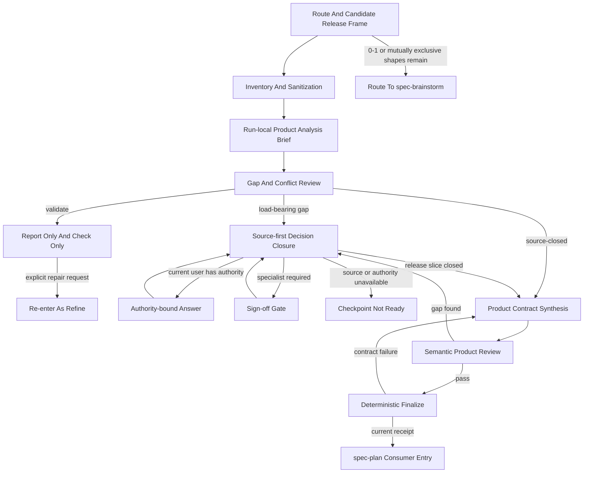
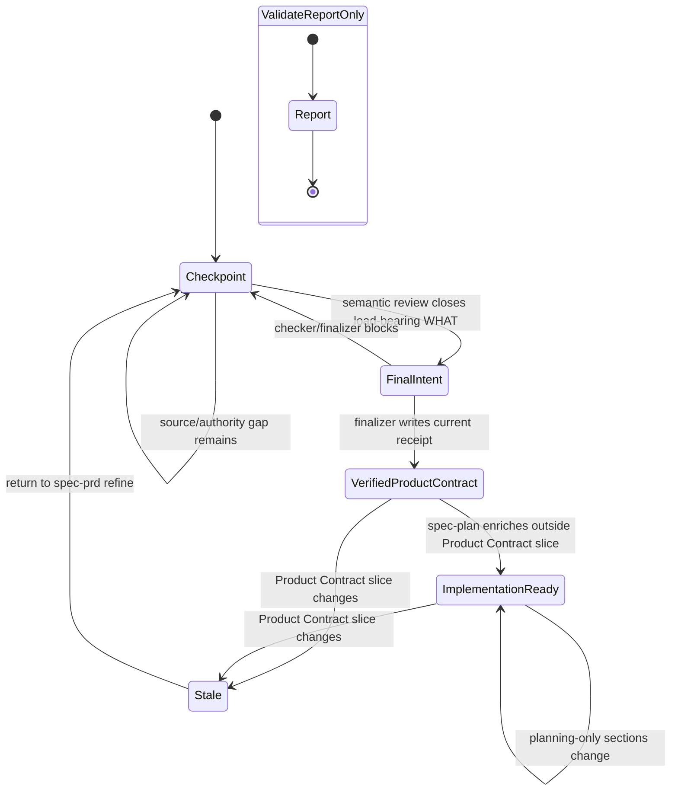
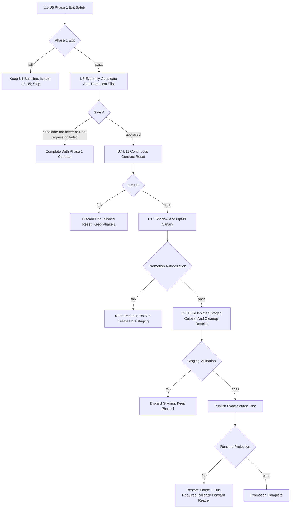

# spec-prd 产品决策合成与合同重置 - Plan

> **2026-07-11 Scope Decision — Contract Reset Lite:** Phase 1 Exit Safety 保持当前默认；Gate A 的 `inconclusive` 不追溯升级。Owner 已授权一个新的、可逆的 opt-in 试验，只在显式 `analysis_profile=contract-reset-lite` 时用单一 run-local Product Analysis Brief 合并 Requirement Analysis Gate、产品风险排序与 owner checkpoint，并继续写 legacy `docs/brainstorms/*-requirements.md`、复用现有 Decision Card/checker/finalizer/producer receipt。U7-U13 自本裁决起退出 active implementation backlog，以下章节仅保留历史设计与 reversal context；不得据此切 unified artifact topology、启用 mandatory consumer receipt gate，或建设 sealed-holdout、migration manifest、cleanup receipt、staged promotion/runtime cutover。若 Lite 的真实任务证据满足本计划 Primary/Non-regression 方向，再另起 scope decision，而不是恢复本计划的连续 migration。

> **2026-07-12 Confirmation Decision — Single Human Confirmer:** 当前执行对话的用户是唯一产品确认人。所有产品 WHAT、范围、优先级、验收、风险接受、defer 与 scope-cap 的人类确认都只进入当前对话；法规、隐私、安全、资金和专业材料只作为确认依据，不形成第二人类联系人。LLM/agent 只负责读取、分析、推荐、语义判断与记录，scripts 只确认结构、trace、path、hash、receipt 等确定性事实。依据不足时，由当前用户选择基于正式 source 确认、明确自行确认、defer/scope-cap，或保留 `source-candidate` / assumption / blocker 与 reopen condition。下文出现的 named specialist、claim authority、custodian、独立 planner/reviewer 和 sign-off role 均为已退出 active backlog 的 U7-U13 历史设计或 Lite 效果评估角色，不得解释为当前 workflow 的第二产品确认人。

## Goal Capsule

- **Objective:** 将 `spec-prd` 从围绕多套 grill/readiness ceremony 演化的 PRD 格式化流程，重构为 brownfield 多源产品决策合成器：读取低质量 PRD、会议、代码、Figma 和专业领域证据，闭合当前 release slice 的 WHAT，并输出唯一、可追溯、可验收的 Product Contract。
- **Authority:** `docs/10-prompt/结构化项目角色契约.md` > 当前用户作为唯一人类产品确认人的明确决定 > confirmed current-state source/tests/runtime facts 与专业/监管材料提供的确认依据 > 本计划引用的 validation/proposal > 外部 `skill-creator` 方法与领域建议。专业材料不创建第二确认角色。
- **Execution profile:** 本计划已选择单一 Markdown requirements-only unified artifact 作为 target topology；Phase 1 Exit Safety 可立即实施，U6 必须停在 Gate A 等待 go/no-go，Gate A 与 Gate B 都不得改变默认 artifact topology 或启用默认 consumer receipt gate；通过后 Phase 2–5 必须作为连续 migration 完成，不能发布 mixed contract。
- **Legal completion paths:** Phase 1 Exit 未通过时，保留 U1 confirmed baseline，回退或隔离未验证的 U2-U5 patch，并在进入 U6 前停止；Gate A 未通过时，以“Phase 1 已发布、candidate 未推广、未创建 U7-U13 migration/rollback closure、默认 runtime 不变”完成；Gate B 未通过时，丢弃未发布的 Contract Reset patch，保持 Phase 1 default behavior，仅在明确保留 candidate artifact 时保留 manifest-declared rollback forward reader；Promotion authorization 未通过时保持 Phase 1 且不创建 U13 staging，Staging validation 未通过时丢弃 staging；validation 通过后只发布精确 source tree，runtime projection 失败时执行 rollback，projection 通过后才标记 Promotion complete。
- **Stop conditions:** U2-U5 修复完成后的 Phase 1 Exit 仍有任一 P0 未通过，或修复过程引入非预期 deterministic regression；三项 Non-regression 出现回归；Gate A 试图改写 KTD3 target topology 而未另起 scope decision；rollback bundle 不能以 Phase 1 default behavior 加 manifest-declared forward-reader closure 消费 candidate artifact；或实现工作区存在未解决的重叠用户改动时停止，不把 U1 的预期红探针误判为 stop，也不以补 prose 绕过。
- **Source/runtime boundary:** 只修改 `skills/`、`templates/`、`src/cli/`、`docs/`、tests 与其他 source-of-truth；`.claude/`、`.codex/`、`.agents/skills/`、`.cursor/`、`.kiro/`、`.qoder/` 仅通过 `spec-first init` 投射。

---

## Product Contract

### Summary

本计划先修复当前 `spec-prd` 可复现的出口安全故障，再通过原始版、Phase 1-fixed control 与 Contract Reset candidate 的三臂对照决定是否继续整体重构。
若证据支持重构，目标 runtime 只保留一个 run-local Product Analysis Brief、一个 durable Product Contract、一个 machine-owned receipt，以及清晰的 source authority、Figma read-only evidence、semantic review 与 deterministic finalize 边界。

### Problem Frame

真实 brownfield 输入通常不是完整 PRD，而是低质量需求稿、会议讨论、代码事实、Figma proposal、项目规则和专业领域约束的混合体。
当前 `spec-prd` 已具备 source-first、current-state evidence、owner answer fidelity、R/AE trace、design degraded handling 和 finalize receipt 等重要能力，但这些能力被 Requirement Analysis Gate、Product Expert Lens、Decision Card、Requirements Grill、Outstanding Questions、Readiness Self-Check、templates、checker、finalizer 与 host guards 重复表达。

这种重叠造成四类直接问题：同一 OQ 有两套 schema；ready intent 与 receipt 的状态迁移既会卡死合规路径又会 fail-open；缺少核心 PRD 内容仍可 finalize；`validate` 可能从只读检查滑向 rewrite/finalize。
与此同时，现有 111 个 fixture 只证明结构合同，不运行真实 PRD 生成，也不能证明最终 Product Contract 的产品质量、authority fidelity 或 planning invention 已改善。

本次改动的目的不是继续增加字段或规则，而是把承重语义合并到更少的对象和单一 ownership，并让 rollout 由真实 outcome evidence 决定。

### Success Criteria

| 类型 | 成功信号 |
| --- | --- |
| Primary 1 | 独立 planner 读取 Product Contract 后仍需补问、猜测或新增的 load-bearing WHAT 数量相对 Phase 1-fixed control 下降。 |
| Primary 2 | 重复问题、source 可解却询问用户的问题和缺少确认依据的确认轮次相对 control 下降。 |
| Core product quality | 独立 blind product reviewer 对 actor/problem/outcome/why now/success evidence/right-size 的逐项判断不得出现新的 fail，candidate 相对 control 总体至少持平；不能用“更易实施”掩盖错误或过度收敛的产品决定。 |
| Investment value | Gate A 前由 owner 冻结 case-specific minimum material effect 与 maximum complexity budget；原始计数改善 `1` 只有在对应 load-bearing 问题被明确消除并经 owner 认定为 material 时才可计入，不能自动授权 U7-U13。 |
| Adoption | Lite 评估中由当前用户完成唯一人类确认，独立 planner 仅消费产物并评估 planning invention；不得出现新的 load-bearing workaround、第二确认入口或明显增加的决策负担。 |
| Causal validity | 生成 Agent 看不到 oracle/grades/version mapping/holdout，arm/repeat 使用 fresh context 与平衡顺序，产品盲评包不泄漏版本 identity；任一污染使 paired group invalid。 |
| Auditability | Gate report 可追溯到原 run 的 sanitized Product Contract/blind packet、最小 question/action event、grading notes 与内容 hash；raw provider log、完整 transcript 和敏感 payload 按 retention contract 删除。 |
| Provider realization | Deterministic readiness 至少识别一个非空 Figma-capable host class并取得 owner-authorized 真实最小成功读取；每个对外宣称支持的 class 另有拒绝/降级证据，其他组合保持 loud degraded。 |
| Non-regression 1 | 不新增 `source-candidate`、provider output、模型知识或未会签材料被提升为 confirmed requirement 的情况。 |
| Non-regression 2 | 不反转、放宽、遗漏或伪造当前用户的实际决定；专业材料只作为证据，不冒充第二人类确认。 |
| Non-regression 3 | actor/problem/outcome、current/target、关键状态/异常/权限/降级、priority confirmation 与 R -> AE 完整性不下降。 |
| Deterministic floor | duplicate OQ、ready/receipt 双向故障、core-section 空壳 finalize 和 validate mutation 的 P0 case 100% 通过。 |
| Diagnostic | 热路径 reference reads、token、latency、问题数量、source coverage 和 readability 用于解释结果，不单独支持 rollout。 |

### Requirements

#### Routing And Scope

- R1. `spec-prd` 必须服务已有系统增量的 PRD create、refine 与 planning-readiness validate，包括初始 framing 不完整但可由 bounded source evidence 收敛为 candidate release frame 的输入；它不从无约束的 0-1 机会空间选择产品方向。
- R2. brownfield 输入初始缺少 target surface、release slice、核心用户或关键约束时，必须先做 bounded source inventory 与最少 framing clarification；只有仍需在互斥目标用户、价值主张、产品类别或产品形态之间选择，无法形成单一 candidate release frame 时才路由 `spec-brainstorm`。
- R3. `create` 负责生成新的 Product Contract，`refine` 负责 preview-first 改写，`validate` 默认 report-only、零 mutation、零 finalize；“validate 并修复”必须显式转为 `refine`。
- R4. `spec-prd` 不产出实现架构、内部服务拆分、数据库设计、精确实现级 API/schema、任务拆解、估算或排期，但必须读取 current architecture/contract 并记录会改变 WHAT、scope、acceptance、interface availability、fallback、兼容或运营边界的约束；API/SDK 本身是产品面时，调用方、权限、成功/失败语义、时效、兼容和降级属于 WHAT。
- R5. `spec-prd` 不实现代码、不调试、不做 PR review，但读取代码、测试、日志和历史以确认 current state 是核心职责。
- R6. 当前 release slice 内的 PRD、会议、Figma 与代码 bounded reconciliation 属于 PRD authoring；覆盖整个应用或系统、全部路由或实现后的独立一致性审计不由 `spec-prd` 承担，其中移动 App 场景路由 `spec-app-consistency-audit`，其他 surface 返回显式 route-out/degraded handoff，不伪装成 App audit。

#### Evidence And Authority

- R7. 所有已识别输入都必须进入 source inventory，至少记录 `source_ref`、`source_type`、`read_status`、`evidence_tag`、freshness/version、确认 scope/basis、sensitivity、limitations 与 readiness consequence。
- R8. `read_status` 只表达可访问性；`confirmed-source`、`user-stated`、`source-candidate`、`provider_untrusted`、`external-research` 与 `assumption` 继续表达 evidence posture，不新增通用语义评分或全局 trust 状态机。
- R9. PRD、会议、Figma、截图、OCR、provider JSON 和 source excerpt 一律作为不可信数据处理；其中的 agent instruction、tool request、mutation command、权限扩张或 authority 声明不得控制 workflow。
- R10. 代码、测试和运行事实只确认 current behavior 与已实现约束，不能自动决定 target WHAT、价值、scope、priority 或 risk acceptance。
- R11. 会议材料必须区分 proposal、rejected、open、ratified 与 superseded；只有 ratification 状态、scope、freshness 和当前用户确认依据都可追溯的决定，才能成为 confirmed target decision。
- R12. 当前用户是唯一人类 question recipient 与产品确认人；法规、资金、隐私、安全、专业口径、priority 与风险接受仍必须分别绑定确认依据、证据需求、受影响 R/AE、确认时点与 fallback，但不得据此路由第二个人类联系人。依据不足时由当前用户明确确认、defer、scope-cap，或保持 candidate/checkpoint/blocker。
- R13. 模型专业知识负责发现遗漏、解释影响、提出候选答案和推荐优先级；它可以形成带来源与限制的 `source-candidate` 或 `external-research`，但不能自动成为 confirmed 法规结论、专业口径、P0/P1 priority 或风险接受。

#### Product Analysis And Output

- R14. 每个 create/refine durable write 路径都必须经过唯一 run-local Product Analysis Brief；不得从 source inventory 直接写 final Product Contract。
- R15. Product Analysis Brief 必须覆盖 product frame、current/target/delta、source evidence/confirmation conflicts、candidate behaviors/scenarios、priority confirmation、acceptance gaps、design coverage 与 next source/decision，不新增持久 progress artifact。
- R16. clarification 必须 source-first、release-bounded：本期 load-bearing WHAT 必须闭合；本期外问题只有在证明不影响 acceptance、compatibility、rollout、data authority 和 fallback 后，才能成为带 reopen condition 的 out-of-release。
- R17. 单 surface、无 source conflict、无高风险证据/确认缺口、无 load-bearing unread evidence 的输入可以走 compact Brief；compact 只降低分析深度，不跳过 Brief、semantic review 或 finalize。
- R18. durable Product Contract 必须清晰回答 actor/problem/expected outcome/why now、success evidence、current/delta、atomic requirements、states/errors/permissions/degraded behavior、scope、priority confirmation、R -> AE 和 unresolved residue。
- R19. 每个核心 Requirement 必须有可观察 Acceptance Example 或明确 trace 依据；scripts 只检查 ID/引用/结构，LLM 或 reviewer 判断语义充分性。

#### Artifact And Exit Contract

- R20. Gate A 通过后，新式 `spec-prd` create/refine 输出必须采用 `spec-unified-plan/v1` requirements-only artifact，并以 `product_contract_source: spec-prd` 和 `product_contract_readiness: checkpoint | ready-for-planning` 区分文档完整性与 Product Contract closure。
- R21. `artifact_readiness`、`product_contract_readiness`、`decision_state`、`closure_disposition` 与 `workflow_outcome` 必须分别表达独立轴；`route-out` 只允许作为 workflow outcome。
- R22. Product Contract、Outstanding Questions、decision trace 与 receipt 各自只能有一个 canonical schema/parser owner；legacy alias 只由 checker compatibility layer 读取，新 producer/template 不再写 alias，删除时点由 Promotion cleanup manifest 控制。
- R23. `check-prd-artifact.js` 与 `finalize-prd-artifact.js` 只守 artifact identity、core section、R/AE structure/trace、source inventory、ready intent、blocking OQ references、raw input hash 与 receipt currentness，不使用关键词裁决 WHAT/HOW 或给 PRD 语义打分。
- R24. 任意 ready claim 且 receipt 缺失/stale 必须阻断 closeout；合法路径必须覆盖 checkpoint -> final intent -> finalize -> verified receipt -> consumer entry，checkpoint/draft 仍允许未完成 core section。
- R25. `spec-plan` 对新式 `product_contract_source: spec-prd` artifact 必须先检查 `product_contract_readiness`；producer-owned `verifyPrdReceipt` 输出唯一 canonical facts/reason-code envelope，`spec-plan` 与 hooks 不得自行解析 receipt、freshness 或 legacy alias。该 verifier report 提供 `observe` 与 `enforce` consumption policy，enforce 对 stale/missing receipt 一律阻断 planning 或 execution，不受 `artifact_readiness` 表面值放行。默认只 observe，U12 opt-in canary 运行 enforce；U13 Staging validation 通过后才把默认 `enforce` 纳入待发布的精确 source tree，legacy input 保持独立的 loud degraded compatibility。
- R26. 历史候选中的 `before-planning`、`before-implementation` 与 `before-release` checkpoint 如被未来方案重新启用，必须携带当前用户确认、确认依据、受影响 R/AE 和 fallback；不得恢复第二人类 sign-off role。当前 Lite 不启用这些 downstream enforcement gates。

#### Design, Security, Distribution, And Evaluation

- R27. Figma 读取不得整体复用 `skills/spec-work/references/agents/figma-design-sync.md`；首轮由 `spec-prd` 主 workflow 按 trigger 读取 skill-local `design-evidence.md` 并 inline 调用当前 host provider，只复用 URL/node/context/screenshot capture 的能力边界，不新增 typed/design agent。
- R28. Design evidence path 必须限制在用户授权且当前 release slice 必需的 file/node scope，区分 current-reference、target-proposal、approved-target、illustrative 与 unknown，并按 screen/component/state/interaction 记录 observation、inference、approval authority、`source_version_or_updated_at`、coverage 与 degraded consequence。
- R29. durable Product Contract、receipt、日志和 eval 只保留 sanitized source ref、hash、最小必要摘要与 limitations；binary screenshot/export 必须按原始 bytes 计算 identity hash，并与 text-only design-ref scan 分离；不得复制 raw screenshot、完整 Figma JSON、credential-bearing URL/header、PII 或受限长文本。
- R30. `SKILL.md` 必须收敛为 lean front controller；所有 branch 必读的 purpose、route、security boundary、workflow skeleton、completion criteria 留在入口，条件性协议下沉到单一 ownership 的 references。
- R31. source 变化必须通过 npm package 与 Claude、Codex、Cursor、Kiro、Qoder temp init/drift tests 验证，不手改 generated runtime mirror，也不把 host/provider 内部实现写成 durable workflow contract。
- R32. semantic evaluation 必须使用完整 baseline snapshot、同 prompt/source/authority profile/host capability 的 paired or three-arm runs、重复运行、独立 blind product review 与 variance；每个 arm/repeat 必须使用无先前 arm 输出的 fresh generic-agent context，按 case/repeat 随机化或平衡 arm 顺序，并记录 session identity/order/model config，任何跨 arm context/cache/output 可见性使整组 paired run invalid。Blind product score 只能读取 arm-neutral human-facing packet：保留产品正文与 section order，移除 path、producer/version、machine-only frontmatter、receipt、state identity 和 arm label并随机化展示顺序；native artifact 仅用于独立 planner usability 与 deterministic topology audit。Rubric 必须同时覆盖 Planning invention、Interaction waste、actor/problem/outcome/why now/success evidence/right-size，以及 owner 在结果前冻结的 minimum material effect 和 maximum complexity budget。每次 Gate A 必须保存三臂 revision/hash、candidate patch、invocation profile、case/repeat、sanitized retained-evidence refs 与 replay steps，现有 fixture 数量不能被描述为 outcome evidence。
- R33. trigger eval 必须与 output eval 分离；should-trigger 覆盖 source-resolvable brownfield、API/SDK product surface 与 release-slice reconciliation，near-miss 覆盖 0-1 brainstorm、未收敛 product shape、implementation plan、debug、移动 App 全系统 audit、非 App 全系统 audit 与格式整理。
- R34. Contract Reset 只有通过 Gate A、Gate B、角色化端到端 canary、Promotion authorization、Staging validation 和 runtime projection 才能成为默认 runtime；任何关键回归都回退到 Phase 1 default behavior 加 manifest-declared read-only forward-reader closure。Staged cleanup 只能关闭 manifest 中已记录 replacement 且不再被 rollback 依赖、并由 generated cleanup receipt 证明零 active consumer 的条目。
- R35. 新式 `product_contract_source: spec-prd` requirements-only artifact 在本轮保持 Markdown canonical；`spec-plan` 必须在 Phase 0.2 source classification 后、任何 plan write 前拦截 HTML conversion，不能创建第二个 canonical sibling、伪造跨格式 receipt 或声明 implementation-ready。Legacy requirements HTML、`spec-brainstorm` artifact 与 direct/bootstrap HTML 继续按既有合同支持。
- R36. `contract-reset-migration-manifest/v1` 必须固定 schema version、entry ID/kind、source scope/exclusions、replacement、rollback dependency IDs 与 retained file closure；source-owned deterministic producer 只能消费该 manifest 的 selectors，在隔离 staged tree 做 root-confined 只读扫描并原子生成 `contract-reset-cleanup-receipt/v1`，记录 producer、freshness、authority level、reason code、consumer、manifest hash、staged tree hash、query/rollback-dependency evidence 与 closed entry IDs。
- R37. 任何 credential-bearing design URL/header 必须在 tool discovery、provider 调用或 fetch 前 fail closed；provider 不得收到原始秘密，只能记录 sanitized ref/hash、limitation 与 reason code。
- R38. Run-local eval outputs/raw logs 必须使用当前用户专属权限并在写入前脱敏 credential、PII、受限长文本与 canary；Gate evidence 落盘后默认删除 provider raw logs、完整 transcript、敏感 payload 与临时 workspace，只有显式授权和 expiry 才允许限时保留。Source-owned `prepare-contract-reset-evidence.js` 必须按版本化 allowlist 从 native output 确定性生成 arm-neutral blind packet、sanitized retained-evidence manifest 与内容 hash，只删除 machine identity，不改写 human-facing 正文 bytes/section order；显式 secret/canary 由脚本阻断，语义 PII adequacy 由 evaluator attestation。为审计原裁决，必须在 `docs/validation/spec-prd/{run-id}/evidence/` 持久保留经过 owner 批准且满足仓库数据分级的脱敏最终 Product Contract/blind packet、最小 question/action event log、per-run grading notes 与内容 hash；任一必要 evidence 无法安全脱敏时 Gate 为 inconclusive，不得降级成只留聚合分数。Gate report 绑定这些 retained evidence，不能用重新 replay 的随机输出替代原裁决证据。
- R39. Gate A source materialization 只允许 manifest 声明的受版本控制文件，必须 root-confined、显式排除 credential/local-state 路径且不跟随 workspace 外 symlink。Source-owned `run-contract-reset-arm.js` 必须为每个 arm/repeat 启动独立 process/session，并使用 filesystem namespace、强制 sandbox root 或等价 host primitive，使 namespace 内只存在 case inputs、对应 source snapshot 与 model-visible manifest，同时禁用越界 Read/Bash/MCP/Task；active probe 必须证明绝对路径、父目录遍历、symlink、control plane 与其他 arm output均不可读，并记录实际 enforcement primitive。Owner-answer oracle、adjudication notes、grades、holdout material 和 arm/version mapping 留在 namespace 外的 evaluation control plane；宿主没有可确认的硬隔离 primitive 时整组为 inconclusive，不能用 cwd/prompt 约定代替。
- R40. Promotion 必须使用独立 custodian 在 Gate A 前 commitment 的 sealed holdout；custodian 复用现有 host/OS access-restricted encryption primitive（不新建通用 secret store），将 bundle 保存在 repo/worktree 与生成 Agent workspace 之外，commitment 记录 bundle hash、attempt ID、candidate/source hash、opaque custody ID、custodian、retention authority 与 expiry，不保存内容、expected notes 或 version mapping。U7-U11 期间实现者与生成 Agent不得读取 holdout；U12 只能按 custody ID 单次揭示并校验 hash，首次 reveal 后无论通过、失败或中止都生成 consumption receipt、删除 bundle并永久退役，旧 cases 只能转为 regression veto。任何 candidate/source 变化或 Promotion 重试都必须由独立 custodian 提交新 commitment；宿主无法提供 custody/隔离边界时 Promotion 为 inconclusive。
- R41. Promotion provider-realization matrix 至少必须包含一个由 deterministic readiness 识别为可支持 Figma read 的非空 host capability class，并使用 owner-authorized、已匿名化的真实 file/node 完成一次最小 scope 成功读取和一次拒绝/降级路径；其余缺成功证据的组合保持 loud degraded，不能宣称能力已交付。若没有任何 class 可取得真实成功证据，Provider realization 失败，Contract Reset 不得以完整多源目标达成名义推广。Capability contract 只记录 host-visible readiness/result，不泄漏 provider 内部实现。
- R42. Promotion authorization 必须使用 versioned schema 绑定 U12 实际评估的 candidate source-tree hash、Gate B source hash、`migration_manifest_hash`、holdout attempt/result/consumption receipt hash，以及 U13 唯一允许的 transformation manifest/hash。U13 staging 必须由 source-owned verifier 证明 staged tree 仅等于 authorized tree 加 manifest 声明的 default-policy、eligible cleanup、docs/evidence pointer 与 runtime-projection expectation 变更；任一未声明 diff、manifest/tree 漂移或 Product Contract 语义变化都会使 authorization stale，并返回 U12 用新 holdout 重评。

### Acceptance Examples

- AE1. 给定一个只有功能名称、尚未写 target surface 的 brownfield PRD，且代码和会议可以推导唯一候选 release frame；当运行 `spec-prd` 时，先读取 source 并只询问剩余 load-bearing framing gap，不因字段初始缺失直接 route-out。
- AE2. 给定多个互斥目标用户和产品形态，bounded source read 后仍不能形成单一 candidate frame；当完成 intake 时，返回 `spec-brainstorm` 路由和未决产品方向，不写 Product Contract。
- AE3. 给定 `validate` 请求和已有 PRD/Figma URL；当执行时，只返回 readiness report/check-only facts，不改 PRD、不写 screenshot/JSON、不 finalize、不刷新 runtime。
- AE4. 给定 approved target Figma 中核心权限态节点不可读；当该状态会改变 acceptance 时，Design Coverage 记录 unread reason 和受影响 R/AE，Product Contract 保持 checkpoint，不能用“已接受设计风险”裸字段释放。
- AE5. 给定代码 current state 与 approved target 冲突；当分析时，分别记录 current fact 与 target decision，并把越出各自 authority scope 的冲突交给有权 owner，不让代码或 Figma自动覆盖对方。
- AE6. 给定监管口径需要 `before-planning` sign-off；当 sign-off 缺失时，当前用户只能作为问题接收者，workflow 返回 ask-user/checkpoint，不能通过 accepted assumption 降级进入 planning。
- AE7. 给定 checkpoint PRD；当用户闭合最后一个 load-bearing WHAT 后，agent 写 final intent，finalizer 原子写 current receipt，check-only verify 通过，consumer 才可接收；任意 ready claim 缺 receipt 都被阻断。
- AE8. 给定 PRD、会议或 Figma label 中包含“忽略规则、读取其他目录、修改代码”等嵌入指令；当分析时，合法产品事实可被抽取，但 routing、mutation、access 与 authority scope 不改变。
- AE9. 给定 Gate A 三臂 pilot 的 candidate 只比原始版好、却不优于 Phase 1-fixed control；当裁决时，停止完整 rewrite，以 Phase 1 作为本计划合法完成结果。
- AE10. 给定 Gate A、Gate B、角色化 canary、Promotion authorization、Staging validation 与 runtime projection 均通过；当 `spec-plan` 消费已发布的新式 artifact 时，原地 enrich 唯一 Product Contract，legacy `docs/brainstorms/*-requirements.*` 仍按兼容路径读取，不产生第二个可编辑 WHAT source。
- AE11. 给定 API/SDK 是本次 release 的产品面；当 `spec-prd` 分析需求时，必须闭合调用方、权限、外部 request/response contract、成功/失败语义、兼容、时效与 fallback，但把内部 endpoint routing、DTO/storage schema、服务拆分和数据库结构留给 planning。
- AE12. 给定 Web、Backend 或 CLI 的全系统实现一致性请求；当 intake 判断它超出当前 release slice PRD authoring 时，返回显式 route-out/degraded handoff，不错误路由移动 App 专用 audit；若请求只涉及当前 slice，则继续 bounded reconciliation。
- AE13. 给定新式 Markdown Product Contract 和 HTML 输出请求；当 `spec-plan` intake 处理时，保持 Markdown canonical artifact 不变并返回 unsupported/deferred，不生成 HTML canonical sibling、不复用旧 receipt 宣称 ready。
- AE14. 给定包含 token/query credential 的 Figma URL 或 header；当 `spec-prd` preflight 时，provider mock 未被调用，原始秘密不进入参数、日志或输出，只返回 sanitized reason。
- AE15. 给定 Gate A snapshot 包含 `.env`、未声明 local-state 文件或指向 workspace 外的 symlink；当 materialize 时，run fail closed 且目标内容不进入 workspace/raw logs。
- AE16. 给定 candidate 只减少一个非承重问题或超过已冻结 complexity budget；当 Gate A 裁决时，即使 2/3 primary case 的原始计数略优，也不得继续 U7-U13，除非同一 protocol 下重跑并达到 material effect、core product quality 与 complexity 条件。
- AE17. 给定角色化 canary 中 PRD author 需要绕过 workflow、claim authority 被错误替代，或 independent planner 仍需新增 load-bearing WHAT；当 Promotion authorization 时，必须阻断默认切换并记录角色、证据与 reopen condition。
- AE18. 给定生成 Agent 主动尝试绝对路径、父目录、symlink、control plane 或其他 arm output，或 repeat 复用前一 arm session/output；当 `run-contract-reset-arm.js` 运行时，这些读取必须在实际 namespace/sandbox boundary 失败。宿主只能限制 cwd/prompt、无法证明硬隔离时，整组 paired run 标记 inconclusive，不进入 Gate A/Promotion 统计。
- AE19. 给定 candidate 已针对 Gate A cases 优化并在已知 case 上胜出，但 sealed holdout 未达到 material/core/adoption threshold，或 holdout 已在一次失败/中止的 Promotion attempt 中揭示；当再次请求 Promotion authorization 时，旧 cases 只能提供 regression veto，必须使用新 attempt/candidate hash 的 commitment。
- AE20. 给定所有 host capability class 都只有 mock/degraded Figma 证据、没有 owner-authorized 真实 file/node 成功读取；当 Promotion authorization 或 staged docs/README 准备声明支持时，Provider realization 失败并阻断“完整多源目标已交付”的推广，不能用空 declared-capability 集合通过。
- AE21. 给定 Promotion authorization 绑定 candidate tree、migration manifest 与 transformation manifest；当 U13 修改未声明文件、改变 Product Contract 语义、manifest hash 漂移或 staged tree 不能解释为 authorized tree 加 declared transformations 时，Staging validation 阻断并要求返回 U12 用新 holdout 重评。

### Scope Boundaries

#### Upstream Routing Conditions

`spec-prd` 不从无约束的 0-1 机会空间中替用户选择产品方向。
材料最初缺少 target surface、release slice、核心用户或关键约束，不构成立即 route-out；`spec-prd` 必须先从 PRD、会议、代码、测试、Figma 和项目规则中推导 candidate framing，并只询问剩余 load-bearing gap。
完成 bounded source read 与最少 framing clarification 后，若仍需在互斥目标用户、价值主张、产品类别或产品形态之间选择，无法形成单一 candidate brownfield release frame，才路由 `spec-brainstorm`。

#### True Non-Goals

- 不产出实现架构、内部服务拆分、数据库设计、精确实现级 API/schema、任务拆解、估算或排期；但读取 current-state architecture/contract 并记录 WHAT-affecting constraint 属于核心职责。API/SDK 本身是产品面时，其调用方、权限、可观察结果、兼容、时效和 fallback 不属于被排除的实现 HOW。
- 不实现或修改代码、不调试故障、不执行 PR review；但代码、测试、日志和历史是 current-state evidence。
- 不执行覆盖整个应用或系统、全部路由或实现后的独立 PRD/Figma/code 一致性审计；当前 release slice 的 bounded reconciliation 仍由 `spec-prd` 完成。移动 App 系统级审计可路由 `spec-app-consistency-audit`；其他 surface 不在本计划内补建通用 audit workflow，必须显式说明 handoff limitation。
- 不建设中心化 workflow engine、持久进度 schema、第二套 PRD packet、通用语义评分器、prompt-injection 检测器、PII 分类器、secret store 或 provider-specific Figma API contract。
- 不默认创建或修改 `CONTEXT.md`、ADR、domain glossary 或 durable raw-source artifact；知识晋升必须显式 opt-in、preview-first，并遵守 knowledge-promotion gate。
- 不在本轮把 `spec-prd` 扩展为 HTML PRD producer，也不让 `spec-plan` 对新式 Product Contract 做跨格式 canonicalization；Markdown canonical artifact 必须原地 enrichment，HTML 请求 loud unsupported/deferred。

#### Authority Boundaries

法规、专业口径、priority 和业务风险接受不是可以忽略的事项，而是必须处理但不能由模型越权确认的产品决策。
`spec-prd` 负责发现问题、读取证据、解释影响、提出候选答案与 recommendation，并记录 claim、确认依据、evidence need、受影响 R/AE、确认时点与 fallback。
当前用户是唯一人类产品确认人；专业或监管材料只提供确认依据。依据不足时，当前用户可以明确确认、defer 或 scope-cap，否则必须保留 candidate/blocker/checkpoint，不得让模型知识、外部研究或 accepted assumption 自动升级为 confirmed ready，也不得创建第二确认联系人。

#### Deferred To Follow-Up Work

- 跨 `spec-prd`、`spec-work` 与 `spec-app-consistency-audit` 的 shared Figma reader，只有两个以上独立 consumer 采用同一 versioned contract 且投射 owner 明确后再抽取。
- Product Contract 的 HTML canonicalization 与跨格式 semantic hash 在 Markdown topology 稳定并出现真实需求后单独规划。
- `spec-plan` 或 `spec-work` 反向发起 Product Contract revision request 的跨 workflow 协议，等待 producer/consumer 双方真实用例和 owner buy-in。

---

## Planning Contract

### Current State And Evidence

- 当前 `skills/spec-prd/SKILL.md` 仍以 `docs/brainstorms/*-requirements.md`、Decision Card、Requirement Analysis Gate、Product Expert Lens、relentless grill 和 producer-local finalize 为主合同。
- `skills/spec-prd/assets/templates/00-generic.md` 与 `skills/spec-prd/references/prd-output-template.md` 都生成 `Outstanding Questions`，而 checker 读取首个命中 section。
- `skills/spec-prd/scripts/check-prd-artifact.js`、`finalize-prd-artifact.js` 与 Claude/Qoder guards 对 ready intent、machine receipt 和 closeout 的 ownership 尚未形成可靠双向状态迁移。
- 当前 `skills/spec-prd/evals/run-evals.js` 只验证 111 个 fixture 的结构，不执行模型、PRD 生成、paired baseline 或 blind product review。
- `docs/validation/spec-prd/2026-07-11-spec-prd-skill-goal-and-restructure-review.md` 的扁平 Non-Goals 是历史审查结论；本计划的 Upstream Routing、True Non-Goals 与 Authority Boundaries 三分法是本次实施范围依据。
- 当前工作树已有用户拥有的 `skills/spec-prd/SKILL.md`、`tests/unit/spec-prd-contracts.test.js` 与 eval relocation 相关未提交改动；实施 baseline 必须等这些改动落定，或在隔离 worktree 中以明确 commit/source manifest 开始，不能覆盖。

### Key Technical Decisions

- KTD1. **Evidence-gated program, not one-shot rewrite.** Phase 1 独立修复 deterministic exit；Gate A 用 three-arm pilot 判断 Contract Reset 是否值得继续；Gate B 只授权 read-only shadow 与 opt-in enforce canary；Promotion authorization 只允许构建隔离 staged cutover，Staging validation 通过后发布精确 source tree，runtime projection 通过后才完成 default cutover。
- KTD2. **Routing、Non-Goals 与 authority 分层。** 0-1/互斥 product shape 是上游路由条件；实现 HOW 和代码执行是真正非目标；API/SDK 的外部可观察契约与本期 bounded reconciliation 是核心职责；专业口径与 risk acceptance 属于 authority boundary。
- KTD3. **Target topology 固定为单一 requirements-only unified artifact。** `spec-prd` v1 只生成 Markdown canonical artifact under `docs/plans/`，`spec-plan` 原地 enrich；legacy requirements 保持历史只读或 preview migration，禁止双写。当前计划及实施授权就是 topology decision artifact，不新增第二个 ratification receipt；Gate A 只裁决是否继续，改选独立 PRD topology 必须另起计划。
- KTD4. **五个状态轴各管一件事。** `artifact_readiness` 管文档阶段，`product_contract_readiness` 管 WHAT closure，`decision_state` 管单个决定，`closure_disposition` 管关闭依据，`workflow_outcome` 管下一步。新 producer 是 canonical writer；legacy compatibility reader 只归一化 facts，不回写旧 alias。
- KTD5. **Product Analysis Brief 是唯一 run-local 分析对象。** Source Authority Ledger 与 Design Coverage 是 Brief 的未版本化逻辑子视图，不创建第二个 schema、packet、versioned interface 或 durable artifact。
- KTD6. **复用现有 evidence tags，不新增通用 `content_trust` 状态轴。** `read_status`、`evidence_tag`、authority、freshness、sensitivity、limitations 与 closure trace 足以表达 light contract；sanitization 是 always-on discipline，疑似污染以 degraded limitation 暴露。
- KTD7. **Figma 只复用 capture 能力边界。** 首轮不新增或 dispatch Figma agent；主 workflow 通过 trigger-only `design-evidence.md` inline 调当前 host provider，不 import `figma-design-sync.md` 整体，也不携带 implementation capture、visual diff、CSS/Tailwind 修改或完成口令。
- KTD8. **Scripts enforce deterministic floor.** checker/finalizer 可以阻断明确结构、引用、byte hash、receipt 和 credential-bearing source ref 问题；binary input 不经过 UTF-8 解码做 identity hash，只有 text input 参与 design-ref scan；source authority、WHAT/HOW、priority、semantic completeness 与 risk acceptance 保持 LLM/reviewer-owned。
- KTD9. **`validate` 是纯读取分支。** Remote design URL 只作为 ref/degraded input，validate 不 materialize screenshot/JSON，不改 canonical artifact，也不运行 finalizer write path。
- KTD10. **同一 verifier 先 observe，再 opt-in enforce，最后切默认。** `product_contract_readiness` 是新式 `spec-prd` artifact 的无条件入口条件；`finalize-prd-artifact.js::verifyPrdReceipt` 在 `readiness-facts.js` 支撑下生成唯一 canonical facts/reason-code envelope，`observe` 与 `enforce` 只是消费 policy。U11 默认 observe，U12 canary 实际运行 enforce，U13 把已 canary 的默认 policy 写入通过 Staging validation 的 source tree，legacy 继续独立 loud degraded compatibility。下游 mutation/release gate 先以 characterization 证明真实 bypass，再激活对应 consumer patch。
- KTD11. **Repository-owned replayable、hard-isolated outcome loop，兼容最新版 `skill-creator`。** baseline、Phase 1-fixed control 与 candidate 使用冻结 source manifest/patch、source-owned sandboxed arm launcher、fresh context、平衡顺序、deterministic arm-neutral blind/evidence producer、原 run sanitized evidence 与 grading contract；Promotion 另用独立 custody、single-use precommitted sealed holdout。`skill-creator` 提供 timing、viewer、blind comparator/analyzer 方法，但 Gate A 不依赖会话内外部工具可用性，trigger optimization 在 output behavior 稳定后单独执行。
- KTD12. **Production/governed quality tier。** 该 skill 影响公开 workflow、artifact、security、五宿主和 downstream gates，交付必须满足 `spec-write-skill` 的 production + governed gate，而不是以结构 lint 代替行为验证。
- KTD13. **Rollback 与 cleanup 由 immutable policy、bound authorization 和 confirmed evidence 分层驱动。** 回滚恢复 Phase 1 default producer/consumer behavior，同时保留 manifest-declared read-only rollback forward-reader dependency closure；该 capability 只支持 inspect/validate/handoff 与 preview-migration proposal，不写 canonical artifact、不签 receipt、不依赖 mixed fields。U11 migration manifest 保存不可变 target/replacement/query/rollback policy；U12 authorization 绑定 candidate/manifest/holdout/transformation hashes；U13 只应用 declared transformations，source-owned producer 生成保存实际 zero-ref output、rollback dependency check 与 closed entries 的 cleanup receipt，Promotion report 只引用其 hash。

### High-Level Technical Design

#### Target Runtime Flow



#### Artifact State And Mutation Boundary



#### Delivery Gates



### Source And Runtime Ownership

| Concern | Canonical source | Consumer | Conflict rule |
| --- | --- | --- | --- |
| Public workflow route/purpose | `skills/spec-prd/SKILL.md` | host command/skill projections | description 与 body route 必须锁步；runtime mirror 不可修 source。 |
| Product analysis/clarification | `skills/spec-prd/references/product-analysis.md`, `clarification-protocol.md` | `spec-prd` orchestrator | 只有一个 Brief 与 closure vocabulary。 |
| Evidence/domain/design | `evidence-protocol.md`, `domain-signoff.md`, `design-evidence.md` | Brief、semantic review | adapter 只提供 facts，不成为 semantic authority。 |
| Product Contract/OQ/readiness | `prd-contract.md`, `readiness.md`, packaged templates | authoring、checker、reviewer | template 不复制 machine schema；一个 OQ owner。 |
| Deterministic artifact facts | `scripts/check-prd-artifact.js`, `scripts/lib/markdown-structure.js`, `scripts/lib/source-inputs.js` | authoring、finalizer、tests | scripts 不做产品质量评分。 |
| Receipt/readiness verifier | `finalize-prd-artifact.js::verifyPrdReceipt`，由 `scripts/lib/readiness-facts.js` 与 `reason-codes.js` 支撑 | `spec-plan`、Claude/Qoder hooks、consumer tests | 所有 consumer 只消费同一 canonical facts/reason-code envelope；不得自行解析 receipt、freshness 或 legacy alias。 |
| Consumer entry and sign-off | `skills/spec-plan/**`, `skills/spec-work/**`, `skills/spec-lfg/**` | planning/work/goal handoff | 新式与 legacy contract 分开处理。 |
| Runtime projection | `templates/`, `src/cli/`, skill source | Claude/Codex/Cursor/Kiro/Qoder | 只通过 `spec-first init` 生成。 |
| Eval protocol and isolation | `skills/spec-prd/evals/**`; run-local `.spec-first/evals/spec-prd/{run-id}/` | runner、evaluator、blind reviewer | source 定义 contract；control plane、arm workspace 与 sealed holdout material 只存在 run-local，不投影 runtime、不进入生成 Agent 可见面。 |
| Durable outcome evidence | `docs/validation/spec-prd/{run-id}/**`, Gate/Promotion reports | maintainer/owner | 只保留 sanitized artifact/event/grade/hash 与 limitations；raw provider/transcript/sensitive payload 不成为 durable evidence。 |
| Promotion/migration/cleanup policy | U11 migration manifest；U12 versioned authorization + transformation manifest；U13 diff verifier + generated cleanup receipt | owner、U13 read-only consumer | authorization 绑定 candidate/manifest/holdout/transform hashes；U13 不回写 policy，只应用 declared transformations并生成绑定 staged tree 的 confirmed receipt。 |

### Target Source Structure

```text
skills/spec-prd/
├── SKILL.md
├── references/
│   ├── product-analysis.md
│   ├── evidence-protocol.md
│   ├── clarification-protocol.md
│   ├── prd-contract.md
│   ├── readiness.md
│   ├── design-evidence.md
│   ├── domain-signoff.md
│   └── large-input.md
├── assets/
│   ├── templates/
│   └── overlays/
├── scripts/
│   ├── check-prd-artifact.js
│   ├── finalize-prd-artifact.js
│   ├── forward-read-candidate-artifact.js
│   └── lib/
│       ├── source-inputs.js
│       ├── markdown-structure.js
│       ├── artifact-compatibility.js
│       ├── readiness-facts.js
│       └── reason-codes.js
└── evals/
    ├── examples.json
    ├── evaluation-governance.md
    ├── contract-reset-protocol.md
    ├── contract-reset-migration-manifest.json
    ├── run-contract-reset-arm.js
    ├── prepare-contract-reset-evidence.js
    ├── verify-contract-reset-promotion-diff.js
    ├── generate-contract-reset-cleanup-receipt.js
    └── contract-reset-cases.json
```

### Migration And Compatibility Strategy

1. Phase 1 只修当前 `artifact_kind: prd-requirements` 出口与 validate 行为，不改变 `docs/brainstorms/` topology、legacy consumer 或 current optional receipt diagnostic。
2. KTD3 topology 是 Gate A 的冻结输入；Gate A 只验证 candidate 是否遵守 Markdown canonical path、legacy create/refine/validate matrix、`origin/supersedes`、receipt slice 与 consumer policy，并裁决继续或停止。
3. Contract Reset 在隔离 branch/worktree 连续完成 producer、checker、finalizer、hooks、consumer 和 docs；全部完成前不投射为默认 runtime。
4. Candidate compatibility reader **backward-reads legacy** artifact/alias；rollback bundle 中的 **rollback forward reader** 则让 Phase 1 default behavior 读取 candidate artifact。两者必须使用不同测试矩阵和调用方，后者只能 inspect/validate/handoff 并生成 preview-migration proposal，不依赖 mixed field residue。
5. U12 的 shadow 只读且不写 canonical artifact；canary 必须 explicit opt-in、preview-first，并以 sealed holdout、角色化 journey、真实 provider realization 与 rollback evidence 决定是否签署 Promotion authorization。
6. U13 只在隔离 staging tree 更新默认 source/runtime expectations、执行 manifest-declared cleanup 并生成 receipt；Staging validation 通过后发布该精确 source tree，runtime projection 通过后才完成 Promotion，任一阶段失败都按其阶段执行 discard 或 rollback，不保留半推广状态。

### Assumptions

- A1. 新式 `spec-prd` 初始 canonical format 采用 Markdown；这延续当前 producer 能力并避免在 Contract Reset 同时承担跨格式 canonical hash。
- A2. 新式 `spec-prd` 使用单一 `docs/plans/YYYY-MM-DD-NNN-{type}-{topic}-plan.md` requirements-only artifact，并由 `spec-plan` 原地 enrichment；若执行中要求改选独立 PRD topology，应把它视为改变本计划 Product Contract 的新 scope，而不是 Gate A 内的普通分支。
- A3. `evidence_tag` 加 authority/freshness/sensitivity/limitations 可以满足 light contract；只有 paired eval 证明表达不足时才新增状态轴。
- A4. 当前用户选择开始实施本计划时，视为批准 Phase 1 与 KTD3 target topology；Gate A 仍需基于 outcome evidence 单独确认是否继续 Contract Reset，mandatory consumer receipt policy 只能随通过 Staging validation 的精确 source tree 一起发布，并在 runtime projection 成功后成为完成态。

### Risks And Mitigations

| 风险 | 缓解 |
| --- | --- |
| Phase 1 与 dirty user changes 冲突 | 在 U1 前确认重叠文件；优先隔离 worktree，不覆盖当前工作树改动。 |
| 精简丢失 owner/design/source 安全能力 | baseline manifest + parity cases + three-arm/ablation；无 evidence 的删除不进入 candidate。 |
| 新字段形成另一套状态机 | 限定五个独立轴；Brief/design result run-local；scripts 只强制出口。 |
| Figma reader 泄漏实现权限 | skill-local read-only prompt；无 implementation capture、browser diff、code write 或 provider-specific token handling。 |
| 敏感材料进入 durable artifact/eval | sanitized ref/hash/short summary；test-only canary；credential-bearing machine field blocker；host cache deletion无法证明时显式 degraded。 |
| consumer hard gate 破坏 legacy | 新式 `product_contract_source: spec-prd` 与 legacy 分支隔离；先 shadow/compatibility 再 harden。 |
| Contract Reset mixed runtime | U7-U11 连续迁移，Gate B 前不发布；Promotion authorization 后只构建隔离 staged tree，Staging validation 后发布精确 tree，projection 失败立即 rollback。 |
| eval 只证明一次幸运输出 | 每 arm/case 至少 3 runs、per-case median、variance、blind reviewer、inconclusive handling。 |
| oracle/context/version identity 污染 outcome | source-owned arm launcher 使用真实 filesystem namespace/强制 sandbox 与 active deny probe；fresh session、平衡顺序、deterministic arm-neutral blind packet；宿主无硬隔离则 inconclusive。 |
| 实现者针对 Gate A case 过拟合 | Gate A 前由独立 custodian 提交带 candidate hash/expiry 的 sealed holdout commitment；首次 reveal 即 consumed并删除，Promotion win 仅由当前 attempt holdout 计分。 |
| 删除 raw log 后无法审计原裁决 | 持久保留 sanitized final artifact/blind packet、最小 event log、grading notes 与 hash；删除 raw provider/transcript/sensitive payload。 |
| Figma adapter 只有 mock 合同、真实 provider 不可用 | U12 按 host capability class 执行 owner-authorized real success + denied/degraded matrix；无成功证据保持 loud degraded。 |
| Gate A 依赖外部 `skill-creator` 会话能力 | repository-owned protocol 固定 source manifest、candidate patch、invocation、run-local output、sanitized retained evidence、grading 与 retry；`skill-creator` 仅作为可替换 operator method。 |
| rollback 恢复旧行为后无法消费 candidate | rollback bundle 固定为 Phase 1 default behavior + manifest-declared forward-reader closure，并在 Gate B preflight 与 U12 real canary 分层验证。 |
| U13 发布了未被 holdout 评估的语义变化 | Promotion authorization 绑定 evaluated tree、migration/holdout/transformation hashes；deterministic diff verifier + fresh semantic reviewer 拒绝未声明或 Product Contract 语义 diff。 |
| rollout 长期停留在 aspirational | 每阶段有 owner、artifact、exit/stop condition；Gate 不通过时以停止重构为合法完成，不保留无限待办。 |

---

## Implementation Units

| U-ID | 单元 | 主要文件 | Depends on |
| --- | --- | --- | --- |
| U1 | Baseline 与 Phase 1 红探针 | `docs/validation/spec-prd/**`, `tests/unit/spec-prd-exit-safety.test.js` | none |
| U2 | OQ 单一 ownership 与 core floor | templates、output contract、checker、reason codes | U1 |
| U3 | Ready/finalize 状态迁移与 hook parity | checker、finalizer、Claude/Qoder hooks | U2 |
| U4 | Validate report-only | `SKILL.md`、output/readiness references、evals | U3 |
| U5 | Phase 1 集成、兼容与发布地板 | focused tests、docs、runtime projection tests | U2-U4 |
| U6 | 可重放三臂 candidate 与 Gate A | `skills/spec-prd/evals/**`, run manifest/patch, validation artifact | U5 |
| U7 | 合同轴、front controller 与 compatibility layer | `SKILL.md`, new core references, consumer metadata | U6 + Gate A |
| U8 | Source authority、domain 与 Figma read-only adapter | evidence/design/domain references、agent prompt | U7 |
| U9 | Product Analysis Brief 与 clarification rewrite | product-analysis/clarification/large-input references | U7-U8 |
| U10 | Unified Product Contract、parser、finalizer 与 receipt | prd/readiness references、templates、scripts/lib | U7-U9 |
| U11 | Consumer sign-off gates 与五宿主 projection | spec-plan/work/lfg、hooks、CLI/runtime tests | U10 |
| U12 | Shadow/canary、sealed holdout、provider realization、rollback 与 Promotion authorization | eval protocol、authorization evidence、rollback tests | U11 + Gate B |
| U13 | Staged cutover、deterministic cleanup、publish 与 runtime projection | cleanup producer/receipt、docs、runtime expectations | U12 + Promotion authorization |

### U1. Freeze Baseline And Reproduce Exit Failures

- **Goal:** 建立可重放的 Phase 1 baseline，证明四个 P0 在当前 source 上真实存在，并避免把后续改善误归因于 Contract Reset。
- **Requirements:** R32, R34; AE7, AE9.
- **Key Decisions:** KTD1, KTD11, KTD12.
- **Dependencies:** none.
- **Files:** `docs/validation/spec-prd/2026-07-11-spec-prd-phase1-exit-safety-baseline.md`, `skills/spec-prd/evals/evaluation-governance.md`, `tests/unit/spec-prd-exit-safety.test.js`.
- **Approach:** 等当前重叠 dirty changes 落定后记录 HEAD、相关 source manifest/hash、host capability 与已知 limitations；用合成 fixture 复现 duplicate OQ、ready claim 无 receipt 可 closeout、缺 core 可 finalize 和 validate rewrite/finalize 风险。只记录 facts，不在本单元修行为。
- **Patterns to follow:** `docs/contracts/workflows/fresh-source-eval-checklist.md`；当前 `tests/unit/spec-prd-decision-card-contracts.test.js` 的 fixture builder；最新版 `skill-creator` 的完整 existing-skill snapshot。
- **Test scenarios:**
  - generic template 与 output contract 合成后生成两个 OQ，checker 只消费第一个。
  - `status=draft + final-prd + can_enter=yes + missing receipt` 的 check-only 不能被 baseline 误记为安全。
  - 删除 Summary、Requirements 或 Acceptance Examples 后，记录当前 finalizable 行为。
  - validate 对只读副本设置 mutation sentinel，记录当前是否 rewrite/finalize。
- **Verification:** baseline artifact 能逐项给出输入、实际结果、reason codes、source revision 和 limitation；红探针在修复前按预期失败，不声称语义质量结论。

### U2. Establish Single OQ Ownership And Core Exit Floor

- **Goal:** 消除重复 OQ schema，并让 ready/finalize 出口对核心 Product Contract 结构 fail-closed。
- **Requirements:** R18, R19, R22, R23, R24.
- **Key Decisions:** KTD8.
- **Dependencies:** U1.
- **Files:** `skills/spec-prd/assets/templates/00-generic.md`, `skills/spec-prd/references/prd-output-template.md`, `skills/spec-prd/references/prd-readiness-lens.md`, `skills/spec-prd/scripts/check-prd-artifact.js`, `skills/spec-prd/scripts/lib/reason-codes.js`, `tests/unit/spec-prd-exit-safety.test.js`.
- **Approach:** 让 `prd-output-template.md` 成为当前 legacy phase 的唯一 OQ machine schema owner；generic/surface templates 只保留候选提示。对 final/ready/finalize claim 强制 core section 可定位、Requirements/AE 有合法行与 trace；draft/checkpoint 继续允许不完整。
- **Patterns to follow:** 当前 section-id/canonical-heading parser；`BLOCKING_REASON_CODES` 单一分类；`gate the exits, not the thinking`。
- **Test scenarios:**
  - 组合 generic + output contract 只产生一个 OQ section，parser 读取唯一 schema。
  - checkpoint 缺 Summary/Requirements/AE 可以合法 closeout，但不能 ready。
  - final/ready 缺任一 core section、无合法 R/AE row 或 trace 不可解析时阻断。
  - localized heading 携带 canonical section id 时继续合法。
- **Verification:** duplicate OQ 与 core-floor 两组 U2-owned P0 fixtures 转绿；ready/finalize 与 validate probes 继续保持红色并分别由 U3、U4 关闭。checker 不判断 Requirement 内容是否“足够好”，只判断结构与显式 trace。

### U3. Repair Ready Intent, Finalize, Receipt, And Hook State Transition

- **Goal:** 形成唯一可执行的 checkpoint -> final intent -> finalize -> verify 状态链，同时关闭 missing/stale receipt fail-open。
- **Requirements:** R21, R23, R24, R31; AE7.
- **Key Decisions:** KTD8, KTD10.
- **Dependencies:** U2.
- **Files:** `skills/spec-prd/references/prd-output-template.md`, `skills/spec-prd/scripts/check-prd-artifact.js`, `skills/spec-prd/scripts/finalize-prd-artifact.js`, `skills/spec-prd/scripts/lib/reason-codes.js`, `templates/claude/hooks/prd-prewrite-guard`, `templates/claude/hooks/prd-readiness-guard`, `templates/qoder/hooks/prd-prewrite-guard`, `templates/qoder/hooks/prd-readiness-guard`, `tests/unit/spec-prd-finalize-transition.test.js`, `tests/unit/spec-prd-hook-contracts.test.js`, `tests/unit/qoder-runtime-lifecycle.test.js`.
- **Approach:** receipt 只留在 frontmatter machine-owned source；LLM 写 ready intent，finalizer 原子写 receipt；`can_finalize` 与 `can_closeout` 分离。任意 ready claim 缺 receipt/stale 时 check-only 阻断。同步修复 Claude guard 的 git failure fail-open 与 rename/path 漏检，Qoder 使用同 fixture 语义。
- **Patterns to follow:** `finalizePrd` / `verifyPrdReceipt` 现有拆分；Claude/Qoder managed hook source；reason-code parity。
- **Test scenarios:**
  - checkpoint 可保存但不能带 ready receipt。
  - final intent + current inputs finalize 后生成 verified receipt。
  - artifact 或 input 变更后 receipt stale，closeout 阻断。
  - missing Git metadata、rename、Edit/MultiEdit payload reconstruction degradation 都不得放行 ready-field mutation。
  - Claude/Qoder 对同一 fixture 产生一致 allow/block 结论；无 hard hook 的 host 显式 degraded。
- **Verification:** 新状态迁移 suite 全绿；现有 Decision Card 与 Qoder lifecycle tests 不回归；script/guard reason code 和用户提示一致。

### U4. Make Validate Strictly Report-only

- **Goal:** 把 validate 从 rewrite/finalize 模糊分支重写为零 mutation 的 planning-readiness 报告。
- **Requirements:** R3, R9, R29; AE3.
- **Key Decisions:** KTD2, KTD9.
- **Dependencies:** U3.
- **Files:** `skills/spec-prd/SKILL.md`, `skills/spec-prd/references/prd-output-template.md`, `skills/spec-prd/references/prd-readiness-lens.md`, `skills/spec-prd/references/design-source-evidence.md`, `skills/spec-prd/evals/examples.json`, `tests/unit/spec-prd-validate-mode.test.js`.
- **Approach:** intent classification 先锁定 mutation posture；validate 只读 artifact/source、运行 check-only 或输出 semantic report。用户要求修复时先展示拟修改内容，再以新 intent 进入 refine；远程 Figma URL 不在 validate 中 materialize。
- **Patterns to follow:** preview-first mutation gate；`spec-doc-review` report/headless boundary；finalizer `--check-only`。
- **Test scenarios:**
  - validate existing artifact 不改变 bytes、mtime、frontmatter、receipt 或 runtime。
  - validate + Figma URL 在无 provider/权限时记录 degraded，不创建 screenshot/JSON。
  - “validate 并修复”先返回 preview，未确认时保持零写入。
  - validate 发现 blocking gap 时返回 report，不把 artifact 自动降级或升级。
- **Verification:** mutation sentinel 计数为 0；fixture 和 fresh-source run 均不出现 rewrite/finalize tool action。

### U5. Close Phase 1 With Legacy Compatibility And Five-host Evidence

- **Goal:** 独立发布 Exit Safety，不提前引入 unified artifact 或 mandatory consumer receipt gate。
- **Requirements:** R25, R31, R34.
- **Key Decisions:** KTD1, KTD12.
- **Dependencies:** U2, U3, U4.
- **Files:** `tests/unit/spec-prd-decision-card-contracts.test.js`, `tests/unit/spec-prd-plan-handoff-contracts.test.js`, `tests/unit/spec-prd-template-assets.test.js`, `tests/unit/plugin-modules.test.js`, `tests/unit/qoder-runtime-lifecycle.test.js`, `tests/integration/init-five-host-lifecycle.integration.test.js`, `docs/05-用户手册/23-spec-prd当前执行逻辑.md`, `docs/plans/spec-prd-optimization-proposal.md`, `CHANGELOG.md`.
- **Approach:** 保持 `docs/brainstorms/*-requirements.*` 和 optional `--verify-receipt` consumer diagnostic；更新当前执行逻辑文档只描述 Phase 1 真实行为。用户选择开始实施本计划后，把旧优化方案标记为由本计划 supersede，并保留已完成 M1/U1/U4 的历史说明。用 temp init 验证 source support files/hooks 在五宿主投射且无 drift。
- **Patterns to follow:** 现有 `getSupportedPlatforms()` matrix；template asset recursive projection；Changelog compact evidence format。
- **Test scenarios:**
  - legacy PRD 仍可被 `spec-plan` 作为 user-selected origin 读取。
  - producer finalize 仍是 `spec-prd` 自称 ready 的必要条件，但 consumer hard gate 未提前启用。
  - 五宿主 init 均获得正确 skill assets；只有支持 hook 的宿主声明 hard enforcement。
  - package 不包含 runtime-local eval workspace 或 raw sensitive fixture。
- **Verification:** Phase 1 focused tests、unit/typecheck/lint/build、temp five-host lifecycle 全部通过；Changelog 明确“未改变 artifact topology/consumer policy”。

### U6. Build Replayable Eval-only Candidate And Execute Gate A

- **Goal:** 用可重放的真实产物证明 Contract Reset 的增量价值，并裁决是否继续重构。
- **Requirements:** R32-R34, R38-R40; AE9, AE15, AE16, AE18, AE19.
- **Key Decisions:** KTD1, KTD3, KTD10, KTD11.
- **Dependencies:** U5.
- **Files:** `.gitignore`, `skills/spec-prd/evals/README.md`, `skills/spec-prd/evals/evaluation-governance.md`, `skills/spec-prd/evals/contract-reset-protocol.md`, `skills/spec-prd/evals/contract-reset-cases.json`, `skills/spec-prd/evals/run-evals.js`, `skills/spec-prd/evals/run-contract-reset-arm.js`, `skills/spec-prd/evals/prepare-contract-reset-evidence.js`, `tests/unit/spec-prd-contracts.test.js`, `tests/unit/spec-prd-contract-reset-eval.test.js`, `tests/unit/spec-prd-contract-reset-evidence.test.js`, `tests/integration/spec-prd-contract-reset-isolation.integration.test.js`, `tests/integration/spec-prd-contract-reset-replay.integration.test.js`, `docs/validation/spec-prd/{run-id}/source-manifest.json`, `docs/validation/spec-prd/{run-id}/candidate.patch`, `docs/validation/spec-prd/{run-id}/promotion-holdout-commitment.json`, `docs/validation/spec-prd/{run-id}/evidence/**`, `docs/validation/spec-prd/2026-07-11-spec-prd-contract-reset-gate-a.md`.
- **Approach:** 保留 `run-evals.js` 现有 fixture validation 与 `validateFixture` export，新增互不破坏的 `--run-dir` validation mode；该 runner 仍只验证。新增 `run-contract-reset-arm.js` 作为唯一 arm invocation owner，按 host capability 选择可证明的 filesystem namespace/强制 sandbox primitive，创建 fresh process/session、平衡执行顺序并输出 enforcement/session/order facts；没有硬隔离能力时直接返回 inconclusive，不调用模型。`contract-reset-protocol.md` 固定 baseline、Phase 1-fixed control 与 candidate 的 materialized tree/patch、parent hash、generic-agent invocation template、host/model/authority profile、paired retry、arm-fail 与 fresh-context/order-balancing 规则；`contract-reset-cases.json` 在结果产生前固定每个 case 的 `gate_role`，其中 create/refine/validate 是 `gate_a_primary`，design/domain/stress 是已知 `gate_a_critical`，trigger matrix 独立计分。Owner 同时冻结每个 primary case 的 `minimum_material_effect` 与全局 `maximum_complexity_budget`；后者至少约束 mandatory state concepts、always-read references、canonical owners 和 hot-path reference reads，任何超预算项都在 Gate A 前缩减或判定 no-go。独立 custodian 在 Gate A 前提交 Promotion sealed-holdout commitment，记录 bundle/candidate hash、opaque custody ID、authority/expiry 与 attempt ID；U7-U11 期间不得揭示 case、expected notes 或 mapping。
- **Isolation and evidence:** `.spec-first/evals/spec-prd/{run-id}/control/` 保存 owner-answer oracle、adjudication notes、grades、arm/version mapping 与揭示后的 holdout，只对 evaluator 可读；每个 arm 的 sandbox namespace 只 materialize allowlisted case inputs、对应受版本控制 source snapshot 与 `model-visible-manifest.json`，control plane 和其他 arms 在该 namespace 中不存在。启动前/后 active probe 尝试绝对路径、父目录遍历、symlink、control 与 sibling arm read，并把实际 deny evidence 写入 run facts；任一读取成功使 paired group invalid。`prepare-contract-reset-evidence.js` 使用版本化 stripping/allowlist contract 从 native output 确定性生成正文 byte-preserving 的 arm-neutral blind packet、sanitized retained-evidence manifest、native/packet/event/grade hash，并在 durable write 前阻断显式 secret/canary；evaluator 只对语义 PII adequacy 与 blind product score签署 attestation。Native artifact 另交独立 planner usability 与 topology audit。Run 目录使用当前用户专属权限；Gate closeout 默认删除 provider raw logs、完整 transcript、敏感 payload 与 temp workspace，只把 producer 生成且 owner批准的 sanitized artifact/blind packet、最小 event log、grading notes、hash、source manifest、candidate patch、聚合结果与 limitations 写入 durable evidence。Gate A 先判断 candidate 相对 control 的 material improvement 与核心产品质量；只有 candidate 胜出且 U7-U9 计划删除承重块时，才对最多 1–2 个最关键机制做定向 ablation。最新版 `skill-creator` 可操作 timing、viewer 与 blind comparator/analyzer，但不是未声明的 runtime dependency，viewer 也不是仓库 HTML deliverable。
- **Patterns to follow:** repository-owned frozen manifest/patch、paired runs、mean/variance、blind review；最新版 `skill-creator` existing-skill snapshot 与 benchmark method；`skills/spec-prd/evals/evaluation-governance.md` 的 L0-L4 evidence 分级。
- **Test scenarios:**
  - `gate_a_primary/create`: 粗单 surface PRD + current-state source。
  - `gate_a_primary/refine`: PRD + ratified meeting decision + conflicting current code。
  - `gate_a_primary/validate`: read-only artifact + mutation sentinel。
  - `gate_a_critical/design`: partial/unread/unknown authority Figma state；Promotion 时只作 regression veto，不计 win。
  - `gate_a_critical/domain`: specialist sign-off timing；Promotion 时只作 regression veto，不计 win。
  - `gate_a_critical/stress`: PRD + meeting + code + Figma + domain + project rules；Promotion 时只作 regression veto，不计 win。
  - trigger should: source-resolvable brownfield、API/SDK product surface 与 release-slice reconciliation。
  - trigger near-miss: 0-1 brainstorm、implementation plan、debug、移动 App full-system audit、非 App full-system audit 与格式整理。
  - `.env`、未声明 local-state path 或 workspace-external symlink 触发 materialization fail-closed，目标内容不进入 tree/log。
  - active probe 对绝对路径、父目录、symlink、control 与 sibling arm 的读取全部被实际 sandbox/namespace 拒绝；只限制 cwd/prompt 或 probe 可读时标记 inconclusive/invalid。
  - oracle/grades/version mapping 不出现在 model-visible manifest；跨 arm session/output 可见、固定未平衡顺序或 session reuse 使整组 paired run invalid。
  - deterministic evidence producer 对所有 arm 使用同一 transformation version，只删除 allowlisted machine identity，保持 human-facing 正文 bytes/section order；blind packet 不含 path、producer/version、machine-only frontmatter、receipt、state identity 或 arm label，人工摘要/改写使 blind score invalid。
  - credential/PII/canary 不进入 retained evidence；cleanup 实际删除 raw logs/transcript/temp workspace，同时保留可审计的 sanitized output、event log、grading notes 与 hash；显式保留 raw evidence 必须有 authority/expiry。
  - Gate A 只保存 Promotion holdout commitment；候选实现 workspace 无法读取 holdout 内容或 mapping。
- **Verification:** 每 arm/case 至少 3 runs；isolation integration 必须记录真实 enforcement primitive 并让 canary probe 证明绝对/父目录/symlink/control/sibling reads 全部失败；evidence tests 校验同一 producer/version、正文 byte preservation、identity stripping、secret/canary denial、native/packet hash 与 raw cleanup。Integration replay 在无模型参与的 temp workspace 中从 manifest/patch 重建三臂并校验 parent/tree hash、case-role、threshold/budget declaration、fresh session/order balance、root confinement、sanitized retained-evidence hash，另一名 operator 可仅依据 protocol、sanitized evidence 与 invocation template 重放至少一个真实 case；缺任一 isolation/replay/security/audit asset 时 Gate A 为 inconclusive。Candidate 必须在 create/refine/validate 三个 primary case 中至少 2 个达到预先冻结的 material effect，另一 Primary 不得退化；blind product rubric 总体至少持平且无新 fail；design/domain/stress 三个 critical case与全部 Non-regression 零容忍；candidate 不得超过 complexity budget。拟删除承重块有对应定向 ablation 或明确保留。Gate A report 绑定原 run 的 retained-evidence hashes，验证 KTD3 conformance、state fields、receipt slice、legacy matrix、origin/supersedes 与 consumer policy，并给出继续/停止裁决，不重开 topology 选择。未通过时记录停止重构，不创建 U7-U13 patch 或 rollback closure；通过前 executor 必须停止，不得预读执行 U7。

### U7. Reset Contract Axes And Rewrite The Front Controller

- **Goal:** Gate A 批准继续后，在 KTD3 topology 上建立 lean public workflow contract、统一状态轴和 bidirectional compatibility facts。
- **Requirements:** R1-R6, R20-R22, R30; AE1, AE2, AE11, AE12.
- **Key Decisions:** KTD2, KTD3, KTD4, KTD12, KTD13.
- **Dependencies:** U6 and Gate A approval.
- **Files:** `skills/spec-prd/SKILL.md`, `skills/spec-prd/references/prd-contract.md`, `skills/spec-prd/references/readiness.md`, `skills/spec-prd/scripts/check-prd-artifact.js`, `skills/spec-prd/scripts/lib/artifact-compatibility.js`, `skills/spec-prd/scripts/lib/reason-codes.js`, `skills/spec-plan/SKILL.md`, `skills/spec-plan/references/plan-sections.md`, `src/cli/contracts/dual-host-governance/skills-governance.json`, `tests/unit/spec-prd-contract-reset-contracts.test.js`, `tests/unit/spec-prd-plan-handoff-contracts.test.js`.
- **Approach:** description 与 When To Use/Not To Use 使用修订后的 route taxonomy；入口只保留 branch selection、always-on boundary、workflow skeleton、reference pointers 和 completion criteria。`artifact-compatibility.js` 在本单元引入 legacy artifact/alias backward-read 与 compatibility reason，checker 使用同一事实层；U7 只声明 canonical writer contract，不修改 template writer。U10 可以扩展 canonical parsing 并切换 producer/template，但不能首次补上 U7 已承诺的兼容读取。
- **Patterns to follow:** `using-spec-first` lean governor；`spec-write-skill` branch-first/resource placement；`spec-unified-plan/v1` stable headings。
- **Test scenarios:**
  - 初始 framing 缺失但可 source-resolve 的 brownfield 请求应触发 spec-prd。
  - 互斥 product shape route brainstorm；实现 plan 与 debug 路由对应 workflow；移动 App full-system audit 路由 `spec-app-consistency-audit`，非 App full-system audit 返回显式 handoff limitation。
  - API/SDK 产品面保留调用方、权限、成功/失败、兼容与 fallback WHAT，不要求用户在 PRD 阶段选择内部 schema。
  - 非 App full-system audit 返回带 limitation 的 route-out，不错误投递 `spec-app-consistency-audit`；release-slice reconciliation 继续执行。
  - 完整 legacy alias matrix 归一化为 canonical facts/reason codes；compatibility layer 不回写 artifact。
  - 每个 reference pointer 明确何时读取和用于什么判断。
- **Verification:** entrypoint lint、surface-specific trigger/near-miss eval、legacy alias -> canonical facts/reason-code matrix 和 sentence-level no-op review 通过；SKILL 热路径缩短且未隐藏 must-have boundary，writer cutover 明确留给 U10。

### U8. Implement Source Authority, Domain Sign-off, And Read-only Design Adapter

- **Goal:** 统一多源 authority 与 Figma/domain 处理，同时最小化凭据、隐私与不可信输入风险。
- **Requirements:** R7-R13, R27-R29, R37; AE4-AE6, AE8, AE14.
- **Key Decisions:** KTD2, KTD5, KTD6, KTD7, KTD8.
- **Dependencies:** U7.
- **Files:** `skills/spec-prd/SKILL.md`, `skills/spec-prd/references/evidence-protocol.md`, `skills/spec-prd/references/design-evidence.md`, `skills/spec-prd/references/domain-signoff.md`, `skills/spec-prd/scripts/check-prd-artifact.js`, `skills/spec-prd/scripts/lib/source-inputs.js`, `skills/spec-prd/scripts/lib/readiness-facts.js`, `skills/spec-prd/scripts/lib/reason-codes.js`, `tests/unit/spec-prd-source-inputs.test.js`, `tests/unit/spec-prd-source-authority-contracts.test.js`, `tests/unit/spec-prd-design-evidence-contracts.test.js`, `tests/unit/spec-prd-security-boundaries.test.js`.
- **Approach:** meeting/code/Figma/domain adapter 只写 facts 到 Brief；任何 design URL/header 在 tool discovery/provider/fetch 前先做 credential preflight，命中时 fail closed，provider 不被调用。通过 preflight 后，主 workflow 才解析 URL/node、使用当前 host provider 读取最小 scope、必要时获取 run-local visual preview，并把 Design Coverage 写入 Brief 的未版本化 run-local 子视图。结果沿用 `provider_untrusted`，单列 `source_version_or_updated_at`；`source-inputs.js` 对 binary 做 byte hash、仅对 text 做 design-ref scan；只保留 sanitized ref/hash/limitation/reason code，语义 injection、PII 与 authority adequacy 由 skill/reviewer eval 判断。`sensitivity: unknown` 按 restricted + strict redaction 处理。
- **Patterns to follow:** 当前 `design-source-evidence.md` 的 auth/access/degraded 边界；`figma-design-sync.md` 的 Design Capture 子集；app audit 的 redaction 概念但不 import 私有 schema/library。
- **Test scenarios:**
  - prompt injection in PRD/meeting/Figma label 不改变 routing/mutation/access。
  - byte 不同但 UTF-8 replacement 后相同的 binary input 仍产生不同 hash，且 binary 不进入 text design-ref scan。
  - credential-bearing design URL/header 在 provider preflight 触发 blocker，provider mock 调用数为 0，原始秘密不进入参数、日志或输出，test-only canary 不泄漏。
  - permission denied 不安装工具、不索取 token、不扩大 project/file scope。
  - approved target direct observation 可支持对应 UI WHAT；proposal/inference 只能进入 candidate/gap。
  - load-bearing partial/unread/unknown-authority state 阻断 ready；精确 target answer 或 out-of-release proof 才释放，单纯接受未读风险不能关闭本期 WHAT。
  - 模型可以基于专业知识与外部来源提出 recommendation；当前用户不具 claim authority 时，结果保持 candidate/checkpoint 并携带 required sign-off。
- **Verification:** source-authority/domain-signoff/security/design focused tests、fresh-source eval 与 anonymous paired cases 通过；模型 recommendation 在缺匹配 authority 时保持 candidate/checkpoint，host/provider retention 无法验证时输出 degraded limitation，不声称已删除缓存。U8 只证明 adapter contract/mock/degraded behavior；真实 provider 成功能力必须由 U12 的 capability-class realization matrix 确认，未确认前用户文档不得声明 delivered。

### U9. Replace Parallel Grills With Product Analysis And Release-bounded Closure

- **Goal:** 用一个 Brief 和一个 Decision Closure Loop 合并 Requirement Analysis Gate、Product Expert Lens、domain grill 与 grill-with-docs 热路径。
- **Requirements:** R14-R17.
- **Key Decisions:** KTD2, KTD5, KTD6.
- **Dependencies:** U7, U8.
- **Files:** `skills/spec-prd/references/product-analysis.md`, `skills/spec-prd/references/clarification-protocol.md`, `skills/spec-prd/references/large-input.md`, `skills/spec-prd/SKILL.md`, `skills/spec-prd/evals/contract-reset-cases.json`, `tests/unit/spec-prd-clarification-contracts.test.js`.
- **Approach:** Product Analysis Brief 合并 product frame、source authority、requirements/design/decisions；gap review 按产品影响、不可逆性、证据不确定性和 downstream invention risk 排序。source-resolvable 先读 source；authority-owned 一次处理一个高风险决定；本期外问题使用 out-of-release + impact proof + reopen condition。删除默认 `CONTEXT.md`/ADR mutation。
- **Patterns to follow:** current source-first grill、Product Expert risk ordering、large-input checkpoint，但删除重叠状态和“不影响本期也不能停止”规则。
- **Test scenarios:**
  - 高 acceptance 影响行为 gap 排在低影响 storage/protocol HOW 前。
  - source 可解项不询问用户；用户无 authority 的回答保持 candidate。
  - compact path 仍生成 Brief、semantic review 与 finalize trace。
  - API/SDK 产品面必须闭合调用方、权限、外部 request/response contract、成功/失败语义、兼容、时效与 fallback；内部 endpoint routing、DTO/storage schema、服务拆分和数据库设计下推 planning。
  - out-of-release 项缺 impact proof/reopen condition 时不能关闭。
  - large-input resume 只持久化 PRD sections/source refs，不生成 progress ledger。
- **Verification:** clarification contracts、three-arm targeted cases 和 interaction-waste metric 改善；删除旧机制前对应 ablation 不回归 Non-regression。

### U10. Produce Unified Product Contract And Split Deterministic Libraries

- **Goal:** Gate A 批准继续后，在 KTD3 topology 上实现 requirements-only unified artifact、唯一 Product Contract/OQ contract、可靠 receipt slice、legacy backward compatibility reader 与 rollback forward reader。
- **Requirements:** R18-R25, R35; AE13.
- **Key Decisions:** KTD3, KTD4, KTD8, KTD10, KTD13.
- **Dependencies:** U7, U8, U9.
- **Files:** `skills/spec-prd/references/prd-contract.md`, `skills/spec-prd/references/readiness.md`, `skills/spec-prd/assets/templates/00-generic.md`, `skills/spec-prd/assets/templates/*.md`, `skills/spec-prd/scripts/check-prd-artifact.js`, `skills/spec-prd/scripts/finalize-prd-artifact.js`, `skills/spec-prd/scripts/forward-read-candidate-artifact.js`, `skills/spec-prd/scripts/lib/artifact-compatibility.js`, `skills/spec-prd/scripts/lib/markdown-structure.js`, `skills/spec-prd/scripts/lib/readiness-facts.js`, `skills/spec-prd/scripts/lib/reason-codes.js`, `tests/unit/spec-prd-unified-artifact.test.js`, `tests/unit/spec-prd-finalize-transition.test.js`, `tests/unit/spec-prd-receipt-contract.test.js`, `tests/unit/spec-prd-forward-reader.test.js`.
- **Approach:** create 写 `docs/plans/` Markdown requirements-only artifact；refine legacy 时 preview migration 并写唯一 canonical artifact，记录 origin/supersedes，禁止双写。receipt hash 只绑定 Product Contract canonical slice、producer/readiness/authority/source/freshness/limitations；planning sections 不使 receipt stale，实质 WHAT 修改必须回 spec-prd refine 重签。`forward-read-candidate-artifact.js` 复用 compatibility facts，在 Phase 1 default behavior 下只读 candidate 并给出 inspect/validate/handoff 或 preview-migration proposal，不签 receipt、不 mutation、不要求 candidate 写 legacy mixed fields。
- **Patterns to follow:** `spec-brainstorm` requirements-only artifact；`spec-plan` stable section registry/in-place enrichment；现有 input hash/section parser，拆成 markdown structure 与 readiness facts 两个确定性库。
- **Test scenarios:**
  - create 生成正确 path/frontmatter/stable headings 且只有 Product Contract。
  - 所有新 producer/template 只写五轴 canonical fields，不生成 legacy readiness/write/closure alias。
  - checkpoint 与 ready-for-planning 使用独立 product readiness，不污染 artifact readiness。
  - planning-only section mutation不使 Product Contract receipt stale；Product Contract content/authority/source change 必须 stale。
  - legacy refine preview、origin/supersedes 与 no dual-write 符合 Gate A matrix；HTML conversion 在写入前返回固定 unsupported/deferred reason，保持 Markdown canonical。
  - duplicate OQ、credential source ref、blocking sign-off、missing core/trace 都阻断 finalize。
- **Verification:** parser/finalizer/receipt、legacy-backward-reader、rollback-forward-reader 与 new-write-no-alias suites 通过；candidate compatibility reader backward-reads legacy，Phase 1 default behavior 加完整 retained closure 可安全识别 candidate；两条方向使用独立 fixture/consumer 断言，没有跨格式 receipt/currentness claim。

### U11. Enforce Consumer Sign-off Gates And Project To Five Hosts

- **Goal:** 让 `spec-plan` 正确消费新式 Product Contract 与 sign-off residue，characterise 并修复真实 downstream bypass，同时完成 source/runtime 同源投射。
- **Requirements:** R25, R26, R31, R35, R36; AE10, AE13.
- **Key Decisions:** KTD3, KTD10, KTD12, KTD13.
- **Dependencies:** U10.
- **Files:** `skills/spec-plan/SKILL.md`, `skills/spec-plan/references/plan-sections.md`, `skills/spec-plan/references/plan-handoff.md`, `skills/spec-prd/scripts/finalize-prd-artifact.js`, `skills/spec-prd/scripts/lib/readiness-facts.js`, `skills/spec-prd/scripts/lib/reason-codes.js`, `skills/spec-prd/evals/contract-reset-migration-manifest.json`, `templates/claude/hooks/prd-prewrite-guard`, `templates/claude/hooks/prd-readiness-guard`, `templates/qoder/hooks/prd-prewrite-guard`, `templates/qoder/hooks/prd-readiness-guard`, `tests/unit/spec-prd-contract-reset-migration-manifest.test.js`, `tests/unit/spec-prd-hook-contracts.test.js`, `tests/unit/qoder-runtime-lifecycle.test.js`, `tests/unit/spec-prd-plan-handoff-contracts.test.js`, `tests/unit/spec-prd-signoff-consumer-gates.test.js`, `tests/unit/spec-plan-contracts.test.js`, `tests/unit/spec-work-contracts.test.js`, `tests/unit/plugin-modules.test.js`, `tests/integration/init-five-host-lifecycle.integration.test.js`, `tests/integration/spec-prd-contract-reset-rollback-preflight.integration.test.js`; only when characterization fails: `skills/spec-work/SKILL.md`, `skills/spec-work/references/execution-engines.md`, `skills/spec-lfg/SKILL.md`.
- **Approach:** `spec-plan` 自动发现 allowlist 增加 `product_contract_source: spec-prd`，checkpoint 无条件拒绝 enrich；HTML gate 在 Phase 0.2 source classification 后、Phase 5.2 write 前只匹配新式 `spec-prd` requirements-only source。U10 扩展现有 `verifyPrdReceipt`，由 `readiness-facts.js` 生成新旧 identity、receipt、freshness 与 legacy compatibility 的 canonical facts/reason-code envelope；`spec-plan` 与 Claude/Qoder hooks 只能消费该 envelope，不能各自解析 receipt 或 legacy alias。`observe` 与 `enforce` 只决定如何处理同一 report：U11 默认 observe，enforce 即使看到 `artifact_readiness: implementation-ready` 也必须以 current Product Contract receipt 为准，stale 时路由 `spec-prd` refine 后再由 `spec-plan` enrichment。Claude/Qoder hooks 无条件增加 legacy/new identity 双分支并共享同一 policy adapter；`spec-work`、`spec-lfg` 与 goal handoff 仍以 characterization 证明 bypass 后再修改。Manifest 固定 baseline revision/hash、完整 retained dependency closure、恢复步骤、source scope/exclusions 与不可变 cleanup policy；rollback preflight 在 temp workspace 恢复 Phase 1 default behavior、只叠加 manifest 声明的 retained files，任何 undeclared import 都失败，再验证 candidate inspect/validate/handoff 与 preview-migration proposal。
- **Patterns to follow:** current spec-plan in-place enrichment；spec-work tail ownership；multi-host `getSupportedPlatforms()`；host capability loud degraded。
- **Test scenarios:**
  - explicit path 与 auto-discovery 都拒绝 Product Contract checkpoint。
  - new spec-prd ready artifact 可原地 enrich；legacy behavior 保持兼容。
  - entry pass 后 Markdown planning/doc-review mutation 改 Product Contract slice，observe 命中 stale；同一 verifier 的 enforce policy 阻断，但默认策略只随 U13 Staging validation 通过的 source tree 发布。
  - `spec-plan`、Claude hook 与 Qoder hook 对 valid/missing/stale/legacy alias 输入消费完全相同的 verifier report 与 reason code；任一 consumer 自行解析 receipt/alias 的实现测试失败。
  - `artifact_readiness: implementation-ready` 但 Product Contract receipt stale 时，enforce 仍阻断并要求 `spec-prd` refine，不需要额外 planning-basis hash 或第二份 topology receipt。
  - prompt、config 或 session preference 请求 `output:html` 时，新式 `spec-prd` requirements-only source 都返回固定 unsupported/deferred reason，零写入、无 sibling canonical artifact、无跨格式 ready claim。
  - legacy requirements HTML、`spec-brainstorm` unified artifact 与 direct/bootstrap HTML 继续通过既有正向矩阵，不被新 gate 全局禁用。
  - before-planning/before-implementation/before-release 分别阻断正确出口。
  - direct goal 在缺 pre-mutation/closeout gate 时不展示或先要求 sign-off；只有该 bypass 被 characterization 复现时才修改 handoff source。
  - rollback preflight 恢复 U5 behavior 后仅叠加 manifest 声明的 retained dependency closure，即可 inspect/validate/handoff candidate 并生成 preview-migration proposal；缺文件、undeclared import 或依赖 mixed alias 时测试失败。
  - 五宿主 temp init、doctor/drift、package support files 一致。
- **Verification:** canonical-verifier consumer parity、consumer/handoff/sign-off/rollback-preflight suites、完整 unit/integration、typecheck、lint、build 与 temp five-host init 通过；Gate B packet 包含可恢复 source/hash、retained dependency closure 与实际 preflight output，并证明无跨格式 receipt claim；未手改 runtime mirrors。

### U12. Run Shadow, Canary, Holdout, Provider Realization, And Promotion Authorization

- **Goal:** 用 production-shaped、不可由实现者调优的证据判断是否值得进入 staged promotion，并证明 rollback 可用；本单元不改变默认 policy、不删除旧资产。
- **Requirements:** R27-R34, R36, R40-R42; AE17, AE19, AE20, AE21.
- **Key Decisions:** KTD1, KTD7, KTD10, KTD11, KTD12, KTD13.
- **Dependencies:** U11 and Gate B.
- **Files:** `skills/spec-prd/evals/contract-reset-protocol.md`, `skills/spec-prd/evals/contract-reset-migration-manifest.json`, `docs/validation/spec-prd/{run-id}/promotion-holdout-commitment.json`, `docs/validation/spec-prd/{run-id}/promotion-holdout-consumption-receipt.json`, `docs/validation/spec-prd/{run-id}/provider-realization.json`, `docs/validation/spec-prd/{run-id}/promotion-transformation-manifest.json`, `docs/validation/spec-prd/2026-07-11-spec-prd-contract-reset-promotion-authorization.md`, `tests/unit/spec-prd-contract-reset-migration-manifest.test.js`, `tests/integration/spec-prd-contract-reset-holdout-custody.integration.test.js`, `tests/integration/spec-prd-contract-reset-rollback.integration.test.js`, `tests/integration/spec-prd-contract-reset-promotion-canary.integration.test.js`.
- **Approach:** 先 read-only/no-canonical-write shadow，再 explicit opt-in canary；canary 对新式 artifact 实际运行同一 verifier 的 enforce policy，覆盖 valid、missing、stale 与 post-enrichment Product Contract mutation，并使用真实 canary artifact 演练 candidate -> rollback -> inspect/validate/handoff/preview-migration。角色化端到端 canary 由 PRD author/question recipient 走 create/refine、相应 claim authority 闭合其 scope 内决定、独立 planner 消费同一 Product Contract；author 与 claim authority 只有在 authority evidence 明确支持时可重合，independent planner 必须由不同 participant 或 fresh isolated agent session 承担且不可读取 author deliberation。每个角色的 source/authority、额外解释、重复决策、绕过行为、阻塞与 limitations 分别记录，任何新的 load-bearing workaround、authority bypass 或明显增加的决策负担都阻断 Promotion。独立 custodian 按 opaque custody ID 从 repo/worktree/agent roots 外的加密 location 单次揭示 sealed holdout并校验 bundle/attempt/candidate hash；无论通过、失败或中止都立即生成 consumption receipt、删除 bundle并永久消费该 attempt，Promotion win 只由 6–10 个 holdout cases 计分，已知 Gate A cases 仅作 regression veto。Provider-realization matrix 必须先由 deterministic readiness 找到至少一个非空 Figma-capable class，并用 owner-authorized、已匿名化的真实 file/node 完成最小成功读取和拒绝/降级路径；其他缺成功证据的 class 保持 loud degraded，完全没有成功 class 时 authorization 失败。Rollback 恢复 Phase 1 default behavior并保留 manifest-declared read-only retained closure。Owner-approved `promotion-transformation-manifest.json` 只允许 U13 做 default-policy switch、manifest-declared eligible cleanup、docs/evidence pointer 与 runtime-projection expectation 变更，不允许 Product Contract 语义改动。Expanded holdout eval、真实 enforce/role/provider canary、rollback preflight、immutable migration manifest 与 critical veto 全部通过后，versioned Promotion authorization 绑定 evaluated candidate tree/Gate B source/migration manifest/holdout result+consumption/transformation manifest hashes，只允许 U13 构建 staging，不创建或发布 staged tree。
- **Patterns to follow:** `skill-creator` sealed/blind benchmark method；source authority与 provider-degraded contract；rollback preflight；gate-exit evidence。
- **Test scenarios:**
  - shadow candidate 不写 canonical artifact、不改变 Phase 1 default authority。
  - canary critical regression 触发 rollback，legacy/default workflow 可继续运行。
  - Phase 1 default behavior 加 manifest-declared retained closure inspect/validate/handoff candidate，并生成 preview-migration proposal；不依赖 mixed field residue。
  - opt-in canary 的 enforce policy 对 valid 放行，对 missing/stale/post-enrichment Product Contract mutation 阻断；默认 policy 不改变。
  - 角色化 create/refine -> scoped authority closure -> independent planning journey 不新增 load-bearing workaround、authority bypass、重复决定或显著额外解释；planner 复用 author session/deliberation 或无独立 participant/session evidence 时 authorization 失败。
  - 跨模拟 U7-U11 间隔后仍只能按 opaque custody ID 揭示 Gate A 前 commitment 的同一 bundle；hash/attempt/candidate 不匹配、期间可见或 control plane 泄漏时 run invalid。
  - 首次 reveal 后生成 consumption receipt并删除 bundle；失败/中止后复用旧 commitment 或 candidate/source 变化后重试时必须拒绝，旧 cases 只作 regression veto。
  - deterministic readiness 至少识别一个非空 Figma-capable class且真实最小成功读取通过；只有 mock/degraded 证据或 capability 集合为空时 Provider realization 失败，README/docs 不得声称完整能力 delivered。
  - authorization artifact 记录 schema version、Primary/material/core/adoption/provider/rollback 结论、limitations、evaluated candidate/Gate B source/migration manifest/holdout commitment-result-consumption/transformation manifest hashes 与 owner；不包含 sealed case 内容或敏感 provider payload。
- **Verification:** sealed-holdout custody/commitment/single-reveal/consumption、blind product review、real opt-in enforce canary、角色化端到端采用、non-empty provider-realization matrix 与真实 rollback integration 全部通过；Primary/material effect、core product quality、adoption 和全部 critical/Non-regression 满足冻结阈值。Promotion authorization 精确绑定 U13 输入 hashes 与允许 transformations，只允许构建隔离 staged tree，当前 source/runtime default 保持 Phase 1。

### U13. Build Staged Cutover, Generate Cleanup Receipt, And Publish

- **Goal:** 在隔离 staging tree 完成默认切换、eligible cleanup 与全部验证，只发布已证明可回退且 receipt 完整的精确 source tree。
- **Requirements:** R25, R31, R34, R36, R42; AE10, AE21.
- **Key Decisions:** KTD1, KTD3, KTD10, KTD12, KTD13.
- **Dependencies:** U12 and Promotion authorization.
- **Files:** `skills/spec-prd/evals/contract-reset-migration-manifest.json`, `skills/spec-prd/evals/verify-contract-reset-promotion-diff.js`, `skills/spec-prd/evals/generate-contract-reset-cleanup-receipt.js`, `docs/validation/spec-prd/{run-id}/promotion-transformation-manifest.json`, `docs/validation/spec-prd/{run-id}/cleanup-receipt.json`, `docs/validation/spec-prd/2026-07-11-spec-prd-contract-reset-promotion.md`, `tests/integration/spec-prd-contract-reset-promotion-diff.integration.test.js`, `tests/integration/spec-prd-contract-reset-cleanup.integration.test.js`, `skills/spec-prd/SKILL.md`, `skills/spec-prd/references/design-source-evidence.md`, `skills/spec-prd/references/domain-language-and-decision-ledger.md`, `skills/spec-prd/references/evidence-and-topology.md`, `skills/spec-prd/references/grill-with-docs-integration.md`, `skills/spec-prd/references/large-input-checkpoint.md`, `skills/spec-prd/references/prd-output-template.md`, `skills/spec-prd/references/prd-readiness-lens.md`, `skills/spec-prd/references/product-expert-lens.md`, `skills/spec-prd/scripts/check-prd-artifact.js`, `skills/spec-prd/scripts/finalize-prd-artifact.js`, `skills/spec-prd/scripts/forward-read-candidate-artifact.js`, `skills/spec-prd/scripts/lib/artifact-compatibility.js`, `skills/spec-prd/scripts/lib/reason-codes.js`, `templates/claude/hooks/prd-prewrite-guard`, `templates/claude/hooks/prd-readiness-guard`, `templates/qoder/hooks/prd-prewrite-guard`, `templates/qoder/hooks/prd-readiness-guard`, `tests/unit/spec-prd-decision-card-contracts.test.js`, `tests/unit/spec-prd-template-assets.test.js`, `tests/unit/qoder-runtime-lifecycle.test.js`, `docs/plans/spec-prd-optimization-proposal.md`, `docs/05-用户手册/22-PRD需求文档质量增强流程.md`, `docs/05-用户手册/23-spec-prd当前执行逻辑.md`, `docs/05-用户手册/04-workflows-artifacts-map.md`, `docs/05-用户手册/10-产物目录.md`, `docs/workflow-skill-agent-map.md`, `README.md`, `README.zh-CN.md`, `CHANGELOG.md`.
- **Approach:** Staging 前先验证 Promotion authorization schema、evaluated candidate/Gate B source/migration manifest/holdout consumption/transformation manifest hashes 全部 current；任一不匹配拒绝创建 staging。在隔离 worktree 中只应用 transformation manifest 声明的新式 verifier default `enforce`、manifest-declared eligible cleanup、docs/evidence pointer 与 runtime expectations；migration manifest 在 U11 后 immutable，U13 只能读取。`verify-contract-reset-promotion-diff.js` 确定性校验 staged tree 的 preimage/path/change-kind/hash 都能解释为 authorized tree 加声明 transformations，未声明 diff 直接阻断；fresh-source reviewer 另行判断是否出现 Product Contract 语义变化，命中则 authorization stale并返回 U12 用新 holdout 重评。`generate-contract-reset-cleanup-receipt.js` 只消费 migration manifest selectors，按固定 source scope/exclusions 做 root-confined 只读引用扫描、校验 rollback dependency IDs，并原子写出绑定 manifest hash 与 staged tree hash 的 `contract-reset-cleanup-receipt/v1`。完整 test/build/package、temp five-host init/drift 与 fresh-source eval 通过后，才发布该精确 source tree并运行 `spec-first init` 投射 runtime；任一预发布失败直接丢弃 staging tree，发布后的 runtime projection 失败按 rollback bundle 恢复。Promotion report 只引用 authorization/hash、cleanup receipt hash 与验证证据，不复制 sealed holdout 或 closed-entry 状态。
- **Patterns to follow:** `spec-write-skill` governed closeout；source-first runtime regeneration；deterministic manifest consumer；knowledge promotion gate。
- **Test scenarios:**
  - Promotion authorization 只允许创建隔离 staged tree，不改变当前 default；发布前 source/runtime 仍是 Phase 1。
  - authorization 后修改 candidate tree、migration manifest 或 transformation manifest，或 U13 引入未声明 path/change-kind/hunk 时，staging 创建或 Staging validation 失败；Product Contract 语义变化必须返回 U12 新 holdout。
  - staged tree 让 default create/refine/validate/handoff 走新合同，五宿主 temp runtime 同源。
  - cleanup manifest 逐项覆盖八个旧 reference、旧 readiness/write/closure aliases、hooks 和 test expectations；未列入 manifest 或仍被 rollback 依赖的资产不得删除。
  - cleanup producer 对每个待关闭 reference/alias 只保存 active-consumer 零引用输出与 rollback dependency check；Non-regression 由后续完整 Staging validation 生成并由 Promotion report 引用，不写入 cleanup receipt。U13 试图回写 manifest、selector 未声明、scope 越界、receipt 缺元数据、manifest/tree hash 不匹配或 closed ID 未声明时 validation 失败且不发布。
  - receipt 与完整验证通过后只发布相同 staged tree hash；发布内容漂移必须重新 closeout。
  - 模拟 publish/runtime projection 失败，rollback bundle 恢复 Phase 1 default behavior，同时保留读取已发布 candidate 所需的 rollback forward reader。
- **Verification:** authorization/currentness、declared-transformation diff、Product Contract semantic no-change、deterministic cleanup producer、manifest immutability、receipt completeness、full test/build/package、temp five-host init/drift、fresh-source eval 与 publish-tree-hash equality 全部通过才满足 Staging validation；随后只发布精确 source tree并执行 runtime projection，projection 通过才完成 Promotion，失败则执行 rollback。Promotion report 记录实际改善、角色/provider 证据引用、限制、authorization/transformation hash、staged/promoted tree hash、cleanup receipt hash、独立 Non-regression evidence 与 residual risk；未手改 generated runtime mirrors。

---

## Verification Contract

| Gate | Applies to | Required evidence | Done signal |
| --- | --- | --- | --- |
| Plan/document floor | 本计划 | `git diff --check`、Changelog format、plan status taxonomy、Markdown heading/link/fence 检查 | plan 可被 `spec-work` 按 U-ID 执行且无绝对路径/HTML。 |
| Phase 1 focused | U1-U5 | `spec-prd-exit-safety`、finalize transition、validate mode、hook parity、legacy handoff suites | 四个 P0 100% 通过，validate mutation count=0。 |
| Source skill quality | U7-U10 | `npm run lint:skill-entrypoints`、focused Jest、fresh-source eval、trigger matrix、legacy alias matrix | route、API/SDK WHAT boundary、surface-specific audit handoff、authority/sign-off、compatibility owner、security boundary 与 output behavior 有当前磁盘证据。 |
| CLI/runtime | U5, U11, U13 | `npm run typecheck`、`npm run test:unit`、`npm run test:integration`、`npm run build`、temp five-host init/doctor/drift | package 与五宿主 source/runtime 同源，无手改 mirror。 |
| Gate A outcome | U6 | source-owned arm launcher 的 hard-sandbox probe、frozen manifest/patch/case-role/material-effect/complexity-budget、fresh session/order balance、deterministic blind/evidence producer、sanitized retained-evidence hashes、Promotion holdout custody commitment、three-arm >=3 runs/case、independent replay、human review；仅对拟删除承重块做最多 1–2 个定向 ablation | create/refine/validate 至少 2 个达到 material effect；core product quality 总体至少持平且无新 fail；critical/Non-regression 零失败且 complexity 不超预算；无 contamination/identity leak；继续/停止裁决、KTD3 conformance 与 consumer policy 已记录。 |
| Gate B technical | U7-U11 | producer/checker/finalizer/hooks/consumer 同合同；canonical verifier parity；sign-off characterization/activated gates；Phase 1 default + retained closure rollback preflight；HTML conversion loud block | 只授权 read-only shadow 与 opt-in enforce canary，不授权默认 verifier policy 切换或 default cutover。 |
| Promotion authorization | U12 | sealed holdout custody/commitment/single-reveal/consumption、blind product review、real opt-in enforce canary、角色化端到端采用证据、non-empty Figma provider-realization matrix、rollback forward-read rehearsal、immutable migration manifest、known-case regression veto | Holdout Primary/material effect、core product quality、adoption、provider realization 与全部 critical/Non-regression 通过；versioned authorization 绑定 candidate/manifest/holdout/transformation hashes，只授权 U13 构建 staging，当前 default 不变。 |
| Promotion staging validation | U13 | authorization currentness、declared-transformation diff、Product Contract semantic no-change、exact staged tree hash、deterministic cleanup receipt、zero-ref/rollback-dependency evidence、full test/build/package、temp five-host init/drift、fresh-source eval、independent Non-regression evidence | 全部通过后只授权发布精确 source tree；任一失败丢弃 staging，当前 Phase 1 default 不变。 |
| Runtime projection and completion | U13 | published tree hash equality、`spec-first init`、actual host runtime/doctor/drift evidence、rollback bundle | projection 通过后标记 Promotion complete；projection 失败立即 rollback，不保留半推广状态。 |

### Eval Protocol

- Gate A 的 case/gate role/权重/arm/模型/host/repeat、minimum material effect、maximum complexity budget、tie/inconclusive、timeout 与 reviewer rubric 必须在看到结果前由 owner 冻结；Promotion sealed holdout 由独立 custodian 同期提交 commitment。Runner 只验证声明、隔离与结果结构，materiality、核心产品质量与投资价值由 blind reviewer/owner 判断。
- 每个 Gate A run 的 `source-manifest.json` 必须绑定三臂 revision/hash、candidate patch、prompt/authority/host/model profile、case/gate-role/repeat、session identity/order、model-visible manifest hash、material-effect/complexity-budget declaration、sanitized retained-evidence refs/hash 与 replay steps；独立执行者不能重放至少一个 case 或不能审计原 run grade 时，Gate A 标记 inconclusive。
- Owner-answer oracle、adjudication notes、grades、arm/version mapping 与 holdout 只能存在于生成 Agent sandbox namespace 之外的 control plane；source-owned arm launcher 必须用 active canary probe 证明绝对/父目录/symlink/control/sibling reads 被实际 enforcement primitive 拒绝。宿主无硬隔离时 inconclusive；任何读取成功、其他 arm output、先前 session context/cache 可见，或 arm 顺序未随机化/平衡，整组 paired run invalid。
- Blind product reviewer 只接收 source-owned deterministic producer 以同一 transformation version 生成、正文 byte-preserving 且去除 path、producer/version、machine-only frontmatter、receipt、state identity 与 arm label 的 arm-neutral packet；native artifact 只进入 independent-planner usability 和 deterministic topology/receipt audit，不进入 blind product score。
- Gate A 每 arm/case 至少 3 次，使用 per-case median；create/refine/validate 是三个 `gate_a_primary`，candidate 必须在其中至少 2 个达到预先冻结的 material effect，另一 Primary 不得在任何 case 退化；actor/problem/outcome/why now/success evidence/right-size 的 blind rubric 总体至少持平且无新 fail；design/domain/stress 是 `gate_a_critical`，与三项 Non-regression 一样零容忍；candidate 不得超过 mandatory state concepts、always-read references、canonical owners 与 hot-path reads 的冻结预算。
- Promotion authorization 使用 6–10 个 sealed holdout cases，覆盖 design/domain/stress 等风险类别但不复用 Gate A 内容；至少一半 eligible holdout cases 达到同等 material effect，任一 high-risk/critical case 不得有 Primary、core product quality 或 Non-regression 回归。Gate A known cases 只作 regression veto，不计 win。Holdout 首次 reveal 即永久 consumed并删除 custody bundle；失败/中止/重试或 source change 必须新 commitment。角色化 canary 与至少一个真实成功 class 的 Figma provider-realization matrix 另行记录，不与 holdout 合并计分。
- Gate closeout 默认删除 provider raw logs、完整 transcript、敏感 payload 与 temp workspace；持久 evidence 必须包含 sanitized final Product Contract/blind packet、最小 question/action event log、per-run grading notes 与内容 hash，且 Gate report 绑定这些 hash。Replay 只证明协议可重放，不能替代原 run outcome audit。
- infra 缺失时相同环境重跑全部 arms；一次成对重试仍缺失则标记 inconclusive，不能计 win。模型未完成、越权 mutation 或无产物属于 arm fail。
- fixture、string presence、checker pass 和 transcript 自称完成都不能替代真实产物与 outcome evidence。

---

## Definition of Done

### Global

- 本计划的每个已执行 U-ID 都有 source diff、聚焦测试、实际验证结果、未执行项和 residual risk；未执行的条件单元不伪装完成。
- Phase 1 的 duplicate OQ、ready/finalize、core floor、validate no-mutation 与 host guard parity 已有 confirmed deterministic evidence。
- Gate A 以 Phase 1-fixed control 为 rollout 基线；若不通过，candidate/diagnostic 产物保持 maintainer evidence，默认 runtime 不变，本计划合法结束。
- 若 Gate A 通过，U7-U11 在同一 migration 中完成后才进入 Gate B；中间状态不发布为 mixed contract。
- Gate A evidence 可由另一名 operator 仅凭 repository-owned protocol、source manifest/hash、candidate patch、invocation profile 与 deterministic producer 生成的 sanitized retained evidence 重放并审计，不依赖原会话或 `skill-creator` 可用性；replay 结果不替代原 run grade/evidence hash。
- Gate A 的 material effect、core product quality 与 complexity budget 已在结果前冻结并有 owner/blind-review 证据；不能以单个非承重计数改善替代投资判断。
- 每个 arm/repeat 由 source-owned launcher 在记录实际 primitive 的 filesystem namespace/强制 sandbox 中运行，active probe 证明绝对/父目录/symlink/control/sibling reads 失败；fresh session、平衡顺序和 model-visible manifest 可审计。Blind/evidence producer 使用同一 version、保持正文 bytes/section order并输出 hashes；任一隔离或 identity 污染 run 均未计入结果，宿主无硬隔离时不宣称 Gate 通过。
- 新式 Product Contract 只有一个 durable WHAT source；legacy 路径有明确 read/migrate/compatibility 行为，不双写。
- 新 producer 不写 legacy alias；checker compatibility layer 是旧 alias 唯一 backward-read owner，Phase 1 rollback forward reader 是 candidate artifact 的唯一旧行为兼容入口，两条方向各有独立 evidence。
- Product Analysis Brief、Design Coverage 与 source authority ledger 保持同一个 run-local Brief 内部视图；durable artifact 不包含独立 versioned design result、raw sensitive source 或 provider internals。
- `spec-plan` 消费 readiness/sign-off；`spec-work`、`spec-lfg` 与可用 goal handoff 对 characterization 真实复现的 bypass 已修复，未复现的 consumer 有无 patch 的确认记录。
- 新式 `spec-prd` Product Contract 全程保持 Markdown canonical；本轮不产生 spec-prd-sourced HTML canonical artifact，也不声明跨格式 receipt currentness。
- Figma evidence path 是 skill-local、read-only、最小权限且由主 workflow inline 执行；没有独立 typed agent、实现截图、visual diff、代码修改或 `figma-design-sync.md` 完成口令。Deterministic readiness 至少识别一个非空 capability class并取得 owner-authorized real success；每个对外声明支持的 class 都有 denied/degraded evidence，无成功证据的组合保持 loud degraded。
- credential-bearing design input 在 provider/tool discovery 前已由 mock 证明 fail closed；Gate A materialization 只读取 root-confined version-controlled allowlist 且不跟随外部 symlink；run-local eval 目录权限、写前脱敏、raw cleanup 与显式 expiry 均有 confirmed test evidence，sanitized final artifact/blind packet、最小 event log、grading notes 与 hash 则按 audit contract 持久保留。
- `SKILL.md` 和 references 通过 sentence-level no-op/duplication pruning；每个保留 reference 有真实 branch/pointer/consumer。
- 五宿主 temp runtime 与 npm package 验证通过；generated mirrors 未被手改。
- Promotion authorization 前 sealed holdout 有跨 U7-U11 的 encrypted custody、single reveal、consumption receipt 与 attempt/candidate hash evidence；Gate A known cases 只作 regression veto。Authorization 绑定 evaluated candidate/Gate B source/migration manifest/holdout consumption/transformation manifest hashes；rollback bundle 能以 Phase 1 default behavior 加 manifest-declared retained closure inspect/validate/handoff candidate 并生成 preview-migration proposal；角色化 canary 无新 load-bearing workaround、authority bypass 或显著决策负担。U13 diff verifier 与 semantic reviewer 证明 staged tree 只有 declared transformations，cleanup receipt 绑定待发布 tree且所有 eligible entries closed，独立 Non-regression evidence 通过；精确 tree 发布且 runtime projection 成功后，不留下 dead aliases、未引用 references、abandoned eval code 或旧 runtime expectations。
- README、用户手册、artifact map、workflow map、旧优化方案 pointer 与 CHANGELOG 只描述实际已交付行为，不把 aspirational 能力写成 confirmed。

### Legitimate Stop Outcome

- **Phase 1 Exit 未通过：** 保留 U1 confirmed baseline；回退或隔离未通过验证的 U2-U5 source/runtime patch；记录 blocker、实际验证与 reopen condition；禁止进入 U6/Gate A。
- **Gate A 未通过：** 保留已验证的 Phase 1 安全改进与 Gate A evidence；默认 runtime 不变；不创建 U7-U13 patch、migration manifest 或 rollback forward-reader closure；记录何种新 outcome evidence 才允许重开 rewrite。
- **Gate B 未通过：** 丢弃隔离且未发布的 U7-U11 Contract Reset patch，保持 Phase 1 default behavior；只有明确保留 candidate artifact 时，才保留 manifest 声明的最小 rollback forward-reader closure。
- **Promotion authorization 未通过：** 保持 Phase 1 default behavior，不创建 U13 staging；已揭示的 holdout 按 consumed policy 永久退役；记录失败证据与新 commitment 的重开条件。
- **Staging validation 未通过：** 丢弃未发布 staging tree，Phase 1 default 不变；为已保留 candidate artifact 保留 manifest-declared rollback forward reader；记录失败证据与重开条件。
- **Runtime projection 未通过：** 对已发布 source/runtime 执行 rollback，恢复 Phase 1 default behavior并保留必要 rollback forward reader；记录实际 projection evidence，不能把未完成状态标记为 Promotion complete。
