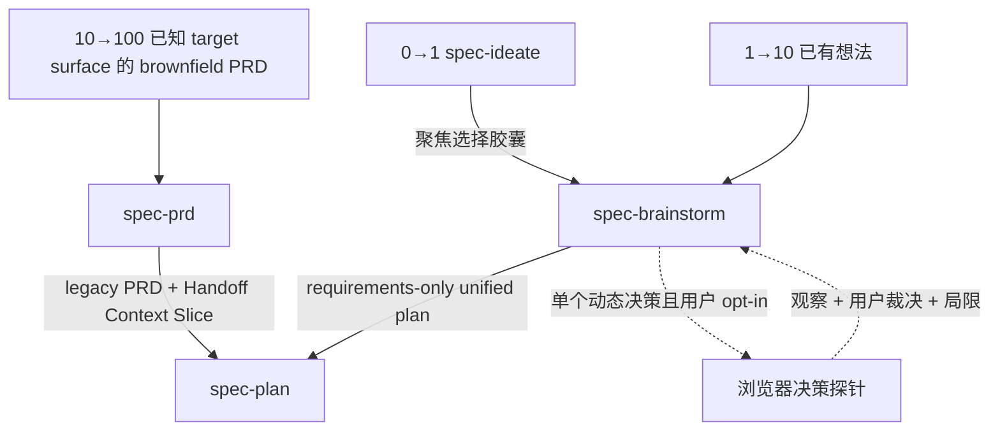
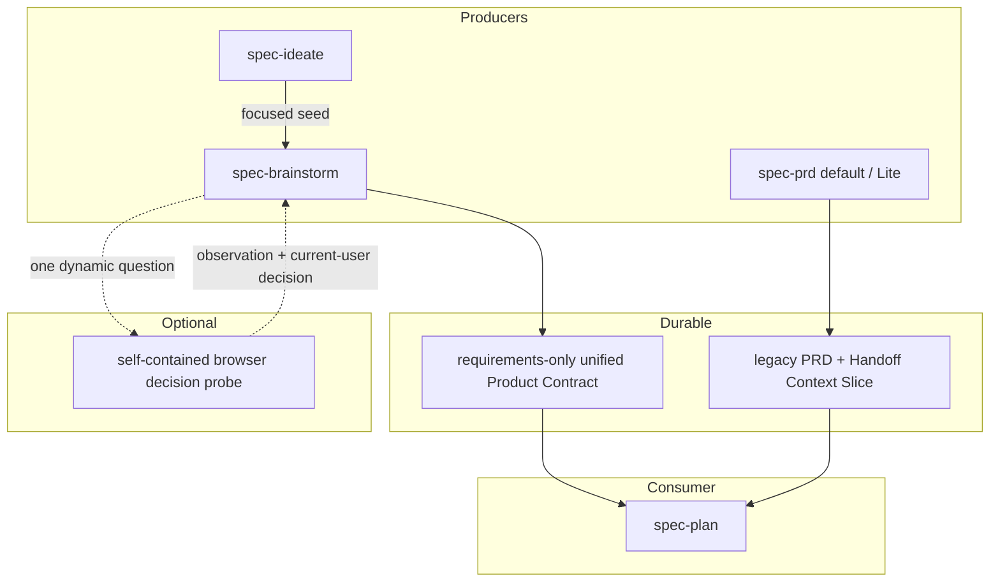
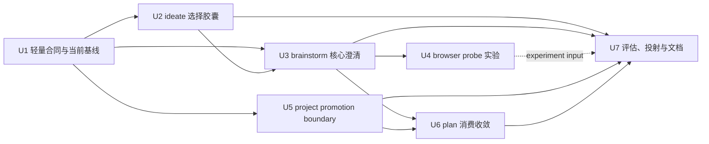

# 需求澄清能力轻量集成 - Plan

## Goal Capsule

- **目标：** 在不新增公共澄清工作流、不重建宿主执行运行时的前提下，减少从想法、需求探索和现有 PRD 进入规划时的承重 WHAT 丢失、重复提问、术语越权写入和规划侧需求发明。
- **产品路径：** 保持三条成熟度路径：`0→1: spec-ideate → spec-brainstorm → spec-plan`、`1→10: spec-brainstorm → spec-plan`、`10→100: spec-prd → spec-plan`。其中 10→100 仅适用于已有 PRD，或已经明确 target surface、release slice 与核心行为的 brownfield increment；产品形态仍未收敛时继续进入 `spec-brainstorm`。
- **当前 PRD 基线：** 当前 `spec-prd` 已具备默认 profile 与显式 opt-in 的 `analysis_profile=contract-reset-lite`。Lite 使用单一 Product Analysis Brief 合并分析门与风险排序，但保持 legacy PRD artifact、producer finalize、report-only validate 和 optional consumer diagnostic。当前执行对话用户是唯一人类产品确认人；专业、法规、隐私、安全、资金等材料只提供确认依据，不形成第二个人类确认入口。现有 Contract Reset Gate A 结论为 `inconclusive`，candidate 未推广，当前 reopen conditions 未满足。
- **本轮 PRD 范围：** 不新增 PRD 澄清适配器、不重开 Gate A、不改变 artifact topology、不新增 mandatory consumer receipt gate；只允许将 `CONTEXT.md`、项目词汇表和 ADR 的项目级写入统一收敛为 preview-first、单独批准。
- **原型边界：** 不新增公共或 standalone 的 `spec-prototype`。首版只在 `spec-brainstorm` 内收敛并加固现有 visual probe，提供 opt-in、单问题、自包含浏览器决策探针；不运行 shell 命令，不读取真实仓库或生产数据，不写主工作区。
- **停止条件：** 不创建第二套需求制品、运行状态机、跨进程安全账本、worktree 接管协议、通用沙箱后端、PRD 平行评估平台或来源检查器；没有 confirmed failure evidence 时不提前建设这些机制。
- **后续责任：** 后续实施由 `spec-work` 按 U-ID 依赖顺序推进。本计划本身不授权实现、runtime regeneration、提交或发布。
- **源码基线失效条件：** 实施开始前必须重新读取 Appendix 中的 source refs。若 `spec-prd` topology、单一当前用户确认模型、Gate A 结论、`spec-plan` consumer policy、`spec-brainstorm` visual-probe contract 或相关文件 hash 已变化，先更新本计划再实施。

---

## Product Contract

### Summary

本计划把外部 `grilling`、`domain-modeling`、`handoff` 和 `prototype` 方法中仍有边际价值的部分，适配到现有 `spec-ideate`、`spec-brainstorm`、`spec-prd` 和 `spec-plan` 边界中。

核心做法是增强已有交接与判断点，而不是增加新的公共节点：



`spec-prd` 保持当前默认/Lite 双基线和现有 PRD→plan 用户控制语义。浏览器决策探针是 `spec-brainstorm` 的临时交互方法，不是第四条主路径、独立 skill 或生产实现入口。

### 第一性原理重切

| 能力 | 当前源码事实 | 决策 |
| --- | --- | --- |
| 源码事实优先、一次一问、单一当前用户确认 | `spec-brainstorm` 与 `spec-prd` 已有较强能力；最新 PRD/Lite 已明确当前执行对话用户是唯一产品确认人，并整合 source inventory、confirmation basis 和 release-bounded closure | Adopt：复用并统一术语，不建立第二确认入口或共享执行器 |
| `spec-ideate` 选择交接 | 当前 focused seed 只有描述、basis、rationale、downsides 和 provenance | Wrap：补快照、局限、假设和相邻淘汰信息 |
| `spec-brainstorm` 场景与暂停恢复 | 已有 product pressure、blindspot、AE、Sources 和 Resolve Before Planning，但缺少稳定的“场景结果必须落点”与恢复最小信息 | Extend：在现有 Product Contract 内补齐，不增加状态机 |
| 项目级术语写入 | `spec-brainstorm` / `spec-plan` 会静默补写 `CONCEPTS.md`；触发的 `spec-prd grill-with-docs` 会 inline 更新 `CONTEXT.md` / ADR | Fix：统一 preview-first、单独批准 |
| 动态决策验证 | visual probe 已允许 disposable interaction demo，但当前 display helper 尚无显式 browser egress/sandbox response contract；也无证据证明需要 standalone、真实仓库上下文或跨宿主事务运行时 | Harden + Experiment：先加固现有 helper，再只做浏览器自包含探针 |
| PRD Contract Reset / Gate A | Gate A 已 `inconclusive`；owner 已选择 opt-in Lite，完整 migration 与 mandatory consumer gate 退出 active backlog | Stop：不重开、不平行建设 |
| `spec-plan` 来源解析 | 当前 upstream discovery 已识别 brainstorm requirements-only unified plan 与通用 legacy requirements doc；`spec-prd` 产物只是后者的一个子集，direct bootstrap/resume/deepen 仍独立存在 | Thin：澄清识别与 blocker 规则，不新增 inspector，也不缩窄直接规划入口 |

### Problem Frame

当前系统不是“缺少需求澄清”，而是存在四类更具体的问题：

1. **交接信息密度不稳定。** `spec-ideate` 的选择 seed 未携带承重 evidence 的基准版本、局限、未验证假设和最相关的淘汰替代，`spec-brainstorm` 可能重复推导或误把旧依据当当前事实。
2. **已具备的澄清结果没有统一落入 durable source。** `spec-brainstorm` 已有源码核实、一次一问和 AE，但暂停、上下文重置或临时 dossier 丢失后，下一执行者仍可能缺少准确的下一问题、承重源码引用和失效条件。
3. **项目级知识写入越过 mutation boundary。** 当前 `spec-brainstorm` / `spec-plan` 可静默修改 `CONCEPTS.md`；`spec-prd` 的 triggered grill-with-docs 还会把术语决策直接解释为 inline `CONTEXT.md` / ADR 写入授权。这违反 preview-first 和“需求制品本地闭合优先”。
4. **动态决策价值尚未验证，却被旧计划提前产品化。** 旧方案为一个可选原型旁路设计 standalone skill、多个安全账本、worktree 接管、强制沙箱、崩溃恢复、真实 Windows/POSIX 发布门禁和第二套 PRD Gate A。它在确认用户价值之前就承担了通用执行运行时的长期成本。与此同时，当前 visual-probe helper 只是 display server，若允许 agent-authored JavaScript，就必须先补一个窄的浏览器网络/导航确定性地板，不能把“localhost + temp directory”描述成已经隔离。

本轮解决前三类 confirmed gap，并用最低成本验证第四类假设。

### Requirements

**流程与 ownership**

- R1. 三条推荐成熟度路径保持不变；澄清继续归当前 producer session 所有。存在 upstream artifact 时，`spec-plan` 只消费已确认或显式残留的 WHAT；直接调用的 bootstrap 兼容路径保持，但必须显式暴露未确认的产品假设，不能把 planning judgment 漂白成 producer-confirmed fact。
- R2. 不新增公共 `spec-grill`、`spec-requirements-clarification`、`spec-domain-modeling` 或 standalone `spec-prototype`。
- R3. `spec-ideate` 继续生成和筛选方向，不变成需求访谈，不直接进入规划或运行决策探针。
- R4. `spec-prd` 当前 default 与 `contract-reset-lite` profile、当前执行对话用户作为唯一人类产品确认人的模型、legacy artifact topology、producer finalize、report-only validate 和 optional `--verify-receipt` diagnostic 保持不变。
- R5. Gate A 当前 `inconclusive/no-promotion` 是 confirmed boundary；本计划及其实施无条件不授权新 attempt、candidate arm、runner 或 migration。未来重开必须另立 project-governance plan，由 repository/project owner 批准，并在创建 attempt 前先解决 hard-isolation launcher 与 independent custody 等可前置条件；模型 outcome、blind review、replay 等 attempt-internal evidence 只能在新 attempt 内取得。该治理授权不进入 PRD 产品确认路径，也不创建第二个人类产品确认入口。

**事实、问题与持久化**

- R6. 对仓库可发现的 current fact，producer 在询问用户前先查源码、测试、合同或当前文档；无法确认时明确标为假设、局限或需要的 source。
- R7. 当前执行对话用户是唯一人类产品确认人。所有会改变需求内容、验收、范围、术语、兼容、优先级、风险接受或 release behavior 的产品确认每轮只问该用户一个；`owner`、specialist、sign-off 等兼容字段或材料只表示证据、责任或评估语义，不得创建第二个人类确认入口。
- R8. source-answerable 或 source-sensitive 的 current-user question 必须绑定具名 gap、已执行的 source attempt、Product Contract / PRD write target，以及不闭合时 planning 会发明什么。纯产品偏好或开放探索若没有可查 source，记录 `source_attempt: not-applicable` 及原因即可，不为形式完整制造无效检索。
- R9. 只有源码或明确权衡足以支持时才提供推荐答案；证据探查与开放探索不得用推荐答案提前锚定用户。
- R10. 真正 headless、用户无回复或 context reset 时不得伪造 current-user closure；LLM/agent 只能分析、推荐和记录，scripts 只能确认结构、路径、hash、receipt 等确定性事实。producer 写入非就绪需求制品或 checkpoint shape，保留已确认内容、假设、局限、阻塞和下一问题。
- R11. 承重源码依据必须进入规范 Product Contract / PRD 的现有 Sources、Evidence、Assumptions、Decision Notes 或 Handoff Context Slice；至少记录 source ref、观察基准或版本、局限及失效条件。`/tmp` dossier 只作加速材料。
- R12. 不新增完整访谈记录、持久 gap 状态表、第三套 handoff artifact 或通用澄清 schema。

**`spec-ideate` 选择胶囊**

- R13. repo mode 的 focused seed 增加：承重 basis 的 source snapshot、dirty/unknown limitation、未验证假设、与所选方向直接相关的一个相邻淘汰替代，以及原 ideation artifact pointer。
- R14. seed 保持 feature-description-shaped；不得传递完整 ideation 文档、完整 rejection table、实现 HOW 或与当前选择无关的候选。
- R15. source snapshot 已失效时，`spec-ideate` 只将其标为 stale/limitation；是否重新溯源和如何改变需求由 `spec-brainstorm` 决定。

**`spec-brainstorm` 澄清与场景**

- R16. `spec-brainstorm` 在 run-local reasoning 中按 source fact、current-user decision、open exploration、planning-owned HOW、decision-probe candidate 分类 load-bearing gap；该分类不持久化为状态机。
- R17. Standard/Deep 的行为型需求在 Phase 2.5 综合前运行相关性驱动的场景 pass，候选维度为 happy path、role/permission、state transition、failure/degraded、negative acceptance 和 cross-context handoff。
- R18. 场景 pass 不生成维度笛卡尔积；每个被选中的场景必须落为 AE、Resolve Before Planning/OQ、明确 assumption 或 Non-Goal，否则视为 ceremony 并删除。
- R19. producer 暂停或进入新会话前，只要已经形成 durable decision，就创建或更新 requirements-only unified plan；`Resolve Before Planning` 明确 blocker 与下一问题，不新增 progress status。
- R20. Product Contract 本地术语决定当前 release slice 的含义；项目级 glossary/context/ADR 只作校准来源，冲突必须暴露，不能按文件名或新旧程度静默选胜者。

**项目级语言 promotion**

- R21. `spec-brainstorm`、`spec-plan` 和 `spec-prd` 均不得静默创建或修改 `CONCEPTS.md`、`CONTEXT.md`、`CONTEXT-MAP.md`、项目 glossary 或 ADR。
- R22. term/ADR 的产品确认与“是否提升到项目级 source”是同一当前用户给出的两个不同授权，不是两个不同角色。producer 先在 Product Contract / PRD 内闭合含义，再展示精确 preview，取得针对该 path 和内容的单独写入批准后才 mutation。
- R23. ADR 仍只在 hard-to-reverse、surprising without context、real tradeoff 三项同时成立时提出；即使条件成立，也只产生 preview，不自动写入。
- R24. 缺少项目级 glossary/context topology 不阻塞 planning，只要当前需求制品内的术语和决策已经充分闭合。

**浏览器决策探针**

- R25. 决策探针只在 source 与对话无法回答、答案可能改变 R/AE/Scope、且当前用户明确选择 visual/interactive path 时触发；一次只回答一个具名问题。
- R26. 复用 `skills/spec-brainstorm/references/visual-probes.md` 与现有 display helper，不新增 skill、server、registry 或 packet schema。
- R27. 探针只允许一个 self-contained HTML/CSS/JS artifact，使用 synthetic/sanitized data；artifact-authored code 禁止 external request、`fetch`、WebSocket、local file API、form submit、popup/navigation、shell/child process、真实凭据、生产数据和仓库文件读取。现有 display helper 必须为 HTML 响应设置经过测试的 CSP `sandbox`、no-referrer、no-sniff 与 restrictive Permissions-Policy；只允许必要的 inline CSS/JS 和 same-origin helper endpoints，预期网络活动仅为 helper 注入的 `/version` refresh，不允许 external egress。无法提供该确定性地板时回退文本路径。
- R28. 探针只写 OS temp 下现有 visual-probe run root，不写主检出目录或 worktree，不安装依赖，不修改 lockfile，不提交、推送或发布。
- R29. 浏览器内交互只帮助观察；chat 中当前用户的 response 才构成人类产品确认。Product Contract 只记录 question、observation summary、current-user decision、limitations、affected R/AE 与 invalidation condition。
- R30. 没有 current-user response、浏览器能力或可安全构造的 synthetic probe 时，结果保持 unresolved/inconclusive prose residue；不得创建 machine `conclusive` 状态或声称已经运行。
- R31. 探针代码永不提升为 production implementation。若问题必须读取真实应用状态、运行 repo command、访问网络或修改真实工作树，本计划明确不支持，producer 保持 blocker 并记录 future experiment candidate。
- R32. 决策探针在 paired evaluation 证明增量价值前保持显式 opt-in；未达到 retention threshold 时删除动态扩展并退回现有 display-only visual probe，不继续建设真实上下文模式。

**`spec-plan` 消费**

- R33. `spec-plan` v1 的 upstream requirements-origin discovery 只识别两个当前真实 durable shape：`spec-brainstorm` 的 requirements-only unified plan，以及通用 legacy `docs/brainstorms/*-requirements.{md,html}`。`spec-prd` 产物是 legacy shape 的一个子集，由其现有 artifact/readiness/Handoff fields 识别；direct bootstrap、resume 和 deepen 行为保持不变。
- R34. 不预埋未来 `product_contract_source: spec-prd` unified topology；只有新的 repository/project-owner-approved producer migration plan 先落地后，consumer 才增加映射。该 source/topology 治理授权与当前用户作为唯一产品确认人是不同边界，不把项目治理者加入产品问答或产品确认路径。
- R35. 30 天只作候选发现提示，不证明 freshness。planning 根据持久 source refs、当前源码重读、limitations 和 invalidation condition 判断是否需要重新溯源。
- R36. `Resolve Before Planning`、`checkpoint-prd`、`can_enter_spec_plan: no` 或 load-bearing OQ 不能被静默忽略。存在 upstream producer 时 `spec-plan` 默认返回 producer；direct bootstrap 无 producer 时回到当前用户。现有用户控制语义保留：当前用户可以逐项把真正的产品 blocker 转成显式 decision/assumption 后继续。
- R37. producer receipt 验证保持 optional read-only diagnostic；本轮不把它升级为 consumer hard gate，也不新增 `inspect-requirements-origin.js` 或 `capture-prd-verifier-evidence.js`。
- R38. `spec-plan` 不再静默补写 `CONCEPTS.md`；发现项目级候选词汇时使用 R21-R24 的 preview-first promotion。

**交付与证据**

- R39. source 改动只发生在 `skills/`、`docs/contracts/`、测试、validation、README 和 CHANGELOG；generated runtime 只在 source/test/eval 通过后用 `spec-first init` 投射。
- R40. scripts/tests 只证明字段、路径、触发、CSP/sandbox response、禁止行为和投射事实；LLM/human fresh-source evaluation 判断问题质量、场景相关性、planning invention 与 current-user answer fidelity。
- R41. 语义评估必须分别覆盖 0→1、独立 1→10 和 10→100；0→1 样本不得替代直接 1→10。
- R42. 每个主效果指标同时记录 countermetric：额外 current-user confirmation rounds、token/latency、artifact size、无效 probe 数和错误 blocker 数；不能用更重 ceremony 换取表面完整。
- R43. 用户可见行为变化同步 README/README.zh-CN、当前执行文档和 CHANGELOG；计划本身的更新只同步 CHANGELOG。

### Actors

- A1. **当前执行对话用户 / 唯一产品确认人：** 基于 project source、专业材料或显式自我确认裁决需求、优先级、风险接受、defer/scope-cap，并对项目级 promotion 另行给出写入批准；不路由第二个人类联系人。
- A2. **`spec-ideate`：** 生成并筛选方向，提供聚焦选择胶囊。
- A3. **`spec-brainstorm`：** 查证事实、逐问澄清、维护 requirements-only Product Contract，并协调可选浏览器决策探针。
- A4. **`spec-prd`：** 处理已明确 target surface 的 brownfield PRD；保持当前 default/Lite 合同，只收敛项目级 promotion mutation。
- A5. **`spec-plan`：** 发现两类真实 upstream requirements origin，并保留 direct bootstrap/resume/deepen；按需重读源码、保留用户控制语义并设计 HOW。
- A6. **维护者 / repository governance owner：** 负责 source、tests、fresh-source evaluation、五宿主投射和发布证据，并单独批准 Gate A/topology 等项目治理变更；不参与或替代产品确认。

### Key Flows

- F1. **0→1：方向到需求**
  - **Trigger：** 用户从 `spec-ideate` 选中一个 repo-grounded idea。
  - **Steps：** `spec-ideate` 传递 focused seed；`spec-brainstorm` 复核 snapshot、关闭 source/current-user gap、生成 requirements-only unified plan。
  - **Outcome：** `spec-plan` 接收已选择方向的需求与局限，而不是整个 ideation candidate set。

- F2. **1→10：直接需求探索**
  - **Trigger：** 用户已有想法，但行为、范围、验收或术语尚未闭合。
  - **Steps：** `spec-brainstorm` 先查 source，再逐问 current-user decision，运行相关性场景 pass，必要时提供 opt-in 浏览器决策探针。
  - **Outcome：** Product Contract 包含足以规划的 WHAT，或明确的 Resolve Before Planning blocker。

- F3. **10→100：现有系统增量**
  - **Trigger：** 已有 PRD，或 target surface、release slice 与核心行为均明确的 brownfield increment。
  - **Steps：** `spec-prd` 使用当前 default 或显式 Lite profile 完成 source-first closure 和 producer finalize；本轮只把项目级 promotion 改为 preview-first。
  - **Outcome：** legacy PRD 与 Handoff Context Slice 继续作为 `spec-plan` 的当前输入；Gate A 和 topology 不变化。

- F4. **暂停与恢复**
  - **Trigger：** 用户暂停、无法回复、context reset 或宿主不能继续交互。
  - **Steps：** producer 将已确认需求、source refs、假设、局限、blocker 和下一问题写入规范制品。
  - **Outcome：** 新会话从 Product Contract / PRD 恢复，不依赖 transcript 或 `/tmp` dossier。

- F5. **浏览器决策探针**
  - **Trigger：** 一个动态交互/状态问题无法由 source 或文本关闭，且用户选择 visual/interactive path。
  - **Steps：** producer 写明问题和判定标准，在 OS temp 创建 self-contained artifact，用户观察后在 chat 给出 decision。
  - **Outcome：** observation、current-user decision、limitations 与 affected R/AE 写回 Product Contract；临时 artifact 不成为 source of truth。

### Acceptance Examples

- AE1. **Source-first。** 假设现有取消行为可从代码确认；当 producer 澄清目标时，先记录 current behavior，再只向用户询问 target decision。
- AE2. **逐问与单一确认入口。** 假设有三个相互独立的产品决定，其中一个有安全专家材料；每轮只向当前用户询问当前最高影响问题，专家材料只作为依据，答案分别绑定对应 write target，不联系第二个人类角色。
- AE3. **Ideate snapshot。** 假设 ideation artifact 保存后 HEAD 已变化；focused seed 标记 stale limitation，`spec-brainstorm` 不把旧 basis 当 current fact。
- AE4. **直接 1→10。** 假设没有 ideation artifact；`spec-brainstorm` 仍能独立生成 Product Contract，该样本不依赖 0→1 seed。
- AE5. **场景相关性。** 假设需求涉及多角色审批；permission、state、failure 和 handoff 场景进入 AE/OQ，不相关的离线规模场景被省略。
- AE6. **暂停恢复。** 假设对话在综合前暂停；requirements-only artifact 记录准确的下一问题和 source refs，删除 `/tmp` dossier 后仍可恢复。
- AE7. **术语冲突。** 假设 `CONCEPTS.md` 与规范 glossary 定义冲突；producer 暴露冲突并在当前制品内消歧，不静默修改任一项目文件。
- AE8. **Promotion 授权。** 假设术语已经在 PRD 内闭合；当前用户只确认术语含义但未批准项目级写入时，`CONTEXT.md` 保持不变。
- AE9. **静态视觉。** 假设用户比较三个布局；使用现有 display-only visual probe，不创建可运行探针合同。
- AE10. **动态决策。** 假设用户必须实际切换状态才能判断交互；opt-in probe 使用 synthetic data 展示完整状态，helper 响应带限制外部连接与导航的 CSP/sandbox headers，当前用户在 chat 裁决后写回 affected AE。
- AE11. **无浏览器能力。** 宿主无法稳定显示 localhost artifact 时，回退文本讨论并保持问题 unresolved，不声称 probe 已运行。
- AE12. **真实上下文越界。** 问题必须读取真实 repo state 或运行应用时，本计划返回 unsupported/future experiment candidate，不创建 worktree 或直接执行命令。
- AE13. **Legacy consumer control。** PRD 声明 checkpoint 或 `can_enter_spec_plan: no` 时，`spec-plan` 默认返回 `spec-prd`；只有当前用户逐项接受 assumption/decision 后才能继续。
- AE14. **PRD no-regression。** 未显式传入 `analysis_profile=contract-reset-lite` 时使用 default profile；传入时只改变 run-local analysis shape，不改变 topology、validate 或 consumer policy。
- AE15. **Gate A stop。** 实施和评估均不创建新的 Gate A attempt、runner 或 candidate；当前 `inconclusive` 结论保持可追溯。
- AE16. **无静默 glossary write。** `spec-brainstorm`、`spec-plan` 与 triggered `spec-prd` 在未取得 promotion approval 时，运行前后项目级 glossary/context/ADR 文件 hash 不变。
- AE17. **专业依据不足。** 法规/隐私/安全/资金材料不足以支持确认时，workflow 只向当前用户提供“显式确认、defer、scope-cap、保留 source-candidate/assumption/blocker”选项；LLM 不替代确认，也不路由 named specialist。

### Success Criteria

- 在 0→1、独立 1→10 和 10→100 的 representative paired samples 中，planner 发明的 load-bearing WHAT 不增加；至少两个路径相对当前 baseline 有可举证减少。
- representative cases 中，source 可回答却被询问给用户的事实数量为零或相对 baseline 减少，且 current-user answer fidelity 不下降、第二人类确认路由为零。
- requirements-only Product Contract 在 `/tmp` dossier 不存在时仍保留承重 source refs、limitations 和下一问题。
- project-level glossary/context/ADR 的未授权 mutation 为零；preview 与 approval 可回到具体 path 和 proposed content。
- 场景 pass 的每个保留项都有 AE/OQ/assumption/non-goal 落点；没有为了覆盖维度而生成的空仪式。
- 浏览器决策探针的 retention threshold：至少 3 个预注册动态决策 case 中有 2 个相对文本基线关闭或实质改变一个 load-bearing R/AE，任何 case 不得产生仓库写入、外部请求、第二确认路由或 confirmation laundering，额外 current-user round 不超过 2。未达阈值则删除动态扩展、保留现有 display-only visual probe。
- 默认 workflow 不新增 mandatory reference load；只有相关 signal 触发场景、领域语言或决策探针细节。
- current-source tests、fresh-source evaluation 和五宿主 source projection 分开记录，任何一层不能替代另一层。

### Scope Boundaries

**In scope**

- `spec-ideate` focused seed 的 evidence snapshot 与 limitation。
- `spec-brainstorm` 的轻量 gap 分类、场景落点、暂停恢复与 opt-in 浏览器决策探针。
- `spec-brainstorm`、`spec-plan`、`spec-prd` 项目级语言/ADR promotion 的 preview-first 边界。
- `spec-plan` 对现有两类 upstream requirements origin 的轻量发现规则、freshness 提示和用户控制语义；direct bootstrap/resume/deepen 不变。
- 聚焦 contract tests、fresh-source paired evaluation、五宿主投射和用户文档。

**Deferred until confirmed evidence**

- standalone/public `spec-prototype`。
- 真实 repo/application context、shell command、external network / arbitrary egress、worktree 或 OCI/micro-sandbox prototype execution；helper 自身的 same-origin `/version` refresh 仍在本轮范围内。
- browser-to-agent event channel、click tracking 或自动 verdict ingestion。
- persistent request registry、exactly-once consumption、crash-recovery ledger、retention anchor 和 cleanup receipt。
- 新 `spec-prd` unified artifact topology、mandatory consumer receipt gate 或新的 Contract Reset Gate A attempt。
- `inspect-requirements-origin.js`、producer verifier snapshot executor 或通用 requirements schema。

**Non-goals**

- 用共享公共澄清 workflow 替换 `spec-brainstorm` / `spec-prd`。
- 持久化完整 interview transcript、run-local gap map 或每个可逆微决策。
- 把 browser probe artifact 当成 PRD、production code、测试覆盖或架构批准。
- 强制仓库必须存在 `CONCEPTS.md`、`CONTEXT.md`、`CONTEXT-MAP.md` 或 ADR。
- 手改 generated runtime mirrors。

### Dependencies And Assumptions

- 当前 PRD Gate A 的 source of truth 是 `docs/validation/spec-prd/2026-07-11-spec-prd-contract-reset-gate-a.md`；其结论为 `inconclusive`，reopen conditions 未满足。
- 当前 Lite source 是 `skills/spec-prd/references/product-analysis-lite.md`；它是 opt-in evaluation branch，不授权 topology migration。
- 当前 PRD/Lite confirmation model 的 source 是 `skills/spec-prd/SKILL.md` 与 `skills/spec-prd/references/product-analysis-lite.md`：当前执行对话用户是唯一人类产品确认人；specialist/regulated materials 只作依据，LLM 与 scripts 均不得替代产品确认。
- 当前 `spec-plan` 受 `tests/unit/spec-prd-plan-handoff-contracts.test.js` 保护：通用 legacy requirements 保持可读；其中的 PRD handoff 保留用户控制，consumer receipt diagnostic optional。
- 当前 visual probe server 只负责 display，尚未设置本计划要求的 CSP/sandbox response contract；chat response 仍是唯一人类产品确认。本计划只加固现有 helper，不扩展事件采集。
- 本计划依据当前磁盘 source，而不是仅依据 HEAD transcript。实施前必须按 Goal Capsule 的失效条件重读 source。

---

## Planning Contract

### Reuse And Adaptation

| Existing mechanism | Reuse | Adaptation | Reject |
| --- | --- | --- | --- |
| `spec-ideate` focused seed | title、description、basis、rationale、downsides、provenance | snapshot、limitation、assumption、相邻淘汰替代 | 整份 ideation artifact handoff |
| `spec-brainstorm` blindspot / pressure / AE | source-first、one-question、Product Contract | gap 分类、场景结果落点、暂停恢复 | 新 clarification engine |
| `spec-brainstorm` visual probe | OS temp、display helper、chat feedback | self-contained dynamic state probe，显式 opt-in | standalone prototype runtime |
| `spec-prd` default + Lite | source/confirmation basis、sole-current-user closure、Decision Card、receipt、Handoff Slice | 仅 project promotion preview-first | 第二确认入口、新 Gate A、topology、mandatory consumer gate |
| `spec-plan` Phase 0.2/0.5 | unified + legacy source discovery、用户 blocker 处置 | freshness 以 source refs 为主、禁止 silent glossary write | 新 origin inspector/runtime |
| domain-modeling | glossary conflict、精确术语、克制 ADR | local closure first、promotion separately approved | 固定文件名自动 authority |

### Key Technical Decisions

- KTD1. **澄清是 producer capability，不是新公共 workflow。**
- KTD2. **当前 PRD 是已实现邻接能力，不是待复制目标。** default/Lite 双基线和 Gate A stop condition 优先于旧计划假设。
- KTD3. **先修 confirmed gaps，再实验 dynamic probe。** seed、durable refs、promotion boundary 和 plan consumption 可独立交付。
- KTD4. **动态验证留在 `spec-brainstorm`。** 父会话拥有问题、当前用户 opt-in、交互和 Product Contract 写回；没有第二个协调者或确认人。
- KTD5. **v1 probe 是 browser-contained presentation，不是 arbitrary host code execution。** 加固后的现有 display helper 用 CSP/sandbox response contract 阻断外部连接、表单、frame/object、popup/navigation 与下载；self-contained HTML/JS 不拥有 host filesystem、shell 或 external network capability。
- KTD6. **真实上下文明确不支持。** 不用普通进程、temp directory 或 worktree 冒充强隔离。
- KTD7. **durable source 仍是 Product Contract / PRD。** seed、dossier 和 browser artifact 都是临时输入。
- KTD8. **不新增 deterministic consumer parser。** 当前缺口由 prose contract 和聚焦测试可解决；等 repeated failure evidence 再 build。
- KTD9. **项目级 promotion 是独立 mutation。** 同一当前用户确认 term decision，不等于批准写 glossary/context/ADR；这是两次 consent，不是两个角色。
- KTD10. **场景按实质性推导。** selected dimension 必须改变 AE/OQ/assumption/non-goal，否则删除。
- KTD11. **保留 `spec-plan` 用户控制语义。** producer blocker 不能被静默忽略，但当前用户可显式转成 assumption/decision。
- KTD12. **证据强度匹配 claim。** contract test 证明结构和浏览器响应地板，fresh-source paired eval 决定是否保留动态扩展，后续 field outcome 决定是否继续投资更高能力。

### High-Level Design



### Minimal Handoff Shapes

**Focused idea seed**

```text
title
description
basis + source_snapshot
why_it_matters
known_tradeoffs
evidence_limitations
unverified_assumptions
relevant_rejected_alternative
provenance_pointer
```

该 shape 是 run-local handoff，不新增 machine schema。字段缺失时 `spec-brainstorm` 仍可继续，但必须把缺口标为 limitation，而不是补写假事实。

**Product Contract persistence**

| Clarification result | Existing durable destination |
| --- | --- |
| current fact / source ref | Sources / Research、Problem Frame 或 Dependencies / Assumptions |
| current-user decision（兼容现有 Owner Decision Trace 字段名） | Requirements、Key Decisions、Scope Boundaries 或 Decision Notes |
| behavior scenario | Acceptance Example |
| blocking WHAT | Resolve Before Planning / Outstanding Questions |
| planning-owned HOW | Deferred to Planning |
| local term | Product Contract prose / glossary subsection when material |
| probe result | affected R/AE、Key Decision、limitations / invalidation |

### Browser Decision Probe Contract

1. producer 先写明一个问题、affected R/AE、文本/源码为何不足，以及用户应观察什么。
2. 用户选择 visual/interactive path 后，producer 在现有 OS temp visual-probe root 写一个 self-contained HTML。
3. artifact 只能使用 inline CSS/JS 和 synthetic data；artifact-authored code 不得包含 external URL、`fetch`、WebSocket、local-file API、form submit、popup/navigation 或动态 script import。
4. 现有 display helper 为 HTML 响应设置确定性 headers。最低 CSP 为 `default-src 'none'; script-src 'unsafe-inline'; style-src 'unsafe-inline'; img-src 'self' data:; connect-src 'self'; font-src 'none'; media-src 'none'; object-src 'none'; frame-src 'none'; worker-src 'none'; manifest-src 'none'; base-uri 'none'; form-action 'none'; frame-ancestors 'none'; sandbox allow-scripts allow-same-origin`，并设置 `Referrer-Policy: no-referrer`、`X-Content-Type-Options: nosniff` 与禁用 camera/microphone/geolocation/payment 等能力的 `Permissions-Policy`。预期 connect 仅为 helper 注入的 same-origin `/version` refresh；不新增 server、browser-to-agent event channel 或 external egress。
5. 当前用户在 chat 中返回 accepted / rejected / mixed 或自由文本裁决；这是唯一人类产品确认入口。
6. producer 将 observation、decision、limitation 和 invalidation 写回 Product Contract；删除或保留 temp artifact 不改变需求事实。
7. 无 browser capability、无 current-user answer、helper 无法提供响应地板或问题需要真实上下文时，停止并保留 blocker。

### Implementation Sequence



U1-U3、U5-U6 构成核心交付，彼此不依赖 PRD Gate A、standalone prototype、sandbox backend 或新 consumer parser。U4 是独立 opt-in experiment，任何核心 unit 都不依赖它；U7 对 U4 做 retention 裁决，失败时删除动态扩展仍可发布核心改造。

---

## Implementation Units

### U1. 定义轻量澄清合同与当前 PRD 基线

- **Goal：** 固定 source-first、sole-current-user confirmation、durable persistence、scenario landing、promotion boundary 和 current PRD stop condition，不创建执行器或 schema。
- **Requirements：** R1-R12, R39-R42
- **Trace：** F2-F4；AE1-AE2、AE6、AE14-AE15、AE17；KTD1-KTD2、KTD7、KTD9、KTD12
- **Consumers：** U2-U7 对应的 `spec-ideate`、`spec-brainstorm`、`spec-prd`、`spec-plan` source prose、contract tests 与 evaluation；该文档不是 runtime entrypoint。
- **Files：**
  - 新增 `docs/contracts/workflows/requirements-clarification.md`
  - 新增 `tests/unit/requirements-clarification-contracts.test.js`
- **Approach：**
  - 合同只写会改变决定的 durable invariants。
  - 明确 current `spec-prd` default/Lite 双基线、Gate A `inconclusive` 和禁止平行 attempt。
  - 区分 script-owned facts、LLM-owned analysis/semantic judgment 与 current-user-owned product confirmation。
  - 明确 specialist/regulatory/privacy/security/financial materials 是 confirmation basis，不创建第二个人类入口。
  - 不新增 JSON schema、reason-code family、状态机、CLI 或 runtime command。
- **Test scenarios：**
  - source-answerable fact 不成为 current-user question。
  - 专业材料不足时由当前用户确认/defer/scope-cap，LLM 不代签、workflow 不联系第二人。
  - Product Contract/PRD 是 durable source，`/tmp` 不是。
  - Gate A current stop condition 可从准确 validation path 找到。
  - project promotion 是单独 mutation。
- **Verification：** 聚焦 contract test；直接检查 source refs 与当前文件 hash，不把 Graphify 或历史 transcript 当 confirmed truth。

### U2. 强化 `spec-ideate` focused seed

- **Goal：** 让 `spec-brainstorm` 继承选择依据与局限，而不把 ideation artifact 复制成 mini PRD。
- **Requirements：** R13-R15
- **Trace：** F1；AE3；KTD3、KTD7、KTD12
- **Files：**
  - 修改 `skills/spec-ideate/SKILL.md`
  - 修改 `skills/spec-ideate/references/post-ideation-workflow.md`
  - 新增 `tests/unit/spec-ideate-clarification-handoff-contracts.test.js`
- **Approach：**
  - 在现有 `Brainstorm One Idea` seed 中加入 snapshot、limitation、assumption 和一个相邻 rejected alternative。
  - 保留现有 title/description/basis/rationale/downsides/provenance。
  - 不读取或传递完整 saved artifact；不从 ideate 直接运行 probe 或进入 `spec-plan`。
- **Test scenarios：**
  - direct basis 当前有效。
  - HEAD 或 source changed 后 seed 标记 stale。
  - reasoned idea 无 direct evidence 时保留 unverified assumption。
  - rejection summary 很长时只携带与当前方向直接相关的一个替代。
- **Verification：** contract test 加 fresh-source evaluator，检查 seed 有用但不演变为 PRD。

### U3. 收敛 `spec-brainstorm` 核心澄清、场景与暂停恢复

- **Goal：** 用现有 Product Contract、AE、Sources 和 Resolve Before Planning 补齐探索主路径，不依赖动态探针或新增 workflow/runtime。
- **Requirements：** R6-R12, R16-R20
- **Trace：** F1-F2、F4；AE1-AE6、AE17；KTD1、KTD3、KTD7、KTD10、KTD12
- **Files：**
  - 修改 `skills/spec-brainstorm/SKILL.md`
  - 修改 `skills/spec-brainstorm/references/product-pressure-test.md`
  - 修改 `skills/spec-brainstorm/references/brainstorm-sections.md`
  - 修改 `skills/spec-brainstorm/references/handoff.md`
  - 新增 `tests/unit/spec-brainstorm-clarification-contracts.test.js`
- **Approach：**
  - 在当前 run-local reasoning 中分类 gap；不新增持久表。
  - 把 scenario pass 接到现有 product pressure 与 Acceptance Examples，不添加第二份 scenario reference。
  - 暂停时复用 requirements-only artifact 和 Resolve Before Planning。
  - Sources/Research 对承重 fact 增加 snapshot/limitation/invalidation 最小要求。
- **Test scenarios：**
  - source fact、current-user decision、HOW 和 future probe candidate 正确分流，但没有 U4 时仍可完成 Product Contract。
  - 场景只保留会改变 AE/OQ/assumption/non-goal 的维度。
  - pause 后删除 dossier 仍可恢复。
  - 纯产品偏好无 source 可查时记录 not-applicable reason，不执行无效 source ceremony。
- **Verification：** contract tests 与 fresh-source paired cases；U4 被删除或 disabled 时本 unit 仍必须独立通过。

### U4. 加固现有 visual helper 并实验 opt-in 浏览器决策探针

- **Goal：** 在不新增 server/skill/runtime 的前提下，为现有 disposable interaction demo 补浏览器确定性安全地板，并单独验证动态探针是否减少承重决策不确定性。
- **Requirements：** R25-R32
- **Trace：** F5；AE9-AE12；KTD3-KTD6、KTD12
- **Dependencies：** U1、U3
- **Files：**
  - 修改 `skills/spec-brainstorm/SKILL.md`
  - 修改 `skills/spec-brainstorm/references/visual-probes.md`
  - 修改 `skills/spec-brainstorm/scripts/visual-probe-server.js`
  - 新增 `tests/unit/spec-brainstorm-decision-probes.test.js`
- **Approach：**
  - display-only 继续默认；只有当前用户 opt-in 且一个具名问题依赖动态状态时才生成 self-contained interactive artifact。
  - 加固现有 display helper 的 HTML response headers，允许 same-origin helper endpoints，阻断 external connect、form、frame/object、popup/navigation、download 和敏感 browser capabilities；不新增 server 或 dependency。
  - probe 只允许浏览器内 synthetic state；不运行 repo command，不把 temp root 或 localhost 冒充 host sandbox。
  - helper hardening 与 dynamic semantics 分开裁决：前者若通过现有 visual-probe no-regression 可独立保留；后者只有达到 retention threshold 才保留。
- **Test scenarios：**
  - static layout 继续 display-only，现有 refresh/lifecycle 行为不回归。
  - HTML response 带完整 CSP `sandbox`、no-referrer、no-sniff 和 restrictive Permissions-Policy。
  - dynamic artifact 无 external URL/API、repo write 或真实数据；无 current-user answer 时不关闭需求。
  - 需要真实 app context、browser 不可用或 header floor 不可用时保持 blocker/text fallback。
- **Verification：** helper HTTP contract tests、before/after workspace snapshot 与 core-vs-core+probe paired evaluation；不创建 prototype lifecycle integration suite。

### U5. 统一项目级语言与 ADR promotion mutation boundary

- **Goal：** 消除 `CONCEPTS.md`、`CONTEXT.md` 和 ADR 的 silent/implicit write，同时保留需求制品本地闭合。
- **Requirements：** R20-R24, R38
- **Trace：** F2-F3；AE7-AE8、AE16-AE17；KTD2、KTD7、KTD9、KTD12
- **Files：**
  - 修改 `docs/contracts/domain-glossary.md`
  - 修改 `skills/spec-brainstorm/SKILL.md`
  - 修改 `skills/spec-plan/SKILL.md`
  - 修改 `skills/spec-prd/SKILL.md`
  - 修改 `skills/spec-prd/references/domain-language-and-decision-ledger.md`
  - 修改 `skills/spec-prd/references/grill-with-docs-integration.md`
  - 新增 `tests/unit/requirements-language-promotion-contracts.test.js`
  - 修改 `tests/unit/spec-prd-lite-profile-contracts.test.js`
- **Approach：**
  - 删除 `spec-brainstorm` / `spec-plan` 的 `Apply silently` 行为。
  - `spec-prd` 中当前用户对术语/决策的确认只关闭 PRD-local WHAT；项目级 file mutation 需要同一用户独立 preview + approval。
  - preview 包含 target path、精确 proposed content、confirmation/mutation scope 和不写入的影响。
  - validate 保持 report-only；不借 promotion 修改文件。
  - 当前 `product-analysis-lite.md` 只作 single-confirmer/no-topology-drift 回归基线；除非实施时发现它直接声明项目级 mutation，否则不修改该刚更新的 reference。
- **Test scenarios：**
  - `CONCEPTS.md` 存在但 term 缺失，未批准时文件不变。
  - triggered grill-with-docs 解决术语后只写 PRD，未单独批准时 `CONTEXT.md` 不变。
  - ADR 三条件满足但未批准时只展示 preview。
  - Lite profile 加载 domain reference 时不产生隐式写入。
- **Verification：** 运行前后 path/hash snapshot；测试 default 与 Lite profile、create/refine/validate。

### U6. 收窄 `spec-plan` 来源消费与 blocker 语义

- **Goal：** 减少 planning invention 和静默 mutation，而不新增 parser、receipt gate 或未来 producer dead contract。
- **Requirements：** R33-R38
- **Trace：** F1-F4；AE4、AE6、AE13-AE14；KTD7-KTD8、KTD11
- **Dependencies：** U1、U3、U5；不依赖 U4 dynamic probe
- **Files：**
  - 修改 `skills/spec-plan/SKILL.md`
  - 修改 `tests/unit/spec-plan-contracts.test.js`
  - 修改 `tests/unit/spec-prd-plan-handoff-contracts.test.js`
- **Approach：**
  - Phase 0.2 的 upstream discovery 保留 brainstorm requirements-only unified artifact 与通用 legacy requirements 两类真实来源；不改变 direct bootstrap、resume 或 deepen。
  - 30-day 判断明确降为 discovery hint。
  - 读取 source refs、limitations、Resolve Before Planning、PRD write/readiness fields 与 Handoff Slice。
  - upstream-sourced run 默认把 true product blocker 路由回 producer；direct bootstrap 回当前用户。保留现有逐项转 explicit assumption/decision 的用户选择。
  - 不新增 `product_contract_source: spec-prd` unified branch、`inspect-requirements-origin.js` 或 verifier snapshot executor。
  - 删除 silent `CONCEPTS.md` gap-fill，改用 U5 promotion。
- **Test scenarios：**
  - brainstorm requirements-only artifact 原地 enrichment。
  - 通用 legacy requirements 仍可作为 origin；当其中存在当前 PRD fields/Handoff Slice 时，保持 user-selected entry 与 optional receipt diagnostic。
  - 无 upstream source 时仍创建 `product_contract_source: spec-plan-bootstrap`，不因 origin discovery 收窄而拒绝 direct planning。
  - 显式 implementation-ready path 仍走 resume/deepen fast path，不被 Phase 0.2 origin discovery 接管。
  - checkpoint / `can_enter_spec_plan: no` 不被静默忽略。
  - 当前用户显式转换 blocker 后可以继续，记录 accepted risk。
  - source ref changed 时 planning 重新读取并记录 limitation。
- **Verification：** 现有 handoff tests 加 focused behavior tests；不建立跨技能 runtime dependency。

### U7. 语义评估、五宿主投射与用户文档

- **Goal：** 证明核心改造减少下游发明和越权 mutation，并决定 dynamic probe 是否值得保留。
- **Requirements：** R39-R43
- **Trace：** F1-F5；AE1-AE17；KTD12
- **Dependencies：** 核心 U2、U3、U5、U6；U4 仅作为可删除的 experiment input
- **Files：**
  - 修改 `tests/unit/eval-fixture-contracts.test.js`
  - 修改 `tests/unit/host-runtime-projection-contracts.test.js`
  - 修改 `tests/unit/plugin-modules.test.js`
  - 修改 `README.md`
  - 修改 `README.zh-CN.md`
  - 修改 `docs/05-用户手册/23-spec-prd当前执行逻辑.md`
  - 新增 `docs/validation/requirements-clarification/2026-07-11-clarification-integration-current-source-evaluation.md`
  - 修改 `CHANGELOG.md`
- **Approach：**
  - 使用当前源码 baseline、核心改造组、核心+dynamic-probe 组做配对 fresh-session evaluation。
  - 若 U4 dynamic semantics 未达 retention threshold，删除对应 prose/tests/fixtures 后继续验证核心；helper headers 只有在独立 visual-probe no-regression 通过时才可保留。
  - PRD 组只验证 no-regression 和 promotion mutation boundary；不创建 Gate A candidate。
  - 记录 planner invention、source-answerable questions、current-user fidelity、second-human routing、scenario omission、unauthorized mutation、额外 rounds/token/latency 和 probe usefulness。
  - source tests 通过后用现有 plugin sync 投射 modified reference；不新增 governance entry。
- **Test scenarios：**
  - 0→1、独立 1→10、10→100 各自独立样本。
  - 无 subagent/browser host 的诚实 degraded behavior。
  - 五宿主都获得修改后的 existing skill resources；没有 `spec-prototype` 新入口。
  - static tests 通过但 semantic sample 失败时发布阻塞。
- **Verification：** Verification Contract 中的 focused、repository、projection 与 fresh-source gates。

---

## Verification Contract

### Focused Contract Tests

```bash
npx jest --runInBand \
  tests/unit/requirements-clarification-contracts.test.js \
  tests/unit/spec-ideate-clarification-handoff-contracts.test.js \
  tests/unit/spec-brainstorm-clarification-contracts.test.js \
  tests/unit/spec-brainstorm-decision-probes.test.js \
  tests/unit/requirements-language-promotion-contracts.test.js \
  tests/unit/spec-plan-contracts.test.js \
  tests/unit/spec-prd-lite-profile-contracts.test.js \
  tests/unit/spec-prd-plan-handoff-contracts.test.js \
  tests/unit/plugin-modules.test.js \
  tests/unit/host-runtime-projection-contracts.test.js \
  tests/unit/eval-fixture-contracts.test.js
```

测试至少证明：

- focused seed 字段和 source limitation。
- scenario pass 有具体落点且无全维度强制。
- browser probe 的 helper response 带 CSP/sandbox deterministic floor；artifact 无 external request/API、无 repo mutation、无伪运行声明。
- current user 是唯一人类产品确认入口；specialist material 只作 evidence，LLM/scripts 不替代确认。
- glossary/context/ADR 未授权时 hash 不变。
- default/Lite PRD profile、legacy topology、report-only validate、optional consumer diagnostic 不漂移。
- `spec-plan` 保留 direct bootstrap/resume/deepen 与用户控制 blocker 语义，且不静默写 glossary。

### Repository Gates

```bash
npm run lint:skill-entrypoints
npm run typecheck
npm run test:eval-fixtures
npm run test:unit
npm run test:integration
npm run test:smoke
npm test
npm run build
git diff --check
```

优先运行 focused tests；只有影响面确认需要时扩大。不得新增 `test:prototype-release`、真实 Windows prototype lifecycle 或 OCI sandbox gate。

### Five-Host Projection

源码测试和语义评估通过后：

```bash
node bin/spec-first.js init --claude --codex --cursor --kiro --qoder -y --dry-run
node bin/spec-first.js init --claude --codex --cursor --kiro --qoder -y
node bin/spec-first.js doctor --claude --json
node bin/spec-first.js doctor --codex --json
node bin/spec-first.js doctor --cursor --json
node bin/spec-first.js doctor --kiro --json
node bin/spec-first.js doctor --qoder --json
```

runtime projection 只验证 source delivery 和 path rewrite；不能证明问题质量或用户结果。

### Fresh-Source Evaluation

按 `docs/contracts/workflows/fresh-source-eval-checklist.md` 使用新会话 reviewer 读取当前磁盘 source。

必需样本：

1. source 能回答的 current fact。
2. current behavior 与 target decision 冲突。
3. 三个独立 current-user decision，逐次只问一个。
4. stale ideation basis handoff。
5. 直接 1→10，无 ideation artifact。
6. permission/state/failure/negative/handoff 场景。
7. pause 后无 transcript、无 `/tmp` dossier 的恢复。
8. glossary authority conflict 与未授权 promotion。
9. display-only layout probe。
10. self-contained dynamic state probe 的 accepted/rejected/inconclusive，以及 helper CSP/sandbox response。
11. 需要真实 repo context 的 probe，必须保持 unsupported/blocking。
12. default 与 Lite PRD profile 的 no-regression。
13. specialist/regulatory/privacy/security/financial evidence 不产生第二确认入口；当前用户可确认、defer、scope-cap 或保留 blocker。
14. legacy PRD checkpoint 进入 `spec-plan` 的用户控制处置。
15. Gate A current `inconclusive`，不得出现新 attempt 或 candidate。
16. 无 upstream source 的 direct `spec-plan` 仍生成 `product_contract_source: spec-plan-bootstrap`。
17. 显式 implementation-ready plan path 的 resume/deepen fast path 不被 origin discovery 接管。

主要指标：

- planner 发明的 load-bearing WHAT。
- 向用户询问的 source-answerable facts。
- 重复/捆绑 current-user questions。
- applicable scenario omissions。
- current-user answer / confirmation laundering 与 second-human routing。
- unauthorized project-level mutations。
- 额外 rounds、tokens、latency 和 artifact size。
- dynamic probe 中真正关闭/改变 R/AE 的比例。

### Release Gates

- U1-U3 可以先独立落地，并且不依赖任何 browser probe 代码。
- U4 helper hardening 先过现有 visual-probe no-regression；dynamic semantics 的 retention threshold 失败不阻塞 U1-U3、U5-U6，失败时由 U7 删除实验扩展。
- U5 必须同时覆盖 brainstorm、plan、PRD default/Lite 和 validate no-mutation；当前 Lite reference 默认只测不改。
- U6 不改变 direct bootstrap/resume/deepen、legacy PRD user-control 或 optional receipt policy。
- U7 只有在 focused tests 与 current-source evaluation 无 P0/P1 时才能投射 runtime。
- 任何新增 P0/P1 semantic finding、unauthorized mutation、second-human routing 或 confirmation laundering 阻塞发布。

---

## Definition of Done

- 三条成熟度路径保持稳定，10→100 入口与当前 `spec-prd` brownfield boundary 一致。
- 当前 PRD default/Lite 双基线和 Gate A `inconclusive/no-promotion` 被准确记录；没有新 Gate A、topology 或 consumer gate。
- 当前执行对话用户保持唯一人类产品确认人；specialist/regulated materials 只作依据，LLM/agent 与 scripts 不替代产品确认。
- `spec-ideate` focused seed 携带 source snapshot、limitations、assumptions 和相关淘汰信息，但不变成 mini PRD。
- `spec-brainstorm` 先查 source、逐问当前用户、运行相关性场景 pass，并在暂停时把 durable state 写入 requirements-only Product Contract。
- 所有保留场景都有 AE/OQ/assumption/non-goal 落点。
- `spec-brainstorm`、`spec-plan` 和 `spec-prd` 的 project-level glossary/context/ADR write 均为 preview-first、单独批准。
- dynamic probe 只存在于 `spec-brainstorm` existing visual-probe surface，使用带 CSP/sandbox response floor 的 self-contained browser artifact，无 external request、repo write、真实数据或 shell execution。
- 没有 standalone `spec-prototype`、request registry、worktree takeover、sandbox runner、cleanup ledger 或 prototype release gate。
- `spec-plan` upstream discovery 只识别当前两类真实 durable origin，30-day 仅为提示；direct bootstrap/resume/deepen 保持，blocker 不被静默忽略，用户控制 assumption/decision 路径保持。
- focused tests、repository gates、fresh-source evaluation 和五宿主 source projection 分别通过并记录；三者不互相替代。
- dynamic probe 达到 retention threshold 才保留；未达到则删除动态扩展并保留现有 display-only visual probe。
- README、README.zh-CN、当前执行文档和 CHANGELOG 与最终实现一致。
- generated runtime 未手改；需要刷新时只从 source 运行 `spec-first init`。
- U1-U7 各自的 Requirements、Trace、Test scenarios 与 Verification 均有实际证据；不得用 U7 总体验证替代单 unit exit。
- 未达到 retention threshold 的 probe prose/tests/fixtures 和其他 abandoned experiment/code 已从最终 diff 删除；通过独立 no-regression 的 helper security hardening 可保留并说明理由。

---

## Appendix

### Current Source Evidence

| Source | Current fact | SHA-256 at plan update |
| --- | --- | --- |
| `skills/spec-prd/SKILL.md` | default + exact-token opt-in Lite；当前用户 sole human product confirmer；legacy topology；producer finalize；validate report-only | `74db75f381d99ad118b00dbfa88b3bc72a973793d64caa5153d8964ef7689bd4` |
| `skills/spec-prd/references/product-analysis-lite.md` | single Brief；confirmation basis；sole current-user confirmer；no unified sibling/consumer gate | `465b94f085904363524dc11cade3b65e1058d79f37359da766bba8f2774d4dc4` |
| `docs/validation/spec-prd/2026-07-11-spec-prd-contract-reset-gate-a.md` | `Decision: inconclusive`；candidate no-promotion；reopen conditions | `dfb7d21b4798cede53f82554d9bf112794e1b346336c01eaa202d761c9d5bfb8` |
| `tests/unit/spec-prd-lite-profile-contracts.test.js` | Lite exact opt-in、single confirmer、topology/validate/consumer boundary、五宿主正文 projection | `914bda5feec0e722874d3425fe6d69e7fc18fdd439305aa6b564cb809925a98b` |
| `skills/spec-brainstorm/SKILL.md` | source verification、one-question、Product Contract、silent `CONCEPTS.md` capture | `5f29ad557bde6d2c4171432068840c76d441e9887f3e3ad191c4cd0d1e1ad07c` |
| `skills/spec-brainstorm/references/visual-probes.md` | display-only feedback contract；允许必要的 disposable interaction demo；chat response authoritative | `8ffc76d2f6786c10b16e2bb3ff6d34b7a6310ce009578f5d7d1c380ffb2d9b62` |
| `skills/spec-brainstorm/scripts/visual-probe-server.js` | 现有 localhost display helper；注入 `/version` refresh；当前无 CSP/sandbox/Permissions-Policy headers | `6bbc37398aa79b5aef597e24f55a5bba386564dbedeca10498f10fe3e96ad0e3` |
| `skills/spec-plan/SKILL.md` | unified + legacy discovery、30-day hint、silent `CONCEPTS.md` gap-fill | `7afaf3266ddad266caab69ba6268d2f47026ecad248b3f7609c5603c19fb4286` |
| `skills/spec-ideate/references/post-ideation-workflow.md` | focused seed 缺少 snapshot/limitations/assumptions | `94d5771bd579c5c97d6937dcce6642e2e51a905a60605829880cc764beace126` |

实施前若任一 hash 不匹配，hash mismatch 只表示需要重读和语义 rebase，不自动判定计划失效。

### Review Coverage

- coherence-reviewer：发现 PRD 基线漂移、promotion boundary 矛盾与旧 U-ID trace 问题。
- feasibility-reviewer：确认旧版 U5 重复 Gate A、旧版 U6 预埋死拓扑、真实上下文缺少后端且 worktree 有未声明副作用。
- product-lens-reviewer：确认 prototype 在价值验证前产品化，并收窄 10→100 PRD 入口。
- security-lens-reviewer：确认 temp directory 不是代码执行 sandbox，旧方案安全生命周期扩大可信计算基。
- scope-guardian-reviewer：确认旧版 U4/U5/U6 违反 80/20，且 optional prototype 错误阻塞核心交付。
- adversarial-document-reviewer：确认 prototype premise 未经 outcome evidence，旧方案重建 host runtime。
- design-lens-reviewer：本轮未在时限内完成；dynamic probe 的交互状态由 U4 focused tests 与 fresh-source eval 补充验证。
- final-plan-audit：在最新 PRD single-confirmer source 与 HEAD rebase 后复核 Gate A/governance、direct plan paths、U1-U7 trace/dependency 和 probe rollback；最终无剩余 P0/P1。

### Research Limitations

- 本轮以当前仓库 source、tests、validation 和 git history 为事实依据；Graphify 仅作 advisory 导航，重要结论均回源确认。
- 未重新运行 Contract Reset Gate A，也未把当前 `inconclusive` 追溯升级。
- 未实施本计划、未运行计划中尚不存在的新 tests、未做 runtime projection；本轮只运行当前 source 的聚焦回归 4 suites / 16 tests，并修改计划与 CHANGELOG。
- dynamic browser probe 的真实用户价值仍是 hypothesis，因此保持 opt-in experiment，并给出明确 retention/removal threshold。
