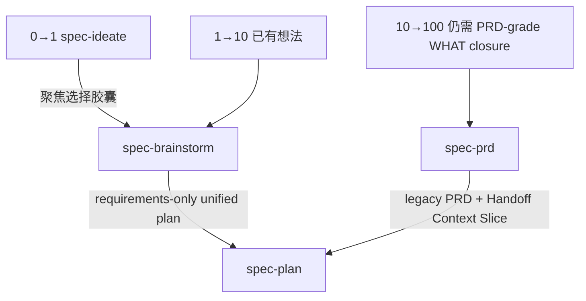
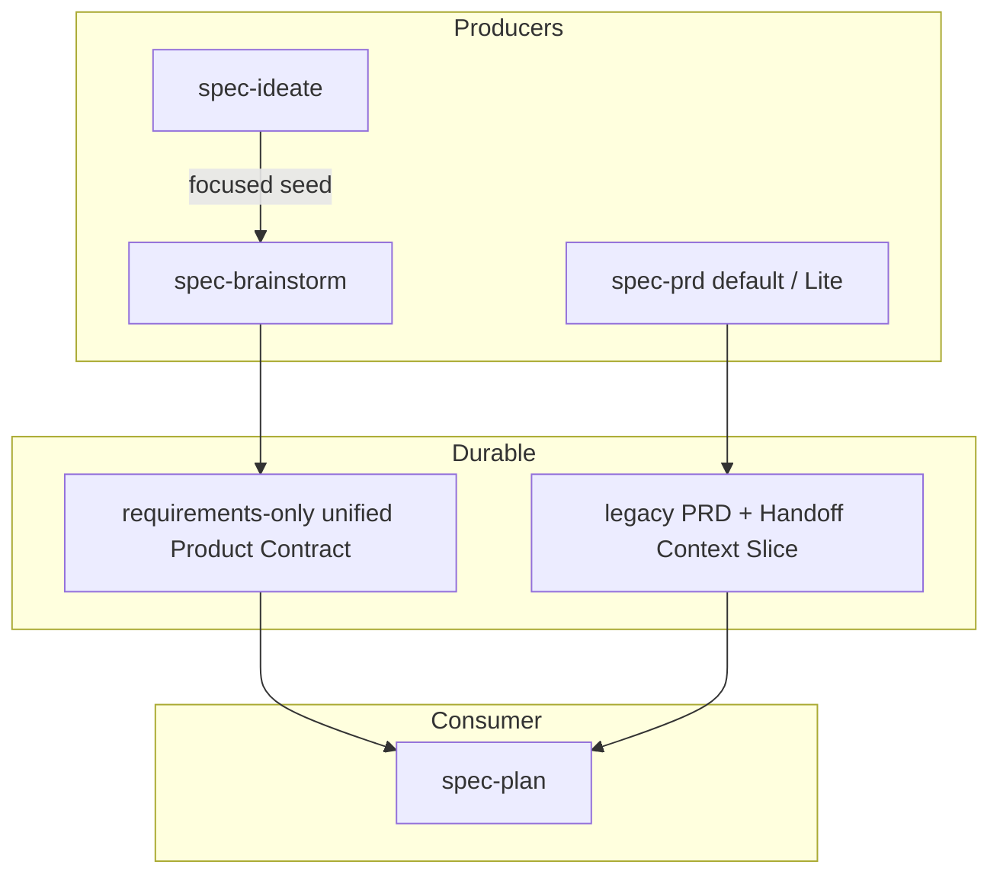
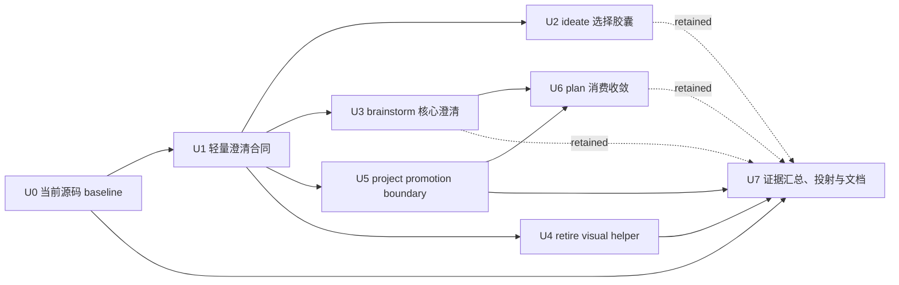

# 需求澄清能力轻量集成 - Plan

## Goal Capsule

- **目标：** 在不新增公共澄清工作流、不重建宿主执行运行时的前提下，减少从想法、需求探索和现有 PRD 进入规划时的承重 WHAT 丢失、重复提问、术语越权写入和规划侧需求发明。
- **产品路径：** 保持三条成熟度路径：`0→1: spec-ideate → spec-brainstorm → spec-plan`、`1→10: spec-brainstorm → spec-plan`、`10→100: spec-prd → spec-plan`。其中 10→100 只适用于已有 PRD 的 refine/validate，或仍需要 PRD-grade WHAT 固化与 planning-readiness 判断的 brownfield increment；若 target surface、release slice、核心行为与验收已经闭合，只剩 HOW 未定，则直接进入 `spec-plan`。
- **当前 PRD 基线：** 当前 `spec-prd` 已具备默认 profile 与显式 opt-in 的 `analysis_profile=contract-reset-lite`。Lite 使用单一 Product Analysis Brief 合并分析门与风险排序，但保持 legacy PRD artifact、producer finalize、report-only validate 和 optional consumer diagnostic。当前执行对话用户是唯一人类产品确认人；专业、法规、隐私、安全、资金等材料只提供确认依据，不形成第二个人类确认入口。现有 Contract Reset Gate A 结论为 `inconclusive`，candidate 未推广，当前 reopen conditions 未满足。
- **本轮 PRD 范围：** 不新增 PRD 澄清适配器、不重开 Gate A、不改变 artifact topology、不新增 mandatory consumer receipt gate；`spec-brainstorm`、`spec-plan` 与 `spec-prd` 只允许在需求制品内闭合术语/决策并输出 project-level promotion candidate，不直接创建或修改 `CONCEPTS.md`、`CONTEXT.md`、`CONTEXT-MAP.md` 或 ADR。
- **视觉辅助边界：** 不新增公共或 standalone 的 `spec-prototype`。当前 browser visual-probe 路径缺少 confirmed field value，且要达到可信安全/生命周期/可访问性地板需要重建一个小型浏览器运行时；本轮因此从 `spec-brainstorm` 移除 visual offer、helper invocation、reference 和 server script，视觉问题统一以文本、表格、ASCII 或明确 blocker 处理。未来只有在独立 field signal 证明文本不足且存在可维护的 helper-owned fixed-template renderer 时，才另立实验计划。
- **停止条件：** 不创建第二套需求制品、运行状态机、跨进程安全账本、worktree 接管协议、通用沙箱后端、PRD 平行评估平台或来源检查器；没有 confirmed failure evidence 时不提前建设这些机制。
- **后续责任：** 后续实施由 `spec-work` 按 U-ID 依赖顺序推进。本计划本身不授权实现、runtime regeneration、提交或发布。
- **源码基线失效条件：** 实施开始前必须重新读取 Appendix 中的 source refs。若 `spec-prd` topology、单一当前用户确认模型、Gate A 结论、`spec-plan` consumer policy、`spec-brainstorm` visual-probe source 或相关文件 hash 已变化，先更新本计划再实施。

---

## Product Contract

### Summary

本计划把外部 `grilling`、`domain-modeling`、`handoff` 和 `prototype` 方法中仍有边际价值的部分，适配到现有 `spec-ideate`、`spec-brainstorm`、`spec-prd` 和 `spec-plan` 边界中。

核心做法是增强已有交接与判断点，而不是增加新的公共节点：



`spec-prd` 保持当前默认/Lite 双基线和现有 PRD→plan 用户控制语义。视觉问题仍由 `spec-brainstorm` 负责澄清，但本轮只使用 conversation-native 表达，不启动 browser helper，也不把视觉旁路当成第四条主路径。

### 第一性原理重切

| 能力 | 当前源码事实 | 决策 |
| --- | --- | --- |
| 源码事实优先、一次一问、单一当前用户确认 | `spec-brainstorm` 与 `spec-prd` 已有较强能力；最新 PRD/Lite 已明确当前执行对话用户是唯一产品确认人，并整合 source inventory、confirmation basis 和 release-bounded closure | Adopt：复用并统一术语，不建立第二确认入口或共享执行器 |
| `spec-ideate` 选择交接 | 当前 focused seed 只有描述、basis、rationale、downsides 和 provenance | Wrap：补快照、局限、假设和相邻淘汰信息 |
| `spec-brainstorm` 场景与暂停恢复 | 已有 product pressure、blindspot、AE、Sources 和 Resolve Before Planning，但缺少稳定的“场景结果必须落点”与恢复最小信息 | Extend：在现有 Product Contract 内补齐，不增加状态机 |
| 项目级术语写入 | `spec-brainstorm` / `spec-plan` 会静默补写 `CONCEPTS.md`；触发的 `spec-prd grill-with-docs` 会 inline 更新 `CONTEXT.md` / ADR | Thin：三个需求 workflow 只输出带 provenance/consumer/invalidation 的 promotion candidate；项目级 mutation 留给后续显式知识维护请求 |
| 视觉决策辅助 | visual probe 只有单文件 display helper，当前接受任意 root/host、暴露 `/files`，且没有 field outcome 证明其决策价值；安全加固会引入 tokenizer、HTTP request matrix、状态机、DOM 与可访问性维护面 | Retire：本轮删除 browser helper 路径，保留文本/表格/ASCII 与诚实 blocker；未来 fixed-template renderer 需单独实验和 field gate |
| PRD Contract Reset / Gate A | Gate A 已 `inconclusive`；owner 已选择 opt-in Lite，完整 migration 与 mandatory consumer gate 退出 active backlog | Stop：不重开、不平行建设 |
| `spec-plan` 来源解析 | 当前 upstream discovery 已识别 brainstorm requirements-only unified plan 与通用 legacy requirements doc；`spec-prd` 产物只是后者的一个子集，direct bootstrap/resume/deepen 仍独立存在 | Thin：澄清识别与 blocker 规则，不新增 inspector，也不缩窄直接规划入口 |

### Problem Frame

当前系统不是“缺少需求澄清”，而是存在四类更具体的问题：

1. **交接信息密度不稳定。** `spec-ideate` 的选择 seed 未携带承重 evidence 的基准版本、局限、未验证假设和最相关的淘汰替代，`spec-brainstorm` 可能重复推导或误把旧依据当当前事实。
2. **已具备的澄清结果没有统一落入 durable source。** `spec-brainstorm` 已有源码核实、一次一问和 AE，但暂停、上下文重置或临时 dossier 丢失后，下一执行者仍可能缺少准确的下一问题、承重源码引用和失效条件。
3. **项目级知识写入越过 mutation boundary。** 当前 `spec-brainstorm` / `spec-plan` 可静默修改 `CONCEPTS.md`；`spec-prd` 的 triggered grill-with-docs 还会把术语决策直接解释为 inline `CONTEXT.md` / ADR 写入授权。这违反 preview-first 和“需求制品本地闭合优先”。
4. **视觉决策价值尚未验证，却已形成运行时维护面。** 旧方案为一个可选原型旁路设计 standalone skill、多个安全账本、worktree 接管、强制沙箱、崩溃恢复、真实 Windows/POSIX 发布门禁和第二套 PRD Gate A；当前 source 虽只剩单文件 display helper，但要安全保留仍需 tokenizer、HTTP request matrix、私有 run handle、状态转换、DOM 和可访问性合同。没有 field signal 时继续加固会重复建设宿主运行时，因此本轮退役该路径而不是把它产品化。

本轮解决前三类 confirmed gap，并删除未证明价值且安全边界不完整的 visual helper 入口。未来视觉能力只有在文本路径出现可回源 failure signal、独立 field pilot 证明增益、且 helper-owned fixed-template renderer 能以小于现方案的维护成本提供可信边界时，才另立实验计划。

### Requirements

**流程与 ownership**

- R1. 三条推荐成熟度路径保持不变；澄清继续归当前 producer session 所有。存在 upstream artifact 时，`spec-plan` 只消费已确认或显式残留的 WHAT；直接调用的 bootstrap 兼容路径保持，但必须显式暴露未确认的产品假设，不能把 planning judgment 漂白成 producer-confirmed fact。
- R2. 不新增公共 `spec-grill`、`spec-requirements-clarification`、`spec-domain-modeling` 或 standalone `spec-prototype`。
- R3. `spec-ideate` 继续生成和筛选方向，不变成需求访谈，不直接进入规划或运行视觉辅助。
- R4. `spec-prd` 当前 default 与 `contract-reset-lite` profile、当前执行对话用户作为唯一人类产品确认人的模型、legacy artifact topology、producer finalize、report-only validate 和 optional `--verify-receipt` diagnostic 保持不变。
- R5. Gate A 当前 `inconclusive/no-promotion` 是 confirmed boundary；本计划及其实施无条件不授权新 attempt、candidate arm、runner 或 migration。未来重开必须另立 project-governance plan，由 repository/project owner 批准，并在创建 attempt 前先解决 hard-isolation launcher 与 independent custody 等可前置条件；模型 outcome、blind review、replay 等 attempt-internal evidence 只能在新 attempt 内取得。该治理授权不进入 PRD 产品确认路径，也不创建第二个人类产品确认入口。

**事实、问题与持久化**

- R6. 对仓库可发现的 current fact，producer 在询问用户前先查源码、测试、合同或当前文档；无法确认时明确标为假设、局限或需要的 source。
- R7. 当前执行对话用户是唯一人类产品确认人。所有会改变需求内容、验收、范围、术语、兼容、优先级、风险接受或 release behavior 的产品确认每轮只问该用户一个；`owner`、specialist、sign-off 等兼容字段或材料只表示证据、责任或评估语义，不得创建第二个人类确认入口。
- R8. source-answerable 或 source-sensitive 的 current-user question 必须绑定具名 gap、已执行的 source attempt、Product Contract / PRD write target，以及不闭合时 planning 会发明什么。纯产品偏好或开放探索若没有可查 source，记录 `source_attempt: not-applicable` 及原因即可，不为形式完整制造无效检索。
- R9. 只有源码或明确权衡足以支持时才提供推荐答案；证据探查与开放探索不得用推荐答案提前锚定用户。
- R10. 真正 headless、用户无回复或 context reset 时不得伪造 current-user closure；LLM/agent 只能分析、推荐和记录，scripts 只能确认结构、路径、hash、receipt 等确定性事实。producer 写入非就绪需求制品或 checkpoint shape，保留已确认内容、假设、局限、阻塞和下一问题。
- R11. 承重源码依据必须进入规范 Product Contract / PRD 的现有 Sources、Evidence、Assumptions、Decision Notes 或 Handoff Context Slice；至少记录 source ref、观察基准或版本、局限及失效条件。`/tmp` dossier 只作加速材料。
- R12. 不新增完整访谈记录、持久 gap 状态表、第三套 handoff artifact 或通用澄清 schema。

**`spec-ideate` 选择胶囊**

- R13. repo mode 的 focused seed 增加：承重 basis 的 source snapshot、dirty/unknown limitation、未验证假设、与所选方向直接相关的一个相邻淘汰替代，以及原 ideation artifact pointer。
- R14. seed 保持 feature-description-shaped；不得传递完整 ideation 文档、完整 rejection table、实现 HOW 或与当前选择无关的候选。
- R15. source snapshot 已失效时，`spec-ideate` 只将其标为 stale/limitation；是否重新溯源和如何改变需求由 `spec-brainstorm` 决定。

**`spec-brainstorm` 澄清与场景**

- R16. `spec-brainstorm` 在 run-local reasoning 中按 source fact、current-user decision、open exploration、planning-owned HOW 分类 load-bearing gap；视觉/空间问题仍是 current-user decision 的表达形态，不增加持久状态类别。
- R17. Standard/Deep 的行为型需求在 Phase 2.5 综合前运行相关性驱动的场景 pass，候选维度为 happy path、role/permission、state transition、failure/degraded、negative acceptance 和 cross-context handoff。
- R18. 场景 pass 不生成维度笛卡尔积；每个被选中的场景必须落为 AE、Resolve Before Planning/OQ、明确 assumption 或 Non-Goal，否则视为 ceremony 并删除。
- R19. producer 暂停或进入新会话前，只要已经形成 durable decision，就创建或更新 requirements-only unified plan；`Resolve Before Planning` 明确 blocker 与下一问题，不新增 progress status。
- R20. Product Contract 本地术语决定当前 release slice 的含义；项目级 glossary/context/ADR 只作校准来源，冲突必须暴露，不能按文件名或新旧程度静默选胜者。

**项目级语言 promotion**

- R21. `spec-brainstorm`、`spec-plan` 和 `spec-prd` 均不得创建或修改 `CONCEPTS.md`、`CONTEXT.md`、`CONTEXT-MAP.md`、项目 glossary 或 ADR；显式知识维护请求属于后续独立 workflow，不由当前 producer 自动触发。
- R22. producer 先在 Product Contract / PRD 内闭合 term/decision；当同一知识明显跨当前 release slice 复用时，只输出 project-level promotion candidate，不在本 workflow 内 mutation。candidate 最小包含 target kind/path、proposed meaning、provenance、适用范围、真实 consumer、复用理由和 invalidation condition，并明确“当前未写入”与后续显式知识维护入口。
- R23. ADR candidate 仍只在 hard-to-reverse、surprising without context、real tradeoff 三项同时成立时提出；即使条件成立，也只记录 candidate，不创建 ADR。缺少 R22 任一 durable knowledge qualification 时，不输出 candidate，只保留 Product Contract / PRD-local 结论。
- R24. 缺少项目级 glossary/context topology 不阻塞 planning，只要当前需求制品内的术语和决策已经充分闭合。

**视觉路径退役**

- R25. `spec-brainstorm` 不再提供 text-vs-visual offer，不加载 `references/visual-probes.md`，不启动 bundled browser helper，也不生成 HTML/CSS/JavaScript artifact。
- R26. 视觉或空间问题使用 conversation-native 表达：结构化文本、比较表、状态序列、ASCII wireframe 或 source screenshot 的只读讨论；这些表达仍遵守一次一问和 current-user confirmation，不形成第二个 artifact 或确认入口。
- R27. 当 conversation-native 表达足以让当前用户裁决时，正常写回 affected R/AE/Scope 并关闭 blocker；只有用户无回复、表达仍不足或真实交互/应用状态不可替代时，才保持 unresolved，并记录需要何种未来 evidence。
- R28. 删除 `skills/spec-brainstorm/references/visual-probes.md` 与 `skills/spec-brainstorm/scripts/visual-probe-server.js`；五宿主 projection 不再包含该 reference/script，source/runtime 中不得残留 visual-probe gate、helper invocation、`/version`、`/files` 或临时 visual root 合同。
- R29. 本轮不以 tokenizer、sanitizer、CSP、loopback server、opaque run handle、DOM harness 或浏览器网络隔离替代删除；这些机制只有未来独立实验获得 field signal 后才能重新提案。
- R30. 未来视觉能力的 reopen condition 至少包括：可回源的文本路径 failure signal、current-user opt-in field pilot、helper-owned fixed-template renderer、无 producer-authored HTML/CSS/JavaScript、明确的 accessibility 和 lifecycle owner，以及与维护成本匹配的 countermetric。
- R31. 视觉需求本身仍可进入 Product Contract；producer 记录用户需要比较的状态/布局、文本表达限制和 reopen condition，但不得声称 probe 已运行或浏览器结果已观察。
- R32. 删除 helper 是安全/维护面收缩，不作为“视觉决策质量提升”的证据；本轮只验证入口退役、文本路径可闭合和无残留 runtime surface。

**`spec-plan` 消费**

- R33. `spec-plan` v1 的 upstream requirements-origin discovery 只识别两个当前真实 durable shape：`spec-brainstorm` 的 requirements-only unified plan，以及通用 legacy `docs/brainstorms/*-requirements.{md,html}`。`spec-prd` 产物是 legacy shape 的一个子集，由其现有 artifact/readiness/Handoff fields 识别；direct bootstrap、resume 和 deepen 行为保持不变。
- R34. 不预埋未来 `product_contract_source: spec-prd` unified topology；只有新的 repository/project-owner-approved producer migration plan 先落地后，consumer 才增加映射。该 source/topology 治理授权与当前用户作为唯一产品确认人是不同边界，不把项目治理者加入产品问答或产品确认路径。
- R35. 30 天只作候选发现提示，不证明 freshness。planning 根据持久 source refs、当前源码重读、limitations 和 invalidation condition 判断是否需要重新溯源。
- R36. `Resolve Before Planning`、`checkpoint-prd`、`can_enter_spec_plan: no` 或 load-bearing OQ 不能被静默忽略。存在 upstream producer 时 `spec-plan` 默认返回 producer；direct bootstrap 无 producer 时回到当前用户。现有用户控制语义保留：当前用户可以逐项把真正的产品 blocker 转成显式 decision/assumption 后继续。
- R37. producer receipt 验证保持 optional read-only diagnostic；本轮不把它升级为 consumer hard gate，也不新增 `inspect-requirements-origin.js` 或 `capture-prd-verifier-evidence.js`。
- R38. `spec-plan` 不再静默补写 `CONCEPTS.md`；发现项目级候选词汇时按 R21-R24 记录 promotion candidate，不直接写项目级文件。

**交付与证据**

- R39. source 改动只发生在 `skills/`、`docs/`、测试、validation、README 和 CHANGELOG；generated runtime 只在 source/test/eval 通过后用 `spec-first init` 投射。
- R40. scripts/tests 只证明字段、路径、触发、禁止写入、visual helper 退役和投射事实；LLM/human fresh-source evaluation 判断问题质量、场景相关性、planning invention 与 current-user answer fidelity。
- R41. 语义评估必须分别覆盖 0→1、独立 1→10 和 10→100；0→1 样本不得替代直接 1→10。
- R42. 每个主效果指标同时记录 countermetric：额外 current-user confirmation rounds、token/latency、artifact size 和错误 blocker 数；不能用更重 ceremony 换取表面完整。
- R43. 用户可见行为变化同步 README/README.zh-CN、当前执行文档和 CHANGELOG；计划本身的更新只同步 CHANGELOG。

### Actors

- A1. **当前执行对话用户 / 唯一产品确认人：** 基于 project source、专业材料或显式自我确认裁决需求、优先级、风险接受、defer/scope-cap；项目级 promotion candidate 只作后续知识维护输入，不在当前需求 workflow 中触发 mutation 或第二个人类联系人。
- A2. **`spec-ideate`：** 生成并筛选方向，提供聚焦选择胶囊。
- A3. **`spec-brainstorm`：** 查证事实、逐问澄清、维护 requirements-only Product Contract，并用 conversation-native 表达处理视觉/空间问题。
- A4. **`spec-prd`：** 处理已有 PRD 或仍需 PRD-grade WHAT closure 的 brownfield increment；保持当前 default/Lite 合同，只收敛项目级 promotion candidate 边界。
- A5. **`spec-plan`：** 发现两类真实 upstream requirements origin，并保留 direct bootstrap/resume/deepen；按需重读源码、保留用户控制语义并设计 HOW。
- A6. **维护者 / repository governance owner：** 负责 source、tests、fresh-source evaluation、五宿主投射和发布证据，并单独批准 Gate A/topology 等项目治理变更；不参与或替代产品确认。

### Key Flows

- F1. **0→1：方向到需求**
  - **Trigger：** 用户从 `spec-ideate` 选中一个 repo-grounded idea。
  - **Steps：** `spec-ideate` 传递 focused seed；`spec-brainstorm` 复核 snapshot、关闭 source/current-user gap、生成 requirements-only unified plan。
  - **Outcome：** `spec-plan` 接收已选择方向的需求与局限，而不是整个 ideation candidate set。

- F2. **1→10：直接需求探索**
  - **Trigger：** 用户已有想法，但行为、范围、验收或术语尚未闭合。
  - **Steps：** `spec-brainstorm` 先查 source，再逐问 current-user decision，运行相关性场景 pass；视觉/空间问题使用文本、表格、状态序列或 ASCII 表达。
  - **Outcome：** Product Contract 包含足以规划的 WHAT，或明确的 Resolve Before Planning blocker。

- F3. **10→100：现有系统增量**
  - **Trigger：** 已有 PRD 需要 refine/validate，或 brownfield increment 仍需 PRD-grade WHAT 固化与 readiness 判断；若 WHAT/acceptance 已闭合且只剩 HOW，则直接进入 `spec-plan`。
  - **Steps：** `spec-prd` 使用当前 default 或显式 Lite profile 完成 source-first closure 和 producer finalize；本轮把项目级写入收敛为 candidate-only。
  - **Outcome：** legacy PRD 与 Handoff Context Slice 继续作为 `spec-plan` 的当前输入；Gate A 和 topology 不变化。

- F4. **暂停与恢复**
  - **Trigger：** 用户暂停、无法回复、context reset 或宿主不能继续交互。
  - **Steps：** producer 将已确认需求、source refs、假设、局限、blocker 和下一问题写入规范制品。
  - **Outcome：** 新会话从 Product Contract / PRD 恢复，不依赖 transcript 或 `/tmp` dossier。

- F5. **视觉/空间问题的文本澄清**
  - **Trigger：** 布局、信息层级或多状态比较会改变 R/AE/Scope。
  - **Steps：** producer 使用表格、状态序列、ASCII wireframe 或只读 source screenshot 讨论同一具名问题；不启动 browser helper。
  - **Outcome：** 当前用户答案充分时写回 Product Contract 并关闭 blocker；仍不足时保留具名 blocker 与 future evidence need。

### Acceptance Examples

- AE1. **Source-first。** 假设现有取消行为可从代码确认；当 producer 澄清目标时，先记录 current behavior，再只向用户询问 target decision。
- AE2. **逐问与单一确认入口。** 假设有三个相互独立的产品决定，其中一个有安全专家材料；每轮只向当前用户询问当前最高影响问题，专家材料只作为依据，答案分别绑定对应 write target，不联系第二个人类角色。
- AE3. **Ideate snapshot。** 假设 ideation artifact 保存后 HEAD 已变化；focused seed 标记 stale limitation，`spec-brainstorm` 不把旧 basis 当 current fact。
- AE4. **直接 1→10。** 假设没有 ideation artifact；`spec-brainstorm` 仍能独立生成 Product Contract，该样本不依赖 0→1 seed。
- AE5. **场景相关性。** 假设需求涉及多角色审批；permission、state、failure 和 handoff 场景进入 AE/OQ，不相关的离线规模场景被省略。
- AE6. **暂停恢复。** 假设对话在综合前暂停；requirements-only artifact 记录准确的下一问题和 source refs，删除 `/tmp` dossier 后仍可恢复。
- AE7. **术语冲突。** 假设 `CONCEPTS.md` 与规范 glossary 定义冲突；producer 暴露冲突并在当前制品内消歧，不静默修改任一项目文件。
- AE8. **Promotion candidate。** 假设术语已经在 PRD 内闭合且具备跨 release 复用价值；workflow 记录 target/provenance/consumer/invalidation candidate，但 `CONTEXT.md`、项目 glossary 和 ADR hash 始终不变，后续 mutation 需要独立知识维护请求。
- AE9. **布局比较。** 假设用户比较三个布局；producer 用编号表格或 ASCII wireframe 表达，用户答案充分时关闭对应 R/AE，不声称启动过 browser probe。
- AE10. **动态问题。** 假设动态问题可安全重述为具名状态序列；使用文本状态转换比较。若真实交互不可替代，则保留 blocker 和 future evidence need，不生成 JavaScript 或 HTML。
- AE11. **文本 fallback 可闭合。** 假设旧 visual path 不可用；producer 立即用 conversation-native 方式提出同一问题，当前用户给出充分答案时正常关闭 blocker，而不是因缺浏览器永久保持 unresolved。
- AE12. **退役无残留。** source 与五宿主 projection 中不再出现 visual-probe gate、helper invocation、server script、`/version`、`/files` 或 visual temp root；producer 仍可在主 workflow 中 source-first 读取项目 source。
- AE13. **Legacy consumer control。** PRD 声明 checkpoint 或 `can_enter_spec_plan: no` 时，`spec-plan` 默认返回 `spec-prd`；只有当前用户逐项接受 assumption/decision 后才能继续。
- AE14. **PRD no-regression。** 未显式传入 `analysis_profile=contract-reset-lite` 时使用 default profile；传入时只改变 run-local analysis shape，不改变 topology、validate 或 consumer policy。
- AE15. **Gate A stop。** 实施和评估均不创建新的 Gate A attempt、runner 或 candidate；当前 `inconclusive` 结论保持可追溯。
- AE16. **无项目级写入。** `spec-brainstorm`、`spec-plan` 与 triggered `spec-prd` 运行前后项目级 glossary/context/ADR 文件 hash 始终不变；candidate-only 输出不构成 mutation authorization。
- AE17. **专业依据不足。** 法规/隐私/安全/资金材料不足以支持确认时，workflow 只向当前用户提供“显式确认、defer、scope-cap、保留 source-candidate/assumption/blocker”选项；LLM 不替代确认，也不路由 named specialist。

### Success Criteria

- U0 在任何目标 source mutation 前冻结 case/source hashes、rubric、judge calibration、主指标与 countermetrics。U2/U3/U6 只有在至少一个适用 case 出现非零目标 failure signal 时才进入实现；所有适用 baseline 均为零则该 unit 记为 `unproven/deferred`，不能凭 no-regression 进入默认路径。U5 的 confirmed silent-write gap 与 U4 的现有 helper 退役属于 correctness/surface-removal claim，可按 deterministic evidence 实施，但仍必须验证无回归。
- representative cases 中，source 可回答却被询问给用户的事实数量为零或相对 baseline 减少，且 current-user answer fidelity 不下降、第二人类确认路由为零。
- requirements-only Product Contract 在 `/tmp` dossier 不存在时仍保留承重 source refs、limitations 和下一问题。
- `spec-brainstorm`、`spec-plan`、`spec-prd` 对 project-level glossary/context/ADR 的 mutation 为零；promotion candidate 可回到 target、proposed meaning、provenance、consumer 与 invalidation condition。
- 场景 pass 的每个保留项都有 AE/OQ/assumption/non-goal 落点；没有为了覆盖维度而生成的空仪式。
- source 与五宿主 projection 中 visual-probe gate、reference、server script、`/version`、`/files` 和 visual temp root 引用为零；conversation-native 视觉问题在答案充分时可关闭 blocker，不因缺浏览器永久 unresolved。
- 默认 workflow 不新增 mandatory reference load；只有相关 signal 触发场景或领域语言细节。
- U2/U3/U5/U6 在各自 unit exit 立即运行预注册 before/after fresh-source paired cases，每个适用 case 3 次 matched repeat；U7 只做最终三路径 integrated no-regression。所有必需 fresh sessions 不超过 36；方向不一致、未超过差异门、judge calibration 失败或 countermetric 退化均记为未证明并删除/收窄对应 unit。current-source tests、fresh-source evaluation、field outcome 和五宿主 source projection 分开记录，任何一层不能替代另一层。

### Scope Boundaries

**In scope**

- `spec-ideate` focused seed 的 evidence snapshot 与 limitation。
- `spec-brainstorm` 的轻量 gap 分类、场景落点、暂停恢复，以及 visual helper 退役后的 conversation-native 视觉问题处理。
- `spec-brainstorm`、`spec-plan`、`spec-prd` 项目级语言/ADR promotion 的 candidate-only 边界。
- `spec-plan` 对现有两类 upstream requirements origin 的轻量发现规则、freshness 提示和用户控制语义；direct bootstrap/resume/deepen 不变。
- 聚焦 contract tests、unit-exit before/after fresh-source paired evaluation、最终 integrated no-regression、五宿主投射和用户文档；不创建 arm runner、评估 worktree 或通用实验平台。

**Deferred until confirmed evidence**

- standalone/public `spec-prototype`。
- 任何 browser visual helper、agent-authored HTML/CSS/JavaScript、真实 repo/application context、由 visual artifact 发起的 shell command、external network / arbitrary egress、visual worktree 或 OCI/micro-sandbox execution。
- helper-owned fixed-template renderer、browser-to-agent event channel、click tracking 或自动 verdict ingestion；只有满足 R30 reopen conditions 才可另立实验计划。
- persistent request registry、exactly-once consumption、crash-recovery ledger、retention anchor 和通用 cleanup receipt。
- 新 `spec-prd` unified artifact topology、mandatory consumer receipt gate 或新的 Contract Reset Gate A attempt。
- `inspect-requirements-origin.js`、producer verifier snapshot executor 或通用 requirements schema。

**Non-goals**

- 用共享公共澄清 workflow 替换 `spec-brainstorm` / `spec-prd`。
- 持久化完整 interview transcript、run-local gap map 或每个可逆微决策。
- 用新的 browser runtime 替换被退役的 visual helper，或把 conversation-native visual 表达当成 PRD 之外的 durable artifact。
- 强制仓库必须存在 `CONCEPTS.md`、`CONTEXT.md`、`CONTEXT-MAP.md` 或 ADR。
- 手改 generated runtime mirrors。

### Dependencies And Assumptions

- 当前 PRD Gate A 的 source of truth 是 `docs/validation/spec-prd/2026-07-11-spec-prd-contract-reset-gate-a.md`；其结论为 `inconclusive`，reopen conditions 未满足。
- 当前 Lite source 是 `skills/spec-prd/references/product-analysis-lite.md`；它是 opt-in evaluation branch，不授权 topology migration。
- 当前 PRD/Lite confirmation model 的 source 是 `skills/spec-prd/SKILL.md` 与 `skills/spec-prd/references/product-analysis-lite.md`：当前执行对话用户是唯一人类产品确认人；specialist/regulated materials 只作依据，LLM 与 scripts 均不得替代产品确认。
- 当前 `spec-plan` 受 `tests/unit/spec-prd-plan-handoff-contracts.test.js` 保护：通用 legacy requirements 保持可读；其中的 PRD handoff 保留用户控制，consumer receipt diagnostic optional。
- 当前 visual probe server 只负责 display，但接受任意 `--host`、调用方 `--root`、固定返回 localhost URL 并暴露 `/files`；当前 reference 还允许 disposable interaction demo。由于没有 field outcome 支持继续承担该运行时，本计划删除 gate/reference/script，而不是实现 parser/CSP/temp/lifecycle 补丁。
- 本计划依据当前磁盘 source，而不是仅依据 HEAD transcript。实施前必须按 Goal Capsule 的失效条件重读 source。

---

## Planning Contract

### Reuse And Adaptation

| Existing mechanism | Reuse | Adaptation | Reject |
| --- | --- | --- | --- |
| `spec-ideate` focused seed | title、description、basis、rationale、downsides、provenance | snapshot、limitation、assumption、相邻淘汰替代 | 整份 ideation artifact handoff |
| `spec-brainstorm` blindspot / pressure / AE | source-first、one-question、Product Contract | gap 分类、场景结果落点、暂停恢复 | 新 clarification engine |
| `spec-brainstorm` visual probe | conversation 中的问题、判定标准与 chat confirmation | 删除 visual gate/reference/server；视觉问题回到表格、状态序列、ASCII 与 blocker | tokenizer/CSP/localhost runtime、agent-authored artifact、standalone prototype |
| `spec-prd` default + Lite | source/confirmation basis、sole-current-user closure、Decision Card、receipt、Handoff Slice | project promotion candidate-only | inline project mutation、第二确认入口、新 Gate A、topology、mandatory consumer gate |
| `spec-plan` Phase 0.2/0.5 | unified + legacy source discovery、用户 blocker 处置 | freshness 以 source refs 为主、禁止 silent glossary write | 新 origin inspector/runtime |
| domain-modeling | glossary conflict、精确术语、克制 ADR | local closure first、candidate handoff to later knowledge maintenance | 固定文件名自动 authority、当前 workflow 内 mutation |

### Key Technical Decisions

- KTD1. **澄清是 producer capability，不是新公共 workflow。**
- KTD2. **当前 PRD 是已实现邻接能力，不是待复制目标。** default/Lite 双基线和 Gate A stop condition 优先于旧计划假设。
- KTD3. **先修 confirmed gaps，未证明价值的运行时直接收缩。** seed、durable refs、promotion boundary、plan consumption 和 visual helper retirement 可分单元交付；这些单元均不依赖 Gate A、standalone prototype、sandbox backend 或新 consumer parser。
- KTD4. **视觉问题留在 `spec-brainstorm`，browser runtime 不保留。** 父会话拥有问题、conversation-native 表达、当前用户答案和 Product Contract 写回；没有 visual offer、第二协调者或 browser-to-agent channel。
- KTD5. **删除优先于自研 renderer。** 当前没有 field signal 支撑 tokenizer、CSP、run handle、DOM 和状态机维护成本；本轮删除 reference/server，未来只接受 helper-owned fixed-template renderer 的独立实验提案。
- KTD6. **真实上下文与 browser artifact 均不支持。** 不用普通进程、temp directory 或 worktree 冒充强隔离。
- KTD7. **durable source 仍是 Product Contract / PRD。** seed、dossier、ASCII/表格表达和 promotion candidate 都只是输入或 handoff，不创建第二 durable artifact。
- KTD8. **不新增 deterministic consumer parser。** 当前缺口由 prose contract 和聚焦测试可解决；等 repeated failure evidence 再 build。
- KTD9. **项目级 promotion 不在需求 workflow 内 mutation。** term decision 只关闭当前 Product Contract / PRD；跨项目知识提升由后续显式知识维护请求单独授权。
- KTD10. **场景按实质性推导。** selected dimension 必须改变 AE/OQ/assumption/non-goal，否则删除。
- KTD11. **保留 `spec-plan` 用户控制语义。** producer blocker 不能被静默忽略，但当前用户可显式转成 assumption/decision。
- KTD12. **证据强度匹配 claim。** contract test 证明结构、禁止写入、visual surface removal 与 projection；unit-exit fresh-source paired eval 只判断问题质量和主 workflow 行为。删除 helper 不证明视觉决策质量提升。

### High-Level Design



### Minimal Handoff Shapes

**Focused idea seed**

```text
title
description
basis + source_snapshot
why_it_matters
known_tradeoffs
evidence_limitations
unverified_assumptions
relevant_rejected_alternative
provenance_pointer
```

该 shape 是 run-local handoff，不新增 machine schema。字段缺失时 `spec-brainstorm` 仍可继续，但必须把缺口标为 limitation，而不是补写假事实。

**Product Contract persistence**

| Clarification result | Existing durable destination |
| --- | --- |
| current fact / source ref | Sources / Research、Problem Frame 或 Dependencies / Assumptions |
| current-user decision（兼容现有 Owner Decision Trace 字段名） | Requirements、Key Decisions、Scope Boundaries 或 Decision Notes |
| behavior scenario | Acceptance Example |
| blocking WHAT | Resolve Before Planning / Outstanding Questions |
| planning-owned HOW | Deferred to Planning |
| local term | Product Contract prose / glossary subsection when material |
| visual/spatial comparison | affected R/AE、Key Decision、text limitation / future evidence need |

### Visual Capability Retirement Contract

1. 删除 `spec-brainstorm` 中 visual tripwire、text-vs-visual offer 和所有 `references/visual-probes.md` load/invocation；普通 blocking-question 规则重新成为唯一交互入口。
2. 删除 `references/visual-probes.md` 与 `scripts/visual-probe-server.js` source，plugin projection 负责从五宿主 generated runtime 移除对应 mirror；不得手改 runtime。
3. 视觉/空间问题只用 conversation-native 表达。当前用户回答充分时正常写回 R/AE/Scope 并关闭 blocker；仅在无回复或真实交互不可替代时保留 unresolved。
4. contract tests 扫描 source、plugin projection 和用户文档，确认 visual gate、helper invocation、server path、`/version`、`/files`、visual temp root 与 disposable browser artifact 语义全部消失。
5. 未来重开必须另立 experiment plan，并先满足 R30；不得在本计划实施中顺手加入 fixed-template renderer、HTML parser、CSP server 或 browser automation。

### Implementation Sequence



U0 在任何行为改动前冻结 current-source baseline、judge calibration 和 unit applicability。U2 与 U3 没有强依赖，确保独立 1→10 路径不需要 ideation artifact。U2/U3/U5/U6 在各自 unit exit 立即完成 before/after fresh-source paired evaluation，未证明的 unit 不进入后续累积 source；U7 只汇总证据并运行三路径 integrated no-regression。U4 是现有不安全/无证据运行时的 source removal，不承担视觉价值实验。

---

## Implementation Units

### U0. 冻结当前源码 baseline 与预注册评估协议

- **Goal：** 在任何行为改动前记录当前 source、代表性结果与评估规则，使后续每个 unit 都能被独立证伪。
- **Requirements：** R39-R42
- **Trace：** F1-F5；AE1-AE17；KTD12
- **Consumers：** U1-U7 的 unit exit、最终 current-source evaluation 与 field follow-up。
- **Files：**
  - 新增 `docs/validation/requirements-clarification/2026-07-11-clarification-integration-baseline.md`
  - 修改 `tests/unit/eval-fixture-contracts.test.js`
- **Approach：**
  - 在修改 skill source 前记录 Appendix source hashes、case IDs、输入 source refs 与 current behavior。
  - 预注册约 6 个 representative cases，覆盖 0→1、独立 1→10、暂停恢复、promotion candidate、visual retirement/text closure 和 10→100/direct planning；deterministic edge cases留在 focused tests。
  - 固定 rubric、主指标、countermetrics、baseline headroom、tie/inconclusive 规则、差异门与 case invalidation condition。为 U2/U3/U5/U6 指定各自适用 case；每个 unit 只比较其实施前 source bundle 与实施后 source bundle，不构造 DAG arm 或未来 patch hash。
  - 每个 unit 在首次修改自己的 source files 前冻结 pre-unit file list/hash 和 evaluator input；修改完成后冻结 post-unit file list/hash并立即评估。evaluation artifact 保存两侧 hash、source refs、实际注入内容的 bundle hash 与 limitations，不要求未来 worktree replay。
  - 为每条成熟度路径至少预留一个由未参与方案编写的 reviewer 独立构造的 holdout case；用一组已知优/劣答案做 judge calibration。calibration 失败时该轮 semantic result 无效。
  - 每个适用 before/after pair 使用同模型同配置运行 3 次 fresh session，平衡呈现顺序，由 blind reviewer 报告分布；只有方向一致且超过差异门时计 improvement，否则为 inconclusive。
  - U2/U3/U6 的所有适用 baseline 都为零时，不实施该 unit；U5 与 U4 分别以 confirmed mutation gap 和 active-surface removal 为实施依据，不用 no-regression 冒充产品收益。
  - 为 baseline 与 unit-exit/current-source evaluation 定义最小文档字段合同；`eval-fixture-contracts.test.js` 只检查 artifact path、source refs/hashes、case IDs、rubric、judge calibration、countermetrics、session total、fresh-source status 与 limitations，不裁决语义质量或实验结论。
  - baseline 不把计划中称为 confirmed gap 的源码事实升级成已证实用户收益；只记录当前行为和可观察 failure signal。

**Unit-exit applicability matrix**

| Unit | Case IDs | Exit evidence | Repeats | Max sessions |
| --- | --- | --- | --- | --- |
| U2 focused seed | C1 0→1 handoff | immediate before/after；需要非零 handoff failure headroom | 3 | 6 |
| U3 brainstorm core | C1 0→1、C2 1→10、C3 pause/resume | immediate before/after；需要至少一个非零 clarification failure signal | 3 | 18 |
| U5 promotion boundary | C4 candidate/no-mutation；C6 由 contract + U7 integrated 覆盖 | C4 deterministic hash + immediate before/after；C6 不新增 unit-exit session | 3 | 6 |
| U6 plan consumer | C6 10→100/direct planning | dependencies 完整后的 immediate before/after；需要非零 planning-invention signal | 3 | 6 |
| U4 visual retirement | C5 text closure/removal | deterministic source/projection removal；不运行产品价值 arm | 0 | 0 |
| **Total cap** | **C1-C6；holdout 替换同路径一个预注册 case，不额外加 session** | **不新增 arm/worktree follow-up** | **3** | **36** |
- **Test scenarios：**
  - baseline 在任一目标 skill 改动前生成，source hash 可回查。
  - case ID、source refs、rubric、judge calibration 与 countermetrics 缺失时评估不可开始。
  - U2/U3/U6 所有适用 baseline 为零、tie、重复运行方向不一致或未超过差异门时，该 unit 不进入默认 source。必需 session 超过 36 时先删低适用性 case，不扩张评估平台。
- **Verification：** baseline artifact review、source hash check 与 eval fixture contract；不运行尚未实现的 candidate source。

### U1. 定义轻量澄清合同与当前 PRD 基线

- **Goal：** 固定 source-first、sole-current-user confirmation、durable persistence、scenario landing、promotion boundary 和 current PRD stop condition，不创建执行器或 schema。
- **Requirements：** R1-R12, R17-R18, R21-R24, R39-R42
- **Trace：** F2-F4；AE1-AE2、AE6、AE14-AE15、AE17；KTD1-KTD2、KTD7、KTD9、KTD12
- **Consumers：** U2-U7 对应的 `spec-ideate`、`spec-brainstorm`、`spec-prd`、`spec-plan` source prose、contract tests 与 evaluation；该文档不是 runtime entrypoint，U0 baseline 先于本 unit。
- **Files：**
  - 新增 `docs/contracts/workflows/requirements-clarification.md`
  - 新增 `tests/unit/requirements-clarification-contracts.test.js`
- **Approach：**
  - 合同只写会改变决定的 durable invariants。
  - 明确 current `spec-prd` default/Lite 双基线、Gate A `inconclusive` 和禁止平行 attempt。
  - 区分 script-owned facts、LLM-owned analysis/semantic judgment 与 current-user-owned product confirmation。
  - 明确 specialist/regulatory/privacy/security/financial materials 是 confirmation basis，不创建第二个人类入口。
  - 不新增 JSON schema、reason-code family、状态机、CLI 或 runtime command。
- **Test scenarios：**
  - source-answerable fact 不成为 current-user question。
  - 专业材料不足时由当前用户确认/defer/scope-cap，LLM 不代签、workflow 不联系第二人。
  - Product Contract/PRD 是 durable source，`/tmp` 不是。
  - Gate A current stop condition 可从准确 validation path 找到。
  - project promotion 在当前 workflow 中只生成 candidate，不产生 mutation。
- **Verification：** 聚焦 contract test；直接检查 source refs 与当前文件 hash，不把 Graphify 或历史 transcript 当 confirmed truth。

### U2. 强化 `spec-ideate` focused seed

- **Goal：** 让 `spec-brainstorm` 继承选择依据与局限，而不把 ideation artifact 复制成 mini PRD。
- **Requirements：** R13-R15
- **Trace：** F1；AE3；KTD3、KTD7、KTD12
- **Files：**
  - 修改 `skills/spec-ideate/SKILL.md`
  - 修改 `skills/spec-ideate/references/post-ideation-workflow.md`
  - 新增 `tests/unit/spec-ideate-clarification-handoff-contracts.test.js`
- **Approach：**
  - 在现有 `Brainstorm One Idea` seed 中加入 snapshot、limitation、assumption 和一个相邻 rejected alternative。
  - 保留现有 title/description/basis/rationale/downsides/provenance。
  - 不读取或传递完整 saved artifact；不从 ideate 直接运行 probe 或进入 `spec-plan`。
- **Test scenarios：**
  - direct basis 当前有效。
  - HEAD 或 source changed 后 seed 标记 stale。
  - reasoned idea 无 direct evidence 时保留 unverified assumption。
  - rejection summary 很长时只携带与当前方向直接相关的一个替代。
- **Verification：** contract test；仅当 U0 的 C1 存在非零 handoff failure headroom 时实施，并在 unit exit 运行 3 次 before/after fresh-source paired evaluation，未过差异门则回退本 unit。

### U3. 收敛 `spec-brainstorm` 核心澄清、场景与暂停恢复

- **Goal：** 用现有 Product Contract、AE、Sources 和 Resolve Before Planning 补齐探索主路径，不依赖视觉辅助或新增 workflow/runtime。
- **Requirements：** R6-R12, R16-R20
- **Trace：** F1-F2、F4；AE1-AE6、AE17；KTD1、KTD3、KTD7、KTD10、KTD12
- **Files：**
  - 修改 `skills/spec-brainstorm/SKILL.md`
  - 修改 `skills/spec-brainstorm/references/product-pressure-test.md`
  - 修改 `skills/spec-brainstorm/references/brainstorm-sections.md`
  - 修改 `skills/spec-brainstorm/references/handoff.md`
  - 新增 `tests/unit/spec-brainstorm-clarification-contracts.test.js`
- **Approach：**
  - 在当前 run-local reasoning 中分类 gap；不新增持久表。
  - 把 scenario pass 接到现有 product pressure 与 Acceptance Examples，不添加第二份 scenario reference。
  - 暂停时复用 requirements-only artifact 和 Resolve Before Planning。
  - Sources/Research 对承重 fact 增加 snapshot/limitation/invalidation 最小要求。
- **Test scenarios：**
  - source fact、current-user decision 和 HOW 正确分流；视觉/空间问题作为表达形态处理，不新增 gap 状态。
  - 场景只保留会改变 AE/OQ/assumption/non-goal 的维度。
  - pause 后删除 dossier 仍可恢复。
  - 纯产品偏好无 source 可查时记录 not-applicable reason，不执行无效 source ceremony。
- **Verification：** contract tests；仅当 U0 的 C1/C2/C3 至少一个存在非零 clarification failure signal 时实施，并在 unit exit 运行适用 case 的 3 次 before/after fresh-source paired evaluation。

### U4. 退役现有 visual helper

- **Goal：** 删除缺少 field value 且安全/生命周期边界不完整的 browser visual path，让视觉问题回到可闭合的 conversation-native 主路径。
- **Requirements：** R25-R32
- **Trace：** F5；AE9-AE12；KTD3-KTD6、KTD12
- **Dependencies：** U0、U1；不依赖 U2/U3
- **Files：**
  - 修改 `skills/spec-brainstorm/SKILL.md`
  - 删除 `skills/spec-brainstorm/references/visual-probes.md`
  - 删除 `skills/spec-brainstorm/scripts/visual-probe-server.js`
  - 新增 `tests/unit/spec-brainstorm-visual-retirement-contracts.test.js`
- **Approach：**
  - 删除 Interaction Rule、Phase 0.3、Phase 1.3 与 approach-selection 中对 visual-probes 的 tripwire、offer、precedence 和 load 语义；恢复普通 blocking-question 路径。
  - 删除 reference 与 server script，不保留 deprecated wrapper、stub endpoint 或兼容 alias。
  - 在 `spec-brainstorm` 中明确视觉/空间问题使用表格、状态序列、ASCII 或只读 source screenshot；答案充分时正常关闭 blocker，不能因无 browser capability 永久 unresolved。
  - future reopen 只记录为 Product Contract limitation/OQ，不生成 HTML/CSS/JavaScript、temp root、localhost URL 或 browser artifact。
- **Test scenarios：**
  - source 中 visual-probe reference 与 script 文件不存在，`SKILL.md` 无 load/invoke/offer 残留。
  - 五宿主 dry-run projection 不再生成对应 runtime asset。
  - 布局比较可用编号表格或 ASCII 询问，当前用户回答后关闭 affected R/AE。
  - 真实交互不可替代或用户无回复时保持具名 blocker，不声称运行 probe。
- **Verification：** source removal contract、plugin projection deletion expectation、before/after workspace snapshot 与 conversation-native fresh-source no-regression；不运行 browser/DOM/security characterization。

### U5. 统一项目级语言与 ADR promotion candidate boundary

- **Goal：** 消除 `CONCEPTS.md`、`CONTEXT.md` 和 ADR 的 silent/implicit write，同时保留需求制品本地闭合。
- **Requirements：** R20-R24, R38
- **Trace：** F2-F3；AE7-AE8、AE16-AE17；KTD2、KTD7、KTD9、KTD12
- **Files：**
  - 修改 `docs/contracts/domain-glossary.md`
  - 修改 `skills/spec-brainstorm/SKILL.md`
  - 修改 `skills/spec-brainstorm/references/repo-profile-cache.md`
  - 修改 `skills/spec-brainstorm/references/agents/repo-profiler.md`
  - 修改 `skills/spec-plan/SKILL.md`
  - 修改 `skills/spec-plan/references/repo-profile-cache.md`
  - 修改 `skills/spec-plan/references/agents/repo-profiler.md`
  - 修改 `skills/spec-prd/SKILL.md`
  - 修改 `skills/spec-prd/references/domain-language-and-decision-ledger.md`
  - 修改 `skills/spec-prd/references/evidence-and-topology.md`
  - 修改 `skills/spec-prd/references/grill-with-docs-integration.md`
  - 修改 `skills/spec-prd/references/prd-output-template.md`
  - 修改 `skills/spec-prd/references/prd-readiness-lens.md`
  - 修改 `skills/spec-prd/evals/examples.json`
  - 新增 `tests/unit/requirements-language-promotion-contracts.test.js`
  - 修改 `tests/unit/spec-prd-lite-profile-contracts.test.js`
  - 修改 `tests/unit/eval-fixture-contracts.test.js`
- **Approach：**
  - 删除 `spec-brainstorm` / `spec-plan` 的 `Apply silently` 行为。
  - 将 `spec-brainstorm` 与 `spec-plan` 主 SKILL、repo-profile-cache reference 和 repo-profiler prompt 中的 authoritative/canonical 自动归一改为 advisory calibration；冲突时保留当前 Product Contract / PRD-local 含义并显式记录冲突。
  - 将 `spec-prd` 的 `evidence-and-topology.md`、domain language、grill、output template、readiness lens 和 eval consumers 中“prefer canonical/inline update”语义统一改为 local closure + candidate-only。
  - candidate 包含 target kind/path、proposed meaning、provenance、适用范围、真实 consumer、复用理由、invalidation condition 和“未写入”声明；内容是否值得 durable promotion 仍由 LLM/human 判断，但当前 workflow 无 mutation 分支。
  - 后续若用户希望落地 candidate，单独进入明确的知识维护或文档编辑请求；本 workflow 不自动 dispatch，也不把产品确认扩张为项目级写授权。
  - validate 保持 report-only；不借 promotion 修改文件。
  - 将 `prd-output-template.md`、`prd-readiness-lens.md` 与 `evals/examples.json` 中所有 triggered grill-with-docs inline `CONTEXT.md` / ADR 写入期望收敛为 PRD-local closure 与 candidate handoff。
  - 当前 `product-analysis-lite.md` 只作 single-confirmer/no-topology-drift 回归基线；除非实施时发现它直接声明项目级 mutation，否则不修改该刚更新的 reference。
- **Test scenarios：**
  - `CONCEPTS.md` 存在但 term 缺失，workflow 只输出 candidate，文件不变。
  - `CONCEPTS.md` 与当前 Product Contract / PRD-local 术语冲突时，workflow 暴露冲突并保持 local 含义，不按 canonical/authoritative 文件名自动选胜者。
  - triggered grill-with-docs 解决术语后只写 PRD 与 candidate，`CONTEXT.md` 不变。
  - ADR 三条件满足时只输出 candidate；缺 consumer 或 invalidation condition 时只保留 PRD-local。
  - `prd-output-template.md`、`prd-readiness-lens.md`、`evidence-and-topology.md` 和 `evals/examples.json` 不再出现 inline 项目级写入或 established-canonical 自动胜出期望；聚焦测试对所有实际 consumer 断言这一边界。
  - Lite profile 加载 domain reference 时不产生隐式写入。
- **Verification：** 运行前后 path/hash snapshot；测试 default 与 Lite profile、create/refine/validate；C4 unit-exit before/after semantic no-regression 与 candidate usefulness 评估。

### U6. 收窄 `spec-plan` 来源消费与 blocker 语义

- **Goal：** 减少 planning invention 和静默 mutation，而不新增 parser、receipt gate 或未来 producer dead contract。
- **Requirements：** R33-R38
- **Trace：** F1-F4；AE4、AE6、AE13-AE14；KTD7-KTD8、KTD11
- **Dependencies：** U1、U3、U5；不依赖 U2 或 U4 visual helper
- **Files：**
  - 修改 `skills/spec-plan/SKILL.md`
  - 修改 `tests/unit/spec-plan-contracts.test.js`
  - 修改 `tests/unit/spec-prd-plan-handoff-contracts.test.js`
- **Approach：**
  - Phase 0.2 的 upstream discovery 保留 brainstorm requirements-only unified artifact 与通用 legacy requirements 两类真实来源；不改变 direct bootstrap、resume 或 deepen。
  - 30-day 判断明确降为 discovery hint。
  - 读取 source refs、limitations、Resolve Before Planning、PRD write/readiness fields 与 Handoff Slice。
  - upstream-sourced run 默认把 true product blocker 路由回 producer；direct bootstrap 回当前用户。保留现有逐项转 explicit assumption/decision 的用户选择。
  - 不新增 `product_contract_source: spec-prd` unified branch、`inspect-requirements-origin.js` 或 verifier snapshot executor。
  - 删除 silent `CONCEPTS.md` gap-fill，改用 U5 candidate-only handoff。
- **Test scenarios：**
  - brainstorm requirements-only artifact 原地 enrichment。
  - 通用 legacy requirements 仍可作为 origin；当其中存在当前 PRD fields/Handoff Slice 时，保持 user-selected entry 与 optional receipt diagnostic。
  - 无 upstream source 时仍创建 `product_contract_source: spec-plan-bootstrap`，不因 origin discovery 收窄而拒绝 direct planning。
  - 显式 implementation-ready path 仍走 resume/deepen fast path，不被 Phase 0.2 origin discovery 接管。
  - checkpoint / `can_enter_spec_plan: no` 不被静默忽略。
  - 当前用户显式转换 blocker 后可以继续，记录 accepted risk。
  - source ref changed 时 planning 重新读取并记录 limitation。
- **Verification：** 现有 handoff tests 加 focused behavior tests；仅当 U0 的 C6 存在非零 planning-invention signal 时实施语义改造，并在 dependencies 完整后运行 3 次 before/after fresh-source paired evaluation。

### U7. 汇总 unit-exit 证据、五宿主投射与用户文档

- **Goal：** 汇总各 unit 已完成的 before/after 证据，运行三路径 integrated no-regression，并完成 source delivery、visual surface removal 与用户文档投射。
- **Requirements：** R39-R43
- **Trace：** F1-F5；AE1-AE17；KTD12
- **Dependencies：** U0、U1、U4、U5；U2/U3/U6 仅在 U0 headroom gate 允许且 unit-exit evidence 支持保留时成为依赖
- **Files：**
  - 修改 `tests/unit/eval-fixture-contracts.test.js`
  - 修改 `tests/unit/host-runtime-projection-contracts.test.js`
  - 修改 `tests/unit/plugin-modules.test.js`
  - 修改 `README.md`
  - 修改 `README.zh-CN.md`
  - 修改 `docs/05-用户手册/23-spec-prd当前执行逻辑.md`
  - 新增 `docs/validation/requirements-clarification/2026-07-11-clarification-integration-current-source-evaluation.md`
  - 修改 `CHANGELOG.md`
- **Approach：**
  - 汇总 U2/U3/U5/U6 unit-exit evaluation 的 source hashes、case IDs、3 次 matched repeat 分布、judge calibration、countermetrics、保留/回退结论和 limitations；不得在 U7 首次补做缺失的 unit evidence。
  - 对最终 source 运行 C1/C2/C6 的 integrated no-regression，确认 0→1、独立 1→10、10→100/direct planning 三条路径没有因组合交互退化；该结果不能挽救 unit-exit 未证明的 change。
  - U4 通过 deterministic source/projection removal 和 C5 conversation-native closure case；不把删除 helper 或用户关闭 R/AE 当成视觉决策质量证据。
  - PRD 组验证 default/Lite no-regression、single-confirmer、candidate-only/no-mutation 和 Gate A stop；不创建新 attempt/candidate。
  - 记录 planner invention、source-answerable questions、current-user fidelity、second-human routing、scenario omission、project-level mutation、额外 rounds/token/latency、artifact size 和错误 blocker。
  - fresh-source evaluation 证明触发、降级与语义比较；若未来要声明决策质量提升，另做有 owner、截止日期、case/source hash、rubric、framing-bias/反转率指标且 `tie/inconclusive = no-retain` 的 current-user opt-in field pilot。
  - source tests 通过后用现有 plugin sync 投射 modified reference；不新增 governance entry。
- **Test scenarios：**
  - U2/U3/U6 只有在 unit-exit evidence 显示非零 headroom + improvement 时保留；全零或 inconclusive 的 unit 已从最终 source 回退。
  - integrated cases 不回归，必需 fresh sessions 总数不超过 36，且没有临时 worktree/arm runner/patch manifest。
  - 无 subagent host 时诚实记录 semantic eval `not_run` 并阻断对应语义 change 的保留；无 browser host 不再影响主路径。
  - 五宿主获得修改后的 existing skill resources，同时不再包含 visual-probes reference/server；没有 `spec-prototype` 新入口。
  - static tests 通过但 semantic sample 失败时发布阻塞。
- **Verification：** Verification Contract 中的 focused、repository、projection 与 fresh-source gates。

---

## Verification Contract

### Focused Contract Tests

```bash
npx jest --runInBand \
  tests/unit/requirements-clarification-contracts.test.js \
  tests/unit/spec-ideate-clarification-handoff-contracts.test.js \
  tests/unit/spec-brainstorm-clarification-contracts.test.js \
  tests/unit/spec-brainstorm-visual-retirement-contracts.test.js \
  tests/unit/requirements-language-promotion-contracts.test.js \
  tests/unit/spec-plan-contracts.test.js \
  tests/unit/spec-prd-lite-profile-contracts.test.js \
  tests/unit/spec-prd-plan-handoff-contracts.test.js \
  tests/unit/plugin-modules.test.js \
  tests/unit/host-runtime-projection-contracts.test.js \
  tests/unit/eval-fixture-contracts.test.js
```

测试至少证明：

- focused seed 字段和 source limitation。
- scenario pass 有具体落点且无全维度强制。
- visual-probe gate/reference/server source 被删除，五宿主 projection 不再生成对应 asset；conversation-native 视觉问题在答案充分时可关闭 blocker。
- requirements-clarification baseline、unit-exit/current-source evaluation artifact 的路径、source refs/hashes、case IDs、rubric、judge calibration、countermetrics、session total、fresh-source status 和 limitations 可由聚焦 fixture contract 确定性检查；测试不裁决语义质量或实验结论。
- current user 是唯一人类产品确认入口；specialist material 只作 evidence，LLM/scripts 不替代确认。
- `spec-brainstorm`、`spec-plan`、`spec-prd` 运行前后 glossary/context/ADR hash 不变，promotion 只输出 candidate。
- default/Lite PRD profile、legacy topology、report-only validate、optional consumer diagnostic 不漂移。
- `spec-plan` 保留 direct bootstrap/resume/deepen 与用户控制 blocker 语义，且不静默写 glossary。

### Repository Gates

```bash
npm run lint:skill-entrypoints
npm run typecheck
npm run test:eval-fixtures
npm test
npm run build
git diff --check
```

优先运行 focused tests；只有影响面确认需要时扩大。不得新增 `test:prototype-release`、真实 Windows prototype lifecycle 或 OCI sandbox gate。

### Five-Host Projection

源码测试和语义评估通过后：

```bash
node bin/spec-first.js init --claude --codex --cursor --kiro --qoder -y --dry-run
node bin/spec-first.js init --claude --codex --cursor --kiro --qoder -y
node bin/spec-first.js doctor --claude --json
node bin/spec-first.js doctor --codex --json
node bin/spec-first.js doctor --cursor --json
node bin/spec-first.js doctor --kiro --json
node bin/spec-first.js doctor --qoder --json
```

runtime projection 只验证 source delivery 和 path rewrite；不能证明问题质量或用户结果。

### Fresh-Source Evaluation

按 `docs/contracts/workflows/fresh-source-eval-checklist.md` 使用新会话 reviewer 读取当前磁盘 source。

预注册约 6 个组合样本；精确 case IDs、source hashes 与 rubric 写入 U0 baseline：

1. **0→1 handoff：** source-answerable current fact、current behavior/target conflict、stale ideation basis 和一个相邻 rejected alternative。
2. **独立 1→10：** 无 ideation artifact，三个独立 current-user decision 逐次只问一个，并覆盖 permission/state/failure/negative/handoff 的相关场景落点。
3. **暂停恢复：** 无 transcript、无 `/tmp` dossier，仍从 Product Contract 恢复 source refs、limitations、blocker 和下一问题。
4. **Promotion candidate：** glossary authority conflict、local closure、具备/缺少 provenance/consumer/invalidation 的 candidate，以及项目级文件始终不变。
5. **Visual retirement/text closure：** 布局比较用表格/ASCII、动态问题用状态序列、答案充分时关闭 blocker、真实交互不可替代时保留 future evidence need；source/runtime 无 helper 残留。
6. **10→100 与 planning no-regression：** default/Lite、specialist evidence single-confirmer、legacy PRD checkpoint 用户处置、Gate A stop、direct bootstrap 和 implementation-ready resume/deepen 均保持。

主要指标：

- planner 发明的 load-bearing WHAT。
- 向用户询问的 source-answerable facts。
- 重复/捆绑 current-user questions。
- applicable scenario omissions。
- current-user answer / confirmation laundering 与 second-human routing。
- unauthorized project-level mutations。
- 额外 rounds、tokens、latency 和 artifact size。
- U2/U3/U5/U6 unit-exit before/after 的 3 次 matched repeat 分布、judge calibration、baseline headroom 与 countermetric 变化；tie、方向不一致、未过差异门、超过 36-session 上限或 calibration 失败记为未证明。
- visual surface removal、conversation-native closure 和 future evidence honesty；不从 helper 删除推导真实决策正确性。

### Release Gates

- U0 必须在任何目标 source mutation 前完成；缺 baseline、case/source hash、rubric 或 countermetric 时不得声明 improvement。
- U1 可先独立落地；U2 与 U3 在 U1 完成后可彼此独立落地，且均不依赖 browser helper 代码；U2 不得成为直接 1→10 的前置条件。
- U4 必须删除 visual gate/reference/server，并通过 source/runtime projection removal 与 text-closure no-regression；不得以新 renderer 替代删除。
- U5 必须同时覆盖 brainstorm、plan、repo-profile cache/prompts、PRD evidence/domain/grill/output/readiness/eval consumers、default/Lite 和 validate no-mutation；当前 Lite reference 默认只测不改。
- U6 不改变 direct bootstrap/resume/deepen、legacy PRD user-control 或 optional receipt policy。
- U2/U3/U6 必须有非零 baseline headroom、unit-exit 3 次 before/after matched repeat 与 improvement；U5 必须有 deterministic no-mutation 和 semantic no-regression；U7 integrated pass 不能替代缺失的 unit evidence。超过 36-session 上限、calibration 失败、重复方向不一致或 countermetric 退化时，单元先删除/收窄再进入投射。只有 focused tests 与 current-source evaluation 无 P0/P1 时才能投射 runtime。
- 任何新增 P0/P1 semantic finding、unauthorized mutation、second-human routing 或 confirmation laundering 阻塞发布。

---

## Definition of Done

- 三条成熟度路径保持稳定，10→100 入口与当前 `spec-prd` brownfield boundary 一致。
- 当前 PRD default/Lite 双基线和 Gate A `inconclusive/no-promotion` 被准确记录；没有新 Gate A、topology 或 consumer gate。
- 当前执行对话用户保持唯一人类产品确认人；specialist/regulated materials 只作依据，LLM/agent 与 scripts 不替代产品确认。
- `spec-ideate` focused seed 携带 source snapshot、limitations、assumptions 和相关淘汰信息，但不变成 mini PRD。
- `spec-brainstorm` 先查 source、逐问当前用户、运行相关性场景 pass，并在暂停时把 durable state 写入 requirements-only Product Contract。
- 所有保留场景都有 AE/OQ/assumption/non-goal 落点。
- `spec-brainstorm`、`spec-plan` 和 `spec-prd` 不创建或修改 project-level glossary/context/ADR；跨 release 候选只输出带 provenance/consumer/invalidation 的 candidate。
- `spec-brainstorm` 的 visual-probe gate、reference 和 server script 已从 source 与五宿主 projection 删除；视觉问题使用 conversation-native 表达，答案充分时可正常关闭 blocker。
- 没有 standalone `spec-prototype`、browser helper replacement、request registry、worktree takeover、sandbox runner、cleanup ledger 或 prototype release gate。
- `spec-plan` upstream discovery 只识别当前两类真实 durable origin，30-day 仅为提示；direct bootstrap/resume/deepen 保持，blocker 不被静默忽略，用户控制 assumption/decision 路径保持。
- U0 baseline、focused tests、repository gates、U2/U3/U5/U6 unit-exit fresh-source evaluation、U7 integrated no-regression、field outcome（如有）和五宿主 source projection 分别记录；任何一层不替代另一层。
- U2/U3/U6 只有在非零 baseline headroom 与 3 次 matched before/after improvement 成立时保留；U5 有 deterministic no-mutation 与 semantic no-regression，必需 fresh sessions 不超过 36。U7 总体验证不能保留 unit-exit 未证明的 change。
- README、README.zh-CN、当前执行文档和 CHANGELOG 与最终实现一致。
- generated runtime 未手改；需要刷新时只从 source 运行 `spec-first init`。
- U0-U7 各自的 Requirements、Trace、Test scenarios 与 Verification 均有实际证据；不得用 U7 总体验证替代单 unit exit。
- `tests/unit/spec-brainstorm-visual-retirement-contracts.test.js` 永久保护 gate/reference/server removal 与 conversation-native closure；最终 diff 不包含 visual-probe prose、runtime asset、cases、fixtures 或 abandoned helper code。

---

## Appendix

### Current Source Evidence

| Source | Current fact | SHA-256 at plan update |
| --- | --- | --- |
| `skills/spec-prd/SKILL.md` | default + exact-token opt-in Lite；当前用户 sole human product confirmer；legacy topology；producer finalize；validate report-only | `74db75f381d99ad118b00dbfa88b3bc72a973793d64caa5153d8964ef7689bd4` |
| `skills/spec-prd/references/product-analysis-lite.md` | single Brief；confirmation basis；sole current-user confirmer；no unified sibling/consumer gate | `465b94f085904363524dc11cade3b65e1058d79f37359da766bba8f2774d4dc4` |
| `docs/validation/spec-prd/2026-07-11-spec-prd-contract-reset-gate-a.md` | `Decision: inconclusive`；candidate no-promotion；reopen conditions | `dfb7d21b4798cede53f82554d9bf112794e1b346336c01eaa202d761c9d5bfb8` |
| `tests/unit/spec-prd-lite-profile-contracts.test.js` | Lite exact opt-in、single confirmer、topology/validate/consumer boundary、五宿主正文 projection | `914bda5feec0e722874d3425fe6d69e7fc18fdd439305aa6b564cb809925a98b` |
| `skills/spec-brainstorm/SKILL.md` | source verification、one-question、Product Contract、silent `CONCEPTS.md` capture | `5f29ad557bde6d2c4171432068840c76d441e9887f3e3ad191c4cd0d1e1ad07c` |
| `skills/spec-brainstorm/references/visual-probes.md` | display-only feedback contract；允许必要的 disposable interaction demo；chat response authoritative | `8ffc76d2f6786c10b16e2bb3ff6d34b7a6310ce009578f5d7d1c380ffb2d9b62` |
| `skills/spec-brainstorm/scripts/visual-probe-server.js` | 现有 localhost display helper；注入 `/version` refresh；当前无 CSP/sandbox/Permissions-Policy headers | `6bbc37398aa79b5aef597e24f55a5bba386564dbedeca10498f10fe3e96ad0e3` |
| `skills/spec-plan/SKILL.md` | unified + legacy discovery、30-day hint、silent `CONCEPTS.md` gap-fill | `7afaf3266ddad266caab69ba6268d2f47026ecad248b3f7609c5603c19fb4286` |
| `skills/spec-ideate/references/post-ideation-workflow.md` | focused seed 缺少 snapshot/limitations/assumptions | `94d5771bd579c5c97d6937dcce6642e2e51a905a60605829880cc764beace126` |

实施前若任一 hash 不匹配，hash mismatch 只表示需要重读和语义 rebase，不自动判定计划失效。

### Review Coverage

- coherence-reviewer：确认 direct 1→10 不应依赖 U2，并收窄 external network boundary，保留 helper-owned same-origin `/version`。
- feasibility-reviewer：确认 U7 必须在实施前取得 baseline，remote `--host` 与固定 localhost URL 不一致，且动态 no-go 后测试资产边界需要永久 characterization suite。
- product-lens-reviewer：确认“关闭/改变 R/AE”不能证明决策正确，效果声明需要 unit ablation、countermetrics 与后续 current-user field outcome。
- design-lens-reviewer：补齐 waiting/ready/error、chat fallback、键盘/焦点/状态播报、非颜色信号、reduced-motion 与窄视口基线。
- security-lens-reviewer：确认任意 inline JavaScript 无法仅靠 CSP 证明 no-egress，要求删除 agent-authored JavaScript，并补 loopback/private-temp/parser-validation/nonce-CSP/cleanup 地板。
- scope-guardian-reviewer：将 17 个 fresh-source sessions 收敛为约 6 个组合 case，把 deterministic edge cases留在 focused tests，并删除重复 repository gates。
- adversarial-document-reviewer：要求 U0 baseline 与 U5→U3→U2→U6 消融，避免总体 core arm 掩盖无效或负收益机制。
- 2026-07-12 best-judgment resolution：用户确认批量应用全部 13 项 actionable finding；文档层已删除 dynamic probe experiment 和 retention threshold，实施与验证证据仍待 `spec-work` 按 U0-U7 产生。
- 2026-07-12 second multi-agent review：自动修复 2 项内部一致性问题；用户确认 best-judgment 批量应用 13 项修订，补齐 helper CLI、request matrix、resource/cache/state/accessibility、promotion authority 与双对照消融合同；3 项 U4 产品/架构根决策进入 Deferred / Open Questions。
- 2026-07-12 round-2 re-review：自动修复 AE10、U1→U2/U3 release dependency 与 artifact rejection 的 3 项残余矛盾；用户确认 best-judgment 应用 7 项新修订，补 Fetch Metadata、可达状态转换、固定单 artifact slot、依赖闭合 leave-out、baseline headroom、coupled-unit retention 与 3 次 matched repeat 分布裁决。
- 2026-07-12 round-3 re-review：product-lens 超时，其余六视角完成；用户确认 best-judgment 应用 refresh 预取、DAG-valid bundle contrasts 与 72-session applicability budget，artifact publish ownership 和 candidate rejection/terminal cleanup 两项协议分歧进入 Deferred / Open Questions。
- 2026-07-12 latest-code review：Appendix hashes 与当前磁盘 source 一致；用户确认补齐 `CONCEPTS.md` 读取侧 advisory boundary、全部 PRD inline-write consumers、source-only arm manifest/可计数 matrix/fixture contract，以及 disposable visual sketch migration。security-lens 未发现新增计划级安全遗漏。
- 2026-07-12 calibrated autonomous resolution：逐项复核最新 15 条 finding 与 10→100 routing FYI 后，收窄 PRD 入口谓词；接受 arm manifest 时序、零 headroom、U5 consumer 漏改、text fallback 和 visual runtime 维护成本等根因；删除 arm/worktree/57-72 session 评估平台，改为 unit-exit before/after + 36-session cap；U5 改为 candidate-only/no-mutation 并补齐 repo-profile 与 PRD evidence consumer；U4 选择退役 gate/reference/server，因而一并关闭 parser、inline style、run handle、publish ownership、reload/DOM/accessibility 等派生问题。原 Deferred / Open Questions 五项已由该根决策全部解决。

### Research Limitations

- 本轮以当前仓库 source、tests、validation 和 git history 为事实依据；Graphify 仅作 advisory 导航，重要结论均回源确认。
- 未重新运行 Contract Reset Gate A，也未把当前 `inconclusive` 追溯升级。
- 未实施本计划、未运行计划中尚不存在的新 tests、未做 runtime projection；本次只更新 plan 与 CHANGELOG。已确认 Appendix 9 个 source hash 匹配，现有 `spec-plan`/PRD handoff/Lite 聚焦 Jest 3 suites、12 tests 通过，并完成 R/AE/U ID、Markdown fence、旧 active contract 残留和 `git diff --check` 检查。
- visual helper 的真实用户价值仍缺 field outcome，因此本计划选择退役而非加固；未来视觉能力必须另立实验计划并满足 R30，不能从本次删除推导决策质量提升。
