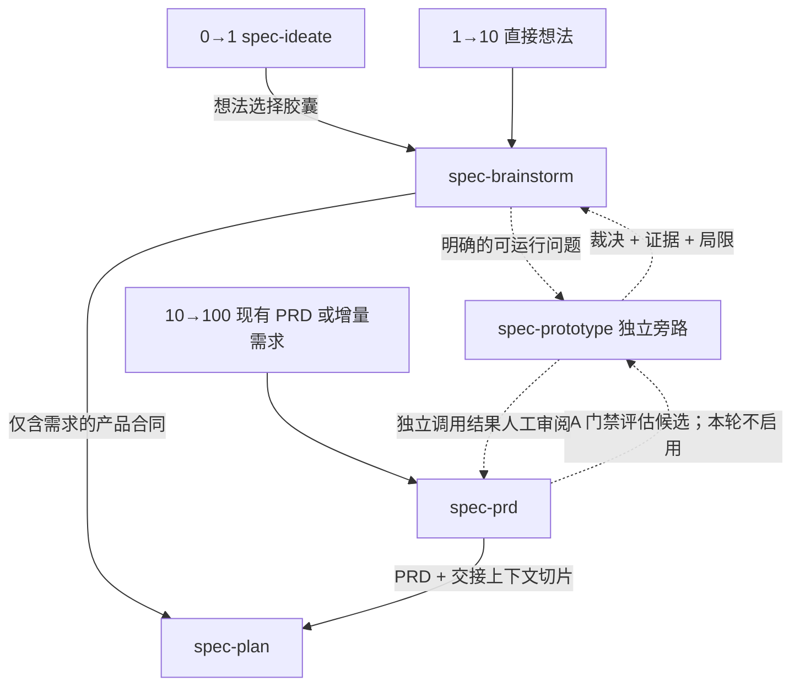
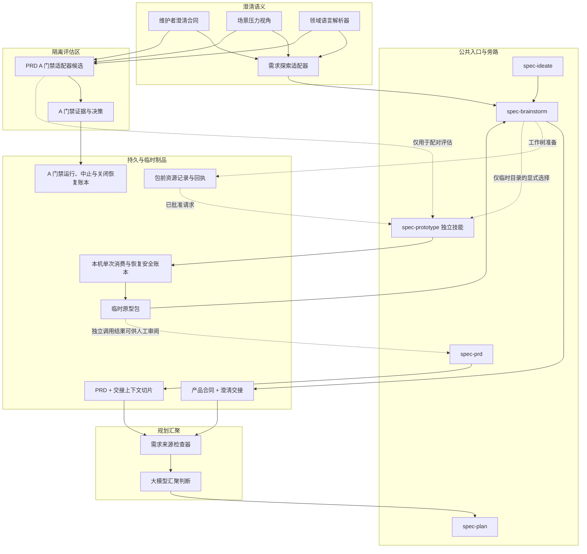
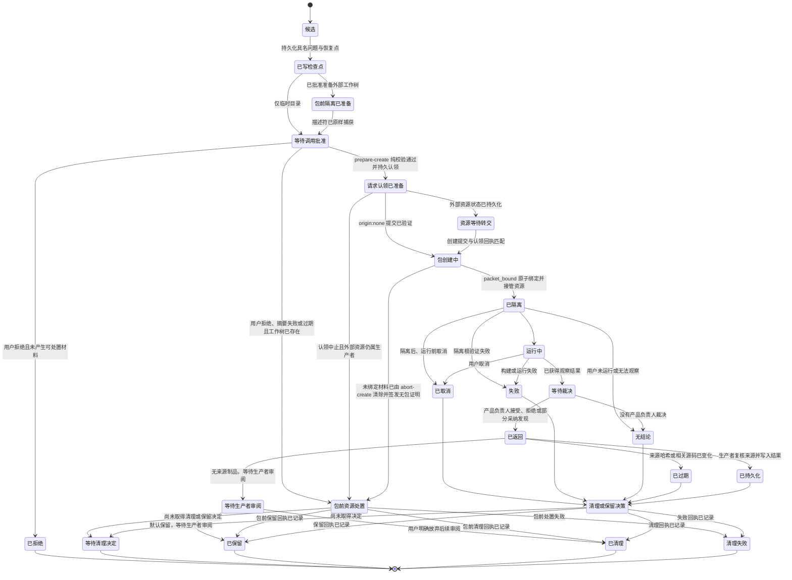
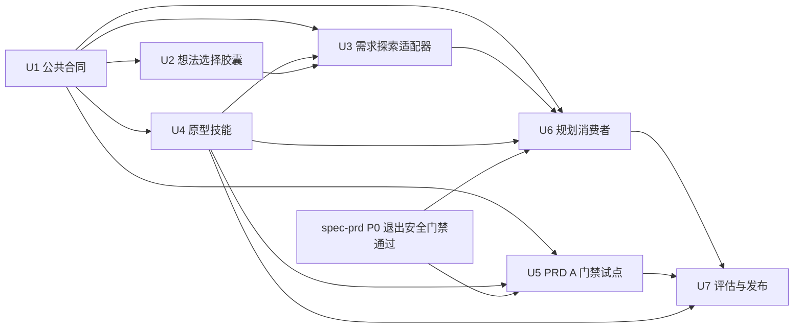

# 需求澄清能力集成计划

## 目标概览

- **目标：** 补齐 `spec-first` 在事实查证、逐问澄清、领域术语、决策持久化、场景压力测试和原型验证上的真实缺口，并把外部 `skills` 项目中可复用的机制适配为可投射、可恢复、可验证的源码优先能力。
- **产品权威来源：** 本轮用户确认的三段成熟度路径是 `0→1: spec-ideate → spec-brainstorm → spec-plan`、`1→10: spec-brainstorm → spec-plan`、`10→100: spec-prd → spec-plan`；已经被 `spec-prd` 吸收的能力不重复集成。
- **执行范围：** 深度模式、跨工作流、制品、技能治理、五宿主投射和语义评估的源码变更；不改业务功能，不引入数据库或服务。
- **停止条件：** 不新增公共 `spec-grill` / `spec-requirements-clarification` 工作流；不让智能体代替产品负责人裁决需求内容；不创建第二套持久需求制品；不手改生成的运行时镜像；不把原型代码直接提升为生产代码。
- **后续责任：** 后续实施由 `spec-work` 或等价执行器按 U-ID 依赖顺序推进；本计划本身不授权实现。
- **语言约定：** 标题、正文、表格和图示标签统一使用中文；命令、字段、枚举值、文件路径、标准名称及既有合同章节标识保留原始英文，以保证实现时可精确对应源码。

---

## 产品合同

### 概要

保留现有三段主路径，将澄清能力拆成父工作流内的生产者本地适配器、一个轻量的澄清交接、一个独立但非主流程节点的 `spec-prototype` 技能，以及 `spec-plan` 的统一消费者适配器。新增能力主要落在 `spec-ideate` 选择胶囊、`spec-brainstorm`、原型旁路和多入口汇聚；`spec-prd` 本轮只新增不会投射到运行时的 A 门禁评估候选与证据报告，不修改其活动入口、引用或运行行为。若 A 门禁通过，真正的 `spec-prd` 适配器必须另立实施计划。

### 问题界定

当前系统并非“缺少需求澄清”。`spec-prd` 已经包含源码优先、一次一问、推荐答案、领域术语挑战、决策记录、负责人决策追踪、权限/状态/失败/负向/跨上下文场景，以及就绪性/收尾。继续把外部追问澄清（`grilling`）、文档辅助追问（`grill-with-docs`）或领域建模（`domain-modeling`）整段复制进去，会扩大已经存在的合同重叠和提示词负担。

真实问题是能力分布不均：

- `spec-ideate` 能证明一个方向有依据，但交接种子缺少源码快照、局限、未验证假设和与所选方向直接相关的淘汰信息。
- `spec-brainstorm` 有仓库溯源、一次一问、产品压力测试、集成检查、验收示例和视觉探针，但缺少发布边界内的缺口闭环、统一术语权威、暂停恢复检查点、系统化行为场景压力，以及可运行原型旁路。
- `spec-prd` 功能足够多，当前主要风险是重复合同、过长热路径、默认 `CONTEXT.md` / ADR 副作用和缺少真实语义质量证明，而不是缺少更多追问澄清规则正文。
- `spec-plan` 仍依赖 30 天相关性启发、临时溯源材料包和生产者特定的制品形态；它没有共同的澄清消费合同，也会静默补写 `CONCEPTS.md`。
- 视觉探针明确是只展示的决策草图，不是可运行的逻辑、状态机、数据形状或真实交互验证。

### 主路径



虚线表示的原型路径是有条件且经用户确认的。它不会成为必经阶段，也不允许 `spec-plan` 自行运行实验。其中 `spec-prd → spec-prototype` 仅表示 A 门禁中接受评估的候选拓扑；本计划不会把该连线安装到活动运行时。

### 能力审计

| 能力 | `spec-ideate` | `spec-brainstorm` | `spec-prd` | 待补齐的真实缺口 | 复用机制 |
|---|---|---|---|---|---|
| 事实与证据 | 强基础溯源与验证 | 强扫描与主张验证，但持久化新鲜度较弱 | 强证据标签与源码优先分析 | 持久源码引用、基准版本、局限及规划侧复核 | `grilling`：事实来自源码，决策来自产品负责人 |
| 逐问澄清 | 按设计仅做输入接收 | 已有一次一问节奏，但分支闭环较轻 | 已十分完整且当前过度膨胀 | 仅针对需求探索的承重决策闭环与无头执行诚实性 | `grilling`：一次一问、命名决策、可辩护时提供推荐答案 |
| 领域术语 | 仅消费背景 | 将 `CONCEPTS.md` 视为权威并静默编辑 | PRD 术语表、领域词汇表及可选上下文拓扑 | 多个词汇表面与未经授权的提升 | `domain-modeling`：暴露冲突、精确术语、克制的 ADR 门槛 |
| 决策持久化 | 想法依据与淘汰记录 | 产品合同持久化结果，但缺少紧凑恢复切片 | 已有决策记录和负责人决策追踪 | 两类生产者间的暂停、原型裁决、新鲜度和下一问题持久化 | `handoff`：引用既有制品，不复制对话记录 |
| 场景压力测试 | 想法批判，而非需求覆盖 | 有产品压力与条件式 AE，但无稳定行为视角 | 已覆盖正常、权限、状态、失败、负向和跨上下文场景 | 为需求探索增加风险触发的场景视角 | `domain-modeling`：具体边界场景 |
| 原型验证 | 有意不提供 | 视觉探针明确不是原型 | 可消费原型记录，但不能运行旁路 | 可运行的逻辑/界面问题生命周期与返回合同 | `prototype`：一个问题、逻辑/界面分支、一次性代码 |

### 需求

**流程与归属**

- R1. 已确认的三条成熟度路径继续作为公共主路径；原型是条件式旁路，而不是第四个必经阶段。
- R2. 澄清仍归当前生产者父会话（`spec-brainstorm` 或 `spec-prd`）所有，因为该会话掌握用户授权、对话状态和规范需求制品。
- R3. 不新增公共 `spec-grill`、`spec-grill-with-docs`、`spec-domain-modeling` 或 `spec-requirements-clarification` 工作流。
- R4. `spec-ideate` 继续作为有证据支撑的方向生成器；它不转变为需求访谈，也不为原型工作直接修改仓库。

**事实、问题与决策权威**

- R5. 对于可从仓库发现的事实，在询问用户之前先对照源码、测试、合同或当前文档查证；无法获得的事实继续标记为局限或假设。
- R6. 凡会改变需求内容、验收、范围、术语、权威或发布行为的产品选择，均逐次向相关决策权威提出一个问题。
- R7. 每个产品负责人问题都要标明具体缺口、受影响的制品写入目标及后果；仅当源码或明确的权衡推理足以支撑时才提供推荐答案。
- R8. 证据探查和早期开放探索不应先给出可能锚定用户初始框架的推荐答案。
- R9. 真正的无头或无回复执行不得伪造产品负责人闭环；它应写入未就绪检查点，记录假设、阻塞、局限以及下一个源码或产品负责人问题。

**领域语言**

- R10. 当前产品合同或 PRD 承载活动发布切片内的制品本地术语决策，使规划即使在项目没有词汇表时也能使用一套已消歧的词汇。
- R11. 项目词汇表面按其声明的权威和作用域解析，而不是按硬编码文件名解析：声明规范权威的已检入合同、`CONCEPTS.md`、`CONTEXT.md` / `CONTEXT-MAP.md`、ADR 和项目本地词汇表都属于校准输入，必须尊重它们各自的权威声明。
- R12. 相互冲突的词汇来源应作为矛盾暴露；智能体不得静默合并定义，也不得仅凭新旧程度选定胜者。
- R13. 项目级词汇提升必须先预览、再由用户确认；默认不创建或修改 `CONTEXT.md`、`CONTEXT-MAP.md`、项目词汇表和 ADR。
- R14. 仅当决策难以逆转、脱离上下文会令人意外且确实来自真实权衡时，才创建 ADR。

**持久化与交接**

- R15. 持久的澄清状态存放在规范产品合同或 PRD 中，包括已确认的需求内容、源码引用、产品负责人决策、已接受假设、场景结果、原型裁决、阻塞、局限和下一恢复点。
- R16. `/tmp` 材料包和原型包仅用于辅助加速或跨会话桥接；`spec-plan` 所需的承重事实或决策不得只存在于这些位置。
- R17. 在形成实质决策后发生暂停、上下文重置或原型旁路时，离开生产者会话前必须创建或更新未就绪的需求检查点。
- R18. 检查点使用现有就绪性语义和章节；不新增产品进度状态、对话记录、第三套持久需求台账或新的工作流状态机。包前资源记录及本机安全账本中的窄域技术状态只用于所有权、防重放和恢复，不能映射成需求进度、就绪性或用户旅程状态。
- R19. 公共澄清交接以指针优先：引用既有 R/F/AE/决策/源码章节并记录局限，而不是复制完整正文。

**场景压力测试**

- R20. 标准和深度级别的行为型需求探索在综合前运行基于实质性的场景压力视角。
- R21. 该视角从正常路径、角色/权限、状态转换、异常/失败、负向验收和跨上下文交接中推导适用案例；不得生成笛卡尔积式检查清单。
- R22. 每个适用场景必须落为验收示例（AE）、具名待决问题（OQ）、已接受假设或明确非目标；仅涉及实现方式的内容推迟到规划阶段。

**原型旁路**

- R23. 新增独立 `spec-prototype` 技能，专门回答一个源码和对话无法解决、且答案可能改变需求内容或验收的具名问题。
- R24. 静态视觉或空间选择继续使用 `spec-brainstorm` 的视觉探针；`spec-prototype` 仅用于必须运行，或必须在真实上下文中观察的逻辑/状态/数据形状行为或界面交互。
- R25. 进入 `spec-prototype` 前，父流程必须记录问题、受影响的需求目标、成功/失效标准、预期仓库副作用和隔离范围，并通过生产者本地的确定性请求构造器计算规范请求正文摘要；请求包含不可预测的单次 `detour_request_id`、创建时间和过期时间。随后取得绑定该摘要的用户明确同意；请求正文或描述符变化时必须重新批准。`spec-prototype` 先在跨运行的本机私有安全账本中以 `prepare-create` 排他预留并签发认领回执，存在包前资源时只有父流程持久化 `transfer_pending` 后才能提交创建；同一已批准请求最多创建一个原型包。请求过期、已消费、与既有 ID 摘要冲突或转交证明不匹配时必须安全拒绝并提供可恢复的无包终结路径。
- R26. 原型工作采用临时目录优先；需要真实应用上下文时，由父级公共工作流在交接前创建或选择隔离工作树，并在结构化旁路请求中提供版本化隔离描述符。描述符必须由 `spec-worktree` 从结构化捕获请求生成；捕获请求显式包含请求 ID、允许写入范围、提供者和工作树授权证据，父流程不得事后修改捕获器标准输出。`spec-prototype` 必须验证该工作树已登记、不是主工作树，并绑定预期基准提交、索引状态以及每个未提交/未跟踪路径的内容、类型和链接元数据。外部工作树始终只读；原型只能在私有运行根内物化的沙箱工作区中写入。若工作树已创建但用户拒绝、摘要失败、请求过期或原型包创建失败，父流程必须通过 `spec-worktree` 的包前处置命令完成清理或保留并持久化回执，不得依赖尚不存在的原型包收尾。
- R27. 原型代码不得静默修改主检出目录或外部隔离工作树，不得复制未声明的未提交变更、提交、推送、发布，或未经单独授权而在清理后继续保留。真实上下文必须先从只读外部来源物化到私有根，再通过强制沙箱执行器运行；沙箱不挂载外部工作树，私有工作区仅开放预注册写入范围，其他宿主路径与网络不可达。无法证明该执行边界时，可回答的问题降级到仅临时目录模式，必须依赖真实上下文的问题返回 `isolation_not_provisioned`。
- R28. 仅当运行观察、产品负责人裁决和局限三者齐全时，原型结果才是 `conclusive`；构建成功、智能体偏好或未经审阅的截图均不能关闭产品问题。
- R29. 原型返回结果包含来源路径与哈希、基准版本、相关未提交状态局限、隔离描述符摘要、观察、产品负责人裁决、裁决者/授权类型/授权证据指针/记录时间、受影响的 R/F/AE 或写入目标、证据引用、失效条件、未解决矛盾及清理/保留状态；保留时这些内容存在于包中，清理时最终封套绑定删除前包哈希。最终清理状态必须绑定包哈希与目标身份的版本化回执。删除任何外部工作树或私有运行根前，对应命令必须先把清理意图、目标身份、摘要、授权和待生成回执基础载荷写入各自运行根之外的私有安全账本并完成持久化；进程中断或标准输出丢失后，先由工作树恢复命令收口外部目标，再由 `recover-cleanup` 从原清理请求和稳定回执定位器幂等完成私有根处置或返回同一回执。
- R30. 原型代码永不直接提升为生产实现；已验证行为必须通过正常规划/实施/测试路径重新实现。

**生产者与消费者适配器**

- R31. `spec-brainstorm` 增加紧凑澄清适配器、场景视角、暂停检查点和原型旁路，同时保留当前产品合同与一次一问对话。
- R32. 除仅用于评估的样例外，本次实施不改变活动 `spec-prd` 运行时行为；它为术语权威、原型裁决映射和交接语义产出 A 门禁证据与后续范围，且不增加另一套追问澄清合同。
- R33. `spec-plan` 通过一个逻辑来源适配器消费 `spec-brainstorm` 的产品合同和 PRD 交接上下文切片，同时保留两者不同的生产者/就绪性姿态。
- R34. 当新鲜度或局限要求时，`spec-plan` 重新溯源承重源码事实；未解决的需求内容返回原生产者，而不是转成 KTD。
- R35. 对旧格式或 `spec-brainstorm` 级输入，回执/新鲜度诊断保持建议性且由用户掌控；但生产者声明的检查点状态、`can_enter_spec_plan: no` 及未解决的承重需求内容属于硬性回退条件，`spec-plan` 不得覆盖。
- R36. `spec-plan` 不再将缺失术语静默提升到 `CONCEPTS.md`；任何共享词汇写入都必须先预览并单独批准。

**能力交付与验证**

- R37. `spec-prototype` 分类为 `standalone_skill`，而不是 `workflow_command` 或 `internal_only`，从而无需假设尚未证实的嵌套内部技能调用，五个宿主都能发现它。
- R38. 仅当宿主暴露技能调用能力时，父工作流才直接调用 `spec-prototype`；否则持久化检查点、输出结构化旁路请求并给出新会话调用路径，不得声称原型包已经创建或原型已经运行。
- R39. 源码变更仅发生在 `skills/`、`docs/contracts/`、`docs/validation/`、维护者级 `scripts/`、`src/cli/`、`package.json`、`.github/workflows/`、测试和面向用户的文档中；验证后再从源码刷新生成的 `.claude/`、`.codex/`、`.agents/skills/`、`.cursor/`、`.kiro/` 和 `.qoder/` 镜像。
- R40. 静态合同测试证明路径、字段、路由和确定性事实；当前源码配对评估证明提问纪律、权威忠实度、场景质量、原型返回及下游发明减少。`spec-prd` 的 A 门禁还必须为第一阶段封存、揭盲记录、最终报告、最终封存、自包含证据导出、未完成运行中止、关闭意图和终态回执定义唯一的 RFC 8785 / SHA-256 域分隔公式，并用独立实现重算；首个私有根创建前必须有运行预留，未完成运行必须由可恢复中止协议收口。完整运行的关闭采用先持久化不可变恢复头与公开意图、再处置私有根、最后持久化回执的两阶段协议，且支持不依赖已删除控制根的 `recover-close`，以及终态日志修剪后的只读幂等复核。
- R41. 允许在无来源制品时以临时目录模式直接调用 `spec-prototype`，但不得声称需求已就绪；它返回可供后续 `spec-brainstorm` 或 `spec-prd` 审阅的包。
- R42. 辅助脚本先以只读预检解析 `os.tmpdir()` 和平台用户状态目录的规范路径，并确认平台的所有者/权限模式、进程身份/存活证明或 ACL/重解析点校验能力可用，成功后才创建安全账本、排他预留目录和不可预测的每次运行私有根；预检失败以 `platform_security_unavailable` 无写入退出。每个请求先在运行根之外的本机私有安全账本中以排他创建和文件/父目录持久化形成预留，再在该预留专属的随机暂存目录中用 `mkdtemp` 创建唯一运行根；恢复命令只能继续同一预留，不得创建第二个包。系统 `/tmp` 别名可以解析到规范临时目录，但其下的用户输入路径不得借符号链接、目录联接、重解析点或路径穿越逃逸。POSIX 上安全账本、预留暂存目录和私有运行根必须由当前 uid 拥有且为 `0700`，包、账本记录与证据文件必须为当前 uid 的 `0600`；Windows 上使用 `path.win32` 校验包含关系、拒绝目录联接和重解析点，并验证 ACL 只向当前用户及平台受信主体（SYSTEM、Administrators）授予写权限，拒绝 Everyone、Users、Authenticated Users 等宽泛非受信主体的写入、修改或完全控制权限。创建后校验失败必须立即清理新根并报告 `security_postcreate_validation_failed`。原型命令与业务载荷不得在私有运行根和预注册沙箱写入范围之外写入；唯一控制面例外是固定平台用户状态目录中的请求消费、工作树处置、A 门禁运行预留/中止恢复、保留登记和关闭恢复安全账本，以及 U5 维护者执行器预注册的 `docs/validation/spec-prd/` 证据、公开意图和回执目标，所有例外都必须应用同等路径、权限、链接、原子及持久写入校验。外部工作树始终只是经过内容绑定的只读来源。本机安全账本只保存有期限的防重放、创建恢复和清理恢复元数据，不成为需求事实来源或集中式原型注册表；任何非终态记录不得因达到保留期而被删除。凡以“终态满 30 天”作为修剪条件，终态发布时还必须在对应私有账本中仅创建并持久化 `spec-first-terminal-retention-anchor/v1`，固定 `receipt_hash`、由命令内部可信时钟采集的 `terminal_recorded_at` 和账本类型；`retention_anchor_hash = lowerhex(SHA-256(UTF8("spec-first/terminal-retention-anchor/v1\0") || UTF8(RFC8785(anchor_payload_without_hash))))`。该时间不进入确定性终态回执，不能由命令行提供，也不能用文件 mtime、诊断时间或恢复时间替代；修剪准备必须绑定锚点摘要。锚点缺失时只允许在当前时刻创建新的保守锚点并重新等待完整保留期，不得追溯伪造更早时间。

### 参与者

- A1. **产品负责人或当前用户**——提供产品意图，并作出经授权的需求内容决策。
- A2. **生产者工作流智能体**——`spec-brainstorm` 或 `spec-prd`；查证事实、一次提出一个问题、维护规范需求制品，并负责写回原型结果。
- A3. **原型评估者**——运行或审阅隔离原型，并给出可关闭或重新打开具名问题的裁决。
- A4. **规划消费者**——`spec-plan`；复核新鲜度、保留需求内容并设计实现方式。
- A5. **Spec-first 维护者**——负责技能源码、治理、测试、运行时投射和发布证据。

### 关键流程

- F1. **0→1 从方向到需求**
  - **触发条件：** A1 从 `spec-ideate` 中选定一个想法。
  - **步骤：** A2 接收聚焦的想法选择胶囊，其中包含依据、源码快照、相关淘汰上下文、局限和未验证假设；之后由 `spec-brainstorm` 负责澄清并形成产品合同。
  - **结果：** `spec-plan` 接收的是需求，而不是原始想法列表。
- F2. **1→10 直接需求探索**
  - **触发条件：** A1 已有想法，但产品行为或边界尚未确定。
  - **步骤：** A2 对源码溯源、解析事实、逐次询问产品负责人决策、压力测试适用场景，并写入仅含需求的产品合同或检查点。
  - **结果：** 规划无需发明承重需求内容即可继续；若不能继续，制品会明确原因。
- F3. **10→100 既有系统演进**
  - **触发条件：** A1 提供已有 PRD 或已知系统的增量需求。
  - **步骤：** `spec-prd` 使用现有源码权威、决策记录、验收示例和就绪路径；本轮活动运行时不调用原型旁路，也不执行 A 门禁试点。
  - **结果：** 现有 PRD 制品与交接上下文切片继续作为权威生产者输出；A 门禁之前，本计划不改变活动运行时。
- F4. **原型旁路与返回**
  - **触发条件：** 源码与对话无法解决一个承重逻辑或界面交互问题。
  - **步骤：** A2 先写入未就绪检查点和结构化请求草稿；需要真实上下文时，先取得独立的工作树准备授权，创建或选择工作树、从结构化输入生成描述符并持久化包前资源记录。生产者请求构造器随后计算正文摘要，A1 批准完整调用请求。批准成功后，`spec-prototype` 先以 `prepare-create` 完成纯校验并排他持久化请求认领；只有认领回执成功，A2 才把资源置为 `transfer_pending`，随后 `create` 原子绑定唯一原型包。若批准被拒绝、摘要/认领失败、请求过期或包创建前失败，A2 先按账本状态取得 `aborted_before_packet`，再通过 `spec-worktree` 完成包前资源清理/保留；不会因纯校验失败产生无法证明的转交悬挂。运行时从只读工作树物化私有沙箱工作区。A3 给出裁决，A2 复核来源新鲜度并写回规范制品；收尾先持久化清理意图，再处置外部目标与私有根，任何中断均由恢复命令幂等完成。
  - **结果：** 原型包的 `result` 落为 `conclusive | inconclusive | cancelled | failed | stale`。`conclusive` 要求当前有效的 `accepted | rejected | mixed` 裁决；`failed`、`inconclusive`、`cancelled` 的 `owner_verdict` 为 `none`；`stale` 可以保留先前裁决，但必须标记 `verdict_validity: stale` 和当时的来源哈希，且不得据此关闭需求。清理状态作为正交字段单独记录，且不把原型代码当作生产实现。
- F5. **暂停、无头执行与恢复**
  - **触发条件：** 会话必须停止、上下文接近有效上限、宿主无法等待回答，或旁路转入新会话。
  - **步骤：** A2 在规范需求制品中持久化已确认决策、源码引用、局限和下一问题；临时路径仍仅作为可选加速手段。
  - **结果：** 新生产者可从同一具名缺口恢复，无需依赖对话记录重建。

U5 的 A 门禁是维护者侧、一次性的非运行时旁证流程，不属于 F3 的每次 10→100 用户请求。它只在 P0 退出安全修复完成后，由维护者按预注册清单运行盲测、两阶段封存、自包含证据导出和可恢复关闭；通过后仍需另立实施计划，才可能改变未来活动拓扑。

### 验收示例

- AE1. **覆盖 R5-R7。** 假设某条现有路由的主张可由源码回答；当执行澄清时，智能体应读取路由源码，而不是要求产品负责人凭记忆回答。
- AE2. **覆盖 R5-R9。** 假设源码显示当前仅支持整单取消，而用户要求部分取消；当发现冲突时，应将当前行为记录为事实，并提出一个带后果说明的目标行为问题。
- AE3. **覆盖 R6-R8。** 假设仍有三个相互独立的产品负责人决策；当对话继续时，本轮只询问影响最高的问题，且证据探查不被预设推荐答案锚定。
- AE4. **覆盖 R10-R14。** 假设 `CONCEPTS.md` 是建议性来源，而已检入词汇表声明自己具有规范权威；当两者对同一术语定义不同时，应暴露冲突，且不静默改写任一文件。
- AE5. **覆盖 R15-R19。** 假设 `spec-brainstorm` 在形成多项实质决策后、最终综合前暂停；当会话结束时，仅含需求的检查点应记录这些决策、源码、阻塞和准确的下一问题，且不新增进度状态。
- AE6. **覆盖 R20-R22。** 假设存在多角色审批流；当运行场景压力测试时，适用的权限、状态、失败、负向及跨角色交接案例应转为 AE 或 OQ，不相关的离线或规模案例应省略。
- AE7. **覆盖 R23-R25。** 假设用户只需比较三种静态布局；当出现视觉决策时，应提供视觉探针，而不调用 `spec-prototype`。
- AE8. **覆盖 R23-R30。** 假设必须实际操作状态转换才能判断体验是否成立；当用户批准逻辑原型并随后确认观察到的行为时，脱敏观察摘要、裁决依据、授权证据、局限和证据摘要哈希应写回受影响需求，即使临时材料被清理仍可审计，原型代码继续保持隔离。
- AE9. **覆盖 R28-R30。** 假设原型构建成功，但用户从未运行或评估；当旁路结束时，状态应为 `inconclusive`，原产品问题保持未关闭。
- AE10. **覆盖 R27-R29。** 假设旁路期间相关源码或来源制品发生变化；当结果返回时，应拒绝自动写回，直至生产者重新验证受影响的 R/F/AE 引用。已有裁决可作为 `verdict_validity: stale` 的历史证据保留，但不得关闭需求。
- AE11. **覆盖 R16、R33-R35。** 假设 `spec-brainstorm` 的 `/tmp` 溯源材料包已删除；当 `spec-plan` 从持久产品合同启动时，仍能定位必要的源码引用和局限，并重新溯源实质事实。
- AE12. **覆盖 R33-R35。** 假设 PRD 声明 `checkpoint-prd`、`can_enter_spec_plan: no` 或存在承重需求内容阻塞；当 `spec-plan` 检查它时，应返回 `spec-prd` 且不提供覆盖选项；可选回执/新鲜度降级继续作为独立的旧格式兼容决策。
- AE13. **覆盖 R9、R17-R18。** 假设真正的无头运行遇到必须用原型验证的需求内容决策；当无法取得产品负责人裁决时，应写入未就绪检查点，且绝不声称已经验证或就绪。
- AE14. **覆盖 R38。** 假设宿主没有嵌套技能调用或浏览器表面；当提供原型时，工作流应输出旁路/新会话路径或降级为文本，且不声称原型已运行。
- AE15. **覆盖 R32、R40、R42。** 假设将 `spec-prd` 候选与其当前源码对比；当评估集成时，不新增第二套追问澄清合同或字段族，语义质量由真实配对试点而不是样例数量判断。准备承诺、执行/审阅实例、第一阶段封存、揭盲记录、最终报告、最终封存、证据导出、中止回执和关闭回执均可由独立实现按文档公式重算；任何私有根创建后、关闭接管前中断时，`recover-abort-run` 可从运行预留收口。删除部分私有根、删除控制根后但关闭回执写入前中断时，`recover-close` 凭公开关闭意图、自包含证据导出和固定本机私有恢复日志生成同一终态回执；终态日志按规则修剪后仍可只读复核并返回同一回执。
- AE16. **覆盖 R4、R15-R19、R41。** 假设已保存的想法依据或直接独立原型没有当前来源制品；当它进入需求流程时，应标注快照/局限，并在任何规划就绪声明前由生产者审阅。
- AE17. **覆盖 R25-R29、R42。** 假设 macOS `/tmp` 是合法系统别名，或 Windows 路径包含大小写差异、目录联接/重解析点；当辅助脚本创建或读取原型材料时，规范系统临时目录、私有安全账本、排他预留与 `mkdtemp` 私有根应正常工作，任何路径逃逸都应被拒绝并返回稳定原因码。POSIX 产物满足 `0700` / `0600` 与所有者约束；Windows 产物满足 ACL/包含关系约束，无法验证时安全拒绝修改。两个并发或跨运行调用提交同一已批准请求时，最多只有一个物理原型包；输出丢失只能恢复同一预留，不能创建第二个包。真实上下文模式还必须证明未提交内容清单未漂移、外部工作树保持只读，并由强制沙箱把所有写入限制在私有根内的预注册范围。
- AE18. **覆盖 R1-R3。** 假设检查安装后的公共能力与路由；当列出需求主路径时，只应出现已确认的三条成熟度路径，澄清会话仍由 `spec-brainstorm` / `spec-prd` 各自拥有，且不存在新的公共追问/澄清工作流或第二套持久需求制品。
- AE19. **覆盖 R26-R29。** 假设隔离工作树或原型包已经产生，但最终调用被拒绝，或结果为 `failed`、`inconclusive`、`cancelled`、`stale`；当旁路结束时，`cleanup_status` 必须进入 `pending | retained | cleaned | cleanup_failed` 之一并记录原因，不得因尚无原型包或结果非结论而绕过清理/保留决策；只有未创建工作树、私有运行根、原型包或证据时才允许 `not_applicable`，强制保留的最小防重放墓碑单独按安全账本保留策略管理。包创建前由 `spec-worktree` 生成包前处置回执；包创建后先持久化清理意图，再处置外部目标与私有根。删除后进程中断或标准输出丢失时，工作树恢复命令与 `recover-cleanup` 必须按顺序返回同一外部及聚合回执；没有可达调用原语时保持 `pending` 并输出明确的新会话收尾路径。

### 成功标准

- 在分别覆盖 0→1、独立 1→10 和 10→100 的配对样本中，新会话 `spec-plan` 审阅者找不到任何必须自行发明的承重需求内容决策；不得用 0→1 经 `spec-ideate` 的样本替代 1→10 直接进入 `spec-brainstorm` 的样本。
- 在代表性评估样例中，可由源码回答的事实不会转成产品负责人问题。
- 任何无头、失败、取消、过期或未经产品负责人审阅的原型都不得标记为 `conclusive`。
- 每个原型包都能通过 `request_binding` 追溯到单次请求 ID、规范正文摘要和绑定该摘要的明确批准；请求或描述符变化后旧批准不可复用。
- 同一 `detour_request_id` 在跨进程、并发、输出丢失和包删除后的重放中最多绑定一个原型包；`prepare-create` 成功前资源不会进入 `transfer_pending`，进入后始终存在可恢复认领。过期请求不能首次消费，可恢复创建只能继续既有预留，安全账本不可用时不得降级创建。
- 任何已经产生材料的原型结果，无论是否 `conclusive`，都有显式 `cleanup_status`；最终 `cleaned | retained | cleanup_failed` 状态均绑定防重放的版本化清理回执，发布证据中不得遗留未解释的 `pending` 或 `cleanup_failed`。
- 工作树在包创建前已经产生时，拒绝、摘要失败、过期或创建失败同样具有可复算的清理/保留回执；其回执只绑定不可变处置基础和目标专属终态，不受其他工作树或恢复时间变化影响。包前和包后工作树账本都有受终态回执约束的有界修剪；私有根删除前持久化的清理意图可在崩溃或输出丢失后恢复为同一最终回执。
- 适用的权限、状态、失败、负向和交接场景必须体现在 AE 中或具名记录为残留；成功按相关性判断，而不是按场景原始数量判断。
- `spec-prd` 正常热路径不新增另一份始终加载的参考资料，也不新增闭环/状态词汇。
- `spec-prototype` 及其支持文件通过现有治理路径从源码投射到 Claude、Codex、Cursor、Kiro 和 Qoder。
- 临时原型运行目录满足跨平台安全合同：先在本机安全账本排他持久化预留，再在专属随机暂存目录中调用一次 `mkdtemp`；同时满足规范包含关系、拒绝链接/重解析点逃逸和禁止业务载荷越界写。POSIX 额外满足 `0700` / `0600` 与所有者约束，Windows 满足 ACL 验证或安全拒绝。
- 真实上下文原型只在隔离描述符通过 Git 工作树登记、主工作树排除、提交/索引/未提交内容绑定后运行；外部工作树保持只读，强制沙箱仅允许私有工作区内的预注册写入范围，滚动变更账本允许连续合法变更并拒绝未登记漂移。
- A 门禁揭盲结果可由公开算法与披露的原始种子重算；相同准备输入生成相同 `run_commitment_id` 和 `prepared_bundle_hash`，物理目录随机数明确排除，而模型输出仍按预注册重复评估。一次性执行/审阅挑战拒绝跨运行重放；首个私有根前存在可恢复运行预留，未完成运行由中止回执收口。第一阶段审阅封存、揭盲记录、最终报告、第二阶段最终封存、自包含证据导出、不可变关闭恢复头、关闭意图和关闭回执分别使用唯一的域分隔摘要；可变恢复进度不改变终态回执。清理私有根后仍可复核，关闭中断后仍可恢复，终态日志修剪后仍可只读返回同一回执；任何对映射、受控问答日志、包清单、答案集承诺、源码/配置证明、揭盲记录、最终报告、证据根或关闭链的篡改都使运行无效。
- 合同测试与当前源码评估均通过；不得将任一项声称为另一项的替代品。

### 范围边界

**范围内**

- 六项具名澄清能力的能力合同、路由和制品语义。
- `spec-ideate` 与 `spec-brainstorm` 生产者适配器、`spec-plan` 消费者适配器，以及用于未来 `spec-prd` 集成的 A 门禁仅评估候选。
- 具有逻辑和界面分支、明确旁路、隔离与诚实收尾的独立 `spec-prototype` 技能。
- 术语权威解析、先预览后提升及暂停/恢复持久化。
- 确定性来源检查、聚焦测试、语义评估和五宿主投射。

**推迟到后续工作**

- 浏览器到智能体的事件通道、点击跟踪或双向原型反馈。
- 集中式、业务级或跨机器持久原型内容注册表、托管原型服务或中央上下文路由器。本计划中的本机最小安全账本只保存有期限的请求单次消费、工作树处置和关闭恢复元数据，不属于该推迟项。
- 对语义就绪性、产品质量或决策权威进行机器评分。
- 将 `spec-prd` 从旧 PRD 制品全量迁移到 `spec-unified-plan/v1`；该事项继续由已批准的合同重置顺序治理。
- 原型分支的自动议题创建、远程分支发布或 PR 生命周期。

**非目标**

- 用共享公共澄清工作流替换 `spec-brainstorm` 或 `spec-prd`。
- 要求尚未采用相关约定的仓库必须提供 `CONTEXT.md`、ADR 或项目词汇表。
- 持久化完整访谈记录或每个可逆微决策。
- 将原型输出视为生产质量实现、测试覆盖或架构批准。
- 手工编辑生成的运行时镜像。

### 依赖与假设

- `docs/validation/spec-prd/2026-07-11-spec-prd-skill-goal-and-restructure-review.md` 是活动架构输入；U6 必须以其中的 P0 退出安全门禁已通过（`green`）为硬前置条件，且不得重新引入该重构已移除的合同。
- 五个宿主适配器继续通过 `src/cli/plugin-sync.js` 复制独立技能目录并改写受支持的源码/运行时路径。
- 现有 `spec-worktree` 技能继续作为受支持的隔离能力。只有父级公共工作流可以委派给它；`spec-prototype` 只接受已创建工作树的结构化隔离描述符并自行验证，否则保持临时目录模式。
- 真实上下文命令还依赖可证明文件系统挂载边界的宿主微沙箱或 OCI 后端；实现不得把普通子进程、目录权限调整或事后目录快照冒充强制沙箱。后端不可用时，`temp_only` 能力仍可使用，但真实上下文模式安全拒绝。
- 当前项目同时存在 `CONCEPTS.md` 和 `docs/contracts/domain-glossary.md`；两者各自的权威声明证明，仅按文件名路由词汇是不充分的。
- 实施设计不需要外部网络调研，因为用户指定的本地 `skills` 仓库是权威对标输入，且所有拟议变更都局限在仓库内。

---

## 规划合同

### 复用机制与适配方式

| 外部机制 | 保留 | 针对 `spec-first` 的适配 | 拒绝 |
|---|---|---|---|
| `grilling` | 事实来自仓库、决策来自用户、一次一问、推荐答案 | 仅应用于承重决策；分开证据探查与决策问题；持久化到当前制品 | 独立公共追问节点，或没有发布边界的无限期访谈 |
| `grill-with-docs` | 将提问与领域建模组合 | 通过生产者本地适配器表达 | 整体引入或快照复制上游技能正文 |
| `domain-modeling` | 词汇冲突、更精确的规范术语、具体场景、克制的 ADR 规则 | 解析项目特定权威；制品内定义优先；先预览后提升 | 默认创建或内联修改 `CONTEXT.md` 和 ADR |
| `prototype` | 一个问题、逻辑/界面分支、一次性代码、可见状态、捕获答案 | 临时目录优先、明确旁路；需要真实应用上下文时使用经描述符验证的隔离工作树，并将裁决返回规范制品 | 在主分支上写原型代码、直接提升为生产实现、用测试通过替代原型质量判断 |
| `handoff` | 紧凑当前状态、引用既有制品、脱敏敏感数据 | 父流程持久化检查点并传递旁路请求；`spec-prototype` 在私有临时根创建原型包；持久结论写回产品合同或 PRD | 将临时交接文件作为唯一事实来源 |
| `ask-matt` | 主流程加可选旁路拓扑 | 保留当前三条成熟度路径，将原型作为条件式侧路 | 将每项能力都变成公共工作流节点 |

### 关键技术决策

- KTD1. **澄清是一项能力，而不是新的公共工作流。** 父工作流保留对话与制品所有权；共享维护者合同和生产者本地运行时参考资料承载公共不变量。
- KTD2. **原型是独立技能，而不是仅内部可用能力。** 这既保留独立用户价值和五宿主可发现性，也避免假设所有宿主均支持嵌套内部技能调用。它保持在命令承载的主流程之外。
- KTD3. **一个逻辑交接，两种原生生产者映射。** `spec-brainstorm` 在产品合同（`Product Contract`）内使用紧凑的澄清交接（`Clarification Handoff`）；当前 `spec-prd` 将同一语义映射到决策记录（`Decision Notes`）、证据（`Evidence`）、负责人决策追踪（`Owner Decision Trace`）、待决问题/规划复核（`OQ` / `Planning Recheck`）和交接上下文切片（`Handoff Context Slice`）。
- KTD4. **v1 不新增持久制品模式。** 澄清交接保持为轻量章节合同。临时原型包仅因确定性哈希与结构校验器需要消费而版本化；它永不成为第二套持久需求制品。
- KTD5. **运行时载体保持技能本地化。** 维护者合同位于 `docs/contracts/workflows/`；可执行细节位于各技能内一层深的参考资料，因为安装后的运行时不能依赖跨技能导入一定可用。
- KTD6. **术语权威感知作用域。** 制品本地已消歧术语治理活动发布切片；项目级词汇表按其声明权威进行校准并抛出冲突；提升是独立、需用户批准的动作。
- KTD7. **确定性下限，语义上限。** 新来源检查器可以分类文件类型、字段、哈希、声明的就绪性、源码引用、局限和原因码；但不能判断需求是否在语义上闭环，也不能判断原型是否有说服力。
- KTD8. **新鲜度与具体证据绑定。** 日期/30 天新近性继续只作为发现提示，而不是证明。承重证据携带基准版本、来源哈希、未提交状态局限和失效条件；是否相关由大模型判断。
- KTD9. **场景压力来自推导，而不是枚举式仪式。** 适配器只选择可能改变需求内容或验收的维度，并将其转为验收示例或可见残留。
- KTD10. **原型验证需要产品负责人裁决。** 观察属于证据；由产品负责人或获授权评估者判断是否足以解决产品问题。没有该裁决，结果就是 `inconclusive`。
- KTD11. **原型生命周期需经同意、单次消费且可恢复。** 默认临时材料位于系统临时目录；父级公共工作流负责创建、选择和处置工作树，并通过结构化输入生成隔离描述符。工作树在最终调用批准前产生时由包前资源记录单独治理；`spec-prototype` 先持久化请求认领，父流程再标记 `transfer_pending`，只有 `packet_bound` 才转交统一生命周期，从而使每个转交前失败都有无包证明。`spec-prototype` 在本机最小安全账本中排他消费请求，验证登记关系、主工作树排除、基准提交、索引及未提交内容清单。外部工作树只读，真实上下文在私有根内的强制沙箱工作区运行；写入范围、保留、提交、推送或发布分别记录授权。清理采用先持久化意图、再处置目标、最后持久化回执的顺序；工作树回执绑定不可变处置基础与目标专属终态，不绑定可变化的全局列表或时间。父流程执行外部处置，`spec-prototype` 负责聚合与私有根处置，恢复命令在崩溃或输出丢失后返回同一终态。
- KTD12. **`spec-prd` 本轮仅提供 A 门禁评估候选。** 候选保存在不会被宿主/运行时投射的评估载体中，不接入活动 `SKILL.md`、参考资料或执行路径。只有 P0 退出安全门禁通过、A 门禁给出明确结论且独立后续计划获批后，才允许实施以替换为导向的适配器；届时任何共享不变量都必须替换等价规则正文或上游快照，而不是叠加为新的热路径合同。
- KTD13. **`spec-plan` 是汇聚门禁，不是原型执行器。** 它消费紧凑交接事实，必要时重新溯源源码，并将未解决的需求内容路由回生产者。
- KTD14. **技能结构遵循渐进披露。** `spec-prototype/SKILL.md` 保持为紧凑前置控制器：始终加载安全与返回所必需的生命周期参考资料，选择分支后只加载逻辑或界面参考资料之一；确定性包操作由脚本承载，无需把脚本正文加载进上下文。不新增技能本地说明文件、变更日志或未使用资源。
- KTD15. **质量证明分为两层并覆盖恢复链。** Jest、独立摘要参考实现与脚本保护结构合同、单次消费、跨平台路径安全、默认测试注册、未完成运行中止和关闭恢复；A 门禁把不可变恢复承诺与可变进度分离，并证明终态日志修剪不破坏只读幂等。新会话配对评估衡量可由源码回答的问题、产品负责人忠实度、场景遗漏、错误就绪提升和下游发明。结构测试不得用实现自身的摘要函数证明实现正确，也不得用模拟 Windows 路径替代真实 Windows 生命周期证据。

### 高层技术设计

#### 能力分层



图中的 `RAC` 不连接活动 `spec-prd` 运行时；它只存在于显式加载的评估载体中。`TP → spec-prd` 表示现有流程可以人工审阅独立原型记录，不表示本计划为 `spec-prd` 安装了原型旁路。

#### 原型生命周期



这些状态标识只用于运行时本地推理，不是持久工作流状态字段。`ClaimPrepared` 只表示请求 ID 已被排他认领，资源仍未转交；只有 `packet_bound` 才表示原型包接管外部资源。`packet_bound` 前即使已经出现私有运行根或部分包，也必须先由 `abort-create` 清除全部未绑定材料并形成 `aborted_before_packet`，再进入包前工作树处置；不得调用要求有效包的 `prepare-cleanup`。`Declined` 只有在未创建外部工作树、私有运行根、原型包或证据时才对应 `cleanup_status: not_applicable`；本机安全账本中按策略保留的最小防重放墓碑不是需求制品，也不由用户清理决定覆盖。若包前资源记录已经进入 `provisioned`，最终调用被拒绝或包创建失败必须先完成包前清理/保留处置，不得直接进入 `Declined` 终态。原型包或其他可处置材料一旦创建，`cancelled`、`failed`、`inconclusive`、`stale` 和存在生产者的 `conclusive` 都必须经过独立的清理/保留决策。`origin:none` 的 `DeferredReview` 默认只能为 `retained`，直到 `spec-brainstorm` / `spec-prd` 审阅并持久化；只有用户明确放弃后续生产者审阅时才可为 `cleaned`，并记录 `discarded_before_producer_review`。

### 澄清交接结构

该交接是紧凑章节或生产者原生映射，而不是新文件：

- **生产者与规范制品：** 生产者名称、规范路径和当前格式。
- **已确认需求内容引用：** 既有 R/F/AE 或 PRD 章节指针。
- **直接证据：** 主张概要、仓库相对源码引用、基准版本或工作区局限、新鲜度/失效说明。
- **产品负责人决策：** 指向关键决策或产品负责人决策追踪行的指针，并包含后果。
- **已接受假设：** 具名假设及风险接受来源。
- **场景覆盖：** 已覆盖 AE 引用，以及有意未解决或不适用的维度。
- **原型裁决：** 问题、精简且脱敏的运行观察摘要、产品负责人裁决及授权证据指针、裁决依据、受影响引用、局限、失效条件、原始证据的摘要哈希，以及清理状态。临时路径只能作为可选补充，删除后仍必须足以审计为何关闭、重开或保持问题未决。
- **规划前必须解决：** 剩余承重需求内容阻塞。
- **恢复指针：** 暂停时的下一源码读取或单个产品负责人问题。

该章节指向制品中已有的完整内容，绝不嵌入对话记录。

### 领域语言解析

对于每个存在争议的术语：

1. 读取制品本地定义，以及所有声明与同一作用域相关的项目表面。
2. 按每个表面的自身声明分类：规范合同、项目建议词汇、上下文词汇表、ADR 理由或历史制品。
3. 若定义一致，使用规范名称；仅在有助于下游读者时记录源码引用。
4. 若定义冲突，记录当前观察到的定义；若冲突会改变需求内容或验收，提出一个权威归属问题。
5. 将已消歧术语写入当前产品合同或 PRD。
6. 单独提供项目级提升；预览准确目标和变更，并要求确认。
7. 仅当三个 ADR 条件全部满足时才提供 ADR。

这会移除“`CONCEPTS.md` 始终是规范权威”的当前假设；当其自身前言声明为建议性来源时，仍保留它作为有价值的词汇来源。

### 原型旁路请求与原型包

父流程只生成结构化旁路请求；原型包由 `spec-prototype` 在自己的私有运行根中创建。两者不能混为同一制品。

**旁路请求字段**

- `request_contract: spec-prototype-detour-request/v1`
- 不可预测且单次使用的 `detour_request_id`、创建时间、过期时间和生产者身份；v1 的 ID 至少包含 128 位加密安全随机量并使用无填充 base64url，`expires_at` 必须晚于 `created_at` 且相差不超过 24 小时
- 来源生产者、规范路径、`origin_hash_scope: whole-file` 和来源制品的 SHA-256 哈希
- 基准提交、完整未提交状态证明与相关路径局限
- 唯一问题，以及源码和对话为何无法解决该问题
- 受影响的 R/F/AE 或临时 PRD 写入目标
- 分支：`logic | ui`
- 假设或结构上不同的变体
- 待演练场景
- 成功标准与失效条件
- 非目标与预期副作用
- `isolation_mode: temp_only | external_worktree`
- 当 `isolation_mode: external_worktree` 时必填 `isolation_descriptor`。描述符由不可由生产者改写的 `worktree_snapshot` 与显式 `prototype_policy` 两部分组成：
  - `worktree_snapshot` 由 `spec-worktree` 捕获，包含仓库根、主工作树根、隔离工作树根、Git 管理目录、实际 HEAD、工作树登记、`git status --porcelain --untracked-files=all` 原文哈希、全部索引阶段，以及版本化 `dirty_baseline_manifest[]`。该清单对每个修改、删除、重命名、冲突和未跟踪路径记录原始状态、仓库相对路径、存在性、文件类型、权限模式、大小、常规文件 SHA-256 或符号链接目标；未跟踪目录展开为逐文件条目且不得跟随链接。
  - `prototype_policy: spec-prototype-isolation-policy/v1` 由父生产者通过结构化标准输入提供，包含同一 `detour_request_id`、`provisioning_record_id`、预期 `base_commit` / `head_commit`、`worktree_ownership: created_for_detour | preexisting`、语义选择的 `relevant_dirty_paths[]`、私有沙箱工作区相对的 `allowed_write_scopes[]`、预期提供者 `spec-worktree`、工作树准备授权证据和创建时间。捕获器不得原样信任提供者声明，而要在输出中追加其固定合同版本、脚本源码摘要和当前调用身份形成的 `provider_attestation`。
  - 捕获器必须证明预期提交与实际提交一致、相关脏路径属于完整清单、写入范围为规范相对路径且不包含绝对路径、`.`、`..`、包/证据目录或链接逃逸。最终描述符摘要覆盖快照与策略两部分；父生产者只能原样嵌入标准输出，不得补写或修改字段。
- `request_body_digest`：按下述唯一公式计算的正文摘要，不包含 `request_body_digest`、`approval` 和 `request_digest`
- `approval`：`approved_request_body_digest`、批准者、`owner | delegated` 权威、授权证据指针、记录时间、获批副作用和 `approved_action: invoke_spec_prototype`
- `request_digest`：按下述唯一公式计算的完整请求摘要，包含 `request_body_digest` 与批准对象但排除 `request_digest` 自身；`spec-prototype` 必须重新计算，批准摘要与当前正文不一致时拒绝创建包

**请求规范化与构造协议**

- 定义 `H(tag, payload) = lowerhex(SHA-256(UTF8(tag || "\0") || UTF8(RFC8785(payload))))`。`request_body_payload` 是通过 `spec-prototype-detour-request/v1` 正文模式校验后移除 `request_body_digest`、`approval`、`request_digest` 的 JSON；`request_body_digest = H("spec-prototype-detour/request-body/v1", request_body_payload)`。`request_digest_payload` 是完整请求移除 `request_digest` 后的 JSON；`request_digest = H("spec-prototype-detour/request/v1", request_digest_payload)`。`approval_evidence_digest = H("spec-prototype-detour/approval/v1", approval)`，`isolation_descriptor_digest = H("spec-prototype-detour/isolation-descriptor/v1", isolation_descriptor)`。未知字段、重复键、非有限数字、非法 Unicode、非规范时间、绝对/上级相对路径或模式外枚举均拒绝。
- 生产者不得手工实现 RFC 8785、手工填写摘要字段，或调用包创建命令试算摘要。U3 新增只读的 `skills/spec-brainstorm/scripts/prepare-prototype-detour-request.js`，作为活动 `spec-brainstorm` 生产者唯一的请求构造入口。
- `new-id` 使用加密安全随机源生成 ID；`prepare-request --body-stdin` 只接受尚未包含摘要和批准对象的请求正文，校验字段与隔离描述符后输出正文和 `request_body_digest`；`finalize-request --input-stdin` 接受单个 `spec-prototype-request-finalization-input/v1`，其中同时包含准备封套和批准对象，要求 `approved_request_body_digest` 精确匹配，再输出可直接交给 `spec-prototype` 的完整请求和 `request_digest`。这些命令不创建包、不登记消费状态、不写临时文件；任何子命令最多消费一条标准输入流。
- 没有父生产者的独立调用由 `prototype-packet.js` 提供同名的 `new-id`、`prepare-request` 和 `finalize-request` 子命令；它使用独立本地实现，但与生产者构造器共同通过 `tests/fixtures/spec-prototype-request-digest-vectors.json` 中的 RFC 8785 官方边界向量、项目域分隔向量和失败向量。两套运行时实现不得跨技能导入共享可变模块，也不得以实现自身的输出作为唯一预期值。
- 两个构造入口的标准输出只产生一个 `spec-prototype-request-builder/v1` JSON 封套，标准错误只输出脱敏诊断；标准输入、授权回复、密钥或个人身份信息不得落盘或回显。相同完整输入必须产生相同规范摘要；正文、描述符或批准对象任一变化都使旧批准失效。

**包前隔离资源协议**

- 外部工作树的创建或选择发生在最终原型调用批准之前，因此父生产者必须先在规范检查点写入 `spec-prototype-prepacket-resource/v1`。记录包含 `provisioning_record_id`、`detour_request_id`、目标规范身份、`worktree_ownership`、准备授权证据、描述符摘要、记录时间和 `planned | provisioned | transfer_pending | transferred_to_packet | retained | cleaned | cleanup_failed` 状态。
- 创建工作树需要独立的“准备隔离资源”授权；完整描述符生成后，生产者才计算请求摘要并取得 `invoke_spec_prototype` 的最终批准。准备授权不得替代调用批准。生产者先调用 `prepare-create` 完成全部纯校验，并在请求安全账本中排他持久化 `claim_prepared` 与 `spec-prototype-create-claim/v1`；只有拿到绑定请求摘要、准备记录和描述符的 `claim_receipt_hash` 后，才把规范检查点资源状态写为 `transfer_pending`，并以单个 `spec-prototype-create-commit-input/v1` 把请求、认领回执和该状态记录交给 `create`。因此任何发生在持久认领之前的校验失败都仍处于 `provisioned`，不会要求一个不存在的中止证明；任何发生在 `transfer_pending` 之后的失败都有可恢复账本记录。`create` 以比较并交换取得该记录的唯一创建所有权并进入 `creating`，再把账本状态与包绑定原子提交为 `packet_bound`；这一瞬间是唯一的资源所有权转交点。成功返回规范的 `spec-prototype-resource-transfer-receipt/v1`：`transfer_receipt_payload` 固定请求/认领摘要、可选准备记录绑定、描述符摘要、无路径包身份摘要、初始包哈希和最终账本代次，`resource_transfer_receipt_hash = H("spec-prototype/resource-transfer-receipt/v1", transfer_receipt_payload_without_hash)`。生产者把检查点更新为 `transferred_to_packet` 只是对该权威事实的可恢复投影，不是包接管的第二道条件；新会话创建的包也按同一规则立即接管。输出丢失时必须先通过 `recover-create` 取得同一转交回执并补写投影，不能把“没有看到包路径”解释为创建失败。
- 用户拒绝最终调用、请求构造失败、`prepare-create` 纯校验失败、请求过期或包产生前失败时，只要状态已为 `provisioned`，生产者就必须取得清理或保留决定，并通过 `skills/spec-worktree/scripts/finalize-isolation-resource.js` 生成 `spec-prototype-prepacket-cleanup-receipt/v1`。若已存在 `claim_prepared`，生产者先调用 `abort-create` 收口认领；若状态曾进入 `transfer_pending`，处置命令必须收到安全账本签发且绑定 `claim_receipt_hash` 的 `aborted_before_packet` 结果证明。缺少证明时保持 `pending` 并要求 `recover-create` 或 `abort-create`，不得删除可能已被包接管的工作树。处置脚本在动作前持久化不可变 `disposition_basis`：准备记录摘要、请求 ID、可用请求摘要、描述符摘要、目标规范身份与目标专属快照、授权、执行者和决定；`disposition_basis_hash = H("spec-worktree/disposition-basis/v1", disposition_basis)`。`terminal_payload` 固定动作、具名根/登记项的存在性，以及 `retained` 时复核后的标记、管理目录证明和脏清单摘要；`worktree_receipt_hash = H("spec-worktree/disposition-receipt/v1", {disposition_basis_hash,terminal_payload})`。`cleaned` 要求具名工作树根与其登记项均不存在，`retained` 要求二者仍与原快照匹配。生产者必须把完整、脱敏、路径承诺化的回执写入规范检查点，不能只保存摘要；包后外部回执同样进入最终聚合回执并写回规范制品。全局 `git worktree list` 前后哈希、观察时间、恢复次数和进程信息仅作账本诊断，不进入回执摘要，因此其他工作树变化或首次输出丢失后仍可重建同一回执。
- `worktree_ownership: preexisting` 默认只能为 `retained`。删除预先存在或含未提交内容的工作树，必须由单独授权明确绑定完整脏清单摘要及 `force_remove_dirty: true`。

**请求单次消费安全账本**

- `detour_request_id` 的单次消费由本机最小安全账本强制执行，不能依赖会话记忆、运行目录扫描或包路径唯一性。账本根固定为 Linux `${XDG_STATE_HOME:-$HOME/.local/state}/spec-first/prototype-requests/v1`、macOS `$HOME/Library/Application Support/spec-first/prototype-requests/v1`、Windows `%LOCALAPPDATA%\spec-first\prototype-requests\v1`；路径必须规范化并验证属于当前用户，不能通过命令行改写。账本仅保存请求摘要、状态、包绑定、清理意图和最终回执定位信息，不保存问题正文、源码内容、观察、截图或原型代码，因此不是持久需求来源或原型内容注册表。
- 状态目录与记录必须满足 R42 的所有者、`0700` / `0600`、ACL、链接/重解析点、排他创建、原子替换和文件/父目录持久化合同；不可用或无法验证时返回 `request_consumption_state_unavailable`，不得降级为无登记创建。记录键使用 `H("spec-prototype/request-registry-key/v1", {detour_request_id})`，不得把请求 ID 直接解释为路径。
- `prepare-create` 在创建任何私有根前完成请求、批准、过期时间、描述符和包前资源绑定的纯校验，再以请求 ID 为唯一键排他写入 `claim_prepared` 记录并返回认领回执。`claim_payload` 是模式化的 `spec-prototype-create-claim/v1` 去除 `claim_receipt_hash` 后的对象，固定 `detour_request_id`、`request_body_digest`、`request_digest`、`approval_evidence_digest`、`isolation_descriptor_digest`、可选 `provisioning_record_id` / 准备记录摘要、`run-id` 和来源身份摘要，不包含物理路径、认领时间或账本随机数；`claim_receipt_hash = H("spec-prototype/create-claim/v1", claim_payload)`。状态固定为 `claim_prepared | creating | abort_prepared | packet_bound | cleanup_prepared | finalized | aborted_before_packet`，并带单调 `record_generation`；同一 ID 对应不同摘要时返回 `detour_request_id_collision`，已经绑定包或终结时返回 `detour_request_already_consumed`。`create` 只接受同一认领回执；存在外部资源时还必须验证与其绑定的 `transfer_pending` 状态记录，随后以比较并交换把 `claim_prepared` 推进为 `creating`。直接的 `origin:none` 调用显式使用 `resource_transfer: null`，不能伪造外部资源接管。
- `creating` 记录必须绑定唯一 `operation_owner = {boot_id,pid,process_start_identity,operation_nonce}` 和创建代次。`create`、`recover-create` 与 `abort-create` 的每次状态推进都比较前一代次；`abort-create` 只能直接竞争 `claim_prepared → abort_prepared`，与 `create` 的 `claim_prepared → creating` 只有一个能够成功。记录已为 `creating` 时，恢复或中止只有在平台能够证明原 `boot_id + pid + process_start_identity` 对应的进程已经不存在后，才可比较并交换到新的恢复所有者或 `abort_prepared`；仅凭超时、墙钟、心跳缺失或 PID 复用不得抢占。无法获得可靠进程身份/存活证明时返回 `operation_owner_unknown`，原进程仍存活时返回 `create_in_progress`，两者都不得删除或创建材料。平台进程身份能力进入 R42 只读预检与真实 Windows/POSIX 测试。
- 账本在创建任何运行根前先持久化一条带随机 `reservation_nonce` 和专属随机暂存容器身份的创建意图；随后只在该容器内调用一次 `mkdtemp`。容器是清理与保留的规范私有目标，内层 `mkdtemp` 目录是唯一运行根；除该运行根和预注册控制文件外出现额外条目必须安全拒绝。处于 `creating` 的所有者在每个物化检查点写入当前 `record_generation` 和 `operation_nonce`；被证明已退出后，`recover-create` 取得新代次并只根据专属容器的零个或一个运行根继续，不得再次调用 `mkdtemp` 已完成的槽。非恢复性错误或获胜的中止先固定同父目录下由预留 ID 派生的墓碑路径，再把整个专属暂存容器原子改名为墓碑并递归删除；只有容器原路径和墓碑均不存在时，才可置为 `aborted_before_packet`。`aborted_before_packet_payload` 固定请求/认领摘要、可选准备记录绑定、最终账本代次，以及 `{packet_binding:"none",reservation_container:"absent",tombstone:"absent"}` 终态；`aborted_before_packet_hash = H("spec-prototype/aborted-before-packet/v1", aborted_before_packet_payload_without_hash)`。清理未完成时保持 `abort_prepared` 并返回 `create_cleanup_pending`，父流程不得处置外部工作树。
- 请求过期后不得首次消费，也不得为 `claim_prepared` / `creating` 预留创建新的暂存容器、运行根或包；但过期不能让活动预留变成永久孤儿。`recover-create` 在证明原所有者已退出后只允许两种收口：若专属容器中已经存在带过期前创建证明的完整、唯一且摘要匹配的包，则完成同一次 `packet_bound` 原子提交并返回转交回执；否则转入 `abort_prepared`，清理并签发同一 `aborted_before_packet` 证明。`abort-create` 遵循相同所有权规则；一旦 `packet_bound` 就拒绝中止并转入正常结果/清理生命周期。任何全新重试实施都必须生成新的请求 ID 并重新批准。私有根删除后仍保留最小 `finalized` 防重放墓碑，保留期固定到 `expires_at` 后 30 天；`prune-registry` 只删除超过保留期且处于终态的墓碑，绝不删除活动预留或清理意图。

**原型包返回字段**

- `packet_contract: spec-prototype-detour/v1`
- `request_binding`：`detour_request_id`、`request_body_digest`、`request_digest`、批准证据摘要、描述符摘要，以及适用时的 `provisioning_record_id` 与准备记录摘要；包的后续结果、清理意图、清理回执和哈希链都从该绑定派生
- 结果：`conclusive | inconclusive | cancelled | failed | stale`
- 观察与运行证据
- 产品负责人裁决：`accepted | rejected | mixed | none`
- `verdict_validity: current | stale | not_available` 与 `verdict_basis_origin_hash`
- `verdict_actor`、`verdict_authority: owner | delegated`、`verdict_authority_evidence` 和 `verdict_recorded_at`
- 受影响的产品合同 / PRD 引用
- 使用的基准提交和来源哈希
- `external_worktree` 模式下经校验的隔离描述符摘要、校验时间与证明哈希
- 原型路径、运行命令及可选的保留分支或提交引用
- 局限与脱敏状态
- `cleanup_status: not_applicable | pending | retained | cleaned | cleanup_failed`，以及适用时的原因和保留引用
- 最终清理回执摘要与回执哈希；父生产者执行工作树清理时，回执必须绑定包哈希、目标工作树、授权、不可变处置基础摘要和确定性目标终态；全局工作树列表与时间只作诊断
- 新矛盾或未回答问题

`result: conclusive` 的结构门槛是运行观察非空、`owner_verdict` 为 `accepted | rejected | mixed`、`verdict_validity: current`、显式存在 `limitations` 字段，并提供裁决者、`owner | delegated` 权威类型、指向真实用户回复或显式委派的证据指针和记录时间；存在来源制品时，`verdict_basis_origin_hash` 必须与当前来源哈希一致，`origin:none` 时该字段为 `null`。智能体不得把自身推理或无回复执行伪造成授权证据。辅助脚本只能验证字段、哈希、时间与枚举合法，不能判断观察、局限或授权在语义上是否充分。`failed`、`inconclusive` 和 `cancelled` 必须使用 `owner_verdict: none` / `verdict_validity: not_available`，并省略裁决权威字段。`stale` 可以保留先前的非空裁决及权威证据，但必须使用 `verdict_validity: stale` 并保留其依据哈希；该裁决只作历史证据，不能关闭需求或支持规划就绪。`cleanup_status` 与 `result` 正交：只要产生了材料，就必须进入清理/保留决策；只有完全未产生材料时才可为 `not_applicable`。原型包是临时制品；生产者必须把脱敏观察摘要、裁决依据、授权证据指针、局限、失效条件和证据摘要哈希写入规范制品，不能只保存将被删除的临时路径。

**来源与隔离新鲜度协议**

- v1 使用 SHA-256 对整个规范来源制品的准确字节进行哈希，并记录 `origin_hash_scope: whole-file`；章节级归一化推迟处理。
- 若可用，生产者从当前 Git HEAD 记录 `base_commit`，并同时生成原始状态哈希、索引阶段清单和逐路径内容清单。单独的状态文本哈希不能充当未提交内容证明。
- `spec-prototype` 不判断未提交路径的业务相关性。它携带生产者选择的 `relevant_dirty_paths[]`，但安全验证覆盖全部修改、冲突和未跟踪条目。
- `isolation-context.js` 对声明路径执行 `realpath`，读取 `git worktree list --porcelain -z`，确认隔离工作树已经登记且不是列表中的主工作树；随后复核仓库共同目录、当前 HEAD、基准提交、索引阶段，以及逐路径存在性、类型、模式、内容哈希或链接目标。内容发生变化但 `git status` 文本未变时仍必须返回 `dirty_baseline_content_mismatch`。
- 校验成功后，`isolation-context.js` 不把外部工作树变成可写根，而是从固定 Git 对象安全物化完整源码快照到私有运行根，再以禁止跟随链接的方式叠加已经复核的未提交/未跟踪内容；套接字、FIFO、设备节点及其他特殊文件安全拒绝。复制期间对每个字节流同时计算哈希，并在完成后再次复核外部清单；前后任一漂移都删除未完成的私有工作区并失败。
- `sandbox-probe-runner.js` 是真实上下文的唯一命令执行入口。它要求可证明的宿主微沙箱或 OCI 后端：只挂载私有物化工作区、私有 HOME/TMP/缓存目录和必要的只读工具，不挂载外部工作树、主仓库、包/证据目录或其他宿主路径，并默认关闭网络。工作区根以只读方式挂载，只有清单预注册的 `allowed_write_scopes[]` 通过独立读写挂载开放；无强制后端时绝不直接在宿主命令解释器中运行真实上下文命令。
- 沙箱执行器在私有根中维护单调递增的授权变更账本。每个阶段开始前，私有工作区实际状态必须等于物化基线叠加此前已登记变更；阶段结束后只接受强制写入挂载内的差异，并原子记录路径、内容哈希和链接元数据。合法的第一次写入不会让第二次写入误报漂移；账本回滚、沙箱外差异或来源工作树并发变化会使结果标记为 `stale` 或 `isolation_state_drift`，但外部工作树始终没有写入面。
- 隔离描述符无效、内容已经漂移或强制沙箱不可用时，不得执行真实上下文命令。若问题可在纯私有临时环境中回答，则降级为 `temp_only` 并记录局限；若真实上下文不可替代，则返回 `isolation_not_provisioned`。
- 写回前，生产者重新计算整个来源制品哈希。不匹配会产生 `stale` / `origin_hash_mismatch`；不进行自动合并或写入。
- `origin_hash_mismatch` 仅属于生产者写回前的比较并交换门禁。成功写回会自然改变规范制品字节，因此 `spec-plan` 不得把原型包中的写回前哈希与写回后的制品比较，也不得将其作为长期新鲜度证据；规划阶段只复核持久化后的源码引用、局限、就绪性和生产者回执。
- 在 Git 之外，`base_commit` 为 `null`，原型包记录 `not_git_repo`；存在来源制品时仍执行全文件来源哈希。
- 包辅助脚本验证结构、哈希、路径及允许的结果/清理值。生产者继续作为持久需求结论的唯一写入者。

**`prototype-packet.js` 命令行接口**

- `prepare-create --run-id {id} (--request {json-file} | --request-stdin) [--origin {path}]`：重算 `request_body_digest` 和 `request_digest`，纯校验批准对象、过期时间、描述符、来源与包前资源绑定；全部通过后才在安全账本中排他写入 `claim_prepared`，输出 `spec-prototype-create-claim/v1` 及 `claim_receipt_hash`，但不创建暂存目录、私有根或包。相同请求的同输入重试返回同一认领回执，不同摘要冲突或已消费请求拒绝。
- `create (--commit {json-file} | --commit-stdin)`：只接受一个 `spec-prototype-create-commit-input/v1`，其中同时携带完整请求、认领回执、`run-id`、可选来源，以及存在外部资源时由生产者持久化的 `transfer_pending` 资源记录；不得再声明第二路标准输入。命令复核认领与状态记录，以比较并交换取得 `creating` 所有权；失败说明另一创建或中止已获胜，不得物化。获胜者只在该预留专属暂存容器内以 `run-id` 作为可读前缀调用一次 `mkdtemp`，创建唯一私有运行根和 `packet.json`，再把容器身份、运行根、包规范身份、初始包哈希和 `request_binding` 原子绑定为 `packet_bound`。成功封套同时返回带 `resource_transfer_receipt_hash` 的 `spec-prototype-resource-transfer-receipt/v1`。相同 `run-id` 可用于不同请求并产生不同物理运行，但同一请求绝不创建第二个包。
- `recover-create (--commit {json-file} | --commit-stdin)`：重新验证完整提交输入并读取同一安全账本记录；`claim_prepared` 且缺少有效 `transfer_pending` 证明时只返回 `transfer_not_committed`，不得物化。记录为 `creating` 时先证明原操作所有者已经退出，再以新代次接管并协调专属容器；原所有者仍在或无法证明时只返回稳定原因码。未过期时继续同一创建，或返回已经绑定且仍通过验证的同一包及同一资源转交回执。过期后不得创建任何新材料，只能提交过期前已经完整落盘且唯一的包，或转入 `abort_prepared` 清理部分材料并返回同一 `aborted_before_packet` 证明。摘要不匹配、记录属于另一请求、专属容器出现多个运行根或任何根标记/代次不匹配时安全拒绝。
- `abort-create (--request {json-file} | --request-stdin)`：对 `claim_prepared` 以比较并交换竞争 `abort_prepared`；对 `creating` 只有证明原操作所有者已经退出并成功取得新代次后才可转入 `abort_prepared`。命令先持久化中止意图与确定性墓碑路径，再按“原暂存容器原子改名 → 墓碑禁止跟随链接地递归删除”的顺序清理部分私有根和未提交包。尚未创建专属暂存容器的认领可直接终结；恢复时原路径或墓碑任一存在都可继续，二者均不存在后写入 `aborted_before_packet` 并签发 `aborted_before_packet_hash`；二者同时存在、`packet_bound`、摘要/代次不匹配或路径类型异常时拒绝。
- `validate --packet {path}`：只读校验模式、所有者/权限、路径边界、哈希与枚举。
- `check-origin --packet {path}`：重新计算全文件来源哈希；`fresh`、`stale` 和 `unknown` 都是成功产出的事实，不以非零退出码表示语义状态。
- `record-result --packet {path} (--result {json-file} | --result-stdin)`：校验观察、`owner_verdict`、裁决者/授权证据、`limitations`、证据与结果的组合，并在同目录内原子更新原型包；标准输入不得回显密钥或个人身份信息。
- `prepare-cleanup --packet {path} (--cleanup-request {json-file} | --cleanup-request-stdin)`：验证 `spec-prototype-cleanup-request/v1`、写入前包哈希、`request_binding`、全部目标身份、协调者（`producer | standalone`）、私有根 `cleaned | retained` 决定、产品负责人授权和预期外部处置。`cleanup_request_digest = H("spec-prototype/cleanup-request/v1", cleanup_request_payload_without_digest)`；`cleanup_intent_id = H("spec-prototype/cleanup-intent-id/v1", {request_binding,cleanup_request_digest})`。随后在运行根之外的安全账本中排他创建 `spec-prototype-cleanup-intent/v1` 并完成文件与父目录持久化，返回该 ID、逐外部目标的完整操作封套和稳定 `receipt_locator`；相同输入重复调用返回同一意图，不同决定、目标或授权不得覆盖。
- 父生产者只有取得已持久化的 `cleanup_intent_id` 后，才可把对应操作封套交给 `finalize-isolation-resource.js settle --input-stdin`。该命令在独立工作树处置账本中持久化不可变处置基础并生成 `spec-prototype-external-target-receipt/v1`；回执绑定清理意图、规范身份、`cleaned | retained | cleanup_failed` 动作、用户授权证据、执行者、适用原因/保留引用、`disposition_basis_hash` 和确定性目标终态。动作前后的全局 `git worktree list --porcelain -z` 哈希只进入诊断日志。
- `finalize-cleanup --packet {path} --cleanup-intent {id} [--external-receipts {json-file} | --external-receipts-stdin]`：从显式输入和/或清理意图中固定的 `receipt_locator` 加载并验证全部外部回执后，把删除前最终包哈希、聚合目标、确定性最终回执基础载荷和私有目标决定作为 `deletion_prepared` 日志原子写入并持久化到安全账本。若任一外部目标为 `cleanup_failed`，聚合状态为 `cleanup_failed` 并默认保留专属暂存容器、运行根和包。选择 `retained` 时，原子更新包与账本并返回仍有效的 `packet_path`；选择 `cleaned` 时，日志固定同父目录下由 `cleanup_intent_id` 派生的容器墓碑路径。命令先验证容器只包含账本绑定的唯一运行根和预注册控制文件，再把整个容器原子重命名到排他不存在的墓碑路径并刷新父目录，随后禁止跟随链接/重解析点地递归删除墓碑；容器原路径和墓碑均确认不存在后才把账本置为 `finalized`，此时回执封套的 `packet_path` 才为 `null`。最终生成 `spec-prototype-cleanup-receipt/v1`，规范制品必须持久化回执或其哈希。回执哈希载荷只包含清理意图中已固定的事实和每个目标的确定性终态证明，不包含恢复次数、当前墙钟时间、进程 ID 或诊断顺序；这些恢复诊断只进入账本附属日志，从而正常完成与恢复完成得到同一回执哈希。
- `recover-cleanup (--cleanup-request {json-file} | --cleanup-request-stdin)`：从原清理请求重算 `cleanup_intent_id` 并读取持久日志，不依赖可能已删除的包路径。它先从固定定位器加载外部终态回执；存在未完成外部操作时返回 `external_recovery_required` 和准确恢复输入，全部外部回执齐全后再恢复私有暂存容器处置。对容器，原路径存在且墓碑不存在时重新验证并继续原子改名，原路径不存在且墓碑存在时继续删除墓碑，即使内部运行根标记已在部分删除中消失；两者都不存在时完成同一回执，两者同时存在或任一路径类型/父目录异常时拒绝。若正确回执已经存在，只读复核后返回同一终态。重复恢复不得形成第二条清理历史。
- `prune-registry [--dry-run]`：只扫描当前用户安全账本，删除超过 `expires_at + 30 天` 且处于 `finalized | aborted_before_packet` 的最小墓碑；带包前资源的 `aborted_before_packet` 还必须已有与规范检查点完整回执一致的 `prepacket_disposition_receipt_hash` 确认。活动 `claim_prepared | creating | abort_prepared | packet_bound | cleanup_prepared`、缺少包前处置确认、存在未完成工作树操作的记录和任何摘要/权限异常项都跳过并报告原因。测试时通过依赖注入时钟，不接受任意用户时间戳改写保留判定。
- 所有子命令的标准输出只返回一个 `spec-prototype-packet-cli/v1` JSON 封套，字段固定为 `ok`、`command`、`packet_path`、`reason_codes[]` 和 `data`；`data` 按命令包含 `request_record_state`、`cleanup_intent_id`、`receipt_hash` 和可恢复的 `receipt_locator`。仅当成功清理并删除私有根时 `packet_path` 为 `null`，其余涉及包的成功结果必须是已验证路径。标准错误只输出已脱敏的人类诊断，不混入机器结果。
- 退出码固定为：`0` 表示已产出有效封套（包括 `stale` / `unknown`），`2` 表示参数或输入缺失，`3` 表示模式或合同无效，`4` 表示所有者、权限或路径安全违规，`5` 表示 I/O 或内部错误。所有失败也必须在标准输出返回 `ok: false` 封套。
- `prepare-create` 不产生物理运行；`create` 对每个新请求返回新的物理运行路径，永不覆盖既有运行。同一请求的普通重复提交拒绝，只有 `recover-create` 可以返回原包。更新命令只在已验证的同一运行目录或安全账本内写 POSIX `0600` 或 Windows ACL 等价保护的临时文件，刷新文件后原子重命名并刷新父目录，再从磁盘重读；重命名前后都重新执行禁止跟随链接、重解析点和包含关系校验。

**`capture-isolation-descriptor.js` 与包前处置接口**

- `capture --repo-root {path} --worktree-root {path} (--policy {json-file} | --policy-stdin)`：只读捕获客观 Git 快照，并把经过验证的 `spec-prototype-isolation-policy/v1` 合成为 `spec-prototype-isolation-descriptor/v1`。策略必须包含请求 ID、准备记录 ID、预期基准/HEAD、工作树所有权、相关脏路径、允许写入范围、提供者和授权证据；缺字段、请求 ID 不一致、预期提交不匹配、相关路径不属于脏清单或写入范围越界时，在不写工作树的前提下失败。标准输出可原样进入旁路请求。
- `finalize-isolation-resource.js settle --input-stdin`：只接受单个 `spec-worktree-isolation-disposition-input/v1`，在同一 JSON 中携带资源记录、决定，以及适用时的创建认领/中止证明或包后清理意图绑定；不得声明两路标准输入。每个操作包含由授权绑定、不可延长且不超过 7 天的 `operation_expires_at`；包前模式的 `external_operation_id = H("spec-worktree/prepacket-disposition-operation-id/v1", {provisioning_record_id,isolation_descriptor_digest,decision,operation_expires_at})`。命令验证描述符摘要、目标身份和清理/保留授权，先持久化不可变 `disposition_basis`，再幂等执行允许的工作树处置并输出 `spec-prototype-prepacket-cleanup-receipt/v1`。资源一旦进入 `transfer_pending`，调用者提供的 `aborted_before_packet` 只作为内容绑定，不能单凭公开 SHA-256 获得删除权。脚本必须从 `detour_request_id` 按固定平台根和注册表键公式定位请求安全账本，先只读复核所有者/权限、当前状态确为同一代次的 `aborted_before_packet`、`request_digest` / `claim_receipt_hash` / `aborted_before_packet_hash` 一致且从未进入 `packet_bound`；账本缺失、已修剪、不可读、状态为 `packet_bound` 或任何绑定不符都拒绝处置。该验证使用版本化最小账本模式和共享测试向量，不接受调用者提供任意账本路径。完整包前终态回执持久化后，脚本再以窄域比较并交换把 `prepacket_disposition_receipt_hash` 确认写回同一请求记录；它不能改变请求摘要、创建状态或包绑定。若回执输出后确认写回中断，`recover` 重放同一确认。`preexisting` 或含脏内容的删除没有 `force_remove_dirty: true` 时拒绝；目标已按同一决定完成时只复核具名目标的确定性终态并返回同一回执，目标被替换或摘要不符时不得删除。
- 工作树处置使用独立的最小安全账本，根固定为 Linux `${XDG_STATE_HOME:-$HOME/.local/state}/spec-first/worktree-dispositions/v1`、macOS `$HOME/Library/Application Support/spec-first/worktree-dispositions/v1`、Windows `%LOCALAPPDATA%\spec-first\worktree-dispositions\v1`，并遵循与请求安全账本相同的所有者、ACL、链接、原子及持久写入合同。它只保存操作摘要、动作前登记哈希、目标标记、授权摘要、终态证明和回执，不保存源码内容。
- v1 的自动外部操作只支持描述符中具名的 `git_worktree`；远程分支、提交、发布物或任意外部证据目录不由该命令自动删除，若存在则必须有独立授权的人工回执或保持 `retained | pending`。`prepare-cleanup` 为每个受支持包后外部目标返回一个 `spec-worktree-isolation-disposition-operation/v1`；`external_operation_id = H("spec-worktree/isolation-disposition-operation-id/v1", {cleanup_intent_id,canonical_target_identity,isolation_descriptor_digest,decision,operation_expires_at})`，`operation_digest = H("spec-worktree/isolation-disposition-operation/v1", operation_payload_without_digest)`，稳定 `receipt_locator` 为处置账本根下以 `external_operation_id` 命名的记录。父生产者把该完整操作封套交给 `finalize-isolation-resource.js settle --input-stdin` 的 `mode: packet_cleanup`；脚本必须在删除或保留前把操作意图、到期时间、目标专属动作前快照、工作树管理目录证明、授权与决定组成不可变 `disposition_basis` 并持久化。完成后写入绑定 `cleanup_intent_id`、`disposition_basis_hash` 和确定性目标终态的 `spec-prototype-external-target-receipt/v1`。全局工作树列表前后哈希与观察时间只能进入可变诊断区，不能参与回执哈希。
- `finalize-isolation-resource.js recover --input-stdin` 接受原操作封套或 `{external_operation_id, operation_digest}`，从处置账本幂等恢复。到期只禁止首次执行，不阻止已经持久化意图的恢复。若工作树已经删除但首次标准输出丢失，它使用持久的 `disposition_basis_hash` 与当前“具名根和具名登记项均不存在”的终态生成并返回同一回执；若目标仍存在则继续既定动作；目标被同路径替换、决定/授权变化或摘要不匹配时安全拒绝。`retained` 的恢复只接受仍与原标记、管理目录证明和脏清单匹配的目标。回执哈希不包含全局动作后列表、恢复次数、当前时间或进程信息。
- `finalize-isolation-resource.js prune --input-stdin` 接受已验证的包后完整聚合 `spec-prototype-cleanup-receipt/v1`，以及没有产生原型包时持久化在规范检查点中的完整 `spec-prototype-prepacket-cleanup-receipt/v1`；不能只提交摘要列表。脚本从本机处置账本比对完整回执、`disposition_basis` 和 `worktree_receipt_hash`，再读取终态发布时仅创建的 R42 保留锚点。仅删除被相应规范终态回执引用、锚点计龄满 30 天、`operation_expires_at` 已过且没有墓碑/未完成恢复的工作树处置记录；修剪准备绑定 `retention_anchor_hash`。完整回执继续留在规范制品或聚合回执中，因此账本删除后仍可审计处置基础和终态。记录已修剪后，旧 `settle` 输入因自身到期只能拒绝首次动作；若同时提供完整终态回执，则只读复核并返回该回执，绝不重建可执行意图。未被任一完整终态回执确认的外部回执、`pending` / `cleanup_failed`、摘要/锚点异常或权限异常项一律保留；测试通过依赖注入时钟，不接受调用者伪造当前时间。
- `cleaned` 操作意图还必须绑定 Git common dir 下该工作树的精确管理目录、其中 `gitdir`/`commondir` 文件摘要和根标记。正常路径调用受控的 `git worktree remove`；恢复路径只处理该目标的四种状态：登记与根都存在时重试同一移除；根已不存在但登记仍存在时，仅在管理目录内容仍与意图完全匹配后删除该具名管理目录，禁止运行会影响其他工作树的通用 `git worktree prune`；登记已不存在但根仍存在时，把根原子改名到操作 ID 派生的同父目录墓碑，再禁止跟随链接地删除；两者都不存在时生成终态回执。任何未绑定管理目录、同路径替代对象、脏清单变化或根/登记关系不属于这四种状态时拒绝。
- `finalize-cleanup` 与 `recover-cleanup` 都可从 `prepare-cleanup` 固定的 `receipt_locator` 只读加载并验证外部回执，不依赖父会话仍持有首次标准输出。若某个外部操作只有持久意图而尚无终态回执，`recover-cleanup` 返回 `external_recovery_required` 及准确的 `finalize-isolation-resource.js recover` 输入；恢复协调者先收口这些操作，再重试 `recover-cleanup`。在全部外部回执终结前，私有根保持 `pending` 且不删除。
- 两个命令的标准输出均为单个版本化 JSON，标准错误只用于脱敏诊断；工作树、Git 管理目录和同级路径在只读捕获前后必须保持不变，处置命令只修改已授权的具名工作树目标。

**`isolation-context.js` 命令行接口**

- `validate (--descriptor {json-file} | --descriptor-stdin)`：只读解析并验证隔离描述符，标准输出返回 `spec-prototype-isolation-validation/v1`，其中包含规范路径、Git 工作树登记事实、主工作树排除、提交/索引/逐路径内容绑定、沙箱写入范围及证明哈希。
- `materialize --attestation {json-file} --run-root {path} --destination {relative-path}`：仅在已验证私有根内，从固定 Git 对象和逐路径内容清单物化源码；前后复核外部来源且不修改外部工作树。
- 退出码与包命令保持相同类别；登记缺失、主工作树、基准/索引/内容不匹配、来源漂移或链接/重解析点逃逸均使用稳定原因码并安全拒绝。

**`sandbox-probe-runner.js` 命令行接口**

- `preflight --backend {host-micro-sandbox|oci} --workspace {path} --write-scopes {json-file}`：只读证明后端能够隐藏宿主路径、关闭网络、把工作区根只读挂载并仅将预注册范围重新挂载为可写；只报告“命令可用”不足以通过预检。
- `run --attestation {json-file} --workspace {path} --write-scopes {json-file} --command {json-file}`：在强制边界内执行单条命令，自动设置私有 HOME/TMP/缓存，写入并推进私有变更账本；命令、参数和环境以 JSON 传入，不经命令解释器拼接。
- 无已验证后端时返回 `sandbox_enforcement_unavailable`，不得回退为直接宿主执行。单元测试使用拒绝越界写的假后端验证协议，至少一个受支持的真实后端必须通过集成测试后才能启用真实上下文模式。

### 能力调用合同

1. 活动运行时中只有 `spec-brainstorm` 识别值得使用原型的问题并提供旁路选项；`spec-prd` 的同类行为仅在 U5 的隔离评估执行器中演练候选，本轮不接入活动调用链。
2. 生产者先写入未就绪检查点，通过本地请求构造器生成单次 `detour_request_id` 并形成请求草稿；不得跨技能导入 `prototype-packet.js`、手工实现规范摘要或自行创建临时包。
3. 需要真实应用上下文时，生产者先单独取得工作树准备授权，创建或选择隔离工作树并写入包前资源记录；随后把请求 ID、准备记录、预期提交、相关脏路径、允许写入范围、提供者和授权证据作为结构化策略输入交给 `capture-isolation-descriptor.js`。父流程原样嵌入其标准输出；能力不可达或捕获失败时记录 `isolation_not_provisioned`，而不是修改主检出目录。
4. 生产者调用 `prepare-request` 计算 `request_body_digest`，向用户展示问题、范围、沙箱写入范围、预期副作用、过期时间和描述符摘要；取得明确批准后调用 `finalize-request` 写入批准对象并计算 `request_digest`。正文、描述符或副作用变化均需重新批准。用户拒绝、摘要失败或请求过期且已有包前工作树时，立即通过 `finalize-isolation-resource.js` 完成清理/保留，不进入原型包流程。
5. 若存在宿主技能调用能力，则把已批准的完整请求交给 `spec-prototype`；由它先调用 `prepare-create --run-id {id} --request-stdin` 取得持久认领回执。存在包前资源时，父生产者再持久化 `transfer_pending` 并把单个创建提交封套交给 `create --commit-stdin`；无外部资源的直接调用使用 `resource_transfer: null`。若不存在该能力，则展示可复制的新会话调用方式，把同一请求通过标准输入交给新会话；父流程停止且不声称认领、包创建或原型运行已经发生。
6. `spec-prototype` 确认一次只处理一个问题，选择逻辑/界面分支，验证隔离描述符并物化私有工作区；安全账本原子进入 `packet_bound` 时包已经接管资源，生产者随后把检查点投影更新为 `transferred_to_packet`，稍后恢复补写不影响所有权。创建中断只允许 `recover-create` 恢复同一预留；只有收到 `aborted_before_packet` 证明的外部工作树仍由包前资源协议处置。只有强制沙箱预检成功才运行真实上下文命令，否则按问题性质降级为仅临时目录模式或返回 `isolation_not_provisioned`。任何命令都不直接在外部工作树执行。
7. 用户或评估者运行或查看原型并给出裁决。
8. 由生产者，而不是 `spec-prototype` 或 `spec-plan`，重新打开来源制品、检查哈希/新鲜度并应用结论。
9. 父生产者先取得完整的清理/保留授权，并通过可达的 `spec-prototype` 调用或新会话收尾路径执行 `prepare-cleanup`；只有持久化 `cleanup_intent_id` 成功后，才可把逐目标操作封套交给 `finalize-isolation-resource.js settle`。外部处置中断时先调用其 `recover` 取得安全账本中的同一回执，再调用 `finalize-cleanup` 完成聚合和私有根处置；私有根阶段中断才直接由 `recover-cleanup` 恢复。任一外部终态回执缺失时，`recover-cleanup` 只返回准确的 `external_recovery_required`，不删除私有根。在最终回执写回规范制品前，检查点保持 `cleanup_status: pending`，不得声称已经收尾。

对于没有父制品的直接独立调用，`spec-prototype` 使用自身的 `new-id`、`prepare-request` 和 `finalize-request` 子命令创建请求正文并向用户展示 `request_body_digest`，取得明确批准后先以 `prepare-create` 取得认领，再用 `resource_transfer: null` 的单一提交封套调用 `create`，并记录 `origin: none`。它随后提供返回 `spec-brainstorm` 或交由当前 `spec-prd` 人工审阅的选项。即使结果为 `conclusive`，也先进入 `DeferredReview`；默认保留原型包，直到后续生产者把经复核的结论写入规范需求制品。若用户明确放弃后续审阅或决定私有根终态，当前会话作为 `standalone` 协调者再次取得授权，依次执行 `prepare-cleanup` 与 `finalize-cleanup`；中断或输出丢失时使用同一清理请求执行 `recover-cleanup` 并取得同一回执。它不创建需求制品，也不声称规划已经就绪。若未来 A 门禁与独立实施计划均获批，后续计划可以把第 1—5 步映射到 `spec-prd`，但不得由本计划预先接线。

### 需求来源检查器合同

`inspect-requirements-origin.js` 输出带有 `advisory: true` 的 `spec-first.requirements-origin-inspection.v1`，包含以下事实组：

- **身份：** 规范路径、格式、`origin_kind: unified-requirements | prd-requirements | unknown`、声明的生产者和当前文件哈希。
- **就绪性声明：** 统一制品的 `artifact_readiness`；存在时的 PRD `write_mode`、`can_enter_spec_plan`、状态和回执字段。
- **证据姿态：** 源码引用是否存在、基准版本/新鲜度字段、局限数量和原型结果标记。
- **残留：** 语法上可定位的阻塞项/待决问题标记和非 `conclusive` 原型状态；脚本不判断其规则正文是否承重。
- **回执声明与存在性：** 分别报告 `receipt_declared: true | false | unknown` 和 `receipt_presence: not_applicable | present | missing | unknown`；不依据日期或内容自行推导过期。
- **回执新鲜度：** `receipt_freshness: fresh | stale | unknown`。检查器可选接收绑定当前需求制品字节的生产者校验证据，并原样归一化其中的生产者结论；没有证据、封套哈希不匹配或验证期间文件发生变化时必须为 `unknown`，不得重写生产者的过期判定算法。
- **原因码：** 未知来源、声明检查点、缺少新鲜度元数据、缺少源码引用、非 `conclusive` 原型结果、生产者报告回执过期、`producer_verifier_unbound`、`producer_verifier_input_stale` 和 `producer_verifier_unavailable` 等稳定事实。

检查器支持 Markdown 前置元数据/标题和 HTML 可见元数据/标题。任何解析降级都返回 `unknown` 及原因码；绝不根据文件名或日期猜测就绪性。

**`inspect-requirements-origin.js` 命令行接口**

- `inspect --requirements {path} [--producer-verifier-evidence {json-file}]`：读取需求制品，并可消费已经绑定输入快照的生产者校验证据。
- 证据封套包含需求制品规范路径、前后哈希、`input_snapshot_before[]`、`input_snapshot_after[]`、校验器退出语义和完整 `spec-prd-receipt-verification.v1` JSON。需求制品或任一有效输入的前后快照不一致，或检查器当前重读的规范路径/哈希与封套不一致时，返回 `receipt_freshness: unknown` 与 `producer_verifier_input_stale`。裸校验器 JSON 因缺少输入绑定，只能返回 `producer_verifier_unbound`，不得提供 `fresh` / `stale` 结论。
- 检查器只透传并归一化已绑定证据中的 `ready_receipt_present`、`ready_receipt_current`、`verified` 和 `reason_codes[]`；全文件哈希只用于证明证据针对当前需求制品与源码输入，不替代或重算生产者回执算法，也不依赖修改时间。
- 标准输出只返回一个 `spec-first.requirements-origin-inspection.v1` JSON 封套。可读但未知格式、标题解析降级、没有校验器或绑定失效均以退出码 `0` 返回建议性 `unknown` 与原因码。
- 标准错误只输出已脱敏诊断。退出码固定为：`0` 表示已产出有效封套，`2` 表示参数缺失或互斥选项冲突，`3` 表示校验器封套/模式无效，`5` 表示需求制品、校验器或输入不可读，或发生内部 I/O 错误；哈希不匹配属于有效的建议性 `unknown`，使用退出码 `0`。任何非零结果都不得被 `spec-plan` 解释为语义不就绪的替代判断。
- 检查器全程只读且不执行外部 JS 模块；不得写入需求制品、源码输入、校验器、`CONCEPTS.md`、临时目录或任何同级文件。单元测试以需求制品/输入哈希与目录快照证明只读性，并覆盖另一份 PRD 的封套、旧封套、验证期间输入变化和裸校验器降级。
- 由于五宿主的技能根布局不同，运行时通用路径只有“消费生产者提供的绑定证据”。若当前 `spec-prd` 尚未产出封套，检查器必须返回 `unknown`，不得把跨技能导入或任意模块执行变成 U6 的运行依赖。未来若 A 门禁后的独立 `spec-prd` 计划落地，可由生产者原生产出该证据。

**仅源码环境使用的校验证据捕获**

- 新增的 `scripts/capture-prd-verifier-evidence.js` 仅供维护者和源码验证使用，不投射到任何宿主运行时。调用形式为 `node scripts/capture-prd-verifier-evidence.js --repo-root {path} --producer-commit {oid} --requirements {path} [--inputs {paths}] [--inputs-from-frontmatter]`。
- 捕获工具不从工作区导入生产者代码，也不接受任意模块路径。它从 `producer-commit` 使用 `git archive` / Git 对象接口，将完整 `skills/spec-prd/scripts/` 目录安全物化到跨平台私有临时根，在该不可变快照中执行 `finalize-prd-artifact.js` 及其本地依赖闭包；缺少提交、目录树或二进制对象，归档路径逃逸，或快照哈希不符时拒绝运行且不自动联网获取。证据记录生产者提交、脚本目录树 OID，以及实际加载闭包中每个仓库相对路径、二进制对象和 SHA-256，至少覆盖 `finalize-prd-artifact.js`、`check-prd-artifact.js` 和 `lib/reason-codes.js`。
- 工具调用快照生产者导出的 `resolveEffectiveInputs` / `verifyPrdReceipt`，在调用前后绑定需求制品与同一解析器给出的有效输入，标准输出只返回 `spec-first.producer-verifier-evidence.v1`。显式执行该受信生产者快照属于维护者诊断动作，不宣称为无代码执行的只读检查器行为；它不得修改需求制品或源码输入，临时生产者快照在捕获后清理，保留时必须显式记录原因。任何目标或输入在前后发生漂移都返回非零并拒绝生成可用证据。

### 实施顺序



U5 是仅用于评估的 A 门禁试点，仅在 `spec-prd` P0 退出安全门禁通过后启动。U6 同样等待该门禁结果，以稳定其消费的 PRD 原生字段，但无需等待 PRD 制品迁移或 A 门禁候选接入。U1—U4 不改变活动 PRD 拓扑；U6 在 U1、U3、U4 与 P0 退出安全门禁均完成后，复用 U4 的私有临时根安全原语，仍可先于更广泛的合同重置落地。

---

## 实施单元

### U1. 定义澄清能力与领域语言合同

- **目标：** 为事实、问题、词汇、持久化、场景压力和原型交接建立一套由维护者负责的语义合同，同时不创建可执行工作流。
- **需求：** R1-R3, R5-R22, R39-R40
- **流程与验收：** F2, F5; AE1-AE6, AE11, AE13, AE18
- **决策：** KTD1, KTD3-KTD9, KTD15
- **文件：**
  - 新增 `docs/contracts/workflows/requirements-clarification.md`
  - 修改 `docs/contracts/domain-glossary.md`
  - 新增 `tests/unit/requirements-clarification-contracts.test.js`
- **实现方式：**
  - 记录能力归属、问题分类、合法闭环结果、制品本地持久化、领域语言优先级、澄清交接结构，以及确定性/语义边界。
  - 明确当 `CONCEPTS.md` 的自身前言如此声明时，它可以是建议性来源；任何单一文件名都不会自动获得权威。
  - 合同保持以规则正文为主且轻量；不新增 JSON 模式、状态引擎或运行时命令。
- **参考模式：** `docs/contracts/artifact-summary.md`、`docs/contracts/workflows/fresh-source-eval-checklist.md`、`docs/contracts/workflows/scenario-capability-matrix.md`。
- **测试场景：**
  - `CONCEPTS.md` 与规范项目词汇表同时存在且相互冲突；合同要求暴露冲突，而不是按新旧程度静默选择。
  - 项目词汇表不存在；制品本地术语仍然充分，不要求新增拓扑。
  - 拟议共享术语提升尚未得到用户确认；制品可在本地保留该术语，但项目文件保持不变。
  - 脚本可以验证声明的路径、哈希和字段，但不能标记语义闭环。
- **验证：** 聚焦合同测试验证必需不变量，并拒绝任何会建立新公共澄清入口或强制项目词汇表的表述。

### U2. 强化 `spec-ideate` 选择胶囊

- **目标：** 为 `spec-brainstorm` 提供足够的方向证据，避免重新推导已选想法，同时防止想法生成进入需求访谈或原型修改。
- **需求：** R4, R15-R19, R31, R40
- **流程与验收：** F1; AE16
- **决策：** KTD1, KTD3, KTD6, KTD8, KTD15
- **文件：**
  - 修改 `skills/spec-ideate/SKILL.md`
  - 修改 `skills/spec-ideate/references/ideation-sections.md`
  - 修改 `skills/spec-ideate/references/post-ideation-workflow.md`
  - 新增 `skills/spec-ideate/evals/requirements-handoff-cases.json`
  - 新增 `tests/unit/spec-ideate-clarification-handoff-contracts.test.js`
- **实现方式：**
  - `SKILL.md` 只保留选择胶囊的触发、最小字段和路由，详细模板留在既有参考资料；实施后入口不超过 500 行，超过 100 行的新增参考资料提供目录。
  - 在聚焦种子中补充基准版本/未提交状态局限、证据局限、未验证假设、与当前方向直接相关的已淘汰替代方案，以及任何具名验证候选。
  - 种子保持紧凑；不传递完整想法文件、完整淘汰表或实施细节。
  - 当已保存的源码快照过期时，重新验证承重直接依据，再将其作为当前证据提供给 `spec-brainstorm`。
  - 将任何可运行验证候选作为未解决问题路由到 `spec-brainstorm`；v1 中不从 `spec-ideate` 直接调用原型。
- **测试场景：**
  - 已选想法有一项直接依据和一个已淘汰的相邻替代方案；两项相关信息均进入选择种子，但不携带完整制品。
  - 保存想法制品后仓库 HEAD 已变化；选择种子将该依据标记为 `stale`，直至复核。
  - 想法具有推测性且没有直接证据；选择种子携带未验证假设，而不是提升置信度。
  - 用户要求直接从想法列表实施；当需求内容尚未确定时，仍路由经过 `spec-brainstorm`。
- **验证：** 源码锚点测试保护种子字段及不得直达原型/规划的边界；当前源码评估者检查该胶囊既有用又不会变成微型 PRD。

### U3. 增加 `spec-brainstorm` 澄清、场景与检查点适配器

- **目标：** 补齐探索路径缺口，同时保留既有 `spec-brainstorm` 对话、产品合同和视觉探针边界。
- **需求：** R5-R29（R25-R29 仅覆盖父生产者的请求、授权、写回与外部资源责任）, R31, R36, R38-R40
- **流程与验收：** F1-F2, F4-F5; AE1-AE8, AE10-AE11, AE13-AE14, AE16-AE17, AE19
- **决策：** KTD1, KTD3, KTD5-KTD9, KTD13-KTD15
- **文件：**
  - 修改 `skills/spec-brainstorm/SKILL.md`
  - 新增 `skills/spec-brainstorm/references/requirements-clarification-core.md`
  - 新增 `skills/spec-brainstorm/references/scenario-pressure-test.md`
  - 新增 `skills/spec-brainstorm/references/domain-language-adapter.md`
  - 修改 `skills/spec-brainstorm/references/brainstorm-sections.md`
  - 修改 `skills/spec-brainstorm/references/handoff.md`
  - 修改 `skills/spec-brainstorm/references/visual-probes.md`
  - 新增 `skills/spec-brainstorm/scripts/prepare-prototype-detour-request.js`
  - 新增 `skills/spec-brainstorm/evals/requirements-clarification-cases.json`
  - 新增 `tests/unit/spec-brainstorm-clarification-contracts.test.js`
  - 新增 `tests/unit/spec-brainstorm-prototype-request.test.js`
  - 新增 `tests/fixtures/spec-prototype-request-digest-vectors.json`
- **实现方式：**
  - 保持 `SKILL.md` 为前置控制器且实施后不超过 500 行；仅在标准/深度级别或出现源码、负责人、术语冲突时加载澄清核心，仅对行为型需求加载场景压力测试。任一新增参考资料超过 100 行时必须在顶部提供目录。
  - 只有出现术语歧义、两个声明权威的定义冲突，或用户考虑把制品内术语提升到项目级时，才加载 `domain-language-adapter.md`；普通无歧义需求不加载该参考资料。
  - 提问前，将每个缺口分类为源码事实、产品负责人决策、探索、实现方式或原型候选。
  - 在本次运行的局部推理中增加发布边界内缺口图：证据尝试、权威、写入目标、处置及受影响的 R/F/AE。它不作为状态表持久化。
  - 必要时向产品合同增加澄清交接，使用指针与局限。
  - 用制品内捕获加“先预览、后提升”选项，替代静默补写 `CONCEPTS.md`。
  - 将临时溯源材料包视为建议性加速材料；交给 `spec-plan` 前，持久源码引用和局限必须进入规范制品。
  - 暂停、上下文重置或进入原型旁路时，离开前写入仅含需求的检查点，其中包含开放阻塞和恢复指针。
  - 保持视觉探针只用于展示，仅将可运行问题路由到 `spec-prototype`。
  - 需要真实应用上下文时，在调用原型前由父工作流取得同意并创建或选择隔离工作树；结构化旁路请求中传递隔离描述符，而不是预先创建原型包。
  - 请求 ID、正文摘要和完整请求摘要只通过 `prepare-prototype-detour-request.js` 生成；生产者不手写 RFC 8785、不调用原型包脚本试算，也不在私有根之外写请求临时文件。真实上下文路径先取得独立工作树准备授权并持久化包前资源记录，完整调用批准只绑定捕获器原样输出的描述符。
  - 原型返回后，写回产品合同的是脱敏观察摘要、产品负责人裁决及权威、局限、失效条件和证据摘要哈希；`/tmp` 路径只作可选补充，不得成为关闭需求的唯一依据。
- **测试场景：**
  - 源码可以回答事实；不触发产品负责人问题。
  - 当前源码与目标行为冲突；触发一个带写入目标和后果的目标决策问题。
  - 用户在承重需求内容缺口仍存在时说“继续”；规划/实施选项继续隐藏，并可生成检查点。
  - 行为流只触发适用的权限、状态、失败、负向与交接场景，并将其转为验收示例或残留。
  - `CONCEPTS.md` 不存在；捕获本地术语但不创建文件。
  - 会话在综合前暂停；新会话从规范制品中恢复准确的下一问题。
  - 溯源材料包被删除；规范制品仍足以支持规划重新溯源。
  - 请求构造器覆盖 RFC 8785 的键顺序、Unicode、数字和空值边界；相同完整输入产生相同摘要，正文、描述符或批准对象任一变化都会使最终化失败。构造器运行前后工作区与系统临时目录快照不变。
  - 工作树已经准备但用户拒绝最终调用、请求摘要失败或包创建前拒绝；父生产者生成包前清理/保留回执，且检查点不把该路径误标为 `not_applicable`。
- **验证：** 新合同测试集增加评估样例结构测试；配对当前源码运行评估问题顺序、推荐时机、场景相关性和错误就绪行为。

### U4. 创建独立 `spec-prototype` 旁路

- **目标：** 为一个可运行设计问题提供有边界、可发现的执行器，同时避免将原型工作变成生产实现或必经工作流阶段。
- **需求：** R23-R30, R37-R42
- **流程与验收：** F4-F5; AE7-AE10, AE13-AE14, AE16-AE17, AE19
- **决策：** KTD2, KTD4, KTD7-KTD8, KTD10-KTD11, KTD14-KTD15
- **文件：**
  - 新增 `skills/spec-prototype/SKILL.md`
  - 新增 `skills/spec-prototype/references/logic-prototype.md`
  - 新增 `skills/spec-prototype/references/ui-prototype.md`
  - 新增 `skills/spec-prototype/references/handoff-and-lifecycle.md`
  - 新增 `skills/spec-prototype/scripts/private-run-root.js`
  - 新增 `skills/spec-prototype/scripts/request-consumption-registry.js`
  - 新增 `skills/spec-prototype/scripts/isolation-context.js`
  - 新增 `skills/spec-prototype/scripts/sandbox-probe-runner.js`
  - 新增 `skills/spec-prototype/scripts/prototype-packet.js`
  - 新增 `skills/spec-prototype/evals/examples.json`
  - 修改 `skills/spec-worktree/SKILL.md`
  - 新增 `skills/spec-worktree/scripts/capture-isolation-descriptor.js`
  - 新增 `skills/spec-worktree/scripts/isolation-resource-registry.js`
  - 新增 `skills/spec-worktree/scripts/finalize-isolation-resource.js`
  - 修改 `src/cli/contracts/dual-host-governance/skills-governance.json`
  - 修改 `skills/using-spec-first/SKILL.md`
  - 新增 `tests/unit/spec-prototype-contracts.test.js`
  - 新增 `tests/unit/spec-private-run-root.test.js`
  - 新增 `tests/unit/spec-prototype-request-consumption.test.js`
  - 新增 `tests/unit/spec-isolation-context.test.js`
  - 新增 `tests/unit/spec-prototype-sandbox-runner.test.js`
  - 新增 `tests/unit/spec-prototype-packet.test.js`
  - 修改 `tests/unit/spec-worktree-contracts.test.js`
  - 新增 `tests/unit/spec-worktree-isolation-descriptor.test.js`
  - 新增 `tests/unit/spec-worktree-isolation-disposition.test.js`
  - 新增 `tests/integration/spec-prototype-lifecycle.integration.test.js`
  - 修改 `tests/unit/using-spec-first-contracts.test.js`
  - 修改 `tests/unit/plugin-modules.test.js`
- **实现方式：**
  - 分类为 `standalone_skill`，使用窄触发描述：可运行的逻辑、状态、数据形状或界面交互问题，而不是生产实现或静态视觉选择。
  - 将 `SKILL.md` 控制在 500 行以内，并直接链接到三个一层参考资料；每次运行始终加载 `handoff-and-lifecycle.md`，在问题分类完成后只加载 `logic-prototype.md` 或 `ui-prototype.md` 之一。任一参考资料超过 100 行时必须在顶部提供目录。
  - 逻辑分支构建最小交互式状态探针，每次动作后完整状态均可见；界面分支在可用时于真实周边上下文中构建结构上不同的变体。
  - 没有来源制品的直接调用以仅临时目录方式运行，并返回供生产者后续审阅的原型包；不创建产品合同或 PRD。
  - 原型包与仅临时目录探针的 `run-id` 只作元数据与目录前缀，并匹配 `^[a-z0-9](?:[a-z0-9-]{0,62}[a-z0-9])?$`。安全账本先持久化随机预留及其专属、不可预测、非共享暂存容器身份，再在该容器内以 `fs.mkdtemp(..., "spec-first-prototype-{run-id}-")` 创建一次私有运行根；恢复只能枚举该容器。容器是清理/保留身份，成功清理时与内层唯一运行根一起删除，不能只删运行根而遗留空容器。系统提供的 `/tmp → /private/tmp` 别名不视为攻击性符号链接。若需要真实仓库集成，必须使用父工作流已准备好的隔离检出目录；直接独立调用永不委派给 `spec-worktree`。
  - 使用 `prototype-packet.js` 创建并验证临时 v1 原型包；其独立重算请求正文/完整摘要与批准绑定，在 `request-consumption-registry.js` 中排他消费请求并持久化 `request_binding`，计算来源制品与未提交状态快照的 SHA-256，收集基准提交事实，在写回前比较来源，并输出稳定原因码。它不判断相关性、裁决或语义就绪性。独立调用的请求摘要子命令与 U3 生产者构造器共同通过同一组不可变测试向量，但运行时不跨技能导入。
  - 使用 `isolation-context.js` 验证真实上下文描述符：规范化仓库、主工作树和隔离工作树路径，读取 Git 工作树登记，排除主工作树，绑定基准/当前提交、全部索引阶段及每个未提交/未跟踪条目的内容、类型、模式和链接目标。只绑定 `git status` 文本不足以通过。
  - `spec-worktree` 新增描述符生产、包前处置和包后工作树处置入口，而不是要求父流程手工拼 JSON。`capture-isolation-descriptor.js ... --policy-stdin` 只读捕获客观工作树登记、提交、索引阶段和完整未提交内容清单，并合并结构化策略中的请求 ID、准备记录、写入范围、提供者和授权证据；标准输出返回可原样嵌入的 `spec-prototype-isolation-descriptor/v1`。`finalize-isolation-resource.js` 在包前按准备记录处置，在包后按 `cleanup_intent_id` 的操作封套处置；两种模式都先写独立安全账本并生成可恢复的版本化回执。两者都不接收任意脚本路径。
  - `skills/spec-worktree/scripts/isolation-resource-registry.js` 是 `finalize-isolation-resource.js` 唯一使用的内部账本模块，不提供公共 CLI。它负责操作 ID/到期时间、不可变 `disposition_basis`、目标专属终态、R42 保留锚点、原子状态推进、稳定回执定位和修剪后防重放；调用脚本只负责 Git 目标校验与受控处置。`tests/unit/spec-worktree-isolation-disposition.test.js` 必须直接覆盖该模块的状态转换、到期重放和保留锚点，避免形成未使用资源。
  - 验证后从固定 Git 对象和已复核的未提交内容清单物化私有工作区；外部工作树始终只读。物化前后都重新计算描述符摘要，任何同状态码但内容已变化、索引变化、重命名漂移或未跟踪内容变化都会删除未完成工作区并失败。
  - `sandbox-probe-runner.js` 承载真实上下文强制执行边界。它只接受通过能力预检的宿主微沙箱或 OCI 后端，把私有工作区根只读挂载，并仅把 `allowed_write_scopes[]` 重新挂载为可写；HOME、TMP 和缓存均位于私有根，外部工作树、主仓库、包/证据目录及其他宿主路径不可见，网络默认关闭。无强制后端时不得直接调用宿主命令解释器。
  - 运行阶段账本保存在私有运行根中，记录物化基线和单调递增的授权变更批次。每个阶段开始前，私有工作区状态必须等于“物化基线 + 已登记原型变更”；阶段结束后记录写入范围内的路径、内容哈希和链接元数据并原子推进账本。第一次合法写入后的后续合法写入以滚动证明为基准；范围外写入由沙箱在发生前拒绝，账本负责检测回滚、私有工作区异常变化和来源新鲜度漂移。
  - `private-run-root.js` 单独承载跨平台只读预检、用户状态目录安全、预留暂存目录、唯一 `mkdtemp`、所有者/权限模式/ACL、链接与重解析点包含关系、原子及持久写入和安全清理；`request-consumption-registry.js`、`prototype-packet.js`、`isolation-context.js` 与 `sandbox-probe-runner.js` 只通过该辅助模块写安全账本或临时材料。U5 的仅源码评估执行器可以复用其导出函数，但任何已投射的运行时技能不反向依赖 `spec-prd/evals/`。
  - 辅助模块使用两阶段安全顺序：阶段一只读解析系统临时目录和平台用户状态目录，并验证 POSIX 所有者/权限模式能力或 Windows ACL/重解析点查询能力；失败时在目录快照不变的前提下返回 `platform_security_unavailable`。阶段二才排他创建或打开最小安全账本、预留目录和私有根，并对每个目标执行平台适配的 `lstat`、规范路径和包含关系校验；创建后校验失败时同步清理本次新建且仍安全的对象，返回 `security_postcreate_validation_failed`，清理失败则同时返回 `cleanup_failed`。POSIX 分支验证当前 uid，把目录设置并复核为 `0700`、文件为 `0600`，并使用禁止跟随链接和排他创建；Windows 分支使用 `path.win32` 进行大小写不敏感包含关系校验，拒绝符号链接、目录联接与其他重解析点，并验证 ACL 的写权限主体只包含当前用户、SYSTEM 和 Administrators，明确拒绝 Everyone、Users、Authenticated Users 等宽泛主体的写入、修改或完全控制权限。账本和回执更新必须刷新临时文件、原子重命名、刷新父目录并从磁盘重读；平台无法证明等价持久化时，在删除任何私有根前安全拒绝。来源制品可位于运行目录外，但只允许只读哈希，不得借该参数扩大写权限。
  - 要求使用一条命令运行；默认不持久化、不使用生产数据、不修改无关依赖或任务执行器，除运行探针所必需外不新增测试。
  - 输出本计划定义的返回字段，并在交接前脱敏密钥或个人身份信息。
  - 将裁决捕获与清理/保留分开。父工作流先通过 `prepare-cleanup` 取得持久清理意图与外部操作封套；`finalize-isolation-resource.js` 在独立工作树处置账本中先持久化操作，再完成外部工作树处置和回执。`spec-prototype` 的 `finalize-cleanup` 从稳定定位器验证回执、持久化私有根删除前日志并完成聚合。外部阶段崩溃或输出丢失由 `finalize-isolation-resource.js recover` 恢复，私有根阶段由 `recover-cleanup` 恢复。新会话降级路径在所有回执完成前始终保持 `pending`。含未提交变更的原型在用户选择前保持保留，任何路径都不得强制删除未经审阅的工作。
- **测试场景：**
  - 逻辑问题选择逻辑参考资料；界面交互问题选择界面参考资料；静态布局比较继续使用视觉探针。
  - 主检出目录的相关文件存在未提交变更；技能不复制或覆盖它们，而是要求选择隔离基准。
  - 生产者只写检查点与旁路请求，不跨技能导入包辅助模块；只有 `spec-prototype` 能调用 `prepare-create` 与 `create --commit-stdin`。宿主缺少技能调用原语时，父流程不得声称请求已认领或原型包已经创建。
  - 请求正文摘要、批准摘要、完整请求摘要或描述符请求 ID 任一不一致时，`prepare-create` 在写入认领前拒绝，资源仍为 `provisioned`。认领回执、`transfer_pending` 记录或请求绑定不一致时，`create` 在创建私有根前拒绝并可由 `abort-create` 收口；创建后的包固定携带 `request_binding`，篡改请求或把包重放到另一请求均失败。
  - `spec-worktree` 描述符捕获器对相同未变工作树和相同结构化策略产生相同规范清单摘要；缺少预期基准、准备记录、提供者、授权证据或写入范围时拒绝生成描述符。状态文本相同但内容、索引阶段、模式或链接目标变化时摘要变化；父流程修改捕获输出后，描述符摘要和请求摘要均失效。捕获器运行前后工作树和 Git 元数据不变。
  - 工作树已经进入 `provisioned`，但用户拒绝调用、请求摘要失败、`prepare-create` 纯校验失败、请求过期或包创建前失败；`finalize-isolation-resource.js` 在没有包的情况下产生绑定准备记录的 `cleaned | retained | cleanup_failed` 完整回执，并把回执确认窄域写回请求账本。伪造一份字段与公开哈希均自洽的 `aborted_before_packet`，但固定请求账本实际为 `packet_bound`、另一代次或另一认领摘要时，处置必须拒绝且工作树不变；调用者不能用任意账本路径绕过。预先存在或含脏内容的工作树没有专门强制删除授权时只能保留。
  - `prepare-create` 成功后、生产者写入 `transfer_pending` 前中断时，不得创建包；生产者可先 `abort-create`，再按仍为 `provisioned` 的资源记录处置。生产者已把资源标记为 `transfer_pending` 后丢失 `create` 输出时，必须调用 `recover-create`。若账本为 `packet_bound`，返回同一包和转交回执并完成状态更新；若为 `claim_prepared | creating | abort_prepared`，按所有权与代次协议恢复同一创建或完成中止；只有 `aborted_before_packet` 出现后包前处置才可继续，未知或不匹配状态不得删除工作树。
  - 请求与结果都可通过标准输入传递；标准输入不落到私有根之外，也不在标准输出或标准错误中回显密钥或个人身份信息。
  - 不存在 Git 仓库或父流程未准备隔离描述符；技能使用仅临时目录模式，或输出有边界的交接，且不声称已经隔离。
  - 隔离描述符指向未登记工作树、主工作树、错误仓库、错误 HEAD/基准、索引漂移、绝对/上级路径写入范围、符号链接/目录联接/重解析点或范围外目标时，验证安全失败且外部路径保持不变。
  - 已修改文件或未跟踪文件的内容变化，但 `git status --porcelain` 文本保持相同时，逐路径内容清单仍检测到 `dirty_baseline_content_mismatch`；索引对象、文件类型、模式或链接目标变化同样失败。
  - 真实上下文命令只能由已验证的沙箱后端执行；测试命令尝试写入允许范围外的私有工作区、包目录、外部工作树和宿主临时目录时，操作在系统调用层失败且这些位置内容不变。没有强制后端时返回 `sandbox_enforcement_unavailable`。
  - 同一隔离运行连续进行两批范围内合法写入时，滚动账本允许第二批继续；在两批之间模拟私有工作区异常变化或外部来源并发修改时，下一次预检返回 `isolation_state_drift` 或 `stale`，但外部来源从未暴露写入面。
  - 未提供来源制品；技能返回 `origin: none`，且不得声称规划就绪。若直接调用得到 `conclusive` 裁决，生命周期进入 `DeferredReview` 并默认为 `retained`，原型包后续交给 `spec-brainstorm` 或 `spec-prd` 人工复核；提前 `cleaned` 仅允许用户明确放弃并记录 `discarded_before_producer_review`。
  - 检查点后隔离准备失败、隔离描述符验证失败，或隔离后用户未运行；分别进入 `Failed` / `Inconclusive`，并在已产生材料时进入清理决策。
  - 构建失败、取消、用户未运行及无裁决均返回非 `conclusive` 状态。
  - `result: conclusive` 缺少观察、合法 `owner_verdict`、`verdict_validity: current`、匹配的依据哈希、显式 `limitations`、裁决者、授权类型、授权证据指针或记录时间任一项时，辅助脚本以模式/合同错误拒绝；字段齐全只证明结构合格，不证明语义充分。无头或无回复案例绝不生成授权证据。
  - `accepted`、`rejected` 或 `mixed` 裁决记录受影响引用和局限。
  - 写回前来源哈希已变化；原型包标记为 `stale`。若此前已有产品负责人裁决，则保留该裁决及依据哈希，但将 `verdict_validity` 改为 `stale`，不得自动写回或关闭需求。
  - 全文件 SHA-256、未提交状态快照哈希和基准提交在创建/检查调用间稳定；格式错误或被篡改的原型包返回原因码。
  - 用户拒绝清理；父生产者生成保留回执，包命令记录 `retained` 状态，而不是静默删除。
  - 两个并发 `prepare-create` / `create` 使用同一请求时只能有一个账本认领和一个包；相同 ID 不同摘要、包删除后的旧请求重放、过期首次消费、跨用户或过宽权限账本均安全拒绝。输出丢失后的同请求重试只能通过 `recover-create` 恢复或返回原包，不得创建第二个物理运行。独立参考实现完整重算 `claim_receipt_hash`、`resource_transfer_receipt_hash` 和 `aborted_before_packet_hash`；创建成功与无包中止只能出现其一，生产者与 `spec-worktree` 均拒绝摘要、准备记录、代次或终态不匹配的证明。
  - `create` 与 `abort-create` 并发竞争同一 `claim_prepared` 时只有一个比较并交换成功；创建进程仍存活时中止和恢复都返回 `create_in_progress`，PID 复用、仅超时或无法读取进程开始身份时不得抢占。测试在原创建进程退出后的 `creating` 各检查点接管，并证明旧代次不能继续写。进程在写入 `claim_prepared` 或 `creating` 后跨过请求过期时间：若过期前已有完整唯一包，`recover-create` 只完成原子绑定；否则它或获胜的 `abort-create` 把专属暂存容器原子改名为墓碑后清理，并签发绑定认领回执与终态的 `aborted_before_packet`。测试在墓碑内部递归删除中强制终止，恢复仍能收口；没有活动预留会因过期而永久不可恢复，`prune-registry` 只删除超过保留期的终态墓碑。
  - 父生产者先通过 `prepare-cleanup` 持久化意图，再处置工作树并通过 `finalize-cleanup` 完成收尾；包哈希、`request_binding`、工作树身份、清理意图、专属暂存容器决定授权、不可变处置基础或确定性目标终态不匹配，以及跨包/跨请求重放都被拒绝。故障注入在目标删除后改变其他工作树，恢复仍返回同一目标回执；全局列表与时间诊断变化不得改变回执哈希。宿主缺少调用原语时不得声称收尾完成。
  - `origin:none` 独立调用由当前 `spec-prototype` 会话取得专属暂存容器及其唯一内层运行根的清理/保留授权，并构造 `coordinator: standalone` 的清理请求；缺少授权证据时不得删除或宣称已保留。
  - 专属暂存容器选择 `retained` 时，最终回执和状态原子写入仍存在的内层包与安全账本；选择 `cleaned` 时，命令先持久化 `deletion_prepared` 日志，再把包含唯一运行根的整个容器原子改名为墓碑并递归删除，最后返回 `packet_path: null` 的回执封套。生命周期测试分别在清理意图落盘后、外部工作树删除后但工作树回执发布前、外部回执发布后但尚未交给包、容器已改名但账本未推进、墓碑内部删除且内层根标记消失、容器及内层根均删除后但标准输出返回前强制终止；前两类断点由工作树恢复命令生成同一外部回执，其余由 `recover-cleanup` 从稳定定位器收口，且不会遗留空容器、重复删除、创建第二个包或丢失审计依据。
  - 工作树故障注入分别构造“登记与根都在”“仅登记在”“仅根在”“两者都不在”四种恢复状态；恢复只能处置意图绑定的具名管理目录与根，绝不通用修剪其他陈旧工作树。管理目录、根标记或脏清单被替换时安全拒绝。测试还覆盖到期前已持久化 `disposition_basis`、动作中断后跨过 `operation_expires_at`：`recover` 仍按原决定/授权收口，不能开启新动作或修改授权。`prune` 同时接受持久化在规范制品中的完整包后聚合回执和完整包前终态回执；两类记录只有在操作到期且 R42 保留锚点计龄满 30 天后才能有界清除，任何 `pending` 记录不得修剪。修剪后重放旧 `settle` 输入，即使同路径后来出现外观相同的工作树，也因操作到期而拒绝；提供完整旧回执时只读返回历史终态，不再次执行删除。
  - 用户可在检查点后、隔离后或运行中取消；只要原型包、工作树或证据已经产生，`cancelled` 就进入清理决策。`failed`、`inconclusive` 和 `stale` 同样进入该决策；`cleanup_status` 的五个枚举、原因要求与 `cleanup_failed` 均有生命周期覆盖。
  - 原型制品含类似密钥的值；交接对其脱敏或阻止交接。
  - macOS 系统 `/tmp` 别名可正常使用；POSIX 安全账本、专属暂存容器、私有运行根与包/证据的所有者和权限模式分别满足当前 uid、`0700` / `0600`。Windows 测试覆盖大小写路径、UNC/驱动器根边界、目录联接/重解析点、允许当前用户/SYSTEM/Administrators、拒绝宽泛主体写权限，以及 ACL 或持久原子发布不可验证时的安全拒绝。相同 `run-id` 配合两个不同请求会得到两个不同容器/运行根，同一请求只产生一个；`../`、绝对越界路径和指向外部的链接均被拒绝，且外部文件未被创建或修改。
  - 安全预检失败前后临时目录快照一致；创建后校验失败会清理本次新建的空容器及其中任何未完成运行根，并分别覆盖清理成功与 `cleanup_failed` 原因码。
  - 每个命令行子命令均覆盖标准输出单 JSON、标准错误分离、退出码、创建不覆盖、原子更新，以及 `stale` / `unknown` 仍为退出码 `0`。
- **验证：** 治理校验证明五宿主交付；单元与集成测试保护触发边界、共享摘要向量、请求过期与单次消费、创建恢复、原型包事实、产品负责人裁决/观察/局限结构门槛、包前资源处置、两阶段清理与故障恢复、正交状态、命令行合同、仅临时目录/直接调用行为、逐路径未提交内容证明、只读外部工作树、强制沙箱、滚动变更账本、临时目录安全，以及“不提升为生产实现”的表述；前向测试在新上下文中演练一个逻辑任务和一个界面任务。Windows 路径逻辑进入常规单元测试，并在至少一个真实 Windows 执行器上通过生命周期集成后才允许默认发布；真实上下文模式还要求至少一个强制沙箱后端通过越界写拒绝集成测试。

### U5. 运行 `spec-prd` A 门禁适配器试点

- **目标：** 在任何活动 `spec-prd` 澄清/原型集成前产出所需证据和归属决策，且本计划不修改其运行时源码。
- **需求：** R32, R39-R40, R42
- **流程与验收：** 维护者侧 A 门禁旁证（F3/F4 仅作为评估样本来源，不执行该试点）; AE12, AE15, AE17
- **决策：** KTD4, KTD11-KTD12, KTD15
- **依赖：** U1、U4，以及当前 `spec-prd` 重构审查中已批准的 P0 退出安全修复已经完成。
- **文件：**
  - 修改 `skills/spec-prd/evals/examples.json`
  - 新增 `skills/spec-prd/evals/candidates/requirements-clarification-adapter.md`
  - 新增 `skills/spec-prd/evals/gate-a-requirements-clarification-pilot.json`
  - 新增 `skills/spec-prd/evals/prompts/requirements-clarification-reviewer.md`
  - 新增 `skills/spec-prd/evals/run-gate-a-pilot.js`
  - 新增 `docs/validation/spec-prd/2026-07-11-clarification-prototype-gate-a-pilot.md`
  - 在 `docs/validation/spec-prd/2026-07-11-clarification-prototype-gate-a-evidence/` 下生成自包含证据包
  - 在 `docs/validation/spec-prd/2026-07-11-clarification-prototype-gate-a-aborted-runs/` 下按需生成脱敏的未完成运行终态回执
  - 在 `docs/validation/spec-prd/2026-07-11-clarification-prototype-gate-a-retained-cleanups/` 下按需生成脱敏的后继清理回执
  - 新增不含本机物理路径的公开意图 `docs/validation/spec-prd/2026-07-11-clarification-prototype-gate-a-close-intent.json`
  - 新增 `docs/validation/spec-prd/2026-07-11-clarification-prototype-gate-a-close-receipt.json`
  - 修改 `tests/unit/spec-prd-contracts.test.js`
  - 新增 `tests/unit/spec-prd-gate-a-pilot-contracts.test.js`
  - 新增 `tests/integration/spec-prd-gate-a-pilot-lifecycle.integration.test.js`
  - 修改 `tests/unit/host-runtime-projection-contracts.test.js`
- **实现方式：**
  - 基于公共合同和原型包构建仅用于评估的候选适配器，并固定保存为 `skills/spec-prd/evals/candidates/requirements-clarification-adapter.md`；评估执行器只能通过清单中的显式路径加载它，活动 `SKILL.md`、参考资料、技能发现和宿主投射均不得加载该文件。
  - `gate-a-requirements-clarification-pilot.json` 使用 `spec-prd-clarification-gate-a-pilot/v1`，固定记录基线组与 P0 修复组的完整提交 OID、逐源码路径/二进制对象/SHA-256、候选路径/对象/哈希、案例 ID、每个案例/评估组至少 3 次独立重复、匿名标签算法、输出合同，以及 P0 退出安全门禁证据的仓库相对路径、SHA-256、`verdict: green` 和对应源码提交。
  - 实际盲测种子、产品负责人答案集及其盐值不进入仓库。清单在看到任何输出前预注册 `blind_seed_commitment`、加盐的 `owner_deck_commitment`、确定性置换算法 `permutation_algorithm: hmac-sha256-rejection-fisher-yates/v1` 和算法参数。盲测种子必须是至少 256 位的高熵随机值；匿名标签使用带领域分隔的 HMAC-SHA-256 计数器流、无偏拒绝采样和 Fisher–Yates 置换，禁止依赖语言运行时的默认随机数实现。
  - 规范字节和组合算法必须唯一。定义 `LP(parts) = concat(uint64be(len(part)) || part)`，`B(tag, parts) = lowerhex(SHA-256(UTF8(tag || "\0") || LP(parts)))`，`C(tag, payload) = B(tag, [UTF8(RFC8785(payload))])`，`M(tag, key, parts) = lowerhex(HMAC-SHA-256(key, UTF8(tag || "\0") || LP(parts)))`。所有展示摘要均为小写十六进制，`raw(x)` 表示把 64 位十六进制摘要解码为 32 字节；Git OID 作为小写 ASCII 字节并带长度前缀。任何字段、编码、排序、长度或算法版本不匹配都拒绝准备。
  - 盲测种子与答案集盐文件均使用版本化 JSON，值为无填充 base64url，解码后恰好 32 字节；答案集采用 RFC 8785 规范化 UTF-8。`manifest_payload` 是清单移除自身 `manifest_hash` 后的模式化 JSON，`manifest_hash = C("spec-prd-gate-a/manifest/v1", manifest_payload)`。`canonical_mapping` 按 `stratum_id`、`case_id`、`repeat`、`anonymous_label` 的 UTF-8 字节序排序。`blind_seed_commitment = B("spec-prd-gate-a/blind-seed/v1", [seed])`；`canonical_deck_hash = C("spec-prd-gate-a/owner-deck-canonical/v1", canonical_deck)`；`owner_deck_commitment = B("spec-prd-gate-a/owner-deck/v1", [salt, raw(canonical_deck_hash)])`；`arm_mapping_commitment = C("spec-prd-gate-a/arm-mapping/v1", canonical_mapping)`。置换计数器块固定为 `M("spec-prd-gate-a/permutation-stream/v1", seed, [raw(manifest_hash), UTF8(stratum_id), uint64be(counter)])`。Fisher–Yates 从 `i = n-1` 递减到 `1`；每次把计数器流连续 8 字节解释为无符号 64 位大端整数 `x`，令 `limit = floor(2^64 / (i+1)) * (i+1)`，当 `x >= limit` 时丢弃并继续取块，否则使用 `j = x mod (i+1)` 交换 `a[i]` 与 `a[j]`。`run_commitment_id = M("spec-prd-gate-a/run-commitment-id/v1", seed, [raw(manifest_hash), UTF8(harness_commit_oid), raw(owner_deck_commitment), UTF8(permutation_algorithm)])`。
  - `prepare` 从外部编排器接收私有种子、答案集和盐值，验证预承诺后确定性生成映射，并在任何执行输出产生前生成 `arm_mapping_commitment`。准备阶段 `payload_manifest` 是控制器在内存中构造并写入控制证明的虚拟清单，不作为执行包载荷文件；它排除 `run_commitment.json` 和所有运行实例文件。常规文件条目固定为 `{path,type:"file",mode,size,sha256}`，符号链接条目固定为 `{path,type:"symlink",mode,target}`，路径统一为无 `.` / `..` 的 POSIX 相对路径并按 UTF-8 字节升序排列。`bundle_payload_hash = C("spec-prd-gate-a/bundle-payload/v1", payload_manifest)`。`run_commitment_payload` 是 `run_commitment.json` 移除 `run_commitment_hash` 和 `prepared_bundle_hash` 后的模式化对象，记录种子/映射/答案集承诺、算法版本、`manifest_hash`、`run_commitment_id` 和 `bundle_payload_hash`；`run_commitment_hash = C("spec-prd-gate-a/run-commitment/v1", run_commitment_payload)`；`prepared_bundle_hash = B("spec-prd-gate-a/prepared-bundle/v1", [raw(bundle_payload_hash), raw(run_commitment_hash)])`。相同逻辑输入必须产生相同结果且不存在自引用。盲审完成并封存后，`unblind` 披露原始种子、算法版本和最终映射，使外部审阅者重算全部承诺；答案正文仍可保持私有，但必须披露答案集哈希和盐值。
  - `candidate_dependency_blobs[]` 必须绑定 U1 公共合同、请求摘要测试向量、`spec-prototype` 的 `SKILL.md`、参考资料、包与请求注册脚本、私有运行根辅助模块、隔离上下文校验器和沙箱执行器，以及启用原型能力的评估组实际读取的工作树/宿主合同；任何依赖都以提交、路径、二进制对象和 SHA-256 固定，准备阶段不读取其工作区版本。为避免清单自引用，清单只列评估框架文件路径，不内嵌自身提交；`prepare` 必须额外接收外部 `--harness-commit {oid}`，从该提交读取清单、执行器、私有运行辅助模块和审阅提示词的对象/哈希，并把评估框架提交与清单对象/哈希写入控制证明。准备、校验、揭盲或最终封存任一阶段发现依赖或评估框架漂移都拒绝继续。证据缺失、哈希/源码引用不匹配或裁决非 `green` 时，执行器拒绝准备。
  - 清单为每个配对分层预注册唯一 `base_execution_profile`（宿主、模型/版本、推理配置、排除评估差异后的宿主/基础系统提示词哈希、基础工具策略、最大轮次/工具预算、文件系统沙箱策略）和唯一 `reviewer_profile`。基线组、P0 修复组和候选组的技能/源码提示词与适配器哈希属于预注册评估差异，不计入基础执行配置；同一案例×重复的各评估组除差异矩阵（源码快照、澄清适配器、`prototype_capability: enabled | disabled`）外必须完全相同，原型消融只允许该能力字段变化。若确需多种配置，则每种配置分层完成全套评估组，禁止跨配置聚合成 A 门禁结论。同一运行内的审阅配置固定不变。
  - 每个多轮案例的产品负责人答案集由外部编排器作为仅控制面输入提供：按预注册决策 ID/意图给出固定答案、授权角色和确定性匹配器/允许的语义别名。编排器在执行者每次提问后调用受控判定命令，把返回的固定答案送回同一会话；执行者不得直接读取答案集，控制器也不得自由补答案。未命中时返回统一的无答案响应并记录 `oracle_miss`，该配对区块只能判为 `inconclusive`。所有评估组使用同一份已承诺答案集，盲审者复核问题到决策 ID 的映射。
  - 清单预注册 A 门禁判定：任何错误就绪、覆盖检查点或 `can_enter_spec_plan: no`、伪造产品负责人裁决、漂白 `stale` / `inconclusive` 证据，或评估文件进入运行时，都是硬否决项；候选组在可由源码回答的问题、承重需求内容发明、关键场景遗漏和产品负责人忠实度上不得相对 P0 修复组退化；未启用原型的候选组在全部预注册案例中必须比 P0 修复组至少少 2 个规划者发明的承重需求内容，且任何单一案例不得增加；启用原型的评估组必须让至少 1 个预注册可运行案例从未解决变为 `conclusive`，且裁决由受控判定命令提供并通过样例授权合同校验，同时不能误路由静态视觉案例。该模拟裁决只用于评估技能行为，不成为真实产品决策；澄清轮次中位数不得超过 P0 修复组 `+2`。满足全部条件才是 `pass`；任一硬否决、非退化、改善或成本条件失败即 `fail`；样本缺失、配置不一致、判定未命中、审阅完整性不足或只能实现 `procedural_blind` 时为 `inconclusive`，不得启动后续 `spec-prd` 实施。
  - 比较重构审查要求的三组：当前基线、完成 P0 退出安全修复的源码，以及 P0 修复源码加上述准确路径的候选适配器。候选组再做启用/禁用原型能力的匹配消融，以区分澄清/场景价值与可运行旁路价值。
  - `new-run-id` 只使用加密安全随机源生成 32 字节随机量，并在通用命令封套的 `data.run_id_envelope` 中返回仅内存构造的 `spec-prd-gate-a-run-id-envelope/v1`：`run_nonce` 为无填充 base64url，`run_id_created_at` 由内部时钟取得，`run_id_expires_at` 不晚于创建后 24 小时；`control_run_id = B("spec-prd-gate-a/control-run-id/v1", [base64url_decode(run_nonce), UTF8(run_id_created_at), UTF8(run_id_expires_at)])`。编排器必须先保存该非敏感封套，再调用 `prepare --run-envelope {json-file} --manifest {path} --harness-commit {oid} --blind-seed {file} --owner-deck {file} --owner-deck-salt {file}`；`prepare` 重算 ID 并拒绝过期封套。因此标准输出丢失时仍能用封套内 ID 执行恢复、定位或中止；`new-run-id` 自身输出丢失时因为尚未创建状态，只需生成新封套。`locate-run --run-id {id}` 只读验证运行预留、所有者/权限和槽绑定：状态为 `active` 时返回同一已验证 `control_root`，准备中或终态则返回准确状态而不创建材料。`recover-prepare --run-envelope {json-file} --manifest {path} --harness-commit {oid} --blind-seed {file} --owner-deck {file} --owner-deck-salt {file}` 只在输入承诺与原预留一致且能够证明原准备所有者已退出时取得新代次，协调各槽并继续同一次准备；已有预留的恢复不因封套后来过期而失效。若准备其实已经完成，则返回与 `locate-run` 相同的控制根。普通 `prepare` 遇已存在 ID 必须拒绝并指向这两个命令，绝不创建第二次运行；运行日志修剪后重放旧封套也因自身到期而无写入拒绝。`prepare` 先确认传入清单与该提交中的清单对象完全一致，并验证种子/答案集的预注册承诺，再使用 `git cat-file blob {commit}:{path}` 从各固定提交读取基线、P0 修复、候选与依赖源码，不读取对应工作区文件；每个对象再计算 SHA-256 并与清单对比。在浅克隆中缺少提交/对象、源码路径不存在、哈希/承诺不符，或清单、提示词、依赖尚未绑定可复现对象时，立即失败且不自动联网获取。存在未提交变更的工作区只记录为局限，绝不替代固定源码快照。种子、答案集和盐值文件必须位于编排器私有输入面，且校验后才可进入控制根。
  - 评估执行器必须复用 U4 的 `private-run-root.js`：先完成跨平台只读安全预检和全部不产生文件的清单/承诺校验，再验证调用者提供的运行封套未过期且 `control_run_id` 尚未使用。在创建第一个私有根之前，它先在 Linux `${XDG_STATE_HOME:-$HOME/.local/state}/spec-first/gate-a-runs/v1`、macOS `$HOME/Library/Application Support/spec-first/gate-a-runs/v1` 或 Windows `%LOCALAPPDATA%\spec-first\gate-a-runs\v1` 排他持久化 `spec-prd-gate-a-run-reservation/v1`。预留拆分为不可变头和可变槽进度：头绑定 `control_run_id`、运行封套摘要、`run_id_created_at` / `run_id_expires_at`、`manifest_hash`、`run_commitment_id`、评估框架证明、预期根种类/数量、每个根的专属创建槽身份和预注册中止回执范围；`run_reservation_header_hash = C("spec-prd-gate-a/run-reservation-header/v1", run_reservation_header_payload_without_hash)`。可变状态为 `preparing | active | abort_preparing | abort_prepared | aborted | close_preparing | close_intent_committing | close_handoff | close_journal_prune_prepared | close_journal_pruned`，并带单调代次、操作所有者和逐槽创建进度，但不得改写头。每个槽先在运行根之外持久化专属随机暂存容器身份，再调用一次 `mkdtemp`；创建后立即把规范路径、根标记摘要和定位承诺写入槽记录。槽容器是清理身份，内层运行根是载荷身份；崩溃后即使缺少内层标记，也可在专属容器只有零个或一个候选且所有者已被证明退出时恢复，多个/异常条目安全拒绝。封存的 `private_root_registry` 登记槽容器及内层根绑定，清理时二者作为一个目标原子处置，不遗留空容器。随后创建物理分离的私有 `control_root`、每个执行者的 `bundle_root` 和每个审阅者的 `review_root`。控制根独占保存评估组映射、答案集、源码哈希、P0 证据和运行标记；执行包只含匿名提示词/案例、公开承诺、确定性 `run_commitment_id` 与输出槽，不得包含控制路径或物理目录随机数；审阅包只含各评估组共同的匿名案例输入/公共源码证据、匿名输出、公开承诺与评分规则，禁止包含特定评估差异的提示词、适配器、源码或可反推出评估组的路径。两类包都不得包含或引用控制路径或映射。
  - A 门禁运行预留对所有变更命令提供同一排他操作槽。`prepare` 在 `preparing` 中持有 `operation_owner = {boot_id,pid,process_start_identity,operation_nonce}`；进入 `active` 后，`start-execution`、答案/输出/审阅接收、封存、揭盲、导出、中止和关闭等命令都先以比较并交换取得空闲操作槽，完成原子接收后再释放。每个写入检查点绑定当前运行代次和操作随机数。另一命令只有在操作槽为空时才能开始；若不为空，只有平台证明原所有者已经退出后，恢复命令才能取得新代次并按命令类型协调已落盘材料。仅凭超时、心跳缺失或 PID 值不得抢占，无法证明时返回 `gate_a_operation_owner_unknown`。因此 `abort-run` 不会与仍在创建根的 `prepare`、仍在接收输出的活动命令或仍在写关闭头的 `close` 并发删除目标；真实 Windows/POSIX 生命周期测试覆盖原所有者存活、已退出、PID 复用和身份不可验证四种情况。
  - 未完成运行不能依赖要求 `final_seal` 和证据导出的 `close` 收尾。准备阶段部分失败、执行/审阅取消、不可修复的 `validate` / `seal` / `unblind` / `finalize` 失败或维护者主动中止，都必须使用 `abort-run`。它先取得空闲操作槽；`preparing` 或正在执行其他命令时，只有证明原所有者已经退出并协调其部分写入后才能接管。随后以比较并交换把 `preparing | active` 推进为 `abort_preparing`；与 `close` 的 `active → close_preparing` 只有一个能够成功。若关闭仍处于可撤销的 `close_preparing`，中止同样必须先证明关闭所有者已经退出，再以比较并交换取得所有权并清除未发布的私有关闭准备；`close_intent_committing` 及之后一律拒绝中止。`spec-prd-gate-a-abort-request/v1` 绑定 `control_run_id`、`run_reservation_header_hash`、`cleaned | retained` 决定、授权证据、非空原因和脱敏边界；`abort_request_hash = C("spec-prd-gate-a/abort-request/v1", abort_request_payload_without_hash)`。获胜命令从全部槽重新发现并验证实际目标，持久化不可变 `spec-prd-gate-a-abort-header/v1`，固定目标清单、定位承诺、决定、墓碑命名规则和预注册回执路径；`abort_header_hash = C("spec-prd-gate-a/abort-header/v1", abort_header_payload_without_hash)`，再把状态推进为 `abort_prepared`。`cleaned` 逐目标执行“槽容器同父目录原子改名为确定性墓碑 → 禁止跟随链接/重解析点地递归删除”，`retained` 逐目标复核容器、内层根、标记、定位承诺和权限；`recover-abort-run` 仅凭 `control_run_id`、原中止请求和固定状态目录幂等继续。终态 `abort_receipt_payload` 内嵌无物理路径的 `abort_header_payload` 及其摘要，并绑定每个目标的确定性终态、`not_eligible_for_migration` 和适用的保留交接；`abort_receipt_hash = C("spec-prd-gate-a/abort-receipt/v1", abort_receipt_payload_without_hash)`。它不包含物理路径、当前时间、恢复次数或进程信息，因此正常中止与恢复中止得到同一回执，运行日志修剪后仍能独立重算头与目标承诺。即使 `final_seal` 已产生，只要完整证据导出和关闭接管尚未完成，也不得使用该运行授权源码迁移。
  - `close` 只有在最终封存和完整证据导出均复核通过后才可请求接管。它先以比较并交换把运行预留从 `active` 置为 `close_preparing`，并绑定 `close_request_hash`；该状态阻止并发中止或第二个关闭请求，但尚不授权删除。私有关闭头与解析表持久化后，`close` 再以比较并交换把 `close_preparing` 推进为不可撤销的 `close_intent_committing`；只有获胜后才能发布公开关闭意图。这样中止若先取得 `close_preparing → abort_preparing`，关闭就不能发布；关闭若先进入 `close_intent_committing`，中止就不能撤回，避免“先检查公开文件、后改状态”的竞态。公开意图持久化后把预留推进为 `close_handoff`，这是早期中止生命周期向关闭生命周期的唯一所有权转交点；`close_intent_committing` 中断只能重试 `close` 或由 `recover-close` 补发/复核公开意图并完成转交，仍不得删除根，转交后 `abort-run` / `recover-abort-run` 拒绝并路由到关闭恢复。
  - `retained` 终态不能删除唯一的本机路径解析。保留注册表固定为 Linux `${XDG_STATE_HOME:-$HOME/.local/state}/spec-first/gate-a-retained/v1`、macOS `$HOME/Library/Application Support/spec-first/gate-a-retained/v1` 或 Windows `%LOCALAPPDATA%\spec-first\gate-a-retained\v1`。`retention_lifecycle_type` 固定为 `abort | close`；中止路径的 `lifecycle_header_hash` 必须逐字节等于 `abort_header_hash`，关闭路径则必须逐字节等于 `close_recovery_header_hash`，不得由调用者另行提供或换用请求、回执摘要。`retention_id = B("spec-prd-gate-a/retention-id/v1", [UTF8(control_run_id), UTF8(retention_lifecycle_type), raw(lifecycle_header_hash)])`。每个私有 `spec-prd-gate-a-retention-entry/v1` 拆成不可变头和可变清理状态：`retention_entry_header_payload` 固定 `retention_lifecycle_type`、对应的请求摘要与 `lifecycle_header_hash`、严格双射的 `target_id → canonical_absolute_path`、标记摘要、定位承诺、授权、原因、脱敏边界和后续清理负责人；`retention_entry_header_hash = C("spec-prd-gate-a/retention-entry-header/v1", retention_entry_header_payload_without_hash)`。代次、`retained | cleanup_preparing | cleaning | cleaned` 状态、操作所有者、清理进度和保留锚点位于独立可变区，不得改写不可变头。路径无关的 `retention_handoff_payload` 固定 `retention_id`、`retention_lifecycle_type`、`lifecycle_header_hash`、目标清单摘要、排序后的定位承诺、`retention_entry_header_hash`、负责人、原因、脱敏边界和预注册的仓库相对 `successor_cleanup_receipt_path`；`retention_handoff_receipt_hash = C("spec-prd-gate-a/retention-handoff/v1", retention_handoff_payload_without_hash)`。中止或关闭选择 `retained` 时，先以仅创建、原子和持久写入把私有条目迁入该注册表并从磁盘重读严格双射，再生成无路径交接载荷；终态中止/关闭回执内嵌交接载荷及摘要。任一步失败都保持 `pending`，原运行/关闭日志不得修剪。
  - 保留注册表不进入仓库，也不按普通 30 天规则修剪。后续处置固定使用 `cleanup-retained --retention-id {id} --cleanup-request {json-file} --receipt-output {repo-relative-json}` 与 `recover-retained-cleanup --retention-id {id} --cleanup-request {json-file} --receipt-output {repo-relative-json}`，且 `receipt-output` 必须等于交接中预注册的后继路径；`retained_cleanup_request_hash = C("spec-prd-gate-a/retained-cleanup-request/v1", request_payload_without_hash)` 绑定原交接摘要、新授权和 `cleaned` 决定。普通命令以比较并交换竞争 `retained → cleanup_preparing`；只有获胜者持久化不可变目标/墓碑清理头并推进为 `cleaning`。并发命令失败返回 `retention_cleanup_in_progress`；恢复只有证明原所有者已退出后才能取得新代次，不能按超时抢占。随后按同父目录确定性墓碑协议处置所有目标，生成无路径 `spec-prd-gate-a-retained-cleanup-receipt/v1`，`retained_cleanup_receipt_hash = C("spec-prd-gate-a/retained-cleanup-receipt/v1", receipt_payload_without_hash)` 绑定原交接、`retention_entry_header_hash`、清理请求、不可变清理头与目标终态。终态发布同时创建 R42 保留锚点。
  - `prune-retention-registry [--dry-run]` 只在预注册路径存在正确后继清理回执、目标与墓碑均不存在且对应锚点计龄满 30 天时处理完整路径条目。它先仅创建并持久化无路径 `spec-prd-gate-a-retention-successor/v1`，固定 `retention_id`、`retention_entry_header_hash`、`retention_handoff_receipt_hash`、`retained_cleanup_receipt_hash` 和后继回执路径；`retention_successor_hash = C("spec-prd-gate-a/retention-successor/v1", successor_payload_without_hash)`。从磁盘重读该后继墓碑并验证公开回执后，才删除包含物理路径的不可变头与可变进度。此后原 `recover-close` / `recover-abort-run` 接受仍活跃的完整保留条目、无路径后继墓碑或交接预注册路径上的公开后继清理回执三者之一，仍返回原 `retained` 历史回执。仍保留目标、`cleanup_preparing | cleaning`、后继回执缺失或摘要/锚点/权限异常项永不修剪；无路径后继墓碑只在两份公开回执均持续可验证并再满 30 天后才可由同一命令删除。`cleaned` 中止运行的 `prune-run-journals` 可在正确中止回执对应锚点满 30 天后删除预留；`retained` 中止运行在完整保留条目、交接回执均持久化且原中止回执锚点满 30 天后，也可删除旧运行预留，后续定位由保留注册表或后继证明承担。关闭运行则必须等待 `prune-close-journals` 已持久化 `close_journal_pruned` 证明。`preparing | active | abort_preparing | abort_prepared | close_preparing | close_intent_committing`、缺少保留交接/修剪证明或摘要/锚点/权限异常记录永不修剪。若 cleaned 状态日志已按规则修剪，带有正确终态回执的重复恢复只读返回该回执；retained 在后续清理前由独立注册表承担定位，清理后由后继墓碑或公开回执承担历史证明。
  - 每次真正启动执行者前，编排器调用 `start-execution`；控制器为该 `control_run_id × bundle_id × attempt` 生成一次性 32 字节高熵 `execution_challenge`。执行包内容清单按前述稳定条目规则计算，`execution_bundle_hash = C("spec-prd-gate-a/execution-bundle/v1", execution_bundle_manifest)`；`execution_challenge_commitment = B("spec-prd-gate-a/execution-challenge/v1", [execution_challenge])`。`execution_instance_payload` 是 `spec-prd-gate-a-execution-instance/v1` 移除 `execution_instance_hash` 后的模式化对象，包含原始挑战、公开挑战承诺、`control_run_id`、包 ID、尝试号、`execution_bundle_hash` 和 `prepared_bundle_hash`；`execution_instance_hash = C("spec-prd-gate-a/execution-instance/v1", execution_instance_payload)`。控制根只保存挑战承诺与消费状态。编排器只能把实例文件挂载给对应执行者，不得经命令行参数或共享日志泄露。`owner_question_hash = C("spec-prd-gate-a/owner-question/v1", owner_question_payload_without_hash)`，`executor_output_hash = C("spec-prd-gate-a/executor-output/v1", executor_output_payload_without_hash)`；输出必须回传实例哈希和原始挑战，`record-output` 复算后原子消费。旧控制根、另一重复或另一尝试的输出均不能通过。
  - `prepare-review` 对每个审阅者采用同一防重放模式。审阅包内容清单计算 `review_bundle_hash = C("spec-prd-gate-a/review-bundle/v1", review_bundle_manifest)`；32 字节 `review_challenge` 的承诺为 `review_challenge_commitment = B("spec-prd-gate-a/review-challenge/v1", [review_challenge])`。`review_instance_payload` 是 `spec-prd-gate-a-review-instance/v1` 移除 `review_instance_hash` 后的模式化对象，包含原始挑战、承诺、`control_run_id`、审阅 ID、`review_bundle_hash` 和审阅配置摘要；`review_instance_hash = C("spec-prd-gate-a/review-instance/v1", review_instance_payload)`。`review_hash = C("spec-prd-gate-a/review/v1", review_payload_without_hash)`；`record-review` 必须复算实例、审阅与挑战承诺并原子消费。实例挑战随机且在各评估组间同分布，不包含评估组映射。
  - 物理目录分离本身不构成盲法。执行与审阅配置必须使用独立微沙箱或容器：执行者只挂载自己的执行包根与该评估组固定源码快照；审阅者只挂载审阅根和各组共同的案例/源码证据，不挂载任何特定评估差异源码；两者都不挂载主仓库、`os.tmpdir()` 父目录或控制根，网络和宿主工具也不得提供旁路读取。若宿主无法证明该沙箱，运行只能标记为 `procedural_blind`，A 门禁结果为 `inconclusive`，不得声称映射或答案集不可见。
  - 命令固定为：`new-run-id`；`prepare --run-envelope {json-file} --manifest {path} --harness-commit {oid} --blind-seed {file} --owner-deck {file} --owner-deck-salt {file}`；`locate-run --run-id {id}`；`recover-prepare --run-envelope {json-file} --manifest {path} --harness-commit {oid} --blind-seed {file} --owner-deck {file} --owner-deck-salt {file}`；`start-execution --control {path} --bundle-id {id} --attempt {n}`；`answer-owner-question --control {path} --bundle-id {id} --question {json-file}`；`record-output --control {path} --bundle-id {id} --output {json-file}`；`prepare-review --control {path}`；`record-review --control {path} --review-id {id} --review {json-file}`；`validate --control {path}`；`seal --control {path}`；`unblind --control {path}`；`finalize --control {path}`；`export-evidence --control {path} --output {repo-relative-dir}`；`abort-run --run-id {id} --abort-request {json-file} --receipt-output {repo-relative-json}`；`recover-abort-run --run-id {id} --abort-request {json-file} --receipt-output {repo-relative-json}`；`close --control {path} --close-request {json-file} --intent-output {repo-relative-json} --receipt-output {repo-relative-json}`；`recover-close --intent {repo-relative-json} --evidence {repo-relative-dir} --receipt-output {repo-relative-json}`；`cleanup-retained --retention-id {id} --cleanup-request {json-file} --receipt-output {repo-relative-json}`；`recover-retained-cleanup --retention-id {id} --cleanup-request {json-file} --receipt-output {repo-relative-json}`；`prune-retention-registry [--dry-run]`；`prune-run-journals [--dry-run]`；`prune-close-journals [--dry-run]`。受控判定命令只返回本轮 `decision_id`、固定答案或统一无答案、授权角色和 `oracle_miss`，并把问题哈希/轮次写入控制根；绝不返回完整答案集。输出/审阅 ID 与执行实例采用仅创建语义，已存在即拒绝覆盖。除 `new-run-id`、`locate-run`、准备/恢复命令和维护终态日志的修剪命令外，每个命令都先验证控制标记/随机数、清单/评估框架证明、所有者/权限模式或 ACL、规范包含关系与链接/重解析点安全，再通过私有临时文件原子接收；不接受未经准备阶段创建和验证的任意目录。`recover-prepare` 与 `recover-abort-run` 从固定运行预留恢复；`recover-close` 在 `close_intent_committing` 时可从私有关闭头中的预注册公开路径补发意图，之后从公开意图、证据导出、固定本机恢复日志和预注册回执路径重建同等证明。
  - 接收模式固定版本：问题使用 `spec-prd-gate-a-owner-question/v1`（执行包、`execution_instance_hash`、轮次、问题文本/哈希、可选声明决策 ID）；执行者输出使用 `spec-prd-gate-a-executor-output/v1`（执行包/配置/`prepared_bundle_hash`、`execution_instance_hash`、挑战回传、完整交互记录、最终制品、工具轨迹、用量与局限）；审阅使用 `spec-prd-gate-a-review/v1`（审阅配置/包哈希、`review_instance_hash`、挑战回传、硬否决发现、预注册指标、证据引用与评分结论）。缺字段、哈希/配置/实例不匹配、挑战已消费或试图修改已记录轮次时拒绝接收。
  - `validate` 检查每个案例×重复×配置的全部评估组、相同 `base_execution_profile`、仅存在清单预注册差异、产品负责人判定消费、输出模式、审阅配置、重复次数和盲审完整性。
  - A 门禁后半段封存继续复用前述唯一规范，记 `J(tag, payload) = C(tag, payload)`。公开封存、证据和回执载荷必须先通过对应版本化模式校验，并移除自身 `*_hash` 字段；未知字段、重复路径、绝对路径、`.`、`..`、非 UTF-8 路径、非有限数字和模式外枚举均拒绝。内容清单条目固定为 `{path,type:"file",size,sha256}`，按规范 POSIX 相对路径的 UTF-8 字节升序排列；叶子 `sha256` 对文件准确字节计算。清单自身不作为叶子，物理根路径、目录随机数、修改时间和当前命令执行时间不得进入声明为可复现或可提交的载荷。仅本机私有运行预留/中止恢复状态与关闭恢复日志可在各自独立域中保存通过包含关系校验的规范绝对路径；这些状态不得进入证据导出或版本控制，公开中止/关闭回执不得包含物理路径。
  - 全部校验通过后，`seal` 生成不可变的 `spec-prd-gate-a-review-seal/v1`。`review_seal_payload` 包含完整内容清单、公开运行承诺、`arm_mapping_commitment`、执行包/审阅包清单及其哈希、`prepared_bundle_hash`、执行/审阅实例清单、挑战承诺与消费日志、完整受控问答日志、答案集承诺、清单/评估框架证明、源码证明、执行/审阅配置证明、P0 证据、确定性 `run_commitment_id`、不含物理路径的 `private_root_registry` 和 `cleanup_target_manifest_hash`，但不包含 `review_seal_hash`；`review_seal_hash = J("spec-prd-gate-a/review-seal/v1", review_seal_payload)`。写入后必须从磁盘重读全部条目并重算叶子与根，成功后才禁止修改任何既有问题、答案、映射、控制日志、输出或审阅内容。
  - 只有实际重算的 `review_seal_hash` 与封存记录一致时才允许 `unblind`。`unblind` 仅创建一次 `spec-prd-gate-a-unblind-record/v1`；其载荷包含 `control_run_id`、`run_commitment_id`、`review_seal_hash`、原始种子、置换算法版本、规范映射、答案集哈希和盐值，不包含自身摘要。`unblind_record_hash = J("spec-prd-gate-a/unblind-record/v1", unblind_record_payload)`。命令必须重算匿名标签、`arm_mapping_commitment` 和答案集承诺，任一不一致都使运行失败。
  - `finalize` 只允许读取 `review_seal`、揭盲记录及封存清单逐项指向的执行输出、审阅正文、受控问答日志和证明；每项先复核路径包含关系与哈希，再从实际审阅正文重算硬否决、非退化、改善、成本和完整性规则。权威最终报告使用 `spec-prd-gate-a-final-report/v1` JSON；面向人的 Markdown 只是无裁决权的确定性渲染。`final_report_hash = J("spec-prd-gate-a/final-report/v1", final_report_payload)`，报告不得读取未封存文件，也不得加入当前时间、物理临时路径或随机数。
  - `final_seal_payload` 固定为 `{schema,control_run_id,run_commitment_id,review_seal_hash,unblind_record_hash,final_report_hash,gate_verdict}`，其中 `gate_verdict: pass | fail | inconclusive`；`final_seal_hash = J("spec-prd-gate-a/final-seal/v1", final_seal_payload)`。缺少正文、摘要不符、加入未封存输入或规则重算与报告不一致时，`finalize` 失败。没有最终封存，任何 A 门禁裁决都不具权威；最终封存后报告、揭盲记录和裁决均不可修改。
  - `export-evidence` 在关闭前生成 `spec-prd-gate-a-evidence-export/v1` 自包含内容寻址证据包：复制 `review_seal` 列出的全部正文/日志/证明、揭盲记录、权威最终报告和 `final_seal`。`export_evidence_payload` 包含按规范路径排序的全部导出条目，以及 `review_seal_hash`、`unblind_record_hash`、`final_report_hash` 和 `final_seal_hash`；根清单不把自身列为条目，`evidence_export_hash = J("spec-prd-gate-a/evidence-export/v1", export_evidence_payload)`。输出只允许位于清单预注册的 `docs/validation/spec-prd/` 目标，采用仅创建语义，拒绝符号链接、重解析点和既有目录，并通过同级临时目录原子重命名。导出后从目标重新读取全部条目并独立重算叶子与根；该证明写入试点报告。
  - 关闭采用“公开意图承诺 + 本机恢复日志 + 幂等完成”两阶段协议。`close` 接收 `spec-prd-gate-a-close-request/v1`，请求绑定 `control_run_id`、`final_seal_hash`、用户授权、`cleaned | retained` 决定和脱敏边界；`retained` 必须提供非空原因。`close_request_hash = J("spec-prd-gate-a/close-request/v1", close_request_payload)`。待处置目标是分别承载控制根、执行包根和审阅根的专属槽容器；容器与其内层唯一根绑定完全从准备阶段创建、第一阶段封存并复制进证据导出的 `private_root_registry` 派生，调用者不能提供、删减或替换目标，也不能只删除内层根而遗留空容器。
  - `private_root_registry` 对每个目标按创建顺序记录 `target_kind`、`ordinal`、私有根标记摘要和 `locator_commitment`。`marker_digest = C("spec-prd-gate-a/private-root-marker/v1", marker_payload_without_target_id_locator_or_path)`，从而不与后续目标 ID 自引用；`target_id = B("spec-prd-gate-a/cleanup-target-id/v1", [UTF8(control_run_id), UTF8(target_kind), uint64be(ordinal), raw(marker_digest)])`；`locator_commitment = B("spec-prd-gate-a/cleanup-target-locator/v1", [UTF8(target_id), UTF8(canonical_absolute_path), raw(marker_digest)])`。`cleanup_target_manifest` 固定为按 `target_id` UTF-8 字节序排列的 `{target_id,target_kind,ordinal,marker_digest,locator_commitment,delete_order}` 数组；ID、序号和定位承诺必须唯一，控制根的 `delete_order` 最后。`cleanup_target_manifest_hash = J("spec-prd-gate-a/cleanup-target-manifest/v1", cleanup_target_manifest)` 必须与 `review_seal` 和证据导出中的注册表一致。
  - 第一阶段计算 `close_intent_id = B("spec-prd-gate-a/close-intent-id/v1", [UTF8(control_run_id), raw(final_seal_hash), raw(close_request_hash)])`，并在内存中生成不含物理路径的公开 `spec-prd-gate-a-close-intent/v1` 及 `close_intent_hash = J("spec-prd-gate-a/close-intent/v1", close_intent_payload)`。载荷包含稳定目标清单及摘要、`control_run_id`、`run_commitment_id`、`final_seal_hash`、`evidence_export_hash`、`close_request_hash`、决定、授权证据、脱敏边界、保留原因、`close_intent_id` 和预注册回执路径。关闭恢复状态拆成不可变头与可变进度：`close_recovery_header_payload` 是 `spec-prd-gate-a-close-recovery-header/v1` 去除自身摘要后的无物理路径对象，固定 `close_intent_id` / `close_intent_hash`、`cleanup_target_manifest_hash`、决定、最终封存与证据摘要、预注册回执路径，以及按目标 ID 排序的 `{target_id,locator_commitment,delete_order,tombstone_name}`；`close_recovery_header_hash = J("spec-prd-gate-a/close-recovery-header/v1", close_recovery_header_payload)`。墓碑名固定为 `.spec-first-delete-${close_intent_id[0:32]}-${target_id[0:32]}`，因此头一旦持久化便永不修改。
  - 私有 `spec-prd-gate-a-close-recovery-journal/v1` 位于 Linux `${XDG_STATE_HOME:-$HOME/.local/state}/spec-first/gate-a-close/v1`、macOS `$HOME/Library/Application Support/spec-first/gate-a-close/v1` 或 Windows `%LOCALAPPDATA%\spec-first\gate-a-close\v1`，包含不可变头、`target_id → canonical_absolute_path` 解析表和独立的可变进度链。解析表必须与封存注册表严格双射：无缺失、无额外、每个 ID 恰好一个路径、每个路径只对应一个 ID，所有目标路径两两不存在祖先/后代关系，并逐项重算 `locator_commitment`。每条进度使用 `spec-prd-gate-a-close-progress-entry/v1`，固定 `close_intent_id`、单调序号、前一进度摘要、目标 ID、`rename_prepared | renamed | tombstone_deleted | retained_verified` 阶段和对应观察；`progress_entry_hash = J("spec-prd-gate-a/close-progress-entry/v1", progress_entry_payload_without_hash)`。进度链可以推进，但不得改写不可变头，且不进入终态回执摘要。私有日志从磁盘重读复核后，才以仅创建语义发布公开意图并持久化，再把 A 门禁运行预留原子置为 `close_handoff`；日志绝不进入仓库或证据导出。若进程在私有日志持久化后、公开意图发布前中断，重试同一 `close` 必须验证既有头与解析表并补发同一公开意图，且仍不得删除根；公开意图存在、尚无终态回执且匹配日志缺失属于顺序违例或篡改，必须拒绝。任一持久写入、双射或所有权转交验证失败时返回 `durable_close_unavailable`，不得删除任何私有根。
  - 第二阶段只在公开意图、不可变恢复头、私有解析表和 `close_handoff` 都持久化后执行。对每个 `cleaned` 目标，命令先追加并持久化 `rename_prepared` 进度，再验证原根并把整个根原子重命名到同父目录、排他不存在的确定性墓碑路径，刷新父目录，最后以禁止跟随链接/重解析点的方式递归删除墓碑。恢复时：原路径存在且墓碑不存在则继续重命名；原路径不存在且墓碑存在则继续删除墓碑，即使内部标记已在部分删除中消失；两者都不存在视为完成；两者同时存在、父目录/墓碑类型异常、墓碑预先存在或原路径被替换则安全拒绝。Windows 无法完成同卷原子重命名或存在未关闭句柄时保持 `pending`，不得先删内部文件。`retained` 分支不重命名目标，只追加 `retained_verified`，并复核原路径仍存在、定位承诺匹配且安全权限未放宽。
  - 两个决定具有不同的回执前置条件：`cleaned` 要求全部目标的槽容器原路径和墓碑均不存在；`retained` 要求全部槽容器与内层根存在、墓碑不存在，并继续匹配封存标记、定位承诺和权限合同，同时已生成独立保留注册表及 `retention_handoff_receipt_hash`。满足对应分支后才创建 `spec-prd-gate-a-close-receipt/v1`。`close_receipt_payload` 内嵌可独立重算的无路径 `close_recovery_header_payload` 及其摘要，并绑定公开关闭意图、最终封存、证据导出、每个目标的确定性终态，以及保留时的交接回执摘要；不绑定可变进度链头、物理路径、关闭/恢复次数、当前墙钟时间、进程 ID 或诊断顺序。`close_receipt_hash = J("spec-prd-gate-a/close-receipt/v1", close_receipt_payload)`，因此正常关闭与恢复关闭得到同一回执哈希，私有关闭日志修剪后仍能从公开意图、证据、回执和适用的保留登记重算终态承诺。
  - `recover-close` 不依赖已经可能被删除的 `control_root`。尚无终态回执时，它先从固定本机状态目录读取运行预留和私有关闭日志。状态为绑定同一请求的 `close_intent_committing` 时，重新验证不可变头、严格双射、定位承诺和预注册公开路径：公开意图缺失则以仅创建语义补发，已存在则逐字节复核，随后比较并交换为 `close_handoff`；状态为 `close_preparing` 说明尚未取得不可撤销发布权，只能由同一 `close` 重试或显式中止，`recover-close` 不发布也不删除。进入 `close_handoff` 后，再从公开关闭意图和证据导出复核 `close_intent_id`、封存注册表、进度链、墓碑状态和路径安全，并幂等完成重命名、墓碑删除或保留复核。若正确回执已经存在，则先用公开意图、证据导出和回执内嵌的无路径头独立复核；私有日志仍在时必须同时复核不可变头、严格双射、完整进度哈希链、单调阶段和其最终观察与回执逐目标终态一致，任一篡改都拒绝。只有 cleaned 日志已按保留规则修剪时，才降级为公开材料的只读复核并返回同一终态。若原终态为 `retained`，可接受三种互斥证明：仍有效的完整保留条目及交接回执、已验证的无路径后继墓碑，或交接中预注册路径上的已验证后继清理回执；后两者表示后来已合法清理，但本命令仍返回原 `retained` 历史回执。只有“无正确回执且所需日志缺失”、回执不匹配、意图来自另一运行、解析表不成双射、目标被替换或证据导出不完整时才拒绝继续。进程在所有权转交后的任何位置中断都不改变 A 门禁裁决，但在有效回执产生前状态保持 `pending`；只有经验证的证据导出与持久关闭回执同时存在，或具有终态回执和可定位保留登记/合法后继清理证明的批准安全保留，才属于可审计终态。
  - `prune-close-journals` 只处理具有匹配公开意图、完整证据导出、已验证终态回执且对应 R42 保留锚点计龄满 30 天的本机恢复日志。修剪前必须复核不可变头、严格双射、完整进度哈希链、单调阶段及最终观察与回执一致；不能因为已有回执而跳过私有日志篡改检查。`retained` 还必须存在经验证的独立保留注册表和交接回执，修剪只删除关闭过程日志，绝不删除保留定位表；缺少交接时保持原日志。删除前复核对应墓碑不存在及运行预留已为 `close_handoff`，先在运行预留持久化绑定关闭日志头摘要、回执哈希和 `retention_anchor_hash` 的 `close_journal_prune_prepared`，再删除关闭日志，最后把预留推进为 `close_journal_pruned`；若进程在日志删除后中断，重试可凭已持久化的准备记录和公开终态回执完成同一证明。`pending`、墓碑仍存在、回执缺失/篡改或锚点/权限异常的记录一律跳过。测试通过依赖注入时钟覆盖保留期，不接受命令行伪造当前时间。关闭日志删除不影响仓库中的公开意图、回执、证据或保留定位复核；修剪后的重复 `recover-close` 按上一条只读返回正确回执，cleaned 运行随后可由 `prune-run-journals` 删除运行预留，retained 运行只删除已迁移完定位责任的旧运行预留。
  - 相同源码、清单、评估框架提交、种子、答案集和盐值必须生成相同匿名标签、确定性运行标识、准备阶段执行包哈希和揭盲记录核心内容；物理目录路径和控制根随机数明确排除在可复现内容哈希之外。模型输出及据此计算的 A 门禁裁决可以随重复样本变化，只能按预注册重复与聚合规则比较，不得被误称为逐运行确定性。
  - 评估执行器每个子命令的标准输出只返回一个顶层 `spec-prd-clarification-gate-a-run/v1` JSON，标准错误只用于诊断；命令特定对象放在 `data` 中，例如 `new-run-id` 的 `data.run_id_envelope` 使用 `spec-prd-gate-a-run-id-envelope/v1`，不得把它作为第二个顶层 JSON。退出码 `0` 表示有效结果，`2` 表示参数缺失，`3` 表示清单/源码/P0 证据/配置合同错误，`4` 表示运行材料不完整、非法接收或过早揭盲，`5` 表示 I/O/安全错误。它不调用大模型，不写活动技能/运行时，也不覆盖既有运行。
  - 审阅者只看到匿名评估组、相同案例输入和统一评分规则；揭盲映射不进入审阅包。运行记录必须包含完整执行/审阅配置、源码提交/哈希、开始时间、轮次、工具调用、受控判定命中和局限，最终报告保留逐案例证据而非只给平均分。
  - 控制、执行包和审阅槽容器、其内层根及其中的提示词、源码、映射和输出均采用 U4 的 POSIX 所有者/权限模式或 Windows ACL/目录联接/重解析点安全合同。默认在最终封存、自包含证据导出及其复核全部完成后为 `cleaned`；显式 `retained` 必须记录原因、脱敏边界和有效保留交接。`pending`、缺少持久关闭回执/保留登记或清理失败会阻塞 A 门禁。预检失败不得创建目录，创建后校验失败必须清理新容器及其根并留下原因码。
  - A 门禁必须决定目标制品拓扑、消费者负责人、是否每次规划交接都获得紧凑切片，以及上下文/ADR 修改是否改为明确选择加入。
  - 衡量可由源码回答的问题、产品负责人忠实度、承重需求内容缺口、场景覆盖、错误就绪行为、仪式成本和提示词成本。
  - 若 A 门禁通过，创建独立实施计划，目标文件为 `skills/spec-prd/SKILL.md`、`skills/spec-prd/references/domain-language-and-decision-ledger.md`、`skills/spec-prd/references/grill-with-docs-integration.md`、`skills/spec-prd/references/design-source-evidence.md`、`skills/spec-prd/references/prd-output-template.md` 和 `skills/spec-prd/references/prd-readiness-lens.md`，或合同重置后的后继文件。
  - 后续工作必须替换嵌入的上游快照和重叠规则，而不是新增另一份已加载合同；必须保留检查点作为硬性不可规划状态。
- **测试场景：**
  - 仅评估候选无法作为活动运行时被发现或投射。
  - 五宿主投射合同明确忽略 `skills/spec-prd/evals/` 下的候选、清单、提示词与执行器；试运行和运行时资源清单均不包含这些评估载体。
  - 当前组、P0 修复组和候选组三组使用相同输入、预算、重复次数和盲审评分规则；候选组的原型消融只改变旁路可用性。
  - 清单缺少固定提交/对象/哈希、候选依赖、P0 退出安全绿色证据、候选哈希、案例对齐、最小重复次数、基础执行/审阅配置、答案集模式/承诺、盲测种子承诺、映射承诺算法、确定性运行标识算法、预注册阈值或匿名评分规则任一项，或 `prepare` 缺少外部评估框架提交、盲测种子、答案集、盐值，或清单对象/承诺不匹配时，执行器拒绝运行；相同固定源码对象、评估框架提交、私有种子、答案集、盐值与清单必须产生可复现的匿名标签、映射承诺、`run_commitment_id` 和 `prepared_bundle_hash`。测试按定义分别重算 `manifest_hash`、置换 HMAC、`bundle_payload_hash`、`run_commitment_hash` 和组合哈希，证明域分隔唯一且没有自引用。两次运行的物理私有根可以不同，但目录随机数不得进入准备阶段包哈希；执行输出不要求逐次相同。
  - 准备生命周期故障注入覆盖：`new-run-id` 输出丢失、运行预留持久化前、预留持久化后且首根创建前、每一种槽容器/内层根创建后但记录推进前、部分执行/审阅根创建后，以及 `prepare` 完成但标准输出丢失。首根前的纯校验失败不得产生预留；已知 ID 的 `locate-run` 能返回完成状态，`recover-prepare` 能在证明原所有者退出后继续同一次准备，普通 `prepare` 不能复用 ID。运行封套公式与 24 小时上限由独立实现重算；封套过期后不得首次准备，运行日志修剪后重放同一旧封套仍无写入拒绝。准备所有者仍存活、PID 复用或身份不可验证时恢复/中止均不得抢占。一旦预留存在，`abort-run` / `recover-abort-run` 必须发现全部已建或半建槽，并以 `cleaned` 或经授权的 `retained` 生成同一中止回执。执行、审阅、`validate`、`seal`、`unblind` 或 `finalize` 无法继续时也走同一通道；缺少终态回执的运行保持 `pending`，不得因没有 `final_seal` 而失去收尾能力。
  - 每个 A 门禁变更命令与 `abort-run` / `close` 并发时只有一个运行预留代次获胜。故障注入覆盖活动操作所有者存活、已退出、PID 相同但进程开始身份不同、启动标识变化和身份查询不可用；只有“已退出”可由对应恢复命令接管。`abort_preparing` 与 `close_preparing` 的竞争、`close_preparing → close_intent_committing` 与中止竞争都必须证明失败方不能继续写根、私有日志或公开意图。
  - 基线组/P0 修复组的工作区被修改但固定 Git 对象未变；准备阶段仍读取清单指定提交。缺少/浅克隆提交、路径或对象/哈希不符时安全失败且不自动联网。
  - 同一配对区块任一评估组的基础宿主/模型/工具策略不同、出现未预注册评估差异，或审阅配置漂移；`validate` 拒绝聚合。源码、适配器和原型差异按清单允许变化，多配置只能作为完整独立分层。
  - 各评估组提出不同措辞的问题但映射到同一决策 ID 时获得同一答案；未命中答案集时返回固定无答案、记录 `oracle_miss`，并把该区块判为 `inconclusive`。
  - 仓库清单、执行包和审阅包都不含实际盲测种子、评估组映射或产品负责人答案，只含承诺；揭盲前无法从仓库或承诺反推出这些私有值。揭盲后必须用披露的原始种子和算法重算映射，且映射、答案集与种子承诺均与早期公开承诺一致。
  - 执行者/审阅者微沙箱只挂载各自包和源码快照，无法枚举主仓库、控制根或宿主临时目录；无法提供强制沙箱的宿主被标记为 `procedural_blind`，结果只能为 `inconclusive`。
  - 相同准备输入在两个控制根中得到相同 `prepared_bundle_hash`，但 `control_run_id`、`execution_instance_hash` 和 `review_instance_hash` 不同；把第一个控制根的旧问题、执行输出或审阅提交给第二个控制根，或重放已经消费的挑战，对应接收命令必须拒绝。
  - 审阅完成前无法从包中读取评估组映射；缺少输出或审阅时无法揭盲。
  - 同一输出/审阅 ID 二次写入被拒绝；第一阶段封存前缺记录不能封存，封存后对任何既有问题、答案、映射、控制日志、输出或审阅的修改均被拒绝。审阅后篡改映射、`arm_mapping_commitment`、执行包/审阅包清单、受控问答日志、答案集承诺、源码/配置证明或评估框架证明，都会使封存复核和揭盲失败。
  - `unblind` 只能创建一次并绑定 `review_seal`；篡改原始种子、映射或揭盲记录会使 `finalize` 失败。`finalize` 必须读取封存清单指向的实际审阅正文并逐项复核哈希；仅保留聚合哈希、删除正文、替换正文或加入未封存输入都必须失败。生成最终报告和第二阶段封存后，篡改报告、裁决、揭盲记录或任一前序根哈希都会使最终封存复核失败；没有 `final_seal` 时不得报告 A 门禁已通过。
  - 单元测试使用不导入生产摘要辅助函数的参考实现，完整重算运行封套及 `control_run_id`、`manifest_hash`、三类预承诺、置换计数器流、`run_commitment_id`、`bundle_payload_hash`、`run_commitment_hash`、`prepared_bundle_hash`、执行/审阅包哈希、两类挑战承诺、`execution_instance_hash`、`review_instance_hash`、问题/输出/审阅哈希、`run_reservation_header_hash`、`review_seal_hash`、`unblind_record_hash`、`final_report_hash`、`final_seal_hash`、`evidence_export_hash`、目标 ID/定位承诺、`abort_request_hash`、不可变中止头与中止回执、`retention_id` / 不可变私有头 / 无路径交接、后续保留清理请求与回执、`retention_successor_hash`、`close_intent_hash`、`close_recovery_header_hash`、进度条目链、`close_receipt_hash` 和终态保留锚点。中止保留必须以 `abort` 与 `abort_header_hash` 重算，关闭保留必须以 `close` 与 `close_recovery_header_hash` 重算；类型与头摘要交叉组合、换用请求/回执摘要或调用者自报摘要均拒绝。JSON 键顺序变化不得改变摘要；字段、条目正文、路径、排序、域分隔或前序根变化必须改变摘要。把清单自身加入条目、让自身摘要参与计算或加入未封存输入均必须失败；改变可变关闭/保留进度不得改变不可变头或终态回执哈希，改变保留锚点时间不得改变终态回执。
  - `export-evidence` 的目标不是预注册验证目录、已经存在、包含链接，或导出后任一条目/根哈希不匹配时拒绝；删除控制根后仍可只依赖证据包重新复核 `review_seal`、揭盲记录、最终报告和 `final_seal`。
  - `close` 的调用者尝试删减目标根、把仍存在的根声明为 `cleaned`、省略保留原因/脱敏边界、复用另一运行请求，或在没有完整证据导出时清理，均被拒绝。测试证明封存 `private_root_registry`、公开目标清单和私有解析表严格双射；缺失/额外 ID、重复 ID/路径、错误序号、伪造定位承诺或把全部 ID 指向不存在路径均失败。
  - 关闭故障注入至少覆盖：进入 `close_preparing` 后且不可变恢复头/解析表发布前、它们已持久化但尚未进入 `close_intent_committing`、已进入该不可撤销状态但公开意图尚未发布、公开意图已发布但 `close_handoff` 尚未提交、所有权转交后且重命名前、槽容器已重命名但进度链未推进、递归删除墓碑内部且内层根标记已删除、删除部分执行/审阅容器后、删除控制容器后且回执写入前、回执临时文件刷新后且重命名前，以及回执已发布后。`close_intent_committing` 前失败不得删除任何根，且只有关闭所有者已退出时可撤销为中止；进入该状态后只能补发/复核公开意图并完成 `close_handoff`。转交后的失败由 `recover-close` 凭公开意图、证据导出和固定本机恢复日志生成同一回执。测试证明追加 `rename_prepared` 等进度不会改写 `close_recovery_header_hash`。
  - `recover-close` 对已经成功关闭的运行保持幂等；篡改公开意图、不可变恢复头、私有解析表、进度链、最终封存、证据根、目标清单、定位承诺、墓碑路径、决定或回执路径，跨运行重放意图，以及用同路径替换已登记私有根，均必须安全拒绝。私有日志仍在时，即使已有回执也必须验证完整进度链与终态一致。`retained` 路径覆盖原子迁入保留注册表前后中断、交接摘要、并发 `cleanup-retained`、死所有者接管、墓碑内部中断和后续清理回执；仍保留目标的注册表不得修剪。终态锚点缺失时从当前时刻保守重建并重新等待 30 天，命令行时间和 mtime 不影响计龄。故障注入覆盖“修剪准备已落盘但日志仍在”“日志已删除但 `close_journal_pruned` 未落盘”和“关闭日志已证明确认后运行预留待修剪”；`prune-close-journals` 与 `prune-run-journals` 必须按顺序恢复。cleaned 的两类日志删除后，再次调用 `recover-close` 只依赖公开意图、证据导出和终态回执完成只读复核并返回同一哈希；没有回执的日志缺失仍安全拒绝。
  - 伪造控制目录、标记/随机数/哈希不匹配、所有者/权限模式/ACL 过宽、符号链接/目录联接/重解析点逃逸或越界接收均被拒绝；所有写入保持原子且控制根、执行包根和审阅根物理分离。
  - 原型消融显示可运行旁路是否改变承重需求，而不是只增加仪式。
  - 检查点、`can_enter_spec_plan: no`、`failed`、`inconclusive` 和 `stale` 案例在每组中都保持非就绪。
  - 硬否决、非退化、至少减少 2 个规划者发明的承重需求内容、原型作用与轮次 `+2` 上限按清单计算；数据、配置、受控判定或审阅不完整只能产生 `inconclusive`。
  - A 门禁的最终封存记录明确 `pass | fail | inconclusive` 决策及准确的后续负责人/拓扑；缺少 `final_seal`、缺少 `pass`、缺少可重算证据导出/持久关闭回执，或出现未解释的私有运行将阻塞源码迁移。
- **验证：** 评估样例结构、既有 PRD 测试、A 门禁执行器/清单合同、完整生命周期集成和宿主投射测试保持通过。正常路径演练 `new-run-id → prepare → locate-run → start-execution → answer-owner-question → record-output → prepare-review → record-review → validate → seal → unblind → finalize → export-evidence → close`；准备输出丢失路径演练 `recover-prepare`，未完成路径演练 `prepare/execute/review/seal 任一点失败 → abort-run 或 recover-abort-run`。`close_intent_committing` 断点由重试 `close` 或 `recover-close` 补发公开意图，`close_handoff` 后才处置根。测试覆盖独立摘要重算、挂载/网络拒绝、跨控制根重放、封存篡改、操作所有权/CAS、原子及持久写入、墓碑内部中断、部分创建/清理恢复、保留登记与后续清理、运行预留与关闭接管互斥、可信保留锚点、日志修剪后的只读幂等和终态回执稳定性。中止、保留后续清理与关闭/恢复生命周期至少在 POSIX 与真实 Windows 执行器各运行一次；平台不能证明进程身份、持久原子发布或路径安全时必须在删除前安全拒绝。试点报告必须具有可复算的匿名映射、确定性运行标识、两阶段封存、自包含证据根哈希、持久公开关闭意图和最终回执，并记录真实语义结果与 A 门禁决策；所有未完成运行必须有脱敏中止回执或带可定位私有登记的批准保留终态，本机运行/恢复/保留日志不提交仓库。U5 只新增仅评估候选与评估载体，不修改任何活动 `spec-prd` 运行时规则正文、入口或参考资料。

### U6. 增加 `spec-plan` 需求来源检查器与汇聚适配器

- **目标：** 为规划提供一套摘要优先的 `spec-brainstorm` 和 PRD 来源输入，同时将语义决策留给大模型和用户。
- **需求：** R15-R19, R29, R33-R36, R39-R40, R42
- **流程与验收：** F1-F5; AE5, AE9-AE14, AE16
- **决策：** KTD3-KTD8, KTD10, KTD13, KTD15
- **依赖：** U1、U3、U4，以及 `spec-prd` P0 退出安全门禁已通过（`green`）。
- **文件：**
  - 新增 `skills/spec-plan/references/requirements-origin-adapter.md`
  - 新增 `skills/spec-plan/scripts/inspect-requirements-origin.js`
  - 新增 `scripts/capture-prd-verifier-evidence.js`
  - 修改 `skills/spec-plan/SKILL.md`
  - 修改 `skills/spec-plan/references/plan-sections.md`
  - 新增 `tests/unit/spec-plan-origin-inspector.test.js`
  - 新增 `tests/unit/capture-prd-verifier-evidence.test.js`
  - 新增 `tests/unit/capture-prd-verifier-evidence-security.test.js`
  - 修改 `tests/unit/spec-plan-contracts.test.js`
  - 修改 `tests/unit/spec-prd-plan-handoff-contracts.test.js`
- **实现方式：**
  - 检查器只返回确定性事实：来源类型/生产者、规范路径、制品就绪性、存在时的 PRD `write_mode` 和 `can_enter_spec_plan`、回执的已声明/存在/缺失事实、源码/新鲜度/局限字段、阻塞标记、原型结果标记、哈希和原因码。
  - 生产者校验证据是可选输入。检查器只消费生产者已提供的绑定封套，不执行或导入另一技能。源码维护者需要生成测试证据时，使用不投射的 `scripts/capture-prd-verifier-evidence.js`，由其从指定生产者提交隔离物化完整 `skills/spec-prd/scripts/` 目录树并执行受信校验器依赖闭包，绑定需求制品与有效输入的前后全文件哈希。该维护者脚本复用 U4 源码中的 `private-run-root.js` 安全原语，但不把它变成 `spec-plan` 运行时依赖：先执行 R42 只读预检，再在专属暂存容器内创建唯一私有快照根，验证 POSIX 所有者/`0700`/`0600` 或 Windows ACL/包含关系/重解析点，拒绝链接逃逸，并在成功、失败或中断恢复时清理整个容器。无法证明安全时无写入返回稳定原因码。没有校验器或任一绑定失效时，`receipt_freshness` 固定为 `unknown`，不得通过时间戳、回执内容或文件日期重新实现过期算法。
  - 通过格式特定的元数据/标题读取器解析 Markdown 和 HTML，同时返回同一归一化事实封套。
  - `skills/spec-plan/SKILL.md` 只保留触发条件和路由；把既有来源发现、30 天提示、`CONCEPTS.md` 处理与交接细节替换或迁移到 `requirements-origin-adapter.md`，本单元不得增加该 809 行入口的净行数。将入口收敛到 500 行以内作为单独的后续简化门槛，不在本单元用大范围重构阻塞安全适配。
  - 它输出建议性事实包；不决定语义就绪性或覆盖策略。`spec-plan` 应用硬性检查点/需求内容回退规则及独立的旧格式回执降级策略。
  - `spec-plan` 先扫描紧凑澄清交接或交接上下文切片，再只读取活动触发条件所需的被引用产品合同/PRD 章节和源码路径。
  - 相关源码发生变化时重新溯源。原型包的写回前来源哈希不进入规划新鲜度判断；30 天启发式继续只用于辅助发现。
  - `spec-brainstorm` 仅需求输入继续是合法的直接规划来源。生产者声明的检查点、`can_enter_spec_plan: no` 或未解决承重需求内容始终回退，规划不得覆盖。
  - 旧 PRD 上缺少的回执或生产者校验器明确报告为过期的新鲜度证据单独展示；现行合同允许用户掌控的降级继续时，必须明确接受风险，且永不将来源升级为已验证。没有校验器时只展示 `unknown`。
  - 当持久引用充分时，缺少 `/tmp` 证据是一项局限，而不是致命错误。
  - 移除静默补写 `CONCEPTS.md` 的行为；任何共享词汇提升都单独提出。
  - 保留旧格式 `docs/brainstorms/*-requirements.*` 兼容性及未来 `product_contract_source: spec-prd` 统一制品。
- **测试场景：**
  - 检查并消费 `spec-brainstorm` 统一计划、就绪 PRD、检查点 PRD、未来统一的 `spec-prd` 制品和未知文件。
  - `spec-brainstorm` 与 PRD 候选同时匹配；由用户选择，而不是由智能体合并。
  - PRD 回执缺失，但未声明生产者检查点；报告 `missing`，规划不称其为已验证，同时不增加强制消费者回执门禁。
  - PRD 回执存在但没有生产者校验器；报告 `present` 与 `receipt_freshness: unknown`。
  - 生产者校验器报告回执过期；检查器原样归一化为 `stale`，不自行重算。
  - 封套来自另一份 PRD、需求制品或任一源码输入在捕获后变化，或只提供裸校验器 JSON；全部报告 `receipt_freshness: unknown` 与稳定原因码。
  - 五宿主运行时没有稳定的跨技能模块路径；未提供生产者封套时仍正常输出建议性 `unknown`，不进行自动路径猜测、导入或代码执行。
  - 仅源码捕获只从指定生产者提交的完整 `skills/spec-prd/scripts/` 目录树执行校验器，不接受任意模块路径，也不加载工作区依赖。工作区中的 `check-prd-artifact.js` 或 `lib/reason-codes.js` 即使漂移也不能改变结果；缺失或损坏的提交目录树、依赖闭包哈希不符，或校验器运行前后需求制品/输入变化，均拒绝生成证据；捕获脚本不进入宿主运行时。
  - 捕获脚本安全测试覆盖预检失败前目录快照不变、POSIX 所有者与权限模式、Windows ACL/大小写包含关系/目录联接/重解析点、容器内唯一快照根、额外条目拒绝、创建后校验失败清理和中断恢复；测试证明运行时投射不包含该维护者脚本或其跨技能源码依赖。
  - PRD 声明检查点或 `can_enter_spec_plan: no`；规划回退且不提供覆盖选项。
  - 来源有 `conclusive` 原型证据，但相关源码已变化；规划使用前重新检查。
  - 原型为 `inconclusive` 或仍有承重待决问题；规划路由回生产者，而不是创建 KTD。
  - Markdown/HTML 同级转换文件存在；只更新当前规范制品。
  - 临时材料包已消失；交接中的源码引用支持定向读取。
  - 命令行工具在未知但可读格式下以退出码 `0` 输出建议性 `unknown`；参数、校验器模式和 I/O 错误分别使用约定退出码，且脚本运行前后需求制品与同级目录哈希不变。
- **验证：** 单元测试对照评估样例验证检查器模式、原因码、命令行标准输出/退出码与只读合同，并单独验证仅源码捕获的受信路径、对象和输入绑定；规划合同测试保护由用户掌控的交接，禁止静默修改需求内容、静默写入词汇表及增加 `SKILL.md` 净行数。

### U7. 增加语义评估、五宿主投射与发布证据

- **目标：** 证明源码行为与交付，不把字符串断言或评估样例数量当作语义成功。
- **需求：** R37-R42
- **流程与验收：** F1-F5; AE1-AE19
- **决策：** KTD2, KTD5, KTD7, KTD12, KTD14-KTD15
- **文件：**
  - 修改 `tests/unit/eval-fixture-contracts.test.js`
  - 修改 `tests/unit/host-runtime-projection-contracts.test.js`
  - 新增 `tests/unit/test-suite-registration-contracts.test.js`
  - 修改 `tests/integration/init-five-host-lifecycle.integration.test.js`
  - 修改 `package.json`
  - 修改 `scripts/run-test-suite.cjs`
  - 修改 `.github/workflows/windows-compatibility.yml`
  - 新增 `.github/workflows/prototype-sandbox-gate.yml`
  - 重新生成 `docs/catalog/runtime-capabilities.md`
  - 修改 `README.md`
  - 修改 `README.zh-CN.md`
  - 修改 `CHANGELOG.md`
  - 新增 `docs/validation/requirements-clarification/2026-07-11-clarification-integration-current-source-evaluation.md`
- **实现方式：**
  - 在既有结构参考资料测试中注册所有新评估样例文件。
  - 增加 `spec-brainstorm`、原型、规划和实施之间的路由冲突案例。
  - 运行三组配对评估：当前基线；澄清/场景适配器；澄清/场景加原型旁路。
  - 对 `spec-prd` 保留其重构审查要求的独立当前组/P0 修复组/候选组对比。
  - 盲审或新会话审阅者衡量下游承重需求内容发明、可由源码回答的问题、重复产品负责人问题、场景遗漏、错误就绪提升、`stale` / `inconclusive` 证据漂白、仪式、轮次和延迟。
  - 对 `spec-prototype` 的路径安全同时运行平台无关合同测试、POSIX 生命周期集成，以及真实 Windows 执行器上的 ACL/目录联接/重解析点/`path.win32` 生命周期集成；不能用模拟 Windows 路径的单元测试替代真实执行器证据。真实上下文还要在至少一个受支持后端中证明外部工作树只读、范围外写入在系统调用层被拒绝、宿主路径不可枚举且网络关闭。
  - `scripts/run-test-suite.cjs` 的 `integration` 套件显式注册 `spec-prototype-lifecycle.integration.test.js` 和 `spec-prd-gate-a-pilot-lifecycle.integration.test.js`；`npm test` 与 `npm run test:integration` 不得在未运行两者时成功。注册合同测试读取运行器与工作流源码，任一安全生命周期测试被移除时立即失败。
  - `package.json` 新增 `test:prototype-release`，要求真实强制沙箱后端；后端缺失、测试被跳过、只使用假后端或没有系统调用级拒绝证据时失败。`prototype-sandbox-gate.yml` 在真实 POSIX 执行器与 OCI 后端上运行该门禁，并绑定当前提交 OID。
  - `windows-compatibility.yml` 在真实 `windows-latest` 上显式运行原型与 A 门禁生命周期测试，设置禁止模拟 Windows 分支的强制环境标记，并保留执行器镜像、Windows/Node/Git 版本、ACL 分支、目录联接/重解析点结果及测试源码哈希。默认发布只接受同一提交的成功结果，不接受本地模拟、旧提交、`not_run`、跳过或纯单元测试证据。
  - 仅在源码测试和当前源码评估后将源码投射到五个宿主；通过适配器测试和诊断命令检查生成输出，绝不通过编辑生成镜像来修复。
  - 当前源码报告固定记录被测提交、三条成熟度路径样本 ID、源码/候选哈希、宿主/模型/工具配置、结构测试、语义指标、Windows/POSIX 门禁证据、`passed | concerns | not_run` 状态、局限和未解决 P0/P1；不得只写汇总结论。
- **测试场景：**
  - Claude 和 Qoder 的命令承载工作流可提供独立技能；Codex、Cursor 和 Kiro 的技能表面可发现它。
  - 无子智能体的 Cursor 使用会话内校验，且不声称已完成独立审阅。
  - 没有 PRD 钩子的 Codex 保留降级披露。
  - 每个宿主都获得 `spec-prototype` 参考资料，且顶层评估样例不复制到运行时。
  - `failed`、`inconclusive`、`cancelled`、`stale` 和已经产生材料的 `conclusive` 运行均在生命周期证据中进入清理/保留处置。
  - Windows 执行器允许当前用户、SYSTEM、Administrators 的受信 ACL，拒绝 Everyone、Users、Authenticated Users 的宽泛写权限，并在 ACL 无法验证时无写入地失败。
  - 强制沙箱后端允许私有工作区内的预注册写入，拒绝同一工作区的范围外写入、外部工作树写入、包/证据目录读取和宿主临时目录枚举；没有后端时真实上下文模式安全拒绝。
  - 从 `run-test-suite.cjs`、Windows 工作流或 POSIX 沙箱工作流中移除任一生命周期测试；`test-suite-registration-contracts.test.js` 失败，证明默认门禁不能静默跳过安全测试。
  - 当前会话缓存的技能不作为当前源码证明。
  - 静态测试通过，但一个语义配对案例失败；发布继续阻塞，从而证明两层门禁真实有效。
- **验证：** 运行下方验证合同，并记录当前源码报告，其中显式标注 `passed`、`concerns` 或 `not_run` 状态及局限；默认集成套件、真实 Windows 生命周期和真实 POSIX 强制沙箱三类证据分别列出，不能互相替代。

---

## 全局影响

- **工作流拓扑：** 主流程名称保持稳定。新增一个独立旁路，且只有生产者可以将其结果闭环到需求中。
- **制品：** 产品合同和 PRD 继续作为持久需求内容来源。澄清交接是紧凑章节/映射；原型包保持临时。
- **提示词上下文：** `spec-brainstorm` 增加按触发加载的参考资料。本计划不改变活动 `spec-prd` 提示词上下文；任何经 A 门禁批准的后续工作都必须通过替换快照/重复规则正文保持净中性或更小。
- **领域语言：** `CONCEPTS.md`、项目词汇表和上下文拓扑不再视为可互换。每个术语在活动发布切片中只有一个含义，任何项目级提升都必须明确执行。
- **智能体权威：** 源码工具回答事实；用户或所需权威回答产品决策；原型观察不能覆盖任一方。
- **运行时投射：** 新独立源码技能会改变治理和五个宿主的资源集合，但生成的镜像仍是可丢弃输出。
- **安全与隐私：** 旁路包和保留的原型引用可能包含用户数据、截图或本地路径；必须默认脱敏并禁止生产数据。本机安全账本只保存最小摘要、状态和恢复定位信息，按期限清理，绝不保存问题正文、源码、截图或观察内容。
- **仓库卫生：** 原型工作不得在主检出目录中遗留未跟踪业务代码、过期切换器、临时路由或隐藏工作树。

---

## 风险与依赖

| 风险 | 可能性 | 影响 | 缓解措施 |
|---|---|---|---|
| 共享澄清规则正文变成另一个中央工作流引擎 | 中 | 高 | 保持语义化和轻量；不提供命令、状态模式或通用执行器 |
| `spec-prd` 提示词进一步膨胀 | 高 | 高 | 排在退出安全修复后；替换快照和重复规则；强制不新增始终加载的参考资料 |
| 独立原型与 `spec-work` 路由冲突 | 中 | 高 | 收窄描述与路由案例：单个问题的一次性验证证据，对比生产实现 |
| 父工作流假设存在嵌套技能调用 | 中 | 高 | 独立交付加旁路请求/新会话降级路径；绝不声称未发生的运行 |
| 原型包无法证明来自已批准请求，或同一请求创建多个包 | 低/中 | 高 | 生产者请求构造器、共享 RFC 8785 向量、绑定摘要的批准对象、`prepare-create` 排他认领、包内 `request_binding`、过期时间和跨运行安全账本；普通重放拒绝，恢复只返回同一包 |
| 最终调用前已创建的工作树在拒绝或创建失败后泄漏 | 中 | 高 | 独立准备授权、包前资源记录、结构化描述符输入、先持久认领再置 `transfer_pending` 的握手、`finalize-isolation-resource.js` 及无包清理/保留回执；只有 `packet_bound` 转交生命周期，工作树回执绑定目标专属终态而非全局列表 |
| 原型修改或丢失用户工作 | 低/中 | 高 | 外部工作树只读、逐路径内容证明、私有物化工作区和强制沙箱；对清理、保留、提交和推送分别取得同意 |
| 临时目录安全在 POSIX 与 Windows 间行为不一致 | 中 | 高 | 安全账本排他预留 + 专属暂存目录内唯一 `mkdtemp` 私有根；POSIX 所有者/权限模式；Windows ACL、目录联接/重解析点与 `path.win32`；真实双平台生命周期门禁 |
| 真实上下文把任意路径误当作可写根 | 低/中 | 高 | 隔离描述符、Git 工作树登记与主工作树排除、索引/逐路径内容证明；外部工作树只读，只在私有物化工作区与强制沙箱写入 |
| 沙箱只做事后检测而未阻止越界写 | 低/中 | 高 | 无直接宿主执行回退；工作区根只读挂载，仅预注册范围读写挂载，宿主路径与网络不可达；真实后端集成门禁 |
| 父生产者完成清理但包状态未收口，或私有根删除后输出丢失 | 中 | 中/高 | `prepare-cleanup → 外部处置 → finalize-cleanup` 两阶段协议、运行根外持久日志、`recover-cleanup`、单次意图和防重放；无调用原语时保持 `pending` |
| A 门禁目录随机数破坏内容复现或旧输出跨运行重放 | 中 | 高 | 自引用无关的载荷/承诺组合哈希；物理目录随机数排除在准备哈希外；每个控制根/尝试使用一次性执行挑战并在输出接收时消费 |
| A 门禁揭盲后报告未受封存保护 | 中 | 高 | 第一阶段审阅封存 + 只增揭盲记录 + 第二阶段最终封存；清理记录单独绑定最终封存哈希 |
| A 门禁在准备、执行或封存中途失败后遗留敏感私有根 | 中 | 高 | 首根前持久运行预留、逐槽根登记、`abort-run` / `recover-abort-run`、原子墓碑清理、脱敏中止回执和只允许终态日志有界修剪 |
| A 门禁删除控制根后、持久关闭回执落盘前崩溃，或日志修剪破坏幂等 | 低/中 | 高 | 唯一域分隔摘要、不可变关闭恢复头与独立可变进度、控制根外的公开意图、明确 `close_handoff`、控制根最后删除、`recover-close` 多断点恢复，以及终态日志修剪后的公开证据/回执只读复核 |
| 原型观察被漂白为已确认需求 | 中 | 高 | 要求产品负责人裁决、局限和生产者写回；非结论状态继续作为阻塞项 |
| 旁路期间来源变化 | 中 | 高 | 捕获来源哈希与基准版本，过期时拒绝自动写回 |
| 词汇权威继续矛盾 | 中 | 中 | 按声明确定权威、制品内发布含义、一次一问解决冲突、先预览后提升 |
| 场景视角变成清单仪式 | 中 | 中 | 使用实质性过滤器，每个选中场景都直接写向验收示例、待决问题或非目标 |
| 来源检查器变成语义门禁 | 中 | 高 | 只输出建议性事实包和原因码；测试拒绝语义就绪性声明 |
| 静态测试夸大行为质量 | 高 | 高 | 当前源码配对评估作为独立发布条件 |
| 五宿主投射遗漏支持文件或错误改写路径 | 中 | 高 | 插件/生命周期测试、重新生成运行时目录，并从源码执行初始化/诊断命令验证 |

---

## 已考虑的替代方案

### 公共 `spec-grill` 工作流

拒绝。它会重复 `spec-brainstorm` / `spec-prd` 的交互所有权，创建第三套需求生命周期，并强制引入另一份交接制品。

### 仅内部使用的 `spec-prototype`

v1 拒绝。当前治理合同只明确交付一组范围很窄的内部技能，且父流程到内部调用在五宿主间的一致性尚未证明。独立技能在保持相同旁路边界的同时仍可被发现并独立使用。它不加入由命令承载的主流程。

### 将视觉探针扩展为完整原型系统

拒绝。视觉探针有意设计为只展示且低成本；加入代码修改、状态执行、生命周期和清理会模糊其合同，并使每次视觉需求探索更重。

### 新的版本化澄清交接模式

推迟。首批消费者是大模型工作流，且既有产品合同/PRD 章节已经承载这些事实。轻量具名字段合同可以避免过早进行模式迁移；仅在确定性消费者需要时再版本化。

### 强制使用一个项目词汇表文件名

拒绝。不同仓库已使用不同词汇拓扑。权威应明确且有作用域，而不是从一个强制文件名推断。

### 在 `spec-plan` 中强制验证 PRD 回执

拒绝。既有合同测试保护由用户掌控的交接和旧格式兼容性。来源检查器暴露回执/新鲜度事实及默认回退指引，但不让脚本成为最终语义权威。

---

## 验证合同

### 聚焦结构验证

为新增及修改的合同运行聚焦测试集：

```bash
npx jest --runInBand \
  tests/unit/requirements-clarification-contracts.test.js \
  tests/unit/spec-ideate-clarification-handoff-contracts.test.js \
  tests/unit/spec-brainstorm-clarification-contracts.test.js \
  tests/unit/spec-brainstorm-prototype-request.test.js \
  tests/unit/spec-prototype-contracts.test.js \
  tests/unit/spec-private-run-root.test.js \
  tests/unit/spec-prototype-request-consumption.test.js \
  tests/unit/spec-isolation-context.test.js \
  tests/unit/spec-prototype-sandbox-runner.test.js \
  tests/unit/spec-prototype-packet.test.js \
  tests/unit/spec-worktree-contracts.test.js \
  tests/unit/spec-worktree-isolation-descriptor.test.js \
  tests/unit/spec-worktree-isolation-disposition.test.js \
  tests/unit/spec-plan-origin-inspector.test.js \
  tests/unit/capture-prd-verifier-evidence.test.js \
  tests/unit/capture-prd-verifier-evidence-security.test.js \
  tests/unit/spec-plan-contracts.test.js \
  tests/unit/spec-prd-contracts.test.js \
  tests/unit/spec-prd-decision-card-contracts.test.js \
  tests/unit/spec-prd-gate-a-pilot-contracts.test.js \
  tests/unit/spec-prd-plan-handoff-contracts.test.js \
  tests/unit/using-spec-first-contracts.test.js \
  tests/unit/plugin-modules.test.js \
  tests/unit/host-runtime-projection-contracts.test.js \
  tests/unit/test-suite-registration-contracts.test.js \
  tests/unit/eval-fixture-contracts.test.js
```

单独运行聚焦生命周期集成测试：

```bash
npx jest --runInBand \
  tests/integration/spec-prototype-lifecycle.integration.test.js \
  tests/integration/spec-prd-gate-a-pilot-lifecycle.integration.test.js \
  tests/integration/init-five-host-lifecycle.integration.test.js
```

`spec-prototype-lifecycle.integration.test.js` 与 `spec-prd-gate-a-pilot-lifecycle.integration.test.js` 必须在 POSIX 和真实 Windows 执行器上各运行一次；Windows 结果需保留执行器/操作系统版本及 ACL、目录联接/重解析点和持久发布分支证据。真实上下文用例还必须记录强制沙箱后端/版本、实际挂载策略、网络策略，以及范围外写入被系统调用拒绝的证据。`tests/unit/test-suite-registration-contracts.test.js` 必须证明默认集成套件及两个平台工作流确实引用这些生命周期测试。

### 仓库门禁

```bash
npm run lint:skill-entrypoints
npm run typecheck
npm run docs:runtime-catalog
npm run test:eval-fixtures
npm run test:unit
npm run test:integration
npm run test:smoke
npm test
npm run test:prototype-release
npm run build
git diff --check
```

### 五宿主源码投射

源码门禁和语义门禁通过后：

```bash
node bin/spec-first.js init --claude --codex --cursor --kiro --qoder -y --dry-run
node bin/spec-first.js init --claude --codex --cursor --kiro --qoder -y
node bin/spec-first.js doctor --claude --json
node bin/spec-first.js doctor --codex --json
node bin/spec-first.js doctor --cursor --json
node bin/spec-first.js doctor --kiro --json
node bin/spec-first.js doctor --qoder --json
```

实施收尾必须区分源码测试、运行时投射健康度和语义评估；三者不能互相替代。

### 当前源码与配对评估

使用 `docs/contracts/workflows/fresh-source-eval-checklist.md`，由新会话通用审阅者读取当前磁盘源码。必需样本包括：

1. 可由源码回答且不得转成产品负责人问题的事实。
2. 当前源码与目标决策冲突。
3. 三项承重决策，必须保持每轮只问一个问题。
4. `CONCEPTS.md` 与规范词汇表冲突。
5. 权限、状态、失败、负向和跨上下文行为流。
6. 无对话记录或 `/tmp` 材料包的暂停与恢复。
7. 不得路由到原型的视觉探针案例。
8. 逻辑原型的 `accepted`、`rejected`、`failed`、`inconclusive` 和 `stale` 案例。
9. 0→1：`spec-ideate` 选择胶囊进入 `spec-brainstorm`，再由产品合同进入 `spec-plan`。
10. 独立 1→10：不存在想法制品或选择胶囊，直接由 `spec-brainstorm` 生成产品合同并进入 `spec-plan`；该样本必须与 0→1 分开计量。
11. 10→100：当前 PRD 制品进入 `spec-plan`，且 A 门禁候选只能由评估执行器显式加载。
12. 真正无头运行与必须依赖原型的需求内容决策必须保持未就绪。
13. 同一已批准原型请求的并发调用、跨进程重放、创建输出丢失和过期首次消费。
14. 外部工作树已准备但最终调用被拒绝、摘要失败或包创建失败时的无包清理/保留。
15. 私有原型根删除后输出丢失，以及 A 门禁删除控制根后回执写入前崩溃的恢复路径。

主要对比指标：

- 规划者发明的承重需求内容
- 向用户询问的、可由源码回答的事实
- 重复或捆绑的产品负责人问题
- 适用场景遗漏
- 错误的 `conclusive`/就绪提升
- `stale` 或 `inconclusive` 证据漂白
- 作为诊断指标的仪式、轮次、令牌使用量和延迟

### 发布门禁

- U1-U4 可在聚焦测试与当前源码评估证明探索路径后落地。
- U5 不得在 `spec-prd` P0 退出安全门禁满足前运行；在 A 门禁通过且后续计划获批前，它保持仅评估状态。
- U6 仅在 U1、U3、U4 与 `spec-prd` P0 退出安全门禁为 `green` 后落地，并支持稳定后的当前原生 PRD 字段；未来经 A 门禁批准的 PRD 适配器通过独立后续计划更新映射。
- `spec-prototype` 默认发布前，必须同时取得绑定当前提交的真实 Windows 生命周期成功证据和真实 POSIX 强制沙箱成功证据；两者都必须覆盖请求单次消费、包前资源处置、清理恢复，并由默认测试注册合同证明未被跳过。缺少任一证据时只能保持实验性，并在对应能力上安全拒绝执行。
- 仅当已落地单元的所有源码门禁通过后，才执行运行时投射。
- 即使 Jest 和评估样例校验通过，任何 P0/P1 语义发现仍会阻塞默认发布。

---

## 完成定义

- 已确认的三条公共成熟度路径保持不变，并已在文档中说明；0→1、独立 1→10 和 10→100 均有各自的验收样本。
- 不存在公共澄清/追问工作流，也不存在第二份持久化需求制品。
- `spec-ideate` 在不演变为 PRD 工作流的前提下，交接源码快照、局限和未验证假设。
- `spec-brainstorm` 先核实事实再提问，每次只提出一个需要产品负责人裁决的问题，按实质性运行场景压力测试，写入持久检查点，并且承重交接不再依赖临时材料包。
- 活动发布切片中的领域术语具有已记录的权威来源，共享词汇提升遵循先预览后确认。
- `spec-prototype` 以简洁的独立技能形式存在，具备逻辑、界面和生命周期参考资料、如实标记的非结论状态、隔离边界和清理边界。
- `spec-brainstorm` 与独立 `spec-prototype` 都通过确定性请求构造命令生成 RFC 8785 摘要，并共同通过不可变测试向量；`spec-worktree` 能从结构化策略输入以只读命令生成版本化隔离描述符，父流程无需且不得补写输出。
- 每个原型包通过 `request_binding` 绑定单次请求、正文摘要、描述符、准备记录和明确批准；跨运行安全账本保证同一请求最多一个包，过期、并发、崩溃恢复和包删除后重放均有确定行为。
- `spec-prototype` 的临时运行目录与材料满足跨平台私有根、规范路径包含关系、拒绝链接/重解析点逃逸和禁止越界写的安全合同；POSIX 权限/所有者与 Windows ACL 分支均有验证证据。
- 真实上下文模式只接受已登记且非主工作树的隔离描述符；基准提交、索引阶段和逐路径未提交内容均经过校验。外部工作树始终只读，源码物化到私有工作区后由强制沙箱限制写入范围；连续合法写入可继续，异常变化会安全停止。
- `spec-prd` 的 A 门禁证据齐全，盲测映射可由揭盲种子与固定算法重算；首个私有根前已有可恢复运行预留，未完成运行由 `abort-run` / `recover-abort-run` 形成脱敏终态回执。第一阶段封存、揭盲记录、权威最终报告、第二阶段封存、自包含证据导出、不可变关闭恢复头、公开关闭意图和终态回执均有唯一域分隔摘要；可变恢复进度不会改变回执。私有根清理后仍可重算，关闭中断后可由 `recover-close` 收口，终态日志修剪后仍可只读返回同一回执。在独立后续计划获得授权前，活动运行时保持不变，后续计划必须移除重复的追问澄清规则正文，而不是继续叠加。
- `spec-plan` 检查两类生产者产物形态，复核新鲜度，保留由用户掌控的交接，并将未解决的需求内容路由回上游。
- 包创建前先持久认领、再标记资源转交，只有 `packet_bound` 接管工作树；创建前清理/保留具有绑定准备记录、不可变处置基础和目标专属终态的版本化回执。包创建后的工作树与私有根清理分别先持久化意图，再由工作树恢复命令和 `recover-cleanup` 顺序收口，最终由 `spec-prototype` 聚合为同一回执。包前与包后工作树账本均可在终态回执满保留期后有界修剪；没有回执时保持 `pending`，不得宣称收尾完成。
- 任何智能体均不得在缺少所需同意或未遵循源码工作流的情况下，静默编辑 `CONCEPTS.md`、`CONTEXT.md`、ADR、业务代码、原型分支或生成的运行时镜像。
- 聚焦测试、仓库门禁、五宿主投射和当前源码配对评估全部通过，且不存在未解决的 P0/P1 发现。
- `npm test`、`npm run test:integration`、真实 Windows 工作流和真实 POSIX 强制沙箱工作流实际执行新增生命周期测试；注册合同阻止这些测试被静默移除或跳过。
- 面向用户的文档和 `CHANGELOG.md` 已说明新增的独立旁路以及保持不变的主路径。
- 废弃的原型尝试、临时路由、切换器、工作树和未使用的技能资源均已删除；若明确保留，则已记录原因。
- 所有产生过原型包或证据的评估运行均已清理或有明确保留理由；`pending` / `cleanup_failed` 会阻塞本计划完成。

---

## 附录

### 当前源码证据

- `skills/spec-ideate/SKILL.md` 与 `skills/spec-ideate/references/post-ideation-workflow.md` 已提供仓库溯源、依据验证和聚焦的需求探索输入，但尚未完成新鲜度与局限闭环。
- `skills/spec-brainstorm/SKILL.md` 已提供一次一问对话、仓库扫描、主张验证、产品压力测试、集成检查以及仅含需求的产品合同创建能力。
- `skills/spec-brainstorm/references/visual-probes.md` 明确将其制品定义为视觉草图而非原型，并将反馈保留在对话中。
- `skills/spec-prd/SKILL.md`、`skills/spec-prd/references/grill-with-docs-integration.md`、`skills/spec-prd/references/domain-language-and-decision-ledger.md` 和 `skills/spec-prd/references/prd-readiness-lens.md` 已覆盖六项待补能力中的大部分。
- `docs/validation/spec-prd/2026-07-11-spec-prd-skill-goal-and-restructure-review.md` 已识别当前合同重复、不安全退出、结果证据薄弱，以及需要产品分析简报和语义/确定性双门禁等问题。
- `skills/spec-plan/SKILL.md` 当前使用近期源码发现机制，将 `CONCEPTS.md` 视为规范权威，可以接收 `spec-brainstorm` 的临时材料包，并会静默补写 `CONCEPTS.md`。
- `docs/contracts/domain-glossary.md` 声明自身在其作用域内具有规范权威，同时指出 `spec-brainstorm` / `spec-plan` 尚未接入；而 `CONCEPTS.md` 声明自身仅提供建议。这证明当前硬编码的词汇权威假设并不一致。
- `src/cli/plugin-governance.js`、`src/cli/plugin-sync.js` 和 `src/cli/contracts/dual-host-governance/skills-governance.json` 定义了 Claude、Codex、Cursor、Kiro 和 Qoder 五个宿主中的 `standalone`、`internal` 与 `workflow` 交付方式。
- `tests/unit/spec-prd-plan-handoff-contracts.test.js` 保护由用户掌控的 PRD 到 `spec-plan` 交接，并规定消费者回执验证是可选项而不是强制项。

### 已应用的项目经验

- `docs/solutions/architecture-patterns/competitor-skill-borrowing-judgment-2026-06-01.md`：借鉴方法纪律，而不照搬制品拓扑；采用边际价值过滤和当前源码评估。
- `docs/solutions/architecture-patterns/rebar-structure-skill-simplification-pattern-2026-06-04.md`：将能力迁移到现有承重轴上，避免重复的提示词结构。
- `docs/solutions/architecture-patterns/front-controller-triggered-references-gates-eval-regression-2026-07-01.md`：保持 `SKILL.md` 入口紧凑，并按信号加载专用参考资料。
- `docs/solutions/workflow-issues/spec-skill-handoff-gate-hardening-slice-a-prime-2026-06-28.md`：保留生产者与证据姿态，复核新鲜度，且不允许元数据替代语义充分性判断。
- `docs/solutions/architecture-patterns/spec-plan-governance-header-capability-inventory-2026-06-11.md`：只有运行时载体能够触达下游宿主和消费者，共享能力才算真实交付。

### 调研局限

- 用户指定的外部 `skills` 仓库已作为一手方法输入进行阅读；为了保持本计划的可移植性，不复制其内容，也不使用绝对路径引用它。
- 规划阶段未重新生成运行时镜像，也未运行项目测试。
- 当前宿主在调研期间未暴露可直接调用的 `spec-doc-review` 技能调用能力，因此计划审查使用无头等价审查器。初始审查提出的 `spec-prd` 仅评估边界、U6 前置依赖、独立 1→10 样本、可复现候选载体、生产者拥有的过期判定和临时目录安全合同已吸收；后续一致性与安全审查又补齐旁路请求/原型包所有权、单标准输入合同、来源校验证据隔离、真实工作树描述符与滚动变更账本、盲测映射可复算性、完整封存范围、创建认领/资源转交握手、基于比较并交换与可证明进程身份的并发接管、未完成 A 门禁运行收尾、关闭与中止竞态、不可变恢复承诺与可变进度分离、私有保留注册表与后继清理证明、可信终态保留锚点、日志修剪后的幂等复核，以及工作树目标专属终态回执和安全账本复核。本文档交付前只做静态一致性审查；实施后的正确性仍必须由“验证合同”中的单元、集成、真实 Windows、真实 POSIX 强制沙箱和当前源码配对评估重新证明。
