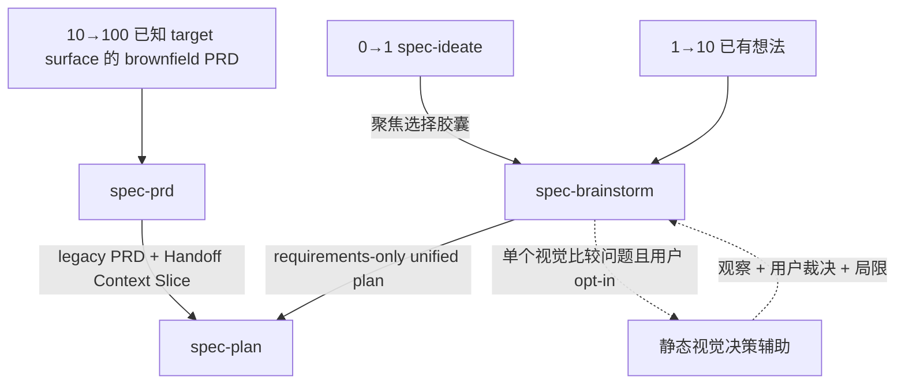
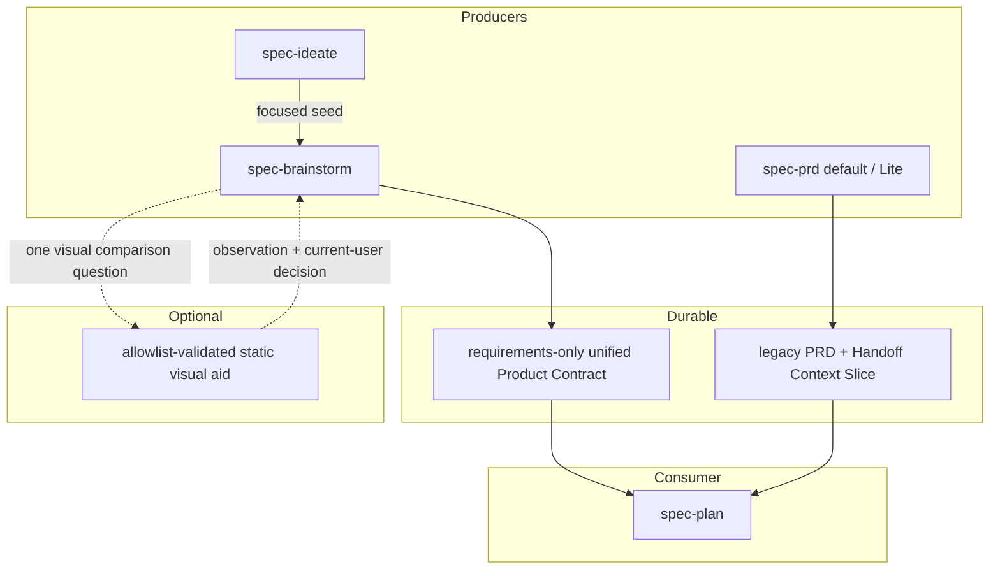
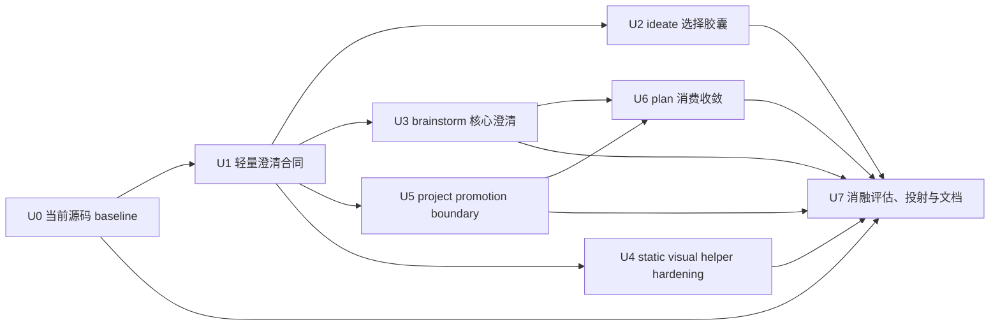

# 需求澄清能力轻量集成 - Plan

## Goal Capsule

- **目标：** 在不新增公共澄清工作流、不重建宿主执行运行时的前提下，减少从想法、需求探索和现有 PRD 进入规划时的承重 WHAT 丢失、重复提问、术语越权写入和规划侧需求发明。
- **产品路径：** 保持三条成熟度路径：`0→1: spec-ideate → spec-brainstorm → spec-plan`、`1→10: spec-brainstorm → spec-plan`、`10→100: spec-prd → spec-plan`。其中 10→100 仅适用于已有 PRD，或已经明确 target surface、release slice 与核心行为的 brownfield increment；产品形态仍未收敛时继续进入 `spec-brainstorm`。
- **当前 PRD 基线：** 当前 `spec-prd` 已具备默认 profile 与显式 opt-in 的 `analysis_profile=contract-reset-lite`。Lite 使用单一 Product Analysis Brief 合并分析门与风险排序，但保持 legacy PRD artifact、producer finalize、report-only validate 和 optional consumer diagnostic。当前执行对话用户是唯一人类产品确认人；专业、法规、隐私、安全、资金等材料只提供确认依据，不形成第二个人类确认入口。现有 Contract Reset Gate A 结论为 `inconclusive`，candidate 未推广，当前 reopen conditions 未满足。
- **本轮 PRD 范围：** 不新增 PRD 澄清适配器、不重开 Gate A、不改变 artifact topology、不新增 mandatory consumer receipt gate；只允许将 `CONTEXT.md`、项目词汇表和 ADR 的项目级写入统一收敛为 preview-first、单独批准。
- **视觉辅助边界：** 不新增公共或 standalone 的 `spec-prototype`。首版只在 `spec-brainstorm` 内收敛并加固现有 display-only visual probe，提供 opt-in、单问题、静态 HTML/CSS 决策辅助；禁止 agent-authored JavaScript。这里的 shell、真实仓库/生产数据与主工作区限制约束 visual artifact 及其展示路径，不禁止 producer 在主 workflow 中 source-first 读取项目 source；producer 只可为展示目的执行 bundled helper 的私有 run-root 创建、启动、状态读取和停止。
- **停止条件：** 不创建第二套需求制品、运行状态机、跨进程安全账本、worktree 接管协议、通用沙箱后端、PRD 平行评估平台或来源检查器；没有 confirmed failure evidence 时不提前建设这些机制。
- **后续责任：** 后续实施由 `spec-work` 按 U-ID 依赖顺序推进。本计划本身不授权实现、runtime regeneration、提交或发布。
- **源码基线失效条件：** 实施开始前必须重新读取 Appendix 中的 source refs。若 `spec-prd` topology、单一当前用户确认模型、Gate A 结论、`spec-plan` consumer policy、`spec-brainstorm` visual-probe contract 或相关文件 hash 已变化，先更新本计划再实施。

---

## Product Contract

### Summary

本计划把外部 `grilling`、`domain-modeling`、`handoff` 和 `prototype` 方法中仍有边际价值的部分，适配到现有 `spec-ideate`、`spec-brainstorm`、`spec-prd` 和 `spec-plan` 边界中。

核心做法是增强已有交接与判断点，而不是增加新的公共节点：



`spec-prd` 保持当前默认/Lite 双基线和现有 PRD→plan 用户控制语义。静态视觉决策辅助是 `spec-brainstorm` 的临时展示方法，不是第四条主路径、独立 skill、动态代码执行面或生产实现入口。

### 第一性原理重切

| 能力 | 当前源码事实 | 决策 |
| --- | --- | --- |
| 源码事实优先、一次一问、单一当前用户确认 | `spec-brainstorm` 与 `spec-prd` 已有较强能力；最新 PRD/Lite 已明确当前执行对话用户是唯一产品确认人，并整合 source inventory、confirmation basis 和 release-bounded closure | Adopt：复用并统一术语，不建立第二确认入口或共享执行器 |
| `spec-ideate` 选择交接 | 当前 focused seed 只有描述、basis、rationale、downsides 和 provenance | Wrap：补快照、局限、假设和相邻淘汰信息 |
| `spec-brainstorm` 场景与暂停恢复 | 已有 product pressure、blindspot、AE、Sources 和 Resolve Before Planning，但缺少稳定的“场景结果必须落点”与恢复最小信息 | Extend：在现有 Product Contract 内补齐，不增加状态机 |
| 项目级术语写入 | `spec-brainstorm` / `spec-plan` 会静默补写 `CONCEPTS.md`；触发的 `spec-prd grill-with-docs` 会 inline 更新 `CONTEXT.md` / ADR | Fix：统一 preview-first、单独批准 |
| 视觉决策辅助 | visual probe 已有 display-only helper，但当前缺少明确的 loopback、私有 temp root、静态 artifact validation、CSP/sandbox 与可访问性合同；任意 agent-authored JavaScript 无法仅靠 prose 和资源加载 CSP 证明 no-egress | Harden：保留静态 HTML/CSS 展示，删除动态 JavaScript 执行面，不建设 standalone、真实仓库上下文或跨宿主事务运行时 |
| PRD Contract Reset / Gate A | Gate A 已 `inconclusive`；owner 已选择 opt-in Lite，完整 migration 与 mandatory consumer gate 退出 active backlog | Stop：不重开、不平行建设 |
| `spec-plan` 来源解析 | 当前 upstream discovery 已识别 brainstorm requirements-only unified plan 与通用 legacy requirements doc；`spec-prd` 产物只是后者的一个子集，direct bootstrap/resume/deepen 仍独立存在 | Thin：澄清识别与 blocker 规则，不新增 inspector，也不缩窄直接规划入口 |

### Problem Frame

当前系统不是“缺少需求澄清”，而是存在四类更具体的问题：

1. **交接信息密度不稳定。** `spec-ideate` 的选择 seed 未携带承重 evidence 的基准版本、局限、未验证假设和最相关的淘汰替代，`spec-brainstorm` 可能重复推导或误把旧依据当当前事实。
2. **已具备的澄清结果没有统一落入 durable source。** `spec-brainstorm` 已有源码核实、一次一问和 AE，但暂停、上下文重置或临时 dossier 丢失后，下一执行者仍可能缺少准确的下一问题、承重源码引用和失效条件。
3. **项目级知识写入越过 mutation boundary。** 当前 `spec-brainstorm` / `spec-plan` 可静默修改 `CONCEPTS.md`；`spec-prd` 的 triggered grill-with-docs 还会把术语决策直接解释为 inline `CONTEXT.md` / ADR 写入授权。这违反 preview-first 和“需求制品本地闭合优先”。
4. **动态决策价值尚未验证，却被旧计划提前产品化。** 旧方案为一个可选原型旁路设计 standalone skill、多个安全账本、worktree 接管、强制沙箱、崩溃恢复、真实 Windows/POSIX 发布门禁和第二套 PRD Gate A。它在确认用户价值之前就承担了通用执行运行时的长期成本。当前 visual-probe helper 只是 display server；资源加载 CSP、`form-action` 和 CSP `sandbox` 不能把任意 agent-authored JavaScript 升级为可证明的 no-egress boundary，因此本轮删除动态 JavaScript，只保留可机械校验的静态展示面。

本轮解决前三类 confirmed gap，并为现有静态 visual helper 补最小安全与可用性地板；是否需要动态交互探针留待未来具备可信封闭 renderer 或浏览器级网络隔离后另立实验计划。

### Requirements

**流程与 ownership**

- R1. 三条推荐成熟度路径保持不变；澄清继续归当前 producer session 所有。存在 upstream artifact 时，`spec-plan` 只消费已确认或显式残留的 WHAT；直接调用的 bootstrap 兼容路径保持，但必须显式暴露未确认的产品假设，不能把 planning judgment 漂白成 producer-confirmed fact。
- R2. 不新增公共 `spec-grill`、`spec-requirements-clarification`、`spec-domain-modeling` 或 standalone `spec-prototype`。
- R3. `spec-ideate` 继续生成和筛选方向，不变成需求访谈，不直接进入规划或运行视觉辅助。
- R4. `spec-prd` 当前 default 与 `contract-reset-lite` profile、当前执行对话用户作为唯一人类产品确认人的模型、legacy artifact topology、producer finalize、report-only validate 和 optional `--verify-receipt` diagnostic 保持不变。
- R5. Gate A 当前 `inconclusive/no-promotion` 是 confirmed boundary；本计划及其实施无条件不授权新 attempt、candidate arm、runner 或 migration。未来重开必须另立 project-governance plan，由 repository/project owner 批准，并在创建 attempt 前先解决 hard-isolation launcher 与 independent custody 等可前置条件；模型 outcome、blind review、replay 等 attempt-internal evidence 只能在新 attempt 内取得。该治理授权不进入 PRD 产品确认路径，也不创建第二个人类产品确认入口。

**事实、问题与持久化**

- R6. 对仓库可发现的 current fact，producer 在询问用户前先查源码、测试、合同或当前文档；无法确认时明确标为假设、局限或需要的 source。
- R7. 当前执行对话用户是唯一人类产品确认人。所有会改变需求内容、验收、范围、术语、兼容、优先级、风险接受或 release behavior 的产品确认每轮只问该用户一个；`owner`、specialist、sign-off 等兼容字段或材料只表示证据、责任或评估语义，不得创建第二个人类确认入口。
- R8. source-answerable 或 source-sensitive 的 current-user question 必须绑定具名 gap、已执行的 source attempt、Product Contract / PRD write target，以及不闭合时 planning 会发明什么。纯产品偏好或开放探索若没有可查 source，记录 `source_attempt: not-applicable` 及原因即可，不为形式完整制造无效检索。
- R9. 只有源码或明确权衡足以支持时才提供推荐答案；证据探查与开放探索不得用推荐答案提前锚定用户。
- R10. 真正 headless、用户无回复或 context reset 时不得伪造 current-user closure；LLM/agent 只能分析、推荐和记录，scripts 只能确认结构、路径、hash、receipt 等确定性事实。producer 写入非就绪需求制品或 checkpoint shape，保留已确认内容、假设、局限、阻塞和下一问题。
- R11. 承重源码依据必须进入规范 Product Contract / PRD 的现有 Sources、Evidence、Assumptions、Decision Notes 或 Handoff Context Slice；至少记录 source ref、观察基准或版本、局限及失效条件。`/tmp` dossier 只作加速材料。
- R12. 不新增完整访谈记录、持久 gap 状态表、第三套 handoff artifact 或通用澄清 schema。

**`spec-ideate` 选择胶囊**

- R13. repo mode 的 focused seed 增加：承重 basis 的 source snapshot、dirty/unknown limitation、未验证假设、与所选方向直接相关的一个相邻淘汰替代，以及原 ideation artifact pointer。
- R14. seed 保持 feature-description-shaped；不得传递完整 ideation 文档、完整 rejection table、实现 HOW 或与当前选择无关的候选。
- R15. source snapshot 已失效时，`spec-ideate` 只将其标为 stale/limitation；是否重新溯源和如何改变需求由 `spec-brainstorm` 决定。

**`spec-brainstorm` 澄清与场景**

- R16. `spec-brainstorm` 在 run-local reasoning 中按 source fact、current-user decision、open exploration、planning-owned HOW、visual-aid candidate 分类 load-bearing gap；该分类不持久化为状态机。
- R17. Standard/Deep 的行为型需求在 Phase 2.5 综合前运行相关性驱动的场景 pass，候选维度为 happy path、role/permission、state transition、failure/degraded、negative acceptance 和 cross-context handoff。
- R18. 场景 pass 不生成维度笛卡尔积；每个被选中的场景必须落为 AE、Resolve Before Planning/OQ、明确 assumption 或 Non-Goal，否则视为 ceremony 并删除。
- R19. producer 暂停或进入新会话前，只要已经形成 durable decision，就创建或更新 requirements-only unified plan；`Resolve Before Planning` 明确 blocker 与下一问题，不新增 progress status。
- R20. Product Contract 本地术语决定当前 release slice 的含义；项目级 glossary/context/ADR 只作校准来源，冲突必须暴露，不能按文件名或新旧程度静默选胜者。

**项目级语言 promotion**

- R21. `spec-brainstorm`、`spec-plan` 和 `spec-prd` 均不得静默创建或修改 `CONCEPTS.md`、`CONTEXT.md`、`CONTEXT-MAP.md`、项目 glossary 或 ADR。
- R22. term/ADR 的产品确认与“是否提升到项目级 source”是同一当前用户给出的两个不同授权，不是两个不同角色。producer 先在 Product Contract / PRD 内闭合含义，再展示精确 preview；preview 必须包含 target path、proposed content、provenance、适用范围、真实 consumer、复用理由、invalidation condition、mutation scope、不写入的影响，以及当前用户对该项目级 path 拥有 mutation authority 的显式声明。只有资格判断通过、用户确认其权限并针对该 path 和内容单独批准后才 mutation；无法确认 authority 时保持 Product Contract / PRD-local，不路由第二个人类联系人。
- R23. ADR 仍只在 hard-to-reverse、surprising without context、real tradeoff 三项同时成立时提出；即使条件成立，也只产生 preview，不自动写入。缺少 R22 任一 durable knowledge qualification 时，不得以用户批准替代资格判断，只保留 Product Contract / PRD-local 结论。
- R24. 缺少项目级 glossary/context topology 不阻塞 planning，只要当前需求制品内的术语和决策已经充分闭合。

**静态视觉决策辅助**

- R25. 视觉辅助只在 source 与文本对话无法充分表达、答案可能改变 R/AE/Scope、且当前用户明确选择 visual path 时触发；一次只回答一个具名问题，不提供隐含的 interactive/dynamic 升级选项。
- R26. 复用 `skills/spec-brainstorm/references/visual-probes.md` 与现有 display helper，不新增 skill、server、registry、packet schema 或 browser-to-agent channel。
- R27. artifact 只允许 deterministic allowlist tokenizer 验证过的静态 HTML/CSS fragment 和 synthetic/sanitized data。允许集合仅覆盖展示型语义/布局标签，以及 `class`、`id`、`role`、`aria-*`、受 CSP 约束的 inline style；artifact 不允许 button、input、select、textarea、anchor、`tabindex` 或其他交互/可聚焦节点。所有 URL-bearing attribute 与不在 allowlist 的 tag/attribute 都拒绝。禁止 agent-authored JavaScript、`<script>`、事件处理属性、`javascript:`、meta refresh、form、anchor、frame/object、download 和动态 import。helper-owned refresh script 与 artifact 内容分离，只能访问 same-origin `/version`；现有 helper 无条件移除 `/files` route。响应前先以 `stat` 拒绝超过 512 KiB 的 artifact，tokenizer 最多处理 20,000 个 token、单元素 32 个属性、64 层嵌套和 500 ms 校验预算，任一超限即 fail closed、停止 helper 并清理 run root。
- R28. helper 只绑定 `127.0.0.1` 或 `::1`；非 loopback `--host` 必须 fail closed 并回退文本。`Host` 必须与实际绑定的 loopback 地址和端口精确匹配，IPv6 使用规范化方括号形式；存在 `Origin` 时必须与返回 URL 同源，无 `Origin` 只允许 `GET`/`HEAD` 顶层导航；authority 不一致的 absolute-form request 一律拒绝，且不发送 CORS 许可头。不提供 LAN/remote serving，也不把返回的 localhost URL 描述为远程可达。
- R29. helper-owned `start` 不再接受调用方指定的任意 root，而是在 OS temp 下用不可预测的 `mkdtemp` 创建 run root，并返回 `root`、`screen_dir` 与 `state_dir`；producer 只向返回的 `screen_dir` 写 artifact，`status`/`stop` 只接受 helper 返回的 root。目录权限为 `0700`、文件权限为 `0600`；读取前校验 owner、realpath、symlink、regular-file 与允许的 artifact type。裁决、取消、idle、owner 退出和 error 后递归清理 run root，不建设通用 cleanup ledger。
- R30. HTML、状态和拒绝响应使用经过测试的 restrictive CSP/sandbox、no-referrer、no-sniff、Permissions-Policy、`Cache-Control: no-store`、`Pragma: no-cache` 与 `Expires: 0`。CSP 只允许 helper-owned inline refresh、inline style、data image 和 same-origin `/version`；artifact validation 与 headers 是互补的 deterministic floor，不能只靠作者自觉或正则关键词扫描。
- R31. 静态页面保留现有 waiting/ready 与自动 reload，新增用户可见的 refreshing、refresh-failed、artifact-rejected 和 helper-unavailable 状态。每个状态必须定义触发条件、可见说明、live-region 播报、恢复动作和返回 chat/blocker 的出口。artifact 本身不包含可聚焦控件；若 helper shell 提供重试等 helper-owned 控件，必须单独满足键盘操作、可见 focus、可访问名称和状态播报。页面同时满足语义结构、DOM 阅读顺序、非颜色唯一信号、reduced-motion 和窄视口基线。chat 中当前用户的 response 才构成人类产品确认。
- R32. 没有 current-user response、浏览器能力、可安全构造的 synthetic artifact 或 helper deterministic floor 时，回退文本并保持 unresolved/inconclusive；不得声称已运行。动态问题若能安全重述为具名静态状态比较，可先展示静态并列或序列；只有实际状态切换对裁决不可替代、静态比较仍不足，或问题必须读取真实应用状态、执行 repo command、访问 external network 或修改真实工作树时，才回退文本并保留 blocker / future experiment candidate。

**`spec-plan` 消费**

- R33. `spec-plan` v1 的 upstream requirements-origin discovery 只识别两个当前真实 durable shape：`spec-brainstorm` 的 requirements-only unified plan，以及通用 legacy `docs/brainstorms/*-requirements.{md,html}`。`spec-prd` 产物是 legacy shape 的一个子集，由其现有 artifact/readiness/Handoff fields 识别；direct bootstrap、resume 和 deepen 行为保持不变。
- R34. 不预埋未来 `product_contract_source: spec-prd` unified topology；只有新的 repository/project-owner-approved producer migration plan 先落地后，consumer 才增加映射。该 source/topology 治理授权与当前用户作为唯一产品确认人是不同边界，不把项目治理者加入产品问答或产品确认路径。
- R35. 30 天只作候选发现提示，不证明 freshness。planning 根据持久 source refs、当前源码重读、limitations 和 invalidation condition 判断是否需要重新溯源。
- R36. `Resolve Before Planning`、`checkpoint-prd`、`can_enter_spec_plan: no` 或 load-bearing OQ 不能被静默忽略。存在 upstream producer 时 `spec-plan` 默认返回 producer；direct bootstrap 无 producer 时回到当前用户。现有用户控制语义保留：当前用户可以逐项把真正的产品 blocker 转成显式 decision/assumption 后继续。
- R37. producer receipt 验证保持 optional read-only diagnostic；本轮不把它升级为 consumer hard gate，也不新增 `inspect-requirements-origin.js` 或 `capture-prd-verifier-evidence.js`。
- R38. `spec-plan` 不再静默补写 `CONCEPTS.md`；发现项目级候选词汇时使用 R21-R24 的 preview-first promotion。

**交付与证据**

- R39. source 改动只发生在 `skills/`、`docs/contracts/`、测试、validation、README 和 CHANGELOG；generated runtime 只在 source/test/eval 通过后用 `spec-first init` 投射。
- R40. scripts/tests 只证明字段、路径、触发、loopback、temp 权限、artifact validation、CSP/sandbox response、禁止行为和投射事实；LLM/human fresh-source evaluation 判断问题质量、场景相关性、planning invention 与 current-user answer fidelity。
- R41. 语义评估必须分别覆盖 0→1、独立 1→10 和 10→100；0→1 样本不得替代直接 1→10。
- R42. 每个主效果指标同时记录 countermetric：额外 current-user confirmation rounds、token/latency、artifact size、无效 visual aid 数和错误 blocker 数；不能用更重 ceremony 换取表面完整。
- R43. 用户可见行为变化同步 README/README.zh-CN、当前执行文档和 CHANGELOG；计划本身的更新只同步 CHANGELOG。

### Actors

- A1. **当前执行对话用户 / 唯一产品确认人：** 基于 project source、专业材料或显式自我确认裁决需求、优先级、风险接受、defer/scope-cap；项目级 promotion 还需由该用户显式声明其对目标 path 的 mutation authority 并另行批准写入，无法声明时保持 PRD-local，不路由第二个人类联系人。
- A2. **`spec-ideate`：** 生成并筛选方向，提供聚焦选择胶囊。
- A3. **`spec-brainstorm`：** 查证事实、逐问澄清、维护 requirements-only Product Contract，并协调可选静态视觉决策辅助。
- A4. **`spec-prd`：** 处理已明确 target surface 的 brownfield PRD；保持当前 default/Lite 合同，只收敛项目级 promotion mutation。
- A5. **`spec-plan`：** 发现两类真实 upstream requirements origin，并保留 direct bootstrap/resume/deepen；按需重读源码、保留用户控制语义并设计 HOW。
- A6. **维护者 / repository governance owner：** 负责 source、tests、fresh-source evaluation、五宿主投射和发布证据，并单独批准 Gate A/topology 等项目治理变更；不参与或替代产品确认。

### Key Flows

- F1. **0→1：方向到需求**
  - **Trigger：** 用户从 `spec-ideate` 选中一个 repo-grounded idea。
  - **Steps：** `spec-ideate` 传递 focused seed；`spec-brainstorm` 复核 snapshot、关闭 source/current-user gap、生成 requirements-only unified plan。
  - **Outcome：** `spec-plan` 接收已选择方向的需求与局限，而不是整个 ideation candidate set。

- F2. **1→10：直接需求探索**
  - **Trigger：** 用户已有想法，但行为、范围、验收或术语尚未闭合。
  - **Steps：** `spec-brainstorm` 先查 source，再逐问 current-user decision，运行相关性场景 pass，必要时提供 opt-in 静态视觉决策辅助。
  - **Outcome：** Product Contract 包含足以规划的 WHAT，或明确的 Resolve Before Planning blocker。

- F3. **10→100：现有系统增量**
  - **Trigger：** 已有 PRD，或 target surface、release slice 与核心行为均明确的 brownfield increment。
  - **Steps：** `spec-prd` 使用当前 default 或显式 Lite profile 完成 source-first closure 和 producer finalize；本轮只把项目级 promotion 改为 preview-first。
  - **Outcome：** legacy PRD 与 Handoff Context Slice 继续作为 `spec-plan` 的当前输入；Gate A 和 topology 不变化。

- F4. **暂停与恢复**
  - **Trigger：** 用户暂停、无法回复、context reset 或宿主不能继续交互。
  - **Steps：** producer 将已确认需求、source refs、假设、局限、blocker 和下一问题写入规范制品。
  - **Outcome：** 新会话从 Product Contract / PRD 恢复，不依赖 transcript 或 `/tmp` dossier。

- F5. **静态视觉决策辅助**
  - **Trigger：** 一个布局、信息层级或多状态静态比较问题无法由 source 或纯文本充分表达，且用户明确选择 visual path。
  - **Steps：** producer 写明问题和判定标准，由 bundled helper 在私有 OS temp root 展示 allowlist-validated 静态 HTML/CSS artifact，用户观察后在 chat 给出 decision。
  - **Outcome：** observation、current-user decision、limitations 与 affected R/AE 写回 Product Contract；临时 artifact 不成为 source of truth。

### Acceptance Examples

- AE1. **Source-first。** 假设现有取消行为可从代码确认；当 producer 澄清目标时，先记录 current behavior，再只向用户询问 target decision。
- AE2. **逐问与单一确认入口。** 假设有三个相互独立的产品决定，其中一个有安全专家材料；每轮只向当前用户询问当前最高影响问题，专家材料只作为依据，答案分别绑定对应 write target，不联系第二个人类角色。
- AE3. **Ideate snapshot。** 假设 ideation artifact 保存后 HEAD 已变化；focused seed 标记 stale limitation，`spec-brainstorm` 不把旧 basis 当 current fact。
- AE4. **直接 1→10。** 假设没有 ideation artifact；`spec-brainstorm` 仍能独立生成 Product Contract，该样本不依赖 0→1 seed。
- AE5. **场景相关性。** 假设需求涉及多角色审批；permission、state、failure 和 handoff 场景进入 AE/OQ，不相关的离线规模场景被省略。
- AE6. **暂停恢复。** 假设对话在综合前暂停；requirements-only artifact 记录准确的下一问题和 source refs，删除 `/tmp` dossier 后仍可恢复。
- AE7. **术语冲突。** 假设 `CONCEPTS.md` 与规范 glossary 定义冲突；producer 暴露冲突并在当前制品内消歧，不静默修改任一项目文件。
- AE8. **Promotion 授权。** 假设术语已经在 PRD 内闭合；当前用户只确认术语含义、未批准项目级写入，或无法声明其对目标 path 的 mutation authority 时，`CONTEXT.md` 保持不变。即使用户批准，preview 缺少 provenance、适用范围、真实 consumer、复用理由或 invalidation condition 时也只保留 PRD-local，不提升为 durable knowledge。
- AE9. **静态视觉。** 假设用户比较三个布局；使用现有 display-only visual probe，不创建可运行探针合同。
- AE10. **动态问题降级。** 假设用户必须实际切换状态才能判断交互；本轮不生成 agent-authored JavaScript，而是展示具名状态的静态并列/序列视图，若仍不足则回退文本并保持 blocker。
- AE11. **无浏览器能力。** 宿主无法稳定显示 localhost artifact 时，回退文本讨论并保持问题 unresolved，不声称 probe 已运行。
- AE12. **展示边界。** 非 loopback host、artifact validation 失败、temp root/权限不满足，或问题必须由 visual artifact 读取真实 repo state、运行应用时，本计划 fail closed 到文本路径，不创建 worktree 或直接执行命令；producer 仍可在主 workflow 中读取 source 来回答 source fact。
- AE13. **Legacy consumer control。** PRD 声明 checkpoint 或 `can_enter_spec_plan: no` 时，`spec-plan` 默认返回 `spec-prd`；只有当前用户逐项接受 assumption/decision 后才能继续。
- AE14. **PRD no-regression。** 未显式传入 `analysis_profile=contract-reset-lite` 时使用 default profile；传入时只改变 run-local analysis shape，不改变 topology、validate 或 consumer policy。
- AE15. **Gate A stop。** 实施和评估均不创建新的 Gate A attempt、runner 或 candidate；当前 `inconclusive` 结论保持可追溯。
- AE16. **无静默 glossary write。** `spec-brainstorm`、`spec-plan` 与 triggered `spec-prd` 在未取得 promotion approval 时，运行前后项目级 glossary/context/ADR 文件 hash 不变。
- AE17. **专业依据不足。** 法规/隐私/安全/资金材料不足以支持确认时，workflow 只向当前用户提供“显式确认、defer、scope-cap、保留 source-candidate/assumption/blocker”选项；LLM 不替代确认，也不路由 named specialist。

### Success Criteria

- U0 在任何目标 source mutation 前冻结 case/source hashes、rubric、主指标与 countermetrics；0→1、独立 1→10 和 10→100 三条路径必须分别相对各自 baseline 有可举证的 load-bearing WHAT invention 减少，且额外 rounds/token/latency、错误 blocker、artifact size 等 countermetrics 不退化。
- representative cases 中，source 可回答却被询问给用户的事实数量为零或相对 baseline 减少，且 current-user answer fidelity 不下降、第二人类确认路由为零。
- requirements-only Product Contract 在 `/tmp` dossier 不存在时仍保留承重 source refs、limitations 和下一问题。
- project-level glossary/context/ADR 的未授权 mutation 为零；preview 与 approval 可回到具体 path 和 proposed content。
- 场景 pass 的每个保留项都有 AE/OQ/assumption/non-goal 落点；没有为了覆盖维度而生成的空仪式。
- 静态 visual helper 的 deterministic floor 全部通过：agent-authored JavaScript 为零、非 loopback fail closed、所有启动方式均不暴露 `/files`、私有 temp 权限与清理可验证、非法或超预算 artifact 在响应前被拒绝、无外部请求或仓库写入。静态视觉是否帮助用户决策只作 field observation，不以“关闭/改变 R/AE”冒充正确性证据。
- 默认 workflow 不新增 mandatory reference load；只有相关 signal 触发场景、领域语言或决策探针细节。
- U5、U3、U2、U6 分别运行 immediate-parent 与 final-arm leave-one-out 对照并记录 interaction；只有两类证据共同支持主指标改善，且额外 rounds/token/latency、错误 blocker、artifact size 等 countermetric 不退化时才保留。current-source tests、fresh-source evaluation、field outcome 和五宿主 source projection 分开记录，任何一层不能替代另一层。

### Scope Boundaries

**In scope**

- `spec-ideate` focused seed 的 evidence snapshot 与 limitation。
- `spec-brainstorm` 的轻量 gap 分类、场景落点、暂停恢复与 opt-in 静态视觉决策辅助。
- `spec-brainstorm`、`spec-plan`、`spec-prd` 项目级语言/ADR promotion 的 preview-first 边界。
- `spec-plan` 对现有两类 upstream requirements origin 的轻量发现规则、freshness 提示和用户控制语义；direct bootstrap/resume/deepen 不变。
- 聚焦 contract tests、fresh-source paired evaluation、五宿主投射和用户文档。

**Deferred until confirmed evidence**

- standalone/public `spec-prototype`。
- agent-authored JavaScript、真实 repo/application context、由 visual artifact 发起的 shell command、external network / arbitrary egress、worktree 或 OCI/micro-sandbox prototype execution；helper 自身的 same-origin `/version` refresh 仍在本轮范围内。
- browser-to-agent event channel、click tracking 或自动 verdict ingestion。
- persistent request registry、exactly-once consumption、crash-recovery ledger、retention anchor 和通用 cleanup receipt；本轮仍实现当前 run root 的最小私有化与清理。
- 新 `spec-prd` unified artifact topology、mandatory consumer receipt gate 或新的 Contract Reset Gate A attempt。
- `inspect-requirements-origin.js`、producer verifier snapshot executor 或通用 requirements schema。

**Non-goals**

- 用共享公共澄清 workflow 替换 `spec-brainstorm` / `spec-prd`。
- 持久化完整 interview transcript、run-local gap map 或每个可逆微决策。
- 把 browser probe artifact 当成 PRD、production code、测试覆盖或架构批准。
- 强制仓库必须存在 `CONCEPTS.md`、`CONTEXT.md`、`CONTEXT-MAP.md` 或 ADR。
- 手改 generated runtime mirrors。

### Dependencies And Assumptions

- 当前 PRD Gate A 的 source of truth 是 `docs/validation/spec-prd/2026-07-11-spec-prd-contract-reset-gate-a.md`；其结论为 `inconclusive`，reopen conditions 未满足。
- 当前 Lite source 是 `skills/spec-prd/references/product-analysis-lite.md`；它是 opt-in evaluation branch，不授权 topology migration。
- 当前 PRD/Lite confirmation model 的 source 是 `skills/spec-prd/SKILL.md` 与 `skills/spec-prd/references/product-analysis-lite.md`：当前执行对话用户是唯一人类产品确认人；specialist/regulated materials 只作依据，LLM 与 scripts 均不得替代产品确认。
- 当前 `spec-plan` 受 `tests/unit/spec-prd-plan-handoff-contracts.test.js` 保护：通用 legacy requirements 保持可读；其中的 PRD handoff 保留用户控制，consumer receipt diagnostic optional。
- 当前 visual probe server 只负责 display，接受任意 `--host`、固定返回 localhost URL、暴露 `/files`，且尚未设置本计划要求的私有 temp、artifact validation、CSP/sandbox/Permissions-Policy contract；chat response 仍是唯一人类产品确认。本计划只收紧并加固现有 helper，不扩展事件采集或 agent-authored JavaScript。
- 本计划依据当前磁盘 source，而不是仅依据 HEAD transcript。实施前必须按 Goal Capsule 的失效条件重读 source。

---

## Planning Contract

### Reuse And Adaptation

| Existing mechanism | Reuse | Adaptation | Reject |
| --- | --- | --- | --- |
| `spec-ideate` focused seed | title、description、basis、rationale、downsides、provenance | snapshot、limitation、assumption、相邻淘汰替代 | 整份 ideation artifact handoff |
| `spec-brainstorm` blindspot / pressure / AE | source-first、one-question、Product Contract | gap 分类、场景结果落点、暂停恢复 | 新 clarification engine |
| `spec-brainstorm` visual probe | OS temp、display helper、chat feedback | allowlist-validated 静态 HTML/CSS、loopback/private-temp/security headers、可访问性与显式 opt-in | agent-authored JavaScript、standalone prototype runtime |
| `spec-prd` default + Lite | source/confirmation basis、sole-current-user closure、Decision Card、receipt、Handoff Slice | 仅 project promotion preview-first | 第二确认入口、新 Gate A、topology、mandatory consumer gate |
| `spec-plan` Phase 0.2/0.5 | unified + legacy source discovery、用户 blocker 处置 | freshness 以 source refs 为主、禁止 silent glossary write | 新 origin inspector/runtime |
| domain-modeling | glossary conflict、精确术语、克制 ADR | local closure first、promotion separately approved | 固定文件名自动 authority |

### Key Technical Decisions

- KTD1. **澄清是 producer capability，不是新公共 workflow。**
- KTD2. **当前 PRD 是已实现邻接能力，不是待复制目标。** default/Lite 双基线和 Gate A stop condition 优先于旧计划假设。
- KTD3. **先修 confirmed gaps，动态执行留待具备可信隔离后另立实验。** seed、durable refs、promotion boundary、plan consumption 和静态 helper hardening 可分单元交付，但必须遵循 Implementation Sequence 与各 Unit 的显式依赖；这些单元均不依赖 Gate A、standalone prototype、sandbox backend 或新 consumer parser。
- KTD4. **视觉辅助留在 `spec-brainstorm`。** 父会话拥有问题、当前用户 opt-in、展示和 Product Contract 写回；没有第二个协调者、确认人或 browser-to-agent channel。
- KTD5. **v1 visual aid 是 static browser-contained presentation，不是 arbitrary code execution。** artifact 禁止 agent-authored JavaScript；helper 内小型 deterministic allowlist tokenizer、per-response nonce CSP、loopback-only serving、私有 temp 和 cleanup 共同构成 deterministic floor，任一层不可用即 fail closed。不引入通用 HTML sanitizer/parser dependency；若 allowlist 无法表达目标视觉，回退文本而不是扩张执行面。
- KTD6. **真实上下文明确不支持。** 不用普通进程、temp directory 或 worktree 冒充强隔离。
- KTD7. **durable source 仍是 Product Contract / PRD。** seed、dossier 和 browser artifact 都是临时输入。
- KTD8. **不新增 deterministic consumer parser。** 当前缺口由 prose contract 和聚焦测试可解决；等 repeated failure evidence 再 build。
- KTD9. **项目级 promotion 是独立 mutation。** 同一当前用户确认 term decision，不等于批准写 glossary/context/ADR；这是两次 consent，不是两个角色。
- KTD10. **场景按实质性推导。** selected dimension 必须改变 AE/OQ/assumption/non-goal，否则删除。
- KTD11. **保留 `spec-plan` 用户控制语义。** producer blocker 不能被静默忽略，但当前用户可显式转成 assumption/decision。
- KTD12. **证据强度匹配 claim。** contract test 证明结构、loopback/temp/artifact/response 地板；fresh-source paired eval 只判断问题质量和主 workflow 行为。视觉辅助是否改善决策属于 field outcome，不能用 reviewer 观察到“R/AE 被关闭”替代。

### High-Level Design



### Minimal Handoff Shapes

**Focused idea seed**

```text
title
description
basis + source_snapshot
why_it_matters
known_tradeoffs
evidence_limitations
unverified_assumptions
relevant_rejected_alternative
provenance_pointer
```

该 shape 是 run-local handoff，不新增 machine schema。字段缺失时 `spec-brainstorm` 仍可继续，但必须把缺口标为 limitation，而不是补写假事实。

**Product Contract persistence**

| Clarification result | Existing durable destination |
| --- | --- |
| current fact / source ref | Sources / Research、Problem Frame 或 Dependencies / Assumptions |
| current-user decision（兼容现有 Owner Decision Trace 字段名） | Requirements、Key Decisions、Scope Boundaries 或 Decision Notes |
| behavior scenario | Acceptance Example |
| blocking WHAT | Resolve Before Planning / Outstanding Questions |
| planning-owned HOW | Deferred to Planning |
| local term | Product Contract prose / glossary subsection when material |
| visual-aid observation | affected R/AE、Key Decision、limitations / invalidation |

### Static Visual Decision Aid Contract

1. producer 先写明一个问题、affected R/AE、文本/源码为何不足，以及用户应观察什么；visual path 需要当前用户显式选择，不存在 interactive/dynamic 隐式升级。
2. bundled helper 的 `start` 不接受调用方指定的任意 root，而是在 OS temp 下以 `mkdtemp` 创建不可预测 run root，返回 `root`、`screen_dir` 与 `state_dir`。producer 只向返回的 `screen_dir` 写 artifact；`status`/`stop` 只接受 helper 返回的 root。目录为 `0700`，artifact/state/log 文件为 `0600`；helper 校验 owner、realpath 与权限，symlink、非 regular file、越界路径或权限漂移在读取前 fail closed。旧 `--root /tmp/spec-first/.../<run-id>` 调用方式被替换。
3. artifact 只能使用 synthetic/sanitized data 与静态 HTML/CSS fragment。helper 内 deterministic allowlist tokenizer 只接受展示型语义/布局标签和 `class`、`id`、`role`、`aria-*`、inline style；artifact 禁止 button、input、select、textarea、anchor、`tabindex` 或其他交互/可聚焦节点。所有 URL-bearing attribute、未知 tag/attribute、`<script>`、事件处理属性、`javascript:`、meta refresh、form、anchor/navigation、frame/object 和 download 在响应前拒绝。tokenizer 必须识别 tag/attribute boundary、大小写和 entity normalization，不得以正则关键词扫描作为唯一验证，也不引入通用 parser dependency。响应前执行 512 KiB、20,000 token、单元素 32 属性、64 层嵌套和 500 ms 校验预算，任一超限即 fail closed、停止 helper 并清理 run root。
4. helper 只绑定 `127.0.0.1` 或 `::1`，并按实际地址返回可达 URL；非 loopback 或 remote/LAN serving 请求 fail closed。`Host` 必须与实际 loopback 地址和端口精确匹配，IPv6 使用规范化方括号形式；有 `Origin` 时必须同源，无 `Origin` 只允许 `GET`/`HEAD` 顶层导航；拒绝 authority 不一致的 absolute-form request，不发送 CORS 许可头。现有 helper 无条件移除 `/files`，除展示页面路由外唯一 helper-owned 辅助运行期 endpoint 是 `/version`。
5. helper 为每次 HTML 响应生成 nonce，只给 helper-owned refresh script 注入 nonce。CSP 至少为 `default-src 'none'; script-src 'nonce-<per-response>'; style-src 'unsafe-inline'; img-src data:; connect-src 'self'; font-src 'none'; media-src 'none'; object-src 'none'; frame-src 'none'; worker-src 'none'; manifest-src 'none'; base-uri 'none'; form-action 'none'; frame-ancestors 'none'; sandbox allow-scripts allow-same-origin`。根页面、状态页、错误页、拒绝响应和 `/version` 同时设置 `Referrer-Policy: no-referrer`、`X-Content-Type-Options: nosniff`、restrictive `Permissions-Policy`、`Cache-Control: no-store`、`Pragma: no-cache` 与 `Expires: 0`。
6. 页面保留现有 waiting/ready 与自动 reload，新增 refreshing、refresh-failed、artifact-rejected 和 helper-unavailable。每个状态定义触发条件、可见说明、live-region 播报、恢复动作与返回 chat/blocker 的出口。artifact 内容无可聚焦控件；如 helper shell 提供 retry 等 helper-owned 控件，只允许该 shell 控件，并验证键盘操作、focus-visible、可访问名称与状态播报。所有状态满足 landmark/heading、DOM 阅读顺序、非颜色唯一信号、reduced-motion 和窄视口要求；当前用户在 chat 中的 accepted/rejected/mixed 或自由文本才是唯一产品确认。
7. producer 将 observation、decision、limitation 和 invalidation 写回 Product Contract；裁决、取消、idle、owner 退出或 error 后 helper 停止并清理 run root。删除或保留临时 artifact 不改变需求事实。
8. 动态问题若能安全重述为具名静态状态比较，可先展示静态并列或序列；只有实际状态切换对裁决不可替代、静态比较仍不足，或无 browser capability、无 current-user answer、任何 deterministic floor 不可用、问题需要真实应用执行时，才停止并回退文本。不足以裁决则保留 blocker，不声称 visual aid 已运行或已证明产品结论。

### Implementation Sequence



U0 在任何行为改动前冻结 current-source baseline。U2 与 U3 没有强依赖，确保独立 1→10 路径不需要 ideation artifact。U1-U6 均不依赖 PRD Gate A、standalone prototype、sandbox backend 或新 consumer parser；U5 → U3 → U2 → U6 只作为可复现的累积 arm，U7 还需为每项执行 immediate-parent、final-arm leave-one-out 与 interaction 分析。U4 只验证现有静态 helper 的安全与无回归，不承担动态价值实验。

---

## Implementation Units

### U0. 冻结当前源码 baseline 与预注册评估协议

- **Goal：** 在任何行为改动前记录当前 source、代表性结果与评估规则，使后续每个 unit 都能被独立证伪。
- **Requirements：** R39-R42
- **Trace：** F1-F5；AE1-AE17；KTD12
- **Consumers：** U1-U7 的 unit exit、最终 current-source evaluation 与 field follow-up。
- **Files：**
  - 新增 `docs/validation/requirements-clarification/2026-07-11-clarification-integration-baseline.md`
  - 修改 `tests/unit/eval-fixture-contracts.test.js`
- **Approach：**
  - 在修改 skill source 前记录 Appendix source hashes、case IDs、输入 source refs 与 current behavior。
  - 预注册约 6 个组合 representative cases，覆盖 0→1、独立 1→10、10→100、promotion mutation、暂停恢复和静态 visual degraded path；详细 deterministic edge cases留在 focused tests，不把 17 个场景都升级为独立 fresh-source session。
  - 固定 rubric、judge/reviewer 条件、主指标、countermetrics、tie/inconclusive 规则与 case invalidation condition。对 U5/U3/U2/U6 同时预注册 immediate-parent 增量对照和 final-arm leave-one-out 对照，单列交互效应；retention 由两类证据共同裁决，不以固定累积顺序中的一次增量冒充独立增益。fresh-source reviewer 只形成 comparative semantic evidence，不替代真实 current-user outcome。
  - baseline 不把计划中称为 confirmed gap 的源码事实升级成已证实用户收益；只记录当前行为和可观察 failure signal。
- **Test scenarios：**
  - baseline 在任一目标 skill 改动前生成，source hash 可回查。
  - case ID、source refs、rubric 与 countermetrics 缺失时评估不可开始。
  - tie 或 inconclusive 不计 improvement；immediate-parent 与 leave-one-out 结论冲突时记录 interaction 并保持未证明，缺 current-user field evidence 时不声明决策质量提升。
- **Verification：** baseline artifact review、source hash check 与 eval fixture contract；不运行尚未实现的 candidate source。

### U1. 定义轻量澄清合同与当前 PRD 基线

- **Goal：** 固定 source-first、sole-current-user confirmation、durable persistence、scenario landing、promotion boundary 和 current PRD stop condition，不创建执行器或 schema。
- **Requirements：** R1-R12, R17-R18, R21-R24, R39-R42
- **Trace：** F2-F4；AE1-AE2、AE6、AE14-AE15、AE17；KTD1-KTD2、KTD7、KTD9、KTD12
- **Consumers：** U2-U7 对应的 `spec-ideate`、`spec-brainstorm`、`spec-prd`、`spec-plan` source prose、contract tests 与 evaluation；该文档不是 runtime entrypoint，U0 baseline 先于本 unit。
- **Files：**
  - 新增 `docs/contracts/workflows/requirements-clarification.md`
  - 新增 `tests/unit/requirements-clarification-contracts.test.js`
- **Approach：**
  - 合同只写会改变决定的 durable invariants。
  - 明确 current `spec-prd` default/Lite 双基线、Gate A `inconclusive` 和禁止平行 attempt。
  - 区分 script-owned facts、LLM-owned analysis/semantic judgment 与 current-user-owned product confirmation。
  - 明确 specialist/regulatory/privacy/security/financial materials 是 confirmation basis，不创建第二个人类入口。
  - 不新增 JSON schema、reason-code family、状态机、CLI 或 runtime command。
- **Test scenarios：**
  - source-answerable fact 不成为 current-user question。
  - 专业材料不足时由当前用户确认/defer/scope-cap，LLM 不代签、workflow 不联系第二人。
  - Product Contract/PRD 是 durable source，`/tmp` 不是。
  - Gate A current stop condition 可从准确 validation path 找到。
  - project promotion 是单独 mutation。
- **Verification：** 聚焦 contract test；直接检查 source refs 与当前文件 hash，不把 Graphify 或历史 transcript 当 confirmed truth。

### U2. 强化 `spec-ideate` focused seed

- **Goal：** 让 `spec-brainstorm` 继承选择依据与局限，而不把 ideation artifact 复制成 mini PRD。
- **Requirements：** R13-R15
- **Trace：** F1；AE3；KTD3、KTD7、KTD12
- **Files：**
  - 修改 `skills/spec-ideate/SKILL.md`
  - 修改 `skills/spec-ideate/references/post-ideation-workflow.md`
  - 新增 `tests/unit/spec-ideate-clarification-handoff-contracts.test.js`
- **Approach：**
  - 在现有 `Brainstorm One Idea` seed 中加入 snapshot、limitation、assumption 和一个相邻 rejected alternative。
  - 保留现有 title/description/basis/rationale/downsides/provenance。
  - 不读取或传递完整 saved artifact；不从 ideate 直接运行 probe 或进入 `spec-plan`。
- **Test scenarios：**
  - direct basis 当前有效。
  - HEAD 或 source changed 后 seed 标记 stale。
  - reasoned idea 无 direct evidence 时保留 unverified assumption。
  - rejection summary 很长时只携带与当前方向直接相关的一个替代。
- **Verification：** contract test 加 fresh-source evaluator，检查 seed 有用但不演变为 PRD。

### U3. 收敛 `spec-brainstorm` 核心澄清、场景与暂停恢复

- **Goal：** 用现有 Product Contract、AE、Sources 和 Resolve Before Planning 补齐探索主路径，不依赖视觉辅助或新增 workflow/runtime。
- **Requirements：** R6-R12, R16-R20
- **Trace：** F1-F2、F4；AE1-AE6、AE17；KTD1、KTD3、KTD7、KTD10、KTD12
- **Files：**
  - 修改 `skills/spec-brainstorm/SKILL.md`
  - 修改 `skills/spec-brainstorm/references/product-pressure-test.md`
  - 修改 `skills/spec-brainstorm/references/brainstorm-sections.md`
  - 修改 `skills/spec-brainstorm/references/handoff.md`
  - 新增 `tests/unit/spec-brainstorm-clarification-contracts.test.js`
- **Approach：**
  - 在当前 run-local reasoning 中分类 gap；不新增持久表。
  - 把 scenario pass 接到现有 product pressure 与 Acceptance Examples，不添加第二份 scenario reference。
  - 暂停时复用 requirements-only artifact 和 Resolve Before Planning。
  - Sources/Research 对承重 fact 增加 snapshot/limitation/invalidation 最小要求。
- **Test scenarios：**
  - source fact、current-user decision、HOW 和 future visual-aid candidate 正确分流，但没有 U4 时仍可完成 Product Contract。
  - 场景只保留会改变 AE/OQ/assumption/non-goal 的维度。
  - pause 后删除 dossier 仍可恢复。
  - 纯产品偏好无 source 可查时记录 not-applicable reason，不执行无效 source ceremony。
- **Verification：** contract tests 与 fresh-source paired cases；无 browser host 或 U4 degraded 时本 unit 仍必须独立通过。

### U4. 加固现有 static visual helper

- **Goal：** 在不新增 server/skill/runtime 或 agent-authored JavaScript 的前提下，为现有 display-only visual helper 补 loopback、私有 temp、静态 artifact validation、响应头、生命周期与可访问性地板。
- **Requirements：** R25-R32
- **Trace：** F5；AE9-AE12；KTD3-KTD6、KTD12
- **Dependencies：** U0、U1；不依赖 U2/U3，且不阻塞无浏览器的核心澄清路径
- **Files：**
  - 修改 `skills/spec-brainstorm/SKILL.md`
  - 修改 `skills/spec-brainstorm/references/visual-probes.md`
  - 修改 `skills/spec-brainstorm/scripts/visual-probe-server.js`
  - 新增 `tests/unit/spec-brainstorm-decision-probes.test.js`
- **Approach：**
  - display-only 继续默认；只在当前用户明确选择 visual path 且一个具名问题适合静态比较时生成 synthetic HTML/CSS fragment。动态交互需求展示静态状态序列或回退文本，不生成 JavaScript。
  - `start` 替换旧的调用方 `--root` 方式，由 helper 执行 `mkdtemp` 并返回 `root`、`screen_dir`、`state_dir`；producer 只向返回的 `screen_dir` 写入，`status`/`stop` 使用返回的 root。读取前执行 owner/realpath/symlink/regular-file/type 校验，裁决、取消、idle、owner exit 和 error 后递归清理。
  - helper 只允许 loopback；按 R28 的 Host/Origin/IPv6/absolute-form/CORS 矩阵校验请求。现有 helper 在所有启动方式下无条件移除 `/files` route。
  - helper 内小型 deterministic allowlist tokenizer 在响应前拒绝 script/event/navigation/form/URL-bearing attribute 等 active content；helper refresh 使用 per-response nonce，不与 artifact 共享脚本权限。若 allowlist 不足以表达目标视觉，回退文本，不扩张 tokenizer 为通用 HTML sanitizer。
  - 保留现有 waiting/ready 与自动 reload，新增 refreshing、refresh-failed、artifact-rejected、helper-unavailable 和 chat fallback；按状态表定义触发、可见说明、live-region、恢复与 blocker 出口。artifact 不允许交互/可聚焦节点；helper-owned shell 控件单独满足键盘/focus/name 要求。
  - 对 artifact 执行 R27 的大小与复杂度预算；对所有 HTML、状态、拒绝和 `/version` 响应执行 R30 的安全头与禁止缓存合同。
- **Test scenarios：**
  - static layout 继续 display-only，现有 refresh/lifecycle 行为不回归。
  - `127.0.0.1` 与 `::1` 返回正确 URL；`0.0.0.0`、LAN address、Host/port 不匹配、非同源 Origin、非法 IPv6 authority、absolute-form authority 不一致均 fail closed，且不发送 CORS 许可头。
  - `start` 返回 helper-owned `root`/`screen_dir`/`state_dir`，旧任意 `--root` 调用被拒绝；目录/文件权限、symlink/realpath/regular-file 拒绝和五类终止清理均有 deterministic tests。
  - script/event handler/meta refresh/anchor/form/external URL、超 512 KiB、超 token/attribute/depth/time budget 的 artifact 在发送任何 HTML 前被拒绝；默认、foreground、IPv4 和 IPv6 启动路径的 `/files/*` 均返回 404。
  - 根页面、状态页、错误页、拒绝响应和 `/version` 带 nonce CSP `sandbox`、no-referrer、no-sniff、restrictive Permissions-Policy 与 no-store headers，只有 helper-owned `/version` refresh 可运行。
  - waiting、ready、refreshing、refresh-failed、artifact-rejected、helper-unavailable 分别验证 landmark/heading、DOM 阅读顺序、live-region、非颜色唯一提示和恢复动作；reduced-motion 下无非必要动画，在 320 CSS px 窄视口保持选项标签/顺序且正文无非预期横向滚动。Jest/DOM 断言确认结构与状态合同，人工浏览器 characterization 确认 focus-visible、播报体验和窄视口可读性。
  - 无 current-user answer、需要真实 app context、动态交互、browser 不可用或任一 floor 不可用时保持 blocker/text fallback。
- **Verification：** helper characterization/HTTP/security/lifecycle tests、before/after workspace snapshot 与静态 visual no-regression；不创建 prototype lifecycle、动态语义或真实用户价值 gate。

### U5. 统一项目级语言与 ADR promotion mutation boundary

- **Goal：** 消除 `CONCEPTS.md`、`CONTEXT.md` 和 ADR 的 silent/implicit write，同时保留需求制品本地闭合。
- **Requirements：** R20-R24, R38
- **Trace：** F2-F3；AE7-AE8、AE16-AE17；KTD2、KTD7、KTD9、KTD12
- **Files：**
  - 修改 `docs/contracts/domain-glossary.md`
  - 修改 `skills/spec-brainstorm/SKILL.md`
  - 修改 `skills/spec-plan/SKILL.md`
  - 修改 `skills/spec-prd/SKILL.md`
  - 修改 `skills/spec-prd/references/domain-language-and-decision-ledger.md`
  - 修改 `skills/spec-prd/references/grill-with-docs-integration.md`
  - 新增 `tests/unit/requirements-language-promotion-contracts.test.js`
  - 修改 `tests/unit/spec-prd-lite-profile-contracts.test.js`
- **Approach：**
  - 删除 `spec-brainstorm` / `spec-plan` 的 `Apply silently` 行为。
  - `spec-prd` 中当前用户对术语/决策的确认只关闭 PRD-local WHAT；项目级 file mutation 需要同一用户独立 preview + approval。
  - preview 包含 target path、精确 proposed content、provenance、适用范围、真实 consumer、复用理由、invalidation condition、confirmation/mutation scope、不写入的影响，以及当前用户对目标 path 拥有项目级 mutation authority 的显式声明。无法声明 authority 时保持 PRD-local，不路由第二人。
  - preview 字段齐全只满足 deterministic exit gate；内容是否值得 durable promotion 仍由 LLM/human 依据真实复用价值判断。任一资格缺失时保留 Product Contract/PRD-local，即使已取得写入批准也不 promotion。
  - validate 保持 report-only；不借 promotion 修改文件。
  - 当前 `product-analysis-lite.md` 只作 single-confirmer/no-topology-drift 回归基线；除非实施时发现它直接声明项目级 mutation，否则不修改该刚更新的 reference。
- **Test scenarios：**
  - `CONCEPTS.md` 存在但 term 缺失，未批准时文件不变。
  - triggered grill-with-docs 解决术语后只写 PRD，未单独批准时 `CONTEXT.md` 不变。
  - ADR 三条件满足但未批准时只展示 preview。
  - 用户批准写入但缺真实 consumer 或 invalidation condition 时不修改项目级文件。
  - 当前用户确认术语和 proposed content，但无法声明其对目标 path 的 mutation authority 时不修改项目级文件，也不联系第二人代签。
  - Lite profile 加载 domain reference 时不产生隐式写入。
- **Verification：** 运行前后 path/hash snapshot；测试 default 与 Lite profile、create/refine/validate。

### U6. 收窄 `spec-plan` 来源消费与 blocker 语义

- **Goal：** 减少 planning invention 和静默 mutation，而不新增 parser、receipt gate 或未来 producer dead contract。
- **Requirements：** R33-R38
- **Trace：** F1-F4；AE4、AE6、AE13-AE14；KTD7-KTD8、KTD11
- **Dependencies：** U1、U3、U5；不依赖 U2 或 U4 visual helper
- **Files：**
  - 修改 `skills/spec-plan/SKILL.md`
  - 修改 `tests/unit/spec-plan-contracts.test.js`
  - 修改 `tests/unit/spec-prd-plan-handoff-contracts.test.js`
- **Approach：**
  - Phase 0.2 的 upstream discovery 保留 brainstorm requirements-only unified artifact 与通用 legacy requirements 两类真实来源；不改变 direct bootstrap、resume 或 deepen。
  - 30-day 判断明确降为 discovery hint。
  - 读取 source refs、limitations、Resolve Before Planning、PRD write/readiness fields 与 Handoff Slice。
  - upstream-sourced run 默认把 true product blocker 路由回 producer；direct bootstrap 回当前用户。保留现有逐项转 explicit assumption/decision 的用户选择。
  - 不新增 `product_contract_source: spec-prd` unified branch、`inspect-requirements-origin.js` 或 verifier snapshot executor。
  - 删除 silent `CONCEPTS.md` gap-fill，改用 U5 promotion。
- **Test scenarios：**
  - brainstorm requirements-only artifact 原地 enrichment。
  - 通用 legacy requirements 仍可作为 origin；当其中存在当前 PRD fields/Handoff Slice 时，保持 user-selected entry 与 optional receipt diagnostic。
  - 无 upstream source 时仍创建 `product_contract_source: spec-plan-bootstrap`，不因 origin discovery 收窄而拒绝 direct planning。
  - 显式 implementation-ready path 仍走 resume/deepen fast path，不被 Phase 0.2 origin discovery 接管。
  - checkpoint / `can_enter_spec_plan: no` 不被静默忽略。
  - 当前用户显式转换 blocker 后可以继续，记录 accepted risk。
  - source ref changed 时 planning 重新读取并记录 limitation。
- **Verification：** 现有 handoff tests 加 focused behavior tests；不建立跨技能 runtime dependency。

### U7. 逐单元消融评估、五宿主投射与用户文档

- **Goal：** 相对 U0 baseline 逐单元证明核心改造减少下游发明和越权 mutation，拒绝用总体 core arm 掩盖无效机制，并把静态 helper 安全证明与产品效果声明分开。
- **Requirements：** R39-R43
- **Trace：** F1-F5；AE1-AE17；KTD12
- **Dependencies：** U0-U6；U2 与 U3 作为独立能力分别评估
- **Files：**
  - 修改 `tests/unit/eval-fixture-contracts.test.js`
  - 修改 `tests/unit/host-runtime-projection-contracts.test.js`
  - 修改 `tests/unit/plugin-modules.test.js`
  - 修改 `README.md`
  - 修改 `README.zh-CN.md`
  - 修改 `docs/05-用户手册/23-spec-prd当前执行逻辑.md`
  - 新增 `docs/validation/requirements-clarification/2026-07-11-clarification-integration-current-source-evaluation.md`
  - 修改 `CHANGELOG.md`
- **Approach：**
  - 使用 U0 当前源码 baseline，U5 deterministic mutation boundary → U3 core clarification → U2 focused seed → U6 plan consumer 只定义一个可复现的累积 arm，不单独证明独立增益。每个单元同时运行 immediate-parent 增量对照与 final-arm leave-one-out 对照，单列 interaction；只有两类证据共同支持主指标改善且 countermetric 不退化时才保留，结论冲突时保持未证明并收窄或删除。
  - 使用约 6 个预注册组合 core cases；focused tests 承担结构、边界和 edge-case 覆盖，不为每个断言启动独立 fresh-source session。
  - U4 只通过 deterministic helper gates 与 static visual no-regression；不把“用户改变/关闭 R/AE”作为 retention 或正确性指标。未来 dynamic capability 必须另立计划并先提供可信封闭 renderer/浏览器级网络隔离。
  - PRD 组只验证 no-regression 和 promotion mutation boundary；不创建 Gate A candidate。
  - 记录 planner invention、source-answerable questions、current-user fidelity、second-human routing、scenario omission、unauthorized mutation、额外 rounds/token/latency、artifact size、错误 blocker 和 visual-aid fallback。
  - fresh-source evaluation 证明触发、降级与语义比较；若未来要声明决策质量提升，另做有 owner、截止日期、case/source hash、rubric、framing-bias/反转率指标且 `tie/inconclusive = no-retain` 的 current-user opt-in field pilot。
  - source tests 通过后用现有 plugin sync 投射 modified reference；不新增 governance entry。
- **Test scenarios：**
  - 0→1、独立 1→10、10→100 各自独立样本。
  - 删除 U2 输入后直接 1→10 结果不回归；U5/U3/U2/U6 各有 immediate-parent 与 final-arm leave-one-out 结果，能够区分独立增益、组合交互和负收益。
  - 无 subagent/browser host 的诚实 degraded behavior。
  - 五宿主都获得修改后的 existing skill resources；没有 `spec-prototype` 新入口。
  - static tests 通过但 semantic sample 失败时发布阻塞。
- **Verification：** Verification Contract 中的 focused、repository、projection 与 fresh-source gates。

---

## Verification Contract

### Focused Contract Tests

```bash
npx jest --runInBand \
  tests/unit/requirements-clarification-contracts.test.js \
  tests/unit/spec-ideate-clarification-handoff-contracts.test.js \
  tests/unit/spec-brainstorm-clarification-contracts.test.js \
  tests/unit/spec-brainstorm-decision-probes.test.js \
  tests/unit/requirements-language-promotion-contracts.test.js \
  tests/unit/spec-plan-contracts.test.js \
  tests/unit/spec-prd-lite-profile-contracts.test.js \
  tests/unit/spec-prd-plan-handoff-contracts.test.js \
  tests/unit/plugin-modules.test.js \
  tests/unit/host-runtime-projection-contracts.test.js \
  tests/unit/eval-fixture-contracts.test.js
```

测试至少证明：

- focused seed 字段和 source limitation。
- scenario pass 有具体落点且无全维度强制。
- static visual helper 只允许 loopback/private temp，allowlist-tokenized artifact validation、resource budget 与 nonce CSP/sandbox/no-store deterministic floor 生效；agent-authored JavaScript、所有启动路径的 `/files`、external request、repo mutation 和伪运行声明均为零。
- current user 是唯一人类产品确认入口；specialist material 只作 evidence，LLM/scripts 不替代确认。
- glossary/context/ADR 未授权时 hash 不变。
- default/Lite PRD profile、legacy topology、report-only validate、optional consumer diagnostic 不漂移。
- `spec-plan` 保留 direct bootstrap/resume/deepen 与用户控制 blocker 语义，且不静默写 glossary。

### Repository Gates

```bash
npm run lint:skill-entrypoints
npm run typecheck
npm run test:eval-fixtures
npm test
npm run build
git diff --check
```

优先运行 focused tests；只有影响面确认需要时扩大。不得新增 `test:prototype-release`、真实 Windows prototype lifecycle 或 OCI sandbox gate。

### Five-Host Projection

源码测试和语义评估通过后：

```bash
node bin/spec-first.js init --claude --codex --cursor --kiro --qoder -y --dry-run
node bin/spec-first.js init --claude --codex --cursor --kiro --qoder -y
node bin/spec-first.js doctor --claude --json
node bin/spec-first.js doctor --codex --json
node bin/spec-first.js doctor --cursor --json
node bin/spec-first.js doctor --kiro --json
node bin/spec-first.js doctor --qoder --json
```

runtime projection 只验证 source delivery 和 path rewrite；不能证明问题质量或用户结果。

### Fresh-Source Evaluation

按 `docs/contracts/workflows/fresh-source-eval-checklist.md` 使用新会话 reviewer 读取当前磁盘 source。

预注册约 6 个组合样本；精确 case IDs、source hashes 与 rubric 写入 U0 baseline：

1. **0→1 handoff：** source-answerable current fact、current behavior/target conflict、stale ideation basis 和一个相邻 rejected alternative。
2. **独立 1→10：** 无 ideation artifact，三个独立 current-user decision 逐次只问一个，并覆盖 permission/state/failure/negative/handoff 的相关场景落点。
3. **暂停恢复：** 无 transcript、无 `/tmp` dossier，仍从 Product Contract 恢复 source refs、limitations、blocker 和下一问题。
4. **Promotion mutation：** glossary authority conflict、未授权 promotion，以及批准但缺 provenance/consumer/invalidation qualification 时项目级文件保持不变。
5. **Static visual/degraded：** display-only layout、动态问题降级为静态状态比较或文本、非 loopback/非法 artifact/browser 不可用/真实 repo context 均 fail closed；helper deterministic edge cases由 focused tests证明。
6. **10→100 与 planning no-regression：** default/Lite、specialist evidence single-confirmer、legacy PRD checkpoint 用户处置、Gate A stop、direct bootstrap 和 implementation-ready resume/deepen 均保持。

主要指标：

- planner 发明的 load-bearing WHAT。
- 向用户询问的 source-answerable facts。
- 重复/捆绑 current-user questions。
- applicable scenario omissions。
- current-user answer / confirmation laundering 与 second-human routing。
- unauthorized project-level mutations。
- 额外 rounds、tokens、latency 和 artifact size。
- 每个 U5/U3/U2/U6 单元的 immediate-parent、final-arm leave-one-out、interaction 与 countermetric 变化；tie/inconclusive 或两类对照冲突记为未证明。
- static visual 的触发准确性、fallback 诚实性和额外 rounds；不从 fresh-source reviewer 推导真实决策正确性。

### Release Gates

- U0 必须在任何目标 source mutation 前完成；缺 baseline、case/source hash、rubric 或 countermetric 时不得声明 improvement。
- U1-U3 可以独立落地，并且不依赖任何 browser helper 代码；U2 不得成为直接 1→10 的前置条件。
- U4 必须通过 loopback/private-temp/artifact-validation/resource-budget/nonce-CSP/no-store/lifecycle/accessibility characterization 与 static visual no-regression；不存在 dynamic semantics retention 分支。
- U5 必须同时覆盖 brainstorm、plan、PRD default/Lite 和 validate no-mutation；当前 Lite reference 默认只测不改。
- U6 不改变 direct bootstrap/resume/deepen、legacy PRD user-control 或 optional receipt policy。
- U7 的每个 U5/U3/U2/U6 单元必须同时有 immediate-parent、final-arm leave-one-out 与 interaction 结果；无两类证据共同支持的增益、结论冲突或 countermetric 退化时，单元先删除/收窄再进入投射。只有 focused tests 与 current-source evaluation 无 P0/P1 时才能投射 runtime。
- 任何新增 P0/P1 semantic finding、unauthorized mutation、second-human routing 或 confirmation laundering 阻塞发布。

---

## Definition of Done

- 三条成熟度路径保持稳定，10→100 入口与当前 `spec-prd` brownfield boundary 一致。
- 当前 PRD default/Lite 双基线和 Gate A `inconclusive/no-promotion` 被准确记录；没有新 Gate A、topology 或 consumer gate。
- 当前执行对话用户保持唯一人类产品确认人；specialist/regulated materials 只作依据，LLM/agent 与 scripts 不替代产品确认。
- `spec-ideate` focused seed 携带 source snapshot、limitations、assumptions 和相关淘汰信息，但不变成 mini PRD。
- `spec-brainstorm` 先查 source、逐问当前用户、运行相关性场景 pass，并在暂停时把 durable state 写入 requirements-only Product Contract。
- 所有保留场景都有 AE/OQ/assumption/non-goal 落点。
- `spec-brainstorm`、`spec-plan` 和 `spec-prd` 的 project-level glossary/context/ADR write 均为 preview-first、当前用户显式声明目标 path mutation authority、单独批准；无法确认 authority 时保持 PRD-local。
- visual aid 只存在于 `spec-brainstorm` existing visual-probe surface，使用 allowlist-validated 静态 HTML/CSS、loopback/private temp、resource budget、nonce CSP/sandbox/no-store 和明确 lifecycle/accessibility contract；所有启动路径均无 `/files`，没有 agent-authored JavaScript、external request、repo write、真实数据或由 artifact 发起的 shell execution。
- 没有 standalone `spec-prototype`、request registry、worktree takeover、sandbox runner、cleanup ledger 或 prototype release gate。
- `spec-plan` upstream discovery 只识别当前两类真实 durable origin，30-day 仅为提示；direct bootstrap/resume/deepen 保持，blocker 不被静默忽略，用户控制 assumption/decision 路径保持。
- U0 baseline、focused tests、repository gates、逐单元 fresh-source evaluation、field outcome（如有）和五宿主 source projection 分别记录；任何一层不替代另一层。
- U5/U3/U2/U6 均有 immediate-parent、final-arm leave-one-out 与 interaction 证据；无两类证据共同支持的增益或 countermetric 退化的 change 不因总体 core arm 变好而保留。
- README、README.zh-CN、当前执行文档和 CHANGELOG 与最终实现一致。
- generated runtime 未手改；需要刷新时只从 source 运行 `spec-first init`。
- U0-U7 各自的 Requirements、Trace、Test scenarios 与 Verification 均有实际证据；不得用 U7 总体验证替代单 unit exit。
- `tests/unit/spec-brainstorm-decision-probes.test.js` 永久保留为 static helper characterization/no-regression suite；最终 diff 不包含 dynamic probe prose、cases、fixtures 或 abandoned experiment/code。

---

## Appendix

### Current Source Evidence

| Source | Current fact | SHA-256 at plan update |
| --- | --- | --- |
| `skills/spec-prd/SKILL.md` | default + exact-token opt-in Lite；当前用户 sole human product confirmer；legacy topology；producer finalize；validate report-only | `74db75f381d99ad118b00dbfa88b3bc72a973793d64caa5153d8964ef7689bd4` |
| `skills/spec-prd/references/product-analysis-lite.md` | single Brief；confirmation basis；sole current-user confirmer；no unified sibling/consumer gate | `465b94f085904363524dc11cade3b65e1058d79f37359da766bba8f2774d4dc4` |
| `docs/validation/spec-prd/2026-07-11-spec-prd-contract-reset-gate-a.md` | `Decision: inconclusive`；candidate no-promotion；reopen conditions | `dfb7d21b4798cede53f82554d9bf112794e1b346336c01eaa202d761c9d5bfb8` |
| `tests/unit/spec-prd-lite-profile-contracts.test.js` | Lite exact opt-in、single confirmer、topology/validate/consumer boundary、五宿主正文 projection | `914bda5feec0e722874d3425fe6d69e7fc18fdd439305aa6b564cb809925a98b` |
| `skills/spec-brainstorm/SKILL.md` | source verification、one-question、Product Contract、silent `CONCEPTS.md` capture | `5f29ad557bde6d2c4171432068840c76d441e9887f3e3ad191c4cd0d1e1ad07c` |
| `skills/spec-brainstorm/references/visual-probes.md` | display-only feedback contract；允许必要的 disposable interaction demo；chat response authoritative | `8ffc76d2f6786c10b16e2bb3ff6d34b7a6310ce009578f5d7d1c380ffb2d9b62` |
| `skills/spec-brainstorm/scripts/visual-probe-server.js` | 现有 localhost display helper；注入 `/version` refresh；当前无 CSP/sandbox/Permissions-Policy headers | `6bbc37398aa79b5aef597e24f55a5bba386564dbedeca10498f10fe3e96ad0e3` |
| `skills/spec-plan/SKILL.md` | unified + legacy discovery、30-day hint、silent `CONCEPTS.md` gap-fill | `7afaf3266ddad266caab69ba6268d2f47026ecad248b3f7609c5603c19fb4286` |
| `skills/spec-ideate/references/post-ideation-workflow.md` | focused seed 缺少 snapshot/limitations/assumptions | `94d5771bd579c5c97d6937dcce6642e2e51a905a60605829880cc764beace126` |

实施前若任一 hash 不匹配，hash mismatch 只表示需要重读和语义 rebase，不自动判定计划失效。

### Review Coverage

- coherence-reviewer：确认 direct 1→10 不应依赖 U2，并收窄 external network boundary，保留 helper-owned same-origin `/version`。
- feasibility-reviewer：确认 U7 必须在实施前取得 baseline，remote `--host` 与固定 localhost URL 不一致，且动态 no-go 后测试资产边界需要永久 characterization suite。
- product-lens-reviewer：确认“关闭/改变 R/AE”不能证明决策正确，效果声明需要 unit ablation、countermetrics 与后续 current-user field outcome。
- design-lens-reviewer：补齐 waiting/ready/error、chat fallback、键盘/焦点/状态播报、非颜色信号、reduced-motion 与窄视口基线。
- security-lens-reviewer：确认任意 inline JavaScript 无法仅靠 CSP 证明 no-egress，要求删除 agent-authored JavaScript，并补 loopback/private-temp/parser-validation/nonce-CSP/cleanup 地板。
- scope-guardian-reviewer：将 17 个 fresh-source sessions 收敛为约 6 个组合 case，把 deterministic edge cases留在 focused tests，并删除重复 repository gates。
- adversarial-document-reviewer：要求 U0 baseline 与 U5→U3→U2→U6 消融，避免总体 core arm 掩盖无效或负收益机制。
- 2026-07-12 best-judgment resolution：用户确认批量应用全部 13 项 actionable finding；文档层已删除 dynamic probe experiment 和 retention threshold，实施与验证证据仍待 `spec-work` 按 U0-U7 产生。
- 2026-07-12 second multi-agent review：自动修复 2 项内部一致性问题；用户确认 best-judgment 批量应用 13 项修订，补齐 helper CLI、request matrix、resource/cache/state/accessibility、promotion authority 与双对照消融合同；3 项 U4 产品/架构根决策进入 Deferred / Open Questions。

### Research Limitations

- 本轮以当前仓库 source、tests、validation 和 git history 为事实依据；Graphify 仅作 advisory 导航，重要结论均回源确认。
- 未重新运行 Contract Reset Gate A，也未把当前 `inconclusive` 追溯升级。
- 未实施本计划、未运行计划中尚不存在的新 tests、未做 runtime projection；本次只更新 plan 与 CHANGELOG，并执行 Markdown/差异一致性检查。
- 静态 visual aid 的真实用户价值仍缺 field outcome，因此本计划只承诺 deterministic safety/no-regression，不宣称提升决策正确性。未来动态能力必须另立计划并先满足可信隔离前提。

## Deferred / Open Questions

### From 2026-07-12 review

- **静态视觉 helper 的保留形态尚未裁决** — Problem Frame / U4 (P1, product-lens、scope-guardian、adversarial, confidence 100)

  团队会在尚无真实用户价值证据时，为可选视觉能力承担安全、生命周期和可访问性维护成本。后续需要基于可回源 field signal 裁决：当前禁用并保留文本回退，还是仅保留 helper-owned 固定模板形式；在裁决前不得把 helper hardening 当成产品价值证据。

- **U4 renderer / parser 策略尚未裁决** — KTD5 / U4 (P1, security-lens、scope-guardian、adversarial, confidence 75)

  若决定保留 U4，仍需在 helper-owned 固定模板、maintained parser allowlist 与自研 tokenizer 之间作出明确选择。当前计划的自研 tokenizer 同时承担安全边界和维护复杂度，缺少足以排除更小方案的比较证据。

- **U4 是否应脱离核心发布 tranche** — Implementation Sequence / U7 (P1, scope-guardian, confidence 75)

  U7 当前依赖 U0-U6，使可选 visual hardening 可能阻塞核心澄清、promotion 和 plan-consumer 改造。是否拆分核心与 visual-helper 的投射/文档 tranche，应随 U4 保留形态的根决策一并裁决。
