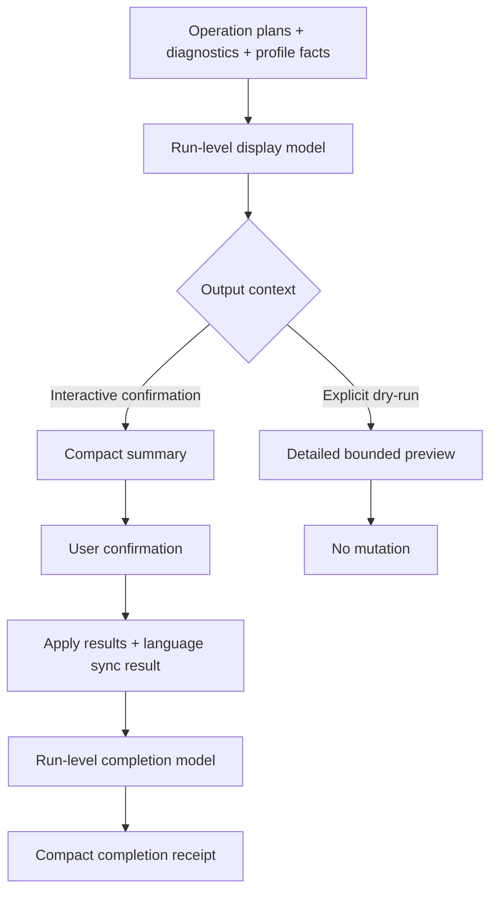

# Init Summary-First Output - Plan

## Goal Capsule

- **Objective:** 将 `spec-first init` 的默认交互打印改为摘要优先，让用户在确认前和执行后快速识别目标、风险、实际变化与下一步，同时保留显式 `--dry-run` 的有界路径明细。
- **Authority hierarchy:** 本次用户确认的“默认视图摘要优先” > 当前 CLI mutation 与安全披露契约 > `docs/plans/2026-07-11-001-fix-init-contract-failure-preview-plan.md` > Graphify 导航结果。
- **Stop conditions:** 若实现需要删除 destructive totals/risk signal、改变 operation plan、修改退出码，或新增 CLI flag 才能完成分层，停止并重新确认范围；path-level detail 可以从默认摘要迁移到显式 `--dry-run`，但不得从系统中消失。
- **Execution profile:** 先用现有五宿主 fixture 锁定摘要与详细视图的差异，再调整 renderer；不手改 generated runtime。
- **Tail ownership:** `spec-work` 负责实现、验证、代码审查和 closeout。

---

## Product Contract

### Summary

`spec-first init` 默认交互输出采用摘要优先：正常生成项按目标与宿主聚合，破坏性操作、项目外写入和能力降级保持突出；显式 `--dry-run` 继续提供有界路径明细。执行完成后输出单一 run-level 回执，压缩跨宿主重复的零值与 no-op 行。

### Problem Frame

当前 preview 已有每组 8 条、整次 100 条的确定性上限，但默认确认界面仍直接渲染详细路径。五宿主单仓场景会先打印多个宿主标题，再展开大量删除、关键写入和生成路径，最后输出机器化的 coverage/omitted 字段；用户需要扫描很长输出才能判断“是否安全、会改哪里、是否值得确认”。

apply 阶段按宿主逐项打印 commands、skills、agents、hook 与 runtime-untrack，即使数量为零或结果为 no-op 也重复出现。全局 developer profile 和 user-level language sync 又各自使用多行事实回执，使完成态缺少一个清晰的 run-level 结论。

问题不在确定性事实过多，而在同一事实层同时承担默认摘要、详细审计和完成回执三种阅读任务。优化必须重排信息层级，不能删除 mutation evidence 或把当前 confirmed facts 改成模糊文案。

### Requirements

**默认摘要视图**

- R1. 交互确认前先展示目标数、宿主数、全局 profile 影响、各宿主生成规模和风险摘要，不默认展开普通 generated path。
- R2. 删除、prune、runtime-untrack 与 managed reset 在确认前展示总数、受影响 target/host groups、run-wide 最多 12 条代表路径和省略数，并明确提示可用 `--dry-run` 查看有界明细；项目外写入继续展示精确 resolved path，普通 generated assets 按宿主和资产类别聚合。
- R3. 正常五宿主、单 target、无 reset/untrack 场景的确认 preview 不超过 25 行非空输出；包含大量破坏性操作时不超过 40 行，且 path sample 始终受 R2 的 12 条 run-wide 预算约束。

**详细视图与兼容性**

- R4. 显式 `--dry-run` 使用详细有界视图，保留 target/host/root、关键写入、破坏性路径、generated samples、omitted counts 与全局 developer/profile language sync disclosure。
- R5. 摘要与详细视图消费同一份 script-owned facts；不得分别重算 mutation、改变 operation plan、写入集合、确认时机、退出码或 dry-run 零写入语义。

**诊断与完成回执**

- R6. run-level diagnostics 按稳定 code 去重并按当前语言渲染；已知 degraded host 提示包含“当前状态 + 用户影响”，未知诊断保留原始 message，不伪造修复动作。
- R7. apply 完成态按 run 聚合为一个宿主摘要，只展示非零生成类别、实际 hook/profile/language-sync 变化和真实 runtime-untrack；`0 agents`、`no runtime path to untrack` 等重复 no-op 不逐宿主打印。
- R8. 全局 developer profile 与 user-level language sync 使用单语、紧凑回执；关键 action、resolved path、name/lang、失败 reason_code 和 error 仍可见。

**文档与治理**

- R9. README、中文 README 与当前用户手册说明默认摘要和 `--dry-run` 详细视图的区别；所有 source 变更同步 `CHANGELOG.md`，不修改 generated runtime mirrors。

### Acceptance Examples

- AE1. 用户交互选择 Claude Code、Codex、Cursor、Kiro、Qoder，单仓存在 145 条 remove path 和 2517 条 generated path 时，确认前看到聚合生成规模、destructive 总数、最多 12 条代表路径、省略数、全局 profile 影响和两条去重后的 degraded 提示；不展开完整路径清单，也不显示 `target_host_groups=` 等机器字段，preview 非空行不超过 40 行。
- AE2. 在只有一个真实 remove、一个 prune 和一个 runtime-untrack 的小型 fixture 中，默认摘要在普通 generated 概览之前列出三项破坏性路径，并明确需要确认；普通 skill/command 文件仍不逐项展开。
- AE3. 对同一五宿主 fixture 执行 `--dry-run` 时，详细视图继续输出目标明细、关键写入、每组最多 8 条 generated sample、整次最多 100 条 detail row 和 omitted counts，且磁盘无 mutation。
- AE4. Cursor/Qoder 同时存在且 workspace 含多个 child repo 时，每种 degraded diagnostic 在整次运行只出现一次；中文运行不再出现整段英文 warning，未知 warning 仍原样保留。
- AE5. 五宿主 apply 成功后，每个宿主最多一个摘要行；不打印五次 `0 agents` 或五次 `没有 managed runtime path 需要 untrack`，全局 profile 与 language sync 各只出现一个紧凑结果。
- AE6. profile write、language sync 或某个 host apply 失败时，紧凑输出仍保留失败 host、resolved path、reason_code/error 与非零退出结果，不因摘要化隐藏失败证据。

### Success Criteria

- 健康五宿主单仓的默认确认 preview 从路径清单降为不超过 25 行的决策摘要；包含大量破坏性操作时不超过 40 行并最多展示 12 条代表路径；完成回执不超过 15 行（next steps 除外）。
- 显式 `--dry-run` 继续满足昨天计划建立的 detailed disclosure 与 8/100 有界预算。
- 破坏性路径、项目外 mutation 和失败证据的测试覆盖不弱于当前基线。
- 中英文输出不混用已知 diagnostic 与 language-sync 标题；未知诊断保持可追溯。
- 现有五宿主 init lifecycle、workspace contract、dry-run 零写入和失败边界测试保持通过。

### Scope Boundaries

- 不改变任何 host runtime、instruction、state、hook、`.gitignore`、`CHANGELOG.md` 或 developer profile 的实际写入集合。
- 不新增 `--verbose`、`--details` 等 flag；复用现有交互确认与显式 `--dry-run` 的语义边界。
- 不修复 Cursor loader readiness 或 Qoder hook activation，只改现有 degraded facts 的呈现与去重。
- 不把 JSON result、workspace summary 或其他 machine-readable contract 改成面向人的摘要格式。
- 不把默认输出压缩扩展成全 CLI 的通用 renderer 框架；本计划只处理 `init`。

### Sources

- `src/cli/commands/init.js`
- `src/cli/commands/init-output.js`
- `src/cli/commands/init-diagnostics.js`
- `src/cli/commands/init-project-plan.js`
- `src/cli/init-i18n.js`
- `tests/unit/init-preview.test.js`
- `tests/unit/init-apply-failure.test.js`
- `tests/unit/init-workspace-contract.test.js`
- `tests/smoke/cli-smoke.test.js`
- `tests/integration/init-five-host-lifecycle.integration.test.js`
- `docs/plans/2026-07-11-001-fix-init-contract-failure-preview-plan.md`

---

## Planning Contract

### Key Technical Decisions

- KTD1. **preview 先构建共享 display model，再选择 renderer。** 从 operation plans、diagnostics、global profile 与 language sync 提取一次 pre-apply run-level facts；摘要与详细视图只决定展示层级，不拥有 mutation 判断。apply results 在执行后进入独立 completion model，不能混入 pre-apply facts。
- KTD2. **交互确认使用摘要，显式 `--dry-run` 使用详细视图。** 复用现有调用分支，不增加新 flag；程序化调用可通过显式 render profile 选择输出，避免从 TTY 状态猜测。
- KTD3. **风险信息采用非对称披露。** 删除、prune、untrack 与 reset 始终优先展示 totals、affected groups 和少量代表路径；项目外写入与失败展示精确 path/context；可重建的 generated runtime 只显示宿主/类别计数。更多 path-level detail 留在 dry-run。
- KTD4. **详细 renderer 保持昨天的 bounded contract。** 每组 8 条 sample 和 run-wide 100 条 detail row 继续作为确定性安全地板；只把机器字段从默认摘要移走，不删除它们。
- KTD5. **diagnostic 去重与本地化属于 renderer。** producer 继续提供 `level`、`code`、`message`；已知 code 由 i18n 映射到单语 human message，按 code 去重，未知 code 回退原始 message。
- KTD6. **apply 回执改为 run-level 聚合。** apply 生命周期和结果对象保持原样，所有 plans/results 完成后统一渲染；零值/no-op 只在会改变用户判断时保留。

### High-Level Technical Design

共享 model 保存 totals、host/target groups、destructive paths、critical writes、generated samples、omitted counts、diagnostics 和 project-external operations。摘要 renderer 只选取决策所需字段；详细 renderer 保持完整的 bounded disclosure。apply model 只读取实际 result，不从 preview 推断成功。

### System-Wide Impact

- **CLI users:** 默认交互更短，显式 dry-run 更像审计视图；脚本依赖 stdout 文案不属于稳定 machine contract，但 smoke tests 会锁定关键可见信号。
- **Safety/review:** 破坏性路径与失败信息仍是退出 gate；摘要行数指标必须与 disclosure countermetric 一起验证，不能只追求更短。
- **i18n:** 已知 diagnostics、preview、profile、language sync 和 apply receipt 统一走 `getInitMessages()`；代码、reason_code、路径保留原文。
- **Multi-host/workspace:** 去重范围是一次 `runInit()`，不能跨进程或跨命令缓存；child repo 的独立 mutation facts 不合并丢失。
- **Source/runtime:** 仅修改 `src/cli/`、tests、README/docs 与 `CHANGELOG.md`；`.claude/`、`.codex/`、`.agents/skills/`、`.cursor/`、`.kiro/`、`.qoder/` 不作为 source 变更。

### Risks & Dependencies

- 摘要过度压缩可能隐藏 child repo 或 host-specific destructive paths；采样必须先覆盖不同 target/host group，再分配剩余预算，并测试跨 target 同名路径与 late-group destructive path。
- 直接按 message 去重会把相同 code 的不同上下文吞掉；已知 host capability diagnostic 可按 code 去重，带 path/error 的诊断必须按 code + context 保留。
- apply 聚合若在全部 result 可用前打印，会误报部分成功为整体成功；renderer 只能在 apply loop 完成后生成 run-level receipt，失败时仍列出每个失败 result。
- `printInitPreview()`、`printInitApplySuccess()` 是现有程序化出口；重构需保留兼容 wrapper，避免单测和内部消费者被无关破坏。

---

## Implementation Units

### U1. 建立 run-level display model 与 render profiles

- **Goal:** 将 mutation facts 的收集、摘要选择和详细采样从当前单一 renderer 中解耦。
- **Requirements:** R1, R2, R4, R5
- **Dependencies:** none
- **Files:**
  - Modify: `src/cli/commands/init-output.js`
  - Modify: `tests/unit/init-preview.test.js`
- **Approach:** 保留现有 group 收集、critical/destructive 分类与 8/100 预算，新增稳定的 run-level display model；摘要和 detailed renderer 读取同一对象。`printInitPreview()` 保留兼容 wrapper，调用方显式传 render profile。
- **Execution note:** 先把现有 detailed assertions 固定到 explicit detailed profile，再增加 summary profile 的失败测试，确认不是通过删除旧测试来改变契约。
- **Patterns to follow:** `buildBoundedMutationPreview()` 的 phase priority；`buildRuntimeUntrackSummary()` 的 confirmed result/fact 边界。
- **Test scenarios:**
  - 五宿主单 target、无破坏性操作时，summary profile 只包含 host/category totals 和关键外部写入，不包含普通 generated paths 或机器 coverage 字段。
  - 145 条 destructive paths 分布在五个 host group 时，summary profile 最多展示 12 条、优先覆盖不同 group、输出省略数与 `--dry-run` 详细提示，并保持总输出不超过 40 行。
  - detailed profile 对同一 fixture 继续展示每组 8 条 sample、100 条 run-wide detail 与 omitted totals。
  - late target 的 destructive/critical paths 在 detail budget 紧张时仍优先于 generated samples。
  - 空 plans、空 operation plan 与 preserve/no-op profile 不抛错，并产生最小摘要。
- **Verification:** 两个 renderer 的 totals 来自同一个 display model；现有 detailed safety assertions 保留，新增 summary 行数与内容断言通过。

### U2. 接入交互摘要、dry-run 详细视图与去重 diagnostics

- **Goal:** 让 `runInit()` 在确认前使用摘要，在显式 `--dry-run` 时使用详细视图，并让 run-level warnings 单语去重。
- **Requirements:** R1, R2, R3, R4, R6
- **Dependencies:** U1
- **Files:**
  - Modify: `src/cli/commands/init.js`
  - Modify: `src/cli/commands/init-output.js`
  - Modify: `src/cli/commands/init-diagnostics.js`
  - Modify: `src/cli/init-i18n.js`
  - Modify: `tests/unit/init-preview.test.js`
  - Modify: `tests/unit/init-workspace-contract.test.js`
- **Approach:** `runInit()` 明确选择 `summary` 或 `detailed`；diagnostics 收集提升到 plans run-level，已知 code 通过 i18n renderer 输出并去重，未知 message 保持原样。摘要中把 global profile、language sync 和 risk disclosure 合并为可扫描区块。
- **Patterns to follow:** `getInitMessages()` 双语 map；`collectInitDiagnostics()` 对 workspace parent/child 的递归收集；当前 `init.js` 先诊断、后 error gate、再 preview 的顺序。
- **Test scenarios:**
  - 交互五宿主 fixture 的 preview 不超过 25 行，且普通 generated path 不出现。
  - `--dry-run` 路径选择 detailed renderer，仍输出 resolved global profile path、language-sync operations 和 omitted counts。
  - Cursor/Qoder 在多 target workspace 只各打印一次已知 warning，中文与英文分别使用对应语言。
  - 两个相同 code 但不同 path/error context 的未知或错误诊断不被错误合并。
  - managed reset、remove、prune、untrack totals 与代表路径在 summary 中先于 generated totals 出现，超过预算时仍显示省略数与 dry-run 提示。
- **Verification:** 交互与 dry-run 分支的 focused tests 同时通过；diagnostic code、message fallback 和 error gate 顺序不变。

### U3. 聚合 apply 完成回执并压缩 no-op

- **Goal:** 用单一 run-level completion receipt 取代逐宿主重复打印，同时保留真实失败与 mutation 结果。
- **Requirements:** R7, R8
- **Dependencies:** U1
- **Files:**
  - Modify: `src/cli/commands/init.js`
  - Modify: `src/cli/commands/init-output.js`
  - Modify: `src/cli/init-i18n.js`
  - Modify: `tests/unit/init-apply-failure.test.js`
  - Modify: `tests/smoke/cli-smoke.test.js`
- **Approach:** apply loop 继续逐 plan 执行并收集 results，完成后构建 run-level receipt；每宿主最多一行非零资产/hook 摘要，profile、language sync 与 runtime-untrack 只在 run-level 输出一次。保留旧 per-plan printer 作为兼容 wrapper，主 CLI 不再直接逐项调用它。
- **Patterns to follow:** `resolveEffectiveGlobalDeveloperWrite()` 的 run-level ownership；`buildProjectInitResult()` 与 workspace summary 的实际结果字段；当前 next-steps 只在整体成功后输出的 gate。
- **Test scenarios:**
  - 五宿主成功时每宿主最多一行，不出现 `0 agents` 或五次 no-untrack，completion receipt 不超过 15 行（next steps 除外）。
  - 某 host 有真实 runtime-untrack 时只打印一次 count/path outcome，不能被 no-op suppression 隐藏。
  - global profile create/overwrite/preserve 与 language sync ready/action-required 各只打印一次，中文标题不混入英文。
  - 单 host、all-repos 与 mixed success/failure 均保留失败 host、reason_code/error 和非零退出语义；失败时不打印“初始化完成”。
- **Verification:** unit 与 smoke 输出断言证明聚合不改变 apply 顺序、结果对象或 exit code，并覆盖成功与部分失败。

### U4. 更新用户契约与跨宿主回归

- **Goal:** 把摘要/详细视图边界写入当前文档，并验证五宿主与 workspace 生命周期没有回归。
- **Requirements:** R3, R4, R9
- **Dependencies:** U2, U3
- **Files:**
  - Modify: `README.md`
  - Modify: `README.zh-CN.md`
  - Modify: `docs/05-用户手册/01-快速开始.md`
  - Modify: `tests/integration/init-five-host-lifecycle.integration.test.js`
  - Modify: `CHANGELOG.md`
- **Approach:** README/用户手册只说明用户可观察契约：默认确认摘要、destructive totals + bounded samples、`--dry-run` 详细有界预览；不记录内部 renderer 名称。integration fixture 验证 explicit dry-run detail，默认摘要由 U1/U2 的 focused unit fixture 覆盖。
- **Execution note:** 文档与集成断言在行为稳定后更新；不运行 `spec-first init` 生成 runtime，因为本计划不改 runtime projection source。
- **Patterns to follow:** README 当前 init quick-start 段落；`CHANGELOG.md` compact user-visible 条目格式；五宿主 lifecycle fixture 的临时 sandbox。
- **Test scenarios:**
  - 五宿主 lifecycle 的 second dry-run 仍成功且包含 detailed bounded disclosure 信号。
  - README 中英文对 summary/dry-run 边界语义一致，当前用户手册不把摘要描述成完整 mutation 清单。
- **Verification:** integration、smoke、文档一致性和 changelog format 检查通过；generated runtime 工作区无新增 source-无关改动。

---

## Verification Contract

| Gate | Scope | Expected evidence |
|---|---|---|
| Focused preview | U1, U2 | `tests/unit/init-preview.test.js` 证明 summary/detailed 分层、12 条 summary path budget、8/100 detailed budget、破坏性优先级与 25/40 行默认预算 |
| Focused apply | U3 | `tests/unit/init-apply-failure.test.js` 与 `tests/smoke/cli-smoke.test.js` 证明 run-level 聚合、no-op suppression、失败证据和退出码 |
| Workspace contract | U2, U3 | `tests/unit/init-workspace-contract.test.js` 证明 parent/child facts、语言与 preview ownership 不漂移 |
| Five-host integration | U4 | `tests/integration/init-five-host-lifecycle.integration.test.js` 证明五宿主生成、explicit dry-run 与重复 init 生命周期保持可用 |
| Static quality | all | `npm run typecheck`、`git diff --check` 和 `tests/unit/changelog-format.test.js` 通过 |
| Main regression | all | `npm test` 通过；若环境原因未运行，closeout 必须明确未执行与剩余风险，不能声明全量回归通过 |

---

## Definition of Done

- 默认交互确认 preview 满足摘要优先：健康五宿主 fixture 不超过 25 行；大量 destructive fixture 不超过 40 行、最多展示 12 条代表路径并提示 `--dry-run`；普通 generated paths 不展开。
- 显式 `--dry-run` 保留 detailed bounded contract、全局 profile/language sync disclosure 与零 mutation。
- 默认与 detailed 视图共享 facts，不改变 operation plan、mutation、确认、失败或退出码语义。
- 破坏性路径、项目外写入、degraded host 和失败结果保持可见；未知 diagnostic 不被吞掉。
- apply 完成回执按 run 聚合，健康五宿主 fixture 不超过 15 行（next steps 除外），重复零值/no-op 已压缩。
- README、中文 README、当前用户手册与 `CHANGELOG.md` 已同步。
- 聚焦 unit/smoke/integration、typecheck、changelog format、diff check 与主测试链路按 Verification Contract 完成并记录真实结果。
- 没有修改 generated runtime mirrors；没有遗留被放弃 renderer 或重复 display model 代码。
