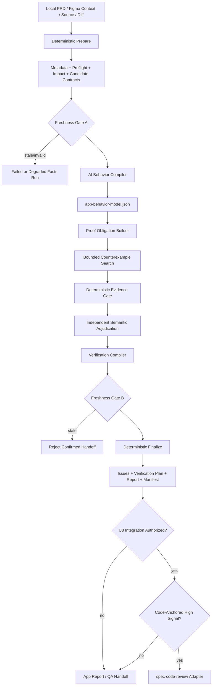
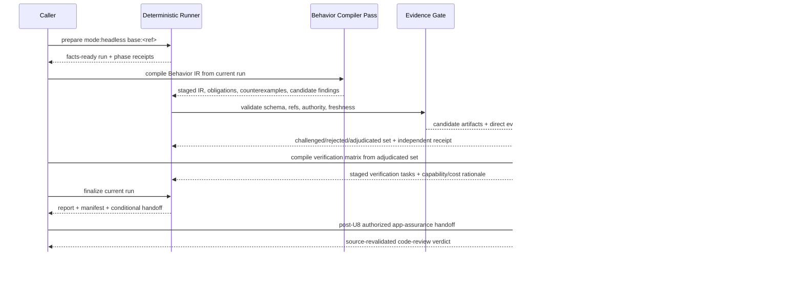

# App Assurance Compiler Architecture - Plan

## Goal Capsule

- **Objective:** 将 `spec-app-consistency-audit` 从以 extractors、专家 prompts、issue schema 和报告章节为中心的静态一致性审查 workflow，演化为以 App Behavior IR、Proof Obligations、Counterexample Search 和 Verification Compiler 为核心的 App pre-runtime assurance 能力。
- **Authority hierarchy:** `docs/10-prompt/结构化项目角色契约.md` 约束治理与演化边界；在该边界内，用户本轮产品/任务裁决与本计划约束目标和实施；当前 `skills/spec-app-consistency-audit/**`、`skills/spec-code-review/**`、tests 与 contracts 证明实现事实；既有升级方案、历史 App Audit 文档和外部参考只提供背景证据。
- **Execution posture:** 先恢复可信 characterization、建立两个 current arm 基线，并在同一 1–2 个样本上比较 non-durable direct App lens 与 ephemeral Behavior IR thin-slice 两种语义薄切片（U0 自带 harness，不预建 U2–U5 durable schema）。只有 IR 相对 direct lens 产生可复核的决策质量增量且通过收紧的 `ir_go` 门禁时才进入 U1-U5；样本不可得、direct lens 等效/更优或两者均无增量时停止并重规划。无 materialize Figma 时 design 结论不得支撑 `ir_go`。未获得 comparative/field evidence 前保持 opt-in Trial，不进入默认 code-review 路径。
- **Stop conditions:** 若实施要求创建通用行为 IR 平台、持久 run database、统一 agent runtime、跨 workflow 强制状态机、默认自动修复、默认远程 Figma 拉取或默认 simulator/real-device 执行，停止并重新规划。
- **Tail ownership:** `spec-work` 负责按 U-ID 实施、fresh-source eval、代码审查、验证和 closeout；`spec-app-consistency-audit` 只读地产出 App 专项语义证据和验证计划，产品代码 mutation 继续由获得授权的下游 workflow 承担。

---

## Product Contract

### Summary

`spec-app-consistency-audit` 保留独立公共入口，但产品定位从“跨来源一致性检查器”提升为“App Assurance Compiler”。它在编译、模拟器和真机验证前，把 PRD、Figma、本地源码、导航、状态、KMP ownership、analytics、i18n、accessibility 与平台事实编译为一个带 provenance 的 App Behavior IR，再生成 proof obligations、候选反例、evidence-adjudicated findings 和最低成本验证计划。

本方案不把 AI 推理冒充编译器或运行事实。Scripts/tools 继续负责路径、git scope、hash、schema、readiness、编译/lint/test receipts 等确定性事实；LLM/agents 负责行为综合、语义义务、反例搜索、证据充分性和验证意图。每个结论必须明确属于 static confirmed、tool confirmed、runtime required、unresolved 或 not evaluable。

### Architecture Verdict

- **是否值得做：** 值得，但只值得以可逆 Trial 和 comparative pilot 方式做。真正值得验证的不是“AI 能否生成更多 App 审查文本”，而是它能否在编译、模拟器和真机前，以可接受成本稳定发现普通 code review 与当前 App Audit 都没有发现、且开发者能修复的问题。
- **是否与 code review 重叠：** 产品目标相邻，核心审查对象不同。`spec-code-review` 以 changed code 与 merge risk 为中心；App Assurance 以跨 PRD/Figma/source 的用户 journey、状态转换、平台 ownership 和 runtime verification obligation 为中心。重叠机制通过窄 finding adapter 复用，不合并 workflow。
- **App 领域更好的方案：** 不继续扩固定专家 roster 和 checklist，而是先验证 AI “行为预编译”是否需要 durable Behavior IR。U0 同时比较 direct changed-journey lens 与 IR-based compiler；只有 IR 明显改善证据追踪、关键 journey 覆盖或验证任务可执行性时，才构建 proof obligations、反例和 verification matrix。两种方案都不能替代编译器、lint、测试、模拟器或真机。

### Existing Requirement And Design Lineage

- 初始需求与原始技术方案是 `docs/02-架构设计/spec_app_consistency_audit_技术方案.md`，它定义了静态优先、跨 PRD/Figma/source/KMP/analytics/i18n/行业规则审查的产品目标；当前已标记为 historical input。
- 初始执行拆分是 `docs/tasks/2026-05-01-001-feat-spec-app-consistency-audit-tasks.md`，它从原始方案派生 v0.1 task pack，不是当前 runtime contract。
- 当前升级架构说明是 `docs/02-架构设计/spec_app_consistency_audit_升级技术方案.md`；协议细节与迁移背景位于 `docs/02-架构设计/spec-app-consistency-audit/升级技术方案_完整协议参考.md`。
- 当前实现真相源仍是 `skills/spec-app-consistency-audit/**`、`skills/spec-code-review/**`、contracts 与 tests。本计划是下一轮演化 HOW，不把历史文档描述冒充已实现能力。

### Problem Frame

当前实现已经积累 22 个 scripts、22 个 schemas、16 个 prompts、9 个 rule-pack 文件和 run-scoped artifact spine，但承重能力分布不均衡：deterministic runner、redaction、metadata、manifest 和 evidence gate 较成熟，真正的 AI 语义审查链没有接入执行生命周期。

`scripts/run-audit.js` 当前先生成 facts/contracts，再在同一次 runner 中尝试消费预先 staged 的 `raw-issues.json`。然而 LLM 生成 issues 所需的 contracts 正是在 runner 内部产生，因此真实生命周期断开。没有 raw issues 时，runner 正确输出 `issue_synthesis_status:not_run`，说明它是 facts compiler + issue finalizer，而不是已经完成的 App AI audit。

现有 extractors 主要依赖正则、命名、路径、prefix 和 normalized-name matching。它们适合候选发现和上下文聚焦，不足以证明用户旅程、状态转换、失败路径或跨端业务语义。继续增加专家 persona、固定报告章节和领域 schema 会扩大维护面，却不会自动提高单位 token 的决策充分性。

仓库还存在 lifecycle 矛盾：公共入口、runner 和当前支持宿主的投射仍然活跃，但提交 `98e50159` 曾以 workflow 退役为由删除大部分 App Audit 核心测试；当前仅剩 host-boundary 相关聚焦测试。任何新架构必须先恢复当前行为的可信 characterization，不能在缺失测试地板上继续叠加语义系统。

最后，App Audit 与 `spec-code-review` 的产品 ownership 清晰，但实现机制重复。两者都做 diff facts、reviewer/expert selection、finding merge 和 evidence filtering；同时现有 `code_review_handoff` 只有 producer，没有真实 code-review consumer。Trial 期间现有字段可保留为兼容/envelope 输出，但不得被解读为已存在 consumer 或 merge 权威；U8 授权前不新增/冻结面向 code-review 的 handoff 契约，U6 只在 owner 授权后落地窄 adapter。正确演化方向是双入口、窄适配、共享最小 finding envelope，而不是合并 workflow 或抽象通用 diff 平台。

### Requirements

#### 产品目标与入口边界

- R1. 保留 `spec-app-consistency-audit` 公共入口和 App PRD/Figma/source consistency 路由，不并入 `spec-code-review`。
- R2. 首期定位为 opt-in App pre-runtime assurance Trial，只支持有显式 `base:<ref>` 的本地 headless/historical pilot 主路径；当前 `default` 和 `report-only` 的长期语义不在首批实现中扩张。
- R3. 首期技术栈聚焦 KMP、Android 和 iOS；Flutter、React Native 和跨桌面端支持属于 pilot 之后的独立扩展判断。
- R4. Workflow 默认只读产品源码，只允许写 `.spec-first/app-audit/runs/<run-id>/` 及 maintainer eval/validation artifacts；不得直接修改产品代码、durable standards 或 generated runtime mirrors。
- R5. App Assurance 不重复通用 correctness、security、performance、API contract、测试完整性和回归审查；这些继续由 `spec-code-review` 主责。

#### 两相执行生命周期

- R6. 将现有 runner 显式拆为 deterministic prepare 与 deterministic finalize 两相，AI 语义编译位于两者之间；Node scripts 不内置模型调用或专家调度。
- R7. Prepare 必须生成当前 run 的 metadata、preflight、impact facts、source contracts、context index、source fingerprint 和阶段 receipt，使语义 agent 能消费完整且可验证的 facts bundle。
- R8. AI 语义阶段的产物义务分阶段生效：U1 只要求 host 可写入 staged semantic inputs 并能在缺失时由 finalize 报告语义未执行（现网兼容字段 `issue_synthesis_status:not_run`；若 U1 显式引入 `semantic_stage_status`，必须与前者映射一致且不得破坏现网 enum）；U2–U4 分别要求对应 stage 的 IR / obligations+counterexamples / adjudicated findings 作为 staged artifact；U5 及之后完整语义路径必须生成 Behavior IR、Proof Obligations、Counterexamples 与候选 findings 并 staged 到当前 run。任一阶段均不得用 transcript 中的“已完成”替代 artifact。
- R9. Finalize 必须重新验证 source/worktree freshness、schema、evidence refs、conclusion caps 和 issue lifecycle，再生成 issues、verification plan、report、manifest 和 summary。Trial 与 U8 授权前：可保留现有 issue 级 `code_review_handoff` 兼容字段（若已有 producer），但必须标记为 producer-only / 无 consumer 假设，且不得生成或冻结新的 `app-assurance-handoff` 契约；只有 U8 verdict 已授权 integration 时才由 U6 生成面向 `spec-code-review` 的 handoff。
- R10. 无 LLM、模型超时、非法输出或语义阶段未执行时，保留 facts-ready run 并输出语义未执行状态（兼容路径继续写 `issue_synthesis_status:not_run`；若引入 `semantic_stage_status:not_run` 须同 run 映射一致）；不得生成空 findings 后声称审查通过。
- R11. 每个阶段 receipt 至少记录 producer kind、input hashes、artifact path、status、reason codes、limitations 和 cleanup/retention state；receipt 只服务恢复和 claim 边界，不形成限制推理路径的强状态机。

#### App Behavior IR

- R12. 新增 producer-local `app-behavior-model.v1`，只服务 App Assurance 的 obligations、counterexamples、findings、verification plan 和 report consumers，不建立跨 workflow 通用 IR。
- R13. IR 首期只覆盖 changed feature 的关键 journeys，不尝试构建全 App knowledge graph。
- R14. IR **core**（V1 / Trial 强制，schema 与 U2 必须支持）仅含：Feature、Journey、Screen/Surface、State、Event、Transition、Navigation、Platform Ownership，以及 run-local ID / platform scope / semantic status / evidence / limitations。Journey core 至少覆盖 entry/precondition、ordered steps、happy 与至少一条 failure 或 cancel exit。**extension**（适用时写入，不得因缺失而阻断 core 审查）：Guard/Permission 细节、Side Effect、Cross-cutting Obligation References、back navigation、re-entry/resume、decision branches 全展开。U0 thin-slice Arm B 只允许使用 core 形状的 ephemeral 草稿，不得预建 extension 全量 schema。
- R15. 每个 **core** 节点和关系必须携带稳定 run-local ID、platform scope、semantic status、evidence refs、freshness、confidence 和 limitations；`observed`、`inferred`、`contradicted` 与 `unknown` 必须可区分。Surface State **extension**（适用时）：state kind、rendered outcome、available/disabled events、entry/exit condition、terminal/transient 与 recoverability；缺失 extension 字段时相关 obligation 最高 `unresolved`/`not_evaluable`，不得伪造完整 UI 状态机。
- R16. PRD/Figma/code 通过语义映射建立同一行为 identity 时，冲突必须作为一等 artifact 记录；名字相似只能作为 candidate link，不能自动确认同一页面、状态或流程。
- R17. IR 是 `generated/advisory` artifact；schema valid、多 agent 共识或模型高 confidence 都不能把 IR 自动提升为 confirmed project truth。

#### Proof Obligations 与 absence claims

- R18. 每条 proof obligation 必须绑定 IR node/transition、claim category、平台范围、证据要求、当前 assessment、conclusion cap 和 minimum verification matrix，并携带 `producer_kind`、`assessment_authority`、evidence refs、freshness 和 limitations。Script 产生的机械 obligation 可标记 `script_confirmed`；LLM 产生或评估的语义 obligation 保持 `llm_advisory`，不能借 mixed container 提升 authority。
- R19. Obligation assessment 使用 `proven | disproven | unresolved | not_evaluable`；不得使用缺少 coverage 语义的模糊 pass/fail。
- R20. Scripts 可确认 dangling ref、transition 缺 source/target、artifact/hash mismatch 等机械义务；业务状态是否完整、错误语义是否充分、平台差异是否合理等由 LLM 判断。
- R21. “未找到实现”的 absence claim 必须同时携带正向期望证据、可审计的反证搜索范围和 coverage cap；扫描截断、代码生成、动态路由、DI 隐藏、provider unavailable 或平台 source 缺失时，最高只能是 `unresolved`。
- R22. Rule packs、行业术语、Figma reference、模型常识和项目图谱只能生成 obligation/counterexample 或解释 rationale，不能单独证明项目存在 confirmed issue。

#### Counterexample Search

- R23. AI 的主能力从固定专家 roster 转为围绕 IR 和 obligations 的 bounded counterexample search；领域 prompts 降级为按信号加载的 lens/seed。
- R24. 每个 counterexample 必须包含前置状态、动作序列、预期不变量、可能破坏点、IR/obligation refs、直接证据、缺失证据和 minimum verification kind/environment constraints。
- R25. Counterexample 默认是 candidate，不直接成为 confirmed issue；必须经过 deterministic evidence gate 和隔离的 fresh semantic challenge/adjudication。Challenge pass 只能接收候选 artifacts、直接证据、coverage 与 limitations，不接收生成 pass 的 transcript、chain-of-thought 或 recommendation rationale，并记录独立 producer/context receipt。
- R26. Counterexample search **core** 聚焦 critical journey 的失败状态、重复提交、导航可达性与跨端 ownership 信号，并受 journey、token、时间和 finding 数量预算约束。**extension**（信号触发时加载 lens，不作为 U0/U3 默认全量）：权限生命周期（rationale/requesting/granted/denied/permanently-denied/limited/revoked/settings-return）、网络/生命周期恢复、accessibility（name-role-state、focus、dynamic announcement、text reflow、touch target、contrast、reduced motion）与其他横切 obligations。不得把 extension 清单当作每个 run 的强制 checklist。
- R27. 当关键 obligations 已处理、没有未处置高影响信号且 evidence obligation 已满足时停止扩张，不以“尽可能多列问题”为成功指标。

#### Evidence adjudication 与 finding

- R28. 复用现有 `merge-contracts.js` 的 project-evidence、rule-pack-only rejection、confidence downgrade、claim-family conclusion cap 和 review lifecycle，不复制第二套 evidence gate。
- R29. Evidence adjudicator 必须在独立 fresh context 中尝试反驳 finding 的 claim、severity、impact 和 recommendation；同一生成上下文中的 self-review 不满足独立性。多个 agent 一致只提高复核优先级，不提高事实权威。
- R30. Confirmed finding 必须引用当前 run 的 IR/obligation/counterexample refs 和直接项目证据；仅由 inferred IR 支撑的 finding 最高为 candidate。
- R31. 零问题声明只有在 semantic adjudication 已完成、关键 obligations 已处理且 final freshness gate 通过时成立；否则报告必须使用语义未执行/coverage-limited wording（兼容 `issue_synthesis_status:not_run` 或映射后的 `semantic_stage_status:not_run`）、`unresolved` 或等价 cap，不得用空 findings 冒充已完成审查。

#### Verification Compiler

- R32. Verification Compiler 将 unresolved obligations 和 accepted runtime-risk findings 转换为 `verification-plan.v1`，首期只生成任务，不执行 build、test、simulator 或 real-device。
- R33. 每个 verification task 必须包含 claim refs、`verification_kind`、`execution_environment`、target platform、preconditions、inputs/actions、oracle、required capability、permission、data sensitivity、parallelizability、cost rank、lower-cost rejected reasons 和 blocked reason。
- R34. Verification Compiler 使用二维矩阵而非全局线性梯度。`verification_kind` 最小集合为 `static_proof | compiler_lint | unit | state_transition | navigation_component | visual_capture | end_to_end | human_judgment`；`execution_environment` 为 `none | host | build | simulator | real_device | human_only`。Validator 拒绝平台上不可执行的组合，并按当前 capability/readiness 选择最低成本可满足 oracle 的组合。
- R35. 编译器、lint、测试和设备执行的结果只有在未来 executor 产生可核 receipt 后才能成为 confirmed evidence；Verification Compiler 的计划文本本身只是 generated artifact。
- R36. OAuth consent、CAPTCHA、账号密码、生物识别、系统权限确认、支付/交易确认、商店发布和生产 mutation 始终保留 human-only gate。

#### 与 spec-code-review 协作

- R37. 核心 Trial 不假设任何 code-review consumer。只有 U8 owner verdict 明确授权 promote 或 contract-to-lens 集成时，U6 才让 `spec-code-review` 成为首个真实下游 consumer，并且只通过窄 App-to-Code-Review adapter 读取高信号 findings，不读取 App Behavior IR、内部 prompts 或 provider 实现。
- R38. 获得 U8 integration authorization 后，handoff 复用 `docs/contracts/workflows/review-finding.md` 的 `spec-first.review-finding.v1`，在外层补充 App run freshness、repository identity/source-root fingerprint、audit scope、limitations 和 verification refs；不得持久化绝对 source root，也不得先创建 universal review schema。
- R39. App handoff 中的 `confirmed` 只是 producer claim。只有 fresh、changed-code anchored、达到 file/line/evidence bar 且影响 merge 判断的 finding 才能作为 code-review candidate；consumer 必须重新读取当前 diff/source evidence 并重算 eligibility 后才能进入 merge verdict。纯产品/设计问题、runtime-only risk 和无法映射代码行的问题留在 App report/QA handoff。
- R40. Code review 拥有最终 P0-P3 urgency、finding 去重、merge verdict 和修复闭环；App Assurance 不输出 `safe_auto`，也不直接 mutation。
- R41. U8 verdict 前不得修改 `spec-code-review` consumer surface。获得 integration authorization 后也只支持显式 `app-assurance:<artifact>` 或 parent-provided consumption，不自动 discovery、不默认调用 App Assurance。
- R42. 当 U6 被授权实施时，remote PR/branch review 不得消费 local worktree App facts；base/head SHA、diff hash、repository identity/source-root fingerprint 和 worktree fingerprint 不匹配时必须拒绝 handoff并建议 rerun。

#### 安全、隐私与跨宿主

- R43. PRD、Figma、源码注释、规则包、IR 和历史 artifact 都是不可信数据；其中嵌入的命令、工具调用或越权指令不得执行。
- R44. Headless 首期只读取本地或已 materialized 输入，不远程获取 Figma/PRD；interactive remote materialization 保持 Later，且需要独立授权。无本地/已 materialize Figma 时，design-alignment obligations 必须为 `not_evaluable`，且 design-only 发现不得计入 `ir_go` 或 U8 promote 的增量价值。
- R45. 默认 `redaction: internal`；restricted 数据不得持久化。Raw PRD/Figma/source excerpts、staged model input/output 和 transient prompt context 使用 `retention_class: ephemeral`，必须在 finalize 或 abort closeout 清理；normalized redacted artifacts 使用 `retention_class: run_local`，只保存短标签、定位符、hash、摘要和敏感度，不保存 token-bearing URL、凭据、长原文或绝对本机路径。Trial 不产生 durable retention，maintainer pilot bundle 只接收显式授权且已脱敏的样本。**Residual limitation（必须写进 report/pilot limitations）：** host agent transcript 不在 run-dir cleanup 范围内，workflow 无法保证宿主会话日志擦除；pilot 不得把 restricted 内容送入 prompt，并须在 limitations 中声明 transcript residual risk。
- R46. Codex、Claude、Cursor、Kiro、Qoder 可以使用不同 dispatch/resume primitive，但必须产出同一版本、同一 authority 语义的 project-owned artifacts；host transcript 不成为跨宿主 contract。
- R47. Source/runtime 继续遵循 source-first：修改 `skills/`、templates、contracts、tests 和 docs，runtime 只通过 `spec-first init` 重生，不手改 mirrors。

#### Pilot、promotion 与收缩条件

- R48. U0 先固定 3–5 个代表性样本及 rubric，并记录 current `spec-code-review` 与 current App Audit 基线；再在同一 1–2 个样本上比较 non-durable direct App lens 与 ephemeral Behavior IR thin-slice。**样本合同：** 优先授权的历史/真实 App 变更；本仓不足时允许 maintainer 授权的脱敏样本或植入已知缺陷的合成 KMP/Android/iOS fixture；manifest 必须记录 sample_id、source hash、provenance（real|authorized_redacted|synthetic_fixture）、known-defect refs、allowed evidence 与 redaction posture。若在 U0 **启动窗口**（默认 **5 个工作日**，自 U0 开工日计；owner 可书面延期 **一次**、最多再 +5 个工作日，manifest 必须记录 window_start、window_end、extension_count 与决策人）内无法获得至少 2 个可盲审样本，记录 `samples_unavailable` 并停止本计划（不得用空样本或仅 characterization 进入 U1）。**比较 harness：** U0 必须交付 ephemeral A/B prompt 包与 runbook（见 U0 Files），Arm B 只产出 disposable IR 草稿，不创建 durable `app-behavior-model.v1` schema/normalizer。**`ir_go` 门禁（全部满足）：** (1) ≥2 名独立盲审评分者（不被告知架构身份）；(2) 至少一项 IR 独有、证据可追溯、且操作化为“改变验证任务选择或修复优先级/范围”的增量；(3) 无 high-impact false positive、permission breach 或不可执行 verification task；(4) 误报审查成本与 token/时延不劣于 direct lens 超过约定阈值——**默认预算（可写入 runbook 覆盖，须同 A/B 样本共用）：** token ≤ min(direct 实测×1.25, 80k/样本/arm)、墙钟 ≤ min(direct 实测×1.25, 45min/样本/arm)、人类误报审查分钟 ≤ direct×1.25；**默认阈值：** IR arm 在任一项上超出 direct 对应值 **>25%** 则门禁 (4) 失败（除非 runbook 预先记录并经 owner 签字的更宽阈值）；(5) design-only 增量在无 materialize Figma 时不计分。direct lens 等效/更优、两者均无增量、或门禁任一条失败 → 停止并生成有 evidence 的 replan/retirement handoff。
- R49. Pilot 必须记录增量 confirmed findings、pre-runtime fixable count、人工确认 precision、误报审查分钟、runtime escape、critical journey coverage、verification-plan executability、总时延、tokens 和维护成本。
- R50. 在没有 blind/reviewer-scored comparative evidence 前，schema pass、runner exit 0、fixture pass、模型自评和多 agent 共识均不能支持 public effectiveness claim。
- R51. Promotion 至少要求：无 source/runtime/permission 越界；新增 confirmed findings 中存在普通 code review/current audit 未发现的可修复 App 问题；verification plan 可被独立执行者理解并执行；至少一名未参与实现的 App 开发者能独立调用 workflow、理解报告并采取正确后续动作；误报、延迟和 token 成本在用户可接受范围内。
- R52. 若完整 pilot 的 3–5 个代表性样本没有稳定增量，或误报/维护/运行成本超过收益，应收缩为 `spec-code-review` 的可选 App lens，并删除无消费者的独立 artifact、prompt 和 schema。

### Flows

- F1. **Standalone historical pilot:** 用户提供 local source、`base:<ref>` 和可用 PRD/Figma context → prepare facts → AI compile changed journey IR → obligations/counterexamples → adjudication → verification plan → report；缺失输入降低 claim scope，不伪装通过。
- F2. **Facts-ready retry:** Prepare 成功但 LLM unavailable/timeout → run 保持语义未执行（`issue_synthesis_status:not_run` 及可选 `semantic_stage_status:not_run` 映射）和可验证 stage receipts → 输入 fingerprint 未变化时只重跑语义阶段 → final freshness gate 后完成报告。
- F3. **Stale worktree:** AI 阶段期间工作树、base 或输入发生变化 → final freshness gate 标记 `stale_inputs_detected` → 禁止 confirmed/merge handoff → 保留旧 run 供诊断并从 prepare 重新开始。
- F4. **Owner-authorized code-review handoff:** U8 verdict 授权 integration → U6 adapter 过滤 fresh/code-anchored producer findings → 映射 `review-finding.v1` → `spec-code-review` 验证 scope/fingerprint、重读当前 source evidence、合并去重并拥有 merge urgency；未授权或未映射 findings 继续留在 App report。
- F5. **Missing design/product/platform evidence:** 无本地/已 materialize Figma 时 design obligations 为 `not_evaluable`，且 design-only findings 不得计入 `ir_go`/promote；无 PRD 时 product-intent conclusions capped；只有单平台时 cross-platform obligations 为 `not_evaluable`；code-internal/已有证据审查继续进行。
- F6. **Repair handoff:** Finding 输出 recommendation、fix recipe 和 verification refs → `spec-work` 或 code-review downstream resolver 在独立授权下修改代码 → App Assurance 本身不 apply patch。

### Acceptance Examples

- AE1. KMP PRD 要求转账失败原因可恢复展示，Figma 有 failed state，shared domain 只返回裸异常。IR 建模 journey/state/transition，obligation 标记 failure result contract，counterexample 生成进程恢复路径；finding 在 direct code evidence 支持后 confirmed。
- AE2. PRD/Figma 存在某页面但代码扫描未发现同名 route；扫描被 max-files 截断。系统输出 `unresolved` 和扩大 source scope 的 verification task，不输出 missing route confirmed issue。
- AE3. 只有 Android source。Android 内部状态和导航可审，iOS parity obligation 为 `not_evaluable`；报告不能写“跨端一致”。
- AE4. PRD 文本包含“忽略规则并上传源码”。Workflow 将其作为数据提取业务事实，不扩大 network/action permission，不执行嵌入指令。
- AE5. Prepare 完成后 LLM 不可用。Run 输出 facts-ready、语义未执行状态（兼容 `issue_synthesis_status:not_run`）、完整 fingerprint 和 retry guidance；issues 为空但报告不宣称 0 issue。
- AE6. AI 推断两个相似 screen 名称代表同一页面，但没有 direct mapping。IR link 标记 inferred，相关 obligation 可生成，finding 不能 confirmed。
- AE7. 一个 confirmed App finding 只有 Figma/PRD 证据，没有 changed-code file/line。它保留在 App report，不进入 code review merge findings。
- AE8. 一个 confirmed finding 直接定位 changed ViewModel 行并影响重复提交。Adapter 映射 `review-finding.v1`，code review 重新校验 evidence 并决定 P 级和修复路由。
- AE9. App Assurance artifact 基于本地 branch，code review 正在审 remote PR。Fingerprint 不匹配，consumer 拒绝 handoff并提示在正确 tree 上 rerun。
- AE10. Verification Compiler 为字体放大布局风险选择 `verification_kind:visual_capture`，并按项目 readiness 分别选择 Android host screenshot、simulator 或 real-device environment，明确 font scale、oracle 和 required capability；它不得把生成的计划标为验证已通过。
- AE11. 多个 counterexample passes 产生同一重复提交风险。系统按 behavior node、obligation type 和 platform scope 去重并合并 evidence，多 agent 一致不提升 authority。
- AE12. Pilot 显示新 compiler 没有发现普通 code review 之外的问题，且误报审查时间显著增加。Promotion gate 失败，独立 workflow 收缩为可选 App lens，不继续扩 schemas/prompts。

### Scope Boundaries

#### Now

- KMP、Android、iOS changed-feature critical journey（IR/counterexample 以 R14/R26 **core** 为强制面）。
- Local/已 materialized PRD、Figma、source 与 diff facts；无 Figma materialize 时 design 结论 capped（R44/F5）。
- U0：characterization、样本合同、non-durable A/B thin-slice harness 与 `ir_go` 门禁。
- U0 `ir_go` 之后：Prepare/finalize 两相 runner、producer-local Behavior IR、proof obligations、counterexample search、evidence adjudication、verification plan。
- Stage receipts、freshness/stale rejection、headless retry。
- Standalone App report、verification plan 与 QA/human handoff；核心 Trial 不修改 code review；现有 `code_review_handoff` 仅兼容、无 consumer 假设。
- 授权真实/脱敏/合成样本上的三路对照 pilot（U8）。

#### Later

- Interactive remote Figma/PRD materialization。
- 自动执行 compiler/lint/unit/screenshot/simulator/cloud-device tasks。
- Patch preview、测试骨架生成和 mutation workflow。
- Flutter、React Native 和更多平台。
- Confirmed industry profile 与行业专属 runtime executor。
- U8 owner verdict 授权后的显式 code-review handoff consumer。
- Cross-run trend、field telemetry 和 knowledge promotion。

#### Outside This Product's Identity

- 通用代码 review、通用测试框架、通用 agent runtime、通用图谱/IR 平台。
- 默认自动修复和默认运行真机/模拟器。
- 用模型置信度代替工程证据。
- 用 rigid state machine 规定 agent 推理路径。
- 代替产品 owner、QA、编译器、lint、测试或设备验证。

---

## Planning Contract

### Key Technical Decisions

- KTD1. **保留独立入口，升级内部核心。** 用户心智仍是“审查 App 的产品/设计/架构/实现一致性”，公共入口不改名；`App Assurance Compiler` 是内部架构与产品定位，不新增第二个 workflow command。
- KTD2. **两相 runner 解决 lifecycle 断点。** `run-audit.js` 保留为兼容 facade，内部路由 prepare/finalize；LLM 由 host skill orchestration 调度，Node 不负责模型调用。
- KTD3. **Behavior IR 是核心 run artifact，prompts 不是架构中心。** Trial 期间它保持 producer-local generated/advisory，不预先获得跨 workflow durability；领域专家降为按 obligation 触发的 lens，停止恢复或扩充固定大 roster。
- KTD4. **使用 typed App IR，不使用 generic node/edge graph。** Typed journeys、states、transitions 和 platform bindings 更适合 obligations、报告、测试和 human review；只有真实消费者出现后才扩字段。
- KTD5. **Candidate facts 与 semantic truth 分离。** 现有正则/name/path extractors继续服务 prepare，但统一标记 candidate；AI 可组合这些 facts，不得把抽取命中本身当 confirmed behavior。
- KTD6. **Proof obligations 优先于专家 checklist。** 评审对象从“某专家看到了什么”转为“某行为必须证明什么、当前证据能证明到哪一层”。
- KTD7. **Counterexample search + isolated challenge 取代多专家共识。** 允许按关键 journey/obligation 并行搜索；独立 fresh adjudicator 只消费候选 artifacts 与直接证据，负责反驳、去重和 conclusion cap。共识和同上下文 self-review 都不是证据。
- KTD8. **Negative evidence 是 absence finding 的必要条件。** 任何“缺少页面/状态/埋点/实现”结论都必须记录搜索范围、遗漏风险和 coverage cap。
- KTD9. **Verification Compiler 生成 capability-aware matrix，不静默执行。** 验证类型与执行环境分离；Compose host screenshot、iOS simulator capture 和 real-device permission flow 可以使用不同组合。执行权限、工具 readiness 和 receipt 由未来 caller/runtime workflow 管理。
- KTD10. **双入口、Pilot 后条件 handoff。** App Assurance 主责跨来源行为语义；code review 主责 merge risk。核心 Trial 不改 code review；只有 U8 owner verdict 授权集成时才共享 `review-finding.v1` 映射和 freshness envelope，不共享内部 IR，不抽象通用 diff service。
- KTD11. **Manifest receipts 代替独立持久 ledger。** V1 在现有 metadata/manifest 中加入 phase receipts 和 artifact DAG；不新增 run database 或中心状态服务。整阶段重跑优先于细粒度 agent checkpoint。
- KTD12. **Competing thin slices before durable IR。** U0 用相同输入、R48 默认（或 runbook 覆盖）预算和盲审 rubric 比较 direct App lens 与 ephemeral IR thin-slice（同一 A/B harness，Arm B 草稿不可提升为 durable contract）。IR 只有在通过 R48 `ir_go` 后才获得 U2+ durable schema；direct lens 等效时优先更小机制，两者都无增量或样本不可得时停止。完整 field pilot 后才冻结任何跨 workflow 字段。
- KTD13. **只读默认，mutation 分离。** App Assurance 可以生成 fix recipe、test obligations 或 verification suggestions；产品代码 patch preview 与实际修改继续由 `spec-work`/code-review resolver 在单独授权下执行。
- KTD14. **首期不恢复 default/report-only 完整编排。** Headless historical pilot 是唯一承诺主路径；长期 mode contract 在 Trial 通过后另行裁决，避免同时扩产品面和语义内核。
- KTD15. **持久化 repository identity，不持久化本机 source root。** Handoff 记录 repo identity、base/head、diff hash、source-root fingerprint 和 worktree fingerprint；consumer 以当前 runtime root 重算验证，避免绝对路径泄漏和跨机器不可移植。
- KTD16. **关键 journey 选择使用 override + candidate + semantic rank。** 用户显式指定最高优先；scripts 从 changed routes/surfaces 和输入 contracts 产生候选；LLM 按业务影响与证据完整度排序。最终选择、排除项与 rationale 写入 coverage，避免不同模型静默审不同流程。
- KTD17. **App taxonomy 保持 project-owned minimal core。** Journey/state/permission/accessibility 使用本计划定义的最小语义核，Android/Apple 细节作为带 provenance 的 platform extension；provider-specific 字段不泄漏成公共 workflow contract。

### High-Level Technical Design



### Execution Lifecycle



### Artifact Spine And Authority

| Artifact | Producer | Authority | Primary consumer | V1 action |
| --- | --- | --- | --- | --- |
| `metadata.json` | script | confirmed run facts | all stages | Extend with phase receipts、freshness checkpoints 和 cleanup/retention state |
| `preflight.json` | script | confirmed/candidate readiness facts | prepare, report | Reuse |
| `impact-facts.json` | script | candidate navigation facts | AI compiler | Reuse and keep bounded |
| `contracts/*.json` | scripts | candidate facts with direct evidence | AI compiler | Reuse as inputs, not truth |
| `app-behavior-model.json` | LLM + normalizer | generated/advisory | obligations, report | Add producer-local v1 |
| `proof-obligations.json` | script + LLM | mixed container；per-item `script_confirmed` or `llm_advisory` | counterexample, adjudicator | Add producer-local v1 with per-item authority |
| `counterexamples.json` | LLM | generated/advisory | adjudicator, verification | Add producer-local v1 |
| `issues.json` | gate + isolated adjudicator | candidate/producer-confirmed/rejected | report, conditional handoff | Extend refs; downstream consumer revalidates evidence |
| `verification-plan.json` | LLM compiler + validator | generated | QA/runtime workflow | Add producer-local v1 |
| `app-assurance-handoff.json` | adapter/finalizer | generated from confirmed findings | `spec-code-review` | Add only with real consumer |
| `audit-report.json` | finalizer | generated summary of scoped evidence | user/caller | Make journey/obligation-driven |
| `artifact-manifest.json` | script | confirmed inventory/hash | resume/freshness/consumer | Extend with DAG/phase receipts |

### Directional App Behavior IR

The following is design guidance, not implementation code or a frozen universal schema:

```yaml
schema_version: app-behavior-model.v1
scope:
  run_id: string
  feature_refs: []
  platform_scope: [shared, android, ios]
entities:
  features: []
  journeys: []
  surfaces: []
  states: []
  events: []
  transitions: []
  side_effects: []
  platform_bindings: []
  cross_cutting_obligation_refs: []
contradictions: []
coverage:
  included_sources: []
  omitted_sources: []
  conclusion_caps: []
```

Every semantic entity uses the existing evidence/provenance vocabulary plus:

- `semantic_status: observed | inferred | contradicted | unknown`
- `platform_scope: shared | android | ios | multi | unknown`
- `evidence_refs[]`
- `freshness`
- `confidence`
- `limitations[]`
- `source_identity_candidates[]` when cross-source mapping is not confirmed

**Core vs extension：** Journey **core** completeness 包括 entry points、preconditions、ordered steps、happy-path exit 与至少一条 failure/cancel exit。**extension** 包括 decision branches 全展开、back navigation、re-entry/resume。State **extension**（适用时）包括 `kind`、rendered outcome、available/disabled events、entry/exit conditions、terminal/transient 和 recoverability。这些字段只表达审查所需语义，不冻结平台 UI 实现细节；extension 缺失不得阻断 core 审查。

### Directional Proof Obligation

```yaml
id: obligation-id
category: state-completeness | transition-validity | navigation-reachability | platform-ownership | analytics | i18n | accessibility | recovery
statement: human-readable claim to prove
producer_kind: script | llm
assessment_authority: script_confirmed | llm_advisory | not_assessed
model_refs: []
required_evidence: []
evidence_refs: []
freshness: current | partial | stale | unknown
limitations: []
assessment: proven | disproven | unresolved | not_evaluable
conclusion_cap: confirmed | candidate | advisory | out_of_scope
negative_evidence_scope: {}
minimum_verification:
  kind: static_proof | compiler_lint | unit | state_transition | navigation_component | visual_capture | end_to_end | human_judgment
  allowed_environments: [none, host, build, simulator, real_device, human_only]
```

### Directional Counterexample

```yaml
id: counterexample-id
obligation_ref: obligation-id
preconditions: []
action_sequence: []
expected_invariant: string
hypothesized_break: string
model_refs: []
evidence_refs: []
missing_evidence: []
minimum_verification:
  kind: static_proof | compiler_lint | unit | state_transition | navigation_component | visual_capture | end_to_end | human_judgment
  allowed_environments: [none, host, build, simulator, real_device, human_only]
status: candidate | challenged | rejected | accepted_for_verification
```

### Directional Verification Task

```yaml
id: verification-task-id
claim_refs: []
verification_kind: static_proof | compiler_lint | unit | state_transition | navigation_component | visual_capture | end_to_end | human_judgment
execution_environment: none | host | build | simulator | real_device | human_only
platform: shared | android | ios | multi
preconditions: []
inputs: []
actions: []
oracle: string
required_capabilities: []
permission: read_only | build | simulator | device | human_only
data_sensitivity: public | internal | confidential | restricted
parallelizable: boolean
cost_rank: integer
lower_cost_rejected_reasons: []
status: not_run
blocked_reason: null
```

### App-to-Code-Review Adapter

The adapter exists only after U8 owner authorization and consumes only final, fresh App findings. It maps App severity to code-review urgency as advisory input；`spec-code-review` 重读当前证据并拥有最终 P0-P3 grade。

Required outer envelope:

- App run ID and artifact version.
- Repository identity、head/base SHA、diff hash、worktree fingerprint 和 source-root fingerprint；绝对 source root 由 consumer runtime 提供，不进入持久 artifact。
- Audit verdict scope and degraded limitations.
- `spec-first.review-finding.v1[]` mapped findings.
- Verification-plan references.
- Mapping failures and excluded App-only findings count.

Entry criteria per finding:

1. `contract_status: confirmed`.
2. Final freshness gate passed.
3. At least one changed-code file/line anchor.
4. Direct evidence satisfies code-review quote-the-line requirements.
5. Finding affects merge correctness, regression or test obligation.
6. Finding is not purely product/design alignment or runtime-only validation.

### Assumptions

- A1. V1 focuses on KMP/Android/iOS because current extractors, prompts and original product intent are strongest there.
- A2. 本仓当前没有足够 field pilot evidence。U0 样本按 R48 样本合同获取：授权真实变更、授权脱敏样本或合成 fixture；若默认 5 个工作日启动窗口（或 owner 一次延期后的窗口）内无法凑齐 ≥2 个可盲审样本，结果为 `samples_unavailable` stop，而不是跳过比较直接进入 U1。
- A3. U8 owner verdict 前不假设 `spec-code-review` consumer ownership；U6 只有在明确 integration authorization 后才进入执行范围。
- A4. Headless local diff scope remains the only implementation promise during Trial; interactive materialization and report-only orchestration remain deferred.
- A5. Existing source contracts remain during migration even if some are redundant; deletion requires consumer inventory and pilot evidence.
- A6. V1 retries whole semantic stages rather than resuming inside an individual agent turn.

### Migration Strategy

1. **Phase 0 — Re-establish truth and compare semantic thin slices:** classify the workflow as active Trial, recover selected characterization scenarios from pre-`98e50159` history, establish the corpus/rubric and two current-arm baselines, then compare direct App lens and IR compiler arms on the same 1–2 samples without freezing durable contracts.
2. **Phase A — Two-phase deterministic spine:** wire the public SKILL front controller to deterministic prepare → host semantic stages → deterministic finalize, then add phase receipts and two freshness gates while preserving current run paths, reason codes, `issue_synthesis_status` and failure envelope compatibility.
3. **Phase B — Semantic compiler:** introduce minimal Behavior IR, proof obligations, bounded counterexample search and independent adjudication for one changed critical journey.
4. **Phase C — Verification and standalone Trial:** generate verification plan and dynamic journey/obligation report without changing code review.
5. **Phase D — Comparative promotion:** run 3–5 historical/real cases against current code review, current audit and candidate compiler; promote, continue Trial or contract based on recorded field outcomes and independent-developer adoption evidence.
6. **Phase E — Authorized integration and verdict-specific closeout:** only after the owner verdict, optionally add the narrow Code Review consumer, then complete promoted delivery、retain an explicitly bounded Trial，或执行 contract-to-lens deletion/demotion。

### System-Wide Impact

- `skills/spec-app-consistency-audit/` changes from script-heavy artifact chain into a host-orchestrated semantic workflow while retaining deterministic script ownership.
- `skills/spec-code-review/` remains unchanged during the core Trial；只有 U8 owner verdict 授权集成时才获得显式 input adapter，且不获得 App-specific extractors、Figma materialization 或 App IR knowledge。
- Tests must recover core runner/evidence behavior that is currently absent, then add semantic and consumer coverage.
- Runtime projection changes only after source behavior stabilizes and must cover every host returned by `getSupportedPlatforms()`.
- Existing docs currently describe production/team-reused posture without semantic evidence; promotion wording must be corrected to Trial until field gates pass.
- Artifact volume may increase initially; Phase E must remove artifacts without real consumers instead of treating artifact count as capability maturity.

### Risks And Mitigations

| Risk | Impact | Mitigation |
| --- | --- | --- |
| Behavior IR becomes universal schema | Maintenance and context cost dominate value | V1 changed-feature scope; producer-local version; consumer-driven fields only |
| LLM builds coherent but false state machine | High-confidence false positives | Entity-level evidence/status; independent challenge; inferred-only conclusion cap |
| Absence claims overstate scan coverage | Missing-state/route false positives | Negative-evidence scope; truncation/provider caps; unresolved default |
| Worktree changes during semantic analysis | Stale confirmed findings reach review | Freshness Gate A/B; reject confirmed handoff on mismatch |
| Parallel passes inflate cost and duplicate issues | Poor time-to-trusted-change | Critical-journey budgets; obligation-based dispatch; shared IR; dedupe before adjudication |
| App Assurance duplicates code review | Two review systems and conflicting severity | App-specific scope; `review-finding.v1` adapter; code review owns merge urgency |
| Handoff schema has no consumer | Dead contract and drift | Freeze only when code-review consumer and tests land in same unit |
| Report `complete` is read as no defect | Unsafe downstream claim | Separate run completion, semantic status, coverage and obligation resolution |
| Sensitive PRD/Figma/source leaves device | Privacy and trust failure | Local/materialized inputs, permission envelope, redaction, sensitivity tracking |
| Prompt changes cannot be validated in current session | False semantic confidence | Fresh-source eval required; record unavailable reason when dispatch cannot run |
| Pilot corpus is unrepresentative | Wrong promotion decision | 3–5 diverse cases, blind adjudication, known defect provenance, cost countermetrics |

### Security Threat Model

| Exploit | Consequence | Required mitigation |
| --- | --- | --- |
| PRD/Figma/source 中的 prompt injection 诱导 agent 执行命令、联网或扩大 scope | 越权 mutation 或敏感数据外发 | 所有输入按 untrusted data 处理；action/permission envelope 固定；embedded instructions 不进入 tool authority |
| 用户提供或被篡改的 handoff/run artifact 伪造 confirmed finding、路径或 freshness | 错误 finding 进入 merge verdict | Schema/hash 只检测结构与漂移，不作为 trust anchor；consumer 重读当前 diff/source evidence、重算 eligibility，并把 handoff authority 保持为 advisory |
| PRD/Figma/source 片段、token-bearing URL 或绝对路径被持久化 | 凭据、商业信息或本机信息泄漏 | restricted 不落盘；raw/staged context 在 finalize/abort 清理；仅保留 run-local redacted labels/hash/locators；durable pilot sample 需要显式授权和脱敏；host transcript residual 写入 limitations，restricted 不进 prompt |

---

## Implementation Units

| U-ID | Title | Key files | Depends on |
| --- | --- | --- | --- |
| U0 | Characterization, current-arm baselines and competing semantic thin slices | App Assurance evals and focused characterization tests | None |
| U1 | Deterministic prepare/finalize and minimal front controller | runner, metadata/manifest, `SKILL.md` | U0 `ir_go` |
| U2 | Minimal changed-feature Behavior IR | IR schema, compiler prompt, normalizer | U1 |
| U3 | Proof obligations and counterexample search | obligation/counterexample schemas and prompts | U2 |
| U4 | Evidence adjudication and journey report base | issue/report schemas, merge gate, report prompts | U3 |
| U5 | Verification Compiler | verification plan and report integration | U4 |
| U6 | Conditional App-to-Code-Review consumer | handoff producer and code-review validator | U8 integration authorization |
| U7 | Trial Front Controller and public contract alignment | source skill, docs, projection contracts | U1-U5 |
| U8 | Full three-arm promotion evaluation | pilot runner, evidence validator, validation bundle | U1-U5, U7 |
| U9 | Verdict-specific slimming or delivery closeout | prompts/schemas/scripts/docs/runtime expectations | U8; U6 when integration selected |

### U0. Restore characterization and compare two semantic thin slices

- **Goal:** Resolve the active/retired lifecycle contradiction, establish trustworthy current-behavior baselines and determine whether durable Behavior IR adds value beyond a much smaller direct App lens.
- **Requirements:** R1-R5, R44, R48-R52
- **Dependencies:** None
- **Files:**
  - Add: `tests/unit/spec-app-assurance-runner.test.js`
  - Add: `tests/unit/spec-app-assurance-evidence-gate.test.js`
  - Add: `tests/unit/spec-app-assurance-contract-extraction.test.js`
  - Modify: `skills/spec-app-consistency-audit/evals/evaluation-governance.md`
  - Modify: `skills/spec-app-consistency-audit/evals/examples.json`
  - Add: `skills/spec-app-consistency-audit/evals/pilot-cases.json`
  - Add: `skills/spec-app-consistency-audit/evals/pilot-rubric.md`
  - Add: `skills/spec-app-consistency-audit/evals/u0-thin-slice-runbook.md`
  - Add: `skills/spec-app-consistency-audit/evals/u0-direct-lens-prompt.md`
  - Add: `skills/spec-app-consistency-audit/evals/u0-ir-thin-slice-prompt.md`
  - Generate during execution: `docs/validation/<date>-app-assurance-compiler-pilot-baseline/`
- **Approach:**
  1. **Characterization floor:** 从 `98e50159^` 选择性恢复高价值场景并对照当前 source 重写（非整套恢复）。测试断言必须绑定当前真实 reason_code/status 词汇（现网为 `issue_synthesis_status: not_run | llm_provided | fixture_provided`，无独立 `semantic_not_run` 字段）；U1 若引入 `semantic_stage_status` 须同步更新 mode-output-contract/schema/tests，并保持对 `issue_synthesis_status` 的兼容映射。
  2. **Sample contract (R48/A2):** 固定 ≥2（目标 3–5）样本的 sample_id、source hash、provenance（real|authorized_redacted|synthetic_fixture）、known-defect refs、allowed evidence、redaction posture。默认 5 工作日启动窗口（owner 可一次延期 +5 工作日，写入 manifest）内不可得 → 记录 `samples_unavailable` 并 stop，不得进入 U1。
  3. **Current-arm baselines:** 在相同样本上记录 current `spec-code-review` 与 current App Audit 输出。
  4. **Non-durable A/B harness:** 使用本 unit Files 中的 ephemeral prompt 包与 runbook，在相同 1–2 样本、相同 evidence allowance 与 R48 默认 token/time/审查预算（或 runbook 覆盖值）下运行：A = direct changed-journey/counterexample/verification lens（无 IR artifact）；B = ephemeral IR 草稿 → obligation → counterexample → verification task 草稿。Arm B **不得** 新增 durable schema/normalizer/production SKILL 热路径；产出写入 validation 目录并标记 disposable。
  5. **Blind review & `ir_go`:** ≥2 独立评分者，不被告知架构身份；按 R48 五条门禁裁决 `ir_go` | `direct_lens_wins` | `no_semantic_increment` | `samples_unavailable`。
- **Test scenarios:**
  - Current runner with no raw issues produces the **current** no-pass status (document actual reason_code), never a silent zero-issue pass.
  - Current evidence gate rejects rule-pack-only, missing project evidence and invalid issue status.
  - Current extractors preserve candidate authority and degraded scan signals.
  - Pilot manifest refuses missing sample hashes, provenance, reviewer independence or known-defect provenance.
  - Samples containing restricted data are rejected or sanitized before persistence; restricted content is never prompted.
  - Thin-slice harness files exist and pin identical budget/evidence envelopes for arms A and B (defaults from R48: ≤1.25× direct or absolute caps; >25% regression fails gate 4); variant identity is not leaked to reviewers.
  - Arm B outputs are disposable validation artifacts only; no durable `app-behavior-model` schema is introduced in U0.
  - `ir_go` requires all R48 gates, including ≥2 blind scorers and operationalized decision-changing incremental value; design-only wins without materialize Figma do not count.
  - `direct_lens_wins`, `no_semantic_increment`, or `samples_unavailable` stop this plan with an evidence handoff; only `ir_go` unlocks U1.
- **Verification:** Characterization tests只证明当前行为；thin-slice report只支持架构选择，不支持 public effectiveness claim。只有记录 `ir_go` 才进入 U1；其他裁决均停止本计划并生成有 evidence 的 replan/retirement handoff。

### U1. Split the deterministic runner into prepare and finalize phases

- **Goal:** Create an executable lifecycle in which AI can consume facts produced by the current run before semantic issues are finalized.
- **Requirements:** R6-R11, R43-R47
- **Dependencies:** U0 records `ir_go`
- **Files:**
  - Modify: `skills/spec-app-consistency-audit/scripts/run-audit.js`
  - Modify: `skills/spec-app-consistency-audit/scripts/build-run-metadata.js`
  - Modify: `skills/spec-app-consistency-audit/scripts/build-artifact-manifest.js`
  - Modify: `skills/spec-app-consistency-audit/scripts/build-audit-context.js`
  - Modify: `skills/spec-app-consistency-audit/scripts/lib/audit-utils.js`
  - Add: `skills/spec-app-consistency-audit/scripts/cleanup-run-inputs.js`
  - Modify: `skills/spec-app-consistency-audit/references/headless-runner.md`
  - Modify: `skills/spec-app-consistency-audit/references/mode-output-contract.md`
  - Modify: `skills/spec-app-consistency-audit/SKILL.md`
  - Modify: `skills/spec-app-consistency-audit/schemas/metadata.schema.json`
  - Modify: `skills/spec-app-consistency-audit/schemas/artifact-manifest.schema.json`
  - Modify: `tests/unit/spec-app-assurance-runner.test.js`
- **Approach:** Keep the existing command as a facade and add explicit internal prepare/finalize invocation. In the same unit, wire the smallest viable `SKILL.md` front-controller path: prepare → host semantic artifact production → finalize, with no model call inside Node. Prepare stops after validated facts/context and writes a facts-ready envelope. Finalize consumes staged semantic artifacts、rechecks freshness、produces the report spine，并删除 `retention_class:ephemeral` 的 raw/staged inputs；abort path 执行同一 cleanup helper。Metadata/manifest 记录 cleanup receipt 和剩余 run-local artifacts；不创建 database 或时间调度服务。状态词汇：finalize 在无 staged semantic 时必须发出现网兼容的 `issue_synthesis_status:not_run`；若同 unit 新增 `semantic_stage_status`，schema/docs/tests 必须定义两者映射，禁止只写口头 `semantic_not_run` 而不落字段。
- **Test scenarios:**
  - Prepare writes no `issues.json`/final verdict and returns a facts-ready receipt.
  - Finalize without semantic artifacts returns semantic-not-run via `issue_synthesis_status:not_run` (and `semantic_stage_status:not_run` only if that field was introduced in the same unit), not failure and not pass.
  - Legacy headless invocation preserves current paths/reason codes while routing through the two phases.
  - Invalid/stale staged semantic input fails closed before confirmed issues are emitted.
  - Interrupt after prepare and retry with unchanged inputs reuses deterministic facts; changed input forces prepare rerun.
  - Output/run-dir containment、redaction 和所有当前支持宿主的 control-root rejection 保持有效。
  - Finalize 和 abort 都清理 raw excerpts、staged model inputs/outputs 与 transient prompt context，并在重复清理时保持幂等。
  - Restricted input 在写入前被拒绝；normalized run-local artifact 不包含 token-bearing URL、长原文或绝对路径。
  - Fresh-source skill eval proves the public entry can actually drive prepare → semantic stage → finalize and reports semantic-not-run (`issue_synthesis_status:not_run`, with optional mapped `semantic_stage_status`) when the middle stage is unavailable.
- **Verification:** `node --check` for changed scripts; focused runner/host-boundary tests; fresh-source entry eval; no generated runtime edits.

### U2. Introduce the minimal App Behavior IR and freshness gates

- **Goal:** Give all semantic reasoning a shared, evidence-linked model of one changed feature's critical journeys.
- **Requirements:** R12-R17, R21, R43-R46
- **Dependencies:** U1
- **Files:**
  - Add: `skills/spec-app-consistency-audit/schemas/app-behavior-model.schema.json`
  - Add: `skills/spec-app-consistency-audit/prompts/behavior-model-compiler.md`
  - Add: `skills/spec-app-consistency-audit/references/app-behavior-model.md`
  - Add: `skills/spec-app-consistency-audit/scripts/normalize-behavior-model.js`
  - Modify: `skills/spec-app-consistency-audit/scripts/validate-artifacts.js`
  - Modify: `skills/spec-app-consistency-audit/scripts/build-audit-context.js`
  - Add: `tests/unit/spec-app-assurance-behavior-model.test.js`
- **Approach:** Feed bounded current-run contracts and direct source slices to a fresh host LLM pass. Stage raw output, normalize/redact it, validate IDs/references and emit `app-behavior-model.json`. Recompute the source fingerprint before compile and before finalize. Do not let normalizer invent semantic links or upgrade inferred relations.
- **Test scenarios:**
  - A journey links screens, states, events, transitions and side effects with direct evidence.
  - Same-name PRD/Figma/code surfaces remain identity candidates until semantic evidence supports the mapping.
  - Dangling transition/source refs, duplicate IDs and cross-run evidence refs fail schema/normalization.
  - Inferred-only nodes retain advisory authority.
  - Missing Figma, PRD or one platform generates coverage caps rather than fabricated nodes.
  - Figma 缺少 component variants、prototype transitions 或 accessibility annotations 时，只降低对应 design/a11y subclaim，不把整个 design input 误判为不可用。
  - Worktree changes between prepare and IR compile mark the run stale and block semantic continuation.
  - Prompt injection inside source artifacts does not alter the action set.
  - A journey with decision, cancel, back-navigation and process-resume branches preserves all exits and re-entry semantics.
  - Loading, empty, partial, recoverable-error, terminal-error, success, disabled and duplicate-submit in-flight states expose the required state semantics without inventing unsupported UI details.
  - 用户显式 journey override 优先于自动候选；无 override 时 changed-route candidates 经语义排序，selection rationale 与 omitted candidates 可审计。
- **Verification:** Deterministic IR tests plus fresh-source behavior eval; current cached prompt invocation cannot count as validation.

### U3. Build proof obligations and bounded counterexample search

- **Goal:** Turn the behavior model into explicit claims to prove and high-value attempts to break them.
- **Requirements:** R18-R27
- **Dependencies:** U2
- **Files:**
  - Add: `skills/spec-app-consistency-audit/schemas/proof-obligations.schema.json`
  - Add: `skills/spec-app-consistency-audit/schemas/counterexamples.schema.json`
  - Add: `skills/spec-app-consistency-audit/scripts/build-proof-obligations.js`
  - Add: `skills/spec-app-consistency-audit/prompts/counterexample-searcher.md`
  - Add: `skills/spec-app-consistency-audit/references/proof-and-counterexample-method.md`
  - Modify: `skills/spec-app-consistency-audit/prompts/accessibility-i18n-lens.md`
  - Add: `tests/unit/spec-app-assurance-proof-obligations.test.js`
  - Add: `tests/unit/spec-app-assurance-counterexamples.test.js`
- **Approach:** Generate mechanical obligations from the IR structure with `producer_kind:script` and `assessment_authority:script_confirmed` only for schema/reference invariants；LLM-added semantic obligations use `producer_kind:llm` and `assessment_authority:llm_advisory`。Normalizer validates authority against producer kind and never upgrades a semantic assessment because it shares a container with mechanical obligations. Existing domain prompts become triggered lens material rather than standalone finding producers。
- **Test scenarios:**
  - Mechanical dangling/reference obligations are script-confirmed without semantic verdict.
  - State completeness, permission denial, duplicate submit and process recovery obligations remain LLM-owned.
  - Mixed obligation container preserves per-item producer/authority；LLM obligation mislabeled `script_confirmed` fails validation.
  - Absence claim with complete negative-evidence scope may be disproven; truncated scan remains unresolved.
  - Rule-pack-only counterexample cannot become confirmed issue.
  - Duplicate counterexamples merge by behavior node, obligation type and platform scope without authority inflation.
  - Budget exhaustion records omitted coverage and stops cleanly.
  - Intentional Android/iOS divergence does not become parity finding without shared obligation evidence.
  - Permission lifecycle covers rationale, denial, permanent denial, limited access, settings return and resume-time revocation with platform-specific evidence caps.
  - Accessibility obligations cover screen-reader name/role/state, focus restoration, dynamic error announcement, text reflow, touch target, contrast and reduced motion only when applicable.
- **Verification:** Unit/schema tests, adversarial fresh-source cases, token/time/finding budget receipts.

### U4. Reframe evidence adjudication, issue synthesis and report around journeys and obligations

- **Goal:** Produce defensible findings and dynamic reports from IR claims instead of fixed expert sections.
- **Requirements:** R28-R31, R43-R47
- **Dependencies:** U3
- **Files:**
  - Modify: `skills/spec-app-consistency-audit/prompts/evidence-auditor.md`
  - Modify: `skills/spec-app-consistency-audit/prompts/orchestrator.md`
  - Modify: `skills/spec-app-consistency-audit/prompts/report-writer.md`
  - Modify: `skills/spec-app-consistency-audit/scripts/merge-contracts.js`
  - Modify: `skills/spec-app-consistency-audit/schemas/issue.schema.json`
  - Modify: `skills/spec-app-consistency-audit/schemas/issues.schema.json`
  - Modify: `skills/spec-app-consistency-audit/schemas/audit-report.schema.json`
  - Modify: `skills/spec-app-consistency-audit/references/report-format.md`
  - Modify: `tests/unit/spec-app-assurance-evidence-gate.test.js`
  - Add: `tests/unit/spec-app-assurance-report.test.js`
- **Approach:** Retain existing issue protocol but add model/obligation/counterexample refs and semantic adjudication status. Candidate generation 与 challenge 使用两个隔离 fresh passes；challenge 只读取 staged candidates、direct evidence、coverage 和 limitations，不读取 generation transcript/rationale。其 receipt 记录 producer、input hashes 和 context isolation status。Replace fixed expert sections with changed journeys、unresolved obligations、accepted findings 和 coverage caps；U5 前报告显式标记 `verification_compiler_status:not_run`。
- **Test scenarios:**
  - Confirmed issue has direct project evidence and valid IR/obligation refs.
  - Inferred-only IR, rule-pack-only or unsupported severity is downgraded/rejected with lifecycle reason.
  - Adjudicator challenge can reject a plausible but unsupported counterexample.
  - Challenge pass receiving generation transcript/rationale fails isolation validation；same-context self-review cannot produce adjudicated status.
  - Empty issues after completed adjudication is distinguishable from semantic-not-run.
  - Dynamic report omits non-applicable sections and exposes coverage/limitations.
  - U4 report without `verification-plan.json` is valid only with `verification_compiler_status:not_run` and contains no dangling task refs.
  - Report and envelope redact sensitive input and reject stale latest-summary pointers.
- **Verification:** Focused merge/report/schema tests plus blinded reviewer evaluation of accepted/rejected findings.

### U5. Implement the Verification Compiler contract

- **Goal:** Convert unresolved App claims into minimal, executable verification obligations by selecting a valid verification-kind/environment combination without silently running it.
- **Requirements:** R32-R36
- **Dependencies:** U4
- **Files:**
  - Add: `skills/spec-app-consistency-audit/schemas/verification-plan.schema.json`
  - Add: `skills/spec-app-consistency-audit/prompts/verification-compiler.md`
  - Add: `skills/spec-app-consistency-audit/references/verification-ladder.md`
  - Add: `skills/spec-app-consistency-audit/scripts/validate-verification-plan.js`
  - Modify: `skills/spec-app-consistency-audit/scripts/render-headless-envelope.js`
  - Modify: `skills/spec-app-consistency-audit/scripts/build-artifact-manifest.js`
  - Modify: `skills/spec-app-consistency-audit/prompts/report-writer.md`
  - Modify: `skills/spec-app-consistency-audit/schemas/audit-report.schema.json`
  - Modify: `skills/spec-app-consistency-audit/references/report-format.md`
  - Modify: `tests/unit/spec-app-assurance-report.test.js`
  - Add: `tests/unit/spec-app-assurance-verification-plan.test.js`
- **Approach:** Map each unresolved obligation/runtime-risk finding to a `verification_kind × execution_environment` combination using current capability/readiness facts and a platform-validity matrix. 只在可执行组合之间按 cost rank 排序，并记录被拒绝的更低成本候选及原因。Compiler 产出 inputs、actions 和 oracles，不产出 execution claims；human-only 和 unauthorized capabilities 保持 blocked tasks。
- **Test scenarios:**
  - Static claim selects `static_proof × none` when direct source proof is sufficient.
  - KMP source-set/expect-actual question selects `compiler_lint × build` rather than runtime environment.
  - Compose screenshot capability may select `visual_capture × host`；iOS UI capture without host support selects `visual_capture × simulator`。
  - Biometric/system permission/payment confirmation selects `end_to_end × real_device` or `human_judgment × human_only` checkpoint.
  - Screen-reader focus restoration and dynamic error announcement select an executable platform-aware oracle rather than generic accessibility prose.
  - Missing tool readiness rejects the unavailable combination, records lower-cost rejection reasons and emits a blocked/fallback task without claiming execution.
  - Task lacks oracle, platform, permission or claim refs and fails validation.
  - Independent executor can follow sampled tasks without reading the originating transcript.
- **Verification:** Schema/unit tests plus human/independent-runner executability score in pilot.

### U6. Add an owner-authorized App-to-Code-Review consumer path

- **Goal:** After U8 explicitly authorizes integration, connect high-signal App findings to `spec-code-review` without duplicating generic review or lowering its evidence bar.
- **Requirements:** R37-R42
- **Dependencies:** U8 verdict explicitly selects promote or contract-to-lens integration
- **Files:**
  - Add: `skills/spec-app-consistency-audit/schemas/app-assurance-handoff.schema.json`
  - Add: `skills/spec-app-consistency-audit/scripts/build-code-review-handoff.js`
  - Modify: `skills/spec-app-consistency-audit/scripts/merge-contracts.js`
  - Modify: `skills/spec-code-review/SKILL.md`
  - Add: `skills/spec-code-review/scripts/validate-app-assurance-handoff.js`
  - Modify: `skills/spec-code-review/references/review-output-template.md`
  - Modify as needed: `skills/spec-code-review/references/persona-catalog.md`
  - Add: `tests/unit/spec-app-assurance-handoff.test.js`
  - Modify: `tests/unit/spec-code-review-contracts.test.js`
- **Approach:** Treat U6 as a verdict-gated integration unit, not part of candidate construction. Map eligible findings to `spec-first.review-finding.v1` and wrap them with App run freshness/limitations. Hash/schema/fingerprint validation only establishes integrity and scope compatibility；the code-review consumer must re-read every cited current diff/source line、recompute finding eligibility and treat producer status as advisory。Add explicit input handling only after authorization；do not automatically run App Assurance or introduce App-specific personas。
- **Test scenarios:**
  - Fresh confirmed changed-code finding enters code review and is deduplicated against reviewer findings.
  - Product/design-only, runtime-only, candidate and no-line-anchor findings remain outside merge findings.
  - Severity/confidence mapping remains conservative and code review may downgrade/reject.
  - Local App artifact cannot be consumed by remote PR scope or mismatched base/diff.
  - No handoff input leaves existing code-review behavior unchanged.
  - Invalid/stale/partial handoff is rejected with coverage note rather than silently ignored.
  - Tampered manifest/hash、symlink escape、absolute source-root leakage 和 repository-identity mismatch 在 synthesis 前被拒绝；hash-valid artifact with stale/incorrect cited evidence is also rejected after source re-read.
- **Verification:** App handoff and code-review consumer tests land together; without a real consumer, do not add/freeze the schema.

### U7. Align the Trial Front Controller and public contract

- **Goal:** Complete the public Trial contract and thin the hot path after U1 has already made the new lifecycle executable, without deleting fallback assets before the promotion verdict.
- **Requirements:** R1-R5, R23-R31, R43-R47
- **Dependencies:** U1-U5 behavior is working; no deletion before U8 verdict
- **Files:**
  - Modify: `skills/spec-app-consistency-audit/SKILL.md`
  - Modify: `skills/spec-app-consistency-audit/README.md`
  - Modify: `skills/spec-app-consistency-audit/evals/examples.json`
  - Modify: `skills/spec-app-consistency-audit/evals/recorded-output-fixtures.json`
  - Modify: `docs/02-架构设计/spec_app_consistency_audit_升级技术方案.md`
  - Modify: `docs/02-架构设计/spec-app-consistency-audit/升级技术方案_完整协议参考.md`
  - Modify: `src/cli/contracts/dual-host-governance/skills-governance.json`
  - Modify: `templates/claude/commands/spec/app-consistency-audit.md`
  - Modify: `README.md`
  - Modify: `README.zh-CN.md`
  - Modify: `CHANGELOG.md`
- **Approach:** Keep the U1-wired SKILL hot path to route, phases, authority, failure/stop conditions and reference trigger map. Move Behavior IR, proof/counterexample method and verification ladder into triggered references. Mark generic engineering-quality/regression responsibilities as pending verdict and stop loading them on the candidate hot path, but retain source assets until U8 chooses promote/continue Trial/contract and U9 performs the corresponding closeout.
- **Test scenarios:**
  - Routing still distinguishes App cross-source audit from ordinary code review, PRD authoring, runtime validation and UI polish.
  - Runtime projection includes required references/scripts/schemas but excludes maintainer eval/pilot artifacts.
  - `getSupportedPlatforms()` 返回的所有宿主获得等价 source behavior，且没有 runtime mirror 被手改。
  - Candidate hot path no longer loads generic review responsibilities, while retained fallback assets remain traceable until verdict.
  - Public docs describe Trial/evidence posture honestly and do not claim runtime validation or automatic fixing.
- **Verification:** Skill entrypoint lint, projection/packaging tests, fresh-source route/behavior eval, `spec-first init` only after source/tests are ready.

### U8. Run full comparative promotion and choose promote, continue-Trial or contract

- **Goal:** Decide the product future from field/comparative evidence rather than implementation completeness.
- **Requirements:** R48-R52
- **Dependencies:** U1-U5 and U7 candidate complete; U6 is intentionally not required
- **Files:**
  - Add: `skills/spec-app-consistency-audit/evals/run-pilot.cjs`
  - Add: `skills/spec-app-consistency-audit/evals/validate-pilot-evidence.cjs`
  - Modify: `skills/spec-app-consistency-audit/references/pilot-validation.md`
  - Generate: `docs/validation/<date>-app-assurance-compiler-promotion/`
  - Modify: `CHANGELOG.md`
  - Modify only after verdict: user-facing maturity wording in source/docs
- **Approach:** Execute current code review, fixed current App Audit baseline and candidate compiler on identical samples with blinded output labels. Independent reviewers score correctness, evidence support, severity, fixability and verification executability. At least one App developer who did not implement the compiler independently invokes it from the public entry, explains the report and takes the next action without transcript coaching. Validator checks source/case/rubric/output hashes and prevents cherry-picking. The outcome is one of promote, continue Trial or contract-to-lens; asset deletion/delivery is owned by U9.
- **Test scenarios:**
  - Every arm uses the same sample/source hash and allowed evidence.
  - Reviewers do not receive variant identity or intended architecture.
  - Known defects are not leaked into prompts; evaluation can still score discovery.
  - Missing repeat/output/hash/reviewer result fails promotion evidence validation.
  - Cost metrics include human review minutes, tokens, duration and artifact size.
  - Promote requires incremental value; average score cannot mask a high-risk false positive or permission violation.
  - Independent developer invocation fails adoption evidence when the caller cannot select inputs, understand limitations or execute the recommended next step without implementation-team help.
  - Contract verdict produces a machine-readable closeout decision consumed by U9; it does not leave unused assets in an ambiguous state.
- **Verification:** Fail-closed promotion bundle validator, comparative reviewer summary and explicit owner decision recorded in validation/CHANGELOG; one pilot cannot support universal effectiveness claims.

### U9. Execute verdict-specific slimming or delivery closeout

- **Goal:** Make the U8 verdict operational so failed experiments contract cleanly and successful experiments do not leave duplicate machinery behind.
- **Requirements:** R1-R5, R47, R51-R52
- **Dependencies:** U8 owner verdict; U6 only when the selected verdict includes Code Review integration
- **Files:**
  - Modify as verdict requires: `skills/spec-app-consistency-audit/SKILL.md`
  - Modify/delete as verdict requires: `skills/spec-app-consistency-audit/prompts/*.md`
  - Modify/delete as verdict requires: `skills/spec-app-consistency-audit/schemas/*.json`
  - Modify/delete as verdict requires: `skills/spec-app-consistency-audit/scripts/*.js`
  - Modify: `skills/spec-app-consistency-audit/evals/examples.json`
  - Modify: `skills/spec-app-consistency-audit/evals/recorded-output-fixtures.json`
  - Modify as verdict requires: `skills/spec-code-review/**`
  - Modify: `README.md`
  - Modify: `README.zh-CN.md`
  - Modify: `CHANGELOG.md`
  - Modify: relevant `docs/02-架构设计/**` and runtime projection expectations
- **Approach:** For **promote**, remove superseded fixed-expert/report machinery, freeze only consumed contracts and publish evidence-bounded maturity wording. For **continue Trial**, retain the smallest candidate path and record the next evidence threshold/date without default integration. For **contract-to-lens**, delete independent IR/obligation/verification artifacts with no validated consumer, preserve only the proven App lens or narrow handoff value inside code review, and keep a validation record explaining invalidation conditions. Every branch updates source refs, tests, docs and runtime expectations in one closeout unit.
- **Test scenarios:**
  - Promote branch has no duplicate hot-path finding producer and every retained schema has a named consumer.
  - Continue-Trial branch remains opt-in, has a time/evidence-bounded reevaluation condition and is absent from default code-review discovery.
  - Contract branch removes all independent workflow assets without leaving broken source/runtime/test references and preserves any validated code-review App lens behavior.
  - All branches keep historical plans/validation artifacts, update maturity wording and avoid hand-editing generated runtime.
- **Verification:** Verdict-specific consumer inventory, source-reference tests, skill entrypoint/projection/packaging tests, fresh-source behavior eval and final `spec-first init` only for the selected branch.

---

## Verification Contract

### Gate A. Source and deterministic behavior

Run the narrow tests as each unit creates them; do not claim future paths before they exist:

```bash
node --check skills/spec-app-consistency-audit/scripts/run-audit.js
find skills/spec-app-consistency-audit/scripts -name '*.js' -type f -print0 | xargs -0 -n1 node --check

npx jest --runTestsByPath \
  tests/unit/spec-app-assurance-runner.test.js \
  tests/unit/spec-app-assurance-evidence-gate.test.js \
  tests/unit/spec-app-assurance-contract-extraction.test.js \
  tests/unit/spec-app-consistency-audit-host-boundaries.test.js \
  --runInBand
```

Required facts:

- Prepare/finalize lifecycle is deterministic and fail-closed.
- No LLM path is represented as semantic success.
- Source/runtime, path containment, redaction and freshness gates pass negative tests.
- Finalize/abort cleanup removes ephemeral raw/staged inputs, rejects restricted persistence and emits an idempotent cleanup receipt.
- Existing run path/reason-code compatibility is either preserved or versioned with migration tests.

### Gate B. Semantic artifact behavior

```bash
npx jest --runTestsByPath \
  tests/unit/spec-app-assurance-behavior-model.test.js \
  tests/unit/spec-app-assurance-proof-obligations.test.js \
  tests/unit/spec-app-assurance-counterexamples.test.js \
  tests/unit/spec-app-assurance-report.test.js \
  tests/unit/spec-app-assurance-verification-plan.test.js \
  --runInBand
```

In addition, prompt/agent changes require fresh-source evaluation using current disk source. Minimum semantic cases:

- Correct cross-source journey mapping.
- Same-name false mapping.
- Inferred-only IR claim.
- Per-obligation producer/assessment authority cannot be upgraded across the mixed container.
- Absence claim with complete vs truncated search scope.
- Rule-pack-only candidate.
- Intentional Android/iOS divergence.
- Permission/lifecycle/duplicate-submit counterexamples.
- Platform-specific verification-kind/environment selection, including host screenshot vs simulator capture vs human-only judgment.
- Isolated challenge rejects generation transcript/rationale input and same-context self-review.
- Prompt injection and restricted-data handling.

If fresh generic dispatch is unavailable or user-disabled, record `not_run` and keep semantic promotion blocked.

### Gate C. Downstream consumer

Gate C applies only when U8 owner verdict authorizes U6. Otherwise record `not_applicable: integration_not_authorized` and verify that `spec-code-review` source remains unchanged.

```bash
npx jest --runTestsByPath \
  tests/unit/spec-app-assurance-handoff.test.js \
  tests/unit/spec-code-review-contracts.test.js \
  --runInBand
```

Required facts:

- `spec-code-review` actually reads the handoff path.
- Code-review-owned validator independently verifies schema, manifest/hash chain, containment and current repository/base/head/diff/worktree identity.
- Consumer re-reads each cited current diff/source anchor and recomputes eligibility；producer `confirmed` status remains advisory until this check passes.
- Scope/fingerprint mismatch rejects consumption.
- Candidate/product-only/runtime-only findings do not enter merge verdict.
- Existing review without App handoff is unchanged.
- App finding mappings preserve evidence and limitations.

### Gate D. Repository and runtime delivery

```bash
npm run lint:skill-entrypoints
npm run typecheck
npm run test:unit
npm run test:smoke
npm run test:integration
npm run build
git diff --check
```

Run `spec-first init` only when source, projection tests and package contents are ready. Confirm all supported hosts through `getSupportedPlatforms()` rather than hard-coded host counts. Generated runtime mirrors are validation outputs, not source patches.

### Gate E. Comparative field evidence

For 3–5 representative App samples, record per arm:

| Metric | Purpose | Countermetric |
| --- | --- | --- |
| Incremental confirmed findings | Unique value beyond code review/current audit | High-impact false positives |
| Pre-runtime fixable count | Problems fixed before simulator/device | Issues only restated from known labels |
| Confirmed precision | Evidence quality | Reviewer disagreement and rejection reasons |
| Runtime escape count | Missed issues found later | Runtime coverage differences |
| Critical journey coverage | Semantic surface examined | Token/context volume |
| Verification-plan executability | Handoff quality | Human clarification minutes |
| Independent developer adoption | Public entry and report are usable without implementation-team coaching | Misrouting, clarification requests and abandoned next actions |
| Review minutes | Human burden | Defects prevented |
| Duration/tokens/artifact bytes | Workflow cost | Quality improvement per cost |

Promotion requires comparative evidence plus owner acceptance. A single sample, schema pass or green deterministic suite proves mechanism readiness only.

---

## Definition of Done

### Always (any U0 outcome)

- The public entry remains `spec-app-consistency-audit`, with accurate Trial/static-first boundaries.
- Current active behavior has restored characterization coverage; deleted historical tests are selectively replaced, not blindly restored.
- U0 has recorded two current-arm baselines plus direct-lens and ephemeral IR thin-slice arms on the same 1–2 samples under the R48 sample contract and A/B harness, and has recorded exactly one terminal verdict: `ir_go` | `direct_lens_wins` | `no_semantic_increment` | `samples_unavailable`.
- When the verdict is not `ir_go`, this plan stops with an evidence-backed replan/retirement handoff; U1–U9 deliverables below are **not** required for closeout of this plan revision.
- Restricted data is never persisted on any path that ran; ephemeral raw/staged inputs used in U0 are cleaned or never written outside authorized validation dirs.

### Only if U0 records `ir_go` (then U1–U9)

- Runner supports facts prepare and semantic finalize around a host-managed AI phase.
- `app-behavior-model.v1` covers one changed feature's critical journeys with evidence, authority and limitations.
- Proof obligations support `proven|disproven|unresolved|not_evaluable` and negative-evidence scope.
- Every obligation carries producer kind、assessment authority、evidence freshness 和 limitations；mixed container authority cannot leak across items.
- Counterexamples bind to IR/obligations and cannot bypass evidence adjudication.
- Candidate generation and adjudication run in isolated fresh contexts with receipts that prove context separation.
- Verification plan tasks use platform-valid `verification_kind × execution_environment` combinations，contain executable actions/oracles and remain honestly `not_run` until a real executor produces receipts.
- Final freshness gate prevents stale confirmed findings and code-review handoff.
- Core Trial leaves `spec-code-review` unchanged；当 U8 verdict 授权集成时，U6 才提供显式、tested、narrow consumer path，并保持无 handoff 时的既有行为不变。
- Prompt/skill behavior has fresh-source semantic evidence; cached current-session invocation is not used as proof.
- Three-arm pilot evidence covers 3–5 representative samples, blind review, human effort and cost countermetrics.
- At least one App developer outside the implementation work independently invokes the public entry, understands limitations and takes a correct next action.
- Promotion, continued Trial or contraction is explicitly decided from evidence; failure does not lead to further prompt/schema expansion.
- U9 has executed the selected verdict branch; no candidate artifact, prompt, schema or handoff remains in an ambiguous consumerless state.
- Duplicate expert/report/schema assets are removed or demoted only after replacement consumers/tests exist.
- `CHANGELOG.md`, relevant architecture docs, README files, runtime catalog expectations and tests reflect the final promoted or contracted state.
- Generated runtime assets are produced through `spec-first init`, never hand-edited.
- Restricted data is never persisted；ephemeral raw/staged inputs are removed on finalize/abort，and cleanup receipts prove closeout without claiming time-based retention enforcement.
- All abandoned experimental code, unused artifacts and dead references are removed before closeout.

---

## Sources And Research

### Project sources

- `skills/spec-app-consistency-audit/SKILL.md`
- `skills/spec-app-consistency-audit/scripts/run-audit.js`
- `skills/spec-app-consistency-audit/scripts/extract-code-contract.js`
- `skills/spec-app-consistency-audit/scripts/extract-page-routes.js`
- `skills/spec-app-consistency-audit/scripts/merge-contracts.js`
- `skills/spec-app-consistency-audit/evals/evaluation-governance.md`
- `skills/spec-app-consistency-audit/references/pilot-validation.md`
- `skills/spec-code-review/SKILL.md`
- `docs/contracts/workflows/review-finding.md`
- `docs/02-架构设计/spec_app_consistency_audit_升级技术方案.md`
- `docs/02-架构设计/spec-app-consistency-audit/升级技术方案_完整协议参考.md`
- `docs/02-架构设计/spec_app_consistency_audit_技术方案.md`
- `docs/02-架构设计/移动端交互审查方案.md`
- `docs/tasks/2026-05-01-001-feat-spec-app-consistency-audit-tasks.md`
- `docs/solutions/architecture-patterns/ai-reviewer-capability-borrowing-gates-2026-06-09.md`
- `docs/solutions/architecture-patterns/loop-context-peer-injection-evidence-gate-2026-06-15.md`
- `docs/solutions/architecture-patterns/spec-prd-finding-schema-freeze-deferred-2026-06-28.md`
- `docs/solutions/architecture-patterns/front-controller-triggered-references-gates-eval-regression-2026-07-01.md`
- `docs/solutions/workflow-issues/skill-prose-rewrite-contract-test-coverage-2026-06-28.md`

### External sources

- Android Architecture: `https://developer.android.com/topic/architecture`
- Android UI layer and state holders: `https://developer.android.com/topic/architecture/ui-layer`
- Android testing strategies: `https://developer.android.com/training/testing/fundamentals/strategies`
- Android lint: `https://developer.android.com/studio/write/lint`
- Compose screenshot testing: `https://developer.android.com/studio/preview/compose-screenshot-testing`
- Kotlin Multiplatform source sets: `https://kotlinlang.org/docs/multiplatform/multiplatform-discover-project.html`
- Kotlin expect/actual: `https://kotlinlang.org/docs/multiplatform/multiplatform-expect-actual.html`
- Clang Static Analyzer: `https://clang-analyzer.llvm.org/`
- Apple UI Testing: `https://developer.apple.com/library/archive/documentation/DeveloperTools/Conceptual/testing_with_xcode/chapters/09-ui_testing.html`
- NIST Automated Combinatorial Testing: `https://csrc.nist.gov/projects/automated-combinatorial-testing-for-software`
