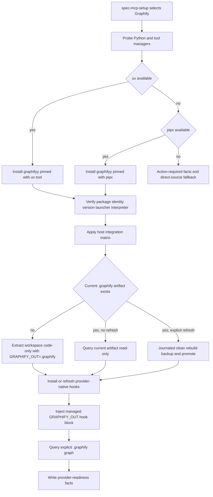

# Python Graphify Provider Migration - Plan

## Goal Capsule

- **Objective:** 将 spec-first 的 required Graphify Provider 从 npm `@sentropic/graphify@0.17.1` 切换到 PyPI `graphifyy@0.9.12`，同时保持 provider-neutral readiness、`.graphify/` artifact、advisory evidence 和五宿主边界稳定。
- **Authority hierarchy:** `docs/10-prompt/结构化项目角色契约.md` 约束 source/runtime、script/LLM 与 evidence 边界；本计划约束迁移目标；当前 `skills/spec-mcp-setup/**`、CLI、tests 和 contracts 证明 spec-first 实现事实；PyPI `graphifyy 0.9.12` 发布元数据与对应源码证明候选 Provider 行为。
- **Execution posture:** 先以prospective PyPI配置建立Python tool-manager、distribution provenance与package-identity探测，在不改变current npm默认值的前提下完成Provider capability、安装摩擦和迁移路径release gate；gate通过后再一次性切换registry默认值。保持`.graphify/`为唯一current artifact；已有artifact默认只读保留，显式refresh统一通过journaled临时重建、机械验证、备份、可恢复promote和next-run recovery迁移，不把`graphify-out/`引入current contract。
- **Stop conditions:** 若实现必须长期并行维护 npm/PyPI 双默认 Provider、默认安装 `graphifyy[mcp]`、静默执行远程 LLM semantic extraction、把 `graphify-out/` 提升为第二 current artifact、或伪造 Qoder upstream 原生支持，停止并重新规划。
- **Tail ownership:** `spec-work` 负责实现、fresh-source eval、五宿主 runtime regeneration、验证与 closeout；`spec-mcp-setup` 只负责确定性安装、配置、建图、查询和 readiness facts，普通 workflow 继续负责是否消费 advisory graph candidate。

---

## Product Contract

### Summary

本迁移替换 Graphify 的发布生态和运行时实现，不改变 spec-first 对 project graph 的产品定义。Graphify 仍是 required harness runtime 中的 `project-graph` Provider：CLI 负责建立和更新图，project skill/host instruction 指导 Agent 使用，Git hook 负责 provider-native 增量更新，MCP 保持 opt-in。

迁移后的默认包为 PyPI `graphifyy@0.9.12`，要求 Python `>=3.10`。安装优先使用已存在的 `uv`，其次使用已存在的 `pipx`；spec-first 不通过远程 shell bootstrap 安装 package manager，也不默认回退到 plain `pip install`。首次建图使用 Python Provider 的本地 AST 路径 `extract --code-only`，不探测 API key、不发送文档或源码到远程模型。

### Problem Frame

当前实现不仅把包名固定为 npm `@sentropic/graphify@0.17.1`，还把 npm global bin、npm PATH symlink repair、npm Provider 的 `.graphify/` 默认目录、project-skill 写入面和 hook marker 编码进 `graphify.cjs`、registry、readiness 文案和 tests。把 registry 中的 ecosystem/package/version 改成 PyPI 并不能形成可用迁移。

**为何现在离开 npm（决策记录，非未证实用户痛点指标）：** 历史上 spec-first 曾用 PyPI `graphifyy`，后迁到 npm 以降低 Node 侧安装摩擦；同日 registry 仍将 Graphify pin 在 npm latest。本计划迁回 Python 的驱动是 **adapter 与上游真相源对齐**，而非「npm 0.17.1 已坏」：上游多宿主 project install、hook 嵌入 interpreter、隔离 tool environment 与 `extract --code-only` 确定性路径均以 Python 分发为原生面；继续在 npm adapter 上仿真这些行为会把 PATH symlink repair、假 identity 与错误 host 写入面固化进 setup 控制面，后续每个上游小版本都要双维护。接受的代价是 uv/pipx 前置、候选Provider release gate 与同名 CLI collision 处理；rollback 仍可回到 npm pin。若产品侧只要求「CLI 能跑图」且不依赖 Python 原生 host install 面，可选择不实施本迁移——本方案默认目标用户是需要五宿主一致 readiness 与 `.graphify/` 唯一 current contract 的 setup 控制面。

**默认切换的产品门槛：** 上述架构对齐只证明候选方向合理，不足以证明默认迁移值得。Stage 1 必须在代表性临时项目上记录 npm baseline 与 Python candidate 的首次setup成功率、action-required/repair比例、安装与重建耗时、Provider升级维护步骤和失败恢复成本。若Python路径未降低维护面，或显著增加用户前置与repair摩擦，则保持npm默认并把Python能力保留为未发布候选；不得仅凭机械测试通过进入Stage 2。

Python `graphifyy@0.9.12` 的 CLI 仍名为 `graphify`，但安装模型不同：`uv tool` 或 `pipx` 创建隔离环境；launcher 可能不在原始 PATH；Git hook 会嵌入安装时的 Python interpreter；升级或重装后需要重新安装 hook。仅通过 `graphify --version` 无法区分 npm 与 PyPI Provider，存在同名命令误识别风险。

Python Provider 默认写入 `graphify-out/`，上游 README 建议团队提交该目录；spec-first 当前把 project graph 视为 provider runtime、默认忽略，并已将 `.graphify/` 固化为 current artifact contract。直接采用上游默认会重新打开 artifact 双真相源、git churn、历史文档漂移和下游消费破坏问题。

Python Provider 的 host 支持也不完全等同于 spec-first 五宿主。`0.9.12` 原生提供 Claude、Codex、Cursor 与 Kiro project install，但没有 Qoder platform。Claude 写入 `.claude/skills/graphify/`、`.claude/CLAUDE.md`、根 `CLAUDE.md` 与 `.claude/settings.json`；Codex 写入 `.codex/skills/graphify/`、`AGENTS.md`、`.codex/hooks.json`；Cursor 只写 `.cursor/rules/graphify.mdc`；Kiro 写 skill 与 steering。迁移必须按真实写入面实施，不能继续沿用 npm Provider 的假设或补造不存在的provider-native surface。

### Requirements

#### Package and runtime identity

- R1. Registry 必须将 Graphify external dependency 切换为 PyPI `graphifyy@0.9.12`，并记录 Python `>=3.10`、PyPI/GitHub source、pin policy 与 Python tool install 风险。
- R2. 安装优先级必须是已安装 `uv`、已安装 `pipx`、否则 action-required；不得静默 curl bootstrap package manager，也不得默认使用 plain `pip install`。
- R3. Provider readiness 必须验证 package identity、package version、CLI version 和 resolved executable；只匹配 `graphify --version` 不足以确认 Python Provider。
- R4. `uv` 安装必须使用隔离 tool environment和已确认的兼容Python，并禁止默认下载managed Python；`pipx` 只作为等价 fallback。安装器选择、tool environment、interpreter path 和 executable path 必须进入 setup diagnostic facts 或 limitations。
- R5. PATH 不可见时允许从 tool-manager 标准 bin 路径解析绝对 launcher，但不得继续备份或重指向未知 `graphify` symlink；命令冲突必须显式报告。
- R5a. 安装必须固定到PyPI官方wheel URL和release-reviewed SHA-256，依赖索引默认固定为官方PyPI；distribution provenance未确认时不得继续project integration或hook mutation。

#### Artifact and graph lifecycle

- R6. `.graphify/` 必须保持唯一 current Graphify artifact root；`graphify-out/` 继续是 legacy/foreign-default evidence，不成为第二 current contract。
- R7. spec-first 调用 Python Provider 时必须设置 `GRAPHIFY_OUT=.graphify`，且 extract、update、query、path、explain、hook rebuild 对同一 artifact root 生效。
- R8. 首次建图必须使用 `graphify extract <workspace> --code-only`，在 repo root 生成 `.graphify/`；默认不得触发 LLM backend autodetection、API key 使用或 semantic extraction。
- R9. 已存在current artifact时，显式refresh禁止原位`update`/`--force`，必须统一走R18a/F5的journaled clean rebuild（contained staging → 机械验证 → backup → promote）。只有首次生成可直接写入尚不存在的`.graphify/`；不得为单个Provider版本对引入原位兼容策略分支。
- R10. Query verification 必须显式读取 `.graphify/graph.json` 或在 `GRAPHIFY_OUT=.graphify` 环境中运行，成功退出才可设置 `query_verified=true`。
- R11. Hook install 后必须确保 post-commit/post-checkout 使用安装时 interpreter 且固定 `GRAPHIFY_OUT=.graphify`；升级、重装或 interpreter 漂移后必须刷新 hook。
- R11a. Readiness必须验证Provider生成的Git hook marker cardinality、expected interpreter、`GRAPHIFY_OUT=.graphify` substitutions和允许的Provider命令；host executable entries只允许verified launcher与expected subcommands。不得通过绑定完整上游hook模板摘要来复制Provider内部实现；marker外的user-owned配置必须保留且不得在默认setup smoke中执行。
- R11b. 真实hook smoke只能在contained临时repo中执行抽取出的Provider-owned marker block，并使用bounded rendezvous等待异步重建完成：记录触发前artifact hash/mtime，轮询预期artifact变化与rebuild log完成/失败信号，超时后收集日志并等待或终止残留子进程再清理临时repo。
- R11c. 所有Graphify第三方进程必须使用最小环境allowlist，只传递运行所需的`HOME`、受控`PATH`、locale、临时目录、Git上下文和明确的Graphify变量；API key、token、credential、云凭据和带认证信息的proxy变量不得从宿主环境继承。日志redaction是补充控制，不替代环境隔离。

#### Host parity and ownership

- R12. Claude、Codex、Cursor 与 Kiro 必须使用 Python Provider 的真实 project install surface，并按实际文件更新 mutation safety、configured probe、uninstall 和 docs。
- R13. Qoder 必须明确降级为 spec-first-owned host instruction 加 direct CLI usage，不得声称 Python Provider 提供 Qoder-native project skill或PreToolUse等host hook；repo-level post-commit/post-checkout Git hook仍按R11安装和验证。
- R14. Provider 写入 `AGENTS.md`/`CLAUDE.md` 后，spec-first 只能规范化受识别的 `## graphify` section；不得改写其他团队内容，也不得在 spec-first source repo 中让 Provider 覆盖 source-owned instruction。
- R15. Graphify project skill、host rule/steering、PreToolUse config 和 Git hooks 继续属于 provider/generated runtime；source 修改后只通过 `spec-first init` 重生 spec-first mirrors。

#### Migration and compatibility

- R16. 迁移必须先验证 Python Provider cutover，再处理 npm incumbent；不得在 Python Provider 未 ready 时先删除可回滚的 npm 安装。
- R17. 检测到 npm `@sentropic/graphify`、同名 PATH shadow 或 npm-era project runtime 时，facts 必须输出明确 migration state 和 cleanup action；未经单独授权不得自动卸载全局 npm 包。
- R18. 已存在`.graphify/`时，普通setup不得对current root执行extract/update；只读query用于判断当前artifact是否仍可消费。只有显式`--refresh`才能通过contained clean rebuild迁移current root，runtime不消费version-pair compatibility policy。
- R18a. Cutover前必须在release gate验证Python code-only artifact的机械完整性、code-focused capability下限、journaled clean rebuild、npm artifact backup restore与next-run recovery。迁移不得原位update；显式refresh必须clean rebuild、机械验证、backup和可恢复promote。
- R19. 仅存在 `graphify-out/` 时不得将其视为 current ready；应提示显式 setup 使用 `.graphify/` contract 重新生成，且不静默复制或移动未知历史内容。
- R20. Rollback必须是journaled machine/runtime切换而非仅代码回退：识别并备份Python-owned host/hook surfaces → 使用verified Python launcher执行bounded project/hook uninstall并验证无残留 → 恢复npm registry/adapter与npm pin → 恢复迁移前artifact backup → 重建npm host integration与readiness。任一步失败都必须保留journal并报告degraded，不得宣称rollback完成。

#### Evidence, documentation, and release quality

- R21. `provider-readiness.v2` 与 `project-graph-consumption.v1` 的 advisory evidence 语义必须保持不变；迁移不得把 Graphify 输出提升为 confirmed truth。
- R22. `graphifyy[mcp]`、`graphify-mcp` 和 HTTP server 不进入 required setup；如文档提及，只能标为显式 opt-in capability。
- R23. Registry、Provider、renderer、gitignore/runtime ownership、五宿主 projection、legacy replay、README、用户手册和 CHANGELOG 必须同步更新。
- R24. 实现必须覆盖 macOS、Linux、WSL 与 Windows 的 tool-manager/path/interpreter 差异，并以 contract tests 证明 unsupported/blocked 状态不会被总结为 ready。

### Flows

- F1. **Fresh uv install:** 显式 Graphify setup 发现 `uv` 和兼容 Python → 使用禁止Python下载的隔离tool install安装verified wheel → 验证distribution、package identity与CLI → 安装当前宿主project integration → `extract --code-only`生成`.graphify/` → 安装并验证hook → query probe → 写入fresh readiness。
- F2. **Fresh pipx fallback:** `uv` 不存在但 `pipx` 可用 → 使用兼容 interpreter 安装 pinned package → 从 pipx metadata/bin dir 解析 launcher → 执行与 F1 相同的 project/artifact/hook/query 验证，并记录 installer 为 pipx。
- F3. **No Python tool manager:** Python 或 uv/pipx 缺失 → setup 不执行 package mutation → 返回确定性 reason code、兼容版本要求和安装 next action → 普通 workflow 使用 direct-source fallback。
- F4. **npm incumbent collision:** PATH 上 `graphify` 指向 npm `0.17.1`，但 Python tool 已安装 → package-identity probe 拒绝把 npm CLI 当 ready → 使用 Python tool-manager 解析出的绝对 launcher完成 setup → readiness 标记 shadowing limitation并提示显式清理 npm incumbent。
- F5. **Existing `.graphify/`:** Python Provider安装完成且current artifact存在 → 普通setup只读query current artifact并验证project integration与hook，不运行extract/update或修改current root；显式refresh在contained staging执行clean rebuild和机械验证 → journal记录old/staged/backup paths与phase → backup并promote；caught failure立即restore，若在两次rename间崩溃，下次readiness在任何mutation前按journal恢复或完成promote。
- F6. **Legacy `graphify-out/` only:** setup 识别 legacy artifact → first generation 仍面向 `.graphify/` 执行 `extract --code-only` → legacy 目录保留、继续忽略 → readiness 只引用 `.graphify/` artifacts。
- F7. **Provider upgrade:** registry pin变化或tool environment/interpreter漂移 → reinstall/upgrade verified package → 重新验证identity → 重新执行project install → 对Provider hook执行uninstall/install marker-owned refresh与规范化 → 保留current graph，最后query probe。
- F8. **Qoder setup:** 安装 Python CLI并生成/验证 `.graphify/` → 不调用不存在的 `--platform qoder` → 由 spec-first Qoder runtime instruction 暴露 CLI 使用和 fallback，readiness 将host integration标记为`spec-first-adapter`而非`provider-native`；repo-level Git hook仍独立安装和验证。

### Acceptance Examples

- AE1. PATH 中存在 npm `graphify 0.17.1`，`uv tool list` 中存在 `graphifyy 0.9.12`。Setup 必须选择 Python launcher、记录 npm shadowing，不得因为 PATH 命令能运行就误报 ready。
- AE2. 系统只有 Python 3.9 且没有 uv/pipx。Setup 输出 `python-version-unsupported` 或 installer prerequisite reason code，不运行 plain pip，不创建 artifact。
- AE3. 项目已有`.graphify/graph.json`。普通setup不对current root运行extract/update，只运行package/project integration、hook与query probes；显式`--refresh`才在contained staging clean rebuild并迁移current root。
- AE4. 项目只有 `graphify-out/graph.json`。Setup 不把它放入 current `artifact_refs`，而是生成 `.graphify/` 或在失败时保持 degraded，并留下 legacy migration action。
- AE5. Claude project install 修改 `.claude/skills/graphify/`、`.claude/CLAUDE.md`、根`CLAUDE.md`和`.claude/settings.json`。Mutation safety必须覆盖这些真实路径，分别限定两个instruction入口的Graphify-owned section，其他hooks和文档章节保持不变。
- AE6. Qoder setup 不调用 `graphify install --project --platform qoder`。Setup 仍可通过 CLI、`.graphify/`、repo-level Git hook和spec-first Qoder instruction提供project-graph能力，并明确没有Qoder-native skill或host hook。
- AE7. `graphify extract . --code-only` 在没有任何 API key 的 repo 上成功。Setup 将 first generation 标记 completed，但 limitations 明确 docs/images semantic graph 未生成，不能宣称完整语义图。
- AE8. `uv tool install` 后 interpreter 位置发生变化。旧 hook status 或 interpreter probe 失败时，setup 重新安装 hook并再次验证；不得只修 shell PATH 后声称 hook ready。
- AE9. Python Provider query 返回非零、超时或被 signal 终止。`query_verified` 保持 false，readiness 为 degraded，artifact presence 不得覆盖失败。
- AE10. 用户回滚到npm Provider。Rollback先移除并验证Python-owned project integration与Git hook block，再恢复npm adapter、pin和host integration，并按journal从contained backup恢复npm artifact；任何步骤失败均保持degraded且不声明完成。
- AE11. npm生成的`.graphify/`可被Python query读取。普通setup仍不原位更新；显式迁移统一clean rebuild并保留npm artifact backup，rollback恢复backup而不是要求npm读取Python schema。
- AE12. 代码repo检测到supported source files，但`extract --code-only`输出AST failure并生成0-node graph。Artifact和query即使成功也不能fresh；facts返回extract-integrity failure。
- AE13. 宿主环境存在`OPENAI_API_KEY`、`ANTHROPIC_API_KEY`、云凭据和带认证proxy变量。Graphify install/extract/refresh/query/project-install子进程均看不到这些值；facts和logs也不包含原值。
- AE14. 用户的post-commit hook在Graphify marker外包含发布命令。Setup只验证结构，不执行完整hook；真实smoke在临时repo执行抽取的Provider-owned block，并等待detached rebuild receipt后再判定成功。

### Scope Boundaries

#### Now

- PyPI `graphifyy@0.9.12` pinned install、upgrade、identity、PATH 和 interpreter readiness。
- `.graphify/` current artifact adapter、code-only first generation、journaled clean refresh、query 和 Git hooks。
- Claude、Codex、Cursor、Kiro 原生 integration与 Qoder adapter/degraded parity。
- npm incumbent detection、分阶段 cutover、显式 cleanup guidance和 rollback。
- Registry、facts、tests、docs、CHANGELOG 与 generated runtime regeneration。

#### Deferred to Follow-Up Work

- `graphifyy[mcp]` stdio/HTTP server integration。
- docs、PDF、image、video 的 LLM semantic extraction和 API key policy。
- 自动提交 `.graphify/` 或 `graphify-out/` 的 team-shared graph模式。
- 向 Graphify upstream 提交 Qoder platform支持。
- 抽象可复用的通用 Python tool-provider framework；只有第二个 Python Provider 出现真实 consumer 后再评估。
- 为所有支持OS/Python组合维护逐个transitive wheel hash的lock manifest；当前迁移固定并校验direct `graphifyy` wheel，transitive依赖保留官方PyPI trust并以inventory/audit缓解。

#### Outside This Product's Identity

- 把 Graphify 当作 source truth、root-cause engine、deterministic impact analysis或测试覆盖证明。
- 由 spec-first fork、vendor 或重实现 Graphify 图算法、Skill 内容和 MCP server。
- 通过 rigid workflow gate 强制所有代码问题先查询 Graphify。

---

## Planning Contract

### Key Technical Decisions

- KTD1. **切换 Provider，不切换 artifact path contract。** 使用Python Provider官方支持的`GRAPHIFY_OUT=.graphify`，保持`.graphify/`为唯一current root。由于artifact是可重建的generated/advisory runtime，不建设单版本对原位兼容策略；已有artifact默认只读保留，显式refresh统一clean rebuild并保留可恢复backup。
- KTD2. **默认安装 manager 为 uv，pipx 是 fallback。** 二者都提供隔离环境和稳定 tool bin；plain pip 在 PEP 668、用户 bin、解释器错配和 Windows launcher方面不可预测，不进入自动路径。
- KTD3. **不自动 bootstrap uv/pipx或Python。** 远程shell installer、Homebrew、apt、winget、系统Python mutation和uv managed Python download超出Provider setup的最小授权面；缺失时输出action-required facts，uv调用使用`--no-python-downloads`和已确认interpreter。
- KTD4. **验证 package identity，而不只验证 CLI version。** readiness 必须从 uv/pipx metadata或 launcher interpreter的 `importlib.metadata` 确认 `graphifyy==0.9.12`。同名 npm command 即使输出相同版本也不能通过。
- KTD5. **绝对 launcher优先于 PATH 修复。** Setup 和 hook使用已确认的 executable/interpreter；移除当前“备份并重指向 stale symlink”的默认修复。PATH collision 属于需要用户裁决的 machine state，不应由 spec-first猜测 ownership。
- KTD6. **首次建图只走 `--code-only`。** Python Provider 已提供显式本地 AST 模式；不再先尝试 semantic extract 再从失败回退。该路径满足 deterministic floor，避免 API key、数据出境和不可预测费用。
- KTD7. **Provider-native hooks保留，但执行有界刷新、output-root规范化和行为验证。** Fresh install由`graphify hook install`创建；升级时先用provider-native uninstall移除marker-owned block，再install刷新interpreter。spec-first在两个Provider marker block内有界规范化output-root-dependent literal并加入`GRAPHIFY_OUT=.graphify`，验证marker cardinality、interpreter、允许命令与artifact substitutions；不绑定完整上游模板摘要。真实smoke只在contained临时repo执行抽取出的Provider-owned block，并通过bounded rendezvous等待detached rebuild完成，不执行marker外用户内容。
- KTD8. **四宿主原生、一宿主适配。** Claude/Codex/Cursor/Kiro使用 upstream project install；Qoder由 spec-first runtime instruction适配 direct CLI，不复制或伪装 upstream skill。
- KTD9. **全局 npm卸载不是 cutover 前置动作。** 先形成可验证的 Python ready状态，再输出显式 cleanup；这样失败可回滚，也避免删除用户其他项目仍在使用的全局 Provider。
- KTD10. **Provider contract保持 capability-first。** Registry 可记录 PyPI/package manager事实，但 downstream workflows继续只消费 `project-graph`、readiness、native interface、artifact refs和limitations，不依赖 uv、pipx或 Graphify Python内部模块。
- KTD11. **不引入通用 Python package-manager子系统。** 当前只有 Graphify需要该能力，优先在 Graphify Provider模块内形成小型、可测试的 resolver；当第二个真实 Provider复用时再抽取。
- KTD12. **版本 pin 使用发布元数据，不跟随 floating latest。** 本计划以 2026-07-10 发布的 PyPI `0.9.12` 为基线；后续升级仍通过 registry pin、release review和 focused tests完成。
- KTD13. **Direct distribution integrity进入deterministic floor，transitive trust不伪装为全量锁定。** Registry固定`0.9.12` universal wheel URL与SHA-256 `94f9d0d7ef68455a2055c7623fb9574c7a781afb1473d26c7936d1abfc14d62c`；uv/pipx从带hash的direct wheel requirement安装，transitive dependencies默认只从官方PyPI解析并记录inventory/audit结果。完整transitive hash lock是显式deferred能力，不把当前边界表述成端到端cryptographic reproducibility。
- KTD14. **Readiness与manual visibility分离。** Package identity、absolute Python launcher、artifact、query与hook全部verified时，即使原始PATH仍被npm command shadow，也返回`fresh`并携带shadowing limitation；只有selected launcher或identity ambiguous时才`degraded`。
- KTD15. **第三方Provider进程使用最小环境。** Graphify命令不继承完整`process.env`；adapter为每类动作构建allowlist环境，凭据类变量默认剔除。Redaction只负责receipt安全，不能作为credential isolation替代品。
- KTD16. **默认切换需要产品结果gate。** Registry current pin只在candidate smoke、迁移恢复和baseline比较同时通过后切换；mechanical green不能单独证明默认迁移改善time-to-trusted-change。

### High-Level Technical Design

### Source and Runtime Ownership

| Surface | Owner | Authority | Migration rule |
|---|---|---|---|
| `skills/spec-mcp-setup/setup-registry.json` | spec-first source | Dependency and Provider setup contract | 切换到 PyPI pin与Python install metadata |
| `skills/spec-mcp-setup/scripts/providers/graphify.cjs` | spec-first source | Deterministic Provider adapter | 实现manager、identity、artifact、host和hook lifecycle |
| `.graphify/` | Provider runtime under spec-first contract | Generated/advisory | 保持current；默认忽略；不promote为source truth |
| `graphify-out/` | Legacy/foreign default | Compatibility evidence | 保留忽略；不作为ready artifact |
| Host Graphify skills/rules/settings | Provider/generated runtime | Rebuildable integration | 由project install或spec-first projection生成，不手改作为source |
| `AGENTS.md`/`CLAUDE.md` 的 `## graphify` | Mixed ownership instruction section | Checked-in host入口；section可被规范化 | 仅有界替换Graphify section，spec-first source repo禁止Provider覆盖 |
| `.git/hooks/post-commit`、`post-checkout` | Provider-native local runtime | Local refresh mechanism | 安装后注入有marker的artifact env并验证interpreter |
| setup facts | spec-first generated control-plane | Mechanical readiness evidence | 记录manager、identity、artifact、query、hook和limitations |

### Host Integration Matrix

| Host | Python Provider native command | Expected provider writes | Spec-first posture |
|---|---|---|---|
| Claude | `graphify install --project --platform claude` | `.claude/skills/graphify/`、`.claude/CLAUDE.md`、根`CLAUDE.md`、`.claude/settings.json` | Provider-native；分别保护nested/root instruction、shared settings和source repo |
| Codex | `graphify install --project --platform codex` | `.codex/skills/graphify/`、`AGENTS.md`、`.codex/hooks.json` | Provider-native；Codex PreToolUse当前可能为no-op，不能当query evidence |
| Cursor | `graphify install --project --platform cursor` | `.cursor/rules/graphify.mdc` | Provider-native rule-only；不得补造`.cursor/skills/graphify/` |
| Kiro | `graphify install --project --platform kiro` | `.kiro/skills/graphify/`、`.kiro/steering/graphify.md` | Provider-native；不与spec-first pointer混淆 |
| Qoder | 无 upstream `qoder` platform | 无Qoder-native skill/host hook；repo-level Git hook独立存在 | spec-first adapter；CLI + `.graphify/` + Qoder instruction，limitations必须显式 |

### Installation and Identity Model

Provider plan应产生结构化选择结果，而不是在执行期猜测：

- installer: `uv | pipx | none`
- package: `graphifyy`
- expected version: registry pin
- package identity status: `verified | mismatch | unknown`
- resolved CLI: absolute path when available
- resolved interpreter: absolute path when discoverable
- original PATH command: path and identity classification
- collision state: `none | npm-incumbent | other-command | ambiguous`
- Python compatibility: observed version and `>=3.10` result

建议 reason codes：

- `graphify-python-missing`
- `graphify-python-version-unsupported`
- `graphify-tool-manager-missing`
- `graphify-pypi-install-failed`
- `graphify-package-identity-unverified`
- `graphify-package-version-mismatch`
- `graphify-cli-shadowed-by-npm-incumbent`
- `graphify-cli-path-ambiguous`
- `graphify-hook-interpreter-stale`
- `graphify-artifact-contract-mismatch`
- `graphify-qoder-provider-native-integration-unavailable`

这些是script-owned mechanical facts；是否接受降级、何时清理npm incumbent和是否需要Graphify仍由用户或LLM workflow判断。

### Migration and Rollback Strategy

#### Stage 1: Compatibility floor

- 先扩registry/schema/renderer，使prospective PyPI ecosystem、installer和risk flags可表达，但保持current npm pin。
- 新增package-identity和tool-manager probes，以显式candidate配置测试，不删除npm分支测试fixture。
- 用mocked uv/pipx/Windows路径建立characterization，确保未知command不会被误认。
- 执行U9的Python artifact capability、journaled clean migration、npm backup restore和next-run recovery gate；同时对比npm baseline与Python candidate的setup成功率、action-required/repair比例、安装/重建耗时和升级维护步骤。只有机械gate通过且产品结果不劣于baseline，才能进入Stage 2。

#### Stage 2: Provider cutover

- 将current registry pin切换到 `graphifyy@0.9.12`。
- Provider plan只生成Python install actions。
- 所有Graphify CLI调用统一带 `GRAPHIFY_OUT=.graphify`。
- 首次建图切换到 `extract --code-only`；已有artifact的refresh统一clean rebuild，query/hook按新语义验证。

#### Stage 3: Host and migration cleanup

- 对齐四个provider-native host写入面和Qoder adapter。
- 识别npm incumbent、旧project integration和legacy artifact，输出cleanup/refresh actions。
- 删除npm symlink repair实现与其tests；保留npm rollback说明和legacy fixture读取能力。

#### Rollback

- 读取迁移journal，识别并备份Python-owned host skill/rule/steering、instruction section、PreToolUse entry和Git hook block。
- 使用verified Python launcher执行bounded project/hook uninstall，验证Python-owned surface无残留；失败则保留journal并报告degraded。
- 回退registry dependency、Provider install/resolve分支和host surface expectations到npm实现，安装或确认npm pin并重建npm host integration。
- 按journal从contained backup恢复迁移前npm artifact并验证query；不使用`graphify-out/`逆迁移。
- Python全局tool移除仍是单独授权的cleanup，不是rollback完成的前置条件；但project/runtime surface未清理前不得声称rollback完成。
- 若Python cutover在发布前验证失败，禁止同时发布“PyPI pin已生效”和“npm fallback仍默认”的混合状态。

### Assumptions

- PyPI `graphifyy@0.9.12` 是本计划日期可获取的最新稳定版本，声明 Python `>=3.10`，console script为 `graphify`。
- `GRAPHIFY_OUT` 是 `0.9.12` package-wide public override，extract、query、update、hook和path guards使用同一值。
- `extract --code-only` 能在无API key情况下生成代码图；非代码语义内容缺失会作为limitation而不是setup failure。
- uv/pipx metadata输出在不同版本可能变化，因此实现应使用小型parser和fixture，而不是依赖human-formatted单行文本。
- Qoder未出现在 `0.9.12` platform install registry；本计划不推断未来版本行为。

### Risks and Mitigations

| Risk | Impact | Mitigation |
|---|---|---|
| PyPI metadata仍指向旧 GitHub namespace | 供应链来源看似不一致 | 同时记录PyPI文件hash、package version和用户指定的Graphify-Labs repository；发布升级前人工核对 |
| Transitive dependencies未逐包hash lock | 官方index中的依赖解析仍可漂移或受供应链事件影响 | 明确这是accepted residual；记录installed inventory并运行`pip-audit`或等价扫描。出现供应链事件、重复安装不一致或企业合规要求时，触发独立platform lock-manifest工作 |
| 同名npm/Python CLI collision | 错误Provider被标ready或hook调用旧版本 | package identity + absolute launcher + collision reason code；不只看version |
| uv自动下载Python | 产生用户未预期的大型mutation | 要求compatible Python先ready，uv使用`--no-python-downloads`和已确认interpreter；缺失时action-required |
| hook嵌入interpreter后升级失效 | 图停止更新但setup误报ready | 升级时provider-native uninstall/install刷新marker-owned block，再验证interpreter、normalized content和真实hook执行 |
| `GRAPHIFY_OUT`未进入hook环境 | hook生成第二个 `graphify-out/` | spec-first managed env block + post-install smoke + legacy directory guard |
| 上游skill硬编码 `graphify-out/` | Agent读取错误artifact | 继续执行有界instruction normalization；验证host skill/rule中current path，必要时记录provider limitation |
| npm/Python graph schema不兼容 | Python无法继续读取旧artifact或rollback误用新schema | 普通setup只读探测；显式refresh统一journaled clean rebuild并保留npm artifact backup，rollback恢复backup |
| Provider hook仍有hardcoded output guards | `.graphify/`存在但hook静默跳过或产生第二目录 | 规范化marker block内所有output-root literals并实际执行post-commit/post-checkout smoke |
| AST extractor失败但CLI仍退出0 | 空图被误报ready | 对比detected code-file count、AST diagnostics和node count；非空supported corpus要求非零图 |
| Python默认依赖体积和平台wheel差异 | 安装慢或某平台失败 | pinned wheel install、bounded timeout、平台fixture、失败时direct-source fallback |
| Cursor/Kiro真实写入面变化 | safety allowlist阻断或漏管 | pin版本并以Provider source/fixture建立mutation surface tests |
| Qoder能力低于其他宿主 | 用户误以为全宿主同构 | host matrix与readiness limitation显式呈现，不伪造skill/hook |
| 上游建议提交graph与spec-first默认忽略冲突 | git churn、advisory artifact被误当source | spec-first policy保持默认忽略；team-sharing只作为future opt-in |

### System-Wide Impact

- **Setup control plane:** external dependency schema、risk rendering、provider plan/apply/verify、facts和next actions改变。
- **Host runtime:** Claude/Codex/Cursor/Kiro的Provider生成面变化；Qoder走adapter；需要五宿主重新投影和doctor验证。
- **Repository policy:** `.graphify/` 和 `graphify-out/` ignore规则保持，但文案从“npm provider-native”改为“spec-first current contract / Python upstream default legacy”。
- **Security/privacy:** 默认first generation从可能触发semantic backend的extract收敛到code-only；数据出境风险降低。
- **Operational support:** 用户需要理解Python、uv/pipx、PATH collision和hook interpreter freshness；README和用户手册必须提供repair matrix。
- **Downstream workflows:** `project-graph-consumption.v1`无需schema变更；仅更新provider-specific appendix和setup repair说明。

---

## Implementation Units

### U1. Extend the registry for the PyPI Graphify dependency

- **Goal:** 让registry、schema和renderer能够准确描述prospective pinned PyPI tool、Python约束、installer选择和新的safety risk，同时保持current npm默认值直到U9 gate通过。
- **Requirements:** R1-R5, R5a, R23-R24
- **Dependencies:** None
- **Files:**
  - Modify: `skills/spec-mcp-setup/setup-registry.json`
  - Modify: `skills/spec-mcp-setup/setup-registry.schema.json`
  - Modify: `skills/spec-mcp-setup/scripts/lib/renderer.cjs`
  - Test: `tests/unit/mcp-setup-registry.test.js`
  - Test: `tests/unit/mcp-setup-facts-renderer.test.js`
- **Approach:** 扩展schema和renderer，使显式candidate fixture可表达`ecosystem:pypi`、package `graphifyy`、version `0.9.12`、Python requirement、installer policy、official wheel URL、SHA-256、index policy和hook normalization contract version；current registry仍保持npm pin。Risk flags增加isolated Python tool install、interpreter、PATH collision、third-party executable config、project runtime write和git hook write。Schema只扩展当前需要的可选字段，不构建通用package-manager DSL，也不引入compatibility-policy路径或完整hook模板digest。
- **Patterns to follow:** 复用external dependency、platform overrides、safety和installation现有结构；保持`setup-registry.v8`，除非字段语义无法向后兼容才升级schema version。
- **Test scenarios:**
  - Happy path: candidate fixture解析出`graphifyy@0.9.12`、Python约束和uv/pipx policy；current registry仍解析为npm pin。
  - Contract: CodeGraph仍保持npm ecosystem，Graphify切换不污染其他dependencies。
  - Error: 缺package/version/command或非法installer policy时schema拒绝。
  - Rendering: candidate human preview显示PyPI pin和installer prerequisites；current默认preview在cutover前仍显示npm。
  - Provenance: wheel URL/hash缺失、非HTTPS、host非`files.pythonhosted.org`或digest格式非法时schema/plan fail closed。
  - Hook contract: normalization contract version缺失或不受支持时不得进入hook mutation；不要求与完整上游模板digest联动。
- **Verification:** Registry contract可被current setup loader消费；candidate JSON/human output能区分PyPI package、CLI command和installer，且U1完成时current npm默认值未变化。

### U2. Implement deterministic Python tool and package identity resolution

- **Goal:** 在同名CLI和多Python环境下确认正在使用的确实是pinned `graphifyy`。
- **Requirements:** R2-R5, R5a, R11c, R16-R17, R24
- **Dependencies:** U1
- **Files:**
  - Modify: `skills/spec-mcp-setup/scripts/providers/graphify.cjs`
  - Modify: `skills/spec-mcp-setup/setup-registry.json`
  - Modify: `skills/spec-mcp-setup/setup-registry.schema.json`
  - Test: `tests/unit/mcp-setup-providers.test.js`
  - Test: `tests/unit/mcp-setup-entrypoint.test.js`
- **Approach:** 在Provider内实现Graphify-specific resolver：探测Python兼容性、uv/pipx可用性、manager-owned tool metadata、bin dir、launcher和interpreter。Install action按优先级使用candidate配置中的带SHA-256 direct wheel requirement、官方index、已确认interpreter和no-Python-download policy生成uv或pipx argv。Post-install必须确认direct distribution provenance、package identity/version与CLI version，并记录transitive inventory与audit结果作为limitation/receipt。删除npm prefix扫描和symlink repoint默认路径；PATH上的npm incumbent只作为collision fact。为所有Graphify动作构建最小环境allowlist，默认剔除API key、token、云凭据和带认证proxy变量；Index URL、stderr和environment diagnostics继续通过process runner脱敏。
- **Execution note:** 先补当前npm resolver characterization与新Python resolver failing tests，再替换实现，避免同名command误识别回归。
- **Patterns to follow:** 复用`process-runner.cjs`的argv执行、timeout、redaction和signal处理；所有命令使用结构化command/args，不拼shell字符串。
- **Test scenarios:**
  - Happy path: uv metadata、bin dir和launcher共同确认`graphifyy 0.9.12`。
  - Fallback: uv缺失、pipx存在时选择pipx。
  - Error: uv/pipx均缺失时零mutation并返回tool-manager reason code。
  - Error: Python 3.9且pipx需要该interpreter时阻断。
  - Collision: PATH是npm Graphify、uv tool是Python Graphify时选择绝对Python launcher并记录shadowing。
  - Collision: PATH普通文件或未知package提供`graphify`时不得备份、删除或重指向。
  - Version: package identity正确但version不匹配时进入upgrade/reinstall，不进入project mutation。
  - Provenance: alternate index、wheel digest mismatch、missing provenance或credential-bearing diagnostic均fail closed并正确redact。
  - Supply chain: installed transitive inventory可重复读取，audit finding进入limitation且不会被错误渲染为fully hash-locked。
  - Process: version/identity probe被signal、timeout或输出截断时不得ready。
  - Environment: 注入到宿主环境的API key、token、云凭据和带认证proxy变量不出现在Graphify子进程环境、facts或logs中。
  - Windows: `.exe` launcher、uv/pipx bin和interpreter discovery不依赖POSIX shebang。
- **Verification:** Provider plan的每个install/project action都引用已确认launcher或在install后重新resolve；ready结果包含可审计identity事实或limitation。

### U9. Prove candidate value, clean migration, and capability before cutover

- **Goal:** 在不改变current npm默认值的前提下，证明Python candidate的安装价值、code-focused能力、统一clean migration和rollback路径达到默认切换门槛。
- **Requirements:** R6-R10, R18, R18a, R19-R21
- **Dependencies:** U2
- **Files:**
  - Modify: `skills/spec-mcp-setup/scripts/providers/graphify.cjs`
  - Modify after gate approval: `skills/spec-mcp-setup/setup-registry.json`
  - Create or modify: `tests/fixtures/mcp-setup/graphify-migration/`
  - Create or modify: `docs/validation/graphify-python-provider-migration-receipt.md`
  - Test: `tests/unit/mcp-setup-registry.test.js`
  - Test: `tests/unit/mcp-setup-providers.test.js`
  - Test: `tests/unit/mcp-setup-entrypoint.test.js`
- **Approach:** 在固定representative repo revision和临时HOME中分别运行npm baseline与Python candidate，记录首次setup成功率、action-required/repair步骤、安装与clean rebuild耗时、升级维护步骤和失败恢复结果。对Python code-only图运行固定`query/path/explain`场景，由source-confirmed refs判断关键节点与关系召回下限。迁移机械路径固定为journaled clean rebuild：在contained staging生成并通过schema、extract-integrity、artifact和query checks，持久化old/staged/backup paths与phase，再依次rename old→backup、staged→`.graphify`；caught failure立即restore，crash window由下一次readiness在任何Provider mutation前恢复。不得声称两个rename构成单一原子事务。脚本只产生机械receipt；release reviewer判断candidate能力与产品gate是否充分，并在validation artifact记录结论、source refs、limitations和owner decision，不生成runtime compatibility policy。只有receipt结论允许且owner批准后，本unit最后一步才把current registry pin一次性切换到PyPI；否则保持npm且U3-U8不进入cutover执行。
- **Patterns to follow:** 复用contained temp/cache、artifact hash、raw log receipt和recovery-first transaction pattern；scripts准备baseline/candidate facts，LLM/reviewer判断能力与默认切换价值。
- **Test scenarios:**
  - Current artifact: Python query成功或失败都不触发原位update；普通setup不碰root。
  - Migration success: staged graph通过机械checks后按journal backup+promote，artifact refs只指new root。
  - Migration failure: extract/query/rename任一步caught failure时restore old root；模拟进程在两次rename间终止时，next-run recovery根据journal恢复或完成promote。
  - Capability: fixed code-focused query/path/explain cases能召回source-confirmed关键区域；能力下降被记录为release limitation或cutover blocker。
  - Product gate: Python candidate的setup/repair摩擦或维护步骤明显劣于npm baseline时，receipt结论为no-cutover，current registry保持npm。
  - Rollback: Python-owned project/runtime surface清理、npm host integration恢复和artifact backup restore按journal完成；任一步失败保持degraded。
- **Verification:** 默认切换由可回源的candidate receipt支撑；runtime只有一条clean migration路径，不依赖手工version-pair policy；rollback覆盖代码、artifact和machine/runtime surfaces。

### U3. Adapt graph lifecycle to the stable `.graphify/` contract

- **Goal:** 使用Python Provider完成无远程副作用的first generation、refresh和query，同时不改变current artifact root。
- **Requirements:** R6-R10, R18, R18a, R19-R22
- **Dependencies:** U2, U9
- **Files:**
  - Modify: `skills/spec-mcp-setup/scripts/providers/graphify.cjs`
  - Modify: `skills/spec-mcp-setup/setup-registry.json`
  - Test: `tests/unit/mcp-setup-providers.test.js`
  - Test: `tests/unit/mcp-setup-entrypoint.test.js`
  - Test: `tests/fixtures/mcp-setup/legacy-parity/replay-runtime-contracts.cjs`
- **Approach:** 所有Graphify进程使用最小环境allowlist并设置`GRAPHIFY_OUT=.graphify`。首次repo-root建图使用`extract . --code-only`；nested requirement workspace使用`extract <workspace> --out <repo-root> --code-only`。Current artifact存在时普通setup只读query；显式refresh禁止原位`update`/`--force`，统一执行U9验证的journaled clean rebuild。First-generation receipt记录detected supported code-file count、AST failure diagnostics和resulting node count；非空supported corpus生成0-node图时degraded。Query可同时传`--graph .graphify/graph.json`以降低环境遗漏风险。`graphify-out/`只影响migration next action。
- **Patterns to follow:** 保留path containment、symlink escape、nested workspace与artifact refs的现有安全检查；把默认artifact root从代码常量收敛到registry contract。
- **Test scenarios:**
  - Happy path: 无API key时`extract --code-only`生成`.graphify/graph.json`并通过query。
  - Existing: 普通setup不对current artifact运行extract/update，只读query并报告当前可消费状态。
  - Refresh: 显式refresh不运行原位`update`，执行journaled staged clean rebuild、backup与promote；失败restore。
  - Legacy: 只有`graphify-out/`时不进入current refs，重新生成`.graphify/`。
  - Nested: child workspace扫描结果落在repo-root `.graphify/`，不得逃逸。
  - Safety: artifact root、graph leaf或workspace symlink逃逸时零Provider mutation。
  - Error: extract成功但artifact缺失、query失败或graph incompatible时degraded。
  - Integrity: supported code files>0且node count=0或AST diagnostics失败时degraded；empty corpus可完成但带empty-corpus limitation。
  - Privacy: first-generation argv必须包含`--code-only`且不包含backend/model/API参数；子进程环境不含宿主credential变量。
- **Verification:** `.graphify/`是facts中的唯一current artifact root；first generation不需要LLM/API key；旧artifact只产生migration提示。

### U4. Rebuild hook management around the Python interpreter

- **Goal:** 让post-commit/post-checkout稳定使用Python Provider并持续更新`.graphify/`。
- **Requirements:** R7, R11-R11c, R16-R18, R24
- **Dependencies:** U2, U3
- **Files:**
  - Modify: `skills/spec-mcp-setup/scripts/providers/graphify.cjs`
  - Test: `tests/unit/mcp-setup-providers.test.js`
  - Test: `tests/unit/mcp-setup-entrypoint.test.js`
- **Approach:** 适配Python Provider的`# graphify-hook-start`与`# graphify-checkout-hook-start` markers。Fresh install运行`hook install`；upgrade/interpreter drift先运行provider-native`hook uninstall`移除marker-owned blocks，再由已确认新launcher运行`hook install`。在两个Provider-owned marker block内有界规范化literal output guards/filters为`.graphify`并加入spec-first env marker；不再注入PATH作为主要修复。Status除CLI exit外还检查marker cardinality、expected interpreter/import、`GRAPHIFY_OUT`和允许命令，不匹配完整上游模板摘要。Marker外unrelated content不执行、不改写。真实smoke从已验证marker中抽取Provider-owned block，在contained临时repo和最小环境中执行；触发前记录artifact hash/mtime，之后轮询artifact变化与rebuild log完成/失败信号，超时后收集日志并等待或终止残留子进程。
- **Patterns to follow:** 延续当前marker-count、防歧义、atomic write、hook leaf symlink protection和worktree gitdir fail-closed逻辑。
- **Test scenarios:**
  - Happy path: 两个hook都有Provider marker与单一spec-first env block。
  - Upgrade: interpreter改变后重装hook，旧pinned path不再出现。
  - Idempotency: 重复setup不追加重复env block。
  - Error: marker缺失、重复或不配对时不猜测修改，readiness degraded。
  - Worktree: `.git`是gitdir pointer时不写uncontained hook，并说明skip reason。
  - Safety: symlinked hooks dir或hook leaf阻断mutation。
  - Regression: hook执行环境不产生默认`graphify-out/`。
  - Integration: 在contained临时repo执行抽取的post-commit与post-checkout Provider block，通过bounded rendezvous确认`.graphify/`完成更新且不因hardcoded guard跳过。
  - Async: detached child未完成、失败或超时时不得把hook返回0当作成功；cleanup前处理残留子进程。
  - Security: marker中出现unexpected launcher/subcommand或缺少artifact env时readiness fail closed；unrelated user hook内容保留且不会被smoke执行。
- **Verification:** Hook readiness代表“两个hook、正确interpreter、正确artifact env均已验证”，而不是只代表`graphify hook status`退出0。

### U5. Align native host integrations and the Qoder adapter

- **Goal:** 按Python Provider真实能力提供Claude、Codex、Cursor、Kiro integration，并诚实处理Qoder差异。
- **Requirements:** R11a-R11c, R12-R15, R23-R24
- **Dependencies:** U2, U3
- **Files:**
  - Modify: `skills/spec-mcp-setup/scripts/providers/graphify.cjs`
  - Modify: `skills/spec-mcp-setup/setup-registry.json`
  - Modify: `skills/spec-mcp-setup/SKILL.md`
  - Modify: `CLAUDE.md`
  - Modify: `AGENTS.md`
  - Test: `tests/unit/mcp-setup-providers.test.js`
  - Test: `tests/unit/host-runtime-projection-contracts.test.js`
  - Test: `tests/unit/plugin-modules.test.js`
- **Approach:** 建立显式host matrix。更新mutation allowlist、configured probes和explicit uninstall plan到`.claude/skills/graphify/`、`.claude/CLAUDE.md`、根`CLAUDE.md`、`.claude/settings.json`、`.codex/skills/graphify/`、`AGENTS.md`、`.codex/hooks.json`、`.cursor/rules/graphify.mdc`、`.kiro/skills/graphify/`和`.kiro/steering/graphify.md`等真实surface。Provider install后只规范化受识别Graphify-owned section中的artifact路径、CLI可见性和advisory规则，并验证host executable entries只引用allowlisted absolute launcher与expected subcommands。Cursor configured contract为rule-only，不补造skill。Qoder跳过provider-native install，使用spec-first source instruction/runtime projection指向direct CLI和fallback；readiness带limitation，repo-level Git hook单独验证。Uninstall只移除受识别Provider-owned skill/rule/steering/hook entry和Graphify section，保留`.graphify/`与unrelated host config。
- **Execution note:** `CLAUDE.md`是治理源；如共享治理block变化，使用instruction sync脚本派生`AGENTS.md`。Graphify section在managed治理block外时，仍需保证两份checked-in入口语义一致。
- **Patterns to follow:** 复用`isSpecFirstSourceRepo()`保护、host adapter projection和source-first regeneration；不vendor upstream Graphify skill。
- **Test scenarios:**
  - Claude: 允许`.claude/CLAUDE.md`与根`CLAUDE.md`等真实project write面，分别保护Graphify-owned section并保留unrelated settings hooks和章节。
  - Codex: skill、AGENTS section和hooks config可验证，hook nudge不被当query proof。
  - Cursor: `.cursor/rules/graphify.mdc`存在且内容受验证即满足native configured contract；不存在provider-native skill要求。
  - Kiro: skill与steering存在，且不覆盖`spec-first.md` pointer。
  - Qoder: 不出现`--platform qoder`调用；adapter状态和limitation可见。
  - Uninstall: 四个native host与Qoder adapter只移除recognized Provider/runtime surface，保留artifact和unrelated config。
  - Security: host hook entry包含额外command、unexpected argv或非verified launcher时不得configured/ready。
  - Source repo: 不调用Provider改写root instructions，仍可验证已有source instruction。
  - Normalization: upstream硬编码`graphify-out/`被有界收敛到`.graphify/`，其他内容保持字节稳定。
- **Verification:** 五宿主均有准确的configured/readiness结果；原生与adapter差异可从facts和human output直接识别。

### U6. Add incumbent migration, cleanup, and rollback facts

- **Goal:** 让已有npm用户安全切换，不制造双默认或不可逆机器状态。
- **Requirements:** R16-R20, R23
- **Dependencies:** U2-U5, U9
- **Files:**
  - Modify: `skills/spec-mcp-setup/scripts/providers/graphify.cjs`
  - Modify: `skills/spec-mcp-setup/scripts/provider-readiness-renderer.cjs`
  - Modify: `skills/spec-mcp-setup/scripts/setup-plan-renderer.cjs`
  - Modify: `skills/spec-mcp-setup/setup-registry.json`
  - Test: `tests/unit/mcp-setup-providers.test.js`
  - Test: `tests/unit/mcp-setup-facts-renderer.test.js`
  - Test: `tests/unit/mcp-setup-entrypoint.test.js`
- **Approach:** 在plan/verify结果中加入incumbent/collision/migration、journal、backup、promote和rollback状态。Python cutover前保留npm安装；Python ready后human output建议用户显式卸载npm包或调整PATH。Setup不自动执行`npm uninstall -g`。移除旧symlink repair action，增加rollback与cleanup reason codes。默认setup保持current`.graphify/`不动；显式clean migration后保留contained npm backup。Rollback按journal先清理并验证Python-owned project/host/Git-hook surfaces，再恢复npm adapter、pin、artifact backup与npm host integration；任一步失败保持degraded。Legacy`graphify-out/`不自动删除。
- **Patterns to follow:** 延续preview-first、mutation/non-action清单、provider limitation和exact next action渲染。
- **Test scenarios:**
  - Migration: npm incumbent + Python missing时先安装Python，不卸npm。
  - Cutover: Python全ready后输出npm cleanup action。
  - Collision: package identity、absolute launcher、artifact、query与hook全部verified时为fresh+shadowing limitation；selected launcher或identity ambiguous时degraded。
  - Rollback: Python-owned host/hook surfaces清理后才恢复npm host integration；从contained backup恢复npm artifact，不要求npm读取Python schema。
  - Cleanup: `graphify-out/`和npm project assets不会被未授权删除。
- **Verification:** 任何global uninstall或legacy artifact delete都不在默认action plan；迁移失败时仍有明确可用回滚路径。

### U7. Update readiness, ownership, and consumption documentation

- **Goal:** 让用户和downstream workflow理解新的安装生态，而不改变advisory evidence边界。
- **Requirements:** R21-R24
- **Dependencies:** U1-U6, U9
- **Files:**
  - Modify: `docs/contracts/provider-readiness.md`
  - Modify: `docs/contracts/project-graph-consumption.md`
  - Modify: `docs/02-架构设计/2026-06-04-spec-mcp-setup-执行逻辑与产物分析.md`
  - Modify: `docs/05-用户手册/12-gitignore参考.md`
  - Modify: `README.md`
  - Modify: `README.zh-CN.md`
  - Modify: `skills/spec-mcp-setup/SKILL.md`
  - Modify: `CHANGELOG.md`
  - Test: `tests/unit/gitignore-policy.test.js`
  - Test: `tests/unit/runtime-untrack.test.js`
- **Approach:** 更新package manager、Python requirement、`.graphify/` adapter、code-only first generation、hook interpreter、Qoder limitation、npm migration和repair matrix。保持`.graphify/`与`graphify-out/`均默认ignore，但重新定义后者为Python upstream default/legacy evidence，不把其上游“建议提交”变成spec-first默认。Consumption contract只更新provider-specific appendix，不改candidate-only规则。
- **Patterns to follow:** 中英文README语义对齐；用户手册区分source、generated runtime、provider artifact和team opt-in policy；历史技术文档标注历史事实而非重写为当前事实。
- **Test scenarios:**
  - Contract: docs不再宣称Graphify通过npm安装。
  - Contract: docs明确`.graphify/`是current、`graphify-out/`非current。
  - Contract: docs不把MCP或semantic extraction写成required。
  - Gitignore: current与legacy目录仍受保护，runtime untrack不误删team-policy tracked files。
  - Language: README和中文README核心安装/降级/证据边界一致。
- **Verification:** 新用户能从README完成前置准备；已有用户能从迁移文档理解cutover、collision、refresh、cleanup和rollback。

### U8. Regenerate host runtime and prove the release matrix

- **Goal:** 用聚焦测试、真实临时环境smoke和五宿主projection证明迁移可发布。
- **Requirements:** R1-R24
- **Dependencies:** U1-U7, U9
- **Files:**
  - Modify: `tests/fixtures/mcp-setup/effective-registry/legacy-effective-queries.json`
  - Modify: `tests/fixtures/mcp-setup/legacy-parity/replay-runtime-contracts.cjs`
  - Modify: `tests/unit/mcp-setup-registry.test.js`
  - Modify: `tests/unit/mcp-setup-providers.test.js`
  - Modify: `tests/unit/mcp-setup-entrypoint.test.js`
  - Modify: `tests/unit/mcp-setup-facts-renderer.test.js`
  - Modify: `tests/unit/host-runtime-projection-contracts.test.js`
  - Modify: `tests/unit/gitignore-policy.test.js`
  - Modify: `tests/unit/runtime-untrack.test.js`
  - Generated through `spec-first init`: `.claude/`, `.codex/`, `.agents/skills/`, `.cursor/`, `.kiro/`, `.qoder/` managed runtime surfaces
- **Approach:** 补mocked unit/contract coverage后，在隔离临时HOME和临时repo中从verified wheel运行真实uv install smoke，验证direct provenance、package identity、transitive inventory/audit、`.graphify/` code-only extract、query、journaled clean refresh、两个Provider-owned hook block和uninstall boundary。所有Graphify子进程使用最小环境allowlist；smoke额外阻断或监测network，使extract、refresh和hook长期路径证明无backend/model调用。Hook smoke通过artifact/log rendezvous等待detached child完成并在cleanup前处理残留进程。再运行五宿主init/doctor/runtime projection验证。Generated runtime只由`spec-first init`产生，不手改。
- **Execution note:** 真实PyPI smoke需要网络，不能替代unit tests；若CI不允许网络，将smoke receipt保存在validation artifact并保留offline contract suite。
- **Patterns to follow:** 使用临时HOME、contained repo、bounded timeout和cleanup；不在开发者真实global tool环境上执行破坏性卸载测试。
- **Test scenarios:**
  - macOS/Linux mocked uv路径和真实macOS或Linux smoke。
  - Windows mocked uv/pipx launcher、PATHEXT和interpreter路径。
  - WSL路径与Linux tool bin一致但host标识保持WSL。
  - 五宿主project integration与Qoder adapter矩阵。
  - Offline install failure、registry unavailable、wheel resolution failure和timeout。
  - npm incumbent collision与explicit cleanup non-action。
  - Network: extract/clean refresh/hook在无API keys且network blocked下成功，不出现backend/model调用。
  - Credential isolation: 宿主注入的API key、token、云凭据与认证proxy不进入任何Graphify子进程。
  - Hook ownership: marker外用户命令不被smoke执行；detached rebuild有完成receipt和bounded timeout。
  - Runtime regeneration后source/runtime drift检查通过。
- **Verification:** 聚焦Provider suites、完整`test:mcp-setup`、typecheck、skill lint、smoke、integration、build和runtime doctor按Verification Contract通过；任何未运行的网络/宿主验证在closeout中明确记录。

---

## Verification Contract

| Gate | Applicability | Evidence | Done signal |
|---|---|---|---|
| Registry/schema | U1 | JSON parse、registry schema与focused Jest | PyPI dependency、pin、Python/installer字段稳定 |
| Provider unit contract | U2-U6 | `tests/unit/mcp-setup-providers.test.js` | uv/pipx、identity、artifact、hook、host、migration分支全部覆盖 |
| Candidate value gate | U9 | npm baseline与Python candidate的setup/repair比例、耗时、升级步骤和恢复receipt | Python不劣于baseline且owner批准cutover；否则current npm pin保持不变 |
| Clean migration and rollback | U3, U6, U9 | staged rebuild、backup/promote、crash recovery、Python surface cleanup与npm restore tests | runtime只有一条clean migration路径，rollback覆盖artifact和machine/runtime surfaces |
| Graph capability floor | U9 | release-time fixed revision的query/path/explain输出与source-confirmed refs | Python code-only达到code-focused orientation下限；runtime setup不做semantic judgment |
| Entrypoint integration | U2-U6 | `tests/unit/mcp-setup-entrypoint.test.js` | plan/apply/verify/facts action链无shell拼接且fail-closed |
| Facts and rendering | U1, U6-U7 | facts renderer与human summary tests | package identity、collision、Qoder limitation和next action可见 |
| Artifact ownership | U3, U7 | gitignore/runtime-untrack tests | `.graphify/` current、`graphify-out/` non-current且无误删 |
| Five-host projection | U5, U8 | host runtime projection、plugin module tests、doctor | Claude/Codex/Cursor/Kiro原生，Qoder adapter状态准确 |
| Process environment isolation | U2-U5, U8 | credential-injection contract tests与临时HOME smoke | Graphify进程看不到宿主API key、token、云凭据或认证proxy |
| Real PyPI smoke | U8 | 临时HOME/repo中的verified-wheel uv install、extract、clean refresh、query、Provider-owned hook receipt | provenance/identity确认，长期路径无网络backend调用，hook只更新`.graphify/`且异步完成可观察 |
| Runtime regeneration | U5, U8 | `spec-first init`与source/runtime drift checks | generated mirrors来自source且五宿主current |
| Repository quality | U7-U8 | `npm run typecheck`、`npm run lint:skill-entrypoints`、`npm run test:mcp-setup` | 语法、skill入口和setup全链路通过 |
| Broad regression | U8 | `npm test`、`npm run build` | 主测试链路与发布包内容通过，或无关既有阻断被证据化 |
| Fresh-source behavior | U5, U7 | fresh-source eval读取当前disk source | 新skill/prose不依赖会话缓存，能正确解释Python setup和Qoder降级 |

验证时还必须人工检查以下不变量：

- 默认计划中没有`npm install -g @sentropic/graphify`。
- 默认计划中没有`pip install graphifyy`、远程curl bootstrap或`graphifyy[mcp]`。
- 首次建图包含`--code-only`，所有运行使用`.graphify/` contract。
- PATH collision不会触发symlink repoint或global npm uninstall。
- PATH shadow在全部能力verified时映射为fresh+limitation，identity/launcher ambiguous时映射为degraded。
- Graphify query失败时artifact存在也不能得到fresh ready。
- 非空supported corpus产生0-node graph时不能得到fresh ready。
- 任何已有artifact都不能原位refresh；clean migration的caught failure必须restore旧root，crash window必须由next-run journal recovery在后续mutation前收口。
- Qoder输出不出现Qoder-native skill或host hook已安装的虚假声明，同时不得漏掉repo-level Git hook状态。
- Cursor configured contract不得要求不存在的provider-native skill；Claude mutation surface必须包含`.claude/CLAUDE.md`。
- Graphify子进程不得继承credential变量；hook smoke不得执行marker外用户内容，也不得把detached launcher返回0当作rebuild完成。
- Generated runtime diff只能来自`spec-first init`。

---

## Definition of Done

- Registry唯一默认Graphify dependency是PyPI `graphifyy@0.9.12`，npm包不再进入current install plan。
- uv优先、pipx fallback、无manager action-required的选择规则已实现并测试；plain pip和远程bootstrap不在默认路径。
- Readiness能确认package identity、version、launcher和interpreter，并能识别npm/unknown同名command collision。
- Direct wheel provenance、SHA-256、official index和credential redaction已进入install deterministic floor。
- `.graphify/`保持唯一current artifact；first generation使用`extract --code-only`；已有artifact的refresh统一journaled clean rebuild，query和hooks使用相同output contract；runtime不存在version-pair compatibility policy分支。
- Python code-focused query/path/explain能力、clean rebuild、backup、recovery、promote与npm rollback已在release gate实测；candidate相对npm baseline的setup/repair摩擦和维护成本已记录，且owner已批准默认cutover。
- Hook verification覆盖Provider marker、两个hook、pinned interpreter、artifact substitutions和允许命令；真实smoke只执行Provider-owned block，并通过bounded rendezvous证明detached rebuild完成。
- 所有Graphify第三方进程使用最小环境allowlist，credential isolation测试通过；redaction不被当作环境隔离替代。
- Claude、Codex、Cursor、Kiro使用真实upstream project integration：Claude覆盖nested/root instruction，Cursor为rule-only；Qoder明确使用spec-first adapter，repo-level Git hook与host limitation均可见。
- npm incumbent只在Python cutover成功后提供显式cleanup action；默认不卸载全局包、不删除legacy artifact。
- Rollback按journal清理Python-owned project/runtime surfaces、恢复npm pin/adapter/host integration和artifact backup；部分失败不会被总结为rollback完成。
- `provider-readiness.v2`和`project-graph-consumption.v1`的advisory evidence边界未被削弱；MCP与semantic extraction保持opt-in。
- README、中文README、用户手册、contracts、架构说明和CHANGELOG反映当前Python实现，不把历史npm方案写成current。
- 所有source变更已通过`spec-first init`投影到支持宿主；没有手改generated runtime mirror。
- Verification Contract中的适用gates已通过；未执行项带原因、影响和后续验证动作。
- 实现过程中产生的试验性resolver、重复manager abstraction、旧npm symlink repair死代码和临时fixture已清理，不留双实现。

---

## Sources And Research

### Local source evidence

- `skills/spec-mcp-setup/setup-registry.json`：当前Graphify dependency、installation、safety、artifact和host文案真相源。
- `skills/spec-mcp-setup/scripts/providers/graphify.cjs`：当前npm install、PATH resolution、`.graphify/` lifecycle、project skill、query与hook adapter。
- `docs/contracts/provider-readiness.md`：readiness、configured、artifact、query和hook mechanical evidence边界。
- `docs/contracts/project-graph-consumption.md`：project graph只用于candidate orientation、结论必须回到direct evidence的消费契约。
- `src/cli/gitignore-policy.js`：`.graphify/`、`graphify-out/`和host Graphify skill的runtime ownership策略。
- `tests/unit/mcp-setup-providers.test.js` 与 `tests/unit/mcp-setup-entrypoint.test.js`：当前Provider安全、刷新、query、hook、nested workspace和mutation边界。
- `CHANGELOG.md`：2026-07-05从PyPI迁到npm、2026-07-07从`graphify-out/`收敛到`.graphify/`的历史决策。

### External provider evidence

- [Graphify-Labs/graphify](https://github.com/Graphify-Labs/graphify)：用户指定的Python Provider repository。
- [PyPI graphifyy 0.9.12](https://pypi.org/project/graphifyy/0.9.12/)：2026-07-10发布的package/version与Python requirement元数据。
- [graphifyy v0.9.12 pyproject.toml](https://github.com/Graphify-Labs/graphify/blob/v0.9.12/pyproject.toml)：console scripts、default dependencies和optional `mcp` extra。
- [graphifyy v0.9.12 README](https://github.com/Graphify-Labs/graphify/blob/v0.9.12/README.md)：uv/pipx安装、project install、hook interpreter、`graphify-out/`、MCP与team setup说明。
- [graphifyy v0.9.12 paths.py](https://github.com/Graphify-Labs/graphify/blob/v0.9.12/graphify/paths.py)：`GRAPHIFY_OUT` package-wide public override。
- [graphifyy v0.9.12 install.py](https://github.com/Graphify-Labs/graphify/blob/v0.9.12/graphify/install.py)：Claude、Codex、Cursor、Kiro project integration与缺少Qoder platform的直接证据。
- [graphifyy v0.9.12 hooks.py](https://github.com/Graphify-Labs/graphify/blob/v0.9.12/graphify/hooks.py)：post-commit/post-checkout marker、pinned interpreter和rebuild behavior。

外部研究是load-bearing：它直接决定了KTD1的`.graphify/`稳定适配、KTD4的package identity验证、KTD6的`--code-only`首次建图、KTD7的hook interpreter模型，以及KTD8的四宿主原生/Qoder适配边界。
