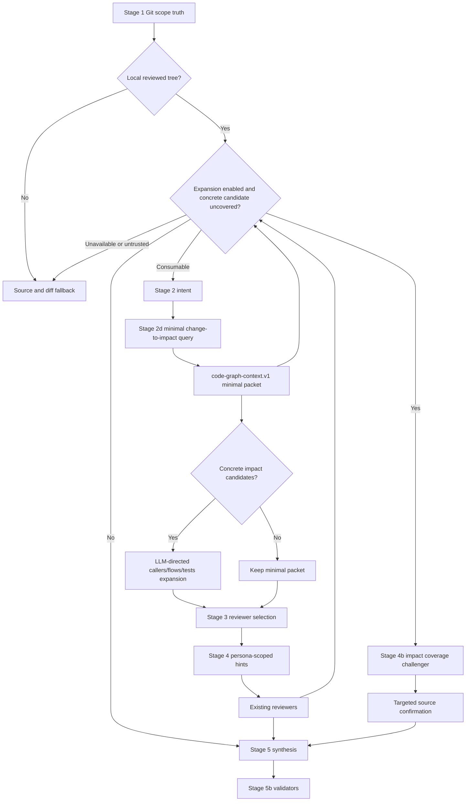
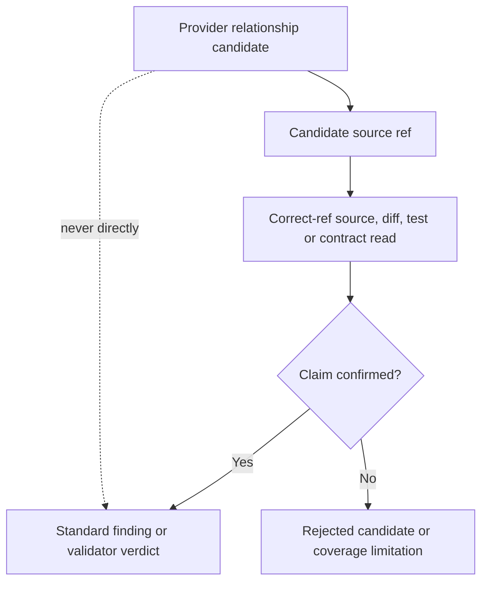
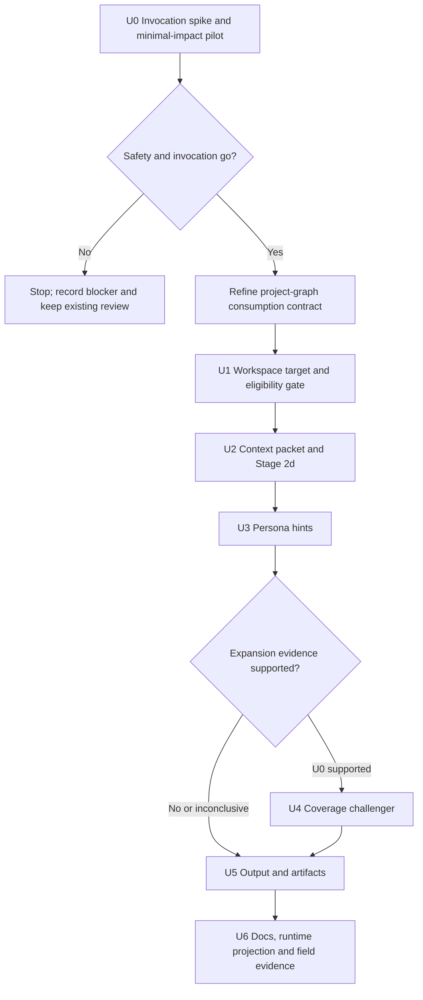

# Spec Code Review Code Graph Advisory Integration - Plan

## Goal Capsule

- **Objective:** 让 `spec-code-review` 在 Git 已确定直接改动范围后，默认使用可用且对齐的 `code-graph` 生成结构化影响链路与影响范围，补强 reviewer selection、persona 审查上下文和集体覆盖检查，而不把外部图谱升级为 finding、测试覆盖或 merge authority。
- **Authority hierarchy:** `docs/10-prompt/结构化项目角色契约.md` 与 `docs/contracts/project-graph-consumption.md` 高于本计划；Stage 1 Git scope、source/test/log/contract evidence 高于 provider 输出；setup facts 只拥有 readiness 事实。
- **Execution profile:** 不新增 `auto/on/off` 产品模式。对于本地、readiness 可信且 graph index 对齐的 review，Stage 2 后默认执行一次只读、minimal、bounded change-to-impact query；LLM 基于该 packet 决定是否继续 callers/flows/tests 等定向扩展。图谱不可用或 scope 不对齐时自动回退现有 source/diff review。先用 paired pilot 校准 packet、预算和降级边界，效果证据不足时只交付 minimal integration，不扩张 challenger/validator 投资。
- **Stop conditions:** 若实现要求在 review 内安装、初始化、刷新 provider，允许图谱提高 finding confidence，或让远程 PR 消费当前 checkout 图谱，则停止对应实现并回到契约层修正。
- **Tail ownership:** source skill、skill-local prompt/schema、contract tests 与 README 由本仓库维护；provider installation、index、watcher 与 host MCP config 继续由 `spec-mcp-setup` 和 provider-native lifecycle 拥有。

---

## Product Contract

### Summary

为 `spec-code-review` 增加 graph-first advisory consumption path。
该路径不改变 Git diff 定义的直接审查范围：它在 Stage 2 intent 之后，通过正确 scope 下可用的 code-graph native interface 把 changed files/symbols 扩展为候选影响链路与影响范围；Stage 3 用候选补 reviewer selection，Stage 4 按 persona 裁剪上下文，reviewer 完成后再用条件式 coverage challenger 寻找集体漏审的关键 consumer。
所有可进入 finding 或 validator verdict 的结论仍必须带正确 ref 的源码、diff、测试、日志或契约证据。

### Problem Frame

当前 `spec-code-review` 已具备可靠的 Git scope、动态 reviewer roster、quote-the-line gate、逐 finding validator 和 run artifacts，但跨文件影响发现主要依赖 reviewer 自行搜索。
仓库已经通过 `spec-mcp-setup` 提供 `code-graph` capability readiness，且 `docs/contracts/project-graph-consumption.md` 已定义 candidate-only 信任边界；消费端尚未把这条能力接入审查流程。
此外，现有 Stage 1 默认当前 cwd 是 Git repo；从 non-Git parent workspace 启动时无法解析 base/diff。Workspace 支持不能把 parent root 伪装为 repo，而必须先解析 child review targets，再逐 repo 运行相同 evidence pipeline。

外部项目 [code-review-graph](https://github.com/tirth8205/code-review-graph) 展示了 diff-to-function、call/import/inheritance、affected-flow、test-candidate 与 blast-radius 上下文的可用产品形态，也同时暴露了关键限制：历史 impact ground truth 存在循环上界、flow detection 覆盖有限、缺少 test edge 不等于缺少测试。
因此首版应借鉴其上下文组织方式，而不是新增第二个 required provider 或复制其 risk model。

### Requirements

**Readiness 与 scope**

- R1. `spec-code-review` 仅在 setup facts 顶层 freshness 可信、恰有一个可消费的 `code-graph` provider entry、当前工具面存在可由 source-owned invocation contract 唯一解析的 native interface，且 graph index 与 reviewed tree 的对齐/覆盖状态满足消费规则时启用图谱路径；多 provider、接口或调用 schema 无法唯一解析时降级而不猜测。`repo_aligned: unknown` 不得仅凭 fresh setup facts 或 local scope 升级为完整对齐；provider facts 必须区分 `complete | partial | stale | unknown`，其中 `partial` 只允许带 limitation 的候选导航，空结果没有否定权。
- R2. 图谱路径只允许用于 standalone、`base:` 或 `local-aligned` scope；`pr-remote` 与 `branch-remote` 必须响亮降级到现有 source/diff 路径。
- R3. Review workflow 不得安装、初始化、sync、index、refresh、启动 watcher 或修复 host config。
- R4. 图谱缺失、stale、unknown、degraded、调用失败或结果截断不得阻塞普通 review，也不得让 Stage 3c 错误进入 lite roster。

**候选上下文**

- R5. 确定性 gate 通过后，orchestrator 必须复用 Stage 1 Git scope 和 Stage 2 intent 发起一次逻辑上的 minimal、bounded change-to-impact probe。U0 invocation contract 决定它由单个 native tool 还是受预算约束的组合调用实现；当前 provider 不具备 structured review-context API 时，不得伪装为单次调用。是否继续查询 callers、flows、tests、inheritance 或更深 impact 由 LLM 根据 minimal packet 的具体候选决定。LLM 不负责猜测 readiness、scope、alignment 或 graph completeness 事实。
- R6. Run-scoped context packet 必须区分 provider readiness、reviewed-tree alignment、graph-index alignment、查询摘要、带稳定 candidate ID 的 source refs/关系候选、未映射/截断/歧义和 direct-source confirmation 状态。
- R7. 图谱候选只能扩大下一步读取范围或影响 reviewer 注意力，不能排除 changed files、缩小 Git review scope、证明 affected tests 完整或生成 merge verdict。
- R8. Provider 返回的带文件与行号的 verbatim source 可按图谱消费契约作为 bounded direct read 使用；推导出的 edge、risk、flow、ownership 和 affected-test 仍保持 advisory。

**Reviewer 与 coverage**

- R9. Stage 3 必须把 source-confirmable 的图谱影响候选作为增加 conditional reviewer 和阻止错误 lite-roster 的语义输入，但不能仅凭 provider risk score 设置 severity、confidence、删除 always-on reviewer，或因空/失败结果放宽 Stage 3c。
- R10. Stage 4 应按 persona 裁剪 code-graph hints，避免把完整 provider response 广播给所有 reviewer。
- R11. 新增的 `impact-coverage-challenger` 只能输出 coverage challenges、source refs 和建议补审 persona，不得输出 P0-P3、finding confidence、autofix 或 verdict。
- R12. Challenger 仅在 pilot/field evidence 支持 expansion、图谱可用、跨文件候选具体且现有 reviewer evidence 未覆盖关键候选时触发；每轮补审请求必须有上限。Minimal integration 不以 challenger 为前置条件。
- R13. Challenger 或 provider 候选只有经现有 persona 或 orchestrator direct read 回源确认后，才可形成并进入 Stage 5 findings；Stage 5b validator 只能把候选作为导航并回源验证既有 finding，不得从候选直接生成 finding。
- R14. 来自同一 provider candidate family 的 graph query、challenger 与 reviewer hint 不得计为 cross-reviewer agreement，也不得提高 confidence anchor；run-local provenance 必须能从 candidate ID 追踪到 persona slice、challenge、finding artifact 与 direct-source confirmation。

**Artifacts、输出与评估**

- R15. Default 与 `mode:agent` 必须在 Coverage 中记录 eligibility、minimal/deep query 状态、fallback、候选接受/拒绝数量、reviewer roster 增量、补审数量和 limitations。
- R16. Run artifact 目录应保存 code-graph context packet、per-reviewer graph coverage receipts、coverage challenge 与 consolidated provenance artifact；`mode:agent` 主 JSON 保持单对象、可解析且不增加第二套 finding schema。
- R17. Graph consumption 不新增 review-time mode 参数：本地 eligibility gate 通过即运行 minimal query；gate 不通过即响亮 fallback。Comparative/field evidence 用于调整 minimal packet、深查预算、challenger 投资与保留/退役决策，不得把一次查询是否执行交给未获得影响信息前的 LLM 预判。
- R18. `code-review-graph` 首版只作为能力与评估参考；实现复用当前 setup 已管理的 provider-neutral `code-graph` capability，不新增第二个 required provider、数据库或 runtime truth source。
- R19. 首版 graph-first integration 只进入 full multi-agent review 与 `mode:agent` pipeline；用户显式请求 Quick Review 时继续走现有 host built-in review 并停止，不宣称该旁路具备 graph impact coverage。

**Non-Git parent workspace**

- R20. 当 invocation cwd 不是 Git repo 时，workflow 必须把 parent workspace 视为 orchestration boundary，而不是 review/evidence authority；通过 bounded、symlink-safe discovery 解析 child Git repos，Git scope、base、diff、setup facts、CodeGraph `projectPath`、alignment、findings 与 artifacts 均按 child repo 隔离。
- R21. Child-Git target resolution 支持：当前 child repo、显式 `repo:<workspace-relative-path>`、PR URL/number 唯一映射的 child、唯一有 reviewable changes 的 child，以及用户明确要求 workspace review 时的多 child set。零 child Git 候选时转入 R24 pure non-Git 判断，而不是直接把 parent 当 repo；branch/PR/child 映射歧义必须 fail loudly，不得猜测。
- R22. 多 child workspace review 对每个 repo 独立运行 Stage 1-5b，再生成 workspace aggregate；finding ID 必须 repo-namespaced，禁止跨 repo dedup、confidence agreement promotion或把一个 child 的 graph candidate 当作另一个 child 的证据。没有经过独立验证的跨 repo dependency 只能记录为 limitation/candidate。
- R23. 从 non-Git workspace root 自动发现的单/多 child review 默认 report-only，Stage 5c 禁用；只有当前 cwd 已在目标 child repo 内，或用户/上游显式提供 `repo:`/per-child mutation scope 时，才可按既有 clean/dirty 规则进入该 child 的 apply。Parent workspace setup facts、quarantine、scenario fingerprint 或 graph artifact 都不能授权 child mutation。
- R24. 当 non-Git root 不包含 child Git repo、而是一个纯 non-Git code project 时，CodeGraph 可作为该 project root 的结构图，但 workflow 不得伪造 Git diff。Full review 必须获得显式 change seed（changed file list、patch/diff artifact 或上游确认的 source refs）；无 change seed 时停止并说明“graph 可用但 review scope 未定义”。该路径默认 report-only。
- R25. Graph refresh 继续由 provider lifecycle 拥有：MCP connect-time catch-up、filesystem watcher/debounced auto-sync、manual/provider-owned `codegraph sync`。`spec-code-review` 不运行 `init/sync/index/watch`；它只消费 `last_sync`、watcher/catch-up、pending relevant files、pending references 与 completeness facts。Watcher disabled、catch-up failed 或本次 changed files 仍 pending 时，graph 降级为 partial/candidate-only，并对相关文件优先 direct read。
- R26. Non-Git parent workspace 可以存在一个 workspace-level CodeGraph，用 filesystem walk 索引多个 child repos，并为已由 per-child Git diff 确认的 changed files 补跨 repo candidates。该 graph 不拥有 child Git scope 或 mutation authority；跨 repo edge 必须回到各 child source 确认，且不得与 per-child graph 形成伪独立 agreement。
- R27. Workspace-level 与 per-child graphs 可同时存在，但必须使用不同 `graph_scope_id`/`projectPath` 和 provenance family。Resolver 应优先使用 per-child graph 完成仓库内影响，再把 workspace graph 作为可选跨 repo expansion；任一 graph 的 stale/partial 状态不转移给另一 graph，也不得由 parent freshness替代 child freshness。

### Key Flows

- F1. Local review with graph-first impact context
  - **Trigger:** Stage 1 确认 standalone、`base:` 或 `local-aligned`，且 readiness、invocation 与 graph-index alignment gate 通过。
  - **Steps:** Stage 1 确定 Git changed files/lines → Stage 2 理解 intent → Stage 2d 默认发起一次逻辑 minimal change-to-impact probe（单工具或 bounded composition）→ 生成 context packet → LLM 必要时扩展 callers/flows/tests → Stage 3 用候选补 reviewer coverage → Stage 4 按 persona 注入 hints → 必要时运行 challenger → source-confirmed findings 进入现有 Stage 5/5b。
  - **Outcome:** 图谱扩展检查面，但 finding authority 与验证规则保持不变。
  - **Covers:** R1-R16

- F2. Provider unavailable or freshness untrusted
  - **Trigger:** setup facts 缺失/过期、provider 非 fresh、native interface 不可达或 query 失败。
  - **Steps:** 记录 reason 与 fallback → 不 dispatch challenger → 继续现有 diff/source review。
  - **Outcome:** Review 结果可降级但不被 provider 阻断。
  - **Covers:** R1, R3, R4, R15

- F3. Remote PR or remote branch
  - **Trigger:** Stage 1 scope 为 `pr-remote` 或 `branch-remote`。
  - **Steps:** 不查询当前 checkout 图谱 → Coverage 记录 `scope-misaligned` → reviewer 继续使用 fetched ref、`git show` 或 diff hunks。
  - **Outcome:** 不发生 stale-workspace 混读。
  - **Covers:** R2, R4, R15

- F4. Coverage challenger requests targeted review
  - **Trigger:** 图谱候选指出 concrete cross-file consumer，而 reviewer artifacts 没有对应 direct evidence。
  - **Steps:** Challenger 产出最多三个 challenge → orchestrator 按建议复用现有 persona 或 direct read → 仅 source-confirmed issue 进入 Stage 5。
  - **Outcome:** 漏审风险被挑战，但 challenger 不成为 finding producer。
  - **Covers:** R11-R14

- F5. Minimal graph context is sufficient
  - **Trigger:** Stage 2d minimal query 返回局部、低影响候选，没有具体跨文件 consumer、flow、inheritance 或 test-location 扩展价值。
  - **Steps:** 保留 minimal packet → LLM 不发起深层 graph query/challenger → reviewer 继续检查 changed code 与必要 source context。
  - **Outcome:** 每次 eligible review 都获得相同的低成本影响探针，同时避免无条件运行完整 blast-radius workflow。
  - **Covers:** R5, R7, R15, R17

- F6. Explicit Quick Review bypass
  - **Trigger:** 用户明确请求 quick/fast/light review，且 `mode:agent` 未启用。
  - **Steps:** 保持现有 host built-in review short-circuit → 不运行 Stage 1c/2d graph integration → Coverage/结果不得暗示已检查 graph impact chain。
  - **Outcome:** 首版不为低成本旁路引入隐藏 graph 开销，graph-first 声明严格限定于完整 pipeline。
  - **Covers:** R19

- F7. Review from a non-Git parent workspace
  - **Trigger:** invocation cwd 不是 Git repo，bounded discovery 找到一个或多个 child Git repos。
  - **Steps:** 生成 workspace review-target artifact → 按显式 target/PR mapping/unique changes/workspace intent 选择 child set → 每个 child 独立解析 Git base/diff 与 CodeGraph `projectPath` → bounded per-repo review → repo-namespaced aggregate report。
  - **Outcome:** 支持从 workspace root 发起审查，但不制造跨 repo scope、graph freshness或evidence authority。
  - **Covers:** R20-R23

- F8. Review a pure non-Git code project
  - **Trigger:** invocation root 不是 Git repo，bounded discovery 找不到 child Git repos，但存在 code source 和可消费 CodeGraph。
  - **Steps:** 解析显式 change seed → 验证 workspace graph catch-up/watcher/pending/completeness → 以 changed files/source refs 发起 logical minimal probe → report-only review。
  - **Outcome:** 支持非 Git 项目结构影响审查，但没有 change seed 时不假装知道“本次改了什么”。
  - **Covers:** R24, R25

- F9. Cross-repo candidate expansion from a workspace graph
  - **Trigger:** parent workspace graph fresh/partial-usable，且一个或多个 child Git diffs 已提供 changed-file seeds。
  - **Steps:** 先运行 per-child review → workspace graph 以 workspace-relative changed refs 查询跨 repo consumers → 将候选路由到对应 child direct reads/reviewers → aggregate 记录 accepted/rejected/limitations。
  - **Outcome:** 可以发现跨服务/包影响，但 Git scope、finding 和 mutation authority仍按 child repo 隔离。
  - **Covers:** R26, R27

### Acceptance Examples

- AE1. Given fresh/aligned readiness 和 local-aligned scope, when minimal query 返回某公共函数的三个 callers, then API reviewer 收到这些 caller 的候选 refs，并在读取源码后才可形成 finding。
- AE2. Given scope 为 `pr-remote`, when review starts, then当前 checkout 的 code-graph query 不运行，Coverage 记录 scope mismatch，review 继续完成。
- AE3. Given provider 返回“未发现测试”, when testing reviewer 查到集成测试覆盖, then不得产生 missing-test finding，并把该 graph candidate 记录为 rejected。
- AE4. Given challenger 指出一个未检查 consumer, when targeted source read 证明 consumer 使用兼容 adapter, then challenge 被清除且不进入 findings。
- AE5. Given provider query timeout, when full reviewer roster 可正常运行, then verdict 仅基于现有 source evidence，Coverage 记录 degraded fallback。
- AE6. Given two agents 都消费同一 graph edge 并提出相同问题, when Stage 5 deduplicates results, then该共享 provider 信号不触发 cross-reviewer confidence promotion。
- AE7. Given eligible 的单文件局部纯函数修改, when minimal query 未返回具体跨文件影响候选, then不运行深层 graph query 或 challenger，普通 reviewer roster 继续；空结果不证明无影响，也不单独启用 lite roster。
- AE8. Given provider 报告 `partial` graph coverage 和 minimal probe 返回零 caller, when review continues, then packet 保留 partial limitation，reviewer 仍独立搜索，系统不得声称无 caller 或无影响。
- AE9. Given 用户显式请求 Quick Review, when built-in review short-circuit runs, then code graph 不调用，结果明确不包含 graph impact coverage claim。
- AE10. Given non-Git workspace 下只有一个 child repo 有 reviewable changes, when full review starts without target argument, then resolver 选择该 child、记录 `selection_source: unique-changed-child`、运行 report-only review，Stage 5c 不写入。
- AE11. Given non-Git workspace 下两个 child repos 都有 changes, when用户明确要求 review workspace, then两个 repo 独立 review，findings 使用 `<repo>#<n>`，不跨 repo agreement promotion，aggregate 列出 per-repo verdict 与 limitations。
- AE12. Given branch 名在两个 child repos 中都存在且没有 `repo:` target, when review starts, then workflow 在 dispatch 前失败并要求 workspace-relative child target，不任选一个 repo。
- AE13. Given `repo:services/api` 显式 target 且路径是 symlink escape 或不是 child Git root, when target resolution runs, then fail closed before Git/graph commands。
- AE14. Given纯 non-Git project 已建立 fresh CodeGraph but no changed files/patch/source refs, when review starts, then返回 scope-undefined，不把整个图或 filesystem mtime 当本次 diff。
- AE15. Given纯 non-Git project receives explicit changed file list and MCP catch-up completed, when review runs, then minimal probe 使用这些 refs，结果 report-only，finding 仍需 direct source evidence。
- AE16. Given workspace graph watcher reports a changed file pending during debounce, when candidate references that file, then packet 标记 stale-for-file，reviewer direct-read 该文件，不能把 graph snippet 当 fresh source。
- AE17. Given child A Git diff 改动公共 client，workspace graph 指向 child B consumer, when child B source confirms incompatible usage, then finding 归 child B artifact/ID；workspace graph 只记录 candidate provenance，不参与跨 repo confidence promotion。

### Success Criteria

- SC1. 所有 eligible graph-first 路径都有 setup-facts freshness、scope/index alignment、graph completeness 和 native-interface gate；gate 通过必有一次逻辑 minimal probe，失败必有显式 fallback。
- SC2. Contract tests 证明 graph candidate 无法提高 finding confidence、替代 validator 或缩小 review scope。
- SC3. 盲化 paired pilot 预先固定样本、顺序、adjudication 与阈值，记录跨文件 confirmed finding 增量、baseline/provider 双侧漏报、false-positive burden、总 token、wall time、source reads 与 provider degradation；安全/调用性未通过时不得集成，效果证据不足时只允许 minimal packet，不得进入 challenger/validator expansion。
- SC4. 所有受支持宿主从 source regeneration 后保持 skill/runtime contract 一致，不手改 generated mirrors。
- SC5. Non-Git parent workspace 中每个 resolved target 的 scope、graph、evidence、artifact 和 mutation authority 均隔离；aggregate 只汇总，不提升跨 target 证据权威。
- SC6. Pure non-Git project 只有在 change seed 明确时才进入 review；workspace-level graph 能补跨 repo候选，但 pending/stale facts 会触发 direct-read 降级而不是静默刷新或错误 freshness claim。

### Scope Boundaries

**Included**

- `spec-code-review` full multi-agent/`mode:agent` 的 provider-neutral code-graph consumption、persona hints、coverage challenger、validator hint 与 Coverage/run artifacts。
- 复用 `provider-readiness.v2`、`project-graph-consumption.v1` 与现有 CodeGraph MCP readiness。
- 默认 graph-first minimal consumption、contract tests、README/README.zh-CN 和 runtime projection expectations。

**Deferred to Follow-Up Work**

- 根据真实 pilot/field 结果调整 minimal packet、深查预算和 challenger 范围。
- 若当前 CodeGraph native surface 无法满足实际评估，再单独评审是否增加 `code-review-graph` provider adapter；该决策必须比较现有 provider、额外安装成本、license、host coverage 和维护责任。
- 远程 PR 的 snapshot graph、临时 worktree graph 或 provider-side ref selection。
- Quick Review 的 graph impact integration；首版继续使用现有 host built-in short-circuit。
- 未经独立 provider/源码验证的跨 repo call graph、shared ownership、distributed flow 或 affected-test 推导。

**Outside this product's identity**

- 建设通用图数据库、通用 TIA、完整 coverage engine、静态分析平台或 provider risk scoring framework。
- 让图谱拥有 scope、finding、severity、confidence、mutation 或 merge authority。
- 在 code review workflow 中维护 provider lifecycle。

### Assumptions

- 当前 `spec-mcp-setup` 继续提供至少一个 `code-graph` capability entry，并通过 host MCP config 暴露只读 native interface。
- `provider_untrusted.summaries[]` 与 review Coverage 足以记录候选消费，不需要新增 universal evidence enum。
- 首版 pilot 可以使用真实或历史 PR，通过人工确认的 findings 作为对照，不把 provider 自评指标当 gold truth。

---

## Planning Contract

### Key Technical Decisions

- KTD1. **Wrap existing capability, do not add a provider.** 首版复用 `skills/spec-mcp-setup/scripts/providers/codegraph.cjs` 和 `provider-readiness.v2`；named external project 只影响 context packet 与 evaluation design。
- KTD2. **Keep provider-specific invocation behind a setup-owned adapter contract.** U0 必须先确定 source-owned capability-to-invocation mapping，覆盖可调用 interface/tool、输入输出 schema、host/tool inventory 解析、单工具/组合策略、最大调用预算和稳定 reason code；`skills/spec-code-review/SKILL.md` 只消费逻辑 minimal-probe surface。当前 CodeGraph 只有通用 explore/逐 symbol impact/affected 等分散能力时，adapter 可以 bounded composition，但不得宣称 provider 原生提供 structured review context。Provider 安装命令、artifact root 和 version pin 继续留在 setup-owned source。
- KTD3. **Initialize the run before graph artifacts.** Stage 1c 完成 gate 后创建 run id 与 artifact directory；`branch`、`head_sha` 仍在 reviewer dispatch 时捕获。Stage 2d 使用 Stage 2 intent 生成 bounded impact query，避免无上下文的全图扫描，并能在 query/degraded 早退时保留可审计 artifact。
- KTD4. **Require alignment plus graph completeness.** reviewed-tree alignment 证明 workspace/ref 是审查对象；graph-index alignment 证明 provider index 覆盖该 ref/commit 与 dirty-tree 边界；graph completeness 记录 `complete | partial | stale | unknown` 和 missing-reference/unsupported-language 等限制。Remote modes 无条件 fallback；`partial` 可用于扩大读取范围但空结果无否定权，`stale/unknown` fallback。
- KTD5. **Use run-local narrow packets and provenance receipts.** 新增 skill-local `code-graph-context.v1`、`reviewer-graph-coverage.v1` 与 `graph-candidate-provenance.v1`。Reviewer 在独立 coverage receipt 中返回 `candidate_links[]`，以 per-agent finding index 关联 candidate ID 与 direct source refs；orchestrator 在 merge 前解析为 run-local provenance sidecar。公共 finding authority schema 保持不变；receipt 缺失时，该 graph-hinted reviewer 的 findings 对 agreement promotion 采取保守 taint，不计为独立 graph corroboration。
- KTD6. **Distribute hints by persona.** Orchestrator 将相同 packet 裁剪为 reviewer-specific candidate refs，reviewer 仍收到完整 diff 并保留自主 source inspection 权限。
- KTD7. **One challenger, zero finding authority.** `impact-coverage-challenger` 只找 review coverage 差集；不拆分 flow/community/risk agents，避免同源伪共识。
- KTD8. **Targeted re-review reuses existing finding schema.** Challenger 的 challenge 经 source confirmation 后，由既有 persona 或 orchestrator 产出标准 finding；challenger artifact 永不进入 agreement count。
- KTD9. **Graph-first minimal, LLM-directed depth.** 不新增 graph mode 参数。Eligibility gate 通过后固定运行一次逻辑 minimal change-to-impact probe；LLM 只决定是否深入具体 callers/flows/tests/inheritance 候选。底层 adapter 调用次数、输出 token、impact depth 与 challenge 数均有上限。
- KTD10. **Parent workspace orchestrates; resolved review targets own truth.** 新增 skill-local、read-only workspace target resolver，语义参考现有 setup `project-target.cjs` 的 bounded discovery/containment，但不消费 setup internal implementation as workflow contract。Child Git target 使用自己的 Git root/base/setup facts/CodeGraph `projectPath`；pure non-Git target 使用显式 change seed、filesystem freshness facts和独立 run directory。多 target aggregate 默认 report-only，不跨 target merge evidence。
- KTD11. **Filesystem freshness is provider-owned; review consumes staleness.** CodeGraph 在 non-Git root 使用 filesystem walk/hash、MCP connect-time catch-up 和 watcher auto-sync。Setup/provider facts 必须暴露 `catch_up_status`、`watcher_status`、`last_sync_at`、`pending_files`/relevant overlap、`pending_references` 和 completeness。Review 不调用刷新命令；相关文件 pending 时 direct-read，watcher/catch-up 不可用时降级并给出 setup repair action。
- KTD12. **Hybrid workspace graph is optional expansion.** Per-child Git/per-child graph 是 repo内审查主链；workspace-level non-Git graph 仅消费已确认 changed-file seeds，补跨 repo candidates。两类 graph 使用不同 scope/provenance family，同一关系即使两图都返回也不构成独立 agreement。

### High-Level Technical Design

以下图为方向性设计，不规定具体函数签名或 provider tool name。

### Artifact Contracts

`code-graph-context.v1` 保存到既有 review run artifact directory 下的 `code-graph-context.json`，最小字段为：

- `schema_version`
- `provider`
- `status`: `complete | degraded | skipped`
- `readiness_status`
- `reviewed_tree_alignment`
- `graph_index_alignment`
- `graph_completeness`: `complete | partial | stale | unknown`
- `coverage_limitations[]`
- `graph_scope_id` 与 `graph_scope_kind`: `child-repo | workspace`
- `refresh_facts`: catch-up、watcher、last sync、pending relevant files/references
- `query_strategy`: `native_single | bounded_composition`
- `tool_calls_used` 与 `tool_call_budget`
- `query_summary`
- `query_depth`: `minimal | expanded`
- `minimal_summary`: changed/impacted counts、key entities、test-gap hints、next-query candidates
- `candidate_source_refs[]`（每项带稳定 `candidate_id`）
- `candidate_relationships[]`（每项带稳定 `candidate_id`）
- `accepted_candidates[]`
- `rejected_candidates[]`
- `unmapped_or_ambiguous[]`
- `truncated`
- `limitations[]`
- `fallback_used`

`coverage-challenge.v1` 保存到同一 run directory 的 `coverage-challenges.json`，最小字段为：

- `schema_version`
- `status`
- `challenges[]`
- 每个 challenge 包含 `title`、`candidate_refs[]`、`why_unreviewed`、`suggested_persona`、`requires_source_confirmation: true`
- 禁止出现 `severity`、`confidence`、`autofix_class`、`owner`、`verdict` 或标准 finding `#`

`reviewer-graph-coverage.v1` 由每个收到 graph hints 的 reviewer 与常规 finding artifact 并列返回，最小字段为：

- `schema_version`
- `reviewer`
- `candidate_links[]`
- 每个 link 包含 `candidate_id`、`finding_index`（对应该 reviewer artifact 的 findings 数组位置）和 `direct_source_refs[]`
- `uninspected_candidate_ids[]`
- `limitations[]`

Receipt 不改变 finding 内容、severity、confidence 或 authority。若 reviewer 收到 graph hints 却缺 receipt，orchestrator 将其 findings 标记为 provenance-unknown，并在 cross-reviewer agreement 中保守排除 graph independence promotion。

`graph-candidate-provenance.v1` 保存到同一 run directory 的 `graph-candidate-provenance.json`，由 orchestrator 单写，最小字段为：

- `schema_version`
- `candidate_id`
- `provider_id` 与 `query_id`
- `injected_personas[]`
- `challenge_ids[]`
- `finding_artifact_ids[]`
- `direct_source_refs[]`
- `disposition`: `accepted | rejected | unresolved`
- `limitations[]`

Reviewer 与 challenger 只写各自 artifact/receipt，不并发修改共享 packet；orchestrator 在 Stage 5 merge 前单写 sidecar，并由该 sidecar 排除共享 candidate family 的 agreement promotion。

`workspace-review-targets.v1` 在 non-Git parent invocation 时保存到 run root 的 `workspace-review-targets.json`，最小字段为：

- `schema_version`
- `workspace_label`（不持久化机器绝对路径）
- `selection_source`: `explicit-child | pr-mapped-child | unique-changed-child | explicit-workspace-set | explicit-non-git-seed`
- `topology`: `child-git-set | pure-non-git-project`
- `change_seed_source`: `git-diff | explicit-files | patch-artifact | upstream-source-refs | missing`
- `report_only`
- `repos[]`: `repo_id`、`workspace_relative_path`、`git_root_verified`、`selection_reason`、`graph_project_path_status`
- `ambiguous_candidates[]`
- `limitations[]`

`workspace-review-summary.v1` 保存到 `workspace-review-summary.json`，最小字段为：

- `schema_version`
- `repo_runs[]`: `repo_id`、child artifact path、scope、verdict、finding counts、graph status
- `aggregate_verdict`
- `cross_repo_analysis_status`: 首版固定 `not-run | candidate-only`
- `limitations[]`

Workspace aggregate 的 finding 编号使用 `<repo_id>#<local-number>`；它不重新 dedup findings、不重新计算 confidence，也不拥有 child apply authority。

### System-Wide Impact

- **Workflow:** `spec-code-review` 增加 Stage 1c eligibility、Stage 2d impact context 和 Stage 4b coverage challenge。Stage 1 Git scope、Stage 5 finding merge、Stage 5b validation 与 Stage 5c apply authority不变；Stage 3 reviewer selection 和 Stage 3c lite eligibility 可被具体 graph impact 候选扩张/升级，但绝不能被空结果或 provider failure 收窄。
- **Workspace:** non-Git parent root 新增 target-resolution/aggregation envelope；Stage 1-5b 始终在 resolved target 内运行：child Git repo 使用 Git diff，pure non-Git project 使用 explicit change seed。自动发现/non-Git review 强制 report-only，显式单 child mutation scope 才可进入 Stage 5c。
- **Refresh:** provider MCP connect/watch/sync lifecycle 负责 filesystem freshness；review 只读取 facts 和 query staleness banners。Pure non-Git project 与 workspace-level graph 都不得由 review 静默刷新。
- **Context:** provider response 不直接复制到每个 reviewer；大结果写 run artifact，prompt 只传路径和 persona slice。
- **Evidence:** graph candidates 进入 `provider_untrusted`/Coverage；source-confirmed evidence 继续使用 finding `first_evidence`、artifact `evidence` 与 validator verdict。
- **Runtime:** source 变更需通过 `spec-first init` 投射到 Claude、Codex、Cursor、Kiro、Qoder；不得手改 generated runtime mirrors。
- **Cost:** 每个 eligible local review 增加一次 minimal query；只有 packet 给出具体影响候选时才增加深查/challenger 延迟。调用/output budget、impact depth、最大三个 challenge 与条件 dispatch 控制成本。

### Sequencing

### Risks and Mitigations

| Risk | Mitigation |
|---|---|
| Provider output looks authoritative because it is structured | Every packet field is advisory; schemas omit finding authority fields; contract tests pin no confidence promotion |
| Remote PR reads current checkout graph | Scope gate skips `pr-remote` and `branch-remote` before query |
| Stale setup facts report a usable provider | Require trustworthy top-level `generated_at`; unknown/stale facts fall back and appear in Coverage |
| Graph query bloats all reviewer prompts | Persist once, distribute persona slices or paths, cap candidates and tool calls |
| Challenger creates a second review pipeline | Challenger only emits bounded coverage questions and reuses existing personas/validator |
| Same provider creates fake agreement | Mark all graph-derived actors as one provenance family excluded from agreement promotion |
| Missing graph edges are treated as absence | Empty results never prove no caller/test/impact; record mapping and limitations |
| Graph-first integration becomes permanent without value proof | Track minimal-query yield、deep-query precision and field cost; tighten packet/budgets、thin out or retire when value does not justify maintenance |
| Parent workspace mixes child scope/evidence | Resolve bounded child Git roots first; isolate Git、CodeGraph projectPath、artifacts、findings and mutation authority per repo |
| Multi-child aggregation fabricates agreement | Namespace IDs by repo and forbid cross-repo dedup/confidence promotion; cross-repo relationships remain candidate-only unless independently verified |

---

## Implementation Units

### U0. Resolve Invocation and Calibrate the Minimal Impact Packet

- **Goal:** 在建设正式 workflow surface 前证明 native query 可被稳定调用，并校准每次 eligible review 都可承受的 minimal impact packet、深查判据和预算。
- **Requirements:** R1-R5, R7, R14, R17, R18, R25-R27
- **Files:** `tests/unit/spec-code-review-contracts.test.js`, `tests/unit/mcp-setup-providers.test.js`, setup-owned invocation adapter source/contract selected by the spike, `docs/contracts/provider-readiness.md`, `docs/contracts/provider-readiness.schema.json`, `docs/contracts/project-graph-consumption.md`, `docs/validation/`
- **Patterns:** Reuse existing Stage 3c fail-closed assertions, `provider-readiness.v2` fixtures, quote-the-line contract checks and read-only provider probes.
- **Approach:** First characterize current scope/finding/validation/provider invariants. Then inspect actual host tool inventories and CodeGraph native schemas，验证当前 surface 能否单次返回 structured context；若不能，比较 bounded composition 与收缩 packet 两条实现，固定其中一个 adapter contract、预算和 reason codes。同步定义 graph completeness 与 filesystem refresh facts，确保 missing references/unsupported languages、watcher disabled、catch-up failure、pending relevant files 不被“index up to date”掩盖。验证 pure non-Git root、per-child graph 和 workspace-level graph 的 `projectPath`/scope isolation。Run a non-published paired pilot without challenger、persistent public schemas、validator hints 或多宿主 projection。Pilot `go` 后、U1 前先修订 `project-graph-consumption.md`：eligible full review 默认 minimal probe 只扩大读取范围，不改变 Git/finding authority；review 不拥有 refresh mutation。安全/调用性为 `no-go` 时停止；价值结果不明确时仍可进入 minimal integration，但不得建设 challenger/validator 扩展。
- **Test Scenarios:**
  - Current review contract keeps `pr-remote` and `branch-remote` workspace reads forbidden.
  - CodeGraph readiness may be `fresh`, but `repo_aligned: unknown` and `source_read_required: true` remain visible.
  - Existing confidence promotion requires independent reviewer evidence and cannot consume provider agreement.
  - Runtime tool inventory cannot resolve exactly one invocation/schema → stable fallback reason and pilot `no-go`/blocked, not workflow-local guessing.
  - Native surface lacks structured review context → adapter chooses and tests bounded composition or explicitly reduced packet; no invented provider capability.
  - Provider reports index up-to-date with missing references → graph completeness is `partial`, limitations are machine-readable, and empty results have no negative authority.
  - Non-Git MCP connect-time catch-up and watcher facts are distinguishable from manual sync; relevant pending files force direct-read qualification.
  - Workspace and child graph instances use distinct scope IDs/project paths and cannot corroborate each other as independent evidence.
  - Paired runs record baseline-only、graph-only、shared 与 both-missed findings without using provider self-evaluation as gold truth.
  - Pilot pre-registers minimal-query candidate yield、deep-query precision、review recall non-inferiority、additional confirmed finding、定位成本、p95 latency、token 和 rejected-candidate thresholds。
- **Verification:** `npx jest tests/unit/spec-code-review-contracts.test.js tests/unit/mcp-setup-providers.test.js --runInBand` plus a source-referenced pilot report under `docs/validation/`

### U1. Resolve Workspace Targets and Add the Eligibility Gate

- **Goal:** Resolve a safe per-repo review set from either a Git cwd or non-Git parent workspace, then establish a fail-open provider-neutral graph eligibility gate for each selected child.
- **Requirements:** R1-R4, R17, R20-R27
- **Files:** `skills/spec-code-review/SKILL.md`, `skills/spec-code-review/scripts/resolve-review-targets.cjs`, `skills/spec-code-review/references/workspace-review-targets.schema.json`, `tests/unit/spec-code-review-contracts.test.js`, `tests/unit/spec-code-review-workspace-contracts.test.js`, `tests/unit/spec-code-review-code-graph-contracts.test.js`
- **Approach:** Before existing Stage 1, detect topology：current Git repo、non-Git parent with child Git repos、or pure non-Git code project。Parent workspace uses bounded/symlink-safe child discovery and target mapping；pure non-Git project requires explicit changed files/patch/upstream refs before review。Each selected child runs existing Stage 1 independently；pure non-Git uses the explicit change seed as Stage 1 equivalent。Add Stage 1c readiness、scope、alignment、completeness、refresh and invocation lookup per graph scope。`complete` authorizes normal probe；`partial` authorizes candidate-only probe with mandatory limitations；`stale/unknown` falls back。Auto-discovered/non-Git targets set `report_only: true`。
- **Test Scenarios:**
  - Eligible local scope deterministically schedules one minimal query after Stage 2 intent discovery.
  - Missing/stale setup facts produce degraded fallback and normal review continuation.
  - Zero or multiple fresh `code-graph` provider entries produce an ambiguous-provider fallback rather than arbitrary selection.
  - `pr-remote`/`branch-remote` skip query even when readiness is fresh.
  - `repo_aligned: unknown`、缺 index ref/fingerprint 或 dirty-tree coverage 未知时，graph-index alignment 保持 degraded/unknown 并记录 limitation。
  - Missing-reference 或 unsupported-language facts produce `partial` rather than `complete`, even when provider status says index up-to-date.
  - Provider unavailable does not satisfy or alter Stage 3c lite conditions.
  - Non-Git root with zero child Git repos and no supported source/change seed returns `workspace-no-review-targets`; a source-bearing root with explicit seed enters pure non-Git topology.
  - Exactly one changed child is selected with stable workspace-relative `repo_id`, but remains report-only without explicit mutation scope.
  - Multiple changed children under explicit workspace intent run isolated per-child pipelines; ambiguous branch/PR mapping without `repo:` fails loudly.
  - Child discovery rejects symlink escapes、parent traversal、duplicate nested roots and paths outside the invocation workspace.
  - Parent setup facts/graph artifacts are never reused as child readiness；each graph call receives the selected child `projectPath`。
  - Pure non-Git project with no explicit change seed stops before review even when CodeGraph is fresh.
  - Pure non-Git explicit files/patch/source refs become the direct changed scope; filesystem mtime or all indexed files never substitute for a diff.
  - Workspace-level graph is optional and receives only workspace-relative seeds already confirmed by per-child Git scopes.
- **Verification:** `npx jest tests/unit/spec-code-review-contracts.test.js tests/unit/spec-code-review-workspace-contracts.test.js tests/unit/spec-code-review-code-graph-contracts.test.js --runInBand`

### U2. Define and Produce the Run-Scoped Code-Graph Context Packet

- **Goal:** Convert the mandatory logical minimal probe, plus only justified targeted expansions, into a small validated advisory packet tied to the review run.
- **Requirements:** R5-R8, R15, R16, R24-R27
- **Files:** `skills/spec-code-review/SKILL.md`, `skills/spec-code-review/references/code-graph-context.md`, `skills/spec-code-review/references/code-graph-context.schema.json`, `skills/spec-code-review/references/reviewer-graph-coverage.schema.json`, `skills/spec-code-review/references/graph-candidate-provenance.schema.json`, `tests/unit/spec-code-review-code-graph-contracts.test.js`
- **Approach:** Stage 1c gate 后先创建 run id/artifact directory；Stage 2d 以 per-child Git diff 或 explicit non-Git change seed 发起逻辑 minimal probe。Adapter 可使用单个 native tool 或 bounded composition，并记录 strategy/call count/graph scope/refresh facts。Relevant pending files使 graph source/snippet 降级，reviewer必须direct-read。Per-child probe完成后，可选 workspace graph 只查询跨 repo candidates；candidate ID/provenance包含 graph scope，防止双图伪共识。Unsupported fields显式 unavailable，malformed/oversized/ambiguous results fail open。
- **Test Scenarios:**
  - Valid native output produces a schema-valid packet with provider provenance and limitations.
  - Eligible local review always performs exactly one logical minimal probe within the adapter's tool-call budget before any optional expansion.
  - Minimal packet without concrete cross-file candidates does not trigger deeper graph tools or challenger.
  - Verbatim `file:line` source is marked direct-source-capable while inferred edges remain advisory.
  - Malformed output, timeout, truncation and zero mapping are preserved as degraded/limited rather than “no impact”.
  - Large context is staged by path and never duplicated into every prompt.
  - Query 前 run directory 已存在；query 失败的早退 artifact 仍记录 reason，而 dispatch-time `branch`/`head_sha` 语义保持不变。
  - Pending relevant files are surfaced in the packet and disqualify graph snippets from fresh direct-source treatment.
  - Workspace graph candidates route back to the owning child repo for source confirmation and finding attribution.
- **Verification:** `npx jest tests/unit/spec-code-review-code-graph-contracts.test.js --runInBand`

### U3. Use Impact Context for Reviewer Selection and Persona-Scoped Hints

- **Goal:** Use the packet to improve reviewer roster and search coverage without restricting independent review.
- **Requirements:** R7-R10, R14
- **Files:** `skills/spec-code-review/SKILL.md`, `skills/spec-code-review/references/subagent-template.md`, `skills/spec-code-review/references/persona-catalog.md`, `skills/spec-code-review/references/reviewer-graph-coverage.schema.json`, `tests/unit/spec-code-review-code-graph-contracts.test.js`
- **Approach:** Before Stage 3 finalizes the roster, interpret concrete impact candidates alongside diff signals: cross-file API consumers can add API/correctness review, affected async flows can add reliability, test candidates/gaps can add testing, and broad dependency impact can disqualify Stage 3c lite. Then define small persona slices。每个收到 hints 的 reviewer 额外返回独立 `reviewer-graph-coverage.v1` receipt，以 `finding_index` 关联 candidate；receipt 缺失时使用保守 provenance taint。Hints remain advisory, require source confirmation, and provider provenance stays excluded from cross-reviewer promotion。
- **Test Scenarios:**
  - Correctness receives caller/inheritance candidates; testing receives test candidates; unrelated personas do not receive the full packet.
  - Concrete cross-file impact disqualifies lite roster or adds the matching conditional persona.
  - Empty、failed or truncated graph results never enable lite roster, remove a reviewer or suppress independent reviewer search.
  - Empty graph results do not suppress reviewer search or remove conditional personas selected from the diff.
  - A provider hint plus one persona finding remains at the persona's own confidence anchor.
  - A graph candidate rejected by source inspection is recorded without becoming a finding.
  - 两个 persona 引用同一 candidate ID 时，即使各自回源形成 finding，也不会因 reviewer 数量触发 agreement promotion。
  - Reviewer receipt maps candidate ID to finding index without adding authority fields to the standard finding schema.
  - Missing/malformed receipt conservatively prevents graph-independence promotion and appears in Coverage.
- **Verification:** `npx jest tests/unit/spec-code-review-code-graph-contracts.test.js tests/unit/spec-code-review-contracts.test.js --runInBand`

### U4. Add the Conditional Impact Coverage Challenger

- **Goal:** Detect important graph candidates that all selected reviewers failed to inspect.
- **Requirements:** R11-R14
- **Files:** `skills/spec-code-review/SKILL.md`, `skills/spec-code-review/references/personas/impact-coverage-challenger.md`, `skills/spec-code-review/references/coverage-challenge.schema.json`, `skills/spec-code-review/references/persona-catalog.md`, `tests/unit/spec-code-review-code-graph-contracts.test.js`
- **Approach:** Insert Stage 4b after persona artifacts arrive, only when U0 pilot evidence permits the expansion layer. Trigger when concrete cross-file candidates lack direct reviewer evidence, cap output at three challenges, forbid finding fields, and route accepted challenges to one targeted existing persona or orchestrator direct read。U6 新 evidence 只能产生 follow-up plan，不能在已完成的 U1-U6 sequence 中反向静默启用 U4。
- **Test Scenarios:**
  - Challenger is skipped when graph is unavailable, remote-scoped, empty, ambiguous or already covered.
  - Challenger output containing severity/confidence/verdict is rejected as malformed.
  - A concrete uncovered caller produces one targeted review request with source confirmation required.
  - Multiple graph-derived agents never count as independent agreement.
  - Capacity failure records degraded coverage and does not block Stage 5.
- **Verification:** `npx jest tests/unit/spec-code-review-code-graph-contracts.test.js --runInBand`

### U5. Integrate Validator Hints, Coverage Output and Run Artifacts

- **Goal:** Preserve evidence boundaries through validation and both output modes.
- **Requirements:** R8, R13-R16, R22, R23
- **Files:** `skills/spec-code-review/SKILL.md`, `skills/spec-code-review/references/validator-template.md`, `skills/spec-code-review/references/review-output-template.md`, `skills/spec-code-review/references/reviewer-graph-coverage.schema.json`, `skills/spec-code-review/references/graph-candidate-provenance.schema.json`, `skills/spec-code-review/references/workspace-review-summary.schema.json`, `tests/unit/spec-code-review-code-graph-contracts.test.js`, `tests/unit/spec-code-review-workspace-contracts.test.js`, `tests/unit/spec-code-review-contracts.test.js`
- **Approach:** Before agreement promotion, map per-reviewer receipts into the consolidated provenance sidecar and apply conservative taint for missing links. Let validators consume expanded candidate counterexamples as navigation only; minimal-only runs do not add validator work. Add code-graph metrics/limitations to Coverage and `mode:agent.coverage`, and persist context、reviewer receipts、challenge、provenance artifacts without changing the standard finding schema。For non-Git parent workspace runs, keep each child payload intact and build a report-only aggregate with repo-namespaced IDs；do not cross-repo dedup/promote or run Stage 5c without explicit per-child mutation scope。
- **Test Scenarios:**
  - Validator must inspect source before accepting or rejecting a graph-assisted claim.
  - Empty caller/test results cannot validate “no impact” or “no tests”.
  - Default Markdown reports readiness, fallback, accepted/rejected candidates and challenge outcome.
  - `mode:agent` remains one raw JSON object and references the run artifact path.
  - Existing findings schema remains compatible and contains no provider authority field.
  - Shared candidate IDs or provenance-unknown receipts cannot trigger independent reviewer agreement promotion.
  - Multi-child aggregate preserves per-repo verdicts and artifacts, uses `<repo_id>#<n>`, and never cross-promotes matching findings.
  - Auto-discovered workspace target cannot enter Stage 5c; explicit `repo:` single-child target follows existing clean/dirty apply rules.
- **Verification:** `npx jest tests/unit/spec-code-review-code-graph-contracts.test.js tests/unit/spec-code-review-contracts.test.js --runInBand`

### U6. Document, Project Runtime, and Collect Graph-First Field Evidence

- **Goal:** 在 U0 完成安全/调用性校准且 U1-U5 完成后发布 graph-first minimal surface，收集 packet、深查和 challenger 是否应收紧、扩展、thin-out 或退役的真实证据。
- **Requirements:** R15-R18
- **Files:** `README.md`, `README.zh-CN.md`, `CHANGELOG.md`, `docs/contracts/project-graph-consumption.md`, `docs/validation/`, `skills/spec-code-review/SKILL.md`, generated host runtime mirrors via `spec-first init`
- **Approach:** Document graph-first minimal behavior、eligibility/fallback and the advisory boundary, regenerate all supported host projections from source, and run time-bounded field observation。记录 eligible review 中 minimal-query success/yield、deep-query rate、candidate acceptance/rejection、人工 review/rework 成本与 time-to-trusted-change。指定 integration/retirement owner；低 candidate yield、高深查噪声、高维护成本、宿主原生替代或长期无增量价值触发 packet 收紧、thin-out 或退役评审。
- **Test Scenarios:**
  - Claude、Codex、Cursor、Kiro、Qoder runtime projection contains the same source contract after regeneration.
  - Small single-file changes demonstrate that the mandatory minimal query stays within budget and does not force deep graph queries or challenger work.
  - Multi-file/API/async changes produce auditable candidate and challenge artifacts.
  - Field report separates provider metrics from confirmed review outcomes and states whether minimal/deep/challenger layers should remain、tighten、expand or retire.
  - Weak value evidence may keep only the minimal packet but blocks challenger/validator expansion and triggers budget/packet tightening review.
  - 若维护成本超过增量价值，owner 必须记录退役或 thin-out 决策，而非无限期保留实验 surface。
  - Non-Git parent workspace smoke covers zero/one/multiple child repos、explicit target、ambiguous branch mapping、per-child CodeGraph `projectPath` and report-only aggregation。
  - Pure non-Git project smoke covers explicit/missing change seed、MCP catch-up、watcher auto-sync、watcher-disabled/pending-file degradation and report-only output。
  - Hybrid workspace smoke proves per-child graphs and optional workspace graph use separate scope/provenance families；cross-repo candidates return to child source confirmation。
- **Verification:** `npm run lint:skill-entrypoints`, `npm run typecheck`, `npm run test:unit`, `npm run test:mcp-setup`, `npm run test:smoke`, `npm run build`, `git diff --check`

---

## Verification Contract

| Verification | Command or evidence | Proves |
|---|---|---|
| Focused review contracts | `npx jest tests/unit/spec-code-review-contracts.test.js tests/unit/spec-code-review-code-graph-contracts.test.js --runInBand` | Arguments、scope、packet、challenger、confidence 和 output invariants |
| Workspace review contracts | `npx jest tests/unit/spec-code-review-workspace-contracts.test.js --runInBand` | Non-Git parent discovery、child isolation、target ambiguity、report-only mutation gate 和 aggregate invariants |
| Non-Git refresh contracts | focused provider/workspace fixtures plus read-only MCP smoke | Filesystem catch-up/watcher/pending/completeness facts、explicit change-seed gate 和 no review-owned refresh mutation |
| Provider readiness regression | `npx jest tests/unit/mcp-setup-providers.test.js tests/unit/mcp-setup-contracts.test.js tests/unit/mcp-setup-facts-renderer.test.js --runInBand` | 现有 CodeGraph lifecycle/readiness 未被消费端破坏 |
| Skill entry governance | `npm run lint:skill-entrypoints` | 新 prompt/reference/entrypoint 结构合法 |
| Syntax | `npm run typecheck` | CLI、scripts 与关键 JS 语法合法 |
| Main unit chain | `npm run test:unit` | 全局 unit contract 无回归 |
| Runtime setup | `npm run test:mcp-setup` | Provider setup、facts 与 host config contract 仍通过 |
| Host/runtime smoke | `npm run test:smoke` | source projection 后 CLI/init/doctor 路径可用 |
| Package contents | `npm run build` | 新 skill assets 被正确打包 |
| Diff hygiene | `git diff --check` | 无 whitespace 或 patch 格式问题 |
| Comparative pilot | Baseline/codegraph paired review report under `docs/validation/` | 真实效果、成本和 failure-mode evidence；不由测试绿灯替代 |

### Graph-First Evidence and Retention Gate

Graph-first minimal 是当前 owner 决策；以下证据用于决定是否保持、收紧、扩展或退役各层能力：

- 对代表性 multi-file review 样本，高严重度或跨文件 confirmed finding recall 不下降。
- Graph-assisted path 带来可归因的额外 confirmed findings，或显著减少 reviewer/validator 定位成本。
- Provider candidate 被源码否定的比例、p95 延迟和 token 增量处于 owner 可接受范围。
- Graph 未建议但 baseline/gold 命中的关键 finding 被单独统计，不能被平均值掩盖。
- Provider unavailable/stale/degraded 时 fallback 完成率为 100%，且 verdict 不依赖 provider。
- Minimal query 在小型与大型 eligible diff 上都满足预算，并提供可审计的 candidate yield；小 diff 不被迫进入 deep query/challenger。
- Deep-query candidate acceptance/rejection 表明 LLM 能从 minimal packet 选择值得追踪的具体关系，而不是广播完整图谱。
- `time-to-trusted-change` 计入人工审查、source confirmation、返工与集成成本后仍改善或至少不退化。
- Integration owner、重估日期和退役条件已明确；candidate yield 持续过低、深查噪声或维护成本过高、host-native code intelligence 覆盖该能力时不得仅因机制已建成而默认保留。

---

## Definition of Done

- D1. R1-R27 均由至少一个 U-ID 实现并由聚焦 contract test 覆盖。
- D2. `spec-code-review` 只在正确 local scope 和可信 readiness 下查询 code graph，remote scope 永不读取当前 checkout 图谱。
- D3. Provider output、challenger 和同源 reviewer hint 无法提高 confidence、替代 validator 或直接形成 finding。
- D4. Default 与 `mode:agent` 均能审计 code-graph query、fallback、candidate disposition、challenge 与 limitations。
- D5. Provider failure、staleness、截断和空结果均 fail open 到现有 review，而不是假定低风险或无影响。
- D6. Source 变更已通过 `spec-first init` 投射到所有 `getSupportedPlatforms()` 返回的宿主，且未手改 generated runtime mirror。
- D7. README、README.zh-CN 与 CHANGELOG 说明 graph-first minimal query、LLM-directed depth、确定性 eligibility/fallback gate 和证据边界。
- D8. Comparative pilot 已产出可回源报告；证据不足时只保留 minimal packet 并阻断 challenger/validator 扩展，不宣称改善 review quality。
- D9. 实现过程中产生的废弃 schema、临时 prompt、实验脚本和重复 provider adapter 已删除。
- D10. U0 pilot 在任何正式 workflow/schema/runtime projection 建设前完成并给出安全/调用性 `go | no-go` 与价值 `supported | inconclusive | unsupported`；安全/调用性非 `go` 不得进入 U1，价值非 `supported` 不得进入完整 challenger/validator 投资。
- D11. Native invocation、graph-index alignment 与 candidate provenance 均有 source-owned contract 和聚焦测试，不依赖 workflow 内猜测或同源 reviewer 共识。
- D12. Field evidence 覆盖 minimal-query yield、deep-query disposition 与重复使用成本，并指定 integration/retirement owner、重估时间和退役条件。
- D13. Explicit Quick Review 保持既有 built-in short-circuit，首版不运行 code graph，也不声称具备 graph impact coverage。
- D14. Non-Git parent workspace 可解析 pure non-Git、单 child Git 或多 child Git topology；每个 target 使用独立 scope/CodeGraph/evidence/run artifact，aggregate 不跨 target 提升 finding authority。
- D15. Workspace 自动发现 review 默认 report-only；没有显式 `repo:` 或 per-child mutation scope 时 Stage 5c 不得写任一 child repo。
- D16. Pure non-Git project 只有在 explicit changed files/patch/upstream refs 存在时进入 review；无 change seed 时不把全图、mtime 或 sync delta 冒充本次 diff。
- D17. MCP catch-up/watcher/pending/completeness facts 可审计；review 不运行 `init/sync/index/watch`，pending relevant files 强制 direct-read 降级。
- D18. Optional workspace-level graph 只补跨 repo candidates，使用独立 graph scope/provenance family，并将 confirmed finding 归属到对应 child repo。

---

## Appendix

### Source and Research Anchors

- `skills/spec-code-review/SKILL.md` — current Stage 1-6 review pipeline、scope modes、reviewer dispatch、finding synthesis 和 validator contract。
- `skills/spec-mcp-setup/scripts/providers/codegraph.cjs` — existing `code-graph` provider readiness、native interfaces、fallback 和 lifecycle ownership。
- `@colbymchenry/codegraph@1.4.1:dist/bin/codegraph.js` — current CLI 的 `explore`、逐 symbol `impact`、affected-tests 与 status missing-reference diagnostics；证明逻辑 minimal probe 需要 adapter composition 或收缩 packet，且 index-up-to-date 不等于 edge completeness。
- `@colbymchenry/codegraph@1.4.1:dist/index.js` — current `codegraph_explore` source/call-path output shape 与 impact traversal 实现依据。
- `docs/contracts/provider-readiness.md` — setup-owned readiness 与 downstream fallback 边界。
- `docs/contracts/project-graph-consumption.md` — project/code graph candidate-only consumption、trust relay 与 recording rules。
- `docs/contracts/workflows/review-finding.md` — review finding direct/supporting evidence 与 confidence boundary。
- `docs/solutions/architecture-patterns/codegraph-graphify-capability-and-evidence-boundary.md` — CodeGraph/Graphify capability 与 evidence ownership 的 durable learning。
- [code-review-graph architecture](https://github.com/tirth8205/code-review-graph/blob/main/docs/architecture.md) — diff-to-impact、flows、communities 与 review context 形态参考。
- [code-review-graph reproducing benchmarks](https://github.com/tirth8205/code-review-graph/blob/main/docs/REPRODUCING.md) — impact accuracy、token efficiency 与 ground-truth limitations 参考。
- `code-review-graph:skills/review-changes/SKILL.md` — graph-first 自动 review、minimal-first、最多约 5 次工具调用和约 800 output-token 预算的参考实现。
- `code-review-graph:hooks/session-start.sh` — graph artifact 可用时让 LLM 优先 MCP graph、不可用时回退 source search 的默认自动消费形态。
- `code-review-graph:code_review_graph/tools/review.py` — `detail_level="minimal"`、changed/impacted summary、next-tool suggestions 与小变更 metadata overhead 的实现依据。
- `code-review-graph:code_review_graph/constants.py` — impact depth、node count 与 search result 的 bounded execution 参考。

### Project-Level Promotion Candidate

- **Target kind/path:** existing contract refinement in `docs/contracts/project-graph-consumption.md`.
- **Proposed meaning:** eligible full code-review consumers默认运行 logical minimal code-graph probe；该 packet 与条件 challenger 只拥有 candidate navigation authority，same-provider consumers never constitute independent agreement，partial graph empty results没有否定权。
- **Consumer:** `spec-code-review` and future review workflows.
- **Provenance:** this plan plus the comparative pilot.
- **Applicability:** workflows that already have direct source confirmation and provider readiness gates.
- **Invalidation condition:** host-native code intelligence gains confirmed scope/finding authority or an independent benchmark proves a deterministic affected-test/impact contract.
- **Status:** not written by this workflow beyond the implementation unit explicitly updating the existing contract。
