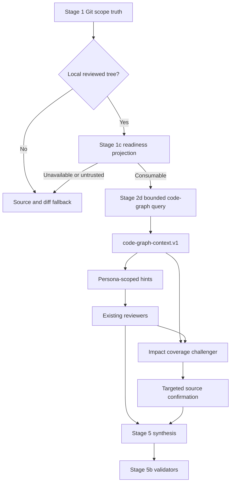
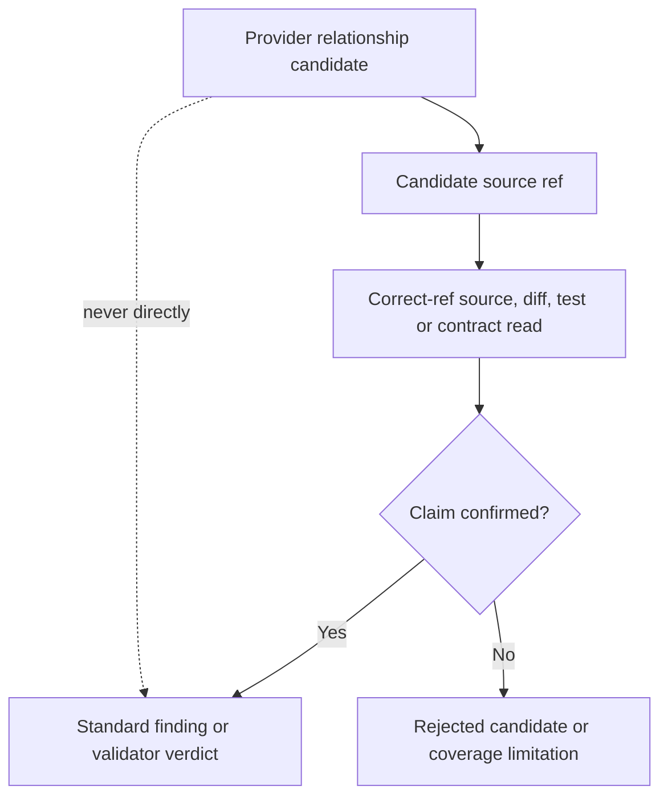

# Spec Code Review Code Graph Advisory Integration - Plan

## Goal Capsule

- **Objective:** 让 `spec-code-review` 默认以 `code-graph:auto` 在正确 scope、可信 readiness 和可回源证据边界内消费候选，由 LLM 判断当前 diff 是否值得查询，并提升跨文件影响面发现与 reviewer 覆盖，而不把外部图谱升级为 finding、测试覆盖或 merge authority。
- **Authority hierarchy:** `docs/10-prompt/结构化项目角色契约.md` 与 `docs/contracts/project-graph-consumption.md` 高于本计划；Stage 1 Git scope、source/test/log/contract evidence 高于 provider 输出；setup facts 只拥有 readiness 事实。
- **Execution profile:** 首版默认 `code-graph:auto`，并提供 `on/off` 显式覆盖。先用当前 provider 的只读 native surface 运行不发布的 paired pilot，校准 LLM 自动触发判据、预算和降级边界并确定 capability-to-invocation contract；只有安全/可调用性 gate 得出 `go`，才交付 provider-neutral thin slice。效果证据不足不阻止 `auto` 首版，但必须限制完整 challenger/validator 投资，并保留 thin-out/retire 路径。
- **Stop conditions:** 若实现要求在 review 内安装、初始化、刷新 provider，允许图谱提高 finding confidence，或让远程 PR 消费当前 checkout 图谱，则停止对应实现并回到契约层修正。
- **Tail ownership:** source skill、skill-local prompt/schema、contract tests 与 README 由本仓库维护；provider installation、index、watcher 与 host MCP config 继续由 `spec-mcp-setup` 和 provider-native lifecycle 拥有。

---

## Product Contract

### Summary

为 `spec-code-review` 增加可选的 `code-graph` advisory consumption path。
该路径读取现有 setup facts，使用正确 scope 下可用的 code-graph native interface 生成候选影响上下文，将候选按 reviewer 职责裁剪，并在 reviewer 完成后用一个条件式 coverage challenger 寻找集体漏审的关键 consumer。
所有可进入 finding 或 validator verdict 的结论仍必须带正确 ref 的源码、diff、测试、日志或契约证据。

### Problem Frame

当前 `spec-code-review` 已具备可靠的 Git scope、动态 reviewer roster、quote-the-line gate、逐 finding validator 和 run artifacts，但跨文件影响发现主要依赖 reviewer 自行搜索。
仓库已经通过 `spec-mcp-setup` 提供 `code-graph` capability readiness，且 `docs/contracts/project-graph-consumption.md` 已定义 candidate-only 信任边界；消费端尚未把这条能力接入审查流程。

外部项目 [code-review-graph](https://github.com/tirth8205/code-review-graph) 展示了 diff-to-function、call/import/inheritance、affected-flow、test-candidate 与 blast-radius 上下文的可用产品形态，也同时暴露了关键限制：历史 impact ground truth 存在循环上界、flow detection 覆盖有限、缺少 test edge 不等于缺少测试。
因此首版应借鉴其上下文组织方式，而不是新增第二个 required provider 或复制其 risk model。

### Requirements

**Readiness 与 scope**

- R1. `spec-code-review` 仅在 setup facts 顶层 freshness 可信、恰有一个可消费的 `code-graph` provider entry、当前工具面存在可由 source-owned invocation contract 唯一解析的 native interface，且 graph index 与 reviewed tree 的对齐状态满足消费规则时启用图谱路径；多 provider、接口或调用 schema 无法唯一解析时降级而不猜测。`repo_aligned: unknown` 不得仅凭 fresh setup facts 或 local scope 升级为完整对齐。
- R2. 图谱路径只允许用于 standalone、`base:` 或 `local-aligned` scope；`pr-remote` 与 `branch-remote` 必须响亮降级到现有 source/diff 路径。
- R3. Review workflow 不得安装、初始化、sync、index、refresh、启动 watcher 或修复 host config。
- R4. 图谱缺失、stale、unknown、degraded、调用失败或结果截断不得阻塞普通 review，也不得让 Stage 3c 错误进入 lite roster。

**候选上下文**

- R5. `code-graph:auto` 时，orchestrator 应在确定性 gate 通过后，由 LLM 根据 Stage 1 diff signals、Stage 2 intent 与 reviewer selection 判断是否发起一次有预算上限的 impact-oriented query；`on` 强制尝试查询，`off` 完全禁用。LLM 只能判断语义适用性，不能猜测 readiness、scope 或 alignment 事实。
- R6. Run-scoped context packet 必须区分 provider readiness、reviewed-tree alignment、graph-index alignment、查询摘要、带稳定 candidate ID 的 source refs/关系候选、未映射/截断/歧义和 direct-source confirmation 状态。
- R7. 图谱候选只能扩大下一步读取范围或影响 reviewer 注意力，不能排除 changed files、缩小 Git review scope、证明 affected tests 完整或生成 merge verdict。
- R8. Provider 返回的带文件与行号的 verbatim source 可按图谱消费契约作为 bounded direct read 使用；推导出的 edge、risk、flow、ownership 和 affected-test 仍保持 advisory。

**Reviewer 与 coverage**

- R9. Stage 3 可把图谱候选作为增加 conditional reviewer 的语义输入，但不能仅凭 provider risk score 设置 severity、confidence 或删除 always-on reviewer。
- R10. Stage 4 应按 persona 裁剪 code-graph hints，避免把完整 provider response 广播给所有 reviewer。
- R11. 新增的 `impact-coverage-challenger` 只能输出 coverage challenges、source refs 和建议补审 persona，不得输出 P0-P3、finding confidence、autofix 或 verdict。
- R12. Challenger 仅在图谱可用、跨文件候选具体且现有 reviewer evidence 未覆盖关键候选时触发；每轮补审请求必须有上限。
- R13. Challenger 或 provider 候选只有经现有 persona 或 orchestrator direct read 回源确认后，才可形成并进入 Stage 5 findings；Stage 5b validator 只能把候选作为导航并回源验证既有 finding，不得从候选直接生成 finding。
- R14. 来自同一 provider candidate family 的 graph query、challenger 与 reviewer hint 不得计为 cross-reviewer agreement，也不得提高 confidence anchor；run-local provenance 必须能从 candidate ID 追踪到 persona slice、challenge、finding artifact 与 direct-source confirmation。

**Artifacts、输出与评估**

- R15. Default 与 `mode:agent` 必须在 Coverage 中记录 code-graph 是否启用、readiness、query/fallback 状态、候选接受/拒绝数量、补审数量和 limitations。
- R16. Run artifact 目录应保存 code-graph context packet 与 coverage challenge artifact；`mode:agent` 主 JSON 保持单对象、可解析且不增加第二套 finding schema。
- R17. 首版默认 `code-graph:auto`，同时支持 `code-graph:on` 与 `code-graph:off`。Auto 只在 LLM 判断存在跨文件/共享接口/异步链路/继承/测试定位等高价值信号且确定性 gate 通过时查询；否则跳过并记录原因。Comparative/field evidence 用于调整 auto 判据、预算、challenger 投资与保留/退役决策，而不是作为默认 auto 的前置产品审批。
- R18. `code-review-graph` 首版只作为能力与评估参考；实现复用当前 setup 已管理的 provider-neutral `code-graph` capability，不新增第二个 required provider、数据库或 runtime truth source。

### Key Flows

- F1. Local review with auto-selected code graph
  - **Trigger:** 默认 `code-graph:auto` 下，Stage 1 确认 standalone、`base:` 或 `local-aligned`，确定性 gate 通过，且 LLM 根据 diff/intent 判断跨文件图谱导航有价值；`code-graph:on` 可强制尝试同一路径。
  - **Steps:** 读取 setup facts → 选择 `code-graph` readiness entry → 发起 bounded query → 生成 context packet → 按 persona 注入 hints → 必要时运行 challenger → source-confirmed findings 进入现有 Stage 5/5b。
  - **Outcome:** 图谱扩展检查面，但 finding authority 与验证规则保持不变。
  - **Covers:** R1-R16

- F2. Provider unavailable or freshness untrusted
  - **Trigger:** setup facts 缺失/过期、provider 非 fresh、native interface 不可达或 query 失败。
  - **Steps:** 记录 reason 与 fallback → 不 dispatch challenger → 继续现有 diff/source review。
  - **Outcome:** Review 结果可降级但不被 provider 阻断。
  - **Covers:** R1, R3, R4, R15

- F3. Remote PR or remote branch
  - **Trigger:** Stage 1 scope 为 `pr-remote` 或 `branch-remote`。
  - **Steps:** 不查询当前 checkout 图谱 → Coverage 记录 `scope-misaligned` → reviewer 继续使用 fetched ref、`git show` 或 diff hunks。
  - **Outcome:** 不发生 stale-workspace 混读。
  - **Covers:** R2, R4, R15

- F4. Coverage challenger requests targeted review
  - **Trigger:** 图谱候选指出 concrete cross-file consumer，而 reviewer artifacts 没有对应 direct evidence。
  - **Steps:** Challenger 产出最多三个 challenge → orchestrator 按建议复用现有 persona 或 direct read → 仅 source-confirmed issue 进入 Stage 5。
  - **Outcome:** 漏审风险被挑战，但 challenger 不成为 finding producer。
  - **Covers:** R11-R14

- F5. Auto mode skips a low-value graph query
  - **Trigger:** 默认 `code-graph:auto`，确定性 gate 可通过，但 diff 为单文件、局部、关系清晰且无共享接口/异步/继承/跨模块/test-location 信号。
  - **Steps:** LLM 记录简短 skip reason → 不运行 query/challenger → 继续现有 diff/source review。
  - **Outcome:** 保留默认自动能力，同时避免参考项目已承认的小变更 graph metadata 开销。
  - **Covers:** R5, R15, R17

### Acceptance Examples

- AE1. Given `code-graph:on`、fresh setup facts 和 local-aligned scope, when query 返回某公共函数的三个 callers, then API reviewer 收到这些 caller 的候选 refs，并在读取源码后才可形成 finding。
- AE1a. Given 默认 `code-graph:auto`、fresh/aligned readiness 和跨模块公共 API 变更, when Stage 2 intent 与 diff signals 表明 blast radius 不透明, then LLM 选择 bounded graph query，并记录 auto trigger reason。
- AE2. Given `code-graph:on` 但 scope 为 `pr-remote`, when review starts, then code-graph query 不运行，Coverage 记录 scope mismatch，review 继续完成。
- AE3. Given provider 返回“未发现测试”, when testing reviewer 查到集成测试覆盖, then不得产生 missing-test finding，并把该 graph candidate 记录为 rejected。
- AE4. Given challenger 指出一个未检查 consumer, when targeted source read 证明 consumer 使用兼容 adapter, then challenge 被清除且不进入 findings。
- AE5. Given provider query timeout, when full reviewer roster 可正常运行, then verdict 仅基于现有 source evidence，Coverage 记录 degraded fallback。
- AE6. Given two agents 都消费同一 graph edge 并提出相同问题, when Stage 5 deduplicates results, then该共享 provider 信号不触发 cross-reviewer confidence promotion。
- AE7. Given 默认 `code-graph:auto` 和一个单文件局部纯函数修改, when diff 与 intent 没有跨文件风险信号, then query 不运行，Coverage 记录 `auto-skipped: low expected value`，普通 reviewer roster 继续。

### Success Criteria

- SC1. 所有图谱启用路径都有 setup-facts freshness、scope alignment 和 native-interface gate。
- SC2. Contract tests 证明 graph candidate 无法提高 finding confidence、替代 validator 或缩小 review scope。
- SC3. 盲化 paired pilot 预先固定样本、顺序、adjudication 与阈值，记录跨文件 confirmed finding 增量、baseline/provider 双侧漏报、false-positive burden、总 token、wall time、source reads 与 provider degradation；没有独立可复核数据时不得进入正式集成阶段。
- SC4. 所有受支持宿主从 source regeneration 后保持 skill/runtime contract 一致，不手改 generated mirrors。

### Scope Boundaries

**Included**

- `spec-code-review` 的 provider-neutral code-graph consumption、persona hints、coverage challenger、validator hint 与 Coverage/run artifacts。
- 复用 `provider-readiness.v2`、`project-graph-consumption.v1` 与现有 CodeGraph MCP readiness。
- 默认 `auto` 与显式 `on/off` 参数、contract tests、README/README.zh-CN 和 runtime projection expectations。

**Deferred to Follow-Up Work**

- 根据真实 pilot/field 结果调整 `auto` 触发判据、预算和 challenger 范围；不再把“是否默认 auto”留作 follow-up。
- 若当前 CodeGraph native surface 无法满足实际评估，再单独评审是否增加 `code-review-graph` provider adapter；该决策必须比较现有 provider、额外安装成本、license、host coverage 和维护责任。
- 远程 PR 的 snapshot graph、临时 worktree graph 或 provider-side ref selection。

**Outside this product's identity**

- 建设通用图数据库、通用 TIA、完整 coverage engine、静态分析平台或 provider risk scoring framework。
- 让图谱拥有 scope、finding、severity、confidence、mutation 或 merge authority。
- 在 code review workflow 中维护 provider lifecycle。

### Assumptions

- 当前 `spec-mcp-setup` 继续提供至少一个 `code-graph` capability entry，并通过 host MCP config 暴露只读 native interface。
- `provider_untrusted.summaries[]` 与 review Coverage 足以记录候选消费，不需要新增 universal evidence enum。
- 首版 pilot 可以使用真实或历史 PR，通过人工确认的 findings 作为对照，不把 provider 自评指标当 gold truth。

---

## Planning Contract

### Key Technical Decisions

- KTD1. **Wrap existing capability, do not add a provider.** 首版复用 `skills/spec-mcp-setup/scripts/providers/codegraph.cjs` 和 `provider-readiness.v2`；named external project 只影响 context packet 与 evaluation design。
- KTD2. **Keep provider-specific invocation behind a setup-owned adapter contract.** U0 必须先确定 source-owned capability-to-invocation mapping，覆盖可调用 interface/tool、输入输出 schema、host/tool inventory 解析和稳定 reason code；`skills/spec-code-review/SKILL.md` 只消费该 provider-neutral surface。零个或多个可消费的 fresh provider entry、零个或多个可唯一解析的 invocation 都 fallback；唯一 provider 查询返回的多个关系或 source-ref 候选则按预算裁剪后消费。Provider 安装命令、artifact root 和 version pin 继续留在 setup-owned source。
- KTD3. **Initialize the run before graph artifacts.** Stage 1c 完成 gate 后创建 run id 与 artifact directory；`branch`、`head_sha` 仍在 reviewer dispatch 时捕获。Stage 2d 使用 Stage 2 intent 生成 bounded impact query，避免无上下文的全图扫描，并能在 query/degraded 早退时保留可审计 artifact。
- KTD4. **Require two alignment dimensions.** reviewed-tree alignment 证明 workspace/ref 是审查对象；graph-index alignment 证明 provider index 覆盖该 ref/commit 与 dirty-tree 边界。Remote modes 无条件 fallback；index alignment 为 unknown 时必须降级并记录未提交改动与缺边风险，不得称为 complete。
- KTD5. **Use run-local narrow packets and provenance.** 新增 skill-local `code-graph-context.v1` 与 `graph-candidate-provenance.v1`，前者保存候选上下文，后者以稳定 candidate ID 关联 persona/challenge/finding/direct evidence；二者只服务本 review run，不建立跨 workflow universal graph schema或修改公共 finding schema。
- KTD6. **Distribute hints by persona.** Orchestrator 将相同 packet 裁剪为 reviewer-specific candidate refs，reviewer 仍收到完整 diff 并保留自主 source inspection 权限。
- KTD7. **One challenger, zero finding authority.** `impact-coverage-challenger` 只找 review coverage 差集；不拆分 flow/community/risk agents，避免同源伪共识。
- KTD8. **Targeted re-review reuses existing finding schema.** Challenger 的 challenge 经 source confirmation 后，由既有 persona 或 orchestrator 产出标准 finding；challenger artifact 永不进入 agreement count。
- KTD9. **Auto by default, explicit overrides.** 新增 provider-neutral 的 `code-graph:auto | on | off`；默认 `auto`，多个不同 token 冲突时 fail before dispatch。`auto` 的 LLM 判据参考 code-review-graph 的 graph-first/minimal-context 模式，但只在跨文件价值信号存在时调用，并受确定性 gate、调用次数、输出 token 与 challenge 数上限约束。

### High-Level Technical Design

以下图为方向性设计，不规定具体函数签名或 provider tool name。





### Artifact Contracts

`code-graph-context.v1` 保存到既有 review run artifact directory 下的 `code-graph-context.json`，最小字段为：

- `schema_version`
- `provider`
- `status`: `complete | degraded | skipped`
- `readiness_status`
- `reviewed_tree_alignment`
- `graph_index_alignment`
- `query_summary`
- `candidate_source_refs[]`（每项带稳定 `candidate_id`）
- `candidate_relationships[]`（每项带稳定 `candidate_id`）
- `accepted_candidates[]`
- `rejected_candidates[]`
- `unmapped_or_ambiguous[]`
- `truncated`
- `limitations[]`
- `fallback_used`

`coverage-challenge.v1` 保存到同一 run directory 的 `coverage-challenges.json`，最小字段为：

- `schema_version`
- `status`
- `challenges[]`
- 每个 challenge 包含 `title`、`candidate_refs[]`、`why_unreviewed`、`suggested_persona`、`requires_source_confirmation: true`
- 禁止出现 `severity`、`confidence`、`autofix_class`、`owner`、`verdict` 或标准 finding `#`

`graph-candidate-provenance.v1` 保存到同一 run directory 的 `graph-candidate-provenance.json`，由 orchestrator 单写，最小字段为：

- `schema_version`
- `candidate_id`
- `provider_id` 与 `query_id`
- `injected_personas[]`
- `challenge_ids[]`
- `finding_artifact_ids[]`
- `direct_source_refs[]`
- `disposition`: `accepted | rejected | unresolved`
- `limitations[]`

Reviewer 与 challenger 只返回 candidate ID 引用，不并发修改共享 packet；Stage 5 由该 sidecar 排除共享 candidate family 的 agreement promotion。

### System-Wide Impact

- **Workflow:** `spec-code-review` 增加 Stage 1c、Stage 2d 和 Stage 4b，但现有 Stage 1 scope、Stage 3 roster、Stage 5 finding merge、Stage 5b validation 与 Stage 5c apply authority不变。
- **Context:** provider response 不直接复制到每个 reviewer；大结果写 run artifact，prompt 只传路径和 persona slice。
- **Evidence:** graph candidates 进入 `provider_untrusted`/Coverage；source-confirmed evidence 继续使用 finding `first_evidence`、artifact `evidence` 与 validator verdict。
- **Runtime:** source 变更需通过 `spec-first init` 投射到 Claude、Codex、Cursor、Kiro、Qoder；不得手改 generated runtime mirrors。
- **Cost:** 默认 auto 在高价值 diff 上增加 query/challenger 延迟，在低价值 diff 上由 LLM skip；minimal-first query、调用/output budget、最大三个 challenge 与条件 dispatch 控制成本。

### Sequencing

```mermaid
flowchart TB
-  U0[U0 Invocation spike and auto-policy pilot] --> G{Safety and invocation go?}
  G -->|No| X[Stop; record blocker and keep existing review]
  G -->|Inconclusive value| U1[Proceed with thin auto; defer challenger investment]
  G -->|Yes| U1[U1 Readiness and argument contract]
  U1 --> U2[U2 Context packet and Stage 2d]
  U2 --> U3[U3 Persona hints]
  U3 --> U4[U4 Coverage challenger]
  U4 --> U5[U5 Validator, output and artifacts]
  U5 --> U6[U6 Docs, runtime projection and pilot evidence]
```

### Risks and Mitigations

| Risk | Mitigation |
|---|---|
| Provider output looks authoritative because it is structured | Every packet field is advisory; schemas omit finding authority fields; contract tests pin no confidence promotion |
| Remote PR reads current checkout graph | Scope gate skips `pr-remote` and `branch-remote` before query |
| Stale setup facts report a usable provider | Require trustworthy top-level `generated_at`; unknown/stale facts fall back and appear in Coverage |
| Graph query bloats all reviewer prompts | Persist once, distribute persona slices or paths, cap candidates and tool calls |
| Challenger creates a second review pipeline | Challenger only emits bounded coverage questions and reuses existing personas/validator |
| Same provider creates fake agreement | Mark all graph-derived actors as one provenance family excluded from agreement promotion |
| Missing graph edges are treated as absence | Empty results never prove no caller/test/impact; record mapping and limitations |
| Default auto becomes permanent without value proof | Track auto trigger/skip quality and field cost; tighten thresholds、thin out、switch default to off or retire when value does not justify maintenance |

---

## Implementation Units

### U0. Resolve Invocation and Calibrate the Default Auto Policy

- **Goal:** 在建设正式 workflow surface 前证明 native query 可被稳定调用，并为默认 `auto` 校准语义触发信号、skip 信号和预算；效果结果决定 thin/full 投资，而不是重新决定默认模式。
- **Requirements:** R1-R4, R7, R14, R18
- **Files:** `tests/unit/spec-code-review-contracts.test.js`, `tests/unit/mcp-setup-providers.test.js`, setup-owned invocation adapter source/contract selected by the spike, `docs/contracts/project-graph-consumption.md`, `docs/validation/`
- **Patterns:** Reuse existing Stage 3c fail-closed assertions, `provider-readiness.v2` fixtures, quote-the-line contract checks and read-only provider probes.
- **Approach:** First characterize current scope/finding/validation/provider invariants. Then inspect actual host tool inventories and CodeGraph native schemas, choose one source-owned capability-to-invocation contract with stable failure reason codes, and run a non-published paired pilot without challenger、persistent public schemas、validator hints 或多宿主 projection。参考 code-review-graph 的 `review-changes` skill 与 SessionStart guidance：graph 可用时由 LLM 优先取 minimal context，限制工具调用与输出预算，仅在不足时升级 detail。Pilot 同时覆盖应触发的 multi-file/API/async/inheritance/test-location 样本和应跳过的单文件局部样本，预先固定顺序、adjudication 与阈值。安全/调用性为 `no-go` 时停止；价值结果不明确时仍可进入最小 `auto`，但不得建设 challenger/validator 扩展。
- **Test Scenarios:**
  - Current review contract keeps `pr-remote` and `branch-remote` workspace reads forbidden.
  - CodeGraph readiness may be `fresh`, but `repo_aligned: unknown` and `source_read_required: true` remain visible.
  - Existing confidence promotion requires independent reviewer evidence and cannot consume provider agreement.
  - Runtime tool inventory cannot resolve exactly one invocation/schema → stable fallback reason and pilot `no-go`/blocked, not workflow-local guessing.
  - Paired runs record baseline-only、graph-only、shared 与 both-missed findings without using provider self-evaluation as gold truth.
  - Pilot pre-registers auto-trigger precision/recall、graph-query skip correctness、review recall non-inferiority、additional confirmed finding、定位成本、p95 latency、token 和 rejected-candidate thresholds。
- **Verification:** `npx jest tests/unit/spec-code-review-contracts.test.js tests/unit/mcp-setup-providers.test.js --runInBand` plus a source-referenced pilot report under `docs/validation/`

### U1. Add Default Auto Arguments and Readiness/Scope Gate

- **Goal:** Establish a fail-open, provider-neutral default-auto entry gate without invoking or mutating a provider during readiness evaluation.
- **Requirements:** R1-R4, R17
- **Files:** `skills/spec-code-review/SKILL.md`, `tests/unit/spec-code-review-contracts.test.js`, `tests/unit/spec-code-review-code-graph-contracts.test.js`
- **Approach:** Add `code-graph:auto`、`code-graph:on` and `code-graph:off` argument parsing, conflict handling, Stage 1c readiness lookup rules and explicit remote-scope skip behavior. No token means `auto`; `on` bypasses only LLM semantic skip, never deterministic gates；`off` prevents all graph calls。
- **Test Scenarios:**
  - No graph token normalizes to `code-graph:auto`；LLM 可基于高价值 diff/intent signals 查询或基于低价值信号跳过。
  - `code-graph:on` enables the gate but does not run setup mutation or bypass readiness/scope/alignment checks.
  - `code-graph:on code-graph:off` fails before reviewer dispatch.
  - Missing/stale setup facts produce degraded fallback and normal review continuation.
  - Zero or multiple fresh `code-graph` provider entries produce an ambiguous-provider fallback rather than arbitrary selection.
  - `pr-remote`/`branch-remote` skip query even when readiness is fresh.
  - `repo_aligned: unknown`、缺 index ref/fingerprint 或 dirty-tree coverage 未知时，graph-index alignment 保持 degraded/unknown 并记录 limitation。
  - Provider unavailable does not satisfy or alter Stage 3c lite conditions.
  - `code-graph:off` makes no provider call even when readiness is fresh；多个不同 graph-mode tokens fail before dispatch。
- **Verification:** `npx jest tests/unit/spec-code-review-contracts.test.js tests/unit/spec-code-review-code-graph-contracts.test.js --runInBand`

### U2. Define and Produce the Run-Scoped Code-Graph Context Packet

- **Goal:** Convert one bounded native query into a small, validated advisory packet tied to the review run.
- **Requirements:** R5-R8, R15, R16
- **Files:** `skills/spec-code-review/SKILL.md`, `skills/spec-code-review/references/code-graph-context.md`, `skills/spec-code-review/references/code-graph-context.schema.json`, `skills/spec-code-review/references/graph-candidate-provenance.schema.json`, `tests/unit/spec-code-review-code-graph-contracts.test.js`
- **Approach:** Stage 1c gate 后先创建 run id/artifact directory；Stage 2d 在 intent/profile discovery 后通过 U0 确定的 invocation contract 查询 changed symbols/files，限制响应大小，规范化带稳定 ID 的 candidate refs/relationships/limitations，并由 orchestrator 单写 context packet 与 provenance sidecar。Malformed/oversized/ambiguous results fail open。
- **Test Scenarios:**
  - Valid native output produces a schema-valid packet with provider provenance and limitations.
  - Verbatim `file:line` source is marked direct-source-capable while inferred edges remain advisory.
  - Malformed output, timeout, truncation and zero mapping are preserved as degraded/limited rather than “no impact”.
  - Large context is staged by path and never duplicated into every prompt.
  - Query 前 run directory 已存在；query 失败的早退 artifact 仍记录 reason，而 dispatch-time `branch`/`head_sha` 语义保持不变。
- **Verification:** `npx jest tests/unit/spec-code-review-code-graph-contracts.test.js --runInBand`

### U3. Inject Persona-Scoped Navigation Hints

- **Goal:** Use the packet to improve reviewer search coverage without restricting independent review.
- **Requirements:** R7-R10, R14
- **Files:** `skills/spec-code-review/SKILL.md`, `skills/spec-code-review/references/subagent-template.md`, `skills/spec-code-review/references/persona-catalog.md`, `tests/unit/spec-code-review-code-graph-contracts.test.js`
- **Approach:** Define small persona slices for correctness, testing, API contract, reliability, performance and maintainability. Make the hints optional context, require source confirmation for any conclusion, and exclude provider provenance from cross-reviewer promotion.
- **Test Scenarios:**
  - Correctness receives caller/inheritance candidates; testing receives test candidates; unrelated personas do not receive the full packet.
  - Empty graph results do not suppress reviewer search or remove conditional personas selected from the diff.
  - A provider hint plus one persona finding remains at the persona's own confidence anchor.
  - A graph candidate rejected by source inspection is recorded without becoming a finding.
  - 两个 persona 引用同一 candidate ID 时，即使各自回源形成 finding，也不会因 reviewer 数量触发 agreement promotion。
- **Verification:** `npx jest tests/unit/spec-code-review-code-graph-contracts.test.js tests/unit/spec-code-review-contracts.test.js --runInBand`

### U4. Add the Conditional Impact Coverage Challenger

- **Goal:** Detect important graph candidates that all selected reviewers failed to inspect.
- **Requirements:** R11-R14
- **Files:** `skills/spec-code-review/SKILL.md`, `skills/spec-code-review/references/personas/impact-coverage-challenger.md`, `skills/spec-code-review/references/coverage-challenge.schema.json`, `skills/spec-code-review/references/persona-catalog.md`, `tests/unit/spec-code-review-code-graph-contracts.test.js`
- **Approach:** Insert Stage 4b after persona artifacts arrive. Trigger only when concrete cross-file candidates lack direct evidence, cap output at three challenges, forbid finding fields, and route accepted challenges to one targeted existing persona or orchestrator direct read.
- **Test Scenarios:**
  - Challenger is skipped when graph is unavailable, remote-scoped, empty, ambiguous or already covered.
  - Challenger output containing severity/confidence/verdict is rejected as malformed.
  - A concrete uncovered caller produces one targeted review request with source confirmation required.
  - Multiple graph-derived agents never count as independent agreement.
  - Capacity failure records degraded coverage and does not block Stage 5.
- **Verification:** `npx jest tests/unit/spec-code-review-code-graph-contracts.test.js --runInBand`

### U5. Integrate Validator Hints, Coverage Output and Run Artifacts

- **Goal:** Preserve evidence boundaries through validation and both output modes.
- **Requirements:** R8, R13-R16
- **Files:** `skills/spec-code-review/SKILL.md`, `skills/spec-code-review/references/validator-template.md`, `skills/spec-code-review/references/review-output-template.md`, `tests/unit/spec-code-review-code-graph-contracts.test.js`, `tests/unit/spec-code-review-contracts.test.js`
- **Approach:** Let validators consume candidate counterexamples as navigation only, add code-graph metrics/limitations to Coverage and `mode:agent.coverage`, and persist context、challenge、provenance 三类 run artifacts without changing the standard finding schema.
- **Test Scenarios:**
  - Validator must inspect source before accepting or rejecting a graph-assisted claim.
  - Empty caller/test results cannot validate “no impact” or “no tests”.
  - Default Markdown reports readiness, fallback, accepted/rejected candidates and challenge outcome.
  - `mode:agent` remains one raw JSON object and references the run artifact path.
  - Existing findings schema remains compatible and contains no provider authority field.
- **Verification:** `npx jest tests/unit/spec-code-review-code-graph-contracts.test.js tests/unit/spec-code-review-contracts.test.js --runInBand`

### U6. Document, Project Runtime, and Collect Auto-Policy Field Evidence

- **Goal:** 在 U0 完成安全/调用性校准且 U1-U5 完成后发布默认 auto surface，收集 auto 判据是否应收紧、扩展、thin-out 或退役的真实证据。
- **Requirements:** R15-R18
- **Files:** `README.md`, `README.zh-CN.md`, `CHANGELOG.md`, `docs/contracts/project-graph-consumption.md`, `docs/validation/`, `skills/spec-code-review/SKILL.md`, generated host runtime mirrors via `spec-first init`
- **Approach:** Document default `auto`、explicit `on/off` and the advisory boundary, regenerate all supported host projections from source, and run time-bounded field observation。记录 eligible review 中 auto-query rate、auto-skip rate、`on/off` override、错误触发/漏触发、人工 review/rework 成本与 time-to-trusted-change。指定 auto-policy/retirement owner；高误触发、高维护成本、宿主原生替代或长期无增量价值触发判据收紧、thin-out 或退役评审。
- **Test Scenarios:**
  - Claude、Codex、Cursor、Kiro、Qoder runtime projection contains the same source contract after regeneration.
  - Small single-file changes demonstrate no forced graph query because default auto emits a low-value skip decision.
  - Multi-file/API/async changes produce auditable candidate and challenge artifacts.
  - Field report separates provider metrics from confirmed review outcomes and states whether auto policy should remain、tighten、expand or retire.
  - Weak value evidence keeps the minimal default-auto path but blocks challenger/validator expansion and triggers threshold tightening review.
  - 若维护成本超过增量价值，owner 必须记录 `auto -> off` default change、退役或 thin-out 决策，而非无限期保留实验 surface。
- **Verification:** `npm run lint:skill-entrypoints`, `npm run typecheck`, `npm run test:unit`, `npm run test:mcp-setup`, `npm run test:smoke`, `npm run build`, `git diff --check`

---

## Verification Contract

| Verification | Command or evidence | Proves |
|---|---|---|
| Focused review contracts | `npx jest tests/unit/spec-code-review-contracts.test.js tests/unit/spec-code-review-code-graph-contracts.test.js --runInBand` | Arguments、scope、packet、challenger、confidence 和 output invariants |
| Provider readiness regression | `npx jest tests/unit/mcp-setup-providers.test.js tests/unit/mcp-setup-contracts.test.js tests/unit/mcp-setup-facts-renderer.test.js --runInBand` | 现有 CodeGraph lifecycle/readiness 未被消费端破坏 |
| Skill entry governance | `npm run lint:skill-entrypoints` | 新 prompt/reference/entrypoint 结构合法 |
| Syntax | `npm run typecheck` | CLI、scripts 与关键 JS 语法合法 |
| Main unit chain | `npm run test:unit` | 全局 unit contract 无回归 |
| Runtime setup | `npm run test:mcp-setup` | Provider setup、facts 与 host config contract 仍通过 |
| Host/runtime smoke | `npm run test:smoke` | source projection 后 CLI/init/doctor 路径可用 |
| Package contents | `npm run build` | 新 skill assets 被正确打包 |
| Diff hygiene | `git diff --check` | 无 whitespace 或 patch 格式问题 |
| Comparative pilot | Baseline/codegraph paired review report under `docs/validation/` | 真实效果、成本和 failure-mode evidence；不由测试绿灯替代 |

### Auto-Policy Evidence and Retention Gate

默认 `auto` 是当前 owner 决策；以下证据用于决定是否保持、收紧、扩展或退役该策略：

- 对代表性 multi-file review 样本，高严重度或跨文件 confirmed finding recall 不下降。
- Graph-assisted path 带来可归因的额外 confirmed findings，或显著减少 reviewer/validator 定位成本。
- Provider candidate 被源码否定的比例、p95 延迟和 token 增量处于 owner 可接受范围。
- Graph 未建议但 baseline/gold 命中的关键 finding 被单独统计，不能被平均值掩盖。
- Provider unavailable/stale/degraded 时 fallback 完成率为 100%，且 verdict 不依赖 provider。
- Auto-trigger precision/recall 可解释：应查询的复杂 diff 不被系统性漏掉，不值得查询的小 diff 不承担固定 graph 开销。
- `on/off` override 使用和原因未表明 auto 判据产生不可接受的认知或等待成本。
- `time-to-trusted-change` 计入人工审查、source confirmation、返工与集成成本后仍改善或至少不退化。
- Auto-policy owner、重估日期和退役条件已明确；误触发/漏触发持续过高、维护成本过高或 host-native code intelligence 覆盖该能力时不得仅因机制已建成而默认保留。

---

## Definition of Done

- D1. R1-R18 均由至少一个 U-ID 实现并由聚焦 contract test 覆盖。
- D2. `spec-code-review` 只在正确 local scope 和可信 readiness 下查询 code graph，remote scope 永不读取当前 checkout 图谱。
- D3. Provider output、challenger 和同源 reviewer hint 无法提高 confidence、替代 validator 或直接形成 finding。
- D4. Default 与 `mode:agent` 均能审计 code-graph query、fallback、candidate disposition、challenge 与 limitations。
- D5. Provider failure、staleness、截断和空结果均 fail open 到现有 review，而不是假定低风险或无影响。
- D6. Source 变更已通过 `spec-first init` 投射到所有 `getSupportedPlatforms()` 返回的宿主，且未手改 generated runtime mirror。
- D7. README、README.zh-CN 与 CHANGELOG 说明默认 `auto`、显式 `on/off`、LLM semantic trigger、确定性 gate 和证据边界。
- D8. Comparative pilot 已产出可回源报告；证据不足时只保留最小 auto 路径并阻断 challenger/validator 扩展，不宣称改善 review quality。
- D9. 实现过程中产生的废弃 schema、临时 prompt、实验脚本和重复 provider adapter 已删除。
- D10. U0 pilot 在任何正式 workflow/schema/runtime projection 建设前完成并给出安全/调用性 `go | no-go` 与价值 `supported | inconclusive | unsupported`；安全/调用性非 `go` 不得进入 U1，价值非 `supported` 不得进入完整 challenger/validator 投资。
- D11. Native invocation、graph-index alignment 与 candidate provenance 均有 source-owned contract 和聚焦测试，不依赖 workflow 内猜测或同源 reviewer 共识。
- D12. Field evidence 覆盖 auto trigger/skip、显式 override 与重复使用信号，并指定 auto-policy/retirement owner、重估时间和退役条件。

---

## Appendix

### Source and Research Anchors

- `skills/spec-code-review/SKILL.md` — current Stage 1-6 review pipeline、scope modes、reviewer dispatch、finding synthesis 和 validator contract。
- `skills/spec-mcp-setup/scripts/providers/codegraph.cjs` — existing `code-graph` provider readiness、native interfaces、fallback 和 lifecycle ownership。
- `docs/contracts/provider-readiness.md` — setup-owned readiness 与 downstream fallback 边界。
- `docs/contracts/project-graph-consumption.md` — project/code graph candidate-only consumption、trust relay 与 recording rules。
- `docs/contracts/workflows/review-finding.md` — review finding direct/supporting evidence 与 confidence boundary。
- `docs/solutions/architecture-patterns/codegraph-graphify-capability-and-evidence-boundary.md` — CodeGraph/Graphify capability 与 evidence ownership 的 durable learning。
- [code-review-graph architecture](https://github.com/tirth8205/code-review-graph/blob/main/docs/architecture.md) — diff-to-impact、flows、communities 与 review context 形态参考。
- [code-review-graph reproducing benchmarks](https://github.com/tirth8205/code-review-graph/blob/main/docs/REPRODUCING.md) — impact accuracy、token efficiency 与 ground-truth limitations 参考。
- `code-review-graph:skills/review-changes/SKILL.md` — graph-first 自动 review、minimal-first、最多约 5 次工具调用和约 800 output-token 预算的参考实现。
- `code-review-graph:hooks/session-start.sh` — graph artifact 可用时让 LLM 优先 MCP graph、不可用时回退 source search 的默认自动消费形态。
- `code-review-graph:code_review_graph/tools/review.py` — `detail_level="minimal"`、changed/impacted summary、next-tool suggestions 与小变更 metadata overhead 的实现依据。
- `code-review-graph:code_review_graph/constants.py` — impact depth、node count 与 search result 的 bounded execution 参考。

### Project-Level Promotion Candidate

- **Target kind/path:** existing contract refinement in `docs/contracts/project-graph-consumption.md`.
- **Proposed meaning:** code-review consumers may use a run-scoped code-graph packet and coverage challenger only as candidate navigation; same-provider consumers never constitute independent agreement.
- **Consumer:** `spec-code-review` and future review workflows.
- **Provenance:** this plan plus the comparative pilot.
- **Applicability:** workflows that already have direct source confirmation and provider readiness gates.
- **Invalidation condition:** host-native code intelligence gains confirmed scope/finding authority or an independent benchmark proves a deterministic affected-test/impact contract.
- **Status:** not written by this workflow beyond the implementation unit explicitly updating the existing contract。
