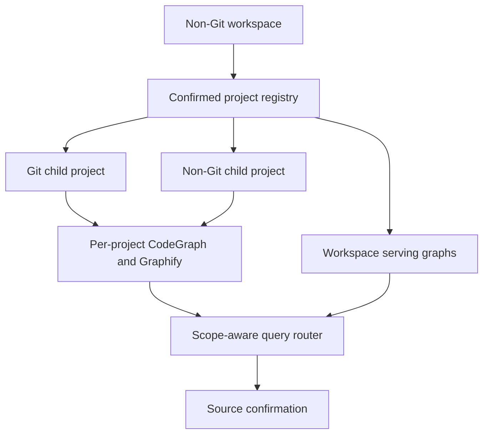

# Multi-Repo Workspace Graph Lifecycle and Query - Plan

## Goal Capsule

- **Objective:** 让非 Git 父 workspace 能以明确项目边界建立、查询和刷新 CodeGraph 与 Graphify 的 child 图和 workspace serving graph，并从跨仓候选可靠回到对应项目源码。
- **Product authority:** project registry 定义 workspace 收录范围；各项目源码、Git 状态和直接证据高于 Provider 图谱；workspace 图只拥有跨项目导航候选权威。
- **Execution profile:** 首版以可信跨仓查询闭环为成功标准，复用 Provider-native 刷新能力，不新增 spec-first 常驻 watcher。
- **Open blockers:** 无 planning 前产品阻断项；具体 CLI、artifact schema 与 Provider adapter 机制留给 planning。

---

## Product Contract

### Summary

为非 Git 父 workspace 建立多项目图谱控制面：经确认的 project registry 管理 Git 与非 Git项目，各项目保留独立 CodeGraph/Graphify 图，同时提供带项目命名空间的 workspace serving graph和统一查询路由。
系统按最小充分 scope 查询，按 Provider 与 scope 独立报告 freshness，并在刷新失败或局部过期时继续服务旧快照、回源读取受影响代码。

### Problem Frame

开发者经常从一个不属于任何 Git 仓库的父目录打开多个独立服务、前端、工具和文档项目。
当前 Runtime Setup 能显式处理 non-Git folder，也能发现和批量处理 child Git repo，但自动 child discovery 只把 Git repo 作为一等项目；混合 workspace 中的普通非 Git项目没有稳定 identity、独立 readiness 或刷新边界。

CodeGraph 与 Graphify 已能分别提供战术 code graph 和宏观 project graph，但两者的 artifact、查询与刷新生命周期仍以单一 project root 为中心。
既有 code-review graph 计划只消费可用的 CodeGraph，不负责创建 workspace 图、维护 Provider lifecycle 或接入 Graphify，因此不能承担通用 workspace 图谱能力。

缺少统一 workspace contract 时，agent 要么逐仓重复搜索，要么把父目录误当成单仓；跨项目关系、图谱 freshness、失败降级和 mutation authority 都容易被混淆。

### Key Decisions

- **Child 图与 workspace 图并存。** 每个项目继续拥有独立图；workspace serving graph 直接扫描 registry 覆盖的源码，不合并 CodeGraph 或 Graphify 的私有数据库。
- **Registry 是已确认范围基线。** 首次自动发现只产生候选；用户确认、排除或补充后，registry 才决定后续建图、查询和刷新范围。
- **查询采用最小充分 scope。** Scripts 提供路径、项目和 readiness 候选，LLM 判断单项目、multi-project fan-out 或跨项目关系查询；范围不明确时询问用户。
- **不新增统一 watcher。** CodeGraph、Graphify 和 Git 继续拥有各自原生刷新触发；spec-first 只编排 scope、freshness、验证和修复建议。
- **旧快照持续服务。** 刷新中的图继续以 advisory 旧快照提供未受影响范围的候选；命中 pending 范围时强制回源读取。
- **Provider 独立降级。** CodeGraph 与 Graphify 按 project/workspace scope 分别报告状态；单 Provider 成功不能掩盖另一个 Provider 的失败。
- **Parent 只拥有 workspace scope。** 父 workspace 可以拥有显式标记的 workspace-level Provider artifact，但不能获得 child Git、修改、finding 或验证权威。

### Actors

- A1. **Workspace user:** 从父 workspace 建图、查询、查看 freshness 并授权项目边界变化。
- A2. **LLM workflow:** 根据确定性候选选择最小查询 scope，解释限制，并把重要候选回源确认。
- A3. **Runtime Setup control plane:** 发现项目、维护 registry/readiness ledger、执行获授权的 setup/refresh 操作并报告 reason codes。
- A4. **CodeGraph 与 Graphify:** 生成和查询 provider-owned artifacts，并按各自能力提供刷新与 lifecycle facts。

### Requirements

**Workspace discovery and registry**

- R1. 系统必须把非 Git parent workspace 识别为 orchestration boundary，并在受限深度和路径 containment 下发现 Git 与非 Git项目候选。
- R2. 首次发现结果必须以 preview 呈现，由用户确认、排除或补充后形成 project registry。
- R3. Registry 必须为每个项目记录稳定 workspace-relative identity、project root、Git/non-Git 类型和图谱参与范围。
- R4. 新项目、删除项目、root 变化或 scope 扩大必须标记 registry drift，未知目录不得静默进入已有图谱。
- R5. Registry 必须允许显式排除 vendor、build、cache、generated runtime 和其他非项目目录。

**Graph scopes and authority**

- R6. 每个已收录项目必须能拥有独立的 CodeGraph 与 Graphify artifact、readiness 和 freshness。
- R7. Workspace serving graph 必须直接索引 registry 覆盖的源码，并为节点和关系保留 project identity 与 workspace-relative source reference。
- R8. Workspace serving graph 不得由 child Provider 数据库物理合并产生，也不得依赖 Provider 私有 schema 作为跨 Provider contract。
- R9. Child graph、workspace graph 和各 Provider 必须使用不同 scope identity 与 provenance family，状态不得互相提升。
- R10. Workspace 图只能提供跨项目导航和影响候选；Git scope、mutation、finding、verification 与 durable knowledge 必须回到所属项目的直接证据。

**Provider capability and readiness**

- R11. CodeGraph readiness 必须独立表达符号、调用链和影响范围能力；Graphify readiness 必须独立表达项目结构、社区和路径探索能力。
- R12. 每个 project/workspace scope 只有在两个 required Provider 均 ready 时才可标记 complete；单 Provider 可用时必须标记 partial 并列出可用能力。
- R13. Readiness 必须区分 dependency、configured、artifact、query probe、hook/watcher、freshness 和 limitations，不能用单一 ready 标签掩盖缺口。
- R14. Provider 输出始终是 advisory candidate；空结果在 partial、stale 或 unknown 状态下没有否定权。

**Query routing**

- R15. 查询前必须由 deterministic resolver 提供当前目录、显式 project/path、registry membership、Provider readiness 和 scope 候选。
- R16. LLM 必须根据用户意图选择单 child 查询、多个 child fan-out 或 workspace 跨项目查询，scripts 不得替代语义判断。
- R17. 单项目问题应优先使用 child graph；多个独立项目的同类搜索应 fan-out child graphs；跨项目依赖和路径问题应使用 workspace graph。
- R18. 查询范围存在多个合理解释时必须请求用户选择，不得因名称相似或目录邻接静默选仓。
- R19. 跨项目候选必须携带 project、scope、Provider、freshness 和 source refs，并路由回所属项目源码确认。
- R20. 查询触及 pending 或 stale-for-scope 文件时，系统必须跳过相关 graph snippet 的 fresh-source待遇并执行 bounded direct read。

**Refresh and consistency**

- R21. spec-first 不得为统一图谱新建常驻 watcher；steady-state refresh 继续由 Provider-native lifecycle、Git hooks 或显式 refresh 拥有。
- R22. 当前仓库契约中的 CodeGraph steady-state 应继续由 MCP connect catch-up、filesystem watcher/auto-sync 和 provider-owned manual repair承担；setup 不启动 watcher。
- R23. Git项目 Graphify 应继续使用 `post-commit` 与 `post-checkout` hooks；非 Git项目和父 workspace Graphify 首版使用显式 refresh。
- R24. Registry、Provider 版本、解析规则或项目边界变化必须使受影响 scope 要求完整重建，而不是仅运行普通增量刷新。
- R25. 每个 scope 必须记录 current snapshot、pending projects/files、last verified refresh、freshness 和失败原因。
- R26. 刷新期间必须继续服务上一份已验证快照；未命中 pending 范围的查询可继续使用旧图作为 advisory candidate。
- R27. 显式刷新必须在隔离 staging 中生成并完成 artifact integrity 与 query probe 后原子 promote；失败必须恢复或保留旧 snapshot。
- R28. 新增、删除、重命名和跨项目移动必须更新或清除旧节点与旧关系，不能仅追加新节点。
- R29. 一个 child 或 Provider 刷新失败不得把其他 scope 全部标记失败；workspace graph 应按实际覆盖范围进入 partial 或 stale。

**Setup behavior and reporting**

- R30. Registry 不存在或发生 drift 时，workspace setup 必须停在 preview/confirmation，不得直接建立或扩大图谱。
- R31. Registry 已确认且未变化时，裸 setup 可以按既有授权验证并维护 required child/workspace graphs，不重复要求同一确认。
- R32. 用户必须能显式选择单个项目、全部项目、仅 workspace graph 或 child 加 workspace 的完整 setup 范围。
- R33. Setup summary 必须分别展示 child/workspace scopes、CodeGraph/Graphify capabilities、freshness、skipped/partial/action-required 和精确修复动作。
- R34. Parent workspace 的 setup artifacts 必须明确标记 workspace scope，不得冒充任一 child 的 repo-local facts 或授权 child mutation。

### Key Flows

- F1. First workspace setup
  - **Trigger:** 用户首次从非 Git parent workspace 运行 Runtime Setup。
  - **Actors:** A1, A3, A4
  - **Steps:** bounded discovery 生成候选；用户确认 Git/non-Git projects 与 exclusions；系统保存 registry；按授权建立 child 与 workspace graphs；验证 query 与 refresh surfaces；写入分 scope ledger。
  - **Outcome:** workspace 获得明确项目边界和可审计的 complete/partial readiness。
  - **Covers:** R1-R14, R30-R34

- F2. Single-project query from workspace root
  - **Trigger:** 查询明确指向一个项目、文件或当前 child context。
  - **Actors:** A1, A2, A4
  - **Steps:** resolver 返回唯一 child candidate；LLM 选择 child CodeGraph 或 Graphify；结果携带 child provenance；重要结论回源确认。
  - **Outcome:** 仓内问题不承担 workspace 图的额外噪声和成本。
  - **Covers:** R15-R20

- F3. Cross-project relationship query
  - **Trigger:** 用户询问跨服务调用、共享协议、跨项目 consumer 或两个项目之间的路径。
  - **Actors:** A1, A2, A4
  - **Steps:** resolver 提供 workspace scope 与相关 child candidates；LLM 查询 workspace graph；候选按 project 路由回 child source；回答记录 accepted/rejected relationships 与 limitations。
  - **Outcome:** 系统发现跨项目候选，但结论仍由所属项目源码确认。
  - **Covers:** R7-R10, R15-R20

- F4. Provider-native incremental refresh
  - **Trigger:** child 文件变化、Git commit/checkout 或 MCP reconnect。
  - **Actors:** A3, A4
  - **Steps:** Provider-native mechanism 刷新对应 scope；ledger 标记 pending；成功后执行状态/query probe；更新 snapshot 与 freshness；workspace scope 独立评估是否受影响。
  - **Outcome:** child 与 workspace 图分别收敛，不把 child freshness冒充 workspace freshness。
  - **Covers:** R21-R29

- F5. Refresh failure with continued service
  - **Trigger:** Provider refresh、完整性检查或 query probe 失败。
  - **Actors:** A2, A3, A4
  - **Steps:** 保留旧 snapshot；记录失败 scope 和原因；命中 pending 范围的查询改为 direct read；其他 scope 继续服务；报告精确修复动作。
  - **Outcome:** 局部失败可见、可恢复且不破坏已有可用图谱。
  - **Covers:** R20, R25-R29, R33

- F6. Registry drift
  - **Trigger:** 出现新项目、项目删除、root 变化或 exclusions 变化。
  - **Actors:** A1, A3
  - **Steps:** 系统停止自动扩大 scope；展示 registry diff 与预期重建影响；用户确认后更新 registry；受影响 scope 完整重建并重新验证。
  - **Outcome:** workspace 边界变化是显式授权事件，不是静默索引扩张。
  - **Covers:** R2-R5, R24, R30-R34

### Acceptance Examples

- AE1. **Covers R1-R5, R30.** Given 一个非 Git parent 下包含两个 Git repo 和一个普通非 Git项目，when 首次 setup，then 三者均作为候选展示，未确认前不写 Provider artifacts。
- AE2. **Covers R3-R5.** Given registry 已排除 `vendor` 和 generated runtime，when 后续发现这些目录变化，then 不将其加入项目或标记 workspace graph drift。
- AE3. **Covers R6-R10.** Given child A 与 child B 都有独立图，when 建立 workspace graph，then workspace graph 直接扫描源码并保留 project identity，不读取或合并 child 数据库。
- AE4. **Covers R11-R14.** Given child A CodeGraph ready 但 Graphify query probe 失败，when setup 汇总，then child A 为 partial 并明确只允许 CodeGraph 能力。
- AE5. **Covers R15-R18.** Given 用户询问 child A 内某函数 callers，when resolver 唯一定位 child A，then 使用 child CodeGraph，不查询完整 workspace graph。
- AE6. **Covers R15-R19.** Given 用户询问 child A 的 client 是否被 child B 使用，when workspace graph 返回 child B consumer，then系统读取 child B 源码确认后才形成结论。
- AE7. **Covers R18.** Given 两个项目具有相同名称或符号且问题未指定范围，when resolver 产生多个合理候选，then系统询问用户而不是任选一个。
- AE8. **Covers R20, R25-R26.** Given workspace graph 的 child B 文件仍 pending，when查询只涉及 child A，then旧 workspace snapshot 仍可用于 child A；涉及 child B 时必须 direct read。
- AE9. **Covers R23.** Given 一个非 Git child 使用 Graphify，when源码文件变化但未执行显式 refresh，then ledger 将其报告为 stale/action-required，不声称 hook 已刷新。
- AE10. **Covers R24, R27-R29.** Given project root 发生移动并触发完整重建，when staging query probe 失败，then旧 snapshot 保留且其他 child readiness 不受提升或降级。
- AE11. **Covers R28.** Given文件从 child A 移动到 child B，when workspace graph 完成刷新，then旧 project identity 下的节点和边被清除，新节点归属 child B。
- AE12. **Covers R31-R34.** Given registry 已确认且无 drift，when用户再次运行裸 setup，then系统按既有范围验证/维护图谱并分别报告 child/workspace 状态，不重新询问相同授权。

### Success Criteria

- SC1. 用户能从非 Git workspace 根完成“提出跨项目问题 → 选择正确 scope/Provider → 获取带 project provenance 的候选 → 回源确认”的闭环。
- SC2. Git 与非 Git项目均拥有稳定 identity，混合 workspace 不会遗失普通目录项目或把父目录伪装成单仓。
- SC3. Child 与 workspace scopes、CodeGraph 与 Graphify 的 complete/partial/stale 状态均可独立审计。
- SC4. Refresh 失败不会删除上一份已验证图谱；pending 范围会触发 direct-read 降级而不是错误 freshness claim。
- SC5. Registry drift、scope 扩大和 child mutation 都需要与影响相匹配的显式授权。
- SC6. 现有 code-review graph consumer 能消费 workspace graph readiness，而不接管 Provider lifecycle。

### Scope Boundaries

**Deferred for later**

- 非 Git Graphify 的长期驻留 watcher；首版使用显式 refresh。
- 根据真实使用数据优化跨仓查询 ranking、缓存和并发 fan-out。
- 跨机器或远程托管 workspace graph service。

**Outside this product's identity**

- 将 CodeGraph 与 Graphify 转换为统一物理数据库或要求二者共享节点 schema。
- 让 workspace graph 替代 child Git、source、test、log、contract 或 owner evidence。
- 根据图谱候选自动修改多个项目、自动生成 finding 或提升验证 confidence。
- 未经确认自动收录新目录或扩大 workspace 数据范围。

### Dependencies and Assumptions

- 当前 source contract 将 CodeGraph steady-state refresh 归属 provider-native MCP watcher/Auto-Sync，并禁止 Runtime Setup 启动 watcher；外部 watcher 的真实运行可靠性需在 planning/pilot 中独立验证。
- 当前 Graphify 支持 Git hooks 与 journaled explicit refresh；non-Git root 会跳过 hooks，因此首版需要显式刷新体验。
- Runtime Setup 已支持显式 non-Git folder target 和 parent workspace child Git discovery，但混合 workspace 的 non-Git child registry 是新增产品能力。
- Workspace graph 仍受 Provider 支持语言、动态调用解析和跨语言 edge 完整性限制；partial graph 空结果没有否定权。

### Outstanding Questions

**Deferred to Planning**

- Project registry、scope identity、freshness ledger 和跨图 provenance 的最小 machine-readable contract。
- Git/non-Git project marker 的默认候选规则、扫描深度、nested project 与 symlink containment 细节。
- 面向用户的 child/all/workspace/hybrid CLI 参数和 preview/apply 交互。
- CodeGraph workspace snapshot 的安全替换与失败保留机制是否由 Provider 原生能力或最小 wrapper 实现。
- Workspace query router 如何映射当前宿主的 CodeGraph MCP 与 Graphify CLI invocation，而不泄漏 Provider 内部实现到 workflow contract。

### Sources and Research

- `skills/spec-mcp-setup/scripts/lib/project-target.cjs` — 当前支持 explicit non-Git folder 和 child Git discovery；普通 non-Git child 尚不是自动 candidate。
- `skills/spec-mcp-setup/scripts/providers/codegraph.cjs` — 当前 CodeGraph readiness、bounded repair 与 provider-native watcher ownership contract。
- `skills/spec-mcp-setup/scripts/providers/graphify.cjs` — 当前 Graphify hooks、non-Git hook skip 和 journaled clean refresh。
- `docs/plans/2026-07-12-005-feat-spec-code-review-code-graph-advisory-integration-plan.md` — 下游 code-review consumer、workspace candidate 和 evidence authority 边界。
- `docs/contracts/project-graph-consumption.md` — Provider candidate-only consumption 与 direct evidence relay contract。
- [GitHub Blackbird architecture](https://github.blog/engineering/architecture-optimization/the-technology-behind-githubs-new-code-search/) — repository-aware metadata、event-driven ingest、sharded query 和 commit-consistent snapshots。
- [Sourcegraph query syntax](https://sourcegraph.com/docs/code-search/queries) — repository-scoped 与跨 repository 查询入口。
- [Kythe overview](https://kythe.io/docs/kythe-overview.html) 与 [storage model](https://kythe.io/docs/kythe-storage.html) — corpus/root/path 节点命名、可组合 graph store、partial-data posture 和 storage/serving 分离。
- [Nx project graph plugins](https://nx.dev/docs/concepts/decisions/project-graph-plugins) 与 [performance guidance](https://nx.dev/docs/extending-nx/performant-project-graph-plugins) — project-root identity、plugin discovery、content-hash cache 和 deterministic graph refresh。
