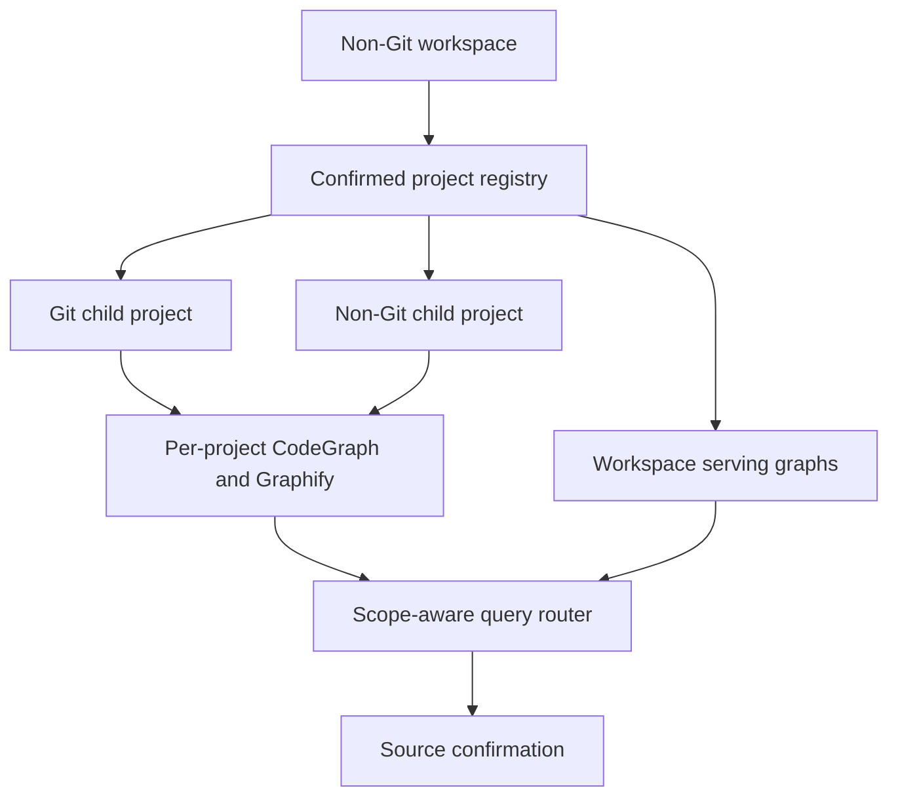
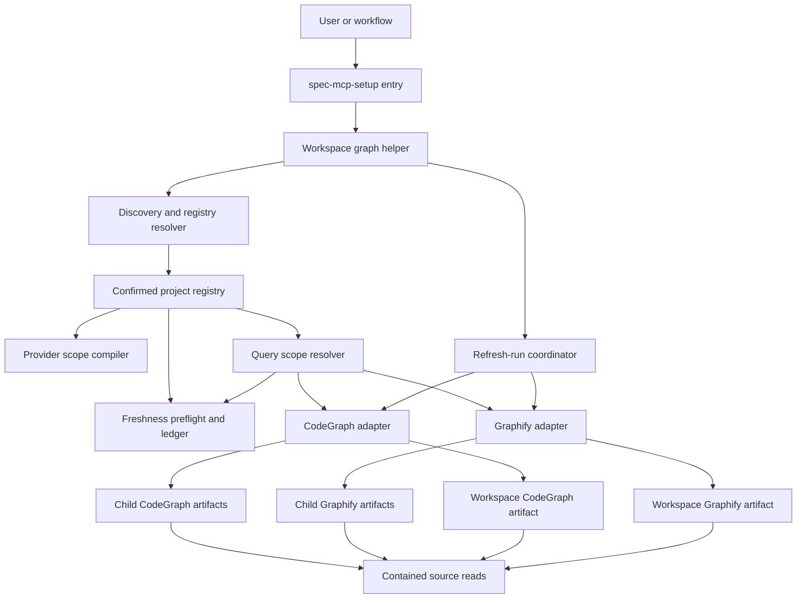
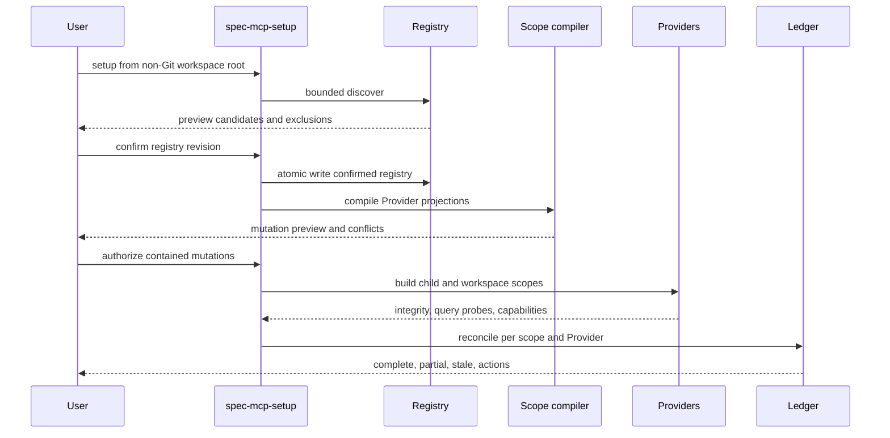
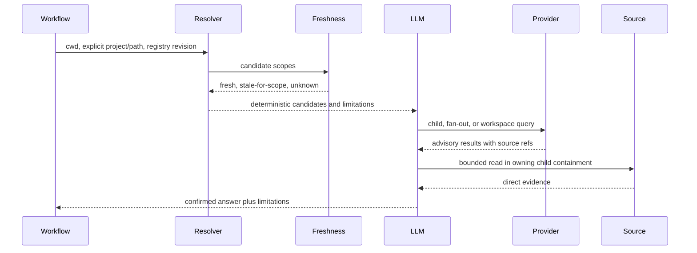
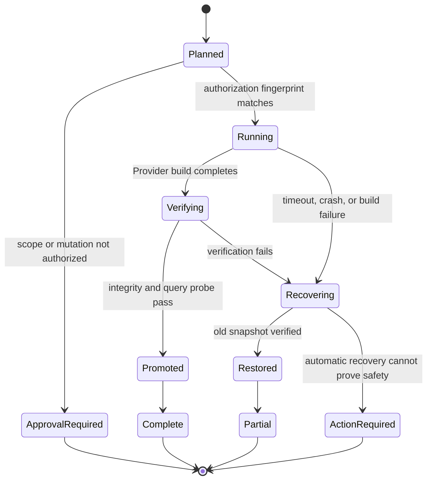
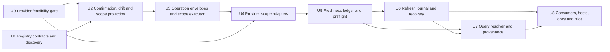

# Multi-Repo Workspace Graph Lifecycle and Query - Plan

## Goal Capsule

- **Objective:** 让非 Git 父 workspace 能以明确项目边界建立、查询和刷新 CodeGraph 与 Graphify 的 child 图和 workspace serving graph，并从跨仓候选可靠回到对应项目源码。
- **Product authority:** project registry 定义 workspace 收录范围；各项目源码、Git 状态和直接证据高于 Provider 图谱；workspace 图只拥有跨项目导航候选权威。
- **Execution profile:** 首版以可信跨仓查询闭环为成功标准，复用 Provider-native 刷新能力，不新增 spec-first 常驻 watcher。
- **Stop condition:** 实施先通过 CodeGraph父子scope隔离、显式选库、刷新隔离和旧快照安全门槛；任一门槛失败即停止依赖单元并重新确认产品契约。

---

## Product Contract

### Summary

为非 Git 父 workspace 建立多项目图谱控制面：经确认的 project registry 管理 Git 与非 Git项目，各项目保留独立 CodeGraph/Graphify 图，同时提供带项目命名空间的 workspace serving graph和统一查询路由。
系统按最小充分 scope 查询，按 Provider 与 scope 独立报告 freshness，并在刷新失败或局部过期时继续服务旧快照、回源读取受影响代码。

### Problem Frame

开发者经常从一个不属于任何 Git 仓库的父目录打开多个独立服务、前端、工具和文档项目。
当前 Runtime Setup 能显式处理 non-Git folder，也能发现和批量处理 child Git repo，但自动 child discovery 只把 Git repo 作为一等项目；混合 workspace 中的普通非 Git项目没有稳定 identity、独立 readiness 或刷新边界。

CodeGraph 与 Graphify 已能分别提供战术 code graph 和宏观 project graph，但两者的 artifact、查询与刷新生命周期仍以单一 project root 为中心。
既有 code-review graph 计划只消费可用的 CodeGraph，不负责创建 workspace 图、维护 Provider lifecycle 或接入 Graphify，因此不能承担通用 workspace 图谱能力。

缺少统一 workspace contract 时，agent 要么逐仓重复搜索，要么把父目录误当成单仓；跨项目关系、图谱 freshness、失败降级和 mutation authority 都容易被混淆。

### Key Decisions

- **Child 图与 workspace 图并存。** 每个项目继续拥有独立图；workspace serving graph 直接扫描 registry 覆盖的源码，不合并 CodeGraph 或 Graphify 的私有数据库。
- **Registry 是已确认范围基线。** 首次自动发现只产生候选；用户确认、排除或补充后，registry 才决定后续建图、查询和刷新范围。
- **查询采用最小充分 scope。** Scripts 提供路径、项目和 readiness 候选，LLM 判断单项目、multi-project fan-out 或跨项目关系查询；范围不明确时询问用户。
- **不新增统一 watcher。** CodeGraph、Graphify 和 Git 继续拥有各自原生刷新触发；spec-first 只编排 scope、freshness、验证和修复建议。
- **旧快照持续服务。** 刷新中的图继续以 advisory 旧快照提供未受影响范围的候选；命中 pending 范围时强制回源读取。
- **Provider 独立降级。** CodeGraph 与 Graphify 按 project/workspace scope 分别报告状态；单 Provider 成功不能掩盖另一个 Provider 的失败。
- **Parent 只拥有 workspace scope。** 父 workspace 可以拥有显式标记的 workspace-level Provider artifact，并可在独立授权下编排 child Provider artifact mutation，但不能获得 child Git、source mutation、finding 或验证权威。



### Actors

- A1. **Workspace user:** 从父 workspace 建图、查询、查看 freshness 并授权项目边界变化。
- A2. **LLM workflow:** 根据确定性候选选择最小查询 scope，解释限制，并把重要候选回源确认。
- A3. **Runtime Setup control plane:** 发现项目、维护 registry/readiness ledger、执行获授权的 setup/refresh 操作并报告 reason codes。
- A4. **CodeGraph 与 Graphify:** 生成和查询 provider-owned artifacts，并按各自能力提供刷新与 lifecycle facts。

### Requirements

**Workspace discovery and registry**

- R1. 系统必须把非 Git parent workspace 识别为 orchestration boundary，并在受限深度和路径 containment 下发现 Git 与非 Git项目候选。
- R2. 首次发现结果必须以 preview 呈现，由用户确认、排除或补充后形成 project registry。
- R3. Registry 必须为每个项目记录稳定 workspace-relative identity、project root、Git/non-Git 类型和图谱参与范围。
- R4. 新项目、删除项目、root 变化或 scope 扩大必须标记 registry drift，未知目录不得静默进入已有图谱。
- R5. Registry 必须允许显式排除 vendor、build、cache、generated runtime 和其他非项目目录。

**Graph scopes and authority**

- R6. 每个已收录项目必须能拥有独立的 CodeGraph 与 Graphify artifact、readiness 和 freshness。
- R7. Workspace serving graph 必须直接索引 registry 覆盖的源码，并为节点和关系保留 project identity 与 workspace-relative source reference。
- R8. Workspace serving graph 不得由 child Provider 数据库物理合并产生，也不得依赖 Provider 私有 schema 作为跨 Provider contract。
- R9. Child graph、workspace graph 和各 Provider 必须使用不同 scope identity 与 provenance family，状态不得互相提升。
- R10. Workspace 图只能提供跨项目导航和影响候选；Git scope、mutation、finding、verification 与 durable knowledge 必须回到所属项目的直接证据。

**Provider capability and readiness**

- R11. CodeGraph readiness 必须独立表达符号、调用链和影响范围能力；Graphify readiness 必须独立表达项目结构、社区和路径探索能力。
- R12. 每个 project/workspace scope 只有在两个 required Provider 均 ready 时才可标记 complete；单 Provider 可用时必须标记 partial 并列出可用能力。
- R13. Readiness 必须区分 dependency、configured、artifact、query probe、hook/watcher、freshness 和 limitations，不能用单一 ready 标签掩盖缺口。
- R14. Provider 输出始终是 advisory candidate；空结果在 partial、stale 或 unknown 状态下没有否定权。

**Query routing**

- R15. 查询前必须由 deterministic resolver 提供当前目录、显式 project/path、registry membership、Provider readiness 和 scope 候选。
- R16. LLM 必须根据用户意图选择单 child 查询、多个 child fan-out 或 workspace 跨项目查询，scripts 不得替代语义判断。
- R17. 单项目问题应优先使用 child graph；多个独立项目的同类搜索应 fan-out child graphs；跨项目依赖和路径问题应使用 workspace graph。
- R18. 查询范围存在多个合理解释时必须请求用户选择，不得因名称相似或目录邻接静默选仓。
- R19. 跨项目候选必须携带 project、scope、Provider、freshness 和 source refs，并路由回所属项目源码确认。
- R20. 查询触及 pending 或 stale-for-scope 文件时，系统必须跳过相关 graph snippet 的 fresh-source待遇并执行 bounded direct read。

**Refresh and consistency**

- R21. spec-first 不得为统一图谱新建常驻 watcher；steady-state refresh 继续由 Provider-native lifecycle、Git hooks 或显式 refresh 拥有。
- R22. 当前仓库契约中的 CodeGraph steady-state 应继续由 MCP connect catch-up、filesystem watcher/auto-sync 和 provider-owned manual repair承担；setup 不启动 watcher。
- R23. Git项目 Graphify 应继续使用 `post-commit` 与 `post-checkout` hooks；非 Git项目和父 workspace Graphify 首版使用显式 refresh。
- R24. Registry、Provider 版本、解析规则或项目边界变化必须使受影响 scope 要求完整重建，而不是仅运行普通增量刷新。
- R25. 每个 scope 必须记录 current snapshot、可确定的 pending projects/files、last verified refresh、freshness 和失败原因；pending 明细不可确定时必须显式标记 `unknown`。
- R26. 刷新期间必须继续服务上一份已验证快照；未命中 pending 范围的查询可继续使用旧图作为 advisory candidate。
- R27. 显式刷新必须在隔离 staging 中生成并完成 artifact integrity 与 query probe 后原子 promote；失败必须恢复或保留旧 snapshot。
- R28. 新增、删除、重命名和跨项目移动必须更新或清除旧节点与旧关系，不能仅追加新节点。
- R29. 一个 child 或 Provider 刷新失败不得把其他 scope 全部标记失败；workspace graph 应按实际覆盖范围进入 partial 或 stale。

**Setup behavior and reporting**

- R30. Registry 不存在或发生 drift 时，workspace setup 必须停在 preview/confirmation，不得直接建立或扩大图谱。
- R31. Registry 已确认且未变化时，裸 setup 可以按既有授权验证并维护 required child/workspace graphs，不重复要求同一确认。
- R32. 用户必须能显式选择单个项目、全部项目、仅 workspace graph 或 child 加 workspace 的完整 setup 范围。
- R33. Setup summary 必须分别展示 child/workspace scopes、CodeGraph/Graphify capabilities、freshness、skipped/partial/action-required 和精确修复动作。
- R34. Parent workspace 的 setup artifacts 必须明确标记 workspace scope，不得冒充任一 child 的 repo-local facts 或授权 child mutation。

**Agent operations and lifecycle**

- R35. 系统必须提供 machine-readable 的 registry preview、scope list、query candidate resolution、readiness/freshness read、query、refresh plan/start/status 和 recover 操作，agent 不得解析人类状态文本来推断执行状态。
- R36. 每个操作结果必须携带稳定的 `workspace_id`、`project_id`、`scope_id`、`provider`、artifact/source refs、freshness、limitations、`reason_code` 和可执行 next action。
- R37. 查询前必须执行 bounded freshness preflight；Git child 至少比较 ref/HEAD 与 dirty-path digest，非 Git child 比较 registry 约束下的 source inventory/content digest，workspace scope 聚合 registry、child 与 Provider/parser fingerprint。
- R38. 多 scope、多 Provider refresh 必须使用持久化 `refresh_run`，逐项记录授权 fingerprint、状态、日志、时间、完成信号和恢复动作；原子性只承诺到 `scope × provider`。
- R39. Headless 模式遇到 registry drift、scope 扩大或缺失 mutation 授权时必须返回 `approval_required`，不得悬挂交互提示或静默扩大范围。
- R40. Claude、Codex、Cursor、Kiro 与 Qoder 必须消费同一 canonical operation/result contract，并按宿主真实能力报告 `native`、`degraded` 或 `unavailable`，配置文件存在不能替代真实工具发现与 query probe。

### Key Flows

- F1. First workspace setup
  - **Trigger:** 用户首次从非 Git parent workspace 运行 Runtime Setup。
  - **Actors:** A1, A3, A4
  - **Steps:** bounded discovery 生成候选；用户确认 Git/non-Git projects 与 exclusions；系统保存 registry；按授权建立 child 与 workspace graphs；验证 query 与 refresh surfaces；写入分 scope ledger。
  - **Outcome:** workspace 获得明确项目边界和可审计的 complete/partial readiness。
  - **Covers:** R1-R14, R30-R34

- F2. Single-project query from workspace root
  - **Trigger:** 查询明确指向一个项目、文件或当前 child context。
  - **Actors:** A1, A2, A4
  - **Steps:** resolver 返回唯一 child candidate；LLM 选择 child CodeGraph 或 Graphify；结果携带 child provenance；重要结论回源确认。
  - **Outcome:** 仓内问题不承担 workspace 图的额外噪声和成本。
  - **Covers:** R15-R20

- F3. Cross-project relationship query
  - **Trigger:** 用户询问跨服务调用、共享协议、跨项目 consumer 或两个项目之间的路径。
  - **Actors:** A1, A2, A4
  - **Steps:** resolver 提供 workspace scope 与相关 child candidates；LLM 查询 workspace graph；候选按 project 路由回 child source；回答记录 accepted/rejected relationships 与 limitations。
  - **Outcome:** 系统发现跨项目候选，但结论仍由所属项目源码确认。
  - **Covers:** R7-R10, R15-R20

- F4. Provider-native incremental refresh
  - **Trigger:** child 文件变化、Git commit/checkout 或 MCP reconnect。
  - **Actors:** A3, A4
  - **Steps:** Provider-native mechanism 刷新对应 scope；ledger 标记 pending；成功后执行状态/query probe；更新 snapshot 与 freshness；workspace scope 独立评估是否受影响。
  - **Outcome:** child 与 workspace 图分别收敛，不把 child freshness冒充 workspace freshness。
  - **Covers:** R21-R29

- F5. Refresh failure with continued service
  - **Trigger:** Provider refresh、完整性检查或 query probe 失败。
  - **Actors:** A2, A3, A4
  - **Steps:** 保留旧 snapshot；记录失败 scope 和原因；命中 pending 范围的查询改为 direct read；其他 scope 继续服务；报告精确修复动作。
  - **Outcome:** 局部失败可见、可恢复且不破坏已有可用图谱。
  - **Covers:** R20, R25-R29, R33

- F6. Registry drift
  - **Trigger:** 出现新项目、项目删除、root 变化或 exclusions 变化。
  - **Actors:** A1, A3
  - **Steps:** 系统停止自动扩大 scope；展示 registry diff 与预期重建影响；用户确认后更新 registry；受影响 scope 完整重建并重新验证。
  - **Outcome:** workspace 边界变化是显式授权事件，不是静默索引扩张。
  - **Covers:** R2-R5, R24, R30-R34

### Acceptance Examples

- AE1. **Covers R1-R5, R30.** Given 一个非 Git parent 下包含两个 Git repo 和一个普通非 Git项目，when 首次 setup，then 三者均作为候选展示，未确认前不写 Provider artifacts。
- AE2. **Covers R3-R5.** Given registry 已排除 `vendor` 和 generated runtime，when 后续发现这些目录变化，then 不将其加入项目或标记 workspace graph drift。
- AE3. **Covers R6-R10.** Given child A 与 child B 都有独立图，when 建立 workspace graph，then workspace graph 直接扫描源码并保留 project identity，不读取或合并 child 数据库。
- AE4. **Covers R11-R14.** Given child A CodeGraph ready 但 Graphify query probe 失败，when setup 汇总，then child A 为 partial 并明确只允许 CodeGraph 能力。
- AE5. **Covers R15-R18.** Given 用户询问 child A 内某函数 callers，when resolver 唯一定位 child A，then 使用 child CodeGraph，不查询完整 workspace graph。
- AE6. **Covers R15-R19.** Given 用户询问 child A 的 client 是否被 child B 使用，when workspace graph 返回 child B consumer，then系统读取 child B 源码确认后才形成结论。
- AE7. **Covers R18.** Given 两个项目具有相同名称或符号且问题未指定范围，when resolver 产生多个合理候选，then系统询问用户而不是任选一个。
- AE8. **Covers R20, R25-R26.** Given workspace graph 的 child B 文件仍 pending，when查询只涉及 child A，then旧 workspace snapshot 仍可用于 child A；涉及 child B 时必须 direct read。
- AE9. **Covers R23.** Given 一个非 Git child 使用 Graphify，when源码文件变化但未执行显式 refresh，then ledger 将其报告为 stale/action-required，不声称 hook 已刷新。
- AE10. **Covers R24, R27-R29.** Given project root 发生移动并触发完整重建，when staging query probe 失败，then旧 snapshot 保留且其他 child readiness 不受提升或降级。
- AE11. **Covers R28.** Given文件从 child A 移动到 child B，when workspace graph 完成刷新，then旧 project identity 下的节点和边被清除，新节点归属 child B。
- AE12. **Covers R31-R34.** Given registry 已确认且无 drift，when用户再次运行裸 setup，then系统按既有范围验证/维护图谱并分别报告 child/workspace 状态，不重新询问相同授权。
- AE13. **Covers R35-R36.** Given agent 从 workspace 根请求 scope 状态，when读取 machine interface，then无需解析自然语言即可得到稳定 scope identity、freshness、source refs、limitations、reason code 和 next action。
- AE14. **Covers R37.** Given non-Git child 文件在没有 watcher 的情况下变化，when查询前执行 freshness preflight，then对应 child 与 workspace覆盖范围进入 `stale-for-scope`，相关查询改为 direct read。
- AE15. **Covers R38.** Given refresh 在完成部分 scope 后会话中断，when以 `run_id` 恢复，then系统从持久 journal 审计已完成项、恢复未完成项，并保留所有已验证旧快照。
- AE16. **Covers R39.** Given headless 调用发现一个未确认新项目，when请求 hybrid refresh，then返回 `approval_required` 和 registry preview，不写 registry、Provider config 或图谱 artifact。
- AE17. **Covers R40.** Given五个支持宿主完成 setup，when验证 agent 可用性，then分别执行真实工具发现与 bounded query probe，并按实际结果报告 native/degraded/unavailable，而非仅检查生成配置。
- AE18. **Covers R7, R18-R20, R36.** Given workspace 图返回无法唯一映射到 registry project 的 source ref，when构造 query result envelope，then结果标记 `unmapped` 并禁止 LLM 猜测项目归属。

### Success Criteria

- SC1. 用户能从非 Git workspace 根完成“提出跨项目问题 → 选择正确 scope/Provider → 获取带 project provenance 的候选 → 回源确认”的闭环。
- SC2. Git 与非 Git项目均拥有稳定 identity，混合 workspace 不会遗失普通目录项目或把父目录伪装成单仓。
- SC3. Child 与 workspace scopes、CodeGraph 与 Graphify 的 complete/partial/stale 状态均可独立审计。
- SC4. Refresh 失败不会删除上一份已验证图谱；pending 范围会触发 direct-read 降级而不是错误 freshness claim。
- SC5. Registry drift、scope 扩大和 child mutation 都需要与影响相匹配的显式授权。
- SC6. 现有 code-review graph consumer 能消费 workspace graph readiness，而不接管 Provider lifecycle。

### Scope Boundaries

**Deferred for later**

- 非 Git Graphify 的长期驻留 watcher；首版使用显式 refresh。
- 根据真实使用数据优化跨仓查询 ranking、缓存和并发 fan-out。
- 跨机器或远程托管 workspace graph service。

**Outside this product's identity**

- 将 CodeGraph 与 Graphify 转换为统一物理数据库或要求二者共享节点 schema。
- 让 workspace graph 替代 child Git、source、test、log、contract 或 owner evidence。
- 根据图谱候选自动修改多个项目、自动生成 finding 或提升验证 confidence。
- 未经确认自动收录新目录或扩大 workspace 数据范围。

### Dependencies and Assumptions

- 当前 source contract 将 CodeGraph steady-state refresh 归属 provider-native MCP watcher/Auto-Sync，并禁止 Runtime Setup 启动 watcher；外部 watcher 的真实运行可靠性需在 planning/pilot 中独立验证。
- 当前 Graphify 支持 Git hooks 与 journaled explicit refresh；non-Git root 会跳过 hooks，因此首版需要显式刷新体验。
- Runtime Setup 已支持显式 non-Git folder target 和 parent workspace child Git discovery，但混合 workspace 的 non-Git child registry 是新增产品能力。
- Workspace graph 仍受 Provider 支持语言、动态调用解析和跨语言 edge 完整性限制；partial graph 空结果没有否定权。

### Planning Resolution Notes

- Project registry、freshness ledger、query packet 与 refresh journal 使用独立 versioned contracts，不能扩塞现有单 project `provider-readiness.v2`。
- Git/non-Git discovery 只生成候选；Git root 优先形成边界，nested manifests 默认只作为 marker，symlink、越界路径和未知目录不得自动收录。
- Lifecycle 操作通过 source-owned workspace graph helper 暴露 machine-readable envelope；`spec-mcp-setup` 保持用户入口，下游 workflow 消费同一 resolver 与 query envelope。
- CodeGraph 父子 artifact 共存、明确选库、刷新隔离和旧快照持续服务必须由 U0 真实 spike 证明；任一硬门槛失败时停止后续实现并重新确认产品契约，不允许静默降低 R26-R27。
- Graphify workspace query 必须显式选择 scope artifact，workspace refresh 复用现有 journaled staging、query probe、promote 与 recovery 机制。

### Sources and Research

- `skills/spec-mcp-setup/scripts/lib/project-target.cjs` — 当前支持 explicit non-Git folder 和 child Git discovery；普通 non-Git child 尚不是自动 candidate。
- `skills/spec-mcp-setup/scripts/providers/codegraph.cjs` — 当前 CodeGraph readiness、bounded repair 与 provider-native watcher ownership contract。
- `skills/spec-mcp-setup/scripts/providers/graphify.cjs` — 当前 Graphify hooks、non-Git hook skip 和 journaled clean refresh。
- `docs/plans/2026-07-12-005-feat-spec-code-review-code-graph-advisory-integration-plan.md` — 下游 code-review consumer、workspace candidate 和 evidence authority 边界。
- `docs/contracts/project-graph-consumption.md` — Provider candidate-only consumption 与 direct evidence relay contract。
- [GitHub Blackbird architecture](https://github.blog/engineering/architecture-optimization/the-technology-behind-githubs-new-code-search/) — repository-aware metadata、event-driven ingest、sharded query 和 commit-consistent snapshots。
- [Sourcegraph query syntax](https://sourcegraph.com/docs/code-search/queries) — repository-scoped 与跨 repository 查询入口。
- [Kythe overview](https://kythe.io/docs/kythe-overview.html) 与 [storage model](https://kythe.io/docs/kythe-storage.html) — corpus/root/path 节点命名、可组合 graph store、partial-data posture 和 storage/serving 分离。
- [Nx project graph plugins](https://nx.dev/docs/concepts/decisions/project-graph-plugins) 与 [performance guidance](https://nx.dev/docs/extending-nx/performant-project-graph-plugins) — project-root identity、plugin discovery、content-hash cache 和 deterministic graph refresh。

---

## Planning Contract

本节定义 Product Contract 的实现方式。R35-R40 与 AE13-AE18 是规划范围合成时由用户确认的 Product Contract amendment，用于补齐 agent操作、freshness preflight、refresh-run 与五宿主语义parity；其余产品决策保持 brainstorm 契约。Registry 是用户确认的 workspace scope truth；Provider artifacts、setup facts 与 query candidates 均不得反向修改 registry 或提升其授权范围。

### Key Technical Decisions

- **KTD1 — 新增独立 workspace registry contract，不扩充 Git-only target contract。** `project-target.cjs` 继续负责当前 project、显式 folder 与 Git child target；混合 Git/non-Git discovery、confirmation 和 drift 由新的 workspace registry 模块负责，避免把 manifest heuristics 混入既有 `project-target.v2` 语义。
- **KTD2 — Registry 使用 workspace-relative identity。** `.spec-first/workspace/project-registry.json` 保存 `workspace_id`、revision、confirmed fingerprint、workspace exclusions 与 projects；项目 identity 由 stable `project_id` 和 `workspace_relative_root` 构成，运行时重新解析 realpath、检查 containment，不把绝对路径作为 durable identity。
- **KTD3 — Discovery 与 confirmation 分离。** `.git` 和有限 manifest marker 只产生 `.spec-first/workspace/project-registry-preview.json`；Git root 优先作为默认边界，nested manifest 只记录 marker，除非用户明确拆分。新增、删除、移动或 participation/exclusion 变化均产生 drift preview，不自动修改 confirmed registry。
- **KTD4 — Workspace graph 直接扫描 registry-controlled source projection。** Provider scope compiler 将 confirmed registry 确定性投射为 workspace-root `codegraph.json` 与 `.graphifyignore` 的 include/exclude 规则；workspace serving graph 不读取 child DB。若 U0 证明 Provider 原生过滤无法精确表达离散 roots，必须停止并重新选择 contained projection 方案，不能扫描整个父目录。
- **KTD5 — 用户配置采用 preserve-and-fail-closed ownership。** `.graphifyignore` 使用唯一 managed block并保留用户规则；`codegraph.json` 保留用户字段，sidecar 记录上次 managed patterns 与 base hash，只替换可证明属于 spec-first 的条目。JSON 不可读、字段类型冲突或 base hash 漂移时只生成 preview，禁止覆盖。
- **KTD6 — Provider 私有 schema 不承载统一 identity。** Workspace graph 的原始 source path 使用 workspace-relative prefix；query adapter 通过 registry longest-root match附加 `project_id`、`scope_id`、Provider、freshness 与 source ref。无法唯一映射或落入 exclusion 的结果标记 `unmapped`。
- **KTD7 — 统一的是 operation/result envelope，不是物理图数据库。** Source-owned workspace graph helper提供 `discover`、`confirm`、`list-scopes`、`resolve-query`、`status`、`query`、`plan-refresh`、`refresh`、`refresh-status` 与 `recover` 操作。`spec-mcp-setup` 仍是用户 workflow 入口，其他 workflow 复用 helper contract，不能拼接 Provider 私有命令或解析人类输出。
- **KTD8 — 查询路由保持 deterministic facts + LLM judgment。** Resolver只返回 cwd/path membership、唯一或多个 child candidates、workspace candidate、Provider capability 与 freshness；LLM根据问题语义选择 child、bounded fan-out 或 workspace。歧义由用户裁决，脚本不解析自然语言问题来判断跨仓意图。
- **KTD9 — Freshness 是 query-time preflight 与 durable ledger 的合成结果。** `.spec-first/workspace/graph-freshness-ledger.json` 记录 verified snapshot、registry/config/provider hashes、coarse pending scope 和失败；查询前重新计算 bounded input fingerprint。Provider watcher 自报状态只作为 live provider fact，缺失 per-file facts 时标记 `unknown`，不得伪造 pending file 列表。
- **KTD10 — Refresh 原子性限定为 `scope × provider`。** `.spec-first/workspace/refresh-runs/<run_id>.json` 记录逐 scope/Provider 状态、授权 fingerprint、日志、artifact refs、时间和 recovery action。Batch 允许 partial；首版取消语义为“停止调度后续项，当前 Provider 步骤在 bounded timeout 内完成或进入 recovery”，不承诺强杀任意 Provider 进程。
- **KTD11 — Graphify 复用 journaled refresh，CodeGraph 先过 architecture gate。** Graphify workspace refresh 参数化复用现有 staging、integrity、query probe、backup/promote/rollback。CodeGraph 必须先真实验证 parent/child artifact 共存、`projectPath` 选库、MCP/CLI 查询隔离、Auto-Sync 不串 scope，以及 SQLite/WAL 或 alternate artifact root 下的旧快照持续服务；未通过时 U4-U8 中的 CodeGraph workspace 实现不得开始。
- **KTD12 — 跨宿主追求语义 parity，不强求相同 transport。** Canonical envelope 对五宿主一致；CodeGraph 可由 MCP 或 bounded CLI seam提供，Graphify 由 CLI 或宿主 adapter提供。每个宿主必须以实际 discovery、invocation 和 query probe报告 `native/degraded/unavailable`，host-local runtime mirror 只投射入口，不成为 project truth。

### High-Level Technical Design

#### Component topology



#### First setup sequence



#### Query sequence



#### Refresh state model



### Artifact Contracts

| Artifact | Owner | Authority | Core contents |
|---|---|---|---|
| `.spec-first/workspace/project-registry.json` | workspace user + setup writer | confirmed scope baseline | workspace/project IDs、relative roots、kind、participation、exclusions、revision、confirmation fingerprint |
| `.spec-first/workspace/project-registry-preview.json` | setup discovery | advisory | candidates、drift diff、markers、containment failures、proposed revision |
| `.spec-first/workspace/provider-scope-projection.json` | setup scope compiler | generated | Provider patterns、managed ownership、base/config hashes、conflicts、affected scopes |
| `.spec-first/workspace/graph-freshness-ledger.json` | setup reconciler | deterministic lifecycle facts | entries keyed by `scope_id + provider`、snapshot、fingerprints、freshness、pending scope、limitations、next action |
| `.spec-first/workspace/query-packets/<run_id>.json` | query resolver/orchestrator | advisory | candidate scopes、chosen scope receipt、Provider results、project mapping、source refs、freshness、accepted/rejected candidates |
| `.spec-first/workspace/refresh-runs/<run_id>.json` | refresh coordinator | confirmed execution journal for observed steps | authorization fingerprint、per-item states、logs、artifact refs、timeouts、recovery、completion signal |

所有 writer 必须使用 schema 校验、workspace root containment、临时文件 + rename 和单写者锁。Provider-native status、query output和图谱内容仍是 `provider_untrusted`；只有脚本直接观察到的文件、hash、exit code、probe 与 journal transition 可进入 confirmed lifecycle facts。

### Scope and Mode Decision Matrix

| User intent / fact | Selected scope | Mutation posture | Failure behavior |
|---|---|---|---|
| 明确单个 project/path | 对应 child | 仅该 child，仍需 Provider mutation authorization | child unavailable时 direct read，不自动扩大到 workspace |
| 多个项目执行同类符号搜索 | bounded child fan-out | 各 child 独立授权与结果 | 保留成功 child，失败项单独 action-required |
| 明确跨项目依赖/路径 | workspace serving graph | 仅 workspace scope | workspace stale-for-scope 时对相关 child direct read |
| scope 存在多个合理解释 | 不执行 Provider query | 无写入 | 请求用户选择 |
| registry 缺失或 drift | registry preview | confirmation前零 Provider/config写入 | interactive请求确认；headless返回 `approval_required` |
| registry稳定、只读 status/query | 最小充分 scope | 无 mutation | 返回 current facts 与 limitations |
| registry稳定、显式 refresh | requested scopes × Providers | preview后按授权执行 | per-item partial；旧快照保留或进入 recovery |

### System-Wide Impact

- **Source/runtime boundary:** 新 schema、helper、skill prose、contracts 与 CLI行为都修改 source；五宿主 runtime mirror 只能由 `spec-first init` 生成，不能手改。
- **Authority:** Parent workspace 获得 registry、workspace ledger 与 workspace Provider artifact authority，不获得 child Git base、source mutation、finding、test 或 knowledge-promotion authority。
- **Performance:** Child + workspace 双重索引会增加时间和磁盘；首版记录 per-scope duration、file count、artifact size 和失败原因，用真实数据决定后续缓存或并发优化，不预建通用缓存框架。
- **Security and containment:** 所有 relative roots、source refs、journals、backup/staging paths 必须拒绝 symlink escape、`..` escape、root replacement、重复/nested identity collision 与 forged journal。
- **Concurrency:** 同一 `scope × provider` 只允许一个 refresh writer；不同 scope 可有限并行，但首版保持 bounded concurrency，并将 lock conflict报告为可重试事实。
- **Downstream consumers:** `spec-code-review` 首先消费 canonical query packet；后续 `spec-plan`、`spec-work`、`spec-debug` 和其他 review workflow 可复用同一 contract，但本计划不改变它们的 evidence authority。

### Risks and Stop Conditions

- **CodeGraph snapshot safety:** U0 是硬门槛。若 parent/child 选库、scope隔离、refresh期间旧快照读取或失败恢复任一无法证明，停止 workspace CodeGraph 实现并返回 owner重新选择 Provider能力、adapter serving root 或产品承诺。
- **Provider filtering不足:** 若 include/exclude 无法精确表达 registry离散 roots，停止 workspace build，不能把父目录全扫作为 fallback。
- **用户配置冲突:** 无法证明 managed ownership时只输出 conflict preview；不得覆盖用户 `codegraph.json` 或 `.graphifyignore`。
- **Fingerprint成本:** 若 full source digest超过 bounded budget，状态必须为 `unknown/action-required`，不得沿用旧 `fresh`。后续可基于 telemetry优化，但不能降低 freshness floor。
- **空结果误用:** partial、stale、unknown 或 unmapped结果没有否定权；所有重要跨仓结论必须回源。
- **宿主能力漂移:** Provider版本、CLI参数、MCP transport或宿主activation变化会使对应 capability probe失效；版本和probe hash必须进入 ledger invalidation条件。

### Sequencing



U0 与 U1 可以并行，但 U0 未通过时只能交付 registry/read-only scope基础，不得继续声称 workspace CodeGraph lifecycle 已实现。U8 的 pilot 必须使用真实 mixed workspace，而不是只依赖 mocked Provider输出。

---

## Implementation Units

### U0. Prove Provider scope isolation and snapshot safety

- **Goal:** 用可重复 fixture 和真实 Provider probe证明或否决 workspace serving graph 的关键假设，并产出明确 go/no-go receipt。
- **Requirements:** R6-R9, R21-R29, R37-R38；F4-F5；AE3, AE8-AE11, AE14-AE15。
- **Files:** `skills/spec-mcp-setup/scripts/providers/codegraph.cjs`, `skills/spec-mcp-setup/scripts/providers/graphify.cjs`, `tests/unit/mcp-setup-providers.test.js`, `docs/contracts/project-graph-consumption.md`, `docs/validation/` 下新增 workspace graph feasibility receipt。
- **Approach:** 建立包含 parent non-Git workspace、nested Git/non-Git child、child artifacts与parent artifacts的真实 fixture；验证 CodeGraph `projectPath`/CLI path选库、MCP query、Auto-Sync/rebuild隔离、SQLite/WAL读写与backup/restore或alternate root；验证 Graphify ignore、显式 graph选择和journaled refresh。Receipt必须逐项记录命令、版本、artifact refs、exit code、query结果与限制。
- **Test scenarios:**
  1. Parent和child都存在CodeGraph artifact时，显式parent/child查询稳定命中不同数据库且结果不串scope。
  2. Child Auto-Sync或rebuild不改变parent snapshot；parent refresh不修改child artifact。
  3. CodeGraph refresh失败或进程中断后，旧snapshot仍可查询并可证明恢复；否则 gate为no-go。
  4. Graphify显式选择parent graph，不因cwd或nested `.graphify`误选child。
  5. Registry排除目录在两Provider workspace graph中均不可查询。
- **Verification:** 聚焦 Provider tests加真实 bounded probe；生成 feasibility receipt并由 fresh-source reviewer核对。任一硬门槛未通过即停止依赖单元，不得修改 Product Contract或宣称降级完成。
- **Dependencies:** 无。

### U1. Add workspace registry schemas, discovery, and preview

- **Goal:** 为 mixed Git/non-Git workspace建立稳定项目身份、候选发现和零Provider写入的preview。
- **Requirements:** R1-R5, R30, R34-R36；F1, F6；AE1-AE2, AE13, AE16。
- **Files:** 新增 `skills/spec-mcp-setup/scripts/lib/workspace-project-discovery.cjs`, `skills/spec-mcp-setup/scripts/lib/workspace-project-registry.cjs`, `skills/spec-mcp-setup/scripts/contracts/workspace-project-registry.schema.json`, `skills/spec-mcp-setup/scripts/contracts/workspace-project-registry-preview.schema.json`, `tests/unit/mcp-setup-workspace-registry.test.js`, 修改 `skills/spec-mcp-setup/scripts/lib/project-target.cjs`, `tests/unit/mcp-setup-mode-target.test.js`，仅复用公共containment primitives。
- **Approach:** 使用有限marker表、bounded depth、canonical realpath和默认exclusions生成候选；同root多marker合并，Git root优先，nested manifests不自动拆分；规范化排序后生成discovery fingerprint和drift diff。Preview writer使用atomic rename且不得创建Provider artifact/config。
- **Test scenarios:**
  1. Parent下两个Git repo和一个manifest-only non-Git项目均成为候选。
  2. Nested manifest、重复名称、同root多marker产生稳定且不冲突的candidate identity。
  3. Symlink escape、root replacement、越界relative root和未知普通目录被拒绝或仅报告。
  4. Registry缺失、项目新增/删除/移动、participation/exclusion变化产生preview但不写confirmed registry。
  5. 相同输入重复discovery得到byte-stable规范化结果。
- **Verification:** 新registry suite；扩展 `tests/unit/mcp-setup-mode-target.test.js` 覆盖existing Git target语义不回归。
- **Dependencies:** 无。

### U2. Confirm registry and compile conflict-safe Provider scope projections

- **Goal:** 将用户确认的scope写成durable registry，并只把该scope投射给CodeGraph和Graphify。
- **Requirements:** R2-R9, R24, R30-R34, R39；F1, F6；AE2-AE3, AE10-AE12, AE16。
- **Files:** 新增 `skills/spec-mcp-setup/scripts/lib/workspace-provider-scope.cjs`, `skills/spec-mcp-setup/scripts/contracts/workspace-provider-scope-projection.schema.json`, `tests/unit/mcp-setup-workspace-scope-projection.test.js`; 修改 `skills/spec-mcp-setup/scripts/lib/mode-policy.cjs`, `skills/spec-mcp-setup/scripts/lib/path-safety.cjs`, `skills/spec-mcp-setup/scripts/setup.cjs`, `tests/unit/mcp-setup-entrypoint.test.js`。
- **Approach:** Confirmation绑定preview fingerprint并atomic写registry；scope compiler生成workspace-root Provider patterns和projection hash。`.graphifyignore`使用managed block；`codegraph.json`通过sidecar base hash做三方保留式merge。所有mutation先进入plan preview，headless缺授权返回`approval_required`。
- **Test scenarios:**
  1. 过期preview、变更后的workspace root或不匹配confirmation fingerprint被拒绝。
  2. 用户已有Graphify规则在managed block更新后保持不变。
  3. 用户已有CodeGraph字段和patterns保持，只有上次managed patterns可被替换。
  4. Malformed JSON、字段类型冲突、并发base hash漂移时零写入并给出conflict reason。
  5. Registry只包含离散project roots时，projection排除未确认目录、vendor和generated runtime。
- **Verification:** 新scope projection suite；`tests/unit/mcp-setup-entrypoint.test.js`验证plan/confirmation/headless零副作用和mutation gate。
- **Dependencies:** U0 Provider filtering go、U1。

### U3. Introduce canonical workspace operation envelopes and generalized scope executor

- **Goal:** 为用户、agent和workflow提供稳定的machine interface，并把现有Git-only batch executor泛化为project/workspace scopes。
- **Requirements:** R12-R13, R15-R16, R30-R40；F1-F6；AE4, AE12-AE17。
- **Files:** 新增 `skills/spec-mcp-setup/scripts/workspace-graph`, `skills/spec-mcp-setup/scripts/lib/workspace-graph-operations.cjs`, `skills/spec-mcp-setup/scripts/contracts/workspace-graph-operation.schema.json`, `skills/spec-mcp-setup/scripts/contracts/workspace-graph-result.schema.json`; 修改 `skills/spec-mcp-setup/scripts/lib/workspace-executor.cjs`, `skills/spec-mcp-setup/scripts/lib/args.cjs`, `skills/spec-mcp-setup/scripts/lib/human-output.cjs`, `skills/spec-mcp-setup/scripts/setup.cjs`。
- **Approach:** 建立discover/confirm/list-scopes/resolve-query/status/query/plan-refresh/refresh/refresh-status/recover操作dispatcher；JSON envelope为source contract，人类输出只渲染envelope。Executor item改为`project_id/project_kind/scope_id/scope_kind`，workspace-serving是独立scope，不伪装child。Read-only与mutation operations使用明确capability表。
- **Test scenarios:**
  1. 每个operation成功、partial、approval-required和invalid-input都通过schema并携带reason/next action。
  2. Existing single-project、`--folder`和`--all-repos`行为保持兼容。
  3. Mixed workspace batch逐project/provider隔离错误，聚合结果不提升partial项。
  4. Human renderer变化不影响JSON consumer contract。
  5. Parent root replacement或registry revision漂移在dispatcher入口fail closed。
- **Verification:** 新operation contract tests；扩展 `tests/unit/mcp-setup-entrypoint.test.js`、`tests/unit/mcp-setup-project-config.test.js` 和 `tests/unit/mcp-setup-facts-renderer.test.js`。
- **Dependencies:** U1-U2。

### U4. Implement child and workspace Provider adapters

- **Goal:** 在统一scope contract下建立、验证和查询CodeGraph/Graphify child及workspace artifacts，同时保持Provider边界。
- **Requirements:** R6-R14, R21-R24, R27-R29；F1, F4-F5；AE3-AE4, AE8-AE11。
- **Files:** 修改 `skills/spec-mcp-setup/scripts/providers/codegraph.cjs`, `skills/spec-mcp-setup/scripts/providers/graphify.cjs`, `skills/spec-mcp-setup/scripts/providers/registry.cjs`, `skills/spec-mcp-setup/setup-registry.json`, `skills/spec-mcp-setup/setup-registry.schema.json`, `tests/unit/mcp-setup-providers.test.js`。
- **Approach:** Provider adapter接收显式scope root、artifact ref和projection hash；CodeGraph按U0证明的选库/快照机制实现，Graphify显式传graph artifact并参数化现有journaled refresh。Status与query统一转为canonical envelope，但保留raw log/artifact ref和provider_untrusted标记。
- **Test scenarios:**
  1. Git/non-Git child和workspace scope分别建图、status、query，artifact refs互不覆盖。
  2. 单Provider失败只使对应scope entry partial/action-required。
  3. Provider版本或projection hash变化触发full rebuild而非普通增量。
  4. Graphify Git child验证hooks，non-Git child/workspace明确报告explicit refresh。
  5. CodeGraph watcher/catch-up只作为provider-owned live fact，setup不启动watcher。
- **Verification:** Provider suite覆盖realistic fake binaries与U0 fixture；`npm run test:mcp-setup`。
- **Dependencies:** U0 go、U2-U3。

### U5. Add freshness ledger and bounded query preflight

- **Goal:** 让每次查询在无统一watcher的前提下识别实际fresh、stale-for-scope、stale、partial或unknown。
- **Requirements:** R13-R14, R20-R25, R29, R33, R37；F2-F5；AE4, AE8-AE9, AE14。
- **Files:** 新增 `skills/spec-mcp-setup/scripts/lib/workspace-graph-freshness.cjs`, `skills/spec-mcp-setup/scripts/contracts/workspace-graph-freshness-ledger.schema.json`, `tests/unit/mcp-setup-workspace-freshness.test.js`; 修改 `skills/spec-mcp-setup/scripts/lib/facts.cjs`, `src/cli/helpers/setup-facts.js`, `docs/contracts/provider-readiness.md`, `docs/contracts/project-graph-consumption.md`。
- **Approach:** 首次verified refresh建立registry-scoped source fingerprint；Git child组合HEAD/ref、dirty path和受影响内容hash，non-Git组合stable source inventory/content hash，workspace聚合child、registry、projection、Provider/parser版本。比较超出budget时标记unknown；pending overlap按project/path粒度决定direct-read降级。
- **Test scenarios:**
  1. Git clean/dirty、untracked、rename/delete与HEAD变化产生正确freshness transition。
  2. Non-Git文件变更无需watcher即可在preflight检测。
  3. Workspace只有child B变化时，child A查询仍可使用旧snapshot，child B命中direct read。
  4. Registry、projection、Provider/parser版本变化触发full-rebuild-required。
  5. Digest budget耗尽、Provider live facts缺失或source ref unmapped时不得报告fresh。
- **Verification:** 新freshness suite；facts renderer双向schema fixture；现有provider-readiness schema保持兼容而不被扩塞。
- **Dependencies:** U4。

### U6. Add durable refresh-run coordination, atomic promotion, and recovery

- **Goal:** 使长时多scope刷新可审计、可部分成功、可跨会话恢复，并保留上一份已验证snapshot。
- **Requirements:** R21-R29, R32-R33, R38-R39；F4-F6；AE8-AE11, AE15-AE16。
- **Files:** 新增 `skills/spec-mcp-setup/scripts/lib/workspace-refresh-run.cjs`, `skills/spec-mcp-setup/scripts/contracts/workspace-refresh-run.schema.json`, `tests/unit/mcp-setup-workspace-refresh.test.js`; 修改 `skills/spec-mcp-setup/scripts/lib/workspace-executor.cjs`, `skills/spec-mcp-setup/scripts/providers/codegraph.cjs`, `skills/spec-mcp-setup/scripts/providers/graphify.cjs`。
- **Approach:** Plan阶段冻结requested scopes和authorization fingerprint；run逐项journal `planned/running/verifying/promoted/recovering/restored/action-required`。每个scope/provider使用lock、bounded timeout、staging/probe/promote；崩溃后recover先验证journal和paths，再恢复旧snapshot或继续安全步骤。取消只停止后续调度，当前步骤完成/超时后进入恢复。
- **Test scenarios:**
  1. 两child×两Provider中一项失败，其余promote且batch为partial。
  2. Build、integrity、query probe和promote各阶段失败都保留或恢复旧snapshot。
  3. 会话中断后凭run_id恢复，不重复已promoted项。
  4. Forged journal、symlinked staging/backup、root replacement和authorization drift被拒绝。
  5. 并发同scope refresh发生lock conflict；不同scope在bounded concurrency内可继续。
- **Verification:** 新refresh suite；Graphify现有migration recovery tests复用/参数化；CodeGraph路径必须与U0 receipt一致。
- **Dependencies:** U4-U5。

### U7. Implement query scope resolution, Provider invocation, and provenance packets

- **Goal:** 从workspace根稳定选择最小充分scope，并把所有图谱候选路由回正确child源码。
- **Requirements:** R7-R10, R14-R20, R35-R37；F2-F3；AE5-AE8, AE13-AE14, AE18。
- **Files:** 新增 `skills/spec-mcp-setup/scripts/lib/workspace-query-scope.cjs`, `skills/spec-mcp-setup/scripts/lib/workspace-query-packet.cjs`, `skills/spec-mcp-setup/scripts/contracts/workspace-query-packet.schema.json`, `tests/unit/mcp-setup-workspace-query-scope.test.js`; 修改 `docs/contracts/project-graph-consumption.md`。
- **Approach:** Resolver只处理cwd、explicit path/project、registry membership、ledger和Provider capabilities；输出child/fan-out/workspace candidates。Adapter显式传CodeGraph `projectPath`或经U0确认的CLI seam，Graphify显式传scope graph。Result mapper执行longest-root match、exclusion和containment检查，记录chosen scope receipt、accepted/rejected candidates与direct-read要求。
- **Test scenarios:**
  1. Parent cwd下显式child file唯一解析到child graph。
  2. 同名project/symbol或nested roots产生ambiguity，不静默选择。
  3. 多project同类搜索生成bounded fan-out；跨project relationship提供workspace candidate。
  4. Workspace结果映射到两个child并分别回源；unmapped/excluded ref被拒绝。
  5. stale-for-scope overlap强制direct read；fresh且不overlap结果仍保持advisory。
- **Verification:** 新query resolver suite；canonical packet schema与provider fixture probes；source-ref containment negative tests。
- **Dependencies:** U4-U6。

### U8. Integrate consumers, five hosts, documentation, and mixed-workspace pilot

- **Goal:** 让现有code-review consumer和五宿主真实消费统一图谱contract，并用真实workspace完成端到端验收。
- **Requirements:** R10-R14, R19-R20, R31-R40；F1-F6；AE4-AE18；SC1-SC6。
- **Files:** `docs/plans/2026-07-12-005-feat-spec-code-review-code-graph-advisory-integration-plan.md` 的后续实现引用面、`skills/spec-code-review/SKILL.md` 及其相关source-owned agent/reference assets、`skills/spec-mcp-setup/SKILL.md`, `skills/spec-mcp-setup/references/supported-mcp-tools.md`, `templates/claude/commands/spec/mcp-setup.md`, `src/cli/adapters/index.js`, `src/cli/adapters/platform-registry.js`, `src/cli/commands/doctor.js`, `README.md`, `README.zh-CN.md`, `docs/contracts/project-graph-consumption.md`, 新增 `docs/validation/` pilot receipt，`tests/unit/mcp-setup-entrypoint.test.js`, `tests/unit/mcp-setup-providers.test.js`, `tests/smoke/cli-smoke.test.js`, `tests/integration/init-five-host-lifecycle.integration.test.js`, `tests/integration/qoder-runtime-lifecycle.integration.test.js`。
- **Approach:** Code review只消费query packet/readiness，不接管refresh；五宿主source projection共享canonical semantics并记录transport差异。运行`spec-first init`从source生成runtime mirrors；真实mixed workspace覆盖Git/non-Git child、registry exclusion、跨仓query、partial Provider、refresh interruption和source confirmation。Pilot同时记录时间、文件数、artifact size、query成功率和limitations。
- **Test scenarios:**
  1. Code review从parent root选择正确child或workspace scope，finding仍绑定child source/Git evidence。
  2. Claude/Codex通过真实CodeGraph MCP或明确degraded seam查询，Graphify CLI可显式选scope。
  3. Cursor/Kiro/Qoder分别验证工具发现、host pin、Graphify adapter/CLI与query probe，不以配置存在代替ready。
  4. 一个宿主或Provider unavailable时，其余能力按canonical partial contract继续工作。
  5. `spec-first init`后五宿主runtime无source drift，clean命令仍只移除spec-first-managed assets。
  6. 真实mixed workspace完成first setup、single-child query、cross-project query、non-Git stale检测、partial refresh recovery全链路。
- **Verification:** `npm run test:mcp-setup`, `npm run typecheck`, `npm run test:unit`, 受影响时运行`npm run test:smoke`与`npm run test:integration`; `spec-first init`后运行相应doctor/readiness probes；fresh-source eval核对skill/agent prose；pilot receipt必须回源验证关键claim。
- **Dependencies:** U6-U7。

---

## Verification Contract

### Deterministic gates

- Schema：所有新增registry、preview、projection、operation/result、freshness、query packet和refresh-run fixtures必须通过对应JSON Schema；malformed、unknown version和additional-property策略有负向测试。
- Safety：relative root、source ref、artifact、staging、backup、journal与lock paths必须经过realpath/containment验证；symlink escape、`..`、root inode变化、forged journal和concurrent writer均fail closed。
- Mutation：discovery、status、resolve-query和query保持read-only；registry confirmation、Provider config projection、hook/install、refresh和artifact promote分别经过mode-policy与preview gate。Headless缺授权稳定返回`approval_required`。
- Freshness：只有registry/config/provider/input fingerprints对齐且query probe通过才能标记fresh；budget耗尽或live facts缺失不能被默认提升。
- Provider：CodeGraph U0 receipt通过前不得合入依赖workspace CodeGraph snapshot promise的实现；Graphify refresh必须保持现有journal/recovery negative tests。
- Compatibility：现有single project、explicit non-Git `--folder`和Git `--all-repos` contract不回归；`provider-readiness.v2`保持原schema，workspace facts使用新contracts。

### Test commands

实施时按影响面从窄到宽执行：

```bash
npm run test:mcp-setup
npm run typecheck
npm run test:unit
```

修改CLI、runtime projection、skill/agent prose或跨workflow consumer后追加：

```bash
npm run test:smoke
npm run test:integration
npm run lint:skill-entrypoints
npm run build
spec-first init
```

最后运行相关host doctor、真实CodeGraph/Graphify query probe、instruction/runtime drift检查与`git diff --check`。不得把计划阶段未运行的实现测试写成已通过。

### Behavioral and field verification

- U0必须使用真实pinned Provider版本，mock只覆盖错误注入，不能替代scope isolation和snapshot safety证据。
- Skill/agent source修改后使用fresh-source eval，至少覆盖parent workspace、single child、cross-project、ambiguity、headless approval、partial Provider与refresh recovery场景。
- Mixed-workspace pilot至少包含两个Git child、一个non-Git child、一个excluded目录和一个跨项目可验证关系；每个重要图谱候选必须由child source read确认。
- 五宿主验证记录区分configured、runtime-visible、invocable、query-verified和degraded原因；缺宿主运行环境时标记未验证，不得声称parity完成。
- Pilot发现Provider过滤、CodeGraph snapshot或source-ref mapping硬门槛失败时，回到owner决策，不能通过降低断言关闭计划。

### Requirements traceability

| Requirement range | Primary units | Proof |
|---|---|---|
| R1-R5 | U1-U2 | discovery/registry fixtures、drift preview、confirmation gate |
| R6-R14 | U0, U2, U4-U5 | Provider isolation receipt、scope projection、readiness/freshness tests |
| R15-R20 | U5, U7-U8 | resolver/query packet tests、source-ref containment、consumer pilot |
| R21-R29 | U0, U4-U6 | Provider lifecycle probes、refresh journal/recovery tests |
| R30-R34 | U1-U3, U8 | mode/entrypoint tests、workspace summary、runtime docs |
| R35-R40 | U3, U5-U8 | operation schemas、preflight、refresh status/recovery、five-host matrix |

---

## Definition of Done

### Global completion

- Product Contract R1-R40、F1-F6与AE1-AE18均可追溯到实现单元和验证证据。
- U0 go/no-go receipt存在且所有CodeGraph/Graphify硬门槛有真实Provider证据；若为no-go，计划不得被声明完成。
- Confirmed registry严格控制child与workspace索引范围；未确认、excluded和越界目录不能进入workspace graph。
- Child/workspace与CodeGraph/Graphify readiness、freshness、artifact和query provenance可独立审计，partial状态不互相提升。
- Query从parent root能稳定完成single child、bounded fan-out和cross-project三类路径，歧义会询问，重要结果会回源。
- Git/non-Git变化能通过Provider lifecycle或query-time preflight进入正确freshness状态；pending overlap触发direct read。
- 每个`scope × provider` refresh可验证旧snapshot保留、promote或recovery；跨会话run status/resume可用，局部失败不污染其他scope。
- 五宿主按真实能力报告native/degraded/unavailable；source/runtime由`spec-first init`对齐，无手改generated runtime。
- README、中文README、skill、contracts、tests、validation receipt与`CHANGELOG.md`同步；用户可见CLI和repair action有明确说明。
- 所有执行期间产生的失败实验、临时adapter、staging/backup fixture和无consumer抽象已清理；只保留被contract、tests或validation receipt引用的durable artifacts。

### Per-unit completion

- **U0:** Provider feasibility receipt可复验，硬门槛结论明确且依赖单元遵守gate。
- **U1:** Mixed workspace discovery与registry preview稳定、contained、零Provider副作用。
- **U2:** Confirmation与config projection preview-first、preserve user config、冲突fail closed。
- **U3:** Canonical operations和generalized scope executor通过schema、兼容与mode-policy测试。
- **U4:** 两Provider在child/workspace scope中显式选artifact，状态与失败隔离。
- **U5:** Durable ledger和query-time preflight能检测Git/non-Git/workspace drift且不伪造freshness。
- **U6:** Refresh journal覆盖success/partial/crash/cancel/recovery，旧snapshot安全性有证据。
- **U7:** Query resolver和packet完成scope选择、project mapping、direct-read降级与unmapped保护。
- **U8:** Code review consumer、五宿主projection、文档和真实mixed-workspace pilot全部完成并保留限制记录。
