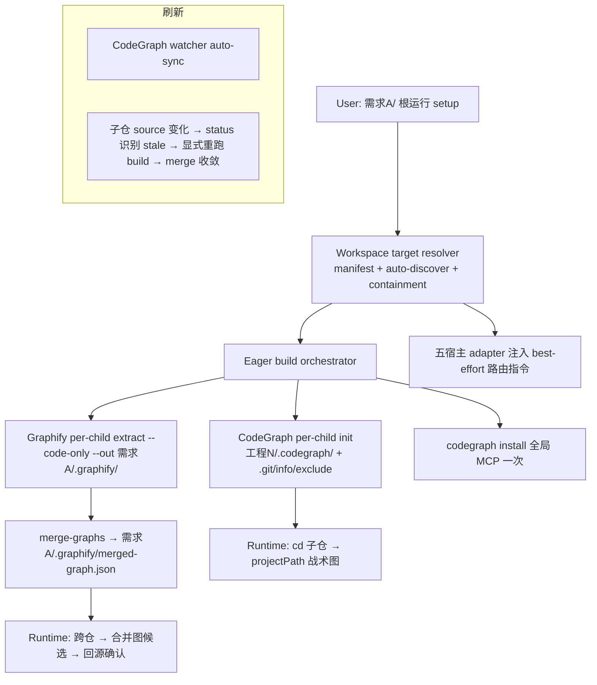
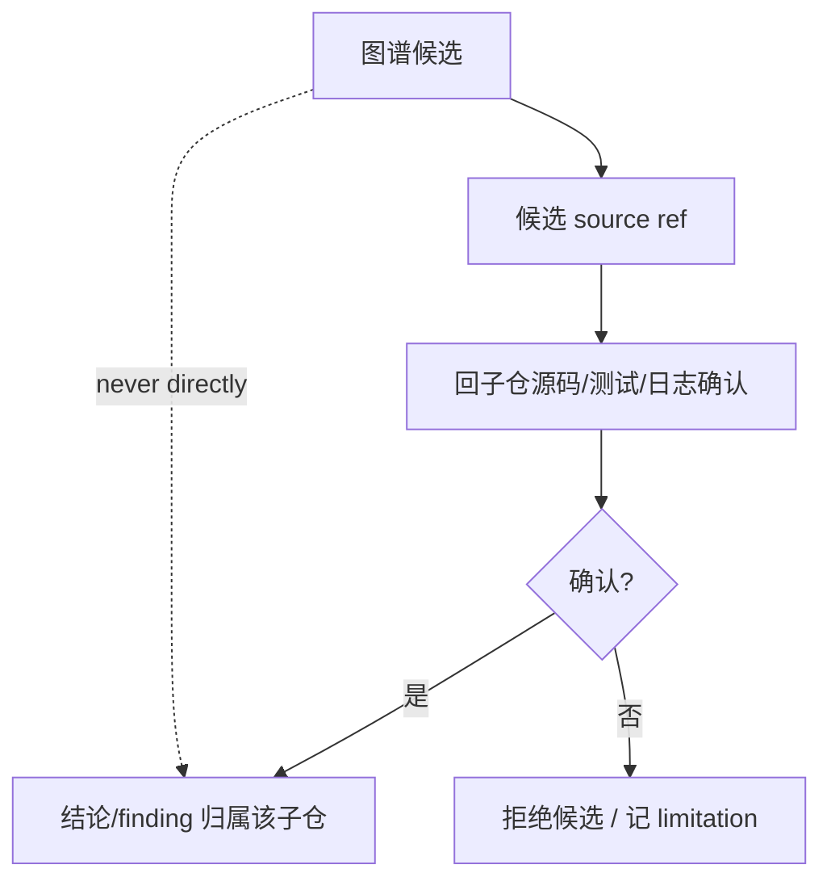
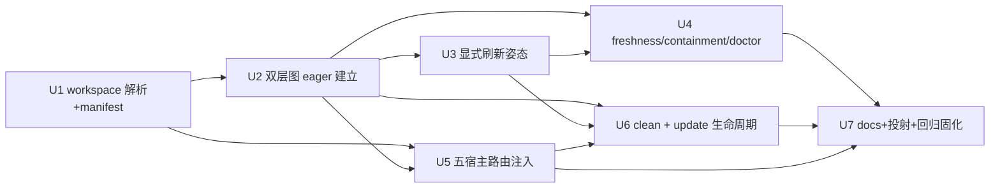

# feat: Per-Requirement Multi-Repo Workspace Two-Layer Code Graph

## Goal Capsule

- **Objective:** 让开发者从一个**非 Git 的"需求文件夹"**(多仓父目录)一键为其中每个子 Git 仓建 CodeGraph 战术图、为整个 workspace 建一张 Graphify 跨仓宏观合并图；CodeGraph freshness 由 provider watcher 负责，Graphify workspace 合并图当前通过显式重跑构建命令刷新；从该目录进 codex/claude 时按 cwd best-effort 用对的图。
- **Authority:** origin 需求文档定义 WHAT(CR1-CR13);各子仓源码 / Git 状态 / 直接证据高于图谱候选;workspace 编排只拥有图 artifact 与路由权威,不获得子仓 source / finding / verification 权威。
- **Execution profile:** owner 已实测端到端链路可用(origin §4.1),**本 plan 不设可行性 gate**,而是把已验证链路固化为可重复回归验收 + 补齐产品化 source、guardrail、多宿主投射与生命周期。
- **Product Contract preservation:** 新建 plan,legacy origin 不改写;CR1-CR13 原义保留,plan 只加 HOW。

---

## Product Contract

> 完整 WHAT 见 origin。下为进入实现的 contract 摘要,CR-ID 与 origin 对齐。

### Problem Frame

每个需求 = 一个以需求命名的非 Git 父文件夹,内含多个独立 clone 的子 Git 仓(工程跨需求高度重叠,但当前版本 **per-需求 隔离、不复用**)。今天 `spec-mcp-setup` 以单一 project root 为中心,没有一等方式从多仓父目录一键建"每仓战术图 + workspace 跨仓宏观图"并自动保鲜;开发者要么逐仓手配,要么把父目录误当单仓。

### Requirements(CR1-CR13,carried from origin)

**A. 低摩擦批量 init**
- CR1. 照清单批量 init(CLI 参数或 manifest),一条命令为全部子仓备齐 MCP + 图,免逐仓。
- CR2. 自动发现补齐:扫需求文件夹发现清单外子 Git 仓作候选,轻确认防误收;发现必须 **symlink-contained**(realpath 逃逸 workspace 根即拒绝/标记)。
- CR3. init 对两种来源给出一致批量结果 + per-repo 状态(ready/partial/failed + 原因)。

**B. workspace 双层图(per-需求 隔离)**
- CR4. 每子仓建 CodeGraph `工程N/.codegraph/`;`.codegraph/` 写入该子仓 `.git/info/exclude` 保 git 干净;MCP server 全局 install 一次;跨仓查询传 `projectPath`,不建父目录单体图。
- CR5. Graphify 每子仓子图 + 需求根一张 `merge-graphs` 合并图,均 `--out`/`GRAPHIFY_OUT` 写到 `需求A/.graphify/`(子仓物理零侵入,不写机器级 global);建图 `extract --code-only`(纯 AST、零 LLM key),合并图 = 各子仓 AST 图 union,不含社区归纳/命名。
- CR6. 两层图与产物严格 scope 在当前需求文件夹内;`projectPath` 解析须校验落在当前 workspace 根内(拒绝/告警他需求 projectPath);跨 workspace query 为非目标。

**C. 刷新与诚实降级**
- CR7. CodeGraph `serve --mcp` 默认 watcher,代码变更延迟 auto-sync。
- CR8. 目标合同是 Graphify 子图变化后自动重跑 `merge-graphs` 收敛；当前 Graphify 0.9.x 原生 hook 只重建 child 默认 output，无法可靠更新 out-of-tree 子图并在完成后触发 parent merge，因此本实现明确降级为显式重跑 `--workspace-graph --repos ...`，不安装 hook、不宣称自动 freshness。待 provider 提供 out-of-tree hook、完成回调或原子 parent merge 后重新评估自动化。
- CR9. 非 Git 变更或无 hook 场景用 Graphify `watch` 或显式 refresh 兜底,并如实标注 freshness。

**D. cwd-aware 路由**
- CR10. 从需求根进工具后按 cwd/显式 path 路由到对应子仓战术图,跨仓用合并图;路由 = 注入宿主指令 + `projectPath`(不自建 resolver),**best-effort 非确定性**;从子仓内启动或漏传 projectPath 时兜底默认用所在子仓 projectPath,doctor 应能检查 server root 有可用默认。
- CR11. 解析歧义(同名仓/嵌套 root)时询问 owner,不静默选仓。

**E. 诚实边界**
- CR12. 图输出始终 advisory;partial/stale/unmapped 空结果无否定权,重要结论回源。
- CR13. workspace/parent 只拥有编排与图 artifact 权威,不获得子仓 Git/source mutation/finding/verification 权威。当前唯一授权子仓 Git-metadata 写入是向 `.git/info/exclude` 写 `.codegraph/` managed block；写目标经 realpath + containment 校验(拒 symlink 逃逸,复用 `assertContainedPath`),`clean` 只幂等移除 spec-first 自写 block。clean 可识别并调用 provider 命令清理旧版本遗留 hook，但当前 build 不安装 hook。

### Scope Boundaries

**Included:** 上述 CR1-CR13;五宿主 runtime 投射与路由注入;固化 owner-verified E2E 为回归验收。

**Deferred to Follow-Up Work:** manifest schema 的高级演化;基于真实数据的建图/查询性能优化。

**Deferred for later(carried from origin):** 跨 workspace 图复用、内容寻址缓存、软链挂载、机器级 global graph、Graphify semantic/社区层、Kiro/Qoder 的 spec-first CodeGraph adapter、`CODEGRAPH_DIR` out-of-tree。

**Outside this product's identity:** 006 那套单独扫描源码的 serving graph + freshness ledger + refresh journal 重型生命周期;让图谱拥有 scope/finding/verification 权威;改动 005/spec-work/spec-debug 等 consumer workflow;跨机器/远程托管图服务。

### Acceptance Examples

- AE1. Given 需求A 含 4 个子 Git 仓,when 从需求根运行批量 init,then 各子仓生成 `.codegraph/`(且加入其 `.git/info/exclude`)、`需求A/.graphify/` 下生成各子图 + 一张 merged-graph,per-repo 状态齐全,子仓 `git status` 干净。
- AE2. Given manifest 缺一个仓、父目录里实际存在,when 自动发现,then 该仓作候选经轻确认后纳入;一个 symlink 指向 workspace 外的目录被拒绝/标记,不纳入。
- AE3. Given 从需求根启动工具,cd 进 工程3,when 问 工程3 内符号,then 路由 best-effort 用 工程3 的 projectPath;漏传 projectPath 时兜底默认所在子仓。
- AE4. Given 问"工程3 的 client 是否被 工程5 用",when 查合并图,then 得跨仓候选,回 工程5 源码确认后才形成结论。
- AE5. Given 在 工程3 改文件,when CodeGraph watcher 生效,then 延迟 auto-sync；Graphify workspace 状态标为 stale/partial，用户显式重跑构建命令后子图与合并图收敛。
- AE6. Given 传入指向他需求(需求B)的 projectPath,when 解析,then 拒绝/告警,不跨 workspace 读。
- AE7. Given Kiro/Qoder 宿主,when init,then CodeGraph 走诚实降级(Graphify 仍覆盖),不因缺 adapter 而伪装 ready。
- AE8. Given `spec-first clean`,when 执行,then 移除 workspace 图产物 + 幂等移除 spec-first 自写的 `.git/info/exclude` 行/hook 块,不碰用户内容,并清理 CodeGraph daemon。

### Success Criteria

- SC1. 从需求根一条命令完成"清单/自动发现 → 双层图 eager 建立 → 全局 MCP → 五宿主路由注入",子仓物理仅 `.codegraph/` 且 git 干净；Graphify refresh mode 明确为 `explicit`。
- SC2. 跨仓查询经合并图/projectPath 可达,结论回源;partial/stale/unmapped 无否定权。
- SC3. 显式刷新在 owner-verified 拓扑上有可重复回归验收(记录版本/拓扑/命令/耗时/产物/结果/限制)，且不得把旧 hook 实验回执当作当前 runtime 合同。
- SC4. per-需求 隔离与 containment 有执行点;无跨 workspace 串味、无 symlink 逃逸、`.git` 写入是唯一授权例外且可幂等清理。
- SC5. 五宿主经 `spec-first init` 从 source 投射一致;Kiro/Qoder CodeGraph 诚实降级。

---

## Planning Contract

### Key Technical Decisions

- **KTD1 — 扩展现有基础设施,非从零。** 复用 `project-target.cjs`(`--all-repos`/`discoverChildRepos`/`non-git-folder`/`workspace-no-git-candidates`)、`init-workspace.js`(`discoverChildGitRepos`/`PARENT_ARTIFACT_AUTHORITY`)、`providers/{codegraph,graphify}.cjs`(per-project readiness/build/hook/refresh、`requirement_workspace_path`)。新增 workspace 编排层,不重写既有 target 语义。
- **KTD2 — CodeGraph per-child + 全局 MCP + projectPath。** 每子仓 `.codegraph/`(官方推荐多仓形态);`init` 无 out-of-tree,`.codegraph/` 落子仓工作树内,靠 **per-child `.git/info/exclude`** 保 git 干净——exclude 路径用 `git rev-parse --git-path info/exclude` 解析(正确处理 `.git`-as-file/worktree),写前对解析后 git-dir 目标做 containment。**不复用 `gitignore-policy.js` 的 root `.gitignore` block**(那写 tracked 文件、弄脏子仓,与本目标相悖;gitignore-policy 仅用于单项目/父目录场景)。MCP 全局 install 一次,跨仓靠 `projectPath`;不建父目录单体图。
- **KTD3 — Graphify out-of-tree + merge-graphs + code-only。** `extract --code-only --out 需求A/.graphify/<repo>` 建子图,`merge-graphs` 合成 `需求A/.graphify/merged-graph.json`;子仓物理零侵入;不用 `--global` 机器级单例。
- **KTD4 — per-需求 隔离、不复用。** 无跨 workspace 稳定 repo identity、无内容寻址缓存/软链、无 commit 冲突处理;同源工程在不同需求各建各的。
- **KTD5 — Manifest = 可选清单 + CLI + 自动发现。** workspace 根可选 `.spec-first/workspace.yaml`(workspace-relative repo 列表)+ CLI `--repos` 参数为主路径;自动发现补漏并轻确认。清单是否 checkin 由用户可选(便于复现需求环境);清单格式为新增 versioned schema,不扩塞现有 `provider-readiness.v2`。
- **KTD6 — A2 路由 = spec-first adapter-owned managed 资产。** 复用宿主 adapter 的 `managedRoot`/managed-block 机制,由 spec-first 写一段 best-effort 路由指令(按 cwd 传 `projectPath`、跨仓用合并图、launch-from-child 兜底),不依赖 graphify/codegraph 原生 host 段。U5 先对源码核实精确 writer(§10.5)。
- **KTD7 — 五宿主基线,Kiro/Qoder CodeGraph 诚实降级。** routing 注入覆盖五宿主(符合 `getSupportedPlatforms()` 不变量);CodeGraph 原生 install 不含 Kiro/Qoder,v1 不为无确认消费者建 spec-first CodeGraph adapter(defer/opt-in),按诚实降级表达,Graphify 仍覆盖。
- **KTD8 — eager 建图已验证，自动 merge refresh 诚实降级。** owner E2E 证明手工链路可运行，但不能证明 Graphify 0.9.x 原生 hook 能可靠驱动 out-of-tree child graph 与 parent merge。当前只把 eager 建图、projectPath 路由、CodeGraph watcher 与显式 Graphify 重建固化为 runtime 合同；自动 merge refresh 保持 deferred，重估条件见 CR8。

### High-Level Technical Design

### Artifact Contracts

- `workspace.yaml`(可选,workspace 根 `.spec-first/`):`schema_version`、`repos[]`(workspace-relative path、可选 alias)、`exclusions[]`。缺失时纯 CLI + 自动发现。
- `需求A/.graphify/<repo>/…` 各子仓 Graphify 子图;`需求A/.graphify/merged-graph.json` 合并图。
- `工程N/.codegraph/codegraph.db` per-child CodeGraph(子仓内,`.git/info/exclude` 忽略)。
- per-repo 批量结果 envelope:`repo_id`、`codegraph_status`、`graphify_status`、`hook_status`、`freshness`、`reason_code`、`limitations[]`、`next_action`。

所有 writer 须 schema 校验、workspace-root containment、临时文件 + rename;provider 图内容与 query 输出为 `provider_untrusted` advisory,只有脚本直接观察到的 file/hash/exit code/probe 进入 confirmed facts。

### System-Wide Impact

- **Skills:** `spec-mcp-setup` 主战场(SKILL.md、setup.cjs、lib/project-target.cjs、lib/workspace-executor.cjs、providers/{codegraph,graphify,registry}.cjs、lib/facts.cjs、setup-registry.json);`using-spec-first` 可选补路由指引;005/spec-work/spec-debug **不改**。
- **CLI:** `spec-mcp-setup`(批量建图/hook/注入)、`spec-first init`(init-workspace 扩展)、`doctor`(分 child/workspace readiness/freshness)、`clean`(删图产物 + daemon 清理 + 幂等移除 .git/info/exclude/hook)、`update`(五宿主一致)。
- **Adapters:** `src/cli/adapters/{claude,codex,cursor,kiro,qoder}.js` + `index.js` + `platform-registry.js` 注入路由。**child `.codegraph/` 排除走 per-child `.git/info/exclude`(git-clean),不复用 `gitignore-policy.js` 的 root `.gitignore` block(该 block 写 tracked 文件,只适用于单项目/父目录);`需求A/.graphify/` 位于非 Git 父目录,无 git 树可脏。**
- **Runtime:** source 变更经 `spec-first init` 投射五宿主,不手改 generated mirror。
- **Evidence:** 图候选进 `provider_untrusted`/advisory;结论回子仓 source/test/log。

### Sequencing

### Risks and Mitigations

| Risk | Mitigation |
|---|---|
| provider 图输出被当权威 | 全 advisory;结论回源;containment 执行点 |
| 写子仓 .git 越权/逃逸 | CR13 唯一授权例外 + realpath/containment(assertContainedPath)+ clean 幂等 |
| 跨 workspace 串味 | projectPath 限定当前 workspace 根;发现 symlink-contained |
| 合并图 stale 静默 | CR8 触发/完成/失败/恢复写实现合同;CR9 兜底 + 如实标 freshness |
| 五宿主注入漂移 | 从 source 经 `spec-first init` 投射;Kiro/Qoder CodeGraph 诚实降级不伪装 |
| 短命 workspace daemon 残留 | clean 清理 CodeGraph daemon |

---

## Implementation Units

### U1. Workspace target resolution + manifest + contained discovery

- **Goal:** 从非 Git 需求根解析出安全的子仓集合(清单 + CLI + 自动发现),输出稳定 per-repo identity 与批量 envelope 骨架。
- **Requirements:** CR1, CR2, CR3, CR6(containment), CR11
- **Dependencies:** 无
- **Files:** `skills/spec-mcp-setup/scripts/lib/project-target.cjs`(扩展)、新增 `skills/spec-mcp-setup/scripts/lib/workspace-target.cjs`、新增 `skills/spec-mcp-setup/scripts/contracts/workspace-manifest.schema.json`、`skills/spec-mcp-setup/scripts/lib/path-safety.cjs`(复用 `assertContainedPath`)、`tests/unit/mcp-setup-workspace-target.test.js`、`tests/unit/mcp-setup-mode-target.test.js`(回归不破坏既有 target)
- **Approach:** 复用 `discoverChildRepos`/`discoverChildGitRepos` 做 depth-1 直接子目录发现;`.spec-first/workspace.yaml` 可选清单为主路径 + CLI `--repos`;自动发现补漏并标为需轻确认候选。canonical realpath + containment,拒绝 symlink 逃逸/越界/重复嵌套;unicode-safe。歧义(同名/嵌套)返回歧义候选不静默选。
- **Patterns to follow:** 现有 `project-target.cjs` target 解析与 `path-safety` containment reason_code。
- **Test scenarios:**
  - Covers AE1/AE2. 清单列全 → 全部候选;清单缺一但父目录有 → 该仓作 auto-discovered 候选并标轻确认。
  - symlink 指向 workspace 外 / `..` 逃逸 / 重复嵌套 root → 拒绝或仅标记,不纳入。
  - 同名仓 / 嵌套 manifest → 返回歧义,不静默选。
  - 非 ASCII 需求文件夹名(`需求A`)解析正确。
  - 既有单项目 / `--folder` / `--all-repos` 行为不回归。
- **Verification:** workspace 解析给出确定性候选集 + per-repo id + 歧义/拒绝原因;既有 target 测试全绿。

### U2. Eager two-layer graph build orchestration

- **Goal:** 从需求根一次性 eager 建全部子仓 CodeGraph 战术图 + Graphify 子图 + workspace 合并图,写子仓 `.git/info/exclude`,全局装 CodeGraph MCP,输出 per-repo 状态。
- **Requirements:** CR1, CR3, CR4, CR5, CR13(.git 例外)
- **Dependencies:** U1
- **Files:** `skills/spec-mcp-setup/scripts/providers/codegraph.cjs`、`skills/spec-mcp-setup/scripts/providers/graphify.cjs`、`skills/spec-mcp-setup/scripts/lib/workspace-executor.cjs`、`skills/spec-mcp-setup/scripts/setup.cjs`、`skills/spec-mcp-setup/setup-registry.json`、`src/cli/gitignore-policy.js`、`tests/unit/mcp-setup-providers.test.js`、`tests/unit/mcp-setup-workspace-build.test.js`
- **Approach:** 每子仓 `codegraph init`(产物 `工程N/.codegraph/`)后向该子仓 exclude 幂等写 `.codegraph/`——exclude 路径经 `git rev-parse --git-path info/exclude` 解析(处理 `.git`-as-file/worktree/submodule),写前对**解析后 git-dir 目标**做 `assertContainedPath`;不复用 gitignore-policy root block。`codegraph install` 全局 MCP 仅一次。Graphify 每子仓 `extract --code-only --out 需求A/.graphify/<repo>`(经 `GRAPHIFY_OUT`),再 `merge-graphs` 输出 `需求A/.graphify/merged-graph.json`;**单 child → 从单一子图产出 merged-graph(或标"无跨仓层");零 eligible child → 跳过 merge、freshness=not-applicable**。批量逐仓隔离失败,聚合不提升 partial。provider 图内容保持 provider_untrusted。
- **Patterns to follow:** 现有 provider `plan/verify/apply` 结构、`requirement_workspace_path`(Graphify 已接线)、journaled staging。
- **Test scenarios:**
  - Covers AE1. 4 子仓全量 eager 建成,各 `.codegraph/` 存在且入 `.git/info/exclude`(子仓 `git status` 干净),`需求A/.graphify/` 有各子图 + merged-graph。
  - 单仓建图失败仅该 repo entry partial/action-required,其余 promote,聚合为 partial。
  - `.git/info/exclude` 写入幂等(重跑不重复行);exclude 路径经 `git rev-parse --git-path` 解析,`.git`-as-file(worktree/submodule)子仓正确写入而非产生 stray 文件;解析后目标逃逸 workspace → 拒绝。
  - Graphify 产物零落子仓工作树内(out-of-tree 校验)。
  - `codegraph install` 全局仅执行一次,不逐仓装。
- **Verification:** 从需求根一命令产出双层图与 per-repo 状态;子仓仅 `.codegraph/` 且 git 干净。

### U3. Refresh posture (watcher + explicit Graphify rebuild)

- **Goal:** 固化 CodeGraph watcher 与 Graphify 显式重建的真实 runtime posture；保留自动 merge refresh 的重新评估条件，不伪装 hook 已接线。
- **Requirements:** CR7, CR8, CR9
- **Dependencies:** U2
- **Files:** `skills/spec-mcp-setup/scripts/providers/codegraph.cjs`、`skills/spec-mcp-setup/scripts/providers/graphify.cjs`、`skills/spec-mcp-setup/scripts/lib/workspace-executor.cjs`、`tests/unit/mcp-setup-workspace-refresh.test.js`
- **Approach:** CodeGraph `serve --mcp` 默认 watcher(不由 setup 启 watcher,只消费/校验)。Graphify workspace build 写 `refresh_mode: explicit` state receipt，不安装原生 child hook；source snapshot 改变后 status 不得报告 ready，用户重跑 `spec-mcp-setup --only codegraph,graphify --workspace-graph --repos ...` 完成子图与 merge 收敛。自动化仅在 provider 提供可靠 completion callback/out-of-tree hook/atomic parent merge 时重新评估。
- **Execution note:** 复用 owner 已实测链路;本单元把它编码为 source + 回归,不重新做 go/no-go。
- **Test scenarios:**
  - Covers AE5. 子仓文件改 → CodeGraph watcher 延迟 auto-sync；workspace status 因 source snapshot 漂移降级，显式重跑后 merge-graphs 收敛。
  - Graphify Git 子仓明确报告 `hook_status: not-installed` 与 `refresh_mode: explicit`。
  - 显式 refresh 提示、失败隔离与 freshness 标注诚实。
  - merge 重跑失败 → 隔离该 scope、保留上一份合并图或进恢复,不静默 stale。
  - setup 不启动 watcher(watcher 属 provider-owned live fact)。
- **Verification:** 显式刷新链路有明确触发/完成/失败语义与测试，source 漂移不伪造 ready。

### U4. Freshness facts, containment enforcement, and doctor reporting

- **Goal:** 分 child/workspace 报 readiness/freshness,执行 projectPath containment 与 per-需求 隔离,诚实 advisory/degraded。
- **Requirements:** CR6, CR12, CR3, CR7-CR9(facts)、CR10(doctor server-root 默认检查)
- **Dependencies:** U2, U3
- **Files:** `skills/spec-mcp-setup/scripts/lib/facts.cjs`、`src/cli/helpers/setup-facts.js`、`src/cli/commands/doctor.js`、`docs/contracts/project-graph-consumption.md`、`tests/unit/mcp-setup-facts-renderer.test.js`、`tests/unit/mcp-setup-workspace-freshness.test.js`
- **Approach:** facts 分 child/workspace scope 表达 CodeGraph/Graphify 的 ready/partial/stale/unknown + freshness + limitations,partial/stale/unmapped 无否定权。projectPath 解析校验落在当前 workspace 根(拒/告警他需求)——**该 containment 为 spec-first 侧 advisory 校验(facts/doctor + 注入路由文本),非全局 MCP server 的硬 query gate(该 server 由 provider 拥有);此残留记入 `project-graph-consumption.md`**。doctor 汇总各子仓 + 合并图状态、**检查 CodeGraph server root 是否有可用默认 projectPath(CR10 兜底可诊断性)**与精确修复动作。
- **Test scenarios:**
  - Covers AE6. 传他需求 projectPath → 拒绝/告警,不跨读。
  - child/workspace、CodeGraph/Graphify 状态可独立审计,partial 不互相提升。
  - doctor 报告 CodeGraph server root 是否有可用默认 projectPath(CR10)。
  - 空/失败/截断结果记为 degraded/limited,不判"无影响/无仓"。
  - doctor 分 scope 输出 readiness/freshness + next_action;`provider-readiness.v2` 不被扩塞(workspace facts 用新 contract)。
- **Verification:** freshness/containment 有执行点与测试;doctor 分 scope 可读。

### U5. cwd-aware routing injection across five hosts

- **Goal:** 由 spec-first adapter 向五宿主注入 best-effort 路由指令,Kiro/Qoder CodeGraph 诚实降级。
- **Requirements:** CR10, CR11, CR7(usage)
- **Dependencies:** U1, U2
- **Files:** `src/cli/adapters/{claude,codex,cursor,kiro,qoder}.js`、`src/cli/adapters/index.js`、`src/cli/adapters/platform-registry.js`、`skills/spec-mcp-setup/references/supported-mcp-tools.md`、`skills/using-spec-first/SKILL.md`(可选轻改)、`tests/unit/mcp-setup-entrypoint.test.js`、相关 adapter 测试
- **Approach:** **先对源码核实 A2 精确 writer**(§10.5:复用现有 managed-block/managedRoot 机制,由 spec-first adapter 写,而非 provider 原生 host 段)。注入内容:按 cwd/子仓传 CodeGraph `projectPath`、跨仓用 `需求A/.graphify/merged-graph.json`、launch-from-child 或漏传 projectPath 时兜底默认所在子仓、doctor 检查 server root 默认。Kiro/Qoder:CodeGraph 诚实降级(不造 adapter),Graphify 仍覆盖;五宿主均注入路由文本。
- **Test scenarios:**
  - Covers AE3. 注入文本引导 cd 子仓 → 对应 projectPath;漏传 projectPath 兜底所在子仓。
  - Covers AE7. Kiro/Qoder CodeGraph 报诚实降级,不因配置存在判 ready;Graphify 覆盖。
  - 五宿主 managed 资产由 spec-first 拥有、可幂等写/移除,不动无关 host 配置。
  - 路由为 best-effort 声明(非确定性 resolver),文本不宣称确定性。
- **Verification:** 五宿主注入一致、Kiro/Qoder 降级诚实、writer 归属 spec-first managed。

### U6. Lifecycle: clean and update

- **Goal:** `clean` 幂等移除 workspace 图产物 + spec-first 自写 `.git/info/exclude`/hook + daemon 清理;`update` 五宿主投射一致。
- **Requirements:** CR13(clean 幂等)、CR7(daemon)
- **Dependencies:** U2, U3, U5
- **Files:** `src/cli/commands/clean.js`、`src/cli/commands/update.js`、`skills/spec-mcp-setup/scripts/providers/{codegraph,graphify}.cjs`(uninstall/cleanup 面)、`tests/unit/mcp-setup-entrypoint.test.js`、`tests/smoke/cli-smoke.test.js`
- **Approach:** clean 删 `需求A/.graphify/` 图产物、幂等移除各子仓 `.git/info/exclude` 中 **spec-first 自写行**(只删自写、不碰用户内容)、经 **graphify 原生 `graphify hook uninstall`** 移除 hook(hook 块为 graphify-native,非 spec-first 自写)、清理 CodeGraph daemon(`codegraph daemon`);删除路径经 workspace-root containment;删需求文件夹本身即清空图(per-需求 隔离,无机器级残留)。update 保证五宿主 projection 与 `getSupportedPlatforms()` 一致。
- **Test scenarios:**
  - Covers AE8. clean 后图产物删除、`.git/info/exclude` 只余用户行、hook 块移除、daemon 清理。
  - clean 幂等(重复运行不报错、不误删);用户自写 exclude 行/hook 保留。
  - update 对五宿主投射一致,不遗漏 host。
  - clean 只移除 spec-first-managed 资产。
- **Verification:** 生命周期可逆、幂等、隔离,无机器级残留。

### U7. Docs, five-host projection, and E2E regression固化

- **Goal:** 文档化能力与边界,从 source 投射五宿主 runtime,把 owner-verified E2E 固化为可重复回归验收。
- **Requirements:** SC1-SC5;CR12-CR13(诚实表达)
- **Dependencies:** U4, U5, U6
- **Files:** `skills/spec-mcp-setup/SKILL.md`、`README.md`、`README.zh-CN.md`、`docs/contracts/project-graph-consumption.md`、新增 `docs/validation/` E2E 回归回执、`CHANGELOG.md`、`tests/integration/`(workspace 双层图/刷新/路由 smoke)、`tests/smoke/cli-smoke.test.js`、经 `spec-first init` 生成的五宿主 runtime mirror
- **Approach:** SKILL/README 描述"从需求根一键双层图 + Graphify 显式刷新 + best-effort 路由 + per-需求 隔离/不复用/五宿主/code-only",诚实标注 Kiro/Qoder 降级、Graphify 0.9.x hook 限制与 advisory 边界。回归回执记录 Provider/宿主版本、workspace 拓扑、执行命令、耗时、产物大小、query 结果、刷新收敛结果、已知限制;回执落盘前不伪造未运行命令。`spec-first init` 从 source 生成五宿主 mirror,不手改。
- **Execution note:** integration smoke 覆盖真实多仓 workspace(零/单/多子仓、manifest+自动发现、跨仓 query、partial、clean 回收)。
- **Test scenarios:**
  - 五宿主 `spec-first init` 后 runtime 无 source drift;clean 仍只移除 spec-first-managed。
  - Covers AE4. 跨仓 query 经合并图得候选,回属主子仓源码确认后才形成结论(不由合并图直接定论)。
  - 真实 mixed workspace 完成 first setup → 双层图 → single-child/cross-project query → source 漂移识别 → 显式刷新收敛 → clean 全链路(含零/单/多子仓)。
  - README/SKILL 表达与实现一致,Kiro/Qoder 降级如实。
  - 回归回执关键 claim 可回源。
- **Verification:** 文档/投射/回归回执齐备且可回源;五宿主 init 一致。

---

## Verification Contract

| Verification | Command / evidence | Proves |
|---|---|---|
| Runtime setup | `npm run test:mcp-setup` | provider setup/facts/host config contract + workspace 扩展 |
| Workspace target/build/refresh | `npx jest tests/unit/mcp-setup-workspace-*.test.js --runInBand` | 解析/containment/双层图/刷新/freshness invariants |
| Provider regression | `npx jest tests/unit/mcp-setup-providers.test.js --runInBand` | 既有 CodeGraph/Graphify lifecycle 未被破坏 |
| Entrypoint/mode | `npx jest tests/unit/mcp-setup-entrypoint.test.js tests/unit/mcp-setup-mode-target.test.js --runInBand` | 既有 target/clean/update 不回归 + 新注入/生命周期 |
| Skill entry governance | `npm run lint:skill-entrypoints` | 新 prompt/reference 结构合法 |
| Syntax | `npm run typecheck` | CLI/scripts 语法合法 |
| Main unit chain | `npm run test:unit` | 全局 unit 无回归 |
| Host/runtime smoke | `npm run test:smoke` | 五宿主 init/doctor/clean 路径可用 |
| Integration | `npm run test:integration` | 真实多仓 workspace 全链路 |
| Package | `npm run build` | 新 assets 正确打包 |
| Diff hygiene | `git diff --check` | 无 whitespace/patch 问题 |
| E2E regression | `docs/validation/` workspace 双层图回执 | owner-verified 链路可重复,记录版本/拓扑/命令/耗时/产物/结果/限制 |

---

## Definition of Done

- D1. CR1-CR13 均由至少一个 U-ID 实现并有聚焦测试覆盖。
- D2. 从非 Git 需求根一命令完成清单/自动发现 → 双层图 eager 建立 → 全局 MCP + 五宿主路由；子仓仅 `.codegraph/` 且 git 干净，Graphify refresh 明确为 explicit。
- D3. Graphify 子图与合并图 out-of-tree 落 `需求A/.graphify/`,code-only;CodeGraph per-child + projectPath,不建父目录单体图。
- D4. CodeGraph watcher + Graphify 显式重建有明确触发/完成/失败语义与回归；自动 merge refresh 保持 degraded/deferred，freshness 不伪造。
- D5. containment/隔离有执行点:projectPath 限当前 workspace、发现 symlink-contained、`.git` 写入唯一授权例外且经校验、clean 幂等只删自写。
- D6. 五宿主经 `spec-first init` 从 source 投射一致、无手改 mirror;Kiro/Qoder CodeGraph 诚实降级不伪装 ready。
- D7. 图输出全 advisory;partial/stale/unmapped 无否定权;重要跨仓结论回源。
- D8. README/README.zh-CN/SKILL/contracts/CHANGELOG 同步;E2E 回归回执落盘且关键 claim 可回源。
- D9. 005/spec-work/spec-debug 等 consumer workflow 未被本 plan 改动;复用类能力保持 deferred。
- D10. 实现期产生的废弃 schema/临时脚本/无 consumer 抽象已清理。

---

## Implementation Validation / Completion Evidence

本计划恢复为 `status: active`：eager build、status、clean、路由与五宿主投射已有 source 实现，但 CR8 的 Graphify 自动 merge refresh 未兑现。当前 runtime 合同是 `refresh_mode: explicit`；历史真实二进制 hook→merge 回执仅证明实验链路，不作为当前自动化完成证据。**未手改 generated runtime mirrors**；五宿主投射继续以干净沙箱 `spec-first init` 验证。

### 交付映射（U1–U7）

| Unit | Source 落点 | 主要测试 / 证据 |
|---|---|---|
| U1 target/manifest/discovery | `skills/spec-mcp-setup/scripts/lib/workspace-target.cjs` + `workspace-manifest.schema.json` | `tests/unit/mcp-setup-workspace-target.test.js` |
| U2 eager 双层图 | `workspace-graph-build.cjs` + `workspace-provider-runners.cjs` + `workspace-graph-executor.cjs` + `workspace-git-exclude.cjs`；CLI：`setup.cjs --workspace-graph` | graph-build / provider-runners / executor / entry |
| U3 刷新姿态 | `workspace-graph-refresh.cjs`（explicit refresh posture）+ state/source snapshot | refresh/status unit + E2E 回执（仅作 provider 实验背景，不作自动化完成声明） |
| U4 freshness/containment/doctor | `workspace-graph-scope.cjs` + `workspace-graph-status.cjs`；`--workspace-graph-status`；`doctor` common advisory 行 | graph-scope / graph-status / `doctor-workspace-graph` |
| U5 路由注入 | `workspace-routing-instruction.cjs` + `workspace-routing-inject.cjs`（需求根 `CLAUDE.md`/`AGENTS.md` managed block；Kiro/Qoder 降级文案） | routing-instruction / routing-inject / executor |
| U6 clean/update | `workspace-graph-clean.cjs`；`setup --workspace-graph-clean`；`spec-first clean --workspace-graph`；`update` help 明示不自动重建图 | graph-clean / cli-clean-workspace-graph / lifecycle integration |
| U7 docs/投射/E2E | SKILL/README/README.zh-CN/CHANGELOG；`project-graph-consumption.md` per-requirement 节；`docs/validation/2026-07-13-per-requirement-workspace-graph-e2e-receipt.md`；五宿主 projection integration | five-host-projection integration；smoke five-host path |

### 历史验证记录（需由本次修复后的最新测试结果取代）

- `npm run test:mcp-setup` → 27 suites / 301 tests passed（含 workspace 全套）。
- `npm run test:integration` → 含 `workspace-graph-lifecycle` + `workspace-graph-five-host-projection` 在内 4 suites / 18 tests passed。
- `npm run test:smoke` → 5 tests passed。
- 聚焦：`cli-clean-workspace-graph`、`doctor-workspace-graph`、Graphify dual `hook-guard` 合同、workspace-target。
- 真实二进制 E2E 回执：`docs/validation/2026-07-13-per-requirement-workspace-graph-e2e-receipt.md`（CodeGraph 1.4.1 + Graphify 0.9.12 build；D4 hook→merge reconverge 2801→3705）。
- D6：干净沙箱 `spec-first init --claude --codex --cursor --kiro --qoder -y`，每宿主 `spec-mcp-setup` mirror 含 workspace-graph 模块/flag/SKILL；`doctor --json` 无 drift/ERROR。
- Dogfood 附带修复（同实现窗口）：Graphify 0.9.12 Claude `hook-guard`×2 契约、workspace manifest 零依赖严格 parser、非 Git 多仓父目录 PRD guard source 模板、SKILL 双路径文案。

### 实现口径（与 plan Files 列表的有意偏差）

- **路由 writer**：写需求根 `CLAUDE.md`/`AGENTS.md` managed block，而非改各 `src/cli/adapters/*` 的 init managed 资产；五宿主仍通过入口文件族覆盖。
- **doctor**：宿主 `spec-first doctor` 增加 advisory workspace-graph 行；细节与 mutation 仍在 `--workspace-graph-status` / clean。
- **update**：不自动重建图；help 指向再跑 `--workspace-graph` 或 `clean --workspace-graph`。
- **daemon**：clean 报告清理动作，不强制 kill provider daemon。
- **Deferred 保持**：跨 workspace 复用、机器级 global graph、Kiro/Qoder CodeGraph adapter、006 重型 lifecycle —— 仍 outside。

### Residual（非 DoD 阻塞）

- Graphify 自动 merge refresh 仍是明确未完成项；只有 provider 满足 CR8 重估条件并通过新的 runtime 回归后，计划才可重新标记 completed。
- 脏工作树未强跑全量 `spec-first init`（并发手册编辑风险）；D6 以干净沙箱 apply 为准。

---

## Sources & Research

- `docs/brainstorms/2026-07-13-001-per-requirement-workspace-multi-repo-graph-requirements.md` — origin(WHAT、CR1-CR13、A1-A4、已验证 E2E §4.1、实现影响面 §10)。
- `skills/spec-mcp-setup/scripts/lib/project-target.cjs` — 现有 child 发现 / non-git folder / `--all-repos`。
- `src/cli/commands/init-workspace.js` — 现有 `discoverChildGitRepos` + `PARENT_ARTIFACT_AUTHORITY`。
- `skills/spec-mcp-setup/scripts/providers/{codegraph,graphify}.cjs` — 现有 provider readiness/build/hook/refresh、`requirement_workspace_path`。
- `src/cli/adapters/{base,claude,codex,cursor,kiro,qoder}.js` — 宿主 managedRoot/managed-block 机制(A2 writer 依据)。
- `@colbymchenry/codegraph@1.4.1` README — per-project 索引 + 全局 install + `projectPath` 多仓最佳实践;`init` 无 out-of-tree;`serve --mcp` 默认 watcher。
- `graphify 0.9.12` CLI — `extract --code-only`、`--out`/`GRAPHIFY_OUT`、`merge-graphs`、`hook install`、`watch`。
- `docs/solutions/architecture-patterns/codegraph-graphify-capability-and-evidence-boundary.md` — Provider advisory / 证据边界 durable learning。
- `docs/contracts/project-graph-consumption.md` — candidate-only consumption / direct evidence relay。
