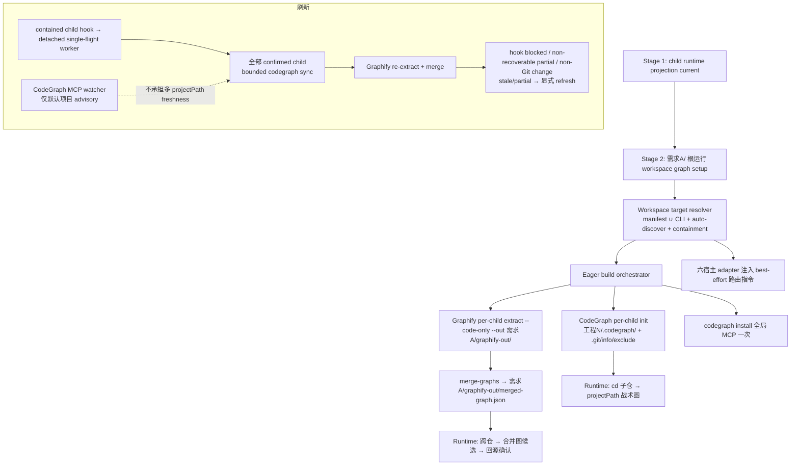
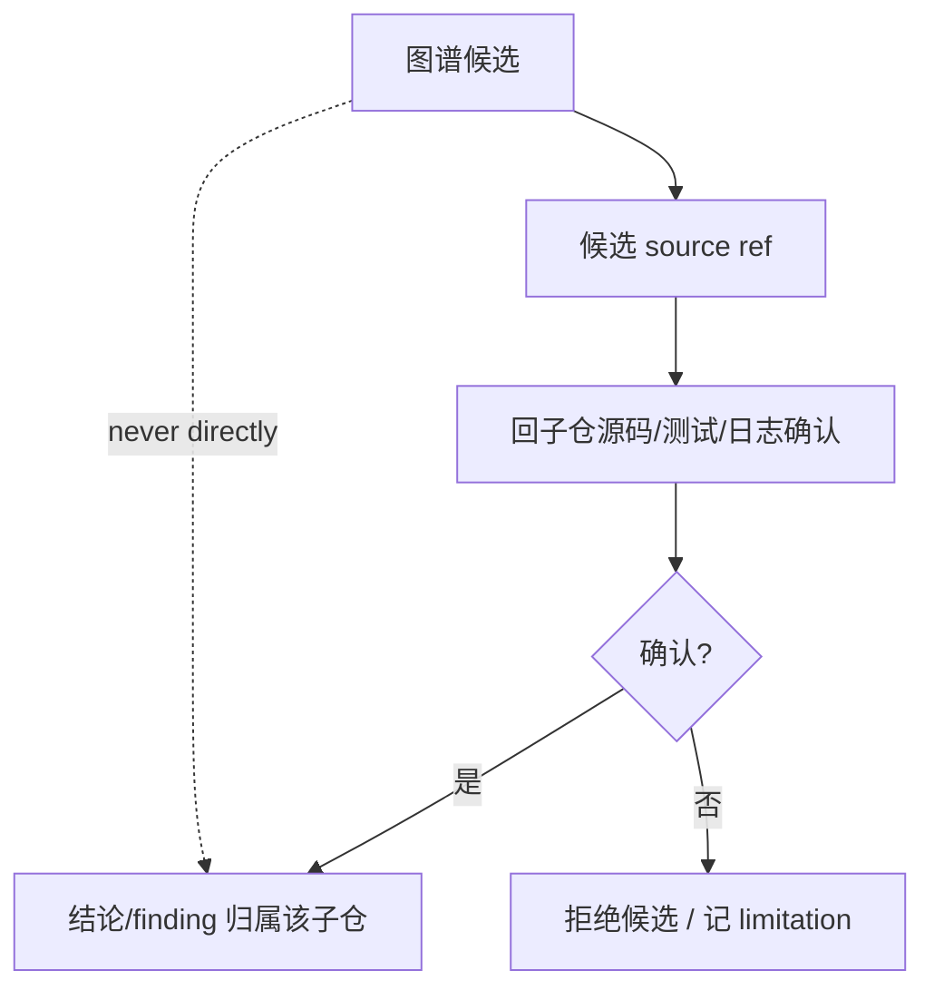
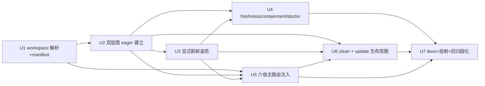

# feat: Per-Requirement Multi-Repo Workspace Two-Layer Code Graph

## Goal Capsule

- **Objective:** 让开发者在一个**非 Git 的"需求文件夹"**完成两阶段接入：先让所选宿主的 child projection current，再用一条 workspace graph 命令为每个 confirmed 子 Git 仓建 CodeGraph 战术图、为整个 workspace 建 Graphify 跨仓宏观合并图；contained child hook 异步同步全部 child CodeGraph 并重建 Graphify workspace 图，同时保留显式刷新降级；从该目录进入宿主时按 cwd best-effort 用对的图。
- **Authority:** origin 需求文档定义 WHAT(CR1-CR13);各子仓源码 / Git 状态 / 直接证据高于图谱候选;workspace 编排只拥有图 artifact 与路由权威,不获得子仓 source / finding / verification 权威。
- **Execution profile:** owner 已实测端到端链路可用(origin §4.1),**本 plan 不设可行性 gate**,而是把已验证链路固化为可重复回归验收 + 补齐产品化 source、guardrail、多宿主投射与生命周期。
- **Product Contract preservation:** CR2-CR6、CR10-CR13 的产品意图不变；CR1 按 current runtime preflight 校准为“projection current 后单一 workspace graph 命令”，CR7-CR9 按 CodeGraph 1.5.0 field evidence 校准为 spec-first hook 同步全部 confirmed CodeGraph 子仓并重建 Graphify，watcher 仅保留默认项目 advisory。

---

## Product Contract

> 完整 WHAT 见 origin。下为进入实现的 contract 摘要,CR-ID 与 origin 对齐。

### Problem Frame

每个需求 = 一个以需求命名的非 Git 父文件夹,内含多个独立 clone 的子 Git 仓(工程跨需求高度重叠,但当前版本 **per-需求 隔离、不复用**)。今天 `spec-runtime-setup` 已具备多仓 workspace 图编排，本轮关闭其自动刷新可靠性和完成证据；开发者不应逐仓手配或把父目录误当单仓。

### Requirements(CR1-CR13,carried from origin)

**A. 低摩擦批量 init**
- CR1. 首次接入分两阶段：先用 `spec-first init --all-repos` 或逐仓 `spec-first init --repo <child>` 让所选宿主 projection current；之后用一条 workspace graph 命令按 manifest 与 CLI 并集为全部 confirmed 子仓备齐 MCP + 图，免逐仓执行 provider setup。
- CR2. 自动发现补齐:扫需求文件夹发现清单外子 Git 仓作候选,轻确认防误收;发现必须 **symlink-contained**(realpath 逃逸 workspace 根即拒绝/标记)。
- CR3. init 对两种来源给出一致批量结果 + per-repo 状态(ready/partial/failed + 原因)。

**B. workspace 双层图(per-需求 隔离)**
- CR4. 每子仓建 CodeGraph `工程N/.codegraph/`;`.codegraph/` 写入该子仓 `.git/info/exclude` 保 git 干净;MCP server 全局 install 一次;跨仓查询传 `projectPath`,不建父目录单体图。
- CR5. Graphify 每子仓子图 + 需求根一张 `merge-graphs` 合并图,均写到 Provider 原生 current root `需求A/graphify-out/`(子仓物理零侵入,不写机器级 global);建图 `extract --code-only`(纯 AST、零 LLM key),合并图 = 各子仓 AST 图 union,不含社区归纳/命名。
- CR6. 两层图与产物严格 scope 在当前需求文件夹内；spec-first routing、facts 与 doctor 对 `projectPath` 做当前 workspace containment 拒绝/告警。Provider 收到显式越界 `projectPath` 时没有全局 hard query gate，跨 workspace query 仍是非目标且必须由 consumer 保守处理。

**C. 刷新与诚实降级**
- CR7. CodeGraph 1.5.0 的 `serve --mcp` watcher 只覆盖 server 默认项目；通过 `projectPath` 打开的其他 workspace 子仓不会各自启动 watcher。workspace freshness 由 spec-first contained child hook 在 lifecycle lease 内对全部 confirmed 子仓执行 bounded `codegraph sync <repo>`。
- CR8. Graphify 0.9.x 原生 hook 只重建 child 默认 output，无法可靠更新 workspace out-of-tree 子图并触发 parent merge；同一 spec-first managed `post-commit` / `post-checkout` hook 在 CodeGraph sync 后触发 detached worker，重新执行全 workspace Graphify extract + `merge-graphs`。event trigger 必须 single-flight/coalesce 且 release handoff 不丢唤醒；后台 refresh、显式 build、clean 与 status writer必须由独立 workspace lifecycle lease 串行，busy 命令在 mutation 前 fail closed。
- CR9. 可恢复的 CodeGraph sync、Graphify extract/merge 或 build source-drift partial 允许下一次 Git 事件重试；owner 确认、路由写入、runtime/hook contract 漂移、自有 hook 不可安全安装、非 Git 变更或 freshness 无法确认时，状态必须降级为 `partial` / `stale` / `explicit-only`，保留 `--workspace-graph --repos ...` 显式 refresh。不得把 watcher、hook marker、进程派发或旧成功 receipt 当作 workspace 图已 current。

**D. cwd-aware 路由**
- CR10. 从需求根进工具后按 cwd/显式 path 路由到对应子仓战术图,跨仓用合并图;路由 = 注入宿主指令 + `projectPath`(不自建 resolver),**best-effort 非确定性**;从子仓内启动或漏传 projectPath 时兜底默认用所在子仓 projectPath,doctor 应能检查 server root 有可用默认。
- CR11. 解析歧义(同名仓/嵌套 root)时询问 owner,不静默选仓。

**E. 诚实边界**
- CR12. 图输出始终 advisory;partial/stale/unmapped 空结果无否定权,重要结论回源。
- CR13. workspace/parent 只拥有编排与图 artifact 权威,不获得子仓 source/finding/verification 权威。授权的子仓 Git-metadata 写入仅有 `.git/info/exclude` 的 `.codegraph/` managed block，以及 contained hooks root 内 `post-commit` / `post-checkout` 的 spec-first managed refresh block；写目标均经 realpath + containment 校验，external/unsafe hooks root 只读探测并降级。`clean` 只幂等移除 spec-first 自写块并保留用户内容。

### Scope Boundaries

**Included:** 上述 CR1-CR13;六宿主 runtime 投射与路由注入;固化 owner-verified E2E 为回归验收。

**Deferred to Follow-Up Work:** manifest schema 的高级演化;基于真实数据的建图/查询性能优化。

**Deferred for later(carried from origin):** 跨 workspace 图复用、内容寻址缓存、软链挂载、机器级 global graph、Graphify semantic/社区层、Kiro/Qoder 的 spec-first CodeGraph adapter、`CODEGRAPH_DIR` out-of-tree。

**Outside this product's identity:** 006 那套单独扫描源码的 serving graph + freshness ledger + refresh journal 重型生命周期;让图谱拥有 scope/finding/verification 权威;改动 005/spec-work/spec-debug 等 consumer workflow;跨机器/远程托管图服务。

### Acceptance Examples

- AE1. Given 需求A 含 4 个子 Git 仓,when 从需求根运行批量 init,then 各子仓生成 `.codegraph/`(且加入其 `.git/info/exclude`)、`需求A/graphify-out/` 下生成各子图 + 一张 merged-graph,per-repo 状态齐全,子仓 `git status` 干净。
- AE2. Given manifest 缺一个仓、父目录里实际存在,when 自动发现,then 该仓作候选经轻确认后纳入;一个 symlink 指向 workspace 外的目录被拒绝/标记,不纳入。
- AE3. Given 从需求根启动工具,cd 进 工程3,when 问 工程3 内符号,then 路由 best-effort 用 工程3 的 projectPath;漏传 projectPath 时兜底默认所在子仓。
- AE4. Given 问"工程3 的 client 是否被 工程5 用",when 查合并图,then 得跨仓候选,回 工程5 源码确认后才形成结论。
- AE5. Given 在工程3完成一次真实 commit 或 checkout，when contained child hook 可安装，then Git 命令不等待 Graphify 重建，后台 worker 重新 extract workspace 子图并 merge，最终 status 记录成功且 merged graph 对应新 source snapshot；并发 commit coalesce，锁释放窗口内的最后一次触发不会丢失。
- AE6. Given 传入指向他需求(需求B)的 projectPath,when 解析,then 拒绝/告警,不跨 workspace 读。
- AE7. Given Kiro/Qoder 宿主,when init,then CodeGraph 走诚实降级(Graphify 仍覆盖),不因缺 adapter 而伪装 ready。
- AE8. Given `spec-first clean`,when 执行,then 移除 workspace 图产物 + 幂等移除 spec-first 自写的 `.git/info/exclude` 行/hook 块,不碰用户内容,并提示 CodeGraph daemon 清理动作。
- AE9. Given child 使用外部 `core.hooksPath`、hook 安装被阻断或异步 worker 失败，when 查询 workspace status，then 自动刷新能力按 repo 聚合为 partial/blocked，失败 reason code 和显式刷新命令可见，旧 merged graph 不获得 current 权威。

### Success Criteria

- SC1. 首次接入先完成 child projection，再从需求根用一条 workspace graph 命令完成“manifest/CLI confirmed 仓集 → 双层图 eager 建立 → contained child hook → 全局 MCP → 六宿主 source projection 可消费的路由资产”；子仓物理仅 `.codegraph/` 与受管 Git metadata，且工作树干净。Workspace refresh mode 明确区分 `commit-hook-spec-first-async` 与 `explicit`。
- SC2. 跨仓查询经合并图/projectPath 可达,结论回源;partial/stale/unmapped 无否定权。
- SC3. 真实 Git fixture 对自动刷新和显式降级均有可重复回归验收，记录拓扑、触发事件、worker/status、产物变化、失败与限制；不得把 hook 安装、派发成功或旧 provider 实验回执单独当作自动收敛证据。
- SC4. per-需求 artifact、discovery、routing/facts/doctor containment 与受管 Git metadata 有执行点；无 symlink 逃逸且 managed blocks 可幂等清理。Provider 显式收到越界 `projectPath` 时不宣称存在 spec-first 全局 hard gate。
- SC5. 六宿主经 `spec-first init` 从 source 投射一致;Kiro/Qoder/OpenCode 的 CodeGraph 能力按当前 adapter 事实诚实降级。

---

## Planning Contract

### Key Technical Decisions

- **KTD1 — 扩展现有基础设施,非从零。** 复用 `project-target.cjs`(`--all-repos`/`discoverChildRepos`/`non-git-folder`/`workspace-no-git-candidates`)、`init-workspace.js`(`discoverChildGitRepos`/`PARENT_ARTIFACT_AUTHORITY`)、`providers/{codegraph,graphify}.cjs`(per-project readiness/build/hook/refresh、`requirement_workspace_path`)。新增 workspace 编排层,不重写既有 target 语义。
- **KTD2 — CodeGraph per-child + 全局 MCP + projectPath。** 每子仓 `.codegraph/`(官方推荐多仓形态);`init` 无 out-of-tree,`.codegraph/` 落子仓工作树内,靠 **per-child `.git/info/exclude`** 保 git 干净——exclude 路径用 `git rev-parse --git-path info/exclude` 解析(正确处理 `.git`-as-file/worktree),写前对解析后 git-dir 目标做 containment。**不复用 `gitignore-policy.js` 的 root `.gitignore` block**(那写 tracked 文件、弄脏子仓,与本目标相悖;gitignore-policy 仅用于单项目/父目录场景)。MCP 全局 install 一次,跨仓靠 `projectPath`;不建父目录单体图。
- **KTD3 — Graphify out-of-tree + merge-graphs + code-only。** `extract --code-only --out 需求A/graphify-out/<repo>` 建子图,`merge-graphs` 合成 `需求A/graphify-out/merged-graph.json`;子仓物理零侵入;不用 `--global` 机器级单例。
- **KTD4 — per-需求 隔离、不复用。** 无跨 workspace 稳定 repo identity、无内容寻址缓存/软链、无 commit 冲突处理;同源工程在不同需求各建各的。
- **KTD5 — Manifest 与 CLI 取并集，manifest 保留身份优先。** workspace 根可选 `.spec-first/workspace.yaml` 与 CLI `--repos` 都是 confirmed 来源；resolver 先处理 manifest，同仓重复声明时保留 manifest alias/entry，CLI 只增补其他仓。自动发现只补候选并要求轻确认。清单格式使用独立 versioned schema，不扩塞现有 `provider-readiness.v2`。
- **KTD6 — A2 路由 = spec-first adapter-owned managed 资产。** 复用宿主 adapter 的 `managedRoot`/managed-block 机制,由 spec-first 写一段 best-effort 路由指令(按 cwd 传 `projectPath`、跨仓用合并图、launch-from-child 兜底),不依赖 graphify/codegraph 原生 host 段。U5 先对源码核实精确 writer(§10.5)。
- **KTD7 — 六宿主基线，unsupported CodeGraph host 诚实降级。** routing 注入覆盖 `getSupportedPlatforms()` 当前六宿主（Claude、Codex、Cursor、Kiro、OpenCode、Qoder）；不为无确认消费者新建 CodeGraph adapter，按当前 adapter/provider 事实逐宿主降级，Graphify 仍覆盖。
- **KTD8 — compose / thin-glue：一个 contained hook 协调两类 Provider refresh。** `workspace-child-hook.cjs` 只拥有 contained Git event capture 与固化 verified absolute CodeGraph/Graphify launcher，`workspace-async-refresh.cjs` 只拥有异步派发、single-flight、coalescing、失败 receipt 与显式降级；`workspace-graph-build.cjs` / executor 在 refresh-only 模式对全部 confirmed child 执行 CodeGraph sync，再调用 authoritative Graphify extract/merge runners。自有 hook 不复制 Provider 规则，也不把 watcher、marker 或 receipt 提升为 freshness truth。
- **KTD9 — release-then-handoff 关闭丢唤醒窗口。** 当前 pending 标记在 worker 退出循环到释放锁之间存在丢唤醒窗口。实现必须在释放 owned lock 后重新检查 pending；若仍有触发则重新走同一 `triggerMergedRebuildAsync` single-flight 路径。释放后新触发会自行获得 lock，释放前触发会由 handoff 接管，两者竞争仍由 exclusive lock 收敛为唯一 worker。
- **KTD10 — event lease 与 writer lifecycle lease 分责。** `graphify-out/workspace-async-refresh.lock` 只合并 Git 事件；`.spec-first/workspace-graph-lifecycle.lock` 必须在 clean 删除 `graphify-out/` 后仍存活，并覆盖 provider build、promotion、routing、hook、state、status 与 clean。async wrapper 持锁并通过内部 env 让 `setup.cjs` child 只校验 token/PID，不重复 acquire。显式 build/clean non-blocking 抢锁失败返回 `workspace-graph-lifecycle-busy`；worker 可有界等待，获得锁后复核 state enablement，clean 后不得重建。

### High-Level Technical Design

### Artifact Contracts

- `workspace.yaml`(可选,workspace 根 `.spec-first/`):`schema_version`、`repos[]`(workspace-relative path、可选 alias)、`exclusions[]`。缺失时纯 CLI + 自动发现。
- `需求A/graphify-out/<repo>/graphify-out/graph.json` 各子仓 Graphify 子图;`需求A/graphify-out/merged-graph.json` 合并图。
- `工程N/.codegraph/codegraph.db` per-child CodeGraph(子仓内,`.git/info/exclude` 忽略)。
- per-repo 批量结果 envelope:`repo_id`、`codegraph_status`、`graphify_status`、`hook_status`、`freshness`、`reason_code`、`limitations[]`、`next_action`。
- `workspace-graph-state.v3`：记录 operation、repo snapshots、CodeGraph/Graphify 状态、merge artifact、repo/merge `promotion_cleanup_pending` 与独立 cleanup reason，以及 `workspace-child-hook-contract.v2`；主 build reason 与 cleanup pending 可同时保留，pending 必须阻断 ready。hook contract 固化绝对 Node/async/setup/CodeGraph/Graphify launcher、runtime host、bundled version 与 managed-block digest。旧 v1/v2 state 或 v1 hook receipt 失效，需显式重跑 workspace build。
- workspace async receipt：event coordination 使用 `graphify-out/workspace-async-refresh.lock` / `workspace-async-refresh.pending`；writer coordination 使用 `.spec-first/workspace-graph-lifecycle.lock`；`workspace-async-refresh-status.json` 每次写入独立 `attempt_id`，是最近一次完成尝试的 confirmed-local receipt，不替代 source snapshot freshness 判定。

所有 writer 须 schema 校验、workspace-root containment、临时文件 + rename;provider 图内容与 query 输出为 `provider_untrusted` advisory,只有脚本直接观察到的 file/hash/exit code/probe 进入 confirmed facts。

### System-Wide Impact

- **Skills:** `spec-runtime-setup` 主战场（SKILL.md、setup.cjs、workspace graph lib、providers、contracts）；`using-spec-first` 可选补路由指引；spec-work/spec-debug **不改**。
- **CLI:** `spec-runtime-setup`(批量建图/hook/注入)、`spec-first init`(init-workspace 扩展)、`doctor`(分 child/workspace readiness/freshness)、`clean`(删图产物 + daemon 提示 + 幂等移除 .git/info/exclude/hook)、`update`(六宿主一致)。
- **Adapters:** `src/cli/adapters/{claude,codex,cursor,kiro,opencode,qoder}.js` + `index.js` + `platform-registry.js` 注入路由。**child `.codegraph/` 排除走 per-child `.git/info/exclude`(git-clean),不复用 `gitignore-policy.js` 的 root `.gitignore` block(该 block 写 tracked 文件,只适用于单项目/父目录);`需求A/graphify-out/` 位于非 Git 父目录,无 git 树可脏。**
- **Runtime:** source 变更经 `spec-first init` 投射六宿主,不手改 generated mirror。
- **Evidence:** 图候选进 `provider_untrusted`/advisory;结论回子仓 source/test/log。

### Sequencing

### Risks and Mitigations

| Risk | Mitigation |
|---|---|
| provider 图输出被当权威 | 全 advisory;结论回源;containment 执行点 |
| 写子仓 .git 越权/逃逸 | CR13 限定的 exclude/hook managed blocks + realpath/containment + clean 幂等 |
| 跨 workspace 串味 | projectPath 限定当前 workspace 根;发现 symlink-contained |
| CodeGraph 多 `projectPath` 子仓 stale 静默 | 不依赖默认项目 watcher；contained hook 对全部 confirmed child 执行 bounded sync，失败保持 partial reason code |
| 合并图 stale 静默 | CR8 自有 hook + status receipt；消费前仍以 source snapshot 判 freshness，CR9 显式刷新兜底 |
| 释放锁窗口丢唤醒 | release 后检查 pending 并通过同一 single-flight trigger handoff；真实竞态测试锁定 |
| 高频提交导致刷新风暴 | workspace single-flight + pending coalesce；后继触发最多补跑一轮，不并行 merge |
| 显式 build / clean 与 async worker 并发写 | 独立 lifecycle lease 覆盖全部 writer；busy 命令零 mutation fail closed；clean 后 trigger/worker 复核 state enablement |
| 成功 build 误删并发新 failure receipt | build 开始冻结 status generation；完成时用 snapshot + 原子 rename 只清同一代 |
| 六宿主注入漂移 | 从 source 经 `spec-first init` 投射；unsupported CodeGraph host 诚实降级不伪装 |
| 短命 workspace daemon 残留 | clean 清理 CodeGraph daemon |

---

## Implementation Units

### U1. Workspace target resolution + manifest + contained discovery

- **Goal:** 从非 Git 需求根解析出安全的子仓集合(清单 + CLI + 自动发现),输出稳定 per-repo identity 与批量 envelope 骨架。
- **Requirements:** CR1, CR2, CR3, CR6(containment), CR11
- **Dependencies:** 无
- **Files:** `skills/spec-runtime-setup/scripts/lib/project-target.cjs`、`skills/spec-runtime-setup/scripts/lib/workspace-target.cjs`、`skills/spec-runtime-setup/scripts/contracts/workspace-manifest.schema.json`、`skills/spec-runtime-setup/scripts/lib/path-safety.cjs`、`tests/unit/mcp-setup-workspace-target.test.js`、`tests/unit/mcp-setup-mode-target.test.js`
- **Approach:** 复用 `discoverChildRepos`/`discoverChildGitRepos` 做 depth-1 直接子目录发现；`.spec-first/workspace.yaml` 与 CLI `--repos` 取并集，manifest 先处理并在同仓重复时保留 alias/entry，CLI 只增补其他 confirmed 仓；自动发现补漏并标为需轻确认候选。canonical realpath + containment 拒绝 symlink 逃逸/越界/重复嵌套；歧义返回候选不静默选。
- **Patterns to follow:** 现有 `project-target.cjs` target 解析与 `path-safety` containment reason_code。
- **Test scenarios:**
  - Covers AE1/AE2. 清单列全 → 全部候选;清单缺一但父目录有 → 该仓作 auto-discovered 候选并标轻确认。
  - symlink 指向 workspace 外 / `..` 逃逸 / 重复嵌套 root → 拒绝或仅标记,不纳入。
  - 同名仓 / 嵌套 manifest → 返回歧义,不静默选。
  - 非 ASCII 需求文件夹名(`需求A`)解析正确。
  - 既有单项目 / `--folder` / `--all-repos` 行为不回归。
- **Verification:** workspace 解析给出确定性候选集 + per-repo id + 歧义/拒绝原因;既有 target 测试全绿。

### U2. Eager two-layer graph build orchestration

- **Goal:** 从需求根一次性 eager 建全部子仓 CodeGraph 战术图 + Graphify 子图 + workspace 合并图,写子仓 `.git/info/exclude`,全局装 CodeGraph MCP,输出 per-repo 状态。
- **Requirements:** CR1, CR3, CR4, CR5, CR13(.git 例外)
- **Dependencies:** U1
- **Files:** `skills/spec-runtime-setup/scripts/providers/codegraph.cjs`、`skills/spec-runtime-setup/scripts/providers/graphify.cjs`、`skills/spec-runtime-setup/scripts/lib/workspace-graph-build.cjs`、`skills/spec-runtime-setup/scripts/lib/workspace-provider-runners.cjs`、`skills/spec-runtime-setup/scripts/lib/workspace-graph-executor.cjs`、`skills/spec-runtime-setup/scripts/setup.cjs`、`skills/spec-runtime-setup/setup-registry.json`、`tests/unit/mcp-setup-providers.test.js`、`tests/unit/mcp-setup-workspace-graph-build.test.js`
- **Approach:** 每子仓 `codegraph init`(产物 `工程N/.codegraph/`)后向该子仓 exclude 幂等写 `.codegraph/`——exclude 路径经 `git rev-parse --git-path info/exclude` 解析(处理 `.git`-as-file/worktree/submodule),写前对**解析后 git-dir 目标**做 `assertContainedPath`;不复用 gitignore-policy root block。`codegraph install` 全局 MCP 仅一次。Graphify 每子仓 `extract --code-only --out 需求A/graphify-out/<repo>`，再 `merge-graphs` 输出 `需求A/graphify-out/merged-graph.json`;**单 child → 从单一子图产出 merged-graph(或标"无跨仓层");零 eligible child → 跳过 merge、freshness=not-applicable**。批量逐仓隔离失败,聚合不提升 partial。provider 图内容保持 provider_untrusted。
- **Patterns to follow:** 现有 provider `plan/verify/apply` 结构、`requirement_workspace_path`(Graphify 已接线)、journaled staging。
- **Test scenarios:**
  - Covers AE1. 4 子仓全量 eager 建成,各 `.codegraph/` 存在且入 `.git/info/exclude`(子仓 `git status` 干净),`需求A/graphify-out/` 有各子图 + merged-graph。
  - 单仓建图失败仅该 repo entry partial/action-required,其余 promote,聚合为 partial。
  - `.git/info/exclude` 写入幂等(重跑不重复行);exclude 路径经 `git rev-parse --git-path` 解析,`.git`-as-file(worktree/submodule)子仓正确写入而非产生 stray 文件;解析后目标逃逸 workspace → 拒绝。
  - Graphify 产物零落子仓工作树内(out-of-tree 校验)。
  - `codegraph install` 全局仅执行一次,不逐仓装。
- **Verification:** child projection current 后，从需求根一条 workspace graph 命令产出双层图与 per-repo 状态；子仓仅 `.codegraph/` 且 git 干净。

### U3. Refresh posture (bounded CodeGraph sync + reliable async Graphify rebuild)

- **Goal:** 固化“默认项目 watcher 仅 advisory，workspace hook 对全部 confirmed child 执行 bounded CodeGraph sync，再重建 Graphify”的统一 async refresh；关闭 single-flight worker 释放锁窗口的丢唤醒风险，并保留显式重建降级。
- **Requirements:** CR7, CR8, CR9
- **Dependencies:** U2
- **Files:** `skills/spec-runtime-setup/scripts/lib/workspace-refresh-contract.cjs`、`skills/spec-runtime-setup/scripts/lib/workspace-child-hook.cjs`、`skills/spec-runtime-setup/scripts/lib/workspace-async-refresh.cjs`、`skills/spec-runtime-setup/scripts/lib/workspace-graph-lifecycle-lease.cjs`、`skills/spec-runtime-setup/scripts/lib/workspace-graph-refresh.cjs`、`skills/spec-runtime-setup/scripts/lib/workspace-graph-build.cjs`、`skills/spec-runtime-setup/scripts/lib/workspace-provider-runners.cjs`、`skills/spec-runtime-setup/scripts/lib/workspace-graph-executor.cjs`、`tests/unit/mcp-setup-workspace-child-hook.test.js`、`tests/unit/mcp-setup-workspace-async-refresh.test.js`、`tests/unit/mcp-setup-workspace-lifecycle-lease.test.js`、`tests/unit/mcp-setup-workspace-graph-refresh.test.js`、`tests/integration/workspace-graph-auto-refresh.integration.test.js`
- **Approach:** `codegraph serve --mcp` 不由 setup 启动，且 watcher 只作为默认项目 advisory。Workspace build 在 contained child hooks root 安装 spec-first managed `post-commit` / `post-checkout` 块并固化两个 Provider 的绝对 launcher；hook detached 触发 refresh-only workspace build，先同步全部 confirmed CodeGraph 子仓，再重建 Graphify。event lease 负责 coalesce/release handoff，独立 lifecycle lease 串行 async/explicit/clean/status writer。只允许明确的 provider partial 被下一事件重试，owner 确认、路由和 runtime/hook contract partial 继续 fail closed。任何 watcher/hook/worker/receipt 不替代 source snapshot freshness。
- **Execution note:** 先新增可稳定复现“最后一次触发发生在循环退出到 lock release 之间”的失败测试，再修 production；随后用真实 Git fixture 验证 commit 不阻塞且 merged graph/status 最终收敛。
- **Test scenarios:**
  - Covers AE5. 真实 child commit → hook 快速返回 → detached worker 重跑 extract + merge → async status succeeded，source snapshot 与 merged artifact 收敛。
  - worker 退出循环但尚未 release 时再次 trigger → pending 在 release 后 handoff 给唯一后继 worker，不丢唤醒、不并行 merge。
  - acquire miss 与 pending 写入之间旧 worker 退出 → 当前 trigger 二次 acquire 并接管唯一后继，不遗留无人处理 pending。
  - async worker active 时显式 build/clean 在首个 mutation 前返回 lifecycle busy；clean 成功后重放旧 hook trigger 仍不生成图、hook、state 或 status。
  - 成功 build 只清除启动时观察到的旧 receipt generation；并发新 failure receipt 保留。
  - child hook 全安装、部分安装、external/unsafe blocked 分别报告 `commit-hook-spec-first-async`、partial 或 explicit fallback。
  - CodeGraph sync 失败、Graphify 仍成功 → repo/workspace 保持 `codegraph-sync-failed` / `workspace-codegraph-sync-partial`；移除故障后下一次 commit 自动重试并恢复 complete，且全程无 install/init。
  - merge 重跑失败 → 记录稳定 reason code、保留上一份合并图但 freshness 不得为 current；下一次事件或显式 refresh 可恢复。
  - setup 不启动 watcher；field journey 证明 watcher 不覆盖非默认 `projectPath` 子仓。
- **Verification:** 全 child CodeGraph sync、single-flight、coalesce、release handoff、可恢复 partial、failure receipt、hook containment 和真实 Git commit journey 全部有直接证据；source 漂移不伪造 ready。

### U4. Freshness facts, containment enforcement, and doctor reporting

- **Goal:** 分 child/workspace 报 readiness/freshness,执行 projectPath containment 与 per-需求 隔离,诚实 advisory/degraded。
- **Requirements:** CR6, CR12, CR3, CR7-CR9(facts)、CR10(doctor server-root 默认检查)
- **Dependencies:** U2, U3
- **Files:** `skills/spec-runtime-setup/scripts/lib/facts.cjs`、`src/cli/helpers/setup-facts.js`、`src/cli/commands/doctor.js`、`docs/contracts/project-graph-consumption.md`、`tests/unit/mcp-setup-facts-renderer.test.js`、`tests/unit/mcp-setup-workspace-graph-status.test.js`
- **Approach:** facts 分 child/workspace scope 表达 CodeGraph/Graphify 的 ready/partial/stale/unknown + freshness + limitations，partial/stale/unmapped 无否定权。projectPath containment 只由 spec-first facts/doctor/路由文本执行；全局 MCP server 由 Provider 拥有，显式越界 `projectPath` 没有 spec-first hard query gate。doctor 汇总各子仓 + 合并图状态、检查 CodeGraph server root 是否有可用默认 projectPath，并给出精确修复动作。
- **Test scenarios:**
  - Covers AE6. 经 spec-first routing/facts/doctor 传他需求 projectPath → 拒绝/告警；Provider direct call 只记录无全局 hard gate 的 limitation。
  - child/workspace、CodeGraph/Graphify 状态可独立审计,partial 不互相提升。
  - doctor 报告 CodeGraph server root 是否有可用默认 projectPath(CR10)。
  - 空/失败/截断结果记为 degraded/limited,不判"无影响/无仓"。
  - async refresh `in-flight` / `failed` / `succeeded` 与 source snapshot freshness 分层报告；成功 receipt 后 HEAD 再变化仍为 stale。
  - doctor 分 scope 输出 readiness/freshness + next_action;`provider-readiness.v2` 不被扩塞(workspace facts 用新 contract)。
- **Verification:** freshness/containment 有执行点与测试;doctor 分 scope 可读。

### U5. cwd-aware routing injection across six hosts

- **Goal:** 由 spec-first adapter 向六宿主注入 best-effort 路由指令，unsupported CodeGraph host 诚实降级。
- **Requirements:** CR10, CR11, CR7(usage)
- **Dependencies:** U1, U2, U3
- **Files:** `src/cli/adapters/{claude,codex,cursor,kiro,opencode,qoder}.js`、`src/cli/adapters/index.js`、`src/cli/adapters/platform-registry.js`、`skills/spec-runtime-setup/references/supported-mcp-tools.md`、`skills/using-spec-first/SKILL.md`(可选轻改)、`tests/unit/mcp-setup-workspace-routing-instruction.test.js`、`tests/integration/workspace-graph-six-host-projection.integration.test.js`
- **Approach:** 复用 `workspace-routing-inject.cjs` 与 `CANONICAL_HOSTS`，向需求根 checked-in host entry managed block 注入按 cwd/子仓传 CodeGraph `projectPath`、跨仓使用 `需求A/graphify-out/merged-graph.json`、launch-from-child 兜底和 freshness gate；unsupported CodeGraph host 不造 adapter，Graphify 仍覆盖，六宿主投射由 integration 锁步。
- **Test scenarios:**
  - Covers AE3. 注入文本引导 cd 子仓 → 对应 projectPath;漏传 projectPath 兜底所在子仓。
  - Covers AE7. unsupported CodeGraph host 报诚实降级,不因配置存在判 ready;Graphify 覆盖。
  - 六宿主 managed 资产由 spec-first 拥有、可幂等写/移除,不动无关 host 配置。
  - 路由为 best-effort 声明(非确定性 resolver),文本不宣称确定性。
- **Verification:** 六宿主注入一致、unsupported CodeGraph host 降级诚实、writer 归属 spec-first managed。

### U6. Lifecycle: clean and update

- **Goal:** `clean` 幂等移除 workspace 图产物 + spec-first 自写 `.git/info/exclude`/hook + daemon 提示；`update` 六宿主投射一致。
- **Requirements:** CR13(clean 幂等)、CR7(daemon)
- **Dependencies:** U2, U3, U5
- **Files:** `src/cli/commands/clean.js`、`src/cli/commands/update.js`、`skills/spec-runtime-setup/scripts/lib/workspace-graph-clean.cjs`、`tests/unit/cli-clean-workspace-graph.test.js`、`tests/integration/workspace-graph-lifecycle.integration.test.js`
- **Approach:** clean 先独占 `.spec-first/workspace-graph-lifecycle.lock`，busy 时零 mutation；持锁后重新读取 state/targets，再删 `需求A/graphify-out/` 图产物、幂等移除各子仓 `.git/info/exclude` 与 `post-commit` / `post-checkout` 中 spec-first managed block，并提示 CodeGraph daemon 清理动作。删除 state 后，旧 trigger/worker 的 enablement 复核把 clean 作为 tombstone，不得重新创建资产。update 保证六宿主 projection 与 `getSupportedPlatforms()` 一致。
- **Test scenarios:**
  - Covers AE8. clean 后图产物删除、`.git/info/exclude` 只余用户行、hook 块移除、daemon 清理。
  - clean 幂等(重复运行不报错、不误删);用户自写 exclude 行/hook 保留。
  - active async worker 时 clean 返回 lifecycle busy 且所有 managed 资产保持不变；worker 完成后 clean 成功，延迟旧 trigger 不得复活资产。
  - update 对六宿主投射一致,不遗漏 host。
  - clean 只移除 spec-first-managed 资产。
- **Verification:** 生命周期可逆、幂等、隔离,无机器级残留。

### U7. Docs, six-host projection, and E2E regression固化

- **Goal:** 文档化能力与边界,从 source 投射六宿主 runtime,把 owner-verified E2E 固化为可重复回归验收。
- **Requirements:** SC1-SC5;CR12-CR13(诚实表达)
- **Dependencies:** U4, U5, U6
- **Files:** `skills/spec-runtime-setup/SKILL.md`、`README.md`、`README.zh-CN.md`、`docs/contracts/project-graph-consumption.md`、`docs/validation/2026-07-31-per-requirement-workspace-graph-auto-refresh-e2e-receipt.md`、`CHANGELOG.md`、`tests/integration/workspace-graph-auto-refresh.integration.test.js`、`tests/integration/workspace-graph-six-host-projection.integration.test.js`
- **Approach:** SKILL/README 描述“两阶段首次接入 + projection current 后单一 workspace graph 命令 + 全 child CodeGraph sync + Graphify async rebuild + 显式降级 + best-effort 路由 + per-需求隔离/六宿主 source projection/code-only”，诚实标注 CodeGraph 默认项目 watcher、Graphify 原生 hook、Provider failure 与 advisory 权威边界。回归回执记录 Provider/宿主版本、workspace 拓扑、真实 Git 触发、worker/status、产物变化、失败与恢复；六宿主 source projection integration 与真实 host loader/model journey 分开报告。`spec-first init` 只在干净沙箱投射，不手改当前 runtime。
- **Execution note:** integration smoke 覆盖真实多仓 workspace(零/单/多子仓、manifest+自动发现、跨仓 query、partial、clean 回收)。
- **Test scenarios:**
  - 干净沙箱中六宿主 `spec-first init` 投射当前 source，逐宿主执行 projected `setup.cjs --help` / `--workspace-graph-status --json`；不把该 integration 表述为真实 host loader/model journey。
  - Covers AE4. 跨仓 query 经合并图得候选,回属主子仓源码确认后才形成结论(不由合并图直接定论)。
  - 真实 mixed workspace 完成 first setup → 双层图 → child commit 自动刷新 → single-child/cross-project query → source 漂移/失败降级 → 显式刷新恢复 → clean 全链路(含零/单/多子仓)。
  - README/SKILL 表达与实现一致,Kiro/Qoder 降级如实。
  - 回归回执关键 claim 可回源。
- **Verification:** 文档/投射/回归回执齐备且可回源；六宿主 source projection 一致，真实 loader/model journey 单列限制。

---

## Verification Contract

| Verification | Command / evidence | Proves |
|---|---|---|
| Runtime setup | `npm run test:mcp-setup` | provider setup/facts/host config contract + workspace 扩展 |
| Workspace target/build/refresh | `npx jest tests/unit/mcp-setup-workspace-*.test.js --runInBand` | 解析/containment/双层图/hook/single-flight/release handoff/freshness invariants |
| Provider regression | `npx jest tests/unit/mcp-setup-providers.test.js --runInBand` | 既有 CodeGraph/Graphify lifecycle 未被破坏 |
| Entrypoint/mode | `npx jest tests/unit/mcp-setup-entrypoint.test.js tests/unit/mcp-setup-mode-target.test.js --runInBand` | 既有 target/clean/update 不回归 + 新注入/生命周期 |
| Skill entry governance | `npm run lint:skill-entrypoints` | 新 prompt/reference 结构合法 |
| Syntax | `npm run typecheck` | CLI/scripts 语法合法 |
| Main unit chain | `npm run test:unit` | 全局 unit 无回归 |
| Host/runtime smoke | `npm run test:smoke` | 六宿主 init/doctor/clean 路径可用 |
| Integration | `npm run test:integration` | 真实 Git child commit 执行受管 hook并驱动 detached refresh 的多仓 workspace 全链路 |
| Package | `npm run build` | 新 assets 正确打包 |
| Diff hygiene | `git diff --check` | 无 whitespace/patch 问题 |
| E2E regression | `docs/validation/` workspace 双层图回执 | owner-verified 链路可重复,记录版本/拓扑/命令/耗时/产物/结果/限制 |

---

## Definition of Done

- D1. CR1-CR13 均由至少一个 U-ID 实现并有聚焦测试覆盖。
- D2. 首次接入先完成 child projection，再从非 Git 需求根用一条 workspace graph 命令完成 confirmed 仓集 → 双层图 eager 建立 → contained child hook → 全局 MCP + 六宿主路由资产；子仓仅 `.codegraph/` 与受管 Git metadata 且工作树干净，workspace refresh 明确区分 async 与 explicit fallback。
- D3. Graphify 子图与合并图 out-of-tree 落 `需求A/graphify-out/`,code-only;CodeGraph per-child + projectPath,不建父目录单体图。
- D4. 默认项目 watcher 的边界、spec-first 全 child CodeGraph sync 与 Graphify async rebuild 有明确触发/完成/失败/恢复语义；single-flight、并发 coalesce 和 release handoff 不丢最后一次唤醒，可恢复 provider partial 能由下一事件重试，freshness 不因 watcher/hook/receipt 被伪造。
- D5. containment/隔离有执行点：artifact/discovery/symlink 与 Git-metadata 写入为 hard containment；projectPath 由 routing/facts/doctor advisory containment，Provider direct call 不宣称全局 hard query gate；clean 幂等只删自写。
- D6. 六宿主经干净沙箱 `spec-first init` 从 source 投射一致并可执行 projected setup entrypoint、无手改当前 mirror；该证据不冒充六宿主真实 loader/model journey，unsupported CodeGraph host 诚实降级不伪装 ready。
- D7. 图输出全 advisory;partial/stale/unmapped 无否定权;重要跨仓结论回源。
- D8. README/README.zh-CN/SKILL/contracts/CHANGELOG 同步；真实 Git commit 自动刷新 E2E 回归回执落盘且关键 claim 可回源。
- D9. 005/spec-work/spec-debug 等 consumer workflow 未被本 plan 改动;复用类能力保持 deferred。
- D10. 实现期产生的废弃 schema/临时脚本/无 consumer 抽象已清理。

---

## Implementation Validation / Completion Evidence

本计划 scope 已完成：eager build、status、clean、路由、六宿主投射以及 spec-first 自有 child hook / async worker 均有 source 实现；release-then-handoff 已关闭最后一次唤醒丢失窗口，真实 Git commit journey已证明 managed hook、detached worker、全 child CodeGraph sync、merged artifact、失败回执和显式恢复链路。最终对抗复核另发现并关闭两项 artifact publication P2：并存 provider partial 不再掩盖 backup cleanup pending，rollback 恢复旧 canonical target 后的 rejected quarantine 删除失败不再被静默吞掉；主要 build reason 与 cleanup pending 作为正交 durable facts 同时保留。历史真实二进制回执只证明 provider 原子能力，本轮 controlled provider integration 只证明产品编排，两者不互相冒充。**未手改 generated runtime mirrors**；六宿主投射由干净沙箱 `spec-first init` integration 验证。

### 交付映射（U1–U7）

| Unit | Source 落点 | 主要测试 / 证据 |
|---|---|---|
| U1 target/manifest/discovery | `skills/spec-runtime-setup/scripts/lib/workspace-target.cjs` + `workspace-manifest.schema.json` | `tests/unit/mcp-setup-workspace-target.test.js` |
| U2 eager 双层图 | `workspace-graph-build.cjs` + `workspace-provider-runners.cjs` + `workspace-graph-executor.cjs` + `workspace-git-exclude.cjs`；CLI：`setup.cjs --workspace-graph` | graph-build / provider-runners / executor / entry |
| U3 刷新姿态 | `workspace-child-hook.cjs` + `workspace-async-refresh.cjs` + `workspace-graph-refresh.cjs` + state/source snapshot | child-hook / async-refresh / refresh/status unit + 真实 Git commit journey |
| U4 freshness/containment/doctor | `workspace-graph-scope.cjs` + `workspace-graph-status.cjs`；`--workspace-graph-status`；`doctor` common advisory 行 | graph-scope / graph-status / `doctor-workspace-graph` |
| U5 路由注入 | `workspace-routing-instruction.cjs` + `workspace-routing-inject.cjs`（需求根 `CLAUDE.md`/`AGENTS.md` managed block；Kiro/Qoder 降级文案） | routing-instruction / routing-inject / executor |
| U6 clean/update | `workspace-graph-clean.cjs`；`setup --workspace-graph-clean`；`spec-first clean --workspace-graph`；`update` help 明示不自动重建图 | graph-clean / cli-clean-workspace-graph / lifecycle integration |
| U7 docs/投射/E2E | SKILL/README/README.zh-CN/CHANGELOG；`project-graph-consumption.md` per-requirement 节；当前自动刷新 E2E 回执；六宿主 projection integration | `workspace-graph-six-host-projection` integration；smoke six-host path |

### 本轮完成验证

- cleanup honesty proof-first：新增 3 条组合失败回归，生产修复前 2 suites / 65 tests 中 3 tests 按目标失败；修复后 build/executor/status 聚焦为 3 suites / 94 tests passed，独立 follow-up 扩展到 build/status/clean/executor 为 4 suites / 107 tests passed。
- `npm run test:mcp-setup`：33 suites / 629 tests passed。
- `npm run test:unit`：canonical Skill inventory 稳定后最终 169 suites / 1920 tests passed；首次完整运行唯一失败为 current Skill inventory drift，按 canonical reconciliation script 刷新后聚焦 5/5 与最终全量均通过。
- `npm run test:integration`：12 suites / 44 tests passed，另 1 suite / 2 tests 因真实 Graphify 环境条件跳过；包含真实 Git auto-refresh、workspace lifecycle 与六宿主 projection。
- `npm run test:smoke`：1 suite / 5 tests passed；`npm run typecheck`：208 files；Skill lint：315 files；build：743 files；`git diff --check` passed。
- 用户授权的 3 个独立 Agent 完成 adversarial、contract/feasibility 与 role-contract/minimality follow-up；两个 P2 均关闭，最终残留 P0/P1/P2 为 0。冻结 scope 复核 `mutation_detected=false`，reviewer 未修改源码。
- 当前自动刷新回执：`docs/validation/2026-07-31-per-requirement-workspace-graph-auto-refresh-e2e-receipt.md`。
- 真实二进制 E2E 回执：`docs/validation/2026-07-13-per-requirement-workspace-graph-e2e-receipt.md`（CodeGraph 1.4.1 + Graphify 0.9.12 build；D4 hook→merge reconverge 2801→3705）。
- CE current inventory 由 canonical script 在 Skill source 稳定后刷新并复验：35 Skills / 559 files，固定上游 reconciliation 422/422 保持一致。

### 实现口径（与 plan Files 列表的有意偏差）

- **路由 writer**：写需求根 `CLAUDE.md`/`AGENTS.md` managed block，而非改各 `src/cli/adapters/*` 的 init managed 资产；六宿主仍通过入口文件族覆盖。
- **doctor**：宿主 `spec-first doctor` 增加 advisory workspace-graph 行；细节与 mutation 仍在 `--workspace-graph-status` / clean。
- **update**：不自动重建图；help 指向再跑 `--workspace-graph` 或 `clean --workspace-graph`。
- **daemon**：clean 报告清理动作，不强制 kill provider daemon。
- **Deferred 保持**：跨 workspace 复用、机器级 global graph、Kiro/Qoder CodeGraph adapter、006 重型 lifecycle —— 仍 outside。

### Remaining boundaries（非本 plan 阻塞）

- 当前自动刷新 journey 是 POSIX Git-hook integration，Windows 路径由现有脚本合同测试覆盖，未声称 Windows field journey。
- controlled provider fixture 不等于真实 Graphify/CodeGraph field outcome；真实 provider 原子能力由 2026-07-13 回执支持，CodeGraph watcher 与图输出继续是 `provider_untrusted` advisory。
- 当前 dirty worktree 不直接刷新 checked-in generated runtime mirrors；六宿主 source projection 已由干净沙箱 integration 验证。

---

## Sources & Research

- `docs/brainstorms/2026-07-13-001-per-requirement-workspace-multi-repo-graph-requirements.md` — origin(WHAT、CR1-CR13、A1-A4、已验证 E2E §4.1、实现影响面 §10)。
- `skills/spec-runtime-setup/scripts/lib/project-target.cjs` — 现有 child 发现 / non-git folder / `--all-repos`。
- `src/cli/commands/init-workspace.js` — 现有 `discoverChildGitRepos` + `PARENT_ARTIFACT_AUTHORITY`。
- `skills/spec-runtime-setup/scripts/providers/{codegraph,graphify}.cjs` — 现有 provider readiness/build/hook/refresh、`requirement_workspace_path`。
- `src/cli/adapters/{base,claude,codex,cursor,kiro,opencode,qoder}.js` — 宿主 managedRoot/managed-block 机制(A2 writer 依据)。
- `@colbymchenry/codegraph@1.5.0` source/CLI/field journey — per-project 索引 + 全局 install + `projectPath` 多仓查询；`init` 无 out-of-tree；MCP watcher 只绑定 server 默认项目，非 Git parent 的其他 `projectPath` 子仓需显式 `codegraph sync <repo>`。
- `graphifyy@0.9.29` CLI — `extract --code-only`、`--out`、`merge-graphs` 与 Provider-native child hook 边界；workspace out-of-tree merged refresh 仍由 spec-first hook 编排。
- `docs/validation/2026-07-31-per-requirement-workspace-graph-auto-refresh-e2e-receipt.md` — 当前 source、controlled provider integration 与 CodeGraph 1.5.0 field evidence。
- `docs/solutions/architecture-patterns/codegraph-graphify-capability-and-evidence-boundary.md` — Provider advisory / 证据边界 durable learning。
- `docs/contracts/project-graph-consumption.md` — candidate-only consumption / direct evidence relay。
