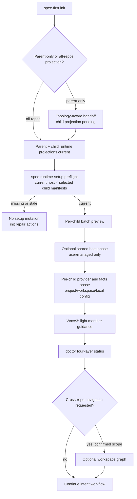
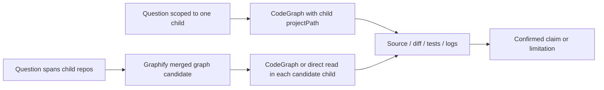

# feat: Workspace Bootstrap Scope Guidance and Projection Preflight

## Goal Capsule

- **Objective:** 让非 Git 多仓父目录中的开发者能**看清** `init`（默认 parent-only）与 `spec-runtime-setup`（默认 all-repos）的有意范围差，并在 child generated runtime projection 为 `missing`/`stale` 时 **于 mutation 前阻断** setup；批处理时在 ownership 可保留的前提下减少 user/managed host config 的重复 mutation；CodeGraph / Graphify 保持独立组件与 advisory evidence 边界。本计划统一的是**可解释路径与 confirmed gate**，不是合并三个生命周期，也不是新增「一次 bootstrap 自动装完全部」的入口。
- **Authority:** `init` 拥有 generated runtime projection；`spec-runtime-setup` 拥有 registry-managed dependency、host config 和 readiness facts；workspace graph 拥有可选导航 artifact；源码、测试、日志和用户证据仍高于所有 Provider 输出。
- **Stop conditions:** 不合并三个生命周期为中心化自动安装器；不让 runtime setup 自动调用 `init`；不让 `init` 自动安装 Provider；不引入 `--bootstrap` / sequencing 门面（本轮明确不做，见 Open Questions）；不把 external MCP startup 或图查询提升为 managed readiness / 语义完成声明。

---

## Product Contract

### Summary

在非 Git 父 workspace 中，`init` 默认仅投射父目录，而 runtime setup 默认面向所有 child repo。当前提示没有把这种有意的范围差异说明为可执行路径，导致 Provider mutation 可能先发生、child runtime projection 的缺失或过期后发现。

计划建立：**topology-aware handoff（说明差异）**、**mutation 前 projection preflight（强制差异）**、**真实 batch preview / 条件共享 host phase**、**轻量 child member 引导（可延后）** 与 **doctor 四层只读状态**。不把三工具合并成单一安装器。

### Delivery Waves

| Wave | 单元 | 交付价值 | 可独立验收 |
| --- | --- | --- | --- |
| **Wave 1（必做）** | U2 + 精简 U1 | 阻断错误时机 mutation；parent-only 结果不误报 child ready | 是 |
| **Wave 2** | U3 | 真实 per-child plan；user/managed host 条件共享一次 | 是 |
| **Wave 3（可延后）** | 瘦身 U4 + 轻量 U5 | child 内静态 member 引导；doctor 四层状态扩展 | 是；可 defer |

Problem Frame 中的窄问题（范围差未说明 + mutation 先于 projection）由 **Wave 1** 关闭。Wave 2/3 解决相邻正确性与可发现性，不得阻塞 Wave 1 合并。

### Problem Frame

开发者需要同时使用两个独立组件：CodeGraph 用于一个明确 child repo 内的符号、调用链和影响候选；Graphify 用于已确认 workspace scope 的跨仓导航候选。现有父目录 routing block 已表达该分工，但 child repo 缺少对应的轻量引导（Wave 3）。一次 setup 执行还可能混入 host 外部 MCP 的启动告警，使「managed runtime 已就绪」被误读为「所有 MCP 都健康」。

### Requirements

- **R1:** 保持 `init` 默认 parent bootstrap；在 parent-only 完成后明确 child projection **尚未覆盖**（handoff 词表：`pending` = 尚未对 selected children 做 projection；映射到 manifest health 时对应 `missing` 或未评估，**不得**声称 `current`/`ready`），并给出基于当前 topology 的下一步（通常 `init --all-repos` 或最窄 `--repo`）。
- **R2:** selected child 的 generated runtime projection 为 `missing` 或 `stale` 时，runtime setup 的 Provider / host mutation 必须在前置检查处停止，并给出最窄 `init` 修复路径。preflight 的 host set = **本次 setup 解析到的 `context.host`（单 host）**；不以 init summary 中的「全部 selected host」扩大阻断范围。init summary 缺失或无该 host 记录时，直接对当前 host 重算 manifest health。
- **R3:** parent workspace 的 batch plan 必须逐 child 产生只读 preview，不能用 parent root plan 冒充 child scope 的 preview。
- **R4:** batch apply **在 registry ownership 与 post-mutation verification 可保留时**，按 resolved host-config target scope 分相：user/managed target **进入一次**共享 host phase；project/workspace/local target **必须**在逐 child phase 以该 child repo root 执行与复核。若共享 phase 会破坏 ownership 或 verification，则降级为逐 child 执行并在 receipt 记录 `shared_host_phase=skipped` 与 reason_code。每个 child 的 completion claim 独立，失败汇总为 partial 或 action-required。
- **R5:** parent routing 保持完整 CodeGraph / Graphify 分工。child repo 获得**不复制 repo 清单**的轻量 member 引导（Wave 3）：优先静态 snippet / 复用 root routing 文案片段，**不**在本计划 Wave 1–2 引入完整 managed marker 生命周期（幂等 inject、degrade-in-place rewrite、对称 clean 的完整子系统 **defer**，见 Scope Boundaries）。若 Wave 3 选择最小 inject：仅在 projection current、**本 run selected providers 含 CodeGraph** 且 workspace membership 已确认时写入；否则跳过并返回 reason_code。membership 算法见 KTD4。
- **R6:** `doctor` 与最终手册必须分开表达 projection、managed runtime、optional workspace graph、unmanaged external MCP 四类状态；每行状态均须带 selection provenance、evidence freshness 与 reason code，历史 receipt 不得在 scope 不匹配时贡献 `ready`。v1 **不**新增独立 `workspace-readiness-status.schema.json`；扩展 doctor 既有 advisory row / facts 形状即可。
- **R7:** 当前 canonical 入口为 `spec-runtime-setup`（Claude/Qoder command 拼写 `runtime-setup`）。`spec-mcp-setup` / `mcp-setup` 兼容别名已硬切断。本计划的回归义务是：**不得**在 source、runtime projection 或文档中重新引入别名；相关断言可作为 regression guard 挂在 U1/U5 文档与入口检查中，**不**单独膨胀为新能力。

### Scope Boundaries

**Included:** parent workspace 的拓扑引导、projection preflight（单 host）、batch preview/apply 边界与条件共享 host phase、轻量 child member 引导（Wave 3，可 defer）、CodeGraph/Graphify 边界说明、doctor 四层只读状态扩展、文档和五宿主投射验证。

**Deferred to Follow-Up Work:**
- Graphify merged graph 自动增量刷新 / watch
- 跨宿主实时 external MCP health monitoring
- 长任务后台队列或通用 workflow engine
- **文档级 / CLI 级 sequencing 门面**（例如 `--bootstrap` 或「一键推荐序列」编排，且仍禁止自动跨生命周期 writer）——见 Open Questions
- **完整 member-routing managed marker 生命周期**（三层 gate 后的 degrade-in-place rewrite、独立 clean 子系统、与 workspace-graph clean 的交叉合同）——Wave 3 默认静态 snippet；完整 lifecycle 另开 follow-up
- 落地后 4 周引导效果观测与文案复盘（非本计划 DoD；见 Open Questions）

**Outside this product's identity:** 用 CodeGraph / Graphify 输出自动确认代码语义、根因、影响完整性、测试充分性或外部 MCP 修复结果。

### Acceptance Examples

- **AE1:** 父 workspace 默认执行 `init` 后，输出明确 child projection `pending`（未覆盖），并给出 `init --all-repos` 或等价最窄修复；**不**暗示 child runtime 已 ready，**不**自动进入 setup mutation。
- **AE2:** 任一 selected child 的**当前 setup host** projection 为 `missing`/`stale` 时，`spec-runtime-setup` mutation 返回 action-required 与最窄 `spec-first init --{host} --repo <child> -y`；install / host config / provider runner 未被调用。其他 host 的 stale **不**导致本次 host 的 over-block。
- **AE3:** `--plan --all-repos` 对每个 child 输出独立 plan/blocker，且文件系统、home host config、Provider artifact 零写入；入口**不得** fallthrough 到 parent root 的 `runSingleTarget` 冒充 child plan。
- **AE4:** apply 在 ownership 可保留时对 user/managed host-config 共享 phase 最多一次；project/workspace/local 按 child repo root 执行；单 child 失败为 partial。
- **AE5（Wave 3）:** child 内可见轻量 member 引导（静态或最小 inject），不复制 parent repo list；membership 未确认或 CodeGraph 不在本 run scope 时不写入误导性 CodeGraph 成功 claim。
- **AE6:** 当前 topology / host / child set 与历史 receipt 不匹配时，`doctor` 对受影响行输出 `unknown` 或 `stale` 与 reason code，不得沿用历史 `ready`。
- **AE7:** external MCP 在 doctor 中为 unmanaged / not-evaluated，不进入 ready 分母。

---

## Planning Contract

### Key Technical Decisions

- **KTD1 — 统一的是范围差的可解释性与 gate，不是安装器。** handoff 文案（U1）与 preflight（U2）共同表达 parent-only vs all-repos；writer ownership 仍三分。禁止 setup→init 自动调用。
- **KTD2 — preflight 是 setup mutation gate（单 host）。** 复用 child `generated_runtime_manifest` 与 `computeGeneratedRuntimeManifestHealth(context, repoRoot)`（绑定 `context.host`）。对 mutation mode 在 install / host config / provider runner 前产出 confirmed blocked facts。`--check`、`--plan`、`--verify-only`、project-config 不被误阻断。host set = 当前 run 的 host；init summary 仅作 advisory 旁证，summary 缺失时直盘 manifest。
- **KTD3 — batch plan 与 batch apply 是同 scope 的两种确定性表面。** `--plan --all-repos` 只聚合 child preview，不写任何 artifact。`setup.cjs` 在 parent workspace + `--plan` + multi-child 路径上**必须**走 batch plan 分支，禁止 fallthrough 到 parent `runSingleTarget`。apply 重新解析同一 selected child set。
- **KTD3a — Shared host phase contract（apply）。**
  1. **资格：** 仅 `resolveHostConfigTarget` 解析为 user/managed scope 的 target；project/workspace/local 永不进入共享 phase。
  2. **repoRoot：** 共享 phase 使用 **parent workspace root**（或 host-config 合同规定的 user-scope 路径解析根），**不**使用某一个 child 的 repo root 作为 user/managed 写入根。
  3. **顺序：** 全部 selected child 的 projection preflight 通过 → 可选共享 host phase 一次 → 再逐 child：project/workspace/local host-config → provider/facts → probe。
  4. **失败语义：** 共享 phase 失败 → 默认 **不**继续 child mutation（`shared_host_phase=failed`，整体 action-required）；除非 receipt 显式记录 `continue_children_on_shared_failure`（本计划 v1 **不**启用该开关）。单 child 失败 → partial，其他 child 继续。
  5. **receipt：** 记录 `scope`、`config_path`、`shared|per_child`、`repo_root`、`outcome`、`reason_code`。
  6. **降级：** 若无法在不破坏 ownership/verification 的前提下共享，则跳过共享 phase，逐 child 执行 user/managed（可能重复 mutation），并在 summary 提示原因。
- **KTD4 — routing 分层；Wave 3 默认静态 snippet。** 父 block 仍由 workspace graph lifecycle 管理。child member：**Wave 3 默认**在 skill/docs 或 child 可读路径提供静态「本仓 CodeGraph + 跨仓回父目录」snippet，不依赖 workspace graph build。

  **Membership 确认算法（direct-child / `--repo` / `--all-repos` 共用）：**
  1. 解析 `workspace_root`：显式 `--workspace-root <path>`（须 containment：canonical 后落在允许根下）→ 否则从 cwd 向上寻找 non-Git multi-repo requirement 父目录（既有 discovery）→ 否则 `workspace-membership-unconfirmed`。
  2. 解析 `child_root`：target 的 canonical git top-level。
  3. **direct-child 路径：** `child_root` 的 parent 目录等于 `workspace_root`，且 child 出现在 workspace discovery 的 supported child 列表中 → membership confirmed。
  4. **`--repo` 路径：** 同上；额外要求 path 在 workspace_root 之下（containment），否则 `workspace-membership-unconfirmed`。
  5. **`--all-repos` 路径：** 对 discovery 返回的每个 selected child 分别应用 (3)。
  6. 任一路径无法确认 → 不写跨仓回父引导（若做 inject），返回 `workspace-membership-unconfirmed`；**fail-closed**。

  **CodeGraph readiness：** 仅当本 run 的 selected providers **包含** CodeGraph 时要求 readiness；`--only graphify` 等场景返回 `codegraph-not-in-scope`，不得因「OR 语义」误注入 CodeGraph tactical 成功 claim。

  完整 managed marker degrade/clean 子系统 **defer**（见 Scope Boundaries）。
- **KTD5 — 统一的是带 provenance 的状态视图，而非全局 truth。** `doctor` 四类行分别读权威 receipt 或当前观察。v1 扩展既有 doctor advisory 形状，**不**新增独立 readiness schema 文件。scope 不匹配 / 缺失 / freshness 失败 → `unknown`/`stale`，不贡献 `ready`。external MCP = unmanaged / not-evaluated。
- **KTD6 — Provider capability 与证据边界不变。** CodeGraph = per-child tactical；Graphify = workspace cross-repo candidate；均为 `provider_untrusted`。

### High-Level Technical Design

### System-Wide Impact

- **Source writers:** `src/cli/commands/init-*`, `skills/spec-runtime-setup/scripts/**`, `src/cli/commands/doctor.js`；Wave 3 可能触及 routing instruction 静态资产（非完整 inject 子系统除非 follow-up 启动）。
- **Runtime projection:** generated host mirrors 仅经 `spec-first init`；不手改 mirrors。
- **Consumers:** init 用户、runtime setup 用户、doctor、downstream readiness facts 消费者。
- **Risks:** multi-host 误阻断（已用单 host 规则收敛）、shared host phase ownership 破坏（已用条件共享 + 降级）、引导认知负担（Wave 切分降低首波表面积）。

### Assumptions

- Parent-only `init` 默认保持不变；本计划改善 handoff，不改默认 scope。
- Parent batch apply 对 child 顺序执行（目标 3–5 child；10+ 再评估并发）。
- Shared host phase **only when** existing registry ownership 与 post-mutation verification 可保留（与 R4 / KTD3a 一致）。
- Member 引导（Wave 3）不声称 parent Graphify artifact 存在或 current。

### Why Wave 1 Alone Is Insufficient for Full Product Surface

Wave 1（U2 + 精简 U1）关闭 Problem Frame 窄问题。完整产品表面仍需：

- **Wave 2 / U3：** preview 真实性与 apply 冗余（user/managed 重复 mutation）。
- **Wave 3 / U4–U5：** child 内引导可见性与 doctor 四层状态可发现性。

实现与评审按 Wave 独立验收；不得因 Wave 3 未做而阻塞 Wave 1 的 `implementation-ready` 执行。

---

## Implementation Units

### U1. Add topology-aware init handoff and projection status

**Goal:** 让 `init` 的 parent-only、single-child 与 all-repos 结果准确说明当前 projection coverage 和下一步，而不是泛化推荐 runtime setup。

**Requirements:** R1, R7（regression guard）

**Wave:** 1

**Dependencies:** 无

**Files:** `src/cli/commands/init-input.js`, `src/cli/commands/init-output.js`, `src/cli/commands/init-workspace.js`, `src/cli/commands/init-args.js`, `tests/unit/init-workspace-contract.test.js`, `tests/smoke/cli-smoke.test.js`

**Approach:** 复用 existing init target、workspace summary 与 child result fields 计算 topology-specific handoff。parent-only 结果明确 child projection **pending/未覆盖**；all-repos 结果只在 child projection 成功后建议 runtime setup。词表：handoff 可用 `pending`；与 manifest health 对照表写入输出合同（`pending` ↛ `ready`/`current`）。入口文案使用 `spec-runtime-setup` canonical surface；**不**重新引入 legacy alias 作为推荐或兼容主文案。

**Execution note:** CLI / projection 语义变更；先用现有 parent-only 与 all-repos 测试刻画输出差异，再调整结果渲染。

**Patterns to follow:** `init-input.js` 的 `collectDefaultInitTarget` 与 `init-output.js` 的 workspace help / post-init output。

**Test scenarios:**

- parent-only 的默认 non-Git workspace 输出 child projection pending 与 all-repos repair action，不声称 child ready。
- explicit all-repos 的 ready / partial child summary 分别给出 runtime setup 或最窄 child repair action。
- single child 与普通 Git repo 的现有 target / help 行为不回归。
- 文档与 help 无 `spec-mcp-setup` / `mcp-setup` 推荐或兼容入口。

**Verification:** init preview 和 apply 输出可由 parent-only、single-child、all-repos 三种 target receipt 直接解释。

### U2. Build a reusable child runtime-projection preflight

**Goal:** 在 runtime setup mutation 前确定 selected child 在**当前 host** 是否具备 current generated runtime projection，并给出不扩大 scope 的修复事实。

**Requirements:** R2

**Wave:** 1

**Dependencies:** 无（可独立实施；不依赖 U1 文案变更。）

**Files:** `skills/spec-runtime-setup/scripts/lib/facts.cjs`, `skills/spec-runtime-setup/scripts/lib/runtime-executor.cjs`, 新增 `skills/spec-runtime-setup/scripts/lib/workspace-runtime-preflight.cjs`, `skills/spec-runtime-setup/scripts/setup.cjs`, `tests/unit/mcp-setup-entrypoint.test.js`, `tests/unit/mcp-setup-facts-renderer.test.js`

**Approach:** 从 selected child 的 manifest health 构造确定性 confirmed blocking fact，并附 advisory next action。对 mutation mode 在调用 install、host config 或 provider runner 前执行 gate。

**Host aggregation rule（修订）：** preflight **仅**检查本次 setup 的 `context.host`。对每个 selected child 调用 `computeGeneratedRuntimeManifestHealth`；该 host `missing`/`stale` → child blocked，`next_action` = `spec-first init --{host} --repo <child> -y`（或 summary 提供的等价最窄命令）。init summary 缺失 → 仍直盘当前 host manifest，不得因 summary 缺失而放行 mutation，也不得扫描其他 host 并 over-block。mixed current/missing/stale 时以 per-child reason 汇总；不扩大为「强制用户 init 全部 host」。read-only check、plan、verify-only 和 project-config 不被该 gate 误阻断。

**Patterns to follow:** `computeGeneratedRuntimeManifestHealth`、workspace verify summary、`reason_code` envelope。模块保持 **thin pure function**（facts in → blocked/allowed + reason + next_action out）。

**Test scenarios:**

- 两 child 中一个 missing 或 stale 时，mutation 返回 action-required，runner 未收到 install、host config、provider 或 facts write 调用。
- 全部 current 时，既有单 child 与 parent batch mutation 继续执行。
- 其他 host 的 stale **不**阻断当前 host 的 setup。
- `--verify-only` 仍可刷新 / 汇报 facts；`--check`、`--plan` 和 project-config 保持 read-only / local-only 合同。
- explicit `--repo` 只报告该 child，不扩大为 parent all-repos。

**Verification:** preflight 结果区分 projection 事实、mutation authority 与普通 direct-source fallback，不伪造 setup 完成。

### U3. Make parent batch preview real and phase batch apply

**Goal:** 让 parent workspace 的 preview 覆盖每个 child，并在 ownership 可保留时减少共享 host config 在 child 循环中的重复 mutation。

**Requirements:** R3, R4

**Wave:** 2

**Dependencies:** U2

**Files:** `skills/spec-runtime-setup/scripts/lib/mode-policy.cjs`, `skills/spec-runtime-setup/scripts/setup.cjs`, `skills/spec-runtime-setup/scripts/lib/workspace-executor.cjs`, `skills/spec-runtime-setup/scripts/lib/runtime-executor.cjs`, `skills/spec-runtime-setup/scripts/lib/host-config.cjs`, `skills/spec-runtime-setup/scripts/lib/renderer.cjs`, `tests/unit/mcp-setup-entrypoint.test.js`, `tests/unit/mcp-setup-mode-target.test.js`, `tests/unit/mcp-setup-host-config.test.js`, `tests/unit/mcp-setup-workspace-provider-runners.test.js`

**Approach:** 为 parent `--plan --all-repos` 增加真实逐 child preview envelope，禁止写 summary、facts、host config 或 Provider artifact。**入口：** `setup.cjs` / `workspace-executor` 在检测到 parent multi-child + plan 时必须进入 batch plan 路径，**禁止** fallthrough 到 parent root `runSingleTarget`。apply 按 KTD3a Shared host phase contract 执行；workspace graph 仍走独立、显式确认的 action domain。

**Execution note:** 先用零副作用 preview 测试固定行为，再重构共享 host phase；不得用后台 shell、PID 轮询或 `pkill` 编排 CLI 生命周期。

**Patterns to follow:** `runWorkspaceBatch`、`buildWorkspaceSetupSummary`、mode conflict rules 与 existing provider post-mutation probes。

**Test scenarios:**

- `--plan --all-repos` 包含每个 child 的 plan 和 blocker，且前后文件快照、home config、Provider runner 调用均无变化。
- user/managed 共享 phase 在可保留 ownership 时最多一次；否则 skipped + reason。
- project/workspace/local 对每个 selected child 按其 repo root 执行。
- 共享 phase 失败 → 不进入 child mutation（v1）。
- child phase 逐仓隔离，单 child 失败返回 partial receipt。
- plan selection、apply selection 与结果中 child identities 一致；parent root 不能被表述为 child plan。
- workspace graph flags 与 all-repos 仍保持互斥 / 既有冲突规则。

**Verification:** plan 零写入；apply receipt 可审计 shared vs per-child 与 partial 语义。

### U4. Light member guidance for child repos (Wave 3)

**Goal:** 让从 child repo 启动的 agent 获得「本仓 CodeGraph + 跨仓回父目录」的轻量引导，**不**在本计划交付完整 managed marker 生命周期。

**Requirements:** R5（瘦身）

**Wave:** 3（可 defer）

**Dependencies:** U2（soft：无 preflight 事实时仅文档级 snippet 也可先交付）

**Files:** `skills/spec-runtime-setup/scripts/lib/workspace-routing-instruction.cjs`（静态文案片段）、相关 skill/README 段落、`tests` 以文案/合同断言为主；**默认不**扩展 `workspace-routing-inject.cjs` 为完整 child marker 子系统。

**Approach:**
1. **默认：** 在 runtime-setup skill / parent routing 旁提供 **self-contained 静态 member snippet**（无 repo list、无 merged-graph 默认），供 child 会话引用；clean 对称性 = 文档删除 / 不注入则无残留。
2. **可选最小 inject（仅当实现成本可控且有明确测试）：** 复用 root inject 的 containment 与 fail-closed，写入单一 member marker；gate = projection current + CodeGraph in selected providers + membership 算法（KTD4）。失败 → 不写；**不做** provider 失败后的 degrade-in-place rewrite（该能力 defer）。
3. **明确不做（defer）：** 完整 degrade-in-place、独立 member clean 与 workspace-graph clean 交叉合同、三层 gate 的 long-running lifecycle 状态机。

**Patterns to follow:** root routing 文案边界、provider evidence boundary。

**Test scenarios:**

- 静态 snippet 不含 parent repo list / merged-graph pseudo-default。
- 若实现最小 inject：membership 未确认 / CodeGraph not-in-scope / preflight blocked → 不写入成功 claim 并返回 reason_code。
- 不实现 inject 时，上述场景由文档合同测试覆盖「不得声称已自动注入」。

**Verification:** child 会话能获得正确 component/scope 提示；未建 workspace graph 时仍可做 CodeGraph tactical；无完整 marker 生命周期假绿。

### U5. Project a unified readiness view and update public guidance

**Goal:** 将 bootstrap、managed runtime、optional graph 与 unmanaged external MCP 的边界以可操作状态呈现，并从 canonical source 投射到全部宿主。

**Requirements:** R6, R7

**Wave:** 3（可 defer；文档部分可随 Wave 1 提前）

**Dependencies:** **Hard:** U1 + U2（handoff 与 preflight 事实存在）。**Soft:** U3 / U4 — 缺失时对应 doctor 行输出 `unknown` 或省略 batch/member 细节，不得假绿。

**Files:** `src/cli/commands/doctor.js`, `src/cli/commands/init-output.js`, `skills/spec-runtime-setup/SKILL.md`, `skills/using-spec-first/SKILL.md`, `README.md`, `README.zh-CN.md`, `docs/contracts/project-graph-consumption.md`, `docs/contracts/dual-host-governance/skills-governance.json`, `tests/unit/doctor-workspace-graph.test.js`, 新增或扩展 `tests/unit/doctor-workspace-readiness.test.js`（**不**新增 `src/cli/contracts/workspace-readiness-status.schema.json`）, `tests/unit/host-runtime-projection-contracts.test.js`, `tests/integration/workspace-graph-five-host-projection.integration.test.js`, `tests/smoke/cli-smoke.test.js`, `CHANGELOG.md`

**Approach:** 在 doctor 既有 advisory row 形状上扩展四层状态：projection、managed runtime、optional workspace graph、unmanaged external MCP。每行带 selection provenance、evidence path、observed time、freshness、reason code。历史 receipt 不得在 scope 不匹配时贡献 `ready`。更新 init/runtime setup 文案说明推荐顺序：parent-only → all-repos projection → setup → optional graph。R7：确保无别名回潮（regression）。

**Patterns to follow:** workspace graph doctor advisory row、entrypoint governance、provider evidence boundary。

**Test scenarios:**

- doctor 分别显示 projection pending/missing/stale/current（词表对照一致）、managed ready、workspace graph absent/partial/ready、unmanaged not-evaluated；后者不计入 ready 分母。
- child set / host / fingerprint 不匹配时降为 stale/unknown。
- 无新 schema 文件；扩展测试断言既有 doctor 输出合同。
- 五宿主投射后无 alias 回潮与 source/runtime drift。

**Verification:** 开发者在不读实现的情况下能从 init、runtime setup 和 doctor 得到同一条推荐路径、明确 freshness 与 limitations。

---

## Verification Contract

| 验证层 | 证据 | 证明内容 |
| --- | --- | --- |
| Init targeting | `tests/unit/init-workspace-contract.test.js` 与 init smoke | parent-only / all-repos handoff 不误报 child coverage |
| Runtime preflight | `tests/unit/mcp-setup-entrypoint.test.js`、facts renderer | 单 host preflight 在 mutation 前生效；他 host stale 不 over-block |
| Batch plan/apply | mode-target、host-config、workspace provider tests | plan 零写入且无 parent fallthrough；shared phase 合同与 partial 语义 |
| Member guidance (Wave 3) | 文案/合同测试；若有最小 inject 则 inject 单元测试 | 静态或最小 inject；无完整 lifecycle 假绿 |
| Doctor and projection | doctor-workspace-graph、doctor-workspace-readiness、host projection | 四层状态、freshness 降级、无独立 readiness schema 文件 |
| Runtime setup regression | `npm run test:runtime-setup` 或 `npm run test:mcp-setup` | registry、provider、facts 与 host authority 不回归 |
| Whole package | typecheck、unit、smoke、integration、build | CLI、投射和发布包整体可信 |
| Skill semantics | fresh-source eval + `npm run lint:skill-entrypoints` | 当前磁盘 skill / prose 符合入口与边界 |

---

## Definition of Done

- D1. parent-only init、all-repos init、runtime setup 和 doctor 对 topology 与下一步的表达一致，且不改变 parent-only 默认 scope。
- D2. selected child 在**当前 setup host** 上 projection 缺失 / stale 时，runtime setup 在所有 registry-managed mutation 前给出 confirmed blocking fact 和精确修复动作。
- D3. parent batch preview 覆盖每个 child 且零写入；apply 在 ownership 可保留时 user/managed 共享 phase 不在 child 循环中重复 mutation，否则 skip 并记录 reason；project/workspace/local 逐 child 审计。
- D4. Wave 3：child 轻量 member 引导可用（静态或最小 inject）；**不**要求完整 degrade/clean marker 子系统作为本计划关闭条件。完整 lifecycle 属 follow-up。
- D5. CodeGraph、Graphify、external MCP、projection 和 semantic conclusion 的 authority 不被混淆；Provider 输出仍是 advisory。
- D6. source、README、contracts、tests、CHANGELOG 与五宿主 generated runtime expectation 同步；未手改 runtime mirrors。
- D7. `doctor` 不把 scope 不匹配、缺失或过期 receipt 提升为 ready；external MCP 保持 unmanaged / not-evaluated；**无**新增独立 readiness schema 文件。
- D8. 未引入自动调用 init / provider、bootstrap 编排门面、后台 job manager、Graphify automatic merge refresh 或新的中心化 workflow state machine。

Wave 关闭条件：Wave 1 关闭 D1–D2 中与 handoff/preflight 相关部分即可合并；Wave 2 关闭 D3；Wave 3 关闭 D4/D6/D7 中与 doctor/member 相关部分。

---

## Sources & Research

- `docs/plans/2026-07-13-001-feat-per-requirement-workspace-multi-repo-graph-plan.md`：已实现 workspace graph 的 scope、routing 与 lifecycle 边界；本计划只补齐 bootstrap / readiness / 引导闭环。
- `src/cli/commands/init-input.js`、`src/cli/commands/init-output.js`、`src/cli/commands/init-workspace.js`：parent-only 与 all-repos projection 现状和可复用 receipt。
- `skills/spec-runtime-setup/scripts/setup.cjs`、`skills/spec-runtime-setup/scripts/lib/workspace-executor.cjs`：parent batch dispatch、mutation 时机和汇总现状。
- `skills/spec-runtime-setup/scripts/lib/workspace-routing-instruction.cjs`、`workspace-routing-inject.cjs`：当前 root-only routing writer / clean contract。
- `skills/spec-runtime-setup/scripts/lib/runtime-executor.cjs`：`computeGeneratedRuntimeManifestHealth`（单 host）。
- `src/cli/commands/doctor.js`：workspace graph 的 advisory status projection。
- `docs/solutions/architecture-patterns/codegraph-graphify-capability-and-evidence-boundary.md`：两个 Provider 的独立能力与证据边界。
- `docs/solutions/workflow-issues/runtime-setup-host-authority-and-script-owned-facts-2026-07-04.md`：host authority 和 script-owned readiness facts。
- `docs/solutions/workflow-issues/host-entrypoint-mapping-source-boundary-2026-04-29.md`：入口映射的 source/runtime 边界。
- `docs/solutions/conventions/skill-publication-command-surface-alignment-2026-06-23.md`：名称迁移、投射和 fresh-source 验证要求。

---

## Deferred / Open Questions

### From 2026-07-14 review

- **Plan over-engineers a guidance problem with 5 implementation units** — Summary / Stop Conditions (P1, product-lens, confidence 75)

  Users want "my workspace is ready"; the plan delivers three tools with explicit handoff, preflight gates, phased batch apply, and a managed marker lifecycle — fragmented ownership encoded as user-facing constraints without evidence that users prefer fragmentation over a single bootstrap action.

  **2026-07-14 best-judgment resolution:** 正文改为「可解释范围差 + preflight」话术，并引入 Wave1–3 切分；完整 marker lifecycle 与 bootstrap 门面 defer。残留风险：用户仍可能期望单入口；见下条 sequencing facade。

- **Guidance itself introduces significant new cognitive load** — Goal Capsule / R1-R7 (P1, product-lens, confidence 75)

  The plan adds topology-aware handoff prose, preflight gate concepts, shared-host vs per-child phase distinctions, member-routing managed marker lifecycles, and a four-layer status taxonomy. For internal developer tooling where users "didn't choose this tool," the risk is that the guidance becomes part of the complexity problem it aims to solve and developers learn to ignore all spec-first output.

  **2026-07-14 best-judgment resolution:** Wave 1 仅暴露 handoff + preflight；U4/U5 延后且 U4 默认静态 snippet。认知负担需落地后观测（非本计划 DoD）。

### From 2026-07-14 review (best-judgment apply)

- **Whether to add a sequencing facade later** — Goal Capsule / Stop conditions (P2, product-lens + adversarial, confidence 75)

  本轮明确不做 `--bootstrap` 或跨生命周期自动编排。若 Wave 1 上线后仍有大量用户跳过 handoff 或要求「一条命令」，可单独评估**文档级 / 显式 opt-in 推荐序列**（仍禁止 setup 自动调 init、禁止合并 writer）。触发条件：dogfood 或支持渠道中重复出现「不知道下一步」且 handoff 文案无法收敛。

- **Post-ship guidance effectiveness observation** — former DoD D9 (P2, coherence, confidence 75)

  轻量观测信号：preflight gate 触发频率、开发者见到 topology-aware handoff 后是否按推荐执行 `init --all-repos`。建议计划落地后约 4 周复盘一次；**不属于**本计划 Definition of Done 关闭条件。
